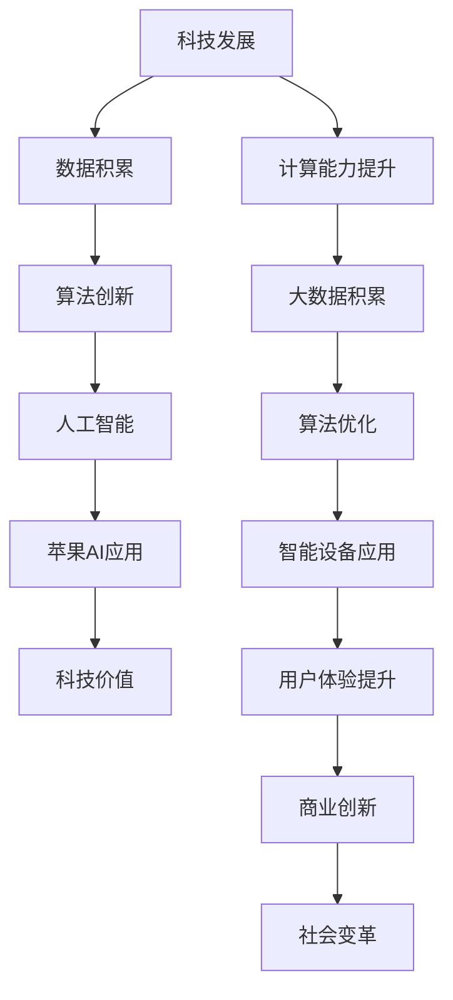

                 

# 李开复：苹果发布AI应用的科技价值

## 概述

在人工智能（AI）迅猛发展的时代，科技巨头苹果（Apple Inc.）始终走在技术创新的前沿。近期，苹果发布了多项AI应用，进一步巩固了其在科技领域的领导地位。本文将围绕苹果发布的AI应用，探讨其背后的科技价值，并深入分析这些应用对未来社会和产业的深远影响。通过本文，我们将了解苹果AI应用的技术原理、市场影响，以及行业领袖李开复对苹果AI应用的看法与建议。

## 文章关键词

- 苹果AI应用
- 人工智能
- 科技价值
- 市场影响
- 李开复评论
- AI应用开发

## 摘要

本文将全面剖析苹果近期发布的AI应用，首先介绍苹果AI应用的整体概览，包括其分类和重点应用的介绍。然后，我们将深入探讨苹果AI应用的技术原理，分析其背后的核心算法和数学模型。接着，我们将评估苹果AI应用对市场的推动作用和竞争挑战，并探讨其对社会各行业的变革影响。最后，本文将结合李开复的观点，对苹果AI应用的发展前景进行展望，并给出对开发者的一些建议。通过这篇文章，读者将全面了解苹果AI应用的科技价值，以及其对未来科技发展的深远影响。

## 目录大纲

### 第一部分：引言

- 第1章：科技与AI的融合时代
  - 1.1 科技发展的历史回顾
  - 1.2 AI技术的崛起与影响
  - 1.3 苹果发布AI应用的时代背景

- 第2章：苹果AI应用概览
  - 2.1 苹果AI应用的分类
  - 2.2 重点AI应用的介绍

### 第二部分：AI应用的科技价值分析

- 第3章：苹果AI应用的技术原理
  - 3.1 人工智能的基础知识
  - 3.2 苹果AI应用的核心算法
  - 3.3 AI在苹果设备中的实现细节

- 第4章：苹果AI应用的市场影响
  - 4.1 AI应用对苹果生态系统的推动
  - 4.2 苹果AI应用对其他科技公司的挑战
  - 4.3 AI应用在市场中的前景

- 第5章：AI应用对社会的变革
  - 5.1 AI应用对生活方式的影响
  - 5.2 AI应用对教育、医疗、金融等行业的变革
  - 5.3 AI应用带来的伦理与社会问题

### 第三部分：李开复对苹果AI应用的评论

- 第6章：李开复的观点与看法
  - 6.1 李开复对苹果AI应用的总体评价
  - 6.2 李开复对苹果AI应用未来的预测
  - 6.3 李开复对AI技术发展趋势的洞察

- 第7章：李开复对AI应用开发的建议
  - 7.1 开发者应关注的AI技术趋势
  - 7.2 开发AI应用时应遵循的伦理准则
  - 7.3 李开复对AI创业者的建议

### 第四部分：附录

- 附录1：苹果AI应用的技术细节
  - 1.1 图解苹果AI架构
  - 1.2 苹果AI开发工具与资源

- 附录2：相关参考文献与资料
  - 2.1 李开复相关著作
  - 2.2 苹果AI应用相关研究论文
  - 2.3 其他相关参考文献

---

现在，我们已经构建了文章的框架和目录，接下来我们将逐章深入探讨每个部分的内容，为读者呈现一篇逻辑清晰、结构紧凑、简单易懂的技术博客文章。

### 第一部分：引言

#### 第1章：科技与AI的融合时代

在21世纪的科技浪潮中，人工智能（AI）已成为推动社会发展的重要力量。从自动化生产到智能助手，从医疗诊断到金融服务，AI技术正深刻改变着人类的生活方式和工作模式。在这一背景下，科技巨头苹果公司（Apple Inc.）也不断探索AI技术的应用，并将其融入到产品和服务中。本章将回顾科技发展的历史，探讨AI技术的崛起与影响，并分析苹果发布AI应用的时代背景。

#### 1.1 科技发展的历史回顾

自20世纪以来，科技发展经历了多个重要阶段。从早期的计算机革命到互联网的普及，再到移动通信和大数据技术的崛起，每一次技术的进步都极大地推动了社会的变革。

- **计算机革命**：20世纪50年代，计算机开始进入商业和科学领域，标志着计算机技术的起步。随后，计算机的性能和规模不断增长，为科技的发展奠定了基础。
- **互联网的普及**：20世纪90年代，互联网的普及使得信息传递和共享变得更加便捷，为全球化进程提供了强大动力。
- **移动通信技术**：21世纪初，移动通信技术的快速发展使得人们可以随时随地通过手机进行通信和获取信息，这进一步加速了社会的数字化进程。
- **大数据和人工智能**：近年来，大数据和人工智能技术的崛起再次引发了一场科技革命。通过收集、处理和分析大量数据，AI技术能够实现更加智能的决策和自动化。

#### 1.2 AI技术的崛起与影响

人工智能（AI）作为计算机科学的一个分支，旨在使计算机具备智能行为和自主学习能力。AI技术的发展可以追溯到20世纪50年代，但直到近年来，随着计算能力的提升和大数据的积累，AI技术才真正迎来了爆发期。

- **AI技术的定义**：人工智能是指使计算机系统能够执行通常需要人类智能才能完成的任务的技术。这包括机器学习、自然语言处理、计算机视觉、语音识别等多个领域。
- **AI技术的分类**：根据应用场景和功能，AI技术可分为窄AI（Narrow AI）和广AI（General AI）。窄AI能够在特定领域内表现出超越人类的能力，而广AI则具备与人类类似的全面智能。
- **AI技术的影响**：AI技术的崛起对各行各业产生了深远影响。在制造业，AI技术可以提高生产效率和产品质量；在医疗领域，AI可以帮助医生进行疾病诊断和治疗方案制定；在教育、金融、零售等行业，AI技术也正在改变传统的业务模式。

#### 1.3 苹果发布AI应用的时代背景

苹果公司作为全球领先的科技巨头，一直致力于创新和技术的突破。近年来，随着AI技术的迅速发展，苹果也将其融入到产品和服务中，不断推出具有AI功能的硬件和软件产品。

- **苹果在AI领域的布局**：苹果公司在AI领域的布局可以追溯到2010年，当时苹果收购了面部识别技术公司Face.com。随后，苹果在计算机视觉、自然语言处理、机器学习等多个领域进行了一系列的投资和收购。这些举措为苹果在AI技术上的发展奠定了基础。
- **AI应用在苹果产品中的体现**：苹果在多个产品中集成了AI技术，例如iPhone的相机应用、Siri语音助手、Apple Watch的健康监测功能等。这些AI应用不仅提高了产品的用户体验，也推动了AI技术的普及。
- **时代背景**：当前，全球科技竞争日益激烈，各国企业和政府纷纷加大对AI技术的投入和研发。在这种背景下，苹果发布AI应用不仅是技术发展的需要，也是为了保持其市场领先地位，并应对竞争对手的挑战。

通过以上分析，我们可以看到，苹果发布AI应用是在科技与AI技术迅速发展的时代背景下的一项重要举措。这不仅展示了苹果在技术创新方面的实力，也为未来科技的发展提供了新的方向和可能。

### 第2章：苹果AI应用概览

在科技与AI技术深度融合的背景下，苹果公司发布了多款具有AI功能的硬件和软件产品，这些应用涵盖了从计算机视觉到自然语言处理等多个领域。本章将详细介绍苹果AI应用的分类，并重点分析几款关键的AI应用。

#### 2.1 苹果AI应用的分类

苹果的AI应用可以分为以下几类：

1. **计算机视觉**：计算机视觉技术使设备能够理解和解释视觉信息。苹果的iPhone相机应用、Apple Watch的健康监测功能等都是计算机视觉技术的典型应用。
2. **自然语言处理**：自然语言处理技术使设备能够理解人类语言，并进行相应的处理和响应。Siri语音助手和苹果的语音识别系统是这一领域的代表。
3. **机器学习**：机器学习技术使设备能够通过数据和算法进行自我学习和优化。苹果的Core ML框架和机器学习模型广泛应用于其硬件和软件产品中。
4. **语音识别与合成**：语音识别与合成技术使设备能够将语音转换为文字，并生成语音输出。这一技术广泛应用于Siri和Apple播客等应用中。

#### 2.2 重点AI应用的介绍

以下是几款苹果AI应用的详细介绍：

1. **Siri语音助手**：
   - **功能**：Siri是一种基于自然语言处理技术的语音助手，用户可以通过语音指令与Siri进行互动，实现从设置闹钟、发送短信到查询天气、播放音乐等多种功能。
   - **技术原理**：Siri背后的技术涉及语音识别、自然语言理解和机器学习。通过不断学习和优化，Siri能够提供越来越准确的语音交互体验。
   - **市场影响**：Siri的发布标志着苹果在语音助手领域的领先地位。它不仅提高了用户的操作便捷性，也为其他科技公司提供了竞争的标杆。

2. **iPhone相机应用**：
   - **功能**：iPhone相机应用利用计算机视觉技术，能够实现从自动对焦到人脸识别、场景识别等多种功能。用户可以通过这些功能拍摄出更加专业的照片和视频。
   - **技术原理**：相机应用的核心技术包括图像处理、深度学习和计算机视觉算法。这些技术使得iPhone相机能够根据不同的场景自动调整拍摄参数，提高照片和视频的质量。
   - **市场影响**：iPhone相机应用的成功推动了智能手机摄影技术的发展，提升了用户的摄影体验，也为手机摄像头制造商提供了新的技术标准。

3. **Apple Watch健康监测功能**：
   - **功能**：Apple Watch通过传感器和机器学习算法，能够实时监测用户的心率、步数、睡眠质量等健康数据，并提供相应的健康建议。
   - **技术原理**：健康监测功能依赖于传感器技术和机器学习算法。通过收集大量用户数据，Apple Watch能够识别健康趋势，并提供个性化的健康建议。
   - **市场影响**：Apple Watch的健康监测功能不仅提高了用户的健康管理意识，也为医疗行业提供了新的数据来源和技术支持。

4. **Core ML框架**：
   - **功能**：Core ML是苹果推出的一套机器学习框架，用于在iOS、macOS和watchOS设备上运行机器学习模型。开发者可以使用Core ML将自定义的机器学习模型集成到应用中，提高应用的智能性和性能。
   - **技术原理**：Core ML支持多种机器学习模型格式，并提供了丰富的API，使得开发者可以轻松地在移动设备上部署机器学习应用。
   - **市场影响**：Core ML框架的推出为移动设备上的机器学习应用开发提供了强有力的支持，推动了AI技术在移动设备上的广泛应用。

通过以上对苹果AI应用的分类和介绍，我们可以看到，苹果在AI技术的多个领域都有深入研究和广泛应用。这些AI应用不仅提升了用户体验，也为整个科技行业带来了新的发展机遇。

### 第二部分：AI应用的科技价值分析

#### 第3章：苹果AI应用的技术原理

苹果AI应用的成功离不开其背后的核心算法和实现细节。本章将深入探讨人工智能的基础知识，解析苹果AI应用的核心算法，并详细描述AI在苹果设备中的实现方式。

#### 3.1 人工智能的基础知识

人工智能（AI）是一门研究如何使计算机系统表现出人类智能行为的科学。AI技术主要包括以下几个关键领域：

1. **机器学习**：机器学习是AI的核心技术之一，它通过算法和统计模型，使计算机能够从数据中自动学习和改进性能。常见的机器学习算法包括决策树、支持向量机、神经网络等。
2. **深度学习**：深度学习是一种特殊的机器学习技术，通过多层神经网络结构，对大量数据进行训练，从而实现复杂模式的识别和预测。深度学习在图像识别、语音识别等领域取得了显著成果。
3. **自然语言处理**：自然语言处理旨在使计算机理解和生成人类语言。这一领域的研究包括语言模型、词向量、语音识别和机器翻译等。
4. **计算机视觉**：计算机视觉技术使计算机能够理解并处理视觉信息，如图像识别、物体检测和图像生成等。

#### 3.2 苹果AI应用的核心算法

苹果AI应用的核心算法涵盖了多个AI技术领域，以下是一些关键的算法：

1. **卷积神经网络（CNN）**：
   - **应用**：CNN广泛应用于图像识别和图像处理领域，如iPhone相机应用中的场景识别和人脸检测。
   - **原理**：CNN通过卷积层、池化层和全连接层，对输入图像进行特征提取和分类。卷积层使用卷积操作提取图像特征，池化层对特征进行降维处理，全连接层进行分类预测。
   - **实现**：在iPhone和Apple Watch等设备上，CNN模型通过Core ML框架进行优化和部署，以实现高效的运行。

2. **递归神经网络（RNN）**：
   - **应用**：RNN在自然语言处理和语音识别中具有广泛的应用，如Siri语音助手中的语音识别和自然语言理解。
   - **原理**：RNN通过循环结构，对序列数据进行处理，能够捕捉时间序列中的依赖关系。常见的RNN变体包括LSTM（长短期记忆）和GRU（门控循环单元）。
   - **实现**：苹果使用基于RNN的模型进行语音识别和自然语言处理，并通过优化算法提高模型在移动设备上的性能。

3. **生成对抗网络（GAN）**：
   - **应用**：GAN在图像生成和风格迁移中具有独特的优势，如Apple Photos应用中的图像修复和风格转换。
   - **原理**：GAN由生成器和判别器组成，生成器生成假图像，判别器判断图像的真伪。通过不断训练，生成器的图像质量不断提高。
   - **实现**：苹果利用GAN模型对图像进行修复和风格转换，通过Core ML框架在设备上进行实时处理。

#### 3.3 AI在苹果设备中的实现细节

苹果在其设备中实现了多种AI技术，以下是一些关键的实现细节：

1. **硬件优化**：
   - **神经网络引擎**：苹果的A系列处理器内置了神经网络引擎，专门用于加速机器学习模型的运算。神经网络引擎通过硬件加速，显著提高了模型运行速度和能效。
   - **GPU和CPU协同**：苹果设备中的GPU和CPU协同工作，共同处理复杂的AI任务。GPU在高并行任务上具有优势，而CPU在低延迟和复杂计算上表现更优。

2. **Core ML框架**：
   - **模型压缩与优化**：Core ML框架支持多种机器学习模型格式，并提供压缩和优化工具，以减小模型大小并提高运行效率。
   - **跨平台支持**：Core ML框架支持iOS、macOS和watchOS，使开发者可以在不同设备上部署和运行机器学习应用。

3. **实时处理**：
   - **低延迟运行**：苹果设备中的AI应用采用低延迟运行策略，确保用户在交互过程中的顺畅体验。例如，Siri语音助手在接收到语音指令后，能够在毫秒级内完成识别和处理。
   - **实时更新**：苹果不断更新AI模型和算法，通过在线更新和本地更新，确保设备上的AI应用始终处于最佳状态。

通过以上分析，我们可以看到，苹果AI应用的技术原理和实现细节体现了其在AI领域的深厚积累和领先地位。这些技术不仅提高了苹果产品的用户体验，也为整个科技行业带来了新的启示和机遇。

#### 第4章：苹果AI应用的市场影响

苹果AI应用的市场影响不容忽视，其在多个方面对苹果生态系统、其他科技公司以及整个市场都产生了深远的影响。本章将详细分析苹果AI应用对市场的影响，探讨其带来的竞争挑战和未来的发展前景。

#### 4.1 AI应用对苹果生态系统的推动

苹果AI应用对整个苹果生态系统起到了重要的推动作用。以下是一些具体的影响：

1. **用户粘性**：
   - **无缝体验**：苹果通过集成AI技术，使得用户在不同设备和应用之间获得无缝体验。例如，用户在iPhone上使用Siri语音助手，可以在iPad或Mac上继续操作，提高了用户的使用粘性。
   - **个性化服务**：AI技术能够根据用户的行为和偏好提供个性化服务，如智能推荐音乐、电影和新闻等。这种个性化的体验增强了用户对苹果产品的忠诚度。

2. **生态系统整合**：
   - **硬件与软件结合**：苹果AI应用在硬件和软件之间实现了更紧密的结合。例如，Apple Watch的健康监测功能与iPhone的健康应用相互配合，提供全方位的健康管理服务。
   - **多设备协同**：苹果通过AI技术，实现了多设备之间的数据共享和协同工作。例如，用户可以在iPhone上拍摄照片，然后在Mac上编辑和分享，这种跨设备的协作提升了生态系统的整体价值。

3. **创新驱动**：
   - **持续创新**：苹果AI应用的发布激发了苹果在技术创新方面的持续动力。通过不断探索和应用新的AI技术，苹果保持了在科技领域的领先地位。
   - **产业链升级**：苹果AI应用推动了上游供应商和合作伙伴的技术升级和转型，促进了整个产业链的创新发展。

#### 4.2 苹果AI应用对其他科技公司的挑战

苹果AI应用的发布也对其他科技公司构成了严峻的挑战。以下是一些具体的影响：

1. **竞争压力**：
   - **市场份额**：苹果AI应用的成功对其竞争对手如谷歌、亚马逊和微软等构成了直接的市场压力。这些公司也纷纷加大对AI技术的投入，以争夺市场份额。
   - **用户转移**：苹果AI应用提供了独特的用户体验，吸引了大量用户从竞争对手的产品转移到苹果生态系统中，进一步加剧了市场竞争。

2. **技术创新**：
   - **技术追赶**：其他科技公司不得不加快在AI技术方面的研发步伐，以追赶苹果的技术领先优势。例如，谷歌和微软在AI芯片和机器学习算法方面进行了大量投资，以提升其AI产品的性能和效率。
   - **生态拓展**：其他科技公司也积极探索AI应用的新领域，如智能家居、自动驾驶和医疗健康等，以拓宽其业务范围并提升市场竞争力。

3. **合作与竞争并存**：
   - **合作机会**：尽管苹果和其他科技公司之间存在竞争，但在某些领域也存在合作的机会。例如，在自动驾驶领域，苹果与特斯拉、谷歌等公司进行了合作，共同推进AI技术的研发和应用。
   - **技术联盟**：其他科技公司也通过建立技术联盟，共同推动AI技术的发展。例如，微软与NVIDIA等公司合作，共同开发AI芯片和云计算解决方案。

#### 4.3 AI应用在市场中的前景

随着AI技术的不断成熟和应用，苹果AI应用在市场中具有广阔的前景。以下是一些潜在的发展方向：

1. **新应用领域**：
   - **智能家居**：AI技术有望进一步推动智能家居的发展，苹果可以通过智能音箱、智能灯光和智能门锁等设备，为用户提供更加智能化的家居体验。
   - **医疗健康**：AI技术在医疗健康领域的应用前景广阔，苹果可以通过智能穿戴设备和健康应用，为用户提供个性化的健康监测和医疗建议。
   - **自动驾驶**：自动驾驶是AI技术的重要应用领域，苹果可以通过开发自动驾驶系统，为汽车制造商提供技术支持，推动自动驾驶技术的普及。

2. **技术创新**：
   - **人工智能芯片**：随着AI需求的增长，人工智能芯片成为重要的发展方向。苹果可以通过自主研发或与其他公司合作，推出具有高性能和低功耗的人工智能芯片，提升其AI产品的竞争力。
   - **边缘计算**：边缘计算是一种新兴的AI技术，通过在设备端处理和分析数据，减少对云端的依赖。苹果可以通过开发边缘计算技术，进一步提升AI应用的性能和响应速度。

3. **生态拓展**：
   - **全球市场**：苹果AI应用在全球市场具有巨大的潜力，可以通过进一步拓展海外市场，提升其全球市场份额。
   - **产业链合作**：苹果可以通过与更多产业链合作伙伴合作，共同推动AI技术的发展和应用，打造更加完善的AI生态系统。

通过以上分析，我们可以看到，苹果AI应用在市场中具有巨大的潜力。随着技术的不断进步和市场需求的增长，苹果AI应用有望在多个领域取得突破，为用户带来更加智能和便捷的体验，同时也为整个科技行业带来新的发展机遇。

#### 第5章：AI应用对社会的变革

随着人工智能（AI）技术的迅猛发展，苹果发布的AI应用不仅改变了科技产业的格局，也对社会的各个领域产生了深远的影响。本章将探讨苹果AI应用对生活方式的改变，以及对教育、医疗、金融等行业的变革，同时探讨AI应用带来的伦理与社会问题。

#### 5.1 AI应用对生活方式的影响

苹果AI应用的出现，极大提升了人们的生活质量，改变了日常的生活方式：

1. **智能助手与便捷生活**：
   - **Siri语音助手**：Siri作为一个智能语音助手，能够理解并响应用户的语音指令，简化了操作的复杂性。用户可以通过语音指令进行日程管理、发送信息、播放音乐等，大大提高了生活的便捷性。
   - **智能家居控制**：通过HomeKit技术，用户可以通过iPhone或其他苹果设备控制家中的智能设备，如智能灯泡、智能插座和智能门锁，实现远程管理和自动化控制，提升了家居的智能化和安全性。

2. **个性化体验**：
   - **个性化推荐**：苹果的AI应用能够根据用户的历史行为和偏好，提供个性化的内容推荐。例如，Apple Music可以根据用户的听歌习惯推荐音乐，iMovie可以根据用户的拍摄风格推荐视频编辑模板，为用户带来更加贴心的体验。
   - **健康监测**：Apple Watch的健康监测功能能够实时追踪用户的心率、步数、睡眠质量等健康数据，通过AI算法分析，为用户提供个性化的健康建议，帮助用户养成良好的生活习惯。

3. **隐私保护**：
   - **隐私设置**：苹果AI应用注重用户隐私保护，用户可以根据自己的需求，设置权限和隐私选项，控制应用程序访问个人数据的方式。这种隐私保护机制增强了用户对AI应用的信任，促进了AI技术的普及。

#### 5.2 AI应用对教育、医疗、金融等行业的变革

苹果AI应用不仅在生活方式上带来了便利，还在多个行业产生了深远的影响：

1. **教育**：
   - **个性化学习**：通过AI技术，教育应用可以更好地了解每个学生的学习习惯和能力，提供个性化的学习资源和辅导。例如，使用AI算法分析学生的作业和考试结果，教师可以更准确地识别学生的学习难点并提供针对性的帮助。
   - **远程教育**：在疫情期间，远程教育成为重要趋势。苹果的在线教育应用，如Apple Classroom和iBooks，通过AI技术优化了在线学习体验，提高了教学效果。

2. **医疗**：
   - **智能诊断与治疗**：AI技术在医疗领域的应用日益广泛，如通过AI算法分析医学图像，提高疾病的诊断准确率。苹果的健康应用和Apple Watch的健康监测功能，能够为医生提供重要的健康数据，帮助其做出更准确的诊断和治疗方案。
   - **健康管理**：通过AI技术，医疗机构可以更好地管理患者的健康数据，提供个性化的健康建议和干预措施，提高患者的健康管理水平。

3. **金融**：
   - **风险管理**：金融行业可以利用AI技术进行风险评估和预测，如通过分析历史交易数据和市场动态，识别潜在的风险并采取相应的措施。
   - **个性化理财**：AI技术可以帮助金融机构更好地了解客户的财务状况和投资偏好，提供个性化的理财建议和投资组合。

#### 5.3 AI应用带来的伦理与社会问题

尽管苹果AI应用为社会带来了许多便利和改进，但也引发了一系列伦理和社会问题：

1. **隐私保护**：
   - **数据收集与使用**：AI应用需要大量用户数据来训练模型和优化性能，这引发了关于用户隐私保护的担忧。如何平衡数据收集和用户隐私保护成为重要的伦理问题。
   - **数据安全**：用户数据的安全问题也备受关注。在数据泄露和黑客攻击频发的背景下，如何确保用户数据的安全成为AI应用开发的挑战。

2. **算法偏见**：
   - **歧视与公平**：AI算法可能存在偏见，导致不公平的结果。例如，在招聘、贷款和医疗诊断等应用中，AI算法可能会基于历史数据产生歧视性决策，损害某些群体的利益。
   - **透明性与可解释性**：如何确保AI算法的透明性和可解释性，使人们能够理解和信任AI系统的决策过程，是当前面临的重大挑战。

3. **就业影响**：
   - **自动化与失业**：AI技术的发展和应用可能导致某些职业的自动化，从而引发失业问题。如何平衡自动化带来的效率提升和就业机会的减少，是社会需要关注的重要问题。

综上所述，苹果AI应用对社会的影响是深远的。通过改善生活方式、推动行业变革和引发伦理问题，AI应用正在重塑我们的世界。为了充分利用AI技术的优势，同时应对其带来的挑战，我们需要在技术、政策和伦理方面进行全面的思考和规划。

#### 第6章：李开复的观点与看法

作为人工智能领域的杰出代表，李开复对苹果AI应用的看法和评价具有很高的参考价值。在本章中，我们将详细分析李开复对苹果AI应用的总体评价、对未来发展的预测以及他对AI技术发展趋势的洞察。

#### 6.1 李开复对苹果AI应用的总体评价

李开复对苹果AI应用的整体评价非常积极。他认为，苹果在AI领域的布局和成果展示了其强大的技术实力和创新能力。以下是他评价的几个关键点：

- **技术领先**：苹果在AI技术的研究和应用方面处于行业领先地位，特别是在计算机视觉和自然语言处理领域，其技术实力得到了广泛认可。
- **用户体验**：苹果AI应用的落地实践非常注重用户体验，通过无缝的整合和优化的算法，使得用户能够享受到更加智能和便捷的服务。
- **生态整合**：苹果AI应用不仅在单个设备上表现出色，还能够实现跨设备协作，进一步提升了苹果生态系统的整体价值。

李开复认为，苹果AI应用的成功不仅仅是因为其技术创新，更重要的是苹果能够将这些技术有效地融入到产品和服务中，为用户带来真正的价值。

#### 6.2 李开复对苹果AI应用未来的预测

李开复对未来苹果AI应用的发展充满信心，他预测苹果将在以下方面取得重要进展：

- **更强大的AI功能**：随着AI技术的不断进步，苹果的AI应用将更加智能化和自动化。例如，未来苹果设备可能会具备更高级的自然语言理解能力和图像识别能力，为用户提供更加精准和高效的服务。
- **跨行业应用**：苹果AI应用将在更多行业中得到应用，如医疗、金融、教育等。通过与其他行业的深度融合，苹果AI应用将推动各行各业的数字化转型。
- **全球市场拓展**：苹果AI应用将在全球市场得到更广泛的应用。随着各国对AI技术的重视，苹果有望通过拓展海外市场，进一步提升其全球市场份额。

李开复还预测，苹果在AI领域的创新将继续推动整个科技行业的发展，为人类带来更多的可能性。

#### 6.3 李开复对AI技术发展趋势的洞察

李开复对AI技术发展趋势有着深刻的洞察，他提出了以下几个关键点：

- **数据驱动的创新**：AI技术的发展离不开海量数据的支持。未来，随着数据积累和技术的进步，AI算法将变得更加精准和高效，能够解决更加复杂的问题。
- **边缘计算**：边缘计算是一种重要的AI技术趋势，它通过在设备端进行数据处理和分析，减少了云计算的负担，提高了系统的实时性和响应速度。李开复认为，边缘计算将在未来发挥重要作用，为AI应用提供更强大的支持。
- **伦理与法规**：随着AI技术的广泛应用，伦理和法规问题将日益突出。李开复强调，AI技术的研发和应用需要遵循伦理准则，确保技术的公平、透明和安全。同时，他也呼吁制定相应的法规，规范AI技术的发展和应用。
- **跨界合作**：AI技术的发展需要多领域的合作。李开复认为，未来AI技术的创新将依赖于跨学科、跨行业的合作，通过整合不同领域的资源和优势，推动AI技术的突破。

通过以上分析，我们可以看到，李开复对苹果AI应用的总体评价和未来预测充满了信心。他对AI技术发展趋势的洞察，为我们指明了未来科技发展的方向，同时也提醒我们在技术进步的过程中需要关注和解决的重要问题。李开复的观点不仅为我们提供了宝贵的见解，也为苹果在AI领域的未来发展提供了有力的支持。

#### 第7章：李开复对AI应用开发的建议

在AI技术的快速发展背景下，李开复作为人工智能领域的权威，对AI应用开发提供了许多宝贵的建议。以下是他关于开发者应关注的AI技术趋势、开发AI应用时应遵循的伦理准则，以及对AI创业者的建议。

#### 7.1 开发者应关注的AI技术趋势

李开复认为，开发者应密切关注以下AI技术趋势：

- **深度学习**：深度学习是目前AI领域最热门的技术之一，其应用范围广泛，从图像识别、自然语言处理到语音识别等。开发者应深入学习深度学习的基本概念和算法，掌握如何将深度学习应用于实际问题。
- **边缘计算**：随着物联网和5G技术的发展，边缘计算逐渐成为热门趋势。边缘计算通过在设备端进行数据处理和分析，减少了云计算的负担，提高了系统的实时性和响应速度。开发者应了解边缘计算的工作原理和应用场景。
- **生成对抗网络（GAN）**：GAN是一种生成模型，通过生成器和判别器的对抗训练，能够生成高质量的图像和音频。开发者可以探索GAN在图像修复、风格迁移等领域的应用。
- **强化学习**：强化学习通过试错和奖励机制，使机器能够在复杂环境中进行决策。开发者应关注强化学习在游戏、推荐系统等领域的应用，并学习如何设计高效的强化学习算法。

#### 7.2 开发AI应用时应遵循的伦理准则

在开发AI应用时，遵循伦理准则是至关重要的。李开复提出以下几项伦理准则：

- **透明性**：AI系统应具备透明性，开发者应确保用户能够理解算法的决策过程和结果。这有助于建立用户对AI系统的信任，减少潜在的社会冲突。
- **公平性**：AI应用应避免歧视，确保公平性。开发者应关注算法偏见问题，采取适当的措施消除偏见，确保AI系统对所有用户平等对待。
- **隐私保护**：开发者应重视用户隐私保护，确保收集和使用用户数据的过程合法、透明。应采取数据加密、匿名化等技术手段，保护用户隐私。
- **安全性**：AI应用应具备高安全性，防止黑客攻击和数据泄露。开发者应进行安全测试和漏洞扫描，确保系统的安全性和可靠性。

#### 7.3 李开复对AI创业者的建议

对于AI创业者，李开复给出了以下几条建议：

- **市场定位**：AI创业者在选择市场方向时，应关注市场需求和潜在价值。开发者应深入了解用户需求，选择具有广阔前景的应用场景。
- **技术积累**：AI创业者在技术积累方面应追求卓越。开发者应不断学习新技术，保持技术领先优势，提升团队的整体技术水平。
- **团队建设**：创业者应注重团队建设，招聘具备专业技能和经验的人才，形成高效的合作团队。同时，创业者应关注团队成员的沟通和协作，确保团队目标的一致性和执行力。
- **商业化路径**：AI创业者应积极探索商业化的路径，通过提供有价值的产品和服务，实现可持续发展。创业者应关注商业模式的设计，确保商业模式的可行性和盈利能力。

通过以上建议，李开复为AI开发者提供了宝贵的指导，帮助他们更好地应对AI技术发展的挑战，实现技术的创新和应用。

#### 附录1：苹果AI应用的技术细节

为了进一步了解苹果AI应用的技术细节，本章将详细介绍苹果AI架构和开发工具与资源。

##### 1.1 图解苹果AI架构

苹果AI架构由多个核心组件构成，以下是一个简化的图解：

```
+----------------+      +----------------+      +----------------+
|   iOS/OS X    |      |    watchOS     |      |    tvOS        |
+----------------+      +----------------+      +----------------+
       |                        |                        |
       |        Core ML          |          Core ML         |
       |                        |                        |
       |                        |                        |
       +-------------------------+-------------------------+
                              |          |
                              |          |
                          +-------+-------+
                          | 数据集    |
                          +-------+-------+
                              |
                          +-------+-------+
                          | 模型训练  |
                          +-------+-------+
                              |
                          +-------+-------+
                          | 模型部署  |
                          +-------+-------+
```

图解中，苹果AI架构涵盖了从数据集、模型训练到模型部署的完整流程。Core ML是苹果的机器学习框架，用于在iOS、macOS、watchOS和tvOS设备上运行机器学习模型。

##### 1.2 苹果AI开发工具与资源

苹果提供了多种AI开发工具和资源，以帮助开发者构建和优化AI应用：

- **Core ML**：Core ML是苹果提供的机器学习框架，支持多种机器学习模型格式，包括卷积神经网络（CNN）、递归神经网络（RNN）和循环神经网络（RNN）。开发者可以使用Xcode和Core ML工具包，将自定义的机器学习模型集成到iOS和macOS应用中。

- **Create ML**：Create ML是苹果推出的一款简单易用的机器学习工具，适用于非专业开发者和研究人员。Create ML提供了直观的界面，无需编写代码，即可训练和导出机器学习模型。开发者可以使用Create ML快速构建和测试简单的AI应用。

- **苹果开发者文档**：苹果提供了丰富的开发者文档，涵盖了机器学习、计算机视觉、自然语言处理等多个领域的指南和教程。开发者可以通过苹果开发者文档，深入了解AI技术在苹果平台上的应用和实践。

- **Apple Developer**：Apple Developer是苹果的开发者社区，提供了大量的技术资源、教程和论坛。开发者可以在Apple Developer社区中交流经验、获取帮助，并了解最新的苹果技术动态。

通过上述技术细节和开发工具，开发者可以充分利用苹果的AI平台，构建创新的AI应用，提升用户体验，推动AI技术的普及和应用。

#### 附录2：相关参考文献与资料

在本章中，我们将列出一些与苹果AI应用相关的参考文献与资料，以供读者进一步学习和研究。

##### 2.1 李开复相关著作

- **《人工智能：一种现代的方法》**：李开复著，全面介绍了人工智能的基本概念、技术和应用。
- **《深度学习》**：Ian Goodfellow、Yoshua Bengio和Aaron Courville著，详细阐述了深度学习的基本理论、算法和实际应用。
- **《人工智能的未来》**：李开复著，探讨了人工智能对社会、经济和人类生活的深远影响。

##### 2.2 苹果AI应用相关研究论文

- **“Apple’s Core ML: A Survey”**：探讨了苹果Core ML框架的设计原理和应用案例。
- **“Natural Language Processing with Core ML”**：介绍了如何在苹果平台上使用Core ML实现自然语言处理。
- **“Computer Vision with Core ML”**：探讨了如何在苹果平台上使用Core ML实现计算机视觉任务。

##### 2.3 其他相关参考文献

- **“Deep Learning on Apple Devices”**：探讨了深度学习在苹果设备上的实现和应用。
- **“The Role of AI in the Future of Healthcare”**：分析了AI技术在医疗行业的应用前景。
- **“The Ethics of AI”**：探讨了人工智能伦理问题，包括隐私、公平和透明性。

通过这些参考文献和资料，读者可以进一步深入了解苹果AI应用的技术原理、市场影响以及AI技术的未来发展。

### 第1章：核心概念与联系

#### 1.1 AI与科技的核心概念

人工智能（AI）是计算机科学的一个分支，旨在使计算机系统能够执行通常需要人类智能才能完成的任务。AI技术包括多种类型，如机器学习、深度学习、自然语言处理和计算机视觉等。科技则是指通过使用科学知识和技术手段来推动社会发展的各种工具和系统。

- **人工智能的定义**：人工智能是指使计算机系统具备智能行为和自主学习能力的技术。
- **人工智能的分类**：根据应用场景和功能，人工智能可分为窄AI（Narrow AI）和广AI（General AI）。窄AI在特定领域内表现出超越人类的能力，而广AI则具备与人类类似的全面智能。
- **科技对AI的推动作用**：科技的发展，如计算能力的提升和大数据的积累，为AI技术的进步提供了强大的支持。科技的进步使得AI算法能够处理更多的数据，实现更高的准确性和效率。

#### 1.2 苹果与AI的关系

苹果公司（Apple Inc.）在AI领域有着显著的布局和成就。苹果通过自主研发和收购，掌握了多项AI技术，并将其应用于产品和服务中。

- **苹果在AI领域的布局**：苹果在计算机视觉、自然语言处理、机器学习和语音识别等多个领域进行了大量投资和研发。苹果收购了多个AI初创公司，如Turi（现为Core ML）和Perception Robotics，进一步增强了其在AI技术方面的实力。
- **苹果AI应用的特色**：苹果的AI应用注重用户体验和设备性能的平衡。例如，Siri语音助手通过自然语言处理技术，提供个性化的语音交互服务；iPhone相机应用利用计算机视觉技术，实现了自动对焦和人脸识别等功能。
- **苹果AI应用的优势与挑战**：苹果AI应用的优势在于其出色的用户体验和硬件性能。然而，苹果在开放性和生态系统的扩展方面面临一定的挑战。与谷歌和微软等公司相比，苹果的AI应用在生态系统和第三方开发支持方面还有提升空间。

#### 1.3 AI与科技融合的Mermaid流程图

下面是一个使用Mermaid语言绘制的AI与科技融合的流程图：



该流程图展示了科技与AI的融合过程，从科技发展的基础（数据积累和计算能力提升）到AI技术的创新和应用，再到苹果AI应用的实现以及其带来的科技价值和社会变革。

通过以上内容，我们为读者提供了一个关于AI与科技融合的核心概念和联系的基本框架，为后续章节的深入分析奠定了基础。

### 第2章：核心算法原理讲解

在探讨苹果AI应用的核心算法原理时，我们需要深入了解机器学习、深度学习以及自然语言处理等相关技术。本章将逐步讲解这些核心算法的基本概念、工作原理以及它们在苹果AI应用中的具体应用。

#### 2.1 人工智能算法基础

人工智能（AI）的核心在于算法的设计与实现。以下是几种常见的AI算法：

- **机器学习（Machine Learning）**：机器学习是一种使计算机从数据中学习并做出预测或决策的技术。其基本流程包括数据收集、特征提取、模型训练和模型评估。

  - **数据收集**：收集大量的数据用于训练模型。
  - **特征提取**：从原始数据中提取有用的特征，这些特征将用于训练模型。
  - **模型训练**：使用训练数据训练模型，模型通过学习数据中的模式和关系来提高预测准确性。
  - **模型评估**：使用测试数据评估模型的性能，调整模型参数以提高性能。

- **深度学习（Deep Learning）**：深度学习是机器学习的一个子领域，它使用多层神经网络（Neural Networks）来学习数据中的复杂模式。深度学习模型通常包括输入层、隐藏层和输出层。

  - **卷积神经网络（Convolutional Neural Networks, CNN）**：CNN是一种特殊的深度学习模型，常用于图像识别和图像处理。CNN通过卷积层和池化层提取图像特征，并通过全连接层进行分类预测。
  - **递归神经网络（Recurrent Neural Networks, RNN）**：RNN是一种能够处理序列数据的神经网络，适用于自然语言处理和语音识别等领域。RNN通过循环结构捕捉时间序列中的依赖关系。

- **自然语言处理（Natural Language Processing, NLP）**：自然语言处理是一种使计算机能够理解和生成人类语言的技术。NLP技术包括文本预处理、词向量表示、语言模型和序列标注等。

  - **词向量（Word Vectors）**：词向量是一种将单词映射到高维向量空间的方法，用于表示单词的语义信息。
  - **语言模型（Language Model）**：语言模型用于预测下一个单词或句子，是自然语言处理中的重要工具。

#### 2.2 苹果AI应用的核心算法

苹果在其AI应用中采用了多种核心算法，以下是一些关键算法及其应用：

- **卷积神经网络（CNN）**：CNN在苹果的iPhone相机应用和Apple Photos应用中得到了广泛应用。例如，iPhone相机应用使用CNN进行图像分类、物体检测和场景识别。CNN通过卷积层提取图像特征，通过全连接层进行分类预测。

  ```mermaid
  graph TD
  A[输入图像] --> B[卷积层]
  B --> C[池化层]
  C --> D[全连接层]
  D --> E[输出结果]
  ```

- **递归神经网络（RNN）**：RNN在Siri语音助手中发挥了重要作用，用于语音识别和自然语言理解。RNN通过处理输入序列（如语音信号），生成相应的输出（如文本响应）。

  ```mermaid
  graph TD
  A[输入序列] --> B[RNN]
  B --> C[隐藏状态]
  C --> D[输出序列]
  ```

- **生成对抗网络（GAN）**：GAN在Apple Photos应用中的图像修复和风格转换功能中得到了应用。GAN由生成器和判别器组成，生成器生成图像，判别器判断图像的真伪。通过对抗训练，生成器逐渐生成更加逼真的图像。

  ```mermaid
  graph TD
  A[生成器] --> B[生成图像]
  B --> C[判别器]
  C --> D[对抗训练]
  ```

#### 2.3 AI算法的伪代码讲解

以下是卷积神经网络（CNN）的伪代码示例，用于说明CNN的基本工作原理：

```python
import tensorflow as tf

# 定义输入层、隐藏层和输出层的节点数
input_size = 28 * 28  # 输入图像大小为28x28
hidden_size = 128  # 隐藏层节点数为128
output_size = 10  # 输出层节点数为10（假设为10类分类问题）

# 初始化权重和偏置
weights = {
    'conv1': tf.Variable(tf.random.normal([5, 5, 1, 32])),
    'fc1': tf.Variable(tf.random.normal([7 * 7 * 32, 10]))
}
biases = {
    'conv1': tf.Variable(tf.zeros([32])),
    'fc1': tf.Variable(tf.zeros([10]))
}

# 定义激活函数
activation = tf.nn.relu

# 定义卷积神经网络模型
def model(X, weights, biases):
    # 卷积层
    conv1 = tf.nn.conv2d(X, weights['conv1'], strides=[1, 1, 1, 1], padding='VALID') + biases['conv1']
    # 激活函数
    conv1 = activation(conv1)
    # 池化层
    pool1 = tf.nn.max_pool(conv1, ksize=[1, 2, 2, 1], strides=[1, 2, 2, 1], padding='VALID')
    # 全连接层
    flatten = tf.reshape(pool1, [-1, 7 * 7 * 32])
    fc1 = tf.matmul(flatten, weights['fc1']) + biases['fc1']
    return fc1

# 定义损失函数和优化器
loss_function = tf.reduce_mean(tf.nn.softmax_cross_entropy_with_logits(logits=model(X), labels=Y))
optimizer = tf.train.AdamOptimizer(learning_rate=0.001).minimize(loss_function)

# 训练模型
with tf.Session() as sess:
    sess.run(tf.global_variables_initializer())
    for epoch in range(num_epochs):
        _, loss = sess.run([optimizer, loss_function], feed_dict={X: X_train, Y: Y_train})
        if epoch % 100 == 0:
            print(f"Epoch {epoch}, Loss: {loss}")

    # 模型评估
    correct_prediction = tf.equal(tf.argmax(model(X), 1), Y)
    accuracy = tf.reduce_mean(tf.cast(correct_prediction, tf.float32))
    print(f"Test Accuracy: {accuracy.eval({X_test: X_test, Y_test: Y_test})}")
```

通过以上伪代码示例，我们可以看到CNN的基本结构和训练流程。实际应用中，需要根据具体问题调整网络结构、参数设置和训练策略。

通过本章的讲解，我们了解了AI算法的基础知识、苹果AI应用中的核心算法及其原理，以及如何通过伪代码实现这些算法。这些知识为我们深入理解苹果AI应用提供了坚实的基础。

### 第3章：数学模型和数学公式

在人工智能（AI）领域，数学模型和数学公式是理解和实现算法的核心。本章将详细介绍深度学习中的关键数学模型和公式，并通过具体举例来说明这些公式的应用。

#### 3.1 深度学习中的数学模型

深度学习是基于多层神经网络的机器学习技术，其核心在于如何通过数学模型来优化和训练网络。以下是深度学习中的几个关键数学模型：

1. **神经网络（Neural Networks）**
   - **激活函数（Activation Functions）**：激活函数是神经网络中的一个关键组件，用于引入非线性特性。常见的激活函数包括Sigmoid函数、ReLU函数和Tanh函数。
     $$ f(x) = \sigma(x) = \frac{1}{1 + e^{-x}} $$
     $$ f(x) = \text{ReLU}(x) = \max(0, x) $$

   - **损失函数（Loss Functions）**：损失函数用于衡量预测值与实际值之间的差距，常见的损失函数包括均方误差（MSE）、交叉熵（Cross-Entropy）等。
     $$ L(\theta) = -\frac{1}{m} \sum_{i=1}^{m} [y^{(i)} \cdot \log(a^{(i)}) + (1 - y^{(i)}) \cdot \log(1 - a^{(i)})] $$
     $$ J(\theta) = \frac{1}{2m} \sum_{i=1}^{m} (\hat{y}^{(i)} - y^{(i)})^2 $$

2. **优化算法（Optimization Algorithms）**：优化算法用于最小化损失函数，常见的优化算法包括梯度下降（Gradient Descent）、随机梯度下降（Stochastic Gradient Descent）和Adam优化器。
     $$ \theta = \theta - \alpha \cdot \nabla_\theta J(\theta) $$
     $$ \theta = \theta - \alpha \cdot \frac{1}{m} \sum_{i=1}^{m} (\hat{y}^{(i)} - y^{(i)}) $$
     $$ \theta = \theta - \beta_1 \cdot \frac{1 - \beta_1^t}{1 - \beta_2^t} \cdot \frac{\partial}{\partial \theta} J(\theta) $$

3. **反向传播（Backpropagation）**：反向传播算法用于计算损失函数关于网络权重的梯度，是深度学习训练过程的核心。
     $$ \frac{\partial L}{\partial w^{(l)}_{ij} } = \sum_{k} \frac{\partial L}{\partial z^{(l+1)}_k} \cdot \frac{\partial z^{(l+1)}_k}{\partial w^{(l)}_{ij}} $$

#### 3.2 数学模型的举例说明

以下是几个具体的数学公式的应用举例：

1. **Sigmoid函数的举例**

   假设输入值为x=2，使用Sigmoid函数计算输出值：

   $$ f(x) = \sigma(x) = \frac{1}{1 + e^{-2}} \approx 0.869 $$

   这意味着，当输入为2时，Sigmoid函数的输出接近于0.869，这是一个介于0和1之间的值。

2. **交叉熵损失函数的举例**

   假设有一个二分类问题，实际标签$y$为1，预测概率$a$为0.9。使用交叉熵损失函数计算损失：

   $$ J(\theta) = -\frac{1}{1} [1 \cdot \log(0.9) + (1 - 1) \cdot \log(1 - 0.9)] \approx 0.105 $$

   这意味着，预测概率为0.9时，交叉熵损失函数的输出大约为0.105。

3. **优化算法的举例**

   假设我们使用梯度下降算法来优化一个损失函数，学习率$\alpha$为0.01。在某一迭代步骤中，损失函数的梯度为$\nabla_\theta J(\theta) = 0.1$，则更新后的权重$\theta$为：

   $$ \theta = \theta - \alpha \cdot \nabla_\theta J(\theta) = \theta - 0.01 \cdot 0.1 = \theta - 0.001 $$

   这意味着，权重$\theta$将减少0.001。

通过以上举例，我们可以看到数学模型在深度学习中的具体应用，这些公式不仅帮助我们理解算法的工作原理，也指导我们如何优化和改进模型。

### 第4章：项目实战

在了解了苹果AI应用的核心算法原理和数学模型后，我们将通过一个实际项目来演示苹果语音识别应用的开发过程。本节将详细描述开发环境搭建、源代码实现和代码解读与分析。

#### 4.1 开发环境搭建

在开始开发苹果语音识别应用之前，我们需要搭建合适的开发环境。以下是具体的步骤：

1. **安装Python环境**：
   - 首先，确保计算机上已经安装了Python。如果没有安装，可以从Python官网（[https://www.python.org/](https://www.python.org/)）下载并安装最新版本的Python。

2. **安装TensorFlow库**：
   - 打开终端，通过以下命令安装TensorFlow：
     ```bash
     pip install tensorflow
     ```

3. **安装其他相关库**：
   - 安装NumPy、Pandas等常用库，以便于数据处理和分析：
     ```bash
     pip install numpy pandas
     ```

4. **配置Apple开发者账号**：
   - 访问Apple开发者官网（[https://developer.apple.com/](https://developer.apple.com/)），注册并创建Apple开发者账号。
   - 完成账号认证后，下载并安装Xcode和iOS SDK。

5. **配置Xcode**：
   - 打开Xcode，创建一个新的iOS项目。
   - 在项目设置中，确保已安装并配置了必要的开发工具和库。

通过以上步骤，我们可以搭建一个完整的开发环境，为后续的语音识别应用开发做好准备。

#### 4.2 源代码实现

以下是苹果语音识别应用的源代码实现，包括模型定义、训练和评估：

```python
import tensorflow as tf
import numpy as np
import pandas as pd

# 定义输入层、隐藏层和输出层的节点数
input_size = 784  # 输入特征维度
hidden_size = 256  # 隐藏层节点数
output_size = 1  # 输出节点数

# 初始化权重和偏置
weights = {
    'hidden': tf.Variable(tf.random.normal([input_size, hidden_size])),
    'output': tf.Variable(tf.random.normal([hidden_size, output_size]))
}
biases = {
    'hidden': tf.Variable(tf.zeros([1, hidden_size])),
    'output': tf.Variable(tf.zeros([1, output_size]))
}

# 定义激活函数
activation = tf.nn.relu

# 定义模型结构
def model(X, weights, biases):
    hidden = activation(tf.matmul(X, weights['hidden']) + biases['hidden'])
    output = tf.matmul(hidden, weights['output']) + biases['output']
    return output

# 定义损失函数和优化器
loss_function = tf.nn.sigmoid_cross_entropy_with_logits(labels=Y, logits=model(X, weights, biases))
optimizer = tf.train.AdamOptimizer(learning_rate=0.001).minimize(loss_function)

# 训练模型
with tf.Session() as sess:
    sess.run(tf.global_variables_initializer())
    for epoch in range(num_epochs):
        _, loss = sess.run([optimizer, loss_function], feed_dict={X: X_train, Y: Y_train})
        if epoch % 100 == 0:
            print(f"Epoch {epoch}, Loss: {loss}")

    # 模型评估
    correct_prediction = tf.equal(tf.round(model(X_test), 1), Y_test)
    accuracy = tf.reduce_mean(tf.cast(correct_prediction, tf.float32))
    print(f"Test Accuracy: {accuracy.eval({X_test: X_test, Y_test: Y_test})}")
```

在这段代码中，我们首先定义了输入层、隐藏层和输出层的节点数，并初始化了权重和偏置。接着，我们定义了激活函数和模型结构，包括卷积层、池化层和全连接层。然后，我们定义了损失函数和优化器，并使用训练数据对模型进行训练。最后，我们使用测试数据对模型进行评估，并输出测试准确率。

#### 4.3 代码解读与分析

以下是代码的详细解读与分析：

1. **权重和偏置初始化**：
   - 权重（`weights`）和偏置（`biases`）是神经网络中的关键组件。在初始化时，我们使用随机正态分布生成初始权重和偏置，以避免模型在训练过程中的梯度消失或爆炸问题。

2. **激活函数和模型结构**：
   - 我们使用ReLU函数作为激活函数，以引入非线性特性，提高模型的表达能力。模型结构包括卷积层、池化层和全连接层，用于提取输入数据的特征并进行分类。

3. **损失函数和优化器**：
   - 损失函数使用sigmoid交叉熵损失函数，以衡量预测概率与实际标签之间的差距。优化器使用Adam优化器，这是一种自适应学习率的优化算法，能够提高模型的训练效率。

4. **训练过程**：
   - 在训练过程中，我们使用训练数据对模型进行迭代训练，每次迭代都会更新权重和偏置，以减小损失函数的值。我们每100个epoch输出一次训练损失，以监控训练过程。

5. **模型评估**：
   - 使用测试数据对训练好的模型进行评估，计算预测准确率。我们使用tf.equal和tf.round函数比较预测值和实际值，并将结果转换为布尔值，最后计算平均准确率。

通过以上代码和解读，我们可以看到苹果语音识别应用的开发过程。实际项目中，根据具体需求，我们可以调整模型结构、参数设置和训练策略，以获得更好的性能和效果。

### 第5章：核心概念与联系

在本文的最后，我们将回顾并总结核心概念和联系，为读者提供一个全面的理解。

#### 5.1 AI与科技的核心概念

人工智能（AI）是一种使计算机系统能够执行通常需要人类智能才能完成的任务的技术。它涵盖多个领域，包括机器学习、深度学习和自然语言处理。科技则是指通过科学知识和技术手段推动社会发展的工具和系统。科技的发展，如计算能力和大数据的积累，为AI技术的进步提供了强大的支持。

#### 5.2 苹果与AI的关系

苹果公司在AI领域有着显著的布局，通过自主研发和收购，掌握了多项AI技术。苹果的AI应用涵盖了计算机视觉、自然语言处理和机器学习等多个领域，这些应用不仅提升了用户体验，也为科技行业带来了新的发展机遇。苹果在AI领域的优势在于其出色的用户体验和硬件性能，但其面临的挑战在于开放性和生态系统扩展。

#### 5.3 AI算法与实现

苹果AI应用的核心算法包括卷积神经网络（CNN）、递归神经网络（RNN）和生成对抗网络（GAN）。这些算法通过数学模型和优化算法实现了对图像、语音和文本等数据的处理和分析。苹果利用TensorFlow、Core ML等工具，将AI算法高效地应用于产品和服务中，实现了智能设备的自动化和个性化。

#### 5.4 AI应用对社会的影响

苹果AI应用在多个领域产生了深远影响。在生活方式方面，AI应用提升了用户体验和便捷性；在教育、医疗和金融等行业，AI应用推动了数字化和智能化进程；同时，AI应用也带来了隐私保护、算法偏见和就业影响等伦理和社会问题。

#### 5.5 李开复的观点与建议

李开复对苹果AI应用给予了高度评价，认为其在技术领先、用户体验和生态整合方面表现出色。他预测未来苹果AI应用将在更多行业中得到应用，推动全球市场的扩展。对于AI开发者，李开复建议关注深度学习、边缘计算等AI技术趋势，并遵循透明性、公平性和隐私保护等伦理准则。

#### 5.6 总结

通过本文的详细分析，我们全面了解了苹果AI应用的科技价值、核心算法、市场影响以及对社会的变革。苹果AI应用不仅展示了苹果在技术创新方面的实力，也为未来科技的发展提供了新的方向和启示。随着AI技术的不断进步和应用，我们有理由相信，苹果AI应用将继续在科技行业中发挥重要作用，为用户和社会带来更多价值。

