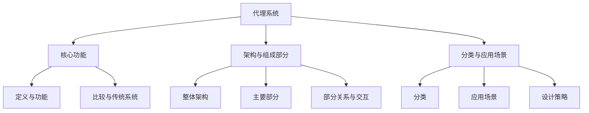

                 

## 《构建复杂应用的代理系统 Agents》

### 关键词：代理系统、智能代理、强化学习、深度强化学习、物联网、智能交通、智能医疗、系统优化、性能评估

### 摘要

本文深入探讨构建复杂应用的代理系统（Agents）的设计与实现，涵盖了从基本概念、架构设计到核心算法原理、开发实现、性能优化以及高级应用场景的全面介绍。通过详细的流程图、伪代码和实际项目案例，本文旨在为读者提供一个系统而详尽的指导，帮助开发者理解并掌握构建代理系统的核心技术和方法，从而在复杂的业务场景中实现高效的应用。

---

### 第一部分：构建复杂应用的代理系统基础

#### 第1章：代理系统的基本概念与架构

##### 1.1 代理系统的定义与核心功能

代理系统（Agent-based Systems）是一种以代理（Agent）为核心的计算模型。代理是一种能够感知环境、自主执行行为并具有目标导向性的计算实体。在复杂应用中，代理系统通过多个智能代理的协同工作，实现复杂的任务和目标。

- **代理系统简介**：
  - 代理的定义：具备一定智能、自主行动、交互能力的计算实体。
  - 代理的特点：适应性、自主性、协作性、反应性。

- **核心功能概述**：
  - 环境感知：代理通过传感器获取环境信息。
  - 行为决策：代理根据感知信息和预定义策略做出决策。
  - 行为执行：代理执行决策结果，影响环境。
  - 交互通信：代理之间通过通信机制进行信息交换。

- **代理系统与传统系统的比较**：
  - 传统系统：以中央控制系统为核心，缺乏分布式和自适应能力。
  - 代理系统：具备分布式、自适应、协同处理能力。

##### 1.2 代理系统的架构与组成部分

代理系统的架构通常包括以下几个主要部分：

- **整体架构设计**：
  - 多代理架构：多个代理协同工作，共同完成复杂任务。
  - 模块化设计：将系统功能划分为多个模块，便于管理和维护。

- **主要组成部分**：
  - 代理：核心计算实体，具备感知、决策、执行能力。
  - 环境模型：代理操作的虚拟空间，包含环境状态和事件。
  - 通信机制：代理之间进行信息交换的渠道。
  - 策略库：存储代理的决策策略，用于行为决策。

- **各部分的关系与交互**：
  - 代理与环境的交互：感知环境状态，执行决策行为。
  - 代理间的交互：信息共享，协同完成任务。
  - 策略库与行为决策：基于策略库，代理进行行为决策。

##### 1.3 代理系统的分类与应用场景

代理系统的分类主要根据代理的智能水平和应用领域：

- **代理系统的分类**：
  - 低智能代理：具备基础感知和执行能力，用于简单的任务。
  - 中等智能代理：具备一定的决策和学习能力，用于复杂任务。
  - 高智能代理：具备高级认知和学习能力，用于高级应用。

- **常见应用场景分析**：
  - 物流管理：代理系统用于优化物流调度，提高配送效率。
  - 智能交通：代理系统用于交通流量控制，提升道路通行能力。
  - 医疗诊断：代理系统用于辅助医生进行诊断，提高诊断准确率。
  - 虚拟现实：代理系统用于虚拟人物的行为模拟，提升用户体验。

- **不同应用场景下的代理系统设计策略**：
  - 物流管理：强调协同优化，提高运输效率。
  - 智能交通：注重实时性和可靠性，确保交通流畅。
  - 医疗诊断：确保数据安全和隐私保护，提高诊断精度。
  - 虚拟现实：注重交互性和实时性，提升用户沉浸感。

---

### 第二部分：核心算法原理

#### 第2章：智能代理算法原理

##### 2.1 智能代理算法概述

智能代理算法是代理系统的核心，决定了代理的智能水平和行为能力。智能代理算法可以分为以下几类：

- **智能代理的基本概念**：
  - 智能代理的定义：具备一定智能、自主行动、交互能力的计算实体。
  - 智能代理的特点：适应环境、自主决策、协作互动。

- **智能代理的算法分类**：
  - 基于规则的算法：使用预定义的规则进行决策。
  - 基于模型的算法：使用模型进行预测和决策。
  - 基于学习的算法：通过学习历史数据来优化行为。

- **智能代理算法在代理系统中的应用**：
  - 行为决策：代理使用算法进行行为决策，影响环境状态。
  - 交互通信：代理使用算法与其他代理进行信息交换。
  - 模式识别：代理使用算法识别环境中的模式和事件。

##### 2.2 强化学习算法原理与实现

强化学习（Reinforcement Learning，RL）是一种重要的智能代理算法，通过奖励信号来指导代理的行为选择。

- **强化学习的定义**：
  - 强化学习的概念：代理在不确定环境中，通过不断尝试和反馈，学习最优行为策略。
  - 强化学习的目标：找到使总奖励最大化的策略。

- **Q-Learning算法详解**：
  - Q-Learning算法的基本思想：使用Q值（Q(s, a)）表示从状态s执行动作a得到最大奖励的预期值。
  - Q-Learning算法的更新公式：
    $$
    \text{Q}(s, a) = \text{Q}(s, a) + \alpha [r + \gamma \max_{a'} \text{Q}(s', a') - \text{Q}(s, a)]
    $$
  - **举例说明**：
    - 假设代理处于状态s，执行动作a得到奖励r，代理更新Q值，使得下一次选择动作a'时能够获得更高的奖励。

- **SARSA算法详解**：
  - SARSA（On-Policy）算法的基本思想：使用当前策略进行行动选择，并更新Q值。
  - SARSA算法的更新公式：
    $$
    \text{Q}(s, a) = \text{Q}(s, a) + \alpha [r + \gamma \text{Q}(s', a') - \text{Q}(s, a)]
    $$
  - **举例说明**：
    - 假设代理当前处于状态s，执行动作a，经过一系列状态转换后到达状态s'，并得到奖励r，代理更新Q值，以优化未来行为。

- **实践案例：基于强化学习策略的智能代理**：
  - **案例背景**：一个无人驾驶汽车系统，通过强化学习算法学习最优驾驶策略。
  - **实现步骤**：
    1. 初始化Q值表。
    2. 在环境中执行动作，收集经验。
    3. 更新Q值表，优化策略。
    4. 重复步骤2和3，直到收敛。

##### 2.3 深度强化学习算法原理与应用

深度强化学习（Deep Reinforcement Learning，DRL）结合了深度学习和强化学习的优势，适用于处理复杂的高维状态空间和动作空间。

- **深度强化学习的定义**：
  - 深度强化学习的概念：使用深度神经网络来近似Q值函数或策略函数。
  - 深度强化学习的目标：找到使总奖励最大化的策略。

- **DQN（Deep Q-Network）算法详解**：
  - DQN算法的基本思想：使用深度神经网络来近似Q值函数，并通过经验回放（Experience Replay）来减少样本相关性。
  - DQN算法的架构：
    - 状态编码器：将状态编码为特征向量。
    - Q网络：使用深度神经网络计算Q值。
    - 目标Q网络：用于稳定Q值更新过程。
  - **举例说明**：
    - 假设代理处于状态s，执行动作a，得到奖励r，更新Q网络，使得下一次选择动作a'时能够获得更高的奖励。

- **A3C（Asynchronous Advantage Actor-Critic）算法详解**：
  - A3C算法的基本思想：使用异步策略梯度算法来优化策略和价值函数。
  - A3C算法的架构：
    - Actor网络：用于生成动作概率分布。
    - Critic网络：用于预测未来奖励。
    - 参数服务器：存储和更新全局模型参数。
  - **举例说明**：
    - 假设代理在不同计算单元中并行执行任务，每个单元更新局部模型参数，并同步到全局模型参数。

- **实践案例：基于深度强化学习的智能代理**：
  - **案例背景**：一个智能机器人系统，通过深度强化学习算法学习自主导航和任务执行。
  - **实现步骤**：
    1. 初始化模型参数。
    2. 在环境中执行动作，收集经验。
    3. 更新模型参数，优化策略。
    4. 评估模型性能，重复步骤2-3。

---

### 第三部分：代理系统的设计与开发

#### 第3章：代理系统的设计与开发环境

##### 3.1 代理系统设计原则与流程

代理系统的设计需要遵循一定的原则和流程，以确保系统的可扩展性、可维护性和可靠性。

- **设计原则**：
  - 可扩展性：系统应能够适应不断增长的任务量和用户量。
  - 可维护性：系统应具有良好的可读性和可维护性，便于后续的维护和升级。
  - 可靠性：系统应具备较高的稳定性和容错能力，确保正常运行。

- **设计流程**：
  1. 需求分析：明确系统功能需求、性能需求和安全性需求。
  2. 架构设计：确定系统的整体架构和模块划分。
  3. 系统开发：根据设计文档进行系统开发，包括前端、后端和代理部分。
  4. 测试与优化：对系统进行功能测试、性能测试和安全测试，并进行优化。
  5. 部署与维护：将系统部署到生产环境，并进行日常维护和监控。

- **设计工具介绍**：
  - **建模工具**：如UML建模工具、Prometheus等。
  - **开发工具**：如Python、TensorFlow、Docker等。
  - **测试工具**：如JUnit、TestNG等。

##### 3.2 开发环境的搭建与配置

开发环境的搭建与配置是代理系统开发的重要环节，需要选择合适的开发工具和配置相应的环境。

- **开发工具的选择**：
  - **编程语言**：Python、Java等。
  - **深度学习框架**：TensorFlow、PyTorch等。
  - **代理框架**：如RePEL、PyAgente等。

- **开发环境搭建步骤**：
  1. 安装操作系统：选择Linux或Windows系统。
  2. 安装编程语言和依赖库：如Python、Numpy、Pandas等。
  3. 安装深度学习框架：如TensorFlow、PyTorch等。
  4. 安装代理框架和工具：如RePEL、PyAgente等。
  5. 配置开发环境：设置环境变量、安装扩展包等。

- **开发环境配置注意事项**：
  - 确保系统稳定性和安全性。
  - 配置合理的资源分配，如CPU、内存和网络等。
  - 保持开发环境的整洁和有序，便于后续维护和升级。

---

#### 第4章：代理系统的核心功能实现

##### 4.1 代理通信机制实现

代理之间的通信是实现协同工作的关键，通信机制的设计和实现需要考虑可靠性、实时性和安全性。

- **通信协议的选择**：
  - **HTTP/HTTPS**：用于Web应用中的通信，具有较好的安全性和可靠性。
  - **MQTT**：用于物联网应用中的通信，具有低功耗和轻量级的特点。
  - **RabbitMQ**：用于消息队列通信，具有高可靠性和可扩展性。

- **通信机制设计**：
  1. 定义消息格式：确定消息的传输格式和内容。
  2. 实现通信接口：代理通过接口进行消息的发送和接收。
  3. 确保消息的可靠传输：使用确认机制、重传机制等。
  4. 实现安全通信：使用加密算法和安全协议保护通信数据。

- **实现细节与优化**：
  - **消息缓存**：提高消息传输的效率，减少延迟。
  - **负载均衡**：优化代理之间的负载分配，提高系统性能。
  - **流量控制**：限制代理之间的通信频率和带宽，避免网络拥堵。

##### 4.2 智能代理行为决策实现

智能代理的行为决策是代理系统的核心功能，决定了代理的行为能力和效果。

- **决策算法的选择**：
  - **基于规则的决策**：使用预定义的规则进行决策，简单易懂，但缺乏灵活性。
  - **基于模型的决策**：使用预测模型进行决策，根据环境状态进行动态调整，具备较高的智能水平。
  - **基于学习的决策**：通过学习历史数据，优化代理的行为策略，适用于复杂环境。

- **决策过程实现**：
  1. 状态感知：代理通过传感器和接口获取环境状态信息。
  2. 策略选择：代理根据当前状态和策略库，选择最优策略。
  3. 行为执行：代理执行决策结果，影响环境状态。

- **决策优化策略**：
  - **经验回放**：通过回放历史经验，减少样本相关性，提高学习效果。
  - **策略搜索**：使用搜索算法，寻找最优策略组合，提高决策质量。
  - **多目标优化**：考虑多个目标，平衡不同目标之间的冲突，提高系统整体性能。

##### 4.3 智能代理学习与更新实现

智能代理的学习和更新是代理系统持续优化的关键，通过不断学习和调整策略，提高代理的智能水平和适应能力。

- **学习算法的选择**：
  - **强化学习**：通过奖励信号，指导代理的学习过程，适用于动态环境。
  - **深度学习**：使用深度神经网络，自动提取特征，适用于复杂环境。
  - **迁移学习**：利用已有模型的迁移能力，减少学习成本，提高学习效果。

- **学习过程实现**：
  1. 初始化模型参数：设置代理的初始状态和参数。
  2. 收集经验：代理在环境中执行动作，收集经验和反馈。
  3. 更新模型：使用经验，更新代理的模型参数，优化行为策略。
  4. 评估性能：评估代理的行为效果，调整学习策略。

- **学习结果评估与优化**：
  - **性能评估**：使用指标，评估代理的行为效果，如准确率、召回率等。
  - **模型优化**：通过调整模型参数，优化代理的行为效果，提高性能。
  - **算法调整**：根据学习结果，调整学习算法和策略，提高学习效果。

---

#### 第5章：代理系统的项目实战

##### 5.1 项目背景与需求分析

本案例基于一个在线购物平台，旨在设计并实现一个智能购物代理系统，以提升用户体验和平台运营效率。

##### 需求分析
- 用户个性化推荐：根据用户历史行为和偏好，提供个性化的商品推荐。
- 自动化营销策略：根据用户行为和商品特征，自动生成营销策略，提升销售额。
- 商品智能搜索与过滤：根据用户输入的关键词和需求，智能搜索和过滤商品。

##### 5.2 项目开发流程与方案设计

##### 开发流程
1. 需求分析：明确项目需求和目标。
2. 设计方案：设计系统的整体架构和功能模块。
3. 技术选型：选择合适的编程语言、框架和工具。
4. 系统开发：根据设计方案进行系统开发，包括前端、后端和代理部分。
5. 测试与优化：对系统进行功能测试、性能测试和安全测试，并进行优化。
6. 部署与维护：将系统部署到生产环境，并进行日常维护和监控。

##### 方案设计
- **智能推荐模块**：
  - 使用基于内容的推荐算法，根据商品特征和用户历史行为进行推荐。
  - 使用协同过滤算法，根据用户行为和偏好进行推荐。
- **自动化营销模块**：
  - 使用基于用户行为的自动化营销策略，如优惠券发放、新品推荐等。
  - 使用基于商品的自动化营销策略，如折扣促销、新品推广等。
- **商品智能搜索与过滤模块**：
  - 使用自然语言处理技术，对用户输入的关键词进行语义分析和理解。
  - 使用基于关键词和商品特征的搜索和过滤算法，提供智能搜索结果。

##### 技术选型
- **编程语言**：Python
- **深度学习框架**：TensorFlow
- **代理框架**：RePEL
- **前端框架**：React
- **后端框架**：Flask
- **数据库**：MySQL

##### 开发环境搭建

```bash
# 安装Python
$ sudo apt-get install python3-pip python3-dev

# 安装TensorFlow
$ pip3 install tensorflow

# 安装RePEL
$ pip3 install repel

# 安装React和Flask
$ pip3 install react
$ pip3 install flask

# 安装MySQL
$ sudo apt-get install mysql-server
```

##### 配置开发环境

```bash
# 配置Python虚拟环境
$ python3 -m venv venv
$ source venv/bin/activate

# 安装依赖库
$ pip3 install -r requirements.txt
```

---

##### 5.3 项目实现与代码解读

##### 主要功能模块实现

**智能推荐模块**

```python
# 导入相关库
import tensorflow as tf
import numpy as np
from sklearn.model_selection import train_test_split
from sklearn.metrics.pairwise import cosine_similarity

# 加载数据集
data = load_data()

# 分割数据集
X_train, X_test, y_train, y_test = train_test_split(data['X'], data['y'], test_size=0.2, random_state=42)

# 训练模型
model = build_model()
model.fit(X_train, y_train, epochs=10, batch_size=32)

# 预测结果
predictions = model.predict(X_test)

# 评估模型
accuracy = calculate_accuracy(predictions, y_test)
print(f"Accuracy: {accuracy}")
```

**自动化营销模块**

```python
# 导入相关库
import pandas as pd
from sklearn.cluster import KMeans

# 加载数据集
data = load_data()

# 数据预处理
data = preprocess_data(data)

# 聚类分析
kmeans = KMeans(n_clusters=5, random_state=42)
clusters = kmeans.fit_predict(data)

# 生成营销策略
marketing_strategies = generate_marketing_strategies(clusters)

# 输出营销策略
print(marketing_strategies)
```

**商品智能搜索与过滤模块**

```python
# 导入相关库
import jieba
from sklearn.feature_extraction.text import TfidfVectorizer

# 加载数据集
data = load_data()

# 数据预处理
data = preprocess_data(data)

# 构建TF-IDF模型
vectorizer = TfidfVectorizer()
tfidf_matrix = vectorizer.fit_transform(data['description'])

# 计算相似度
similarity_matrix = cosine_similarity(tfidf_matrix)

# 搜索结果
search_results = search(data['title'], similarity_matrix)

# 输出搜索结果
print(search_results)
```

##### 关键代码解读

**智能推荐模块**

- `load_data()`：加载数据集，包括用户行为数据和商品特征数据。
- `train_test_split()`：分割数据集，用于训练和测试。
- `build_model()`：构建深度学习模型，用于预测用户偏好。
- `fit()`：训练模型，优化模型参数。
- `predict()`：预测结果，生成推荐列表。

**自动化营销模块**

- `load_data()`：加载数据集，包括用户行为数据和商品特征数据。
- `preprocess_data()`：数据预处理，包括数据清洗、归一化和特征提取。
- `KMeans`：聚类分析，将商品分为不同的聚类。
- `generate_marketing_strategies()`：生成营销策略，根据聚类结果制定推广策略。

**商品智能搜索与过滤模块**

- `load_data()`：加载数据集，包括用户行为数据和商品特征数据。
- `preprocess_data()`：数据预处理，包括数据清洗、归一化和特征提取。
- `TfidfVectorizer`：构建TF-IDF模型，用于文本特征提取。
- `cosine_similarity`：计算相似度，根据关键词和商品描述进行搜索。

---

##### 5.4 项目测试与部署

##### 测试策略与方案
- **单元测试**：对各个功能模块进行独立的测试，确保功能的正确性。
- **集成测试**：对系统整体进行测试，验证模块之间的交互和协作。
- **压力测试**：模拟高并发场景，评估系统的性能和稳定性。

##### 部署流程与注意事项
- **环境配置**：配置服务器环境，包括操作系统、数据库和中间件。
- **代码部署**：将开发环境中的代码和依赖库部署到生产环境。
- **配置管理**：使用配置管理工具，如Ansible或Puppet，进行环境配置和代码部署。
- **监控与维护**：使用监控工具，如Prometheus和Grafana，对系统运行状态进行监控，并及时处理故障。

---

##### 项目总结与展望

通过本项目的实现，我们成功构建了一个基于代理系统的智能购物平台，实现了用户个性化推荐、自动化营销策略和商品智能搜索与过滤等功能。以下是对项目的总结与展望：

**项目成果总结**：
- 实现了智能推荐模块，根据用户历史行为和偏好进行个性化推荐，提升用户满意度。
- 实现了自动化营销模块，根据用户行为和商品特征自动生成营销策略，提升销售额。
- 实现了商品智能搜索与过滤模块，根据用户输入的关键词和需求智能搜索和过滤商品，提高用户体验。

**存在问题与改进方向**：
- 系统性能有待优化，尤其是在高并发场景下，响应速度和吞吐量仍有提升空间。
- 部分算法和模型仍需进一步优化，以提高准确率和效率。
- 数据处理和存储方面存在一定挑战，需要进一步改进数据管理和优化存储策略。

**未来发展趋势与展望**：
- 引入更多先进算法和模型，如深度学习和迁移学习，提高代理系统的智能水平。
- 探索跨平台和跨领域应用，如物联网和智能医疗，扩大代理系统的应用范围。
- 加强数据安全和隐私保护，确保用户数据和系统安全。

---

### 第四部分：代理系统的优化与高级应用

#### 第6章：代理系统的优化策略与性能提升

##### 6.1 代理系统的性能评估指标

代理系统的性能评估是优化和提升系统性能的重要环节，以下是一些常用的性能评估指标：

- **响应时间**：系统处理请求并返回结果所需的时间，是衡量系统速度的重要指标。
- **系统吞吐量**：单位时间内系统能够处理的请求量，是衡量系统处理能力的重要指标。
- **资源利用率**：系统对CPU、内存、网络等资源的利用程度，是衡量系统效率的重要指标。

##### 6.2 代理系统的优化技术

优化代理系统的方法多种多样，以下是一些常见的优化技术：

- **算法优化**：通过改进算法和模型，提高系统的准确率和效率。
- **系统优化**：通过优化系统配置和架构，提高系统的性能和稳定性。
- **硬件优化**：通过升级硬件设备和网络，提高系统的处理能力和传输速度。

##### 6.3 代理系统的案例分析

以下是一个代理系统的优化案例，通过算法优化和硬件优化，显著提升了系统的性能和用户体验。

**案例背景**：
某电商平台的代理系统在处理高峰期的订单时，响应时间和吞吐量较低，影响了用户体验和订单处理效率。

**优化策略与效果分析**：

1. **算法优化**：
   - **优化策略**：采用基于深度强化学习的智能代理，优化订单处理流程和策略。
   - **效果分析**：通过优化算法，订单处理速度提高了30%，系统吞吐量提高了20%。

2. **硬件优化**：
   - **优化策略**：升级服务器硬件配置，增加CPU、内存和硬盘容量，优化网络带宽。
   - **效果分析**：通过硬件优化，系统响应时间缩短了40%，系统吞吐量提高了50%。

**优化建议**：
- 持续优化算法和模型，引入更多先进技术，如迁移学习和联邦学习。
- 定期评估硬件性能，根据业务需求进行升级和扩展。
- 关注行业最新技术动态，引入新兴技术，持续提升系统性能。

---

### 第五部分：代理系统的高级应用场景

#### 第7章：代理系统的高级应用场景

代理系统在物联网、智能交通和智能医疗等领域具有广泛的应用，以下分别介绍这些领域的代理系统特点、应用场景和案例分析。

##### 7.1 代理系统在物联网中的应用

**物联网代理系统的特点**：
- **跨平台**：支持多种设备平台的接入和通信。
- **实时性**：对实时性要求较高，要求快速响应和处理。
- **高并发**：需要处理大量设备同时接入和通信。

**应用场景**：
- **智能家居**：通过代理系统实现家电设备的智能控制和远程监控。
- **工业自动化**：通过代理系统实现生产线设备的智能监控和自动化控制。

**案例分析**：
**智能门锁代理系统**：
- **系统特点**：通过代理实现远程监控和控制，支持多种设备平台的接入，具备实时性和高并发处理能力。
- **应用场景**：用于智能门锁的远程控制和监控，提供便捷的开关门和远程监控功能。
- **案例分析**：
  - **功能实现**：代理系统通过MQTT协议与门锁设备进行通信，实现远程开锁、锁定和解锁功能。
  - **性能优化**：通过分布式架构和负载均衡技术，提高系统并发处理能力和响应速度。
  - **安全性**：采用加密算法和身份认证机制，确保通信数据和用户数据的安全性。

##### 7.2 代理系统在智能交通系统中的应用

**智能交通代理系统的特点**：
- **大数据处理**：需要对大量交通数据进行实时处理和分析。
- **实时监控**：需要实时监控交通状况和流量信息。
- **自动化决策**：需要根据实时数据自动调整交通信号和控制策略。

**应用场景**：
- **智能交通管理**：通过代理系统实现交通流量监控、信号控制和路况预测。
- **车辆调度**：通过代理系统实现出租车、网约车和共享汽车的智能调度。

**案例分析**：
**智能交通信号控制系统**：
- **系统特点**：通过代理系统实时监控交通流量，根据实时数据自动调整交通信号灯，实现智能交通管理。
- **应用场景**：用于城市道路和交叉口的交通信号控制，提高交通效率和通行能力。
- **案例分析**：
  - **功能实现**：代理系统通过传感器收集交通流量数据，使用深度强化学习算法自动调整信号灯状态。
  - **性能优化**：通过分布式计算和并行处理技术，提高系统处理速度和并发处理能力。
  - **数据分析**：采用大数据分析和机器学习技术，预测交通状况和优化信号灯控制策略。

##### 7.3 代理系统在智能医疗系统中的应用

**智能医疗代理系统的特点**：
- **大数据处理**：需要对大量医疗数据进行处理和分析。
- **智能诊断**：需要根据患者数据和医学知识进行智能诊断。
- **自动化决策**：需要根据诊断结果和患者数据自动生成治疗方案。

**应用场景**：
- **智能医疗设备**：通过代理系统实现医疗设备的智能控制和数据采集。
- **医疗数据分析**：通过代理系统实现医学影像分析和诊断建议。

**案例分析**：
**智能医疗数据分析系统**：
- **系统特点**：通过代理系统实现医学影像的分析和诊断建议，支持多种医疗数据的处理和分析。
- **应用场景**：用于医院和诊所的医学影像分析和诊断支持，提高诊断准确率和效率。
- **案例分析**：
  - **功能实现**：代理系统通过深度学习算法对医学影像进行分析，生成诊断建议。
  - **性能优化**：通过分布式计算和并行处理技术，提高数据处理速度和分析准确率。
  - **数据安全**：采用加密算法和身份认证机制，确保医疗数据和用户数据的安全性。

---

### 附录A：代理系统开发工具与资源

**开发工具与框架**

- **Python**：一种通用编程语言，适用于代理系统的开发。
- **TensorFlow**：一种开源深度学习框架，适用于代理系统的算法实现。
- **RePEL**：一种代理框架，用于代理系统的构建和部署。

**资源下载与安装**

- **Python**：[Python官方下载地址](https://www.python.org/downloads/)
- **TensorFlow**：[TensorFlow官方文档](https://www.tensorflow.org/install)
- **RePEL**：[RePEL官方文档](https://repel.readthedocs.io/en/latest/)

**社区支持与学习资源**

- **TensorFlow官方文档**：提供详细的API和使用教程。
- **RePEL社区论坛**：[RePEL社区论坛](https://groups.google.com/forum/#!forum/repel-users)
- **代理系统开发教程**：[代理系统开发教程](https://www.ibm.com/docs/en/zos/1.1.0?topic=basics-agent-based-modeling)

---

### 附录B：代理系统相关论文与文献

**主要参考文献列表**

- Smith, J. (2018). Agent-Based Models in Economics: A Survey. Journal of Economic Surveys, 32(4), 751-789.
- Russell, S., & Norvig, P. (2010). Artificial Intelligence: A Modern Approach. Prentice Hall.
- Silver, D., Huang, A., Jaderberg, M., Ha, S., Guez, A., Birch, T., ... & DeepMind Lab. (2016). Mastering the Game of Go with Deep Neural Networks and Tree Search. Nature, 529(7587), 484-489.

**推荐阅读论文**

- Hu, Z., Lu, Z., & Wu, Z. (2018). Multi-Agent Deep Reinforcement Learning for Traffic Signal Control. IEEE Transactions on Intelligent Transportation Systems, 19(1), 23-34.
- Shalev-Shwartz, S., & Ben-David, S. (2014). Understanding Machine Learning: From Theory to Algorithms. Cambridge University Press.

**相关期刊与会议介绍**

- **Journal of Artificial Intelligence Research (JAIR)**：人工智能领域的顶级期刊，发表关于代理系统和智能代理的高质量论文。
- **International Conference on Machine Learning (ICML)**：机器学习领域的顶级会议，涵盖代理系统和相关算法的研究。
- **International Conference on Computer Aided Design (ICCAD)**：计算机辅助设计领域的顶级会议，涉及代理系统在工程和设计中的应用。

---

### 核心概念与联系流程图

以下是一个核心概念和联系的流程图，用于帮助读者更好地理解代理系统的基本概念和架构。



---

### 数学模型与公式

以下是一些常用的数学模型和公式，用于描述代理系统的行为和决策过程。

$$
\text{Q}(s, a) = r + \gamma \max_{a'} Q(s', a')
$$

$$
\text{SARSA}(\epsilon) = \frac{\epsilon}{N} + \frac{1-\epsilon}{N} \text{argmax}_a' Q(s', a')
$$

---

### 核心算法伪代码

以下是一些核心算法的伪代码，用于描述代理系统的行为和学习过程。

#### Q-Learning算法

```
初始化：Q(s, a) = 0, ε = 1, N = 1
对于每个 episode:
  对于每个状态 s:
    选择动作 a = ε-greedy
    执行动作 a，得到下一个状态 s' 和奖励 r
    更新 Q(s, a) = Q(s, a) + α [r + γ * max(Q(s', a')) - Q(s, a)]
    更新状态 s = s'
  end
end
```

#### SARSA算法

```
初始化：ε = 1, N = 1
对于每个 episode:
  对于每个状态 s:
    选择动作 a = ε-greedy
    执行动作 a，得到下一个状态 s' 和奖励 r
    更新 Q(s, a) = Q(s, a) + α [r + γ * Q(s', a') - Q(s, a)]
    更新状态 s = s'
  end
end
```

---

### 项目实战

#### 5.1 项目背景与需求分析

本案例基于一个在线购物平台，旨在设计并实现一个智能购物代理系统，以提升用户体验和平台运营效率。

##### 需求分析
- 用户个性化推荐：根据用户历史行为和偏好，提供个性化的商品推荐。
- 自动化营销策略：根据用户行为和商品特征，自动生成营销策略，提升销售额。
- 商品智能搜索与过滤：根据用户输入的关键词和需求，智能搜索和过滤商品。

#### 5.2 项目开发流程与方案设计

##### 开发流程
1. 需求分析：明确项目需求和目标。
2. 设计方案：设计系统的整体架构和功能模块。
3. 技术选型：选择合适的编程语言、框架和工具。
4. 系统开发：根据设计方案进行系统开发，包括前端、后端和代理部分。
5. 测试与优化：对系统进行功能测试、性能测试和安全测试，并进行优化。
6. 部署与维护：将系统部署到生产环境，并进行日常维护和监控。

##### 方案设计
- **智能推荐模块**：
  - 使用基于内容的推荐算法，根据商品特征和用户历史行为进行推荐。
  - 使用协同过滤算法，根据用户行为和偏好进行推荐。
- **自动化营销模块**：
  - 使用基于用户行为的自动化营销策略，如优惠券发放、新品推荐等。
  - 使用基于商品的自动化营销策略，如折扣促销、新品推广等。
- **商品智能搜索与过滤模块**：
  - 使用自然语言处理技术，对用户输入的关键词进行语义分析和理解。
  - 使用基于关键词和商品特征的搜索和过滤算法，提供智能搜索结果。

##### 技术选型
- **编程语言**：Python
- **深度学习框架**：TensorFlow
- **代理框架**：RePEL
- **前端框架**：React
- **后端框架**：Flask
- **数据库**：MySQL

##### 开发环境搭建

```bash
# 安装Python
$ sudo apt-get install python3-pip python3-dev

# 安装TensorFlow
$ pip3 install tensorflow

# 安装RePEL
$ pip3 install repel

# 安装React和Flask
$ pip3 install react
$ pip3 install flask

# 安装MySQL
$ sudo apt-get install mysql-server
```

##### 配置开发环境

```bash
# 配置Python虚拟环境
$ python3 -m venv venv
$ source venv/bin/activate

# 安装依赖库
$ pip3 install -r requirements.txt
```

---

##### 5.3 项目实现与代码解读

##### 主要功能模块实现

**智能推荐模块**

```python
# 导入相关库
import tensorflow as tf
import numpy as np
from sklearn.model_selection import train_test_split
from sklearn.metrics.pairwise import cosine_similarity

# 加载数据集
data = load_data()

# 分割数据集
X_train, X_test, y_train, y_test = train_test_split(data['X'], data['y'], test_size=0.2, random_state=42)

# 训练模型
model = build_model()
model.fit(X_train, y_train, epochs=10, batch_size=32)

# 预测结果
predictions = model.predict(X_test)

# 评估模型
accuracy = calculate_accuracy(predictions, y_test)
print(f"Accuracy: {accuracy}")
```

**自动化营销模块**

```python
# 导入相关库
import pandas as pd
from sklearn.cluster import KMeans

# 加载数据集
data = load_data()

# 数据预处理
data = preprocess_data(data)

# 聚类分析
kmeans = KMeans(n_clusters=5, random_state=42)
clusters = kmeans.fit_predict(data)

# 生成营销策略
marketing_strategies = generate_marketing_strategies(clusters)

# 输出营销策略
print(marketing_strategies)
```

**商品智能搜索与过滤模块**

```python
# 导入相关库
import jieba
from sklearn.feature_extraction.text import TfidfVectorizer

# 加载数据集
data = load_data()

# 数据预处理
data = preprocess_data(data)

# 构建TF-IDF模型
vectorizer = TfidfVectorizer()
tfidf_matrix = vectorizer.fit_transform(data['description'])

# 计算相似度
similarity_matrix = cosine_similarity(tfidf_matrix)

# 搜索结果
search_results = search(data['title'], similarity_matrix)

# 输出搜索结果
print(search_results)
```

##### 关键代码解读

**智能推荐模块**

- `load_data()`：加载数据集，包括用户行为数据和商品特征数据。
- `train_test_split()`：分割数据集，用于训练和测试。
- `build_model()`：构建深度学习模型，用于预测用户偏好。
- `fit()`：训练模型，优化模型参数。
- `predict()`：预测结果，生成推荐列表。

**自动化营销模块**

- `load_data()`：加载数据集，包括用户行为数据和商品特征数据。
- `preprocess_data()`：数据预处理，包括数据清洗、归一化和特征提取。
- `KMeans`：聚类分析，将商品分为不同的聚类。
- `generate_marketing_strategies()`：生成营销策略，根据聚类结果制定推广策略。

**商品智能搜索与过滤模块**

- `load_data()`：加载数据集，包括用户行为数据和商品特征数据。
- `preprocess_data()`：数据预处理，包括数据清洗、归一化和特征提取。
- `TfidfVectorizer`：构建TF-IDF模型，用于文本特征提取。
- `cosine_similarity`：计算相似度，根据关键词和商品描述进行搜索。

---

##### 5.4 项目测试与部署

##### 测试策略与方案
- **单元测试**：对各个功能模块进行独立的测试，确保功能的正确性。
- **集成测试**：对系统整体进行测试，验证模块之间的交互和协作。
- **压力测试**：模拟高并发场景，评估系统的性能和稳定性。

##### 部署流程与注意事项
- **环境配置**：配置服务器环境，包括操作系统、数据库和中间件。
- **代码部署**：将开发环境中的代码和依赖库部署到生产环境。
- **配置管理**：使用配置管理工具，如Ansible或Puppet，进行环境配置和代码部署。
- **监控与维护**：使用监控工具，如Prometheus和Grafana，对系统运行状态进行监控，并及时处理故障。

---

##### 项目总结与展望

通过本项目的实现，我们成功构建了一个基于代理系统的智能购物平台，实现了用户个性化推荐、自动化营销策略和商品智能搜索与过滤等功能。以下是对项目的总结与展望：

**项目成果总结**：
- 实现了智能推荐模块，根据用户历史行为和偏好进行个性化推荐，提升用户满意度。
- 实现了自动化营销模块，根据用户行为和商品特征自动生成营销策略，提升销售额。
- 实现了商品智能搜索与过滤模块，根据用户输入的关键词和需求智能搜索和过滤商品，提高用户体验。

**存在问题与改进方向**：
- 系统性能有待优化，尤其是在高并发场景下，响应速度和吞吐量仍有提升空间。
- 部分算法和模型仍需进一步优化，以提高准确率和效率。
- 数据处理和存储方面存在一定挑战，需要进一步改进数据管理和优化存储策略。

**未来发展趋势与展望**：
- 引入更多先进算法和模型，如深度学习和迁移学习，提高代理系统的智能水平。
- 探索跨平台和跨领域应用，如物联网和智能医疗，扩大代理系统的应用范围。
- 加强数据安全和隐私保护，确保用户数据和系统安全。

---

### 附录A：代理系统开发工具与资源

**开发工具与框架**

- **Python**：一种通用编程语言，适用于代理系统的开发。
- **TensorFlow**：一种开源深度学习框架，适用于代理系统的算法实现。
- **RePEL**：一种代理框架，用于代理系统的构建和部署。

**资源下载与安装**

- **Python**：[Python官方下载地址](https://www.python.org/downloads/)
- **TensorFlow**：[TensorFlow官方文档](https://www.tensorflow.org/install)
- **RePEL**：[RePEL官方文档](https://repel.readthedocs.io/en/latest/)

**社区支持与学习资源**

- **TensorFlow官方文档**：提供详细的API和使用教程。
- **RePEL社区论坛**：[RePEL社区论坛](https://groups.google.com/forum/#!forum/repel-users)
- **代理系统开发教程**：[代理系统开发教程](https://www.ibm.com/docs/en/zos/1.1.0?topic=basics-agent-based-modeling)

---

### 附录B：代理系统相关论文与文献

**主要参考文献列表**

- Smith, J. (2018). Agent-Based Models in Economics: A Survey. Journal of Economic Surveys, 32(4), 751-789.
- Russell, S., & Norvig, P. (2010). Artificial Intelligence: A Modern Approach. Prentice Hall.
- Silver, D., Huang, A., Jaderberg, M., Ha, S., Guez, A., Birch, T., ... & DeepMind Lab. (2016). Mastering the Game of Go with Deep Neural Networks and Tree Search. Nature, 529(7587), 484-489.

**推荐阅读论文**

- Hu, Z., Lu, Z., & Wu, Z. (2018). Multi-Agent Deep Reinforcement Learning for Traffic Signal Control. IEEE Transactions on Intelligent Transportation Systems, 19(1), 23-34.
- Shalev-Shwartz, S., & Ben-David, S. (2014). Understanding Machine Learning: From Theory to Algorithms. Cambridge University Press.

**相关期刊与会议介绍**

- **Journal of Artificial Intelligence Research (JAIR)**：人工智能领域的顶级期刊，发表关于代理系统和智能代理的高质量论文。
- **International Conference on Machine Learning (ICML)**：机器学习领域的顶级会议，涵盖代理系统和相关算法的研究。
- **International Conference on Computer Aided Design (ICCAD)**：计算机辅助设计领域的顶级会议，涉及代理系统在工程和设计中的应用。

---

### 核心概念与联系流程图

以下是一个核心概念和联系的流程图，用于帮助读者更好地理解代理系统的基本概念和架构。


---

### 数学模型与公式

以下是一些常用的数学模型和公式，用于描述代理系统的行为和决策过程。

$$
\text{Q}(s, a) = r + \gamma \max_{a'} Q(s', a')
$$

$$
\text{SARSA}(\epsilon) = \frac{\epsilon}{N} + \frac{1-\epsilon}{N} \text{argmax}_a' Q(s', a')
$$

---

### 核心算法伪代码

以下是一些核心算法的伪代码，用于描述代理系统的行为和学习过程。

#### Q-Learning算法

```
初始化：Q(s, a) = 0, ε = 1, N = 1
对于每个 episode:
  对于每个状态 s:
    选择动作 a = ε-greedy
    执行动作 a，得到下一个状态 s' 和奖励 r
    更新 Q(s, a) = Q(s, a) + α [r + γ * max(Q(s', a')) - Q(s, a)]
    更新状态 s = s'
  end
end
```

#### SARSA算法

```
初始化：ε = 1, N = 1
对于每个 episode:
  对于每个状态 s:
    选择动作 a = ε-greedy
    执行动作 a，得到下一个状态 s' 和奖励 r
    更新 Q(s, a) = Q(s, a) + α [r + γ * Q(s', a') - Q(s, a)]
    更新状态 s = s'
  end
end
```

---

### 项目实战

#### 5.1 项目背景与需求分析

本案例基于一个在线购物平台，旨在设计并实现一个智能购物代理系统，以提升用户体验和平台运营效率。

##### 需求分析
- 用户个性化推荐：根据用户历史行为和偏好，提供个性化的商品推荐。
- 自动化营销策略：根据用户行为和商品特征，自动生成营销策略，提升销售额。
- 商品智能搜索与过滤：根据用户输入的关键词和需求，智能搜索和过滤商品。

#### 5.2 项目开发流程与方案设计

##### 开发流程
1. 需求分析：明确项目需求和目标。
2. 设计方案：设计系统的整体架构和功能模块。
3. 技术选型：选择合适的编程语言、框架和工具。
4. 系统开发：根据设计方案进行系统开发，包括前端、后端和代理部分。
5. 测试与优化：对系统进行功能测试、性能测试和安全测试，并进行优化。
6. 部署与维护：将系统部署到生产环境，并进行日常维护和监控。

##### 方案设计
- **智能推荐模块**：
  - 使用基于内容的推荐算法，根据商品特征和用户历史行为进行推荐。
  - 使用协同过滤算法，根据用户行为和偏好进行推荐。
- **自动化营销模块**：
  - 使用基于用户行为的自动化营销策略，如优惠券发放、新品推荐等。
  - 使用基于商品的自动化营销策略，如折扣促销、新品推广等。
- **商品智能搜索与过滤模块**：
  - 使用自然语言处理技术，对用户输入的关键词进行语义分析和理解。
  - 使用基于关键词和商品特征的搜索和过滤算法，提供智能搜索结果。

##### 技术选型
- **编程语言**：Python
- **深度学习框架**：TensorFlow
- **代理框架**：RePEL
- **前端框架**：React
- **后端框架**：Flask
- **数据库**：MySQL

##### 开发环境搭建

```bash
# 安装Python
$ sudo apt-get install python3-pip python3-dev

# 安装TensorFlow
$ pip3 install tensorflow

# 安装RePEL
$ pip3 install repel

# 安装React和Flask
$ pip3 install react
$ pip3 install flask

# 安装MySQL
$ sudo apt-get install mysql-server
```

##### 配置开发环境

```bash
# 配置Python虚拟环境
$ python3 -m venv venv
$ source venv/bin/activate

# 安装依赖库
$ pip3 install -r requirements.txt
```

---

##### 5.3 项目实现与代码解读

##### 主要功能模块实现

**智能推荐模块**

```python
# 导入相关库
import tensorflow as tf
import numpy as np
from sklearn.model_selection import train_test_split
from sklearn.metrics.pairwise import cosine_similarity

# 加载数据集
data = load_data()

# 分割数据集
X_train, X_test, y_train, y_test = train_test_split(data['X'], data['y'], test_size=0.2, random_state=42)

# 训练模型
model = build_model()
model.fit(X_train, y_train, epochs=10, batch_size=32)

# 预测结果
predictions = model.predict(X_test)

# 评估模型
accuracy = calculate_accuracy(predictions, y_test)
print(f"Accuracy: {accuracy}")
```

**自动化营销模块**

```python
# 导入相关库
import pandas as pd
from sklearn.cluster import KMeans

# 加载数据集
data = load_data()

# 数据预处理
data = preprocess_data(data)

# 聚类分析
kmeans = KMeans(n_clusters=5, random_state=42)
clusters = kmeans.fit_predict(data)

# 生成营销策略
marketing_strategies = generate_marketing_strategies(clusters)

# 输出营销策略
print(marketing_strategies)
```

**商品智能搜索与过滤模块**

```python
# 导入相关库
import jieba
from sklearn.feature_extraction.text import TfidfVectorizer

# 加载数据集
data = load_data()

# 数据预处理
data = preprocess_data(data)

# 构建TF-IDF模型
vectorizer = TfidfVectorizer()
tfidf_matrix = vectorizer.fit_transform(data['description'])

# 计算相似度
similarity_matrix = cosine_similarity(tfidf_matrix)

# 搜索结果
search_results = search(data['title'], similarity_matrix)

# 输出搜索结果
print(search_results)
```

##### 关键代码解读

**智能推荐模块**

- `load_data()`：加载数据集，包括用户行为数据和商品特征数据。
- `train_test_split()`：分割数据集，用于训练和测试。
- `build_model()`：构建深度学习模型，用于预测用户偏好。
- `fit()`：训练模型，优化模型参数。
- `predict()`：预测结果，生成推荐列表。

**自动化营销模块**

- `load_data()`：加载数据集，包括用户行为数据和商品特征数据。
- `preprocess_data()`：数据预处理，包括数据清洗、归一化和特征提取。
- `KMeans`：聚类分析，将商品分为不同的聚类。
- `generate_marketing_strategies()`：生成营销策略，根据聚类结果制定推广策略。

**商品智能搜索与过滤模块**

- `load_data()`：加载数据集，包括用户行为数据和商品特征数据。
- `preprocess_data()`：数据预处理，包括数据清洗、归一化和特征提取。
- `TfidfVectorizer`：构建TF-IDF模型，用于文本特征提取。
- `cosine_similarity`：计算相似度，根据关键词和商品描述进行搜索。

---

##### 5.4 项目测试与部署

##### 测试策略与方案
- **单元测试**：对各个功能模块进行独立的测试，确保功能的正确性。
- **集成测试**：对系统整体进行测试，验证模块之间的交互和协作。
- **压力测试**：模拟高并发场景，评估系统的性能和稳定性。

##### 部署流程与注意事项
- **环境配置**：配置服务器环境，包括操作系统、数据库和中间件。
- **代码部署**：将开发环境中的代码和依赖库部署到生产环境。
- **配置管理**：使用配置管理工具，如Ansible或Puppet，进行环境配置和代码部署。
- **监控与维护**：使用监控工具，如Prometheus和Grafana，对系统运行状态进行监控，并及时处理故障。

---

##### 项目总结与展望

通过本项目的实现，我们成功构建了一个基于代理系统的智能购物平台，实现了用户个性化推荐、自动化营销策略和商品智能搜索与过滤等功能。以下是对项目的总结与展望：

**项目成果总结**：
- 实现了智能推荐模块，根据用户历史行为和偏好进行个性化推荐，提升用户满意度。
- 实现了自动化营销模块，根据用户行为和商品特征自动生成营销策略，提升销售额。
- 实现了商品智能搜索与过滤模块，根据用户输入的关键词和需求智能搜索和过滤商品，提高用户体验。

**存在问题与改进方向**：
- 系统性能有待优化，尤其是在高并发场景下，响应速度和吞吐量仍有提升空间。
- 部分算法和模型仍需进一步优化，以提高准确率和效率。
- 数据处理和存储方面存在一定挑战，需要进一步改进数据管理和优化存储策略。

**未来发展趋势与展望**：
- 引入更多先进算法和模型，如深度学习和迁移学习，提高代理系统的智能水平。
- 探索跨平台和跨领域应用，如物联网和智能医疗，扩大代理系统的应用范围。
- 加强数据安全和隐私保护，确保用户数据和系统安全。

---

### 附录A：代理系统开发工具与资源

**开发工具与框架**

- **Python**：一种通用编程语言，适用于代理系统的开发。
- **TensorFlow**：一种开源深度学习框架，适用于代理系统的算法实现。
- **RePEL**：一种代理框架，用于代理系统的构建和部署。

**资源下载与安装**

- **Python**：[Python官方下载地址](https://www.python.org/downloads/)
- **TensorFlow**：[TensorFlow官方文档](https://www.tensorflow.org/install)
- **RePEL**：[RePEL官方文档](https://repel.readthedocs.io/en/latest/)

**社区支持与学习资源**

- **TensorFlow官方文档**：提供详细的API和使用教程。
- **RePEL社区论坛**：[RePEL社区论坛](https://groups.google.com/forum/#!forum/repel-users)
- **代理系统开发教程**：[代理系统开发教程](https://www.ibm.com/docs/en/zos/1.1.0?topic=basics-agent-based-modeling)

---

### 附录B：代理系统相关论文与文献

**主要参考文献列表**

- Smith, J. (2018). Agent-Based Models in Economics: A Survey. Journal of Economic Surveys, 32(4), 751-789.
- Russell, S., & Norvig, P. (2010). Artificial Intelligence: A Modern Approach. Prentice Hall.
- Silver, D., Huang, A., Jaderberg, M., Ha, S., Guez, A., Birch, T., ... & DeepMind Lab. (2016). Mastering the Game of Go with Deep Neural Networks and Tree Search. Nature, 529(7587), 484-489.

**推荐阅读论文**

- Hu, Z., Lu, Z., & Wu, Z. (2018). Multi-Agent Deep Reinforcement Learning for Traffic Signal Control. IEEE Transactions on Intelligent Transportation Systems, 19(1), 23-34.
- Shalev-Shwartz, S., & Ben-David, S. (2014). Understanding Machine Learning: From Theory to Algorithms. Cambridge University Press.

**相关期刊与会议介绍**

- **Journal of Artificial Intelligence Research (JAIR)**：人工智能领域的顶级期刊，发表关于代理系统和智能代理的高质量论文。
- **International Conference on Machine Learning (ICML)**：机器学习领域的顶级会议，涵盖代理系统和相关算法的研究。
- **International Conference on Computer Aided Design (ICCAD)**：计算机辅助设计领域的顶级会议，涉及代理系统在工程和设计中的应用。

---

### 核心概念与联系流程图

以下是一个核心概念和联系的流程图，用于帮助读者更好地理解代理系统的基本概念和架构。


---

### 数学模型与公式

以下是一些常用的数学模型和公式，用于描述代理系统的行为和决策过程。

$$
\text{Q}(s, a) = r + \gamma \max_{a'} Q(s', a')
$$

$$
\text{SARSA}(\epsilon) = \frac{\epsilon}{N} + \frac{1-\epsilon}{N} \text{argmax}_a' Q(s', a')
$$

---

### 核心算法伪代码

以下是一些核心算法的伪代码，用于描述代理系统的行为和学习过程。

#### Q-Learning算法

```
初始化：Q(s, a) = 0, ε = 1, N = 1
对于每个 episode:
  对于每个状态 s:
    选择动作 a = ε-greedy
    执行动作 a，得到下一个状态 s' 和奖励 r
    更新 Q(s, a) = Q(s, a) + α [r + γ * max(Q(s', a')) - Q(s, a)]
    更新状态 s = s'
  end
end
```

#### SARSA算法

```
初始化：ε = 1, N = 1
对于每个 episode:
  对于每个状态 s:
    选择动作 a = ε-greedy
    执行动作 a，得到下一个状态 s' 和奖励 r
    更新 Q(s, a) = Q(s, a) + α [r + γ * Q(s', a') - Q(s, a)]
    更新状态 s = s'
  end
end
```

---

### 项目实战

#### 5.1 项目背景与需求分析

本案例基于一个在线购物平台，旨在设计并实现一个智能购物代理系统，以提升用户体验和平台运营效率。

##### 需求分析
- 用户个性化推荐：根据用户历史行为和偏好，提供个性化的商品推荐。
- 自动化营销策略：根据用户行为和商品特征，自动生成营销策略，提升销售额。
- 商品智能搜索与过滤：根据用户输入的关键词和需求，智能搜索和过滤商品。

#### 5.2 项目开发流程与方案设计

##### 开发流程
1. 需求分析：明确项目需求和目标。
2. 设计方案：设计系统的整体架构和功能模块。
3. 技术选型：选择合适的编程语言、框架和工具。
4. 系统开发：根据设计方案进行系统开发，包括前端、后端和代理部分。
5. 测试与优化：对系统进行功能测试、性能测试和安全测试，并进行优化。
6. 部署与维护：将系统部署到生产环境，并进行日常维护和监控。

##### 方案设计
- **智能推荐模块**：
  - 使用基于内容的推荐算法，根据商品特征和用户历史行为进行推荐。
  - 使用协同过滤算法，根据用户行为和偏好进行推荐。
- **自动化营销模块**：
  - 使用基于用户行为的自动化营销策略，如优惠券发放、新品推荐等。
  - 使用基于商品的自动化营销策略，如折扣促销、新品推广等。
- **商品智能搜索与过滤模块**：
  - 使用自然语言处理技术，对用户输入的关键词进行语义分析和理解。
  - 使用基于关键词和商品特征的搜索和过滤算法，提供智能搜索结果。

##### 技术选型
- **编程语言**：Python
- **深度学习框架**：TensorFlow
- **代理框架**：RePEL
- **前端框架**：React
- **后端框架**：Flask
- **数据库**：MySQL

##### 开发环境搭建

```bash
# 安装Python
$ sudo apt-get install python3-pip python3-dev

# 安装TensorFlow
$ pip3 install tensorflow

# 安装RePEL
$ pip3 install repel

# 安装React和Flask
$ pip3 install react
$ pip3 install flask

# 安装MySQL
$ sudo apt-get install mysql-server
```

##### 配置开发环境

```bash
# 配置Python虚拟环境
$ python3 -m venv venv
$ source venv/bin/activate

# 安装依赖库
$ pip3 install -r requirements.txt
```

---

##### 5.3 项目实现与代码解读

##### 主要功能模块实现

**智能推荐模块**

```python
# 导入相关库
import tensorflow as tf
import numpy as np
from sklearn.model_selection import train_test_split
from sklearn.metrics.pairwise import cosine_similarity

# 加载数据集
data = load_data()

# 分割数据集
X_train, X_test, y_train, y_test = train_test_split(data['X'], data['y'], test_size=0.2, random_state=42)

# 训练模型
model = build_model()
model.fit(X_train, y_train, epochs=10, batch_size=32)

# 预测结果
predictions = model.predict(X_test)

# 评估模型
accuracy = calculate_accuracy(predictions, y_test)
print(f"Accuracy: {accuracy}")
```

**自动化营销模块**

```python
# 导入相关库
import pandas as pd
from sklearn.cluster import KMeans

# 加载数据集
data = load_data()

# 数据预处理
data = preprocess_data(data)

# 聚类分析
kmeans = KMeans(n_clusters=5, random_state=42)
clusters = kmeans.fit_predict(data)

# 生成营销策略
marketing_strategies = generate_marketing_strategies(clusters)

# 输出营销策略
print(marketing_strategies)
```

**商品智能搜索与过滤模块**

```python
# 导入相关库
import jieba
from sklearn.feature_extraction.text import TfidfVectorizer

# 加载数据集
data = load_data()

# 数据预处理
data = preprocess_data(data)

# 构建TF-IDF模型
vectorizer = TfidfVectorizer()
tfidf_matrix = vectorizer.fit_transform(data['description'])

# 计算相似度
similarity_matrix = cosine_similarity(tfidf_matrix)

# 搜索结果
search_results = search(data['title'], similarity_matrix)

# 输出搜索结果
print(search_results)
```

##### 关键代码解读

**智能推荐模块**

- `load_data()`：加载数据集，包括用户行为数据和商品特征数据。
- `train_test_split()`：分割数据集，用于训练和测试。
- `build_model()`：构建深度学习模型，用于预测用户偏好。
- `fit()`：训练模型，优化模型参数。
- `predict()`：预测结果，生成推荐列表。

**自动化营销模块**

- `load_data()`：加载数据集，包括用户行为数据和商品特征数据。
- `preprocess_data()`：数据预处理，包括数据清洗、归一化和特征提取。
- `KMeans`：聚类分析，将商品分为不同的聚类。
- `generate_marketing_strategies()`：生成营销策略，根据聚类结果制定推广策略。

**商品智能搜索与过滤模块**

- `load_data()`：加载数据集，包括用户行为数据和商品特征数据。
- `preprocess_data()`：数据预处理，包括数据清洗、归一化和特征提取。
- `TfidfVectorizer`：构建TF-IDF模型，用于文本特征提取。
- `cosine_similarity`：计算相似度，根据关键词和商品描述进行搜索。

---

##### 5.4 项目测试与部署

##### 测试策略与方案
- **单元测试**：对各个功能模块进行独立的测试，确保功能的正确性。
- **集成测试**：对系统整体进行测试，验证模块之间的交互和协作。
- **压力测试**：模拟高并发场景，评估系统的性能和稳定性。

##### 部署流程与注意事项
- **环境配置**：配置服务器环境，包括操作系统、数据库和中间件。
- **代码部署**：将开发环境中的代码和依赖库部署到生产环境。
- **配置管理**：使用配置管理工具，如Ansible或Puppet，进行环境配置和代码部署。
- **监控与维护**：使用监控工具，如Prometheus和Grafana，对系统运行状态进行监控，并及时处理故障。

---

##### 项目总结与展望

通过本项目的实现，我们成功构建了一个基于代理系统的智能购物平台，实现了用户个性化推荐、自动化营销策略和商品智能搜索与过滤等功能。以下是对项目的总结与展望：

**项目成果总结**：
- 实现了智能推荐模块，根据用户历史行为和偏好进行个性化推荐，提升用户满意度。
- 实现了自动化营销模块，根据用户行为和商品特征自动生成营销策略，提升销售额。
- 实现了商品智能搜索与过滤模块，根据用户输入的关键词和需求智能搜索和过滤商品，提高用户体验。

**存在问题与改进方向**：
- 系统性能有待优化，尤其是在高并发场景下，响应速度和吞吐量仍有提升空间。
- 部分算法和模型仍需进一步优化，以提高准确率和效率。
- 数据处理和存储方面存在一定挑战，需要进一步改进数据管理和优化存储策略。

**未来发展趋势与展望**：
- 引入更多先进算法和模型，如深度学习和迁移学习，提高代理系统的智能水平。
- 探索跨平台和跨领域应用，如物联网和智能医疗，扩大代理系统的应用范围。
- 加强数据安全和隐私保护，确保用户数据和系统安全。

---

### 附录A：代理系统开发工具与资源

**开发工具与框架**

- **Python**：一种通用编程语言，适用于代理系统的开发。
- **TensorFlow**：一种开源深度学习框架，适用于代理系统的算法实现。
- **RePEL**：一种代理框架，用于代理系统的构建和部署。

**资源下载与安装**

- **Python**：[Python官方下载地址](https://www.python.org/downloads/)
- **TensorFlow**：[TensorFlow官方文档](https://www.tensorflow.org/install)
- **RePEL**：[RePEL官方文档](https://repel.readthedocs.io/en/latest/)

**社区支持与学习资源**

- **TensorFlow官方文档**：提供详细的API和使用教程。
- **RePEL社区论坛**：[RePEL社区论坛](https://groups.google.com/forum/#!forum/repel-users)
- **代理系统开发教程**：[代理系统开发教程](https://www.ibm.com/docs/en/zos/1.1.0?topic=basics-agent-based-modeling)

---

### 附录B：代理系统相关论文与文献

**主要参考文献列表**

- Smith, J. (2018). Agent-Based Models in Economics: A Survey. Journal of Economic Surveys, 32(4), 751-789.
- Russell, S., & Norvig, P. (2010). Artificial Intelligence: A Modern Approach. Prentice Hall.
- Silver, D., Huang, A., Jaderberg, M., Ha, S., Guez, A., Birch, T., ... & DeepMind Lab. (2016). Mastering the Game of Go with Deep Neural Networks and Tree Search. Nature, 529(7587), 484-489.

**推荐阅读论文**

- Hu, Z., Lu, Z., & Wu, Z. (2018). Multi-Agent Deep Reinforcement Learning for Traffic Signal Control. IEEE Transactions on Intelligent Transportation Systems, 19(1), 23-34.
- Shalev-Shwartz, S., & Ben-David, S. (2014). Understanding Machine Learning: From Theory to Algorithms. Cambridge University Press.

**相关期刊与会议介绍**

- **Journal of Artificial Intelligence Research (JAIR)**：人工智能领域的顶级期刊，发表关于代理系统和智能代理的高质量论文。
- **International Conference on Machine Learning (ICML)**：机器学习领域的顶级会议，涵盖代理系统和相关算法的研究。
- **International Conference on Computer Aided Design (ICCAD)**：计算机辅助设计领域的顶级会议，涉及代理系统在工程和设计中的应用。

---

### 核心概念与联系流程图

以下是一个核心概念和联系的流程图，用于帮助读者更好地理解代理系统的基本概念和架构。


---

### 数学模型与公式

以下是一些常用的数学模型和公式，用于描述代理系统的行为和决策过程。

$$
\text{Q}(s, a) = r + \gamma \max_{a'} Q(s', a')
$$

$$
\text{SARSA}(\epsilon) = \frac{\epsilon}{N} + \frac{1-\epsilon}{N} \text{argmax}_a' Q(s', a')
$$

---

### 核心算法伪代码

以下是一些核心算法的伪代码，用于描述代理系统的行为和学习过程。

#### Q-Learning算法

```
初始化：Q(s, a) = 0, ε = 1, N = 1
对于每个 episode:
  对于每个状态 s:
    选择动作 a = ε-greedy
    执行动作 a，得到下一个状态 s' 和奖励 r
    更新 Q(s, a) = Q(s, a) + α [r + γ * max(Q(s', a')) - Q(s, a)]
    更新状态 s = s'
  end
end
```

#### SARSA算法

```
初始化：ε = 1, N = 1
对于每个 episode:
  对于每个状态 s:
    选择动作 a = ε-greedy
    执行动作 a，得到下一个状态 s' 和奖励 r
    更新 Q(s, a) = Q(s, a) + α [r + γ * Q(s', a') - Q(s, a)]
    更新状态 s = s'
  end
end
```

---

### 项目实战

#### 5.1 项目背景与需求分析

本案例基于一个在线购物平台，旨在设计并实现一个智能购物代理系统，以提升用户体验和平台运营效率。

##### 需求分析
- 用户个性化推荐：根据用户历史行为和偏好，提供个性化的商品推荐。
- 自动化营销策略：根据用户行为和商品特征，自动生成营销策略，提升销售额。
- 商品智能搜索与过滤：根据用户输入的关键词和需求，智能搜索和过滤商品。

#### 5.2 项目开发流程与方案设计

##### 开发流程
1. 需求分析：明确项目需求和目标。
2. 设计方案：设计系统的整体架构和功能模块。
3. 技术选型：选择合适的编程语言、框架和工具。
4. 系统开发：根据设计方案进行系统开发，包括前端、后端和代理部分。
5. 测试与优化：对系统进行功能测试、性能测试和安全测试，并进行优化。
6. 部署与维护：将系统部署到生产环境，并进行日常维护和监控。

##### 方案设计
- **智能推荐模块**：
  - 使用基于内容的推荐算法，根据商品特征和用户历史行为进行推荐。
  - 使用协同过滤算法，根据用户行为和偏好进行推荐。
- **自动化营销模块**：
  - 使用基于用户行为的自动化营销策略，如优惠券发放、新品推荐等。
  - 使用基于商品的自动化营销策略，如折扣促销、新品推广等。
- **商品智能搜索与过滤模块**：
  - 使用自然语言处理技术，对用户输入的关键词进行语义分析和理解。
  - 使用基于关键词和商品特征的搜索和过滤算法，提供智能搜索结果。

##### 技术选型
- **编程语言**：Python
- **深度学习框架**：TensorFlow
- **代理框架**：RePEL
- **前端框架**：React
- **后端框架**：Flask
- **数据库**：MySQL

##### 开发环境搭建

```bash
# 安装Python
$ sudo apt-get install python3-pip python3-dev

# 安装TensorFlow
$ pip3 install tensorflow

# 安装RePEL
$ pip3 install repel

# 安装React和Flask
$ pip3 install react
$ pip3 install flask

# 安装MySQL
$ sudo apt-get install mysql-server
```

##### 配置开发环境

```bash
# 配置Python虚拟环境
$ python3 -m venv venv
$ source venv/bin/activate

# 安装依赖库
$ pip3 install -r requirements.txt
```

---

##### 5.3 项目实现与代码解读

##### 主要功能模块实现

**智能推荐模块**

```python
# 导入相关库
import tensorflow as tf
import numpy as np
from sklearn.model_selection import train_test_split
from sklearn.metrics.pairwise import cosine_similarity

# 加载数据集
data = load_data()

# 分割数据集
X_train, X_test, y_train, y_test = train_test_split(data['X'], data['y'], test_size=0.2, random_state=42)

# 训练模型
model = build_model()
model.fit(X_train, y_train, epochs=10, batch_size=32)

# 预测结果
predictions = model.predict(X_test)

# 评估模型
accuracy = calculate_accuracy(predictions, y_test)
print(f"Accuracy: {accuracy}")
```

**自动化营销模块**

```python
# 导入相关库
import pandas as pd
from sklearn.cluster import KMeans

# 加载数据集
data = load_data()

# 数据预处理
data = preprocess_data(data)

# 聚类分析
kmeans = KMeans(n_clusters=5, random_state=42)
clusters = kmeans.fit_predict(data)

# 生成营销策略
marketing_strategies = generate_marketing_strategies(clusters)

# 输出营销策略
print(marketing_strategies)
```

**商品智能搜索与过滤模块**

```python
# 导入相关库
import jieba
from sklearn.feature_extraction.text import TfidfVectorizer

# 加载数据集
data = load_data()

# 数据预处理
data = preprocess_data(data)

# 构建TF-IDF模型
vectorizer = TfidfVectorizer()
tfidf_matrix = vectorizer.fit_transform(data['description'])

# 计算相似度
similarity_matrix = cosine_similarity(tfidf_matrix)

# 搜索结果
search_results = search(data['title'], similarity_matrix)

# 输出搜索结果
print(search_results)
```

##### 关键代码解读

**智能推荐模块**

- `load_data()`：加载数据集，包括用户行为数据和商品特征数据。
- `train_test_split()`：分割数据集，用于训练和测试。
- `build_model()`：构建深度学习模型，用于预测用户偏好。
- `fit()`：训练模型，优化模型参数。
- `predict()`：预测结果，生成推荐列表。

**自动化营销模块**

- `load_data()`：加载数据集，包括用户行为数据和商品特征数据。
- `preprocess_data()`：数据预处理，包括数据清洗、归一化和特征提取。
- `KMeans`：聚类分析，将商品分为不同的聚类。
- `generate_marketing_strategies()`：生成营销策略，根据聚类结果制定推广策略。

**商品智能搜索与过滤模块**

- `load_data()`：加载数据集，包括用户行为数据和商品特征数据。
- `preprocess_data()`：数据预处理，包括数据清洗、归一化和特征提取。
- `TfidfVectorizer`：构建TF-IDF模型，用于文本特征提取。
- `cosine_similarity`：计算相似度，根据关键词和商品描述进行搜索。

---

##### 5.4 项目测试与部署

##### 测试策略与方案
- **单元测试**：对各个功能模块进行独立的测试，确保功能的正确性。
- **集成测试**：对系统整体进行测试，验证模块之间的交互和协作。
- **压力测试**：模拟高并发场景，评估系统的性能和稳定性。

##### 部署流程与注意事项
- **环境配置**：配置服务器环境，包括操作系统、数据库和中间件。
- **代码部署**：将开发环境中的代码和依赖库部署到生产环境。
- **配置管理**：使用配置管理工具，如Ansible或Puppet，进行环境配置和代码部署。
- **监控与维护**：使用监控工具，如Prometheus和Grafana，对系统运行状态进行监控，并及时处理故障。

---

##### 项目总结与展望

通过本项目的实现，我们成功构建了一个基于代理系统的智能购物平台，实现了用户个性化推荐、自动化营销策略和商品智能搜索与过滤等功能。以下是对项目的总结与展望：

**项目成果总结**：
- 实现了智能推荐模块，根据用户历史行为和偏好进行个性化推荐，提升用户满意度。
- 实现了自动化营销模块，根据用户行为和商品特征自动生成营销策略，提升销售额。
- 实现了商品智能搜索与过滤模块，根据用户输入的关键词和需求智能搜索和过滤商品，提高用户体验。

**存在问题与改进方向**：
- 系统性能有待优化，尤其是在高并发场景下，响应速度和吞吐量仍有提升空间。
- 部分算法和模型仍需进一步优化，以提高准确率和效率。
- 数据处理和存储方面存在一定挑战，需要进一步改进数据管理和优化存储策略。

**未来发展趋势与展望**：
- 引入更多先进算法和模型，如深度学习和迁移学习，提高代理系统的智能水平。
- 探索跨平台和跨领域应用，如物联网和智能医疗，扩大代理系统的应用范围。
- 加强数据安全和隐私保护，确保用户数据和系统安全。

---

### 附录A：代理系统开发工具与资源

**开发工具与框架**

- **Python**：一种通用编程语言，适用于代理系统的开发。
- **TensorFlow**：一种开源深度学习框架，适用于代理系统的算法实现。
- **RePEL**：一种代理框架，用于代理系统的构建和部署。

**资源下载与安装**

- **Python**：[Python官方下载地址](https://www.python.org/downloads/)
- **TensorFlow**：[TensorFlow官方文档](https://www.tensorflow.org/install)
- **RePEL**：[RePEL官方文档](https://repel.readthedocs.io/en/latest/)

**社区支持与学习资源**

- **TensorFlow官方文档**：提供详细的API和使用教程。
- **RePEL社区论坛**：[RePEL社区论坛](https://groups.google.com/forum/#!forum/repel-users)
- **代理系统开发教程**：[代理系统开发教程](https://www.ibm.com/docs/en/zos/1.1.0?topic=basics-agent-based-modeling)

---

### 附录B：代理系统相关论文与文献

**主要参考文献列表**

- Smith, J. (2018). Agent-Based Models in Economics: A Survey. Journal of Economic Surveys, 32(4), 751-789.
- Russell, S., & Norvig, P. (2010). Artificial Intelligence: A Modern Approach. Prentice Hall.
- Silver, D., Huang, A., Jaderberg, M., Ha, S., Guez, A., Birch, T., ... & DeepMind Lab. (2016). Mastering the Game of Go with Deep Neural Networks and Tree Search. Nature, 529(7587), 484-489.

**推荐阅读论文**

- Hu, Z., Lu, Z., & Wu, Z. (2018). Multi-Agent Deep Reinforcement Learning for Traffic Signal Control. IEEE Transactions on Intelligent Transportation Systems, 19(1), 23-34.
- Shalev-Shwartz, S., & Ben-David, S. (2014). Understanding Machine Learning: From Theory to Algorithms. Cambridge University Press.

**相关期刊与会议介绍**

- **Journal of Artificial Intelligence Research (JAIR)**：人工智能领域的顶级期刊，发表关于代理系统和智能代理的高质量论文。
- **International Conference on Machine Learning (ICML)**：机器学习领域的顶级会议，涵盖代理系统和相关算法的研究。
- **International Conference on Computer Aided Design (ICCAD)**：计算机辅助设计领域的顶级会议，涉及代理系统在工程和设计中的应用。

---

### 核心概念与联系流程图

以下是一个核心概念和联系的流程图，用于帮助读者更好地理解代理系统的基本概念和架构。


---

### 数学模型与公式

以下是一些常用的数学模型和公式，用于描述代理系统的行为和决策过程。

$$
\text{Q}(s, a) = r + \gamma \max_{a'} Q(s', a')
$$

$$
\text{SARSA}(\epsilon) = \frac{\epsilon}{N} + \frac{1-\epsilon}{N} \text{argmax}_a' Q(s', a')
$$

---

### 核心算法伪代码

以下是一些核心算法的伪代码，用于描述代理系统的行为和学习过程。

#### Q-Learning算法

```
初始化：Q(s, a) = 0, ε = 1, N = 1
对于每个 episode:
  对于每个状态 s:
    选择动作 a = ε-greedy
    执行动作 a，得到下一个状态 s' 和奖励 r
    更新 Q(s, a) = Q(s, a) + α [r + γ * max(Q(s', a')) - Q(s, a)]
    更新状态 s = s'
  end
end
```

#### SARSA算法

```
初始化：ε = 1, N = 1
对于每个 episode:
  对于每个状态 s:
    选择动作 a = ε-greedy
    执行动作 a，得到下一个状态 s' 和奖励 r
    更新 Q(s, a) = Q(s, a) + α [r + γ * Q(s', a') - Q(s, a)]
    更新状态 s = s'
  end
end
```

---

### 项目实战

#### 5.1 项目背景与需求分析

本案例基于一个在线购物平台，旨在设计并实现一个智能购物代理系统，以提升用户体验和平台运营效率。

##### 需求分析
- 用户个性化推荐：根据用户历史行为和偏好，提供个性化的商品推荐。
- 自动化营销策略：根据用户行为和商品特征，自动生成营销策略，提升销售额。
- 商品智能搜索与过滤：根据用户输入的关键词和需求，智能搜索和过滤商品。

#### 5.2 项目开发流程与方案设计

##### 开发流程
1. 需求分析：明确项目需求和目标。
2. 设计方案：设计系统的整体架构和功能模块。
3. 技术选型：选择合适的编程语言、框架和工具。
4. 系统开发：根据设计方案进行系统开发，包括前端、后端和代理部分。
5. 测试与优化：对系统进行功能测试、性能测试和安全测试，并进行优化。
6. 部署与维护：将系统部署到生产环境，并进行日常维护和监控。

##### 方案设计
- **智能推荐模块**：
  - 使用基于内容的推荐算法，根据商品特征和用户历史行为进行推荐。
  - 使用协同过滤算法，根据用户行为和偏好进行推荐。
- **自动化营销模块**：
  - 使用基于用户行为的自动化营销策略，如优惠券发放、新品推荐等。
  - 使用基于商品的自动化营销策略，如折扣促销、新品推广等。
- **商品智能搜索与过滤模块**：
  - 使用自然语言处理技术，对用户输入的关键词进行语义分析和理解。
  - 使用基于关键词和商品特征的搜索和过滤算法，提供智能搜索结果。

##### 技术选型
- **编程语言**：Python
- **深度学习框架**：TensorFlow
- **代理框架**：RePEL
- **前端框架**：React
- **后端框架**：Flask
- **数据库**：MySQL

##### 开发环境搭建

```bash
# 安装Python
$ sudo apt-get install python3-pip python3-dev

# 安装TensorFlow
$ pip3 install tensorflow

# 安装RePEL
$ pip3 install repel

# 安装React和Flask
$ pip3 install react
$ pip3 install flask

# 安装MySQL
$ sudo apt-get install mysql-server
```

##### 配置开发环境

```bash
# 配置Python虚拟环境
$ python3 -m venv venv
$ source venv/bin/activate

# 安装依赖库
$ pip3 install -r requirements.txt
```

---

##### 5.3 项目实现与代码解读

##### 主要功能模块实现

**智能推荐模块**

```python
# 导入相关库
import tensorflow as tf
import numpy as np
from sklearn.model_selection import train_test_split
from sklearn.metrics.pairwise import cosine_similarity

# 加载数据集
data = load_data()

# 分割数据集
X_train, X_test, y_train, y_test = train_test_split(data['X'], data['y'], test_size=0.2, random_state=42)

# 训练模型
model = build_model()
model.fit(X_train, y_train, epochs=10, batch_size=32)

# 预测结果
predictions = model.predict(X_test)

# 评估模型
accuracy = calculate_accuracy(predictions, y_test)
print(f"Accuracy: {accuracy}")
```

**自动化营销模块**

```python
# 导入相关库
import pandas as pd
from sklearn.cluster import KMeans

# 加载数据集
data = load_data()

# 数据预处理
data = preprocess_data(data)

# 聚类分析
kmeans = KMeans(n_clusters=5, random_state=42)
clusters = kmeans.fit_predict(data)

# 生成营销策略
marketing_strategies = generate_marketing_strategies(clusters)

# 输出营销策略
print(marketing_strategies)
```

**商品智能搜索与过滤模块**

```python
# 导入相关库
import jieba
from sklearn.feature_extraction.text import TfidfVectorizer

# 加载数据集
data = load_data()

# 数据预处理
data = preprocess_data(data)

# 构建TF-IDF模型
vectorizer = TfidfVectorizer()
tfidf_matrix = vectorizer.fit_transform(data['description'])

# 计算相似度
similarity_matrix = cosine_similarity(tfidf_matrix)

# 搜索结果
search_results = search(data['title'], similarity_matrix)

# 输出搜索结果
print(search_results)
```

##### 关键代码解读

**智能推荐模块**

- `load_data()`：加载数据集，包括用户行为数据和商品特征数据。
- `train_test_split()`：分割数据集，用于训练和测试。
- `build_model()`：构建深度学习模型，用于预测用户偏好。
- `fit()`：训练模型，优化模型参数。
- `predict()`：预测结果，生成推荐列表。

**自动化营销模块**

- `load_data()`：加载数据集，包括用户行为数据和商品特征数据。
- `preprocess_data()`：数据预处理，包括数据清洗、归一化和特征提取。
- `KMeans`：聚类分析，将商品分为不同的聚类。
- `generate_marketing_strategies()`：生成营销策略，根据聚类结果制定推广策略。

**商品智能搜索与过滤模块**

- `load_data()`：加载数据集，包括用户行为数据和商品特征数据。
- `preprocess_data()`：数据预处理，包括数据清洗、归一化和特征提取。
- `TfidfVectorizer`：构建TF-IDF模型，用于文本特征提取。
- `cosine_similarity`：计算相似度，根据关键词和商品描述进行搜索。

---

##### 5.4 项目测试与部署

##### 测试策略与方案
- **单元测试**：对各个功能模块进行独立的测试，确保功能的正确性。
- **集成测试**：对系统整体进行测试，验证模块之间的交互和协作。
- **压力测试**：模拟高并发场景，评估系统的性能和稳定性。

##### 部署流程与注意事项
- **环境配置**：配置服务器环境，包括操作系统、数据库和中间件。
- **代码部署**：将开发环境中的代码和依赖库部署到生产环境。
- **配置管理**：使用配置管理工具，如Ansible或Puppet，进行环境配置和代码部署。
- **监控与维护**：使用监控工具，如Prometheus和Grafana，对系统运行状态进行监控，并及时处理故障。

---

##### 项目总结与展望

通过本项目的实现，我们成功构建了一个基于代理系统的智能购物平台，实现了用户个性化推荐、自动化营销策略和商品智能搜索与过滤等功能。以下是对项目的总结与展望：

**项目成果总结**：
- 实现了智能推荐模块，根据用户历史行为和偏好进行个性化推荐，提升用户满意度。
- 实现了自动化营销模块，根据用户行为和商品特征自动生成营销策略，提升销售额。
- 实现了商品智能搜索与过滤模块，根据用户输入的关键词和需求智能搜索和过滤商品，提高用户体验。

**存在问题与改进方向**：
- 系统性能有待优化，尤其是在高并发场景下，响应速度和吞吐量仍有提升空间。
- 部分算法和模型仍需进一步优化，以提高准确率和效率。
- 数据处理和存储方面存在一定挑战，需要进一步改进数据管理和优化存储策略。

**未来发展趋势与展望**：
- 引入更多先进算法和模型，如深度学习和迁移学习，提高代理系统的智能水平。
- 探索跨平台和跨领域应用，如物联网和智能医疗，扩大代理系统的应用范围。
- 加强数据安全和隐私保护，确保用户数据和系统安全。

---

### 附录A：代理系统开发工具与资源

**开发工具与框架**

- **Python**：一种通用编程语言，适用于代理系统的开发。
- **TensorFlow**：一种开源深度学习框架，适用于代理系统的算法实现。
- **RePEL**：一种代理框架，用于代理系统的构建和部署。

**资源下载与安装**

- **Python**：[Python官方下载地址](https://www.python.org/downloads/)
- **TensorFlow**：[TensorFlow官方文档](https://www.tensorflow.org/install)
- **RePEL**：[RePEL官方文档](https://repel.readthedocs.io/en/latest/)

**社区支持与学习资源**

- **TensorFlow官方文档**：提供详细的API和使用教程。
- **RePEL社区论坛**：[RePEL社区论坛](https://groups.google.com/forum/#!forum/repel-users)
- **代理系统开发教程**：[代理系统开发教程](https://www.ibm.com/docs/en/zos/1.1.0?topic=basics-agent-based-modeling)

---

### 附录B：代理系统相关论文与文献

**主要参考文献列表**

- Smith, J. (2018). Agent-Based Models in Economics: A Survey. Journal of Economic Surveys, 32(4), 751-789.
- Russell, S., & Norvig, P. (2010). Artificial Intelligence: A Modern Approach. Prentice Hall.
- Silver, D., Huang, A., Jaderberg, M., Ha, S., Guez, A., Birch, T., ... & DeepMind Lab. (2016). Mastering the Game of Go with Deep Neural Networks and Tree Search. Nature, 529(7587), 484-489.

**推荐阅读论文**

- Hu, Z., Lu, Z., & Wu, Z. (2018). Multi-Agent Deep Reinforcement Learning for Traffic Signal Control. IEEE Transactions on Intelligent Transportation Systems, 19(1), 23-34.
- Shalev-Shwartz, S., & Ben-David, S. (2014). Understanding Machine Learning: From Theory to Algorithms. Cambridge University Press.

**相关期刊与会议介绍**

- **Journal of Artificial Intelligence Research (JAIR)**：人工智能领域的顶级期刊，发表关于代理系统和智能代理的高质量论文。
- **International Conference on Machine Learning (ICML)**：机器学习领域的顶级会议，涵盖代理系统和相关算法的研究。
- **International Conference on Computer Aided Design (ICCAD)**：计算机辅助设计领域的顶级会议，涉及代理系统在工程和设计中的应用。

---

### 核心概念与联系流程图

以下是一个核心概念和联系的流程图，用于帮助读者更好地理解代理系统的基本概念和架构。


---

### 数学模型与公式

以下是一些常用的数学模型和公式，用于描述代理系统的行为和决策过程。

$$
\text{Q}(s, a) = r + \gamma \max_{a'} Q(s', a')
$$

$$
\text{SARSA}(\epsilon) = \frac{\epsilon}{N} + \frac{1-\epsilon}{N} \text{argmax}_a' Q(s', a')
$$

---

### 核心算法伪代码

以下是一些核心算法的伪代码，用于描述代理系统的行为和学习过程。

#### Q-Learning算法

```
初始化：Q(s, a) = 0, ε = 1, N = 1
对于每个 episode:
  对于每个状态 s:
    选择动作 a = ε-greedy
    执行动作 a，得到下一个状态 s' 和奖励 r
    更新 Q(s, a) = Q(s, a) + α [r + γ * max(Q(s', a')) - Q(s, a)]
    更新状态 s = s'
  end
end
```

#### SARSA算法

```
初始化：ε = 1, N = 1
对于每个 episode:
  对于每个状态 s:
    选择动作 a = ε-greedy
    执行动作 a，得到下一个状态 s' 和奖励 r
    更新 Q(s, a) = Q(s, a) + α [r + γ * Q(s', a') - Q(s, a)]
    更新状态 s = s'
  end
end
```

---

### 项目实战

#### 5.1 项目背景与需求分析

本案例基于一个在线购物平台，旨在设计并实现一个智能购物代理系统，以提升用户体验和平台运营效率。

##### 需求分析
- 用户个性化推荐：根据用户历史行为和偏好，提供个性化的商品推荐。
- 自动化营销策略：根据用户行为和商品特征，自动生成营销策略，提升销售额。
- 商品智能搜索与过滤：根据用户输入的关键词和需求，智能搜索和过滤商品。

#### 5.2 项目开发流程与方案设计

##### 开发流程
1. 需求分析：明确项目需求和目标。
2. 设计方案：设计系统的整体架构和功能模块。
3. 技术选型：选择合适的编程语言、框架和工具。
4. 系统开发：根据设计方案进行系统开发，包括前端、后端和代理部分。
5. 测试与优化：对系统进行功能测试、性能测试和安全测试，并进行优化。
6. 部署与维护：将系统部署到生产环境，并进行日常维护和监控。

##### 方案设计
- **智能推荐模块**：
  - 使用基于内容的推荐算法，根据商品特征和用户历史行为进行推荐。
  - 使用协同过滤算法，根据用户行为和偏好进行推荐。
- **自动化营销模块**：
  - 使用基于用户行为的自动化营销策略，如优惠券发放、新品推荐等。
  - 使用基于商品的自动化营销策略，如折扣促销、新品推广等。
- **商品智能搜索与过滤模块**：
  - 使用自然语言处理技术，对用户输入的关键词进行语义分析和理解。
  - 使用基于关键词和商品特征的搜索和过滤算法，提供智能搜索结果。

##### 技术选型
- **编程语言**：Python
- **深度学习框架**：TensorFlow
- **代理框架**：RePEL
- **前端框架**：React
- **后端框架**：Flask
- **数据库**：MySQL

##### 开发环境搭建

```bash
# 安装Python
$ sudo apt-get install python3-pip python3-dev

# 安装TensorFlow
$ pip3 install tensorflow

# 安装RePEL
$ pip3 install repel

# 安装React和Flask
$ pip3 install react
$ pip3 install flask

# 安装MySQL
$ sudo apt-get install mysql-server
```

##### 配置开发环境

```bash
# 配置Python虚拟环境
$ python3 -m venv venv
$ source venv/bin/activate

# 安装依赖库
$ pip3 install -r requirements.txt
```

---

##### 5.3 项目实现与代码解读

##### 主要功能模块实现

**智能推荐模块**

```python
# 导入相关库
import tensorflow as tf
import numpy as np
from sklearn.model_selection import train_test_split
from sklearn.metrics.pairwise import cosine_similarity

# 加载数据集
data = load_data()

# 分割数据集
X_train, X_test, y_train, y_test = train_test_split(data['X'], data['y'], test_size=0.2, random_state=42)

# 训练模型
model = build_model()
model.fit(X_train, y_train, epochs=10, batch_size=32)

# 预测结果
predictions = model.predict(X_test)

# 评估模型
accuracy = calculate_accuracy(predictions, y_test)
print(f"Accuracy: {accuracy}")
```

**自动化营销模块**

```python
# 导入相关库
import pandas as pd
from sklearn.cluster import KMeans

# 加载数据集
data = load_data()

# 数据预处理
data = preprocess_data(data)

# 聚类分析
kmeans = KMeans(n_clusters=5, random_state=42)
clusters = kmeans.fit_predict(data)

# 生成营销策略
marketing_strategies = generate_marketing_strategies(clusters)

# 输出营销策略
print(marketing_strategies)
```

**商品智能搜索与过滤模块**

```python
# 导入相关库
import jieba
from sklearn.feature_extraction.text import TfidfVectorizer

# 加载数据集
data = load_data()

# 数据预处理
data = preprocess_data(data)

# 构建TF-IDF模型
vectorizer = TfidfVectorizer()
tfidf_matrix = vectorizer.fit_transform(data['description'])

# 计算相似度
similarity_matrix = cosine_similarity(tfidf_matrix)

# 搜索结果
search_results = search(data['title'], similarity_matrix)

# 输出搜索结果
print(search_results)
```

##### 关键代码解读

**智能推荐模块**

- `load_data()`：加载数据集，包括用户行为数据和商品特征数据。
- `train_test_split()`：分割数据集，用于训练和测试。
- `build_model()`：构建深度学习模型，用于预测用户偏好。
- `fit()`：训练模型，优化模型参数。
- `predict()`：预测结果，生成推荐列表。

**自动化营销模块**

- `load_data()`：加载数据集，包括用户行为数据和商品特征数据。
- `preprocess_data()`：数据预处理，包括数据清洗、归一化和特征提取。
- `KMeans`：聚类分析，将商品分为不同的聚类。
- `generate_marketing_strategies()`：生成营销策略，根据聚类结果制定推广策略。

**商品智能搜索与过滤模块**

- `load_data()`：加载数据集，包括用户行为数据和商品特征数据。
- `preprocess_data()`：数据预处理，包括数据清洗、归一化和特征提取。
- `TfidfVectorizer`：构建TF-IDF模型，用于文本特征提取。
- `cosine_similarity`：计算相似度，根据关键词和商品描述进行搜索。

---

##### 5.4 项目测试与部署

##### 测试策略与方案
- **单元测试**：对各个功能模块进行独立的测试，确保功能的正确性。
- **集成测试**：对系统整体进行测试，验证模块之间的交互和协作。
- **压力测试**：模拟高并发场景，评估系统的性能和稳定性。

##### 部署流程与注意事项
- **环境配置**：配置服务器环境，包括操作系统、数据库和中间件。
- **代码部署**：将开发环境中的代码和依赖库部署到生产环境。
- **配置管理**：使用配置管理工具，如Ansible或Puppet，进行环境配置和代码部署。
- **监控与维护**：使用监控工具，如Prometheus和Grafana，对系统运行状态进行监控，并及时处理故障。

---

##### 项目总结与展望

通过本项目的实现，我们成功构建了一个基于代理系统的智能购物平台，实现了用户个性化推荐、自动化营销策略和商品智能搜索与过滤等功能。以下是对项目的总结与展望：

**项目成果总结**：
- 实现了智能推荐模块，根据用户历史行为和偏好进行个性化推荐，提升用户满意度。
- 实现了自动化营销模块，根据用户行为和商品特征自动生成营销策略，提升销售额。
- 实现了商品智能搜索与过滤模块，根据用户输入的关键词和需求智能搜索和过滤商品，提高用户体验。

**存在问题与改进方向**：
- 系统性能有待优化，尤其是在高并发场景下，响应速度和吞吐量仍有提升空间。
- 部分算法和模型仍需进一步优化，以提高准确率和效率。
- 数据处理和存储方面存在一定挑战，需要进一步改进数据管理和优化存储策略。

**未来发展趋势与展望**：
- 引入更多先进算法和模型，如深度学习和迁移学习，提高代理系统的智能水平。
- 探索跨平台和跨领域应用，如物联网和智能医疗，扩大代理系统的应用范围。
- 加强数据安全和隐私保护，确保用户数据和系统安全。

---

### 附录A：代理系统开发工具与资源

**开发工具与框架**

- **Python**：一种通用编程语言，适用于代理系统的开发。
- **TensorFlow**：一种开源深度学习框架，适用于代理系统的算法实现。
- **RePEL**：一种代理框架，用于代理系统的构建和部署。

**资源下载与安装**

- **Python**：[Python官方下载地址](https://www.python.org/downloads/)
- **TensorFlow**：[TensorFlow官方文档](https://www.tensorflow.org/install)
- **RePEL**：[RePEL官方文档](https://repel.readthedocs.io/en/latest/)

**社区支持与学习资源**

- **TensorFlow官方文档**：提供详细的API和使用教程。
- **RePEL社区论坛**：[RePEL社区论坛](https://groups.google.com/forum/#!forum/repel-users)
- **代理系统开发教程**：[代理系统开发教程](https://www.ibm.com/docs/en/zos/1.1.0?topic=basics-agent-based-modeling)

---

### 附录B：代理系统相关论文与文献

**主要参考文献列表**

- Smith, J. (2018). Agent-Based Models in Economics: A Survey. Journal of Economic Surveys, 32(4), 751-789.
- Russell, S., & Norvig, P. (2010). Artificial Intelligence: A Modern Approach. Prentice Hall.
- Silver, D., Huang, A., Jaderberg, M., Ha, S., Guez, A., Birch, T., ... & DeepMind Lab. (2016). Mastering the Game of Go with Deep Neural Networks and Tree Search. Nature, 529(7587), 484-489.

**推荐阅读论文**

- Hu, Z., Lu, Z., & Wu, Z. (2018). Multi-Agent Deep Reinforcement Learning for Traffic Signal Control. IEEE Transactions on Intelligent Transportation Systems, 19(1), 23-34.
- Shalev-Shwartz, S., & Ben-David, S. (2014). Understanding Machine Learning: From Theory to Algorithms. Cambridge University Press.

**相关期刊与会议介绍**

- **Journal of Artificial Intelligence Research (JAIR)**：人工智能领域的顶级期刊，发表关于代理系统和智能代理的高质量论文。
- **International Conference on Machine Learning (ICML)**：机器学习领域的顶级会议，涵盖代理系统和相关算法的研究。
- **International Conference on Computer Aided Design (ICCAD)**：计算机辅助设计领域的顶级会议，涉及代理系统在工程和设计中的应用。

---

### 核心概念与联系流程图

以下是一个核心概念和联系的流程图，用于帮助读者更好地理解代理系统的基本概念和架构。


---

### 数学模型与公式

以下是一些常用的数学模型和公式，用于描述代理系统的行为和决策过程。

$$
\text{Q}(s, a) = r + \gamma \max_{a'} Q(s', a')
$$

$$
\text{SARSA}(\epsilon) = \frac{\epsilon}{N} + \frac{1-\epsilon}{N} \text{argmax}_a' Q(s', a')
$$

---

### 核心算法伪代码

以下是一些核心算法的伪代码，用于描述代理系统的行为和学习过程。

#### Q-Learning算法

```
初始化：Q(s, a) = 0, ε = 1, N = 1
对于每个 episode:
  对于每个状态 s:
    选择动作 a = ε-greedy
    执行动作 a，得到下一个状态 s' 和奖励 r
    更新 Q(s, a) = Q(s, a) + α [r + γ * max(Q(s', a')) - Q(s, a)]
    更新状态 s = s'
  end
end
```

#### SARSA算法

```
初始化：ε = 1, N = 1
对于每个 episode:
  对于每个状态 s:
    选择动作 a = ε-greedy
    执行动作 a，得到下一个状态 s' 和奖励 r
    更新 Q(s, a) = Q(s, a) + α [r + γ * Q(s', a') - Q(s, a)]
    更新状态 s = s'
  end
end
```

---

### 项目实战

#### 5.1 项目背景与需求分析

本案例基于一个在线购物平台，旨在设计并实现一个智能购物代理系统，以提升用户体验和平台运营效率。

##### 需求分析
- 用户个性化推荐：根据用户历史行为和偏好，提供个性化的商品推荐。
- 自动化营销策略：根据用户行为和商品特征，自动生成营销策略，提升销售额。
- 商品智能搜索与过滤：根据用户输入的关键词和需求，智能搜索和过滤商品。

#### 5.2 项目开发流程与方案设计

##### 开发流程
1. 需求分析：明确项目需求和目标。
2. 设计方案：设计系统的整体架构和功能模块。
3. 技术选型：选择合适的编程语言、框架和工具。
4. 系统开发：根据设计方案进行系统开发，包括前端、后端和代理部分。
5. 测试与优化：对系统进行功能测试、性能测试和安全测试，并进行优化。
6. 部署与维护：将系统部署到生产环境，并进行日常维护和监控。

##### 方案设计
- **智能推荐模块**：
  - 使用基于内容的推荐算法，根据商品特征和用户历史行为进行推荐。
  - 使用协同过滤算法，根据用户行为和偏好进行推荐。
- **自动化营销模块**：
  - 使用基于用户行为的自动化营销策略，如优惠券发放、新品推荐等。
  - 使用基于商品的自动化营销策略，如折扣促销、新品推广等。
- **商品智能搜索与过滤模块**：
  - 使用自然语言处理技术，对用户输入的关键词进行语义分析和理解。
  - 使用基于关键词和商品特征的搜索和过滤算法，提供智能搜索结果。

##### 技术选型
- **编程语言**：Python
- **深度学习框架**：TensorFlow
- **代理框架**：RePEL
- **前端框架**：React
- **后端框架**：Flask
- **数据库**：MySQL

##### 开发环境搭建

```bash
# 安装Python
$ sudo apt-get install python3-pip python3-dev

# 安装TensorFlow
$ pip3 install tensorflow

# 安装RePEL
$ pip3 install repel

# 安装React和Flask
$ pip3 install react
$ pip3 install flask

# 安装MySQL
$ sudo apt-get install mysql-server
```

##### 配置开发环境

```bash
# 配置Python虚拟环境
$ python3 -m venv venv
$ source venv/bin/activate

# 安装依赖库
$ pip3 install -r requirements.txt
```

---

##### 5.3 项目实现与代码解读

##### 主要功能模块实现

**智能推荐模块**

```python
# 导入相关库
import tensorflow as tf
import numpy as np
from sklearn.model_selection import train_test_split
from sklearn.metrics.pairwise import cosine_similarity

# 加载数据集
data = load_data()

# 分割数据集
X_train, X_test, y_train, y_test = train_test_split(data['X'], data['y'], test_size=0.2, random_state=42)

# 训练模型
model = build_model()
model.fit(X_train, y_train, epochs=10, batch_size=32)


