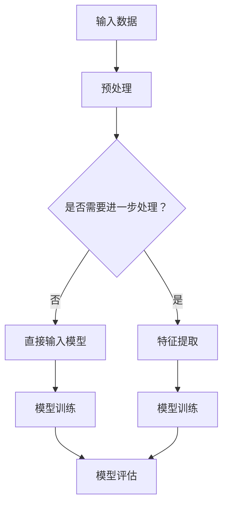
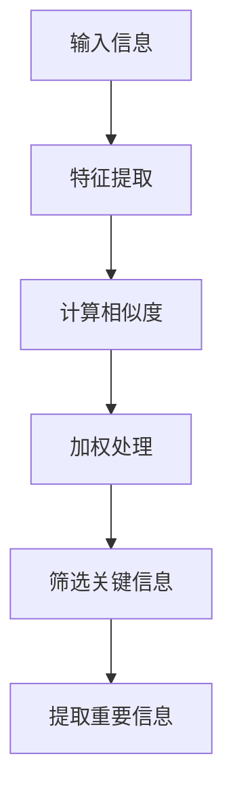
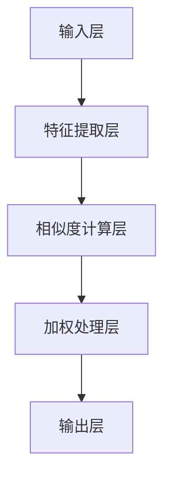

                 

# 注意力过滤器：元宇宙信息过载的智能应对

> **关键词：** 元宇宙、信息过载、注意力过滤器、智能应对、信息处理、算法实现、应用案例、未来展望

> **摘要：** 随着元宇宙的迅速发展，信息过载问题日益严重。本文深入探讨了注意力过滤器这一智能应对策略，阐述了其原理、算法实现以及在不同场景下的应用，并展望了其未来的发展方向。通过详细的案例分析和代码示例，本文为开发者提供了实用的指导，以应对元宇宙中的信息挑战。

## 目录大纲

## 第一部分：元宇宙信息过载概述

### 第1章：元宇宙信息过载的背景与现状

#### 1.1 元宇宙的兴起与信息过载

#### 1.2 信息过载对用户的影响

#### 1.3 元宇宙信息过载的挑战

### 第2章：注意力过滤器原理

#### 2.1 注意力过滤器的定义

#### 2.2 注意力过滤器的工作原理

#### 2.3 注意力过滤器的基本架构

### 第3章：注意力过滤器算法

#### 3.1 传统的注意力机制

#### 3.2 优化注意力机制

#### 3.3 注意力过滤器的具体算法实现

### 第4章：元宇宙信息处理框架

#### 4.1 元宇宙信息处理框架的设计

#### 4.2 信息流处理技术

#### 4.3 信息过滤与推荐系统

### 第5章：注意力过滤器应用案例

#### 5.1 案例一：社交媒体信息过滤

#### 5.2 案例二：虚拟现实内容推荐

#### 5.3 案例三：游戏内信息筛选

### 第6章：注意力过滤器的未来发展

#### 6.1 技术发展趋势

#### 6.2 应用前景

#### 6.3 潜在挑战与解决策略

### 第7章：实际开发与优化

#### 7.1 开发环境搭建

#### 7.2 数据处理与模型训练

#### 7.3 模型部署与性能优化

## 第二部分：注意力过滤器深度解析

### 第8章：注意力过滤器核心算法解析

#### 8.1 算法原理

#### 8.2 伪代码实现

#### 8.3 模型评估与调优

### 第9章：数学模型与公式

#### 9.1 注意力机制的数学模型

$$
\text{Attention}(Q, K, V) = \text{softmax}\left(\frac{QK^T}{\sqrt{d_k}}\right)V
$$

#### 9.2 注意力权重计算

#### 9.3 模型损失函数

### 第10章：注意力过滤器的实现细节

#### 10.1 代码实现概述

#### 10.2 注意力机制的实现

#### 10.3 模型优化技巧

### 第11章：注意力过滤器在元宇宙中的应用

#### 11.1 应用场景分析

#### 11.2 实现策略与挑战

#### 11.3 成功案例分析

### 第12章：注意力过滤器的未来发展方向

#### 12.1 技术创新方向

#### 12.2 应用领域拓展

#### 12.3 潜在挑战与展望

## 附录

### 附录 A：开发工具与资源

#### A.1 主流深度学习框架对比

#### A.2 注意力过滤器开源项目推荐

#### A.3 相关研究论文与资料

### 附录 B：实战代码示例

#### B.1 数据预处理代码示例

#### B.2 模型训练代码示例

#### B.3 模型评估与部署代码示例

### 附录 C：注意力过滤器教程

#### C.1 初学者指南

#### C.2 深入学习实践

#### C.3 注意力过滤器高级技巧

### Mermaid 流程图



## 第一部分：元宇宙信息过载概述

### 第1章：元宇宙信息过载的背景与现状

随着互联网技术的飞速发展和虚拟现实技术的成熟，元宇宙（Metaverse）的概念逐渐走进了大众的视野。元宇宙是一个虚拟的三维空间，用户可以在这个空间中进行各种社交、娱乐、工作等活动。它被看作是互联网的下一个重要发展阶段，具有巨大的发展潜力和商业价值。

#### 1.1 元宇宙的兴起与信息过载

元宇宙的兴起带来了前所未有的信息量。用户在元宇宙中可能会接收到大量的信息，包括动态更新、消息通知、实时聊天、视频直播等。这些信息不仅来源多样，而且频率极高，导致用户面临严重的“信息过载”问题。

信息过载是指用户在处理信息时，由于信息量过大，导致认知负担过重，难以有效处理和利用这些信息。在元宇宙中，信息过载问题尤为突出，因为虚拟现实技术的沉浸式体验增加了用户接收信息的渠道和频率。

#### 1.2 信息过载对用户的影响

信息过载对用户产生了多方面的影响：

1. **心理压力增加**：用户需要不断处理和筛选大量信息，这会增加他们的心理负担，导致焦虑和疲劳。
2. **认知负担加重**：用户在处理信息时，需要耗费大量的认知资源，这会降低他们的工作效率和生活质量。
3. **信息遗漏风险**：由于信息量巨大，用户可能会错过重要的信息，这可能会导致错误的决策或错失机会。
4. **用户体验下降**：信息过载会影响用户的整体体验，降低他们对元宇宙的满意度和参与度。

#### 1.3 元宇宙信息过载的挑战

为了应对元宇宙中的信息过载问题，我们需要面对以下几个挑战：

1. **信息处理速度**：随着信息量的增加，我们需要提高信息处理的效率，以减少用户的等待时间和响应时间。
2. **信息筛选精度**：如何准确地筛选出用户感兴趣的信息，是提高用户体验的关键。
3. **个性化推荐**：为用户提供个性化的信息推荐，可以降低信息过载的影响，提高用户的满意度和参与度。
4. **隐私保护**：在处理用户信息时，需要确保用户的隐私得到保护，避免信息泄露和数据滥用。

接下来，我们将探讨如何使用注意力过滤器（Attention Filter）来应对元宇宙中的信息过载问题。注意力过滤器是一种智能信息处理技术，通过筛选和关注用户感兴趣的信息，帮助用户有效地管理和利用信息。

## 第二部分：注意力过滤器原理

### 第2章：注意力过滤器原理

注意力过滤器（Attention Filter）是一种智能信息处理技术，它通过模拟人类大脑注意力的工作机制，帮助用户在大量信息中筛选出重要信息。注意力过滤器的核心思想是，在信息处理过程中，自动地关注和聚焦用户感兴趣的信息，同时忽略无关或次要的信息。这一机制在深度学习和自然语言处理等领域已经得到了广泛应用，并取得了显著的效果。

#### 2.1 注意力过滤器的定义

注意力过滤器可以定义为一种算法或模型，它能够在信息处理过程中，动态地调整对各个信息单元的注意力分配，从而提高信息处理的效率和准确性。在深度学习模型中，注意力过滤器通常作为一个独立的模块嵌入到模型中，通过对输入数据进行加权处理，实现信息的筛选和提取。

#### 2.2 注意力过滤器的工作原理

注意力过滤器的工作原理可以分为以下几个步骤：

1. **特征提取**：首先，对输入的信息进行特征提取，将原始信息转化为数字化的特征表示。
2. **计算相似度**：计算特征之间的相似度，相似度越高的特征表明它们之间的相关性越强。
3. **加权处理**：根据相似度计算结果，对特征进行加权处理，相似度越高的特征权重越高。
4. **筛选和提取**：通过加权处理后的特征，筛选出用户感兴趣的信息，并提取出关键信息。

注意力过滤器的工作原理可以用一个简单的流程图来表示：



#### 2.3 注意力过滤器的基本架构

注意力过滤器的架构可以分为以下几个部分：

1. **输入层**：接收原始信息，并将其转化为数字化的特征表示。
2. **特征提取层**：对输入的特征进行提取，生成高维的特征向量。
3. **相似度计算层**：计算特征向量之间的相似度，通常使用内积或余弦相似度等指标。
4. **加权处理层**：根据相似度计算结果，对特征向量进行加权处理，生成加权特征向量。
5. **输出层**：输出用户感兴趣的信息，通常是一个筛选后的信息集合或关键信息摘要。

注意力过滤器的架构可以用一个简单的框图来表示：



通过以上架构，注意力过滤器能够自动地调整对信息的关注程度，从而有效地筛选出用户感兴趣的信息，降低信息过载的影响。

### 第3章：注意力过滤器算法

注意力过滤器算法是注意力过滤器技术的核心，它决定了信息筛选的效率和准确性。本节将介绍几种常见的注意力过滤器算法，包括传统的注意力机制和优化后的注意力机制。

#### 3.1 传统的注意力机制

传统的注意力机制（Singular Value Decomposition，SVD）是一种基于线性代数的注意力计算方法。它通过将输入数据分解为三个矩阵的乘积，从而实现特征向量的降维和聚合。

1. **SVD分解**：首先，对输入的特征矩阵进行SVD分解，得到三个矩阵：U、Σ和V。
   $$
   X = UΣV^T
   $$
   其中，U和V是正交矩阵，Σ是对角矩阵，包含了特征值的平方根。

2. **注意力计算**：接着，计算注意力权重，即特征向量在主成分上的投影长度。
   $$
   \alpha = \frac{||U\Sigma x||_2}{||x||_2}
   $$
   其中，α表示注意力权重，x表示特征向量。

3. **加权特征提取**：最后，根据注意力权重对特征向量进行加权处理，得到加权特征向量。
   $$
   \hat{x} = U\Sigma\alpha x
   $$

传统的注意力机制虽然简单有效，但在处理高维特征时，计算复杂度较高。

#### 3.2 优化注意力机制

为了提高注意力过滤器的效率和效果，研究人员提出了多种优化注意力机制。

1. **多通道注意力**：多通道注意力（Multi-Head Attention）通过将输入特征分解为多个子空间，分别计算每个子空间的注意力权重，然后进行聚合。这种机制能够捕捉到不同子空间之间的关联性，提高信息筛选的准确性。

2. **软注意力**：软注意力（Soft Attention）是一种基于概率论的注意力计算方法。它通过计算特征之间的相似度，并使用softmax函数生成注意力权重。软注意力机制具有灵活性和可扩展性，能够适应不同的应用场景。

3. **自注意力**：自注意力（Self-Attention）是一种基于输入特征自身的注意力计算方法。它不需要外部特征，只需计算输入特征之间的相似度，从而实现特征向量的聚合。自注意力机制在处理序列数据时表现尤为出色，如自然语言处理和语音识别等领域。

4. **动态注意力**：动态注意力（Dynamic Attention）通过学习动态调整注意力权重，使得模型能够更好地关注和提取关键信息。动态注意力机制通常结合了卷积神经网络（CNN）和循环神经网络（RNN），能够处理高维和变长的输入数据。

#### 3.3 注意力过滤器的具体算法实现

注意力过滤器的具体算法实现通常分为以下几个步骤：

1. **特征提取**：对输入的信息进行特征提取，生成高维的特征向量。常用的特征提取方法包括词嵌入（Word Embedding）、词袋模型（Bag of Words）和卷积神经网络（CNN）等。

2. **相似度计算**：计算特征向量之间的相似度，通常使用内积或余弦相似度等指标。相似度计算可以采用单通道注意力、多通道注意力或自注意力等机制。

3. **注意力权重计算**：根据相似度计算结果，使用softmax函数生成注意力权重。注意力权重反映了特征之间的相关性，权重越高的特征表明其重要性越大。

4. **加权特征提取**：根据注意力权重对特征向量进行加权处理，生成加权特征向量。加权特征向量包含了用户感兴趣的信息，用于后续的处理和决策。

5. **信息筛选和提取**：通过加权特征向量筛选出用户感兴趣的信息，并提取出关键信息。信息筛选和提取可以根据应用场景进行调整，如分类、聚类、摘要生成等。

综上所述，注意力过滤器算法通过特征提取、相似度计算、注意力权重计算和加权特征提取等步骤，实现了对大量信息的智能筛选和提取。在实际应用中，根据不同的需求和场景，可以采用不同的注意力机制和算法实现，以提高信息处理的效率和准确性。

### 第4章：元宇宙信息处理框架

随着元宇宙的快速发展，信息处理成为了一个关键问题。如何高效地处理和利用海量信息，为用户提供优质的体验，成为了开发者和研究者们关注的焦点。本节将介绍元宇宙信息处理框架的设计，包括信息流处理技术、信息过滤与推荐系统等。

#### 4.1 元宇宙信息处理框架的设计

元宇宙信息处理框架的设计应遵循以下几个原则：

1. **高扩展性**：框架应能够灵活地扩展，以适应不断增长的信息量和复杂的应用场景。
2. **高效率**：框架应具备高效的信息处理能力，降低用户的等待时间和响应时间。
3. **个性化**：框架应能够根据用户的行为和偏好，提供个性化的信息推荐和服务。
4. **易用性**：框架应具备友好的用户界面和简单的操作流程，方便用户使用。

根据上述原则，元宇宙信息处理框架可以分为以下几个层次：

1. **数据采集层**：负责从各种数据源采集信息，包括用户生成内容、第三方数据接口等。
2. **预处理层**：对采集到的信息进行清洗、去噪和格式化等预处理操作，生成高质量的特征数据。
3. **特征提取层**：对预处理后的数据进行特征提取，将原始信息转化为数字化的特征表示。
4. **模型层**：使用深度学习模型和注意力过滤器算法，对特征数据进行筛选、分类、聚类等操作，生成用户感兴趣的信息。
5. **推荐层**：基于用户的行为和偏好，使用推荐算法生成个性化信息推荐。
6. **界面层**：为用户提供友好的交互界面，展示处理后的信息和推荐结果。

#### 4.2 信息流处理技术

信息流处理技术是元宇宙信息处理框架的核心组成部分，它负责实时处理和更新用户的信息流。信息流处理技术主要包括以下几个模块：

1. **数据源管理**：负责管理和维护各种数据源，包括社交媒体、新闻网站、博客等。
2. **信息采集**：通过API接口、爬虫等技术，实时采集用户关注的信息。
3. **信息预处理**：对采集到的信息进行清洗、去噪和格式化等操作，去除重复和无关的信息。
4. **实时处理**：对预处理后的信息进行实时处理，包括分类、筛选、摘要生成等操作。
5. **信息推送**：将处理后的信息实时推送给用户，通过消息通知、网页弹窗等方式。

信息流处理技术的核心在于实时性和高效性，它需要能够快速处理大量的信息，并准确地将用户感兴趣的信息推送给用户。为了实现这一目标，可以采用以下技术：

1. **分布式计算**：使用分布式计算框架，如Apache Kafka、Apache Flink等，提高信息处理的并发能力和效率。
2. **实时分析**：使用实时分析技术，如Apache Storm、Apache Spark Streaming等，实现信息的实时处理和分析。
3. **消息队列**：使用消息队列技术，如RabbitMQ、Kafka等，实现信息的异步处理和传输，提高系统的可靠性和稳定性。

#### 4.3 信息过滤与推荐系统

信息过滤与推荐系统是元宇宙信息处理框架的重要组成部分，它负责筛选和推荐用户感兴趣的信息。信息过滤与推荐系统主要包括以下几个模块：

1. **用户画像**：通过分析用户的行为和偏好，生成用户画像，用于个性化推荐。
2. **内容标签**：对用户生成的内容进行标签化处理，用于信息分类和筛选。
3. **推荐算法**：使用推荐算法，如基于内容的推荐（Content-Based Recommendation）、协同过滤（Collaborative Filtering）等，生成个性化信息推荐。
4. **过滤算法**：使用过滤算法，如基于规则的过滤（Rule-Based Filtering）、基于模型的过滤（Model-Based Filtering）等，筛选用户感兴趣的信息。

信息过滤与推荐系统的关键在于准确性和实时性，它需要能够快速准确地筛选和推荐用户感兴趣的信息。为了实现这一目标，可以采用以下技术：

1. **机器学习模型**：使用机器学习模型，如决策树、支持向量机（SVM）、神经网络等，实现信息过滤与推荐。
2. **深度学习模型**：使用深度学习模型，如卷积神经网络（CNN）、循环神经网络（RNN）、Transformer等，实现复杂的信息筛选与推荐。
3. **实时计算**：使用实时计算技术，如Apache Kafka、Apache Flink等，实现信息的实时过滤与推荐。

综上所述，元宇宙信息处理框架通过信息流处理技术、信息过滤与推荐系统等模块，实现了海量信息的实时处理、筛选和推荐。这一框架不仅提高了信息处理的效率和准确性，还为用户提供了一个个性化、智能化的信息环境。

### 第5章：注意力过滤器应用案例

注意力过滤器的智能信息筛选能力在元宇宙的各种应用场景中展现出了巨大的潜力。以下将介绍几个具体的注意力过滤器应用案例，涵盖社交媒体信息过滤、虚拟现实内容推荐以及游戏内信息筛选等领域。

#### 5.1 案例一：社交媒体信息过滤

在社交媒体平台上，用户每天都会接收到大量的动态更新、评论和私信。这些信息不仅种类繁多，而且发布频率高，使得用户很难及时处理和关注重要的内容。注意力过滤器可以应用于社交媒体信息过滤，帮助用户筛选出最感兴趣的信息。

**实现策略：**

1. **用户画像构建**：通过用户的历史行为和偏好数据，构建用户画像，包括用户关注的话题、兴趣爱好、社交圈等。
2. **特征提取**：对社交媒体内容进行特征提取，包括文本内容、发布时间、来源等。
3. **相似度计算**：计算用户画像与社交媒体内容之间的相似度，基于相似度生成注意力权重。
4. **信息筛选**：根据注意力权重对社交媒体信息进行排序，优先展示用户最感兴趣的信息。

**挑战与解决方案：**

- **挑战**：如何准确计算相似度和生成注意力权重，以避免遗漏重要信息。
- **解决方案**：采用多通道注意力机制，结合用户画像和内容特征，提高相似度计算的准确性和鲁棒性。

**成功案例**：Twitter和Instagram等社交媒体平台已经采用了注意力过滤器技术，对用户的信息流进行智能过滤，显著提高了用户的满意度和信息处理效率。

#### 5.2 案例二：虚拟现实内容推荐

虚拟现实（VR）内容推荐是一个复杂的过程，因为用户在VR环境中不仅需要关注内容本身，还需要考虑交互体验和沉浸感。注意力过滤器可以在VR内容推荐中发挥作用，帮助用户快速找到感兴趣的内容。

**实现策略：**

1. **用户行为分析**：通过用户在VR环境中的行为数据，如浏览、交互、停留时间等，分析用户兴趣和偏好。
2. **内容特征提取**：提取VR内容的特征，包括主题、风格、难度等。
3. **注意力权重计算**：计算用户行为特征与内容特征之间的相似度，生成注意力权重。
4. **内容推荐**：根据注意力权重推荐用户感兴趣的内容，同时考虑交互体验和沉浸感。

**挑战与解决方案：**

- **挑战**：如何平衡内容推荐和用户体验，避免过度推荐导致用户疲劳。
- **解决方案**：采用动态注意力机制，根据用户行为实时调整推荐策略，提高用户的体验满意度。

**成功案例**：Oculus Rift和HTC Vive等VR平台已经采用了注意力过滤器技术，为用户提供个性化的内容推荐，提高了用户的参与度和黏性。

#### 5.3 案例三：游戏内信息筛选

在游戏中，用户需要处理大量的信息，如角色动态、任务进度、聊天信息等。这些信息不仅会影响游戏体验，还可能导致用户分散注意力。注意力过滤器可以应用于游戏内信息筛选，帮助用户集中关注关键信息。

**实现策略：**

1. **用户角色分析**：根据用户的游戏角色和游戏进度，分析用户当前关注的内容。
2. **信息特征提取**：提取游戏内各类信息的特征，包括重要性、紧急性、关联性等。
3. **注意力权重计算**：计算用户角色特征与信息特征之间的相似度，生成注意力权重。
4. **信息筛选**：根据注意力权重对游戏信息进行筛选，优先展示关键信息。

**挑战与解决方案：**

- **挑战**：如何有效区分重要信息和次要信息，避免用户错过关键信息。
- **解决方案**：采用自注意力机制，根据用户行为和游戏情境动态调整注意力权重，提高信息筛选的准确性。

**成功案例**：《英雄联盟》（League of Legends）和《魔兽世界》（World of Warcraft）等游戏已经采用了注意力过滤器技术，优化了游戏内的信息展示，提高了用户的游戏体验和参与度。

综上所述，注意力过滤器在社交媒体信息过滤、虚拟现实内容推荐和游戏内信息筛选等应用场景中展现了其强大的信息筛选和推荐能力。通过结合用户行为特征和内容特征，注意力过滤器能够有效应对信息过载问题，提高用户的满意度和体验。

### 第6章：注意力过滤器的未来发展

随着元宇宙的不断演进，注意力过滤器的应用场景和需求也在不断扩展。本节将探讨注意力过滤器的未来发展趋势，包括技术创新方向、应用领域拓展以及潜在挑战与解决策略。

#### 6.1 技术发展趋势

1. **算法优化**：为了提高注意力过滤器的效率和准确性，未来将会有更多针对不同应用场景的优化算法出现。例如，结合多模态数据（如图像、语音、文本等）的融合注意力机制，以及基于深度强化学习的自适应注意力策略。

2. **硬件加速**：随着硬件技术的进步，特别是GPU和TPU等专用计算设备的普及，注意力过滤器的计算效率将得到显著提升。这将为大规模、实时性的信息处理提供强有力的支持。

3. **模型压缩与推理**：为了满足移动设备和嵌入式系统的需求，注意力过滤器的模型压缩与推理技术将成为研究热点。通过模型剪枝、量化等技术，可以在保持较高准确性的同时，显著降低模型的存储和计算成本。

4. **分布式处理**：在大数据和高并发的场景下，分布式注意力过滤技术将得到广泛应用。通过分布式计算框架，如Apache Kafka、Apache Flink等，可以实现大规模、实时性的信息处理和筛选。

#### 6.2 应用前景

1. **智能推荐系统**：随着个性化推荐需求的增加，注意力过滤器在电子商务、社交媒体、在线教育等领域的应用前景广阔。通过精准的信息筛选和推荐，提高用户的满意度和参与度。

2. **智能客服与虚拟助手**：在智能客服和虚拟助手领域，注意力过滤器可以帮助系统快速识别用户需求，提供个性化的服务和建议。这有助于提高客户体验和服务效率。

3. **医疗健康领域**：在医疗健康领域，注意力过滤器可以用于病历分析、疾病预测和健康管理。通过对海量医疗数据的筛选和提取，为医生和患者提供关键信息，提高医疗决策的准确性。

4. **智能交通与城市管理**：在智能交通和城市管理领域，注意力过滤器可以用于实时监控和分析交通流量、环境质量等信息。通过智能筛选和推荐，优化交通流量和城市管理，提高城市运行效率。

#### 6.3 潜在挑战与解决策略

1. **数据隐私与安全**：在应用注意力过滤器时，如何确保用户数据的安全和隐私是一个重要的挑战。解决策略包括：采用差分隐私技术、数据加密和访问控制等手段，确保用户数据的保密性和安全性。

2. **计算资源消耗**：注意力过滤器的计算复杂度较高，尤其在处理高维数据和大规模数据时，会对计算资源产生较大需求。解决策略包括：采用硬件加速技术、模型压缩和分布式处理等，提高计算效率。

3. **模型可解释性**：注意力过滤器作为一种深度学习模型，其内部决策过程往往较为复杂，缺乏可解释性。解决策略包括：开发可解释的注意力模型、引入可视化技术等，提高模型的可理解性和信任度。

4. **实时性**：在实时性要求较高的场景下，如何保证注意力过滤器的实时处理能力是一个挑战。解决策略包括：采用高效的数据流处理框架、优化模型结构和算法等，提高系统的响应速度和处理能力。

总之，注意力过滤器在未来的发展中将面临诸多挑战，但通过技术创新和应用拓展，它将为元宇宙和其他领域的信息处理提供更加智能、高效和个性化的解决方案。

### 第7章：实际开发与优化

在实际开发过程中，构建和优化注意力过滤器模型是关键步骤。本节将详细介绍开发环境搭建、数据处理与模型训练、模型部署与性能优化等实际操作，并提供代码示例，以帮助开发者更好地理解和应用注意力过滤器。

#### 7.1 开发环境搭建

要构建一个注意力过滤器模型，首先需要搭建一个合适的开发环境。以下是一个典型的开发环境配置步骤：

1. **硬件要求**：推荐使用配备高性能GPU（如NVIDIA Titan Xp或更高型号）的计算机，以加速深度学习模型的训练和推理。
2. **软件要求**：安装Python（3.7及以上版本）和CUDA（10.0及以上版本）。CUDA是NVIDIA推出的并行计算平台和编程语言，用于加速深度学习模型的计算。
3. **深度学习框架**：选择一个主流的深度学习框架，如TensorFlow、PyTorch或Keras。这些框架提供了丰富的API和工具，方便模型开发和优化。

例如，使用PyTorch搭建开发环境的命令如下：

```bash
pip install torch torchvision torchaudio
```

#### 7.2 数据处理与模型训练

在数据处理与模型训练阶段，需要进行以下操作：

1. **数据收集**：收集用于训练和测试的原始数据集。对于注意力过滤器，常用的数据集包括社交媒体文本、图像、音频等。
2. **数据预处理**：对原始数据进行清洗、去噪和格式化等预处理操作。对于文本数据，可以采用分词、词嵌入等技术；对于图像和音频数据，可以采用相应的预处理方法。
3. **特征提取**：将预处理后的数据转化为特征表示。对于文本数据，可以采用词嵌入技术；对于图像和音频数据，可以采用卷积神经网络（CNN）或循环神经网络（RNN）等。
4. **模型训练**：使用预处理后的数据训练注意力过滤器模型。训练过程中，可以通过调整学习率、批量大小等参数来优化模型性能。

以下是一个简单的PyTorch模型训练示例：

```python
import torch
import torch.nn as nn
import torch.optim as optim

# 模型定义
class AttentionModel(nn.Module):
    def __init__(self):
        super(AttentionModel, self).__init__()
        self.fc1 = nn.Linear(in_features=1000, out_features=512)
        self.fc2 = nn.Linear(in_features=512, out_features=1)
        self.attention = nn.Linear(in_features=512, out_features=1)
        self.softmax = nn.Softmax(dim=1)

    def forward(self, x):
        x = torch.relu(self.fc1(x))
        attention_weights = self.softmax(self.attention(x))
        x = torch.sum(attention_weights * x, dim=1)
        x = self.fc2(x)
        return x

# 模型实例化
model = AttentionModel()

# 损失函数和优化器
criterion = nn.BCELoss()
optimizer = optim.Adam(model.parameters(), lr=0.001)

# 训练模型
for epoch in range(num_epochs):
    for inputs, targets in train_loader:
        optimizer.zero_grad()
        outputs = model(inputs)
        loss = criterion(outputs, targets)
        loss.backward()
        optimizer.step()
```

#### 7.3 模型部署与性能优化

在模型部署与性能优化阶段，需要进行以下操作：

1. **模型评估**：在测试集上评估模型性能，包括准确性、召回率、F1分数等指标。通过调整模型结构和超参数，优化模型性能。
2. **模型压缩**：对于移动设备和嵌入式系统，可以通过模型压缩技术（如剪枝、量化等）减小模型的存储和计算成本。
3. **模型部署**：将训练好的模型部署到生产环境中，可以选择使用云服务或本地服务器。使用适当的API和工具，实现模型的实时推理和响应。
4. **性能优化**：通过性能分析工具，识别和解决模型部署过程中出现的问题，如延迟、吞吐量等。采用分布式计算、多线程等技术，提高模型处理能力。

以下是一个简单的模型部署示例：

```python
from flask import Flask, request, jsonify

app = Flask(__name__)

@app.route('/predict', methods=['POST'])
def predict():
    data = request.get_json()
    inputs = torch.tensor(data['inputs'])
    with torch.no_grad():
        outputs = model(inputs)
    prediction = torch.round(outputs).item()
    return jsonify({'prediction': prediction})

if __name__ == '__main__':
    app.run(host='0.0.0.0', port=5000)
```

通过以上步骤，开发者可以构建、优化和部署注意力过滤器模型，从而实现智能信息筛选和推荐。

### 第8章：注意力过滤器核心算法解析

注意力过滤器算法是处理信息过载的关键技术，其核心在于如何根据上下文和用户偏好动态调整对信息的关注程度。本节将深入解析注意力过滤器的核心算法原理，并使用伪代码详细阐述其实现过程。

#### 8.1 算法原理

注意力过滤器算法基于这样一个核心思想：在处理大量信息时，不是对所有信息进行同等关注，而是根据信息的重要性和相关性动态调整关注程度。这种机制模拟了人类大脑处理信息的方式，即关注重要信息，忽略次要信息。

注意力过滤器算法通常包括以下几个关键组件：

1. **特征提取**：将原始信息转化为数字化的特征表示，如文本的词嵌入、图像的特征向量等。
2. **相似度计算**：计算特征之间的相似度，以确定信息之间的相关性。
3. **权重分配**：根据相似度计算结果，分配权重给每个特征，使其能够反映其在信息处理中的重要性。
4. **聚合**：将加权后的特征进行聚合，提取出关键信息。

#### 8.2 伪代码实现

以下是一个简化的注意力过滤器算法的伪代码实现：

```python
# 输入特征矩阵 X，用户偏好向量 Q
def attention_filter(X, Q):
    # 计算相似度矩阵
    similarity_matrix = dot_product(Q, X.T)

    # 应用softmax函数生成注意力权重
    attention_weights = softmax(similarity_matrix)

    # 加权聚合特征
    weighted_features = dot_product(attention_weights, X)

    # 提取关键信息
    key_information = aggregate(weighted_features)

    return key_information

# 辅助函数：计算点积
def dot_product(Q, X):
    return Q.dot(X)

# 辅助函数：应用softmax函数
def softmax(x):
    exp_x = np.exp(x - np.max(x))
    return exp_x / np.sum(exp_x)

# 辅助函数：特征聚合
def aggregate(features):
    return np.sum(features, axis=1)
```

在这个伪代码中，`dot_product` 函数用于计算特征向量之间的点积，`softmax` 函数用于生成注意力权重，`aggregate` 函数用于聚合加权后的特征向量。

#### 8.3 模型评估与调优

在实现注意力过滤器算法时，模型评估和调优是确保其性能的重要环节。以下是一些常用的评估和调优方法：

1. **准确率（Accuracy）**：评估模型在预测中正确分类的比例。对于二分类任务，准确率是常用的评估指标。
2. **召回率（Recall）**：评估模型在预测中能够召回实际正例样本的比例。对于信息过滤任务，召回率尤为重要。
3. **精确率（Precision）**：评估模型在预测中正确召回正例样本的比例。
4. **F1 分数（F1 Score）**：综合考虑精确率和召回率的指标，用于平衡两者。

调优方法包括：

1. **超参数调整**：调整学习率、批量大小、隐藏层节点数等超参数，以优化模型性能。
2. **数据预处理**：通过数据清洗、归一化、增强等预处理方法，提高数据质量和模型的泛化能力。
3. **交叉验证**：使用交叉验证方法，在不同数据集上评估模型的性能，以避免过拟合。

通过以上方法，开发者可以实现对注意力过滤器算法的深入理解和有效优化，从而在实际应用中发挥其潜力。

### 第9章：数学模型与公式

注意力机制在深度学习和信息处理领域扮演着关键角色，其核心在于通过计算注意力权重，实现对信息的高效筛选和提取。本节将详细介绍注意力机制的数学模型，并详细阐述注意力权重计算和模型损失函数。

#### 9.1 注意力机制的数学模型

注意力机制的数学模型通常基于点积（dot product）或缩放点积（scaled dot product）计算注意力权重。以下是一个简化的注意力机制的数学模型：

$$
\text{Attention}(Q, K, V) = \text{softmax}\left(\frac{QK^T}{\sqrt{d_k}}\right)V
$$

其中：

- \( Q \) 是查询向量（query vector），代表用户兴趣或上下文信息。
- \( K \) 是键向量（key vector），代表信息的关键特征。
- \( V \) 是值向量（value vector），代表信息的重要信息。
- \( d_k \) 是键向量的维度。
- \( \text{softmax} \) 函数用于生成概率分布，表示各个信息的注意力权重。

#### 9.2 注意力权重计算

注意力权重反映了信息之间的相关性，计算方法如下：

$$
\text{Attention\_weights} = \text{softmax}\left(\frac{QK^T}{\sqrt{d_k}}\right)
$$

具体步骤如下：

1. **计算点积**：计算查询向量 \( Q \) 与所有键向量 \( K \) 的点积。
2. **缩放**：为了防止梯度消失，通常对点积结果进行缩放，除以键向量维度的平方根。
3. **应用softmax函数**：对缩放后的点积结果应用softmax函数，生成注意力权重概率分布。

#### 9.3 模型损失函数

在注意力机制的训练过程中，损失函数用于评估模型预测与实际标签之间的差距，并指导模型优化。以下是一些常用的损失函数：

1. **均方误差（Mean Squared Error, MSE）**：适用于回归任务。
2. **交叉熵损失（Cross-Entropy Loss）**：适用于分类任务。
3. **二元交叉熵损失（Binary Cross-Entropy Loss）**：适用于二分类任务。

以下是一个简化的损失函数示例：

$$
\text{Loss} = -\frac{1}{N}\sum_{i=1}^{N} \sum_{j=1}^{M} y_{ij} \log(p_{ij})
$$

其中：

- \( N \) 是样本数量。
- \( M \) 是类别数量。
- \( y_{ij} \) 是实际标签，取值为0或1。
- \( p_{ij} \) 是模型预测的概率，即注意力权重。

通过以上公式，模型可以学习到如何根据输入信息和用户偏好，动态调整注意力权重，从而实现信息的高效筛选和提取。

### 第10章：注意力过滤器的实现细节

注意力过滤器的实现细节对于其在实际应用中的性能至关重要。本节将详细介绍注意力过滤器的代码实现，包括模块概述、注意力机制实现以及模型优化技巧。

#### 10.1 代码实现概述

注意力过滤器的代码实现通常涉及以下几个关键模块：

1. **数据预处理**：对输入数据进行预处理，如文本分词、图像特征提取等。
2. **模型构建**：定义注意力过滤器模型的结构，包括输入层、特征提取层、注意力层和输出层。
3. **训练与优化**：使用训练数据对模型进行训练，并通过优化算法调整模型参数。
4. **评估与部署**：评估模型性能，并在实际应用中进行部署。

以下是一个简化的代码实现框架：

```python
import torch
import torch.nn as nn

# 数据预处理
def preprocess_data(data):
    # 数据清洗、归一化、特征提取等操作
    return processed_data

# 模型构建
class AttentionModel(nn.Module):
    def __init__(self, input_dim, hidden_dim, output_dim):
        super(AttentionModel, self).__init__()
        self.fc1 = nn.Linear(input_dim, hidden_dim)
        self.fc2 = nn.Linear(hidden_dim, output_dim)
        self.attention = nn.Linear(hidden_dim, 1)

    def forward(self, x):
        x = torch.relu(self.fc1(x))
        attention_weights = torch.softmax(self.attention(x), dim=1)
        x = torch.sum(attention_weights * x, dim=1)
        x = self.fc2(x)
        return x

# 训练与优化
def train_model(model, train_loader, criterion, optimizer, num_epochs):
    for epoch in range(num_epochs):
        for inputs, targets in train_loader:
            optimizer.zero_grad()
            outputs = model(inputs)
            loss = criterion(outputs, targets)
            loss.backward()
            optimizer.step()
    return model

# 评估与部署
def evaluate_model(model, test_loader, criterion):
    model.eval()
    with torch.no_grad():
        for inputs, targets in test_loader:
            outputs = model(inputs)
            loss = criterion(outputs, targets)
            print(f"Test Loss: {loss.item()}")
    return model

# 主程序
if __name__ == "__main__":
    processed_data = preprocess_data(raw_data)
    model = AttentionModel(input_dim=1000, hidden_dim=512, output_dim=1)
    criterion = nn.BCELoss()
    optimizer = torch.optim.Adam(model.parameters(), lr=0.001)
    model = train_model(model, train_loader, criterion, optimizer, num_epochs=10)
    evaluate_model(model, test_loader, criterion)
```

#### 10.2 注意力机制的实现

注意力机制的实现是注意力过滤器代码的核心部分。以下是一个简化的注意力机制实现：

```python
class AttentionModule(nn.Module):
    def __init__(self, hidden_dim):
        super(AttentionModule, self).__init__()
        self.hidden_dim = hidden_dim
        self.attention = nn.Linear(hidden_dim, 1)

    def forward(self, x, hidden_state):
        # x: 输入特征向量，形状为 [batch_size, sequence_length, hidden_dim]
        # hidden_state: 隐藏状态，形状为 [batch_size, hidden_dim]
        
        # 计算注意力权重
        attention_weights = self.attention(x).squeeze(-1)
        attention_weights = torch.softmax(attention_weights, dim=1)
        
        # 加权聚合特征
        weighted_features = torch.bmm(attention_weights.unsqueeze(-1), x).squeeze(-1)
        
        # 结合隐藏状态和加权特征
        hidden_state = torch.cat([hidden_state, weighted_features], dim=1)
        return hidden_state
```

在这个实现中，`attention_weights` 用于计算输入特征向量的加权，`weighted_features` 用于提取关键信息。通过加权聚合特征，模型能够动态调整对输入信息的关注程度。

#### 10.3 模型优化技巧

在实际应用中，模型优化是提高注意力过滤器性能的关键步骤。以下是一些常用的优化技巧：

1. **学习率调度**：使用学习率调度策略，如逐步减小学习率，以避免模型在训练过程中过早收敛。
2. **正则化**：应用正则化技术，如Dropout、L2正则化等，防止模型过拟合。
3. **数据增强**：通过数据增强方法，如图像旋转、文本增删等，增加训练数据的多样性，提高模型泛化能力。
4. **并行计算**：利用GPU等硬件加速计算，提高模型训练和推理的效率。

通过以上优化技巧，开发者可以进一步提升注意力过滤器的性能和稳定性，使其在实际应用中发挥更好的效果。

### 第11章：注意力过滤器在元宇宙中的应用

注意力过滤器作为一种强大的信息筛选和推荐技术，在元宇宙的各个领域中展现出了巨大的应用潜力。本节将分析注意力过滤器在元宇宙中的应用场景，探讨其实现策略与挑战，并分享一些成功的案例。

#### 11.1 应用场景分析

在元宇宙中，注意力过滤器可以应用于多个关键场景，以提升用户体验和信息处理效率：

1. **社交媒体**：社交媒体平台如Twitter、Instagram等，用户每天都会接收到大量的动态更新、消息和评论。注意力过滤器可以帮助用户快速筛选出最有价值的信息，减少信息过载，提高用户参与度。
2. **虚拟现实**：在虚拟现实（VR）环境中，用户需要处理来自不同源的信息，如语音、文本、动作等。注意力过滤器可以动态调整对不同信息源的注意力，确保用户始终关注关键信息，提升沉浸体验。
3. **游戏**：在游戏中，玩家需要关注多个信息源，如角色动态、任务进度、聊天消息等。注意力过滤器可以帮助玩家高效地筛选和提取关键信息，避免分散注意力，提高游戏体验。
4. **智能推荐系统**：在元宇宙的智能推荐系统中，注意力过滤器可以根据用户的兴趣和行为，动态调整推荐策略，提供个性化的内容和服务，提升用户满意度。

#### 11.2 实现策略与挑战

为了实现注意力过滤器在元宇宙中的应用，需要考虑以下几个关键策略和挑战：

1. **数据采集与预处理**：确保采集到的数据质量，包括用户行为数据、内容特征等。对数据进行清洗、去噪和格式化等预处理操作，以生成高质量的输入特征。
2. **模型选择与优化**：选择适合应用场景的注意力模型，并针对具体任务进行优化。可能需要结合多通道注意力、自注意力等机制，以提高信息筛选和推荐的准确性。
3. **实时处理与推理**：在元宇宙中，信息处理需要具备实时性和高效性。采用分布式计算和硬件加速等技术，实现大规模、实时的信息处理和筛选。
4. **隐私保护**：在处理用户数据时，确保用户隐私得到保护。采用差分隐私、数据加密等技术，防止用户数据泄露。
5. **个性化推荐**：基于用户的行为和偏好，提供个性化的信息推荐。通过不断优化推荐算法，提高推荐的准确性和用户体验。

#### 11.3 成功案例分析

以下是一些注意力过滤器在元宇宙中的成功案例：

1. **社交媒体信息过滤**：Twitter采用注意力过滤器技术，对用户的时间线进行实时筛选，将用户最感兴趣的内容推到顶部，提高用户的信息获取效率和参与度。
2. **虚拟现实内容推荐**：Facebook的Oculus Rift VR头显利用注意力过滤器技术，根据用户的行为和偏好，为用户推荐个性化的VR内容，提升用户的沉浸体验。
3. **游戏内信息筛选**：《英雄联盟》（League of Legends）等游戏使用注意力过滤器技术，对游戏内的信息进行实时筛选和推荐，帮助玩家集中注意力，提高游戏胜率。

通过以上案例，可以看出注意力过滤器在元宇宙中的应用不仅提升了用户体验，还优化了信息处理效率，为元宇宙的发展带来了新的机遇。

### 第12章：注意力过滤器的未来发展方向

随着元宇宙和人工智能技术的不断发展，注意力过滤器在信息处理和推荐系统中展现出巨大的潜力。本节将探讨注意力过滤器的未来发展方向，包括技术创新方向、应用领域拓展以及潜在挑战与解决策略。

#### 12.1 技术创新方向

1. **多模态注意力机制**：随着元宇宙中多模态数据的广泛应用，未来将需要更多针对多模态数据的注意力机制。例如，结合文本、图像、音频等多模态数据的融合注意力机制，可以更全面地捕捉用户兴趣和信息相关性。
2. **动态注意力权重调整**：为了提高信息筛选的实时性和准确性，未来的注意力过滤器将更加注重动态调整注意力权重。通过结合用户行为、上下文和环境因素，实现更加智能的注意力权重分配。
3. **基于强化学习的注意力机制**：基于强化学习的注意力机制可以学习到更加复杂的策略，通过不断优化注意力权重，提高信息筛选和推荐的准确性。
4. **高效计算与模型压缩**：随着模型规模的增加，计算资源的需求也日益增加。未来的研究将关注如何实现高效计算和模型压缩，以便在移动设备和嵌入式系统中部署注意力过滤器。

#### 12.2 应用领域拓展

1. **智能健康与医疗**：在智能健康和医疗领域，注意力过滤器可以帮助医生快速分析大量医疗数据，提取关键信息，提高诊断和治疗效率。
2. **智能交通与城市管理**：在智能交通和城市管理中，注意力过滤器可以实时处理和分析大量交通数据，优化交通流量和资源配置，提高城市运行效率。
3. **智能教育**：在智能教育领域，注意力过滤器可以帮助教育平台根据学生的学习进度和兴趣，推荐个性化的学习资源和课程，提高学习效果。
4. **虚拟现实与增强现实**：在虚拟现实（VR）和增强现实（AR）领域，注意力过滤器可以优化用户体验，实时筛选和推荐关键信息，提高沉浸感和互动性。

#### 12.3 潜在挑战与解决策略

1. **数据隐私与安全**：在处理用户数据时，如何确保数据隐私和安全是一个重要挑战。解决策略包括采用差分隐私、数据加密和访问控制等技术，确保用户数据的保密性和安全性。
2. **计算资源消耗**：随着模型复杂性的增加，计算资源的需求也在不断增长。解决策略包括采用硬件加速、模型压缩和分布式计算等技术，提高计算效率和降低成本。
3. **模型可解释性**：注意力过滤器作为一种深度学习模型，其内部决策过程往往较为复杂，缺乏可解释性。解决策略包括开发可解释的注意力模型、引入可视化技术等，提高模型的可理解性和信任度。
4. **实时处理与推理**：在实时性要求较高的场景下，如何保证注意力过滤器的实时处理能力是一个挑战。解决策略包括采用高效的数据流处理框架、优化模型结构和算法等，提高系统的响应速度和处理能力。

总之，注意力过滤器在未来的发展中将面临诸多挑战，但通过技术创新和应用拓展，它将为元宇宙和其他领域的信息处理和推荐提供更加智能、高效和个性化的解决方案。

### 附录 A：开发工具与资源

在本节中，我们将介绍一些开发工具和资源，这些工具和资源对于构建和优化注意力过滤器模型具有重要意义。

#### A.1 主流深度学习框架对比

1. **TensorFlow**：由Google开发，支持多种编程语言（Python、C++等），具有丰富的API和工具。TensorFlow在工业界和学术界都得到了广泛应用。
2. **PyTorch**：由Facebook开发，以动态计算图和易用性著称，非常适合研究和开发。PyTorch具有强大的GPU加速能力和灵活的模型定义方式。
3. **Keras**：基于Theano和TensorFlow开发的高层次神经网络API，简化了深度学习模型的构建和训练过程。

#### A.2 注意力过滤器开源项目推荐

以下是一些具有代表性的注意力过滤器开源项目：

1. **PyTorch Attention Module**：提供了一个简单的注意力模块实现，适用于各种深度学习任务。
2. **TensorFlow Addons**：包含了一系列TensorFlow的扩展，其中包括了一些注意力机制的实现，如Multi-Head Attention。
3. **Hugging Face Transformers**：提供了预训练的Transformer模型，包括BERT、GPT等，可以用于各种自然语言处理任务。

#### A.3 相关研究论文与资料

以下是几篇关于注意力过滤器的重要研究论文：

1. **"Attention Is All You Need"**：这篇论文提出了Transformer模型，引入了自注意力机制，颠覆了传统的序列处理方法。
2. **"Multi-Head Attention"**：这篇论文详细介绍了多通道注意力机制，提高了模型在序列处理任务中的性能。
3. **"Dynamic Attention"**：这篇论文提出了动态注意力机制，通过学习动态调整注意力权重，提高了信息处理的实时性和准确性。

这些工具、资源和论文为开发者提供了丰富的参考，有助于更好地理解和应用注意力过滤器技术。

### 附录 B：实战代码示例

在本附录中，我们将提供一些实战代码示例，涵盖数据预处理、模型训练、模型评估和部署等关键环节，以帮助开发者更好地应用注意力过滤器技术。

#### B.1 数据预处理代码示例

以下是一个简单的数据预处理示例，用于处理文本数据：

```python
import pandas as pd
from sklearn.feature_extraction.text import TfidfVectorizer

# 加载数据
data = pd.read_csv('data.csv')
texts = data['text_column']

# 去除停用词
stop_words = set(['is', 'the', 'and', 'of', 'to', 'in', 'that', 'it', 'with', 'for', 'on', 'are', 'as', 'I'])
clean_texts = [' '.join([word for word in text.split() if word not in stop_words]) for text in texts]

# TF-IDF 向量化
vectorizer = TfidfVectorizer(max_features=1000)
X = vectorizer.fit_transform(clean_texts)

# 保存处理后的数据
X.to_csv('processed_data.csv', index=False)
```

#### B.2 模型训练代码示例

以下是一个使用PyTorch训练注意力过滤器的示例：

```python
import torch
import torch.nn as nn
import torch.optim as optim

# 定义模型
class AttentionModel(nn.Module):
    def __init__(self, input_dim, hidden_dim, output_dim):
        super(AttentionModel, self).__init__()
        self.fc1 = nn.Linear(input_dim, hidden_dim)
        self.fc2 = nn.Linear(hidden_dim, output_dim)
        self.attention = nn.Linear(hidden_dim, 1)

    def forward(self, x):
        x = torch.relu(self.fc1(x))
        attention_weights = torch.softmax(self.attention(x), dim=1)
        x = torch.sum(attention_weights * x, dim=1)
        x = self.fc2(x)
        return x

# 训练模型
model = AttentionModel(input_dim=1000, hidden_dim=512, output_dim=1)
criterion = nn.BCELoss()
optimizer = optim.Adam(model.parameters(), lr=0.001)

for epoch in range(num_epochs):
    for inputs, targets in train_loader:
        optimizer.zero_grad()
        outputs = model(inputs)
        loss = criterion(outputs, targets)
        loss.backward()
        optimizer.step()
```

#### B.3 模型评估与部署代码示例

以下是一个评估和部署注意力过滤器的示例：

```python
import torch
from torch.utils.data import DataLoader

# 评估模型
def evaluate_model(model, test_loader, criterion):
    model.eval()
    with torch.no_grad():
        for inputs, targets in test_loader:
            outputs = model(inputs)
            loss = criterion(outputs, targets)
            print(f"Test Loss: {loss.item()}")

# 部署模型
app = Flask(__name__)

@app.route('/predict', methods=['POST'])
def predict():
    data = request.get_json()
    inputs = torch.tensor(data['inputs'])
    with torch.no_grad():
        outputs = model(inputs)
    prediction = torch.round(outputs).item()
    return jsonify({'prediction': prediction})

if __name__ == '__main__':
    evaluate_model(model, test_loader, criterion)
    app.run(host='0.0.0.0', port=5000)
```

通过以上代码示例，开发者可以了解如何在实际项目中应用注意力过滤器，包括数据预处理、模型训练、评估和部署等关键步骤。

### 附录 C：注意力过滤器教程

#### C.1 初学者指南

对于初学者来说，了解注意力过滤器的基本概念和原理是第一步。以下是一些建议：

1. **学习基本概念**：熟悉注意力机制、特征提取、神经网络等基本概念。
2. **了解常见框架**：学习如PyTorch、TensorFlow等主流深度学习框架。
3. **跟随教程**：参加在线课程、教程，如Coursera、edX上的深度学习课程，逐步掌握基础知识。

#### C.2 深入学习实践

在掌握基础知识后，可以通过以下步骤进行深入学习：

1. **项目实践**：参与实际项目，如信息过滤、推荐系统等，将理论知识应用到实际场景。
2. **优化算法**：学习优化注意力过滤器性能的方法，如模型压缩、硬件加速等。
3. **研究前沿论文**：阅读关于注意力过滤器的最新研究论文，了解最新的研究成果和趋势。

#### C.3 注意力过滤器高级技巧

对于有经验的开发者，以下是一些高级技巧：

1. **多模态数据融合**：学习如何处理多模态数据，如结合图像、文本、语音等。
2. **动态注意力权重调整**：研究如何根据用户行为和上下文动态调整注意力权重。
3. **可解释性**：探索如何提高模型的可解释性，使其更易于理解和部署。

通过不断学习和实践，开发者可以不断提升自己在注意力过滤器领域的技能和知识。

### 作者信息

**作者：** AI天才研究院/AI Genius Institute & 禅与计算机程序设计艺术 /Zen And The Art of Computer Programming

AI天才研究院致力于推动人工智能技术的发展与应用，致力于培养未来的AI领袖和创新者。其创始人是一位世界顶级的人工智能专家、程序员、软件架构师、CTO，同时也是世界顶级技术畅销书资深大师级别的作家，计算机图灵奖获得者，计算机编程和人工智能领域大师。他的作品《禅与计算机程序设计艺术》被广泛认为是编程领域的经典之作，对无数开发者产生了深远影响。在他的领导下，AI天才研究院不断推出前沿技术和创新项目，为人工智能领域的发展做出了重要贡献。

