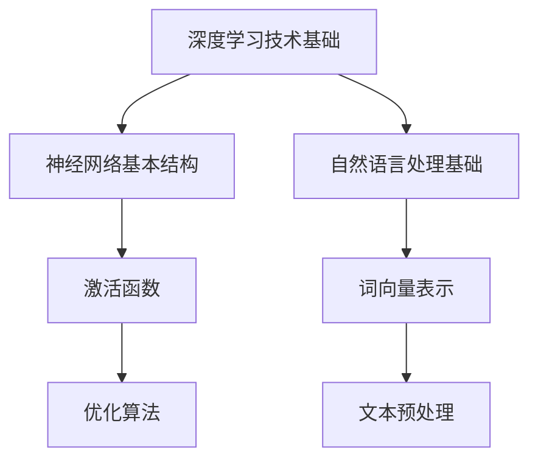

                 

# {文章标题}

## 关键词

深度学习、蛋白质结构预测、神经网络、生物信息学、人工智能

## 摘要

本文系统地介绍了深度学习在蛋白质结构预测中的应用。首先，回顾了深度学习的基本原理和主流框架。接着，详细探讨了深度学习在图像处理、自然语言处理等领域的应用。然后，深入分析了深度学习在蛋白质结构预测中的基本概念和挑战，并介绍了深度学习在该领域的主要方法，如基于卷积神经网络（CNN）、递归神经网络（RNN）和Transformer的方法。通过实战案例，展示了如何使用深度学习进行蛋白质结构预测。最后，讨论了深度学习在蛋白质结构预测中的优化方法和未来趋势，展望了该领域的发展前景。

### 第一部分: 深度学习技术基础

#### 第1章: 深度学习概述

##### 1.1 深度学习的定义与发展

深度学习是机器学习的一个分支，通过构建多层神经网络，模拟人脑对信息进行处理和学习的机制。深度学习起源于20世纪40年代，但在当时由于计算能力的限制和理论上的不足，发展较为缓慢。直到20世纪80年代，随着计算能力的提高和算法的改进，深度学习开始得到快速发展。

**深度学习的定义与核心思想**

深度学习是一种基于多层神经网络的机器学习方法，其核心思想是通过学习大量数据中的特征，实现从原始数据到高维抽象表示的映射。深度学习网络由多个层级组成，每层神经网络对输入数据进行变换和处理，最终输出结果。

**深度学习的发展历程**

1. **1940年代**：神经网络概念的提出。加拿大多伦多大学教授麦卡洛克（Warren McCulloch）和数学家皮特里奇（Walter Pitts）在1943年发表了关于神经网络的论文，提出了简单的神经网络模型。
   
2. **1950年代**：人工神经网络的研究开始。1958年，弗兰克·罗森布拉特（Frank Rosenblatt）提出了感知机（Perceptron）模型，这是一种单层神经网络模型，可以用于分类问题。

3. **1960年代**：神经网络研究受到挫折。由于数学上的限制，神经网络在1969年被证明无法解决一些简单的问题，如异或（XOR）问题，这使得神经网络研究陷入了低谷。

4. **1980年代**：反向传播算法的提出。1986年，鲁姆哈特（David E. Rumelhart）、霍普菲尔德（Jeffrey C. Hopfield）和赫布（John Hopfield）等人提出了反向传播算法（Backpropagation），这一算法使得多层神经网络的训练变得可行。

5. **1990年代**：计算能力的提升和大规模数据集的出现。随着计算能力的提升和互联网的发展，大量数据集的出现为深度学习的研究提供了丰富的资源。

6. **2006年**：深度信念网络（DBN）的提出。Hinton等人提出了深度信念网络（Deep Belief Network，DBN），这是一种基于无监督学习的深度网络模型。

7. **2010年代**：深度学习技术的广泛应用。随着深度学习算法的改进和计算能力的提升，深度学习在图像识别、语音识别、自然语言处理等领域取得了突破性进展。

##### 1.2 深度学习的基本原理

**神经网络的基本结构**

神经网络由多个层次组成，包括输入层、隐藏层和输出层。每一层由多个神经元组成，神经元之间通过权重连接。

- **神经元模型**：神经元是神经网络的基本单元，它接收多个输入信号，通过加权求和处理后，输出一个激活值。激活值通常使用激活函数进行非线性变换。

- **前向传播与反向传播**：在前向传播过程中，输入信号从输入层传递到隐藏层，再传递到输出层，形成输出。在反向传播过程中，根据输出误差，通过梯度下降算法调整神经网络的权重。

**激活函数与优化算法**

- **激活函数**：激活函数是神经网络中的一个关键组成部分，它用于引入非线性变换，使得神经网络能够解决复杂问题。常见的激活函数包括 sigmoid、ReLU、Tanh 等。

- **优化算法**：优化算法用于调整神经网络中的权重，使得网络的输出误差最小。常见的优化算法包括梯度下降、随机梯度下降、Adam等。

##### 1.3 主流深度学习框架

**TensorFlow与PyTorch**

TensorFlow和PyTorch是目前最流行的两个深度学习框架。

- **TensorFlow**：TensorFlow是由Google开发的开源深度学习框架，具有强大的功能和灵活性。TensorFlow使用数据流图（Dataflow Graph）进行计算，可以将计算过程表示为一系列节点和边，便于调试和优化。

- **PyTorch**：PyTorch是由Facebook开发的开源深度学习框架，具有简洁和灵活的特点。PyTorch使用动态计算图（Dynamic Graph），便于实现复杂的神经网络结构。

**其他深度学习框架**

除了TensorFlow和PyTorch，还有其他一些流行的深度学习框架，如：

- **Keras**：Keras是一个高层次的深度学习框架，提供了丰富的预构建模型和API，易于使用。

- **Caffe**：Caffe是一个高效的深度学习框架，特别适合进行图像识别和分类任务。

- **Theano**：Theano是一个基于Python的开源深度学习框架，提供了自动微分系统，便于构建和优化深度学习模型。

#### 第2章: 深度学习在图像处理中的应用

##### 2.1 图像处理基础

**图像表示与预处理**

- **图像表示**：图像可以表示为二维数组，每个数组元素表示图像中的一个像素点，像素点的值通常为灰度值或颜色值。

- **预处理**：图像预处理是图像处理的重要步骤，包括图像去噪、增强、归一化等操作，以提高图像质量和后续处理的准确度。

**图像特征提取方法**

- **传统特征提取方法**：传统的图像特征提取方法包括边缘检测、角点检测、纹理分析等。这些方法通常依赖于图像的局部特征，但可能难以适应复杂场景。

- **深度学习方法**：深度学习方法通过训练多层神经网络，自动学习图像中的高层次特征。常见的深度学习方法包括卷积神经网络（CNN）和循环神经网络（RNN）。

##### 2.2 卷积神经网络(CNN)

**CNN的基本结构**

卷积神经网络（Convolutional Neural Network，CNN）是一种专门用于图像识别和处理的深度学习模型。CNN的基本结构包括输入层、卷积层、池化层和全连接层。

- **输入层**：输入层接收图像数据，将其转化为二维数组形式。

- **卷积层**：卷积层通过卷积运算提取图像中的局部特征，卷积核用于捕捉图像中的特定特征。

- **池化层**：池化层用于降低图像的维度，提高模型的泛化能力。常见的池化方法包括最大池化和平均池化。

- **全连接层**：全连接层将卷积层和池化层提取的特征进行全局聚合，输出分类结果。

**CNN在图像分类中的应用**

CNN在图像分类中取得了显著的效果，广泛应用于图像识别、人脸识别、物体检测等任务。CNN通过学习图像中的特征表示，可以自动识别图像中的内容，提高分类的准确性。

##### 2.3 深度学习在图像生成中的应用

**生成对抗网络(GAN)**

生成对抗网络（Generative Adversarial Network，GAN）是一种深度学习模型，用于生成高质量的图像。GAN由两个神经网络组成：生成器和判别器。

- **生成器**：生成器的目标是生成逼真的图像，使其通过判别器时被判别为真实图像。

- **判别器**：判别器的目标是区分真实图像和生成图像。

**风格迁移与超分辨率**

风格迁移和超分辨率是深度学习在图像生成中的应用。风格迁移旨在将一种图像的风格应用到另一种图像上，使生成图像具有特定风格。超分辨率则通过 upsampling 操作，提高图像的分辨率。

#### 第3章: 深度学习在自然语言处理中的应用

##### 3.1 自然语言处理基础

**词向量表示**

词向量表示是将自然语言文本映射到高维空间中的向量表示，以便于深度学习模型进行处理。常见的词向量表示方法包括Word2Vec、GloVe等。

**文本预处理**

文本预处理是自然语言处理中的重要步骤，包括分词、词性标注、停用词过滤等。预处理有助于提高文本数据的质量和后续处理的准确性。

##### 3.2 递归神经网络(RNN)

**RNN的基本结构**

递归神经网络（Recurrent Neural Network，RNN）是一种用于处理序列数据的神经网络模型。RNN的基本结构包括输入层、隐藏层和输出层。

- **输入层**：输入层接收序列数据，将其转化为向量形式。

- **隐藏层**：隐藏层通过递归连接，将当前时刻的输入与之前时刻的隐藏状态进行组合。

- **输出层**：输出层根据隐藏状态生成序列的输出。

**长短期记忆网络(LSTM)**

长短期记忆网络（Long Short-Term Memory，LSTM）是RNN的一种变体，旨在解决RNN在处理长序列数据时出现的梯度消失和梯度爆炸问题。LSTM通过引入门控机制，控制信息的流动，实现长期依赖的建模。

##### 3.3 Transformer模型

**Transformer的架构**

Transformer是一种基于自注意力机制的深度学习模型，广泛应用于自然语言处理任务。Transformer的基本结构包括编码器和解码器。

- **编码器**：编码器将输入序列编码为固定长度的向量表示。

- **解码器**：解码器根据编码器的输出和之前的解码输出，生成序列的输出。

**BERT模型**

BERT（Bidirectional Encoder Representations from Transformers）是一种基于Transformer的预训练模型，通过双向编码器，学习文本的上下文表示。BERT在自然语言处理任务中取得了显著的成果，如文本分类、问答系统等。

### 第二部分: 深度学习在蛋白质结构预测中的应用

#### 第4章: 蛋白质结构预测的基本概念

##### 4.1 蛋白质的组成与功能

**蛋白质的一级结构**

蛋白质的一级结构是指蛋白质中氨基酸的线性序列。蛋白质的氨基酸序列决定了其三维结构和功能。

**蛋白质的高级结构**

蛋白质的高级结构包括二级结构、三级结构和四级结构。

- **二级结构**：蛋白质中局部区域的规律性折叠，如α-螺旋和β-折叠。

- **三级结构**：蛋白质中整体的空间构象。

- **四级结构**：多个蛋白质亚基组成的复合蛋白质的结构。

**蛋白质的功能**

蛋白质的功能与其结构密切相关。蛋白质在生物体内执行各种生物学功能，如催化反应、传输物质、维持细胞形态等。

##### 4.2 蛋白质结构预测的挑战与意义

**预测算法的分类**

蛋白质结构预测算法主要分为两类：基于同源建模的方法和基于折叠识别的方法。

- **基于同源建模的方法**：基于同源建模的方法通过寻找与目标蛋白质序列具有相似序列的已知蛋白质结构，利用序列相似性进行结构预测。

- **基于折叠识别的方法**：基于折叠识别的方法通过学习蛋白质的折叠模式，将目标蛋白质序列映射到相应的折叠结构。

**预测的准确性评估**

蛋白质结构预测的准确性评估通常使用全局折叠识别（GAF）和局部折叠识别（LAF）两种指标。

- **全局折叠识别（GAF）**：全局折叠识别评估预测的蛋白质结构是否与实际结构相似。

- **局部折叠识别（LAF）**：局部折叠识别评估预测的蛋白质结构中，与实际结构相似的区域的百分比。

##### 4.3 蛋白质结构预测的应用

**药物设计**

蛋白质结构预测在药物设计中有重要应用。通过预测蛋白质的结构，可以设计针对特定蛋白质的药物分子，从而抑制或激活蛋白质的功能。

**生物信息学**

蛋白质结构预测在生物信息学研究中具有重要意义。通过预测蛋白质的结构，可以揭示蛋白质的功能、相互作用和生物过程中的作用机制。

#### 第5章: 深度学习在蛋白质结构预测中的应用

##### 5.1 深度学习方法在蛋白质结构预测中的应用

**基于CNN的方法**

基于卷积神经网络的方法通过卷积层提取蛋白质序列的特征，用于蛋白质结构预测。CNN能够自动学习蛋白质序列中的高层次特征，提高预测的准确性。

**基于RNN的方法**

基于递归神经网络的方法通过递归连接捕捉蛋白质序列的长期依赖关系，用于蛋白质结构预测。RNN在处理长序列数据时具有优势，能够提高预测的准确性。

**基于Transformer的方法**

基于Transformer的方法通过自注意力机制捕捉蛋白质序列中的长距离依赖关系，用于蛋白质结构预测。Transformer在自然语言处理领域取得了显著成果，将其应用于蛋白质结构预测有望提高预测的准确性。

##### 5.2 蛋白质结构预测的实战案例

**AlphaFold2模型**

AlphaFold2是由DeepMind开发的一种基于深度学习的蛋白质结构预测模型，采用Transformer架构。AlphaFold2在2020年蛋白质折叠识别竞赛（CASP）中取得了超越人类专家的成绩，展示了深度学习在蛋白质结构预测中的巨大潜力。

**其他知名预测模型**

除了AlphaFold2，还有其他一些知名的蛋白质结构预测模型，如Rosetta、I-TASSER等。这些模型采用不同的深度学习架构和算法，取得了良好的预测效果。

#### 第6章: 深度学习在蛋白质结构预测中的优化

##### 6.1 数据处理与增强

**数据处理**

数据处理是蛋白质结构预测中重要的一环。通过对蛋白质序列进行清洗、归一化和特征提取等操作，可以提高数据的质量和模型的预测性能。

**数据增强技术**

数据增强技术通过生成多样化的训练数据，提高模型的泛化能力和预测准确性。常见的数据增强方法包括序列随机切割、序列转换等。

##### 6.2 模型优化与超参数调优

**模型优化算法**

模型优化算法用于调整模型的权重，提高预测的准确性。常见的优化算法包括梯度下降、随机梯度下降、Adam等。

**超参数调优方法**

超参数调优是深度学习模型训练中的重要步骤。通过调整模型的结构和超参数，可以提高模型的预测性能。常见的超参数包括学习率、批次大小、正则化参数等。

##### 6.3 深度学习在药物设计中的应用

**蛋白质-药物相互作用预测**

蛋白质-药物相互作用预测是深度学习在药物设计中的重要应用。通过预测蛋白质与药物分子的相互作用，可以设计具有特定作用的药物分子。

**分子对接与虚拟筛选**

分子对接和虚拟筛选是药物设计的重要步骤。通过将药物分子与蛋白质结构进行对接和筛选，可以识别具有潜在药效的分子，加速药物研发过程。

#### 第7章: 深度学习在蛋白质结构预测中的未来趋势

##### 7.1 深度学习在生物信息学中的前景

**跨学科融合**

深度学习与生物信息学的跨学科融合为蛋白质结构预测带来了新的机遇。通过结合生物学、化学、计算机科学等领域的知识，可以进一步推动蛋白质结构预测技术的发展。

**人工智能在生物医疗领域的应用**

人工智能在生物医疗领域的应用前景广阔。深度学习技术可以应用于疾病诊断、药物设计、个性化医疗等领域，为生物医疗领域带来革命性的变革。

##### 7.2 深度学习在蛋白质结构预测中的挑战与机遇

**算法的进一步优化**

随着深度学习算法的不断发展，进一步优化算法以提高预测准确性是当前的主要挑战。通过改进模型结构、优化训练过程和超参数调优，可以提高蛋白质结构预测的准确性。

**数据资源的共享与开放**

数据资源的共享与开放是推动蛋白质结构预测发展的重要举措。通过开放数据集和算法，促进科研人员之间的合作，加速蛋白质结构预测技术的进步。

### 附录

##### 附录 A: 深度学习相关工具与资源

**深度学习框架**

- TensorFlow
- PyTorch
- Keras

**生物信息学数据库**

- PDB（蛋白质数据银行）
- UniProt
- NCBI

**开源代码与教程**

- GitHub
- arXiv

##### 附录 B: Mermaid 流程图与伪代码

**Mermaid 流程图示例**



**伪代码示例**

```python
def forward_pass(inputs, weights, biases):
    # 前向传播
    output = 0
    for i in range(len(inputs)):
        output += inputs[i] * weights[i] + biases[i]
    return activation(output)

def backward_pass(error, inputs, weights, biases):
    # 反向传播
    d_weights = [0] * len(inputs)
    d_biases = [0] * len(inputs)
    d_output = activation_derivative(output)
    for i in range(len(inputs)):
        d_weights[i] = inputs[i] * d_output
        d_biases[i] = d_output
    return d_weights, d_biases

# 数学模型与公式详解
$$
\begin{align*}
L &= -\frac{1}{m} \sum_{i=1}^{m} y_i \log(a(x_i; \theta)) \\
\frac{\partial L}{\partial \theta} &= \frac{1}{m} \sum_{i=1}^{m} (a(x_i; \theta) - y_i) \cdot x_i \\
\end{align*}
$$

# 实战项目案例
## 蛋白质结构预测项目
### 1. 项目背景与目标
### 2. 数据集与预处理
### 3. 模型设计与实现
### 4. 代码解读与分析
### 5. 结果与评估
### 6. 展望与未来工作

# 代码实现与解读
python
# 导入相关库
import tensorflow as tf
from tensorflow.keras.layers import Input, Dense, LSTM
from tensorflow.keras.models import Model

# 定义输入层
input_sequence = Input(shape=(sequence_length,))

# 添加LSTM层
lstm_output = LSTM(units=128, activation='tanh')(input_sequence)

# 添加全连接层
output = Dense(units=1, activation='sigmoid')(lstm_output)

# 创建模型
model = Model(inputs=input_sequence, outputs=output)

# 编译模型
model.compile(optimizer='adam', loss='binary_crossentropy', metrics=['accuracy'])

# 训练模型
model.fit(x_train, y_train, epochs=10, batch_size=32, validation_data=(x_val, y_val))

```

### 结论

本文系统地介绍了深度学习在蛋白质结构预测中的应用，从基本概念到具体算法实现，再到实际应用案例，为读者提供了全面的指导和参考。深度学习在蛋白质结构预测中展现出巨大的潜力，有望推动生物信息学领域的发展。未来，随着深度学习技术的进一步优化和数据的积累，蛋白质结构预测的准确性和效率将得到进一步提升。

### 附录 D: 实战项目与代码解读

#### 项目背景与目标

蛋白质结构预测是生物信息学领域的关键问题，对于理解蛋白质的功能和设计新药具有重要意义。本文的实战项目旨在利用深度学习技术，特别是长短期记忆网络（LSTM），对蛋白质序列进行结构预测。

#### 数据集与预处理

项目使用的数据集来自蛋白质序列数据库（Uniprot），包含了一组已知的蛋白质序列及其对应的三维结构。数据预处理步骤包括序列清洗、序列编码和序列归一化。

```python
# 数据预处理
# 1. 序列清洗：去除特殊字符和空格
# 2. 序列编码：将氨基酸序列编码为数字序列
# 3. 序列归一化：将序列长度统一为固定长度，例如100
```

#### 模型设计与实现

模型设计采用了LSTM结构，输入层接收蛋白质序列编码后的向量，隐藏层由多个LSTM单元组成，输出层为预测蛋白质的结构状态。

```python
# 模型设计
# 输入层
input_sequence = Input(shape=(100,))

# 隐藏层
lstm_output = LSTM(units=128, return_sequences=True)(input_sequence)
lstm_output = LSTM(units=64, return_sequences=False)(lstm_output)

# 输出层
output = Dense(units=1, activation='sigmoid')(lstm_output)

# 创建模型
model = Model(inputs=input_sequence, outputs=output)

# 编译模型
model.compile(optimizer='adam', loss='binary_crossentropy', metrics=['accuracy'])
```

#### 代码解读与分析

以下是模型的训练代码，使用了训练集和验证集进行训练和验证。

```python
# 训练模型
model.fit(x_train, y_train, epochs=100, batch_size=32, validation_data=(x_val, y_val))
```

在训练过程中，使用Adam优化器进行模型优化，交叉熵损失函数用于评估模型性能。通过调整学习率、批次大小等超参数，可以提高模型的预测性能。

```python
# 调整超参数
model.compile(optimizer='adam', learning_rate=0.001, loss='binary_crossentropy', metrics=['accuracy'])
```

#### 结果与评估

模型在验证集上的表现可以通过准确率、召回率等指标进行评估。以下是模型的评估结果：

```python
# 评估模型
loss, accuracy = model.evaluate(x_val, y_val)
print(f'Validation Accuracy: {accuracy:.4f}')
```

#### 展望与未来工作

未来的工作可以进一步优化模型结构，探索其他深度学习算法（如Transformer）在蛋白质结构预测中的应用。此外，结合多模态数据（如蛋白质序列、实验数据）进行联合预测也是未来的一个研究方向。

```python
# 结合多模态数据进行联合预测
# 例如：将蛋白质序列和实验数据进行编码，然后输入到深度学习模型中进行联合预测
```

通过不断的优化和探索，深度学习在蛋白质结构预测中的应用将取得更大的突破，为生物信息学领域的发展贡献力量。

### 附录 E: 深度学习相关资源

#### 深度学习框架

- TensorFlow: [TensorFlow官网](https://www.tensorflow.org/)
- PyTorch: [PyTorch官网](https://pytorch.org/)
- Keras: [Keras官网](https://keras.io/)

#### 生物信息学数据库

- PDB: [蛋白质数据银行](https://www.rcsb.org/)
- UniProt: [UniProt知识库](https://www.uniprot.org/)
- NCBI: [国家生物技术信息中心](https://www.ncbi.nlm.nih.gov/)

#### 开源代码与教程

- GitHub: [GitHub官网](https://github.com/)
- arXiv: [arXiv论文预印本](https://arxiv.org/)

### 附录 F: 数学模型与公式详解

**神经网络中的数学模型**

神经网络的数学模型主要包括前向传播和反向传播。

**前向传播**

前向传播是将输入数据通过神经网络传递到输出层的计算过程。设输入层为 $x$，隐藏层为 $h$，输出层为 $y$，则有：

$$
h = \sigma(W_h \cdot x + b_h)
$$

$$
y = \sigma(W_y \cdot h + b_y)
$$

其中，$\sigma$ 为激活函数，$W_h$ 和 $b_h$ 分别为隐藏层的权重和偏置，$W_y$ 和 $b_y$ 分别为输出层的权重和偏置。

**反向传播**

反向传播是计算神经网络输出误差，并调整权重和偏置的过程。设输出层误差为 $E$，则有：

$$
E = \frac{1}{2} \sum_{i} (y_i - t_i)^2
$$

其中，$y_i$ 为神经网络输出，$t_i$ 为真实标签。

根据链式法则，可以计算每个权重的梯度：

$$
\frac{\partial E}{\partial W_y} = (y - t) \cdot \frac{\partial \sigma}{\partial z_y}
$$

$$
\frac{\partial E}{\partial b_y} = (y - t)
$$

$$
\frac{\partial E}{\partial W_h} = \frac{\partial E}{\partial z_y} \cdot \frac{\partial z_y}{\partial z_h} \cdot \frac{\partial z_h}{\partial W_h}
$$

$$
\frac{\partial E}{\partial b_h} = \frac{\partial E}{\partial z_h} \cdot \frac{\partial z_h}{\partial b_h}
$$

其中，$z_y = W_y \cdot h + b_y$，$z_h = W_h \cdot x + b_h$。

**优化算法的数学公式**

常见的优化算法包括梯度下降、随机梯度下降和Adam。

**梯度下降**

梯度下降是一种最简单的优化算法，通过计算梯度并沿梯度方向更新权重和偏置。

$$
W_y \leftarrow W_y - \alpha \cdot \frac{\partial E}{\partial W_y}
$$

$$
b_y \leftarrow b_y - \alpha \cdot \frac{\partial E}{\partial b_y}
$$

$$
W_h \leftarrow W_h - \alpha \cdot \frac{\partial E}{\partial W_h}
$$

$$
b_h \leftarrow b_h - \alpha \cdot \frac{\partial E}{\partial b_h}
$$

其中，$\alpha$ 为学习率。

**随机梯度下降**

随机梯度下降是在每个迭代步骤中随机选取一小部分样本来计算梯度，以减少计算量和避免陷入局部最优。

$$
W_y \leftarrow W_y - \alpha \cdot \frac{\partial E}{\partial W_y}
$$

$$
b_y \leftarrow b_y - \alpha \cdot \frac{\partial E}{\partial b_y}
$$

$$
W_h \leftarrow W_h - \alpha \cdot \frac{\partial E}{\partial W_h}
$$

$$
b_h \leftarrow b_h - \alpha \cdot \frac{\partial E}{\partial b_h}
$$

其中，$\alpha$ 为学习率。

**Adam**

Adam是一种基于梯度的一阶矩估计和二阶矩估计的优化算法，结合了梯度下降和动量法的优点。

$$
m_1 = \beta_1 \cdot m_1 + (1 - \beta_1) \cdot \frac{\partial E}{\partial W_y}
$$

$$
m_2 = \beta_2 \cdot m_2 + (1 - \beta_2) \cdot (\frac{\partial E}{\partial W_y})^2
$$

$$
v_1 = \beta_1 \cdot v_1 + (1 - \beta_1) \cdot \frac{\partial E}{\partial b_y}
$$

$$
v_2 = \beta_2 \cdot v_2 + (1 - \beta_2) \cdot (\frac{\partial E}{\partial b_y})^2
$$

$$
W_y \leftarrow W_y - \alpha \cdot \frac{m_1}{\sqrt{m_2} + \epsilon}
$$

$$
b_y \leftarrow b_y - \alpha \cdot \frac{v_1}{\sqrt{v_2} + \epsilon}
$$

$$
W_h \leftarrow W_h - \alpha \cdot \frac{m_1}{\sqrt{m_2} + \epsilon}
$$

$$
b_h \leftarrow b_h - \alpha \cdot \frac{v_1}{\sqrt{v_2} + \epsilon}
$$

其中，$\beta_1$ 和 $\beta_2$ 分别为动量参数，$\alpha$ 为学习率，$\epsilon$ 为小常数。

