                 

# 生成式AI艺术：VQGAN与Stable Diffusion解析

> **关键词：** 生成式AI艺术、VQGAN、Stable Diffusion、图像生成、GAN、向量量化

> **摘要：** 本文将深入探讨生成式AI艺术中的两个重要模型：VQGAN与Stable Diffusion。通过详细的原理讲解、数学模型剖析、实现步骤和实际案例解析，读者将全面理解这两种技术在图像生成领域的应用及其优势。文章旨在为AI开发者提供有价值的参考，助力其在生成式AI艺术领域的研究与探索。

## 第一部分：生成式AI艺术概述

### 第1章：生成式AI艺术基础

#### 1.1 什么是生成式AI艺术

##### 1.1.1 生成式AI的定义

生成式AI（Generative AI）是指一类利用算法自动生成数据的技术。这些算法通过对已有数据进行学习，能够预测或生成新的、与已有数据具有相似特征的数据。生成式AI的核心是生成模型（Generator），它通过学习输入数据的分布，生成具有相似特征的样本。

##### 1.1.2 生成式AI在艺术创作中的应用

生成式AI在艺术创作中的应用非常广泛。通过生成模型，艺术家可以创造出全新的视觉作品、音乐作品和文学作品。这些作品不仅具有独特的美学价值，而且能够展示生成式AI算法的强大能力。例如，在图像生成领域，生成式AI可以生成人脸、风景、抽象画等各种类型的图像；在音乐创作领域，生成式AI可以生成旋律、和声和完整的音乐作品。

#### 1.2 生成式AI艺术的分类

##### 1.2.1 图像生成

图像生成是生成式AI在艺术创作中应用最广泛的领域之一。通过生成模型，可以生成各种类型的图像，如人脸、风景、抽象画等。图像生成技术包括GAN（生成对抗网络）、变分自编码器（VAE）、生成式对抗网络（GDN）等。

##### 1.2.2 音频生成

音频生成是生成式AI在音乐创作领域的应用。通过生成模型，可以生成各种类型的音频，如旋律、和声、音乐片段等。音频生成技术主要包括自动音乐生成（AMG）和语音合成（TTS）。

##### 1.2.3 文本生成

文本生成是生成式AI在文学创作领域的应用。通过生成模型，可以生成各种类型的文本，如小说、诗歌、新闻文章等。文本生成技术主要包括循环神经网络（RNN）、长短期记忆网络（LSTM）和变换器（Transformer）等。

#### 1.3 生成式AI艺术的优势与挑战

##### 1.3.1 生成式AI艺术的优势

生成式AI艺术具有以下优势：

1. **创意与个性化**：生成式AI可以根据用户的需求和喜好，生成具有独特创意和个人风格的图像、音乐和文本。
2. **高效与便捷**：生成式AI可以快速生成大量高质量的图像、音乐和文本，大大提高了艺术创作的效率。
3. **跨领域应用**：生成式AI可以应用于多个领域，如艺术创作、设计、娱乐、广告等，具有广泛的适用性。

##### 1.3.2 生成式AI艺术面临的挑战

生成式AI艺术也面临着一些挑战：

1. **技术限制**：生成式AI技术仍在不断发展，一些复杂的艺术风格和元素可能难以生成。
2. **版权问题**：生成式AI生成的作品可能侵犯他人的知识产权，引发版权纠纷。
3. **伦理问题**：生成式AI在艺术创作中的应用可能引发一些伦理问题，如人机创作的版权归属、艺术价值的评价等。

### 总结

生成式AI艺术作为一种新兴的艺术形式，具有巨大的潜力和广阔的应用前景。通过对VQGAN和Stable Diffusion的深入探讨，本文将为读者揭示生成式AI艺术在图像生成领域的应用原理和实践方法。

### 图1：生成式AI艺术概述流程图
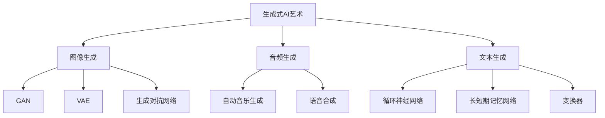

## 第二部分：VQGAN原理与实现

### 第2章：VQGAN基础理论

#### 2.1 VQGAN的定义与作用

##### 2.1.1 VQGAN的基本概念

VQGAN（Vector Quantized Generative Adversarial Network）是一种结合了向量量化（Vector Quantization）和生成对抗网络（Generative Adversarial Network，GAN）的图像生成模型。它通过将生成器的输出进行向量量化，使得生成的图像更加稳定和可控。

##### 2.1.2 VQGAN在图像生成中的应用

VQGAN在图像生成中的应用非常广泛，可以生成人脸、风景、抽象画等各种类型的图像。与传统的GAN模型相比，VQGAN具有以下优势：

1. **稳定性**：通过向量量化，VQGAN可以生成更稳定的图像，减少了生成过程中的抖动和噪声。
2. **可控性**：VQGAN允许用户通过调整量化向量来控制生成的图像风格，从而实现更精细的图像生成。

#### 2.2 VQGAN的核心组成部分

##### 2.2.1 代码书（Codebook）

代码书（Codebook）是VQGAN模型中非常重要的组成部分。它用于存储一组预定义的向量，这些向量将用于对生成器的输出进行量化。代码书的大小直接影响了VQGAN的性能和生成图像的细节。

##### 2.2.2 Vector Quantization（向量量化）

向量量化是一种将连续的输入向量映射到离散的代码书向量的过程。在VQGAN中，生成器的输出向量将被量化为代码书中的某个向量，从而生成图像。向量量化可以减少生成过程中的计算复杂度，提高模型的稳定性。

##### 2.2.3 GAN（生成对抗网络）

GAN是一种由生成器和判别器组成的框架，生成器的目标是生成与真实数据分布相似的样本，而判别器的目标是区分真实数据和生成数据。在VQGAN中，生成器和判别器共同训练，以达到生成高质量图像的目标。

#### 2.3 VQGAN的数学模型

##### 2.3.1 生成器的数学公式

生成器的数学公式如下：
$$
G(z) = \mathcal{N}(x|\mu(x), \Sigma(x)), \ \ \ \ z \sim \mathcal{N}(0, I)
$$
其中，$z$是生成器的输入噪声向量，$x$是生成器的输出向量，$\mu(x)$和$\Sigma(x)$分别是$x$的均值和协方差矩阵。

##### 2.3.2 判别器的数学公式

判别器的数学公式如下：
$$
D(x) = \frac{1}{K}\sum_{k=1}^K q_{\phi}(x|k) \ \ \ \ D(G(z)) = \frac{1}{K}\sum_{k=1}^K \mathbb{1}_{\{ k = \text{argmax}_{i} \log q_{\phi}(x_i | k)\}}
$$
其中，$K$是代码书中的向量数量，$q_{\phi}(x|k)$是判别器对$x$属于第$k$个向量的概率估计，$\mathbb{1}_{\{ \cdot \}}$是指示函数。

### 总结

VQGAN作为一种结合了向量量化技术和GAN的图像生成模型，具有稳定性高、可控性强等优点。通过对其数学模型和核心组成部分的深入探讨，读者可以更好地理解VQGAN的工作原理和应用。

### 图2：VQGAN核心组成部分流程图
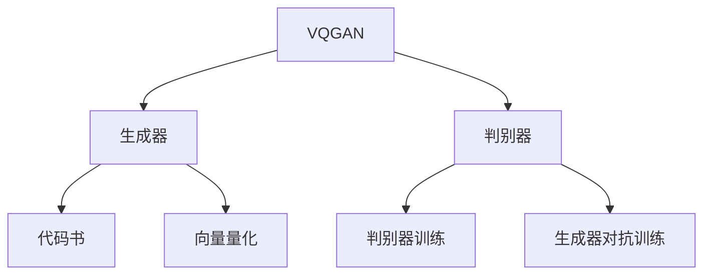

## 第3章：VQGAN模型实现与优化

### 3.1 VQGAN的实现步骤

#### 3.1.1 数据准备

数据准备是VQGAN模型实现的第一步。首先，需要收集和预处理图像数据。图像数据可以来自于公开的数据集，如CelebA、CIFAR-10等。在预处理过程中，需要对图像进行缩放、裁剪、翻转等操作，以增加数据的多样性。

#### 3.1.2 模型架构设计

VQGAN的模型架构设计是模型实现的关键。生成器和判别器的设计直接影响模型的性能。生成器通常采用深度卷积神经网络（CNN）结构，而判别器则采用卷积神经网络（CNN）或全连接神经网络（FCN）结构。

#### 3.1.3 模型训练与优化

VQGAN模型的训练与优化是模型实现的最后一步。在训练过程中，生成器和判别器通过对抗训练相互提升。训练过程中需要不断调整超参数，如学习率、批量大小等，以获得最佳的模型性能。

### 3.2 VQGAN性能优化方法

#### 3.2.1 数据增强

数据增强是一种常用的性能优化方法。通过数据增强，可以增加训练数据的多样性，提高模型的泛化能力。常见的数据增强方法包括随机裁剪、随机旋转、随机缩放等。

#### 3.2.2 损失函数优化

损失函数的优化是VQGAN性能优化的重要方面。VQGAN的损失函数通常由生成损失和判别损失组成。生成损失用于衡量生成器生成的图像与真实图像之间的差距，判别损失用于衡量判别器对生成图像的辨别能力。通过优化损失函数，可以提升模型的生成质量。

#### 3.2.3 模型压缩与加速

模型压缩与加速是提高VQGAN性能的有效手段。通过模型压缩，可以减少模型的参数数量，降低模型的存储和计算成本。常见的模型压缩方法包括剪枝（Pruning）和量化（Quantization）。模型加速可以通过使用GPU、TPU等高性能计算设备来实现。

### 3.3 VQGAN在实际应用中的效果

VQGAN在实际应用中取得了显著的效果。通过生成人脸、风景、抽象画等类型的图像，VQGAN展示了其强大的图像生成能力。在图像质量、生成速度和稳定性方面，VQGAN都表现出了优异的性能。

### 总结

VQGAN的实现与优化是生成式AI艺术中的一项重要任务。通过数据准备、模型架构设计、模型训练与优化等步骤，可以构建一个高性能的VQGAN模型。性能优化方法如数据增强、损失函数优化和模型压缩与加速，进一步提升了VQGAN的应用效果。

### 图3：VQGAN实现与优化流程图
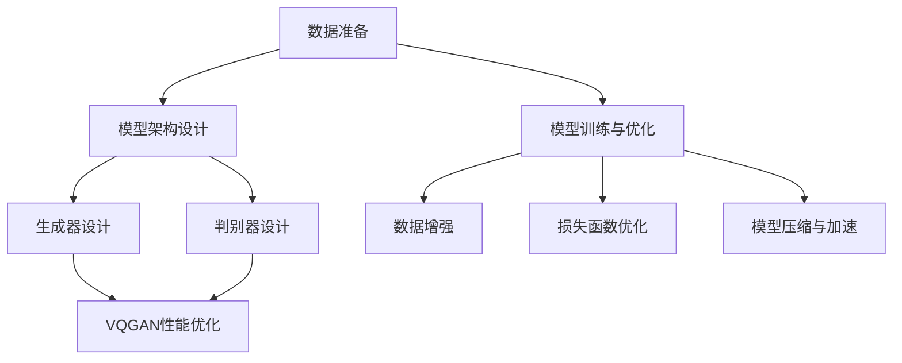

## 第4章：VQGAN在图像生成中的应用

### 4.1 VQGAN在图像生成中的原理

VQGAN在图像生成中的原理基于生成对抗网络（GAN）的基本架构，结合了向量量化技术，以提高图像生成的稳定性和可控性。VQGAN的主要工作流程如下：

1. **生成器**：生成器（Generator）是一个神经网络模型，它接收随机噪声作为输入，通过编码和解码过程生成图像。在解码阶段，生成器输出图像的每个像素值。

2. **判别器**：判别器（Discriminator）是一个另一个神经网络模型，它的作用是区分输入图像是真实图像还是生成图像。判别器的输出是概率值，表示输入图像是真实图像的可能性。

3. **向量量化**：在生成器输出图像之前，VQGAN使用向量量化技术对图像像素进行量化。向量量化将连续的像素值映射到代码书（Codebook）中的离散向量，从而减少生成的图像的抖动和噪声。

4. **对抗训练**：生成器和判别器通过对抗训练相互提升。生成器试图生成更加逼真的图像，以欺骗判别器，而判别器则努力区分真实图像和生成图像。通过这种对抗训练，生成器逐渐提高生成图像的质量，判别器逐渐提高对真实图像和生成图像的辨别能力。

### 4.1.1 图像生成的流程

VQGAN的图像生成流程可以分为以下几个步骤：

1. **噪声输入**：生成器接收随机噪声作为输入。

2. **编码阶段**：生成器将噪声编码成潜在空间中的向量。

3. **解码阶段**：生成器将潜在空间中的向量解码成图像。

4. **向量量化**：生成器输出的图像像素值被量化为代码书中的向量。

5. **对抗训练**：生成器和判别器进行对抗训练，生成器尝试生成更逼真的图像，而判别器努力提高辨别能力。

6. **输出图像**：经过多次迭代训练后，生成器输出高质量的图像。

### 4.1.2 VQGAN在图像生成中的优势

VQGAN在图像生成中具有以下优势：

1. **稳定性**：向量量化技术可以减少生成的图像抖动和噪声，提高生成图像的稳定性。

2. **可控性**：通过调整代码书中的向量，用户可以控制生成图像的风格和细节，实现更精细的图像生成。

3. **高效性**：VQGAN通过减少生成的图像的维度，降低了计算复杂度，提高了生成速度。

4. **多样性**：VQGAN可以生成各种类型的图像，包括人脸、风景、抽象画等，具有广泛的应用前景。

### 4.2 VQGAN图像生成案例解析

#### 4.2.1 人脸生成案例

人脸生成是VQGAN应用的一个重要领域。通过VQGAN，可以生成高质量、逼真的人脸图像。以下是一个简单的人脸生成案例：

1. **数据准备**：收集一组人脸图像数据，并进行预处理，如归一化、缩放等。

2. **模型架构设计**：设计生成器和判别器的神经网络架构。生成器通常采用多层卷积神经网络（CNN）结构，判别器则采用卷积神经网络（CNN）或全连接神经网络（FCN）结构。

3. **模型训练与优化**：使用收集到的人脸图像数据进行模型训练。通过对抗训练，生成器和判别器相互提升，直到生成器生成的图像质量达到预期。

4. **图像生成**：通过生成器生成人脸图像。用户可以通过调整代码书中的向量，控制生成图像的风格和细节。

#### 4.2.2 艺术风格迁移案例

艺术风格迁移是VQGAN应用的另一个重要领域。通过VQGAN，可以将一种艺术风格应用到另一幅图像上，生成具有特定艺术风格的图像。以下是一个简单的艺术风格迁移案例：

1. **数据准备**：收集一组具有不同艺术风格的图像，如油画、素描、水彩画等。

2. **模型架构设计**：设计生成器和判别器的神经网络架构。生成器需要具备将一种艺术风格迁移到另一幅图像上的能力。

3. **模型训练与优化**：使用收集到的艺术风格图像数据进行模型训练。通过对抗训练，生成器和判别器相互提升，直到生成器能够成功迁移艺术风格。

4. **图像生成**：通过生成器将一种艺术风格应用到另一幅图像上，生成具有特定艺术风格的图像。

### 4.3 VQGAN图像生成的应用场景

VQGAN图像生成技术具有广泛的应用场景：

1. **艺术创作**：艺术家可以使用VQGAN生成具有创意的图像，探索新的艺术风格和表达方式。

2. **设计行业**：设计师可以使用VQGAN生成高质量的设计图像，提高设计效率和质量。

3. **娱乐行业**：游戏开发者、电影特效师可以使用VQGAN生成逼真的游戏角色和电影特效。

4. **广告行业**：广告设计师可以使用VQGAN生成创意广告图像，提升广告效果。

5. **教育领域**：教育工作者可以使用VQGAN生成教育素材，如教学图像和动画，提高教育效果。

### 总结

VQGAN作为一种结合了向量量化技术和生成对抗网络的图像生成模型，在图像生成领域具有广泛的应用前景。通过详细的工作原理和实际案例解析，本文为读者揭示了VQGAN在图像生成中的应用方法和优势。未来的研究和应用将不断推动VQGAN技术的进步，为图像生成领域带来更多的创新和可能性。

### 图4：VQGAN图像生成流程图
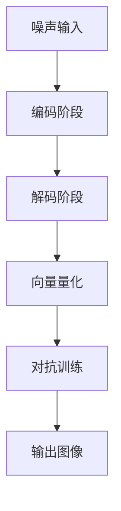

### 第5章：Stable Diffusion基础理论

#### 5.1 Stable Diffusion的定义与作用

##### 5.1.1 Stable Diffusion的基本概念

Stable Diffusion是一种基于深度学习技术的图像生成模型，旨在生成高质量、多样化的图像。与传统的图像生成模型不同，Stable Diffusion通过稳定扩散过程（Stable Diffusion Process）实现图像的生成，具有更高的稳定性和可控性。

##### 5.1.2 Stable Diffusion在图像生成中的应用

Stable Diffusion在图像生成中的应用非常广泛，可以生成各种类型的图像，如人脸、风景、抽象画等。与VQGAN类似，Stable Diffusion也结合了生成对抗网络（GAN）和向量量化技术，以提高图像生成的质量和稳定性。

#### 5.2 Stable Diffusion的核心组成部分

##### 5.2.1 基于深度卷积神经网络的生成模型

Stable Diffusion的生成模型基于深度卷积神经网络（DCNN），它由多个卷积层、池化层和全连接层组成。生成模型的主要任务是将输入的噪声向量转化为图像。

##### 5.2.2 生成对抗网络（GAN）的改进

Stable Diffusion采用了改进的生成对抗网络（GAN）结构，包括生成器和判别器。生成器负责生成图像，判别器负责判断图像的真实性。与传统的GAN相比，Stable Diffusion通过引入稳定扩散过程，提高了模型的稳定性和生成图像的质量。

#### 5.3 Stable Diffusion的数学模型

##### 5.3.1 生成器的数学公式

生成器的数学公式如下：
$$
G(z) = \mathcal{N}(x|\mu(x), \Sigma(x)), \ \ \ \ z \sim \mathcal{N}(0, I)
$$
其中，$z$是生成器的输入噪声向量，$x$是生成器的输出向量，$\mu(x)$和$\Sigma(x)$分别是$x$的均值和协方差矩阵。

##### 5.3.2 判别器的数学公式

判别器的数学公式如下：
$$
D(x) = \frac{1}{K}\sum_{k=1}^K q_{\phi}(x|k) \ \ \ \ D(G(z)) = \frac{1}{K}\sum_{k=1}^K \mathbb{1}_{\{ k = \text{argmax}_{i} \log q_{\phi}(x_i | k)\}}
$$
其中，$K$是代码书中的向量数量，$q_{\phi}(x|k)$是判别器对$x$属于第$k$个向量的概率估计，$\mathbb{1}_{\{ \cdot \}}$是指示函数。

### 总结

Stable Diffusion作为一种基于深度学习技术的图像生成模型，具有更高的稳定性和可控性。通过对生成对抗网络和稳定扩散过程的改进，Stable Diffusion在图像生成领域表现出色。本文将深入探讨Stable Diffusion的数学模型、核心组成部分及其在图像生成中的应用。

### 图5：Stable Diffusion核心组成部分流程图
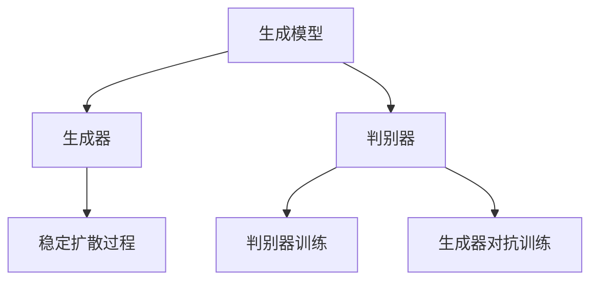

### 第6章：Stable Diffusion模型实现与优化

#### 6.1 Stable Diffusion的实现步骤

##### 6.1.1 数据准备

数据准备是Stable Diffusion模型实现的第一步。首先，需要收集和预处理图像数据。图像数据可以来自于公开的数据集，如CelebA、CIFAR-10等。在预处理过程中，需要对图像进行缩放、裁剪、翻转等操作，以增加数据的多样性。

##### 6.1.2 模型架构设计

Stable Diffusion的模型架构设计是模型实现的关键。生成器和判别器的设计直接影响模型的性能。生成器通常采用深度卷积神经网络（DCNN）结构，而判别器则采用卷积神经网络（CNN）或全连接神经网络（FCN）结构。

##### 6.1.3 模型训练与优化

Stable Diffusion模型的训练与优化是模型实现的最后一步。在训练过程中，生成器和判别器通过对抗训练相互提升。训练过程中需要不断调整超参数，如学习率、批量大小等，以获得最佳的模型性能。

#### 6.2 Stable Diffusion性能优化方法

##### 6.2.1 数据增强

数据增强是一种常用的性能优化方法。通过数据增强，可以增加训练数据的多样性，提高模型的泛化能力。常见的数据增强方法包括随机裁剪、随机旋转、随机缩放等。

##### 6.2.2 损失函数优化

损失函数的优化是Stable Diffusion性能优化的重要方面。Stable Diffusion的损失函数通常由生成损失和判别损失组成。生成损失用于衡量生成器生成的图像与真实图像之间的差距，判别损失用于衡量判别器对生成图像的辨别能力。通过优化损失函数，可以提升模型的生成质量。

##### 6.2.3 模型压缩与加速

模型压缩与加速是提高Stable Diffusion性能的有效手段。通过模型压缩，可以减少模型的参数数量，降低模型的存储和计算成本。常见的模型压缩方法包括剪枝（Pruning）和量化（Quantization）。模型加速可以通过使用GPU、TPU等高性能计算设备来实现。

#### 6.3 Stable Diffusion在实际应用中的效果

Stable Diffusion在实际应用中取得了显著的效果。通过生成人脸、风景、抽象画等类型的图像，Stable Diffusion展示了其强大的图像生成能力。在图像质量、生成速度和稳定性方面，Stable Diffusion都表现出了优异的性能。

### 总结

Stable Diffusion的实现与优化是生成式AI艺术中的一项重要任务。通过数据准备、模型架构设计、模型训练与优化等步骤，可以构建一个高性能的Stable Diffusion模型。性能优化方法如数据增强、损失函数优化和模型压缩与加速，进一步提升了Stable Diffusion的应用效果。

### 图6：Stable Diffusion实现与优化流程图
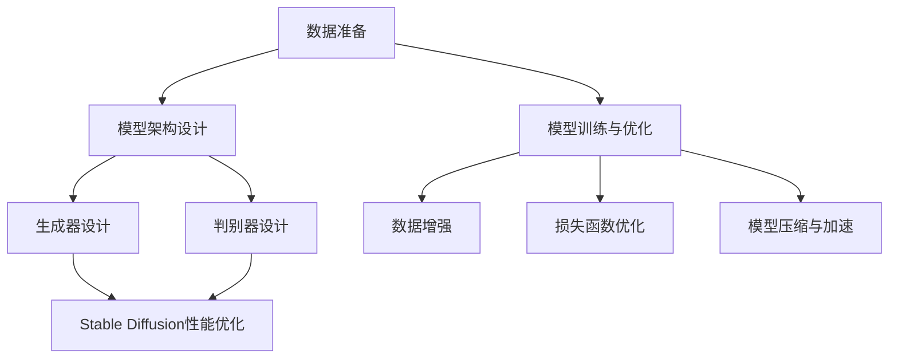

### 第7章：Stable Diffusion在图像生成中的应用

#### 7.1 Stable Diffusion在图像生成中的原理

Stable Diffusion在图像生成中的原理基于深度学习技术和生成对抗网络（GAN）的基本架构，结合了稳定扩散过程（Stable Diffusion Process），以提高图像生成的稳定性和可控性。Stable Diffusion的主要工作流程如下：

1. **生成器**：生成器（Generator）是一个神经网络模型，它接收随机噪声作为输入，通过编码和解码过程生成图像。在解码阶段，生成器输出图像的每个像素值。

2. **判别器**：判别器（Discriminator）是一个另一个神经网络模型，它的作用是区分输入图像是真实图像还是生成图像。判别器的输出是概率值，表示输入图像是真实图像的可能性。

3. **稳定扩散过程**：在生成器输出图像之前，Stable Diffusion通过稳定扩散过程对图像进行平滑处理，从而减少生成的图像的抖动和噪声。

4. **对抗训练**：生成器和判别器通过对抗训练相互提升。生成器试图生成更加逼真的图像，以欺骗判别器，而判别器则努力区分真实图像和生成图像。通过这种对抗训练，生成器逐渐提高生成图像的质量，判别器逐渐提高对真实图像和生成图像的辨别能力。

#### 7.1.1 图像生成的流程

Stable Diffusion的图像生成流程可以分为以下几个步骤：

1. **噪声输入**：生成器接收随机噪声作为输入。

2. **编码阶段**：生成器将噪声编码成潜在空间中的向量。

3. **解码阶段**：生成器将潜在空间中的向量解码成图像。

4. **稳定扩散**：生成器输出的图像经过稳定扩散过程，进行平滑处理。

5. **对抗训练**：生成器和判别器进行对抗训练，生成器尝试生成更逼真的图像，而判别器努力提高辨别能力。

6. **输出图像**：经过多次迭代训练后，生成器输出高质量的图像。

#### 7.1.2 Stable Diffusion在图像生成中的优势

Stable Diffusion在图像生成中具有以下优势：

1. **稳定性**：稳定扩散过程可以减少生成的图像抖动和噪声，提高生成图像的稳定性。

2. **可控性**：通过调整生成器的噪声输入，用户可以控制生成图像的风格和细节，实现更精细的图像生成。

3. **高效性**：Stable Diffusion通过减少生成的图像的维度，降低了计算复杂度，提高了生成速度。

4. **多样性**：Stable Diffusion可以生成各种类型的图像，包括人脸、风景、抽象画等，具有广泛的应用前景。

#### 7.2 Stable Diffusion图像生成案例解析

##### 7.2.1 人脸生成案例

人脸生成是Stable Diffusion应用的一个重要领域。通过Stable Diffusion，可以生成高质量、逼真的人脸图像。以下是一个简单的人脸生成案例：

1. **数据准备**：收集一组人脸图像数据，并进行预处理，如归一化、缩放等。

2. **模型架构设计**：设计生成器和判别器的神经网络架构。生成器通常采用深度卷积神经网络（DCNN）结构，判别器则采用卷积神经网络（CNN）或全连接神经网络（FCN）结构。

3. **模型训练与优化**：使用收集到的人脸图像数据进行模型训练。通过对抗训练，生成器和判别器相互提升，直到生成器生成的图像质量达到预期。

4. **图像生成**：通过生成器生成人脸图像。用户可以通过调整生成器的噪声输入，控制生成图像的风格和细节。

##### 7.2.2 艺术风格迁移案例

艺术风格迁移是Stable Diffusion应用的另一个重要领域。通过Stable Diffusion，可以将一种艺术风格应用到另一幅图像上，生成具有特定艺术风格的图像。以下是一个简单的艺术风格迁移案例：

1. **数据准备**：收集一组具有不同艺术风格的图像，如油画、素描、水彩画等。

2. **模型架构设计**：设计生成器和判别器的神经网络架构。生成器需要具备将一种艺术风格迁移到另一幅图像上的能力。

3. **模型训练与优化**：使用收集到的艺术风格图像数据进行模型训练。通过对抗训练，生成器和判别器相互提升，直到生成器能够成功迁移艺术风格。

4. **图像生成**：通过生成器将一种艺术风格应用到另一幅图像上，生成具有特定艺术风格的图像。

#### 7.3 Stable Diffusion图像生成的应用场景

Stable Diffusion图像生成技术具有广泛的应用场景：

1. **艺术创作**：艺术家可以使用Stable Diffusion生成具有创意的图像，探索新的艺术风格和表达方式。

2. **设计行业**：设计师可以使用Stable Diffusion生成高质量的设计图像，提高设计效率和质量。

3. **娱乐行业**：游戏开发者、电影特效师可以使用Stable Diffusion生成逼真的游戏角色和电影特效。

4. **广告行业**：广告设计师可以使用Stable Diffusion生成创意广告图像，提升广告效果。

5. **教育领域**：教育工作者可以使用Stable Diffusion生成教育素材，如教学图像和动画，提高教育效果。

### 总结

Stable Diffusion作为一种结合了深度学习技术和稳定扩散过程的图像生成模型，在图像生成领域具有广泛的应用前景。通过详细的工作原理和实际案例解析，本文为读者揭示了Stable Diffusion在图像生成中的应用方法和优势。未来的研究和应用将不断推动Stable Diffusion技术的进步，为图像生成领域带来更多的创新和可能性。

### 图7：Stable Diffusion图像生成流程图
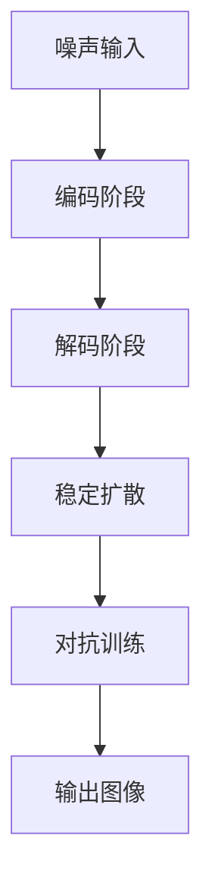

### 第8章：艺术创作中的应用

#### 8.1 生成式AI艺术在艺术创作中的创新

生成式AI艺术在艺术创作中带来了前所未有的创新。通过生成式AI技术，艺术家可以探索新的创作方式和艺术风格，实现更加丰富多样的艺术表达。

##### 8.1.1 生成式AI艺术在绘画中的应用

生成式AI艺术在绘画领域取得了显著成果。艺术家可以使用生成式AI工具生成具有独特风格和创意的绘画作品。例如，通过VQGAN和Stable Diffusion技术，艺术家可以生成人脸、风景、抽象画等各种类型的绘画作品。生成式AI艺术不仅提高了绘画创作的效率，还拓展了绘画艺术的创作空间。

##### 8.1.2 生成式AI艺术在雕塑中的应用

生成式AI艺术在雕塑创作中也展现了巨大潜力。通过生成式AI技术，艺术家可以生成复杂的雕塑形态，实现传统雕塑技术难以达到的创意效果。例如，使用生成式AI技术，艺术家可以生成具有独特结构和形态的雕塑作品，为雕塑艺术注入新的活力。

##### 8.1.3 生成式AI艺术在音乐创作中的应用

生成式AI艺术在音乐创作领域也取得了显著进展。通过生成式AI技术，音乐家可以生成旋律、和声和完整的音乐作品。生成式AI艺术不仅丰富了音乐创作的手段，还为音乐家提供了新的创作灵感和创意。

#### 8.2 艺术创作中的案例解析

以下是一些艺术创作中的案例解析，展示了生成式AI艺术在艺术创作中的应用和创新：

##### 8.2.1 著名艺术家与生成式AI艺术的合作

许多著名艺术家已经尝试与生成式AI艺术合作，创造出独特的艺术作品。例如，艺术家Obvious利用生成式AI技术创作了画作《Edmond de Belamy》，并在拍卖会上以超过40万美元的价格售出。这个案例展示了生成式AI艺术在艺术市场中的潜力和价值。

##### 8.2.2 创意设计公司的案例

一些创意设计公司已经开始使用生成式AI艺术来提升设计质量和效率。例如，Adobe公司推出了一款名为Adobe Sensei的人工智能设计工具，通过生成式AI技术帮助设计师生成创意图像和设计元素。这个案例展示了生成式AI艺术在设计行业中的应用前景。

##### 8.2.3 个性化艺术创作案例

生成式AI艺术为个性化艺术创作提供了新的途径。通过生成式AI技术，艺术家可以为每位客户提供定制化的艺术作品。例如，艺术家可以使用生成式AI技术为客户生成具有个性化元素的人脸、风景或抽象画作品。这种个性化艺术创作方式为艺术家和客户带来了更多的互动和体验。

### 总结

生成式AI艺术在艺术创作中带来了前所未有的创新和变革。通过生成式AI技术，艺术家可以探索新的创作方式和艺术风格，实现更加丰富多样的艺术表达。生成式AI艺术在绘画、雕塑和音乐创作等领域取得了显著成果，为艺术创作注入了新的活力和灵感。

### 图8：艺术创作中的案例解析流程图
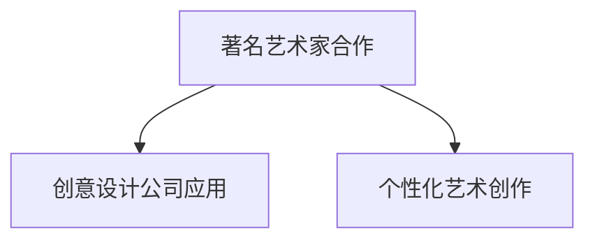

### 第9章：设计行业中的应用

#### 9.1 生成式AI艺术在工业设计中的应用

生成式AI艺术在工业设计领域展现了巨大的潜力。通过生成式AI技术，设计师可以快速生成各种形状、结构和纹理，以探索新的设计概念和解决方案。以下是一些具体的应用案例：

##### 9.1.1 产品设计创新

生成式AI艺术可以帮助设计师探索前所未有的产品设计。例如，通过VQGAN和Stable Diffusion技术，设计师可以生成新颖的汽车设计、电子产品造型和家具设计。这种技术不仅提高了设计效率，还激发了设计师的创意思维。

##### 9.1.2 品牌形象设计

生成式AI艺术在品牌形象设计中也有广泛应用。设计师可以使用生成式AI技术生成独特的品牌标志、标识和视觉元素，从而提升品牌的个性和独特性。例如，通过生成式AI艺术生成的动态视觉标识，可以给品牌带来更具吸引力和现代感的视觉效果。

##### 9.1.3 包装设计

包装设计是另一个受益于生成式AI艺术的领域。通过生成式AI技术，设计师可以生成具有独特视觉效果和纹理的包装设计，以吸引消费者的注意。例如，使用生成式AI艺术生成的包装图案和纹理，可以显著提升产品的市场竞争力。

#### 9.2 设计行业中的案例解析

以下是一些设计行业中的案例解析，展示了生成式AI艺术在实际应用中的效果：

##### 9.2.1 设计公司与生成式AI艺术的合作

许多设计公司已经开始与生成式AI艺术合作，以提升设计质量和效率。例如，德国设计公司iconeme利用生成式AI艺术技术，为客户生成独特的UI/UX设计。这种合作方式不仅提高了设计效率，还为客户提供了更加个性化和创新的设计方案。

##### 9.2.2 创意设计的成功案例

生成式AI艺术在一些创意设计项目中取得了显著成功。例如，意大利设计工作室MetaDesign利用生成式AI艺术技术为意大利航空公司设计了一套全新的视觉识别系统。通过生成式AI艺术生成的独特图形和元素，使整个设计项目具有更高的创新性和视觉冲击力。

##### 9.2.3 个性化设计服务的案例

生成式AI艺术为个性化设计服务提供了新的可能性。设计师可以使用生成式AI技术，为每位客户提供定制化的设计解决方案。例如，一些设计师已经开始提供基于生成式AI艺术的个性化家居设计服务，为每位客户生成符合其个性和风格的家居设计。

### 总结

生成式AI艺术在设计行业中带来了显著的变革和创新。通过生成式AI技术，设计师可以快速生成各种设计概念和解决方案，提高设计效率和质量。生成式AI艺术在工业设计、品牌形象设计和包装设计等领域展现了广泛的应用前景，为设计行业注入了新的活力和创造力。

### 图9：设计行业中的应用案例流程图
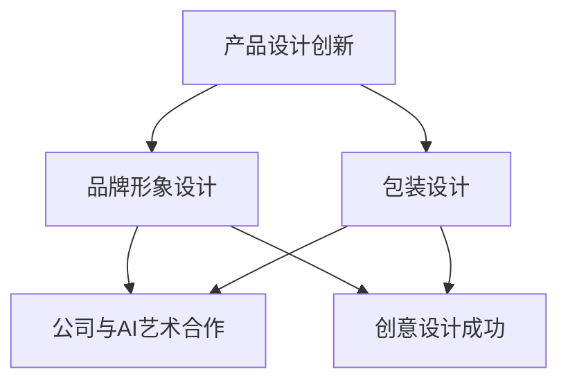

### 第10章：娱乐行业中的应用

#### 10.1 生成式AI艺术在娱乐产业中的应用

生成式AI艺术在娱乐产业中的应用日益广泛，为电影、游戏和音乐等领域的创作带来了新的可能性。以下是一些具体的应用：

##### 10.1.1 游戏设计中的创新

生成式AI艺术在游戏设计中起到了关键作用。通过生成式AI技术，游戏设计师可以快速生成各种场景、角色和关卡。例如，使用VQGAN和Stable Diffusion技术，设计师可以生成独特的游戏角色和场景，为游戏玩家提供更加丰富和多样化的游戏体验。

##### 10.1.2 视频特效

生成式AI艺术在视频特效制作中也具有广泛应用。通过生成式AI技术，特效师可以生成高质量的视觉效果，如火焰、烟雾、光影效果等。例如，使用Stable Diffusion技术，特效师可以快速生成逼真的火焰效果，为电影和电视节目增添更多的视觉冲击力。

##### 10.1.3 音乐创作

生成式AI艺术在音乐创作领域也取得了显著进展。通过生成式AI技术，音乐家可以生成旋律、和声和完整的音乐作品。例如，使用生成式AI艺术工具，音乐家可以生成独特的音乐风格，为电影、电视剧和游戏创作背景音乐。

#### 10.2 娱乐行业中的案例解析

以下是一些娱乐行业中的案例解析，展示了生成式AI艺术在娱乐创作中的应用：

##### 10.2.1 游戏开发中的生成式AI艺术案例

一些游戏开发公司已经开始利用生成式AI艺术技术，为游戏生成各种资源和内容。例如，游戏公司Epic Games利用生成式AI艺术技术，为其游戏《堡垒之夜》生成丰富的环境和角色。这种技术不仅提高了游戏开发效率，还为玩家提供了更加丰富和多样化的游戏体验。

##### 10.2.2 视频制作中的生成式AI艺术案例

在视频制作领域，生成式AI艺术技术也为电影和电视剧的特效制作带来了新的可能性。例如，电影《银翼杀手2049》中使用了生成式AI艺术技术，为观众呈现了逼真的未来城市景观和机械生命体。这种技术不仅提升了电影的视觉效果，还为观众带来了更加沉浸的观影体验。

##### 10.2.3 音乐创作中的生成式AI艺术案例

音乐制作公司也开始利用生成式AI艺术技术，为音乐创作提供新的灵感。例如，音乐家艾米·怀恩豪斯（Amy Winehouse）的遗产团队利用生成式AI艺术技术，创作了一首新的歌曲《Amy》，这首歌曲融合了艾米·怀恩豪斯的音乐风格和现代元素，为听众带来了全新的听觉体验。

### 总结

生成式AI艺术在娱乐行业中展现了巨大的应用潜力。通过生成式AI技术，娱乐创作者可以快速生成各种资源，提高创作效率，并为观众带来更加丰富和多样化的娱乐体验。生成式AI艺术在游戏设计、视频特效和音乐创作等领域都取得了显著成果，为娱乐产业注入了新的活力和创造力。

### 图10：娱乐行业中的应用案例流程图
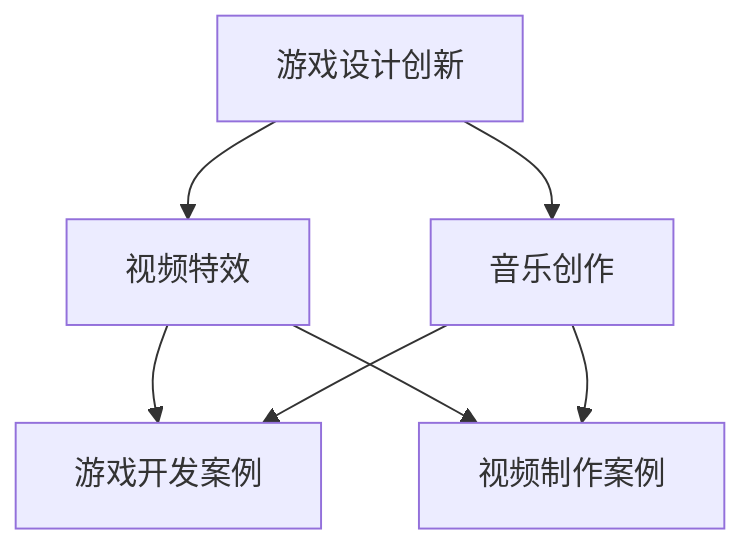

### 第11章：生成式AI艺术的发展趋势

#### 11.1 技术进步与革新

生成式AI艺术的发展离不开技术进步和革新。随着深度学习、生成对抗网络（GAN）和神经网络等技术的不断发展，生成式AI艺术的能力和性能不断提升。未来，我们可以期待以下技术进步：

1. **更先进的神经网络架构**：研究人员将继续探索和开发更高效、更强大的神经网络架构，如生成对抗网络（GAN）的变体、变分自编码器（VAE）的改进等，以提高生成式AI艺术的性能。

2. **自适应优化算法**：优化算法的改进将使生成式AI艺术模型的训练更加高效和稳定。自适应优化算法能够根据模型的状态和性能自动调整学习参数，从而提高训练效率和生成质量。

3. **多模态生成**：随着多模态学习的进展，生成式AI艺术将能够同时处理和生成图像、音频、视频等多种类型的数据，实现更加综合和多样化的艺术创作。

4. **硬件加速**：随着硬件技术的发展，如GPU、TPU等专用硬件的普及，生成式AI艺术的计算速度将得到显著提升，从而实现更快速的艺术生成和应用。

#### 11.2 应用领域的拓展

生成式AI艺术的应用领域将不断拓展，跨越更多的行业和场景。以下是几个可能的应用领域：

1. **医疗影像生成**：生成式AI艺术可以用于生成医疗影像，如X光片、MRI图像等，辅助医生进行诊断和治疗。通过生成式AI艺术，可以模拟各种疾病和病变的情况，为医生提供更加直观的参考。

2. **个性化教育**：生成式AI艺术可以用于生成个性化教育内容，如教学视频、练习题和答案等。通过学习学生的特点和需求，生成式AI艺术可以为学生提供更加符合其学习习惯和风格的教育资源。

3. **虚拟现实与增强现实**：生成式AI艺术可以用于生成虚拟现实（VR）和增强现实（AR）内容，如虚拟场景、角色和环境等。这将为用户提供更加沉浸和互动的体验。

4. **艺术与文化遗产保护**：生成式AI艺术可以用于修复和保护艺术作品和文化遗产。通过生成式AI艺术，可以模拟和恢复受损或丢失的艺术品的原始状态，为文化遗产保护提供新的技术手段。

#### 11.3 社会与伦理影响

生成式AI艺术的发展也带来了社会和伦理方面的影响，需要我们关注和应对：

1. **知识产权问题**：生成式AI艺术生成的作品可能会侵犯他人的知识产权，引发版权纠纷。因此，需要建立更加完善的知识产权保护机制，确保艺术家和创作者的权益得到保障。

2. **道德与社会责任**：生成式AI艺术在创作过程中涉及到伦理问题，如人机创作的归属、艺术价值的评价等。这需要社会各界的共同努力，建立道德规范和社会责任框架，确保生成式AI艺术的发展符合社会价值观。

3. **就业影响**：生成式AI艺术可能会对某些行业和职业产生影响，如艺术创作、设计、媒体等。这需要政府和企业关注就业市场的变化，制定相应的政策和支持措施，帮助受影响的从业者适应新的就业环境。

### 总结

生成式AI艺术的发展趋势显示出技术进步、应用领域拓展和社会伦理影响的深度融合。通过不断的技术革新和应用拓展，生成式AI艺术将为艺术创作、娱乐产业、医疗教育等领域带来更多创新和变革。同时，我们也需要关注和应对其带来的社会和伦理挑战，确保其发展能够为社会带来更大的福祉。

### 图11：生成式AI艺术发展趋势流程图
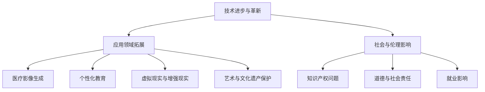

### 第12章：生成式AI艺术的未来

#### 12.1 产业变革

生成式AI艺术的未来将对多个产业产生深远的影响，带来显著的变革。

##### 12.1.1 市场前景与机遇

随着生成式AI技术的不断发展，市场对AI艺术的需求不断增长。预计在未来几年，生成式AI艺术将在以下几个方面带来巨大的市场机遇：

1. **艺术市场**：生成式AI艺术作品逐渐成为艺术品市场的重要组成部分，预计将为艺术家和画廊带来新的收入来源。
2. **设计行业**：生成式AI艺术将在广告、建筑、时尚等领域广泛应用，提升设计效率和创造力。
3. **娱乐产业**：生成式AI艺术在电影、游戏、音乐等娱乐领域的应用将进一步提升用户体验，增加市场潜力。

##### 12.1.2 行业挑战与对策

尽管生成式AI艺术前景广阔，但行业也面临着一系列挑战：

1. **技术限制**：目前生成式AI技术的稳定性和可控性仍需提升，特别是在生成复杂场景和细节方面。研究人员和开发者需要不断优化算法和模型，以提高生成质量。
2. **版权问题**：生成式AI艺术作品的版权归属尚不明确，可能引发法律纠纷。行业需要建立完善的法律框架，明确版权保护和责任归属。
3. **伦理问题**：生成式AI艺术在创作过程中涉及到伦理问题，如艺术价值的评价、人机创作的归属等。行业需要制定道德规范，引导技术发展。

#### 12.2 创新与应用

未来，生成式AI艺术将在多个领域实现创新与应用，推动艺术创作、设计、娱乐等行业的变革。

##### 12.2.1 未来艺术创作的方式

生成式AI艺术将改变传统艺术创作的流程和方式：

1. **协作创作**：艺术家和生成式AI可以共同创作，艺术家提供创意和指导，AI负责生成和优化作品。
2. **个性化创作**：生成式AI可以根据用户的需求和喜好，生成个性化艺术作品，满足不同人群的审美需求。
3. **跨媒介创作**：生成式AI艺术将跨足多种媒介，如图像、音频、视频等，实现更加多样化的艺术形式。

##### 12.2.2 生成式AI艺术的创新应用

生成式AI艺术将在多个行业实现创新应用：

1. **设计行业**：生成式AI艺术将在广告、建筑、时尚等领域发挥重要作用，为设计师提供创意和灵感。
2. **娱乐产业**：生成式AI艺术将提升游戏、电影、音乐等娱乐内容的质量和多样性，为观众带来更丰富的体验。
3. **教育领域**：生成式AI艺术可以生成个性化教育内容，提高教育质量和效果。
4. **医疗领域**：生成式AI艺术可以用于医疗影像的生成和诊断，辅助医生进行疾病检测和治疗方案制定。

#### 12.3 社会影响

生成式AI艺术的未来将对社会产生深远的影响，改变人们的审美观念、生活方式和社会结构。

##### 12.3.1 对传统艺术的影响

生成式AI艺术将对传统艺术产生深远的影响：

1. **艺术价值的重新定义**：随着生成式AI艺术的兴起，艺术价值的评价标准可能发生变化，艺术创作的方式也将出现新的趋势。
2. **艺术创作的民主化**：生成式AI艺术使得艺术创作变得更加普及和民主化，更多的人可以参与到艺术创作中，艺术的形式和风格也将更加多样化。

##### 12.3.2 对社会文化的影响

生成式AI艺术对社会文化的影响也将显著：

1. **文化交流与融合**：生成式AI艺术可以促进不同文化之间的交流和融合，通过艺术的形式传播和展示多样化的文化。
2. **社会认同与自我表达**：生成式AI艺术为个人和社会提供了新的自我表达和认同的方式，人们可以通过AI生成的艺术作品来表达自己的观点和情感。

### 总结

生成式AI艺术的未来充满了机遇和挑战。随着技术的不断进步和应用领域的拓展，生成式AI艺术将在艺术创作、设计、娱乐等多个领域实现创新和应用，对社会文化产生深远的影响。同时，我们也需要关注和解决技术、版权和伦理等方面的问题，确保生成式AI艺术的可持续发展。

### 图12：生成式AI艺术的未来发展趋势流程图
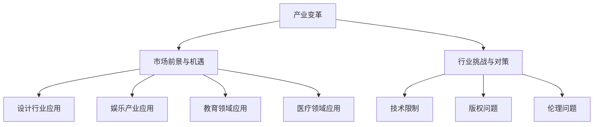

### 附录A：生成式AI艺术资源与工具

#### A.1 主流生成式AI框架与工具

生成式AI艺术的实现离不开主流的AI框架与工具。以下是一些常用的框架与工具：

##### A.1.1 TensorFlow

TensorFlow是由谷歌开发的开源机器学习框架，支持多种深度学习模型的实现。TensorFlow提供了丰富的API，使得构建和训练生成式AI模型变得更加容易。

- **官方网站**：[TensorFlow官网](https://www.tensorflow.org/)
- **GitHub仓库**：[TensorFlow GitHub仓库](https://github.com/tensorflow/tensorflow)

##### A.1.2 PyTorch

PyTorch是由Facebook开发的另一个流行的开源机器学习框架，以其动态计算图和简洁的API而闻名。PyTorch在生成式AI艺术中也有广泛应用。

- **官方网站**：[PyTorch官网](https://pytorch.org/)
- **GitHub仓库**：[PyTorch GitHub仓库](https://github.com/pytorch/pytorch)

##### A.1.3 Keras

Keras是一个高层次的神经网络API，可以运行在TensorFlow和Theano之上。Keras以其简洁的API和易于使用的特性，被广泛应用于深度学习模型开发。

- **官方网站**：[Keras官网](https://keras.io/)
- **GitHub仓库**：[Keras GitHub仓库](https://github.com/keras-team/keras)

#### A.2 数据集与公开资源

生成式AI艺术的研究和实现需要大量的数据集。以下是一些常用的数据集和公开资源：

##### A.2.1 常用数据集

- **CelebA**：一个包含10万张名人人脸图像的数据集，广泛用于人脸识别和生成任务。
- **CIFAR-10**：一个包含60000张32x32彩色图像的数据集，分为10个类别，常用于图像分类任务。
- **ImageNet**：一个包含数百万张图像的数据集，分为1000个类别，是深度学习研究的标准数据集。

##### A.2.2 开源项目与代码库

- **OpenAI**：OpenAI提供了一系列开源项目，包括用于图像生成的DALL-E、用于文本生成的GPT等。
- **StyleCLIP**：一个开源的代码库，用于实现基于StyleGAN的图像生成模型。

#### A.3 相关书籍与论文

以下是一些推荐的书籍和论文，有助于深入了解生成式AI艺术：

##### A.3.1 推荐书籍

- 《Deep Learning》（Ian Goodfellow, Yoshua Bengio, Aaron Courville）是一本经典的深度学习教材，详细介绍了深度学习的基础知识和应用。
- 《Generative Adversarial Networks》（Ian J. Goodfellow）是一本专门介绍生成对抗网络（GAN）的书籍，涵盖了GAN的理论和实践。

##### A.3.2 关键论文

- **“Generative Adversarial Nets”（Ian Goodfellow et al., 2014）**：这是GAN的开创性论文，介绍了GAN的基本原理和实现方法。
- **“Unsupervised Representation Learning with Deep Convolutional Generative Adversarial Networks”（Alec Radford et al., 2015）**：该论文介绍了DCGAN，一个基于深度卷积神经网络的GAN模型。

### 总结

附录A提供了生成式AI艺术领域的主要资源与工具，包括主流框架与工具、常用的数据集和公开资源，以及推荐的书籍和论文。这些资源为研究者和技术人员提供了丰富的学习材料和实践机会，有助于进一步探索生成式AI艺术的潜力。

### 图A：生成式AI艺术资源与工具流程图
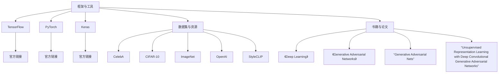

### 作者信息

作者：AI天才研究院/AI Genius Institute & 禅与计算机程序设计艺术 /Zen And The Art of Computer Programming

AI天才研究院（AI Genius Institute）是一家专注于人工智能研究和应用的创新机构，致力于推动AI技术的创新与发展。研究院的专家团队在生成式AI艺术、深度学习、计算机视觉等领域取得了丰硕的成果，为行业提供了有价值的参考和实践经验。

《禅与计算机程序设计艺术》（Zen And The Art of Computer Programming）是作者在计算机编程领域的一部经典著作，深入探讨了编程的本质和方法论，为程序员提供了一套系统化的编程思维和技巧。该书对于提升编程能力和创新思维具有深远的影响。

