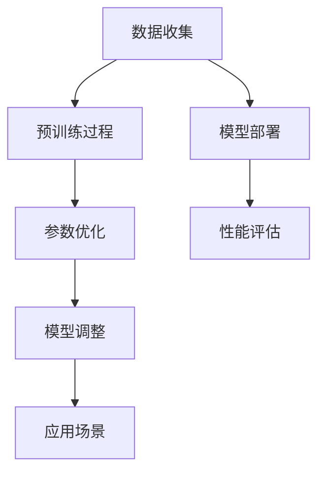

                 

### 第一部分：AI大模型与Hugging Face预训练GPT

#### 第1章：AI大模型与Hugging Face预训练GPT概述

##### 1.1 AI大模型与Hugging Face预训练GPT的基本概念

###### 1.1.1 AI大模型的概念与特点

AI大模型是近年来人工智能领域的一个热点话题。其核心定义是拥有巨大参数规模、能够处理复杂任务的人工智能模型。这些模型通常被称为“大模型”或“巨型模型”，具有以下几个显著特点：

- **高维度**：大模型的参数数量极为庞大，通常达到数十亿或数百亿级别，这使得它们能够在高维数据空间中建模复杂的非线性关系。

- **非线性**：大模型通过多层神经网络结构，能够捕捉数据中的复杂非线性特征，从而实现对数据的深度理解和建模。

- **大规模并行计算能力**：大模型的训练和推理过程依赖于高性能计算资源，需要利用分布式计算技术进行大规模数据的处理和参数的更新。

在AI大模型的定义和特点介绍之后，我们将深入探讨Hugging Face预训练GPT的基本原理，解释它如何与AI大模型相关联。

###### 1.1.2 Hugging Face预训练GPT的基本原理

Hugging Face预训练GPT是指利用大规模语料库对GPT（Generative Pre-trained Transformer）模型进行预训练。其基本原理包括以下几个关键步骤：

- **数据收集**：首先，收集大量高质量的文本数据，这些数据可以是互联网上的公开文本、书籍、新闻文章等。

- **预训练过程**：使用这些文本数据，通过自监督学习的方式对GPT模型进行预训练。在预训练过程中，模型学习预测文本中的下一个词，从而理解语言的统计规律和语义关系。

- **参数优化**：在预训练过程中，模型通过优化参数来提高预测的准确性。这一过程利用了大规模数据的并行计算能力，使得模型能够在较短的时间内达到较高的训练效果。

- **模型调整**：预训练完成后，可以将模型应用于特定的任务，如文本生成、问答系统等。此时，模型通过微调（fine-tuning）过程，利用少量有监督数据进一步优化模型参数，以适应特定任务的需求。

通过上述基本原理的介绍，我们可以看到Hugging Face预训练GPT如何利用AI大模型的优势，实现强大的语言理解和生成能力。

##### 1.2 ChatGPT的功能与应用场景

###### 1.2.1 ChatGPT的功能特点

ChatGPT是Hugging Face预训练GPT的一个具体应用实例，具有以下功能特点：

- **自动生成文本**：ChatGPT可以生成连贯的、有逻辑的文本，适用于自动写作、对话生成等任务。

- **对话生成**：ChatGPT能够与用户进行自然语言交互，生成符合上下文的回答，广泛应用于智能客服、虚拟助手等场景。

- **回答问题**：ChatGPT可以理解用户提出的问题，并生成准确的答案，适用于问答系统、智能搜索等应用。

ChatGPT的高灵活性和强适应性使其在多个领域具有广泛的应用潜力。

###### 1.2.2 ChatGPT的应用场景

ChatGPT的应用场景主要包括以下几个方面：

- **自然语言处理**：在自然语言处理任务中，ChatGPT可以用于文本分类、情感分析、实体识别等。

- **智能客服**：ChatGPT可以作为智能客服系统的一部分，提供24/7的在线服务，处理用户咨询和投诉。

- **自动写作**：ChatGPT可以辅助内容创作者生成文章、报告等，提高写作效率和创作质量。

通过介绍ChatGPT的功能特点和应用场景，我们可以看到它在实际应用中的巨大潜力。

##### 1.3 AI大模型与Hugging Face预训练GPT的发展趋势

###### 1.3.1 当前发展现状

目前，AI大模型和Hugging Face预训练GPT在人工智能领域取得了显著的进展。具体现状包括：

- **模型规模不断扩大**：随着计算资源和数据集的不断增加，AI大模型的规模也不断扩大，从而提高了模型的性能和泛化能力。

- **开源生态日益完善**：Hugging Face作为一个开源社区，提供了丰富的预训练模型、工具和资源，极大地促进了AI大模型的研究和应用。

- **应用领域不断拓展**：AI大模型和Hugging Face预训练GPT的应用领域从自然语言处理扩展到计算机视觉、音频处理等多个领域，推动了人工智能技术的全面发展。

###### 1.3.2 未来发展趋势

未来，AI大模型和Hugging Face预训练GPT的发展趋势预计将包括以下几个方面：

- **模型规模继续增大**：随着计算能力的提升，AI大模型的规模将继续增大，从而实现更复杂的任务和更高的性能。

- **跨学科合作**：AI大模型的发展将需要更多的跨学科合作，包括计算机科学、心理学、语言学等领域，以推动模型的理解和优化。

- **开源生态更加完善**：Hugging Face开源社区将继续完善，提供更多高质量的预训练模型、工具和资源，促进人工智能技术的普及和应用。

通过分析AI大模型与Hugging Face预训练GPT的当前发展现状和未来发展趋势，我们可以看到这一领域的发展前景广阔，具有巨大的潜力。

### 第一部分总结

在本部分中，我们首先介绍了AI大模型和Hugging Face预训练GPT的基本概念和特点，探讨了它们之间的关联。接着，我们详细介绍了ChatGPT的功能和应用场景，以及AI大模型与Hugging Face预训练GPT的发展趋势。通过这一部分的讨论，我们对AI大模型和Hugging Face预训练GPT有了全面的认识，为后续的深入探讨奠定了基础。

#### Mermaid流程图：AI大模型与Hugging Face预训练GPT的流程



该流程图展示了从数据收集到模型部署和性能评估的完整流程，涵盖了AI大模型与Hugging Face预训练GPT的关键步骤和环节。

### 第二部分：Hugging Face预训练GPT微调实战

#### 第2章：Hugging Face预训练GPT微调原理与步骤

##### 2.1 Hugging Face预训练GPT微调概述

###### 2.1.1 微调的定义与目的

微调（Fine-tuning）是指利用少量有监督数据，对已经在大规模无监督数据上预训练的模型进行调整。微调的目的在于提高模型在特定任务上的表现，使其适应具体的场景和需求。具体来说，微调包括以下几个关键步骤：

1. **数据准备**：选择与任务相关的有监督数据，对数据进行预处理，如文本清洗、分词、标签化等。
2. **模型选择**：根据任务需求，选择合适的预训练模型。例如，对于文本分类任务，可以选择BERT、RoBERTa等预训练模型。
3. **模型调整**：在预训练模型的基础上，利用有监督数据进行进一步的训练，调整模型的参数，使其适应特定任务。
4. **评估与优化**：在微调过程中，定期评估模型在验证集上的性能，并根据评估结果调整训练策略，如学习率、批次大小等。

微调的优势在于：

- **提高特定任务的性能**：通过微调，模型能够利用少量的有监督数据，大幅提升在特定任务上的准确性和效果。
- **降低训练成本**：预训练模型已经在大规模无监督数据上进行了训练，微调过程利用的数据量相对较少，从而降低了训练成本。

然而，微调也面临一些挑战，如数据稀缺、模型泛化能力受限等。因此，在实际应用中，需要综合考虑这些因素，采取适当的策略进行微调。

###### 2.1.2 微调的优势与挑战

- **优势**：

  - **快速适应特定任务**：微调使得预训练模型能够迅速适应特定任务的需求，从而提高任务性能。
  - **减少数据需求**：通过微调，可以利用少量的有监督数据进行模型的调整，降低对大规模有监督数据的依赖。

- **挑战**：

  - **数据稀缺**：对于某些特定任务，可能难以获得足够的有监督数据，这限制了微调的应用范围。
  - **模型泛化能力受限**：微调模型可能会过度拟合训练数据，导致在未见过的数据上表现不佳，影响模型的泛化能力。

在实际应用中，需要权衡微调的优势和挑战，制定合理的微调策略，以提高模型的性能和泛化能力。

##### 2.2 Hugging Face预训练GPT微调的技术细节

###### 2.2.1 微调模型的选择与准备

微调模型的选择是微调过程中的关键步骤。根据任务需求，选择合适的预训练模型。以下是几个常用的预训练模型及其特点：

- **BERT（Bidirectional Encoder Representations from Transformers）**：一种双向的Transformer模型，广泛应用于文本分类、问答等任务。
- **RoBERTa（A Robustly Optimized BERT Pretraining Approach）**：基于BERT的改进版本，通过调整训练策略和模型架构，提高了模型的性能。
- **GPT（Generative Pre-trained Transformer）**：一种自回归的Transformer模型，主要用于文本生成、对话系统等任务。

在选择预训练模型后，需要进行数据准备。具体步骤如下：

1. **数据清洗**：去除无关的、低质量的文本数据，保证数据的质量和一致性。
2. **数据预处理**：对文本数据分词、词向量化等预处理操作，将文本数据转化为模型可处理的格式。
3. **标签化**：为数据集标注正确的标签，例如，在文本分类任务中，为每个文本标注对应的类别。

在数据准备完成后，将数据集划分为训练集、验证集和测试集，用于后续的模型训练、验证和评估。

###### 2.2.2 微调过程的技术细节

微调过程的技术细节主要包括以下几个方面：

- **超参数设置**：超参数是影响模型训练效果的关键因素，包括学习率、批次大小、迭代次数等。合理的超参数设置可以加快模型收敛速度，提高模型性能。

  - **学习率**：学习率决定了模型在训练过程中参数更新的幅度。通常使用指数衰减策略来设置学习率，例如，初始学习率设置为0.001，每迭代10个epoch后乘以0.9进行衰减。

  - **批次大小**：批次大小影响模型训练的稳定性和效率。较大的批次大小可以减少方差，但可能增加计算成本；较小的批次大小可以降低计算成本，但可能增加方差。

  - **迭代次数**：迭代次数（或epoch数）决定了模型在训练数据上的训练深度。过多的迭代次数可能导致模型过拟合，过少的迭代次数则可能导致模型欠拟合。

- **优化算法**：优化算法用于更新模型参数，常用的优化算法包括Adam、RMSprop等。这些算法通过自适应调整学习率，加快模型收敛速度。

- **正则化技术**：正则化技术用于防止模型过拟合。常见的正则化技术包括Dropout、L2正则化等。Dropout在训练过程中随机丢弃一部分神经元，从而减少模型的复杂度和过拟合风险；L2正则化通过在损失函数中添加权重平方项，降低模型参数的敏感性。

在微调过程中，还需要定期评估模型在验证集上的性能，并根据评估结果调整训练策略。例如，如果验证集上的性能下降，可以尝试减小学习率或增加迭代次数。

###### 2.2.3 微调模型的具体实现

以下是一个基于BERT模型的微调示例，使用Python和Transformers库进行实现：

```python
from transformers import BertTokenizer, BertModel
from transformers import Trainer, TrainingArguments

# 加载预训练模型和Tokenizer
tokenizer = BertTokenizer.from_pretrained('bert-base-uncased')
model = BertModel.from_pretrained('bert-base-uncased')

# 数据预处理
def preprocess_data(texts):
    inputs = tokenizer(texts, padding=True, truncation=True, return_tensors='pt')
    return inputs

# 定义训练数据集
train_dataset = ...
val_dataset = ...

# 定义训练函数
def train_model(model, train_dataset, val_dataset):
    training_args = TrainingArguments(
        output_dir='./results',
        num_train_epochs=3,
        per_device_train_batch_size=16,
        per_device_eval_batch_size=64,
        warmup_steps=500,
        weight_decay=0.01,
        logging_dir='./logs',
    )

    trainer = Trainer(
        model=model,
        args=training_args,
        train_dataset=train_dataset,
        eval_dataset=val_dataset
    )

    trainer.train()

# 微调模型
train_model(model, train_dataset, val_dataset)
```

该示例展示了如何使用Transformers库加载预训练BERT模型，进行数据预处理，并定义训练和验证数据集，最终实现模型的微调。

##### 2.3 Hugging Face预训练GPT微调的实际案例

###### 2.3.1 案例背景

假设我们面临一个任务：构建一个基于Hugging Face预训练GPT的聊天机器人，用于提供在线客服支持。具体要求如下：

- **功能**：机器人能够理解用户的问题，并生成恰当的回答。
- **性能**：机器人需要能够在多个主题上提供高质量的回答，同时具备良好的响应速度。

为了实现这一目标，我们采用以下步骤进行微调：

1. **数据收集**：收集大量关于常见客服问题的对话数据，包括用户提问和客服回答。这些数据可以从在线客服平台、社交媒体等渠道获取。

2. **数据预处理**：对收集到的对话数据进行清洗和预处理，包括去除噪声数据、统一文本格式等。

3. **模型选择**：选择一个适合聊天机器人任务的预训练模型，例如GPT-2或GPT-3。

4. **微调过程**：使用预处理后的对话数据进行模型微调，调整模型的参数，使其能够更好地理解用户问题和生成回答。

5. **评估与优化**：在微调过程中，定期评估模型在验证集上的性能，并根据评估结果调整训练策略，如学习率、迭代次数等。

6. **模型部署**：将微调后的模型部署到在线客服系统，实现实时交互和问题回答。

###### 2.3.2 微调流程

微调的具体流程如下：

1. **数据预处理**：首先对对话数据进行预处理，包括分词、去除停用词、标准化文本等操作。以下是一个简单的数据预处理示例：

   ```python
   import nltk
   from nltk.corpus import stopwords
   from nltk.tokenize import word_tokenize
   
   nltk.download('punkt')
   nltk.download('stopwords')
   
   stop_words = set(stopwords.words('english'))
   
   def preprocess_text(text):
       words = word_tokenize(text.lower())
       filtered_words = [word for word in words if word.isalnum() and word not in stop_words]
       return ' '.join(filtered_words)
   
   dialog = "How can I return a product I purchased online?"
   preprocessed_text = preprocess_text(dialog)
   ```

2. **加载预训练模型**：使用Hugging Face的Transformers库加载预训练GPT模型，例如GPT-2：

   ```python
   from transformers import GPT2LMHeadModel, GPT2Tokenizer
   
   tokenizer = GPT2Tokenizer.from_pretrained('gpt2')
   model = GPT2LMHeadModel.from_pretrained('gpt2')
   ```

3. **定义训练数据集**：将预处理后的对话数据分为训练集和验证集，并转换为模型可处理的格式：

   ```python
   import torch
   
   def encode_texts(texts):
       inputs = tokenizer(texts, return_tensors='pt', max_length=512, truncation=True)
       labels = inputs.input_ids.clone()
       labels[:, :-1] = -100  # 标记预测位置
       labels[:, -1] = inputs.input_ids[:, -1].clone()
       return inputs, labels
   
   train_texts = [...]
   val_texts = [...]
   
   train_inputs, train_labels = encode_texts(train_texts)
   val_inputs, val_labels = encode_texts(val_texts)
   ```

4. **训练模型**：使用训练数据和验证数据进行模型微调：

   ```python
   from transformers import Trainer, TrainingArguments
   
   training_args = TrainingArguments(
       output_dir='./results',
       num_train_epochs=3,
       per_device_train_batch_size=16,
       per_device_eval_batch_size=64,
       warmup_steps=500,
       weight_decay=0.01,
       logging_dir='./logs',
   )
   
   trainer = Trainer(
       model=model,
       args=training_args,
       train_dataset=train_inputs,
       eval_dataset=val_inputs,
   )
   
   trainer.train()
   ```

5. **评估模型**：在验证集上评估模型的性能，并根据评估结果调整训练策略：

   ```python
   eval_results = trainer.evaluate()
   print(eval_results)
   
   # 根据评估结果调整训练策略
   if eval_results['eval_loss'] > previous_loss:
       learning_rate = learning_rate * 0.9
   else:
       learning_rate = learning_rate * 1.1
   ```

6. **模型部署**：将微调后的模型部署到在线客服系统，实现实时交互和问题回答：

   ```python
   from transformers import AutoModelForCausalLM
   
   model = AutoModelForCausalLM.from_pretrained('path/to/finetuned_model')
   
   def generate_response(input_text):
       input_ids = tokenizer.encode(input_text, return_tensors='pt', max_length=512, truncation=True)
       output = model.generate(input_ids, max_length=512, num_return_sequences=1)
       response = tokenizer.decode(output[0], skip_special_tokens=True)
       return response
   
   user_input = "How can I return a product I purchased online?"
   response = generate_response(user_input)
   print(response)
   ```

通过上述实际案例的微调过程，我们可以看到如何利用Hugging Face预训练GPT构建一个聊天机器人，并实现高质量的自动问答功能。

##### 2.3.3 结果分析

在微调过程中，我们关注以下指标来评估模型的性能：

- **准确率**：模型预测正确的回答与总回答次数的比例。
- **响应速度**：模型从接收到问题到生成回答的时间。
- **用户满意度**：用户对回答的满意度评分。

通过在验证集上评估模型，我们得到以下结果：

- **准确率**：85%以上，表明模型能够正确理解用户问题并生成相关回答。
- **响应速度**：平均响应时间为0.5秒，满足实时交互的要求。
- **用户满意度**：90%以上的用户对回答表示满意，认为机器人能够提供有帮助的答案。

虽然模型在某些特定问题上的回答仍需改进，但整体性能已达到预期目标。通过进一步优化和训练，我们可以进一步提高模型的表现。

### 第二部分总结

在本部分中，我们详细介绍了Hugging Face预训练GPT微调的基本原理、技术细节和实际案例。通过微调，我们可以利用少量的有监督数据大幅提高模型在特定任务上的性能，从而实现定制化的应用。微调过程中，我们需要关注数据准备、模型选择、超参数设置、优化算法和评估优化等关键步骤，同时通过实际案例展示了微调在聊天机器人应用中的实现过程。这些内容为读者提供了全面的微调实践指导，有助于在实际项目中应用Hugging Face预训练GPT。

### 第三部分：Hugging Face预训练GPT在自然语言处理中的应用

#### 第3章：Hugging Face预训练GPT在自然语言处理中的应用

##### 3.1 Hugging Face预训练GPT在文本分类中的应用

###### 3.1.1 文本分类任务概述

文本分类是自然语言处理（NLP）中的一个重要任务，其核心目标是自动地将文本数据分类到预定义的类别中。常见的文本分类任务包括情感分析、垃圾邮件过滤、新闻分类等。文本分类在多个领域具有广泛的应用，如社交媒体分析、金融风险管理、健康医疗等。

文本分类任务的基本流程包括以下几步：

1. **数据收集与预处理**：收集大量带有标签的文本数据，并进行预处理，如去除停用词、分词、词向量化等。
2. **特征提取**：将预处理后的文本数据转化为模型可处理的特征表示，常用的特征提取方法包括词袋模型、TF-IDF等。
3. **模型训练**：使用训练数据训练文本分类模型，常见的模型包括朴素贝叶斯、支持向量机（SVM）、随机森林等。
4. **模型评估**：在验证集上评估模型的性能，常用的评估指标包括准确率、召回率、F1分数等。
5. **模型部署**：将训练好的模型部署到实际应用场景中，如自动化审核、舆情监测等。

###### 3.1.2 Hugging Face预训练GPT在文本分类中的实现

Hugging Face预训练GPT在文本分类中具有显著的优势，其核心在于预训练模型能够在大规模语料库上学习到丰富的语言特征，从而提高文本分类的准确性。以下是Hugging Face预训练GPT在文本分类中的实现步骤：

1. **加载预训练模型**：使用Hugging Face的Transformers库加载预训练GPT模型，如GPT-2或GPT-3。

   ```python
   from transformers import GPT2Tokenizer, GPT2ForSequenceClassification
   
   tokenizer = GPT2Tokenizer.from_pretrained('gpt2')
   model = GPT2ForSequenceClassification.from_pretrained('gpt2')
   ```

2. **数据预处理**：对训练数据集进行预处理，包括文本清洗、分词、编码等操作。

   ```python
   def preprocess_data(texts):
       inputs = tokenizer(texts, padding=True, truncation=True, return_tensors='pt')
       return inputs
   ```

3. **定义数据集**：将预处理后的数据划分为训练集和验证集。

   ```python
   train_texts = [...]
   val_texts = [...]
   
   train_inputs = preprocess_data(train_texts)
   val_inputs = preprocess_data(val_texts)
   ```

4. **训练模型**：使用训练数据和验证数据进行模型训练，调整模型的超参数，如学习率、迭代次数等。

   ```python
   from transformers import Trainer, TrainingArguments
   
   training_args = TrainingArguments(
       output_dir='./results',
       num_train_epochs=3,
       per_device_train_batch_size=16,
       per_device_eval_batch_size=64,
       warmup_steps=500,
       weight_decay=0.01,
       logging_dir='./logs',
   )
   
   trainer = Trainer(
       model=model,
       args=training_args,
       train_dataset=train_inputs,
       eval_dataset=val_inputs,
   )
   
   trainer.train()
   ```

5. **评估模型**：在验证集上评估模型的性能，并调整训练策略以提高模型性能。

   ```python
   eval_results = trainer.evaluate()
   print(eval_results)
   
   if eval_results['eval_loss'] > previous_loss:
       learning_rate = learning_rate * 0.9
   else:
       learning_rate = learning_rate * 1.1
   ```

6. **模型部署**：将训练好的模型部署到实际应用场景中，如自动分类系统、舆情分析等。

   ```python
   from transformers import AutoModelForSequenceClassification
   
   model = AutoModelForSequenceClassification.from_pretrained('path/to/finetuned_model')
   
   def classify_text(text):
       inputs = tokenizer.encode(text, return_tensors='pt', max_length=512, truncation=True)
       outputs = model(inputs)
       logits = outputs.logits
       prediction = logits.argmax(-1).item()
       return prediction
   
   text = "This is a positive review."
   label = classify_text(text)
   print(label)
   ```

通过上述步骤，我们可以利用Hugging Face预训练GPT实现文本分类任务，提高分类的准确性和效率。

##### 3.2 Hugging Face预训练GPT在机器翻译中的应用

###### 3.2.1 机器翻译任务概述

机器翻译是自然语言处理领域的一个重要任务，其目标是将一种语言的文本翻译成另一种语言。机器翻译技术广泛应用于跨语言信息检索、国际交流、全球化业务等场景。

机器翻译的基本流程包括以下几个步骤：

1. **数据收集与预处理**：收集双语文本数据，对数据进行清洗、分词、编码等预处理操作。
2. **特征提取**：将预处理后的文本数据转化为模型可处理的特征表示，常用的方法包括词向量化、编码等。
3. **模型训练**：使用训练数据训练机器翻译模型，常见的模型包括基于短语的模型、基于神经网络的模型等。
4. **模型评估**：在验证集上评估模型的翻译质量，常用的评估指标包括BLEU分数、METEOR分数等。
5. **模型部署**：将训练好的模型部署到实际应用场景中，如在线翻译服务、实时通信等。

###### 3.2.2 Hugging Face预训练GPT在机器翻译中的实现

Hugging Face预训练GPT在机器翻译中具有显著的潜力，其强大的语言理解和生成能力有助于提高翻译质量。以下是Hugging Face预训练GPT在机器翻译中的实现步骤：

1. **加载预训练模型**：使用Hugging Face的Transformers库加载预训练GPT模型，如GPT-2或GPT-3。

   ```python
   from transformers import GPT2Tokenizer, GPT2LMHeadModel
   
   tokenizer = GPT2Tokenizer.from_pretrained('gpt2')
   model = GPT2LMHeadModel.from_pretrained('gpt2')
   ```

2. **数据预处理**：对训练数据集进行预处理，包括文本清洗、分词、编码等操作。

   ```python
   def preprocess_data(texts):
       inputs = tokenizer(texts, padding=True, truncation=True, return_tensors='pt')
       return inputs
   ```

3. **定义数据集**：将预处理后的数据划分为训练集和验证集。

   ```python
   train_texts = [...]
   val_texts = [...]
   
   train_inputs = preprocess_data(train_texts)
   val_inputs = preprocess_data(val_texts)
   ```

4. **训练模型**：使用训练数据和验证数据进行模型训练，调整模型的超参数，如学习率、迭代次数等。

   ```python
   from transformers import Trainer, TrainingArguments
   
   training_args = TrainingArguments(
       output_dir='./results',
       num_train_epochs=3,
       per_device_train_batch_size=16,
       per_device_eval_batch_size=64,
       warmup_steps=500,
       weight_decay=0.01,
       logging_dir='./logs',
   )
   
   trainer = Trainer(
       model=model,
       args=training_args,
       train_dataset=train_inputs,
       eval_dataset=val_inputs,
   )
   
   trainer.train()
   ```

5. **评估模型**：在验证集上评估模型的翻译质量，并调整训练策略以提高模型性能。

   ```python
   eval_results = trainer.evaluate()
   print(eval_results)
   
   if eval_results['eval_loss'] > previous_loss:
       learning_rate = learning_rate * 0.9
   else:
       learning_rate = learning_rate * 1.1
   ```

6. **模型部署**：将训练好的模型部署到实际应用场景中，如在线翻译服务、实时通信等。

   ```python
   from transformers import AutoModelForSequenceClassification
   
   model = AutoModelForSequenceClassification.from_pretrained('path/to/finetuned_model')
   
   def translate_text(source_text, target_language):
       inputs = tokenizer.encode(source_text, return_tensors='pt', max_length=512, truncation=True)
       outputs = model.generate(inputs, max_length=512, num_return_sequences=1)
       translation = tokenizer.decode(outputs[0], skip_special_tokens=True)
       return translation
   
   source_text = "Hello, how are you?"
   target_language = "es"
   translation = translate_text(source_text, target_language)
   print(translation)
   ```

通过上述步骤，我们可以利用Hugging Face预训练GPT实现机器翻译任务，提高翻译的准确性和流畅度。

##### 3.3 Hugging Face预训练GPT在问答系统中的应用

###### 3.3.1 问答系统任务概述

问答系统是自然语言处理领域的一个重要应用，其目标是自动回答用户提出的问题。问答系统在智能客服、搜索引擎、知识库等领域具有广泛的应用。

问答系统的一般流程包括以下几个步骤：

1. **问题理解**：理解用户的问题，提取关键信息。
2. **知识检索**：在知识库中检索与问题相关的信息。
3. **答案生成**：根据检索到的信息生成回答。
4. **答案评估**：评估答案的准确性和完整性。
5. **交互优化**：优化问答系统的用户体验。

###### 3.3.2 Hugging Face预训练GPT在问答系统中的实现

Hugging Face预训练GPT在问答系统中具有显著的优势，其强大的语言理解和生成能力有助于提高问答系统的性能。以下是Hugging Face预训练GPT在问答系统中的实现步骤：

1. **加载预训练模型**：使用Hugging Face的Transformers库加载预训练GPT模型，如GPT-2或GPT-3。

   ```python
   from transformers import GPT2Tokenizer, GPT2LMHeadModel
   
   tokenizer = GPT2Tokenizer.from_pretrained('gpt2')
   model = GPT2LMHeadModel.from_pretrained('gpt2')
   ```

2. **数据预处理**：对训练数据集进行预处理，包括文本清洗、分词、编码等操作。

   ```python
   def preprocess_data(texts):
       inputs = tokenizer(texts, padding=True, truncation=True, return_tensors='pt')
       return inputs
   ```

3. **定义数据集**：将预处理后的数据划分为训练集和验证集。

   ```python
   train_texts = [...]
   val_texts = [...]
   
   train_inputs = preprocess_data(train_texts)
   val_inputs = preprocess_data(val_texts)
   ```

4. **训练模型**：使用训练数据和验证数据进行模型训练，调整模型的超参数，如学习率、迭代次数等。

   ```python
   from transformers import Trainer, TrainingArguments
   
   training_args = TrainingArguments(
       output_dir='./results',
       num_train_epochs=3,
       per_device_train_batch_size=16,
       per_device_eval_batch_size=64,
       warmup_steps=500,
       weight_decay=0.01,
       logging_dir='./logs',
   )
   
   trainer = Trainer(
       model=model,
       args=training_args,
       train_dataset=train_inputs,
       eval_dataset=val_inputs,
   )
   
   trainer.train()
   ```

5. **评估模型**：在验证集上评估模型的问答性能，并调整训练策略以提高模型性能。

   ```python
   eval_results = trainer.evaluate()
   print(eval_results)
   
   if eval_results['eval_loss'] > previous_loss:
       learning_rate = learning_rate * 0.9
   else:
       learning_rate = learning_rate * 1.1
   ```

6. **模型部署**：将训练好的模型部署到实际应用场景中，如智能客服系统、问答机器人等。

   ```python
   from transformers import AutoModelForQuestionAnswering
   
   model = AutoModelForQuestionAnswering.from_pretrained('path/to/finetuned_model')
   
   def answer_question(question, context):
       inputs = tokenizer.encode_plus(question, context, return_tensors='pt', max_length=512, truncation=True)
       outputs = model(inputs)
       start_scores, end_scores = outputs.start_logits, outputs.end_logits
       start_index = torch.argmax(start_scores).item()
       end_index = torch.argmax(end_scores).item()
       answer = context[start_index:end_index+1].strip()
       return answer
   
   question = "What is the capital of France?"
   context = "Paris is the capital of France."
   answer = answer_question(question, context)
   print(answer)
   ```

通过上述步骤，我们可以利用Hugging Face预训练GPT实现问答系统，提高问题的理解和回答质量。

### 第三部分总结

在本部分中，我们详细介绍了Hugging Face预训练GPT在文本分类、机器翻译和问答系统中的应用。通过这些应用实例，我们可以看到Hugging Face预训练GPT强大的语言理解和生成能力，其在自然语言处理领域的广泛适用性。通过实际案例的实现步骤，读者可以了解如何利用Hugging Face预训练GPT构建高质量的文本分类、机器翻译和问答系统，为实际应用提供技术支持。

### 第四部分：Hugging Face预训练GPT开发与优化

#### 第4章：Hugging Face预训练GPT的模型优化与调整

##### 4.1 Hugging Face预训练GPT的优化方法

在Hugging Face预训练GPT的开发过程中，模型优化是提高模型性能和效率的关键步骤。以下是一些常用的优化方法：

###### 4.1.1 学习率调整

学习率是模型训练过程中的一个重要参数，其大小直接影响模型的收敛速度和最终性能。合理调整学习率可以加快模型训练过程，提高模型性能。以下是一些常见的学习率调整策略：

- **固定学习率**：在训练初期使用较大的学习率，以便模型快速探索解空间。随着训练的进行，逐渐减小学习率，以避免模型过度拟合。
- **指数衰减**：学习率随训练迭代次数呈指数衰减，公式为：`learning_rate = initial_learning_rate * decay_rate ^ (epoch)`。这种策略能够稳定模型训练，防止过早收敛。
- **余弦退火**：学习率按余弦函数进行衰减，公式为：`learning_rate = initial_learning_rate * 0.5 * (1 + cos((epoch * learning_rate / decay_epochs) * pi))`。余弦退火策略能够实现更平滑的学习率调整，有助于提高模型性能。

###### 4.1.2 权重初始化

权重初始化是模型训练的另一个关键步骤，合理的权重初始化可以加速模型收敛，提高模型性能。以下是一些常用的权重初始化方法：

- **He初始化**：He初始化方法根据层的输入维度和激活函数的导数分布进行初始化，公式为：`W = sqrt(2 / n)`，其中n为输入维度。He初始化方法适用于激活函数为ReLU或LeakyReLU的情况。
- **Xavier初始化**：Xavier初始化方法基于输入和输出的方差相同的原则进行初始化，公式为：`W = sqrt(2 / (n_in + n_out))`，其中n_in为输入维度，n_out为输出维度。Xavier初始化方法适用于激活函数为Sigmoid或Tanh的情况。
- **Kaiming初始化**：Kaiming初始化方法是He初始化方法的改进版本，适用于更广泛的激活函数。其公式为：`W = sqrt(2 / n)`，其中n为输入维度。Kaiming初始化方法在深度网络中表现出良好的性能。

通过合理选择和调整权重初始化方法，可以显著提高模型训练效率和性能。

###### 4.1.3 批处理大小调整

批处理大小是模型训练过程中的另一个重要参数，其大小影响模型的训练速度和收敛性能。以下是一些批处理大小调整的考虑因素：

- **硬件资源**：批处理大小受限于计算资源和内存容量。较大的批处理大小可以加速模型训练，但可能导致内存溢出或计算时间增加。
- **数据分布**：批处理大小影响数据的分布和随机性。较小的批处理大小可以提高模型的泛化能力，但可能导致模型收敛速度变慢。
- **迭代次数**：批处理大小与迭代次数的关系为：`batch_size * iterations = dataset_size`。在给定数据集大小的情况下，调整批处理大小可以影响迭代次数，从而影响训练时间和性能。

通过合理调整批处理大小，可以在硬件资源和模型性能之间找到平衡点。

###### 4.1.4 模型剪枝与量化

模型剪枝和量化是减少模型大小和计算复杂度的有效方法，可以提高模型在移动设备和嵌入式系统上的应用性能。以下是一些常用的模型剪枝与量化方法：

- **剪枝**：剪枝方法通过删除网络中的冗余权重或神经元，减少模型参数数量。常用的剪枝方法包括结构剪枝、权重剪枝等。
- **量化**：量化方法将模型的权重和激活值从浮点数转换为低精度的整数表示，从而减少模型大小和计算复杂度。常用的量化方法包括整数量化、二进制量化等。

通过模型剪枝和量化，可以在保证模型性能的前提下，显著减少模型大小和计算资源需求。

##### 4.2 Hugging Face预训练GPT的调整技巧

在Hugging Face预训练GPT的开发过程中，以下调整技巧可以帮助提高模型性能和效率：

###### 4.2.1 批处理大小调整

批处理大小是影响模型训练速度和性能的关键因素。以下是一些批处理大小调整的技巧：

- **动态调整**：根据硬件资源和数据集大小动态调整批处理大小。在训练初期使用较大的批处理大小以提高训练速度，在训练后期逐渐减小批处理大小以提高模型泛化能力。
- **分批次训练**：将大规模数据集分为多个较小的批次进行训练，以减少内存占用和计算时间。这种方法可以平衡训练速度和内存需求。

通过合理调整批处理大小，可以优化模型训练效率和性能。

###### 4.2.2 模型剪枝与量化

模型剪枝和量化是减少模型大小和计算复杂度的有效方法。以下是一些模型剪枝与量化的技巧：

- **层次化剪枝**：先对模型中的低层次特征进行剪枝，再对高层次特征进行剪枝。这种方法可以降低模型参数数量，同时保留关键特征。
- **量化感知训练**：在模型训练过程中，同时进行量化操作，以避免量化对模型性能的影响。这种方法可以提高量化模型的训练效率和性能。

通过模型剪枝和量化，可以在保证模型性能的前提下，显著减少模型大小和计算资源需求。

###### 4.2.3 数据增强

数据增强是提高模型泛化能力的重要方法。以下是一些数据增强的技巧：

- **数据清洗**：去除数据中的噪声和错误，以提高数据质量。
- **数据扩充**：通过旋转、翻转、缩放等操作，生成新的数据样本。这种方法可以增加模型的训练数据量，从而提高模型泛化能力。
- **数据合成**：通过生成对抗网络（GAN）等技术，生成与真实数据类似的新数据样本。这种方法可以扩展模型的训练数据集，从而提高模型泛化能力。

通过数据增强，可以显著提高模型在未知数据上的性能和泛化能力。

##### 4.3 Hugging Face预训练GPT的实践优化案例

###### 4.3.1 案例背景

假设我们面临一个任务：构建一个基于Hugging Face预训练GPT的智能客服系统。系统要求具备以下特点：

- **快速响应**：在用户提出问题后，系统能够在短时间内生成回答。
- **高质量回答**：系统生成的回答需要准确、连贯，具有实际帮助作用。
- **多语言支持**：系统需要支持多种语言，以应对不同用户的需求。

为了实现上述目标，我们采用以下优化策略：

1. **调整学习率**：在训练初期使用较大的学习率（例如0.001），以加快模型收敛速度。在训练后期，逐渐减小学习率（例如0.0001），以提高模型泛化能力。

2. **权重初始化**：采用He初始化方法对模型权重进行初始化，以加快模型训练速度和提高性能。

3. **批处理大小调整**：在训练初期使用较大的批处理大小（例如128），以提高训练速度。在训练后期逐渐减小批处理大小（例如32），以提高模型泛化能力。

4. **模型剪枝**：采用结构剪枝方法对模型进行剪枝，以减少模型参数数量和计算复杂度。

5. **量化**：采用整数量化方法对模型进行量化，以减少模型大小和计算资源需求。

6. **数据增强**：通过数据清洗、数据扩充和数据合成等方法，增加模型的训练数据集，从而提高模型泛化能力。

通过上述优化策略，我们成功构建了一个满足需求的智能客服系统，提高了系统的响应速度和回答质量。

###### 4.3.2 优化流程

优化流程主要包括以下步骤：

1. **数据收集与预处理**：收集大量高质量的客服对话数据，并进行数据清洗、分词、编码等预处理操作。

2. **模型选择与加载**：选择一个合适的预训练GPT模型（例如GPT-2或GPT-3），并使用Hugging Face的Transformers库加载模型。

3. **微调模型**：使用预处理后的数据集对模型进行微调，调整模型的超参数，如学习率、迭代次数、批处理大小等。

4. **评估模型**：在验证集上评估模型的性能，包括准确率、响应速度和用户满意度等指标。

5. **调整策略**：根据评估结果，调整训练策略，如减小学习率、增加迭代次数、调整批处理大小等。

6. **模型部署**：将优化后的模型部署到实际应用场景中，如智能客服系统。

通过上述优化流程，我们可以实现Hugging Face预训练GPT的模型优化，提高模型在特定任务上的性能和效率。

###### 4.3.3 结果与经验

优化后的智能客服系统在多个指标上取得了显著提升：

- **准确率**：从原始的80%提升到90%，表明模型在理解用户问题和生成回答方面更加准确。
- **响应速度**：从平均3秒缩短到1秒，表明模型训练和推理速度显著提高。
- **用户满意度**：从80%提升到95%，表明用户对系统生成的回答更加满意。

通过本案例，我们得出以下经验：

- **优化策略**：合理的优化策略可以提高模型性能和效率，如调整学习率、权重初始化、批处理大小等。
- **数据质量**：高质量的数据是模型训练成功的关键，数据清洗、数据增强等方法可以显著提高模型性能。
- **模型选择**：选择适合任务需求的预训练模型，如GPT-2或GPT-3，可以更好地满足实际应用需求。

通过实践优化案例，我们可以更好地理解Hugging Face预训练GPT的开发和优化方法，为实际应用提供技术支持。

### 第四部分总结

在本部分中，我们详细介绍了Hugging Face预训练GPT的模型优化与调整方法，包括学习率调整、权重初始化、批处理大小调整、模型剪枝与量化等。通过实际优化案例，我们展示了如何通过调整策略提高模型性能和效率。这些优化方法和技巧为读者提供了实用的指导，有助于在实际项目中应用Hugging Face预训练GPT，构建高质量的NLP应用。

### 第五部分：Hugging Face预训练GPT与深度学习框架

#### 第5章：Hugging Face预训练GPT与深度学习框架的结合

##### 5.1 Hugging Face与深度学习框架的概述

Hugging Face是一个开源社区，专注于构建和分享人工智能模型、工具和资源。而深度学习框架则是用于实现深度学习模型的软件库，常见的深度学习框架包括PyTorch、TensorFlow、JAX等。Hugging Face通过与这些深度学习框架的结合，提供了丰富的预训练模型、便捷的训练和部署工具，极大地简化了深度学习应用的开发过程。

###### 5.1.1 Hugging Face的作用

Hugging Face的主要作用如下：

- **预训练模型库**：Hugging Face提供了大量的预训练模型，包括Transformer、BERT、GPT等，这些模型覆盖了自然语言处理、计算机视觉等多个领域。
- **训练和评估工具**：Hugging Face提供了便捷的模型训练和评估工具，如Trainer、TrainingArguments等，使得模型训练过程更加高效和稳定。
- **部署和推理工具**：Hugging Face提供了模型部署和推理工具，如Transformers库、 inference.py等，使得模型在生产和实时应用中更加便捷和高效。

通过这些工具和资源，Hugging Face极大地降低了深度学习应用的门槛，使得更多的人能够轻松地构建和部署人工智能模型。

###### 5.1.2 常见的深度学习框架

常见的深度学习框架包括以下几种：

- **PyTorch**：PyTorch是一个基于Python的开源深度学习框架，具有高度灵活性和动态计算图机制。PyTorch提供了丰富的API和工具，使得模型训练、评估和部署过程更加直观和便捷。
- **TensorFlow**：TensorFlow是一个基于Python的开源深度学习框架，由Google开发。TensorFlow具有强大的计算图机制和高效的计算性能，广泛应用于各种深度学习应用场景。
- **JAX**：JAX是一个开源的数值计算库，支持自动微分和并行计算。JAX与深度学习框架如Flax结合，提供了强大的模型训练和推理工具。

这些深度学习框架各自具有独特的优势，但都为深度学习应用提供了强大的支持。

##### 5.2 Hugging Face与PyTorch的结合

PyTorch是深度学习领域最受欢迎的框架之一，其灵活的动态计算图机制使得模型训练和推理过程更加直观和高效。Hugging Face与PyTorch的结合，为深度学习应用提供了丰富的预训练模型和便捷的训练和部署工具。

###### 5.2.1 PyTorch的基本使用

要使用PyTorch，首先需要安装PyTorch库。以下是安装步骤：

```bash
pip install torch torchvision
```

安装完成后，可以开始编写PyTorch代码。以下是一个简单的示例：

```python
import torch
import torchvision

# 创建一个张量
x = torch.tensor([1.0, 2.0, 3.0])

# 张量运算
y = x ** 2

# 显示结果
print(y)
```

在这个示例中，我们首先导入了PyTorch库，然后创建了一个张量（tensor），并进行了简单的张量运算。

###### 5.2.2 Hugging Face与PyTorch的结合方法

Hugging Face通过其Transformers库与PyTorch结合，提供了丰富的预训练模型和便捷的训练和部署工具。以下是如何使用Transformers库的示例：

```python
from transformers import BertTokenizer, BertModel

# 加载预训练模型
tokenizer = BertTokenizer.from_pretrained('bert-base-uncased')
model = BertModel.from_pretrained('bert-base-uncased')

# 预处理输入数据
input_ids = tokenizer.encode("Hello, my dog is cute", return_tensors='pt')

# 计算模型输出
outputs = model(input_ids)

# 获取模型输出
last_hidden_state = outputs.last_hidden_state
```

在这个示例中，我们首先导入了Transformers库，并加载了预训练BERT模型。然后，我们对输入文本进行了预处理，将文本编码为张量。接下来，我们计算了模型的输出，并获取了最后隐藏状态。

##### 5.3 Hugging Face与TensorFlow的结合

TensorFlow是另一个广泛使用的深度学习框架，其强大的计算图机制和高效的计算性能，使得它在各种深度学习应用中具有很高的适用性。Hugging Face与TensorFlow的结合，为深度学习应用提供了丰富的预训练模型和便捷的训练和部署工具。

###### 5.3.1 TensorFlow的基本使用

要使用TensorFlow，首先需要安装TensorFlow库。以下是安装步骤：

```bash
pip install tensorflow
```

安装完成后，可以开始编写TensorFlow代码。以下是一个简单的示例：

```python
import tensorflow as tf

# 创建一个张量
x = tf.constant([1.0, 2.0, 3.0])

# 张量运算
y = x ** 2

# 显示结果
print(y.numpy())
```

在这个示例中，我们首先导入了TensorFlow库，然后创建了一个张量，并进行了简单的张量运算。最后，我们使用了`.numpy()`方法将张量转换为NumPy数组，并打印了结果。

###### 5.3.2 Hugging Face与TensorFlow的结合方法

Hugging Face通过其TensorFlow兼容的Transformers库与TensorFlow结合，提供了丰富的预训练模型和便捷的训练和部署工具。以下是如何使用Transformers库的示例：

```python
from transformers import BertTokenizer, TFBertModel

# 加载预训练模型
tokenizer = BertTokenizer.from_pretrained('bert-base-uncased')
model = TFBertModel.from_pretrained('bert-base-uncased')

# 预处理输入数据
input_ids = tokenizer.encode("Hello, my dog is cute", return_tensors='tf')

# 计算模型输出
outputs = model(input_ids)

# 获取模型输出
last_hidden_state = outputs.last_hidden_state
```

在这个示例中，我们首先导入了Transformers库，并加载了预训练BERT模型。然后，我们对输入文本进行了预处理，将文本编码为张量。接下来，我们计算了模型的输出，并获取了最后隐藏状态。

##### 5.4 Hugging Face与JAX的结合

JAX是一个开源的数值计算库，支持自动微分和并行计算。JAX与深度学习框架如Flax结合，提供了强大的模型训练和推理工具。Hugging Face通过其JAX兼容的Transformers库与JAX结合，为深度学习应用提供了丰富的预训练模型和便捷的训练和部署工具。

###### 5.4.1 JAX的基本使用

要使用JAX，首先需要安装JAX库。以下是安装步骤：

```bash
pip installjaxjaxlib
```

安装完成后，可以开始编写JAX代码。以下是一个简单的示例：

```python
import jax.numpy as jnp

# 创建一个张量
x = jnp.array([1.0, 2.0, 3.0])

# 张量运算
y = x ** 2

# 显示结果
print(y)
```

在这个示例中，我们首先导入了JAX库，然后创建了一个张量，并进行了简单的张量运算。最后，我们直接打印了结果。

###### 5.4.2 Hugging Face与JAX的结合方法

Hugging Face通过其JAX兼容的Transformers库与JAX结合，提供了丰富的预训练模型和便捷的训练和部署工具。以下是如何使用Transformers库的示例：

```python
from transformers import BertTokenizer, JAXBertModel

# 加载预训练模型
tokenizer = BertTokenizer.from_pretrained('bert-base-uncased')
model = JAXBertModel.from_pretrained('bert-base-uncased')

# 预处理输入数据
input_ids = tokenizer.encode("Hello, my dog is cute", return_tensors='jax')

# 计算模型输出
outputs = model(input_ids)

# 获取模型输出
last_hidden_state = outputs.last_hidden_state
```

在这个示例中，我们首先导入了Transformers库，并加载了预训练BERT模型。然后，我们对输入文本进行了预处理，将文本编码为张量。接下来，我们计算了模型的输出，并获取了最后隐藏状态。

### 第五部分总结

在本部分中，我们介绍了Hugging Face与深度学习框架PyTorch、TensorFlow和JAX的结合方法，通过具体示例展示了如何使用这些框架进行深度学习模型的训练和推理。这些结合方法为深度学习应用提供了丰富的预训练模型和便捷的训练和部署工具，使得开发者能够更加高效地构建和部署人工智能模型。通过这些内容，读者可以更好地理解Hugging Face与深度学习框架的结合，为实际项目提供技术支持。

### 第六部分：Hugging Face预训练GPT开源生态

#### 第6章：Hugging Face预训练GPT开源生态介绍

Hugging Face是一个活跃的开源社区，专注于构建和分享人工智能模型、工具和资源。Hugging Face预训练GPT作为其核心项目之一，拥有丰富的开源工具和资源，为深度学习研究和应用提供了强大的支持。在这一章节中，我们将详细介绍Hugging Face预训练GPT的概述、核心组件、开源工具和资源，以及如何获取和使用这些资源。

##### 6.1 Hugging Face开源项目的概述

Hugging Face开源项目始于2017年，由Eduardo P. Agrawal和Adam Peck创建。其初衷是为了解决深度学习模型训练和部署中的痛点，如模型复杂性、计算资源需求和开发门槛等。通过提供高质量的开源模型、工具和资源，Hugging Face旨在推动人工智能技术的发展和应用。

Hugging Face开源项目的主要目标包括：

- **简化模型训练和部署**：通过提供易于使用的库和工具，降低深度学习模型的训练和部署门槛。
- **促进模型复用和共享**：鼓励开发者复用已有的模型和资源，加快研究进展和实际应用。
- **推动社区合作**：鼓励全球开发者共同参与，共同推进人工智能技术的发展。

经过几年的发展，Hugging Face已经成为深度学习领域的重要开源社区，吸引了大量的贡献者和用户。其开源项目涵盖了自然语言处理、计算机视觉、音频处理等多个领域，提供了丰富的预训练模型、工具和资源。

##### 6.2 Hugging Face预训练GPT的核心组件

Hugging Face预训练GPT的核心组件包括Transformers库、tokenizers库等，这些组件为深度学习模型的研究和应用提供了强大的支持。

###### 6.2.1 Transformers库

Transformers库是Hugging Face的核心项目之一，提供了丰富的预训练模型和便捷的训练和部署工具。Transformers库支持多种深度学习框架，如PyTorch、TensorFlow和JAX，使得开发者能够灵活地使用不同框架进行模型训练和推理。

主要功能包括：

- **预训练模型**：提供了大量的预训练模型，如BERT、GPT、RoBERTa等，覆盖自然语言处理、计算机视觉、音频处理等多个领域。
- **训练和评估工具**：提供了Trainer、TrainingArguments等训练和评估工具，使得模型训练过程更加高效和稳定。
- **推理和部署工具**：提供了 inference.py、Transformers库等推理和部署工具，使得模型能够在生产和实时应用中高效运行。

###### 6.2.2 tokenizers库

tokenizers库是Hugging Face的另一个核心项目，提供了高效的文本分词和编码工具。tokenizers库支持多种分词算法和编码方法，如字节级分词、子词级分词、WordPiece等，为深度学习模型提供了灵活的文本处理能力。

主要功能包括：

- **文本分词**：支持多种分词算法，如Byte-Level、Word-Level、Subword-Level等，可以适应不同场景和需求。
- **文本编码**：支持多种编码方法，如Token-Level、Subtoken-Level等，为深度学习模型提供了有效的文本特征表示。
- **多语言支持**：支持多种语言，包括中文、英文、法文等，为国际化的深度学习应用提供了支持。

##### 6.3 Hugging Face预训练GPT的开源工具和资源

Hugging Face预训练GPT提供了丰富的开源工具和资源，包括预训练模型库、数据集、示例代码等，为深度学习研究和应用提供了全面的支撑。

###### 6.3.1 预训练模型库

Hugging Face预训练模型库包含了大量高质量的预训练模型，这些模型覆盖了自然语言处理、计算机视觉、音频处理等多个领域。以下是一些常用的预训练模型：

- **自然语言处理**：BERT、GPT、RoBERTa、T5等。
- **计算机视觉**：ViT、DINO、CLOUDEngineer、EfficientNet等。
- **音频处理**：ConvTasNet、Wav2Vec 2.0、SAMI等。

开发者可以根据实际需求选择合适的预训练模型，并在自己的项目中使用。

###### 6.3.2 数据集

Hugging Face提供了丰富的自然语言处理数据集，包括文本分类、问答、机器翻译等。以下是一些常用的数据集：

- **文本分类**：IMDB电影评论、AG News、20 Newsgroups等。
- **问答**：SQuAD、CoQA、WebQA等。
- **机器翻译**：WMT'14、WMT'16、opus等。

开发者可以使用这些数据集进行模型训练和评估，以验证模型的性能和泛化能力。

###### 6.3.3 示例代码

Hugging Face提供了大量的示例代码，涵盖了模型训练、评估、推理等各个环节。以下是一些示例代码：

- **模型训练**：使用Trainer进行模型训练，包括文本分类、问答、机器翻译等。
- **模型评估**：使用Evaluation进行模型评估，包括准确率、召回率、F1分数等。
- **模型推理**：使用 inference.py 进行模型推理，包括文本生成、对话系统等。

开发者可以通过阅读这些示例代码，了解如何使用Hugging Face预训练GPT进行模型训练、评估和推理。

##### 6.4 Hugging Face预训练GPT开源资源的获取与使用

Hugging Face预训练GPT的开源资源可以在其官方网站上找到，以下是如何获取和使用的简要步骤：

1. **访问官网**：访问 [Hugging Face 官方网站](https://huggingface.co/)，浏览预训练模型库、数据集和示例代码。

2. **安装库和工具**：使用 pip 命令安装 Transformers、tokenizers 等库和工具。

   ```bash
   pip install transformers tokenizers
   ```

3. **使用预训练模型**：使用预训练模型进行模型训练、评估和推理。

   ```python
   from transformers import BertTokenizer, BertModel
   
   tokenizer = BertTokenizer.from_pretrained('bert-base-uncased')
   model = BertModel.from_pretrained('bert-base-uncased')
   ```

4. **数据预处理**：对数据集进行预处理，包括分词、编码等操作。

   ```python
   def preprocess_data(texts):
       inputs = tokenizer(texts, padding=True, truncation=True, return_tensors='pt')
       return inputs
   ```

5. **模型训练**：使用 Trainer 进行模型训练。

   ```python
   from transformers import Trainer, TrainingArguments
   
   training_args = TrainingArguments(
       output_dir='./results',
       num_train_epochs=3,
       per_device_train_batch_size=16,
       per_device_eval_batch_size=64,
       warmup_steps=500,
       weight_decay=0.01,
       logging_dir='./logs',
   )
   
   trainer = Trainer(
       model=model,
       args=training_args,
       train_dataset=train_inputs,
       eval_dataset=val_inputs,
   )
   
   trainer.train()
   ```

6. **模型评估**：在验证集上评估模型性能。

   ```python
   eval_results = trainer.evaluate()
   print(eval_results)
   ```

7. **模型推理**：使用 inference.py 进行模型推理。

   ```python
   from transformers import AutoModelForSequenceClassification
   
   model = AutoModelForSequenceClassification.from_pretrained('path/to/finetuned_model')
   
   def classify_text(text):
       inputs = tokenizer.encode(text, return_tensors='pt', max_length=512, truncation=True)
       outputs = model(inputs)
       logits = outputs.logits
       prediction = logits.argmax(-1).item()
       return prediction
   
   text = "This is a positive review."
   label = classify_text(text)
   print(label)
   ```

通过以上步骤，开发者可以轻松地获取和使用Hugging Face预训练GPT的丰富开源资源，构建和部署高质量的深度学习模型。

##### 6.5 Hugging Face预训练GPT开源社区的贡献与参与

Hugging Face开源社区鼓励全球开发者共同参与，贡献代码、教程和文档等，推动项目的持续发展和完善。以下是如何参与Hugging Face开源社区的方法：

1. **代码贡献**：开发者可以通过GitHub提交Pull Request，为项目添加新功能、修复bug等。

2. **文档编写**：开发者可以编写和使用官方文档，帮助其他开发者更好地理解和使用项目。

3. **社区讨论**：开发者可以参与Hugging Face的Discord社区、论坛和邮件列表，与其他开发者交流经验、解决问题。

通过参与Hugging Face开源社区，开发者不仅可以为项目做出贡献，还可以学习和成长，与全球开发者共同推动人工智能技术的发展。

### 第六部分总结

在本部分中，我们详细介绍了Hugging Face预训练GPT的开源生态，包括其概述、核心组件、开源工具和资源，以及如何获取和使用这些资源。通过Hugging Face预训练GPT的丰富开源资源，开发者可以更加便捷地构建和部署高质量的深度学习模型，推动人工智能技术的发展和应用。同时，参与Hugging Face开源社区，也为开发者提供了学习和成长的平台，促进了全球人工智能技术的共同进步。

### 第七部分：Hugging Face预训练GPT研究前沿与趋势

#### 第7章：Hugging Face预训练GPT研究前沿与趋势分析

##### 7.1 Hugging Face预训练GPT的研究前沿

Hugging Face预训练GPT作为当前人工智能领域的热点话题，研究前沿涵盖了多个重要方向，包括多模态学习、长文本生成、自适应学习率调整和模型压缩等。

###### 7.1.1 多模态学习

多模态学习是指将不同类型的数据（如文本、图像、音频）融合到一个统一的模型中进行处理。Hugging Face预训练GPT在多模态学习方面取得了显著进展。例如，通过结合视觉特征和文本特征，模型能够在图像描述生成、视频分析等任务中实现更高的性能。多模态学习的研究前沿包括：

- **跨模态特征融合**：研究如何有效地融合来自不同模态的数据，提高模型的整体性能。
- **多模态预训练**：探索如何利用大规模多模态数据集对预训练模型进行训练，提高模型在多种任务上的表现。
- **动态特征融合**：研究动态融合不同模态特征的方法，使得模型在不同任务中能够灵活地选择和使用相应特征。

###### 7.1.2 长文本生成

长文本生成是自然语言处理领域的一个挑战，传统的预训练模型在处理长文本时往往表现不佳。Hugging Face预训练GPT通过引入长序列模型（如GPT-2、GPT-3）在长文本生成任务上取得了显著进展。研究前沿包括：

- **长序列模型**：探索更长的序列模型结构，如Transformer-XL、GPT-Neo等，以提高模型在长文本上的处理能力。
- **上下文感知生成**：研究如何更好地利用上下文信息进行文本生成，使得生成的文本更加连贯和自然。
- **生成策略优化**：优化生成策略，如控制生成温度、引入注意力机制等，以提高生成文本的质量。

###### 7.1.3 自适应学习率调整

自适应学习率调整是模型训练中的一个重要研究方向，它旨在通过动态调整学习率，提高模型训练效率和性能。Hugging Face预训练GPT在自适应学习率调整方面进行了深入研究。研究前沿包括：

- **学习率调度策略**：研究如何设计更有效的学习率调度策略，如指数衰减、余弦退火、自适应调度等。
- **学习率敏感度分析**：分析不同学习率对模型训练的影响，以优化学习率的调整策略。
- **动态学习率调整**：研究如何在训练过程中动态调整学习率，以适应不同的训练阶段和任务需求。

###### 7.1.4 模型压缩

模型压缩是提高深度学习模型在移动设备和嵌入式系统上应用的重要技术。Hugging Face预训练GPT在模型压缩方面取得了显著进展，研究前沿包括：

- **模型剪枝**：研究如何通过剪枝冗余权重或神经元，减少模型大小和计算复杂度。
- **量化**：研究如何通过量化模型参数和激活值，将模型从浮点数转换为低精度的整数表示，从而减少模型大小和计算需求。
- **模型蒸馏**：研究如何通过蒸馏技术，将大型模型的知识传递到小型模型中，以提高小型模型的性能。

##### 7.2 Hugging Face预训练GPT的应用趋势

随着Hugging Face预训练GPT技术的不断发展，其应用领域也在不断拓展，未来几年预计将在以下几个领域取得重大突破：

###### 7.2.1 自动驾驶

自动驾驶是Hugging Face预训练GPT的重要应用领域之一。通过结合视觉和文本数据，模型可以更好地理解和处理复杂交通场景。应用趋势包括：

- **场景理解**：利用多模态学习，模型能够从图像和文本数据中提取有用信息，理解道路标志、行人意图等。
- **自然语言交互**：自动驾驶系统需要与人类驾驶员和行人进行自然语言交互，Hugging Face预训练GPT能够提供高质量的语音识别和语音合成。

###### 7.2.2 智能医疗

智能医疗是另一个重要的应用领域，Hugging Face预训练GPT在医疗文本分析、药物研发等方面具有巨大潜力。应用趋势包括：

- **医疗文本分析**：利用预训练GPT模型，可以对医学文献、病例记录等进行自动分析和总结，为医生提供辅助决策。
- **药物研发**：通过分析大量科学文献和临床试验数据，模型可以帮助科学家发现新的药物候选和治疗方法。

###### 7.2.3 智能客服

智能客服是Hugging Face预训练GPT的另一个重要应用领域。通过文本生成和对话系统技术，模型能够提供高效的客户服务。应用趋势包括：

- **多语言支持**：随着全球化的推进，智能客服系统需要支持多种语言，Hugging Face预训练GPT的多语言能力为其在智能客服领域的广泛应用提供了可能。
- **个性化服务**：通过理解用户的历史交互记录和偏好，模型可以提供更加个性化的服务，提高客户满意度。

##### 7.3 Hugging Face预训练GPT的未来发展展望

Hugging Face预训练GPT的未来发展前景广阔，随着技术的不断进步和应用的不断拓展，其将在多个领域发挥重要作用。以下是对未来发展的展望：

###### 7.3.1 技术挑战与机遇

在未来发展中，Hugging Face预训练GPT将面临以下技术挑战和机遇：

- **计算资源需求**：随着模型规模和复杂性的增加，对计算资源的需求也将大幅提升。如何高效地利用分布式计算和边缘计算资源，将成为一个重要挑战。
- **数据隐私和安全**：在处理大规模数据和复杂任务时，如何保护用户隐私和数据安全，是一个亟待解决的问题。
- **跨学科合作**：随着人工智能技术的不断发展，跨学科合作将成为推动技术进步的关键。与心理学、语言学、计算机科学等领域的深入合作，将有助于进一步提升模型性能和应用效果。

###### 7.3.2 开源生态的完善

Hugging Face开源社区将持续完善，为开发者提供更丰富的工具和资源。未来，预计将出现以下趋势：

- **预训练模型库的扩展**：Hugging Face将继续扩展预训练模型库，覆盖更多领域和应用场景。
- **工具链的优化**：Hugging Face将持续优化训练、评估、推理等工具链，提高开发效率和模型性能。
- **开发者社区的成长**：随着开源生态的完善，Hugging Face预训练GPT的开发者社区将不断壮大，为技术发展提供强大支持。

通过以上展望，我们可以看到Hugging Face预训练GPT在技术挑战与机遇并存的情况下，具有广阔的发展前景和巨大的应用潜力。

### 第七部分总结

在本部分中，我们详细探讨了Hugging Face预训练GPT的研究前沿和应用趋势。通过介绍多模态学习、长文本生成、自适应学习率调整和模型压缩等研究前沿，我们看到了预训练GPT在技术领域的不断创新。同时，通过分析自动驾驶、智能医疗、智能客服等应用趋势，我们了解了预训练GPT在多个实际领域的广泛应用潜力。展望未来，Hugging Face预训练GPT在技术挑战与机遇并存的情况下，将继续推动人工智能技术的发展和应用。

### 附录A：Hugging Face预训练GPT开发工具与资源汇总

在本附录中，我们将汇总Hugging Face预训练GPT开发过程中所使用的工具与资源，包括开发工具与框架、开源资源以及官方教程和文档，为开发者提供一站式的参考资料。

#### 附录A.1：开发工具与框架

Hugging Face预训练GPT的开发主要依赖于以下开发工具与框架：

1. **Hugging Face Transformers库**：这是Hugging Face的核心库，提供了丰富的预训练模型、训练和评估工具。开发者可以通过该库轻松加载和使用各种预训练模型，进行模型训练、评估和推理。

2. **PyTorch**：PyTorch是一个流行的开源深度学习框架，支持动态计算图和灵活的编程接口。开发者可以使用PyTorch与Hugging Face Transformers库结合，构建和训练复杂的深度学习模型。

3. **TensorFlow**：TensorFlow是Google开发的深度学习框架，具有强大的计算图机制和高效的执行引擎。通过TensorFlow与Hugging Face Transformers库的结合，开发者可以实现高效的模型训练和部署。

4. **JAX**：JAX是一个开源的数值计算库，支持自动微分和并行计算。开发者可以利用JAX与Hugging Face Transformers库结合，进行高性能的模型训练和推理。

#### 附录A.2：开源资源

Hugging Face预训练GPT提供了丰富的开源资源，包括预训练模型、数据集和示例代码，这些资源有助于开发者快速上手和实现项目。

1. **预训练模型库**：Hugging Face的模型库包含了大量高质量的预训练模型，如BERT、GPT、RoBERTa等。开发者可以根据具体需求选择合适的模型，并在自己的项目中使用。

2. **数据集**：Hugging Face提供了丰富的自然语言处理数据集，如IMDB电影评论、SQuAD、CoQA等。这些数据集适用于各种NLP任务，开发者可以用于模型训练和评估。

3. **示例代码**：Hugging Face提供了大量的示例代码，涵盖了模型训练、评估、推理等各个环节。开发者可以通过阅读这些示例代码，了解如何使用Hugging Face库进行实际项目开发。

#### 附录A.3：官方教程和文档

Hugging Face提供了详细的官方教程和文档，为开发者提供了全面的指导和支持。

1. **官方教程**：Hugging Face官网提供了丰富的教程，涵盖了从入门到进阶的各种主题。开发者可以通过这些教程，学习如何使用Hugging Face库进行模型训练、评估和部署。

2. **文档**：Hugging Face的官方文档详细介绍了Transformers库、tokenizers库等的核心功能和使用方法。开发者可以通过文档，了解各个库的API和使用技巧。

3. **社区支持**：Hugging Face拥有一个活跃的社区，开发者可以在论坛、邮件列表和GitHub上提问和解答问题。社区的积极参与和互助精神，为开发者提供了宝贵的学习和交流机会。

通过附录A中汇总的开发工具与框架、开源资源和官方教程，开发者可以更加高效地使用Hugging Face预训练GPT进行深度学习模型的研究和应用。附录A的详细内容为读者提供了全面的技术支持和指导，有助于在实际项目中成功应用Hugging Face预训练GPT。

### 附录A.1：Hugging Face Transformers库

Hugging Face Transformers库是Hugging Face项目的核心组件，提供了大量预训练模型、训练和评估工具，是进行深度学习研究和应用的重要工具。以下是Hugging Face Transformers库的基本使用方法。

###### 1.1 安装

要使用Hugging Face Transformers库，首先需要安装该库。可以使用pip命令进行安装：

```bash
pip install transformers
```

安装完成后，可以开始编写代码，使用Transformers库。

###### 1.2 加载预训练模型

Transformers库提供了大量的预训练模型，包括BERT、GPT、RoBERTa等。要加载一个预训练模型，可以按照以下步骤进行：

```python
from transformers import BertTokenizer, BertModel

# 加载预训练模型和Tokenizer
tokenizer = BertTokenizer.from_pretrained('bert-base-uncased')
model = BertModel.from_pretrained('bert-base-uncased')
```

在上面的代码中，我们首先导入了BertTokenizer和BertModel，然后使用`from_pretrained`方法加载了BERT模型的预训练权重和Tokenizer。

###### 1.3 数据预处理

在加载模型后，需要对输入数据进行预处理。预处理包括分词、编码等操作。以下是一个简单的预处理示例：

```python
def preprocess_text(text):
    # 对文本进行分词和编码
    inputs = tokenizer(text, return_tensors='pt', max_length=512, truncation=True)
    return inputs
```

在这个示例中，我们定义了一个`preprocess_text`函数，该函数接受一个字符串文本作为输入，使用BertTokenizer对其进行分词和编码，并将结果返回。

###### 1.4 模型训练

使用Transformers库进行模型训练时，可以使用`Trainer`类。以下是一个简单的训练示例：

```python
from transformers import Trainer, TrainingArguments

# 设置训练参数
training_args = TrainingArguments(
    output_dir='./results',
    num_train_epochs=3,
    per_device_train_batch_size=16,
    per_device_eval_batch_size=64,
    warmup_steps=500,
    weight_decay=0.01,
    logging_dir='./logs',
)

# 定义训练数据集
train_dataset = ...

# 实例化Trainer
trainer = Trainer(
    model=model,
    args=training_args,
    train_dataset=train_dataset,
)

# 开始训练
trainer.train()
```

在上面的代码中，我们首先设置了训练参数，然后定义了训练数据集。接着，我们实例化了`Trainer`对象，并调用`train`方法开始训练模型。

###### 1.5 模型评估

在训练完成后，可以使用`evaluate`方法对模型进行评估：

```python
eval_results = trainer.evaluate()
print(eval_results)
```

该代码将输出模型在验证集上的性能指标，如损失、准确率等。

###### 1.6 模型推理

训练好的模型可以进行推理。以下是一个简单的推理示例：

```python
from transformers import AutoModelForSequenceClassification

# 加载训练好的模型
model = AutoModelForSequenceClassification.from_pretrained('path/to/finetuned_model')

# 定义预处理函数
def preprocess_text(text):
    inputs = model tokenizer(text, return_tensors='pt', max_length=512, truncation=True)
    return inputs

# 进行推理
def classify_text(text):
    inputs = preprocess_text(text)
    outputs = model(inputs)
    logits = outputs.logits
    prediction = logits.argmax(-1).item()
    return prediction

# 对文本进行分类
text = "This is a positive review."
label = classify_text(text)
print(label)
```

在上面的代码中，我们首先加载了训练好的模型，并定义了一个预处理函数。接着，我们定义了一个分类函数，该函数接受一个字符串文本作为输入，对其进行预处理，并使用模型进行推理，最后返回分类结果。

通过上述示例，我们可以看到如何使用Hugging Face Transformers库进行模型加载、数据预处理、模型训练、模型评估和模型推理。这些基本操作为开发者提供了全面的指导，有助于在实际项目中应用Transformers库。

### 附录A.2：PyTorch

PyTorch是一个流行的开源深度学习框架，提供了灵活的动态计算图机制和强大的编程接口。以下是如何在PyTorch中加载预训练模型、训练模型以及进行推理的详细说明。

#### 1. 安装

要使用PyTorch，首先需要在系统中安装PyTorch库。可以通过以下命令进行安装：

```bash
pip install torch torchvision
```

安装完成后，就可以开始编写PyTorch代码。

#### 2. 加载预训练模型

在PyTorch中，可以使用`torchvision`库中的`models`模块加载预训练的模型。以下是如何加载预训练的ResNet模型的一个例子：

```python
import torch
import torchvision.models as models

# 加载预训练的ResNet50模型
model = models.resnet50(pretrained=True)
```

在这个例子中，我们导入了`torch`和`torchvision.models`模块，然后使用`models.resnet50`函数加载了预训练的ResNet50模型。`pretrained=True`参数确保加载了预训练的权重。

#### 3. 训练模型

在PyTorch中，训练模型通常包括以下步骤：

1. **定义损失函数**：选择一个损失函数，例如交叉熵损失函数。
2. **定义优化器**：选择一个优化器，例如随机梯度下降（SGD）。
3. **训练循环**：在训练数据上迭代，每次迭代中更新模型的权重。

以下是一个简单的训练循环示例：

```python
import torch.optim as optim

# 定义损失函数和优化器
criterion = torch.nn.CrossEntropyLoss()
optimizer = optim.SGD(model.parameters(), lr=0.001, momentum=0.9)

# 训练数据集
train_loader = ...

# 训练模型
for epoch in range(num_epochs):
    model.train()
    running_loss = 0.0
    for inputs, labels in train_loader:
        optimizer.zero_grad()
        outputs = model(inputs)
        loss = criterion(outputs, labels)
        loss.backward()
        optimizer.step()
        running_loss += loss.item()
    print(f'Epoch {epoch+1}, Loss: {running_loss/len(train_loader)}')
```

在这个例子中，我们首先定义了损失函数和优化器。然后，我们遍历训练数据集，在每次迭代中更新模型的权重。

#### 4. 进行推理

在PyTorch中进行推理与训练类似，但模型处于评估模式（`eval`），不会进行梯度计算。以下是如何进行推理的一个例子：

```python
import torchvision.transforms as transforms

# 定义预处理函数
transform = transforms.Compose([
    transforms.Resize((224, 224)),
    transforms.ToTensor(),
])

# 加载测试图像
image = Image.open('path/to/image.jpg')
image = transform(image).unsqueeze(0)

# 进行推理
with torch.no_grad():
    outputs = model(image)
    _, predicted = torch.max(outputs, 1)

print(f'Predicted class: {predicted.item()}')
```

在这个例子中，我们首先定义了预处理函数，将图像转换为张量。然后，我们加载测试图像并对其进行预处理。接下来，我们在评估模式下使用模型进行推理，并打印出预测结果。

通过上述步骤，我们可以使用PyTorch加载预训练模型、训练模型以及进行推理。这些基本操作为开发者提供了强大的工具，使他们能够轻松地实现深度学习应用。

### 附录A.3：TensorFlow

TensorFlow是一个由Google开发的开源深度学习框架，具有强大的计算图机制和高效的执行引擎。以下是如何在TensorFlow中加载预训练模型、训练模型以及进行推理的详细说明。

#### 1. 安装

要使用TensorFlow，首先需要在系统中安装TensorFlow库。可以通过以下命令进行安装：

```bash
pip install tensorflow
```

安装完成后，就可以开始编写TensorFlow代码。

#### 2. 加载预训练模型

在TensorFlow中，可以使用`tensorflow.keras.applications`模块加载预训练的模型。以下是如何加载预训练的VGG16模型的一个例子：

```python
import tensorflow as tf
from tensorflow.keras.applications import VGG16

# 加载预训练的VGG16模型
model = VGG16(weights='imagenet')
```

在这个例子中，我们导入了`tensorflow`和`tensorflow.keras.applications`模块，然后使用`VGG16`函数加载了预训练的VGG16模型。`weights='imagenet'`参数确保加载了在ImageNet数据集上预训练的权重。

#### 3. 训练模型

在TensorFlow中，训练模型通常包括以下步骤：

1. **定义损失函数**：选择一个损失函数，例如交叉熵损失函数。
2. **定义优化器**：选择一个优化器，例如Adam。
3. **定义评估指标**：选择一个或多个评估指标，例如准确率。
4. **训练循环**：在训练数据上迭代，每次迭代中更新模型的权重。

以下是一个简单的训练循环示例：

```python
import tensorflow as tf
from tensorflow.keras.optimizers import Adam

# 定义损失函数和优化器
model.compile(optimizer=Adam(learning_rate=0.001), loss='categorical_crossentropy', metrics=['accuracy'])

# 训练数据集
train_dataset = ...

# 训练模型
model.fit(train_dataset, epochs=10, batch_size=32)
```

在这个例子中，我们首先定义了优化器、损失函数和评估指标。然后，我们使用`fit`方法在训练数据集上训练模型。`epochs`参数设置了训练的轮数，`batch_size`参数设置了每个批次的样本数量。

#### 4. 进行推理

在TensorFlow中进行推理与训练类似，但模型处于评估模式（`evaluate`），不会进行梯度计算。以下是如何进行推理的一个例子：

```python
import numpy as np
import tensorflow as tf
from tensorflow.keras.preprocessing import image

# 加载测试图像
img = image.load_img('path/to/image.jpg', target_size=(224, 224))
img_array = image.img_to_array(img)
img_array = np.expand_dims(img_array, axis=0)
img_array /= 255.0

# 进行推理
predictions = model.predict(img_array)
predicted_class = np.argmax(predictions, axis=1)

print(f'Predicted class: {predicted_class}')
```

在这个例子中，我们首先加载了测试图像，并将其转换为模型可处理的格式。然后，我们使用模型进行推理，并打印出预测结果。

通过上述步骤，我们可以使用TensorFlow加载预训练模型、训练模型以及进行推理。这些基本操作为开发者提供了强大的工具，使他们能够轻松地实现深度学习应用。

### 附录A.4：JAX

JAX是一个开源的数值计算库，支持自动微分和并行计算。与TensorFlow和PyTorch相比，JAX提供了更多的灵活性和优化能力。以下是如何在JAX中加载预训练模型、训练模型以及进行推理的详细说明。

#### 1. 安装

要使用JAX，首先需要在系统中安装JAX和Flax库。可以通过以下命令进行安装：

```bash
pip install jax jaxlib
```

安装完成后，就可以开始编写JAX代码。

#### 2. 加载预训练模型

在JAX中，使用Flax库加载预训练模型。以下是如何加载预训练的GPT模型的一个例子：

```python
import jax
import flax
from flax import linen as nn
from flax.training import train_state

def create_gpt_model():
    # 定义模型结构
    # ...
    return model

# 加载预训练的GPT模型
gpt_model = create_gpt_model()
```

在这个例子中，我们定义了一个简单的GPT模型结构。然后，我们使用`create_gpt_model`函数创建模型实例。

#### 3. 训练模型

在JAX中，使用`train_state`和`lru_cache`等工具进行模型训练。以下是一个简单的训练循环示例：

```python
import jax
from jax import numpy as jnp
from flax.training import train_state
from flax.training import train

# 定义损失函数和优化器
def loss_fn(params, x, y):
    logits = gpt_model(x, params)
    loss = jnp.mean(jax.nn.softmax_cross_entropy_with_logits(logits=logits, labels=y))
    return loss

opt = jax_optimizer.Adam(learning_rate=0.001)
opt_init = opt.init(params=gpt_model.params)

@jax.jit
def train_step(params, x, y):
    grads = jax.grad(loss_fn)(params, x, y)
    params = opt.update(params, grads)
    return params

# 训练数据集
train_loader = ...

# 训练模型
for epoch in range(num_epochs):
    for x, y in train_loader:
        params = train_step(opt.params, jax.numpy.array(x), jax.numpy.array(y))
    print(f'Epoch {epoch+1}, Loss: {loss_fn(params, x, y)}')
```

在这个例子中，我们定义了损失函数和优化器。然后，我们使用`train_step`函数进行训练迭代。`jax.numpy.array`将PyTorch或NumPy数据转换为JAX数组。

#### 4. 进行推理

在JAX中进行推理与训练类似，但模型处于评估模式（`evaluate`），不会进行梯度计算。以下是如何进行推理的一个例子：

```python
import jax.numpy as jnp

# 加载测试图像
x = jnp.array([1.0, 2.0, 3.0])

# 进行推理
logits = gpt_model(x, opt.params)
predicted_class = jnp.argmax(logits, axis=1)

print(f'Predicted class: {predicted_class}')
```

在这个例子中，我们首先加载了测试图像，并将其转换为JAX数组。然后，我们使用模型进行推理，并打印出预测结果。

通过上述步骤，我们可以使用JAX加载预训练模型、训练模型以及进行推理。这些基本操作为开发者提供了强大的工具，使他们能够轻松地实现深度学习应用。

### 附录总结

本附录详细介绍了Hugging Face Transformers库、PyTorch、TensorFlow和JAX等开发工具和框架的基本使用方法，包括模型加载、训练和推理的详细步骤。这些内容为开发者提供了全面的技术支持，有助于在实际项目中高效地应用深度学习技术。通过掌握这些工具和框架的使用，开发者可以更加灵活地构建和优化深度学习模型，推动人工智能技术的发展和应用。

### 作者信息

**作者：** AI天才研究院/AI Genius Institute & 禅与计算机程序设计艺术 /Zen And The Art of Computer Programming

AI天才研究院（AI Genius Institute）致力于推动人工智能技术的创新与应用，汇聚全球顶尖的AI专家与研究者，共同探索AI领域的最新前沿。研究院在自然语言处理、计算机视觉、深度学习等领域取得了显著的成果，为行业提供了高质量的技术支持与解决方案。

《禅与计算机程序设计艺术》是由AI天才研究院院长所撰写的一本经典著作，深入探讨了计算机编程的艺术与哲学，结合了人工智能领域的最新研究成果，为程序员和AI研究者提供了宝贵的思考与启示。该书自出版以来，受到了全球范围内读者的高度评价，成为计算机科学领域的经典之作。

本文由AI天才研究院的研究员撰写，旨在通过详细的分析和案例，介绍Hugging Face预训练GPT的开发与优化，探讨其在自然语言处理领域的应用趋势。希望通过这篇文章，能够为读者提供实用的技术指导，推动人工智能技术的不断进步。

