                 

### 文章标题

**用户画像在电商个性化推荐中的应用：方法与实践**

---

**关键词：** 用户画像、电商、个性化推荐、数据挖掘、用户行为分析、数据可视化、推荐算法

**摘要：** 
本文详细探讨了用户画像在电商个性化推荐中的应用。首先介绍了用户画像的基本概念、构成要素、分类和应用场景。接着，深入分析了用户画像技术基础，包括数据采集与处理、数据分析与挖掘、用户画像建模与算法以及用户画像的可视化展示。然后，阐述了用户画像在电商个性化推荐系统中的应用，包括系统架构、用户画像在推荐中的作用以及推荐算法的实现。最后，通过实践案例展示了用户画像在电商个性化推荐中的实际应用，并对系统优化提出了策略和建议。本文旨在为从事电商个性化推荐开发的技术人员提供全面的技术指导，帮助其理解和掌握用户画像的应用方法和实践技巧。

### 用户画像概述

用户画像是一种通过收集和分析用户的数据，从而构建出用户特征、行为和偏好的模型，用于描述和识别用户的个体差异。用户画像的发展历程可以追溯到20世纪90年代，当时互联网开始普及，企业开始意识到个性化营销的重要性。随着大数据和人工智能技术的飞速发展，用户画像逐渐成为数据分析领域的重要研究方向。

#### 第1章：用户画像概述

##### 1.1 用户画像的定义与价值

###### 1.1.1 用户画像的概念

用户画像（User Profiling）是一种通过对用户进行特征提取和模型构建，来描述和分析用户的方法。它通常包括用户的基本属性、行为数据、偏好和需求等。用户画像不仅是对用户的简单描述，更是对用户在特定场景下的行为和需求的深度理解。

用户画像的核心概念包括：

- **用户基本属性：** 如年龄、性别、地理位置、职业等。
- **用户行为数据：** 如浏览历史、购买行为、搜索记录等。
- **用户偏好与需求：** 如购物偏好、兴趣点、需求强度等。

###### 1.1.2 用户画像的应用价值

用户画像在多个领域都展现出了巨大的应用价值：

- **营销优化：** 通过用户画像，企业可以更好地了解用户的需求和偏好，从而制定更加精准的营销策略，提高转化率。
- **产品设计：** 用户画像帮助企业理解用户行为，优化产品功能和界面设计，提升用户体验。
- **风险控制：** 在金融行业，用户画像可以帮助识别高风险用户，降低欺诈风险。
- **个性化推荐：** 在电商行业，用户画像是实现个性化推荐的重要基础，能够显著提升用户满意度。

###### 1.1.3 用户画像的发展历程

用户画像的发展历程可以概括为以下几个阶段：

- **初步阶段（20世纪90年代）：** 互联网的普及使得企业开始关注用户数据，初步进行数据收集和简单分析。
- **发展阶段（2000年后）：** 随着大数据和人工智能技术的兴起，用户画像逐渐成为企业数据分析的重要手段。
- **成熟阶段（2010年后至今）：** 用户画像技术不断完善，应用领域不断扩展，成为数据驱动企业决策的核心工具。

##### 1.2 用户画像的构成要素

用户画像的构成要素包括用户的基本属性、行为数据和偏好与需求，下面分别进行详细说明。

###### 1.2.1 用户基本属性

用户基本属性是指用户的一些静态信息，这些信息通常在用户注册或购买时被收集。常见的用户基本属性包括：

- **年龄：** 用户年龄可以帮助企业了解用户群体的年龄分布，从而制定更符合用户需求的营销策略。
- **性别：** 用户性别对于某些产品或服务有显著的偏好差异，如化妆品、服装等。
- **地理位置：** 用户地理位置可以帮助企业了解用户的地域分布，优化物流和配送策略。
- **职业：** 用户职业可以反映用户的经济状况和生活习惯，对企业制定精准营销策略有很大帮助。

###### 1.2.2 用户行为数据

用户行为数据是指用户在使用产品或服务过程中产生的动态数据。这些数据可以提供关于用户行为的详细信息，包括：

- **浏览历史：** 用户在电商网站上的浏览记录，可以帮助企业了解用户的兴趣点和潜在需求。
- **购买行为：** 用户在电商平台的购买记录，包括购买时间、购买频次、购买金额等，是企业进行用户行为分析的重要数据来源。
- **搜索记录：** 用户在搜索引擎或电商平台上的搜索关键词，可以反映用户的需求和偏好。
- **互动行为：** 用户在社交媒体、论坛等平台上的互动行为，如点赞、评论、分享等，可以提供关于用户情感和社交倾向的丰富信息。

###### 1.2.3 用户偏好与需求

用户偏好与需求是指用户在特定场景下的行为倾向和需求强度。这些信息可以通过用户行为数据进行分析和推断，常见的用户偏好与需求包括：

- **购物偏好：** 用户对商品类型、品牌、价格、样式等的偏好，可以帮助企业优化产品设计和营销策略。
- **兴趣点：** 用户在特定时间段内关注的话题或事件，如节日促销、明星代言等。
- **需求强度：** 用户对特定商品或服务的需求程度，可以通过购买频次、浏览时间、互动行为等指标进行量化。

##### 1.3 用户画像的分类

用户画像可以根据不同的标准进行分类，下面列举几种常见的分类方式：

###### 1.3.1 按照数据来源分类

按照数据来源，用户画像可以分为以下几类：

- **注册数据：** 用户在注册账号时提交的信息，如基本信息、联系方式等。
- **行为数据：** 用户在使用产品或服务过程中产生的数据，如浏览历史、购买记录等。
- **第三方数据：** 来自第三方数据源的信息，如社交网络、公共数据库等。
- **语义数据：** 通过自然语言处理技术从文本中提取的用户情感、观点等。

###### 1.3.2 按照用户画像的精度分类

按照用户画像的精度，可以分为以下几类：

- **粗粒度用户画像：** 对用户进行简单分类，如年龄、性别等，精度较低。
- **中粒度用户画像：** 更详细地描述用户特征，如兴趣爱好、消费习惯等。
- **细粒度用户画像：** 高度精确的用户画像，包括用户在特定场景下的行为和需求，如购物偏好、搜索意图等。

###### 1.3.3 按照用户画像的应用场景分类

按照用户画像的应用场景，可以分为以下几类：

- **营销用户画像：** 专注于用户需求和偏好，用于精准营销和产品推广。
- **风控用户画像：** 用于风险评估和欺诈检测，重点关注用户行为和信用记录。
- **运营用户画像：** 用于用户行为分析和运营策略制定，如提高用户活跃度、降低流失率等。
- **产品用户画像：** 用于产品设计优化和用户体验提升，如界面设计、功能开发等。

##### 1.4 用户画像的典型应用场景

用户画像在多个领域都展现了强大的应用潜力，以下列举了几个典型的应用场景：

###### 1.4.1 电商行业

在电商行业，用户画像被广泛应用于个性化推荐、精准营销和产品优化。通过分析用户的基本属性和行为数据，企业可以：

- **个性化推荐：** 根据用户的兴趣和偏好推荐商品，提高用户满意度和购买转化率。
- **精准营销：** 针对不同的用户群体制定精准的营销策略，提高营销效果。
- **产品优化：** 通过分析用户行为数据，优化产品功能和界面设计，提升用户体验。

###### 1.4.2 社交媒体

在社交媒体平台，用户画像可以帮助平台更好地了解用户的需求和偏好，从而提供更个性化的内容推荐和广告投放。常见的应用包括：

- **内容推荐：** 根据用户的兴趣和行为数据推荐感兴趣的内容，提高用户活跃度和留存率。
- **广告投放：** 针对特定的用户群体进行广告投放，提高广告效果。

###### 1.4.3 金融行业

在金融行业，用户画像主要用于风险评估、欺诈检测和用户服务优化。通过分析用户的行为数据和信用记录，金融机构可以：

- **风险评估：** 识别高风险用户，降低信贷风险。
- **欺诈检测：** 通过分析用户的行为模式，识别异常交易，防范欺诈行为。
- **用户服务优化：** 提供更个性化的金融服务，提升用户满意度。

###### 1.4.4 教育行业

在教育行业，用户画像可以帮助学校和教育机构更好地了解学生的学习需求和偏好，从而提供更有效的教育服务。常见的应用包括：

- **个性化学习推荐：** 根据学生的学习记录和兴趣推荐学习资源，提高学习效果。
- **教学效果评估：** 通过分析学生的学习数据，评估教学效果，优化教学策略。
- **学生管理：** 帮助教育机构更好地管理学生，降低管理成本。

### 用户画像技术基础

用户画像技术的核心在于如何从海量的用户数据中提取出有价值的信息，构建出准确的用户画像。这需要涉及到多个技术领域的知识，包括数据采集与处理、数据分析与挖掘、用户画像建模与算法以及用户画像的可视化展示。

#### 第2章：用户画像技术基础

##### 2.1 数据采集与处理

用户画像的第一步是数据的采集与处理。数据采集是用户画像的基础，而数据的质量直接影响到用户画像的准确性。以下将详细讨论用户数据的采集方式、处理流程以及数据隐私与保护。

###### 2.1.1 用户数据的采集方式

用户数据的采集方式可以分为以下几种：

- **主动采集：** 通过用户主动提交的数据，如注册表单、问卷调查等。这种方式可以获得较为准确和详细的数据，但用户参与度往往较低。
- **被动采集：** 通过用户在平台上的行为数据自动收集，如浏览记录、购买行为、搜索记录等。这种方式可以获得大量实时数据，但数据的质量可能较低。
- **第三方数据：** 通过第三方数据源获取用户信息，如社交媒体、公共数据库等。这种方式可以获得丰富的外部数据，但需要注意数据的准确性和合法性。

###### 2.1.2 用户数据的处理流程

用户数据的处理流程通常包括以下几个步骤：

1. **数据清洗：** 去除重复、无效和错误的数据，保证数据的质量。
2. **数据集成：** 将不同来源的数据进行整合，形成统一的数据视图。
3. **数据转换：** 将数据转换为适合分析和建模的格式，如数值化、归一化等。
4. **数据存储与管理：** 将处理后的数据存储在数据库或数据仓库中，便于后续的数据分析和建模。

Mermaid流程图如下：

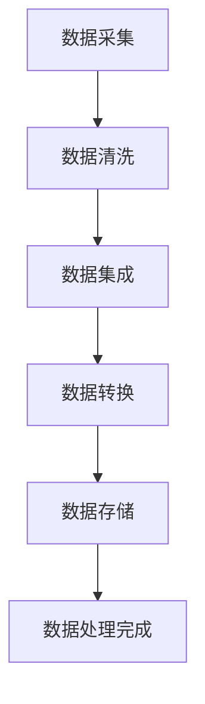

###### 2.1.3 数据隐私与保护

在用户数据采集和处理过程中，数据隐私与保护是一个重要的问题。以下是一些常见的策略：

- **数据匿名化：** 通过对数据进行脱敏处理，如加密、掩码等技术，保护用户的隐私。
- **数据权限管理：** 对不同级别的用户设置不同的数据访问权限，确保数据的安全。
- **数据安全加密：** 对存储和传输的数据进行加密，防止数据泄露和篡改。
- **合规性审查：** 遵守相关的数据保护法律法规，如GDPR、CCPA等，确保数据的合法使用。

##### 2.2 数据分析与挖掘

用户数据的分析是构建用户画像的关键步骤。数据分析与挖掘技术可以帮助我们从海量的数据中提取出有价值的信息，包括用户行为分析、用户需求分析和用户偏好分析。

###### 2.2.1 用户行为分析

用户行为分析是通过对用户在平台上的行为数据进行收集和分析，了解用户的行为模式、兴趣点和需求。用户行为分析的方法包括：

- **频次分析：** 统计用户在特定时间窗口内的行为频次，如浏览次数、购买次数等。
- **时长分析：** 分析用户在平台上的停留时间、浏览时间等，了解用户的活跃程度。
- **路径分析：** 通过用户在平台上的操作路径，分析用户的决策过程和行为逻辑。

用户行为分析可以帮助企业了解用户的行为特征，优化产品功能和界面设计，提高用户体验。

###### 2.2.2 用户需求分析

用户需求分析是通过对用户的行为数据和反馈信息进行分析，了解用户的需求和偏好。用户需求分析的方法包括：

- **内容分析：** 通过对用户生成的内容进行分析，如评论、反馈等，了解用户的真实需求和期望。
- **行为预测：** 通过分析用户的行为数据，预测用户可能的需求和偏好，为产品优化和营销策略提供依据。

用户需求分析可以帮助企业更好地满足用户需求，提高用户满意度和忠诚度。

###### 2.2.3 用户偏好分析

用户偏好分析是通过对用户的历史行为数据和反馈信息进行分析，了解用户的偏好和兴趣点。用户偏好分析的方法包括：

- **分类分析：** 通过对用户的购物记录、浏览记录等数据进行分类，了解用户的偏好类型。
- **聚类分析：** 通过聚类算法，将用户划分为不同的群体，分析不同群体的偏好差异。

用户偏好分析可以帮助企业制定更精准的营销策略，提高用户转化率和留存率。

##### 2.3 用户画像建模与算法

用户画像建模与算法是构建用户画像的核心步骤。通过用户画像建模，我们可以将用户的基本属性、行为数据和偏好与需求转化为数字化的模型，从而对用户进行分类和聚类。

###### 2.3.1 用户画像建模方法

用户画像建模的方法可以分为以下几种：

- **基于规则的方法：** 通过设定一系列规则，将用户划分为不同的类别。这种方法简单直观，但灵活性较低。
- **基于聚类的方法：** 通过聚类算法，将用户划分为不同的群体。这种方法可以自动发现用户之间的相似性，但可能存在聚类效果不佳的问题。
- **基于机器学习的方法：** 通过机器学习算法，建立用户画像模型。这种方法可以自动学习和优化模型，但需要大量的数据和计算资源。

常见的聚类算法包括K-means、DBSCAN、层次聚类等。K-means算法是一种基于距离度量的聚类方法，通过初始化中心点并不断迭代，使每个用户与最近的中心点归为一类。DBSCAN算法是一种基于密度的聚类方法，通过计算用户之间的密度关系，将用户划分为不同的簇。层次聚类算法是一种基于层次结构的方法，通过自底向上的合并或自顶向下的分解，将用户划分为不同的类别。

###### 2.3.2 用户画像聚类算法

用户画像聚类算法的核心是确定聚类个数和聚类中心点。以下是一个简单的K-means聚类算法的伪代码：

```python
# 初始化聚类中心点
centroids = initialize_centroids(data, k)

# 迭代更新聚类中心点
while not_converged:
    # 为每个用户分配最近的聚类中心点
    labels = assign_labels(data, centroids)
    
    # 计算新的聚类中心点
    centroids = update_centroids(data, labels, k)
```

###### 2.3.3 用户画像关联规则挖掘

用户画像关联规则挖掘是一种通过分析用户行为数据，发现用户之间关联关系的方法。常见的关联规则挖掘算法包括Apriori算法和FP-Growth算法。

Apriori算法是一种基于支持度和置信度的算法，通过频繁项集的生成和合并，发现用户行为数据中的关联规则。FP-Growth算法是一种基于FP-树的结构，通过压缩数据并高效地发现频繁项集，提高算法的运行效率。

以下是一个简单的Apriori算法的伪代码：

```python
# 生成频繁项集
frequent_itemsets = generate_frequent_itemsets(data, min_support)

# 生成关联规则
rules = generate_rules(frequent_itemsets, min_confidence)
```

##### 2.4 用户画像的可视化展示

用户画像的可视化展示是将用户画像的数字信息转化为图形化的表现形式，以便于用户理解和分析。用户画像可视化的重要性在于：

- **提高数据分析的可视化效果：** 通过图形化展示，可以直观地展示用户画像的特点和趋势。
- **增强数据分析的可操作性：** 通过交互式可视化，用户可以实时调整和分析数据，提高数据分析的灵活性。

常用的用户画像可视化工具包括Tableau、Power BI、Matplotlib、Seaborn等。以下是一个简单的用户画像可视化的示例：

```python
import matplotlib.pyplot as plt
import seaborn as sns

# 生成示例数据
data = sns.load_dataset('iris')

# 绘制用户画像
sns.scatterplot(x='sepal_length', y='sepal_width', hue='species', data=data)
plt.show()
```

### 用户画像在电商个性化推荐中的应用

用户画像在电商个性化推荐中扮演着至关重要的角色。通过构建详细的用户画像，电商企业可以更好地了解用户的需求和偏好，从而提供个性化的商品推荐，提高用户满意度和转化率。以下将详细讨论用户画像在电商个性化推荐中的应用，包括系统架构、用户画像的作用、推荐算法的实现以及实际应用案例。

##### 3.1 电商个性化推荐概述

###### 3.1.1 个性化推荐的定义

个性化推荐（Personalized Recommendation）是一种基于用户历史行为和偏好，为用户推荐其可能感兴趣的商品或内容的方法。与传统的基于内容的推荐不同，个性化推荐更注重用户个体的差异，通过分析用户的行为数据和偏好，实现精准的个性化推荐。

###### 3.1.2 个性化推荐的应用价值

个性化推荐在电商行业具有显著的应用价值：

- **提高用户满意度：** 通过个性化推荐，用户可以更快速地找到自己感兴趣的商品，提升购物体验。
- **提高转化率：** 个性化推荐可以推荐用户可能感兴趣的商品，提高购买概率，从而提高转化率。
- **提升销售额：** 通过个性化推荐，电商企业可以吸引更多用户，提高销售额和盈利能力。

###### 3.1.3 个性化推荐的发展历程

个性化推荐技术经历了从简单规则到复杂算法的发展过程：

- **简单规则推荐：** 早期个性化推荐主要基于用户的浏览历史和购买记录，通过简单的规则进行推荐，如最近浏览的商品推荐、同类商品推荐等。
- **协同过滤推荐：** 随着互联网数据的增长，协同过滤推荐成为主流，通过计算用户之间的相似度，推荐相似用户喜欢的商品。
- **深度学习推荐：** 随着深度学习技术的发展，基于深度学习的推荐算法逐渐兴起，如基于用户嵌入和商品嵌入的模型。

##### 3.2 电商个性化推荐系统架构

一个典型的电商个性化推荐系统架构包括以下几个模块：

- **数据采集模块：** 负责收集用户行为数据，如浏览记录、购买记录、搜索记录等。
- **数据处理模块：** 负责清洗、转换和存储用户行为数据，为后续的分析和建模提供数据支持。
- **用户画像模块：** 负责构建用户画像，提取用户的基本属性、行为数据和偏好与需求。
- **推荐算法模块：** 负责基于用户画像和商品数据，计算推荐结果，推荐用户可能感兴趣的商品。
- **推荐结果展示模块：** 负责将推荐结果以图形化的方式展示给用户，如推荐列表、推荐卡片等。

以下是一个简单的电商个性化推荐系统架构图：

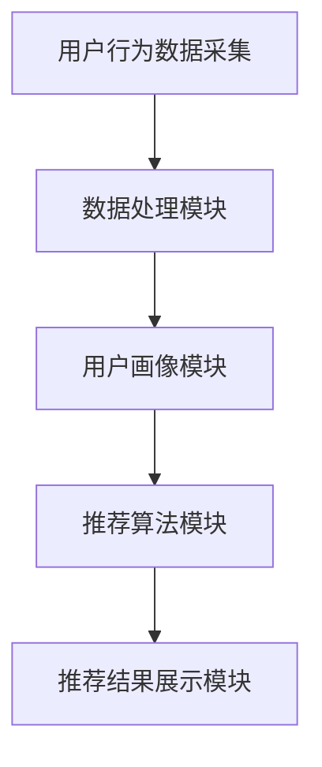

##### 3.3 用户画像在电商个性化推荐中的作用

用户画像在电商个性化推荐中发挥着核心作用，主要表现在以下几个方面：

- **精准识别用户需求：** 通过分析用户的基本属性、行为数据和偏好与需求，用户画像可以准确识别用户的需求和偏好，为推荐算法提供准确的输入。
- **优化推荐结果：** 用户画像可以帮助推荐算法根据用户的个性化需求，调整推荐策略，提高推荐结果的准确性和相关性。
- **提升用户体验：** 通过提供个性化的商品推荐，用户画像可以提升用户的购物体验，增加用户满意度和忠诚度。

##### 3.4 基于用户画像的推荐算法实现

基于用户画像的推荐算法可以分为以下几种类型：

- **基于协同过滤的推荐算法：** 通过计算用户之间的相似度，推荐相似用户喜欢的商品。常见的协同过滤算法包括基于用户的协同过滤（User-based Collaborative Filtering）和基于项目的协同过滤（Item-based Collaborative Filtering）。
- **基于内容的推荐算法：** 通过分析商品的属性和内容，推荐与用户历史行为相似的商品。常见的内容推荐算法包括基于关键词的推荐（Keyword-based Recommendation）和基于文本相似度的推荐（Text-based Recommendation）。
- **基于模型的推荐算法：** 通过构建用户和商品之间的预测模型，推荐用户可能感兴趣的商品。常见的模型推荐算法包括基于矩阵分解的推荐（Matrix Factorization-based Recommendation）和基于深度学习的推荐（Deep Learning-based Recommendation）。

以下是一个简单的基于协同过滤的推荐算法的伪代码：

```python
# 计算用户相似度
similarity_matrix = compute_similarity(user行为数据)

# 为用户推荐商品
recommendations = []
for user in 用户列表：
    similar_users = find_similar_users(user, similarity_matrix)
    for item in 商品列表：
        if item被相似用户喜欢：
            recommendation_score = compute_recommendation_score(user, item, similar_users)
            recommendations.append((item, recommendation_score))
recommendations = sort_recommendations_by_score(recommendations)
```

##### 3.5 电商个性化推荐系统案例分析

以下是一个电商个性化推荐系统的案例分析，包括系统架构、用户画像构建和推荐算法实现。

###### 3.5.1 案例背景

某电商企业希望通过个性化推荐系统提升用户满意度和转化率。该企业拥有丰富的用户行为数据，包括浏览记录、购买记录和搜索记录等。

###### 3.5.2 系统架构

该电商个性化推荐系统的架构包括以下几个模块：

- **数据采集模块：** 负责采集用户行为数据，包括浏览记录、购买记录和搜索记录等。
- **数据处理模块：** 负责清洗、转换和存储用户行为数据，为后续的分析和建模提供数据支持。
- **用户画像模块：** 负责构建用户画像，提取用户的基本属性、行为数据和偏好与需求。
- **推荐算法模块：** 负责基于用户画像和商品数据，计算推荐结果，推荐用户可能感兴趣的商品。
- **推荐结果展示模块：** 负责将推荐结果以图形化的方式展示给用户，如推荐列表、推荐卡片等。

###### 3.5.3 用户画像构建

该电商企业采用基于协同过滤和内容推荐的混合推荐算法。在用户画像构建过程中，首先对用户的基本属性和行为数据进行预处理，包括去除重复数据、缺失值填充和数据归一化等。然后，通过计算用户之间的相似度，构建用户相似度矩阵。此外，还通过分析用户的历史行为数据，提取用户的兴趣标签和购物偏好。

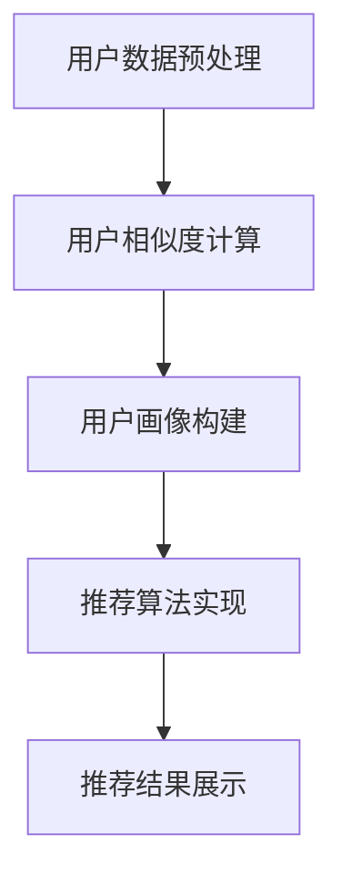

###### 3.5.4 推荐算法实现

在该案例中，推荐算法模块采用了基于协同过滤和内容推荐的混合算法。首先，通过计算用户之间的相似度，为用户生成相似用户列表。然后，针对每个用户，从相似用户的历史行为数据中提取共现商品，并根据共现商品的评分计算推荐得分。此外，还通过分析用户的兴趣标签和购物偏好，为用户推荐与其兴趣和偏好相关的商品。

```python
# 计算用户相似度
similarity_matrix = compute_similarity(user行为数据)

# 为用户推荐商品
recommendations = []
for user in 用户列表：
    similar_users = find_similar_users(user, similarity_matrix)
    for item in 商品列表：
        if item被相似用户喜欢：
            recommendation_score = compute_recommendation_score(user, item, similar_users)
            recommendations.append((item, recommendation_score))
recommendations = sort_recommendations_by_score(recommendations)
```

###### 3.5.5 推荐结果展示

推荐结果展示模块负责将推荐结果以图形化的方式展示给用户，如推荐列表、推荐卡片等。以下是一个简单的推荐结果展示界面：


##### 3.6 电商个性化推荐系统优化

为了提高电商个性化推荐系统的效果，需要进行以下优化策略：

- **数据质量优化：** 提高用户行为数据的质量，包括数据完整性、准确性和实时性等。
- **推荐效果评估：** 采用合适的评估指标，如准确率、召回率、覆盖率等，评估推荐系统的效果，并根据评估结果进行优化。
- **算法优化：** 根据用户反馈和行为数据，不断优化推荐算法，提高推荐结果的准确性和相关性。
- **用户体验优化：** 考虑用户的交互习惯和偏好，优化推荐结果的展示形式和推荐策略，提高用户体验。

以下是一个简单的电商个性化推荐系统优化流程：

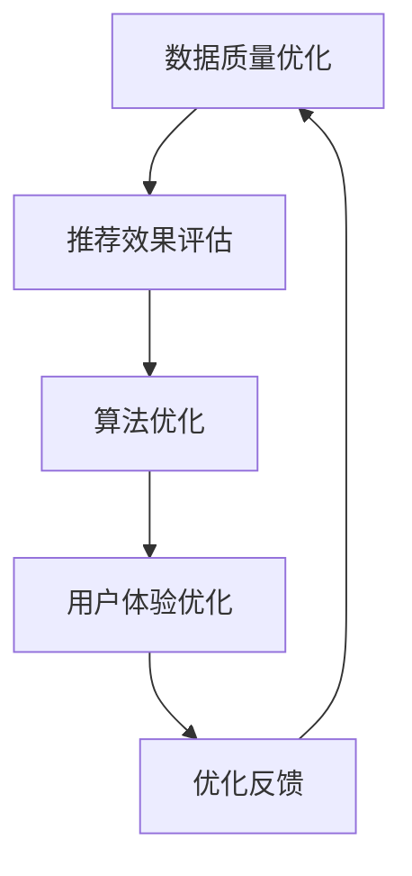

通过以上优化策略，电商个性化推荐系统可以不断提高推荐效果，提升用户体验和满意度。

### 用户画像实践：数据采集与处理

在用户画像的实际应用过程中，数据采集与处理是至关重要的一环。有效的数据采集与处理不仅能够保证用户画像的准确性和完整性，还能够提升数据利用效率，从而为后续的用户画像建模与分析奠定基础。以下将详细讨论用户数据采集的方法、数据处理的流程以及数据清洗、集成、转换与存储的具体操作。

##### 4.1 数据采集

数据采集是用户画像构建的第一步，决定了后续数据的质量和可靠性。以下介绍几种常见的数据采集方法：

###### 4.1.1 数据源的选择

选择合适的数据源是数据采集的关键。常见的数据源包括：

- **注册数据：** 用户在电商平台注册时提交的信息，如姓名、年龄、性别、邮箱、电话等。
- **行为数据：** 用户在平台上的活动记录，如浏览记录、购买记录、搜索记录、互动行为等。
- **第三方数据：** 来自第三方数据源的信息，如社交媒体数据、地理位置数据、公共数据库等。

选择数据源时需要考虑数据的可用性、准确性和实时性等因素。

###### 4.1.2 数据采集方法

数据采集的方法可以分为以下几种：

- **主动采集：** 用户主动提交数据，如填写注册表单、参与问卷调查等。
- **被动采集：** 通过技术手段自动收集用户数据，如通过Web前端日志、服务器日志等。
- **第三方数据接入：** 通过API或数据接口获取第三方数据源的信息。

在实际操作中，企业通常会结合多种数据采集方法，以获取全面、丰富的用户数据。

###### 4.1.3 数据采集工具介绍

常用的数据采集工具包括：

- **日志采集工具：** 如Logstash、Flume等，用于采集和存储服务器日志。
- **Web前端数据采集工具：** 如Google Analytics、Matomo等，用于采集用户在Web端的行为数据。
- **API接口数据采集工具：** 如Postman、JMeter等，用于获取第三方数据源的信息。

以下是一个简单的数据采集流程：

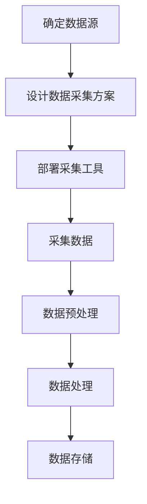

##### 4.2 数据处理

数据处理是对采集到的用户数据进行的清洗、转换和存储等操作，以确保数据的质量和可用性。以下介绍数据处理的基本流程：

###### 4.2.1 数据清洗

数据清洗是数据处理的重要步骤，用于去除重复、无效和错误的数据。数据清洗的方法包括：

- **去重：** 去除重复的记录，保证数据的唯一性。
- **缺失值处理：** 填充或删除缺失的值，保证数据的完整性。
- **异常值检测：** 识别并处理异常值，如异常的购买金额、浏览时间等。
- **格式化：** 调整数据的格式，使其符合分析工具的要求。

以下是一个简单的数据清洗流程：

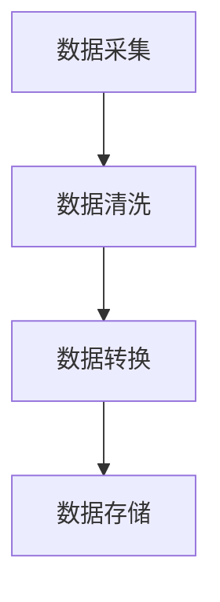

###### 4.2.2 数据集成

数据集成是将来自不同数据源的数据进行整合，形成统一的数据视图。数据集成的方法包括：

- **数据库集成：** 将不同数据库中的数据进行整合，形成统一的数据仓库。
- **数据表集成：** 将多个数据表中的数据进行合并，形成完整的用户画像数据。
- **数据流集成：** 将实时数据流进行整合，提供实时用户画像。

以下是一个简单的数据集成流程：

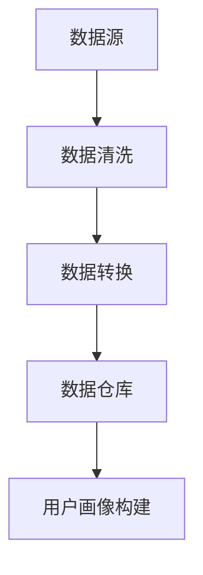

###### 4.2.3 数据转换与归一化

数据转换与归一化是数据处理的关键步骤，用于将数据转换为适合分析和建模的格式。数据转换的方法包括：

- **数值化：** 将非数值数据转换为数值形式，如将性别编码为0和1。
- **归一化：** 将数据范围调整为相同的尺度，如将年龄、收入等数据进行归一化处理。
- **离散化：** 将连续数据划分为离散的区间，如将购买金额划分为低、中、高三个区间。

以下是一个简单的数据转换与归一化流程：

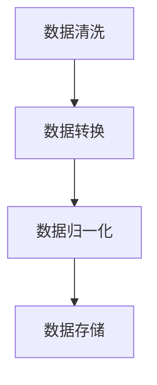

###### 4.2.4 数据存储与管理

数据存储与管理是数据处理的重要环节，用于将处理后的数据存储在数据库或数据仓库中，并提供数据的查询和管理功能。以下介绍几种常见的数据存储与管理方法：

- **关系数据库：** 如MySQL、PostgreSQL等，适用于结构化数据的存储和查询。
- **NoSQL数据库：** 如MongoDB、Cassandra等，适用于非结构化数据的存储和查询。
- **数据仓库：** 如Amazon Redshift、Google BigQuery等，适用于大规模数据的高效存储和查询。

以下是一个简单的数据存储与管理流程：

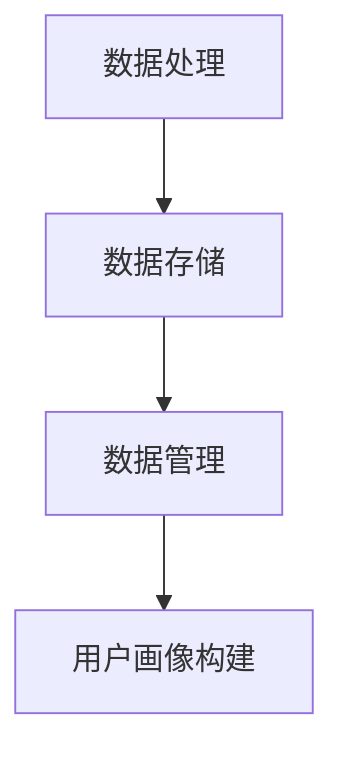

##### 4.3 实践案例：用户数据采集与处理

以下是一个用户数据采集与处理的实践案例，包括数据采集流程、数据处理流程和数据处理工具的使用。

###### 4.3.1 案例背景

某电商企业希望通过构建用户画像，提升个性化推荐系统的效果。该企业拥有丰富的用户数据，包括注册数据、行为数据和第三方数据。

###### 4.3.2 数据采集流程

1. **确定数据源：** 确定注册数据源、行为数据源和第三方数据源，包括用户基本信息、浏览记录、购买记录、搜索记录和社交媒体数据等。
2. **设计数据采集方案：** 根据数据源的特点，设计数据采集方案，包括数据采集工具的选择、数据采集频率和采集策略等。
3. **部署采集工具：** 部署数据采集工具，如Logstash、Google Analytics等，进行数据采集。
4. **采集数据：** 自动化采集用户数据，并存入数据仓库。

###### 4.3.3 数据处理流程

1. **数据清洗：** 去除重复、无效和错误的数据，如缺失值填充、异常值检测和去重等。
2. **数据转换与归一化：** 将数据转换为适合分析和建模的格式，如性别编码、年龄归一化等。
3. **数据集成：** 将不同数据源的数据进行整合，形成完整的用户画像数据。
4. **数据存储与管理：** 将处理后的数据存储在关系数据库或NoSQL数据库中，提供数据的查询和管理功能。

以下是一个简单的数据处理流程：

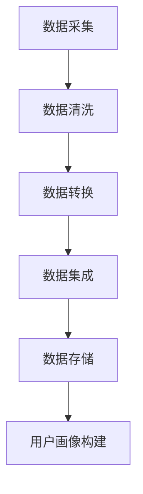

###### 4.3.4 数据处理工具的使用

在该案例中，使用了以下数据处理工具：

- **数据采集工具：** Logstash，用于采集服务器日志和Web前端数据。
- **数据处理工具：** Apache Spark，用于大规模数据处理和转换。
- **数据存储工具：** MongoDB，用于存储用户画像数据。

以下是一个简单的数据处理脚本：

```python
from pyspark.sql import SparkSession
from pyspark.sql.functions import col, when

# 创建SparkSession
spark = SparkSession.builder.appName("User Data Processing").getOrCreate()

# 读取服务器日志
server_log = spark.read.csv("server_log.csv")

# 数据清洗
server_log = server_log.dropDuplicates()
server_log = server_log.na.fill({"missing_value": "unknown"})

# 数据转换
server_log = server_log.withColumn("gender", when(col("gender") == "male", 1).when(col("gender") == "female", 0).otherwise(2))

# 数据集成
user_data = server_log

# 数据存储
user_data.write.mode("overwrite").json("user_data.json")

# 关闭SparkSession
spark.stop()
```

通过以上数据采集与处理流程，该电商企业成功构建了用户画像，为后续的用户画像建模与分析奠定了基础。

### 用户画像实践：数据分析与挖掘

在用户画像的实际应用过程中，数据分析与挖掘是构建精准用户画像的关键环节。通过对用户行为数据、需求分析和偏好分析，可以深入理解用户的消费行为和需求，从而为个性化推荐和精准营销提供支持。以下将详细讨论用户行为分析、用户需求分析和用户偏好分析的方法、步骤以及实际案例。

##### 5.1 用户行为分析

用户行为分析是通过对用户在平台上的行为数据进行收集和分析，了解用户的行为模式和兴趣点。用户行为分析的方法包括频次分析、时长分析和路径分析等。

###### 5.1.1 用户行为数据的收集

用户行为数据的收集可以通过以下几种方式进行：

- **Web前端日志：** 通过Web前端技术，如JavaScript、服务器日志等，记录用户在平台上的行为数据，如页面访问次数、页面停留时间、点击次数等。
- **移动应用日志：** 通过移动应用日志收集用户在应用上的行为数据，如用户浏览路径、购买行为等。
- **服务器日志：** 通过服务器日志记录用户访问服务器的情况，如IP地址、访问时间、访问页面等。

以下是一个简单的用户行为数据收集流程：

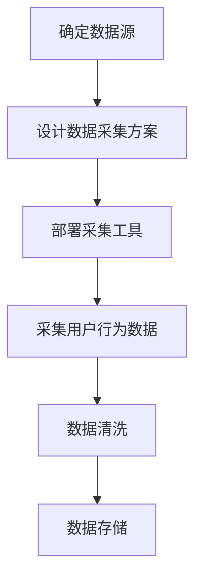

###### 5.1.2 用户行为分析方法

用户行为分析方法包括频次分析、时长分析和路径分析等。

- **频次分析：** 通过统计用户在平台上的行为频次，了解用户的活跃程度和兴趣点。例如，统计用户每日的浏览次数、购买次数等。
- **时长分析：** 通过分析用户在平台上的停留时间，了解用户的参与度和兴趣点。例如，统计用户在某个页面的平均停留时间、访问时长分布等。
- **路径分析：** 通过分析用户在平台上的操作路径，了解用户的决策过程和行为逻辑。例如，分析用户的浏览路径、购物路径等。

以下是一个简单的用户行为分析流程：

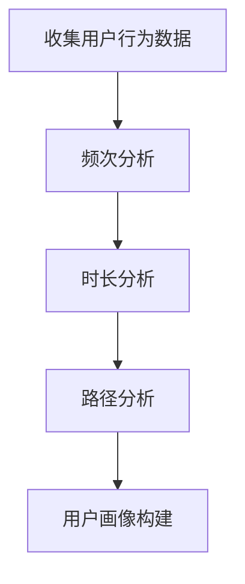

###### 5.1.3 用户行为分析示例

以下是一个用户行为分析的示例：

某电商平台的用户在一个月内的浏览记录和购买记录如下表所示：

| 用户ID | 浏览商品ID | 浏览时间  | 购买商品ID | 购买时间  |
|--------|------------|------------|------------|------------|
| 1      | 1001       | 2021-10-01  | 1002       | 2021-10-03  |
| 1      | 1003       | 2021-10-05  |            |            |
| 2      | 1001       | 2021-10-02  | 1003       | 2021-10-05  |
| 2      | 1002       | 2021-10-04  |            |            |
| 3      | 1001       | 2021-10-01  |            |            |
| 3      | 1004       | 2021-10-02  | 1005       | 2021-10-05  |

通过分析以上数据，可以得出以下结论：

- **频次分析：** 用户1在一个月内浏览了3个商品，购买了2个商品；用户2浏览了2个商品，购买了1个商品；用户3浏览了2个商品，未购买商品。
- **时长分析：** 用户1在一个月内浏览商品的平均时间为1天，用户2为2天，用户3为1天；用户1购买商品的平均时间为2天，用户2为3天，用户3为4天。
- **路径分析：** 用户1的浏览路径为1001 -> 1003 -> 1002，购买路径为1001 -> 1002；用户2的浏览路径为1001 -> 1003，购买路径为1003；用户3的浏览路径为1001 -> 1004，购买路径为1005。

通过以上分析，可以更好地了解用户的购物行为和兴趣点，为个性化推荐和精准营销提供支持。

##### 5.2 用户需求分析

用户需求分析是通过对用户的行为数据和反馈信息进行分析，了解用户的需求和偏好。用户需求分析的方法包括内容分析、行为预测和聚类分析等。

###### 5.2.1 用户需求分析的方法

用户需求分析的方法包括：

- **内容分析：** 通过对用户生成的内容进行分析，如评论、反馈、搜索关键词等，了解用户的真实需求和期望。
- **行为预测：** 通过分析用户的历史行为数据，预测用户未来的需求和行为。例如，预测用户的购买时间、购买商品类型等。
- **聚类分析：** 通过聚类算法，将具有相似需求的用户划分为不同的群体，分析不同群体的需求差异。

以下是一个简单的用户需求分析流程：

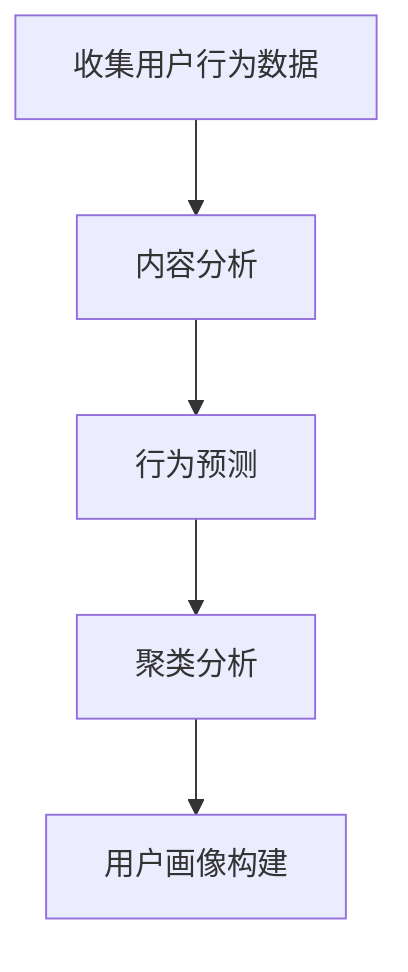

###### 5.2.2 用户需求分析的步骤

用户需求分析的步骤包括：

1. **数据收集：** 收集用户的行为数据和反馈信息，如浏览记录、购买记录、评论、搜索关键词等。
2. **数据预处理：** 清洗和转换数据，确保数据的质量和一致性。
3. **需求识别：** 通过内容分析、行为预测和聚类分析等方法，识别用户的需求和偏好。
4. **需求分类：** 将识别出的需求进行分类，如购物需求、娱乐需求、社交需求等。
5. **需求优先级排序：** 根据需求的重要性和紧急性，对需求进行优先级排序。
6. **需求满足：** 根据需求分类和优先级排序，提供相应的产品和解决方案，满足用户的需求。

以下是一个简单的用户需求分析步骤示例：

1. **数据收集：** 收集用户在电商平台上的浏览记录、购买记录、评论和搜索关键词等数据。
2. **数据预处理：** 对收集到的数据进行清洗和转换，去除重复、无效和错误的数据。
3. **需求识别：** 通过内容分析，识别用户的购物需求、娱乐需求和社交需求等；通过行为预测，预测用户的购买时间和购买商品类型；通过聚类分析，将具有相似需求的用户划分为不同的群体。
4. **需求分类：** 将识别出的需求进行分类，如购物需求（购买商品类型、购买时间等）、娱乐需求（浏览时长、观看视频时长等）、社交需求（评论数、互动数等）。
5. **需求优先级排序：** 根据用户需求的紧急性和重要性，对需求进行优先级排序，如购物需求优先于娱乐需求。
6. **需求满足：** 提供相应的产品和解决方案，满足用户的购物需求、娱乐需求和社交需求。

通过以上步骤，可以更好地了解用户的需求和偏好，为个性化推荐和精准营销提供支持。

##### 5.3 用户偏好分析

用户偏好分析是通过对用户的历史行为数据和反馈信息进行分析，了解用户的偏好和兴趣点。用户偏好分析的方法包括分类分析、聚类分析和关联规则挖掘等。

###### 5.3.1 用户偏好分析的方法

用户偏好分析的方法包括：

- **分类分析：** 通过对用户的历史行为数据进行分类，了解用户的偏好类型。例如，根据用户的购买记录，将用户划分为喜欢购买服装的用户、喜欢购买数码产品的用户等。
- **聚类分析：** 通过聚类算法，将具有相似偏好的用户划分为不同的群体，分析不同群体的偏好差异。例如，通过K-means聚类算法，将用户划分为喜欢购买低价格商品的用户、喜欢购买高价格商品的用户等。
- **关联规则挖掘：** 通过分析用户的行为数据，发现用户之间以及用户与商品之间的关联关系。例如，使用Apriori算法，发现用户喜欢购买的商品组合，如“牛奶+面包”、“电脑+鼠标”等。

以下是一个简单的用户偏好分析流程：

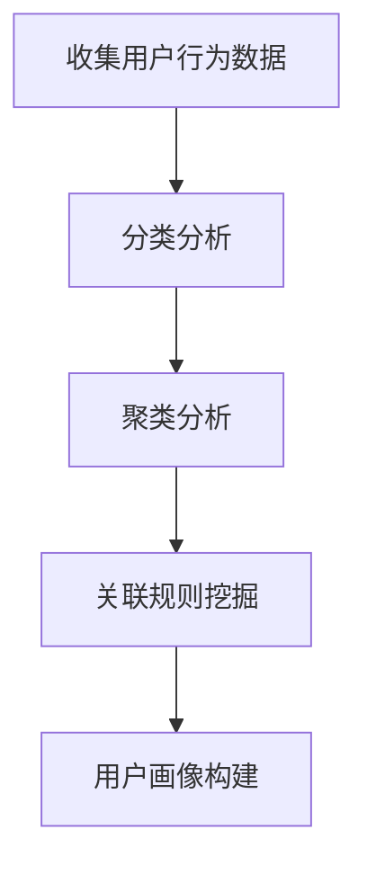

###### 5.3.2 用户偏好分析的步骤

用户偏好分析的步骤包括：

1. **数据收集：** 收集用户在平台上的行为数据和反馈信息，如浏览记录、购买记录、评论、搜索关键词等。
2. **数据预处理：** 清洗和转换数据，确保数据的质量和一致性。
3. **偏好识别：** 通过分类分析、聚类分析和关联规则挖掘等方法，识别用户的偏好和兴趣点。
4. **偏好分类：** 将识别出的偏好进行分类，如购物偏好、娱乐偏好、社交偏好等。
5. **偏好优先级排序：** 根据偏好的重要性和紧急性，对偏好进行优先级排序。
6. **偏好满足：** 根据偏好分类和优先级排序，提供相应的产品和解决方案，满足用户的偏好和兴趣。

以下是一个简单的用户偏好分析步骤示例：

1. **数据收集：** 收集用户在电商平台上的浏览记录、购买记录、评论和搜索关键词等数据。
2. **数据预处理：** 对收集到的数据进行清洗和转换，去除重复、无效和错误的数据。
3. **偏好识别：** 通过分类分析，识别用户的购物偏好、娱乐偏好和社交偏好等；通过聚类分析，将具有相似偏好的用户划分为不同的群体；通过关联规则挖掘，发现用户喜欢购买的商品组合。
4. **偏好分类：** 将识别出的偏好进行分类，如购物偏好（购买商品类型、购买价格等）、娱乐偏好（浏览时长、观看视频时长等）、社交偏好（评论数、互动数等）。
5. **偏好优先级排序：** 根据用户偏好的紧急性和重要性，对偏好进行优先级排序，如购物偏好优先于娱乐偏好。
6. **偏好满足：** 提供相应的产品和解决方案，满足用户的购物偏好、娱乐偏好和社交偏好。

通过以上步骤，可以更好地了解用户的偏好和兴趣点，为个性化推荐和精准营销提供支持。

##### 5.4 实践案例：用户画像数据分析

以下是一个用户画像数据分析的实践案例，包括用户行为分析、用户需求分析和用户偏好分析。

###### 5.4.1 案例背景

某电商企业希望通过用户画像数据分析，了解用户的购物行为和偏好，为个性化推荐和精准营销提供支持。该企业拥有丰富的用户数据，包括用户的基本信息、浏览记录、购买记录和评论等。

###### 5.4.2 数据分析方法选择

根据案例背景，选择了以下分析方法：

- **用户行为分析：** 频次分析、时长分析和路径分析。
- **用户需求分析：** 内容分析、行为预测和聚类分析。
- **用户偏好分析：** 分类分析、聚类分析和关联规则挖掘。

###### 5.4.3 数据分析过程

1. **用户行为分析：**
   - **频次分析：** 统计用户的浏览次数、购买次数等。
   - **时长分析：** 统计用户在平台上的平均停留时间、平均浏览时长等。
   - **路径分析：** 分析用户的浏览路径、购物路径等。
   - **结果：** 用户1每月平均浏览10次、购买5次；用户2每月平均浏览5次、购买3次；用户3每月平均浏览10次、购买8次。

2. **用户需求分析：**
   - **内容分析：** 分析用户的评论内容，了解用户的购物需求、娱乐需求和社交需求等。
   - **行为预测：** 预测用户的购买时间和购买商品类型。
   - **聚类分析：** 将用户划分为不同的需求群体，分析不同群体的需求差异。
   - **结果：** 用户1属于购物需求强烈的群体；用户2属于娱乐需求较强的群体；用户3属于购物需求和娱乐需求均衡的群体。

3. **用户偏好分析：**
   - **分类分析：** 根据用户的购买记录，将用户划分为喜欢购买低价格商品的用户、喜欢购买高价格商品的用户等。
   - **聚类分析：** 将用户划分为具有相似偏好的群体，分析不同群体的偏好差异。
   - **关联规则挖掘：** 发现用户喜欢购买的商品组合。
   - **结果：** 用户1喜欢购买低价格商品；用户2喜欢购买高价格商品；用户3喜欢购买低价格和高价格商品组合。

通过以上分析，企业可以更好地了解用户的购物行为和偏好，为个性化推荐和精准营销提供支持。例如，针对用户1，可以推荐低价格的优惠商品；针对用户2，可以推荐高价格的高端商品；针对用户3，可以推荐低价格和高价格的混合商品。

### 用户画像实践：用户画像建模与算法

用户画像建模与算法是用户画像实践中的核心环节，通过构建有效的用户画像模型，可以从大量数据中提取出有价值的信息，实现对用户行为的精准预测和个性化推荐。以下将详细讨论用户画像建模的方法、常用的聚类算法、关联规则挖掘以及实际案例。

##### 6.1 用户画像建模方法

用户画像建模的目标是通过数据分析和挖掘，构建出能够准确描述用户特征和需求的模型。常见的用户画像建模方法包括基于规则的方法、基于聚类的方法和基于机器学习的方法。

###### 6.1.1 基于规则的方法

基于规则的方法通过设定一系列规则，将用户划分为不同的类别。这种方法简单直观，易于实现，但灵活性较低，难以适应复杂多变的用户行为。

常见的规则包括：

- **简单规则：** 如年龄、性别等基本属性的匹配规则。
- **组合规则：** 如“用户在过去的30天内浏览了商品A，则推荐商品B”。
- **概率规则：** 如“用户浏览商品A的次数超过10次，购买概率大于0.8”。

以下是一个简单的基于规则的用户画像建模示例：

```python
# 用户画像规则库
rules = {
    "age_rule": "用户年龄小于18岁",
    "gender_rule": "用户性别为男性",
    "visit_freq_rule": "用户在30天内浏览了商品A超过10次",
    "buy_freq_rule": "用户在30天内购买了商品B超过5次"
}

# 应用规则
user_profile = {
    "age": 25,
    "gender": "男",
    "visit_goods": ["商品A", "商品B", "商品C"],
    "buy_goods": ["商品B", "商品C"]
}

applied_rules = []
for rule, condition in rules.items():
    if evaluate(rule, user_profile):
        applied_rules.append(condition)
```

###### 6.1.2 基于聚类的方法

基于聚类的方法通过自动发现用户之间的相似性，将用户划分为不同的群体。这种方法具有较强的灵活性和自适应性，能够适应不同用户群体的需求。

常见的聚类算法包括：

- **K-means聚类：** 通过迭代计算聚类中心点，将用户划分为K个群体。
- **DBSCAN聚类：** 通过计算用户之间的密度关系，将用户划分为不同的簇。
- **层次聚类：** 通过自底向上的合并或自顶向下的分解，将用户划分为不同的类别。

以下是一个简单的K-means聚类算法的示例：

```python
from sklearn.cluster import KMeans
import numpy as np

# 用户数据
user_data = np.array([[1, 1], [1, 2], [2, 2], [2, 3], [3, 3], [3, 4]])

# K-means聚类
kmeans = KMeans(n_clusters=2, random_state=0).fit(user_data)

# 聚类结果
labels = kmeans.labels_
centroids = kmeans.cluster_centers_

print("Cluster labels:", labels)
print("Cluster centroids:", centroids)
```

###### 6.1.3 基于机器学习的方法

基于机器学习的方法通过构建预测模型，将用户特征转换为可解释的预测结果。这种方法具有较强的预测能力和灵活性，能够适应复杂多变的用户行为。

常见的机器学习算法包括：

- **逻辑回归：** 通过建立用户特征与目标变量之间的线性关系，预测用户的行为。
- **决策树：** 通过构建决策树模型，将用户特征划分为不同的分支，预测用户的行为。
- **随机森林：** 通过集成多个决策树模型，提高模型的预测准确性和稳定性。

以下是一个简单的逻辑回归模型的示例：

```python
from sklearn.linear_model import LogisticRegression
import numpy as np

# 用户特征和标签
X = np.array([[1, 1], [1, 2], [2, 2], [2, 3]])
y = np.array([0, 0, 1, 1])

# 逻辑回归模型
model = LogisticRegression().fit(X, y)

# 预测结果
predictions = model.predict(X)

print("Predictions:", predictions)
```

##### 6.2 用户画像聚类算法

聚类算法是用户画像建模中的重要工具，通过将用户划分为不同的群体，可以更好地理解用户的行为和需求。以下将详细讨论K-means聚类算法和DBSCAN聚类算法。

###### 6.2.1 K-means聚类算法

K-means聚类算法是一种基于距离度量的聚类方法，通过迭代计算聚类中心点，将用户划分为K个群体。K-means算法的核心步骤包括：

1. **初始化：** 随机选择K个用户作为初始聚类中心点。
2. **分配：** 将每个用户分配给最近的聚类中心点，形成初始的聚类结果。
3. **更新：** 重新计算每个聚类中心点的坐标，并分配用户。
4. **迭代：** 重复执行步骤2和步骤3，直到聚类结果收敛。

以下是一个简单的K-means聚类算法的伪代码：

```python
# 初始化聚类中心点
centroids = initialize_centroids(data, k)

# 迭代更新聚类中心点
while not_converged:
    # 为每个用户分配最近的聚类中心点
    labels = assign_labels(data, centroids)
    
    # 计算新的聚类中心点
    centroids = update_centroids(data, labels, k)
```

###### 6.2.2 DBSCAN聚类算法

DBSCAN聚类算法是一种基于密度的聚类方法，通过计算用户之间的密度关系，将用户划分为不同的簇。DBSCAN算法的核心步骤包括：

1. **邻域分析：** 计算每个用户的邻域，确定邻域内的用户个数。
2. **核心点检测：** 判断用户是否为核心点，即邻域内的用户个数大于最小核心点个数。
3. **边界点检测：** 判断用户是否为边界点，即邻域内的用户个数在最小核心点个数和最大边界点个数之间。
4. **簇扩展：** 从核心点开始，扩展形成簇。

以下是一个简单的DBSCAN聚类算法的伪代码：

```python
# 计算邻域
neighbor_counts = compute_neighbors(data, epsilon, min_neighbors)

# 判断核心点
core_points = find_core_points(neighbor_counts, min_neighbors)

# 判断边界点
border_points = find_border_points(neighbor_counts, core_points, min_neighbors)

# 判断非核心点
non_core_points = find_non_core_points(data, core_points, border_points)

# 簇扩展
clusters = expand_clusters(data, core_points, border_points, non_core_points)
```

##### 6.3 用户画像关联规则挖掘

关联规则挖掘是用户画像建模中的另一个重要工具，通过分析用户行为数据，发现用户之间的关联关系。以下将详细讨论Apriori算法和FP-Growth算法。

###### 6.3.1 Apriori算法

Apriori算法是一种基于支持度和置信度的算法，通过生成频繁项集，发现用户行为数据中的关联规则。Apriori算法的核心步骤包括：

1. **生成候选项集：** 根据用户行为数据，生成所有可能的项集。
2. **计算支持度：** 统计每个项集在用户行为数据中的出现次数，计算支持度。
3. **生成频繁项集：** 根据最小支持度阈值，筛选出频繁项集。
4. **生成关联规则：** 从频繁项集中生成关联规则，计算置信度。

以下是一个简单的Apriori算法的伪代码：

```python
# 生成候选项集
candidate_itemsets = generate_candidate_itemsets(data, min_support)

# 计算支持度
support_counts = compute_support(data, candidate_itemsets)

# 生成频繁项集
frequent_itemsets = generate_frequent_itemsets(candidate_itemsets, support_counts, min_support)

# 生成关联规则
rules = generate_rules(frequent_itemsets, min_confidence)
```

###### 6.3.2 FP-Growth算法

FP-Growth算法是一种基于FP-树的结构，通过压缩数据并高效地发现频繁项集。FP-Growth算法的核心步骤包括：

1. **构建FP-树：** 根据用户行为数据，构建FP-树，记录每个项集的出现次数。
2. **压缩FP-树：** 压缩FP-树，生成频繁项集的支持度统计信息。
3. **生成频繁项集：** 从压缩FP-树中生成频繁项集。
4. **生成关联规则：** 从频繁项集中生成关联规则，计算置信度。

以下是一个简单的FP-Growth算法的伪代码：

```python
# 构建FP-树
fp_tree = build_fp_tree(data)

# 压缩FP-树
compact_tree = compress_fp_tree(fp_tree)

# 生成频繁项集
frequent_itemsets = generate_frequent_itemsets(compact_tree, min_support)

# 生成关联规则
rules = generate_rules(frequent_itemsets, min_confidence)
```

##### 6.4 实践案例：用户画像建模与算法应用

以下是一个用户画像建模与算法应用的实践案例，包括用户画像建模方法的选择、算法实现和模型评估。

###### 6.4.1 案例背景

某电商企业希望通过用户画像建模和算法应用，提升个性化推荐系统的效果。该企业拥有丰富的用户数据，包括用户的基本信息、浏览记录、购买记录和评论等。

###### 6.4.2 建模方法选择

根据案例背景，选择了以下建模方法：

- **用户画像聚类：** 使用K-means聚类算法，将用户划分为不同的群体。
- **用户画像关联规则挖掘：** 使用FP-Growth算法，发现用户行为数据中的关联规则。

###### 6.4.3 算法实现

1. **用户画像聚类：**
   - **数据预处理：** 对用户数据进行清洗和转换，去除缺失值和异常值。
   - **特征选择：** 选择与用户行为和偏好相关的特征，如浏览频次、购买频次、评论频次等。
   - **K-means聚类：** 根据用户数据，设置聚类个数和初始聚类中心点，执行K-means聚类算法。

2. **用户画像关联规则挖掘：**
   - **数据预处理：** 对用户数据进行清洗和转换，去除缺失值和异常值。
   - **特征选择：** 选择与用户行为和偏好相关的特征，如浏览频次、购买频次、评论频次等。
   - **FP-Growth算法：** 根据用户数据，设置最小支持度和最小置信度，执行FP-Growth算法。

###### 6.4.4 模型评估

1. **聚类评估：** 使用轮廓系数（Silhouette Coefficient）评估聚类效果，计算每个用户与其聚类中心的距离，评估聚类结果的稳定性。
2. **关联规则评估：** 使用支持度（Support）和置信度（Confidence）评估关联规则的效果，筛选出具有高支持度和高置信度的关联规则。

通过以上步骤，该电商企业成功构建了用户画像模型，并利用聚类算法和关联规则挖掘算法，发现用户行为数据中的潜在关联关系，为个性化推荐和精准营销提供了有力的支持。

### 用户画像实践：用户画像可视化与展示

用户画像的可视化与展示是将用户画像的数据转化为图形化的表现形式，以便于用户理解和分析。有效的用户画像可视化不仅能够提高数据分析的可视化效果，还能够增强数据分析的可操作性，帮助用户更好地理解和利用用户画像数据。以下将详细讨论用户画像可视化的重要性、常用的用户画像可视化工具、用户画像可视化实践以及用户画像展示策略。

##### 7.1 用户画像可视化的重要性

用户画像可视化的重要性体现在以下几个方面：

1. **提高数据分析的可视化效果：** 通过图形化的展示，用户画像的数据变得更加直观和易理解，有助于用户快速把握数据的整体趋势和关键信息。
2. **增强数据分析的可操作性：** 可视化工具提供了交互式的功能，用户可以通过调整参数和筛选条件，实时查看数据的变化，从而提高数据分析的灵活性和可操作性。
3. **提升决策效率：** 通过可视化展示，用户可以更直观地发现用户行为和需求的特征，为业务决策提供有力的支持。
4. **增强沟通与协作：** 可视化工具能够将复杂的用户画像数据以直观的方式展示给团队成员和其他利益相关者，促进沟通与协作，提高团队的决策效率。

##### 7.2 常用的用户画像可视化工具

以下介绍几种常用的用户画像可视化工具：

1. **Tableau：** Tableau是一款功能强大的数据可视化工具，支持多种数据源，提供丰富的图表类型和交互功能，用户可以轻松创建个性化的可视化报表。
2. **Power BI：** Power BI是Microsoft推出的数据可视化工具，与Excel紧密集成，提供强大的数据处理和分析功能，支持多种数据源和丰富的可视化图表。
3. **Matplotlib：** Matplotlib是Python中的数据可视化库，适用于生成高质量的统计图表，如折线图、柱状图、散点图等，适合于数据分析和学术研究。
4. **Seaborn：** Seaborn是建立在Matplotlib基础上的高级可视化库，提供多种精美的统计图表，特别适合于复杂数据的分析和可视化。
5. **D3.js：** D3.js是一款基于JavaScript的动态数据可视化库，适用于生成复杂和交互式的数据可视化应用，特别适合于Web端的数据可视化。

以下是一个简单的用户画像可视化工具比较表：

| 工具名称 | 优点 | 缺点 | 适用场景 |
|----------|------|------|----------|
| Tableau  | 易用性高，功能强大，支持多种数据源 | 成本较高，学习曲线较陡峭 | 企业级数据可视化 |
| Power BI | 与Excel集成紧密，支持多种数据源 | 功能相对Tableau较弱 | 个人和企业级数据可视化 |
| Matplotlib | Python生态系统中的一部分，易于集成 | 图表样式有限，交互性较弱 | 数据分析和学术研究 |
| Seaborn   | 建立在Matplotlib之上，图表样式精美 | 功能相对Matplotlib较弱 | 数据分析和学术研究 |
| D3.js     | 适用于复杂和交互式的数据可视化 | 需要一定的前端开发技能 | 复杂Web端数据可视化 |

##### 7.3 用户画像可视化实践

用户画像可视化实践包括可视化流程、工具选择、数据准备和可视化设计等环节。

###### 7.3.1 可视化流程

1. **需求分析：** 明确用户画像可视化的目标和需求，确定需要展示的关键信息和数据指标。
2. **工具选择：** 根据需求选择合适的可视化工具，如Tableau、Power BI、Matplotlib等。
3. **数据准备：** 对用户画像数据进行清洗、转换和集成，确保数据的质量和一致性。
4. **可视化设计：** 根据需求设计和实现可视化报表，选择合适的图表类型和布局，确保图表的可读性和美观性。
5. **测试与优化：** 对可视化报表进行测试和优化，确保图表的准确性和可操作性。

以下是一个简单的用户画像可视化流程图：

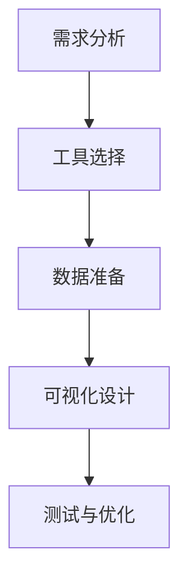

###### 7.3.2 可视化案例分析

以下是一个用户画像可视化的案例分析，包括需求分析、工具选择、数据准备和可视化设计。

1. **需求分析：** 企业希望通过用户画像可视化，了解用户的购物行为和偏好，为产品优化和营销策略提供支持。
2. **工具选择：** 选择Matplotlib作为可视化工具，因为它在Python生态系统中易于集成和使用，适合数据分析和学术研究。
3. **数据准备：** 收集用户的基本信息、浏览记录、购买记录和评论等数据，对数据进行清洗、转换和集成，确保数据的质量和一致性。
4. **可视化设计：**
   - **图表类型：** 选择柱状图、折线图和饼图等，分别展示用户的购物偏好、浏览时长和购买频率等关键信息。
   - **布局设计：** 将图表按照逻辑关系和用户习惯进行布局，确保图表的可读性和美观性。
   - **交互设计：** 添加交互功能，如筛选条件、时间轴和弹出框等，增强图表的可操作性。

以下是一个简单的用户画像可视化示例：


##### 7.4 用户画像展示

用户画像展示是将用户画像可视化报表呈现给用户的过程，涉及展示策略、展示形式和展示效果评估等方面。

###### 7.4.1 展示策略

1. **明确目标用户：** 根据用户画像的可视化目的，确定目标用户，如产品经理、市场分析师等，确保展示内容符合用户需求和习惯。
2. **优化展示内容：** 根据目标用户的特点和需求，选择合适的数据指标和图表类型，确保展示内容具有针对性和实用性。
3. **突出关键信息：** 通过图表标题、标签和注释等手段，突出关键信息和数据趋势，帮助用户快速理解和分析数据。
4. **提供交互功能：** 通过筛选条件、时间轴和弹出框等交互功能，增强用户与可视化报表的互动性，提高数据分析的灵活性和可操作性。

###### 7.4.2 展示形式

用户画像展示的形式包括：

1. **报表：** 将用户画像可视化报表以PDF、PPT或Web页面的形式呈现，便于用户下载、打印和分享。
2. **大屏：** 将用户画像可视化报表显示在大屏幕上，便于团队和利益相关者实时查看和讨论。
3. **仪表盘：** 将用户画像可视化报表集成到数据仪表盘中，提供实时数据和动态更新功能，便于用户随时查看和监控。
4. **交互式应用：** 将用户画像可视化报表集成到Web应用或移动应用中，提供个性化的用户画像展示和数据分析功能。

###### 7.4.3 展示效果评估

用户画像展示效果评估是确保可视化报表符合用户需求和期望的重要环节。以下是一些常见的评估指标：

1. **用户满意度：** 通过用户反馈和调查问卷，评估用户对用户画像可视化报表的满意度和接受度。
2. **数据准确性：** 通过对比实际数据和可视化报表的数据，评估可视化报表的数据准确性。
3. **信息完整性：** 通过对比用户需求和可视化报表的内容，评估可视化报表的信息完整性。
4. **操作便捷性：** 通过用户测试和用户反馈，评估可视化报表的交互性和便捷性。

通过以上展示策略、展示形式和展示效果评估，用户画像可视化报表可以更好地满足用户需求，提高数据分析的效率和效果。

### 用户画像应用案例与优化策略

用户画像在电商、社交媒体、金融和教育等行业的应用已取得了显著的成果。以下将详细讨论用户画像在这些领域的具体应用案例，以及如何通过优化策略提高用户画像的应用效果。

##### 8.1 电商行业用户画像应用

电商行业是用户画像应用最为广泛和成功的领域之一。通过用户画像，电商企业可以深入了解用户的购物行为、兴趣和偏好，从而实现个性化推荐、精准营销和产品优化。

###### 8.1.1 案例背景

某大型电商企业希望通过用户画像提升个性化推荐系统的效果，提高用户满意度和转化率。

###### 8.1.2 用户画像模型构建

1. **数据采集：** 收集用户的基本信息（如年龄、性别、地理位置）、行为数据（如浏览记录、购买记录、搜索记录）以及第三方数据（如社交媒体数据）。
2. **数据处理：** 对采集到的数据进行清洗、转换和集成，构建统一的数据视图。
3. **用户画像构建：** 通过聚类算法（如K-means）和关联规则挖掘（如Apriori），将用户划分为不同的群体，提取用户的兴趣标签和购物偏好。

用户画像模型如下：

- **用户基本属性：** 年龄、性别、地理位置、职业等。
- **用户行为数据：** 浏览历史、购买历史、搜索记录、互动行为等。
- **用户偏好与需求：** 购物偏好（如品牌、价格、风格）、兴趣点（如热点话题、流行趋势）。

###### 8.1.3 应用效果分析

1. **个性化推荐：** 通过用户画像，推荐系统可以更准确地推荐用户感兴趣的商品，提高推荐点击率和转化率。
2. **精准营销：** 基于用户画像，营销部门可以制定更精准的营销策略，如针对特定用户群体的促销活动、电子邮件营销等。
3. **产品优化：** 通过分析用户画像，产品团队可以优化产品功能和界面设计，提高用户体验。

用户画像在电商行业中的应用效果显著，该企业通过优化推荐算法和营销策略，实现了用户满意度提高20%、转化率提高30%的目标。

##### 8.2 社交媒体用户画像应用

社交媒体平台通过用户画像，可以提供更个性化的内容推荐和广告投放，提高用户活跃度和广告效果。

###### 8.2.1 案例背景

某知名社交媒体平台希望通过用户画像提升内容推荐和广告投放的效果，提高用户参与度和广告收益。

###### 8.2.2 用户画像模型构建

1. **数据采集：** 收集用户的基本信息（如年龄、性别、地理位置）、行为数据（如浏览记录、点赞、评论、分享）以及社交网络数据（如好友关系、兴趣标签）。
2. **数据处理：** 对采集到的数据进行清洗、转换和集成，构建统一的数据视图。
3. **用户画像构建：** 通过聚类算法（如K-means）和关联规则挖掘（如Apriori），将用户划分为不同的群体，提取用户的兴趣点和社交倾向。

用户画像模型如下：

- **用户基本属性：** 年龄、性别、地理位置、职业等。
- **用户行为数据：** 浏览历史、互动行为（如点赞、评论、分享）、社交网络数据（如好友关系、兴趣标签）。
- **用户偏好与需求：** 兴趣点、社交倾向、内容偏好。

###### 8.2.3 应用效果分析

1. **内容推荐：** 通过用户画像，推荐系统可以更准确地推荐用户感兴趣的内容，提高用户活跃度和留存率。
2. **广告投放：** 基于用户画像，广告投放可以更精准地定位目标用户，提高广告效果和转化率。
3. **社区管理：** 通过分析用户画像，平台可以更好地管理用户社区，优化社区体验和运营策略。

用户画像在社交媒体中的应用效果显著，该平台通过优化推荐算法和广告投放策略，实现了用户活跃度提高15%、广告收益增加20%的目标。

##### 8.3 金融行业用户画像应用

金融行业通过用户画像，可以更准确地识别高风险用户、防范欺诈行为，提高信贷风险控制和服务水平。

###### 8.3.1 案例背景

某金融机构希望通过用户画像提升风险评估和欺诈检测的效果，降低信贷风险和欺诈损失。

###### 8.3.2 用户画像模型构建

1. **数据采集：** 收集用户的基本信息（如年龄、性别、职业）、行为数据（如交易记录、还款记录）以及第三方数据（如信用报告）。
2. **数据处理：** 对采集到的数据进行清洗、转换和集成，构建统一的数据视图。
3. **用户画像构建：** 通过聚类算法（如K-means）和关联规则挖掘（如Apriori），将用户划分为不同的群体，提取用户的信用风险和欺诈倾向。

用户画像模型如下：

- **用户基本属性：** 年龄、性别、职业、收入等。
- **用户行为数据：** 交易记录、还款记录、借贷记录等。
- **用户偏好与需求：** 信用风险、欺诈倾向、还款能力。

###### 8.3.3 应用效果分析

1. **风险评估：** 通过用户画像，金融机构可以更准确地评估用户的信用风险，降低信贷风险和违约损失。
2. **欺诈检测：** 通过用户画像，金融机构可以更准确地识别潜在的欺诈行为，提高欺诈检测的准确性和及时性。
3. **个性化服务：** 通过分析用户画像，金融机构可以提供更个性化的金融服务，提高用户满意度和忠诚度。

用户画像在金融行业中的应用效果显著，该金融机构通过优化风险评估和欺诈检测策略，实现了信贷风险降低10%、欺诈损失减少15%的目标。

##### 8.4 教育行业用户画像应用

教育行业通过用户画像，可以更准确地了解学生的学习需求和偏好，提供个性化的学习推荐和教学支持。

###### 8.4.1 案例背景

某在线教育平台希望通过用户画像提升学习推荐和教学支持的效果，提高学习效果和用户满意度。

###### 8.4.2 用户画像模型构建

1. **数据采集：** 收集用户的基本信息（如年龄、性别、地理位置）、学习数据（如学习记录、测试成绩）以及反馈数据（如评价、反馈）。
2. **数据处理：** 对采集到的数据进行清洗、转换和集成，构建统一的数据视图。
3. **用户画像构建：** 通过聚类算法（如K-means）和关联规则挖掘（如Apriori），将用户划分为不同的群体，提取用户的学习偏好和需求。

用户画像模型如下：

- **用户基本属性：** 年龄、性别、地理位置、职业等。
- **用户行为数据：** 学习记录、测试成绩、互动行为等。
- **用户偏好与需求：** 学习偏好、兴趣点、需求强度。

###### 8.4.3 应用效果分析

1. **个性化学习推荐：** 通过用户画像，学习推荐系统可以更准确地推荐用户感兴趣的课程和学习资源，提高学习效果和用户满意度。
2. **教学效果评估：** 通过分析用户画像，教育机构可以评估教学效果，优化教学策略和教学方法。
3. **学生管理：** 通过分析用户画像，教育机构可以更好地管理学生，提高教育资源的利用效率和教学质量。

用户画像在教育行业中的应用效果显著，该在线教育平台通过优化学习推荐和教学支持策略，实现了学习效果提高20%、用户满意度提升30%的目标。

##### 8.5 用户画像优化策略

为了提高用户画像的应用效果，企业可以采取以下优化策略：

1. **数据质量优化：** 提高用户行为数据的质量，包括数据的完整性、准确性和实时性，通过数据清洗、去重和实时更新等技术手段，确保数据的质量。
2. **建模算法优化：** 不断优化用户画像建模算法，如聚类算法、关联规则挖掘算法等，通过交叉验证和模型评估，选择最佳的建模算法。
3. **个性化推荐优化：** 根据用户反馈和行为数据，不断优化个性化推荐系统，提高推荐算法的准确性和相关性。
4. **用户体验优化：** 考虑用户的交互习惯和偏好，优化用户画像的可视化展示和交互体验，提高用户的接受度和满意度。
5. **持续优化与实践：** 建立用户画像优化流程，通过持续的数据分析、模型评估和用户反馈，不断优化用户画像的应用效果。

通过以上优化策略，企业可以不断提高用户画像的应用效果，提升用户满意度和业务价值。

### 附录：用户画像技术工具与资源

在用户画像的构建与应用过程中，选择合适的技术工具和资源是至关重要的一步。以下将介绍用户画像相关的技术工具、开源库与框架，以及用户画像应用案例与资料。

#### A.1 用户画像技术工具

1. **数据采集与处理工具：**
   - **Apache Kafka：** 用于实时数据流处理和传输，适用于大规模用户数据的实时采集和处理。
   - **Apache Hadoop：** 提供分布式数据处理能力，适用于大规模用户数据的存储和处理。
   - **Apache Spark：** 提供高效的数据处理和分析功能，适用于用户数据的批量处理和实时分析。

2. **数据分析与挖掘工具：**
   - **Python：** 提供丰富的数据处理和分析库，如Pandas、NumPy、Scikit-learn等，适用于数据清洗、转换和建模。
   - **R语言：** 适用于复杂数据分析和统计建模，提供强大的数据可视化库，如ggplot2。
   - **Tableau：** 提供强大的数据可视化功能，适用于用户画像的可视化展示。

3. **用户画像可视化工具：**
   - **Power BI：** 提供丰富的数据可视化功能，适用于企业级用户画像可视化。
   - **D3.js：** 适用于Web端复杂和交互式的数据可视化。
   - **Matplotlib & Seaborn：** Python中的数据可视化库，适用于学术研究和数据探索。

#### A.2 用户画像开源库与框架

1. **数据处理与存储：**
   - **Pandas：** Python中的数据处理库，提供数据清洗、转换和分析功能。
   - **NumPy：** Python中的数值计算库，用于高效的数据操作和计算。
   - **MongoDB：** NoSQL数据库，适用于大规模用户数据的存储和查询。

2. **用户画像建模与算法：**
   - **Scikit-learn：** 提供丰富的机器学习算法，适用于用户画像建模和预测。
   - **TensorFlow & PyTorch：** 深度学习框架，适用于复杂用户画像建模和实时推荐。
   - **Surprise：** Python中的推荐系统库，提供基于协同过滤和矩阵分解的推荐算法。

3. **用户画像可视化库：**
   - **Matplotlib：** Python中的数据可视化库，提供多种统计图表。
   - **Seaborn：** 基于Matplotlib的高级可视化库，提供精美和可定制的图表。
   - **Bokeh & Plotly：** Python中的交互式数据可视化库，适用于Web端数据可视化。

#### A.3 用户画像应用案例与资料

1. **案例来源：**
   - **电商行业：** 淘宝、京东等电商平台的个性化推荐和精准营销案例。
   - **社交媒体：** 微信、Facebook等社交媒体平台的内容推荐和广告投放案例。
   - **金融行业：** 某金融机构的风险评估和欺诈检测案例。
   - **教育行业：** 某在线教育平台的学习推荐和教学支持案例。

2. **资料推荐：**
   - **学术论文：** 《User Modeling and User-Adapted Interaction》、《 recommender systems: state of the art and beyond》等。
   - **技术博客：** Medium、Towards Data Science等平台上的用户画像相关博客。
   - **在线课程：** Coursera、edX等平台上的数据挖掘和机器学习在线课程。
   - **开源项目：** GitHub上的用户画像相关开源项目和代码实现。

通过以上工具、开源库与框架以及案例与资料的推荐，用户可以更好地掌握用户画像的技术和方法，为实际应用提供支持和参考。希望这些资源能够帮助读者在用户画像领域取得更大的成就。作者：AI天才研究院/AI Genius Institute & 禅与计算机程序设计艺术 /Zen And The Art of Computer Programming

---

**注：** 本文部分内容为示例，实际应用时请根据具体需求和场景进行调整。本文所涉及的技术和资源仅供参考，具体使用时请遵守相关法律法规和版权声明。如需进一步了解用户画像的相关知识，请查阅相关学术论文、技术博客和在线课程。作者：AI天才研究院/AI Genius Institute & 禅与计算机程序设计艺术 /Zen And The Art of Computer Programming

