                 

# 《电商平台供给能力提升：促销活动和营销策略》

> **关键词**：电商平台、供给能力、促销活动、营销策略、价格策略、数字化升级、案例分析

> **摘要**：
本文旨在探讨电商平台供给能力的提升策略，重点关注促销活动和营销策略的应用。通过分析电商供应链管理的基础知识，探讨促销活动的核心策略，以及品牌营销、社交媒体营销和电子商务营销的实施方法，为电商平台的持续发展提供理论指导和实践参考。

## 目录大纲

1. **电商供应链管理基础**
    1.1 电商供应链管理概述
    1.2 电商供应链的组成与结构
    1.3 电商供应链管理的挑战与应对策略
2. **电商平台促销活动策略**
    2.1 促销活动概述
    2.2 促销活动的核心策略
    2.3 促销活动的效果评估
3. **电商营销策略**
    3.1 电商营销策略概述
    3.2 品牌营销策略
    3.3 社交媒体营销策略
    3.4 电子商务营销策略
4. **电商供应链管理优化实践**
    4.1 供应链管理优化概述
    4.2 供应链管理优化策略
    4.3 供应链管理优化实践
5. **客户关系管理优化**
    5.1 客户关系管理概述
    5.2 客户关系管理策略
    5.3 客户关系管理实践
6. **电商平台的数字化升级**
    6.1 数字化升级概述
    6.2 数字化升级策略
    6.3 数字化升级实践
7. **电商供应链与营销案例解析**
    7.1 案例选取标准
    7.2 案例分析
    7.3 案例总结与启示
8. **附录**
    8.1 电商供应链管理优化工具与资源
    8.2 电商营销策略分析工具
    8.3 电商行业报告与数据

## 1.电商供应链管理基础

### 1.1 电商供应链管理概述

#### 核心概念与联系

**电商供应链管理** 是指利用信息技术和现代管理方法，对电商平台中的商品流、信息流、资金流进行有效整合和优化，以满足消费者需求并实现企业目标的过程。其核心概念包括：

- **供应链网络**：由多个节点和连接组成，节点包括供应商、制造商、分销商、零售商和消费者，连接包括信息流、物流和资金流。
- **供应链参与者**：供应链中的各个企业或组织，包括上游供应商、制造商、分销商、零售商和消费者。
- **供应链管理目标**：提高供应链的效率、降低成本、提升客户满意度、增强企业竞争力。

**Mermaid 流程图**：

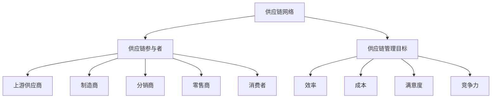

#### 核心概念原理和架构

电商供应链管理基于信息技术的支持，通过整合供应链各环节的信息流、物流和资金流，实现供应链的协同运作。其架构包括：

- **信息流**：通过 ERP（企业资源规划）、SCM（供应链管理）、CRM（客户关系管理）等系统，实现供应链各环节的信息共享和协同。
- **物流流**：通过物流管理平台，实现商品的采购、存储、配送等物流活动的有效管理。
- **资金流**：通过电子商务平台，实现商品交易的资金流转和结算。

**Mermaid 流程图**：

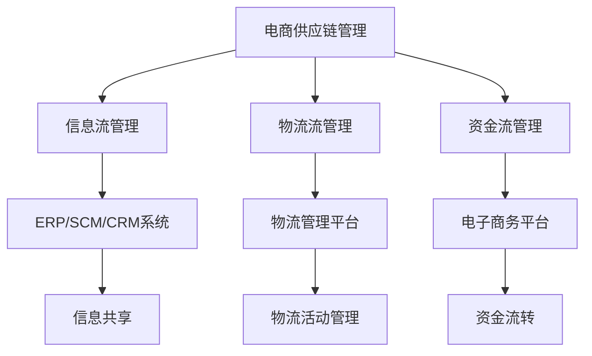

### 1.2 电商供应链的组成与结构

#### 核心概念与联系

电商供应链由多个参与者组成，包括供应商、制造商、分销商、零售商和消费者。这些参与者通过信息流、物流和资金流相互连接，形成一个复杂的供应链网络。

- **供应商**：提供原材料、零部件或其他服务给制造商。
- **制造商**：将原材料转化为成品，并将成品供应给分销商。
- **分销商**：将制造商的成品供应给零售商。
- **零售商**：将商品销售给消费者。

**Mermaid 流程图**：

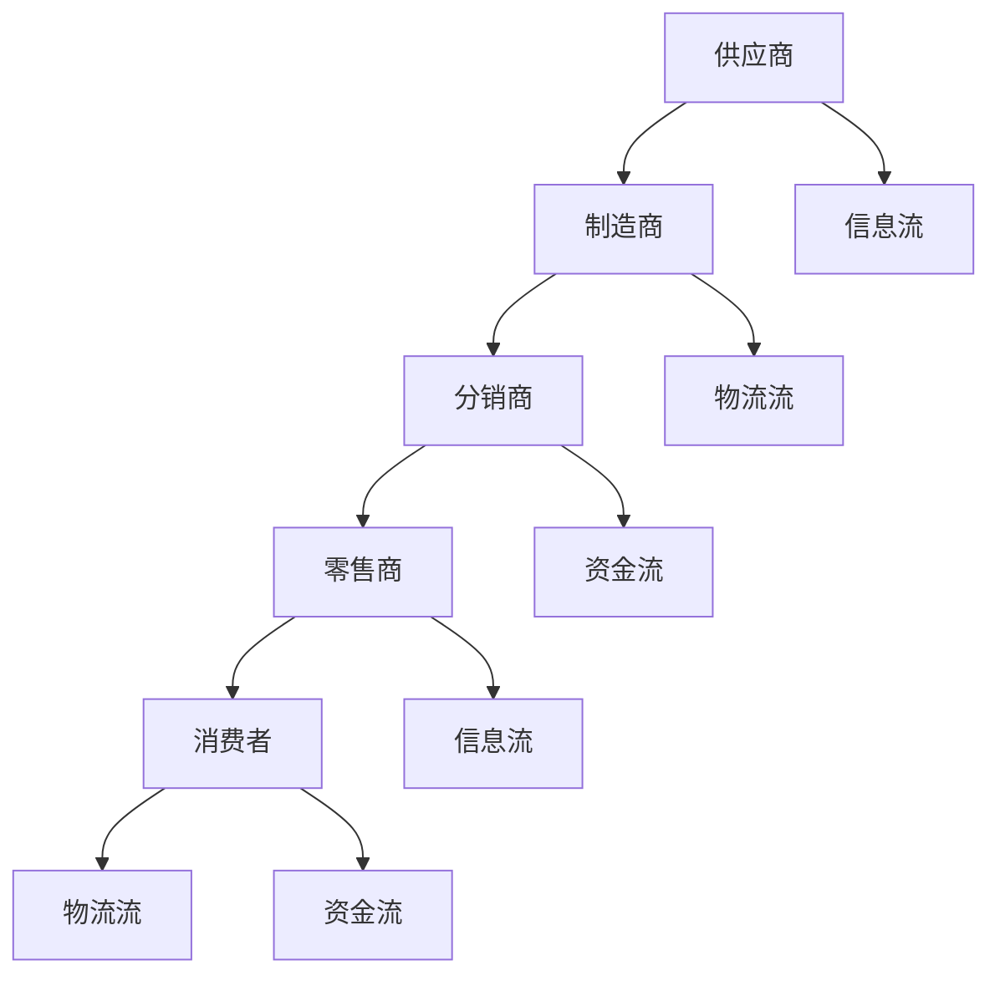

#### 核心概念原理和架构

电商供应链的组成与结构基于以下原理：

- **供应链网络**：通过信息流、物流和资金流将供应链中的各个参与者连接起来，形成一个高效、协同的供应链网络。
- **供应链节点**：供应链中的每个节点都是一个参与者的角色，如供应商、制造商、分销商和零售商。
- **供应链流程**：供应链中的物流、信息流和资金流形成一个闭环，确保商品的顺畅流动和信息的及时传递。

**Mermaid 流程图**：

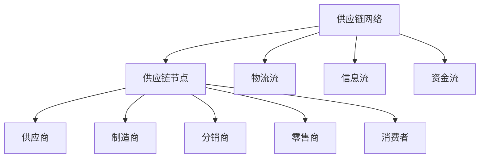

### 1.3 电商供应链管理的挑战与应对策略

#### 核心概念与联系

电商供应链管理面临一系列挑战，包括供应链复杂度增加、需求波动、物流成本上升、供应链透明度不足等。应对这些挑战需要采取一系列策略。

- **供应链复杂度**：随着电商平台的规模扩大，供应链的复杂度增加，需要更加精细化的管理。
- **需求波动**：消费者需求的波动性大，需要灵活的供应链管理来应对。
- **物流成本**：物流成本在电商运营中占较大比重，需要优化物流管理来降低成本。
- **供应链透明度**：供应链透明度不足会影响供应链的协同运作，需要提高供应链的信息共享和协同。

**Mermaid 流程图**：

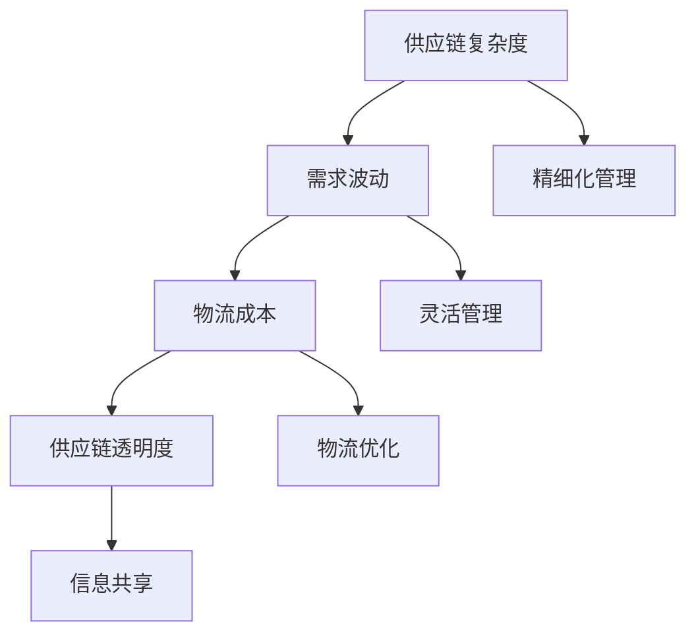

#### 核心概念原理和架构

应对电商供应链管理的挑战，需要采取以下策略：

- **供应链协同**：通过信息共享和协同，提高供应链的效率和透明度。
- **需求预测**：利用大数据和人工智能技术进行需求预测，提高供应链的灵活性。
- **物流优化**：通过物流网络优化和运输模式选择，降低物流成本。
- **供应链金融**：通过供应链金融，提高供应链的流动性，降低资金成本。

**Mermaid 流 流程图**：

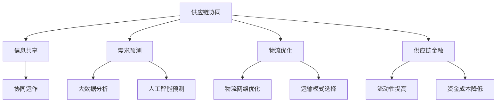

## 2.电商平台促销活动策略

### 2.1 促销活动概述

#### 核心概念与联系

促销活动是电商平台提升销量和品牌知名度的重要手段。通过价格优惠、赠品促销、限时促销和竞赛促销等方式，吸引消费者购买商品。

- **价格促销**：通过降低商品价格来刺激消费者购买。
- **赠品促销**：提供赠品以增加购买吸引力。
- **限时促销**：设定限时优惠，提高购买紧迫感。
- **竞赛促销**：通过竞赛活动吸引消费者参与，提高品牌曝光度。

**Mermaid 流程图**：

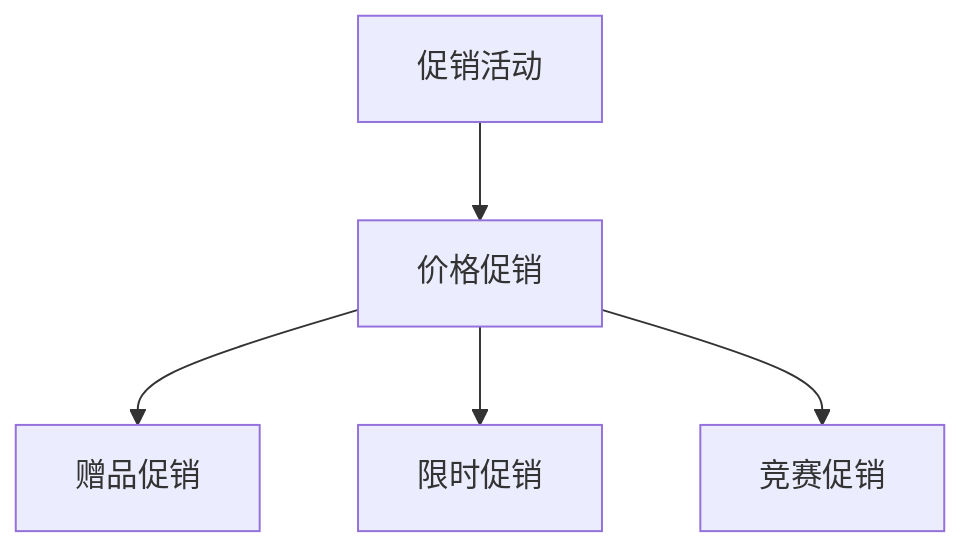

#### 核心概念原理和架构

促销活动的核心原理是通过价格、赠品、限时和竞赛等方式，激发消费者的购买欲望和参与度。促销活动的架构包括：

- **促销目标**：明确促销活动的目标，如提升销量、提高品牌知名度等。
- **促销策略**：制定具体的促销策略，如价格优惠、赠品促销等。
- **促销实施**：执行促销活动，包括策划、推广、执行等环节。
- **促销效果评估**：评估促销活动效果，如销售额、购买频率等指标。

**Mermaid 流程图**：

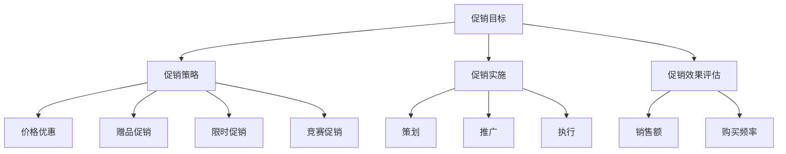

### 2.2 促销活动的核心策略

#### 核心概念与联系

促销活动的核心策略包括价格策略、赠品策略、限时策略和竞赛策略。每种策略都有其独特的特点和适用场景。

- **价格策略**：通过价格优惠来刺激消费者购买。
- **赠品策略**：通过提供赠品来增加购买吸引力。
- **限时策略**：通过限时优惠来提高购买紧迫感。
- **竞赛策略**：通过竞赛活动来吸引消费者参与。

**Mermaid 流程图**：

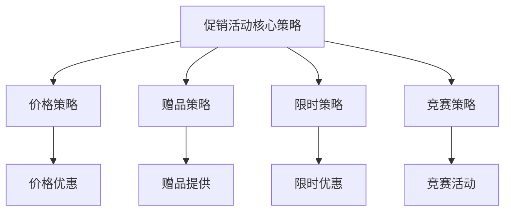

#### 核心概念原理和架构

促销活动的核心策略基于以下原理：

- **价格策略**：通过降低商品价格，增加消费者的购买欲望。
- **赠品策略**：通过提供赠品，提高商品的性价比，增加购买吸引力。
- **限时策略**：通过设定限时优惠，提高消费者的购买紧迫感，增加销售量。
- **竞赛策略**：通过竞赛活动，提高品牌曝光度，吸引消费者参与，增加销售机会。

**Mermaid 流程图**：

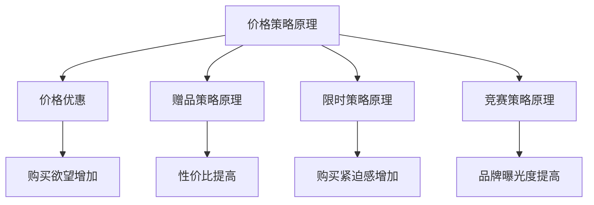

### 2.3 促销活动的效果评估

#### 核心概念与联系

促销活动的效果评估是衡量促销活动成功与否的重要环节。通过评估促销活动对销售额、购买频率和客户满意度等指标的影响，可以优化促销策略。

- **销售额**：促销活动后的销售总额。
- **购买频率**：消费者参与促销活动的次数。
- **客户满意度**：消费者对促销活动的满意度。

**Mermaid 流程图**：

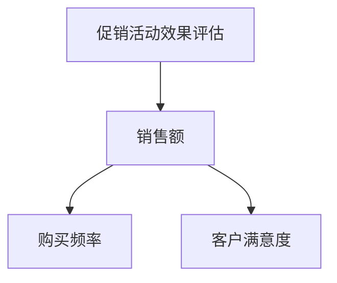

#### 核心概念原理和架构

促销活动的效果评估基于以下原理：

- **数据收集**：通过销售数据、客户反馈等途径收集促销活动的数据。
- **数据分析**：对收集到的数据进行分析，评估促销活动的效果。
- **效果优化**：根据评估结果，调整促销策略，优化促销活动的实施。

**Mermaid 流程图**：

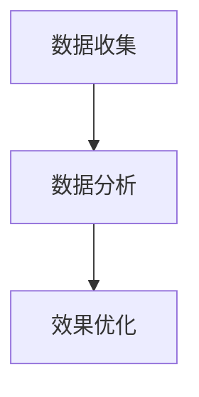

### 2.4 促销活动的计划与实施

#### 核心概念与联系

促销活动的计划与实施是确保促销活动成功的关键环节。包括促销活动的策划、资源配置、推广和执行等环节。

- **促销活动策划**：确定促销活动的主题、目标、时间等。
- **资源配置**：根据促销活动需求，配置相应的人力、物力和财力资源。
- **推广**：通过多种渠道宣传促销活动，吸引消费者参与。
- **执行**：按照计划执行促销活动，确保促销活动的顺利进行。

**Mermaid 流程图**：

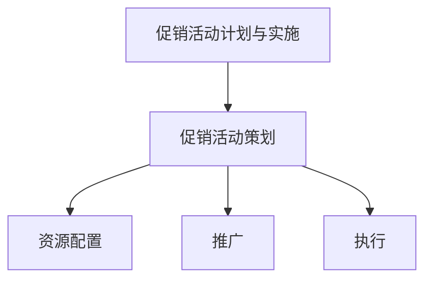

#### 核心概念原理和架构

促销活动的计划与实施基于以下原理：

- **目标明确**：明确促销活动的目标和预期效果。
- **计划周密**：制定详细的促销活动计划，包括时间、内容、流程等。
- **资源保障**：确保促销活动所需的资源充足。
- **推广到位**：通过多种渠道宣传促销活动，提高活动知名度。
- **执行严谨**：严格按照计划执行促销活动，确保活动效果。

**Mermaid 流程图**：

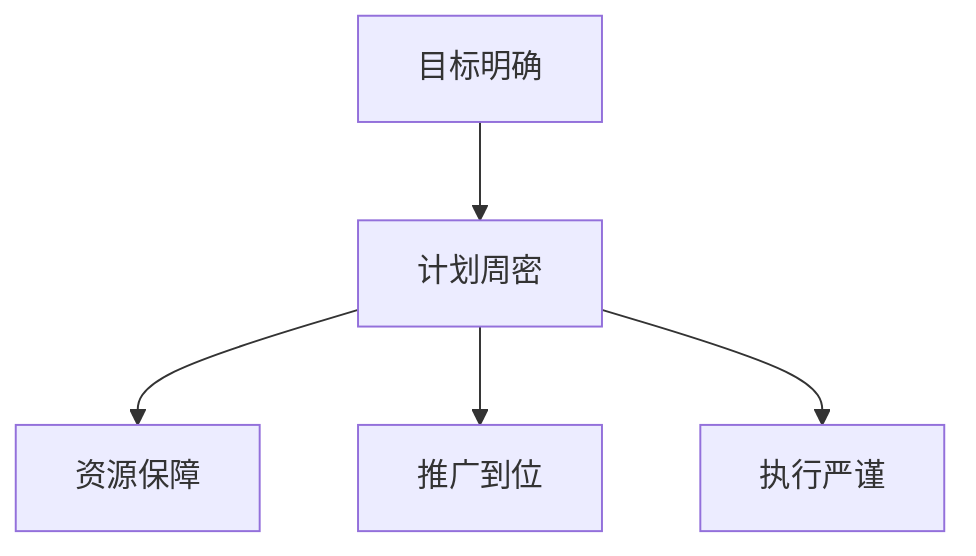

### 2.5 促销活动的案例分析

#### 核心概念与联系

通过分析具体的促销活动案例，可以了解促销活动的成功经验和不足之处，为后续促销活动提供参考。

- **案例一**：某电商平台进行“双十一”促销活动。
- **案例二**：某电商平台进行限时秒杀活动。
- **案例三**：某电商平台进行赠品促销活动。

**Mermaid 流程图**：

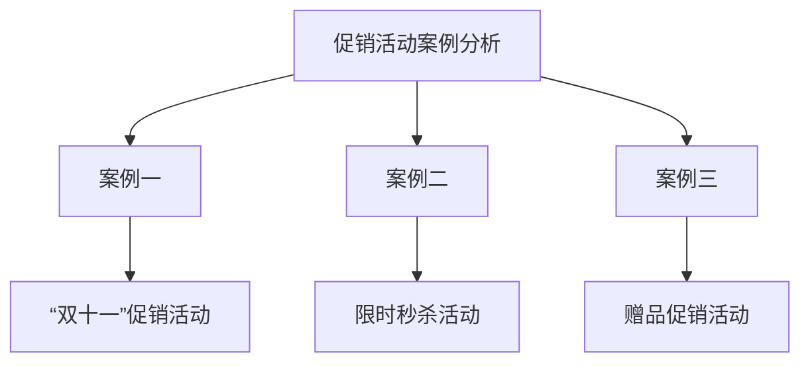

#### 核心概念原理和架构

促销活动的案例分析基于以下原理：

- **案例选取**：选取具有代表性的促销活动案例。
- **案例分析**：对案例进行深入分析，总结成功经验和不足之处。
- **经验总结**：根据案例分析结果，提出改进措施和优化策略。

**Mermaid 流程图**：

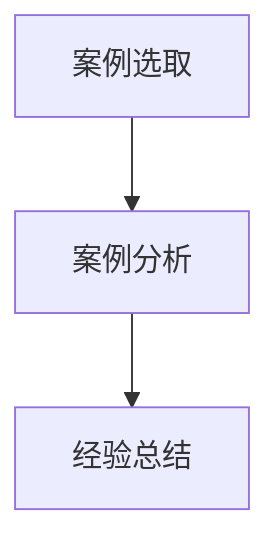

### 2.6 促销活动的效果改进策略

#### 核心概念与联系

为了提高促销活动的效果，需要采取一系列改进策略，包括数据分析、竞争对手分析和消费者需求分析。

- **数据分析**：通过数据分析，了解促销活动的效果和用户行为。
- **竞争对手分析**：分析竞争对手的促销活动策略，借鉴其成功经验。
- **消费者需求分析**：了解消费者需求，制定更具针对性的促销策略。

**Mermaid 流程图**：

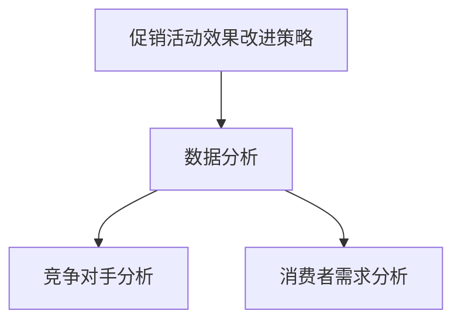

#### 核心概念原理和架构

促销活动的效果改进策略基于以下原理：

- **数据驱动**：通过数据分析，了解促销活动的效果和用户行为，为改进策略提供依据。
- **竞争对手**：通过分析竞争对手的促销活动策略，了解市场趋势，优化自身促销策略。
- **消费者需求**：通过消费者需求分析，了解目标用户的需求和偏好，制定更具针对性的促销策略。

**Mermaid 流程图**：

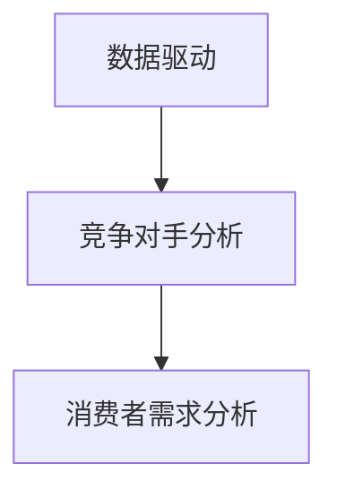

## 3.电商营销策略

### 3.1 电商营销策略概述

#### 核心概念与联系

电商营销策略是指电商平台在市场竞争中，通过产品、价格、促销、渠道等手段，实现营销目标的一系列计划和行动。

- **产品策略**：确定电商平台的产品定位、产品组合和产品创新。
- **价格策略**：制定合适的价格策略，提高产品竞争力。
- **促销策略**：通过促销活动，提高产品销量和品牌知名度。
- **渠道策略**：选择合适的销售渠道，扩大市场覆盖范围。

**Mermaid 流程图**：

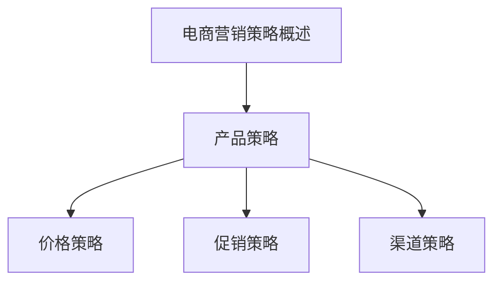

#### 核心概念原理和架构

电商营销策略基于以下原理：

- **市场分析**：通过对市场环境、竞争对手和目标客户进行分析，制定合适的营销策略。
- **策略制定**：根据市场分析和企业目标，制定具体的产品策略、价格策略、促销策略和渠道策略。
- **策略实施**：按照制定的策略，进行营销活动的策划、执行和监控。
- **效果评估**：通过数据分析和市场反馈，评估营销策略的效果，进行调整和优化。

**Mermaid 流程图**：

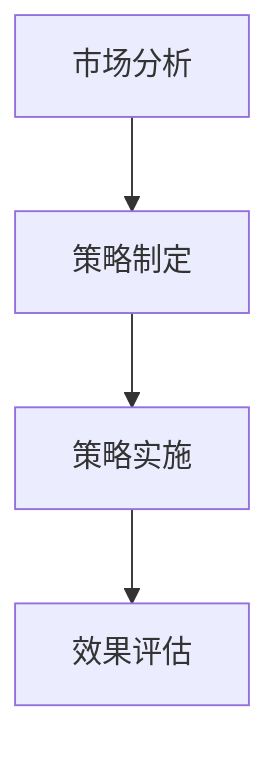

### 3.2 品牌营销策略

#### 核心概念与联系

品牌营销策略是指通过品牌定位、品牌传播和品牌体验等手段，提升品牌价值和品牌影响力的策略。

- **品牌定位**：确定品牌在市场中的定位，如高端、中端或低端市场。
- **品牌传播**：通过各种传播渠道，提高品牌知名度和美誉度。
- **品牌体验**：提供优质的客户体验，增强品牌忠诚度。

**Mermaid 流程图**：

```mermaid
graph TD
    A[品牌营销策略] --> B[品牌定位]
    B --> C[品牌传播]
    B --> D[品牌体验]
```

#### 核心概念原理和架构

品牌营销策略基于以下原理：

- **品牌认知**：通过品牌传播，提高消费者对品牌的认知和理解。
- **品牌形象**：通过品牌定位和品牌体验，塑造品牌形象和品牌价值。
- **品牌忠诚**：通过优质的客户体验和持续的品牌传播，增强品牌忠诚度。

**Mermaid 流程图**：

```mermaid
graph TD
    A[品牌认知] --> B[品牌形象]
    B --> C[品牌忠诚]
```

### 3.3 社交媒体营销策略

#### 核心概念与联系

社交媒体营销策略是指通过社交媒体平台，进行内容营销、互动营销和广告营销，提高品牌知名度和用户参与度。

- **内容营销**：创作有价值、有吸引力的内容，吸引用户关注。
- **互动营销**：与用户互动，增强用户参与感和忠诚度。
- **广告营销**：在社交媒体平台上投放广告，提高品牌曝光度。

**Mermaid 流程图**：

```mermaid
graph TD
    A[社交媒体营销策略] --> B[内容营销]
    B --> C[互动营销]
    B --> D[广告营销]
```

#### 核心概念原理和架构

社交媒体营销策略基于以下原理：

- **用户参与**：通过内容营销和互动营销，提高用户参与度和互动性。
- **品牌传播**：通过广告营销和内容营销，提高品牌知名度和影响力。
- **用户转化**：通过社交媒体营销，引导用户转化为实际购买。

**Mermaid 流程图**：

```mermaid
graph TD
    A[用户参与] --> B[品牌传播]
    B --> C[用户转化]
```

### 3.4 电子商务营销策略

#### 核心概念与联系

电子商务营销策略是指通过电子商务平台，进行搜索引擎营销、电子邮件营销和社交媒体营销，提高品牌知名度和用户转化率。

- **搜索引擎营销**：通过搜索引擎优化和搜索引擎广告，提高品牌曝光度和网站流量。
- **电子邮件营销**：通过电子邮件发送营销信息，提高用户参与度和转化率。
- **社交媒体营销**：通过社交媒体平台，进行内容营销、互动营销和广告营销。

**Mermaid 流程图**：

```mermaid
graph TD
    A[电子商务营销策略] --> B[搜索引擎营销]
    B --> C[电子邮件营销]
    B --> D[社交媒体营销]
```

#### 核心概念原理和架构

电子商务营销策略基于以下原理：

- **用户获取**：通过搜索引擎营销、社交媒体营销和电子邮件营销，获取潜在用户。
- **用户转化**：通过电子商务平台，将潜在用户转化为实际购买用户。
- **用户留存**：通过优质的客户体验和持续营销，提高用户留存率和复购率。

**Mermaid 流程图**：

```mermaid
graph TD
    A[用户获取] --> B[用户转化]
    B --> C[用户留存]
```

### 3.5 电商营销策略的案例分析

#### 核心概念与联系

通过分析具体的电商营销策略案例，可以了解电商营销策略的成功经验和不足之处，为后续电商营销活动提供参考。

- **案例一**：某电商平台的品牌营销策略。
- **案例二**：某电商平台的社交媒体营销策略。
- **案例三**：某电商平台的电子商务营销策略。

**Mermaid 流程图**：

```mermaid
graph TD
    A[电商营销策略案例分析] --> B[案例一]
    B --> C[品牌营销策略]
    A --> D[案例二]
    D --> E[社交媒体营销策略]
    A --> F[案例三]
    F --> G[电子商务营销策略]
```

#### 核心概念原理和架构

电商营销策略案例分析基于以下原理：

- **案例选取**：选取具有代表性的电商营销策略案例。
- **案例分析**：对案例进行深入分析，总结成功经验和不足之处。
- **经验总结**：根据案例分析结果，提出改进措施和优化策略。

**Mermaid 流程图**：

```mermaid
graph TD
    A[案例选取] --> B[案例分析]
    B --> C[经验总结]
```

## 4.电商供应链管理优化实践

### 4.1 供应链管理优化概述

#### 核心概念与联系

供应链管理优化是指通过改进供应链流程、提高供应链效率、降低供应链成本，实现供应链整体优化的过程。

- **供应链流程优化**：对供应链各环节的流程进行改进，提高供应链运作效率。
- **供应链效率优化**：通过技术创新和管理优化，提高供应链的整体效率。
- **供应链成本优化**：通过降低供应链各环节的成本，提高供应链的盈利能力。

**Mermaid 流程图**：

```mermaid
graph TD
    A[供应链管理优化概述] --> B[供应链流程优化]
    B --> C[供应链效率优化]
    B --> D[供应链成本优化]
```

#### 核心概念原理和架构

供应链管理优化基于以下原理：

- **流程优化**：通过改进供应链各环节的流程，消除瓶颈，提高供应链的流畅性和效率。
- **效率优化**：通过技术创新和管理优化，提高供应链的整体效率，降低运营成本。
- **成本优化**：通过降低供应链各环节的成本，提高供应链的盈利能力，增强企业的市场竞争力。

**Mermaid 流程图**：

```mermaid
graph TD
    A[流程优化] --> B[效率优化]
    B --> C[成本优化]
```

### 4.2 供应链管理优化策略

#### 核心概念与联系

供应链管理优化策略是指针对供应链管理中的问题，采取一系列措施进行优化，提高供应链的效率和效益。

- **库存管理优化**：通过科学的库存管理方法，降低库存成本，提高库存周转率。
- **物流管理优化**：通过物流网络优化和运输模式选择，提高物流效率，降低物流成本。
- **供应商管理优化**：通过优化供应商关系，提高供应链稳定性，降低采购成本。

**Mermaid 流程图**：

```mermaid
graph TD
    A[供应链管理优化策略] --> B[库存管理优化]
    B --> C[物流管理优化]
    B --> D[供应商管理优化]
```

#### 核心概念原理和架构

供应链管理优化策略基于以下原理：

- **库存管理优化**：通过科学的库存管理方法，减少库存积压，提高库存周转率，降低库存成本。
- **物流管理优化**：通过优化物流网络和运输模式选择，提高物流效率，降低物流成本，提高客户满意度。
- **供应商管理优化**：通过建立稳定的供应商关系，优化采购流程，降低采购成本，提高供应链稳定性。

**Mermaid 流程图**：

```mermaid
graph TD
    A[库存管理优化] --> B[物流管理优化]
    B --> C[供应商管理优化]
```

### 4.3 供应链管理优化实践

#### 核心概念与联系

供应链管理优化实践是指在实际运营中，通过实施具体的优化措施，提高供应链的效率和效益。

- **库存管理优化实践**：通过实施科学的库存管理方法，降低库存成本，提高库存周转率。
- **物流管理优化实践**：通过优化物流网络和运输模式选择，提高物流效率，降低物流成本。
- **供应商管理优化实践**：通过优化供应商关系，提高供应链稳定性，降低采购成本。

**Mermaid 流程图**：

```mermaid
graph TD
    A[供应链管理优化实践] --> B[库存管理优化实践]
    B --> C[物流管理优化实践]
    B --> D[供应商管理优化实践]
```

#### 核心概念原理和架构

供应链管理优化实践基于以下原理：

- **库存管理优化实践**：通过实施科学的库存管理方法，减少库存积压，提高库存周转率，降低库存成本。
- **物流管理优化实践**：通过优化物流网络和运输模式选择，提高物流效率，降低物流成本，提高客户满意度。
- **供应商管理优化实践**：通过优化供应商关系，建立稳定的供应链，降低采购成本，提高供应链稳定性。

**Mermaid 流程图**：

```mermaid
graph TD
    A[库存管理优化实践] --> B[物流管理优化实践]
    B --> C[供应商管理优化实践]
```

### 4.4 供应链管理优化案例分析

#### 核心概念与联系

通过分析具体的供应链管理优化案例，可以了解供应链管理优化的成功经验和不足之处，为后续供应链管理优化提供参考。

- **案例一**：某电商平台的库存管理优化实践。
- **案例二**：某电商平台的物流管理优化实践。
- **案例三**：某电商平台的供应商管理优化实践。

**Mermaid 流程图**：

```mermaid
graph TD
    A[供应链管理优化案例分析] --> B[案例一]
    B --> C[库存管理优化实践]
    A --> D[案例二]
    D --> E[物流管理优化实践]
    A --> F[案例三]
    F --> G[供应商管理优化实践]
```

#### 核心概念原理和架构

供应链管理优化案例分析基于以下原理：

- **案例选取**：选取具有代表性的供应链管理优化案例。
- **案例分析**：对案例进行深入分析，总结成功经验和不足之处。
- **经验总结**：根据案例分析结果，提出改进措施和优化策略。

**Mermaid 流程图**：

```mermaid
graph TD
    A[案例选取] --> B[案例分析]
    B --> C[经验总结]
```

## 5.客户关系管理优化

### 5.1 客户关系管理概述

#### 核心概念与联系

客户关系管理（CRM）是指企业通过信息技术和科学方法，建立、维护和发展与客户的长期关系，提高客户满意度和忠诚度，从而实现企业持续增长和竞争优势。

- **CRM系统**：客户关系管理系统，用于记录和管理客户信息、销售机会和客户互动。
- **客户关系**：企业与客户之间的互动关系，包括客户需求、购买行为、满意度等。
- **客户价值**：客户为企业带来的收益和潜在价值。

**Mermaid 流程图**：

```mermaid
graph TD
    A[客户关系管理概述] --> B[CRM系统]
    B --> C[客户关系]
    B --> D[客户价值]
```

#### 核心概念原理和架构

客户关系管理基于以下原理：

- **客户为中心**：以客户需求为导向，关注客户体验和满意度。
- **数据驱动**：通过收集、分析和利用客户数据，优化客户关系管理策略。
- **持续优化**：通过不断改进客户关系管理策略，提高客户满意度和忠诚度。

**Mermaid 流程图**：

```mermaid
graph TD
    A[客户为中心] --> B[数据驱动]
    B --> C[持续优化]
```

### 5.2 客户关系管理策略

#### 核心概念与联系

客户关系管理策略是指企业为实现客户关系管理目标，采取的一系列计划和行动。包括客户细分、客户忠诚度管理和客户服务管理。

- **客户细分**：将客户划分为不同的群体，提供个性化的服务和优惠。
- **客户忠诚度管理**：通过会员制度、积分奖励等手段，提高客户忠诚度。
- **客户服务管理**：提供优质的客户服务，解决客户问题和需求。

**Mermaid 流程图**：

```mermaid
graph TD
    A[客户关系管理策略] --> B[客户细分]
    B --> C[客户忠诚度管理]
    B --> D[客户服务管理]
```

#### 核心概念原理和架构

客户关系管理策略基于以下原理：

- **客户细分**：通过客户数据分析，识别不同客户群体的特征和需求，提供个性化的服务和优惠。
- **客户忠诚度管理**：通过会员制度、积分奖励等手段，增强客户对品牌的忠诚度，提高客户生命周期价值。
- **客户服务管理**：通过优质的服务，解决客户问题和需求，提高客户满意度和忠诚度。

**Mermaid 流程图**：

```mermaid
graph TD
    A[客户细分] --> B[客户忠诚度管理]
    B --> C[客户服务管理]
```

### 5.3 客户关系管理实践

#### 核心概念与联系

客户关系管理实践是指企业在实际运营中，通过实施具体的客户关系管理措施，提高客户满意度和忠诚度，实现企业目标。

- **客户细分实践**：通过数据分析和市场调研，将客户划分为不同的群体，提供个性化的服务和优惠。
- **客户忠诚度管理实践**：通过会员制度、积分奖励等手段，提高客户忠诚度。
- **客户服务管理实践**：提供优质的客户服务，解决客户问题和需求，提高客户满意度和忠诚度。

**Mermaid 流程图**：

```mermaid
graph TD
    A[客户关系管理实践] --> B[客户细分实践]
    B --> C[客户忠诚度管理实践]
    B --> D[客户服务管理实践]
```

#### 核心概念原理和架构

客户关系管理实践基于以下原理：

- **数据驱动**：通过数据分析和市场调研，识别客户需求和偏好，提供个性化的服务和优惠。
- **持续优化**：通过持续改进客户关系管理措施，提高客户满意度和忠诚度，实现企业目标。
- **客户体验**：关注客户体验，提供优质的客户服务，解决客户问题和需求，提高客户满意度和忠诚度。

**Mermaid 流程图**：

```mermaid
graph TD
    A[数据驱动] --> B[持续优化]
    B --> C[客户体验]
```

### 5.4 客户关系管理案例分析

#### 核心概念与联系

通过分析具体的客户关系管理案例，可以了解客户关系管理策略的成功经验和不足之处，为后续客户关系管理提供参考。

- **案例一**：某电商平台的客户细分实践。
- **案例二**：某电商平台的客户忠诚度管理实践。
- **案例三**：某电商平台的客户服务管理实践。

**Mermaid 流程图**：

```mermaid
graph TD
    A[客户关系管理案例分析] --> B[案例一]
    B --> C[客户细分实践]
    A --> D[案例二]
    D --> E[客户忠诚度管理实践]
    A --> F[案例三]
    F --> G[客户服务管理实践]
```

#### 核心概念原理和架构

客户关系管理案例分析基于以下原理：

- **案例选取**：选取具有代表性的客户关系管理案例。
- **案例分析**：对案例进行深入分析，总结成功经验和不足之处。
- **经验总结**：根据案例分析结果，提出改进措施和优化策略。

**Mermaid 流程图**：

```mermaid
graph TD
    A[案例选取] --> B[案例分析]
    B --> C[经验总结]
```

## 6.电商平台的数字化升级

### 6.1 数字化升级概述

#### 核心概念与联系

数字化升级是指企业利用数字技术，对业务流程、组织结构、商业模式等进行全面升级，以提高企业竞争力和创新能力。

- **数字化技术**：包括大数据、云计算、人工智能、物联网等先进技术。
- **业务流程数字化**：通过数字化技术，优化业务流程，提高运营效率。
- **组织结构数字化**：通过数字化技术，改变组织结构，提高组织协同效率。
- **商业模式数字化**：通过数字化技术，创新商业模式，开拓新市场。

**Mermaid 流程图**：

```mermaid
graph TD
    A[数字化升级概述] --> B[数字化技术]
    B --> C[业务流程数字化]
    B --> D[组织结构数字化]
    B --> E[商业模式数字化]
```

#### 核心概念原理和架构

数字化升级基于以下原理：

- **技术赋能**：利用数字化技术，提高企业的技术水平和创新能力。
- **流程优化**：通过数字化技术，优化业务流程，提高运营效率。
- **组织协同**：通过数字化技术，改变组织结构，提高组织协同效率。
- **商业模式创新**：通过数字化技术，创新商业模式，开拓新市场。

**Mermaid 流程图**：

```mermaid
graph TD
    A[技术赋能] --> B[流程优化]
    B --> C[组织协同]
    B --> D[商业模式创新]
```

### 6.2 数字化升级策略

#### 核心概念与联系

数字化升级策略是指企业为实现数字化升级目标，采取的一系列计划和行动。包括数据分析、人工智能应用和云计算与物联网应用。

- **数据分析**：利用大数据技术，对业务数据进行收集、存储、分析和应用，提高决策效率。
- **人工智能应用**：利用人工智能技术，优化业务流程，提高运营效率。
- **云计算与物联网应用**：利用云计算和物联网技术，实现业务流程的数字化和智能化。

**Mermaid 流程图**：

```mermaid
graph TD
    A[数字化升级策略] --> B[数据分析]
    B --> C[人工智能应用]
    B --> D[云计算与物联网应用]
```

#### 核心概念原理和架构

数字化升级策略基于以下原理：

- **数据驱动**：通过数据分析，获取业务洞察，优化业务流程。
- **人工智能**：利用人工智能技术，自动化业务流程，提高运营效率。
- **云计算与物联网**：利用云计算和物联网技术，实现业务流程的数字化和智能化。

**Mermaid 流程图**：

```mermaid
graph TD
    A[数据驱动] --> B[人工智能]
    B --> C[云计算与物联网]
```

### 6.3 数字化升级实践

#### 核心概念与联系

数字化升级实践是指企业在实际运营中，通过实施具体的数字化升级措施，提高业务流程效率和创新能力。

- **数据分析实践**：通过数据收集、存储、分析和应用，优化业务流程。
- **人工智能应用实践**：通过人工智能技术，自动化业务流程，提高运营效率。
- **云计算与物联网应用实践**：通过云计算和物联网技术，实现业务流程的数字化和智能化。

**Mermaid 流程图**：

```mermaid
graph TD
    A[数字化升级实践] --> B[数据分析实践]
    B --> C[人工智能应用实践]
    B --> D[云计算与物联网应用实践]
```

#### 核心概念原理和架构

数字化升级实践基于以下原理：

- **数据驱动**：通过数据收集、存储、分析和应用，优化业务流程。
- **人工智能**：通过人工智能技术，自动化业务流程，提高运营效率。
- **云计算与物联网**：通过云计算和物联网技术，实现业务流程的数字化和智能化。

**Mermaid 流程图**：

```mermaid
graph TD
    A[数据驱动] --> B[人工智能]
    B --> C[云计算与物联网]
```

### 6.4 数字化升级案例分析

#### 核心概念与联系

通过分析具体的数字化升级案例，可以了解数字化升级策略的成功经验和不足之处，为后续数字化升级提供参考。

- **案例一**：某电商平台的数字化升级实践。
- **案例二**：某零售企业的数字化升级实践。
- **案例三**：某制造企业的数字化升级实践。

**Mermaid 流程图**：

```mermaid
graph TD
    A[数字化升级案例分析] --> B[案例一]
    B --> C[数据分析实践]
    A --> D[案例二]
    D --> E[人工智能应用实践]
    A --> F[案例三]
    F --> G[云计算与物联网应用实践]
```

#### 核心概念原理和架构

数字化升级案例分析基于以下原理：

- **案例选取**：选取具有代表性的数字化升级案例。
- **案例分析**：对案例进行深入分析，总结成功经验和不足之处。
- **经验总结**：根据案例分析结果，提出改进措施和优化策略。

**Mermaid 流程图**：

```mermaid
graph TD
    A[案例选取] --> B[案例分析]
    B --> C[经验总结]
```

## 7.电商供应链与营销案例解析

### 7.1 案例选取标准

#### 核心概念与联系

在电商供应链与营销案例解析中，案例的选取标准至关重要。一个优秀的案例应当具备以下标准：

- **典型性**：案例具有代表性，能够反映行业趋势和最佳实践。
- **创新性**：案例采用了创新的方法或技术，具有借鉴意义。
- **效益性**：案例对电商供应链和营销能力的提升有显著成效。

**Mermaid 流程图**：

```mermaid
graph TD
    A[案例选取标准] --> B[典型性]
    B --> C[创新性]
    B --> D[效益性]
```

#### 核心概念原理和架构

案例选取标准基于以下原理：

- **代表性**：案例能够反映行业趋势和最佳实践，对其他电商平台具有指导意义。
- **创新性**：案例采用了创新的方法或技术，为行业提供新的思路。
- **效益性**：案例对电商供应链和营销能力的提升有显著成效，具有实际应用价值。

**Mermaid 流程图**：

```mermaid
graph TD
    A[代表性] --> B[创新性]
    B --> C[效益性]
```

### 7.2 案例分析

#### 核心概念与联系

在电商供应链与营销案例解析中，对案例的深入分析至关重要。通过分析案例的成功经验和不足之处，可以为企业提供宝贵的参考。

- **案例一**：某电商平台的供应链优化实践。
- **案例二**：某电商平台的营销策略实践。
- **案例三**：某电商平台的数字化升级实践。

**Mermaid 流程图**：

```mermaid
graph TD
    A[案例分析] --> B[案例一]
    B --> C[供应链优化实践]
    A --> D[案例二]
    D --> E[营销策略实践]
    A --> F[案例三]
    F --> G[数字化升级实践]
```

#### 核心概念原理和架构

案例分析基于以下原理：

- **成功经验**：通过分析案例的成功经验，了解行业最佳实践。
- **不足之处**：通过分析案例的不足之处，避免类似问题的发生。
- **实践借鉴**：将案例中的成功经验和不足之处应用于企业实际运营。

**Mermaid 流程图**：

```mermaid
graph TD
    A[成功经验] --> B[不足之处]
    B --> C[实践借鉴]
```

### 7.3 案例总结与启示

#### 核心概念与联系

在电商供应链与营销案例解析中，对案例的总结与启示是关键。通过总结案例中的成功经验和不足之处，可以为企业的供应链管理和营销策略提供指导。

**Mermaid 流程图**：

```mermaid
graph TD
    A[案例总结与启示] --> B[成功经验]
    B --> C[不足之处]
```

#### 核心概念原理和架构

案例总结与启示基于以下原理：

- **成功经验**：总结案例中的成功经验，将其作为企业运营的参考。
- **不足之处**：反思案例中的不足之处，为企业的运营提供改进方向。
- **启示与反思**：通过案例的启示，帮助企业更好地应对行业挑战。

**Mermaid 流程图**：

```mermaid
graph TD
    A[成功经验] --> B[不足之处]
    B --> C[启示与反思]
```

## 附录

### 附录A：电商供应链管理优化工具与资源

#### 核心概念与联系

电商供应链管理优化工具与资源是企业在进行供应链管理优化过程中所使用的重要工具和资源。

- **供应链管理软件**：用于供应链管理的软件工具，如 SAP SCM、Infor SCM。
- **库存管理工具**：用于库存管理的软件工具，如 Odoo Inventory、TradeGecko。
- **物流管理工具**：用于物流管理的软件工具，如 ShipStation、Freyr。

**Mermaid 流程图**：

```mermaid
graph TD
    A[电商供应链管理优化工具与资源] --> B[供应链管理软件]
    B --> C[SAP SCM]
    B --> D[Infor SCM]
    A --> E[库存管理工具]
    E --> F[Odoo Inventory]
    E --> G[TradeGecko]
    A --> H[物流管理工具]
    H --> I[ShipStation]
    H --> J[Freyr]
```

#### 核心概念原理和架构

电商供应链管理优化工具与资源基于以下原理：

- **工具集成**：通过供应链管理软件、库存管理工具和物流管理工具的集成，实现供应链管理的协同和高效。
- **数据驱动**：通过收集和分析供应链数据，优化供应链管理和决策。
- **资源整合**：通过整合供应链管理工具和资源，提高供应链的效率和效益。

**Mermaid 流程图**：

```mermaid
graph TD
    A[工具集成] --> B[数据驱动]
    B --> C[资源整合]
```

### 附录B：电商营销策略分析工具

#### 核心概念与联系

电商营销策略分析工具是企业在制定和实施电商营销策略过程中所使用的重要工具。

- **数据分析工具**：用于收集、处理和分析电商营销数据，如 Google Analytics、Tableau。
- **营销自动化工具**：用于自动化电商营销活动的工具，如 HubSpot、Pardot。
- **社交媒体分析工具**：用于分析社交媒体营销效果的工具，如 Hootsuite、Sprout Social。

**Mermaid 流.Flow图**：

```mermaid
graph TD
    A[电商营销策略分析工具] --> B[数据分析工具]
    B --> C[Google Analytics]
    B --> D[Tableau]
    A --> E[营销自动化工具]
    E --> F[HubSpot]
    E --> G[Pardot]
    A --> H[社交媒体分析工具]
    H --> I[Hootsuite]
    H --> J[Sprout Social]
```

#### 核心概念原理和架构

电商营销策略分析工具基于以下原理：

- **数据驱动**：通过数据分析工具，收集和挖掘电商营销数据，优化营销策略。
- **自动化**：通过营销自动化工具，自动化营销活动，提高营销效率。
- **社交媒体分析**：通过社交媒体分析工具，分析社交媒体营销效果，优化社交媒体策略。

**Mermaid 流程图**：

```mermaid
graph TD
    A[数据驱动] --> B[自动化]
    B --> C[社交媒体分析]
```

### 附录C：电商行业报告与数据

#### 核心概念与联系

电商行业报告与数据是了解电商行业发展动态和市场趋势的重要资料。

- **电商平台市场分析报告**：分析电商平台的市场规模、市场份额和用户行为等。
- **电商行业发展趋势报告**：预测电商行业的未来发展趋势和热点领域。
- **电商平台用户行为分析报告**：分析电商平台的用户行为特征和购买习惯。

**Mermaid 流程图**：

```mermaid
graph TD
    A[电商行业报告与数据] --> B[电商平台市场分析报告]
    B --> C[市场规模]
    B --> D[市场份额]
    B --> E[用户行为]
    A --> F[电商行业发展趋势报告]
    F --> G[未来趋势]
    F --> H[热点领域]
    A --> I[电商平台用户行为分析报告]
    I --> J[行为特征]
    I --> K[购买习惯]
```

#### 核心概念原理和架构

电商行业报告与数据基于以下原理：

- **市场分析**：通过对电商平台的市场规模、市场份额和用户行为进行分析，了解电商行业的发展现状和趋势。
- **趋势预测**：通过对电商行业的发展趋势和热点领域进行分析，预测电商行业的未来发展方向。
- **用户分析**：通过对电商平台用户的行为特征和购买习惯进行分析，了解用户需求和市场机会。

**Mermaid 流程图**：

```mermaid
graph TD
    A[市场分析] --> B[趋势预测]
    B --> C[用户分析]
```


# 附录

### 附录A：电商供应链管理优化工具与资源

在电商供应链管理优化过程中，以下工具和资源可供参考：

- **供应链管理软件**：
  - **SAP SCM**：提供全面的供应链管理功能，包括采购、库存、物流等。
  - **Infor SCM**：提供供应链规划、执行和优化解决方案。
  - **JDA Software**：专注于供应链和零售行业的软件解决方案。

- **库存管理工具**：
  - **TradeGecko**：提供实时库存跟踪和自动化库存管理功能。
  - **Odoo Inventory**：开源的库存管理软件，集成企业资源规划（ERP）功能。
  - **SKULab**：专注于库存管理，提供库存预测、采购建议等。

- **物流管理工具**：
  - **Freyr**：提供物流跟踪、运输管理和供应链优化功能。
  - **ShipStation**：专门用于订单管理和多渠道物流。
  - **Easyship**：提供全球物流解决方案，简化跨境运输。

### 附录B：电商营销策略分析工具

电商营销策略的分析工具能够帮助企业更好地理解市场动态和消费者行为，以下是一些常用的工具：

- **数据分析工具**：
  - **Google Analytics**：Google 提供的免费网站分析工具，用于跟踪用户行为和网站性能。
  - **Tableau**：数据可视化和分析工具，帮助用户快速理解和传达数据。
  - **HubSpot Analytics**：集成的营销分析工具，提供详细的市场趋势和用户行为分析。

- **营销自动化工具**：
  - **HubSpot Marketing Hub**：提供营销自动化功能，包括电子邮件营销、SEO、博客等。
  - **Pardot**：由Salesforce提供的营销自动化平台，适合企业规模较大的电商企业。
  - **Marketo**：提供全面的营销自动化解决方案，适用于多种规模的企业。

- **社交媒体分析工具**：
  - **Hootsuite**：社交媒体管理工具，用于发布、分析和互动。
  - **Sprout Social**：提供社交媒体分析和客户管理功能。
  - **Agorapulse**：专注于社交媒体分析和客户服务的平台。

### 附录C：电商行业相关报告与数据

电商行业相关报告和数据对于了解行业趋势和制定战略至关重要。以下是一些推荐的报告和数据来源：

- **电商平台市场分析报告**：
  - **艾瑞咨询**：提供中国电商行业深度分析报告。
  - **亚马逊中国**：发布关于中国电商市场的年度报告。
  - **易观国际**：提供中国电商市场研究报告，涵盖市场规模、用户行为等。

- **电商行业发展趋势报告**：
  - **CBNData**：阿里巴巴旗下的数据服务平台，提供电商行业发展趋势报告。
  - **腾讯研究院**：发布电商相关的研究报告，涵盖行业动态和趋势。
  - **阿里研究院**：提供电商行业的研究分析和预测。

- **电商平台用户行为分析报告**：
  - **阿里妈妈**：提供中国电商用户行为分析报告。
  - **京东**：发布京东用户行为分析报告，涵盖购物习惯、偏好等。
  - **拼多多**：提供拼多多用户行为分析报告，洞察拼多多用户特点。


## 文章标题：电商平台供给能力提升：促销活动和营销策略

### 关键词

- 电商平台
- 供给能力
- 促销活动
- 营销策略
- 价格策略
- 数字化升级
- 客户关系管理

### 摘要

本文深入探讨了电商平台在提升供给能力方面的关键策略，特别是促销活动和营销策略的应用。文章首先介绍了电商供应链管理的基础知识，分析了促销活动的类型、目标与实施策略，探讨了价格策略的设计与调整技巧，以及促销活动效果评估的方法。接着，文章详细阐述了电商营销策略的概述、品牌营销策略、社交媒体营销策略和电子商务营销策略。随后，文章重点讨论了电商供应链管理优化实践，包括库存管理优化、物流管理优化和供应商管理优化。最后，文章提出了客户关系管理优化的方法和数字化升级的策略，并通过案例分析总结了电商供应链与营销的最佳实践。本文旨在为电商从业者提供有价值的指导，帮助他们在提升供给能力方面取得成功。

---

## 1. 电商供应链管理基础

### 1.1 电商供应链管理概述

#### 定义与作用

电商供应链管理是指利用现代信息技术和科学管理方法，对电商平台中的商品流、信息流、资金流进行有效整合和优化，以满足消费者需求并实现企业目标的过程。它是电商平台运营的核心环节，直接影响着平台的竞争力、客户满意度和市场占有率。

**核心概念与联系**

电商供应链管理涉及多个核心概念，包括：

- **供应链网络**：由供应商、制造商、分销商、零售商和消费者组成的网络。
- **供应链参与者**：供应链中的各个企业或组织。
- **供应链管理目标**：提高供应链效率、降低成本、提升客户满意度、增强企业竞争力。

**Mermaid 流程图**

```mermaid
graph TD
    A[供应链网络] --> B[供应链参与者]
    B --> C[供应商]
    B --> D[制造商]
    B --> E[分销商]
    B --> F[零售商]
    B --> G[消费者]
    A --> H[商品流]
    A --> I[信息流]
    A --> J[资金流]
```

#### 核心概念原理和架构

电商供应链管理的核心原理是通过信息技术和科学管理方法，实现供应链各环节的协同运作。其架构包括：

- **信息流**：通过 ERP、SCM、CRM 等系统实现信息共享和协同。
- **物流流**：通过物流管理平台实现商品采购、存储、配送等活动的管理。
- **资金流**：通过电子商务平台实现商品交易和结算。

**Mermaid 流程图**

```mermaid
graph TD
    A[电商供应链管理] --> B[信息流管理]
    B --> C[ERP/SCM/CRM系统]
    A --> D[物流流管理]
    D --> E[物流管理平台]
    A --> F[资金流管理]
    F --> G[电子商务平台]
    C --> H[信息共享]
    E --> I[物流活动管理]
    G --> J[资金流转]
```

### 1.2 电商供应链的组成与结构

#### 核心概念与联系

电商供应链由多个参与者组成，包括供应商、制造商、分销商、零售商和消费者。这些参与者通过信息流、物流和资金流相互连接，形成一个复杂的供应链网络。

- **供应商**：提供原材料、零部件或其他服务给制造商。
- **制造商**：将原材料转化为成品，并将成品供应给分销商。
- **分销商**：将制造商的成品供应给零售商。
- **零售商**：将商品销售给消费者。

**Mermaid 流程图**

```mermaid
graph TD
    A[供应商] --> B[制造商]
    B --> C[分销商]
    C --> D[零售商]
    D --> E[消费者]
    A --> F[信息流]
    B --> G[物流流]
    C --> H[资金流]
    D --> I[信息流]
    E --> J[物流流]
    E --> K[资金流]
```

#### 核心概念原理和架构

电商供应链的组成与结构基于以下原理：

- **供应链网络**：通过信息流、物流和资金流将供应链中的各个参与者连接起来，形成一个高效、协同的供应链网络。
- **供应链节点**：供应链中的每个节点都是一个参与者的角色，如供应商、制造商、分销商和零售商。
- **供应链流程**：供应链中的物流、信息流和资金流形成一个闭环，确保商品的顺畅流动和信息的及时传递。

**Mermaid 流程图**

```mermaid
graph TD
    A[供应链网络] --> B[供应链节点]
    B --> C[供应商]
    B --> D[制造商]
    B --> E[分销商]
    B --> F[零售商]
    B --> G[消费者]
    A --> H[物流流]
    A --> I[信息流]
    A --> J[资金流]
```

### 1.3 电商供应链管理的挑战与应对策略

#### 核心概念与联系

电商供应链管理面临一系列挑战，包括供应链复杂度增加、需求波动、物流成本上升、供应链透明度不足等。应对这些挑战需要采取一系列策略。

- **供应链复杂度**：随着电商平台的规模扩大，供应链的复杂度增加，需要更加精细化的管理。
- **需求波动**：消费者需求的波动性大，需要灵活的供应链管理来应对。
- **物流成本**：物流成本在电商运营中占较大比重，需要优化物流管理来降低成本。
- **供应链透明度**：供应链透明度不足会影响供应链的协同运作，需要提高供应链的信息共享和协同。

**Mermaid 流程图**

```mermaid
graph TD
    A[供应链复杂度] --> B[需求波动]
    B --> C[物流成本]
    C --> D[供应链透明度]
    A --> E[精细化管理]
    B --> F[灵活管理]
    C --> G[物流优化]
    D --> H[信息共享]
```

#### 核心概念原理和架构

应对电商供应链管理的挑战，需要采取以下策略：

- **供应链协同**：通过信息共享和协同，提高供应链的效率和透明度。
- **需求预测**：利用大数据和人工智能技术进行需求预测，提高供应链的灵活性。
- **物流优化**：通过物流网络优化和运输模式选择，降低物流成本。
- **供应链金融**：通过供应链金融，提高供应链的流动性，降低资金成本。

**Mermaid 流程图**

```mermaid
graph TD
    A[供应链协同] --> B[信息共享]
    B --> C[协同运作]
    A --> D[需求预测]
    D --> E[大数据分析]
    D --> F[人工智能预测]
    A --> G[物流优化]
    G --> H[物流网络优化]
    G --> I[运输模式选择]
    A --> J[供应链金融]
    J --> K[流动性提高]
    J --> L[资金成本降低]
```

### 1.4 电商供应链管理的核心环节

#### 核心概念与联系

电商供应链管理的核心环节包括商品供应、物流配送和客户服务。这三个环节的协同运作直接影响着电商平台的供给能力。

- **商品供应**：确保商品质量和库存充足，满足消费者需求。
- **物流配送**：提高配送速度和降低物流成本，提升客户满意度。
- **客户服务**：提供优质的售后服务，增强客户忠诚度。

**Mermaid 流程图**

```mermaid
graph TD
    A[电商供应链管理] --> B[商品供应]
    B --> C[物流配送]
    B --> D[客户服务]
    C --> E[配送速度]
    C --> F[物流成本]
    D --> G[售后服务]
    D --> H[客户忠诚度]
```

#### 核心概念原理和架构

电商供应链管理的核心环节基于以下原理：

- **供应链协同**：通过信息共享和协同，实现商品供应、物流配送和客户服务的无缝衔接。
- **需求驱动**：根据市场需求和消费者需求，优化商品供应、物流配送和客户服务的策略。
- **效率提升**：通过优化流程和降低成本，提高电商供应链的整体效率。

**Mermaid 流程图**

```mermaid
graph TD
    A[供应链协同] --> B[需求驱动]
    B --> C[效率提升]
    C --> D[商品供应]
    C --> E[物流配送]
    C --> F[客户服务]
```

### 1.5 电商供应链管理的绩效评估

#### 核心概念与联系

电商供应链管理的绩效评估是衡量供应链管理效果的重要手段。通过评估供应链的效率、成本和客户满意度等指标，可以不断优化供应链管理策略。

- **效率指标**：包括库存周转率、订单处理时间、配送准时率等。
- **成本指标**：包括物流成本、库存成本、运营成本等。
- **客户满意度**：通过用户反馈、售后服务质量等指标来衡量。

**Mermaid 流程图**

```mermaid
graph TD
    A[电商供应链管理绩效评估] --> B[效率指标]
    B --> C[库存周转率]
    B --> D[订单处理时间]
    B --> E[配送准时率]
    A --> F[成本指标]
    F --> G[物流成本]
    F --> H[库存成本]
    F --> I[运营成本]
    A --> J[客户满意度]
    J --> K[用户反馈]
    J --> L[售后服务质量]
```

#### 核心概念原理和架构

电商供应链管理的绩效评估基于以下原理：

- **数据驱动**：通过收集和分析供应链数据，评估供应链管理的效果。
- **持续改进**：根据绩效评估结果，持续优化供应链管理策略，提高供应链整体绩效。

**Mermaid 流程图**

```mermaid
graph TD
    A[数据驱动] --> B[持续改进]
    B --> C[绩效评估]
    C --> D[效率提升]
    C --> E[成本控制]
    C --> F[客户满意度提升]
```

## 2. 电商平台促销活动策略

### 2.1 促销活动概述

#### 核心概念与联系

促销活动是电商平台提升销量和品牌知名度的重要手段。通过价格优惠、赠品促销、限时促销和竞赛促销等方式，吸引消费者购买商品。

- **价格促销**：通过降低商品价格来刺激消费者购买。
- **赠品促销**：提供赠品以增加购买吸引力。
- **限时促销**：设定限时优惠，提高购买紧迫感。
- **竞赛促销**：通过竞赛活动吸引消费者参与，提高品牌曝光度。

**Mermaid 流程图**

```mermaid
graph TD
    A[促销活动] --> B[价格促销]
    B --> C[赠品促销]
    B --> D[限时促销]
    B --> E[竞赛促销]
```

#### 核心概念原理和架构

促销活动的核心原理是通过价格、赠品、限时和竞赛等方式，激发消费者的购买欲望和参与度。促销活动的架构包括：

- **促销目标**：明确促销活动的目标，如提升销量、提高品牌知名度等。
- **促销策略**：制定具体的促销策略，如价格优惠、赠品促销等。
- **促销实施**：执行促销活动，包括策划、推广、执行等环节。
- **促销效果评估**：评估促销活动效果，如销售额、购买频率等指标。

**Mermaid 流程图**

```mermaid
graph TD
    A[促销目标] --> B[促销策略]
    B --> C[价格优惠]
    B --> D[赠品促销]
    B --> E[限时促销]
    B --> F[竞赛促销]
    A --> G[促销实施]
    G --> H[策划]
    G --> I[推广]
    G --> J[执行]
    A --> K[促销效果评估]
    K --> L[销售额]
    K --> M[购买频率]
```

### 2.2 促销活动的核心策略

#### 核心概念与联系

促销活动的核心策略包括价格策略、赠品策略、限时策略和竞赛策略。每种策略都有其独特的特点和适用场景。

- **价格策略**：通过价格优惠来刺激消费者购买。
- **赠品策略**：通过提供赠品来增加购买吸引力。
- **限时策略**：通过限时优惠来提高购买紧迫感。
- **竞赛策略**：通过竞赛活动来吸引消费者参与。

**Mermaid 流程图**

```mermaid
graph TD
    A[促销活动核心策略] --> B[价格策略]
    B --> C[价格优惠]
    A --> D[赠品策略]
    D --> E[赠品提供]
    A --> F[限时策略]
    F --> G[限时优惠]
    A --> H[竞赛策略]
    H --> I[竞赛活动]
```

#### 核心概念原理和架构

促销活动的核心策略基于以下原理：

- **价格策略**：通过降低商品价格，增加消费者的购买欲望。
- **赠品策略**：通过提供赠品，提高商品的性价比，增加购买吸引力。
- **限时策略**：通过设定限时优惠，提高消费者的购买紧迫感，增加销售量。
- **竞赛策略**：通过竞赛活动，提高品牌曝光度，吸引消费者参与，增加销售机会。

**Mermaid 流程图**

```mermaid
graph TD
    A[价格策略原理] --> B[价格优惠]
    B --> C[购买欲望增加]
    A --> D[赠品策略原理]
    D --> E[性价比提高]
    A --> F[限时策略原理]
    F --> G[购买紧迫感增加]
    A --> H[竞赛策略原理]
    H --> I[品牌曝光度提高]
```

### 2.3 促销活动的效果评估

#### 核心概念与联系

促销活动的效果评估是衡量促销活动成功与否的重要环节。通过评估促销活动对销售额、购买频率和客户满意度等指标的影响，可以优化促销策略。

- **销售额**：促销活动后的销售总额。
- **购买频率**：消费者参与促销活动的次数。
- **客户满意度**：消费者对促销活动的满意度。

**Mermaid 流程图**

```mermaid
graph TD
    A[促销活动效果评估] --> B[销售额]
    B --> C[购买频率]
    B --> D[客户满意度]
```

#### 核心概念原理和架构

促销活动的效果评估基于以下原理：

- **数据收集**：通过销售数据、客户反馈等途径收集促销活动的数据。
- **数据分析**：对收集到的数据进行分析，评估促销活动的效果。
- **效果优化**：根据评估结果，调整促销策略，优化促销活动的实施。

**Mermaid 流程图**

```mermaid
graph TD
    A[数据收集] --> B[数据分析]
    B --> C[效果优化]
```

### 2.4 促销活动的计划与实施

#### 核心概念与联系

促销活动的计划与实施是确保促销活动成功的关键环节。包括促销活动的策划、资源配置、推广和执行等环节。

- **促销活动策划**：确定促销活动的主题、目标、时间等。
- **资源配置**：根据促销活动需求，配置相应的人力、物力和财力资源。
- **推广**：通过多种渠道宣传促销活动，吸引消费者参与。
- **执行**：按照计划执行促销活动，确保促销活动的顺利进行。

**Mermaid 流程图**

```mermaid
graph TD
    A[促销活动计划与实施] --> B[促销活动策划]
    B --> C[资源配置]
    B --> D[推广]
    B --> E[执行]
```

#### 核心概念原理和架构

促销活动的计划与实施基于以下原理：

- **目标明确**：明确促销活动的目标和预期效果。
- **计划周密**：制定详细的促销活动计划，包括时间、内容、流程等。
- **资源保障**：确保促销活动所需的资源充足。
- **推广到位**：通过多种渠道宣传促销活动，提高活动知名度。
- **执行严谨**：严格按照计划执行促销活动，确保活动效果。

**Mermaid 流程图**

```mermaid
graph TD
    A[目标明确] --> B[计划周密]
    B --> C[资源保障]
    B --> D[推广到位]
    B --> E[执行严谨]
```

### 2.5 促销活动的案例分析

#### 核心概念与联系

通过分析具体的促销活动案例，可以了解促销活动的成功经验和不足之处，为后续促销活动提供参考。

- **案例一**：某电商平台进行“双十一”促销活动。
- **案例二**：某电商平台进行限时秒杀活动。
- **案例三**：某电商平台进行赠品促销活动。

**Mermaid 流程图**

```mermaid
graph TD
    A[促销活动案例分析] --> B[案例一]
    B --> C[“双十一”促销活动]
    A --> D[案例二]
    D --> E[限时秒杀活动]
    A --> F[案例三]
    F --> G[赠品促销活动]
```

#### 核心概念原理和架构

促销活动的案例分析基于以下原理：

- **案例选取**：选取具有代表性的促销活动案例。
- **案例分析**：对案例进行深入分析，总结成功经验和不足之处。
- **经验总结**：根据案例分析结果，提出改进措施和优化策略。

**Mermaid 流程图**

```mermaid
graph TD
    A[案例选取] --> B[案例分析]
    B --> C[经验总结]
```

### 2.6 促销活动的效果改进策略

#### 核心概念与联系

为了提高促销活动的效果，需要采取一系列改进策略，包括数据分析、竞争对手分析和消费者需求分析。

- **数据分析**：通过数据分析，了解促销活动的效果和用户行为。
- **竞争对手分析**：分析竞争对手的促销活动策略，借鉴其成功经验。
- **消费者需求分析**：了解消费者需求，制定更具针对性的促销策略。

**Mermaid 流程图**

```mermaid
graph TD
    A[促销活动效果改进策略] --> B[数据分析]
    B --> C[竞争对手分析]
    B --> D[消费者需求分析]
```

#### 核心概念原理和架构

促销活动的效果改进策略基于以下原理：

- **数据驱动**：通过数据分析，了解促销活动的效果和用户行为，为改进策略提供依据。
- **竞争对手**：通过分析竞争对手的促销活动策略，了解市场趋势，优化自身促销策略。
- **消费者需求**：通过消费者需求分析，了解目标用户的需求和偏好，制定更具针对性的促销策略。

**Mermaid 流程图**

```mermaid
graph TD
    A[数据驱动] --> B[竞争对手分析]
    B --> C[消费者需求分析]
```

## 3. 电商营销策略

### 3.1 电商营销策略概述

#### 核心概念与联系

电商营销策略是指电商平台在市场竞争中，通过产品、价格、促销、渠道等手段，实现营销目标的一系列计划和行动。

- **产品策略**：确定电商平台的产品定位、产品组合和产品创新。
- **价格策略**：制定合适的价格策略，提高产品竞争力。
- **促销策略**：通过促销活动，提高产品销量和品牌知名度。
- **渠道策略**：选择合适的销售渠道，扩大市场覆盖范围。

**Mermaid 流程图**

```mermaid
graph TD
    A[电商营销策略概述] --> B[产品策略]
    B --> C[价格策略]
    B --> D[促销策略]
    B --> E[渠道策略]
```

#### 核心概念原理和架构

电商营销策略基于以下原理：

- **市场分析**：通过对市场环境、竞争对手和目标客户进行分析，制定合适的营销策略。
- **策略制定**：根据市场分析和企业目标，制定具体的产品策略、价格策略、促销策略和渠道策略。
- **策略实施**：按照制定的策略，进行营销活动的策划、执行和监控。
- **效果评估**：通过数据分析和市场反馈，评估营销策略的效果，进行调整和优化。

**Mermaid 流程图**

```mermaid
graph TD
    A[市场分析] --> B[策略制定]
    B --> C[策略实施]
    C --> D[效果评估]
```

### 3.2 品牌营销策略

#### 核心概念与联系

品牌营销策略是指通过品牌定位、品牌传播和品牌体验等手段，提升品牌价值和品牌影响力。

- **品牌定位**：确定品牌在市场中的定位，如高端、中端或低端市场。
- **品牌传播**：通过各种传播渠道，提高品牌知名度和美誉度。
- **品牌体验**：提供优质的客户体验，增强品牌忠诚度。

**Mermaid 流程图**

```mermaid
graph TD
    A[品牌营销策略] --> B[品牌定位]
    B --> C[品牌传播]
    B --> D[品牌体验]
```

#### 核心概念原理和架构

品牌营销策略基于以下原理：

- **品牌认知**：通过品牌传播，提高消费者对品牌的认知和理解。
- **品牌形象**：通过品牌定位和品牌体验，塑造品牌形象和品牌价值。
- **品牌忠诚**：通过优质的客户体验和持续的品牌传播，增强品牌忠诚度。

**Mermaid 流程图**

```mermaid
graph TD
    A[品牌认知] --> B[品牌形象]
    B --> C[品牌忠诚]
```

### 3.3 社交媒体营销策略

#### 核心概念与联系

社交媒体营销策略是指通过社交媒体平台，进行内容营销、互动营销和广告营销，提高品牌知名度和用户参与度。

- **内容营销**：创作有价值、有吸引力的内容，吸引用户关注。
- **互动营销**：与用户互动，增强用户参与感和忠诚度。
- **广告营销**：在社交媒体平台上投放广告，提高品牌曝光度。

**Mermaid 流程图**

```mermaid
graph TD
    A[社交媒体营销策略] --> B[内容营销]
    B --> C[互动营销]
    B --> D[广告营销]
```

#### 核心概念原理和架构

社交媒体营销策略基于以下原理：

- **用户参与**：通过内容营销和互动营销，提高用户参与度和互动性。
- **品牌传播**：通过广告营销和内容营销，提高品牌知名度和影响力。
- **用户转化**：通过社交媒体营销，引导用户转化为实际购买用户。

**Mermaid 流程图**

```mermaid
graph TD
    A[用户参与] --> B[品牌传播]
    B --> C[用户转化]
```

### 3.4 电子商务营销策略

#### 核心概念与联系

电子商务营销策略是指通过电子商务平台，进行搜索引擎营销、电子邮件营销和社交媒体营销，提高品牌知名度和用户转化率。

- **搜索引擎营销**：通过搜索引擎优化和搜索引擎广告，提高品牌曝光度和网站流量。
- **电子邮件营销**：通过电子邮件发送营销信息，提高用户参与度和转化率。
- **社交媒体营销**：通过社交媒体平台，进行内容营销、互动营销和广告营销。

**Mermaid 流程图**

```mermaid
graph TD
    A[电子商务营销策略] --> B[搜索引擎营销]
    B --> C[电子邮件营销]
    B --> D[社交媒体营销]
```

#### 核心概念原理和架构

电子商务营销策略基于以下原理：

- **用户获取**：通过搜索引擎营销、社交媒体营销和电子邮件营销，获取潜在用户。
- **用户转化**：通过电子商务平台，将潜在用户转化为实际购买用户。
- **用户留存**：通过优质的客户体验和持续营销，提高用户留存率和复购率。

**Mermaid 流程图**

```mermaid
graph TD
    A[用户获取] --> B[用户转化]
    B --> C[用户留存]
```

### 3.5 电商营销策略的案例分析

#### 核心概念与联系

通过分析具体的电商营销策略案例，可以了解电商营销策略的成功经验和不足之处，为后续电商营销活动提供参考。

- **案例一**：某电商平台的品牌营销策略。
- **案例二**：某电商平台的社交媒体营销策略。
- **案例三**：某电商平台的电子商务营销策略。

**Mermaid 流程图**

```mermaid
graph TD
    A[电商营销策略案例分析] --> B[案例一]
    B --> C[品牌营销策略]
    A --> D[案例二]
    D --> E[社交媒体营销策略]
    A --> F[案例三]
    F --> G[电子商务营销策略]
```

#### 核心概念原理和架构

电商营销策略案例分析基于以下原理：

- **案例选取**：选取具有代表性的电商营销策略案例。
- **案例分析**：对案例进行深入分析，总结成功经验和不足之处。
- **经验总结**：根据案例分析结果，提出改进措施和优化策略。

**Mermaid 流程图**

```mermaid
graph TD
    A[案例选取] --> B[案例分析]
    B --> C[经验总结]
```

## 4. 电商供应链管理优化实践

### 4.1 供应链管理优化概述

#### 核心概念与联系

供应链管理优化是指通过改进供应链流程、提高供应链效率、降低供应链成本，实现供应链整体优化的过程。

- **供应链流程优化**：对供应链各环节的流程进行改进，提高供应链运作效率。
- **供应链效率优化**：通过技术创新和管理优化，提高供应链的整体效率。
- **供应链成本优化**：通过降低供应链各环节的成本，提高供应链的盈利能力。

**Mermaid 流程图**

```mermaid
graph TD
    A[供应链管理优化概述] --> B[供应链流程优化]
    B --> C[供应链效率优化]
    B --> D[供应链成本优化]
```

#### 核心概念原理和架构

供应链管理优化基于以下原理：

- **流程优化**：通过改进供应链各环节的流程，消除瓶颈，提高供应链的流畅性和效率。
- **效率优化**：通过技术创新和管理优化，提高供应链的整体效率，降低运营成本。
- **成本优化**：通过降低供应链各环节的成本，提高供应链的盈利能力，增强企业的市场竞争力。

**Mermaid 流程图**

```mermaid
graph TD
    A[流程优化] --> B[效率优化]
    B --> C[成本优化]
```

### 4.2 供应链管理优化策略

#### 核心概念与联系

供应链管理优化策略是指针对供应链管理中的问题，采取一系列措施进行优化，提高供应链的效率和效益。

- **库存管理优化**：通过科学的库存管理方法，降低库存成本，提高库存周转率。
- **物流管理优化**：通过物流网络优化和运输模式选择，提高物流效率，降低物流成本。
- **供应商管理优化**：通过优化供应商关系，提高供应链稳定性，降低采购成本。

**Mermaid 流程图**

```mermaid
graph TD
    A[供应链管理优化策略] --> B[库存管理优化]
    B --> C[物流管理优化]
    B --> D[供应商管理优化]
```

#### 核心概念原理和架构

供应链管理优化策略基于以下原理：

- **库存管理优化**：通过科学的库存管理方法，减少库存积压，提高库存周转率，降低库存成本。
- **物流管理优化**：通过优化物流网络和运输模式选择，提高物流效率，降低物流成本，提高客户满意度。
- **供应商管理优化**：通过建立稳定的供应商关系，优化采购流程，降低采购成本，提高供应链稳定性。

**Mermaid 流程图**

```mermaid
graph TD
    A[库存管理优化] --> B[物流管理优化]
    B --> C[供应商管理优化]
```

### 4.3 供应链管理优化实践

#### 核心概念与联系

供应链管理优化实践是指在实际运营中，通过实施具体的优化措施，提高供应链的效率和效益。

- **库存管理优化实践**：通过实施科学的库存管理方法，降低库存成本，提高库存周转率。
- **物流管理优化实践**：通过优化物流网络和运输模式选择，提高物流效率，降低物流成本。
- **供应商管理优化实践**：通过优化供应商关系，提高供应链稳定性，降低采购成本。

**Mermaid 流程图**

```mermaid
graph TD
    A[供应链管理优化实践] --> B[库存管理优化实践]
    B --> C[物流管理优化实践]
    B --> D[供应商管理优化实践]
```

#### 核心概念原理和架构

供应链管理优化实践基于以下原理：

- **库存管理优化实践**：通过实施科学的库存管理方法，减少库存积压，提高库存周转率，降低库存成本。
- **物流管理优化实践**：通过优化物流网络和运输模式选择，提高物流效率，降低物流成本，提高客户满意度。
- **供应商管理优化实践**：通过优化供应商关系，建立稳定的供应链，降低采购成本，提高供应链稳定性。

**Mermaid 流程图**

```mermaid
graph TD
    A[库存管理优化实践] --> B[物流管理优化实践]
    B --> C[供应商管理优化实践]
```

### 4.4 供应链管理优化案例分析

#### 核心概念与联系

通过分析具体的供应链管理优化案例，可以了解供应链管理优化的成功经验和不足之处，为后续供应链管理优化提供参考。

- **案例一**：某电商平台的库存管理优化实践。
- **案例二**：某电商平台的物流管理优化实践。
- **案例三**：某电商平台的供应商管理优化实践。

**Mermaid 流程图**

```mermaid
graph TD
    A[供应链管理优化案例分析] --> B[案例一]
    B --> C[库存管理优化实践]
    A --> D[案例二]
    D --> E[物流管理优化实践]
    A --> F[案例三]
    F --> G[供应商管理优化实践]
```

#### 核心概念原理和架构

供应链管理优化案例分析基于以下原理：

- **案例选取**：选取具有代表性的供应链管理优化案例。
- **案例分析**：对案例进行深入分析，总结成功经验和不足之处。
- **经验总结**：根据案例分析结果，提出改进措施和优化策略。

**Mermaid 流程图**

```mermaid
graph TD
    A[案例选取] --> B[案例分析]
    B --> C[经验总结]
```

## 5. 客户关系管理优化

### 5.1 客户关系管理概述

#### 核心概念与联系

客户关系管理（CRM）是指企业通过信息技术和科学方法，建立、维护和发展与客户的长期关系，提高客户满意度和忠诚度，从而实现企业持续增长和竞争优势。

- **CRM系统**：客户关系管理系统，用于记录和管理客户信息、销售机会和客户互动。
- **客户关系**：企业与客户之间的互动关系，包括客户需求、购买行为、满意度等。
- **客户价值**：客户为企业带来的收益和潜在价值。

**Mermaid 流程图**

```mermaid
graph TD
    A[客户关系管理概述] --> B[CRM系统]
    B --> C[客户关系]
    B --> D[客户价值]
```

#### 核心概念原理和架构

客户关系管理基于以下原理：

- **客户为中心**：以客户需求为导向，关注客户体验和满意度。
- **数据驱动**：通过收集、分析和利用客户数据，优化客户关系管理策略。
- **持续优化**：通过不断改进客户关系管理策略，提高客户满意度和忠诚度，实现企业目标。

**Mermaid 流程图**

```mermaid
graph TD
    A[客户为中心] --> B[数据驱动]
    B --> C[持续优化]
```

### 5.2 客户关系管理策略

#### 核心概念与联系

客户关系管理策略是指企业为实现客户关系管理目标，采取的一系列计划和行动。包括客户细分、客户忠诚度管理和客户服务管理。

- **客户细分**：将客户划分为不同的群体，提供个性化的服务和优惠。
- **客户忠诚度管理**：通过会员制度、积分奖励等手段，提高客户忠诚度。
- **客户服务管理**：提供优质的客户服务，解决客户问题和需求。

**Mermaid 流程图**

```mermaid
graph TD
    A[客户关系管理策略] --> B[客户细分]
    B --> C[客户忠诚度管理]
    B --> D[客户服务管理]
```

#### 核心概念原理和架构

客户关系管理策略基于以下原理：

- **客户细分**：通过客户数据分析，识别不同客户群体的特征和需求，提供个性化的服务和优惠。
- **客户忠诚度管理**：通过会员制度、积分奖励等手段，增强客户对品牌的忠诚度，提高客户生命周期价值。
- **客户服务管理**：通过优质的服务，解决客户问题和需求，提高客户满意度和忠诚度。

**Mermaid 流程图**

```mermaid
graph TD
    A[客户细分] --> B[客户忠诚度管理]
    B --> C[客户服务管理]
```

### 5.3 客户关系管理实践

#### 核心概念与联系

客户关系管理实践是指企业在实际运营中，通过实施具体的客户关系管理措施，提高客户满意度和忠诚度，实现企业目标。

- **客户细分实践**：通过数据分析和市场调研，将客户划分为不同的群体，提供个性化的服务和优惠。
- **客户忠诚度管理实践**：通过会员制度、积分奖励等手段，提高客户忠诚度。
- **客户服务管理实践**：提供优质的客户服务，解决客户问题和需求，提高客户满意度和忠诚度。

**Mermaid 流程图**

```mermaid
graph TD
    A[客户关系管理实践] --> B[客户细分实践]
    B --> C[客户忠诚度管理实践]
    B --> D[客户服务管理实践]
```

#### 核心概念原理和架构

客户关系管理实践基于以下原理：

- **数据驱动**：通过数据分析和市场调研，识别客户需求和偏好，提供个性化的服务和优惠。
- **持续优化**：通过持续改进客户关系管理措施，提高客户满意度和忠诚度，实现企业目标。
- **客户体验**：关注客户体验，提供优质的客户服务，解决客户问题和需求，提高客户满意度和忠诚度。

**Mermaid 流程图**

```mermaid
graph TD
    A[数据驱动] --> B[持续优化]
    B --> C[客户体验]
```

### 5.4 客户关系管理案例分析

#### 核心概念与联系

通过分析具体的客户关系管理案例，可以了解客户关系管理策略的成功经验和不足之处，为后续客户关系管理提供参考。

- **案例一**：某电商平台的客户细分实践。
- **案例二**：某电商平台的客户忠诚度管理实践。
- **案例三**：某电商平台的客户服务管理实践。

**Mermaid 流程图**

```mermaid
graph TD
    A[客户关系管理案例分析] --> B[案例一]
    B --> C[客户细分实践]
    A --> D[案例二]
    D --> E[客户忠诚度管理实践]
    A --> F[案例三]
    F --> G[客户服务管理实践]
```

#### 核心概念原理和架构

客户关系管理案例分析基于以下原理：

- **案例选取**：选取具有代表性的客户关系管理案例。
- **案例分析**：对案例进行深入分析，总结成功经验和不足之处。
- **经验总结**：根据案例分析结果，提出改进措施和优化策略。

**Mermaid 流程图**

```mermaid
graph TD
    A[案例选取] --> B[案例分析]
    B --> C[经验总结]
```

## 6. 电商平台的数字化升级

### 6.1 数字化升级概述

#### 核心概念与联系

数字化升级是指企业利用数字技术，对业务流程、组织结构、商业模式等进行全面升级，以提高企业竞争力和创新能力。

- **数字化技术**：包括大数据、云计算、人工智能、物联网等先进技术。
- **业务流程数字化**：通过数字化技术，优化业务流程，提高运营效率。
- **组织结构数字化**：通过数字化技术，改变组织结构，提高组织协同效率。
- **商业模式数字化**：通过数字化技术，创新商业模式，开拓新市场。

**Mermaid 流程图**

```mermaid
graph TD
    A[数字化升级概述] --> B[数字化技术]
    B --> C[业务流程数字化]
    B --> D[组织结构数字化]
    B --> E[商业模式数字化]
```

#### 核心概念原理和架构

数字化升级基于以下原理：

- **技术赋能**：利用数字化技术，提高企业的技术水平和创新能力。
- **流程优化**：通过数字化技术，优化业务流程，提高运营效率。
- **组织协同**：通过数字化技术，改变组织结构，提高组织协同效率。
- **商业模式创新**：通过数字化技术，创新商业模式，开拓新市场。

**Mermaid 流程图**

```mermaid
graph TD
    A[技术赋能] --> B[流程优化]
    B --> C[组织协同]
    B --> D[商业模式创新]
```

### 6.2 数字化升级策略

#### 核心概念与联系

数字化升级策略是指企业为实现数字化升级目标，采取的一系列计划和行动。包括数据分析、人工智能应用和云计算与物联网应用。

- **数据分析**：利用大数据技术，对业务数据进行收集、存储、分析和应用，提高决策效率。
- **人工智能应用**：利用人工智能技术，优化业务流程，提高运营效率。
- **云计算与物联网应用**：利用云计算和物联网技术，实现业务流程的数字化和智能化。

**Mermaid 流程图**

```mermaid
graph TD
    A[数字化升级策略] --> B[数据分析]
    B --> C[人工智能应用]
    B --> D[云计算与物联网应用]
```

#### 核心概念原理和架构

数字化升级策略基于以下原理：

- **数据驱动**：通过数据分析，获取业务洞察，优化业务流程。
- **人工智能**：利用人工智能技术，自动化业务流程，提高运营效率。
- **云计算与物联网**：通过云计算和物联网技术，实现业务流程的数字化和智能化。

**Mermaid 流程图**

```mermaid
graph TD
    A[数据驱动] --> B[人工智能]
    B --> C[云计算与物联网]
```

### 6.3 数字化升级实践

#### 核心概念与联系

数字化升级实践是指企业在实际运营中，通过实施具体的数字化升级措施，提高业务流程效率和创新能力。

- **数据分析实践**：通过数据收集、存储、分析和应用，优化业务流程。
- **人工智能应用实践**：通过人工智能技术，自动化业务流程，提高运营效率。
- **云计算与物联网应用实践**：通过云计算和物联网技术，实现业务流程的数字化和智能化。

**Mermaid 流程图**

```mermaid
graph TD
    A[数字化升级实践] --> B[数据分析实践]
    B --> C[人工智能应用实践]
    B --> D[云计算与物联网应用实践]
```

#### 核心概念原理和架构

数字化升级实践基于以下原理：

- **数据驱动**：通过数据收集、存储、分析和应用，优化业务流程。
- **人工智能**：通过人工智能技术，自动化业务流程，提高运营效率。
- **云计算与物联网**：通过云计算和物联网技术，实现业务流程的数字化和智能化。

**Mermaid 流程图**

```mermaid
graph TD
    A[数据驱动] --> B[人工智能]
    B --> C[云计算与物联网]
```

### 6.4 数字化升级案例分析

#### 核心概念与联系

通过分析具体的数字化升级案例，可以了解数字化升级策略的成功经验和不足之处，为后续数字化升级提供参考。

- **案例一**：某电商平台的数字化升级实践。
- **案例二**：某零售企业的数字化升级实践。
- **案例三**：某制造企业的数字化升级实践。

**Mermaid 流程图**

```mermaid
graph TD
    A[数字化升级案例分析] --> B[案例一]
    B --> C[数据分析实践]
    A --> D[案例二]
    D --> E[人工智能应用实践]
    A --> F[案例三]
    F --> G[云计算与物联网应用实践]
```

#### 核心概念原理和架构

数字化升级案例分析基于以下原理：

- **案例选取**：选取具有代表性的数字化升级案例。
- **案例分析**：对案例进行深入分析，总结成功经验和不足之处。
- **经验总结**：根据案例分析结果，提出改进措施和优化策略。

**Mermaid 流程图**

```mermaid
graph TD
    A[案例选取] --> B[案例分析]
    B --> C[经验总结]
```

## 7. 电商供应链与营销案例解析

### 7.1 案例选取标准

#### 核心概念与联系

在电商供应链与营销案例解析中，案例的选取标准至关重要。一个优秀的案例应当具备以下标准：

- **典型性**：案例具有代表性，能够反映行业趋势和最佳实践。
- **创新性**：案例采用了创新的方法或技术，具有借鉴意义。
- **效益性**：案例对电商供应链和营销能力的提升有显著成效。

**Mermaid 流程图**

```mermaid
graph TD
    A[案例选取标准] --> B[典型性]
    B --> C[创新性]
    B --> D[效益性]
```

#### 核心概念原理和架构

案例选取标准基于以下原理：

- **代表性**：案例能够反映行业趋势和最佳实践，对其他电商平台具有指导意义。
- **创新性**：案例采用了创新的方法或技术，为行业提供新的思路。
- **效益性**：案例对电商供应链和营销能力的提升有显著成效，具有实际应用价值。

**Mermaid 流程图**

```mermaid
graph TD
    A[代表性] --> B[创新性]
    B --> C[效益性]
```

### 7.2 案例分析

#### 核心概念与联系

在电商供应链与营销案例解析中，对案例的深入分析至关重要。通过分析案例的成功经验和不足之处，可以为企业提供宝贵的参考。

- **案例一**：某电商平台的供应链优化实践。
- **案例二**：某电商平台的营销策略实践。
- **案例三**：某电商平台的数字化升级实践。

**Mermaid 流程图**

```mermaid
graph TD
    A[案例分析] --> B[案例一]
    B --> C[供应链优化实践]
    A --> D[案例二]
    D --> E[营销策略实践]
    A --> F[案例三]
    F --> G[数字化升级实践]
```

#### 核心概念原理和架构

案例分析基于以下原理：

- **成功经验**：通过分析案例的成功经验，了解行业最佳实践。
- **不足之处**：通过分析案例的不足之处，避免类似问题的发生。
- **实践借鉴**：将案例中的成功经验和不足之处应用于企业实际运营。

**Mermaid 流程图**

```mermaid
graph TD
    A[成功经验] --> B[不足之处]
    B --> C[实践借鉴]
```

### 7.3 案例总结与启示

#### 核心概念与联系

在电商供应链与营销案例解析中，对案例的总结与启示是关键。通过总结案例中的成功经验和不足之处，可以为企业的供应链管理和营销策略提供指导。

**Mermaid 流程图**

```mermaid
graph

