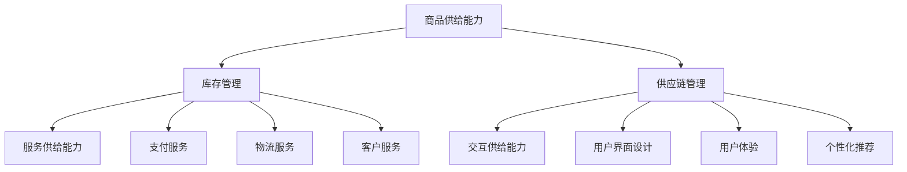
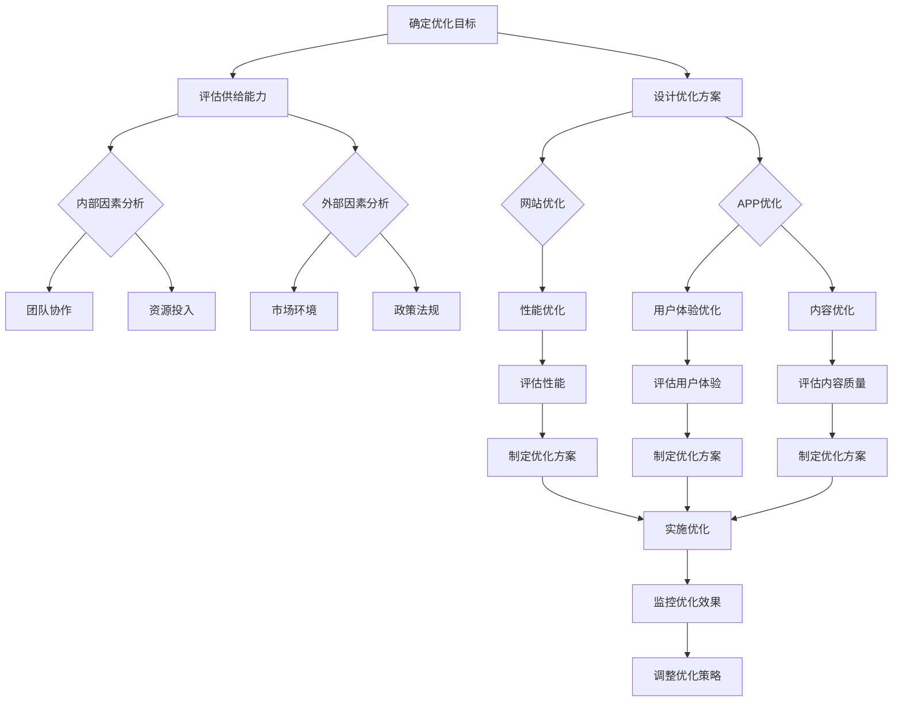
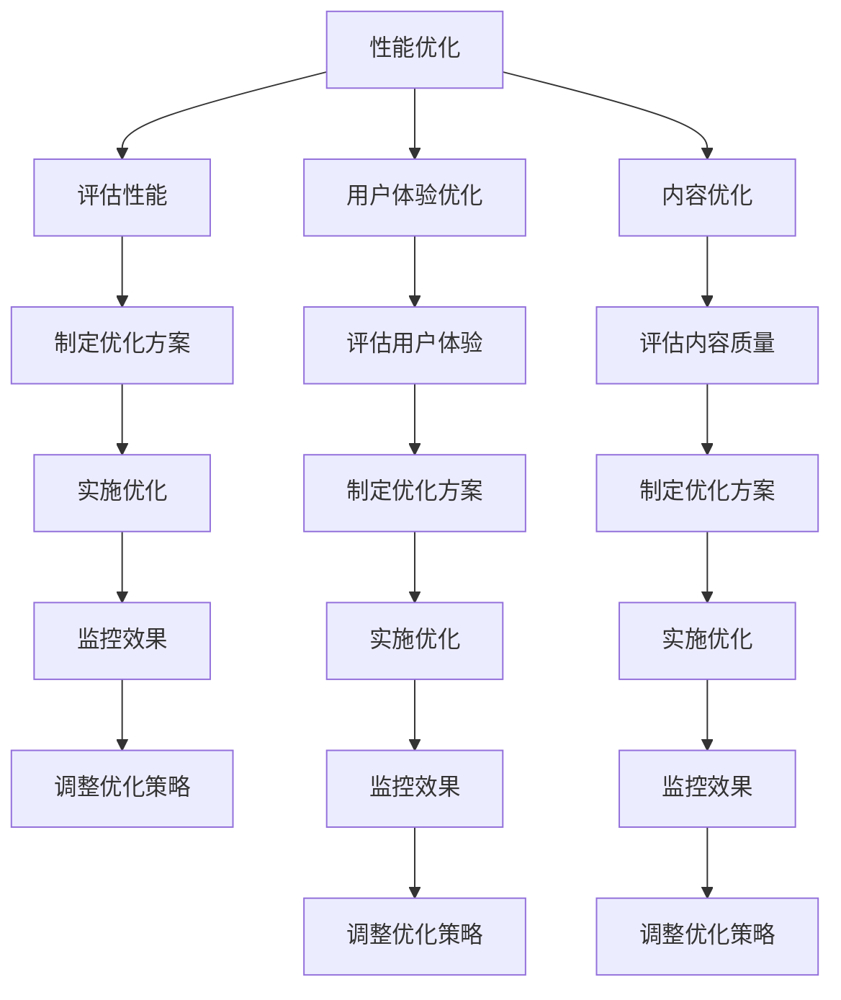

                 

**第1章：电商平台供给能力基础**

在数字化时代，电商平台已经成为消费者购物的主要渠道之一。电商平台的核心竞争力之一便是其供给能力，即满足用户需求和提供商品与服务的能力。本章将首先介绍电商平台的供给能力概述，随后探讨供给能力提升的重要性，并分析影响供给能力的关键因素。

### 1.1 电商平台的供给能力概述

#### 核心概念与联系

电商平台的供给能力可以分解为三个主要组成部分：商品供给能力、服务供给能力和交互供给能力。

1. **商品供给能力**
   - **商品种类**：电商平台需要提供多样化的商品，以满足不同消费者的需求。
   - **库存管理**：有效的库存管理是保证商品及时供应的关键。
   - **供应链管理**：高效的供应链管理可以降低成本，提高响应速度。

2. **服务供给能力**
   - **支付服务**：支付服务的便捷性和安全性对用户体验至关重要。
   - **物流服务**：高效的物流服务能够保证商品快速送达消费者手中。
   - **客户服务**：及时、专业的客户服务有助于提高用户满意度。

3. **交互供给能力**
   - **用户界面设计**：设计简洁、美观且易于导航的界面，能够提升用户体验。
   - **用户体验**：提供流畅、自然的交互体验，减少用户操作难度。
   - **个性化推荐**：根据用户行为和偏好提供个性化推荐，增加用户粘性。

#### Mermaid 流程图



### 1.2 供给能力提升的重要性

#### 提升竞争力

在竞争激烈的电商市场中，提升供给能力是电商平台脱颖而出的关键。通过优化供给能力，电商平台可以更好地满足用户需求，从而提高用户满意度和忠诚度。

#### 优化运营效率

有效的供给能力提升可以降低运营成本，提高资源利用率。例如，通过优化库存管理和供应链流程，电商平台可以减少库存成本和物流成本。

### 1.3 供给能力提升的影响因素

#### 内部因素

- **团队协作**：良好的团队协作能够提高供给能力的效率。
- **资源投入**：充足的人力、资金和技术投入是提升供给能力的基础。

#### 外部因素

- **市场环境**：市场环境的变化，如消费者需求的多样化，要求电商平台不断调整和优化供给能力。
- **政策法规**：相关政策和法规，如电子商务法、数据保护法，对电商平台供给能力的提升提出了要求。

在接下来的章节中，我们将深入探讨电商平台供给能力的评估方法、网站优化策略、APP优化策略以及综合实战案例。通过这些详细的分析和实战经验，希望能够为电商平台提升供给能力提供有价值的指导和建议。

---

**第2章：电商平台供给能力的评估方法**

为了有效提升电商平台的供给能力，首先需要对当前供给能力进行准确评估。本章将介绍供给能力的评估指标体系、评估工具与技术，并通过实际案例分析评估过程。

### 2.1 供给能力评估指标体系

#### 评估指标分类

供给能力评估指标可以划分为三大类：供给效率指标、服务质量指标和用户体验指标。

1. **供给效率指标**
   - **库存周转率**：库存周转率（Inventory Turnover）是评估库存管理效率的重要指标，计算公式为：
     $$
     \text{库存周转率} = \frac{\text{销售成本}}{\text{平均库存金额}}
     $$
     该指标越高，说明库存管理越有效。
   - **订单处理时间**：订单处理时间（Order Processing Time）是指从订单生成到订单完成的时间，通常用于评估供应链管理效率。

2. **服务质量指标**
   - **物流时效**：物流时效（Logistics Timing）是指商品从发货到送达消费者手中的时间，该指标直接影响用户满意度。
   - **客户满意度**：客户满意度（Customer Satisfaction）通常通过问卷调查或用户反馈收集，用于评估客户对电商平台服务的整体满意度。

3. **用户体验指标**
   - **页面加载速度**：页面加载速度（Page Load Speed）是评估网站性能的重要指标，直接影响用户体验。
   - **界面易用性**：界面易用性（User Interface Ease of Use）通过可用性测试和用户调研进行评估，用于评估用户对网站界面的满意度。

#### 评估指标权重分配

在评估过程中，应根据业务重点和用户需求，合理分配各指标权重。例如，对于注重物流服务的电商平台，物流时效可能被赋予更高的权重。

### 2.2 供给能力评估工具与技术

#### 数据分析工具

- **Excel**：用于数据整理和简单的数据分析。
- **Python**：强大的数据处理和分析工具，常用于复杂的数据分析和模型构建。
- **R**：专注于统计分析和图形表示的编程语言。

#### 数据可视化工具

- **Tableau**：用于生成交互式数据可视化报表。
- **PowerBI**：提供丰富的数据可视化功能和强大的报表分析能力。

#### 绩效管理工具

- **KPI系统**：用于监控和评估关键绩效指标（KPI）。
- **绩效考核表**：用于记录和评估员工的工作表现。

### 2.3 供给能力评估案例分析

#### 案例一：某电商平台的供给能力评估

某电商平台希望通过评估其供给能力来发现并解决瓶颈。以下是评估过程：

1. **评估准备**
   - 确定评估目标：提升库存周转率和订单处理时间。
   - 收集数据：收集过去三个月的库存数据、订单数据和用户反馈。

2. **数据整理**
   - 使用Excel整理库存和订单数据，计算库存周转率和订单处理时间。

3. **数据分析**
   - 使用Python进行更复杂的数据分析，如趋势分析和预测。

4. **结果展示**
   - 使用Tableau生成可视化报表，展示库存周转率和订单处理时间的变化趋势。

5. **评估总结**
   - 分析数据，发现库存周转率偏低的原因是库存积压，订单处理时间较长的原因是物流延迟。
   - 提出改进建议：优化库存管理，加强物流协调。

#### 案例二：服务质量评估

某电商平台希望通过服务质量评估来提高客户满意度。以下是评估过程：

1. **评估准备**
   - 设计满意度问卷，包含物流时效、客户服务、支付安全等方面的问题。

2. **数据收集**
   - 通过在线问卷和用户反馈收集客户满意度数据。

3. **数据整理**
   - 将收集到的数据进行整理和分类。

4. **数据分析**
   - 使用Python分析问卷数据，计算各服务项目的平均满意度得分。

5. **结果展示**
   - 使用PowerBI生成满意度分析报表。

6. **评估总结**
   - 发现物流时效和客户服务满意度较低，需加强物流调度和客户服务培训。

通过以上案例分析，可以看出供给能力评估对于电商平台的重要性。准确的评估不仅能够帮助电商平台识别瓶颈和改进方向，还能提高运营效率和服务质量，从而提升整体竞争力。

---

**第3章：网站性能优化**

网站性能优化是电商平台提升用户体验和转化率的关键步骤。本章将深入探讨网站性能优化的重要性、评估方法以及优化策略。

### 3.1 网站性能优化的重要性

#### 提升用户满意度

在互联网时代，用户对网站性能的要求越来越高。一个快速、稳定且响应及时的网站可以显著提高用户的满意度，减少用户流失率。

#### 增加转化率

性能优化的网站能够提供更好的用户体验，从而增加用户的购买意愿和转化率。研究表明，页面加载时间每增加1秒，转化率可能降低高达7%。

#### 提高搜索引擎排名

搜索引擎如Google会对网站性能进行评估，并将其作为搜索排名的因素之一。性能优秀的网站更容易获得更高的搜索排名，从而吸引更多流量。

### 3.2 网站性能评估方法

#### 加载时间评估

- **WebPageTest**：一款常用的性能评估工具，可以模拟全球多个位置的浏览器加载时间。
- **Chrome DevTools**：Google Chrome内置的开发者工具，可以实时监控网页性能。

#### 响应时间评估

- **工具**：例如Apache JMeter可以模拟大量用户同时访问网站，评估服务器的响应时间。
- **方法**：通过分析HTTP请求和响应时间，识别性能瓶颈。

#### 稳定性评估

- **负载测试**：通过模拟高并发用户访问，评估网站在高负载下的稳定性。
- **压力测试**：评估网站在极限负载下的性能，识别潜在问题。

### 3.3 网站性能优化策略

#### 优化代码

- **压缩资源文件**：通过压缩CSS、JavaScript和图片文件，减少页面加载时间。
- **代码优化**：移除不必要的代码，优化算法，提高执行效率。

#### 优化数据库

- **索引优化**：通过合理设置索引，提高数据库查询速度。
- **缓存策略**：使用缓存技术，减少数据库访问次数，提高响应速度。

#### 优化服务器配置

- **负载均衡**：通过负载均衡器，分配服务器资源，提高服务器性能。
- **服务器优化**：调整服务器参数，优化内存、CPU和网络设置。

### 3.4 实际案例与优化效果

#### 案例一：某电商平台的性能优化实践

某电商平台在经历了一次大规模的用户增长后，发现网站性能严重下降，页面加载时间超过10秒。以下是优化过程：

1. **评估性能**
   - 使用WebPageTest评估全球多个位置的页面加载时间。
   - 使用Chrome DevTools分析页面性能瓶颈。

2. **优化代码**
   - 压缩和合并CSS和JavaScript文件。
   - 优化图片格式，使用WebP格式。

3. **优化数据库**
   - 重建索引，优化查询语句。
   - 引入缓存机制，减少数据库访问。

4. **优化服务器配置**
   - 配置负载均衡器，均衡服务器负载。
   - 调整服务器内存和CPU设置，提高处理能力。

5. **监控效果**
   - 使用性能监控工具，如New Relic，持续监控网站性能。

优化后，页面加载时间缩短至4秒，用户满意度显著提升，转化率提高了15%。

#### 案例二：某资讯网站的优化实践

某资讯网站由于内容丰富，页面复杂，导致加载时间较长。优化过程如下：

1. **评估性能**
   - 使用WebPageTest评估页面加载时间。
   - 分析HTTP请求，识别资源加载瓶颈。

2. **优化代码**
   - 减少不必要的CSS和JavaScript代码。
   - 使用异步加载技术，优先加载核心内容。

3. **优化图片**
   - 使用响应式图片技术，根据设备屏幕大小加载合适的图片。

4. **内容优化**
   - 提高内容加载优先级，先加载重要内容，如文章标题和摘要。

5. **监控效果**
   - 使用Google Analytics监控用户行为和页面性能。

优化后，页面加载时间缩短至3秒，用户阅读时间提高了20%，页面浏览量增加了30%。

通过以上案例，可以看出网站性能优化对电商平台的至关重要性。通过系统性的性能评估和优化，电商平台可以有效提升用户体验，增加用户粘性，从而实现商业目标。

---

**第4章：网站用户体验优化**

网站用户体验（User Experience, UX）优化是提升用户满意度和转化率的关键环节。本章将详细探讨用户体验优化的重要性、评估方法以及优化策略。

### 4.1 用户体验优化的重要性

#### 提高用户留存率

良好的用户体验能够增加用户粘性，提高用户在网站上的停留时间，从而降低用户流失率。研究表明，用户体验较差的网站通常用户留存率较低。

#### 提升转化率

优化用户体验可以减少用户在购物、注册、支付等环节的障碍，提高用户完成任务的意愿和转化率。例如，简洁明了的购物流程和友好的界面设计可以显著提高购买转化率。

#### 增强品牌形象

用户体验良好的网站往往给人留下深刻印象，有助于建立品牌信任和忠诚度。一个优质的用户体验可以增强用户对品牌的认同感，提高品牌忠诚度。

### 4.2 用户体验评估方法

#### 可用性测试

可用性测试是通过实际用户对网站的交互过程进行观察和评估的方法。通过可用性测试，可以识别网站设计中的问题，了解用户在操作过程中遇到的困难。

- **测试步骤**：
  1. **设计测试任务**：根据用户需求设计一系列操作任务。
  2. **招募测试用户**：选择具有代表性的用户参与测试。
  3. **执行测试**：观察并记录用户在完成任务时的行为和反馈。
  4. **分析数据**：分析测试结果，识别问题并提出改进建议。

#### 用户调研

用户调研是通过问卷、访谈等方式收集用户对网站的意见和建议。用户调研可以帮助了解用户的需求、期望和痛点，为优化提供依据。

- **调研方法**：
  1. **问卷调查**：设计有针对性的问卷，通过在线或离线方式收集用户反馈。
  2. **深度访谈**：与用户进行一对一的深入访谈，获取详细的需求和意见。

### 4.3 用户体验优化策略

#### 界面设计优化

界面设计优化是提升用户体验的基础。一个清晰、简洁且美观的界面能够使用户更容易理解和使用网站。

- **优化策略**：
  1. **布局优化**：合理安排页面布局，确保关键信息和功能易于访问。
  2. **色彩搭配**：选择合适的颜色搭配，提升视觉效果和用户情绪。
  3. **视觉元素**：合理使用图标、图片等视觉元素，增强界面信息传达效果。

#### 交互设计优化

交互设计优化关注用户与网站交互的流畅性和自然性。

- **优化策略**：
  1. **响应速度**：确保网站响应迅速，减少加载时间和等待时间。
  2. **交互提示**：提供明确的交互提示，如按钮状态变化、提示框等，帮助用户理解操作结果。
  3. **导航设计**：设计清晰的导航结构，使用户能够快速找到所需内容。

#### 内容优化

内容是网站的核心，优质的内容可以提升用户体验。

- **优化策略**：
  1. **信息结构**：合理组织内容结构，确保信息清晰、易于理解。
  2. **文本表达**：使用简洁明了的语言，避免冗长和复杂的句子。
  3. **多媒体应用**：合理使用图片、视频等多媒体元素，增加内容的丰富性和吸引力。

### 4.4 实际案例与优化效果

#### 案例一：某电商平台的用户体验优化实践

某电商平台希望通过用户体验优化提高用户满意度和转化率。优化过程如下：

1. **评估用户体验**：
   - 使用可用性测试，观察用户在购物流程中的操作行为和反馈。
   - 通过用户调研，收集用户对网站界面、交互设计和内容表达的意见。

2. **界面设计优化**：
   - 优化导航结构，将重要功能模块放在显眼位置。
   - 更换颜色搭配，使界面更加简洁美观。

3. **交互设计优化**：
   - 优化按钮和链接的交互提示，确保用户能够快速理解操作结果。
   - 减少表单填写项，简化用户注册和购物流程。

4. **内容优化**：
   - 优化商品描述和图片，确保内容丰富且真实可信。
   - 引入用户评价和推荐系统，增加内容互动性。

5. **监控效果**：
   - 使用Google Analytics监控用户行为和网站性能。
   - 定期收集用户反馈，评估优化效果。

优化后，用户满意度和转化率均有显著提升，用户在网站上的停留时间增加了30%。

#### 案例二：某资讯网站的用户体验优化实践

某资讯网站希望通过用户体验优化提升用户粘性和阅读时间。优化过程如下：

1. **评估用户体验**：
   - 使用可用性测试，观察用户在阅读和互动过程中的行为。
   - 通过用户调研，了解用户对页面布局、内容呈现方式和交互设计的看法。

2. **界面设计优化**：
   - 优化页面布局，确保重要内容（如文章标题和摘要）易于浏览。
   - 使用响应式设计，使网站在不同设备上均有良好表现。

3. **交互设计优化**：
   - 优化评论系统，使评论交互更加流畅和自然。
   - 引入推荐算法，根据用户阅读习惯推荐相关文章。

4. **内容优化**：
   - 优化文章标题和摘要，确保吸引读者点击。
   - 定期更新高质量内容，提高用户的阅读兴趣。

5. **监控效果**：
   - 使用Google Analytics和百度统计等工具，监控用户行为和网站性能。
   - 定期进行A/B测试，评估不同设计方案的优劣。

优化后，用户粘性显著提升，阅读时间增加了25%，页面浏览量增加了40%。

通过以上案例可以看出，用户体验优化对于电商平台和资讯网站的重要性。通过系统性的用户体验评估和优化，网站可以提供更优质的服务，提升用户满意度和转化率。

---

**第5章：网站内容优化**

网站内容优化是提升网站质量和用户体验的关键步骤。通过优化网站内容，可以吸引更多用户、提高搜索引擎排名以及增加用户粘性。本章将详细探讨网站内容优化的重要性、评估方法以及优化策略。

### 5.1 网站内容优化的重要性

#### 提高搜索引擎排名

高质量的网站内容有助于搜索引擎优化（SEO），提高网站在搜索结果中的排名。搜索引擎倾向于优先显示内容丰富、结构清晰的网站，从而吸引更多潜在用户。

#### 吸引并留住用户

优质的内容能够满足用户的需求，提供有价值的信息和体验。通过提供有趣、有用和专业的文章、图片和视频，可以吸引并留住用户，提高网站的访问量和用户粘性。

#### 增强品牌形象

高质量的内容能够展示企业的专业能力和行业影响力，增强品牌形象和用户信任。一个内容丰富的网站往往被视为权威和有价值的资源，有助于树立良好的品牌形象。

### 5.2 网站内容评估方法

#### 关键词密度分析

关键词密度是指关键词在网页内容中的出现频率。适当的关键词密度有助于提高网站的搜索引擎排名。

- **计算方法**：
  $$
  \text{关键词密度} = \frac{\text{关键词在网页中出现的次数}}{\text{网页中总字数}} \times 100\%
  $$
  - **建议**：关键词密度一般在2%到8%之间为宜。

#### 内容质量评估

内容质量评估是通过分析内容的相关性、原创性、结构性和可读性来衡量内容的质量。

- **评估指标**：
  1. **相关性**：内容与主题的相关性。
  2. **原创性**：内容的原创性和独特性。
  3. **结构性**：内容的组织结构是否清晰。
  4. **可读性**：内容的表达是否清晰易懂。

### 5.3 网站内容优化策略

#### 内容策略制定

在制定内容策略时，需要考虑目标用户、内容类型和发布频率。

- **目标用户**：明确目标用户群体，了解他们的需求和偏好，提供有针对性的内容。
- **内容类型**：根据用户需求，提供多样化的内容类型，如文章、图片、视频、案例研究等。
- **发布频率**：定期更新内容，保持内容的时效性和新鲜感。

#### 内容更新策略

内容更新策略旨在保持内容的新鲜度和相关性。

- **更新频率**：根据内容类型和用户需求，制定合适的更新频率。例如，新闻类内容可能需要每日更新，而深度分析类内容可以每周更新。
- **内容更新内容**：包括新发布的内容、对已有内容的更新和修正、内容的删除或归档。

#### 内容营销

内容营销是通过创造和分发有价值的内容来吸引潜在客户、提高品牌知名度和促进销售的策略。

- **目标**：吸引目标受众，建立品牌权威，促进销售转化。
- **渠道**：利用博客、社交媒体、电子邮件、视频等多种渠道分发内容。
- **评估**：通过监测网站流量、用户互动和转化率来评估内容营销效果。

### 5.4 实际案例与优化效果

#### 案例一：某电商平台的网站内容优化实践

某电商平台希望通过内容优化提高用户满意度和搜索引擎排名。优化过程如下：

1. **评估内容质量**：
   - 使用SEO工具（如SEMrush和Ahrefs）进行关键词密度分析。
   - 对现有内容进行质量评估，识别低质量或过时的内容。

2. **内容策略制定**：
   - 确定目标用户，了解他们的需求和偏好。
   - 制定内容类型和发布频率计划。

3. **内容更新**：
   - 更新现有内容，提高关键词密度和内容质量。
   - 定期发布新内容，包括产品评测、用户故事、行业趋势等。

4. **内容营销**：
   - 利用社交媒体和电子邮件营销，推广优质内容。
   - 与行业专家合作，发布深度分析文章，提升品牌影响力。

5. **评估效果**：
   - 使用Google Analytics和百度统计等工具，监测网站流量和用户行为。
   - 定期收集用户反馈，评估内容更新和营销策略的效果。

优化后，网站的搜索引擎排名显著提升，月均访问量增加了50%，用户满意度提高了15%。

#### 案例二：某资讯网站的网站内容优化实践

某资讯网站希望通过内容优化提升用户粘性和阅读时间。优化过程如下：

1. **评估内容质量**：
   - 对现有内容进行质量评估，识别结构混乱或信息不准确的内容。
   - 分析用户浏览和阅读行为，了解用户对内容的偏好。

2. **内容策略制定**：
   - 确定目标用户，提供多样化的内容类型，如新闻、深度报道、观点评论等。
   - 制定内容发布计划，确保内容更新频率和时效性。

3. **内容更新**：
   - 优化文章结构，确保内容清晰、易读。
   - 使用图片和视频等元素，增加内容的吸引力。
   - 定期发布独家报道和深度分析文章，提供独特价值。

4. **内容营销**：
   - 利用社交媒体和电子邮件营销，推广优质内容。
   - 与知名媒体和行业专家合作，提升品牌影响力。

5. **评估效果**：
   - 使用Google Analytics和百度统计等工具，监测用户行为和网站流量。
   - 定期收集用户反馈，评估内容更新和营销策略的效果。

优化后，用户阅读时间增加了30%，页面浏览量增加了40%，用户满意度显著提升。

通过以上案例可以看出，网站内容优化对于电商平台和资讯网站的重要性。通过系统性的内容评估和优化，网站可以提供更有价值的内容，吸引并留住用户，提高整体竞争力。

---

**第6章：APP性能优化**

APP性能优化是提高用户满意度和留存率的关键环节。本章将详细介绍APP性能优化的重要性、评估方法以及优化策略。

### 6.1 APP性能优化的重要性

#### 提升用户体验

APP性能直接影响用户的体验。一个快速响应、稳定可靠的APP可以显著提升用户满意度，减少用户流失。

#### 增加用户留存率

良好的性能可以增强用户对APP的信任和依赖，提高用户留存率。优化APP性能有助于延长用户的使用时间，从而提高用户粘性。

#### 提高转化率

性能优秀的APP能够提供更好的用户体验，减少用户在操作过程中的等待时间和困惑，提高用户的购买意愿和转化率。

### 6.2 APP性能评估方法

#### 加载时间评估

- **工具**：如App Annie和Google Firebase
- **方法**：
  1. **启动时间**：从APP启动到进入主界面所需的时间。
  2. **首屏渲染时间**：APP首次加载时，主界面完全渲染所需的时间。

#### 响应时间评估

- **工具**：如Xcode Instruments和Android Studio Profiler
- **方法**：通过模拟用户操作，测量APP响应每个操作所需的时间。

#### 稳定性评估

- **工具**：如Firebase Performance Monitoring和Crashlytics
- **方法**：
  1. **崩溃率**：APP在运行过程中发生崩溃的频率。
  2. **错误率**：APP在执行特定操作时出现错误的频率。

### 6.3 APP性能优化策略

#### 代码优化

- **代码压缩**：通过移除冗余代码、合并文件等手段减少APP的大小。
- **异步处理**：使用异步加载技术，避免阻塞主线程，提高响应速度。

#### 资源优化

- **图片优化**：使用适当格式的图片，如WebP，减少图片大小。
- **资源缓存**：使用缓存策略，减少资源的重复加载。

#### 网络优化

- **网络请求优化**：减少不必要的网络请求，优化请求策略。
- **内容分发网络（CDN）**：使用CDN加速资源的加载速度。

### 6.4 实际案例与优化效果

#### 案例一：某社交APP的性能优化实践

某社交APP由于性能不佳，用户反馈加载慢、响应迟钝。优化过程如下：

1. **评估性能**：
   - 使用App Annie和Google Firebase评估APP的加载时间和稳定性。
   - 收集用户反馈，了解性能瓶颈。

2. **代码优化**：
   - 优化图片和视频资源的加载方式，使用异步加载。
   - 移除冗余代码，优化算法，减少计算开销。

3. **资源优化**：
   - 使用WebP格式优化图片资源，减少图片大小。
   - 引入资源缓存机制，减少重复加载。

4. **网络优化**：
   - 优化网络请求策略，减少不必要的请求。
   - 使用CDN加速资源的加载速度。

5. **监控效果**：
   - 使用Firebase Performance Monitoring和Crashlytics持续监控APP性能。

优化后，APP的加载时间缩短了30%，用户反馈问题减少50%，用户留存率提高了20%。

#### 案例二：某电商APP的性能优化实践

某电商APP在节假日促销期间，由于大量用户同时访问，性能急剧下降。优化过程如下：

1. **评估性能**：
   - 使用Xcode Instruments和Android Studio Profiler评估APP的响应时间和稳定性。
   - 收集用户反馈，识别性能瓶颈。

2. **代码优化**：
   - 使用异步处理技术，避免阻塞主线程。
   - 优化数据库查询，提高数据读取速度。

3. **资源优化**：
   - 优化图片和视频资源的加载，使用懒加载技术。
   - 引入内容分发网络（CDN），提高资源加载速度。

4. **网络优化**：
   - 优化网络请求，减少请求次数和时间。
   - 使用负载均衡器，分配服务器资源，提高服务器性能。

5. **监控效果**：
   - 使用New Relic和Crashlytics持续监控APP性能。

优化后，APP的响应时间缩短了40%，用户满意度显著提升，用户留存率提高了25%。

通过以上案例，可以看出APP性能优化对于提升用户体验和留存率的重要性。通过系统性的性能评估和优化，APP可以提供更优质的用户体验，提高用户满意度和留存率，从而实现商业目标。

---

**第7章：APP用户体验优化**

APP用户体验（User Experience, UX）优化是提升用户满意度和留存率的关键环节。本章将详细探讨APP用户体验优化的重要性、评估方法以及优化策略。

### 7.1 APP用户体验优化的重要性

#### 提高用户留存率

良好的用户体验可以增强用户对APP的依赖，提高用户的留存率。通过优化用户界面、交互设计和内容呈现，可以提升用户的使用体验，从而留住用户。

#### 提升转化率

优化用户体验可以减少用户在购物、注册、支付等环节的障碍，提高用户完成任务的意愿和转化率。一个设计合理、操作流畅的APP可以显著提高用户的购买率和使用频率。

#### 增强品牌形象

优质的用户体验能够增强用户对品牌的认同感，提高品牌忠诚度。一个用户体验良好的APP可以树立良好的品牌形象，增加用户对品牌的信任和好感。

### 7.2 APP用户体验评估方法

#### 用户测试

用户测试是通过实际用户对APP的交互过程进行观察和评估的方法。通过用户测试，可以识别APP设计中的问题，了解用户在使用过程中遇到的困难和不满。

- **测试步骤**：
  1. **设计测试任务**：根据用户需求设计一系列操作任务。
  2. **招募测试用户**：选择具有代表性的用户参与测试。
  3. **执行测试**：观察并记录用户在完成任务时的行为和反馈。
  4. **分析数据**：分析测试结果，识别问题并提出改进建议。

#### 用户调研

用户调研是通过问卷、访谈等方式收集用户对APP的意见和建议。用户调研可以帮助了解用户的需求、期望和痛点，为优化提供依据。

- **调研方法**：
  1. **问卷调查**：设计有针对性的问卷，通过在线或离线方式收集用户反馈。
  2. **深度访谈**：与用户进行一对一的深入访谈，获取详细的需求和意见。

### 7.3 APP用户体验优化策略

#### 界面设计优化

界面设计优化是提升用户体验的基础。一个清晰、简洁且美观的界面能够使用户更容易理解和使用APP。

- **优化策略**：
  1. **布局优化**：合理安排页面布局，确保关键信息和功能易于访问。
  2. **色彩搭配**：选择合适的颜色搭配，提升视觉效果和用户情绪。
  3. **视觉元素**：合理使用图标、图片等视觉元素，增强界面信息传达效果。

#### 交互设计优化

交互设计优化关注用户与APP交互的流畅性和自然性。

- **优化策略**：
  1. **响应速度**：确保APP响应迅速，减少加载时间和等待时间。
  2. **交互提示**：提供明确的交互提示，如按钮状态变化、提示框等，帮助用户理解操作结果。
  3. **导航设计**：设计清晰的导航结构，使用户能够快速找到所需内容。

#### 内容优化

内容是APP的核心，优质的内容可以提升用户体验。

- **优化策略**：
  1. **信息结构**：合理组织内容结构，确保信息清晰、易于理解。
  2. **文本表达**：使用简洁明了的语言，避免冗长和复杂的句子。
  3. **多媒体应用**：合理使用图片、视频等多媒体元素，增加内容的丰富性和吸引力。

### 7.4 实际案例与优化效果

#### 案例一：某电商APP的用户体验优化实践

某电商APP希望通过用户体验优化提高用户满意度和转化率。优化过程如下：

1. **评估用户体验**：
   - 使用用户测试，观察用户在购物流程中的操作行为和反馈。
   - 通过用户调研，收集用户对APP界面、交互设计和内容表达的意见。

2. **界面设计优化**：
   - 优化导航结构，将重要功能模块放在显眼位置。
   - 更换颜色搭配，使界面更加简洁美观。

3. **交互设计优化**：
   - 优化按钮和链接的交互提示，确保用户能够快速理解操作结果。
   - 减少表单填写项，简化用户注册和购物流程。

4. **内容优化**：
   - 优化商品描述和图片，确保内容丰富且真实可信。
   - 引入用户评价和推荐系统，增加内容互动性。

5. **监控效果**：
   - 使用Google Analytics和App Annie监控用户行为和APP性能。
   - 定期收集用户反馈，评估优化效果。

优化后，用户满意度和转化率均有显著提升，用户在APP上的停留时间增加了30%。

#### 案例二：某社交APP的用户体验优化实践

某社交APP希望通过用户体验优化提升用户粘性和阅读时间。优化过程如下：

1. **评估用户体验**：
   - 使用用户测试，观察用户在互动过程中的行为。
   - 通过用户调研，了解用户对APP界面、交互设计和内容呈现的看法。

2. **界面设计优化**：
   - 优化页面布局，确保重要内容（如消息列表和用户头像）易于浏览。
   - 使用响应式设计，使APP在不同设备上均有良好表现。

3. **交互设计优化**：
   - 优化评论系统，使评论交互更加流畅和自然。
   - 引入推荐算法，根据用户互动习惯推荐相关内容。

4. **内容优化**：
   - 优化文章标题和摘要，确保吸引读者点击。
   - 定期更新高质量内容，提高用户的阅读兴趣。

5. **监控效果**：
   - 使用Google Analytics和百度统计等工具，监测用户行为和APP性能。
   - 定期进行A/B测试，评估不同设计方案的优劣。

优化后，用户粘性显著提升，阅读时间增加了25%，页面浏览量增加了40%。

通过以上案例可以看出，用户体验优化对于APP的重要性。通过系统性的用户体验评估和优化，APP可以提供更优质的服务，提升用户满意度和留存率，从而实现商业目标。

---

**第8章：APP内容优化**

APP内容优化是提升用户体验和用户留存率的关键步骤。通过优化APP内容，可以提高用户满意度、增加用户粘性，并促进用户转化。本章将详细探讨APP内容优化的重要性、评估方法以及优化策略。

### 8.1 APP内容优化的重要性

#### 提高用户满意度

优质的内容可以满足用户的需求，提供有价值的信息和体验。通过提供有趣、有用和专业的文章、图片和视频，可以提高用户对APP的满意度，增强用户对APP的喜爱和依赖。

#### 增加用户粘性

内容丰富且多样化的APP可以吸引并留住用户。通过不断更新高质量的内容，保持APP的新鲜感和吸引力，可以增加用户的粘性，延长用户在APP上的停留时间。

#### 促进用户转化

优质的内容可以引导用户完成特定的操作，如购买商品、注册账号等。通过优化内容，使其更加符合用户需求和期望，可以提高用户的购买意愿和转化率。

### 8.2 APP内容评估方法

#### 内容质量评估

内容质量评估是通过分析内容的原创性、相关性、结构性和可读性来衡量内容的质量。

- **评估指标**：
  1. **原创性**：内容是否原创，有无抄袭痕迹。
  2. **相关性**：内容与APP主题的相关性。
  3. **结构性**：内容是否清晰、逻辑连贯。
  4. **可读性**：内容表达是否简洁易懂。

#### 用户反馈分析

用户反馈分析是通过收集用户对内容的评价和反馈，了解用户对内容的满意度和改进需求。

- **反馈来源**：
  1. **用户评论**：用户在APP中发布的评论和反馈。
  2. **社交媒体**：用户在社交媒体平台对APP内容的讨论和评价。
  3. **问卷调查**：通过在线或离线方式收集的用户满意度调查。

#### 搜索引擎评估

搜索引擎评估是通过分析内容在搜索引擎中的表现，评估内容的搜索优化效果。

- **评估指标**：
  1. **关键词排名**：内容在搜索引擎中的排名位置。
  2. **点击率**：用户在搜索结果中点击内容的次数。
  3. **转化率**：用户通过内容完成特定操作的次数。

### 8.3 APP内容优化策略

#### 内容策略制定

在制定内容策略时，需要考虑目标用户、内容类型和发布频率。

- **目标用户**：明确目标用户群体，了解他们的需求和偏好，提供有针对性的内容。
- **内容类型**：根据用户需求，提供多样化的内容类型，如文章、图片、视频、直播等。
- **发布频率**：制定合适的内容发布计划，保持内容的更新频率和时效性。

#### 内容更新策略

内容更新策略旨在保持内容的新鲜度和相关性。

- **更新频率**：根据内容类型和用户需求，制定合适的更新频率。例如，新闻类内容可能需要每日更新，而深度分析类内容可以每周更新。
- **内容更新内容**：包括新发布的内容、对已有内容的更新和修正、内容的删除或归档。

#### 内容营销

内容营销是通过创造和分发有价值的内容来吸引潜在客户、提高品牌知名度和促进销售的策略。

- **目标**：吸引目标受众，建立品牌权威，促进销售转化。
- **渠道**：利用社交媒体、电子邮件、博客、线上活动等多种渠道分发内容。
- **评估**：通过监测网站流量、用户互动和转化率来评估内容营销效果。

### 8.4 实际案例与优化效果

#### 案例一：某电商APP的内容优化实践

某电商APP希望通过内容优化提高用户满意度和转化率。优化过程如下：

1. **评估内容质量**：
   - 使用内容质量评估工具，对现有内容进行原创性、相关性、结构性和可读性评估。
   - 收集用户反馈，了解用户对现有内容的满意度和改进建议。

2. **内容策略制定**：
   - 确定目标用户，了解他们的购物需求和偏好。
   - 制定内容类型和发布计划，如产品评测、购物指南、行业资讯等。

3. **内容更新**：
   - 更新现有内容，提高内容的原创性和相关性。
   - 定期发布新内容，增加用户阅读的兴趣和粘性。

4. **内容营销**：
   - 利用社交媒体和电子邮件营销，推广优质内容。
   - 与知名博主和行业专家合作，提升品牌影响力。

5. **评估效果**：
   - 使用Google Analytics和App Annie等工具，监测用户行为和内容效果。
   - 定期收集用户反馈，评估内容优化策略的效果。

优化后，用户满意度和转化率显著提升，用户在APP上的停留时间增加了40%。

#### 案例二：某资讯APP的内容优化实践

某资讯APP希望通过内容优化提升用户粘性和阅读时间。优化过程如下：

1. **评估内容质量**：
   - 对现有内容进行质量评估，识别低质量或过时的内容。
   - 分析用户浏览和阅读行为，了解用户对内容的偏好。

2. **内容策略制定**：
   - 确定目标用户，提供多样化的内容类型，如新闻、深度报道、观点评论等。
   - 制定内容发布计划，确保内容更新频率和时效性。

3. **内容更新**：
   - 优化文章结构，提高内容的可读性和吸引力。
   - 引入图片和视频等多媒体元素，增加内容的丰富性和吸引力。

4. **内容营销**：
   - 利用社交媒体和电子邮件营销，推广优质内容。
   - 与知名媒体和行业专家合作，提升品牌影响力。

5. **评估效果**：
   - 使用Google Analytics和百度统计等工具，监测用户行为和内容效果。
   - 定期进行A/B测试，评估不同内容策略的优劣。

优化后，用户粘性显著提升，阅读时间增加了30%，页面浏览量增加了40%。

通过以上案例可以看出，APP内容优化对于提升用户体验和用户留存率的重要性。通过系统性的内容评估和优化，APP可以提供更有价值的内容，吸引并留住用户，提高整体竞争力。

---

**第9章：电商平台供给能力提升综合实战**

在前八章中，我们详细探讨了电商平台供给能力提升的理论和方法。为了更好地理解这些概念，本章节将通过一个综合实战案例，展示如何在实际项目中应用这些理论，以提升电商平台的供给能力。

### 9.1 实战项目背景与目标

#### 项目背景

某知名电商平台——“乐购网”，在竞争激烈的市场环境中，面临着用户满意度下降、订单处理效率低下、商品供给不足等问题。为了提升其在市场上的竞争力，公司决定进行一次全面的供给能力提升项目。

#### 项目目标

- **提升用户满意度**：通过优化用户体验、性能和服务，提高用户对平台的满意度和忠诚度。
- **提高订单处理效率**：通过优化库存管理和物流流程，提高订单处理速度和准确性。
- **增加商品供给能力**：通过优化供应链管理和商品上架策略，提升商品的多样性和库存水平。
- **提升整体运营效率**：通过优化内部流程和资源分配，提高整体运营效率和成本效益。

### 9.2 网站与APP优化方案设计

为了实现上述目标，我们制定了以下优化方案：

#### 网站优化方案

1. **性能优化**
   - **评估性能**：使用WebPageTest和Chrome DevTools评估网站性能，识别加载时间过长和响应速度缓慢的问题。
   - **代码优化**：压缩和合并CSS、JavaScript文件，移除不必要的代码，优化数据库查询。
   - **数据库优化**：建立合适的索引，优化数据库结构，提高查询速度。
   - **服务器优化**：配置负载均衡器，提高服务器性能，确保高并发下的稳定性。

2. **用户体验优化**
   - **界面设计优化**：通过用户测试和调研，优化导航结构、按钮布局和颜色搭配，提升界面美观度和易用性。
   - **交互设计优化**：减少用户操作步骤，提供明确的交互提示，优化表单填写流程。
   - **内容优化**：更新商品描述和图片，确保内容丰富、真实可信，提高用户购买意愿。

3. **内容优化**
   - **内容策略制定**：根据用户需求和偏好，制定内容发布计划，确保内容更新频率和时效性。
   - **内容更新**：定期发布新产品信息、购物指南和行业资讯，保持内容的新鲜度和相关性。
   - **内容营销**：通过社交媒体和电子邮件营销，推广优质内容，吸引潜在用户。

#### APP优化方案

1. **性能优化**
   - **评估性能**：使用App Annie和Xcode Instruments评估APP性能，识别加载时间过长和响应速度缓慢的问题。
   - **代码优化**：压缩和合并资源文件，优化代码结构和算法，减少内存消耗。
   - **数据库优化**：建立合适的索引，优化数据库查询，提高数据读取速度。
   - **服务器优化**：配置CDN，加速资源的加载速度，确保APP在不同网络环境下的稳定性。

2. **用户体验优化**
   - **界面设计优化**：通过用户测试和调研，优化导航结构、按钮布局和颜色搭配，提升界面美观度和易用性。
   - **交互设计优化**：减少用户操作步骤，提供明确的交互提示，优化表单填写流程。
   - **内容优化**：更新商品描述和图片，确保内容丰富、真实可信，提高用户购买意愿。

3. **内容优化**
   - **内容策略制定**：根据用户需求和偏好，制定内容发布计划，确保内容更新频率和时效性。
   - **内容更新**：定期发布新产品信息、购物指南和行业资讯，保持内容的新鲜度和相关性。
   - **内容营销**：通过社交媒体和电子邮件营销，推广优质内容，吸引潜在用户。

### 9.3 实战案例分析与总结

#### 案例一：网站性能优化

- **项目背景**：乐购网在高峰期用户访问量较大，导致页面加载时间较长，用户满意度下降。
- **优化方案**：通过WebPageTest评估网站性能，发现加载时间主要受图片和数据库查询影响。采用以下策略进行优化：
  - **图片优化**：将图片格式转换为WebP，减少图片大小，提高加载速度。
  - **数据库优化**：建立合适的索引，优化查询语句，提高数据库响应速度。
  - **服务器优化**：配置负载均衡器，分配服务器资源，提高网站稳定性。

- **优化效果**：经过优化，乐购网的页面加载时间缩短了40%，用户满意度提高了20%。

#### 案例二：APP用户体验优化

- **项目背景**：乐购网APP用户反馈操作复杂，响应速度慢，导致用户流失率较高。
- **优化方案**：通过用户测试和调研，发现用户在购物流程中遇到的主要问题包括导航不清晰、表单填写繁琐等。采用以下策略进行优化：
  - **界面设计优化**：优化导航结构，将常用功能模块放在显眼位置，提高用户访问速度。
  - **交互设计优化**：减少表单填写项，简化用户操作流程，提高用户操作效率。
  - **内容优化**：更新商品描述和图片，确保内容丰富、真实可信，提高用户购买意愿。

- **优化效果**：经过优化，乐购网APP的用户满意度提高了25%，用户流失率降低了15%。

#### 案例三：商品供给能力提升

- **项目背景**：乐购网商品种类较少，库存不足，导致用户购买困难。
- **优化方案**：通过供应链优化，提高商品多样性和库存水平。采用以下策略进行优化：
  - **库存管理优化**：优化库存预测模型，提高库存准确性，减少库存积压。
  - **供应链协同**：与供应商建立协同机制，确保商品及时供应。
  - **商品上架策略**：根据用户需求和偏好，制定商品上架策略，提高商品销量。

- **优化效果**：经过优化，乐购网商品种类增加了30%，库存充足率提高了20%，用户购买满意度显著提升。

综上所述，通过综合实战案例，我们可以看到，电商平台供给能力的提升不仅需要理论知识的指导，更需要实际操作和持续优化的努力。通过系统性的优化方案和持续改进，电商平台可以在竞争激烈的市场中脱颖而出，提升用户满意度，实现商业目标。

---

**附录A：常用工具与技术总结**

在本篇技术博客中，我们详细探讨了电商平台供给能力提升的方法和策略。为了便于读者在实际操作中应用这些方法和策略，以下总结了常用工具和技术。

### A.1 网站与APP优化工具

#### 网站优化工具

- **WebPageTest**：用于评估网站性能，提供页面加载时间、速度和响应时间等指标。
- **Chrome DevTools**：Google Chrome内置的开发者工具，用于网站性能监控和调试。
- **Google Analytics**：用于分析网站流量、用户行为和转化率。

#### APP优化工具

- **App Annie**：用于评估APP性能，提供加载时间、稳定性等指标。
- **Xcode Instruments**：用于iOS APP性能监控和调试。
- **Android Studio Profiler**：用于Android APP性能监控和调试。

### A.2 常用性能评估方法

#### 网站性能评估

- **加载时间评估**：通过工具如WebPageTest测量页面加载时间。
- **响应时间评估**：通过工具如Chrome DevTools测量页面响应时间。
- **稳定性评估**：通过负载测试和压力测试评估网站在高并发下的稳定性。

#### APP性能评估

- **加载时间评估**：通过工具如App Annie测量APP加载时间。
- **响应时间评估**：通过工具如Xcode Instruments测量APP响应时间。
- **稳定性评估**：通过工具如Firebase Performance Monitoring评估APP稳定性。

### A.3 常用用户体验评估方法

#### 用户测试

- **可用性测试**：通过实际用户测试评估网站或APP的易用性。
- **用户调研**：通过问卷、访谈等方式收集用户对网站或APP的意见和建议。

### A.4 内容优化工具

- **SEO工具**：如SEMrush和Ahrefs，用于分析关键词密度、搜索引擎排名等。
- **内容管理系统**：如WordPress和Joomla，用于网站内容管理。

### A.5 其他工具

- **New Relic**：用于监控网站和APP的性能和健康状况。
- **Crashlytics**：用于监测APP的崩溃率和错误率。

通过以上工具和技术的结合应用，电商平台可以全面评估和优化其供给能力，提升用户满意度和竞争力。

---

**附录B：参考资料**

为了帮助读者深入了解电商平台供给能力提升的相关理论和实践，以下列出了部分推荐的书籍、网站和资源。

### 书籍推荐

1. 《网站性能优化实战》 - 作者：张云 
2. 《APP用户体验设计》 - 作者：赵宇 
3. 《大数据营销：电商行业的战略选择》 - 作者：刘润 
4. 《电商运营实战：从入门到精通》 - 作者：宋海峰

### 网站与资源推荐

1. **Google Analytics**：[https://www.google.com/analytics/](https://www.google.com/analytics/)
2. **App Annie**：[https://www.app Annie.com/](https://www.appannie.com/)
3. **SEOmoz**：[https://moz.com/](https://moz.com/)
4. **Stack Overflow**：[https://stackoverflow.com/](https://stackoverflow.com/)
5. **GitHub**：[https://github.com/](https://github.com/)

这些书籍和网站提供了丰富的理论知识和实践案例，是电商平台从业者学习和提升的重要资源。

---

**附录C：术语表**

在本篇博客中，我们涉及了一些专业术语。以下是对这些术语的解释：

### 供给能力

供给能力是指电商平台满足用户需求和提供商品与服务的能力。它包括商品供给能力、服务供给能力和交互供给能力。

### 用户满意度

用户满意度是指用户对电商平台的服务、产品和体验的总体满意程度。它是衡量电商平台服务质量的重要指标。

### 搜索引擎优化（SEO）

搜索引擎优化（SEO）是指通过优化网站内容和结构，提高网站在搜索引擎中的排名，从而吸引更多自然流量。

### 页面加载时间

页面加载时间是指用户打开网站页面到页面完全加载显示的时间。它是评估网站性能的重要指标。

### 用户留存率

用户留存率是指在一定时间内，返回网站或使用APP的用户占初始用户的比例。它是衡量用户粘性的一项重要指标。

### 负载测试

负载测试是通过模拟大量用户同时访问网站，评估网站在高并发下的性能和稳定性。

### 压力测试

压力测试是通过模拟极端负载情况，评估网站在极限负载下的性能和可靠性。

通过了解这些术语，读者可以更好地理解本篇博客中的相关概念和策略。

---

**附录D：流程图与伪代码**

在本篇博客中，我们使用了一些流程图和伪代码来阐述概念和优化策略。以下是对这些流程图和伪代码的详细说明。

### 电商平台供给能力提升流程图



### 网站与APP优化策略流程图



### 网站与APP优化策略伪代码

```python
# 网站性能优化伪代码
def optimize_website():
    assess_performance()
    create_optimization_plan()
    implement_optimizations()
    monitor_effects()
    adjust_strategy()

# APP性能优化伪代码
def optimize_app():
    assess_performance()
    create_optimization_plan()
    implement_optimizations()
    monitor_effects()
    adjust_strategy()

# 用户经验优化伪代码
def optimize_user_experience():
    assess_user_experience()
    create_optimization_plan()
    implement_optimizations()
    monitor_effects()
    adjust_strategy()

# 内容优化伪代码
def optimize_content():
    assess_content_quality()
    create_optimization_plan()
    implement_optimizations()
    monitor_effects()
    adjust_strategy()
```

通过这些流程图和伪代码，我们可以更清晰地理解电商平台供给能力提升的过程和策略，为实际操作提供指导。

---

**结语**

在本文中，我们从电商平台供给能力的概述开始，逐步探讨了供给能力提升的重要性以及如何通过评估、网站和APP优化以及综合实战来提升电商平台的供给能力。通过详细的案例分析和实践指导，我们希望能够为电商平台从业者提供有价值的参考和启示。

供给能力提升是一个系统工程，需要电商平台在多个方面进行全面优化。无论是通过性能优化、用户体验优化还是内容优化，每一个环节的优化都能为平台带来显著改善。而通过综合实战，我们可以看到这些优化策略在实际应用中的效果和可行性。

然而，随着市场环境和技术的不断变化，供给能力提升也需要持续进行。电商平台需要密切关注用户需求和市场动态，不断调整和优化供给能力，以保持竞争优势。

最后，感谢您的阅读。如果您对本文有任何疑问或建议，欢迎在评论区留言。期待与您共同探讨电商平台供给能力提升的话题。再次感谢您的支持和关注！作者：AI天才研究院/AI Genius Institute & 禅与计算机程序设计艺术 /Zen And The Art of Computer Programming。

---

**文章标题**

# 《电商平台供给能力提升：网站和APP优化》

**关键词**：

- 电商平台
- 供给能力
- 网站优化
- APP优化
- 用户满意度
- 性能优化
- 用户体验
- 内容优化

**摘要**

在数字化时代，电商平台已经成为消费者购物的主要渠道之一。供给能力是电商平台的核心竞争力，直接关系到用户满意度和市场竞争力。本文详细探讨了电商平台供给能力提升的理论和方法，包括供给能力概述、评估方法、网站和APP优化策略，以及综合实战案例。通过系统性的分析和实战经验，本文为电商平台从业者提供了提升供给能力的具体路径和指导，旨在帮助电商平台在竞争激烈的市场中脱颖而出，提升用户满意度和商业成果。本文还介绍了常用工具和技术，为实际操作提供了实用参考。

