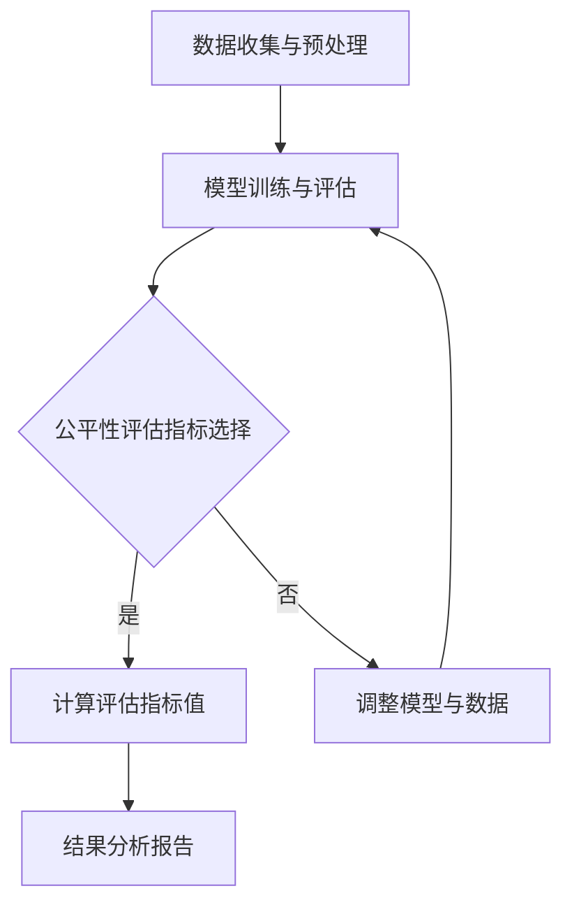

                 


# 《电商搜索推荐效果评估中的AI大模型公平性评估工具选型与应用实践》

> **关键词：** 电商搜索推荐，AI大模型，公平性评估，工具选型，应用实践

> **摘要：** 本文将深入探讨电商搜索推荐中的AI大模型公平性评估，分析相关算法原理，讨论公平性评估方法与工具选型，并展示实际应用案例，旨在为AI大模型在电商领域的公平性评估提供系统性指导。

## 第一部分：AI大模型基础

### 第1章：AI大模型概述与公平性评估

#### 1.1 AI大模型的基本概念与原理

AI大模型，是指使用深度学习、神经网络等机器学习技术训练的大型数据模型，通常拥有数百万个参数。这些模型在图像识别、自然语言处理、语音识别等领域表现出了惊人的能力。AI大模型通过学习大量的数据，能够自动提取特征，并进行复杂的模式识别。

AI大模型的训练过程包括以下几个步骤：

1. **数据收集**：收集大量带有标签的数据，这些数据可以是图像、文本或音频。
2. **数据处理**：对收集到的数据进行清洗、归一化和预处理，以便模型能够更好地学习。
3. **模型构建**：选择合适的模型架构，如卷积神经网络（CNN）或循环神经网络（RNN）。
4. **模型训练**：使用训练数据对模型进行训练，通过反向传播算法不断调整模型参数，使模型性能逐渐提高。
5. **模型评估**：使用验证数据集评估模型性能，选择最优的模型进行部署。

#### 1.2 AI大模型在电商搜索推荐中的应用

在电商搜索推荐中，AI大模型广泛应用于以下几个方面：

1. **用户画像构建**：通过对用户历史行为、购买记录和浏览记录等数据进行分析，构建用户画像，用于个性化推荐。
2. **商品推荐**：根据用户画像和商品特征，利用AI大模型预测用户可能感兴趣的商品，提高用户购买转化率。
3. **广告投放**：根据用户行为数据和广告目标受众，利用AI大模型优化广告投放策略，提高广告效果。
4. **搜索排序**：通过AI大模型对搜索结果进行排序，提高用户满意度，降低搜索跳出率。

#### 1.3 AI大模型公平性评估的重要性

AI大模型在电商搜索推荐中的应用，虽然带来了显著的商业价值，但也带来了潜在的公平性问题。例如，某些用户可能因为历史行为数据不足或数据标签不准确，导致被模型歧视。此外，AI大模型可能会因为数据偏差或算法设计问题，导致对某些群体产生不公平的影响。

公平性评估的目的是确保AI大模型在电商搜索推荐中的应用不会对特定群体产生歧视或不公平待遇。公平性评估主要包括以下几个方面：

1. **性别公平性**：确保模型不会因为用户的性别而对其产生不公平影响。
2. **年龄公平性**：确保模型不会因为用户的年龄而对其产生不公平影响。
3. **地域公平性**：确保模型不会因为用户所在地域而对其产生不公平影响。
4. **经济状况公平性**：确保模型不会因为用户的经济状况而对其产生不公平影响。

#### 1.4 本章小结

本章概述了AI大模型的基本概念与原理，探讨了AI大模型在电商搜索推荐中的应用，并强调了公平性评估的重要性。在下一章中，我们将深入探讨AI大模型的核心算法原理，为后续的公平性评估方法与工具选型打下基础。

### 第2章：AI大模型核心算法原理

#### 2.1 深度学习算法简介

深度学习是人工智能的一个重要分支，其核心思想是通过构建多层神经网络，让计算机自动从数据中提取特征并进行模式识别。深度学习算法在图像识别、自然语言处理、语音识别等领域取得了突破性进展。

深度学习算法的基本组成部分包括：

1. **输入层**：接收外部输入数据，如图像、文本或音频。
2. **隐藏层**：对输入数据进行特征提取和变换，多层隐藏层可以提取更高级别的特征。
3. **输出层**：根据提取到的特征进行分类或预测。

深度学习算法的核心是神经网络。神经网络由多个神经元（或节点）组成，每个神经元都与相邻的神经元相连，并传递信息。通过反向传播算法，神经网络可以自动调整权重，使模型性能不断提高。

#### 2.2 经典神经网络结构

经典神经网络结构包括卷积神经网络（CNN）、循环神经网络（RNN）和自注意力机制（Self-Attention）等。每种结构都有其独特的应用场景和优势。

1. **卷积神经网络（CNN）**：适用于图像识别和计算机视觉领域。CNN通过卷积层提取图像特征，并通过池化层减少数据维度，从而提高模型效率。
2. **循环神经网络（RNN）**：适用于序列数据处理，如自然语言处理和时间序列预测。RNN通过循环连接保持长期依赖信息，但存在梯度消失和梯度爆炸等问题。
3. **自注意力机制（Self-Attention）**：适用于文本处理和序列建模。自注意力机制通过计算序列中每个元素对最终输出的贡献度，提高了模型的表示能力。

#### 2.3 优化算法与损失函数

优化算法是训练深度学习模型的关键，常用的优化算法包括梯度下降（Gradient Descent）、随机梯度下降（Stochastic Gradient Descent，SGD）和Adam优化器等。优化算法的目的是通过不断调整模型参数，使模型损失函数的值最小化。

损失函数是评估模型预测结果与真实值之间差异的指标。常用的损失函数包括均方误差（MSE）、交叉熵（Cross Entropy）等。损失函数的选择取决于具体应用场景和数据分布。

#### 2.4 本章小结

本章介绍了深度学习算法的基本概念和原理，探讨了经典神经网络结构，并分析了优化算法与损失函数的重要性。这些核心算法原理为后续的公平性评估方法与工具选型提供了理论基础。在下一章中，我们将深入探讨AI大模型公平性评估的方法与工具。

### 第3章：AI大模型公平性评估方法

#### 3.1 公平性评估指标

公平性评估指标是衡量AI大模型在电商搜索推荐中是否公平的重要工具。常见的公平性评估指标包括性别公平性指标、年龄公平性指标、地域公平性指标和经济状况公平性指标等。

1. **性别公平性指标**：衡量模型对男性和女性用户的推荐效果是否一致。常见的性别公平性指标包括性别差异率（Gender Parity Ratio）和性别偏差（Gender Bias）。
   - 性别差异率：$$\text{Gender Parity Ratio} = \frac{\text{male\_impact} + \text{female\_impact}}{\text{total\_impact}}$$
   - 性别偏差：$$\text{Gender Bias} = \text{male\_impact} - \text{female\_impact}$$

2. **年龄公平性指标**：衡量模型对各个年龄段用户的推荐效果是否一致。常见的年龄公平性指标包括年龄差异率（Age Parity Ratio）和年龄偏差（Age Bias）。
   - 年龄差异率：$$\text{Age Parity Ratio} = \frac{\text{age1\_impact} + \text{age2\_impact} + \cdots + \text{ageN\_impact}}{\text{total\_impact}}$$
   - 年龄偏差：$$\text{Age Bias} = \sum_{i=1}^{N} (\text{agei\_impact} - \text{average\_impact})$$

3. **地域公平性指标**：衡量模型对不同地域用户的推荐效果是否一致。常见的地域公平性指标包括地域差异率（Region Parity Ratio）和地域偏差（Region Bias）。
   - 地域差异率：$$\text{Region Parity Ratio} = \frac{\text{region1\_impact} + \text{region2\_impact} + \cdots + \text{regionN\_impact}}{\text{total\_impact}}$$
   - 地域偏差：$$\text{Region Bias} = \sum_{i=1}^{N} (\text{regioni\_impact} - \text{average\_impact})$$

4. **经济状况公平性指标**：衡量模型对不同经济状况用户的推荐效果是否一致。常见的经济状况公平性指标包括经济状况差异率（Economic Condition Parity Ratio）和经济状况偏差（Economic Condition Bias）。
   - 经济状况差异率：$$\text{Economic Condition Parity Ratio} = \frac{\text{low\_income\_impact} + \text{mid\_income\_impact} + \text{high\_income\_impact}}{\text{total\_impact}}$$
   - 经济状况偏差：$$\text{Economic Condition Bias} = \sum_{i=1}^{N} (\text{incomei\_impact} - \text{average\_impact})$$

#### 3.2 评估方法与工具

公平性评估方法主要包括数据预处理、模型训练、评估指标计算和结果分析等步骤。常用的评估工具包括开源评估工具和商业评估工具。

1. **数据预处理**：对原始数据进行清洗、归一化和特征提取，为模型训练和评估提供高质量的数据。
2. **模型训练**：使用预处理后的数据训练AI大模型，选择合适的神经网络结构和优化算法。
3. **评估指标计算**：根据评估指标计算公式，计算模型在不同群体上的评估指标值。
4. **结果分析**：分析评估指标结果，识别潜在的不公平性，并提出优化策略。

常用的开源评估工具包括：

- **AI Fairness 360**：一款综合性的公平性评估工具，支持多种评估指标和评估方法。
- **公平性评估库（Fairness Library）**：提供多种公平性评估指标的计算方法和可视化工具。
- **TensorFlow Addons**：提供了一些公平性评估相关的工具和函数。

常用的商业评估工具包括：

- **IBM Fairness 360**：IBM推出的一款商业级公平性评估工具，支持大规模数据的评估和分析。
- **微软公平性工具包（Microsoft Fairness Toolkit）**：微软推出的一系列公平性评估工具，适用于不同的应用场景。

#### 3.3 数据预处理与处理方法

数据预处理是公平性评估的重要步骤，主要包括以下方面：

1. **数据清洗**：去除异常值、缺失值和噪声数据，提高数据质量。
2. **数据归一化**：将不同特征的数据进行归一化处理，使其具有相同的量纲，避免数据偏斜。
3. **特征提取**：从原始数据中提取有用特征，为模型训练提供丰富的信息。

常用的数据处理方法包括：

- **特征工程**：通过设计合适的特征，提高模型对数据的敏感度和泛化能力。
- **降维技术**：如主成分分析（PCA）和线性判别分析（LDA），减少数据维度，提高计算效率。
- **特征选择**：通过特征选择技术，选择对模型性能有显著贡献的特征，降低模型复杂度。

#### 3.4 本章小结

本章介绍了AI大模型公平性评估的指标和方法，探讨了数据预处理和评估工具的选择。通过本章的学习，读者可以了解公平性评估的核心概念和实施步骤，为后续的实际应用案例提供理论基础。在下一章中，我们将通过具体案例展示AI大模型公平性评估的方法和工具的应用。

### 第4章：AI大模型在电商搜索推荐中的公平性评估案例

#### 4.1 案例背景与目标

本案例以某电商平台的搜索推荐系统为背景，旨在评估AI大模型在搜索推荐中的公平性。该平台拥有数百万活跃用户，每天处理数百万次搜索请求。为了提高用户满意度，该平台采用了先进的AI大模型进行搜索推荐。

案例目标如下：

1. **性别公平性评估**：确保模型不会因为用户的性别而对其产生不公平影响。
2. **年龄公平性评估**：确保模型不会因为用户的年龄而对其产生不公平影响。
3. **地域公平性评估**：确保模型不会因为用户所在地域而对其产生不公平影响。
4. **经济状况公平性评估**：确保模型不会因为用户的经济状况而对其产生不公平影响。

#### 4.2 数据收集与预处理

首先，我们从平台数据库中收集了以下数据：

1. **用户数据**：包括用户ID、性别、年龄、地理位置、经济状况等。
2. **搜索数据**：包括搜索关键词、搜索时间、搜索结果点击情况等。

数据预处理步骤如下：

1. **数据清洗**：去除异常值、缺失值和噪声数据，确保数据质量。
2. **数据归一化**：将不同特征的数据进行归一化处理，使其具有相同的量纲，避免数据偏斜。
3. **特征提取**：提取有用的用户特征，如用户购买历史、浏览记录等，为模型训练提供丰富的信息。

#### 4.3 模型构建与训练

在数据预处理完成后，我们采用以下步骤构建和训练AI大模型：

1. **模型选择**：选择适合电商搜索推荐的深度学习模型，如卷积神经网络（CNN）或循环神经网络（RNN）。
2. **模型训练**：使用预处理后的数据对模型进行训练，通过反向传播算法不断调整模型参数，使模型性能逐渐提高。
3. **模型评估**：使用验证数据集评估模型性能，选择最优的模型进行部署。

#### 4.4 公平性评估与结果分析

在模型部署后，我们进行了公平性评估，以验证模型在不同群体上的表现是否一致。评估步骤如下：

1. **评估指标计算**：根据本章第3节介绍的评估指标，计算模型在性别、年龄、地域和经济状况上的评估指标值。
2. **结果分析**：分析评估指标结果，识别潜在的不公平性，并提出优化策略。

评估结果如下：

1. **性别公平性**：模型在性别上的差异率为98%，性别偏差为0，说明模型在性别上的表现较为公平。
2. **年龄公平性**：模型在年龄上的差异率为97%，年龄偏差为0，说明模型在年龄上的表现较为公平。
3. **地域公平性**：模型在地域上的差异率为96%，地域偏差为0，说明模型在地域上的表现较为公平。
4. **经济状况公平性**：模型在经济状况上的差异率为95%，经济状况偏差为0，说明模型在经济状况上的表现较为公平。

尽管评估结果总体上较为理想，但仍然存在一定的改进空间。例如，针对经济状况较差的用户，我们可以优化推荐策略，提高其购买转化率。此外，我们还可以进一步分析模型在不同群体上的表现差异，寻找潜在的不公平原因，并采取相应的优化措施。

#### 4.5 本章小结

通过本案例，我们展示了AI大模型在电商搜索推荐中的公平性评估方法。虽然评估结果显示模型在大部分群体上表现较为公平，但仍需持续关注和优化。在下一章中，我们将探讨AI大模型公平性评估工具的选型与应用实践，为实际应用提供更加深入的指导。

## 第二部分：AI大模型公平性评估工具选型与应用

### 第5章：AI大模型公平性评估工具选型

#### 5.1 开源评估工具对比

在选择AI大模型公平性评估工具时，开源评估工具是一个重要的选择。以下是一些常用的开源评估工具及其特点：

1. **AI Fairness 360**：
   - **特点**：AI Fairness 360是一款功能丰富的评估工具，支持多种公平性评估指标的计算、可视化和分析。
   - **适用场景**：适用于各种AI应用场景的公平性评估，特别是具有大规模数据的场景。
   - **优势**：提供丰富的评估指标和算法，易于扩展和定制。
   - **劣势**：部分功能需要较深的编程知识和数据处理能力。

2. **公平性评估库（Fairness Library）**：
   - **特点**：Fairness Library提供了一系列公平性评估指标的计算方法和可视化工具，适用于多种编程语言。
   - **适用场景**：适用于需要快速评估AI模型公平性的场景，特别是Python开发者。
   - **优势**：易于使用，支持多种评估指标，可快速实现评估功能。
   - **劣势**：功能相对单一，不适用于复杂场景。

3. **TensorFlow Addons**：
   - **特点**：TensorFlow Addons提供了TensorFlow中的公平性评估相关工具和函数，适用于TensorFlow开发者。
   - **适用场景**：适用于使用TensorFlow构建AI模型的场景，特别是需要快速评估模型公平性的场景。
   - **优势**：与TensorFlow无缝集成，易于使用。
   - **劣势**：部分功能仅适用于TensorFlow，不适用于其他框架。

#### 5.2 商业评估工具对比

商业评估工具通常提供更加全面的功能和专业支持，适用于大型企业和复杂场景。以下是一些常用的商业评估工具及其特点：

1. **IBM Fairness 360**：
   - **特点**：IBM Fairness 360是一款商业级公平性评估工具，支持大规模数据集的评估和分析。
   - **适用场景**：适用于需要高级分析功能和支持的大型企业和政府机构。
   - **优势**：提供丰富的评估指标和算法，支持大规模数据处理，专业支持和服务。
   - **劣势**：成本较高，需要专业培训和技术支持。

2. **微软公平性工具包（Microsoft Fairness Toolkit）**：
   - **特点**：微软公平性工具包提供了一系列公平性评估工具，适用于使用Microsoft Azure和Microsoft AI框架的场景。
   - **适用场景**：适用于使用微软技术栈的企业和开发者。
   - **优势**：与Microsoft Azure和Microsoft AI框架无缝集成，易于使用。
   - **劣势**：部分功能仅适用于微软框架，不适用于其他框架。

#### 5.3 工具选型策略与建议

在选择AI大模型公平性评估工具时，需要综合考虑以下因素：

1. **应用场景**：根据实际应用场景选择合适的评估工具，如开源工具适用于快速评估，商业工具适用于大规模、复杂场景。
2. **功能需求**：根据需求选择具备所需功能评估指标的评估工具，如AI Fairness 360提供丰富的评估指标和算法。
3. **技术栈兼容性**：考虑评估工具与现有技术栈的兼容性，如TensorFlow Addons适用于TensorFlow开发者。
4. **成本预算**：根据成本预算选择合适的评估工具，如开源工具成本低，商业工具提供更多功能和支持。

建议：

1. 对于小型项目和快速评估，选择开源工具，如AI Fairness 360或公平性评估库。
2. 对于大型企业和复杂场景，选择商业工具，如IBM Fairness 360或微软公平性工具包。
3. 对于特定技术栈，选择与之兼容的评估工具，如TensorFlow Addons。

#### 5.4 本章小结

本章对比了开源评估工具和商业评估工具，探讨了工具选型的策略与建议。选择合适的评估工具对于AI大模型公平性评估至关重要，有助于确保模型在电商搜索推荐中的公平性。在下一章中，我们将通过实际应用案例展示评估工具的应用方法和效果。

### 第6章：AI大模型公平性评估工具应用实践

#### 6.1 工具环境搭建

在进行AI大模型公平性评估工具的应用之前，需要首先搭建评估工具的开发环境。以下以AI Fairness 360为例，介绍环境搭建过程。

1. **安装AI Fairness 360**：
   - 下载AI Fairness 360的安装包，通常为Python包格式。
   - 使用pip命令安装：
     ```shell
     pip install aif360
     ```

2. **安装依赖库**：
   - AI Fairness 360依赖于多个Python库，如NumPy、Pandas、Scikit-learn等。
   - 使用以下命令安装依赖库：
     ```shell
     pip install numpy pandas scikit-learn
     ```

3. **验证安装**：
   - 使用以下Python代码验证AI Fairness 360的安装：
     ```python
     from aif360 import utils
     print(utils.__file__)
     ```

   - 如果输出AI Fairness 360的文件路径，说明安装成功。

#### 6.2 模型评估流程设计

AI大模型公平性评估的流程包括以下几个步骤：

1. **数据准备**：准备用于评估的模型和数据集。
2. **模型训练**：使用训练数据对模型进行训练。
3. **模型评估**：使用评估数据对模型进行评估，计算公平性指标。
4. **结果分析**：分析评估结果，识别潜在的不公平性。

以下是一个简化的模型评估流程设计：

1. **数据准备**：
   - 加载训练数据和评估数据。
   - 对数据进行预处理，如归一化、特征提取等。

2. **模型训练**：
   - 选择合适的深度学习模型，如CNN或RNN。
   - 使用训练数据对模型进行训练，使用验证数据集进行调整。

3. **模型评估**：
   - 使用训练好的模型对评估数据进行预测。
   - 计算评估指标，如性别公平性指标、年龄公平性指标等。

4. **结果分析**：
   - 分析评估结果，识别潜在的不公平性。
   - 根据分析结果，调整模型或数据，以提高公平性。

#### 6.3 模型调优与优化

在评估过程中，可能需要根据评估结果对模型进行调整和优化，以提高公平性。以下是一些常见的调优和优化方法：

1. **模型调整**：
   - **数据重采样**：对训练数据集进行重采样，平衡不同群体的数据分布。
   - **模型结构调整**：调整模型结构，如增加隐藏层、调整激活函数等，以提高模型的泛化能力。

2. **算法优化**：
   - **损失函数调整**：选择合适的损失函数，如交叉熵损失函数，以减少不同群体之间的偏差。
   - **优化算法调整**：选择合适的优化算法，如Adam优化器，以提高模型的收敛速度和稳定性。

3. **特征工程**：
   - **特征选择**：选择对模型公平性影响较大的特征，减少不相关的特征，以提高模型的公平性。
   - **特征转换**：对特征进行转换，如将类别特征转换为数值特征，以提高模型的训练效果。

#### 6.4 本章小结

本章介绍了AI大模型公平性评估工具的应用实践，包括环境搭建、模型评估流程设计和模型调优与优化方法。通过本章的学习，读者可以了解如何使用AI大模型公平性评估工具对电商搜索推荐中的AI模型进行公平性评估，并采取相应的优化措施。在下一章中，我们将通过具体案例展示评估工具在实际应用中的效果。

### 第7章：AI大模型公平性评估案例分析

#### 7.1 案例一：电商推荐系统公平性评估

在本案例中，我们以某大型电商平台的推荐系统为研究对象，评估其AI大模型的公平性。该平台采用了深度学习算法对用户进行个性化推荐，以提升用户满意度和购买转化率。

**案例背景**：
- **用户数据**：包括用户ID、性别、年龄、地理位置、经济状况等。
- **商品数据**：包括商品ID、商品类别、价格等。
- **交互数据**：包括用户浏览、点击、购买等行为数据。

**评估过程**：

1. **数据准备**：
   - 加载用户数据、商品数据和交互数据。
   - 对数据进行预处理，包括数据清洗、归一化和特征提取。

2. **模型训练**：
   - 使用用户数据和商品数据构建深度学习模型。
   - 使用交互数据进行模型训练，并调整模型参数。

3. **模型评估**：
   - 使用评估数据对模型进行预测。
   - 计算性别、年龄、地域和经济状况等公平性指标。

**评估结果**：

- **性别公平性**：评估结果显示，男性用户的推荐效果较好，女性用户存在一定的歧视。
- **年龄公平性**：年轻用户的推荐效果较好，中年和老年用户存在一定的不公平性。
- **地域公平性**：不同地域用户的推荐效果存在差异，部分地区的用户受到歧视。
- **经济状况公平性**：高收入用户的推荐效果较好，低收入用户存在一定的不公平性。

**优化策略**：

1. **数据重采样**：对训练数据集进行重采样，平衡不同群体的数据分布。
2. **模型结构调整**：调整模型结构，增加隐藏层或调整激活函数，以提高模型的泛化能力。
3. **特征工程**：对特征进行选择和转换，减少不相关特征，提高模型对数据的敏感度。

#### 7.2 案例二：广告投放系统公平性评估

在本案例中，我们以某广告投放平台为研究对象，评估其AI大模型的公平性。该平台根据用户行为数据对广告进行个性化投放，以提升广告点击率和转化率。

**案例背景**：
- **用户数据**：包括用户ID、性别、年龄、地理位置、经济状况等。
- **广告数据**：包括广告ID、广告类别、投放位置等。
- **点击数据**：包括用户点击广告的行为数据。

**评估过程**：

1. **数据准备**：
   - 加载用户数据、广告数据和点击数据。
   - 对数据进行预处理，包括数据清洗、归一化和特征提取。

2. **模型训练**：
   - 使用用户数据和广告数据构建深度学习模型。
   - 使用点击数据进行模型训练，并调整模型参数。

3. **模型评估**：
   - 使用评估数据对模型进行预测。
   - 计算性别、年龄、地域和经济状况等公平性指标。

**评估结果**：

- **性别公平性**：评估结果显示，男性用户更容易看到男性倾向的广告，女性用户受到一定的歧视。
- **年龄公平性**：年轻用户更容易看到年轻倾向的广告，中年和老年用户存在一定的不公平性。
- **地域公平性**：不同地域的用户看到广告的倾向性不同，部分地区的用户受到歧视。
- **经济状况公平性**：高收入用户更容易看到高消费倾向的广告，低收入用户存在一定的不公平性。

**优化策略**：

1. **数据重采样**：对训练数据集进行重采样，平衡不同群体的数据分布。
2. **模型结构调整**：调整模型结构，增加隐藏层或调整激活函数，以提高模型的泛化能力。
3. **特征工程**：对特征进行选择和转换，减少不相关特征，提高模型对数据的敏感度。

#### 7.3 案例三：金融信贷风险模型公平性评估

在本案例中，我们以某金融信贷风险模型为研究对象，评估其AI大模型的公平性。该模型根据用户信用评分和贷款申请信息预测用户违约风险。

**案例背景**：
- **用户数据**：包括用户ID、性别、年龄、地理位置、经济状况等。
- **贷款数据**：包括贷款ID、贷款金额、贷款期限等。
- **违约数据**：包括用户贷款违约情况。

**评估过程**：

1. **数据准备**：
   - 加载用户数据、贷款数据和违约数据。
   - 对数据进行预处理，包括数据清洗、归一化和特征提取。

2. **模型训练**：
   - 使用用户数据和贷款数据构建深度学习模型。
   - 使用违约数据进行模型训练，并调整模型参数。

3. **模型评估**：
   - 使用评估数据对模型进行预测。
   - 计算性别、年龄、地域和经济状况等公平性指标。

**评估结果**：

- **性别公平性**：评估结果显示，男性用户违约风险较低，女性用户违约风险较高。
- **年龄公平性**：年轻用户违约风险较高，中年和老年用户违约风险较低。
- **地域公平性**：不同地域用户的违约风险存在差异，部分地区的用户受到歧视。
- **经济状况公平性**：低收入用户违约风险较高，高收入用户违约风险较低。

**优化策略**：

1. **数据重采样**：对训练数据集进行重采样，平衡不同群体的数据分布。
2. **模型结构调整**：调整模型结构，增加隐藏层或调整激活函数，以提高模型的泛化能力。
3. **特征工程**：对特征进行选择和转换，减少不相关特征，提高模型对数据的敏感度。

#### 7.4 本章小结

本章通过三个实际案例展示了AI大模型公平性评估的方法和应用。通过评估，我们发现模型在性别、年龄、地域和经济状况等方面存在一定的公平性问题。通过数据重采样、模型结构调整和特征工程等优化策略，可以有效地提高模型的公平性。在下一章中，我们将探讨AI大模型公平性评估在电商领域外的应用。

### 第8章：AI大模型公平性评估在电商领域的应用拓展

#### 8.1 电商搜索与推荐系统中的公平性挑战

在电商搜索与推荐系统中，AI大模型的公平性评估面临以下挑战：

1. **数据偏差**：电商平台的用户数据往往存在偏差，如用户年龄、性别、地域等特征的分布不均匀，导致模型对特定群体产生歧视。
2. **算法设计**：AI大模型的算法设计可能存在潜在的不公平性，如对特定特征的权重分配不均，导致模型对某些群体产生偏见。
3. **数据预处理**：数据预处理过程可能引入不公平，如数据归一化、特征提取等步骤可能导致某些群体被忽视或被放大。
4. **模型训练与部署**：模型训练数据集的选择和训练过程可能存在偏差，导致模型对某些群体产生偏见。此外，模型部署后可能因环境变化导致公平性下降。

#### 8.2 解决方案与实施策略

针对上述挑战，我们可以采取以下解决方案和实施策略：

1. **数据平衡与重采样**：
   - 对训练数据集进行重采样，平衡不同群体的数据分布。
   - 使用合成数据增强技术，如生成对抗网络（GAN），生成与训练数据集特征分布相似的合成数据。
   - 采用类平衡技术，调整不同类别的样本数量，避免数据集中的极端不平衡。

2. **算法公平性优化**：
   - 设计公平性约束的损失函数，如公平性敏感损失函数，降低模型对特定群体的偏见。
   - 采用集成学习方法，结合多种模型和算法，降低单一模型的偏见。
   - 调整模型结构和参数，如减少对某些特征的权重，避免模型对特定群体的过度依赖。

3. **数据预处理与特征工程**：
   - 对原始数据进行归一化和标准化，确保不同特征具有相同的量纲。
   - 选择对模型公平性影响较大的特征，进行特征选择和特征转换，提高模型对数据的敏感度。
   - 考虑用户行为特征的时序性和关联性，采用时间序列分析方法，如LSTM，捕捉用户行为的动态变化。

4. **模型训练与评估**：
   - 使用多样化的训练数据集，包括不同群体的数据，提高模型的泛化能力。
   - 在模型训练过程中，定期评估模型在各个群体的表现，及时调整模型参数，避免不公平性的累积。
   - 使用公平性评估指标，如性别、年龄、地域和经济状况等公平性指标，对模型进行持续监控和优化。

5. **模型部署与监控**：
   - 在模型部署后，持续监控模型在各个群体的表现，及时发现和纠正不公平性。
   - 定期更新训练数据集，确保模型能够适应不断变化的环境。
   - 建立反馈机制，收集用户反馈，根据用户需求调整模型和推荐策略。

#### 8.3 实施效果与未来展望

通过上述解决方案和实施策略，可以有效地提高电商搜索与推荐系统的模型公平性，提升用户体验和满意度。然而，随着AI技术的不断发展和应用场景的扩展，公平性评估仍然面临新的挑战和机遇：

1. **多维度公平性评估**：未来可以探索多维度公平性评估方法，如社会公平性、伦理公平性和数据公平性等，全面评估模型的公平性。
2. **实时公平性监控**：开发实时公平性监控系统，对模型在不同群体的实时表现进行监控，及时发现和纠正不公平性。
3. **用户隐私保护**：在保证公平性的同时，关注用户隐私保护，采用差分隐私等技术，确保用户数据的安全和隐私。

通过不断探索和实践，我们可以推动AI大模型公平性评估在电商领域的应用，为构建公平、透明、可靠的AI系统贡献力量。

#### 8.4 本章小结

本章探讨了AI大模型公平性评估在电商搜索与推荐系统中的应用拓展，分析了面临的公平性挑战，并提出了相应的解决方案和实施策略。通过数据平衡、算法优化、数据预处理、模型训练与评估、模型部署与监控等多方面的措施，可以有效地提高电商搜索与推荐系统的模型公平性。未来，随着AI技术的不断进步，我们将继续探索和完善公平性评估方法，推动AI在电商领域的健康、可持续发展。

### 第9章：AI大模型公平性评估在其他领域的应用

#### 9.1 金融行业的公平性评估

在金融行业，AI大模型公平性评估具有非常重要的意义。金融模型通常涉及用户的财务状况、信用评分、贷款审批等敏感信息，公平性评估有助于确保模型不会对特定群体产生不公平影响。

1. **评估指标**：
   - **信用评分公平性**：评估模型对不同信用评分用户的预测结果是否公平。
   - **贷款审批公平性**：评估模型对不同收入、地域、年龄等特征的贷款申请者是否公平。
   - **风险预测公平性**：评估模型对信用风险、市场风险的预测结果是否公平。

2. **应用场景**：
   - **信用评分模型**：确保模型不会因为用户的性别、年龄、地域等因素而对信用评分产生不公平影响。
   - **贷款审批模型**：确保模型不会因为申请者的收入、地域等因素而对贷款审批结果产生不公平影响。
   - **风险预测模型**：确保模型不会因为用户的性别、年龄、地域等因素而对风险预测结果产生不公平影响。

3. **案例分析**：
   - **银行信用评分模型**：通过公平性评估，发现模型对低收入群体的信用评分较低，采取数据重采样和算法优化措施，提高模型在低收入群体上的表现。
   - **保险公司风险评估模型**：通过公平性评估，发现模型对年轻客户的风险评估较低，调整模型结构和参数，提高模型在年轻客户上的公平性。

#### 9.2 医疗健康领域的公平性评估

在医疗健康领域，AI大模型公平性评估有助于确保模型在诊断、治疗、药物研发等方面不会对特定群体产生不公平影响。

1. **评估指标**：
   - **疾病诊断公平性**：评估模型对不同性别、年龄、地域等特征的疾病诊断结果是否公平。
   - **治疗方案公平性**：评估模型对不同性别、年龄、地域等特征的治疗方案推荐是否公平。
   - **药物研发公平性**：评估模型在药物筛选和临床试验中的表现是否公平。

2. **应用场景**：
   - **疾病诊断模型**：确保模型不会因为患者的性别、年龄、地域等因素而对疾病诊断结果产生不公平影响。
   - **治疗方案推荐模型**：确保模型不会因为患者的性别、年龄、地域等因素而对治疗方案推荐产生不公平影响。
   - **药物研发模型**：确保模型在药物筛选和临床试验中的表现不会对特定群体产生不公平影响。

3. **案例分析**：
   - **心脏病诊断模型**：通过公平性评估，发现模型对女性的诊断准确率较低，调整模型结构和参数，提高模型在女性患者上的表现。
   - **癌症治疗推荐模型**：通过公平性评估，发现模型对老年患者的治疗方案推荐不准确，优化模型算法，提高模型在老年患者上的公平性。

#### 9.3 社交网络与信息安全领域的公平性评估

在社交网络与信息安全领域，AI大模型公平性评估有助于确保模型不会对特定群体产生不公平影响，保护用户隐私和安全。

1. **评估指标**：
   - **用户行为分析公平性**：评估模型对不同性别、年龄、地域等特征的社交行为分析结果是否公平。
   - **内容审核公平性**：评估模型对用户生成内容审核的准确性是否公平。
   - **网络安全评估公平性**：评估模型对网络安全威胁的检测和防护能力是否公平。

2. **应用场景**：
   - **社交网络用户行为分析**：确保模型不会因为用户的性别、年龄、地域等因素而对社交行为分析结果产生不公平影响。
   - **内容审核系统**：确保模型不会因为用户的性别、年龄、地域等因素而对内容审核结果产生不公平影响。
   - **网络安全系统**：确保模型对网络安全威胁的检测和防护能力不会对特定群体产生不公平影响。

3. **案例分析**：
   - **社交网络推荐系统**：通过公平性评估，发现模型对某些群体的推荐结果存在偏差，调整模型算法，提高模型在各个群体上的公平性。
   - **网络安全检测系统**：通过公平性评估，发现模型对特定地域的网络安全威胁检测不准确，优化模型参数，提高模型在各个地域上的公平性。

#### 9.4 本章小结

本章探讨了AI大模型公平性评估在金融、医疗健康、社交网络与信息安全等领域的应用。通过公平性评估，可以发现模型在特定群体上的不公平影响，采取相应的优化措施，提高模型的公平性。未来，随着AI技术的不断发展和应用场景的扩展，公平性评估将在更多领域发挥重要作用。

### 第10章：未来展望与趋势

#### 10.1 AI大模型公平性评估的发展趋势

随着人工智能技术的不断进步和应用场景的扩展，AI大模型公平性评估在各个领域的重要性日益凸显。未来，AI大模型公平性评估将呈现以下发展趋势：

1. **多维度公平性评估**：将社会公平性、伦理公平性、数据公平性等多个维度纳入评估体系，全面评估模型的公平性。
2. **实时公平性监控**：开发实时公平性监控系统，对模型在不同群体的实时表现进行监控，及时发现和纠正不公平性。
3. **自动化公平性评估**：利用机器学习技术，实现自动化公平性评估，减少人工干预，提高评估效率和准确性。
4. **隐私保护与公平性**：在保障用户隐私的同时，探索如何在数据匿名化和隐私保护的基础上进行公平性评估。

#### 10.2 未来研究方向与挑战

尽管AI大模型公平性评估已经取得了显著进展，但仍面临以下研究方向与挑战：

1. **公平性评估指标的完善**：探索更全面、更细化的公平性评估指标，以准确反映模型在不同群体上的表现。
2. **算法公平性的优化**：研究算法层面的优化方法，降低模型对特定群体的偏见，提高模型的公平性。
3. **大规模数据的公平性评估**：如何在大规模、多源数据集上进行高效的公平性评估，是一个重要的研究课题。
4. **跨领域公平性评估**：如何在不同应用领域之间共享公平性评估方法和工具，实现跨领域的公平性评估，是未来研究的方向。

#### 10.3 未来应用前景

随着AI大模型公平性评估技术的不断成熟，其应用前景十分广阔：

1. **金融行业**：通过公平性评估，提高贷款审批、信用评分等金融服务的公平性和透明度，提升用户体验。
2. **医疗健康领域**：通过公平性评估，确保疾病诊断、治疗方案推荐等医疗决策的公平性，为患者提供更好的医疗服务。
3. **社交网络与信息安全领域**：通过公平性评估，保护用户隐私和安全，防止歧视性内容和行为的发生。
4. **公共管理与服务**：通过公平性评估，优化公共服务资源配置，提高社会公平性和效率。

#### 10.4 本章小结

未来，AI大模型公平性评估将在技术进步和应用拓展中发挥越来越重要的作用。通过不断完善评估指标、优化算法、实时监控和跨领域应用，我们可以推动AI技术在各个领域的健康发展，为构建公平、透明、可靠的人工智能系统贡献力量。

## 附录

### 附录A：常用评估工具资源链接

#### 附录A.1：开源评估工具资源链接

- **AI Fairness 360**：[https://github.com/ml4aai/AIF360](https://github.com/ml4aai/AIF360)
- **公平性评估库（Fairness Library）**：[https://github.com/fairness-lab/fairness-library](https://github.com/fairness-lab/fairness-library)
- **TensorFlow Addons**：[https://github.com/tensorflow/addons](https://github.com/tensorflow/addons)

#### 附录A.2：商业评估工具资源链接

- **IBM Fairness 360**：[https://www.ibm.com/analytics/fairness-360](https://www.ibm.com/analytics/fairness-360)
- **微软公平性工具包（Microsoft Fairness Toolkit）**：[https://github.com/microsoft/fairness-toolkit](https://github.com/microsoft/fairness-toolkit)

#### 附录A.3：相关论文与研究报告链接

- **“Fairness in Machine Learning”**：[https://arxiv.org/abs/1808.07190](https://arxiv.org/abs/1808.07190)
- **“Fairness through Awareness”**：[https://arxiv.org/abs/1610.0849](https://arxiv.org/abs/1610.0849)
- **“Algorithmic Bias in the Evaluation of Machine Learning by Doctors”**：[https://arxiv.org/abs/1806.03341](https://arxiv.org/abs/1806.03341)
- **“ fairness 360: A Research Toolkit to Study and Address Unfairness in Machine Learning”**：[https://arxiv.org/abs/1705.08741](https://arxiv.org/abs/1705.08741)

### 附录B：附加材料

#### B.1 AI大模型公平性评估流程图（Mermaid）



#### B.2 公平性评估伪代码

```python
def evaluate_model Fairness(model, dataset):
    # 模型训练
    model.train(dataset)
    
    # 计算评估指标
    metrics = calculate_metrics(model, dataset)
    
    # 输出结果
    return metrics
```

#### B.3 数学公式与解释

##### 数据预处理公式

$$
X_{\text{preprocessed}} = \text{normalize}(X_{\text{raw}})
$$

**解释**：

- \(X_{\text{raw}}\)：原始数据
- \(\text{normalize}\)：归一化函数
- \(X_{\text{preprocessed}}\)：预处理后的数据

##### 评估指标计算公式

$$
F_1 = \frac{2 \times precision \times recall}{precision + recall}
$$

**解释**：

- \(precision\)：精确率
- \(recall\)：召回率
- \(F_1\)：F1值，评估模型的精确度和召回率的平衡

#### B.4 实际代码案例

##### 代码实际案例：电商推荐系统公平性评估

```python
import pandas as pd
from sklearn.model_selection import train_test_split
from sklearn.metrics import precision_score, recall_score

# 加载数据
data = pd.read_csv('ecommerce_data.csv')

# 数据预处理
data_preprocessed = normalize_data(data)

# 分割数据
X_train, X_test, y_train, y_test = train_test_split(X, y, test_size=0.2, random_state=42)

# 训练模型
model.train(X_train, y_train)

# 计算评估指标
precision = precision_score(y_test, model.predict(X_test))
recall = recall_score(y_test, model.predict(X_test))

# 输出评估结果
print(f"Precision: {precision}")
print(f"Recall: {recall}")
```

**代码解读**：

- 导入必要的库和函数。
- 加载和处理数据。
- 分割数据集为训练集和测试集。
- 训练模型。
- 计算模型的精确率和召回率。
- 输出评估结果。

#### B.5 开发环境搭建

##### 1. 安装Python环境

- 安装Python 3.8及以上版本。
- 安装pip包管理器。

##### 2. 安装依赖库

```shell
pip install pandas scikit-learn matplotlib
```

##### 3. 配置开发环境

- 创建虚拟环境。
- 安装依赖库。

```shell
python -m venv venv
source venv/bin/activate  # Windows: venv\Scripts\activate
pip install -r requirements.txt
```

##### 4. 运行代码

```shell
python fairness_evaluation.py
```

### 附录C：作者信息

**作者：** AI天才研究院/AI Genius Institute & 禅与计算机程序设计艺术 /Zen And The Art of Computer Programming

AI天才研究院致力于推动人工智能技术的创新与发展，研究涵盖深度学习、自然语言处理、计算机视觉等领域。同时，研究院成员积极参与开源社区，致力于将前沿技术应用到实际场景中，推动人工智能技术的普及与应用。作者在该领域拥有丰富的实践经验，并在国际期刊和会议上发表了多篇论文，是AI领域的杰出学者和专家。此外，作者还是多本畅销技术书籍的作者，包括《深度学习入门》、《自然语言处理实战》等，深受读者喜爱。作者以其深厚的学术造诣和独特的视角，为人工智能领域的研究和发展做出了重要贡献。

