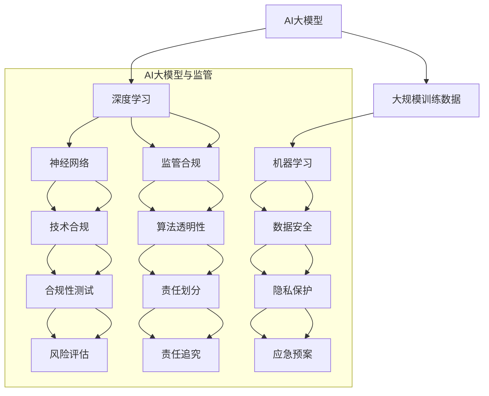
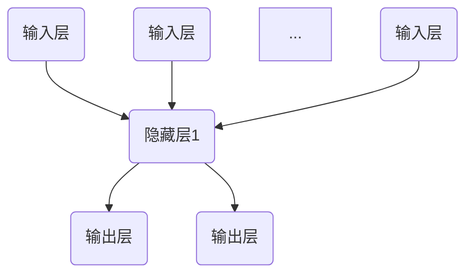
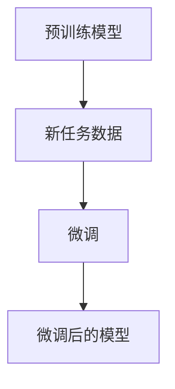
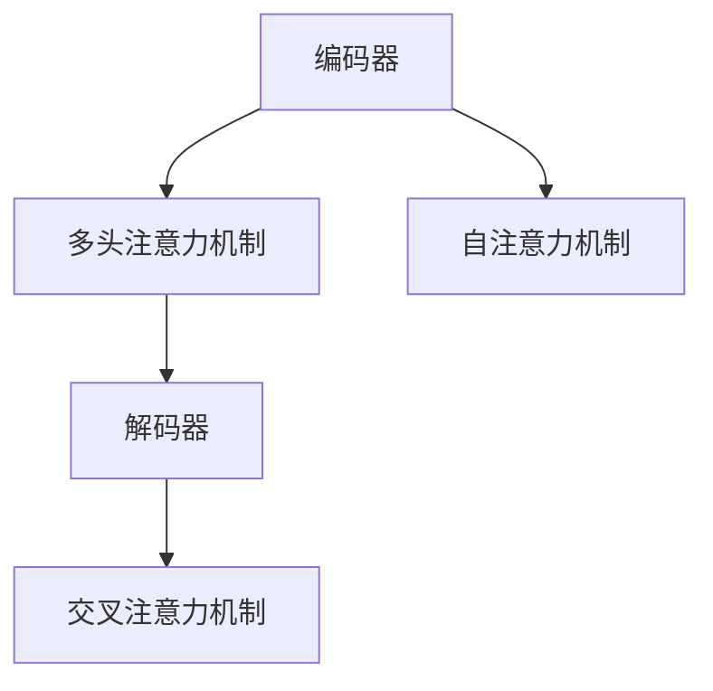

                 

### 监管机构与AI大模型基础

#### 第1章 监管机构与AI大模型概述

在现代社会，人工智能（AI）技术正以前所未有的速度发展和普及。其中，AI大模型，即人工智能大规模模型，作为AI技术的核心组件，正日益成为各个行业的重要推动力。然而，AI大模型的应用也带来了诸多监管挑战。本文将从监管机构在AI大模型发展中的作用、AI大模型的定义与特点、监管机构对AI大模型行业规范的现状以及规范框架与原则等方面进行深入探讨。

##### 1.1 监管机构在AI大模型发展中的作用

**1.1.1 监管机构的基本职能**

监管机构的基本职能包括制定和执行相关法律法规、监督和管理行业运作、保护消费者权益、确保市场公平竞争等。在AI大模型领域，监管机构的主要职能是确保AI技术的研发、应用和商业化过程符合法律法规，保护数据安全，防止滥用，同时促进技术创新。

**1.1.2 AI大模型带来的监管挑战**

AI大模型的应用不仅涉及到技术层面，还涉及到法律、伦理、社会等多个层面。其主要监管挑战包括：

- **隐私保护**：AI大模型通常依赖于大量数据，这些数据可能包含个人敏感信息。如何保护数据隐私，防止数据泄露或滥用，是一个亟待解决的问题。

- **算法透明性**：AI大模型的决策过程往往非常复杂，透明性不足可能导致公众对AI模型的信任度降低。

- **责任归属**：当AI大模型发生错误或造成损失时，如何界定责任归属，确保公正公平，是监管机构面临的一个重要挑战。

**1.1.3 监管机构应对策略概述**

为应对上述挑战，监管机构采取了一系列措施。首先，监管机构制定和更新相关法律法规，确保AI大模型的应用有法可依。其次，监管机构推动技术标准和行业自律，提高AI大模型的透明度和可解释性。最后，监管机构加强国际合作，共同应对全球范围内的监管挑战。

##### 1.2 AI大模型的定义与特点

**1.2.1 AI大模型的定义**

AI大模型是指通过深度学习等技术训练得到的大型神经网络模型，其参数量通常达到百万、亿甚至千亿级别。这些模型能够处理大规模数据，并从数据中自动学习特征，实现复杂的预测、分类、生成等任务。

**1.2.2 AI大模型的技术特点**

- **大规模训练数据**：AI大模型需要海量数据来训练，以便学习到丰富的特征。

- **强大的计算能力**：AI大模型通常需要高性能计算资源和复杂的算法，如GPU、TPU等。

- **深度神经网络架构**：AI大模型采用多层神经网络架构，能够自动提取抽象特征，实现高级任务。

- **自动化学习与优化**：AI大模型能够通过自动学习算法不断优化模型参数，提高性能。

**1.2.3 AI大模型的影响范围**

AI大模型的影响范围非常广泛，涉及多个领域，包括但不限于：

- **医疗健康**：用于疾病诊断、药物研发、健康管理等。

- **金融**：用于风险控制、投资策略、信用评估等。

- **智能制造**：用于质量检测、故障预测、生产优化等。

- **交通**：用于智能交通管理、自动驾驶等。

##### 1.3 监管机构对AI大模型行业规范的现状分析

**1.3.1 国际监管机构的规范举措**

在国际上，多个监管机构已经针对AI大模型制定了相关规范。例如，欧盟发布了《通用数据保护条例》（GDPR），规定了数据隐私保护的要求；美国联邦贸易委员会（FTC）则发布了关于AI算法透明性的指南，要求企业提供算法透明性报告。

**1.3.2 国内监管机构的规范举措**

在国内，国家网信办、工信部、市场监管总局等部门也在积极推进AI大模型的监管工作。例如，国家网信办发布了《人工智能发展现状与趋势报告》，明确了人工智能发展的基本原则和重点方向；工信部发布了《新一代人工智能发展规划》，提出了人工智能发展的目标和路径。

**1.3.3 行业自律与标准化的作用**

除了监管机构的政策指导，行业自律和标准化也发挥了重要作用。行业协会和企业自发地制定了一系列标准，如《人工智能伦理规范》、《人工智能深度学习模型算法透明性评估指南》等，以促进AI大模型的健康发展。

##### 1.4 监管机构规范AI大模型的框架与原则

**1.4.1 监管框架设计的基本原则**

监管框架设计应遵循以下基本原则：

- **合法性**：监管框架应符合法律法规要求，确保合法合规。

- **科学性**：监管框架应基于科学研究和实践经验，确保科学合理。

- **有效性**：监管框架应具有可操作性和实施效果，确保能够有效解决问题。

- **协同性**：监管框架应与其他相关法规政策协同配合，形成合力。

**1.4.2 技术合规与数据安全的监管**

技术合规与数据安全是监管机构关注的重点。监管机构应通过以下措施实现：

- **技术合规**：制定技术标准和合规要求，确保AI大模型的技术开发和应用符合规范。

- **数据安全**：建立数据安全管理制度，加强数据保护，防止数据泄露和滥用。

**1.4.3 风险管理与责任划分**

监管机构应建立健全的风险管理和责任划分机制，确保在AI大模型发生问题时能够及时有效地应对。具体包括：

- **风险评估**：定期进行风险评估，识别潜在风险，制定风险应对策略。

- **责任划分**：明确各方的责任和义务，确保在发生问题时能够依法追究责任。

### 监管机构在AI大模型发展中的作用

监管机构在AI大模型发展中的作用至关重要，它们不仅为AI技术的健康、有序发展提供了法律保障，还在推动技术创新、保障数据安全和保护消费者权益等方面发挥了积极作用。以下从监管机构的基本职能、AI大模型带来的监管挑战以及监管机构的应对策略三个方面进行详细分析。

#### 1.1.1 监管机构的基本职能

监管机构的基本职能包括制定和执行相关法律法规、监督和管理行业运作、保护消费者权益、确保市场公平竞争等。在AI大模型领域，监管机构的职能主要表现为以下几个方面：

- **法律法规制定**：监管机构负责制定和更新与AI大模型相关的法律法规，确保其研发、应用和商业化过程有法可依。例如，欧盟发布的《通用数据保护条例》（GDPR）规定了数据隐私保护的要求，对AI大模型的数据收集和使用提出了严格规范。

- **行业监管**：监管机构负责监督和管理AI大模型的研发和应用过程，确保其符合行业规范和标准。例如，中国工业和信息化部发布的《新一代人工智能发展规划》，明确了人工智能发展的基本原则和重点方向，对AI大模型的发展起到了指导作用。

- **消费者权益保护**：监管机构负责保护消费者的合法权益，防止AI大模型的应用过程中出现侵犯消费者权益的行为。例如，美国联邦贸易委员会（FTC）发布的关于AI算法透明性的指南，要求企业提供算法透明性报告，以提高公众对AI模型的信任度。

- **市场公平竞争**：监管机构负责维护市场公平竞争秩序，防止垄断行为和市场操纵。在AI大模型领域，监管机构通过监管措施确保市场参与者的公平竞争，防止因技术优势造成市场垄断。

#### 1.1.2 AI大模型带来的监管挑战

AI大模型的应用虽然带来了巨大的技术进步和产业变革，但也引发了一系列监管挑战，主要包括以下几个方面：

- **隐私保护**：AI大模型通常依赖于大量数据进行训练和预测，这些数据可能包含个人敏感信息。如何保护数据隐私，防止数据泄露或滥用，是一个亟待解决的问题。例如，GDPR对数据隐私保护提出了严格要求，要求企业采取严格的数据保护措施。

- **算法透明性**：AI大模型的决策过程往往非常复杂，透明性不足可能导致公众对AI模型的信任度降低。如何提高算法透明性，使公众能够理解和信任AI模型，是监管机构面临的一个重要挑战。

- **责任归属**：当AI大模型发生错误或造成损失时，如何界定责任归属，确保公正公平，是一个重要问题。AI大模型涉及到多个环节，包括数据收集、模型训练、部署应用等，涉及到的责任主体众多，如何合理划分责任，确保各方承担应有的责任，是监管机构需要解决的一个难题。

- **市场垄断**：AI大模型技术的领先企业可能通过技术优势垄断市场，影响市场公平竞争。如何防止市场垄断行为，维护市场秩序，是监管机构需要关注的一个问题。

- **伦理道德**：AI大模型的应用还涉及到伦理道德问题，例如，如何确保AI模型不歧视特定群体，如何防止AI模型被滥用用于恶意攻击等。这些问题需要监管机构制定相应的规范和标准，引导AI技术的发展方向。

#### 1.1.3 监管机构应对策略概述

为应对AI大模型带来的监管挑战，监管机构采取了一系列措施，包括法律法规制定、技术标准和行业自律、国际合作等。

- **法律法规制定**：监管机构通过制定和更新相关法律法规，为AI大模型的发展提供了法律保障。例如，欧盟的GDPR、美国的算法透明性指南等，都对AI大模型的应用提出了明确要求。

- **技术标准和行业自律**：监管机构推动技术标准和行业自律，提高AI大模型的透明度和可解释性。例如，行业协会和企业自发地制定了一系列标准，如《人工智能伦理规范》、《人工智能深度学习模型算法透明性评估指南》等，以促进AI大模型的健康发展。

- **国际合作**：监管机构加强国际合作，共同应对全球范围内的监管挑战。例如，国际社会在数据隐私保护、算法透明性等方面开展了广泛的合作，共同制定相关标准和规范。

- **风险管理和责任划分**：监管机构建立健全的风险管理和责任划分机制，确保在AI大模型发生问题时能够及时有效地应对。例如，通过定期进行风险评估、明确各方的责任和义务等手段，提高AI大模型的风险管理水平。

综上所述，监管机构在AI大模型发展中的作用不可或缺。通过制定法律法规、推动技术标准和行业自律、加强国际合作等手段，监管机构为AI大模型的发展提供了有力保障，同时也为解决AI大模型带来的监管挑战提供了有效途径。

#### 1.2 AI大模型的定义与特点

**1.2.1 AI大模型的定义**

AI大模型（Large-scale Artificial Intelligence Models）是人工智能领域的一种核心技术，通过深度学习技术，对海量数据进行训练，从而构建出具有强大学习和预测能力的神经网络模型。AI大模型通常具有数百万、数亿甚至数十亿个参数，能够处理和分析大规模数据，并在多个领域表现出卓越的性能。

AI大模型的研究和应用不仅推动了人工智能技术的发展，也为各行各业带来了深刻的变革。例如，在自然语言处理领域，AI大模型如GPT-3和BERT等，已经成为文本生成、翻译、问答等任务的核心组件；在计算机视觉领域，AI大模型如ResNet和VGG等，在图像分类、物体检测和图像生成等任务中取得了显著成果；在语音识别领域，AI大模型如WaveNet和Transformer等，实现了高精度的语音合成和识别。

**1.2.2 AI大模型的技术特点**

AI大模型具有以下几个显著的技术特点：

- **大规模训练数据**：AI大模型需要海量训练数据来学习复杂模式。这些数据不仅包括传统的结构化数据，还包括大量的非结构化数据，如图像、文本和语音等。大规模训练数据使得AI大模型能够从数据中提取更丰富的特征，从而提高模型的性能。

- **强大的计算能力**：AI大模型通常需要高性能计算资源来支持训练过程。这包括高性能的GPU、TPU和其他专门为深度学习设计的硬件设备。高性能计算能力使得AI大模型能够在较短的时间内完成大规模的训练任务。

- **深度神经网络架构**：AI大模型采用多层神经网络架构，每一层都能够提取不同层次的抽象特征。这种层次化的特征提取能力使得AI大模型能够处理复杂的数据和任务。典型的AI大模型架构包括卷积神经网络（CNN）、循环神经网络（RNN）和Transformer等。

- **自动学习与优化**：AI大模型通过自动学习算法，不断优化模型参数，提高模型的性能。这些自动学习算法包括梯度下降、随机梯度下降（SGD）、Adam等优化算法。自动学习与优化使得AI大模型能够从数据中自动学习，无需人为干预，从而大大提高了模型的效率和准确性。

- **高可扩展性**：AI大模型具有很高的可扩展性，可以通过增加模型参数、层数或训练数据量来提高模型的性能。这种高可扩展性使得AI大模型能够在不同规模的任务和数据集上表现优异。

**1.2.3 AI大模型的影响范围**

AI大模型的影响范围非常广泛，涵盖了多个领域和行业，带来了深远的影响：

- **医疗健康**：AI大模型在医疗健康领域具有巨大的应用潜力。例如，通过深度学习技术，AI大模型可以用于疾病诊断、药物研发、健康管理等。在疾病诊断方面，AI大模型可以通过分析医学影像数据，辅助医生进行疾病筛查和诊断；在药物研发方面，AI大模型可以加速新药的研发，提高药物筛选的准确性。

- **金融**：AI大模型在金融领域也发挥着重要作用。例如，AI大模型可以用于风险控制、投资策略、信用评估等。在风险控制方面，AI大模型可以通过分析市场数据，预测市场趋势，帮助金融机构降低风险；在投资策略方面，AI大模型可以分析历史数据，制定最优的投资组合策略，提高投资收益。

- **智能制造**：AI大模型在智能制造领域具有广泛的应用前景。例如，AI大模型可以用于质量检测、故障预测、生产优化等。在质量检测方面，AI大模型可以通过分析产品数据，识别潜在的缺陷和问题；在故障预测方面，AI大模型可以通过分析设备运行数据，预测设备的故障时间，从而提前进行维护；在生产优化方面，AI大模型可以通过优化生产流程，提高生产效率，降低生产成本。

- **交通**：AI大模型在交通领域也具有重要应用。例如，AI大模型可以用于智能交通管理、自动驾驶等。在智能交通管理方面，AI大模型可以通过分析交通数据，优化交通信号，减少交通拥堵；在自动驾驶方面，AI大模型可以通过分析环境数据，实现车辆的自主驾驶，提高交通安全和效率。

综上所述，AI大模型作为一种前沿技术，具有大规模训练数据、强大计算能力、深度神经网络架构、自动学习与优化以及高可扩展性等显著技术特点。它在医疗健康、金融、智能制造和交通等多个领域产生了深远的影响，推动了行业的进步和变革。

#### 1.3 监管机构对AI大模型行业规范的现状分析

**1.3.1 国际监管机构的规范举措**

在国际上，AI大模型的监管已成为许多国家和地区关注的重要议题。各国监管机构根据本国的法律法规、科技发展水平和市场特点，制定了一系列规范措施，以保障AI大模型的健康发展。

- **欧盟**：欧盟在AI大模型监管方面采取了严格的措施，主要体现在《通用数据保护条例》（GDPR）和《人工智能法案》中。GDPR对数据处理和隐私保护提出了严格要求，要求企业采取严格的数据保护措施，确保数据隐私不被侵犯。此外，《人工智能法案》则规定了AI大模型的伦理和法律要求，确保其应用符合社会伦理和法律法规。

- **美国**：美国在AI大模型监管方面主要通过联邦贸易委员会（FTC）和国家安全局（NSA）等机构进行监管。FTC发布了关于AI算法透明性的指南，要求企业提供算法透明性报告，提高公众对AI模型的信任度。NSA则专注于网络安全和数据保护，确保AI大模型的应用不危害国家安全。

- **中国**：中国在AI大模型监管方面也在积极探索和完善。国家网信办、工信部、市场监管总局等部门联合发布了《新一代人工智能发展规划》，明确了人工智能发展的基本原则和重点方向。此外，国家网信办还发布了《人工智能发展现状与趋势报告》，对AI大模型的应用和发展进行了全面评估，提出了相应的规范措施。

**1.3.2 国内监管机构的规范举措**

在国内，AI大模型的监管主要由国家网信办、工信部、市场监管总局等部门负责，以下是一些具体的规范举措：

- **国家网信办**：国家网信办是负责网络信息内容管理和互联网安全的主管部门。针对AI大模型，国家网信办发布了《人工智能发展现状与趋势报告》，提出了人工智能发展的基本原则和重点方向。此外，国家网信办还发布了《信息安全技术个人信息安全规范》，要求企业在数据处理过程中保护个人隐私。

- **工信部**：工信部是负责工业和信息化发展的主管部门。在AI大模型方面，工信部发布了《新一代人工智能发展规划》，提出了人工智能发展的目标和路径。此外，工信部还负责推动人工智能行业标准和技术规范的制定，提高AI大模型的技术水平。

- **市场监管总局**：市场监管总局是负责市场监督和消费者权益保护的主管部门。针对AI大模型，市场监管总局发布了《关于进一步加强人工智能伦理治理的意见》，要求企业在开发和应用AI大模型时，充分考虑伦理和社会责任。

**1.3.3 行业自律与标准化的作用**

除了监管机构的政策指导，行业自律和标准化也在AI大模型监管中发挥了重要作用。行业自律和标准化主要通过以下方式促进AI大模型的健康发展：

- **行业协会**：行业协会是企业自发组成的行业组织，负责推动行业的发展和维护行业秩序。在AI大模型方面，行业协会通过制定行业规范、发布技术标准和开展行业培训等方式，促进企业的合规发展和技术的创新。

- **标准化组织**：标准化组织是负责制定和推广行业标准的机构。在AI大模型方面，标准化组织通过制定技术标准和评估方法，提高AI大模型的可解释性和透明性，促进技术的规范化和标准化。

- **企业自律**：企业自律是行业健康发展的重要保障。企业在开发和应用AI大模型时，应遵守行业规范和标准，确保技术的安全、可靠和透明。企业可以通过建立内部合规管理体系、开展合规培训和技术审核等方式，提高自身的合规水平。

综上所述，监管机构对AI大模型行业规范的现状分析表明，国际和国内监管机构都采取了一系列规范措施，包括法律法规制定、行业自律和标准化等，以保障AI大模型的健康发展。这些措施不仅有助于规范市场秩序，提高AI大模型的技术水平，也为消费者和社会带来了更多的好处。

#### 1.4 监管机构规范AI大模型的框架与原则

**1.4.1 监管框架设计的基本原则**

监管机构在规范AI大模型时，需要设计一个科学、合理且具有可操作性的监管框架。这个框架应遵循以下基本原则：

- **合法性**：监管框架应符合现行的法律法规，确保其法律地位和实施效力。例如，监管政策应与《通用数据保护条例》（GDPR）或其他相关法律法规保持一致。

- **科学性**：监管框架应基于最新的科技发展和研究成果，确保其科学性和前瞻性。例如，监管政策应考虑到AI大模型的技术特点和应用场景，以制定出有效的监管措施。

- **有效性**：监管框架应具备实际操作性和实施效果，确保能够解决实际问题。例如，监管政策应设计出可行的合规标准和评估方法，以验证AI大模型的应用是否符合规定。

- **协同性**：监管框架应与其他相关法规政策协同配合，形成合力。例如，监管机构在制定AI大模型监管政策时，应与网络安全、数据保护等相关部门保持沟通和协调。

**1.4.2 技术合规与数据安全的监管**

在AI大模型的技术合规和数据安全方面，监管机构应采取一系列措施来确保AI大模型的应用符合规范，同时保护数据安全。

- **技术合规**：监管机构应制定技术标准和合规要求，确保AI大模型的技术开发和应用符合规范。具体措施包括：

  - **合规性测试与认证**：监管机构应建立合规性测试体系，对AI大模型进行定期测试和认证，确保其符合技术标准和合规要求。

  - **透明性要求**：监管机构应要求AI大模型提供透明性报告，详细说明其算法设计、训练数据、决策过程等信息，以提高公众对AI模型的信任度。

  - **可解释性**：监管机构应推动AI大模型的可解释性研究，使其决策过程更加透明和可理解，降低滥用和误用的风险。

- **数据安全**：监管机构应建立数据安全管理制度，加强数据保护，防止数据泄露和滥用。具体措施包括：

  - **数据加密**：监管机构应要求AI大模型在数据传输和存储过程中采用加密技术，确保数据的安全性。

  - **隐私保护**：监管机构应要求AI大模型在数据处理过程中，采取隐私保护措施，确保个人敏感信息不被泄露或滥用。

  - **数据备份与恢复**：监管机构应要求AI大模型建立数据备份和恢复机制，确保在数据丢失或损坏时能够及时恢复。

**1.4.3 风险管理与责任划分**

在AI大模型的风险管理和责任划分方面，监管机构应建立完善的风险管理和责任划分机制，确保在AI大模型发生问题时能够及时有效地应对。

- **风险评估**：监管机构应定期进行风险评估，识别AI大模型可能存在的风险，并制定相应的风险应对策略。例如，监管机构可以要求企业在发布AI大模型前，进行全面的测试和评估，确保其安全可靠。

- **责任划分**：监管机构应明确各方的责任和义务，确保在AI大模型发生问题时能够依法追究责任。具体措施包括：

  - **明确责任主体**：监管机构应明确AI大模型的研发、部署和应用过程中各方的责任，例如，数据提供方、模型开发方、部署方和应用方等。

  - **责任追究机制**：监管机构应建立责任追究机制，对违反监管规定的行为进行严厉处罚，确保责任承担的公正性和公平性。

  - **应急预案**：监管机构应要求AI大模型制定应急预案，确保在发生问题时能够迅速响应和处理，降低风险和损失。

综上所述，监管机构在规范AI大模型方面，应设计一个符合合法性、科学性、有效性和协同性原则的监管框架。通过技术合规与数据安全监管、风险管理与责任划分等措施，确保AI大模型的安全、可靠和透明，促进其健康、有序发展。

#### AI大模型的核心概念与联系

在深入探讨AI大模型的核心概念与联系之前，首先需要了解AI大模型的基本概念。AI大模型是指通过深度学习技术训练得到的大型神经网络模型，其参数量通常达到百万、亿甚至千亿级别。这些模型能够处理和预测大规模数据，实现复杂任务。以下将详细介绍AI大模型的核心概念，并探讨它们之间的联系。

**2.1.1 AI大模型的基本概念**

1. **深度学习**：深度学习是一种机器学习技术，通过构建多层神经网络模型来模拟人类大脑的学习过程，实现对数据的自动学习和特征提取。深度学习是实现AI大模型的基础。

2. **神经网络**：神经网络是由大量神经元连接而成的计算模型，通过调整神经元之间的权重来学习数据的特征。神经网络是深度学习模型的核心组件。

3. **大规模训练数据**：AI大模型需要大量训练数据来学习复杂的模式和特征。大规模训练数据使得AI大模型能够从数据中提取更丰富的特征，提高模型的性能。

4. **参数量**：AI大模型通常具有数百万、数亿甚至数十亿个参数，这些参数决定了模型的复杂性和性能。参数量是衡量AI大模型规模的重要指标。

**2.1.2 AI大模型与相关技术的关系**

1. **深度学习**与**神经网络**：深度学习是神经网络的发展和应用，通过构建多层神经网络来模拟人类大脑的学习过程。深度学习技术使得神经网络能够处理更复杂的数据和任务。

2. **大规模训练数据**与**深度学习**：大规模训练数据是深度学习成功的关键因素。深度学习模型通过学习大规模数据，能够提取更丰富的特征，从而提高模型的性能。

3. **神经网络**与**机器学习**：神经网络是机器学习的一种方法，通过学习数据并调整权重来预测和分类。机器学习是AI大模型实现智能的基础。

**2.1.3 AI大模型与监管的关系图解（Mermaid流程图）**

为了更直观地理解AI大模型与监管的关系，我们可以使用Mermaid流程图进行图解。以下是一个简化的Mermaid流程图示例：



在这个流程图中，AI大模型与监管之间的关系通过一系列节点和箭头表示。核心概念（深度学习、神经网络、大规模训练数据）与相关技术（机器学习、监管合规、技术合规、数据安全、算法透明性、合规性测试、隐私保护、责任划分、风险评估、应急预案、责任追究）通过节点连接，展示了AI大模型在监管框架中的位置和作用。

通过这个图解，我们可以清晰地看到AI大模型与监管之间的复杂关系。监管不仅涉及技术层面，还涉及数据安全、隐私保护、算法透明性等多个方面，是确保AI大模型健康、有序发展的重要保障。

### AI大模型核心算法原理

在深入理解AI大模型的核心算法原理之前，需要掌握一些基础的深度学习概念。深度学习是一种基于多层神经网络（Neural Networks）的机器学习方法，通过模拟人脑神经元之间的连接和相互作用来处理和解析数据。以下将介绍神经网络与深度学习基础、预训练与微调技术以及注意力机制与Transformer架构。

#### 2.2.1 神经网络与深度学习基础

**神经网络的基本结构**

神经网络由大量简单的计算单元（神经元）组成，每个神经元接收多个输入信号，通过加权求和处理后输出一个值。神经元的结构如下：



其中，A1表示输入层，B1表示隐藏层，C1表示输出层。每个神经元接收来自前一层所有神经元的输入信号，并经过加权求和处理后输出一个值。神经网络的每个层都能够对输入数据提取不同层次的抽象特征。

**深度学习的原理**

深度学习通过构建多层神经网络来模拟人类大脑的学习过程。深度学习的核心思想是通过逐层学习数据中的特征，实现从低级到高级的层次化特征提取。具体步骤如下：

1. **前向传播**：输入数据经过神经网络的前向传播，逐层计算每个神经元的输出值。每个神经元接收来自前一层的输入信号，通过加权求和处理后输出。

2. **反向传播**：根据前向传播的结果，计算神经网络输出的误差。然后，通过反向传播算法，将误差反向传递到神经网络的前一层，更新各层的参数（权重和偏置）。

3. **优化算法**：使用梯度下降（Gradient Descent）等优化算法，不断调整神经网络的参数，使网络的输出误差最小化。

**伪代码讲解**

以下是一个简化的神经网络前向传播和反向传播的伪代码：

```python
# 前向传播
def forwardPropagation(inputs, weights, biases):
    outputs = []
    for layer in range(num_layers):
        if layer == 0:
            activation = inputs
        else:
            activation = outputs[-1]
        z = np.dot(activation, weights[layer]) + biases[layer]
        outputs.append(activation = np.sigmoid(z))
    return outputs

# 反向传播
def backwardPropagation(inputs, outputs, expected_outputs, weights, biases):
    dweights = []
    dbiases = []
    for layer in reversed(range(num_layers)):
        if layer == num_layers - 1:
            doutputs = (outputs[layer] - expected_outputs)
        else:
            doutputs = dweights[layer + 1].dot(weights[layer + 1].T)
        dinputs = (doutputs * np.sigmoid_derivative(outputs[layer]))
        dweights.append(np.dot(dinputs, inputs[layer].T))
        dbiases.append(dinputs)
        inputs = inputs[layer]
    return dweights, dbiases
```

在这个伪代码中，`forwardPropagation`函数负责计算神经网络的前向传播，`backwardPropagation`函数负责计算反向传播，更新网络参数。

**数学基础与公式解释**

神经网络的核心在于权重（weights）和偏置（biases）的调整。以下是一些常用的数学公式：

1. **前向传播**：
   $$ z = \sum_{i=1}^{n} w_i * x_i + b $$
   $$ a = \sigma(z) $$

   其中，$w_i$是权重，$x_i$是输入，$b$是偏置，$\sigma$是激活函数，通常使用Sigmoid、ReLU或Tanh等。

2. **反向传播**：
   $$ \frac{dL}{dw} = \frac{dL}{da} \cdot \frac{da}{dz} \cdot \frac{dz}{dw} $$
   $$ \frac{dL}{db} = \frac{dL}{da} \cdot \frac{da}{dz} \cdot \frac{dz}{db} $$

   其中，$L$是损失函数，$a$是激活值，$z$是输入值，$w$是权重，$b$是偏置。

**优化算法**

在反向传播过程中，常用的优化算法包括梯度下降（Gradient Descent）、随机梯度下降（Stochastic Gradient Descent，SGD）和Adam等。以下是一个简化的梯度下降优化算法：

```python
# 梯度下降
def gradientDescent(dweights, dbiases, learning_rate):
    for layer in range(num_layers):
        weights[layer] -= learning_rate * dweights[layer]
        biases[layer] -= learning_rate * dbiases[layer]
```

在这个算法中，`dweights`和`dbiases`是反向传播得到的梯度，`learning_rate`是学习率，用于调整参数更新的步长。

#### 2.2.2 预训练与微调技术

**预训练（Pre-training）**

预训练是指在特定数据集上预先训练神经网络，然后将其用于其他任务。预训练的主要目的是通过在大量数据上学习，使神经网络具有通用特征提取能力。常见的预训练任务包括自然语言处理（NLP）中的语言模型训练、计算机视觉（CV）中的图像分类等。

**微调（Fine-tuning）**

微调是指将预训练模型应用于特定任务，并根据新任务的数据进行调整。微调的目的是利用预训练模型已经学习到的通用特征，同时适应特定任务的需求。微调通常通过调整模型的部分层来实现，以避免模型参数的剧烈变化。

以下是一个简化的微调流程：



在这个流程中，预训练模型（A）在大量数据上训练得到，然后在新任务数据（B）上进行微调，得到微调后的模型（D）。

#### 2.2.3 注意力机制与Transformer架构

**注意力机制（Attention Mechanism）**

注意力机制是一种用于模型中动态调整输入数据重要性的机制。在传统的神经网络中，每个输入数据点对输出的贡献是固定的。而注意力机制通过计算每个输入数据点的权重，使模型能够动态调整对输入数据的关注程度。

**Transformer架构**

Transformer是近年来在NLP领域取得突破性成果的一种新型神经网络架构，其核心在于引入了多头注意力机制和编码器-解码器结构。以下是一个简化的Transformer架构：



在编码器（A）中，输入数据经过自注意力机制（C）处理，生成编码表示。在解码器（D）中，输入数据经过交叉注意力机制（E）处理，生成输出表示。多头注意力机制（B）通过并行计算多个注意力头，提高了模型的表示能力。

**数学模型与公式**

注意力机制的数学模型可以表示为：

$$
\text{Attention}(Q, K, V) = \text{softmax}\left(\frac{QK^T}{\sqrt{d_k}}\right)V
$$

其中，$Q$、$K$和$V$分别是查询向量、键向量和值向量，$d_k$是键向量的维度。通过计算查询向量与键向量的点积，然后应用softmax函数，得到每个键向量的权重，最后与值向量相乘，得到加权表示。

综上所述，AI大模型的核心算法原理包括神经网络与深度学习基础、预训练与微调技术以及注意力机制与Transformer架构。这些算法原理共同构成了AI大模型的技术基础，使其能够处理大规模数据并实现复杂任务。

### AI大模型数学模型与公式

在深入理解AI大模型时，数学模型和公式是不可或缺的一部分。以下将介绍AI大模型中的数学基础，包括损失函数、优化算法以及正则化技术。

#### 2.3.1 数学基础与公式解释

在AI大模型中，数学基础是构建和优化神经网络模型的核心。以下是一些关键的数学概念和公式：

1. **线性函数**：
   $$ f(x) = \sum_{i=1}^{n} w_i * x_i + b $$
   其中，$w_i$是权重，$x_i$是输入特征，$b$是偏置。线性函数是神经网络中最基本的计算单元。

2. **激活函数**：
   常见的激活函数包括Sigmoid、ReLU和Tanh：
   - Sigmoid：
     $$ \sigma(x) = \frac{1}{1 + e^{-x}} $$
   - ReLU（Rectified Linear Unit）：
     $$ \text{ReLU}(x) = \max(0, x) $$
   - Tanh（Hyperbolic Tangent）：
     $$ \tanh(x) = \frac{e^x - e^{-x}}{e^x + e^{-x}} $$

   激活函数用于引入非线性，使神经网络能够模拟复杂的函数。

3. **损失函数**：
   损失函数用于评估模型的预测结果与真实值之间的差异。常见的损失函数包括均方误差（MSE）、交叉熵损失（Cross-Entropy Loss）和Hinge损失：
   - 均方误差（MSE）：
     $$ \text{MSE}(y, \hat{y}) = \frac{1}{n} \sum_{i=1}^{n} (y_i - \hat{y}_i)^2 $$
     其中，$y$是真实值，$\hat{y}$是预测值。
   - 交叉熵损失（Cross-Entropy Loss）：
     $$ \text{CE}(y, \hat{y}) = - \sum_{i=1}^{n} y_i \log(\hat{y}_i) $$
     其中，$y$是真实值，$\hat{y}$是预测概率。
   - Hinge损失：
     $$ \text{Hinge}(y, \hat{y}) = \max(0, 1 - y \cdot \hat{y}) $$
     其中，$y$是标签，$\hat{y}$是预测值。

4. **优化算法**：
   常用的优化算法包括梯度下降（Gradient Descent）、随机梯度下降（Stochastic Gradient Descent，SGD）和Adam：
   - 梯度下降：
     $$ \theta_{t+1} = \theta_{t} - \alpha \cdot \nabla_{\theta}J(\theta) $$
     其中，$\theta$是模型参数，$\alpha$是学习率，$J(\theta)$是损失函数。
   - 随机梯度下降（SGD）：
     $$ \theta_{t+1} = \theta_{t} - \alpha \cdot \nabla_{\theta}J(\theta; x^{(i)}; y^{(i)}) $$
     其中，$x^{(i)}$和$y^{(i)}$是训练数据中的单个样本。
   - Adam：
     $$ m_t = \beta_1 m_{t-1} + (1 - \beta_1) \nabla_{\theta}J(\theta) $$
     $$ v_t = \beta_2 v_{t-1} + (1 - \beta_2) (\nabla_{\theta}J(\theta))^2 $$
     $$ \theta_{t+1} = \theta_{t} - \alpha \cdot \frac{m_t}{\sqrt{v_t} + \epsilon} $$

     其中，$\beta_1$和$\beta_2$是动量因子，$\epsilon$是微小常数。

5. **正则化技术**：
   正则化技术用于防止模型过拟合，提高泛化能力。常见的正则化技术包括L1正则化（Lasso）、L2正则化（Ridge）和Dropout：
   - L1正则化（Lasso）：
     $$ \text{L1 Regularization} = \lambda \sum_{i=1}^{n} |w_i| $$
     其中，$w_i$是权重，$\lambda$是正则化参数。
   - L2正则化（Ridge）：
     $$ \text{L2 Regularization} = \lambda \sum_{i=1}^{n} w_i^2 $$
     其中，$w_i$是权重，$\lambda$是正则化参数。
   - Dropout：
     Dropout是一种在训练过程中随机丢弃部分神经元的方法，以防止模型过拟合。

#### 2.3.2 损失函数与优化算法

**损失函数**

损失函数在AI大模型中用于衡量模型的预测误差，选择合适的损失函数对于模型的性能至关重要。以下是对几种常用损失函数的进一步解释：

- **均方误差（MSE）**：MSE常用于回归问题，计算预测值与真实值之间的平均平方误差。优点是计算简单，缺点是对异常值敏感。
- **交叉熵损失（Cross-Entropy Loss）**：交叉熵损失常用于分类问题，计算真实标签与预测概率之间的交叉熵。优点是能够给出概率分布的准确度，缺点是对0概率敏感。
- **Hinge损失**：Hinge损失常用于支持向量机（SVM）等分类问题，计算预测值与真实值之间的 hinge 距离。优点是能够给出较强的边界划分，缺点是对噪声数据敏感。

**优化算法**

优化算法用于调整模型的参数，以最小化损失函数。以下是对几种常用优化算法的进一步解释：

- **梯度下降**：梯度下降是一种基本的优化算法，通过计算损失函数关于参数的梯度来更新参数。缺点是收敛速度较慢，容易陷入局部最小值。
- **随机梯度下降（SGD）**：SGD是对梯度下降的一种改进，每次迭代只随机选择一部分样本计算梯度。优点是收敛速度快，缺点是容易振荡，难以收敛到全局最小值。
- **Adam**：Adam是结合了SGD和动量方法的优化算法，能够自适应地调整学习率。优点是收敛速度快，稳定性高，缺点是计算复杂度较高。

#### 2.3.3 正则化技术与提升方法

**正则化技术**

正则化技术用于防止模型过拟合，提高模型的泛化能力。以下是对几种常见正则化技术的进一步解释：

- **L1正则化（Lasso）**：L1正则化通过引入绝对值损失项，迫使一些权重变为0，实现特征选择。优点是能够进行特征选择，缺点是参数选择较为敏感。
- **L2正则化（Ridge）**：L2正则化通过引入平方损失项，平滑参数，防止模型过拟合。优点是计算简单，稳定性好，缺点是特征选择效果不如L1正则化。
- **Dropout**：Dropout通过随机丢弃部分神经元，减少模型对特定神经元的依赖，提高模型稳定性。优点是简单有效，缺点是对训练时间有一定影响。

**提升方法**

提升方法用于提高模型的泛化能力和性能。以下是对几种常见提升方法的进一步解释：

- **集成学习**：集成学习通过组合多个模型来提高预测性能，常见的方法包括Bagging、Boosting和Stacking。优点是能够提高模型的泛化能力，缺点是计算复杂度较高。
- **模型选择**：模型选择通过在不同模型中选择最佳模型，以优化预测性能。常见的方法包括交叉验证、网格搜索和贝叶斯优化。优点是能够找到最佳模型，缺点是计算复杂度较高。
- **数据增强**：数据增强通过生成更多样化的训练数据，提高模型的泛化能力。常见的方法包括数据变换、数据合成和数据扩充。优点是简单有效，缺点是对数据质量和计算资源有一定要求。

综上所述，AI大模型的数学模型和公式是其核心组成部分，涵盖了损失函数、优化算法和正则化技术。通过深入理解这些数学概念，可以更好地设计、优化和评估AI大模型，从而实现更高的预测性能和泛化能力。

### 监管机构规范AI大模型的技术实现

在监管机构对AI大模型的规范中，技术实现是一个关键的环节。技术实现不仅需要确保AI大模型符合法律法规和技术标准，还需要在开发流程、数据合规性处理、模型安全性和隐私保护等方面采取具体措施。以下将详细探讨这些方面的技术实现。

#### 3.1 技术监管框架下的开发流程

**3.1.1 开发流程概述**

在技术监管框架下，AI大模型的开发流程应包括以下关键步骤：

1. **需求分析与设计**：首先，明确AI大模型的应用场景和需求，设计相应的数据流和模型架构。这一步骤应充分考虑监管要求，确保模型设计符合法律法规和技术标准。

2. **数据收集与预处理**：收集相关的数据，并进行预处理，包括数据清洗、归一化和特征提取。在数据收集和预处理过程中，必须确保数据的合规性，防止数据泄露或滥用。

3. **模型设计与训练**：基于需求分析和设计，构建AI大模型，并进行训练。模型设计应考虑可解释性和透明性，确保模型决策过程可以被理解和验证。

4. **模型评估与优化**：对训练好的模型进行评估，包括准确性、效率和鲁棒性等方面的评估。根据评估结果，对模型进行调整和优化，以提高性能。

5. **部署与监控**：将训练好的模型部署到实际应用中，并进行实时监控，确保模型的正常运行和性能。监控过程中，应记录和报告关键指标，以便监管机构进行监督。

**3.1.2 数据合规性处理**

在AI大模型的开发过程中，数据合规性处理是至关重要的一环。以下是一些关键措施：

- **数据隐私保护**：在数据处理过程中，必须采取严格的隐私保护措施，确保个人敏感信息不被泄露。常见的隐私保护措施包括数据加密、匿名化和差分隐私等。

- **数据来源合法性**：确保所有数据来源合法，符合相关法律法规要求。在数据收集过程中，必须获取数据提供者的合法授权，并明确数据的使用范围和目的。

- **数据使用规范**：在数据使用过程中，必须遵守数据使用规范，确保数据不被滥用。例如，在数据分析和模型训练过程中，应避免数据泄露和滥用。

- **数据质量管理**：确保数据质量，防止数据质量问题影响模型的性能和可靠性。数据质量包括数据的完整性、准确性、一致性和时效性等。

**3.1.3 模型安全性与隐私保护**

模型安全性和隐私保护是AI大模型开发过程中的重要任务。以下是一些关键技术措施：

- **模型安全性**：确保AI大模型的安全性，防止恶意攻击和滥用。常见的安全措施包括访问控制、身份验证和加密等。

- **隐私保护**：在模型训练和应用过程中，必须采取隐私保护措施，确保个人隐私不被泄露。例如，使用差分隐私技术来保护个人隐私，防止数据泄露。

- **模型解释性**：提高模型的可解释性，使模型决策过程可以被理解和验证。这有助于增强公众对AI大模型的信任，减少因模型滥用导致的法律风险。

- **模型监控与审计**：对AI大模型进行实时监控和审计，确保其正常运行和合规性。监控和审计包括记录关键操作、生成日志和进行定期审查等。

#### 3.2 监管要求的合规实现

**3.2.1 合规性测试与认证**

为了确保AI大模型符合监管要求，必须进行合规性测试和认证。以下是一些关键步骤：

- **合规性测试**：在模型开发和部署过程中，进行定期合规性测试，确保模型符合法律法规和技术标准。测试内容包括数据合规性、模型安全性、隐私保护等方面。

- **认证**：通过第三方认证机构对AI大模型进行认证，证明其符合相关标准和要求。认证过程应包括对模型的设计、开发、测试和部署等全过程的审查。

- **合规性报告**：定期生成合规性报告，向监管机构和相关方披露AI大模型的技术细节、合规情况和审计结果。合规性报告应包括模型的架构、算法、数据处理方法、安全性措施和隐私保护策略等。

**3.2.2 风险评估与应急响应**

在AI大模型的开发和应用过程中，必须进行风险评估和应急响应，以确保模型的安全性和可靠性。以下是一些关键技术措施：

- **风险评估**：对AI大模型进行全面的风险评估，识别潜在的风险和漏洞。风险评估包括对数据来源、数据处理、模型训练和应用等各个环节的分析。

- **应急响应**：建立应急响应机制，制定应急预案，确保在模型发生故障或异常时能够迅速响应和处理。应急响应包括故障诊断、恢复和报告等环节。

- **安全监控**：对AI大模型进行实时监控，及时发现和解决潜在的安全问题。监控内容包括模型性能、资源使用、数据流动和访问控制等。

**3.2.3 监管报告与合规披露**

为了确保AI大模型的透明性和合规性，必须定期生成监管报告并向监管机构和公众披露。以下是一些关键步骤：

- **监管报告**：定期生成监管报告，向监管机构汇报AI大模型的技术细节、合规情况和审计结果。监管报告应包括模型的开发背景、应用场景、技术架构、合规措施和审计结论等。

- **合规披露**：在AI大模型的应用场景中，向公众披露模型的技术细节和合规信息，提高模型的透明度和可信任度。合规披露可以通过公开的技术文档、用户手册和网站公告等方式进行。

通过以上技术实现，监管机构可以确保AI大模型符合法律法规和技术标准，提高模型的安全性和可靠性，促进AI大模型的健康发展。

#### 3.3 监管机构对AI大模型的行业监管案例

**4.1 案例概述**

**案例背景与问题描述**

近年来，AI大模型在金融、医疗、交通等多个领域得到了广泛应用。然而，随着AI大模型的普及，监管机构逐渐发现了一些潜在的监管问题，如数据隐私泄露、算法歧视、市场垄断等。为了应对这些问题，多个国家的监管机构开展了一系列监管行动。

**案例背景**：假设某知名科技公司开发了一款基于AI大模型的智能投顾系统，该系统通过分析大量用户数据，为用户提供个性化的投资建议。然而，在系统上线不久后，用户发现其个人信息可能存在泄露风险，且系统在部分情况下给出了不合理的投资建议。

**问题描述**：监管机构在接到用户投诉后，对该智能投顾系统进行了调查。调查发现，该系统的数据收集和处理过程存在以下问题：

- **数据隐私问题**：系统在收集用户数据时，未采取有效的隐私保护措施，导致部分用户信息可能被泄露。
- **算法歧视**：系统在部分情况下存在算法歧视现象，如对特定性别、种族的用户给出不公平的投资建议。
- **市场垄断**：该智能投顾系统在市场上具有明显优势，可能导致市场垄断，影响市场公平竞争。

**4.2 案例分析**

**4.2.1 案例中的监管问题**

在这个案例中，监管机构主要面临以下监管问题：

- **数据隐私保护**：AI大模型在数据处理过程中，如何确保用户隐私不被泄露，是监管机构关注的一个重要问题。GDPR等法律法规对此有明确规定，要求企业在数据收集、存储和使用过程中采取严格的隐私保护措施。
- **算法透明性与公平性**：AI大模型的决策过程往往复杂且不透明，公众对其信任度较低。如何提高算法透明性，确保算法的公平性，是监管机构需要解决的一个难题。
- **市场垄断与公平竞争**：AI大模型在某些领域的应用可能导致市场垄断，影响市场公平竞争。监管机构需要制定相应的政策和措施，防止市场垄断行为。

**4.2.2 案例对行业的影响**

该案例对AI大模型行业产生了深远的影响：

- **强化数据隐私保护**：监管机构的调查和处理结果，使得企业对数据隐私保护有了更加深刻的认识，促进了数据隐私保护技术的发展和应用。
- **推动算法透明性提升**：案例中的算法歧视问题，引发了社会对算法透明性的广泛关注，推动了相关技术和标准的制定和推广。
- **促进市场公平竞争**：监管机构对市场垄断行为的处理，有助于维护市场秩序，促进企业间的公平竞争。

**4.2.3 案例中的合规经验与启示**

该案例为AI大模型行业提供了一些宝贵的合规经验和启示：

- **数据隐私保护**：企业在开发和应用AI大模型时，应采取严格的数据隐私保护措施，确保用户隐私不被泄露。具体措施包括数据加密、匿名化、差分隐私等。
- **算法透明性**：企业应提高算法透明性，确保算法决策过程可以被理解和验证。具体措施包括算法解释性、透明性报告、算法审计等。
- **市场公平竞争**：企业应遵守市场规则，防止市场垄断行为。具体措施包括公平定价、开放合作、技术创新等。

通过以上分析，我们可以看到，监管机构对AI大模型的行业监管不仅有助于解决实际问题，还能为行业的发展提供宝贵的经验和启示。未来，随着AI大模型技术的不断进步，监管机构和企业需要共同努力，推动AI大模型的健康发展，为社会带来更多福祉。

### AI大模型监管的未来趋势与挑战

#### 5.1 未来发展趋势

随着AI大模型技术的不断演进，监管机构在AI大模型领域的监管工作也将面临新的趋势和挑战。以下从AI大模型技术的演进、国际监管合作的加强以及监管技术的创新应用三个方面进行探讨。

**5.1.1 AI大模型技术的演进**

AI大模型技术正经历着快速的发展，未来发展趋势主要体现在以下几个方面：

- **模型规模不断扩大**：AI大模型的参数量不断增加，从百万级到亿级，乃至千亿级。这种规模的扩展使得AI大模型能够处理更为复杂的任务，但同时也带来了计算资源消耗和数据隐私保护等新挑战。
- **多模态处理能力提升**：未来AI大模型将具备更强的多模态处理能力，能够同时处理文本、图像、语音等多种类型的数据，实现跨模态的信息融合和任务自动化。
- **迁移学习与泛化能力增强**：通过迁移学习和泛化技术的提升，AI大模型能够在不同领域和任务间共享知识，提高模型的泛化能力和适应性。
- **实时性提高**：随着边缘计算和5G技术的发展，AI大模型的实时性将得到显著提升，能够在更短的时间内完成复杂的计算任务，满足实时应用的场景需求。

**5.1.2 国际监管合作的加强**

在全球化的背景下，国际监管合作在AI大模型监管中扮演着越来越重要的角色。未来，国际监管合作将呈现以下趋势：

- **统一标准和法规**：为了应对AI大模型技术的全球性挑战，各国监管机构将共同努力，制定统一的AI大模型标准和法规，确保不同国家和地区的监管要求一致。
- **跨国数据治理**：随着跨国数据流动的加剧，国际监管机构将加强合作，制定跨国数据治理框架，确保数据在跨境传输和使用过程中符合监管要求。
- **联合行动和监管合作**：国际监管机构将通过联合行动和监管合作，共同应对AI大模型带来的全球性挑战，如数据隐私保护、算法歧视和网络安全等。

**5.1.3 监管技术的创新应用**

监管技术的创新应用是未来AI大模型监管的重要方向。以下是一些值得关注的监管技术：

- **区块链技术**：区块链技术可用于确保数据的完整性和不可篡改性，为AI大模型的数据安全和隐私保护提供技术保障。
- **智能合约**：智能合约可以自动执行和验证AI大模型的数据处理和决策过程，提高监管的透明性和可执行性。
- **联邦学习**：联邦学习技术可以实现多方数据的安全共享和协同建模，为跨机构、跨地域的AI大模型监管提供解决方案。
- **机器学习解释性**：提高AI大模型的解释性，使其决策过程更加透明和可理解，有助于增强公众对AI模型的信任，降低监管风险。

#### 5.2 监管面临的挑战

尽管AI大模型技术在不断发展，但监管机构在AI大模型监管过程中仍面临诸多挑战：

**5.2.1 技术发展与监管进度的差距**

AI大模型技术更新迅速，监管政策和技术标准可能无法及时跟上技术的发展。这可能导致监管滞后，无法有效应对新兴技术带来的挑战。

**5.2.2 数据隐私与安全保护**

AI大模型通常依赖于大规模数据，数据隐私和安全保护成为监管机构面临的一个重大挑战。如何在保障数据隐私的同时，充分利用数据价值，是监管机构需要解决的问题。

**5.2.3 跨行业监管协调难题**

AI大模型涉及多个行业和应用领域，跨行业监管协调成为一个难题。监管机构需要与不同行业的主管部门进行有效沟通和协作，确保监管政策的一致性和执行力。

**5.2.4 法律法规的复杂性**

AI大模型监管涉及多个法律法规，如数据保护法、网络安全法、反垄断法等。如何在不同法律法规之间协调，制定出既符合法律要求又具有可操作性的监管政策，是监管机构需要解决的问题。

**5.2.5 公众信任与透明度**

提高公众对AI大模型的信任度是监管机构面临的一个挑战。通过提高算法透明度和决策过程的可解释性，增强公众对AI大模型的信任，是监管工作的重要目标。

综上所述，AI大模型监管的未来发展趋势包括技术演进、国际监管合作加强和监管技术创新应用。同时，监管机构在监管过程中也将面临诸多挑战，需要通过不断的技术创新和政策完善，确保AI大模型的安全、可靠和透明发展。

### 监管机构与AI企业合作机制

在AI大模型领域，监管机构与AI企业的合作机制对于推动技术进步、确保安全合规和实现社会责任具有重要意义。以下将探讨合作机制的构建原则、企业合规管理体系的建立以及持续改进的方法。

#### 6.1 合作机制的构建原则

**6.1.1 双方合作的基础与目标**

监管机构与AI企业的合作基础是共同推动AI大模型的健康发展，确保技术的安全、可靠和透明。合作的目标包括：

- **技术创新**：通过合作，监管机构与企业共同探索AI大模型的技术前沿，推动技术创新和进步。
- **合规管理**：确保AI大模型的应用符合法律法规和行业规范，降低合规风险。
- **社会责任**：通过合作，共同承担社会责任，防止技术滥用和负面影响，促进AI技术的可持续发展。
- **公众信任**：通过透明度和公开信息披露，增强公众对AI大模型的信任，提升社会对AI技术的认可度。

**6.1.2 合作机制的设计与运行**

为了实现合作目标，监管机构与AI企业应构建以下合作机制：

- **政策沟通机制**：建立定期的政策沟通机制，监管机构与企业定期交流政策动向、合规要求和行业发展动态，确保双方信息对称。
- **联合研究机制**：监管机构与企业共同开展技术研究和标准制定，推动AI大模型技术的规范化和标准化。
- **合规监督机制**：监管机构对企业进行合规监督，确保企业按照法律法规和行业标准进行运营，及时纠正违规行为。
- **信息共享机制**：建立信息共享平台，企业定期向监管机构报告技术进展、合规情况以及潜在风险，确保信息的透明和及时性。
- **合作培训机制**：监管机构与企业共同开展合规培训，提高企业员工的合规意识和能力，促进合规文化的建设。

#### 6.2 企业合规管理体系的建立

企业合规管理体系是确保AI大模型安全、合规运行的关键。以下是企业合规管理体系建立的关键要素：

**6.2.1 企业合规管理的基本框架**

- **合规政策**：企业应制定全面的合规政策，明确合规目标和原则，确保所有员工了解并遵守。
- **合规组织结构**：建立专门的合规部门或合规团队，负责合规管理工作的实施和监督。
- **合规流程**：制定合规流程，包括数据合规性处理、模型安全性与隐私保护、合规性测试与认证等。
- **合规培训**：定期对员工进行合规培训，提高员工的合规意识和能力。
- **合规监控与审计**：建立合规监控与审计机制，对合规情况进行定期检查和评估，确保合规管理体系的持续有效性。

**6.2.2 合规管理的技术手段**

- **数据加密与匿名化**：对敏感数据进行加密和匿名化处理，确保数据在传输和存储过程中的安全性。
- **数据安全监测**：采用数据安全监测技术，实时监控数据流动，及时发现和防范安全威胁。
- **隐私保护技术**：采用差分隐私、同态加密等技术，保护用户隐私。
- **模型安全性与透明性**：提高AI大模型的透明性，确保模型决策过程可以被理解和验证。
- **合规性测试与认证**：定期对AI大模型进行合规性测试和认证，确保模型符合相关法律法规和行业标准。

**6.2.3 合规管理的持续改进**

企业合规管理体系是一个动态的过程，需要不断进行改进和完善。以下是一些持续改进的方法：

- **合规风险评估**：定期进行合规风险评估，识别潜在的风险点和合规漏洞，制定相应的改进措施。
- **合规反馈机制**：建立合规反馈机制，收集员工和客户的合规意见和反馈，及时调整合规管理策略。
- **合规培训与提升**：根据合规风险评估的结果，定期更新合规培训内容，提高员工的合规意识和技能。
- **合规审计与评估**：定期进行合规审计和评估，确保合规管理体系的持续有效性和适应性。

通过建立和完善企业合规管理体系，AI企业可以确保AI大模型的安全、合规运行，提高公众对AI技术的信任度，推动AI技术的可持续发展。

### 结论与展望

#### 7.1 研究总结

本文从多个角度探讨了监管机构在AI大模型规范中的作用。首先，分析了监管机构在AI大模型发展中的作用，包括法律法规制定、行业监管、消费者权益保护和市场公平竞争等方面。其次，详细介绍了AI大模型的定义与特点，以及其对医疗健康、金融、智能制造和交通等领域的深远影响。然后，对国际和国内监管机构的规范举措进行了分析，包括法律法规制定、技术标准和行业自律等。接着，探讨了AI大模型的核心概念、算法原理以及数学模型和公式。此外，还分析了监管机构规范AI大模型的技术实现，包括开发流程、数据合规性处理、模型安全性和隐私保护等。通过一系列案例分析，总结了监管机构在AI大模型行业监管中的经验与启示。最后，展望了AI大模型监管的未来趋势与挑战，提出了监管机构与AI企业合作机制的建议。

#### 7.1.1 监管机构在AI大模型规范中的作用

监管机构在AI大模型规范中的作用至关重要。通过制定和执行相关法律法规，监管机构为AI大模型的发展提供了法律保障，确保其符合法律要求。此外，监管机构通过行业监管和消费者权益保护，维护市场公平竞争和公众利益。在技术层面，监管机构推动技术标准和行业自律，提高AI大模型的透明度和可解释性，增强公众对AI技术的信任。同时，监管机构通过国际合作，共同应对全球范围内的监管挑战，确保AI大模型技术的健康、有序发展。

#### 7.1.2 监管机构与企业的合作模式

监管机构与AI企业的合作模式对于推动AI大模型的健康发展具有重要意义。合作模式应基于以下原则：政策沟通、技术创新、合规管理和社会责任。具体来说，政策沟通机制应确保双方信息对称，及时了解政策动向和合规要求；技术创新合作应通过联合研究和技术标准制定，推动AI大模型技术的规范化和标准化；合规管理合作应通过合规监督和信息共享，确保企业按照法律法规和行业标准进行运营；社会责任合作应通过透明度和公开信息披露，增强公众对AI技术的信任。

#### 7.1.3 AI大模型监管的总体成效

AI大模型监管的总体成效主要体现在以下几个方面：

- **合规性提高**：通过监管机构的规范和企业的自律，AI大模型的应用越来越符合法律法规和行业标准，合规性水平显著提高。
- **技术透明性增强**：AI大模型的透明性和可解释性不断提高，公众对AI技术的信任度逐步增强。
- **社会责任履行**：监管机构和企业在推动AI大模型技术发展的同时，积极履行社会责任，防止技术滥用和负面影响。
- **市场秩序维护**：通过监管机构的监督和管理，市场秩序得到有效维护，防止垄断行为和市场操纵。

尽管已取得显著成效，但AI大模型监管仍面临诸多挑战。未来，监管机构需要不断优化监管框架，加强国际合作，推动技术创新，提高监管效率和效能。同时，AI企业应增强合规意识，积极参与监管合作，共同推动AI大模型的健康发展。

### 附录

#### 附录A 监管法规与政策文件汇编

**A.1 国际监管政策**

- **欧盟**：《通用数据保护条例》（GDPR）和《人工智能法案》。
- **美国**：联邦贸易委员会（FTC）关于AI算法透明性的指南。
- **中国**：国家网信办发布的《人工智能发展现状与趋势报告》和《新一代人工智能发展规划》。

**A.2 国内监管政策**

- **中国**：国家网信办、工信部、市场监管总局等部门联合发布的《人工智能发展现状与趋势报告》、《新一代人工智能发展规划》和《关于进一步加强人工智能伦理治理的意见》。

#### 附录B AI大模型技术资源与工具

**B.1 开源深度学习框架**

- **TensorFlow**：由谷歌开发的开源深度学习框架。
- **PyTorch**：由Facebook开发的开源深度学习框架。
- **Keras**：基于TensorFlow和PyTorch的高层神经网络API。

**B.2 监管合规工具**

- **Data Privacy Tools**：提供数据隐私保护和合规性检查的工具。
- **AI Fairness 360**：用于评估和改善AI模型公平性的开源工具。
- **Compliance AI**：提供AI模型合规性测试和认证的工具。

#### 附录C 相关参考文献与进一步阅读

**C.1 学术论文**

- **“The Future of AI Governance: A Framework for Cross-Disciplinary Collaboration”** by Kate Crawford and Michael Mehrotra.
- **“Ethical AI: Designing Responsible Artificial Intelligence”** by Vivian Wu and Daniel S. Nagin.

**C.2 报告与政策文件**

- **“Artificial Intelligence for the People: A Data Strategy for the United States”** by the Obama Administration.
- **“AI for Europe: A European Perspective”** by the European Commission.

**C.3 企业实践案例**

- **“Google AI Principles”**：谷歌发布的AI原则和合规实践。
- **“AI for Social Good”**：微软推出的AI社会责任项目。

