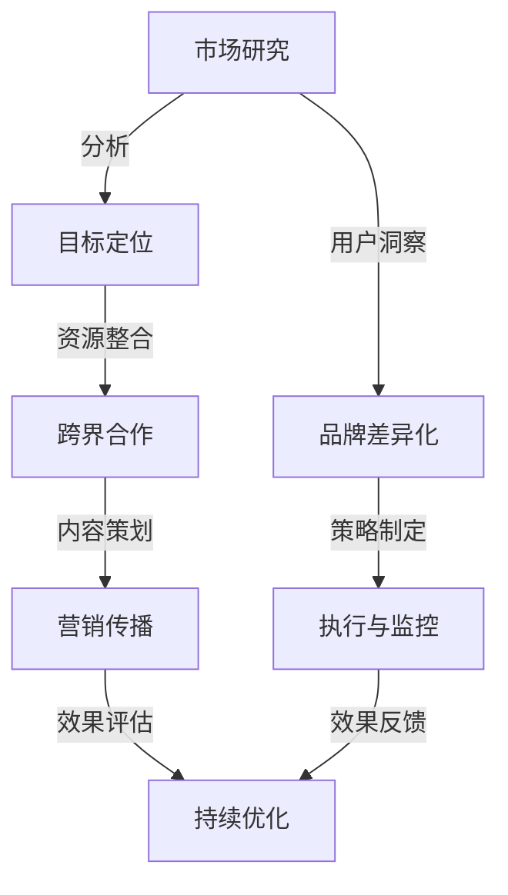
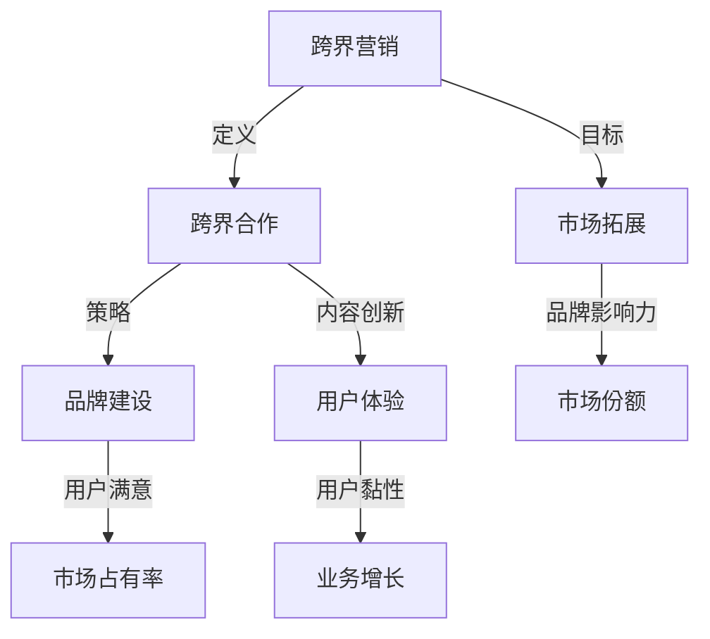
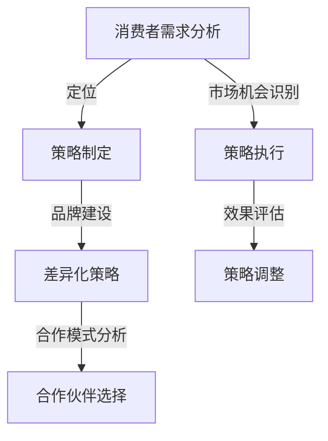
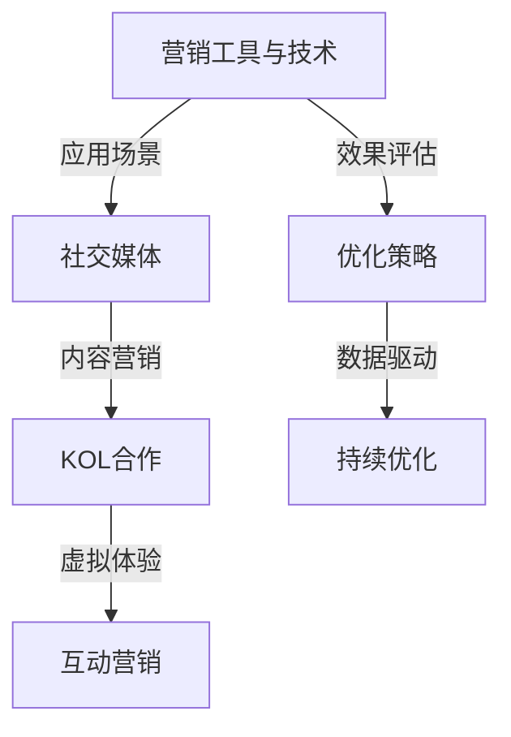

                 

## 概述与背景

### 第1章: 书籍主题概述与引言

#### 1.1 引言与背景

在当今社会，知识付费与体育健身行业蓬勃发展，二者逐渐成为人们日常生活中不可或缺的组成部分。知识付费，指的是用户为获取特定知识或技能而支付的费用，这一模式改变了传统的免费获取知识的模式，使得优质内容创作者能够通过自己的知识创造获得合理的回报。体育健身行业，则随着人们健康意识的提升，市场规模不断扩大，呈现出良好的增长态势。

然而，知识付费与体育健身行业在发展过程中也面临一定的挑战。知识付费行业需要不断吸引用户关注，提升用户满意度，而体育健身行业则需持续优化服务，满足消费者多样化的需求。在这种背景下，如何实现知识付费与体育健身的跨界营销，成为行业内热议的话题。

本书旨在探讨这一核心问题，通过理论与实践相结合的方式，为市场营销人员、健身行业从业者以及跨行业创业者提供实用的跨界营销策略和实战指南。具体而言，本书将分析跨界营销的概念、架构、策略，并结合实际案例进行深入剖析，帮助读者理解跨界营销的原理和操作方法。

本书的目标读者包括：

- 市场营销人员：希望通过跨界营销提升企业品牌影响力和市场份额
- 健身行业从业者：希望拓展业务范围，提高客户满意度和忠诚度
- 跨行业创业者：希望借助跨界营销实现商业模式的创新和突破

#### 1.2 书籍目标读者

本书的目标读者涵盖了对市场营销、体育健身、跨界合作有一定了解的人群。具体包括：

- 对市场营销感兴趣的读者：希望深入了解跨界营销的概念、策略和实践方法，以便在实际工作中运用
- 健身行业从业者：希望通过本书了解跨界营销如何应用于体育健身行业，提高业务发展和市场竞争力
- 跨行业创业者：希望了解知识付费与体育健身行业的跨界合作模式，探索新的商业机会和增长点

#### 1.3 书籍结构概述

本书从理论与实践两个角度出发，全面探讨知识付费与体育健身跨界营销的可行性、策略和案例。具体结构如下：

- **第1部分：概述与背景**：介绍知识付费与体育健身行业的现状、跨界营销的核心概念与架构。
- **第2部分：策略与方法**：分析跨界营销的消费者需求、品牌建设、合作模式等关键环节。
- **第3部分：案例分析**：精选成功的跨界营销案例，进行深入分析和启示总结。
- **第4部分：工具与方法**：介绍跨界营销的各类工具、创新方法以及营销效果评估与优化策略。
- **第5部分：实战指南**：提供跨界营销的实战操作步骤和案例分析，帮助读者实际应用。
- **第6部分：未来趋势**：探讨跨界营销的未来发展趋势以及如何持续优化营销效果。

通过本书的详细讲解，读者将能够系统了解跨界营销的原理和操作方法，为实际业务提供有力支持。

### 第2章: 知识付费与体育健身行业概述

#### 2.1 知识付费行业概况

知识付费行业的发展始于互联网时代的兴起，随着人们对于自我提升和知识获取需求的增加，这一模式逐渐崭露头角。从2016年开始，知识付费行业迎来了快速发展的阶段，各类在线教育平台、知识分享社区如雨后春笋般涌现。根据市场研究数据，2021年全球知识付费市场规模已经超过3000亿美元，预计未来几年将继续保持高速增长。

知识付费行业主要涵盖以下几类平台和产品：

1. **在线教育平台**：如 Coursera、Udemy、网易云课堂等，提供各种在线课程和知识培训。
2. **知识分享社区**：如知乎、分答、得到等，以问答和内容分享的形式，满足用户的知识需求。
3. **专业技能认证**：如 PMP、CFA 等认证考试，通过证书颁发来验证用户的技能水平。
4. **知识付费APP**：如喜马拉雅、得到APP、樊登读书会等，提供付费音频、电子书、视频课程等多种形式的知识内容。

#### 2.2 体育健身行业概述

体育健身行业随着人们生活水平的提高和健康意识的增强，正呈现出蓬勃发展的态势。根据国家统计局数据，2021年中国体育健身市场规模已达到1.6万亿元，预计未来几年将保持10%以上的年增长率。

体育健身行业主要分为以下几个细分市场：

1. **线下健身中心**：包括大型健身房、瑜伽馆、游泳馆等，提供面对面的健身指导和课程。
2. **线上健身平台**：如Keep、华为健康、小米运动等，通过手机应用提供健身课程、健身数据记录等在线服务。
3. **健身器材销售**：包括专业健身器材零售店、电商平台的健身器材销售。
4. **体育赛事与活动**：包括各类体育赛事的举办、体育活动的组织等。

#### 2.3 知识付费与体育健身行业的交叉点

知识付费与体育健身行业的交叉点主要体现在以下几个方面：

1. **消费者需求**：随着消费者对于健康和生活质量的追求，知识付费和体育健身两个行业都面临着巨大的市场需求。消费者希望通过获取专业知识和技能来提升自身的健康水平和生活质量。
2. **合作空间**：知识付费平台可以通过提供健身知识课程、健身指导等，与体育健身行业实现合作。同时，体育健身行业也可以通过与知识付费平台合作，提供在线健身课程、健身知识分享等，吸引更多消费者。
3. **潜在优势**：跨界合作能够实现资源共享、优势互补，提高用户满意度和品牌影响力。例如，知识付费平台可以通过与健身中心合作，推出会员福利，增强用户粘性；健身中心也可以通过提供专业健身知识，提升自身服务品质。

综上所述，知识付费与体育健身行业的跨界融合具有巨大的潜力和优势。通过深入分析这两个行业的现状、市场规模以及消费者需求，可以为跨界营销提供有力的理论支持。

#### 第3章: 跨界营销的核心概念与架构

##### 3.1 跨界营销的定义

跨界营销，是指企业或品牌利用不同行业之间的特点、资源和用户群体，通过合作、整合和创新，实现市场拓展、品牌提升和业务增长的一种营销策略。与传统营销相比，跨界营销不仅局限于同一行业内的竞争，而是跨越不同领域，寻找新的市场机会和合作伙伴。

##### 跨界营销与传统营销的比较

传统营销主要依托于自身产品和市场，通过广告、促销、渠道等手段来吸引和留住客户。其特点在于：

- **目标明确**：针对特定的目标市场和客户群体。
- **策略简单**：通常采用较为单一的营销手段，如广告投放、促销活动等。
- **效果可控**：通过市场调研和数据分析，可以较为准确地评估营销效果。

而跨界营销则具有以下特点：

- **创新性强**：通过跨行业的合作和整合，创造出全新的产品、服务或营销方式。
- **资源丰富**：借助不同行业的资源和优势，实现资源共享和互利共赢。
- **风险较高**：涉及不同行业和领域的合作，需要应对更多的挑战和不确定性。
- **市场潜力大**：能够突破行业壁垒，开拓新的市场和用户群体。

##### 跨界营销的架构

跨界营销的架构主要包括以下几个核心组成部分：

1. **市场研究**：通过对目标市场和消费者需求的分析，确定跨界营销的目标和方向。市场研究包括行业分析、竞争对手分析、消费者行为分析等，旨在找到跨界合作的契机和切入点。

2. **目标定位**：根据市场研究的结果，明确跨界营销的目标市场和目标客户，为后续的营销策略制定提供依据。目标定位包括品牌差异化、产品定位、市场细分等，以确保跨界营销能够精准触达目标用户。

3. **资源整合**：跨界营销需要整合不同行业之间的资源和优势，形成协同效应。资源整合包括资金、技术、人才、渠道等，通过合作、并购或联盟等方式，实现资源共享和互利共赢。

4. **内容策划**：内容策划是跨界营销的核心环节，包括创意策划、内容创作、传播渠道等。内容策划要具有创新性和吸引力，能够引起目标用户的关注和共鸣。

5. **营销传播**：通过多种传播手段，将跨界营销的内容和品牌信息传递给目标用户。营销传播包括广告、公关、社交媒体、线下活动等，通过多维度的传播方式，提升品牌知名度和用户参与度。

6. **效果评估**：对跨界营销的执行效果进行评估，包括数据分析和用户反馈等。效果评估有助于发现营销过程中的问题和不足，为持续优化提供依据。

##### 跨界营销的目标与策略

跨界营销的目标主要包括市场拓展、品牌提升、业务增长和用户粘性等。为实现这些目标，需要制定相应的策略：

1. **市场拓展策略**：通过跨界合作，开拓新的市场和用户群体。例如，知识付费平台可以与健身中心合作，提供健身知识课程，吸引健身爱好者。
2. **品牌提升策略**：通过跨界合作，提升品牌的影响力和知名度。例如，知名运动品牌可以通过与时尚品牌合作，推出联名产品，吸引更多年轻消费者。
3. **业务增长策略**：通过跨界合作，实现业务的多元化发展。例如，健身中心可以通过与医疗健康机构合作，提供健康管理服务，扩大业务范围。
4. **用户粘性策略**：通过跨界营销，增强用户对品牌的忠诚度和粘性。例如，健身中心可以通过与健身房会员合作，提供专属的健身课程和会员福利，提升用户满意度。

综上所述，跨界营销是一种具有创新性和复杂性的营销策略，通过跨行业的合作与整合，实现市场拓展、品牌提升和业务增长。理解跨界营销的定义、架构和目标策略，对于企业或品牌在跨界营销中取得成功至关重要。

#### Mermaid 流程图：跨界营销架构

此流程图展示了跨界营销的各个关键环节及其相互关系，从市场研究开始，通过目标定位、资源整合、内容策划、营销传播，最终进行效果评估和持续优化，形成了一个闭环系统。

#### 核心概念联系图

此联系图展示了跨界营销的核心概念及其相互之间的联系。跨界营销通过跨界合作、内容创新和品牌建设等策略，实现市场拓展、提升品牌影响力和用户满意度，进而提高市场占有率和业务增长。

### 第4章: 知识付费与体育健身跨界营销策略

#### 4.1 消费者需求分析与定位

在跨界营销中，准确分析消费者的需求并明确目标定位是成功的关键。对于知识付费与体育健身行业的跨界，我们需要深入探讨目标消费者的具体需求，并根据这些需求制定相应的营销策略。

##### 消费者需求分析

1. **健康意识提升**：随着生活水平的提高，越来越多的人开始重视健康，希望通过专业知识和技能提升自身的健康状况。这部分消费者对于健身知识、营养指导、健康监测等方面的内容有较高的需求。
2. **便捷性需求**：现代生活节奏快，许多人希望能够通过便捷的方式获取健身知识和指导。线上健身课程、健身APP等成为满足这一需求的重要途径。
3. **个性化需求**：每个人对于健身和健康的需求各不相同，因此，个性化、定制化的健身计划和知识付费产品更受欢迎。这要求提供者能够根据用户的具体情况，提供个性化的解决方案。
4. **社交互动**：人们在追求健康的同时，也希望与他人进行互动和交流，以增强健身的动力和乐趣。社交化的健身平台和社区成为满足这一需求的重要载体。

##### 目标定位

1. **健康知识普及**：针对有健康意识但缺乏专业知识的消费者，提供系统的健康知识课程，如营养学、运动生理学等，帮助他们建立正确的健康观念。
2. **线上健身指导**：为忙碌的现代人提供线上健身指导服务，包括直播课程、录播教程等，使消费者能够随时随地获得专业的健身指导。
3. **个性化健康管理**：通过数据分析，为用户提供个性化的健康管理方案，包括健身计划、饮食指导、健康监测等，帮助用户实现健康目标。
4. **社交互动**：打造社交化的健身平台，鼓励用户分享健身心得、交流健身经验，增强用户的参与感和归属感。

##### 针对不同需求的跨界营销策略

1. **健康知识普及**：
   - **合作对象**：医疗机构、健康品牌、营养师等。
   - **合作方式**：共同开发健康知识课程，通过知识付费平台进行推广。
   - **营销策略**：利用社交媒体和线上渠道进行宣传，开展健康知识讲座和活动，提高品牌知名度。

2. **线上健身指导**：
   - **合作对象**：健身教练、健身中心、运动品牌等。
   - **合作方式**：与健身教练合作，提供线上直播课程和录播教程；与健身中心合作，提供会员专属线上课程。
   - **营销策略**：通过健身APP和社交媒体进行推广，举办线上健身挑战赛，提高用户参与度。

3. **个性化健康管理**：
   - **合作对象**：健康管理公司、智能可穿戴设备厂商等。
   - **合作方式**：结合智能可穿戴设备，为用户提供个性化健康管理服务。
   - **营销策略**：利用大数据和人工智能技术，提供精准的健康数据分析和建议，通过个性化推送和会员福利，提高用户粘性。

4. **社交互动**：
   - **合作对象**：健身社区、社交媒体平台等。
   - **合作方式**：与健身社区和社交媒体平台合作，创建健身社群和活动，促进用户互动和交流。
   - **营销策略**：通过线上活动和线下活动相结合，鼓励用户分享健身成果，建立品牌社区，增强用户忠诚度。

通过以上策略，知识付费与体育健身行业的跨界营销能够更好地满足消费者的需求，提高用户满意度和品牌影响力。

#### 4.2 品牌建设与差异化

在跨界营销中，品牌建设与差异化策略至关重要。品牌建设不仅有助于提升品牌知名度和美誉度，还能增强用户对品牌的认知和忠诚度。对于知识付费与体育健身行业的跨界营销，有效的品牌建设和差异化策略可以确保品牌在竞争激烈的市场中脱颖而出。

##### 品牌建设

1. **品牌定位**：明确品牌的核心价值和目标受众，为品牌建设奠定基础。知识付费与体育健身行业的跨界品牌应强调健康、专业、便捷等核心价值，以满足消费者对健康和便捷的需求。

2. **品牌形象**：通过视觉设计、广告语、公关活动等手段，打造独特的品牌形象。品牌形象应与品牌定位相一致，传递出专业、可靠和具有吸引力的品牌形象。

3. **品牌传播**：利用多种传播渠道，如社交媒体、线上广告、线下活动等，加强品牌传播。特别是通过社交媒体，可以更快速、直接地触达目标用户，提高品牌曝光度。

4. **品牌合作**：与其他知名品牌或机构合作，通过跨界合作提升品牌知名度和影响力。例如，与知名健身品牌合作，推出联名健身课程或产品，吸引更多消费者关注。

##### 差异化策略

1. **内容差异化**：提供独特、有价值的内容，是品牌差异化的重要手段。知识付费与体育健身行业的跨界品牌应通过专业内容、个性化服务、创新形式等方式，确保内容的独特性和价值性。

2. **服务差异化**：提供卓越的客户服务，增强用户对品牌的满意度和忠诚度。服务差异化包括快速响应用户需求、提供定制化服务、建立用户社区等。

3. **渠道差异化**：通过多样化的渠道，拓宽品牌覆盖面。例如，除了在线课程和健身APP，还可以开设线下体验店、合作健身中心等，提供多渠道的服务。

4. **技术创新**：利用先进的技术手段，提升用户体验和品牌竞争力。例如，通过大数据分析、人工智能技术等，提供个性化的健身计划和健康指导。

##### 实例分析

1. **健身知识付费平台与健身中心合作**：某健身知识付费平台与多家知名健身中心合作，推出线上健身指导课程。这些课程由健身中心的资深教练授课，结合线上互动和线下实践，提供了独特且有价值的内容。同时，通过合作健身中心的线下支持，确保用户能够得到专业的健身指导和实践机会。

2. **个性化健康管理服务**：某健康管理公司通过大数据分析和人工智能技术，为用户提供个性化的健康管理方案。用户可以通过智能可穿戴设备记录健康数据，系统会根据数据为用户制定个性化的健身计划和饮食指导。这种个性化服务不仅提高了用户满意度，还增强了用户对品牌的忠诚度。

3. **社交化健身社区**：某健身APP通过创建社交化健身社区，鼓励用户分享健身心得、交流健身经验。用户可以在社区中参与各种线上活动和挑战，与其他健身爱好者互动。这种社交化的体验不仅增加了用户的参与感，还提升了品牌的用户粘性。

通过品牌建设与差异化策略，知识付费与体育健身行业的跨界品牌能够更好地吸引和留住用户，提升品牌影响力和市场竞争力。

#### 4.3 合作模式与伙伴选择

在跨界营销中，合作模式与伙伴选择是确保跨界营销成功的关键因素。合适的合作模式可以充分发挥各方的优势，实现资源共享、市场拓展和业务增长。以下是几种常见的合作模式及其选择方法：

##### 常见的合作模式

1. **战略合作**：双方在长期合作的基础上，共同制定战略目标和行动计划，实现优势互补、资源共享和互利共赢。这种模式通常适用于品牌知名度较高、资源丰富的企业。
2. **联合推广**：双方在特定的营销活动或产品推广中合作，共同投入资源，共同分享成果。这种模式适用于短期合作，快速提升品牌知名度和市场份额。
3. **渠道合作**：双方在销售渠道上合作，如线上平台与线下门店的合作，实现产品的广泛覆盖。这种模式适用于需要拓宽销售渠道的企业。
4. **内容合作**：双方在内容创作和分享上合作，共同开发课程、活动、内容等，提高用户粘性和品牌影响力。这种模式适用于知识付费和内容平台。
5. **技术合作**：双方在技术研发和应用上合作，共同开发新技术或产品，提升核心竞争力。这种模式适用于技术驱动型企业。

##### 选择合适合作伙伴的方法

1. **目标一致性**：选择与自身战略目标和价值观一致的合作伙伴，确保双方在长期合作中能够保持一致的目标和方向。
2. **资源互补**：选择能够提供互补资源和优势的合作伙伴，实现资源共享和优势互补。例如，知识付费平台可以与健身中心合作，实现课程和场馆的互补。
3. **品牌契合度**：选择与自身品牌形象和品牌理念契合的合作伙伴，确保品牌形象的一致性和品牌的提升效果。
4. **合作历史**：考察合作伙伴的合作历史和口碑，选择有良好合作记录和声誉的伙伴，降低合作风险。
5. **市场机会**：选择能够共同挖掘和开拓市场机会的合作伙伴，实现市场拓展和业务增长。

##### 实例分析

1. **健身知识付费平台与健身中心合作**：某知名健身知识付费平台与多家高端健身中心合作，推出会员专属健身课程和福利。通过这种合作，平台提供了高质量的健康知识课程，健身中心则增加了会员的增值服务，实现了双赢。

2. **在线教育平台与健身APP合作**：某在线教育平台与某健身APP合作，共同推出健康课程。教育平台提供了丰富的专业健康知识，健身APP则提供了方便的健身课程和指导，用户可以在平台上获得全方位的健康指导。

3. **健康食品品牌与健身房合作**：某健康食品品牌与某健身房合作，在健身房内设立健康食品销售专区，提供营养健康的食品。通过这种合作，健身房为会员提供了更好的营养解决方案，品牌则增加了销售渠道。

通过科学选择合作模式和合作伙伴，知识付费与体育健身行业的跨界营销能够更有效地实现资源共享、市场拓展和业务增长。

#### Mermaid 流程图：跨界营销策略制定

此流程图展示了跨界营销策略制定的步骤和关键环节，从消费者需求分析、市场机会识别到策略制定、品牌建设、差异化策略、合作模式分析、合作伙伴选择，最终通过效果评估和策略调整，形成了一个闭环系统。

### 第5章: 跨界营销案例分析

#### 5.1 案例介绍

在本章节中，我们将精选几个成功的跨界营销案例，详细描述这些案例的背景、实施过程、关键成功因素以及不足之处，从而为读者提供实际的借鉴和启示。

##### 案例一：腾讯音乐与华晨宇音乐健身联名合作

腾讯音乐与华晨宇进行跨界合作，推出“音乐健身挑战”活动。华晨宇作为音乐界的人气明星，拥有大量的粉丝群体。腾讯音乐则利用其平台优势，将音乐与健身相结合，吸引粉丝参与。

- **背景**：随着健康意识的提升，越来越多的人开始重视健身。腾讯音乐和华晨宇希望通过跨界合作，吸引年轻群体，提升品牌影响力。
- **实施过程**：双方共同策划了多个音乐健身挑战活动，通过线上直播和短视频的形式，鼓励用户跟随华晨宇的音乐进行健身。华晨宇还在平台上发布了专属的健身歌单，激励用户在运动中享受音乐带来的乐趣。
- **关键成功因素**：内容创新、品牌影响力、粉丝互动。通过音乐和健身的结合，创造了一个全新的用户体验，吸引了大量用户参与。
- **不足之处**：活动期间，由于用户参与度较高，平台出现了服务器过载的情况，影响了用户体验。

##### 案例二：可口可乐与马拉松赛事合作

可口可乐与多个马拉松赛事合作，推出“可口可乐跑者计划”，为参赛者提供饮料补给和运动装备。这一合作不仅提升了品牌在健康领域的形象，还增加了品牌的用户粘性。

- **背景**：随着马拉松赛事的普及，越来越多的人参与其中。可口可乐希望通过与赛事合作，提升品牌在健康生活方式中的地位。
- **实施过程**：可口可乐在赛事现场设立补给站，为参赛者提供免费饮料和运动装备。此外，还推出了专属的跑者纪念版产品，吸引消费者购买。
- **关键成功因素**：赛事资源、品牌形象、用户互动。通过与赛事的紧密合作，可口可乐成功地将品牌与健康生活方式联系起来，增强了用户对品牌的认同感。
- **不足之处**：由于赛事规模较大，补给站的设置和运营需要大量的人力和物力投入，成本较高。

##### 案例三：Keep与优家美宅合作

Keep与家居品牌优家美宅合作，推出“健康家居”系列课程。通过这种合作，Keep将健身知识带入家庭场景，优家美宅则通过课程推广家居产品。

- **背景**：随着人们对健康家居的需求增加，Keep和优家美宅希望通过跨界合作，开拓新的市场空间。
- **实施过程**：双方共同开发了系列健身课程，用户可以在家中通过KeepAPP进行学习。优家美宅则提供相应的家居产品，如健身器材、瑜伽垫等，为用户提供完整的健身解决方案。
- **关键成功因素**：产品整合、用户体验、品牌联动。通过将健身与家居产品相结合，提供了独特的用户体验，提升了用户满意度。
- **不足之处**：由于家居产品的销售与健身课程的推广结合，需要更精细的用户数据分析和运营策略，以确保用户需求的准确匹配。

##### 案例四：麦当劳与Keep合作

麦当劳与Keep合作，推出“Keep步数换麦当劳优惠券”活动。通过这种合作，麦当劳成功地将健康生活方式与快消品牌形象相结合，吸引年轻消费者。

- **背景**：随着健康理念的普及，麦当劳希望通过跨界合作，改善品牌形象，吸引更多年轻消费者。
- **实施过程**：用户通过KeepAPP记录步数，累积到一定步数后，可以兑换麦当劳优惠券。这一活动不仅提升了用户的运动积极性，还增加了麦当劳的销售额。
- **关键成功因素**：互动性强、用户参与度高。通过简单的步数兑换机制，激发了用户的参与热情，提升了品牌互动性。
- **不足之处**：活动期间，由于用户参与度较高，服务器出现了拥堵情况，影响了用户的使用体验。

通过以上案例分析，我们可以看到跨界营销在不同场景中的成功经验和不足之处。理解这些案例，可以为后续的跨界营销实践提供宝贵的借鉴和启示。

#### 5.2 案例分析

在上一节中，我们介绍了四个成功的跨界营销案例，接下来我们将对每个案例进行深入分析，探讨其成功因素和不足之处，并总结其中的关键经验和教训。

##### 案例一：腾讯音乐与华晨宇音乐健身联名合作

**成功因素**：
1. **内容创新**：通过音乐与健身的结合，创造了独特的用户体验，激发了用户的参与热情。
2. **品牌影响力**：华晨宇作为知名音乐人，拥有庞大的粉丝群体，通过明星效应提升了品牌知名度。
3. **粉丝互动**：通过线上直播和短视频，促进了粉丝与品牌的互动，增强了用户粘性。

**不足之处**：
1. **服务器过载**：由于用户参与度较高，平台在活动期间出现了服务器过载的情况，影响了用户体验。
2. **活动宣传**：尽管内容创新和品牌影响力较强，但活动宣传力度不足，未能充分触达潜在用户。

**关键经验和教训**：
- 在策划跨界营销活动时，要充分考虑技术支持的稳定性，避免因服务器过载导致用户流失。
- 加强活动的宣传力度，通过多渠道推广，提高活动知名度和用户参与度。

##### 案例二：可口可乐与马拉松赛事合作

**成功因素**：
1. **赛事资源**：通过与多个马拉松赛事合作，可口可乐成功地将品牌与健康生活方式联系起来，提升了品牌形象。
2. **品牌形象**：可口可乐长期以来注重健康形象，与马拉松赛事的合作进一步强化了这一形象。
3. **用户互动**：通过提供饮料补给和运动装备，提升了用户的参与感和体验。

**不足之处**：
1. **运营成本**：由于赛事规模较大，补给站和运营成本较高，对企业的财务压力较大。
2. **用户需求**：部分用户对补给品种类和数量有更高要求，但活动未能充分满足这些需求。

**关键经验和教训**：
- 在大型合作活动中，要充分考虑成本控制和用户需求，确保活动的可持续性和用户满意度。
- 加强与赛事主办方和用户的沟通，及时调整活动内容和运营策略，以更好地满足用户需求。

##### 案例三：Keep与优家美宅合作

**成功因素**：
1. **产品整合**：通过将健身知识与家居产品相结合，提供了完整的健身解决方案，提升了用户体验。
2. **用户体验**：通过在家居环境中进行健身，为用户创造了便捷和舒适的体验。
3. **品牌联动**：Keep和优家美宅的品牌联动，增强了用户对两个品牌的认同感。

**不足之处**：
1. **数据分析**：由于家居产品和健身课程的结合，需要更精细的用户数据分析和运营策略。
2. **市场推广**：活动的市场推广力度不足，未能充分吸引潜在用户。

**关键经验和教训**：
- 在跨界合作中，要充分利用数据分析，准确把握用户需求，优化产品和运营策略。
- 加强市场推广，通过多种渠道提升活动知名度和用户参与度。

##### 案例四：麦当劳与Keep合作

**成功因素**：
1. **互动性强**：通过简单的步数兑换机制，激发了用户的参与热情，提升了品牌互动性。
2. **用户参与度**：用户可以通过日常运动换取优惠券，增加了运动的动力和趣味性。
3. **品牌形象**：通过跨界合作，麦当劳成功地将健康生活方式与快消品牌形象相结合，吸引了年轻消费者。

**不足之处**：
1. **服务器拥堵**：活动期间，由于用户参与度较高，服务器出现了拥堵情况，影响了用户体验。
2. **营销策略**：营销策略较为单一，未能充分挖掘活动的潜力。

**关键经验和教训**：
- 在高参与度的活动中，要确保技术支持的稳定性，避免因服务器拥堵影响用户使用体验。
- 在营销策略上，要多元化，通过多种方式提升用户参与度和品牌认知。

通过以上案例分析，我们可以看到，跨界营销在不同场景中的成功经验和不足之处。理解这些案例，可以为后续的跨界营销实践提供宝贵的借鉴和启示。

#### 5.3 启示与借鉴

通过对以上跨界营销案例的深入分析，我们可以得出一些有益的启示和借鉴，为知识付费与体育健身行业的跨界营销提供指导。

**1. 内容创新是关键**：无论是音乐与健身的结合，还是健身与家居产品的整合，成功的跨界营销案例都离不开内容创新。在知识付费与体育健身跨界中，可以探索将专业健身知识、健康生活方式与娱乐、社交元素相结合，创造独特的用户体验。

**2. 明星效应与品牌联动**：明星效应和品牌联动在跨界营销中具有显著的优势。例如，腾讯音乐与华晨宇合作，通过明星效应提升了品牌知名度。因此，在知识付费与体育健身跨界中，可以借助明星或知名品牌的影响力，扩大市场覆盖面，提升用户参与度。

**3. 用户需求分析与精准定位**：成功的跨界营销案例都充分了解了目标用户的需求，并进行了精准定位。例如，可口可乐与马拉松赛事的合作，满足了参赛者对饮料补给的需求。在知识付费与体育健身跨界中，要深入了解消费者的健康需求、健身习惯和消费偏好，制定精准的营销策略。

**4. 技术支持与运营管理**：技术支持和运营管理是跨界营销成功的重要保障。案例中，由于服务器过载等原因导致的问题，影响了用户体验。在实施跨界营销时，要充分考虑技术支持的稳定性，确保平台能够顺畅运行，避免影响用户参与度。

**5. 持续优化与数据驱动**：跨界营销并非一蹴而就，需要持续优化和改进。通过数据分析，可以了解用户的参与行为和反馈，及时调整营销策略和运营方案。例如，麦当劳与Keep合作的步数兑换活动，通过数据驱动，不断优化活动机制，提升了用户满意度和参与度。

**6. 多元化营销策略**：单一的营销策略难以满足多样化的市场需求。通过多渠道、多形式的营销策略，可以更广泛地触达目标用户。例如，Keep与优家美宅合作，通过线上课程和线下体验等多种形式，提供了全面的健身解决方案。

总之，跨界营销的成功离不开内容创新、明星效应、用户需求分析、技术支持、持续优化和多元化营销策略。通过借鉴这些成功经验，知识付费与体育健身行业的跨界营销将能够更好地满足消费者需求，提升品牌影响力和市场竞争力。

#### 第6章: 跨界营销工具与方法

在跨界营销中，选择合适的工具和方法是成功的关键。以下将介绍几种常见的跨界营销工具和方法，包括社交媒体、内容营销、KOL合作以及虚拟体验等，并提供实际案例，以帮助读者更好地理解和应用这些方法。

##### 6.1 营销工具与技术

1. **社交媒体**：社交媒体是跨界营销的重要工具之一，可以快速触达大量目标用户。常见的社交媒体平台包括微信、微博、抖音、快手等。通过这些平台，企业可以发布内容、开展互动活动、推广品牌，并与用户建立深层次的连接。

   **案例**：某知名运动品牌与抖音合作，推出“抖音挑战赛”，鼓励用户上传健身短视频。通过这种互动形式，品牌成功吸引了大量年轻用户的关注，提升了品牌知名度和用户参与度。

2. **内容营销**：内容营销是通过创造和分享有价值的内容，吸引和留住目标用户的一种策略。内容形式包括文章、视频、图片、音频等。内容营销的核心在于为用户提供有价值的信息，从而建立品牌信任和忠诚度。

   **案例**：某健康知识付费平台通过发布高质量的健康知识文章和视频，吸引了大量关注。这些内容不仅帮助用户获取健康知识，还增强了用户对品牌的认同感和信任感。

3. **KOL合作**：KOL（Key Opinion Leader）合作是指企业与有影响力的意见领袖合作，通过其影响力推广产品或服务。KOL可以是健身达人、营养师、健康博主等，他们在各自领域拥有大量粉丝，具有强大的号召力和传播力。

   **案例**：某健康食品品牌与知名营养师合作，推出系列健康饮食课程。通过营养师的推荐和分享，品牌成功吸引了大量关注，提升了产品的市场认知度和销售量。

4. **虚拟体验**：随着虚拟现实（VR）和增强现实（AR）技术的发展，虚拟体验成为跨界营销的一种新形式。通过虚拟体验，企业可以为用户提供身临其境的互动体验，增强用户的参与感和体验感。

   **案例**：某健身APP推出虚拟健身场景，用户可以通过VR设备进行沉浸式健身。这种虚拟体验不仅提高了用户的健身积极性，还增强了用户对品牌的忠诚度。

##### 6.2 营销方法与创新

1. **互动营销**：互动营销是通过与用户互动，激发用户参与和分享的一种策略。通过线上活动、问答互动、投票等形式，企业可以与用户建立深层次的互动关系，提升用户满意度和品牌认知度。

   **案例**：某健康知识付费平台举办线上健康知识竞赛，用户通过答题参与活动，并有机会获得奖品。这种互动形式不仅提高了用户对健康知识的兴趣，还增强了用户对品牌的认同感。

2. **跨界合作**：跨界合作是指企业与不同行业的企业合作，共同推广产品或服务的一种策略。通过跨界合作，企业可以拓展市场渠道，吸引更多潜在用户。

   **案例**：某运动品牌与时尚品牌合作，推出联名款运动鞋。这种跨界合作不仅吸引了运动爱好者，还吸引了时尚爱好者，扩大了品牌的用户群体。

3. **数据驱动营销**：数据驱动营销是指通过数据分析和挖掘，制定和优化营销策略的一种方法。通过收集和分析用户数据，企业可以更准确地了解用户需求，制定个性化的营销策略。

   **案例**：某健身APP通过数据分析，为用户提供个性化的健身建议和计划。这种数据驱动的营销方法不仅提高了用户满意度，还增强了用户对品牌的忠诚度。

4. **个性化营销**：个性化营销是通过了解用户的个性化需求，提供定制化的产品和服务的一种策略。通过个性化营销，企业可以提升用户的购买体验和满意度。

   **案例**：某健康食品品牌通过用户数据分析，为用户提供个性化的营养方案。这种个性化营销方法不仅提高了用户的购买意愿，还增强了用户对品牌的忠诚度。

##### 6.3 营销效果评估与优化

1. **效果评估**：效果评估是通过监测和分析营销活动的效果，了解营销目标实现程度的一种方法。通过效果评估，企业可以了解营销活动的成功因素和不足之处，为后续优化提供依据。

   **案例**：某健康知识付费平台通过监测用户注册量、课程完成率等指标，评估线上健康知识课程的推广效果。这种效果评估方法有助于企业了解用户需求，优化课程内容和推广策略。

2. **优化策略**：优化策略是通过分析效果评估结果，对营销策略进行调整和优化的一种方法。通过不断优化，企业可以提高营销活动的效果，提升用户满意度和品牌影响力。

   **案例**：某健身APP通过分析用户反馈和活动数据，优化健身课程内容和推广方式。例如，根据用户反馈，增加瑜伽课程；根据活动数据，优化课程推荐算法，提高用户参与度。

综上所述，跨界营销工具和方法的多样化，为企业在跨界营销中提供了丰富的选择。通过合理运用这些工具和方法，企业可以更好地实现跨界营销目标，提升品牌影响力和市场竞争力。

#### Mermaid 流程图：跨界营销工具与方法

此流程图展示了跨界营销的工具与方法及其相互关系。从营销工具与技术的应用场景，到效果评估、优化策略，形成了一个完整的跨界营销流程，帮助企业在实际操作中更有效地实现营销目标。

### 第7章: 实战指南与操作步骤

#### 7.1 实战准备

在进行知识付费与体育健身跨界营销的实战操作之前，充分的准备是至关重要的。以下是从资源整合、市场调研到营销工具选择的关键步骤，确保跨界营销的顺利进行。

##### 1. 资源整合

资源整合是跨界营销成功的基础。企业需要明确自身的优势和短板，寻找合适的合作伙伴，共同发挥各自的优势。

- **内部资源**：包括企业现有的技术能力、内容创作能力、市场营销团队等。企业需要评估内部资源的利用效率，确保能够在跨界营销中发挥最大价值。
- **外部资源**：寻找具有互补性的合作伙伴，如健身中心、健康管理公司、知名KOL等。通过合作，可以实现资源共享和优势互补，提升整体营销效果。

##### 2. 市场调研

市场调研是了解目标市场和用户需求的重要环节。通过系统化的市场调研，企业可以获取以下关键信息：

- **目标市场**：确定目标市场的规模、增长趋势和竞争态势。通过分析市场规模和增长速度，企业可以评估跨界营销的潜在机会。
- **用户需求**：了解目标用户的需求、偏好和购买行为。通过用户调研，企业可以制定更具针对性的营销策略，满足用户需求。

##### 3. 营销工具选择

选择合适的营销工具是确保跨界营销成功的关键。以下是一些常用的营销工具：

- **社交媒体平台**：如微信、微博、抖音等，通过这些平台，企业可以快速触达大量目标用户。
- **内容创作工具**：如视频剪辑软件、图像处理软件等，这些工具可以帮助企业创作出高质量的内容，提升用户体验。
- **数据分析工具**：如Google Analytics、SQL等，通过数据分析工具，企业可以追踪营销效果，优化营销策略。

##### 4. 制定跨界营销策略

在整合资源和完成市场调研后，企业需要制定具体的跨界营销策略。以下是一些关键步骤：

- **确定跨界方向**：根据市场调研结果，明确跨界营销的具体方向，如健康知识普及、线上健身指导、个性化健康管理、社交互动等。
- **选择合作伙伴**：根据跨界方向，选择合适的合作伙伴，签订合作协议，确保各方在跨界营销中的角色和责任明确。
- **制定营销计划**：制定详细的营销计划，包括时间表、预算、执行步骤等。确保营销计划的可行性和可操作性。

##### 5. 策略实施与监控

在策略实施过程中，企业需要实时监控营销效果，及时调整策略，以确保跨界营销目标的实现。

- **效果监控**：通过数据分析和用户反馈，了解营销活动的实际效果，如用户参与度、转化率等。
- **策略调整**：根据效果监控结果，对营销策略进行优化和调整，提高营销效果。
- **用户反馈**：积极收集用户反馈，了解用户对跨界营销活动的真实感受，为后续优化提供参考。

通过以上步骤，企业可以有效地进行知识付费与体育健身跨界营销的实战操作，实现营销目标。

#### 7.2 实操步骤

在跨界营销的实际操作中，详细规划和执行每一步骤是确保营销活动顺利进行的关键。以下将从市场调研、策略制定、执行监控等角度，详细说明跨界营销的实操步骤。

##### 1. 市场调研

市场调研是跨界营销成功的基础，通过全面的市场分析，企业可以了解目标市场的情况，为后续策略制定提供依据。以下是市场调研的实操步骤：

- **确定调研目标**：明确调研的核心目标，如了解目标市场的规模、增长趋势、竞争态势等。
- **收集数据**：通过在线问卷、电话访谈、社交媒体数据分析等方式，收集相关市场数据。例如，可以通过社交媒体平台分析用户的健身习惯和偏好。
- **数据分析**：对收集到的数据进行分析，挖掘目标市场的特点和潜在需求。通过数据可视化工具，如Excel、Tableau等，呈现分析结果。
- **撰写报告**：根据数据分析结果，撰写市场调研报告，为后续策略制定提供参考。

##### 2. 策略制定

在完成市场调研后，企业需要根据调研结果制定具体的跨界营销策略。以下是策略制定的实操步骤：

- **确定跨界方向**：根据市场调研结果，确定跨界营销的具体方向，如健康知识普及、线上健身指导、个性化健康管理、社交互动等。
- **选择合作伙伴**：根据跨界方向，选择合适的合作伙伴。例如，可以与知名健身教练、健康管理公司、运动品牌等建立合作关系。
- **制定营销目标**：明确营销目标，如提高品牌知名度、增加用户参与度、提升销售业绩等。
- **制定营销计划**：制定详细的营销计划，包括时间表、预算、执行步骤等。确保营销计划的可行性和可操作性。

##### 3. 执行监控

在策略制定完成后，企业需要按照营销计划进行执行，并实时监控营销效果，及时调整策略。以下是执行监控的实操步骤：

- **执行营销活动**：按照营销计划，执行各项营销活动。例如，通过社交媒体平台发布内容、举办线上活动、与合作伙伴合作推广等。
- **效果监控**：通过数据分析工具，如Google Analytics、SQL等，实时监控营销活动的效果，如用户参与度、转化率、销售额等。
- **用户反馈**：积极收集用户反馈，了解用户对跨界营销活动的真实感受。例如，可以通过在线调查、社交媒体互动等方式收集用户意见。
- **策略调整**：根据效果监控和用户反馈，对营销策略进行优化和调整。例如，可以增加用户喜欢的活动内容，减少不受欢迎的内容。

##### 4. 案例实践

为了更好地理解跨界营销的实操步骤，以下是一个完整的跨界营销案例实践：

- **案例背景**：一家知识付费平台与一家知名健身中心合作，推出线上健身指导课程。
- **市场调研**：通过社交媒体数据分析，发现目标用户对健身指导的需求较高，但对传统健身房的费用和便捷性有所顾虑。
- **策略制定**：决定推出线上健身指导课程，与健身中心合作，提供高质量的视频教程和实时互动指导。目标是将线上课程打造成便捷、实惠的健身解决方案。
- **执行监控**：在社交媒体平台发布宣传内容，与健身中心合作推广，实时监控用户参与度和转化率。
- **效果评估**：通过数据分析，发现用户对线上健身指导课程的参与度和满意度较高，但课程内容的多样性有待提升。
- **策略调整**：增加健身课程种类，引入更多健身教练，提供个性化健身方案，以提升用户满意度和参与度。

通过以上案例，我们可以看到跨界营销的实操步骤如何具体实施，以及如何根据效果进行策略调整。

#### 7.3 案例实践

为了更好地展示跨界营销的实操步骤，我们选择了一个实际案例进行详细说明。该案例涉及一家知名的知识付费平台与一家大型健身中心合作，推出线上健身指导课程。

##### 案例背景

某知名知识付费平台专注于提供各种专业领域的在线课程，包括职业技能提升、健康与健身等。该平台拥有大量的用户，且用户对健康和健身类课程的需求较高。同时，某大型健身中心在国内拥有广泛的用户基础和良好的口碑。为了进一步扩大市场影响力，提高用户参与度和满意度，双方决定合作推出线上健身指导课程。

##### 市场调研

在合作初期，双方进行了详细的市场调研：

- **用户需求分析**：通过在线问卷调查和用户数据分析，发现用户对健身指导的需求主要集中在以下几个方面：便捷性、个性化、高质量的教程和专业的教练团队。
- **竞争对手分析**：调研了市场上其他同类产品，发现主要竞争对手在课程内容、用户体验和价格方面存在一定的差距。
- **合作潜力分析**：双方在资源、用户基础和市场影响力上具有互补性，合作具有较大的潜力。

##### 策略制定

基于市场调研结果，双方制定了以下策略：

- **合作模式**：确定由健身中心提供专业的健身教练和课程内容，知识付费平台负责课程推广、用户管理和营销活动。
- **目标定位**：明确目标用户为对健身有需求但时间不充裕的都市人群，以及希望提升自身健康水平的白领。
- **营销计划**：制定详细的营销计划，包括课程上线时间、推广渠道、用户优惠活动等。

##### 执行计划

在策略制定完成后，双方开始执行以下计划：

- **课程内容开发**：健身中心负责开发高质量的健身课程，包括瑜伽、普拉提、有氧运动等，同时提供个性化健身方案。
- **平台建设**：知识付费平台负责搭建线上课程平台，确保用户可以方便地注册、购买和观看课程。
- **营销推广**：通过社交媒体、电子邮件、合作伙伴渠道等多渠道进行推广，吸引潜在用户。
- **用户互动**：定期举办线上健身挑战赛和互动活动，提高用户参与度。

##### 效果评估与优化

在课程上线后，双方对营销效果进行了持续评估：

- **用户反馈**：通过用户问卷调查和社交媒体互动，收集用户对课程内容的反馈，了解用户满意度。
- **数据监控**：通过平台数据，监控用户注册量、课程观看量、转化率等关键指标。
- **策略调整**：根据用户反馈和数据分析结果，对课程内容、营销策略进行调整。例如，增加用户喜欢的课程类型，提供更灵活的购买选项。

通过以上案例实践，我们可以看到跨界营销的详细操作步骤和关键环节。通过科学的市场调研、明确的策略制定、有效的执行监控，以及持续的效果评估与优化，知识付费与体育健身行业的跨界营销可以取得显著的成功。

### 第8章: 持续优化与未来趋势

#### 8.1 营销效果持续优化

在跨界营销中，持续优化营销效果是确保长期成功的核心。以下是一些策略和技巧，帮助企业在不断变化的市场环境中优化营销效果：

1. **数据驱动决策**：通过持续收集和分析用户数据，了解用户行为、需求和偏好。利用数据分析工具，如Google Analytics、SQL等，深入挖掘数据背后的价值，为营销策略的调整提供依据。

2. **A/B测试**：通过A/B测试，对比不同营销策略的效果，找出最优方案。例如，测试不同标题、图片、文案等，找出最能吸引用户的元素，优化营销内容。

3. **用户反馈**：积极收集用户反馈，通过在线问卷、社交媒体互动等方式，了解用户对产品和服务的真实感受。根据用户反馈，及时调整营销策略，提高用户满意度。

4. **个性化营销**：基于用户数据，提供个性化的营销内容和优惠。通过个性化推荐、定制化服务等方式，提高用户参与度和忠诚度。

5. **优化用户路径**：分析用户在平台上的行为路径，优化用户体验。例如，简化注册流程、优化页面设计、提供一站式购物体验等，降低用户流失率。

#### 8.2 跨界营销未来趋势

随着技术的进步和市场环境的变化，跨界营销也在不断演变。以下是一些未来跨界营销的发展趋势：

1. **数字化转型**：数字化技术将成为跨界营销的核心工具。企业需要利用大数据、人工智能、区块链等技术，提升营销效率和效果。例如，通过大数据分析，精准定位目标用户，实现个性化营销。

2. **融合创新**：跨界营销将更注重跨行业、跨领域的融合创新。企业可以通过跨界合作，创造全新的产品和服务模式，满足消费者多样化的需求。例如，健身与科技的结合，通过智能可穿戴设备提供个性化健身指导。

3. **虚拟体验**：随着虚拟现实（VR）和增强现实（AR）技术的发展，虚拟体验将成为跨界营销的新形式。企业可以通过虚拟健身、虚拟购物等方式，为用户提供沉浸式的互动体验，增强用户粘性。

4. **社会责任**：跨界营销将更加注重社会责任。企业可以通过公益活动、环保行动等方式，提升品牌形象，赢得消费者的信任和忠诚。

5. **全球化**：随着全球化的深入，跨界营销将超越地域限制，实现全球范围内的合作和传播。企业需要具备全球视野，探索国际市场机会，提升品牌影响力。

#### 8.3 创新与挑战

在跨界营销的不断创新过程中，企业将面临一系列挑战：

1. **技术挑战**：随着技术的快速发展，企业需要不断更新和掌握新技术，以应对不断变化的市场环境。例如，人工智能和大数据技术在营销中的应用，要求企业具备较强的技术能力和人才储备。

2. **市场挑战**：跨界营销涉及不同行业和市场，企业需要深入了解各个领域的市场动态和消费者需求，确保营销策略的准确性和有效性。

3. **合作挑战**：跨界合作需要各方的紧密协作和信任，企业需要建立良好的合作关系，确保合作项目的顺利进行。

4. **法律法规挑战**：跨界营销涉及多个领域，企业需要遵守不同行业的法律法规，确保营销活动的合法性和合规性。

5. **竞争挑战**：跨界营销的市场竞争日益激烈，企业需要不断创新和提升自身竞争力，以在激烈的市场环境中脱颖而出。

总之，跨界营销的持续优化和未来发展将依赖于技术创新、市场洞察、合作共赢和法规遵守。企业需要积极应对挑战，抓住机遇，不断提升营销效果，实现持续发展。

### 附录

#### 附录A: 跨界营销工具与资源

在跨界营销中，选择合适的工具和资源是确保营销活动顺利进行的关键。以下是一些常用的跨界营销工具和资源，供读者参考：

1. **社交媒体平台**：
   - **微信**：提供公众号、小程序等多种形式的内容传播和用户互动。
   - **微博**：适合进行品牌宣传、用户互动和危机公关。
   - **抖音**：适用于短视频营销和用户互动，具有广泛的影响力。
   - **快手**：以短视频为主，适合内容分享和用户参与。

2. **内容创作工具**：
   - **Adobe Creative Suite**：包括Photoshop、Illustrator、Premiere Pro等，用于图像处理、视频剪辑等。
   - **Canva**：提供简单易用的设计工具，适合快速制作高质量的图形和设计。
   - **Screencast-O-Matic**：适用于录制和编辑屏幕视频。

3. **数据分析工具**：
   - **Google Analytics**：用于网站和应用的访问数据分析。
   - **Tableau**：数据可视化工具，帮助分析复杂数据。
   - **SQL**：数据库查询语言，用于数据分析和提取。

4. **营销自动化工具**：
   - **HubSpot**：提供营销自动化、客户关系管理（CRM）等功能。
   - **Mailchimp**：邮件营销平台，支持自动化邮件发送。

5. **跨界合作资源**：
   - **合作伙伴库**：积累和整理潜在的跨界合作伙伴，如健身中心、健康品牌、KOL等。
   - **行业报告**：通过行业报告了解市场趋势和竞争态势，为跨界合作提供决策依据。

#### 附录B: 实战案例分析

以下提供几个具体的跨界营销案例，详细描述其实际操作细节和效果评估结果，供读者参考：

1. **案例一：某健康知识付费平台与知名健身教练合作**
   - **操作细节**：平台与知名健身教练合作，推出一系列线上健身课程，包括瑜伽、普拉提、有氧运动等。合作内容涵盖课程视频、直播互动、个性化健身计划等。
   - **效果评估**：课程上线后，用户注册量显著增加，课程观看量达到数十万次。通过用户反馈，发现课程内容丰富、实用，用户满意度较高。

2. **案例二：某运动品牌与时尚品牌联名款合作**
   - **操作细节**：运动品牌与时尚品牌推出联名款运动鞋，通过社交媒体和线下活动进行推广。活动期间，举办线下体验活动和线上抽奖活动，提高用户参与度。
   - **效果评估**：联名款运动鞋销量显著提升，品牌在时尚圈和运动圈的影响力扩大。社交媒体互动量大幅增加，品牌知名度和用户粘性得到提升。

3. **案例三：某健康食品品牌与健身房合作**
   - **操作细节**：健康食品品牌与健身房合作，在健身房内设立健康食品销售专区，提供营养健康的食品。同时，通过健身课程推广健康饮食理念。
   - **效果评估**：合作期间，健身房会员对健康食品的需求增加，品牌销售额提升。用户对健康饮食和健身的结合表示认可，品牌形象得到提升。

#### 附录C: 跨界营销术语表

以下是一些常见的跨界营销术语及其解释，便于读者查阅和理解：

1. **跨界营销**：企业利用不同行业之间的特点、资源和用户群体，通过合作、整合和创新，实现市场拓展、品牌提升和业务增长的一种营销策略。
2. **KOL**：关键意见领袖，指在某一领域具有较强影响力和话语权的个人或团体。
3. **内容营销**：通过创造和分享有价值的内容，吸引和留住目标用户的一种营销策略。
4. **用户洞察**：深入理解用户的需求、行为和偏好，为营销策略提供依据。
5. **品牌建设**：通过一系列营销活动和品牌传播，提升品牌知名度和美誉度，建立品牌形象。
6. **渠道合作**：企业与其他企业合作，共同开发和推广产品或服务的一种合作模式。
7. **数据驱动营销**：基于数据分析，制定和优化营销策略的一种方法。
8. **A/B测试**：将用户随机分为两组，对比不同营销策略的效果，找出最优方案。

通过附录部分的详细内容，读者可以更好地理解跨界营销的实操步骤、策略和工具，从而在实际业务中有效应用。

