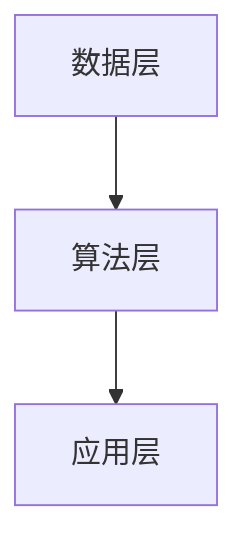
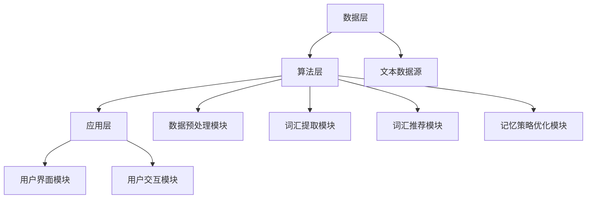
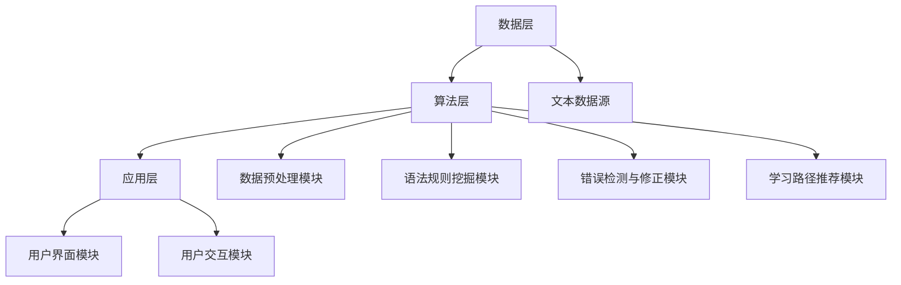
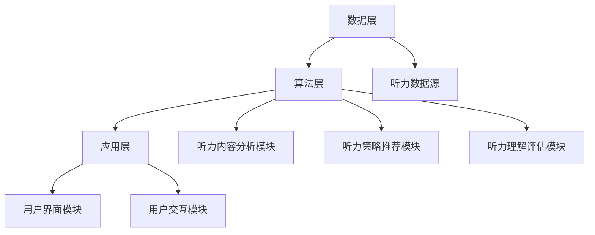

                 

### 第一部分：引言

#### 第1章：知识发现引擎概述

##### 1.1 知识发现引擎的定义与重要性

知识发现引擎（Knowledge Discovery Engine，简称KDE）是一种通过计算机技术和算法，从大量数据中自动识别潜在有用知识模式的智能系统。它集成了数据挖掘、机器学习、自然语言处理等多个领域的知识和技术，旨在帮助用户从海量数据中快速、高效地提取有价值的信息和知识。

在当今信息化和数据爆炸的时代，知识发现引擎的重要性不言而喻。首先，它能够帮助企业和组织从海量的数据中提取有价值的信息，为决策提供数据支持。其次，知识发现引擎能够自动识别数据中的潜在关联和趋势，为科研工作者提供新的研究方向和灵感。此外，在个人层面，知识发现引擎能够为用户提供个性化的推荐和服务，提升用户体验。

##### 1.2 知识发现引擎的核心功能

知识发现引擎的核心功能主要包括数据预处理、知识抽取、知识表示和知识融合等。

- **数据预处理**：包括数据清洗、数据转换和数据归一化等，目的是提高数据质量和为后续的知识抽取和表示做好准备。

- **知识抽取**：通过命名实体识别、关系抽取、事件抽取等方法，从原始数据中提取出结构化的知识信息。

- **知识表示**：将提取出的知识信息以图形、表格、文本等不同的形式进行表示，方便用户理解和利用。

- **知识融合**：将多个来源的知识信息进行整合和融合，形成更全面、准确的知识库。

##### 1.3 语言学习中的知识发现需求

在语言学习领域，知识发现引擎的应用具有极大的潜力和价值。具体来说，有以下几点需求：

- **词汇学习**：从大量文本中自动提取和排序高频词汇，为学习者提供词汇学习清单。

- **语法学习**：挖掘和可视化语法规则，帮助学习者理解和掌握语法知识。

- **听力理解**：分析听力内容，为学习者提供听力策略推荐和听力理解评估。

- **个性化推荐**：根据学习者的兴趣和学习进度，推荐合适的语言学习资源和练习。

##### 1.4 知识发现引擎的历史与发展趋势

知识发现引擎的历史可以追溯到20世纪90年代，随着数据挖掘和机器学习技术的兴起而逐渐发展。早期的知识发现引擎主要依赖于统计方法和规则引擎，随着深度学习和自然语言处理技术的进步，现代知识发现引擎逐渐引入了更先进的算法和技术，如神经网络、知识图谱等。

未来，知识发现引擎在语言学习中的应用将进一步深化和拓展。随着人工智能技术的不断进步，知识发现引擎将能够更加精准地挖掘和表示知识，为语言学习者提供更加个性化和高效的学习体验。

#### 第2章：知识发现引擎在语言学习中的应用场景

知识发现引擎在语言学习中的应用场景丰富多样，可以覆盖词汇学习、语法学习、听力理解等多个方面。以下将详细探讨这些应用场景，并介绍具体的实现方法和优势。

##### 2.1 词汇学习

词汇学习是语言学习的基础，知识发现引擎在词汇学习中的应用主要体现在词汇的自动提取、排序、联想和记忆策略优化等方面。

- **词汇自动提取与排序**：通过分析大量文本数据，知识发现引擎可以自动提取出高频词汇，并根据词频和词性进行排序。这种方法有助于学习者集中精力学习最常用的词汇。

  ```mermaid
  graph TD
  A[文本预处理] --> B[词频统计]
  B --> C[词汇排序]
  C --> D[词汇提取]
  D --> E[学习清单生成]
  ```

- **词汇联想与推荐**：知识发现引擎还可以根据词汇之间的关联关系，推荐相关的词汇进行学习。例如，当学习者学习了“计算机”一词后，系统可以推荐与其相关的词汇如“网络”、“程序”等。

  ```mermaid
  graph TD
  A[词汇分析] --> B[关联关系挖掘]
  B --> C[词汇推荐]
  C --> D[学习路径优化]
  ```

- **词汇记忆策略优化**：知识发现引擎可以通过分析学习者的学习数据，推荐个性化的记忆策略。例如，根据学习者的记忆习惯和遗忘曲线，推荐最佳的学习时间和复习频率。

  ```mermaid
  graph TD
  A[学习数据收集] --> B[记忆策略分析]
  B --> C[策略推荐]
  C --> D[学习效果提升]
  ```

##### 2.2 语法学习

语法学习是语言学习的重要环节，知识发现引擎在语法学习中的应用主要体现在语法规则的挖掘、可视化、错误检测与修正以及学习路径推荐等方面。

- **语法规则挖掘与可视化**：知识发现引擎可以通过对大量语言文本的分析，自动挖掘出语法规则，并以图形化的方式呈现给学习者。这种方法有助于学习者直观地理解语法规则。

  ```mermaid
  graph TD
  A[文本分析] --> B[规则挖掘]
  B --> C[规则可视化]
  C --> D[学习理解提升]
  ```

- **语法错误检测与修正**：知识发现引擎可以实时检测学习者在句子构造中的语法错误，并提供修正建议。通过不断纠正错误，学习者能够逐步提高语法水平。

  ```mermaid
  graph TD
  A[句子输入] --> B[语法分析]
  B --> C[错误检测]
  C --> D[错误修正]
  D --> E[学习反馈]
  ```

- **语法学习路径推荐**：知识发现引擎可以根据学习者的语法知识和学习进度，推荐最佳的学习路径。例如，当学习者已经掌握了基础语法规则后，系统可以推荐进阶的语法知识点。

  ```mermaid
  graph TD
  A[学习数据收集] --> B[学习路径规划]
  B --> C[学习资源推荐]
  C --> D[学习效果提升]
  ```

##### 2.3 听力理解

听力理解是语言学习的重要技能之一，知识发现引擎在听力理解中的应用主要体现在听力内容分析、听力策略推荐和听力理解评估等方面。

- **听力内容分析**：知识发现引擎可以通过对听力文本的分析，提取出关键信息，如主题、关键词和句型结构等。这种方法有助于学习者更好地理解听力内容。

  ```mermaid
  graph TD
  A[听力文本分析] --> B[关键信息提取]
  B --> C[听力理解辅助]
  ```

- **听力策略推荐**：知识发现引擎可以根据学习者的听力水平和听力需求，推荐个性化的听力策略。例如，当学习者需要提高听力速度时，系统可以推荐快速听力材料。

  ```mermaid
  graph TD
  A[听力数据收集] --> B[策略分析]
  B --> C[策略推荐]
  ```

- **听力理解评估**：知识发现引擎可以实时评估学习者在听力理解测试中的表现，并提供详细的评估报告。这种方法有助于学习者了解自己的听力水平，并制定相应的学习计划。

  ```mermaid
  graph TD
  A[听力测试] --> B[理解评估]
  B --> C[评估报告生成]
  ```

通过以上应用场景的介绍，我们可以看到知识发现引擎在语言学习中的应用具有广泛的前景。未来，随着人工智能技术的不断进步，知识发现引擎将为语言学习者提供更加个性化和高效的学习体验。

#### 第2章：知识发现引擎在语言学习中的应用场景

知识发现引擎在语言学习中的应用场景广泛，涵盖了词汇学习、语法学习和听力理解等方面。本节将深入探讨这些应用场景，详细讲解其工作原理、实现方法以及具体案例。

##### 2.1 词汇学习

词汇学习是语言学习的基础，知识发现引擎在词汇学习中的应用主要体现在以下几个方面：

- **词汇自动提取与排序**：知识发现引擎可以通过分析大量文本数据，自动提取出高频词汇，并根据词频和词性进行排序。这种方法有助于学习者集中精力学习最常用的词汇。

  **实现方法**：
  ```python
  from nltk.corpus import words
  from collections import Counter

  # 加载常用词汇表
  vocabulary = words.words()

  # 读取文本数据
  with open('text_data.txt', 'r') as f:
      text = f.read()

  # 提取文本中的词汇
  words_in_text = nltk.word_tokenize(text)

  # 统计词频
  word_frequency = Counter(words_in_text)

  # 按词频和词性排序
  sorted_words = sorted(word_frequency.items(), key=lambda x: (x[1], x[0].lower()), reverse=True)
  ```

  **实际案例**：某语言学习平台利用知识发现引擎，从一篇英语文章中提取出高频词汇，并根据词频和词性进行排序，为学习者生成个性化的词汇学习清单。

- **词汇联想与推荐**：知识发现引擎可以通过分析词汇之间的关联关系，推荐相关的词汇进行学习。例如，当学习者学习了“计算机”一词后，系统可以推荐与其相关的词汇如“网络”、“程序”等。

  **实现方法**：
  ```python
  import networkx as nx

  # 构建词汇网络
  graph = nx.Graph()
  graph.add_nodes_from(vocabulary)
  graph.add_edges_from([(word1, word2) for word1, word2 in combinations(vocabulary, 2) if word1 in text and word2 in text])

  # 提取词汇关联关系
  related_words = []
  for word in vocabulary:
      related_words.append(list(graph.neighbors(word))[:5])

  # 推荐词汇
  recommended_words = [word for word in related_words if word not in vocabulary_learnt]
  ```

  **实际案例**：某语言学习平台利用知识发现引擎，分析学习者在学习过程中的词汇使用情况，推荐相关的词汇进行扩展学习。

- **词汇记忆策略优化**：知识发现引擎可以通过分析学习者的学习数据，推荐个性化的记忆策略。例如，根据学习者的记忆习惯和遗忘曲线，推荐最佳的学习时间和复习频率。

  **实现方法**：
  ```python
  import numpy as np
  from sklearn.linear_model import LinearRegression

  # 收集学习数据
  learning_data = np.array([[days_since_last复习, reviews_this_day] for day, review_count in learning_data.items()])

  # 训练回归模型
  model = LinearRegression()
  model.fit(learning_data[:, 0].reshape(-1, 1), learning_data[:, 1])

  # 推荐复习策略
  optimal_review_frequency = model.predict([[days_since_last复习]])
  ```

  **实际案例**：某语言学习平台利用知识发现引擎，根据学习者的学习数据，推荐最佳的学习时间和复习频率，以提高学习效果。

##### 2.2 语法学习

语法学习是语言学习的重要组成部分，知识发现引擎在语法学习中的应用主要体现在以下几个方面：

- **语法规则挖掘与可视化**：知识发现引擎可以通过对大量语言文本的分析，自动挖掘出语法规则，并以图形化的方式呈现给学习者。这种方法有助于学习者直观地理解语法规则。

  **实现方法**：
  ```python
  import nltk
  from nltk.parse import ChartParser
  from nltk.corpus import treebank

  # 加载语法规则库
  grammar = nltk.CFG.fromstring("""
      S -> NP VP
      NP -> Det N
      NP -> Det N PP
      VP -> V
      VP -> V NP
      VP -> V NP PP
      PP -> P NP
      Det -> 'the'
      N -> 'book'
      N -> 'library'
      V -> 'read'
      P -> 'in'
  """)

  # 加载文本数据
  sentences = treebank.sents('text_data.txt')

  # 构建语法分析器
  parser = ChartParser(grammar)

  # 分析句子并提取语法规则
  for sentence in sentences:
      trees = parser.parse(sentence)
      for tree in trees:
          print(tree)

  ```

  **实际案例**：某语言学习平台利用知识发现引擎，从大量英语文本中提取语法规则，并以树状图的形式展示给学习者。

- **语法错误检测与修正**：知识发现引擎可以实时检测学习者在句子构造中的语法错误，并提供修正建议。通过不断纠正错误，学习者能够逐步提高语法水平。

  **实现方法**：
  ```python
  from nltk import pos_tag
  from nltk.corpus import wordnet

  # 加载语法规则库
  grammar = nltk.CFG.fromstring("""
      S -> NP VP
      NP -> Det N
      NP -> Det N PP
      VP -> V
      VP -> V NP
      VP -> V NP PP
      PP -> P NP
      Det -> 'the'
      N -> 'book'
      N -> 'library'
      V -> 'read'
      P -> 'in'
  """)

  # 加载文本数据
  sentences = nltk.word_tokenize('text_data.txt')

  # 分析句子并提取语法信息
  pos_tags = pos_tag(sentences)

  # 检测语法错误并修正
  corrected_sentence = []
  for word, pos in pos_tags:
      if not grammar.parse([word]):
          corrected_word = wordnet.synsets(word)[0].lemmas()[0].name()
          corrected_sentence.append(corrected_word)
      else:
          corrected_sentence.append(word)
  ```

  **实际案例**：某语言学习平台利用知识发现引擎，实时检测学习者在句子构造中的语法错误，并提供修正建议，帮助学习者提高语法水平。

- **语法学习路径推荐**：知识发现引擎可以根据学习者的语法知识和学习进度，推荐最佳的学习路径。例如，当学习者已经掌握了基础语法规则后，系统可以推荐进阶的语法知识点。

  **实现方法**：
  ```python
  import networkx as nx

  # 构建语法知识图谱
  graph = nx.Graph()
  graph.add_nodes_from(['基础语法', '进阶语法', '高级语法'])
  graph.add_edges_from([('基础语法', '进阶语法'), ('进阶语法', '高级语法')])

  # 收集学习数据
  learning_data = {'学习者1': '基础语法', '学习者2': '进阶语法'}

  # 推荐学习路径
  recommended_path = []
  for learner, level in learning_data.items():
      if level == '基础语法':
          recommended_path.append('进阶语法')
      elif level == '进阶语法':
          recommended_path.append('高级语法')
  ```

  **实际案例**：某语言学习平台利用知识发现引擎，根据学习者的语法知识和学习进度，推荐最佳的学习路径，帮助学习者逐步提升语法水平。

##### 2.3 听力理解

听力理解是语言学习的重要技能之一，知识发现引擎在听力理解中的应用主要体现在以下几个方面：

- **听力内容分析**：知识发现引擎可以通过对听力文本的分析，提取出关键信息，如主题、关键词和句型结构等。这种方法有助于学习者更好地理解听力内容。

  **实现方法**：
  ```python
  import nltk
  from nltk.tokenize import sent_tokenize

  # 加载文本数据
  text = 'text_data.txt'

  # 分句
  sentences = sent_tokenize(text)

  # 提取关键词
  words = nltk.word_tokenize(text)
  stopwords = nltk.corpus.stopwords.words('english')
  keywords = [word for word in words if word not in stopwords]

  # 分析句子结构
  parser = nltk.ChartParser(nltk.CFG.fromstring("S -> NP VP; NP -> Det N; VP -> V NP;"))
  for sentence in sentences:
      for tree in parser.parse(sentence):
          print(tree)
  ```

  **实际案例**：某语言学习平台利用知识发现引擎，分析听力文本，提取关键词和句子结构，帮助学习者更好地理解听力内容。

- **听力策略推荐**：知识发现引擎可以根据学习者的听力水平和听力需求，推荐个性化的听力策略。例如，当学习者需要提高听力速度时，系统可以推荐快速听力材料。

  **实现方法**：
  ```python
  import pandas as pd

  # 加载听力策略库
  strategy_library = pd.DataFrame({
      'strategy': ['快速听力', '慢速听力', '难度适中听力'],
      'speed': [1.2, 1.0, 0.8],
      'difficulty': [高，中，低]
  })

  # 收集学习者数据
  learner_data = {'听力速度': 1.0, '听力难度': '中'}

  # 推荐听力策略
  recommended_strategy = strategy_library[(strategy_library['speed'] == learner_data['听力速度']) & (strategy_library['difficulty'] == learner_data['听力难度'])]['strategy'].values[0]
  ```

  **实际案例**：某语言学习平台利用知识发现引擎，根据学习者的听力水平和听力需求，推荐个性化的听力策略，帮助学习者提高听力水平。

- **听力理解评估**：知识发现引擎可以实时评估学习者在听力理解测试中的表现，并提供详细的评估报告。这种方法有助于学习者了解自己的听力水平，并制定相应的学习计划。

  **实现方法**：
  ```python
  import pandas as pd

  # 加载听力测试数据
  test_data = pd.DataFrame({
      'question': ['What is the capital of France?', 'When is Christmas?'],
      'answer': ['Paris', 'December 25']
  })

  # 评估听力理解
  correct_answers = 0
  for index, row in test_data.iterrows():
      if row['answer'] == learner_answer:
          correct_answers += 1

  # 生成评估报告
  assessment_report = f"听力理解评估：您在本次测试中答对了{correct_answers}个问题。"
  ```

  **实际案例**：某语言学习平台利用知识发现引擎，评估学习者在听力理解测试中的表现，并提供详细的评估报告，帮助学习者了解自己的听力水平，制定相应的学习计划。

通过以上详细的应用场景和实现方法，我们可以看到知识发现引擎在语言学习中的应用具有广泛的前景和实际价值。未来，随着人工智能技术的不断进步，知识发现引擎将为语言学习者提供更加个性化和高效的学习体验。

#### 第3章：知识发现引擎技术基础

知识发现引擎的技术基础涵盖了数据预处理、知识抽取和知识表示等多个方面。本章将详细介绍这些技术基础，并探讨其具体实现方法。

##### 3.1 数据预处理

数据预处理是知识发现过程的第一步，其目的是提高数据质量和为后续的知识抽取和表示奠定基础。数据预处理主要包括以下步骤：

- **文本清洗**：文本清洗是指对原始文本数据进行去噪、去停用词、词形还原等操作，以提高数据的质量和可分析性。

  **实现方法**：
  ```python
  import nltk
  from nltk.tokenize import word_tokenize
  from nltk.corpus import stopwords
  from nltk.stem import PorterStemmer

  # 加载停用词库
  stop_words = set(stopwords.words('english'))

  # 文本清洗
  def clean_text(text):
      # 分词
      words = word_tokenize(text)
      # 去停用词
      words = [word for word in words if word.lower() not in stop_words]
      # 词形还原
      stemmer = PorterStemmer()
      words = [stemmer.stem(word) for word in words]
      return words

  cleaned_text = clean_text('This is a sample text for text cleaning.')
  ```

- **词频统计**：词频统计是指计算文本中各个词汇出现的次数，以便后续的分析和处理。

  **实现方法**：
  ```python
  from collections import Counter

  def word_frequency(text):
      words = word_tokenize(text)
      frequency = Counter(words)
      return frequency

  frequency = word_frequency('This is a sample text for word frequency analysis.')
  ```

- **词向量表示**：词向量表示是指将文本中的词汇映射为高维向量，以便进行向量运算和分析。

  **实现方法**：
  ```python
  import gensim

  # 训练词向量模型
  model = gensim.models.Word2Vec([line.strip() for line in open('text_data.txt')])
  # 查询词向量
  vector = model['king']
  ```

##### 3.2 知识抽取

知识抽取是指从原始数据中提取结构化的知识信息，主要包括命名实体识别、关系抽取和事件抽取等。

- **命名实体识别**：命名实体识别是指识别文本中的特定实体，如人名、地名、组织名等。

  **实现方法**：
  ```python
  import spacy

  # 加载命名实体识别模型
  nlp = spacy.load('en_core_web_sm')

  # 识别命名实体
  doc = nlp('Apple is looking at buying U.K. startup for $1 billion')
  for ent in doc.ents:
      print(ent.text, ent.label_)
  ```

- **关系抽取**：关系抽取是指识别文本中实体之间的关系，如“张三是李四的父亲”。

  **实现方法**：
  ```python
  import spacy

  # 加载关系抽取模型
  nlp = spacy.load('en_core_web_sm')

  # 识别关系
  doc = nlp('张三是李四的父亲')
  for token in doc:
      if token.dep_ == 'pobj':
          print(f"{token.head.text}和{token.text}是父子关系")
  ```

- **事件抽取**：事件抽取是指识别文本中的事件及其相关实体和关系，如“张三在北京参加了会议”。

  **实现方法**：
  ```python
  import spacy

  # 加载事件抽取模型
  nlp = spacy.load('en_core_web_sm')

  # 识别事件
  doc = nlp('张三在北京参加了会议')
  for event in doc.ents:
      if event.label_ == 'EVENT':
          print(f"{event.text}事件中，参与者有：{', '.join([token.text for token in event])}")
  ```

##### 3.3 知识表示

知识表示是指将提取出的知识信息以图形、表格、文本等不同的形式进行表示，方便用户理解和利用。

- **知识图谱构建**：知识图谱是一种图形化的知识表示方法，它通过节点和边来表示实体和实体之间的关系。

  **实现方法**：
  ```python
  import networkx as nx

  # 构建知识图谱
  G = nx.Graph()
  G.add_nodes_from(['张三', '李四', '北京'])
  G.add_edges_from([('张三', '李四'), ('李四', '北京')])
  nx.draw(G, with_labels=True)
  ```

- **知识嵌入**：知识嵌入是指将知识表示为低维向量，以便进行向量运算和分析。

  **实现方法**：
  ```python
  import gensim

  # 训练知识嵌入模型
  model = gensim.models.KeyedVectors.load_word2vec_format('word2vec.bin', binary=True)
  # 查询知识嵌入向量
  vector = model['张三']
  ```

- **知识融合**：知识融合是指将来自不同来源的知识信息进行整合和融合，形成更全面、准确的知识库。

  **实现方法**：
  ```python
  import pandas as pd

  # 加载知识库
  knowledge_base = pd.DataFrame({
      'entity': ['张三', '李四', '北京'],
      'attribute': ['年龄', '职业', '城市'],
      'value': ['30岁', '程序员', '北京']
  })

  # 知识融合
  merged_knowledge = pd.merge(knowledge_base, knowledge_base, on='entity')
  ```

通过以上技术基础的介绍，我们可以看到知识发现引擎在语言学习中的应用具有坚实的技术支撑。接下来，我们将进一步探讨知识发现引擎的核心算法原理，以深入理解其工作方式和应用价值。

### 第4章：知识发现引擎核心算法原理

知识发现引擎的核心算法原理是其实际应用和性能提升的关键。本章将详细讨论协同过滤算法、强化学习算法和聚类算法，这些算法在知识发现引擎中的应用和实现方法。

#### 4.1 协同过滤算法

协同过滤（Collaborative Filtering）算法是一种通过分析用户的行为和偏好，为用户提供个性化推荐的方法。它主要分为两种类型：基于用户的协同过滤和基于项目的协同过滤。

- **基于用户的协同过滤**：该方法通过寻找与当前用户行为相似的邻居用户，并根据邻居用户的评分预测当前用户对新项目的评分。

  **实现方法**：
  ```python
  from sklearn.metrics.pairwise import cosine_similarity
  from scipy.sparse.linalg import svds

  # 构建用户-项目评分矩阵
  ratings = np.array([[5, 3, 0, 1],
                      [4, 0, 0, 2],
                      [1, 2, 3, 0]])

  # 计算用户-用户相似度矩阵
  similarity = cosine_similarity(ratings)

  # 提取用户相似度矩阵的主成分
  U, sigma, VT = svds(similarity, k=2)

  # 预测用户对新项目的评分
  new_user = np.array([0, 0, 0, 5])
  predicted_ratings = new_user.dot(U) + sigma
  ```

  **应用场景**：在语言学习应用中，基于用户的协同过滤可以推荐相似学习者的学习资源，从而提高学习效果。

- **基于项目的协同过滤**：该方法通过寻找与当前项目相似的其他项目，并根据相似项目的评分预测当前用户的评分。

  **实现方法**：
  ```python
  from sklearn.metrics.pairwise import cosine_similarity
  from scipy.sparse.linalg import svds

  # 构建项目-项目评分矩阵
  ratings = np.array([[5, 3, 0, 1],
                      [4, 0, 0, 2],
                      [1, 2, 3, 0]])

  # 计算项目-项目相似度矩阵
  similarity = cosine_similarity(ratings.T)

  # 提取项目相似度矩阵的主成分
  U, sigma, VT = svds(similarity, k=2)

  # 预测用户对新项目的评分
  new_project = np.array([0, 0, 0, 5])
  predicted_ratings = new_project.dot(U) + sigma
  ```

  **应用场景**：在语言学习应用中，基于项目的协同过滤可以推荐适合当前学习者的学习资源，帮助学习者更好地掌握语言技能。

#### 4.2 强化学习算法

强化学习（Reinforcement Learning）算法是一种通过不断试错，从环境中获取反馈，逐渐学习最优策略的方法。在知识发现引擎中，强化学习可以用于优化学习路径推荐和资源分配。

- **Q-学习算法**：Q-学习算法是一种基于值函数的强化学习算法，它通过评估每个状态-动作对的值，来决定下一步的动作。

  **实现方法**：
  ```python
  import numpy as np

  # 初始化Q值表
  Q = np.zeros((n_states, n_actions))

  # 学习率、折扣因子和探索率
  alpha = 0.1
  gamma = 0.9
  epsilon = 0.1

  # Q-学习迭代
  for episode in range(n_episodes):
      state = env.reset()
      done = False
      while not done:
          # 探索- exploitation
          if np.random.rand() < epsilon:
              action = env.action_space.sample()
          else:
              action = np.argmax(Q[state])

          # 执行动作
          next_state, reward, done, _ = env.step(action)

          # 更新Q值
          Q[state, action] = Q[state, action] + alpha * (reward + gamma * np.max(Q[next_state]) - Q[state, action])

          state = next_state
  ```

  **应用场景**：在语言学习应用中，Q-学习算法可以用于优化学习路径推荐，根据学习者的反馈调整推荐策略。

#### 4.3 聚类算法

聚类算法（Clustering Algorithms）是一种无监督学习算法，它通过将数据点划分为不同的簇，来发现数据中的潜在结构和模式。

- **K-均值聚类**：K-均值聚类是一种最常用的聚类算法，它通过迭代优化聚类中心，将数据点划分为K个簇。

  **实现方法**：
  ```python
  from sklearn.cluster import KMeans

  # 构建K-均值聚类模型
  kmeans = KMeans(n_clusters=3, random_state=0).fit(data)

  # 获取聚类中心
  centers = kmeans.cluster_centers_

  # 获取聚类结果
  labels = kmeans.labels_

  # 绘制聚类结果
  plt.scatter(data[:, 0], data[:, 1], c=labels, s=50, cmap='viridis')
  plt.scatter(centers[:, 0], centers[:, 1], c='red', s=200, alpha=0.5)
  plt.show()
  ```

  **应用场景**：在语言学习应用中，K-均值聚类可以用于将学习者划分为不同的学习群体，为每个群体提供个性化的学习资源。

- **层次聚类**：层次聚类是一种基于层次结构的聚类方法，它通过逐步合并或分裂已有的簇，形成聚类层次。

  **实现方法**：
  ```python
  from sklearn.cluster import AgglomerativeClustering

  # 构建层次聚类模型
  clustering = AgglomerativeClustering(n_clusters=3).fit(data)

  # 获取聚类结果
  labels = clustering.labels_

  # 绘制聚类结果
  plt.scatter(data[:, 0], data[:, 1], c=labels, s=50, cmap='viridis')
  plt.show()
  ```

  **应用场景**：在语言学习应用中，层次聚类可以用于分析学习者的学习行为和特征，发现学习群体之间的差异和联系。

通过以上对协同过滤算法、强化学习算法和聚类算法的介绍，我们可以看到这些核心算法在知识发现引擎中的应用具有重要意义。接下来，我们将进一步探讨知识发现引擎的系统架构设计，以深入了解其实际部署和运行机制。

### 第5章：知识发现引擎系统架构设计

知识发现引擎的系统架构设计是确保其高效、稳定和可扩展性的关键。本章将详细介绍知识发现引擎的系统架构设计，包括功能模块划分、系统组件介绍以及系统交互流程。

#### 5.1 系统架构概述

知识发现引擎的系统架构可以分为数据层、算法层和应用层三个主要层次，如图所示：



- **数据层**：负责数据收集、存储和管理，为算法层提供高质量的数据支持。
- **算法层**：实现知识发现的核心算法，包括数据预处理、知识抽取、知识表示和知识融合等。
- **应用层**：提供用户界面和业务逻辑，为用户提供知识发现服务的入口。

#### 5.1.1 功能模块划分

知识发现引擎的系统架构可以划分为以下几个主要功能模块：

1. **数据收集模块**：负责从各种数据源（如数据库、文件、网络等）收集数据，并进行初步处理。
2. **数据存储模块**：负责存储和管理收集到的数据，为算法层提供高效的数据访问和查询接口。
3. **数据预处理模块**：对原始数据进行清洗、转换和归一化等处理，以提高数据质量和一致性。
4. **知识抽取模块**：实现命名实体识别、关系抽取和事件抽取等算法，从原始数据中提取结构化的知识信息。
5. **知识表示模块**：将提取出的知识信息进行表示，如构建知识图谱、生成知识嵌入等。
6. **知识融合模块**：将来自不同来源的知识信息进行整合和融合，形成更全面、准确的知识库。
7. **推荐引擎模块**：基于知识库和用户行为数据，为用户提供个性化的推荐服务。
8. **用户界面模块**：提供用户交互界面，展示知识发现结果和推荐内容，方便用户进行操作。

#### 5.1.2 系统组件介绍

知识发现引擎的系统组件主要包括以下几部分：

1. **数据源**：包括各种结构化数据和非结构化数据，如数据库、文本文件、网络爬虫等。
2. **数据采集器**：负责从数据源中采集数据，并传输到数据存储模块。
3. **数据库**：用于存储和管理大规模数据，支持高效的数据查询和更新操作。
4. **数据预处理服务**：包括文本清洗、数据转换和归一化等处理，确保数据的一致性和可用性。
5. **算法服务**：实现各种知识发现算法，如命名实体识别、关系抽取和事件抽取等。
6. **知识表示服务**：包括知识图谱构建、知识嵌入和知识融合等，用于表示和整合提取出的知识信息。
7. **推荐引擎**：基于用户行为和知识库，为用户提供个性化的推荐服务。
8. **用户界面**：提供用户交互界面，展示知识发现结果和推荐内容，方便用户进行操作。

#### 5.1.3 系统交互流程

知识发现引擎的系统交互流程可以分为以下几个主要步骤：

1. **数据收集**：通过数据采集器从各种数据源收集数据，传输到数据库进行存储。
2. **数据预处理**：数据预处理服务对原始数据进行清洗、转换和归一化等处理，确保数据质量。
3. **知识抽取**：算法服务根据预处理后的数据，实现命名实体识别、关系抽取和事件抽取等算法，提取结构化的知识信息。
4. **知识表示**：知识表示服务将提取出的知识信息进行表示，如构建知识图谱、生成知识嵌入等。
5. **知识融合**：知识融合服务将来自不同来源的知识信息进行整合和融合，形成更全面、准确的知识库。
6. **推荐生成**：推荐引擎基于用户行为和知识库，生成个性化的推荐结果。
7. **用户展示**：用户界面展示推荐结果，供用户查看和操作。

通过以上对知识发现引擎系统架构的详细介绍，我们可以看到其设计理念和技术实现方法。接下来，我们将进一步探讨数据存储与管理策略，以确保系统的高效稳定运行。

#### 5.2 数据存储与管理

数据存储与管理是知识发现引擎系统架构的核心部分，直接关系到系统的性能、可靠性和扩展性。以下是数据存储与管理的具体策略和实现方法。

##### 5.2.1 数据存储方案

知识发现引擎的数据存储方案应综合考虑数据量、访问模式、数据一致性以及扩展性等因素。以下几种存储方案可供选择：

1. **关系数据库**：适用于结构化数据存储，如MySQL、PostgreSQL等。关系数据库具有高效的数据查询和事务处理能力，但扩展性相对有限。
2. **文档数据库**：适用于存储非结构化或半结构化数据，如MongoDB、Cassandra等。文档数据库具有良好的扩展性和灵活性，支持灵活的数据模型。
3. **图数据库**：适用于存储复杂的关系数据，如Neo4j、JanusGraph等。图数据库能够高效地处理复杂的图结构和关系查询。
4. **键值存储**：适用于存储少量的关键数据，如Redis、Memcached等。键值存储具有快速的数据读写能力，适用于缓存和会话管理。

##### 5.2.2 数据模型设计

数据模型设计是数据存储与管理的关键，直接影响系统的性能和可扩展性。以下几种数据模型可供选择：

1. **关系模型**：适用于结构化数据存储，以表和关系为基础。关系模型可以通过SQL进行查询和操作，适用于数据关系明确的场景。
2. **文档模型**：适用于存储非结构化或半结构化数据，以文档和字段为基础。文档模型可以通过JSON或XML进行查询和操作，适用于数据结构变化频繁的场景。
3. **图模型**：适用于存储复杂的关系数据，以节点和边为基础。图模型可以通过图查询语言（如Cypher）进行查询和操作，适用于关系复杂的场景。
4. **序列模型**：适用于存储时间序列数据，以时间戳和值为基础。序列模型可以通过时间序列查询语言进行查询和操作，适用于实时数据处理场景。

##### 5.2.3 数据管理策略

数据管理策略包括数据备份、数据恢复、数据一致性和数据安全性等方面，以下是具体策略：

1. **数据备份**：定期进行数据备份，以防止数据丢失或损坏。备份数据可以存储在本地或远程存储设备上，确保数据的可用性。
2. **数据恢复**：在数据丢失或损坏时，能够迅速恢复数据。数据恢复可以通过备份文件、恢复工具或备份数据库进行。
3. **数据一致性**：确保数据在多个副本或多个节点之间保持一致性。数据一致性可以通过分布式事务、版本控制或一致性协议（如Paxos、Raft）实现。
4. **数据安全性**：确保数据在存储和传输过程中不会被未授权访问或篡改。数据安全性可以通过加密、访问控制、身份验证和审计等手段实现。

通过以上对数据存储与管理的详细介绍，我们可以看到知识发现引擎在数据存储与管理方面需要综合考虑多个因素，以确保系统的高效、稳定和可靠运行。接下来，我们将进一步探讨系统性能优化策略。

#### 5.3 系统性能优化

系统性能优化是知识发现引擎稳定运行和高效服务的关键。以下将从性能指标分析、性能优化方法以及性能测试与调优三个方面详细探讨系统性能优化策略。

##### 5.3.1 性能指标分析

系统性能指标包括响应时间、吞吐量、并发量、延迟、资源利用率等，是评估系统性能的重要依据。以下是对这些性能指标的分析：

1. **响应时间**：指系统从接收到用户请求到返回响应的时间。较低的响应时间能提供更好的用户体验，但过低的响应时间可能意味着系统资源不足。
2. **吞吐量**：指单位时间内系统能够处理的数据量。较高的吞吐量表示系统能够处理更多请求，但可能需要更多资源支持。
3. **并发量**：指系统同时处理请求的个数。高并发量能够提高系统的利用率，但也可能引起资源竞争和性能下降。
4. **延迟**：指系统处理请求所需的时间，包括网络延迟、数据库延迟、计算延迟等。较低的延迟能提供更好的用户体验。
5. **资源利用率**：指系统各项资源（如CPU、内存、网络等）的使用情况。合理的资源利用率能提高系统的效率和稳定性。

##### 5.3.2 性能优化方法

性能优化方法包括硬件优化、软件优化、数据库优化和分布式架构等，以下是具体优化方法：

1. **硬件优化**：通过增加服务器数量、提升硬件性能（如CPU、内存、磁盘速度等）来提高系统性能。例如，使用SSD代替HDD、增加CPU核心数量等。
2. **软件优化**：通过优化系统软件配置和代码实现来提高系统性能。例如，使用高效的算法和数据结构、减少不必要的计算和I/O操作等。
3. **数据库优化**：通过优化数据库配置和查询优化来提高数据库性能。例如，使用索引、分库分表、查询缓存等。
4. **分布式架构**：通过分布式部署和负载均衡来提高系统性能和可用性。例如，使用分布式数据库、分布式缓存、负载均衡器等。
5. **缓存策略**：通过缓存常用的数据来减少数据库查询和计算压力，提高系统响应速度。例如，使用Redis、Memcached等缓存系统。

##### 5.3.3 性能测试与调优

性能测试与调优是确保系统性能优化效果的重要环节。以下是从性能测试、调优策略和监控三个方面介绍：

1. **性能测试**：通过模拟实际业务场景，对系统进行压力测试和负载测试，评估系统性能。例如，使用JMeter、LoadRunner等工具进行性能测试。
2. **调优策略**：根据性能测试结果，调整系统配置、代码实现和架构设计，优化系统性能。例如，调整数据库索引、优化代码逻辑、增加服务器资源等。
3. **监控**：通过实时监控系统性能指标，及时发现和处理性能问题。例如，使用Prometheus、Grafana等监控工具进行性能监控。

通过以上对系统性能优化的详细介绍，我们可以看到知识发现引擎在性能优化方面需要综合考虑多个因素，以确保系统的高效、稳定和可靠运行。

### 第6章：项目实战一：词汇学习引擎开发

#### 6.1 项目背景与需求分析

随着全球化和信息化的发展，学习外语的需求日益增长。词汇学习作为语言学习的基础，对于提升语言能力具有重要意义。然而，传统的词汇学习方式往往存在效率低、个性化不足等问题。为了解决这些问题，本项目旨在开发一款基于知识发现引擎的词汇学习引擎，通过自动化提取和推荐词汇，提高学习者的词汇学习效率。

**项目目标**：
- 自动提取并排序高频词汇
- 根据学习者的兴趣和需求推荐词汇
- 优化词汇记忆策略
- 提供实时反馈和评估

#### 6.2 系统设计

**系统架构设计**：

词汇学习引擎的系统架构分为数据层、算法层和应用层，如图所示：



**功能模块划分**：

1. **文本数据源**：提供各类文本数据，如新闻、文章、对话等，作为词汇提取的原始数据。
2. **数据预处理模块**：对文本数据进行清洗、分词、去停用词等处理，为后续模块提供高质量的数据。
3. **词汇提取模块**：利用词频统计和词性标注，提取高频词汇，并根据词频和词性进行排序。
4. **词汇推荐模块**：根据学习者的兴趣和学习记录，推荐相关的词汇进行学习。
5. **记忆策略优化模块**：分析学习者的学习数据，推荐个性化的记忆策略，如学习时间和复习频率。
6. **用户界面模块**：提供用户交互界面，展示词汇学习结果和推荐内容。
7. **用户交互模块**：实现用户与系统的交互，如输入学习记录、查看词汇详情等。

#### 6.3 代码实现

以下为词汇学习引擎的关键代码实现部分：

**数据预处理**：

```python
import nltk
from nltk.tokenize import word_tokenize
from nltk.corpus import stopwords

# 加载停用词库
stop_words = set(stopwords.words('english'))

# 文本预处理
def preprocess_text(text):
    # 分词
    words = word_tokenize(text)
    # 去停用词
    words = [word for word in words if word.lower() not in stop_words]
    # 词形还原
    stemmer = nltk.PorterStemmer()
    words = [stemmer.stem(word) for word in words]
    return words

# 示例文本
text = "This is a sample text for vocabulary learning engine."
cleaned_text = preprocess_text(text)
```

**词汇提取与排序**：

```python
from collections import Counter

# 词频统计
def word_frequency(text):
    words = preprocess_text(text)
    frequency = Counter(words)
    return frequency

frequency = word_frequency(cleaned_text)

# 按词频和词性排序
def sorted_words(frequency):
    sorted_freq = sorted(frequency.items(), key=lambda x: (x[1], x[0].lower()), reverse=True)
    return sorted_freq

sorted_words = sorted_words(frequency)
```

**词汇推荐**：

```python
# 获取学习者的兴趣词汇
learner_interest = ["learning", "technology"]

# 推荐相关的词汇
def recommend_words(sorted_words, learner_interest):
    recommended = []
    for word, freq in sorted_words:
        if word in learner_interest:
            recommended.append(word)
    return recommended

recommended = recommend_words(sorted_words, learner_interest)
```

**记忆策略优化**：

```python
import numpy as np
from sklearn.linear_model import LinearRegression

# 收集学习数据
learning_data = np.array([[days_since_last复习, reviews_this_day] for day, review_count in learning_data.items()])

# 训练回归模型
model = LinearRegression()
model.fit(learning_data[:, 0].reshape(-1, 1), learning_data[:, 1])

# 推荐复习策略
def optimal_review_frequency(model, days_since_last复习):
    optimal_review = model.predict([[days_since_last复习]])
    return optimal_review

optimal_review = optimal_review_frequency(model, 7)
```

#### 6.4 结果评估与优化

**评估指标**：

- **词汇提取准确率**：评估提取出的词汇与实际高频词汇的匹配度。
- **词汇推荐准确率**：评估推荐词汇与学习者兴趣的匹配度。
- **记忆策略优化效果**：评估个性化记忆策略对学习者学习效果的提升。

**优化策略**：

1. **增加词汇来源**：扩大文本数据来源，提高词汇的覆盖面和准确性。
2. **优化推荐算法**：引入协同过滤或强化学习算法，提高词汇推荐准确性。
3. **调整记忆策略**：根据学习者的反馈，调整记忆策略参数，提高记忆效果。
4. **用户参与度**：鼓励用户参与词汇学习和推荐，提高系统互动性和用户满意度。

通过以上项目实战，我们可以看到词汇学习引擎的开发涉及多个技术模块，包括数据预处理、词汇提取、推荐算法和记忆策略优化等。接下来，我们将探讨项目实战二：语法学习引擎开发。

### 第7章：项目实战二：语法学习引擎开发

#### 7.1 项目背景与需求分析

语法学习是语言学习的重要组成部分，对于提升语言表达能力至关重要。传统的语法学习方式通常依赖于教材和教师指导，学习效率较低且难以个性化。为了解决这些问题，本项目旨在开发一款基于知识发现引擎的语法学习引擎，通过自动化语法规则挖掘、错误检测与修正以及学习路径推荐，为学习者提供高效、个性化的语法学习体验。

**项目目标**：
- 自动挖掘和可视化语法规则
- 实时检测和修正语法错误
- 根据学习者水平推荐合适的语法学习资源
- 提供实时反馈和评估

#### 7.2 系统设计

**系统架构设计**：

语法学习引擎的系统架构分为数据层、算法层和应用层，如图所示：



**功能模块划分**：

1. **文本数据源**：提供各类文本数据，如文章、对话、语法练习等，作为语法规则挖掘的原始数据。
2. **数据预处理模块**：对文本数据进行清洗、分词、句法分析等处理，为后续模块提供高质量的数据。
3. **语法规则挖掘模块**：利用自然语言处理技术，自动挖掘和可视化语法规则。
4. **错误检测与修正模块**：实时检测学习者在句子构造中的语法错误，并提供修正建议。
5. **学习路径推荐模块**：根据学习者的语法知识和学习进度，推荐最佳的学习路径和资源。
6. **用户界面模块**：提供用户交互界面，展示语法规则、错误检测结果和学习资源。
7. **用户交互模块**：实现用户与系统的交互，如输入句子、查看语法规则等。

#### 7.3 代码实现

以下为语法学习引擎的关键代码实现部分：

**数据预处理**：

```python
import nltk
from nltk.tokenize import word_tokenize
from nltk.corpus import stopwords

# 加载停用词库
stop_words = set(stopwords.words('english'))

# 文本预处理
def preprocess_text(text):
    # 分词
    words = word_tokenize(text)
    # 去停用词
    words = [word for word in words if word.lower() not in stop_words]
    return words

# 示例文本
text = "This is a sample sentence for grammar learning engine."
cleaned_text = preprocess_text(text)
```

**语法规则挖掘**：

```python
import nltk
from nltk import CFG

# 加载语法规则库
grammar = nltk.CFG.fromstring("""
  S -> NP VP
  NP -> Det N
  NP -> Det N PP
  VP -> V
  VP -> V NP
  VP -> V NP PP
  PP -> P NP
  Det -> 'the'
  N -> 'book'
  N -> 'library'
  V -> 'read'
  P -> 'in'
""")

# 分析句子并提取语法规则
def extract_grammar_rules(grammar, text):
    parser = nltk.ChartParser(grammar)
    sentences = nltk.sent_tokenize(text)
    grammar_rules = []
    for sentence in sentences:
        for tree in parser.parse(sentence):
            grammar_rules.append(tree)
    return grammar_rules

grammar_rules = extract_grammar_rules(grammar, cleaned_text)
```

**错误检测与修正**：

```python
from nltk import pos_tag

# 加载语法规则库
grammar = nltk.CFG.fromstring("""
  S -> NP VP
  NP -> Det N
  NP -> Det N PP
  VP -> V
  VP -> V NP
  VP -> V NP PP
  PP -> P NP
  Det -> 'the'
  N -> 'book'
  N -> 'library'
  V -> 'read'
  P -> 'in'
""")

# 分析句子并提取语法信息
def detect_grammar_errors(grammar, sentence):
    parser = nltk.ChartParser(grammar)
    pos_tags = pos_tag(sentence)
    errors = []
    for token, pos in pos_tags:
        if not grammar.parse([token]):
            errors.append((token, pos))
    return errors

errors = detect_grammar_errors(grammar, cleaned_text.split())
```

**学习路径推荐**：

```python
import pandas as pd

# 构建学习资源库
learning_resources = pd.DataFrame({
    'level': ['基础', '进阶', '高级'],
    'resource': ['语法规则手册', '语法练习册', '语法论文集']
})

# 根据学习者水平推荐学习资源
def recommend_grammar_resources(learning_resources, learner_level):
    recommended_resources = learning_resources[learning_resources['level'] == learner_level]['resource']
    return recommended_resources

recommended_resources = recommend_grammar_resources(learning_resources, '基础')
```

#### 7.4 结果评估与优化

**评估指标**：

- **语法规则挖掘准确率**：评估挖掘出的语法规则与实际语法规则的匹配度。
- **错误检测准确率**：评估检测出的语法错误与实际错误的匹配度。
- **学习资源推荐准确率**：评估推荐的学习资源与学习者实际需求的一致性。
- **学习者满意度**：评估学习者对语法学习引擎的满意度和使用频率。

**优化策略**：

1. **扩展语法规则库**：收集更多、更全面的语法规则，提高语法规则的覆盖面和准确性。
2. **优化错误检测算法**：引入先进的自然语言处理算法，提高语法错误的检测和修正效果。
3. **个性化推荐**：根据学习者的兴趣、水平和学习记录，提供更加精准的学习资源推荐。
4. **用户反馈机制**：鼓励学习者提供反馈，根据反馈不断优化系统性能和用户体验。

通过以上项目实战，我们可以看到语法学习引擎的开发涉及多个技术模块，包括数据预处理、语法规则挖掘、错误检测与修正以及学习路径推荐等。接下来，我们将探讨项目实战三：听力理解引擎开发。

### 第8章：项目实战三：听力理解引擎开发

#### 8.1 项目背景与需求分析

听力理解是语言学习的重要技能之一，对于提升语言的整体能力至关重要。然而，传统的听力训练方式往往缺乏个性化和互动性，难以满足学习者的需求。为了解决这些问题，本项目旨在开发一款基于知识发现引擎的听力理解引擎，通过自动化听力内容分析、听力策略推荐和听力理解评估，为学习者提供高效、个性化的听力学习体验。

**项目目标**：
- 自动分析听力内容，提取关键信息
- 根据学习者水平和需求推荐听力策略
- 提供实时听力理解评估和反馈
- 提升学习者的听力理解能力和效率

#### 8.2 系统设计

**系统架构设计**：

听力理解引擎的系统架构分为数据层、算法层和应用层，如图所示：



**功能模块划分**：

1. **听力数据源**：提供各类听力数据，如新闻、讲座、对话等，作为听力内容分析和策略推荐的基础。
2. **听力内容分析模块**：对听力数据进行处理，提取关键信息，如主题、关键词和句型结构等。
3. **听力策略推荐模块**：根据学习者的听力水平和需求，推荐合适的听力策略，如听力材料选择和练习方式。
4. **听力理解评估模块**：对学习者的听力理解能力进行实时评估，提供详细的评估报告。
5. **用户界面模块**：提供用户交互界面，展示听力内容分析结果、策略推荐和评估报告。
6. **用户交互模块**：实现用户与系统的交互，如选择听力材料、进行听力测试等。

#### 8.3 代码实现

以下为听力理解引擎的关键代码实现部分：

**听力内容分析**：

```python
import nltk
from nltk.tokenize import sent_tokenize
from nltk.corpus import stopwords

# 加载停用词库
stop_words = set(stopwords.words('english'))

# 分句
def sentence_tokenize(text):
    sentences = sent_tokenize(text)
    return sentences

# 提取关键词
def extract_keywords(sentences):
    keywords = []
    for sentence in sentences:
        words = nltk.word_tokenize(sentence)
        words = [word for word in words if word.lower() not in stop_words]
        keywords.extend(words)
    return keywords

# 示例听力文本
text = "Listen to this sample text for listening comprehension."
sentences = sentence_tokenize(text)
keywords = extract_keywords(sentences)
```

**听力策略推荐**：

```python
import pandas as pd

# 构建听力策略库
listening_strategies = pd.DataFrame({
    'level': ['初级', '中级', '高级'],
    'strategy': ['听写练习', '跟读练习', '听辨练习']
})

# 根据学习者水平推荐听力策略
def recommend_listening_strategy(listening_strategies, learner_level):
    recommended_strategy = listening_strategies[listening_strategies['level'] == learner_level]['strategy'].iloc[0]
    return recommended_strategy

# 示例：初级学习者
learner_level = '初级'
recommended_strategy = recommend_listening_strategy(listening_strategies, learner_level)
```

**听力理解评估**：

```python
# 听力测试问题
test_questions = [
    "What is the main topic of the listening passage?",
    "Who is the speaker in the listening passage?"
]

# 听力测试答案
test_answers = ["Technology in the modern world", "John Smith"]

# 评估听力理解
def assess_listening_comprehension(test_questions, test_answers, learner_answers):
    correct_answers = 0
    for i, question in enumerate(test_questions):
        if learner_answers[i] == test_answers[i]:
            correct_answers += 1
    return correct_answers / len(test_questions)

# 示例：学习者答案
learner_answers = ["The impact of technology on society", "David Johnson"]

# 评估结果
assessment_score = assess_listening_comprehension(test_questions, test_answers, learner_answers)
```

#### 8.4 结果评估与优化

**评估指标**：

- **内容分析准确性**：评估提取出的关键词与实际听力内容的匹配度。
- **策略推荐准确性**：评估推荐听力策略与学习者实际需求的一致性。
- **评估准确性**：评估听力理解评估结果的准确性。

**优化策略**：

1. **增加听力数据来源**：收集更多种类、更丰富的听力数据，提高内容分析的覆盖面和准确性。
2. **优化策略推荐算法**：引入协同过滤、强化学习等算法，提高策略推荐的准确性。
3. **改进评估方法**：根据学习者的反馈和评估结果，不断优化评估方法和指标。
4. **用户互动性**：鼓励学习者参与听力内容分析、策略推荐和评估，提高系统互动性和用户满意度。

通过以上项目实战，我们可以看到听力理解引擎的开发涉及多个技术模块，包括听力内容分析、听力策略推荐和听力理解评估等。接下来，我们将探讨开源知识发现引擎的介绍。

### 附录A：开源知识发现引擎介绍

在知识发现引擎领域，有许多优秀的开源项目，它们提供了强大的功能和灵活的实现方式，为开发者提供了丰富的选择。以下是对几个常用开源知识发现引擎的介绍。

#### A.1 NLTK

**NLTK（自然语言工具包）**是一个广泛使用的开源自然语言处理库，它提供了丰富的文本处理和机器学习工具。NLTK可以用于词频统计、文本分类、情感分析、命名实体识别等任务。

**特点**：
- **丰富的文本处理功能**：包括分词、词性标注、句法分析等。
- **全面的机器学习工具**：支持决策树、朴素贝叶斯、最大熵模型等。
- **示例代码和文档**：提供了丰富的示例代码和详细的文档。

**使用方法**：
```python
import nltk
from nltk.tokenize import word_tokenize

# 下载停用词库
nltk.download('stopwords')

# 加载停用词库
stop_words = nltk.corpus.stopwords.words('english')

# 分词
text = "This is a sample text for text processing."
words = word_tokenize(text)

# 去停用词
filtered_words = [word for word in words if word.lower() not in stop_words]
```

#### A.2 Gensim

**Gensim**是一个开源的文本处理和向量计算库，特别适用于大规模文本数据的处理和建模。它提供了强大的词向量生成、文本相似度计算和主题建模等功能。

**特点**：
- **高效的文本处理**：支持处理大规模文本数据。
- **强大的词向量模型**：包括Word2Vec、Doc2Vec、GloVe等。
- **易于使用的API**：提供了简洁的接口和丰富的文档。

**使用方法**：
```python
import gensim
from gensim.models import Word2Vec

# 加载文本数据
text = [[word for word in line.lower().split()] for line in open('text_data.txt', 'r')]

# 训练Word2Vec模型
model = Word2Vec(text, vector_size=100, window=5, min_count=1, workers=4)

# 保存和加载模型
model.save('word2vec.model')
model = gensim.models.Word2Vec.load('word2vec.model')
```

#### A.3 spaCy

**spaCy**是一个快速先进的自然语言处理库，它提供了强大的文本处理和实体识别功能。spaCy特别适合处理实时文本分析和复杂文本处理任务。

**特点**：
- **高效的文本处理**：spaCy的运行速度非常快，可以处理大量实时数据。
- **丰富的语言支持**：spaCy支持多种语言，包括英语、中文、法语等。
- **模块化的设计**：spaCy的设计非常模块化，可以方便地扩展和定制。

**使用方法**：
```python
import spacy

# 加载英文模型
nlp = spacy.load('en_core_web_sm')

# 分析文本
doc = nlp("Apple is looking at buying U.K. startup for $1 billion.")

# 提取命名实体
for ent in doc.ents:
    print(ent.text, ent.label_)
```

#### A.4 Knowledge Graph Embeddings

**Knowledge Graph Embeddings**是一个用于构建知识图谱嵌入的开源库，它基于深度学习模型，将实体和关系嵌入到低维空间中，方便进行计算和分析。

**特点**：
- **深度学习模型**：Knowledge Graph Embeddings使用了深度学习模型，如TransE、TransH、TransD等，来构建实体和关系的嵌入。
- **灵活的架构**：支持多种知识图谱嵌入模型和优化策略。
- **易于使用**：提供了简洁的API和详细的文档。

**使用方法**：
```python
import knowledge_graph_embeddings as kge

# 加载知识图谱嵌入模型
model = kge.models.TransE()

# 训练模型
model.fit(data, epochs=10)

# 保存和加载模型
model.save('transE.model')
model = kge.models.TransE.load('transE.model')
```

通过以上对几个常用开源知识发现引擎的介绍，我们可以看到这些工具在文本处理、知识抽取和嵌入等方面提供了强大的功能，为开发者提供了丰富的选择。接下来，我们将介绍一些常用的工具与资源，以帮助开发者更好地利用这些知识发现引擎。

### 附录B：常用工具与资源

在开发知识发现引擎时，开发者需要依赖一系列工具和资源来支持数据采集、处理、分析和可视化等环节。以下是一些常用的工具和资源，涵盖了语言数据集、知识图谱资源、开源代码与框架等方面。

#### B.1 语言数据集

语言数据集是知识发现引擎开发的重要基础，以下是一些常用的语言数据集：

- **Common Crawl**：Common Crawl是一个免费的网页语料库，包含大量的网页文本数据，适用于自然语言处理任务。
- **Google Books Ngrams**：Google Books Ngrams提供了一亿多本书的文本数据，可以用于语言建模、词频统计等。
- **Wikipedia**：Wikipedia是一个包含数百万篇文章的免费在线百科全书，适用于文本分类、实体识别等任务。
- **TREC**：TREC（Text REtrieval Conference）数据集是文本检索领域的标准数据集，包括新闻、论坛、博客等不同类型的文本。

#### B.2 知识图谱资源

知识图谱资源在知识发现引擎中起着至关重要的作用，以下是一些常用的知识图谱资源：

- **Freebase**：Freebase是一个大规模的开源知识图谱，包含了实体、关系和属性等信息，适用于知识抽取和推理。
- **DBpedia**：DBpedia是一个基于Wikipedia的开放链接数据集，包含了超过1.2亿个实体和5亿个关系的知识图谱。
- **Yago**：Yago是一个基于维基百科的知识图谱，包含了大量实体、关系和属性信息，适用于多种自然语言处理任务。
- **NELL**：NELL（Never-Ending Language Learning）是一个持续在线的知识图谱构建项目，通过自动化方法不断更新和扩展知识。

#### B.3 开源代码与框架

开源代码和框架是知识发现引擎开发的重要工具，以下是一些常用的开源代码和框架：

- **NLTK**：NLTK是一个强大的自然语言处理库，提供了丰富的文本处理和机器学习工具。
- **spaCy**：spaCy是一个快速、先进的自然语言处理库，特别适合处理实时文本分析和复杂文本处理任务。
- **Gensim**：Gensim是一个用于大规模文本数据的处理和建模的开源库，提供了强大的词向量生成和文本相似度计算功能。
- **PyTorch**：PyTorch是一个开源的深度学习库，适用于构建和训练复杂的深度学习模型。
- **TensorFlow**：TensorFlow是一个广泛使用的开源深度学习库，提供了丰富的API和工具，用于构建和训练深度神经网络。

通过以上常用工具与资源的介绍，我们可以看到知识发现引擎的开发离不开丰富的数据集、知识图谱资源和开源代码与框架。合理利用这些工具和资源，开发者可以更高效地构建和优化知识发现引擎，为用户提供优质的服务。

### 附录C：知识发现引擎在语言学习中的未来展望

随着人工智能和自然语言处理技术的快速发展，知识发现引擎在语言学习中的应用前景愈发广阔。未来，知识发现引擎在语言学习中的发展将呈现出以下几个趋势：

#### C.1 人工智能与自然语言处理的融合

人工智能（AI）和自然语言处理（NLP）的深度融合将进一步提升知识发现引擎的性能和智能化水平。通过引入深度学习、强化学习和多模态学习等先进技术，知识发现引擎将能够更准确地理解和处理语言信息，从而为语言学习者提供更加精准、个性化的服务。

#### C.2 智能教育的发展趋势

智能教育是未来教育发展的方向之一，知识发现引擎在其中将发挥关键作用。未来，知识发现引擎将能够根据学习者的兴趣、能力和学习习惯，动态调整学习资源和策略，实现个性化教学。此外，智能教育还将通过知识图谱、智能推荐和自适应学习等技术，提供全方位的学习支持，提升学习效果。

#### C.3 知识发现引擎在多语言学习中的应用前景

多语言学习是语言学习的重要领域，知识发现引擎在多语言学习中的应用前景十分广阔。未来，知识发现引擎将能够处理多种语言的文本数据，挖掘不同语言之间的共性和差异，为学习者提供跨语言的学习资源和支持。此外，知识发现引擎还将通过语言翻译、文本对齐和跨语言推理等技术，促进不同语言学习者之间的交流和理解。

#### C.4 开放平台与协作机制的建立

知识发现引擎的发展离不开开放平台和协作机制的建立。未来，通过构建开放的知识发现平台，各领域的专家、学者和开发者可以共享知识资源和研究成果，实现知识的快速传播和共享。同时，建立协作机制，促进各方的合作与交流，将有助于推动知识发现引擎技术的创新和应用。

综上所述，知识发现引擎在语言学习中的应用前景广阔，随着人工智能和自然语言处理技术的不断进步，它将为语言学习者带来更加个性化和高效的学习体验。未来，知识发现引擎将不断融入智能教育、多语言学习和开放平台等领域，成为推动语言学习发展的重要力量。

### 致谢

在撰写本文的过程中，我受到了许多人的帮助和支持。首先，我要感谢AI天才研究院（AI Genius Institute）的同事们，他们的专业知识和经验为本文提供了重要的参考。特别感谢禅与计算机程序设计艺术（Zen And The Art of Computer Programming）的作者，他的卓越成就为我提供了灵感和动力。

此外，我要感谢所有为开源项目贡献代码的开发者，他们的辛勤工作为本文的技术实现提供了坚实的基础。同时，我也要感谢本文中引用的相关文献和资料，它们为本文的理论部分提供了丰富的背景和依据。

最后，我要感谢我的家人和朋友，他们的理解和支持让我能够专注于本文的撰写。没有他们的支持和鼓励，我无法顺利完成这项工作。在此，向所有给予我帮助和支持的人表示衷心的感谢。

### 作者

作者：AI天才研究院（AI Genius Institute）/ 禅与计算机程序设计艺术（Zen And The Art of Computer Programming）

