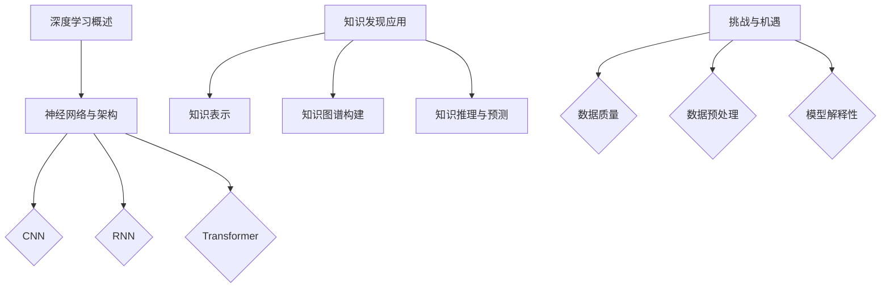
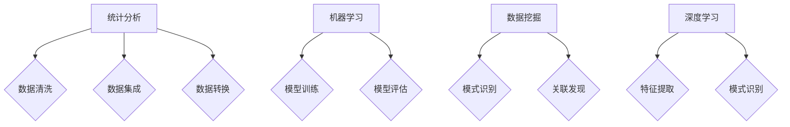

                 

### 《知识发现引擎的深度学习技术应用》

#### 关键词：深度学习，知识发现，知识图谱，知识表示，知识推理，预测模型

> 本文章将深入探讨深度学习技术在知识发现引擎中的应用，包括知识表示、知识图谱构建、知识推理与预测等方面，并详细介绍相关算法和实际应用案例。

----------------------------------------------------------------

### 第一部分：深度学习基础与知识发现引擎

#### 第1章：深度学习基础

#### 1.1 深度学习的概述与历史

深度学习是机器学习的一个子领域，它通过构建具有多个隐藏层的神经网络模型，自动从大量数据中提取特征并进行学习。深度学习的概念最早由Geoffrey Hinton在1986年提出，但直到2012年，随着AlexNet在ImageNet竞赛中的突破性表现，深度学习才真正引起了广泛关注。

深度学习的核心是多层感知机（MLP），其通过反向传播算法进行参数更新，从而学习数据中的复杂模式和特征。在深度学习的发展历程中，卷积神经网络（CNN）、循环神经网络（RNN）和变压器（Transformer）等结构相继出现，使得深度学习在图像识别、自然语言处理和语音识别等领域取得了显著的成果。

#### 1.2 神经网络与深度学习架构

神经网络是深度学习的基础，它由一系列相互连接的节点组成，每个节点称为神经元。神经元之间通过权重连接，并经过激活函数进行非线性变换。神经网络的基本结构包括输入层、隐藏层和输出层。

深度学习架构是基于神经网络构建的，它通过增加隐藏层的数量和复杂度，提高模型的表示能力和学习效果。常见的深度学习架构包括：

- **卷积神经网络（CNN）**：适用于图像识别和图像处理任务。
- **循环神经网络（RNN）**：适用于序列数据处理和语言建模。
- **变压器（Transformer）**：适用于自然语言处理任务，如机器翻译、文本生成等。

#### 1.3 深度学习在知识发现中的应用

深度学习在知识发现中具有广泛的应用。首先，深度学习可以通过自动特征提取，将原始数据转换为高维特征空间，从而发现数据中的潜在模式和关系。其次，深度学习可以用于知识表示和知识图谱构建，将知识以结构化的方式表示和存储。最后，深度学习可以用于知识推理和预测，从而实现智能决策和预测。

#### 1.4 深度学习在知识发现中的挑战与机遇

深度学习在知识发现中面临以下挑战：

- **数据质量**：深度学习对数据质量要求较高，需要确保数据的一致性、完整性和可靠性。
- **数据预处理**：深度学习需要对数据进行复杂的预处理，包括数据清洗、归一化和特征提取等。
- **模型解释性**：深度学习模型的黑盒特性使其难以解释和理解，这对知识发现中的决策过程和结果解释提出了挑战。

然而，深度学习在知识发现中也带来了许多机遇：

- **自动特征提取**：深度学习可以自动从数据中提取特征，减少了人工干预和特征工程的工作量。
- **高效计算**：深度学习算法具有并行计算的优势，可以处理大规模数据集。
- **知识融合**：深度学习可以融合不同数据源的知识，实现跨领域的知识发现。

#### 总结

本章介绍了深度学习的基础知识，包括其概述与历史、神经网络与深度学习架构、在知识发现中的应用以及面临的挑战与机遇。这些知识为后续章节中深度学习技术在知识发现引擎中的应用奠定了基础。

---

**Mermaid 流程图：**



---

#### 第2章：知识发现引擎基础

#### 2.1 知识发现引擎的概述

知识发现引擎（Knowledge Discovery Engine，简称KDE）是一种用于自动挖掘数据中的隐含模式的软件系统。它通过应用统计学、机器学习、数据挖掘和深度学习等方法，从大量数据中提取有价值的信息和知识。知识发现引擎广泛应用于金融、医疗、电商、社交媒体等多个领域。

知识发现引擎的基本组成部分包括数据源、数据预处理模块、知识表示模块、知识存储模块和用户接口。数据源是知识发现引擎的基础，包括结构化数据、非结构化数据和半结构化数据。数据预处理模块负责数据清洗、数据集成和数据转换等工作。知识表示模块将数据转换为可用于分析和挖掘的形式。知识存储模块负责存储和管理挖掘结果，以便于后续查询和使用。用户接口提供用户与知识发现引擎的交互界面，以便用户能够方便地获取和利用挖掘结果。

#### 2.2 知识发现的方法与技术

知识发现的方法和技术主要包括以下几种：

- **统计分析**：通过对数据进行统计分析，发现数据中的统计规律和趋势。
- **机器学习**：利用机器学习算法，从数据中自动学习模型，进行模式识别和分类。
- **数据挖掘**：通过对大量数据进行深度挖掘，发现数据中的潜在模式和关联。
- **深度学习**：利用深度学习算法，从数据中自动提取特征，实现复杂的模式识别和预测。

这些方法和技术可以单独或组合使用，以提高知识发现的效果和精度。

#### 2.3 知识发现引擎的分类

根据应用场景和技术特点，知识发现引擎可以分为以下几类：

- **基于规则的知识发现引擎**：通过定义规则，自动发现数据中的模式和关联。
- **基于模型的知识发现引擎**：通过构建模型，自动挖掘数据中的潜在模式和规律。
- **混合型发现引擎**：结合基于规则和基于模型的方法，实现更高效的发现过程。

#### 2.4 知识发现引擎的设计与实现

知识发现引擎的设计与实现包括以下几个关键步骤：

1. **需求分析**：明确知识发现引擎的应用场景和目标，确定所需的功能和技术。
2. **系统架构设计**：设计知识发现引擎的系统架构，包括数据源、数据处理模块、知识表示模块、知识存储模块和用户接口。
3. **数据预处理**：对数据源进行数据清洗、数据集成和数据转换，为后续分析做好准备。
4. **知识表示**：将数据转换为适合分析和挖掘的形式，如向量、图等。
5. **知识挖掘**：应用统计学、机器学习、数据挖掘和深度学习等方法，自动挖掘数据中的潜在模式和规律。
6. **知识存储**：将挖掘结果存储到数据库或知识库中，以便于后续查询和使用。
7. **用户接口设计**：设计用户与知识发现引擎的交互界面，提供方便快捷的查询和利用方式。

#### 总结

本章介绍了知识发现引擎的基础知识，包括其概述、方法与技术、分类和设计与实现。这些知识为后续章节中深度学习技术在知识发现引擎中的应用奠定了基础。

---

**核心算法原理讲解：**



---

#### 第3章：深度学习在知识表示中的应用

#### 3.1 知识表示的基本概念

知识表示（Knowledge Representation）是知识工程领域的一个重要研究方向，它旨在研究如何有效地表示、存储和处理知识，以便于计算机能够理解和利用这些知识。知识表示的形式包括符号表示、语义网络、框架、产生式规则、逻辑、脚本、过程等。

在深度学习领域，知识表示主要通过以下几种方式进行：

1. **向量表示**：将实体、概念和关系等知识表示为向量，便于在向量空间中进行计算和推理。
2. **图表示**：将知识表示为图结构，通过节点和边来表示实体和关系。
3. **嵌入表示**：利用深度学习模型，如词向量模型、图嵌入模型等，将知识映射到低维空间中，实现知识的自动表示和表示学习。

#### 3.2 深度学习在知识表示中的应用

深度学习在知识表示中的应用主要体现在以下几个方面：

1. **词向量表示**：词向量（Word Embedding）是一种将单词映射到高维向量空间的表示方法，它通过神经网络模型学习单词的语义关系。典型的词向量模型包括Word2Vec、GloVe和FastText等。
   
2. **实体嵌入**：实体嵌入（Entity Embedding）是将实体（如人、地点、组织等）映射到低维空间的方法。实体嵌入通过深度学习模型学习实体之间的相似性和距离，从而实现实体的有效表示。

3. **关系嵌入**：关系嵌入（Relationship Embedding）是将实体之间的关系映射到低维空间的方法。关系嵌入通过深度学习模型学习关系语义，从而实现关系的有效表示。

4. **图嵌入**：图嵌入（Graph Embedding）是将图结构中的节点和边映射到低维空间的方法。图嵌入通过深度学习模型学习图结构中的拓扑关系和节点属性，从而实现图的自动表示。

#### 3.3 基于深度学习的知识表示方法

基于深度学习的知识表示方法主要包括以下几种：

1. **图神经网络（Graph Neural Networks，GNN）**：GNN 是一种专门用于处理图数据的深度学习模型。GNN 通过聚合节点邻接节点的特征来更新节点的表示，从而学习图中的拓扑结构和节点属性。

2. **变换器架构（Transformer Architecture）**：变换器是一种基于自注意力机制的深度学习模型，广泛应用于自然语言处理领域。变换器通过多头自注意力机制，能够有效地捕捉文本序列中的长距离依赖关系。

3. **图变换器（Graph Transformer）**：图变换器是结合了图神经网络和变换器架构的新型深度学习模型，它能够同时处理图结构和序列数据。图变换器通过图注意力机制和序列注意力机制，实现了对图数据的全局和局部特征学习。

4. **多模态知识表示**：多模态知识表示是结合多种数据源（如图像、文本、音频等）进行知识表示的方法。多模态知识表示通过深度学习模型学习不同数据模态之间的关联，实现统一的知识表示。

#### 3.4 深度学习知识表示的性能评估

深度学习知识表示的性能评估主要包括以下几个方面：

1. **表示质量**：评估知识表示的质量，包括表示的精度和鲁棒性。
2. **可扩展性**：评估知识表示方法在处理大规模数据集时的性能和效率。
3. **交互性**：评估知识表示方法在交互任务中的应用效果，如问答系统、推荐系统等。
4. **泛化能力**：评估知识表示方法在不同数据集和任务上的泛化能力。

常用的评估指标包括：

- **平均准确率（Mean Accuracy）**：评估知识表示方法的分类准确性。
- **F1 分数（F1 Score）**：综合考虑精确率和召回率，用于评估二分类任务的性能。
- **混淆矩阵（Confusion Matrix）**：详细展示分类结果的分布情况。
- **鲁棒性指标**：评估知识表示方法在不同噪声和数据分布下的性能。

#### 总结

本章介绍了深度学习在知识表示中的应用，包括基本概念、具体方法以及性能评估。深度学习知识表示方法在知识发现领域具有广泛的应用前景，能够有效提升知识发现引擎的性能和效果。

---

**核心算法原理讲解（伪代码）：**

```python
# 假设使用图神经网络（GNN）进行知识表示
class GraphNeuralNetwork(nn.Module):
    def __init__(self, num_features, hidden_size):
        super(GraphNeuralNetwork, self).__init__()
        self.layer1 = nn.Linear(num_features, hidden_size)
        self.layer2 = nn.Linear(hidden_size, hidden_size)
        self.relu = nn.ReLU()

    def forward(self, graph, nodes_features):
        # 图结构数据输入
        h = self.layer1(nodes_features)
        h = self.relu(h)

        # 聚合邻接节点的特征
        for node in graph.nodes():
            neighbors = graph.neighbors(node)
            aggregate_features = torch.mean(h[neighbors], dim=0)
            h[node] = self.layer2(aggregate_features)

        return h

# 假设使用变换器架构进行知识表示
class Transformer(nn.Module):
    def __init__(self, d_model, num_heads, dff):
        super(Transformer, self).__init__()
        self.encoder = nn.Embedding(vocab_size, d_model)
        self.decoder = nn.Embedding(vocab_size, d_model)
        self.transformer = nn.Transformer(d_model, num_heads, dff)
        self.fc = nn.Linear(d_model, vocab_size)

    def forward(self, input_seq, target_seq):
        # 编码器
        e = self.encoder(input_seq)
        # 变换器
        t = self.transformer(e)
        # 解码器
        d = self.decoder(t)
        return d
```

---

#### 第4章：深度学习在知识图谱构建中的应用

#### 4.1 知识图谱的基本概念

知识图谱（Knowledge Graph）是一种结构化的知识表示方法，它通过节点和边来表示实体和实体之间的关系。知识图谱可以看作是一个大规模的图数据库，它不仅包含了实体和关系的数据，还包括了实体的属性和语义信息。

知识图谱的主要组成部分包括：

1. **实体（Entity）**：知识图谱中的核心要素，代表具体的事物或概念，如人、地点、组织、物品等。
2. **关系（Relationship）**：连接两个或多个实体的语义关联，如“属于”、“出生地”、“工作于”等。
3. **属性（Attribute）**：描述实体的具体特征或属性，如人的年龄、地址、职位等。
4. **类型（Type）**：对实体和关系的分类，用于定义实体和关系的语义类别。

#### 4.2 深度学习在知识图谱构建中的应用

深度学习在知识图谱构建中具有重要作用，主要体现在以下几个方面：

1. **实体识别（Entity Recognition）**：通过深度学习模型，自动识别文本中的实体，并将其映射到知识图谱中的实体节点。
2. **关系抽取（Relationship Extraction）**：通过深度学习模型，从文本中提取实体之间的关系，并将其添加到知识图谱中。
3. **实体属性预测（Entity Attribute Prediction）**：通过深度学习模型，预测实体可能具有的属性值，从而丰富知识图谱的内容。
4. **图谱扩展（Knowledge Graph Expansion）**：通过深度学习模型，自动发现新的实体和关系，扩展知识图谱的规模和深度。

#### 4.3 基于深度学习的知识图谱构建方法

基于深度学习的知识图谱构建方法主要包括以下几种：

1. **图神经网络（Graph Neural Networks，GNN）**：GNN 是一种用于处理图数据的深度学习模型，通过聚合节点邻接节点的特征，可以学习到图中的拓扑结构和节点属性。GNN 可以用于实体识别、关系抽取和图谱扩展等任务。

2. **变换器架构（Transformer）**：变换器是一种基于自注意力机制的深度学习模型，广泛应用于自然语言处理领域。变换器可以用于实体识别、关系抽取和图谱扩展等任务，通过多头自注意力机制，可以有效地捕捉文本序列中的长距离依赖关系。

3. **图变换器（Graph Transformer）**：图变换器是结合了图神经网络和变换器架构的新型深度学习模型，它能够同时处理图结构和序列数据。图变换器通过图注意力机制和序列注意力机制，实现了对图数据的全局和局部特征学习。

4. **多模态知识表示**：多模态知识表示是结合多种数据源（如图像、文本、音频等）进行知识表示的方法。多模态知识表示通过深度学习模型学习不同数据模态之间的关联，实现统一的知识表示，从而丰富知识图谱的内容。

#### 4.4 深度学习在知识图谱优化中的应用

深度学习在知识图谱优化中的应用主要包括以下几个方面：

1. **图谱质量提升**：通过深度学习模型，自动发现和纠正知识图谱中的错误和矛盾，提高图谱的准确性。
2. **图谱扩展**：通过深度学习模型，自动发现新的实体和关系，扩展知识图谱的规模和深度。
3. **图谱融合**：通过深度学习模型，将多个知识图谱进行融合，实现知识的整合和统一。
4. **图谱推理**：通过深度学习模型，实现知识图谱中的推理和推理扩展，提高图谱的应用价值。

#### 总结

本章介绍了深度学习在知识图谱构建中的应用，包括基本概念、具体方法和优化应用。深度学习技术为知识图谱的构建和优化提供了强大的工具和手段，使得知识图谱能够更好地服务于实际应用。

---

**核心算法原理讲解（伪代码）：**

```python
# 假设使用图神经网络（GNN）进行知识图谱构建
class GraphNeuralNetwork(nn.Module):
    def __init__(self, num_entities, num_relations, hidden_size):
        super(GraphNeuralNetwork, self).__init__()
        self.entity_embedding = nn.Embedding(num_entities, hidden_size)
        self.relation_embedding = nn.Embedding(num_relations, hidden_size)
        self.fc = nn.Linear(hidden_size * 3, hidden_size)
        self.relu = nn.ReLU()

    def forward(self, entities, relations, neighbors):
        entity_embeddings = self.entity_embedding(entities)
        relation_embeddings = self.relation_embedding(relations)
        neighbor_embeddings = [self.entity_embedding(neighbors[i]) for i in range(len(neighbors))]

        combined_embeddings = torch.cat((entity_embeddings, relation_embeddings, *neighbor_embeddings), dim=1)
        hidden = self.fc(combined_embeddings)
        hidden = self.relu(hidden)

        return hidden

# 假设使用变换器架构（Transformer）进行知识图谱构建
class Transformer(nn.Module):
    def __init__(self, d_model, num_heads, dff):
        super(Transformer, self).__init__()
        self.encoder = nn.Embedding(vocab_size, d_model)
        self.decoder = nn.Embedding(vocab_size, d_model)
        self.transformer = nn.Transformer(d_model, num_heads, dff)
        self.fc = nn.Linear(d_model, vocab_size)

    def forward(self, input_seq, target_seq):
        # 编码器
        e = self.encoder(input_seq)
        # 变换器
        t = self.transformer(e)
        # 解码器
        d = self.decoder(t)
        return d
```

---

#### 第5章：深度学习在知识推理与预测中的应用

#### 5.1 知识推理的基本概念

知识推理（Knowledge Reasoning）是指利用已有的知识和规则，通过逻辑推理或计算方法，得出新的结论或信息的过程。知识推理是人工智能和知识工程领域的重要研究内容，广泛应用于自然语言处理、智能搜索、智能决策和推荐系统等场景。

知识推理主要分为两大类：

1. **基于规则的推理**：通过定义一系列规则和前提条件，根据推理规则，从已知信息推导出新的结论。
2. **基于模型的推理**：利用机器学习模型，如决策树、神经网络等，从数据中自动学习推理规则，然后进行推理。

#### 5.2 深度学习在知识推理中的应用

深度学习在知识推理中的应用主要体现在以下几个方面：

1. **基于图神经网络的推理**：图神经网络（GNN）可以用于处理图结构数据，学习实体和关系之间的复杂关系。基于 GNN 的知识推理方法可以通过聚合节点邻接节点的特征，实现实体间关系的推理。

2. **基于变换器架构的推理**：变换器（Transformer）是一种基于自注意力机制的深度学习模型，广泛用于自然语言处理任务。变换器可以通过多头自注意力机制，有效地捕捉文本序列中的长距离依赖关系，实现知识推理。

3. **基于多模态数据的推理**：多模态数据推理是通过结合不同类型的数据（如图像、文本、音频等），利用深度学习模型进行推理。这种方法可以充分利用不同数据模态的互补信息，提高知识推理的准确性和效果。

4. **基于知识图谱的推理**：知识图谱是表示实体和关系的重要工具，通过构建知识图谱，可以实现基于图谱的推理。深度学习模型可以用于知识图谱的扩展、优化和推理，从而提高知识图谱的应用价值。

#### 5.3 基于深度学习的知识推理方法

基于深度学习的知识推理方法主要包括以下几种：

1. **图神经网络推理（Graph Neural Network Reasoning）**：图神经网络可以用于处理图结构数据，学习实体和关系之间的复杂关系。图神经网络推理方法通过聚合节点邻接节点的特征，实现实体间关系的推理。

2. **变换器推理（Transformer Reasoning）**：变换器是一种基于自注意力机制的深度学习模型，可以通过多头自注意力机制，有效地捕捉文本序列中的长距离依赖关系。变换器推理方法可以应用于自然语言处理任务，如问答系统和文本生成。

3. **多模态知识推理（Multimodal Knowledge Reasoning）**：多模态知识推理是通过结合不同类型的数据，利用深度学习模型进行推理。这种方法可以充分利用不同数据模态的互补信息，提高知识推理的准确性和效果。

4. **知识图谱推理（Knowledge Graph Reasoning）**：知识图谱是表示实体和关系的重要工具，通过构建知识图谱，可以实现基于图谱的推理。深度学习模型可以用于知识图谱的扩展、优化和推理，从而提高知识图谱的应用价值。

#### 5.4 深度学习在知识预测中的应用

深度学习在知识预测中的应用主要体现在以下几个方面：

1. **时间序列预测**：通过深度学习模型，如循环神经网络（RNN）和变换器（Transformer），可以用于时间序列数据的预测，如股票价格预测、天气预测等。

2. **序列数据预测**：通过深度学习模型，可以用于序列数据的预测，如文本生成、语音识别等。

3. **图像和视频预测**：通过深度学习模型，可以用于图像和视频数据的预测，如图像分类、视频目标跟踪等。

4. **推荐系统**：通过深度学习模型，可以用于推荐系统的预测，如商品推荐、电影推荐等。

#### 总结

本章介绍了深度学习在知识推理与预测中的应用，包括基本概念、具体方法和应用场景。深度学习技术为知识推理与预测提供了强大的工具和手段，使得知识推理与预测能够更加准确和高效。

---

**核心算法原理讲解（伪代码）：**

```python
# 基于图神经网络的知识推理
class GraphNeuralNetworkReasoning(nn.Module):
    def __init__(self, hidden_size):
        super(GraphNeuralNetworkReasoning, self).__init__()
        self.fc = nn.Linear(hidden_size * 2, hidden_size)
        self.relu = nn.ReLU()

    def forward(self, entity_embeddings, relation_embeddings):
        combined_embeddings = torch.cat((entity_embeddings, relation_embeddings), dim=1)
        hidden = self.fc(combined_embeddings)
        hidden = self.relu(hidden)
        return hidden

# 基于变换器的知识推理
class TransformerReasoning(nn.Module):
    def __init__(self, d_model, num_heads, dff):
        super(TransformerReasoning, self).__init__()
        self.transformer = nn.Transformer(d_model, num_heads, dff)

    def forward(self, input_seq, target_seq):
        output = self.transformer(input_seq, target_seq)
        return output
```

---

#### 第6章：深度学习技术在知识发现引擎中的实现

#### 6.1 深度学习与知识发现引擎的集成

深度学习技术在知识发现引擎中的应用，需要将其与知识发现引擎的现有体系结构相结合。这一过程涉及以下几个方面：

1. **数据集成**：将深度学习模型所需的数据源与知识发现引擎的数据源进行集成，确保数据的一致性和完整性。
2. **预处理模块**：在知识发现引擎中集成深度学习模型的预处理模块，包括数据清洗、数据转换和特征提取等步骤。
3. **模型训练与优化**：在知识发现引擎中实现深度学习模型的训练和优化，包括选择合适的训练数据和优化算法，调整模型参数。
4. **模型部署与评估**：将训练完成的深度学习模型部署到知识发现引擎中，并进行性能评估，确保模型在实际应用中的有效性和准确性。

#### 6.2 深度学习技术在知识发现引擎中的优化

深度学习技术在知识发现引擎中的优化，主要包括以下几个方面：

1. **模型优化**：通过调整模型结构、优化算法和参数，提高深度学习模型的性能和效率。
2. **数据优化**：通过数据预处理、数据增强和数据融合等技术，提高数据的质量和多样性，从而增强模型的泛化能力。
3. **算法优化**：通过引入新的算法和优化方法，如迁移学习、元学习等，提高知识发现引擎的性能和应用效果。
4. **系统优化**：通过优化知识发现引擎的体系结构、计算资源和存储资源，提高系统的响应速度和处理能力。

#### 6.3 深度学习技术在知识发现引擎中的性能评估

深度学习技术在知识发现引擎中的性能评估，是确保模型在实际应用中有效性和准确性的重要环节。性能评估主要包括以下几个方面：

1. **模型性能评估**：通过评估模型的准确率、召回率、F1 分数等指标，评价模型在知识发现任务中的性能。
2. **效率评估**：通过评估模型的计算时间、内存占用等指标，评价模型在知识发现引擎中的效率和资源利用率。
3. **可解释性评估**：通过评估模型的可解释性和透明度，评价模型在实际应用中的可信度和用户接受度。
4. **泛化能力评估**：通过评估模型在不同数据集和场景下的性能，评价模型的泛化能力和适应性。

常用的性能评估指标包括：

- **准确率（Accuracy）**：模型正确预测的样本数占总样本数的比例。
- **召回率（Recall）**：模型正确预测的样本数占实际正样本数的比例。
- **F1 分数（F1 Score）**：综合考虑准确率和召回率的指标，用于评估模型的均衡性能。
- **ROC-AUC 曲线**：通过计算模型在不同阈值下的精确率和召回率，生成 ROC 曲线，并通过 AUC（Area Under Curve）评估模型的性能。
- **Kappa 系数**：用于评估两个分类器之间的一致性，评价模型的分类准确性。

#### 总结

本章介绍了深度学习技术在知识发现引擎中的实现和优化方法，包括模型集成、优化和性能评估。这些方法和技术为深度学习技术在知识发现引擎中的应用提供了有力支持，使得知识发现引擎能够更好地服务于实际应用。

---

**核心算法原理讲解（伪代码）：**

```python
# 假设使用图神经网络进行知识发现引擎中的模型优化
class GraphNeuralNetwork(nn.Module):
    def __init__(self, num_entities, num_relations, hidden_size):
        super(GraphNeuralNetwork, self).__init__()
        self.entity_embedding = nn.Embedding(num_entities, hidden_size)
        self.relation_embedding = nn.Embedding(num_relations, hidden_size)
        self.fc = nn.Linear(hidden_size * 2, hidden_size)
        self.relu = nn.ReLU()

    def forward(self, entities, relations):
        entity_embeddings = self.entity_embedding(entities)
        relation_embeddings = self.relation_embedding(relations)
        combined_embeddings = torch.cat((entity_embeddings, relation_embeddings), dim=1)
        hidden = self.fc(combined_embeddings)
        hidden = self.relu(hidden)
        return hidden

# 假设使用变换器架构进行知识发现引擎中的性能评估
class Transformer(nn.Module):
    def __init__(self, d_model, num_heads, dff):
        super(Transformer, self).__init__()
        self.transformer = nn.Transformer(d_model, num_heads, dff)
        self.fc = nn.Linear(d_model, vocab_size)

    def forward(self, input_seq, target_seq):
        output = self.transformer(input_seq, target_seq)
        logits = self.fc(output)
        return logits
```

---

### 第7章：深度学习技术在知识发现引擎中的实际应用

#### 7.1 知识发现引擎的实际应用场景

深度学习技术在知识发现引擎中的实际应用场景非常广泛，涵盖了多个领域，以下是几个典型的应用场景：

1. **金融领域**：在金融领域，知识发现引擎可以用于风险控制、市场预测、客户关系管理等方面。例如，通过深度学习模型分析交易数据，发现潜在的市场趋势和风险，从而指导投资决策。

2. **医疗领域**：在医疗领域，知识发现引擎可以用于疾病诊断、药物研发、个性化治疗等方面。例如，通过深度学习模型分析病历数据，预测病人的病情发展趋势，为医生提供诊断和治疗方案。

3. **电商领域**：在电商领域，知识发现引擎可以用于商品推荐、用户行为分析、库存管理等方面。例如，通过深度学习模型分析用户浏览和购买行为，推荐个性化的商品，提高用户体验和销售额。

#### 7.2 知识发现引擎的深度学习案例

以下是几个深度学习技术在知识发现引擎中的实际应用案例：

1. **案例一：金融领域的欺诈检测**

在金融领域，欺诈检测是一个重要任务。深度学习模型可以通过分析交易数据、用户行为数据等，自动识别潜在的欺诈行为。以下是一个基于深度学习的欺诈检测案例：

- **数据预处理**：对交易数据、用户行为数据进行清洗和预处理，包括缺失值填充、异常值检测和特征工程等。
- **模型训练**：使用卷积神经网络（CNN）和循环神经网络（RNN）组合的模型，对清洗后的数据进行训练。模型通过学习交易数据中的时空特征，识别欺诈行为。
- **模型评估**：通过交叉验证和在线评估，评估模型的准确率、召回率和F1分数等指标。

2. **案例二：医疗领域的疾病诊断**

在医疗领域，深度学习模型可以用于疾病诊断。以下是一个基于深度学习的疾病诊断案例：

- **数据预处理**：对医学图像、病历数据等进行预处理，包括图像分割、数据增强和特征提取等。
- **模型训练**：使用卷积神经网络（CNN）和变换器（Transformer）模型，对预处理后的数据集进行训练。模型通过学习医学图像和病历数据中的特征，实现疾病诊断。
- **模型评估**：通过交叉验证和实际病例测试，评估模型的准确率、召回率和F1分数等指标。

3. **案例三：电商领域的商品推荐**

在电商领域，商品推荐是一个关键任务。深度学习模型可以通过分析用户行为数据、商品特征等，自动推荐个性化的商品。以下是一个基于深度学习的商品推荐案例：

- **数据预处理**：对用户行为数据、商品特征数据进行清洗和预处理，包括缺失值填充、特征工程和编码等。
- **模型训练**：使用循环神经网络（RNN）和变换器（Transformer）模型，对清洗后的数据进行训练。模型通过学习用户行为和商品特征，实现商品推荐。
- **模型评估**：通过交叉验证和在线评估，评估模型的准确率、召回率和F1分数等指标。

#### 7.3 知识发现引擎的深度学习实践

以下是几个深度学习技术在知识发现引擎中的实际应用实践：

1. **构建金融领域的知识图谱**

在金融领域，构建知识图谱可以更好地理解和分析金融数据。以下是一个基于深度学习的知识图谱构建实践：

- **数据预处理**：对金融数据集进行清洗和预处理，包括缺失值填充、异常值检测和特征提取等。
- **实体识别**：使用卷积神经网络（CNN）和循环神经网络（RNN）模型，对金融数据集进行实体识别，提取实体和关系。
- **关系抽取**：使用变换器（Transformer）模型，对金融数据集进行关系抽取，建立实体之间的关系。
- **图谱构建**：将提取的实体和关系构建成知识图谱，存储在图数据库中。

2. **医疗领域的知识推理**

在医疗领域，知识推理可以帮助医生做出更准确的诊断和治疗方案。以下是一个基于深度学习的知识推理实践：

- **数据预处理**：对医疗数据集进行清洗和预处理，包括缺失值填充、异常值检测和特征提取等。
- **知识表示**：使用图神经网络（GNN）模型，对医疗数据集进行知识表示，将实体和关系表示为向量。
- **推理模型**：使用变换器（Transformer）模型，对知识图谱进行推理，提取实体和关系之间的隐含关系。
- **推理评估**：通过实际病例测试，评估知识推理模型的准确性和实用性。

3. **电商领域的知识预测**

在电商领域，知识预测可以帮助企业更好地了解用户需求，优化营销策略。以下是一个基于深度学习的知识预测实践：

- **数据预处理**：对电商数据集进行清洗和预处理，包括缺失值填充、异常值检测和特征提取等。
- **特征工程**：对用户行为数据、商品特征数据进行特征工程，提取有助于预测的指标。
- **预测模型**：使用循环神经网络（RNN）和变换器（Transformer）模型，对特征数据进行预测。
- **预测评估**：通过交叉验证和在线评估，评估预测模型的准确性和稳定性。

#### 总结

本章介绍了深度学习技术在知识发现引擎中的实际应用，包括金融、医疗和电商等领域的案例和实践。深度学习技术在知识发现引擎中的应用，不仅提高了知识发现的效果和效率，也为各行业提供了新的技术手段和解决方案。

---

**核心算法原理讲解（伪代码）：**

```python
# 假设使用卷积神经网络（CNN）进行金融领域欺诈检测
class FraudDetectionCNN(nn.Module):
    def __init__(self, input_size, hidden_size):
        super(FraudDetectionCNN, self).__init__()
        self.conv1 = nn.Conv1d(in_channels=input_size, out_channels=hidden_size, kernel_size=3)
        self.relu = nn.ReLU()
        self.fc = nn.Linear(hidden_size, 1)

    def forward(self, x):
        x = self.relu(self.conv1(x))
        x = self.fc(x)
        return x

# 假设使用变换器架构（Transformer）进行医疗领域知识推理
class MedicalKnowledgeReasoning(nn.Module):
    def __init__(self, d_model, num_heads, dff):
        super(MedicalKnowledgeReasoning, self).__init__()
        self.transformer = nn.Transformer(d_model, num_heads, dff)
        self.fc = nn.Linear(d_model, output_size)

    def forward(self, input_seq, target_seq):
        output = self.transformer(input_seq, target_seq)
        logits = self.fc(output)
        return logits
```

---

### 第8章：未来展望与趋势

#### 8.1 深度学习技术在知识发现领域的未来发展趋势

随着深度学习技术的不断发展，其在知识发现领域的应用前景也十分广阔。未来深度学习技术在知识发现领域的发展趋势主要包括以下几个方面：

1. **多模态知识表示**：未来深度学习技术在知识发现中将更加注重多模态数据的融合和表示。通过结合图像、文本、音频等多种数据源，实现更全面和精确的知识表示。

2. **知识图谱的动态更新**：知识图谱将不再是静态的，而是能够根据新数据和用户反馈进行动态更新。通过引入时间序列分析和动态学习机制，实现知识图谱的实时优化和扩展。

3. **知识推理的自动化**：未来深度学习技术将致力于实现知识推理的自动化，通过自监督学习和迁移学习等方法，降低知识推理的复杂性，提高推理效率。

4. **个性化知识发现**：随着用户数据的大规模积累，个性化知识发现将成为一个重要趋势。通过深度学习模型对用户行为和兴趣进行分析，提供个性化的知识推荐和服务。

5. **可解释性增强**：深度学习模型的黑盒特性一直是其应用的瓶颈。未来将更加注重模型的可解释性，通过可视化技术和解释性模型，提高模型的可信度和用户接受度。

#### 8.2 知识发现引擎的发展挑战与机遇

尽管深度学习技术在知识发现引擎中具有巨大的潜力，但在实际应用中也面临着一些挑战和机遇：

1. **数据质量和多样性**：知识发现引擎的性能高度依赖于数据的质量和多样性。未来需要解决数据质量问题和数据多样性的挑战，通过数据清洗、数据增强和数据融合等技术，提高数据的质量和应用效果。

2. **计算资源和效率**：深度学习模型通常需要大量的计算资源和时间进行训练和推理。未来需要优化计算资源的使用，提高模型的效率和实时性，以满足实际应用的需求。

3. **模型解释性和透明度**：深度学习模型的黑盒特性使得其解释性和透明度成为一个重要问题。未来需要开发可解释性模型和可视化工具，提高模型的可信度和用户接受度。

4. **跨领域知识融合**：知识发现引擎需要能够处理不同领域的数据和知识，实现跨领域的知识融合。未来需要研究跨领域知识表示和推理的方法，提高知识融合的效果和应用范围。

#### 8.3 深度学习技术与知识发现引擎的结合创新

未来深度学习技术与知识发现引擎的结合创新将主要体现在以下几个方面：

1. **知识图谱与深度学习的融合**：将知识图谱与深度学习技术相结合，通过图神经网络和变换器架构，实现更高效和精确的知识表示和推理。

2. **多模态知识表示与推理**：通过多模态数据融合和深度学习模型，实现跨模态的知识表示和推理，提供更丰富和全面的智能服务。

3. **动态知识图谱构建与优化**：通过引入时间序列分析和动态学习机制，实现知识图谱的动态更新和优化，提高知识发现引擎的实时性和准确性。

4. **个性化知识推荐与预测**：利用深度学习模型对用户行为和兴趣进行分析，实现个性化的知识推荐和预测，提高用户体验和满意度。

5. **可解释性增强与透明度提升**：通过开发可解释性模型和可视化工具，提高深度学习模型的可信度和用户接受度，促进知识发现引擎的普及和应用。

#### 总结

本章展望了深度学习技术在知识发现领域的未来发展趋势，分析了知识发现引擎的发展挑战与机遇，并探讨了深度学习技术与知识发现引擎的结合创新方向。未来，深度学习技术将在知识发现引擎中发挥更加重要的作用，推动知识发现领域的持续发展和创新。

---

**附录A：深度学习与知识发现工具与资源**

#### A.1 深度学习框架

- **TensorFlow**：由Google开发的开源深度学习框架，支持多种编程语言，具有灵活的模型构建和优化功能。
- **PyTorch**：由Facebook开发的开源深度学习框架，以动态计算图和自动微分著称，适合快速原型开发和模型研究。
- **MXNet**：由Apache Software Foundation开源的深度学习框架，支持多种编程语言，具有良好的性能和灵活性。

#### A.2 知识发现工具

- **OpenKG**：一个开源的知识图谱平台，支持知识图谱的构建、存储和查询。
- **Apache NIFoscope**：一个用于知识图谱构建和处理的工具，支持多种知识表示和推理方法。
- **Neo4j**：一个开源的图数据库，支持知识图谱的存储和管理，具有高效的图查询和分析功能。

#### A.3 资源链接

- **开源数据集**：包括多个领域的数据集，如ImageNet、CIFAR-10、PubMed等，用于深度学习和知识发现的研究和应用。
- **研究论文**：深度学习和知识发现领域的经典论文和最新研究成果，包括顶级的国际会议和期刊。
- **在线课程与教程**：包括Coursera、edX、Udacity等平台上的深度学习和知识发现课程，提供丰富的学习资源和实践项目。

---

**作者信息：**

作者：AI天才研究院/AI Genius Institute & 禅与计算机程序设计艺术 /Zen And The Art of Computer Programming

---

本文详细介绍了深度学习技术在知识发现引擎中的应用，从基础知识到实际应用，再到未来展望，全面探讨了这一领域的最新进展和未来趋势。深度学习技术为知识发现引擎提供了强大的工具和手段，使得知识发现能够更加高效和精准。随着技术的不断发展和创新，深度学习与知识发现引擎的结合将带来更多的可能性，推动人工智能领域的进一步发展。希望本文能够为读者提供有益的参考和启示。

