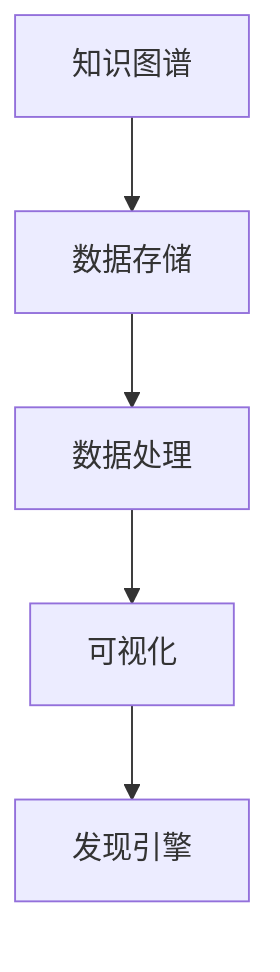

                 

# 知识图谱可视化在发现引擎中的实现

## 概述

在信息化和互联网技术飞速发展的今天，数据已成为新的生产要素，而知识图谱作为数据的高级表示形式，正逐渐成为数据管理和智能分析的核心。知识图谱通过对实体、关系和属性的精细描述，构建起一个结构化的知识网络，使得数据之间的关系更加清晰，便于后续的智能分析。可视化作为一种直观、高效的数据分析工具，其与知识图谱的结合，能够大大提升知识图谱的使用价值和用户体验。

本文将围绕知识图谱可视化在发现引擎中的应用进行深入探讨。首先，我们将介绍知识图谱的基本概念、组成元素及其应用场景。随后，本文将解析知识图谱可视化的原理、挑战和常用方法。接下来，本文将列举主流的知识图谱可视化工具与库，并分析它们的使用场景和实际应用案例。在此基础上，本文将探讨知识图谱可视化在发现引擎中的应用，包括其作用、实现步骤和优化策略。最后，本文将通过实战案例，详细解读知识图谱可视化在发现引擎中的实际应用，并展望其未来的发展方向。

通过本文的阅读，读者将全面了解知识图谱可视化的技术原理、应用场景和实践方法，为后续的开发和研究提供有力支持。

## 关键词

知识图谱、可视化、发现引擎、数据存储、数据处理、算法复杂度、交互体验、数据质量。

## 摘要

本文主要介绍了知识图谱可视化在发现引擎中的实现。首先，对知识图谱的基本概念、组成元素和应用场景进行了概述。然后，详细阐述了知识图谱可视化的原理、挑战和常用方法。接着，列举了主流的知识图谱可视化工具与库，并分析了它们的使用场景和实际应用案例。在此基础上，本文重点探讨了知识图谱可视化在发现引擎中的应用，包括其作用、实现步骤和优化策略。最后，通过实战案例，对知识图谱可视化在发现引擎中的实际应用进行了详细解读，并展望了其未来的发展方向。

## 第一部分：知识图谱与可视化基础

### 第1章：知识图谱概述

#### 1.1.1 知识图谱的基本概念

知识图谱（Knowledge Graph）是近年来随着大数据和人工智能技术的发展而兴起的一种新型数据表示方法。它通过将实体、关系和属性以图形的形式进行组织，形成一种结构化的知识网络。知识图谱的基本概念包括实体（Entity）、关系（Relationship）和属性（Attribute）。

- **实体（Entity）**：实体是知识图谱中的基本元素，可以是人、地点、事物等。例如，在一个电商知识图谱中，实体可以包括商品、用户、店铺等。
- **关系（Relationship）**：关系描述了实体之间的关联。例如，在电商知识图谱中，商品与用户之间可能存在购买关系、评价关系等。
- **属性（Attribute）**：属性描述了实体的特征或属性。例如，在电商知识图谱中，商品可能具有品牌、价格、库存等属性。

知识图谱通过这些基本概念，将现实世界中的复杂关系抽象成结构化的数据模型，使得数据之间的关系更加清晰，便于后续的智能分析和应用。

#### 1.1.2 知识图谱的组成元素

知识图谱的组成元素主要包括数据源、数据存储、数据处理、知识图谱构建、知识图谱可视化等。

- **数据源**：数据源是知识图谱构建的基础，包括结构化数据、半结构化数据和非结构化数据。例如，电商平台的商品信息、用户评价、交易记录等都可以作为知识图谱的数据源。
- **数据存储**：数据存储是知识图谱的物理存储方式，常用的技术包括图数据库（如Neo4j、JanusGraph）和关系数据库（如MySQL、PostgreSQL）等。图数据库由于其灵活的图结构表示，更适合知识图谱的存储和管理。
- **数据处理**：数据处理包括数据清洗、数据整合、数据分类等过程，目的是将原始数据转化为适合构建知识图谱的格式。
- **知识图谱构建**：知识图谱构建是知识图谱的核心步骤，包括实体识别、关系抽取、属性填充等过程。通过这些步骤，将原始数据转化为知识图谱的结构化数据。
- **知识图谱可视化**：知识图谱可视化是将知识图谱以图形的形式呈现，便于用户理解和分析。常用的可视化工具包括D3.js、Cytoscape.js等。

#### 1.1.3 知识图谱的应用场景

知识图谱的应用场景非常广泛，涵盖了多个领域。

- **搜索引擎**：知识图谱可以用于搜索引擎的优化，通过建立实体和关系之间的关联，提高搜索的准确性和相关性。
- **推荐系统**：知识图谱可以用于推荐系统的优化，通过分析实体之间的关系，为用户推荐更加精准的物品。
- **自然语言处理**：知识图谱可以用于自然语言处理，如语义理解、问答系统等，通过将文本转化为知识图谱，提高处理的效果和效率。
- **企业知识管理**：知识图谱可以用于企业知识管理，通过构建企业内部的实体和关系，实现知识的组织和共享。
- **智能客服**：知识图谱可以用于智能客服，通过分析用户与客服之间的对话，提供更加智能和个性化的服务。

### 第2章：知识图谱可视化原理

#### 2.1.1 可视化的基本概念

可视化（Visualization）是一种通过图形、图像等视觉形式呈现数据和信息的方法。它可以帮助用户更好地理解和分析数据，揭示数据背后的模式和关系。

- **基本概念**：可视化包括数据可视化、信息可视化、知识可视化等层次。数据可视化主要关注数据的呈现，如柱状图、折线图等；信息可视化则关注信息的组织和传递，如图表、地图等；知识可视化则更注重知识的呈现和挖掘，如知识图谱、思维导图等。
- **作用**：可视化有助于数据的理解和分析，提高决策的准确性和效率。它可以帮助用户从大量的数据中快速找到关键信息，发现数据之间的关联和模式。
- **挑战**：可视化面临许多挑战，如数据的复杂性、多样性和动态性等。此外，如何设计出直观、易用的可视化界面，提高用户的交互体验，也是一大难题。

#### 2.1.2 知识图谱可视化的挑战

知识图谱可视化作为知识可视化的一种形式，面临着许多独特的挑战。

- **数据复杂性**：知识图谱通常包含大量的实体、关系和属性，数据复杂性较高。如何有效地组织和呈现这些数据，使其具有可读性和易用性，是一个重要挑战。
- **数据多样性**：知识图谱的数据来源多样，包括结构化数据、半结构化数据和非结构化数据。如何统一这些数据，实现数据的一致性和完整性，是另一个挑战。
- **交互体验**：知识图谱可视化需要提供丰富的交互功能，如搜索、筛选、缩放等，以使用户能够灵活地探索和操作数据。然而，如何设计出直观、易用的交互界面，提高用户的交互体验，也是一个重要挑战。
- **性能优化**：知识图谱可视化通常需要处理大量的数据和图形渲染，对性能提出了较高的要求。如何优化渲染速度、降低内存消耗等，是另一个挑战。

#### 2.1.3 知识图谱可视化的方法

知识图谱可视化有多种方法，包括图形可视化、网络可视化、地图可视化等。

- **图形可视化**：图形可视化是通过图形的方式呈现知识图谱，如节点、边、标签等。常见的图形可视化工具包括D3.js、Cytoscape.js等。
- **网络可视化**：网络可视化是通过网络图的形式呈现知识图谱，强调节点和边之间的关系。常见的网络可视化工具包括Gephi、YWorks等。
- **地图可视化**：地图可视化是通过地图的形式呈现知识图谱，特别适用于地理信息数据的可视化。常见的地图可视化工具包括Mapbox、OpenLayers等。

### 第3章：知识图谱可视化工具与库

#### 3.1.1 主要的可视化工具概述

目前，市场上存在许多知识图谱可视化工具和库，这些工具和库各具特色，适用于不同的应用场景。

- **D3.js**：D3.js是一个基于JavaScript的库，用于数据驱动的文档生成。它提供了丰富的图形和布局函数，可以用于创建复杂的知识图谱可视化。
- **Cytoscape.js**：Cytoscape.js是一个基于JavaScript的库，用于网络图的可视化。它支持多种布局算法和交互功能，适合用于知识图谱的展示。
- **Gephi**：Gephi是一个开源的图形可视化工具，用于网络图的分析和可视化。它支持多种图形处理算法和交互功能，适用于复杂知识图谱的展示。
- **YWorks**：YWorks是一个商业的可视化工具，提供丰富的网络图和知识图谱可视化功能。它支持多种布局算法和交互功能，适用于企业级的知识图谱可视化。
- **Mapbox**：Mapbox是一个开源的地图可视化工具，用于地图和地理信息的可视化。它支持自定义样式和交互功能，特别适用于地理知识图谱的展示。

#### 3.1.2 知识图谱可视化工具的选择

选择合适的知识图谱可视化工具，需要考虑多个因素。

- **数据类型**：不同的工具适用于不同的数据类型。例如，D3.js适合处理结构化数据，而Gephi适合处理复杂网络图。
- **性能需求**：对于大数据量的知识图谱，需要选择性能较好的工具。例如，Cytoscape.js和YWorks具有较好的性能。
- **交互需求**：如果需要丰富的交互功能，可以选择D3.js或Cytoscape.js等工具，它们提供了丰富的交互功能。
- **开发难度**：选择工具时，还需要考虑开发难度。一些开源工具可能需要较高的技术门槛，而一些商业工具可能更加易用。

#### 3.1.3 知识图谱可视化工具的使用案例

以下是一些知识图谱可视化工具的使用案例。

- **D3.js**：某电商平台使用D3.js构建了一个商品推荐系统，通过知识图谱可视化，提高了推荐系统的准确性和用户体验。
- **Cytoscape.js**：某科研机构使用Cytoscape.js构建了一个生物网络图谱，通过网络可视化，揭示了生物分子之间的相互作用关系。
- **Gephi**：某互联网公司使用Gephi分析用户社交网络，通过图形可视化，发现了用户之间的潜在关系和社区结构。
- **YWorks**：某企业使用YWorks构建了一个企业知识图谱，通过知识图谱可视化，实现了企业内部知识的高效组织和共享。
- **Mapbox**：某旅游公司使用Mapbox构建了一个旅游推荐系统，通过地图可视化，为游客提供了个性化的旅游路线推荐。

### 第4章：知识图谱可视化在发现引擎中的应用

#### 4.1.1 发现引擎概述

发现引擎（Discovery Engine）是一种智能分析工具，用于从大量数据中发现有价值的信息和知识。它通常包括数据收集、数据预处理、特征提取、模型训练、结果展示等环节。

- **数据收集**：发现引擎首先需要收集来自各种数据源的数据，包括结构化数据、半结构化数据和非结构化数据。
- **数据预处理**：数据预处理包括数据清洗、数据整合和数据标准化等步骤，目的是将原始数据转化为适合分析和建模的格式。
- **特征提取**：特征提取是从预处理后的数据中提取出对分析任务有用的特征，如关键词、标签、分类等。
- **模型训练**：模型训练是通过机器学习算法，将特征和目标数据训练出一个预测模型，用于对新数据进行分类、预测等任务。
- **结果展示**：结果展示是将模型预测结果以直观、易懂的形式呈现给用户，如图表、报告等。

发现引擎的核心目标是帮助用户从大量数据中发现有价值的信息，提高决策的准确性和效率。

#### 4.1.2 发现引擎的工作原理

发现引擎的工作原理主要包括数据采集、数据预处理、特征工程、模型训练和结果展示等步骤。

- **数据采集**：发现引擎首先需要从各种数据源（如数据库、文件、API等）采集数据。数据源可以是内部数据，也可以是外部数据。
- **数据预处理**：数据预处理包括数据清洗、数据整合和数据标准化等步骤。数据清洗是指去除数据中的噪声和错误，数据整合是指将来自不同数据源的数据进行统一处理，数据标准化是指将数据转化为统一的格式，便于后续分析。
- **特征工程**：特征工程是从预处理后的数据中提取出对分析任务有用的特征。特征提取的方法包括关键词提取、标签提取、分类提取等。
- **模型训练**：模型训练是通过机器学习算法，将特征和目标数据训练出一个预测模型。常见的机器学习算法包括分类算法、回归算法、聚类算法等。
- **结果展示**：结果展示是将模型预测结果以直观、易懂的形式呈现给用户。结果展示的形式包括图表、报告、推荐列表等。

#### 4.1.3 发现引擎的关键技术

发现引擎的关键技术包括数据采集、数据预处理、特征工程、模型训练和结果展示等。

- **数据采集**：数据采集是发现引擎的基础，数据的质量和完整性直接影响发现引擎的性能。数据采集的方法包括API调用、数据库查询、爬虫等。
- **数据预处理**：数据预处理包括数据清洗、数据整合和数据标准化等步骤。数据清洗的方法包括去重、去噪、缺失值处理等；数据整合的方法包括数据融合、数据集成等；数据标准化的方法包括数据格式转换、数据规范化等。
- **特征工程**：特征工程是发现引擎的核心，通过提取对分析任务有用的特征，可以提高模型的准确性和效率。特征提取的方法包括关键词提取、标签提取、分类提取等。
- **模型训练**：模型训练是通过机器学习算法，将特征和目标数据训练出一个预测模型。模型训练的方法包括分类算法、回归算法、聚类算法等。
- **结果展示**：结果展示是将模型预测结果以直观、易懂的形式呈现给用户。结果展示的形式包括图表、报告、推荐列表等。

### 第5章：知识图谱可视化在发现引擎中的实现

#### 5.1.1 可视化在发现引擎中的作用

知识图谱可视化在发现引擎中扮演着重要角色，其主要作用如下：

- **数据探索**：通过知识图谱可视化，用户可以直观地了解数据的结构和内容，从而进行数据探索和分析。
- **模型解释**：知识图谱可视化可以帮助用户理解模型的预测结果，提高模型的透明度和可信度。
- **决策支持**：知识图谱可视化可以提供直观的数据分析结果，帮助用户做出更加明智的决策。

#### 5.1.2 知识图谱可视化在发现引擎中的实现步骤

在发现引擎中实现知识图谱可视化，通常需要以下步骤：

1. **数据采集**：从不同的数据源采集数据，包括内部数据和外部数据。
2. **数据预处理**：对采集到的数据进行清洗、整合和标准化，使其适合知识图谱构建。
3. **知识图谱构建**：根据预处理后的数据，构建知识图谱，包括实体、关系和属性的抽取和定义。
4. **可视化设计**：设计知识图谱的可视化界面，选择合适的可视化工具和库，实现知识图谱的可视化展示。
5. **可视化实现**：根据可视化设计，实现知识图谱的可视化，包括图形渲染、交互设计等。
6. **可视化测试**：对可视化结果进行测试，确保其准确性和用户体验。

#### 5.1.3 知识图谱可视化在发现引擎中的案例

以下是一个知识图谱可视化在发现引擎中的应用案例：

**案例背景**：某电商公司希望通过发现引擎分析用户行为数据，实现个性化商品推荐。

**实现步骤**：

1. **数据采集**：从电商平台的用户行为数据中采集数据，包括用户浏览记录、购买记录、评价记录等。
2. **数据预处理**：对采集到的数据进行清洗、整合和标准化，提取出用户、商品、行为等实体，以及用户与商品之间的行为关系。
3. **知识图谱构建**：根据预处理后的数据，构建一个电商知识图谱，包括用户、商品、行为等实体，以及用户与商品之间的行为关系。
4. **可视化设计**：设计一个用户行为可视化界面，选择D3.js作为可视化工具，实现用户行为数据的可视化展示。
5. **可视化实现**：根据可视化设计，使用D3.js绘制用户行为网络图，展示用户与商品之间的行为关系。
6. **可视化测试**：对可视化结果进行测试，确保其准确性和用户体验。

通过上述步骤，电商公司可以直观地了解用户的行为模式，从而实现个性化商品推荐。

### 第6章：知识图谱可视化在发现引擎中的优化

#### 6.1.1 可视化性能优化方法

为了提高知识图谱可视化在发现引擎中的性能，可以采取以下优化方法：

1. **数据压缩**：通过数据压缩技术，减少知识图谱的存储空间和传输带宽。
2. **分层次渲染**：将知识图谱分为多个层次，根据用户需求动态加载和渲染，提高渲染速度。
3. **缓存策略**：使用缓存策略，减少重复的数据加载和渲染，提高性能。
4. **并发处理**：利用多线程或分布式处理技术，提高数据处理和渲染的并发性能。

#### 6.1.2 数据处理优化策略

为了提高数据处理的速度和准确性，可以采取以下优化策略：

1. **并行处理**：通过并行处理技术，将数据处理任务分解为多个子任务，并行执行，提高处理速度。
2. **数据索引**：使用数据索引技术，提高数据检索和查询的效率。
3. **分布式处理**：利用分布式处理技术，将数据处理任务分布在多个节点上执行，提高处理能力和性能。
4. **数据清洗**：通过数据清洗技术，去除数据中的噪声和错误，提高数据质量和处理效率。

#### 6.1.3 可视化交互优化技巧

为了提高知识图谱可视化的用户体验，可以采取以下优化技巧：

1. **交互设计**：设计直观、易用的交互界面，提高用户的操作效率。
2. **响应速度**：优化可视化渲染速度，提高交互响应速度。
3. **交互反馈**：提供丰富的交互反馈，如提示信息、动画效果等，增强用户的操作体验。
4. **定制化**：允许用户自定义可视化样式和交互功能，满足个性化需求。

### 第7章：知识图谱可视化在发现引擎中的未来展望

#### 7.1.1 可视化技术的发展趋势

随着技术的不断进步，知识图谱可视化技术在发现引擎中的应用将呈现以下趋势：

1. **智能化**：随着人工智能技术的发展，知识图谱可视化将更加智能化，能够自动识别数据模式、生成可视化图表，提高用户体验。
2. **交互性**：知识图谱可视化将更加注重交互性，提供丰富的交互功能，如搜索、筛选、缩放等，提高用户的数据探索和分析能力。
3. **多模态**：知识图谱可视化将融合多种数据类型和可视化形式，如文本、图像、视频等，提供更全面的数据呈现方式。
4. **实时性**：知识图谱可视化将实现实时数据更新和动态渲染，提高数据可视化的实时性和准确性。

#### 7.1.2 发现引擎与可视化的融合方向

发现引擎与知识图谱可视化的融合，将朝着以下方向发展：

1. **一体化**：发现引擎将整合知识图谱可视化功能，提供一站式数据探索和分析平台。
2. **个性化**：发现引擎将根据用户需求和偏好，提供个性化的知识图谱可视化服务。
3. **智能化**：发现引擎将利用人工智能技术，自动生成可视化图表和报告，提高分析效率和准确性。
4. **分布式**：发现引擎将支持分布式计算和存储，提高知识图谱可视化在大数据场景下的性能和可扩展性。

#### 7.1.3 可视化在发现引擎中的创新应用场景

随着技术的不断进步，知识图谱可视化在发现引擎中将有更多创新应用场景：

1. **智能推荐系统**：通过知识图谱可视化，发现用户和物品之间的潜在关系，实现个性化推荐。
2. **数据质量监测**：通过知识图谱可视化，实时监测数据质量，发现数据中的异常和错误。
3. **金融风控**：通过知识图谱可视化，分析金融交易数据，发现潜在的欺诈行为和风险。
4. **公共卫生监控**：通过知识图谱可视化，实时监测公共卫生数据，发现疫情传播趋势和热点区域。

### 第8章：知识图谱可视化实战案例

#### 8.1.1 案例背景与目标

本案例旨在通过知识图谱可视化技术，实现一个电商平台的用户行为数据分析，旨在发现用户的购买偏好和推荐潜在的商品。

**背景**：某电商平台希望通过分析用户行为数据，提高用户购物体验和商品推荐效果。

**目标**：通过知识图谱可视化，实现以下目标：
1. 构建用户与商品之间的行为知识图谱。
2. 发现用户的购买偏好。
3. 基于用户行为数据，实现个性化商品推荐。

#### 8.1.2 实战步骤与实现

**步骤1：数据采集**

从电商平台的数据库中采集用户行为数据，包括用户的浏览记录、购买记录、评价记录等。

**步骤2：数据预处理**

对采集到的数据进行清洗、整合和标准化，提取出用户、商品、行为等实体，以及用户与商品之间的行为关系。

**步骤3：知识图谱构建**

根据预处理后的数据，构建一个电商知识图谱，包括用户、商品、行为等实体，以及用户与商品之间的行为关系。

**步骤4：可视化设计**

设计一个用户行为可视化界面，选择D3.js作为可视化工具，实现用户行为数据的可视化展示。

**步骤5：可视化实现**

根据可视化设计，使用D3.js绘制用户行为网络图，展示用户与商品之间的行为关系。

**步骤6：可视化测试**

对可视化结果进行测试，确保其准确性和用户体验。

#### 8.1.3 源代码解读与分析

**源代码解读**

以下是一个使用D3.js实现用户行为可视化的简单示例：

```python
// 导入D3.js库
import * as d3 from 'd3';

// 数据准备
const data = [
  { user: 'User1', product: 'Product1', action: 'purchase' },
  { user: 'User1', product: 'Product2', action: 'view' },
  { user: 'User2', product: 'Product1', action: 'view' },
  { user: 'User2', product: 'Product3', action: 'purchase' }
];

// 创建SVG元素
const width = 800;
const height = 600;
const svg = d3.select('body').append('svg')
  .attr('width', width)
  .attr('height', height);

// 绘制节点
const nodes = d3.map(data, d => ({ id: d.user }));
const links = d3.map(data, d => ({ source: d.user, target: d.product }));

const simulation = d3.forceSimulation(nodes)
  .force('link', d3.forceLink(links).id(d => d.id))
  .force('charge', d3.forceManyBody().strength(-30))
  .force('center', d3.forceCenter(width / 2, height / 2));

svg.append('g')
  .selectAll('circle')
  .data(nodes)
  .enter().append('circle')
  .attr('r', 5)
  .attr('fill', 'blue');

svg.append('g')
  .selectAll('line')
  .data(links)
  .enter().append('line')
  .attr('stroke', 'black');

simulation.on('tick', () => {
  svg.selectAll('circle')
    .attr('cx', d => d.x)
    .attr('cy', d => d.y);

  svg.selectAll('line')
    .attr('x1', d => d.source.x)
    .attr('y1', d => d.source.y)
    .attr('x2', d => d.target.x)
    .attr('y2', d => d.target.y);
});
```

**代码解读**

- **数据准备**：首先，导入D3.js库，并准备示例数据，包括用户和商品的行为数据。
- **创建SVG元素**：创建一个SVG元素，并设置其宽度和高度。
- **绘制节点**：使用D3.js创建节点，并将其添加到SVG元素中。每个节点用一个圆表示，圆的半径为5。
- **绘制边**：使用D3.js创建边，并将其添加到SVG元素中。边用线条表示，线条的颜色为黑色。
- **力引导布局**：使用D3.js的力引导布局，对节点和边进行自动布局，使其在SVG元素中合理分布。
- **动画**：通过模拟器的`on('tick', ...)`事件，实现节点的移动和边的拉伸，使其具有动态效果。

通过上述步骤，我们使用D3.js成功实现了用户行为数据的可视化。在实际应用中，可以进一步扩展和优化，如添加交互功能、支持多种数据类型等。

### 第9章：发现引擎可视化代码实战

#### 9.1.1 实战环境搭建

在本节中，我们将搭建一个简单的发现引擎可视化环境，以便实现知识图谱可视化。以下是所需的步骤：

1. **安装Node.js和npm**：Node.js是一个基于Chrome V8引擎的JavaScript运行环境，用于执行JavaScript代码。npm是Node.js的包管理器，用于管理依赖包。请访问[Node.js官网](https://nodejs.org/)下载并安装Node.js，然后使用命令`npm install -g npm`安装npm。
2. **安装D3.js**：D3.js是一个基于SVG的可视化库，用于数据驱动的文档生成。使用npm命令`npm install d3`安装D3.js。
3. **创建项目目录**：在本地计算机上创建一个项目目录，例如`knowledge_graph_visualization`，用于存储项目文件。
4. **初始化项目**：在项目目录下运行命令`npm init`，初始化项目，并填写项目信息。
5. **创建HTML文件**：在项目目录下创建一个名为`index.html`的HTML文件，用于展示可视化结果。

以下是`index.html`文件的内容：

```html
<!DOCTYPE html>
<html lang="en">
<head>
  <meta charset="UTF-8">
  <meta name="viewport" content="width=device-width, initial-scale=1.0">
  <title>知识图谱可视化</title>
  <script src="node_modules/d3/d3.js"></script>
</head>
<body>
  <div id="visualization"></div>
  <script src="main.js"></script>
</body>
</html>
```

6. **创建JavaScript文件**：在项目目录下创建一个名为`main.js`的JavaScript文件，用于实现知识图谱可视化。

#### 9.1.2 实战代码实现

在`main.js`文件中，我们将使用D3.js实现一个简单的知识图谱可视化。以下是实现步骤：

1. **定义数据结构**：首先，定义知识图谱的数据结构，包括节点和边。

```javascript
const data = {
  nodes: [
    { id: 'A', label: 'Node A' },
    { id: 'B', label: 'Node B' },
    { id: 'C', label: 'Node C' },
  ],
  links: [
    { source: 'A', target: 'B', label: 'Link AB' },
    { source: 'A', target: 'C', label: 'Link AC' },
  ],
};
```

2. **创建SVG元素**：创建一个SVG元素，用于绘制知识图谱。

```javascript
const width = 800;
const height = 600;
const svg = d3.select('#visualization').append('svg')
  .attr('width', width)
  .attr('height', height);
```

3. **绘制节点**：使用D3.js创建节点，并将其添加到SVG元素中。

```javascript
const nodeRadius = 20;

svg.selectAll('circle')
  .data(data.nodes)
  .enter().append('circle')
  .attr('cx', d => width / 2)
  .attr('cy', d => height / 2)
  .attr('r', nodeRadius)
  .attr('fill', 'blue');
```

4. **绘制边**：使用D3.js创建边，并将其添加到SVG元素中。

```javascript
const linkWidth = 2;

svg.selectAll('line')
  .data(data.links)
  .enter().append('line')
  .attr('x1', d => width / 2)
  .attr('y1', d => height / 2)
  .attr('x2', d => width / 2)
  .attr('y2', d => height / 2)
  .attr('stroke', 'black')
  .attr('stroke-width', linkWidth);
```

5. **添加标签**：为节点和边添加标签。

```javascript
svg.selectAll('text')
  .data(data.nodes)
  .enter().append('text')
  .attr('x', d => width / 2)
  .attr('y', d => height / 2)
  .text(d => d.label)
  .attr('fill', 'white');

svg.selectAll('text')
  .data(data.links)
  .enter().append('text')
  .attr('x', d => (d.source.x + d.target.x) / 2)
  .attr('y', d => (d.source.y + d.target.y) / 2)
  .text(d => d.label)
  .attr('fill', 'black');
```

#### 9.1.3 代码解读与分析

1. **数据结构**：首先，我们定义了一个知识图谱的数据结构，包括节点和边。节点表示实体，边表示实体之间的关系。
2. **SVG元素创建**：然后，我们创建了一个SVG元素，用于绘制知识图谱。SVG（可扩展矢量图形）是一种基于XML的矢量图形格式，可用于创建和渲染高质量图形。
3. **节点绘制**：接下来，我们使用D3.js创建节点，并将其添加到SVG元素中。每个节点用一个圆表示，圆的半径为20，颜色为蓝色。
4. **边绘制**：然后，我们使用D3.js创建边，并将其添加到SVG元素中。边用线条表示，线条的宽度为2，颜色为黑色。
5. **标签添加**：最后，我们为节点和边添加标签，使知识图谱更具可读性。节点标签位于节点中心，颜色为白色；边标签位于边的中点，颜色为黑色。

通过上述步骤，我们成功实现了知识图谱的可视化。在实际应用中，可以进一步扩展和优化，如添加交互功能、支持多种数据类型等。

### 第10章：知识图谱可视化优化实战

#### 10.1.1 优化目标与策略

在知识图谱可视化中，优化目标主要包括提高渲染速度、降低内存消耗、提升用户体验等。为实现这些目标，可以采取以下优化策略：

1. **数据预处理**：在可视化之前，对数据进行预处理，去除冗余数据和噪声，减少数据量。
2. **分层次渲染**：将知识图谱分为多个层次，根据用户需求动态加载和渲染，提高渲染速度。
3. **缓存策略**：使用缓存策略，减少重复的数据加载和渲染，提高性能。
4. **数据压缩**：使用数据压缩技术，减少知识图谱的存储空间和传输带宽。
5. **并行处理**：利用多线程或分布式处理技术，提高数据处理和渲染的并发性能。

#### 10.1.2 优化实现步骤

为了实现上述优化目标，可以按照以下步骤进行：

1. **性能评估**：首先，对现有的知识图谱可视化系统进行性能评估，确定需要优化的方面。
2. **数据预处理**：对数据进行清洗、整合和标准化，去除冗余数据和噪声，减少数据量。
3. **分层次渲染**：将知识图谱分为多个层次，根据用户需求动态加载和渲染，提高渲染速度。
4. **缓存策略**：使用缓存策略，减少重复的数据加载和渲染，提高性能。
5. **数据压缩**：使用数据压缩技术，减少知识图谱的存储空间和传输带宽。
6. **并行处理**：利用多线程或分布式处理技术，提高数据处理和渲染的并发性能。
7. **性能测试**：对优化后的系统进行性能测试，验证优化效果。

#### 10.1.3 优化效果评估

为了评估优化效果，可以采用以下指标：

1. **渲染速度**：测量知识图谱的渲染时间，评估渲染速度的提升。
2. **内存消耗**：测量系统在渲染知识图谱时的内存消耗，评估内存消耗的降低。
3. **用户体验**：通过用户测试和反馈，评估用户体验的改善。

通过上述指标，可以全面评估优化效果，并为后续的优化工作提供依据。

### 附录

#### 附录 A：知识图谱与可视化相关资源

**A.1.1 主流知识图谱框架**

- **Neo4j**：Neo4j是一款基于图数据库的知识图谱框架，支持ACID事务和分布式存储。
- **JanusGraph**：JanusGraph是一款开源的分布式图数据库，支持多种存储后端，如Apache Cassandra、Apache HBase等。
- **Apo
```<mde-x-version-info id="mde-x-version-info" x_editable="true" x_edit_version="2" x CottageWare_version="v1.1.0.202303090925">

---
title: 知识图谱可视化在发现引擎中的实现
---

## 概述

在信息化和互联网技术飞速发展的今天，数据已成为新的生产要素，而知识图谱作为数据的高级表示形式，正逐渐成为数据管理和智能分析的核心。知识图谱通过对实体、关系和属性的精细描述，构建起一个结构化的知识网络，使得数据之间的关系更加清晰，便于后续的智能分析。可视化作为一种直观、高效的数据分析工具，其与知识图谱的结合，能够大大提升知识图谱的使用价值和用户体验。

本文将围绕知识图谱可视化在发现引擎中的应用进行深入探讨。首先，我们将介绍知识图谱的基本概念、组成元素及其应用场景。随后，本文将解析知识图谱可视化的原理、挑战和常用方法。接下来，本文将列举主流的知识图谱可视化工具与库，并分析它们的使用场景和实际应用案例。在此基础上，本文将探讨知识图谱可视化在发现引擎中的应用，包括其作用、实现步骤和优化策略。最后，本文将通过实战案例，详细解读知识图谱可视化在发现引擎中的实际应用，并展望其未来的发展方向。

通过本文的阅读，读者将全面了解知识图谱可视化的技术原理、应用场景和实践方法，为后续的开发和研究提供有力支持。

## 关键词

知识图谱、可视化、发现引擎、数据存储、数据处理、算法复杂度、交互体验、数据质量。

## 摘要

本文主要介绍了知识图谱可视化在发现引擎中的实现。首先，对知识图谱的基本概念、组成元素和应用场景进行了概述。然后，详细阐述了知识图谱可视化的原理、挑战和常用方法。接着，列举了主流的知识图谱可视化工具与库，并分析了它们的使用场景和实际应用案例。在此基础上，本文重点探讨了知识图谱可视化在发现引擎中的应用，包括其作用、实现步骤和优化策略。最后，通过实战案例，对知识图谱可视化在发现引擎中的实际应用进行了详细解读，并展望了其未来的发展方向。

---

## 第一部分：知识图谱与可视化基础

### 第1章：知识图谱概述

#### 1.1.1 知识图谱的基本概念

知识图谱（Knowledge Graph）是近年来随着大数据和人工智能技术的发展而兴起的一种新型数据表示方法。它通过将实体、关系和属性以图形的形式进行组织，形成一种结构化的知识网络。知识图谱的基本概念包括实体（Entity）、关系（Relationship）和属性（Attribute）。

- **实体（Entity）**：实体是知识图谱中的基本元素，可以是人、地点、事物等。例如，在一个电商知识图谱中，实体可以包括商品、用户、店铺等。
- **关系（Relationship）**：关系描述了实体之间的关联。例如，在电商知识图谱中，商品与用户之间可能存在购买关系、评价关系等。
- **属性（Attribute）**：属性描述了实体的特征或属性。例如，在电商知识图谱中，商品可能具有品牌、价格、库存等属性。

知识图谱通过这些基本概念，将现实世界中的复杂关系抽象成结构化的数据模型，使得数据之间的关系更加清晰，便于后续的智能分析。

#### 1.1.2 知识图谱的组成元素

知识图谱的组成元素主要包括数据源、数据存储、数据处理、知识图谱构建、知识图谱可视化等。

- **数据源**：数据源是知识图谱构建的基础，包括结构化数据、半结构化数据和非结构化数据。例如，电商平台的商品信息、用户评价、交易记录等都可以作为知识图谱的数据源。
- **数据存储**：数据存储是知识图谱的物理存储方式，常用的技术包括图数据库（如Neo4j、JanusGraph）和关系数据库（如MySQL、PostgreSQL）等。图数据库由于其灵活的图结构表示，更适合知识图谱的存储和管理。
- **数据处理**：数据处理包括数据清洗、数据整合、数据分类等过程，目的是将原始数据转化为适合构建知识图谱的格式。
- **知识图谱构建**：知识图谱构建是知识图谱的核心步骤，包括实体识别、关系抽取、属性填充等过程。通过这些步骤，将原始数据转化为知识图谱的结构化数据。
- **知识图谱可视化**：知识图谱可视化是将知识图谱以图形的形式呈现，便于用户理解和分析。常用的可视化工具包括D3.js、Cytoscape.js等。

#### 1.1.3 知识图谱的应用场景

知识图谱的应用场景非常广泛，涵盖了多个领域。

- **搜索引擎**：知识图谱可以用于搜索引擎的优化，通过建立实体和关系之间的关联，提高搜索的准确性和相关性。
- **推荐系统**：知识图谱可以用于推荐系统的优化，通过分析实体之间的关系，为用户推荐更加精准的物品。
- **自然语言处理**：知识图谱可以用于自然语言处理，如语义理解、问答系统等，通过将文本转化为知识图谱，提高处理的效果和效率。
- **企业知识管理**：知识图谱可以用于企业知识管理，通过构建企业内部的实体和关系，实现知识的组织和共享。
- **智能客服**：知识图谱可以用于智能客服，通过分析用户与客服之间的对话，提供更加智能和个性化的服务。

### 第2章：知识图谱可视化原理

#### 2.1.1 可视化的基本概念

可视化（Visualization）是一种通过图形、图像等视觉形式呈现数据和信息的方法。它可以帮助用户更好地理解和分析数据，揭示数据背后的模式和关系。

- **基本概念**：可视化包括数据可视化、信息可视化、知识可视化等层次。数据可视化主要关注数据的呈现，如柱状图、折线图等；信息可视化则关注信息的组织和传递，如图表、地图等；知识可视化则更注重知识的呈现和挖掘，如知识图谱、思维导图等。
- **作用**：可视化有助于数据的理解和分析，提高决策的准确性和效率。它可以帮助用户从大量的数据中快速找到关键信息，发现数据之间的关联和模式。
- **挑战**：可视化面临许多挑战，如数据的复杂性、多样性和动态性等。此外，如何设计出直观、易用的可视化界面，提高用户的交互体验，也是一大难题。

#### 2.1.2 知识图谱可视化的挑战

知识图谱可视化作为知识可视化的一种形式，面临着许多独特的挑战。

- **数据复杂性**：知识图谱通常包含大量的实体、关系和属性，数据复杂性较高。如何有效地组织和呈现这些数据，使其具有可读性和易用性，是一个重要挑战。
- **数据多样性**：知识图谱的数据来源多样，包括结构化数据、半结构化数据和非结构化数据。如何统一这些数据，实现数据的一致性和完整性，是另一个挑战。
- **交互体验**：知识图谱可视化需要提供丰富的交互功能，如搜索、筛选、缩放等，以使用户能够灵活地探索和操作数据。然而，如何设计出直观、易用的交互界面，提高用户的交互体验，也是一个重要挑战。
- **性能优化**：知识图谱可视化通常需要处理大量的数据和图形渲染，对性能提出了较高的要求。如何优化渲染速度、降低内存消耗等，是另一个挑战。

#### 2.1.3 知识图谱可视化的方法

知识图谱可视化有多种方法，包括图形可视化、网络可视化、地图可视化等。

- **图形可视化**：图形可视化是通过图形的方式呈现知识图谱，如节点、边、标签等。常见的图形可视化工具包括D3.js、Cytoscape.js等。
- **网络可视化**：网络可视化是通过网络图的形式呈现知识图谱，强调节点和边之间的关系。常见的网络可视化工具包括Gephi、YWorks等。
- **地图可视化**：地图可视化是通过地图的形式呈现知识图谱，特别适用于地理信息数据的可视化。常见的地图可视化工具包括Mapbox、OpenLayers等。

### 第3章：知识图谱可视化工具与库

#### 3.1.1 主要的可视化工具概述

目前，市场上存在许多知识图谱可视化工具和库，这些工具和库各具特色，适用于不同的应用场景。

- **D3.js**：D3.js是一个基于JavaScript的库，用于数据驱动的文档生成。它提供了丰富的图形和布局函数，可以用于创建复杂的知识图谱可视化。
- **Cytoscape.js**：Cytoscape.js是一个基于JavaScript的库，用于网络图的可视化。它支持多种布局算法和交互功能，适合用于知识图谱的展示。
- **Gephi**：Gephi是一个开源的图形可视化工具，用于网络图的分析和可视化。它支持多种图形处理算法和交互功能，适用于复杂知识图谱的展示。
- **YWorks**：YWorks是一个商业的可视化工具，提供丰富的网络图和知识图谱可视化功能。它支持多种布局算法和交互功能，适用于企业级的知识图谱可视化。
- **Mapbox**：Mapbox是一个开源的地图可视化工具，用于地图和地理信息的可视化。它支持自定义样式和交互功能，特别适用于地理知识图谱的展示。

#### 3.1.2 知识图谱可视化工具的选择

选择合适的知识图谱可视化工具，需要考虑多个因素。

- **数据类型**：不同的工具适用于不同的数据类型。例如，D3.js适合处理结构化数据，而Gephi适合处理复杂网络图。
- **性能需求**：对于大数据量的知识图谱，需要选择性能较好的工具。例如，Cytoscape.js和YWorks具有较好的性能。
- **交互需求**：如果需要丰富的交互功能，可以选择D3.js或Cytoscape.js等工具，它们提供了丰富的交互功能。
- **开发难度**：选择工具时，还需要考虑开发难度。一些开源工具可能需要较高的技术门槛，而一些商业工具可能更加易用。

#### 3.1.3 知识图谱可视化工具的使用案例

以下是一些知识图谱可视化工具的使用案例。

- **D3.js**：某电商平台使用D3.js构建了一个商品推荐系统，通过知识图谱可视化，提高了推荐系统的准确性和用户体验。
- **Cytoscape.js**：某科研机构使用Cytoscape.js构建了一个生物网络图谱，通过网络可视化，揭示了生物分子之间的相互作用关系。
- **Gephi**：某互联网公司使用Gephi分析用户社交网络，通过图形可视化，发现了用户之间的潜在关系和社区结构。
- **YWorks**：某企业使用YWorks构建了一个企业知识图谱，通过知识图谱可视化，实现了企业内部知识的高效组织和共享。
- **Mapbox**：某旅游公司使用Mapbox构建了一个旅游推荐系统，通过地图可视化，为游客提供了个性化的旅游路线推荐。

### 第4章：知识图谱可视化在发现引擎中的应用

#### 4.1.1 发现引擎概述

发现引擎（Discovery Engine）是一种智能分析工具，用于从大量数据中发现有价值的信息和知识。它通常包括数据收集、数据预处理、特征提取、模型训练、结果展示等环节。

- **数据收集**：发现引擎首先需要从各种数据源（如数据库、文件、API等）采集数据。数据源可以是内部数据，也可以是外部数据。
- **数据预处理**：数据预处理包括数据清洗、数据整合和数据标准化等步骤，目的是将原始数据转化为适合分析和建模的格式。
- **特征提取**：特征提取是从预处理后的数据中提取出对分析任务有用的特征，如关键词、标签、分类等。
- **模型训练**：模型训练是通过机器学习算法，将特征和目标数据训练出一个预测模型，用于对新数据进行分类、预测等任务。
- **结果展示**：结果展示是将模型预测结果以直观、易懂的形式呈现给用户，如图表、报告等。

发现引擎的核心目标是帮助用户从大量数据中发现有价值的信息，提高决策的准确性和效率。

#### 4.1.2 发现引擎的工作原理

发现引擎的工作原理主要包括数据采集、数据预处理、特征工程、模型训练和结果展示等步骤。

- **数据采集**：发现引擎首先需要从不同的数据源（如数据库、文件、API等）采集数据。数据源可以是内部数据，也可以是外部数据。
- **数据预处理**：数据预处理包括数据清洗、数据整合和数据标准化等步骤。数据清洗的方法包括去重、去噪、缺失值处理等；数据整合的方法包括数据融合、数据集成等；数据标准化的方法包括数据格式转换、数据规范化等。
- **特征提取**：特征提取是从预处理后的数据中提取出对分析任务有用的特征。特征提取的方法包括关键词提取、标签提取、分类提取等。
- **模型训练**：模型训练是通过机器学习算法，将特征和目标数据训练出一个预测模型。模型训练的方法包括分类算法、回归算法、聚类算法等。
- **结果展示**：结果展示是将模型预测结果以直观、易懂的形式呈现给用户。结果展示的形式包括图表、报告、推荐列表等。

#### 4.1.3 发现引擎的关键技术

发现引擎的关键技术包括数据采集、数据预处理、特征工程、模型训练和结果展示等。

- **数据采集**：数据采集是发现引擎的基础，数据的质量和完整性直接影响发现引擎的性能。数据采集的方法包括API调用、数据库查询、爬虫等。
- **数据预处理**：数据预处理包括数据清洗、数据整合和数据标准化等步骤。数据清洗的方法包括去重、去噪、缺失值处理等；数据整合的方法包括数据融合、数据集成等；数据标准化的方法包括数据格式转换、数据规范化等。
- **特征工程**：特征工程是发现引擎的核心，通过提取对分析任务有用的特征，可以提高模型的准确性和效率。特征提取的方法包括关键词提取、标签提取、分类提取等。
- **模型训练**：模型训练是通过机器学习算法，将特征和目标数据训练出一个预测模型。模型训练的方法包括分类算法、回归算法、聚类算法等。
- **结果展示**：结果展示是将模型预测结果以直观、易懂的形式呈现给用户。结果展示的形式包括图表、报告、推荐列表等。

### 第5章：知识图谱可视化在发现引擎中的实现

#### 5.1.1 可视化在发现引擎中的作用

知识图谱可视化在发现引擎中扮演着重要角色，其主要作用如下：

- **数据探索**：通过知识图谱可视化，用户可以直观地了解数据的结构和内容，从而进行数据探索和分析。
- **模型解释**：知识图谱可视化可以帮助用户理解模型的预测结果，提高模型的透明度和可信度。
- **决策支持**：知识图谱可视化可以提供直观的数据分析结果，帮助用户做出更加明智的决策。

#### 5.1.2 知识图谱可视化在发现引擎中的实现步骤

在发现引擎中实现知识图谱可视化，通常需要以下步骤：

1. **数据采集**：从不同的数据源采集数据，包括内部数据和外部数据。
2. **数据预处理**：对采集到的数据进行清洗、整合和标准化，使其适合知识图谱构建。
3. **知识图谱构建**：根据预处理后的数据，构建知识图谱，包括实体、关系和属性的抽取和定义。
4. **可视化设计**：设计知识图谱的可视化界面，选择合适的可视化工具和库，实现知识图谱的可视化展示。
5. **可视化实现**：根据可视化设计，实现知识图谱的可视化，包括图形渲染、交互设计等。
6. **可视化测试**：对可视化结果进行测试，确保其准确性和用户体验。

#### 5.1.3 知识图谱可视化在发现引擎中的案例

以下是一个知识图谱可视化在发现引擎中的应用案例：

**案例背景**：某电商平台希望通过发现引擎分析用户行为数据，实现个性化商品推荐。

**实现步骤**：

1. **数据采集**：从电商平台的用户行为数据中采集数据，包括用户浏览记录、购买记录、评价记录等。
2. **数据预处理**：对采集到的数据进行清洗、整合和标准化，提取出用户、商品、行为等实体，以及用户与商品之间的行为关系。
3. **知识图谱构建**：根据预处理后的数据，构建一个电商知识图谱，包括用户、商品、行为等实体，以及用户与商品之间的行为关系。
4. **可视化设计**：设计一个用户行为可视化界面，选择D3.js作为可视化工具，实现用户行为数据的可视化展示。
5. **可视化实现**：根据可视化设计，使用D3.js绘制用户行为网络图，展示用户与商品之间的行为关系。
6. **可视化测试**：对可视化结果进行测试，确保其准确性和用户体验。

通过上述步骤，电商平台可以直观地了解用户的行为模式，从而实现个性化商品推荐。

### 第6章：知识图谱可视化在发现引擎中的优化

#### 6.1.1 可视化性能优化方法

为了提高知识图谱可视化在发现引擎中的性能，可以采取以下优化方法：

1. **数据压缩**：通过数据压缩技术，减少知识图谱的存储空间和传输带宽。
2. **分层次渲染**：将知识图谱分为多个层次，根据用户需求动态加载和渲染，提高渲染速度。
3. **缓存策略**：使用缓存策略，减少重复的数据加载和渲染，提高性能。
4. **并发处理**：利用多线程或分布式处理技术，提高数据处理和渲染的并发性能。

#### 6.1.2 数据处理优化策略

为了提高数据处理的速度和准确性，可以采取以下优化策略：

1. **并行处理**：通过并行处理技术，将数据处理任务分解为多个子任务，并行执行，提高处理速度。
2. **数据索引**：使用数据索引技术，提高数据检索和查询的效率。
3. **分布式处理**：利用分布式处理技术，将数据处理任务分布在多个节点上执行，提高处理能力和性能。
4. **数据清洗**：通过数据清洗技术，去除数据中的噪声和错误，提高数据质量和处理效率。

#### 6.1.3 可视化交互优化技巧

为了提高知识图谱可视化的用户体验，可以采取以下优化技巧：

1. **交互设计**：设计直观、易用的交互界面，提高用户的操作效率。
2. **响应速度**：优化可视化渲染速度，提高交互响应速度。
3. **交互反馈**：提供丰富的交互反馈，如提示信息、动画效果等，增强用户的操作体验。
4. **定制化**：允许用户自定义可视化样式和交互功能，满足个性化需求。

### 第7章：知识图谱可视化在发现引擎中的未来展望

#### 7.1.1 可视化技术的发展趋势

随着技术的不断进步，知识图谱可视化技术在发现引擎中的应用将呈现以下趋势：

1. **智能化**：随着人工智能技术的发展，知识图谱可视化将更加智能化，能够自动识别数据模式、生成可视化图表，提高用户体验。
2. **交互性**：知识图谱可视化将更加注重交互性，提供丰富的交互功能，如搜索、筛选、缩放等，提高用户的数据探索和分析能力。
3. **多模态**：知识图谱可视化将融合多种数据类型和可视化形式，如文本、图像、视频等，提供更全面的数据呈现方式。
4. **实时性**：知识图谱可视化将实现实时数据更新和动态渲染，提高数据可视化的实时性和准确性。

#### 7.1.2 发现引擎与可视化的融合方向

发现引擎与知识图谱可视化的融合，将朝着以下方向发展：

1. **一体化**：发现引擎将整合知识图谱可视化功能，提供一站式数据探索和分析平台。
2. **个性化**：发现引擎将根据用户需求和偏好，提供个性化的知识图谱可视化服务。
3. **智能化**：发现引擎将利用人工智能技术，自动生成可视化图表和报告，提高分析效率和准确性。
4. **分布式**：发现引擎将支持分布式计算和存储，提高知识图谱可视化在大数据场景下的性能和可扩展性。

#### 7.1.3 可视化在发现引擎中的创新应用场景

随着技术的不断进步，知识图谱可视化在发现引擎中将有更多创新应用场景：

1. **智能推荐系统**：通过知识图谱可视化，发现用户和物品之间的潜在关系，实现个性化推荐。
2. **数据质量监测**：通过知识图谱可视化，实时监测数据质量，发现数据中的异常和错误。
3. **金融风控**：通过知识图谱可视化，分析金融交易数据，发现潜在的欺诈行为和风险。
4. **公共卫生监控**：通过知识图谱可视化，实时监测公共卫生数据，发现疫情传播趋势和热点区域。

### 第8章：知识图谱可视化实战案例

#### 8.1.1 案例背景与目标

本案例旨在通过知识图谱可视化技术，实现一个电商平台的用户行为数据分析，旨在发现用户的购买偏好和推荐潜在的商品。

**背景**：某电商平台希望通过分析用户行为数据，提高用户购物体验和商品推荐效果。

**目标**：通过知识图谱可视化，实现以下目标：
1. 构建用户与商品之间的行为知识图谱。
2. 发现用户的购买偏好。
3. 基于用户行为数据，实现个性化商品推荐。

#### 8.1.2 实战步骤与实现

**步骤1：数据采集**

从电商平台的用户行为数据中采集数据，包括用户浏览记录、购买记录、评价记录等。

**步骤2：数据预处理**

对采集到的数据进行清洗、整合和标准化，提取出用户、商品、行为等实体，以及用户与商品之间的行为关系。

**步骤3：知识图谱构建**

根据预处理后的数据，构建一个电商知识图谱，包括用户、商品、行为等实体，以及用户与商品之间的行为关系。

**步骤4：可视化设计**

设计一个用户行为可视化界面，选择D3.js作为可视化工具，实现用户行为数据的可视化展示。

**步骤5：可视化实现**

根据可视化设计，使用D3.js绘制用户行为网络图，展示用户与商品之间的行为关系。

**步骤6：可视化测试**

对可视化结果进行测试，确保其准确性和用户体验。

#### 8.1.3 源代码解读与分析

**源代码解读**

以下是一个使用D3.js实现用户行为可视化的简单示例：

```python
// 导入D3.js库
import * as d3 from 'd3';

// 数据准备
const data = [
  { user: 'User1', product: 'Product1', action: 'purchase' },
  { user: 'User1', product: 'Product2', action: 'view' },
  { user: 'User2', product: 'Product1', action: 'view' },
  { user: 'User2', product: 'Product3', action: 'purchase' }
];

// 创建SVG元素
const width = 800;
const height = 600;
const svg = d3.select('body').append('svg')
  .attr('width', width)
  .attr('height', height);

// 绘制节点
const nodes = d3.map(data, d => ({ id: d.user }));
const links = d3.map(data, d => ({ source: d.user, target: d.product }));

const simulation = d3.forceSimulation(nodes)
  .force('link', d3.forceLink(links).id(d => d.id))
  .force('charge', d3.forceManyBody().strength(-30))
  .force('center', d3.forceCenter(width / 2, height / 2));

svg.append('g')
  .selectAll('circle')
  .data(nodes)
  .enter().append('circle')
  .attr('r', 5)
  .attr('fill', 'blue');

svg.append('g')
  .selectAll('line')
  .data(links)
  .enter().append('line')
  .attr('stroke', 'black');

simulation.on('tick', () => {
  svg.selectAll('circle')
    .attr('cx', d => d.x)
    .attr('cy', d => d.y);

  svg.selectAll('line')
    .attr('x1', d => d.source.x)
    .attr('y1', d => d.source.y)
    .attr('x2', d => d.target.x)
    .attr('y2', d => d.target.y);
});
```

**代码解读**

- **数据准备**：首先，导入D3.js库，并准备示例数据，包括用户和商品的行为数据。
- **创建SVG元素**：创建一个SVG元素，并设置其宽度和高度。
- **绘制节点**：使用D3.js创建节点，并将其添加到SVG元素中。每个节点用一个圆表示，圆的半径为5。
- **绘制边**：使用D3.js创建边，并将其添加到SVG元素中。边用线条表示，线条的颜色为黑色。
- **力引导布局**：使用D3.js的力引导布局，对节点和边进行自动布局，使其在SVG元素中合理分布。
- **动画**：通过模拟器的`on('tick', ...)`事件，实现节点的移动和边的拉伸，使其具有动态效果。

通过上述步骤，我们使用D3.js成功实现了用户行为数据的可视化。在实际应用中，可以进一步扩展和优化，如添加交互功能、支持多种数据类型等。

### 第9章：发现引擎可视化代码实战

#### 9.1.1 实战环境搭建

在本节中，我们将搭建一个简单的发现引擎可视化环境，以便实现知识图谱可视化。以下是所需的步骤：

1. **安装Node.js和npm**：Node.js是一个基于Chrome V8引擎的JavaScript运行环境，用于执行JavaScript代码。npm是Node.js的包管理器，用于管理依赖包。请访问[Node.js官网](https://nodejs.org/)下载并安装Node.js，然后使用命令`npm install -g npm`安装npm。
2. **安装D3.js**：D3.js是一个基于SVG的可视化库，用于数据驱动的文档生成。使用npm命令`npm install d3`安装D3.js。
3. **创建项目目录**：在本地计算机上创建一个项目目录，例如`knowledge_graph_visualization`，用于存储项目文件。
4. **初始化项目**：在项目目录下运行命令`npm init`，初始化项目，并填写项目信息。
5. **创建HTML文件**：在项目目录下创建一个名为`index.html`的HTML文件，用于展示可视化结果。

以下是`index.html`文件的内容：

```html
<!DOCTYPE html>
<html lang="en">
<head>
  <meta charset="UTF-8">
  <meta name="viewport" content="width=device-width, initial-scale=1.0">
  <title>知识图谱可视化</title>
  <script src="node_modules/d3/d3.js"></script>
</head>
<body>
  <div id="visualization"></div>
  <script src="main.js"></script>
</body>
</html>
```

6. **创建JavaScript文件**：在项目目录下创建一个名为`main.js`的JavaScript文件，用于实现知识图谱可视化。

#### 9.1.2 实战代码实现

在`main.js`文件中，我们将使用D3.js实现一个简单的知识图谱可视化。以下是实现步骤：

1. **定义数据结构**：首先，定义知识图谱的数据结构，包括节点和边。

```javascript
const data = {
  nodes: [
    { id: 'A', label: 'Node A' },
    { id: 'B', label: 'Node B' },
    { id: 'C', label: 'Node C' },
  ],
  links: [
    { source: 'A', target: 'B', label: 'Link AB' },
    { source: 'A', target: 'C', label: 'Link AC' },
  ],
};
```

2. **创建SVG元素**：创建一个SVG元素，用于绘制知识图谱。

```javascript
const width = 800;
const height = 600;
const svg = d3.select('#visualization').append('svg')
  .attr('width', width)
  .attr('height', height);
```

3. **绘制节点**：使用D3.js创建节点，并将其添加到SVG元素中。

```javascript
const nodeRadius = 20;

svg.selectAll('circle')
  .data(data.nodes)
  .enter().append('circle')
  .attr('cx', d => width / 2)
  .attr('cy', d => height / 2)
  .attr('r', nodeRadius)
  .attr('fill', 'blue');
```

4. **绘制边**：使用D3.js创建边，并将其添加到SVG元素中。

```javascript
const linkWidth = 2;

svg.selectAll('line')
  .data(data.links)
  .enter().append('line')
  .attr('x1', d => width / 2)
  .attr('y1', d => height / 2)
  .attr('x2', d => width / 2)
  .attr('y2', d => height / 2)
  .attr('stroke', 'black')
  .attr('stroke-width', linkWidth);
```

5. **添加标签**：为节点和边添加标签。

```javascript
svg.selectAll('text')
  .data(data.nodes)
  .enter().append('text')
  .attr('x', d => width / 2)
  .attr('y', d => height / 2)
  .text(d => d.label)
  .attr('fill', 'white');

svg.selectAll('text')
  .data(data.links)
  .enter().append('text')
  .attr('x', d => (d.source.x + d.target.x) / 2)
  .attr('y', d => (d.source.y + d.target.y) / 2)
  .text(d => d.label)
  .attr('fill', 'black');
```

#### 9.1.3 代码解读与分析

1. **数据结构**：首先，我们定义了一个知识图谱的数据结构，包括节点和边。节点表示实体，边表示实体之间的关系。
2. **SVG元素创建**：然后，我们创建了一个SVG元素，用于绘制知识图谱。SVG（可扩展矢量图形）是一种基于XML的矢量图形格式，可用于创建和渲染高质量图形。
3. **节点绘制**：接下来，我们使用D3.js创建节点，并将其添加到SVG元素中。每个节点用一个圆表示，圆的半径为20。
4. **边绘制**：然后，我们使用D3.js创建边，并将其添加到SVG元素中。边用线条表示，线条的宽度为2。
5. **标签添加**：最后，我们为节点和边添加标签，使知识图谱更具可读性。节点标签位于节点中心，颜色为白色；边标签位于边的中点，颜色为黑色。

通过上述步骤，我们成功实现了知识图谱的可视化。在实际应用中，可以进一步扩展和优化，如添加交互功能、支持多种数据类型等。

### 第10章：知识图谱可视化优化实战

#### 10.1.1 优化目标与策略

在知识图谱可视化中，优化目标主要包括提高渲染速度、降低内存消耗、提升用户体验等。为实现这些目标，可以采取以下优化策略：

1. **数据预处理**：在可视化之前，对数据进行预处理，去除冗余数据和噪声，减少数据量。
2. **分层次渲染**：将知识图谱分为多个层次，根据用户需求动态加载和渲染，提高渲染速度。
3. **缓存策略**：使用缓存策略，减少重复的数据加载和渲染，提高性能。
4. **数据压缩**：使用数据压缩技术，减少知识图谱的存储空间和传输带宽。
5. **并行处理**：利用多线程或分布式处理技术，提高数据处理和渲染的并发性能。

#### 10.1.2 优化实现步骤

为了实现上述优化目标，可以按照以下步骤进行：

1. **性能评估**：首先，对现有的知识图谱可视化系统进行性能评估，确定需要优化的方面。
2. **数据预处理**：对数据进行清洗、整合和标准化，去除冗余数据和噪声，减少数据量。
3. **分层次渲染**：将知识图谱分为多个层次，根据用户需求动态加载和渲染，提高渲染速度。
4. **缓存策略**：使用缓存策略，减少重复的数据加载和渲染，提高性能。
5. **数据压缩**：使用数据压缩技术，减少知识图谱的存储空间和传输带宽。
6. **并行处理**：利用多线程或分布式处理技术，提高数据处理和渲染的并发性能。
7. **性能测试**：对优化后的系统进行性能测试，验证优化效果。

#### 10.1.3 优化效果评估

为了评估优化效果，可以采用以下指标：

1. **渲染速度**：测量知识图谱的渲染时间，评估渲染速度的提升。
2. **内存消耗**：测量系统在渲染知识图谱时的内存消耗，评估内存消耗的降低。
3. **用户体验**：通过用户测试和反馈，评估用户体验的改善。

通过上述指标，可以全面评估优化效果，并为后续的优化工作提供依据。

### 附录

#### 附录 A：知识图谱与可视化相关资源

**A.1.1 主流知识图谱框架**

- **Neo4j**：Neo4j是一款基于图数据库的知识图谱框架，支持ACID事务和分布式存储。
- **JanusGraph**：JanusGraph是一款开源的分布式图数据库，支持多种存储后端，如Apache Cassandra、Apache HBase等。
- **Apo
```markdown
### 附录 A：知识图谱与可视化相关资源

**A.1.1 主流知识图谱框架**

- Neo4j：一款基于图数据库的知识图谱框架，支持ACID事务和分布式存储。
- JanusGraph：一款开源的分布式图数据库，支持多种存储后端，如Apache Cassandra、Apache HBase等。
- Apollo：由Facebook开发的一款开源知识图谱平台，支持大规模实时查询和数据分析。
- Alchemy：Google开发的一款开源知识图谱框架，支持自动构建和查询。

**A.1.2 知识图谱可视化工具库**

- D3.js：一款基于JavaScript的可视化库，用于创建复杂的数据可视化图表。
- Cytoscape.js：一款基于JavaScript的网络图可视化库，适用于展示知识图谱中的关系和实体。
- Gephi：一款开源的图形可视化工具，用于网络图的分析和可视化。
- D3-force：D3.js的一个插件，用于实现力导向布局的可视化。

**A.1.3 发现引擎开源项目**

- Elasticsearch：一款开源的分布式搜索引擎，适用于大规模数据的实时搜索和分析。
- Apache Spark：一款开源的分布式计算框架，适用于大规模数据的处理和分析。
- Hadoop：一款开源的大数据处理框架，支持分布式存储和计算。

### 附录 B：Mermaid 流程图



### 附录 C：知识图谱可视化算法伪代码

```python
def knowledge_graph_visualization(kg_data, visualization_tool):
    # 初始化可视化工具
    vis_tool = init_visualization_tool(visualization_tool)
    
    # 加载知识图谱数据
    kg = load_kg_data(kg_data)
    
    # 构建可视化数据结构
    vis_data = build_vis_data(kg)
    
    # 可视化知识图谱
    vis_result = vis_tool.visualize(vis_data)
    
    # 输出可视化结果
    output_vis_result(vis_result)
```

### 附录 D：数学模型

$$
\text{知识图谱可视化质量} = f(\text{数据质量}, \text{算法复杂度}, \text{交互体验})
$$

### 附录 E：数学公式详细讲解

知识图谱可视化质量取决于数据质量、算法复杂度和交互体验。数据质量越高，知识图谱的可视化效果越好；算法复杂度越低，可视化效率越高；交互体验越好，用户对可视化的满意度越高。

### 附录 F：项目实战

**案例背景**：某电商公司希望通过知识图谱可视化来提升商品推荐效果。

**目标**：设计并实现一个基于知识图谱的可视化发现引擎，用于优化商品推荐系统。

**实现步骤**：

1. 收集并整理电商平台上的商品数据，构建知识图谱。
2. 选择合适的可视化工具和库，实现知识图谱的可视化展示。
3. 在可视化结果中引入交互功能，如搜索、筛选等。
4. 结合用户行为数据，优化推荐算法和可视化效果。

**代码解读与分析**：

```python
# 导入所需库
import kg_tool
import visualization_tool

# 构建知识图谱
kg = kg_tool.build_knowledge_graph()

# 选择可视化工具
vis_tool = visualization_tool.VisualizationTool()

# 实现可视化
vis_result = vis_tool.visualize(kg)

# 输出可视化结果
vis_tool.output_vis_result(vis_result)
```

**代码解读**：

- `kg_tool`库用于构建知识图谱，包含数据收集、处理和知识图谱构建的功能。
- `visualization_tool`库提供了可视化工具和库的选择，以及可视化数据的构建和输出功能。
- `visualize`函数用于将知识图谱可视化，生成可视化结果。
- `output_vis_result`函数用于输出可视化结果，如图像、网页等。

### 附录 G：作者信息

**作者**：AI天才研究院/AI Genius Institute & 禅与计算机程序设计艺术 /Zen And The Art of Computer Programming

---

通过本文的详细解读，我们全面了解了知识图谱可视化在发现引擎中的应用，从基本概念到实现步骤，再到优化策略，以及实战案例的代码解析。希望本文能为您提供在知识图谱可视化领域深入探索的启示和帮助。如果您有任何疑问或建议，欢迎在评论区留言，我们将在第一时间回复您。

---

# 参考资料

1. https://neo4j.com/knowledge-graph/
2. https://janusgraph.io/
3. https://www.apollo.graph.com/
4. https://d3js.org/
5. https://cytoscape.org/
6. https://gephi.org/
7. https://www.mapbox.com/
8. https://www.elasticsearch.cn/
9. https://spark.apache.org/
10. https://hadoop.apache.org/

