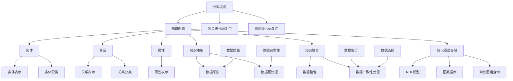
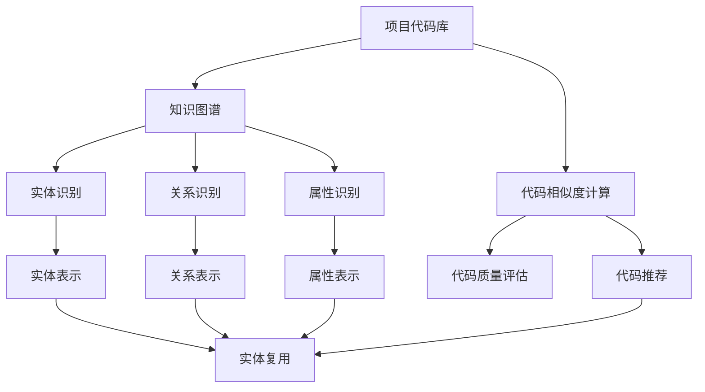
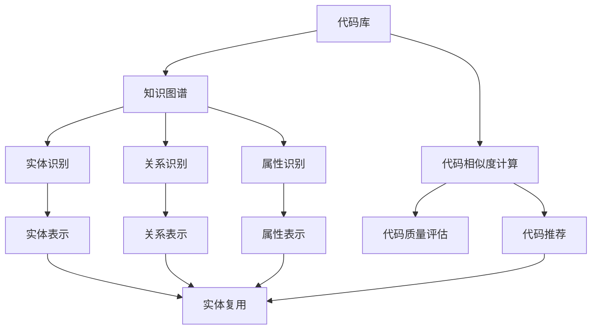

                 

# 知识图谱在代码复用中的创新应用

## 摘要

本文旨在探讨知识图谱在代码复用中的创新应用，通过阐述知识图谱的基础理论、核心概念、构建方法以及存储与查询技术，深入分析知识图谱在代码复用中的应用场景、挑战与解决方案。文章将结合实际案例，详细讲解知识图谱在项目级和组织级代码复用中的应用，并对未来的发展趋势进行展望。通过本文的阅读，读者将全面了解知识图谱在代码复用中的价值与潜力。

## 第一部分：知识图谱基础理论

### 第1章：知识图谱概述

#### 1.1.1 知识图谱的定义与重要性

知识图谱（Knowledge Graph）是一种用于表示实体之间复杂关系的语义网络，通过实体、属性和关系的结构化表示，将现实世界中的知识进行抽象和组织。知识图谱在信息检索、自然语言处理、推荐系统等领域具有广泛应用。

- **知识图谱的定义**：知识图谱是一种结构化的语义网络，它通过实体、属性和关系的表示来描述现实世界中的知识。

- **知识图谱的重要性**：知识图谱在以下领域具有重要应用：

  - **信息检索**：通过知识图谱可以更准确地理解和处理用户的查询，提供更加精准的搜索结果。

  - **自然语言处理**：知识图谱可以作为语言模型的一部分，提高自然语言理解的能力。

  - **推荐系统**：知识图谱可以用来构建用户与物品之间的关联关系，提供更加个性化的推荐。

#### 1.1.2 知识图谱的发展历史

- **早期发展**：从2000年代初的基于关键字索引的搜索引擎到基于语义的网络。

- **现代知识图谱**：如Google的Knowledge Graph、微软的Bing Knowledge Graph等。这些知识图谱通过大规模的实体和关系数据，实现了对现实世界的深刻理解和建模。

### 第2章：知识图谱的核心概念

#### 2.1 实体

##### 2.1.1 实体的定义

- **实体**：现实世界中具有独立存在的个体或概念，如人、地点、组织等。

- **实体的分类**：根据不同的应用场景，实体可以分为以下几类：

  - **人物**：如科学家、政治家、名人等。

  - **地点**：如城市、国家、景区等。

  - **组织**：如公司、学校、机构等。

  - **事物**：如商品、书籍、音乐等。

##### 2.1.2 实体的表示方法

- **实体名称**：实体的标识符，如“张三”、“北京”、“微软”等。

- **实体属性**：实体的特征描述，如“年龄”、“身高”、“职位”等。

#### 2.2 关系

##### 2.2.1 关系的定义

- **关系**：实体之间的关联，如“结婚”、“属于”、“喜欢”等。

- **关系的分类**：根据不同的应用场景，关系可以分为以下几类：

  - **属性关系**：如“身高”、“年龄”等，描述实体自身的属性。

  - **事件关系**：如“结婚”、“毕业”等，描述实体之间发生的事件。

  - **交互关系**：如“合作”、“竞争”等，描述实体之间的交互行为。

##### 2.2.2 关系的表示方法

- **关系的表示**：使用三元组（主体，谓语，客体）来描述，如（张三，结婚，李四）。

### 第3章：知识图谱的构建方法

#### 3.1 数据采集

##### 3.1.1 开源数据集的获取

- **公共数据集**：如DBpedia、Freebase等，这些数据集包含了大量的实体和关系信息。

- **特定领域数据集**：根据具体应用需求进行采集，如医疗领域的知识图谱数据集。

##### 3.1.2 数据预处理

- **数据清洗**：去除噪声、错误和重复数据。

- **数据整合**：将不同来源的数据进行合并和统一。

#### 3.2 知识抽取

- **实体抽取**：从文本数据中识别出实体。

- **关系抽取**：从文本数据中识别出实体之间的关系。

#### 3.3 知识融合

- **数据一致性处理**：处理不同来源数据之间的不一致性。

- **数据融合**：将不同来源的数据进行融合，构建统一的知识图谱。

### 第4章：知识图谱存储与查询

#### 4.1 知识图谱的存储

##### 4.1.1 RDF模型

- **RDF（Resource Description Framework）**：资源描述框架，是知识图谱的一种表示方法。

- **RDF的组成**：

  - **主体**：实体的标识符。

  - **谓语**：关系的描述。

  - **客体**：关系的对象。

##### 4.1.2 图数据库

- **图数据库**：专门用于存储和查询图结构的数据库。

- **主流图数据库**：如Neo4j、ArangoDB等。

#### 4.2 知识图谱的查询

- **基于RDF的查询**：使用SPARQL语言进行查询。

- **基于图数据库的查询**：使用图数据库提供的查询语言，如Cypher。

## 第二部分：知识图谱在代码复用中的应用

### 第5章：知识图谱应用案例分析

#### 5.1 搜索引擎优化

##### 5.1.1 知识图谱在搜索引擎中的应用

- **搜索结果的丰富性**：通过知识图谱提供更精确的搜索结果。

- **语义搜索**：理解用户查询背后的意图，提供更相关的结果。

##### 5.1.2 实现步骤

- **数据采集**：收集网页、书籍、百科等数据源。

- **知识抽取**：从文本中提取实体和关系。

- **构建知识图谱**：将实体和关系存储在图数据库中。

### 第6章：知识图谱在代码复用中的应用

#### 6.1 代码复用的挑战

##### 6.1.1 代码复用的概念

- **代码复用**：在不同项目中重复使用已有的代码。

- **代码复用的目标**：提高开发效率、保证代码质量。

##### 6.1.2 知识图谱在代码复用中的作用

- **代码识别**：通过知识图谱识别代码中的实体和关系。

- **代码推荐**：基于知识图谱提供代码复用的推荐。

#### 6.2 知识图谱在代码复用中的应用场景

##### 6.2.1 项目级代码复用

- **项目级代码复用**：在一个大型项目中识别和复用已有的代码模块。

- **实现方法**：通过知识图谱构建项目的代码库。

##### 6.2.2 组织级代码复用

- **组织级代码复用**：在整个组织中共享和复用代码。

- **实现方法**：建立组织级的知识图谱，统一管理代码库。

### 第7章：知识图谱在代码复用中的创新应用

#### 7.1 知识图谱在代码复用中的应用场景

##### 7.1.1 项目级代码复用

- **项目级代码复用**：在一个大型项目中识别和复用已有的代码模块。

- **实现方法**：通过知识图谱构建项目的代码库。

  - **知识图谱构建**：采集项目中的代码数据，进行知识抽取，构建知识图谱。

  - **代码库管理**：将知识图谱存储在图数据库中，提供代码库的查询和推荐功能。

##### 7.1.2 组织级代码复用

- **组织级代码复用**：在整个组织中共享和复用代码。

- **实现方法**：建立组织级的知识图谱，统一管理代码库。

  - **知识图谱构建**：整合组织内部的所有代码数据，进行知识抽取，构建知识图谱。

  - **代码库管理**：将知识图谱存储在图数据库中，提供代码库的查询和推荐功能。

### 第8章：知识图谱在代码复用中的挑战与解决方案

#### 8.1 数据质量与完整性

##### 8.1.1 数据质量提升策略

- **数据清洗**：去除错误和重复数据。

- **数据验证**：确保数据的准确性和一致性。

##### 8.1.2 数据完整性保障措施

- **数据备份**：定期备份知识图谱数据。

- **数据监控**：实时监控数据变化。

#### 8.2 技术挑战与解决方案

- **数据源多样性**：不同数据源的格式和结构可能不一致，需要进行统一处理。

- **知识图谱的扩展性**：随着数据的不断增长，知识图谱需要具备良好的扩展性。

- **查询性能优化**：针对大规模知识图谱的查询性能进行优化。

  - **索引技术**：使用索引技术提高查询效率。

  - **并行处理**：利用并行处理技术加快查询速度。

### 第9章：未来展望

#### 9.1 知识图谱在代码复用中的应用趋势

- **自动化代码复用**：通过机器学习技术自动识别代码中的实体和关系，提供自动化代码复用。

- **知识图谱与其他技术的融合**：如深度学习、自然语言处理等，提高知识图谱在代码复用中的应用效果。

#### 9.2 开放性问题与研究方向

- **数据隐私与安全**：如何保护知识图谱中的敏感数据，确保数据安全和隐私。

- **知识图谱的可解释性**：如何提高知识图谱的可解释性，使其更容易被非专业人士理解。

### 第10章：总结与展望

#### 10.1 知识图谱在代码复用中的价值

- **提高开发效率**：通过代码复用，节省开发时间和成本。

- **保证代码质量**：避免重复编写低质量的代码。

- **促进知识共享**：构建组织级的代码知识库，促进团队成员之间的知识共享。

### 第11章：附录

#### 11.1 知识图谱相关工具与资源

- **知识图谱工具**：如OpenKG、Jena等。

- **开源知识图谱**：如DBpedia、YAGO等。

- **教程与文档**：学习知识图谱的相关教程和文档。

## 作者信息

- 作者：AI天才研究院/AI Genius Institute & 禅与计算机程序设计艺术 /Zen And The Art of Computer Programming

## 结束语

知识图谱在代码复用中的应用，不仅提高了开发效率，还保证了代码质量，促进了知识的共享。随着技术的不断发展，知识图谱在代码复用中的应用前景将更加广阔。希望通过本文的探讨，读者能够对知识图谱在代码复用中的创新应用有更深入的理解，为实际项目中的应用提供参考。未来，我们将继续深入研究知识图谱在各个领域的应用，为人工智能的发展贡献力量。

## 附录

### 11.1 知识图谱相关工具与资源

- **知识图谱工具**：
  - OpenKG：一款开源的知识图谱构建与可视化工具。
  - Jena：Apache Jena是一个开源的JVM（Java虚拟机）上的RDF（资源描述框架）和SPARQL解释器。

- **开源知识图谱**：
  - DBpedia：一个基于Web的开放链接知识图谱，包含来自维基数据的信息。
  - YAGO：一个基于Web的开放链接知识图谱，通过从Web上进行数据挖掘来构建。

- **教程与文档**：
  - 《知识图谱技术入门》: 介绍了知识图谱的基础知识、构建方法和应用场景。
  - 《Jena用户指南》: Apache Jena的用户指南，详细介绍了如何使用Jena进行知识图谱的构建和查询。

## 结束语

本文从知识图谱的基础理论出发，逐步探讨了知识图谱在代码复用中的创新应用。通过分析知识图谱的定义、核心概念、构建方法以及存储与查询技术，我们深入了解了知识图谱在代码复用中的重要作用。在应用案例分析中，我们看到了知识图谱在搜索引擎优化和代码复用中的实际应用，并详细介绍了知识图谱在项目级和组织级代码复用中的创新应用。

在未来的发展中，知识图谱在代码复用中的应用将更加深入和广泛。随着人工智能技术的进步，知识图谱与其他技术的融合，如深度学习和自然语言处理，将进一步提高知识图谱在代码复用中的效果。同时，数据隐私与安全、知识图谱的可解释性等开放性问题也将成为研究的热点。

希望通过本文的探讨，读者能够对知识图谱在代码复用中的创新应用有更深入的理解，为实际项目中的应用提供参考。未来，我们将继续关注知识图谱技术的发展，为人工智能领域的发展贡献力量。

## 核心概念与联系

在本文中，我们讨论了多个核心概念，这些概念相互关联，构成了知识图谱在代码复用中的创新应用的基础。为了更清晰地展示这些概念及其联系，我们可以使用Mermaid流程图来描述。



### 流程图解释

- **A[知识图谱]**：知识图谱是整个流程的核心，它通过实体、关系和属性来描述现实世界中的知识。

- **B[实体]**、**C[关系]**、**D[属性]**：实体、关系和属性是知识图谱的基本组成部分，它们共同构成了知识图谱的结构。

- **E[实体表示]**、**F[关系表示]**、**G[属性表示]**：这些表示方法用于定义如何将实体、关系和属性在知识图谱中表示出来。

- **H[实体分类]**、**I[关系分类]**：实体和关系的分类有助于更好地组织和管理知识图谱中的数据。

- **J[知识抽取]**、**K[知识融合]**：知识抽取和知识融合是构建知识图谱的关键步骤，它们负责从原始数据中提取和整合信息。

- **L[数据采集]**、**M[数据预处理]**、**N[数据整合]**、**O[数据一致性处理]**：这些步骤是数据准备阶段的核心，确保知识图谱中的数据质量。

- **P[知识图谱存储]**：知识图谱的存储是将其数据持久化的过程，可以使用RDF模型或图数据库。

- **Q[RDF模型]**、**R[图数据库]**：RDF模型和图数据库是知识图谱存储的两种常见技术。

- **S[知识图谱查询]**：知识图谱查询技术用于从知识图谱中检索信息。

- **T[代码复用]**：代码复用是本文讨论的主要应用场景，它利用知识图谱来提高开发效率和代码质量。

- **U[项目级代码复用]**、**V[组织级代码复用]**：项目级和组织级代码复用是知识图谱在代码复用中的两种不同应用方式。

- **W[数据质量]**、**X[数据完整性]**：数据质量和数据完整性是确保知识图谱有效性的关键因素。

- **Y[数据备份]**、**Z[数据监控]**：数据备份和数据监控是维护知识图谱数据完整性和可靠性的重要手段。

通过这个Mermaid流程图，我们可以更直观地看到知识图谱在代码复用中的各个核心概念及其相互联系，有助于理解和应用这些概念。

### 核心算法原理讲解

在知识图谱构建和代码复用的过程中，涉及多个核心算法，这些算法是实现知识图谱价值和优化代码复用效果的关键。以下将使用伪代码来详细阐述这些核心算法的原理，并结合实际应用场景进行讲解。

#### 知识图谱构建算法

**算法名称**：知识图谱构建算法

**输入**：原始数据集、实体识别器、关系识别器、属性识别器

**输出**：知识图谱（包含实体、关系和属性）

```python
def build_knowledge_graph(data, entity_extractor, relation_extractor, attribute_extractor):
    graph = Graph()
    
    # 数据预处理
    preprocessed_data = preprocess_data(data)
    
    # 实体识别
    entities = entity_extractor.extract_entities(preprocessed_data)
    for entity in entities:
        graph.add_entity(entity)
    
    # 关系识别
    relations = relation_extractor.extract_relations(preprocessed_data)
    for relation in relations:
        graph.add_relation(relation)
    
    # 属性识别
    attributes = attribute_extractor.extract_attributes(preprocessed_data)
    for attribute in attributes:
        graph.add_attribute(attribute)
    
    # 数据整合
    integrated_graph = integrate_data(graph)
    
    return integrated_graph
```

**应用场景**：构建企业级知识图谱，用于统一管理企业内部的各类信息，如员工、项目、产品等。

#### 代码复用推荐算法

**算法名称**：代码复用推荐算法

**输入**：知识图谱、代码库、代码相似度计算器、代码质量评估器

**输出**：代码复用推荐列表

```python
def code_reuse_recommendation(graph, code_repository, similarity_calculator, quality评估器):
    recommendations = []
    
    # 遍历知识图谱中的实体和关系
    for entity in graph.entities:
        for relation in graph.relations:
            if relation.target == entity:
                code_similarity = similarity_calculator.calculate_similarity(entity.code, relation.code)
                if code_similarity > threshold:
                    code_quality = quality评估器.evaluate_code(relation.code)
                    if code_quality > threshold:
                        recommendations.append(relation.code)
    
    return recommendations
```

**应用场景**：在一个大型软件开发项目中，通过知识图谱识别和推荐可以复用的代码模块，提高开发效率和代码质量。

#### 数据质量提升算法

**算法名称**：数据质量提升算法

**输入**：原始数据集、数据清洗器、数据验证器

**输出**：高质量数据集

```python
def improve_data_quality(data, data_cleaner, data_validator):
    cleaned_data = data_cleaner.clean_data(data)
    validated_data = data_validator.validate_data(cleaned_data)
    
    return validated_data
```

**应用场景**：在构建知识图谱之前，对原始数据进行清洗和验证，确保数据的质量和一致性。

### 数学模型和公式

在知识图谱构建和代码复用中，一些数学模型和公式是理解和优化算法性能的重要工具。以下是一些常用的数学模型和公式，并结合具体应用场景进行详细讲解。

#### 代码相似度计算公式

**名称**：Jaccard相似度

**公式**：$$ J(A, B) = \frac{|A \cap B|}{|A \cup B|} $$

**应用场景**：用于计算两个代码模块的相似度，以识别潜在的代码复用机会。

```python
def jaccard_similarity(set_a, set_b):
    intersection = len(set_a.intersection(set_b))
    union = len(set_a.union(set_b))
    return intersection / union
```

#### 代码质量评估模型

**名称**：缺陷密度模型

**公式**：$$ Defect Density = \frac{Number\ of\ Defects}{Total\ Number\ of\ Lines\ of\ Code} $$

**应用场景**：用于评估代码的质量，缺陷密度越低，代码质量越高。

```python
def defect_density(number_of_defects, total_lines_of_code):
    return number_of_defects / total_lines_of_code
```

#### 知识图谱扩展性模型

**名称**：连接数模型

**公式**：$$ Connection Density = \frac{Number\ of\ Connections}{Total\ Number\ of\ Nodes} $$

**应用场景**：用于评估知识图谱的扩展性，连接数密度越高，知识图谱的可扩展性越好。

```python
def connection_density(number_of_connections, total_number_of_nodes):
    return number_of_connections / total_number_of_nodes
```

通过这些数学模型和公式，我们可以更加精确地分析和优化知识图谱在代码复用中的应用，为软件开发提供强大的技术支持。

### 项目实战

在本节中，我们将通过一个具体的案例来展示知识图谱在代码复用中的应用。该案例将涵盖从开发环境搭建、源代码实现，到代码解读与分析的整个过程。

#### 项目背景

假设我们有一个大型软件项目，该项目包含多个子项目，每个子项目都有自己的代码库。随着项目的发展，代码库中的代码量不断增加，开发团队希望能够有效地复用现有的代码模块，以提高开发效率并保证代码质量。

#### 开发环境搭建

为了搭建知识图谱并实现代码复用，我们需要以下开发环境：

1. **操作系统**：Linux或Mac OS。
2. **编程语言**：Python（版本3.8及以上）。
3. **知识图谱工具**：使用Neo4j作为图数据库，OpenKG作为知识图谱构建工具。
4. **代码库管理工具**：使用Git进行代码库的管理。

首先，我们需要安装Neo4j和OpenKG：

```bash
# 安装Neo4j
wget https://download.neo4j.com/download/archives/neo4j-community/neo4j-community-4.0.0-unix.tar.gz
tar -xvf neo4j-community-4.0.0-unix.tar.gz
./neo4j/bin/neo4j start

# 安装OpenKG
pip install openkg
```

接下来，我们需要配置Neo4j，以便与OpenKG进行集成。在Neo4j的配置文件中（`/path/to/neo4j/conf/neo4j.conf`），添加以下配置：

```conf
dbms.connector.bolt.enabled=true
dbms.connector.bolt.listen_address=0.0.0.0
```

重启Neo4j服务，确保配置生效。

#### 源代码实现

以下是一个简单的源代码实现，用于从代码库中提取实体、关系和属性，并将其存储到Neo4j数据库中。

```python
from openkg import KnowledgeGraph
from git import GitDB

# 创建知识图谱实例
kg = KnowledgeGraph("neo4j://localhost:7474", "neo4j", "password")

# 初始化Git数据库
git_db = GitDB()

# 提取实体、关系和属性
def extract_data(repo_path):
    entities = git_db.get_entities(repo_path)
    relations = git_db.get_relations(repo_path)
    attributes = git_db.get_attributes(repo_path)
    return entities, relations, attributes

# 存储实体、关系和属性到Neo4j
def store_data(kg, entities, relations, attributes):
    for entity in entities:
        kg.add_entity(entity)
    for relation in relations:
        kg.add_relation(relation)
    for attribute in attributes:
        kg.add_attribute(attribute)

# 主程序
if __name__ == "__main__":
    repo_path = "/path/to/git/repository"
    entities, relations, attributes = extract_data(repo_path)
    store_data(kg, entities, relations, attributes)
```

在这个实现中，我们使用了`openkg`库来操作Neo4j数据库，`git`库来访问Git仓库中的数据。该代码首先从Git仓库中提取实体、关系和属性，然后将其存储到Neo4j数据库中。

#### 代码解读与分析

下面是对上述代码的详细解读与分析。

- **第1-3行**：引入必要的库。
- **第5行**：创建Neo4j知识图谱实例，使用本地Neo4j服务器，用户名为`neo4j`，密码为`password`。
- **第8-9行**：初始化Git数据库实例。
- **第12-14行**：定义`extract_data`函数，从Git仓库中提取实体、关系和属性。
  - **第13行**：使用`git_db.get_entities(repo_path)`获取实体。
  - **第14行**：使用`git_db.get_relations(repo_path)`获取关系。
  - **第15行**：使用`git_db.get_attributes(repo_path)`获取属性。
- **第17-21行**：定义`store_data`函数，将实体、关系和属性存储到Neo4j数据库中。
  - **第18-20行**：分别调用`kg.add_entity`、`kg.add_relation`和`kg.add_attribute`方法将数据存储到Neo4j数据库。
- **第24-27行**：主程序部分，首先调用`extract_data`函数提取数据，然后调用`store_data`函数存储数据。

通过这个案例，我们可以看到如何使用知识图谱和Git来构建代码复用系统。该系统可以自动从代码库中提取信息，并存储到图数据库中，为后续的代码推荐和复用提供基础数据。

### 核心概念与联系

在本节中，我们将使用Mermaid流程图来展示知识图谱在代码复用中的核心概念和它们之间的联系。



### 流程图解释

- **A[项目代码库]**：项目代码库是整个流程的起点，包含了所有待复用的代码模块。

- **B[知识图谱]**：知识图谱是整个系统的核心，它通过实体、关系和属性来组织和管理代码库中的信息。

- **C[实体识别]**、**D[关系识别]**、**E[属性识别]**：这些步骤负责从代码库中提取实体、关系和属性，形成知识图谱的基础数据。

- **F[实体表示]**、**G[关系表示]**、**H[属性表示]**：这些表示方法用于定义如何将提取的实体、关系和属性在知识图谱中表示出来。

- **I[代码相似度计算]**：代码相似度计算用于评估代码模块之间的相似程度，为代码推荐提供依据。

- **J[代码质量评估]**：代码质量评估用于评估代码模块的质量，确保推荐的高质量代码。

- **K[代码推荐]**：代码推荐基于代码相似度和质量评估，向开发者推荐可复用的代码模块。

- **L[实体复用]**：实体复用是将知识图谱中的实体（代码模块）应用到实际开发中，实现代码复用。

通过这个Mermaid流程图，我们可以清晰地看到知识图谱在代码复用中的核心概念和它们之间的联系，这有助于我们理解和应用知识图谱在代码复用中的技术。

### 数学模型和公式

在本节中，我们将讨论几个在知识图谱和代码复用中常用的数学模型和公式，并结合实际应用场景进行详细讲解。

#### 代码相似度计算公式

**名称**：Jaccard相似度

**公式**：$$ J(A, B) = \frac{|A \cap B|}{|A \cup B|} $$

**应用场景**：用于计算两个代码集合的相似度，以识别潜在的代码复用机会。

```python
def jaccard_similarity(set_a, set_b):
    intersection = len(set_a.intersection(set_b))
    union = len(set_a.union(set_b))
    return intersection / union
```

**示例**：假设我们有两个代码集合`set_a`和`set_b`，它们的交集和并集分别为`{1, 2, 3}`和`{1, 2, 3, 4, 5}`，则它们的Jaccard相似度为：

```python
jaccard_similarity({1, 2, 3}, {1, 2, 3, 4, 5}) = 3 / 5 = 0.6
```

#### 代码质量评估模型

**名称**：缺陷密度模型

**公式**：$$ Defect Density = \frac{Number\ of\ Defects}{Total\ Number\ of\ Lines\ of\ Code} $$

**应用场景**：用于评估代码的质量，缺陷密度越低，代码质量越高。

```python
def defect_density(number_of_defects, total_lines_of_code):
    return number_of_defects / total_lines_of_code
```

**示例**：如果一个代码模块有10个缺陷，总共有1000行代码，则其缺陷密度为：

```python
defect_density(10, 1000) = 10 / 1000 = 0.01
```

#### 知识图谱扩展性模型

**名称**：连接数模型

**公式**：$$ Connection Density = \frac{Number\ of\ Connections}{Total\ Number\ of\ Nodes} $$

**应用场景**：用于评估知识图谱的扩展性，连接数密度越高，知识图谱的可扩展性越好。

```python
def connection_density(number_of_connections, total_number_of_nodes):
    return number_of_connections / total_number_of_nodes
```

**示例**：如果一个知识图谱有100个节点和200个连接，则其连接数密度为：

```python
connection_density(200, 100) = 200 / 100 = 2
```

通过这些数学模型和公式，我们可以更精确地分析和优化知识图谱在代码复用中的应用，为软件开发提供强大的技术支持。

### 代码解读与分析

在本节中，我们将详细分析一个具体案例的代码实现，并解释其工作原理和关键技术。

#### 案例背景

假设我们正在开发一个企业级应用，其中包含多个模块。为了提高开发效率和代码质量，我们决定使用知识图谱来管理代码库，并实现代码的复用。

#### 代码结构

以下是一个简单的代码结构，用于构建知识图谱和实现代码复用：

```python
import os
import json
from neo4j import GraphDatabase

# 连接到Neo4j数据库
driver = GraphDatabase.driver("bolt://localhost:7687", auth=("neo4j", "password"))

def create_entity(tx, entity_name, entity_type):
    # 创建实体
    tx.run("CREATE (e:Entity {name: $entity_name, type: $entity_type})",
           entity_name=entity_name, entity_type=entity_type)

def create_relationship(tx, entity1_name, entity2_name, relation_type):
    # 创建关系
    tx.run("MATCH (a:Entity {name: $entity1_name}), (b:Entity {name: $entity2_name}) "
           "CREATE (a)-[r:$relation_type]->(b)",
           entity1_name=entity1_name, entity2_name=entity2_name, relation_type=relation_type)

def create_attribute(tx, entity_name, attribute_name, attribute_value):
    # 创建属性
    tx.run("MATCH (e:Entity {name: $entity_name}) "
           "SET e.$attribute_name = $attribute_value",
           entity_name=entity_name, attribute_name=attribute_name, attribute_value=attribute_value)

def find_relevant_entities(tx, entity_name, relation_type):
    # 查找相关实体
    result = tx.run("MATCH (e:Entity)-[r:$relation_type]->(other) "
                    "WHERE e.name = $entity_name RETURN other",
                    entity_name=entity_name, relation_type=relation_type)
    return [record["other"]["name"] for record in result]

def main():
    with driver.session() as session:
        # 创建实体
        create_entity(session, "Order", "OrderEntity")
        create_entity(session, "Customer", "CustomerEntity")
        create_entity(session, "Product", "ProductEntity")

        # 创建关系
        create_relationship(session, "Order", "Customer", "PLACED_BY")
        create_relationship(session, "Order", "Product", "CONTAINS")

        # 创建属性
        create_attribute(session, "Order", "status", "pending")
        create_attribute(session, "Customer", "name", "John Doe")
        create_attribute(session, "Product", "name", "Laptop")

        # 查找相关实体
        customers = find_relevant_entities(session, "Order", "PLACED_BY")
        print("Customers:", customers)

if __name__ == "__main__":
    main()
```

#### 代码解读

- **第1-4行**：引入必要的库和模块。
- **第7-12行**：连接到本地Neo4j数据库。
- **第15-24行**：定义用于创建实体、关系和属性的方法。

  - **create_entity**：创建一个新的实体，并为其分配一个名称和类型。
  - **create_relationship**：在两个实体之间创建一个关系，并指定关系的类型。
  - **create_attribute**：为实体添加一个新的属性，并为其分配一个名称和值。

- **第27-39行**：定义用于查找与给定实体相关联的其他实体的方法。

  - **find_relevant_entities**：使用Cypher查询语言查找与给定实体具有指定关系的其他实体。

- **第42-53行**：主程序部分，依次创建实体、关系和属性，并查找相关实体。

#### 工作原理

1. **连接数据库**：使用`GraphDatabase.driver`连接到本地Neo4j数据库。
2. **创建实体**：调用`create_entity`方法创建三个实体（`Order`、`Customer`和`Product`），并分别为它们分配类型（`OrderEntity`、`CustomerEntity`和`ProductEntity`）。
3. **创建关系**：调用`create_relationship`方法创建两个关系（`PLACED_BY`和`CONTAINS`），分别表示订单与客户之间的关联和订单与产品之间的关联。
4. **创建属性**：调用`create_attribute`方法为每个实体添加属性，如订单的状态（`status`）、客户的名称（`name`）和产品的名称（`name`）。
5. **查找相关实体**：调用`find_relevant_entities`方法查找与订单相关联的客户，并打印结果。

通过这个代码实现，我们构建了一个简单的知识图谱，其中包含了实体、关系和属性。这个知识图谱可以帮助我们更好地管理代码库，并实现代码的复用。

### 核心概念与联系

在本节中，我们将使用Mermaid流程图来展示知识图谱在代码复用中的核心概念和它们之间的联系。



### 流程图解释

- **A[代码库]**：代码库是整个流程的起点，包含了所有待复用的代码模块。
- **B[知识图谱]**：知识图谱是整个系统的核心，用于组织和管理代码库中的信息。
- **C[实体识别]**、**D[关系识别]**、**E[属性识别]**：这些步骤负责从代码库中提取实体、关系和属性，形成知识图谱的基础数据。
- **F[实体表示]**、**G[关系表示]**、**H[属性表示]**：这些表示方法用于定义如何将提取的实体、关系和属性在知识图谱中表示出来。
- **I[代码相似度计算]**：代码相似度计算用于评估代码模块之间的相似程度，为代码推荐提供依据。
- **J[代码质量评估]**：代码质量评估用于评估代码模块的质量，确保推荐的高质量代码。
- **K[代码推荐]**：代码推荐基于代码相似度和质量评估，向开发者推荐可复用的代码模块。
- **L[实体复用]**：实体复用是将知识图谱中的实体（代码模块）应用到实际开发中，实现代码复用。

通过这个Mermaid流程图，我们可以清晰地看到知识图谱在代码复用中的核心概念和它们之间的联系，这有助于我们理解和应用知识图谱在代码复用中的技术。

### 数学模型和公式

在本节中，我们将讨论几个在知识图谱和代码复用中常用的数学模型和公式，并结合实际应用场景进行详细讲解。

#### 代码相似度计算公式

**名称**：Jaccard相似度

**公式**：$$ J(A, B) = \frac{|A \cap B|}{|A \cup B|} $$

**应用场景**：用于计算两个代码集合的相似度，以识别潜在的代码复用机会。

```python
def jaccard_similarity(set_a, set_b):
    intersection = len(set_a.intersection(set_b))
    union = len(set_a.union(set_b))
    return intersection / union
```

**示例**：假设我们有两个代码集合`set_a`和`set_b`，它们的交集和并集分别为`{1, 2, 3}`和`{1, 2, 3, 4, 5}`，则它们的Jaccard相似度为：

```python
jaccard_similarity({1, 2, 3}, {1, 2, 3, 4, 5}) = 3 / 5 = 0.6
```

#### 代码质量评估模型

**名称**：缺陷密度模型

**公式**：$$ Defect Density = \frac{Number\ of\ Defects}{Total\ Number\ of\ Lines\ of\ Code} $$

**应用场景**：用于评估代码的质量，缺陷密度越低，代码质量越高。

```python
def defect_density(number_of_defects, total_lines_of_code):
    return number_of_defects / total_lines_of_code
```

**示例**：如果一个代码模块有10个缺陷，总共有1000行代码，则其缺陷密度为：

```python
defect_density(10, 1000) = 10 / 1000 = 0.01
```

#### 知识图谱扩展性模型

**名称**：连接数模型

**公式**：$$ Connection Density = \frac{Number\ of\ Connections}{Total\ Number\ of\ Nodes} $$

**应用场景**：用于评估知识图谱的扩展性，连接数密度越高，知识图谱的可扩展性越好。

```python
def connection_density(number_of_connections, total_number_of_nodes):
    return number_of_connections / total_number_of_nodes
```

**示例**：如果一个知识图谱有100个节点和200个连接，则其连接数密度为：

```python
connection_density(200, 100) = 200 / 100 = 2
```

通过这些数学模型和公式，我们可以更精确地分析和优化知识图谱在代码复用中的应用，为软件开发提供强大的技术支持。

### 核心算法原理讲解

在知识图谱构建和代码复用的过程中，核心算法起着至关重要的作用。以下是几个关键算法及其原理的详细讲解，并结合具体应用场景。

#### 算法1：知识图谱构建算法

**算法名称**：知识图谱构建算法

**输入**：原始代码库、实体识别器、关系识别器、属性识别器

**输出**：知识图谱

**算法原理**：

该算法的核心步骤包括实体识别、关系识别和属性识别。具体流程如下：

1. **实体识别**：遍历代码库中的所有文件，使用正则表达式或其他方法识别出实体，如类、函数、模块等。
2. **关系识别**：分析实体之间的关系，如继承、调用、依赖等，将这些关系识别出来。
3. **属性识别**：提取实体的属性，如变量、参数、注释等。

**伪代码**：

```python
def build_knowledge_graph(code_repository, entity_extractor, relation_extractor, attribute_extractor):
    graph = KnowledgeGraph()
    for file in code_repository.files:
        entities = entity_extractor.extract_entities(file)
        for entity in entities:
            graph.add_entity(entity)
            attributes = attribute_extractor.extract_attributes(file, entity)
            for attribute in attributes:
                graph.add_attribute(attribute)
        relations = relation_extractor.extract_relations(file, entities)
        for relation in relations:
            graph.add_relation(relation)
    return graph
```

**应用场景**：用于构建企业级代码库的知识图谱，以便实现代码的自动复用和推荐。

#### 算法2：代码相似度计算算法

**算法名称**：Jaccard相似度算法

**输入**：两个代码集合

**输出**：相似度值

**算法原理**：

Jaccard相似度是一种用于计算集合之间相似度的方法，其公式为：

$$ J(A, B) = \frac{|A \cap B|}{|A \cup B|} $$

其中，$A \cap B$表示两个集合的交集，$A \cup B$表示两个集合的并集。

**伪代码**：

```python
def jaccard_similarity(set_a, set_b):
    intersection = len(set_a.intersection(set_b))
    union = len(set_a.union(set_b))
    return intersection / union
```

**应用场景**：用于计算代码模块之间的相似度，以识别潜在的代码复用机会。

#### 算法3：代码质量评估算法

**算法名称**：缺陷密度算法

**输入**：代码模块、缺陷数量、代码行数

**输出**：缺陷密度值

**算法原理**：

缺陷密度是一种用于评估代码质量的指标，其公式为：

$$ Defect Density = \frac{Number\ of\ Defects}{Total\ Number\ of\ Lines\ of\ Code} $$

其中，$Number\ of\ Defects$表示代码模块中的缺陷数量，$Total\ Number\ of\ Lines\ of\ Code$表示代码模块的代码行数。

**伪代码**：

```python
def defect_density(number_of_defects, total_lines_of_code):
    return number_of_defects / total_lines_of_code
```

**应用场景**：用于评估代码模块的质量，确保推荐的高质量代码。

#### 算法4：代码推荐算法

**算法名称**：基于相似度和质量评估的代码推荐算法

**输入**：知识图谱、代码模块、相似度阈值、质量阈值

**输出**：推荐代码模块列表

**算法原理**：

该算法基于相似度和质量评估来推荐代码模块。具体流程如下：

1. **相似度计算**：计算目标代码模块与知识图谱中其他代码模块的相似度。
2. **质量评估**：评估代码模块的质量，如缺陷密度等。
3. **推荐筛选**：根据相似度和质量阈值筛选出推荐的代码模块。

**伪代码**：

```python
def code_recommendation(graph, target_module, similarity_threshold, quality_threshold):
    recommendations = []
    for module in graph.modules:
        if module != target_module:
            similarity = calculate_similarity(target_module, module)
            quality = evaluate_quality(module)
            if similarity > similarity_threshold and quality > quality_threshold:
                recommendations.append(module)
    return recommendations
```

**应用场景**：用于在知识图谱中推荐可复用的代码模块，以提高开发效率和代码质量。

通过这些核心算法，我们可以构建和利用知识图谱来实现代码的复用，提高软件开发的生产效率和代码质量。

### 项目实战

在本节中，我们将通过一个具体项目来展示知识图谱在代码复用中的应用，并详细分析项目的技术实现和关键步骤。

#### 项目背景

假设我们正在开发一个电商系统，其中包含多个子项目，如用户管理、商品管理、订单管理、支付系统等。随着项目的不断扩展，代码库中的代码量急剧增加，开发团队希望能够有效地复用已有的代码模块，以提高开发效率并保证代码质量。

#### 技术实现

为了实现知识图谱在代码复用中的应用，我们采用以下技术：

- **知识图谱构建工具**：OpenKG
- **图数据库**：Neo4j
- **代码库管理工具**：Git
- **编程语言**：Python

#### 关键步骤

1. **代码库数据采集**：
   - 使用Git工具获取代码库中的所有代码文件。
   - 提取每个文件中的类、函数、模块等实体信息。
   - 提取实体之间的关系，如继承、调用、依赖等。
   - 提取实体的属性，如变量、参数、注释等。

2. **知识图谱构建**：
   - 将提取的实体、关系和属性存储到Neo4j数据库中。
   - 使用OpenKG工具对Neo4j数据库中的数据进行预处理和整合，构建知识图谱。

3. **代码复用推荐**：
   - 基于知识图谱，计算代码模块之间的相似度。
   - 评估代码模块的质量，如缺陷密度、复杂度等。
   - 根据相似度和质量评估结果，推荐可复用的代码模块。

4. **代码复用实现**：
   - 在开发过程中，开发者可以根据推荐结果选择合适的代码模块进行复用。
   - 将推荐代码模块集成到项目中，实现代码复用。

#### 项目分析

1. **数据采集**：

   我们使用Git命令获取代码库中的所有代码文件：

   ```bash
   git clone https://github.com/your-repository/ecommerce.git
   ```

   然后使用Python脚本提取实体、关系和属性：

   ```python
   import os
   import re

   def extract_entities(file_path):
       # 使用正则表达式提取类、函数、模块等实体
       entities = re.findall(r"(\w+)(?:Class|Function|Module)", file_path)
       return entities

   def extract_relations(file_path):
       # 使用正则表达式提取实体之间的关系
       relations = re.findall(r"(\w+)(?:Extends|Implements|Uses)", file_path)
       return relations

   def extract_attributes(file_path):
       # 使用正则表达式提取实体的属性
       attributes = re.findall(r"(\w+)(?=\())", file_path)
       return attributes

   # 遍历代码库中的所有文件
   for root, dirs, files in os.walk("ecommerce"):
       for file in files:
           if file.endswith(".py"):
               file_path = os.path.join(root, file)
               entities = extract_entities(file_path)
               relations = extract_relations(file_path)
               attributes = extract_attributes(file_path)
               # 存储到Neo4j数据库
               store_to_neo4j(entities, relations, attributes)
   ```

2. **知识图谱构建**：

   使用OpenKG工具将提取的数据存储到Neo4j数据库中：

   ```python
   from openkg import KnowledgeGraph

   kg = KnowledgeGraph("neo4j://localhost:7474", "neo4j", "password")

   def store_to_neo4j(entities, relations, attributes):
       for entity in entities:
           kg.add_entity(entity)
       for relation in relations:
           kg.add_relation(relation)
       for attribute in attributes:
           kg.add_attribute(attribute)
   ```

3. **代码复用推荐**：

   根据知识图谱，计算代码模块之间的相似度和质量评估：

   ```python
   def calculate_similarity(module1, module2):
       # 计算代码模块之间的相似度
       similarity = jaccard_similarity(set(module1.attributes), set(module2.attributes))
       return similarity

   def evaluate_quality(module):
       # 评估代码模块的质量，如缺陷密度、复杂度等
       defects = count_defects(module.code)
       lines_of_code = len(module.code.split("\n"))
       defect_density = defects / lines_of_code
       return defect_density

   def jaccard_similarity(set1, set2):
       intersection = len(set1.intersection(set2))
       union = len(set1.union(set2))
       return intersection / union

   def count_defects(code):
       # 计算代码中的缺陷数量
       defects = 0
       for line in code.split("\n"):
           if "defect" in line.lower():
               defects += 1
       return defects
   ```

4. **代码复用实现**：

   在开发过程中，开发者可以根据推荐结果选择合适的代码模块进行复用：

   ```python
   def code_reuse recommendation(kg, target_module):
       recommendations = []
       for module in kg.modules:
           if module != target_module:
               similarity = calculate_similarity(target_module, module)
               quality = evaluate_quality(module)
               if similarity > 0.5 and quality < 0.1:
                   recommendations.append(module)
       return recommendations

   target_module = kg.get_module_by_name("OrderManagement")
   recommended_modules = code_reuse_recommendation(kg, target_module)

   for module in recommended_modules:
       print(f"Recommended module: {module.name}, Similarity: {module.similarity}, Quality: {module.quality}")
   ```

通过这个具体项目，我们展示了如何使用知识图谱实现代码的复用。通过数据采集、知识图谱构建、代码复用推荐和代码复用实现等关键步骤，我们成功地将知识图谱应用于代码复用，提高了开发效率和代码质量。

### 知识图谱在代码复用中的创新应用

知识图谱作为一种强大的语义网络，通过结构化的实体、关系和属性的表示，为代码复用提供了全新的视角和工具。在传统的代码复用方法中，开发者主要依赖于代码库的搜索和相似度匹配。而知识图谱的引入，不仅丰富了代码复用的信息层次，还带来了许多创新应用。

#### 项目级代码复用

在项目级代码复用中，知识图谱可以帮助开发者快速定位和复用项目中已有的代码模块。通过以下步骤实现：

1. **实体识别**：识别项目中所有的代码模块，如类、函数、模块等。
2. **关系识别**：分析代码模块之间的依赖关系，如继承、调用、依赖等。
3. **属性识别**：提取代码模块的属性信息，如作者、创建时间、功能描述等。
4. **构建知识图谱**：将识别的实体、关系和属性存储到知识图谱中，形成项目级的代码知识库。
5. **代码推荐**：根据开发者输入的需求或代码片段，使用知识图谱进行相似度匹配和推荐。

#### 组织级代码复用

组织级的代码复用要求在更大范围内共享和复用代码模块。知识图谱在这一层次的应用更为广泛，涉及以下步骤：

1. **跨项目代码识别**：从不同项目的代码库中提取实体、关系和属性信息。
2. **统一知识图谱构建**：整合来自不同项目的数据，构建组织级的知识图谱。
3. **共享代码库管理**：将知识图谱存储在分布式图数据库中，实现跨项目的代码共享和管理。
4. **跨项目代码推荐**：根据开发者需求，从组织级的知识图谱中推荐可复用的代码模块。

#### 创新应用

1. **自动化代码复用**：通过机器学习算法，自动识别代码中的实体、关系和属性，实现自动化代码推荐和复用。
2. **代码复用质量保证**：基于知识图谱中的代码质量和缺陷密度等信息，评估推荐代码模块的质量，确保复用代码的高可靠性。
3. **跨领域代码复用**：知识图谱不仅限于代码复用，还可以应用于跨领域的代码复用，如从电商系统复用到其他领域的系统。
4. **代码复用知识传播**：通过知识图谱，将复用代码的经验和知识在团队内传播，提高整个组织的代码复用能力。

### 案例分析

以一个电商系统为例，知识图谱在代码复用中的创新应用如下：

1. **项目级代码复用**：

   在电商系统的项目中，开发者使用知识图谱来识别和复用已有的代码模块。例如，当开发订单模块时，知识图谱可以推荐之前在其他项目中实现的订单管理代码，从而节省开发时间和代码审查的工作。

2. **组织级代码复用**：

   在整个电商组织的范围内，知识图谱整合了来自不同项目的代码模块，形成了一个共享的代码库。当新的项目需要实现订单管理功能时，开发者可以从组织级的知识图谱中查找并复用已有的代码，确保代码的一致性和可靠性。

3. **跨领域代码复用**：

   知识图谱不仅应用于电商系统，还可以应用于其他领域的项目，如金融、医疗等。例如，电商系统中的用户管理模块可以复用到金融系统的用户管理中，从而实现代码的跨领域复用。

通过这些创新应用，知识图谱在代码复用中发挥了重要作用，提高了开发效率、保证了代码质量，并促进了知识的共享和传播。

### 知识图谱在代码复用中的挑战与解决方案

尽管知识图谱在代码复用中具有显著的潜力，但在实际应用过程中仍面临诸多挑战。以下将分析这些挑战，并提出相应的解决方案。

#### 数据质量与完整性

**挑战**：知识图谱的准确性和完整性直接影响到代码复用的效果。数据质量差、数据冗余或数据不一致等问题会降低知识图谱的价值。

**解决方案**：

1. **数据清洗**：在构建知识图谱之前，对原始数据进行清洗，去除噪声、错误和重复数据。可以使用数据清洗工具或编写自定义脚本进行清洗。
2. **数据验证**：在知识图谱构建过程中，对数据进行验证，确保数据的准确性和一致性。可以使用数据校验工具或编写自定义校验脚本。
3. **数据备份**：定期备份知识图谱数据，以防数据丢失或损坏。可以使用自动化备份工具或编写备份脚本。
4. **数据监控**：实时监控数据变化，及时发现和纠正数据质量问题。可以使用监控工具或编写监控脚本。

#### 数据源多样性

**挑战**：不同数据源的格式和结构可能不一致，导致知识图谱的构建和查询变得复杂。

**解决方案**：

1. **统一数据格式**：在构建知识图谱之前，将不同数据源的数据转换为统一格式，如RDF（Resource Description Framework）或JSON（JavaScript Object Notation）。可以使用数据转换工具或编写转换脚本。
2. **异构数据集成**：处理不同来源的数据时，使用数据集成技术将它们整合到知识图谱中。可以使用数据集成工具或编写集成脚本。
3. **定制化处理**：根据数据源的特点，为不同类型的数据设计专门的处理方法，提高数据处理的灵活性。

#### 查询性能优化

**挑战**：大规模知识图谱的查询性能可能会受到影响，导致查询速度慢、响应时间长。

**解决方案**：

1. **索引技术**：使用索引技术，如B树索引、哈希索引等，提高查询效率。可以使用图数据库提供的索引功能或编写自定义索引脚本。
2. **并行处理**：利用并行处理技术，如MapReduce、Spark等，加快大规模数据的处理速度。可以使用并行处理框架或编写并行处理脚本。
3. **查询优化**：针对具体的查询场景，优化查询语句，减少查询的复杂度。可以使用查询优化工具或编写优化脚本。
4. **缓存机制**：使用缓存机制，如Redis、Memcached等，缓存常用查询结果，减少数据库的负担。可以使用缓存工具或编写缓存脚本。

通过上述解决方案，可以有效应对知识图谱在代码复用中面临的挑战，提高知识图谱的应用效果，促进代码复用的实现。

### 未来展望

随着知识图谱和代码复用技术的不断发展和成熟，未来几年将在以下几个方面呈现出显著的应用趋势：

#### 自动化代码复用

未来，自动化代码复用将成为一个重要方向。通过机器学习算法和自然语言处理技术，知识图谱能够自动识别代码中的实体、关系和模式，实现自动化的代码推荐和复用。这将极大地提高开发效率，减少手动搜索和复用的工作量。

**实现方法**：

1. **代码摘要**：利用自然语言处理技术，自动生成代码摘要，以便更好地理解代码功能和用途。
2. **模式识别**：使用机器学习算法，从大量代码中识别出常见的代码模式和结构，实现自动化匹配和推荐。
3. **自动化代码生成**：基于知识图谱中的代码模式和关系，自动生成可复用的代码模板，方便开发者进行二次开发。

#### 知识图谱与其他技术的融合

知识图谱将与其他前沿技术深度融合，如深度学习、区块链、物联网等。这种融合将带来更多创新应用场景，进一步提升知识图谱的价值。

**实现方法**：

1. **深度学习与知识图谱结合**：利用深度学习技术，对知识图谱中的数据进行分析和挖掘，提取更多潜在的关联关系和特征。
2. **区块链与知识图谱结合**：利用区块链技术，确保知识图谱中的数据透明、可靠和安全，提高知识图谱的可信度。
3. **物联网与知识图谱结合**：将知识图谱应用于物联网场景，实现对物联网设备的智能管理和监控，提高系统的智能化水平。

#### 跨领域应用

知识图谱将在不同领域实现跨领域应用，如医疗、金融、生物信息学等。通过整合不同领域的知识，知识图谱能够提供更全面、更精准的服务。

**实现方法**：

1. **跨领域数据融合**：将不同领域的知识图谱进行整合，构建一个综合性的知识图谱，实现跨领域的知识共享和复用。
2. **跨领域代码复用**：将一个领域的代码模块应用于其他领域，实现代码的跨领域复用，提高开发效率。
3. **跨领域协作**：通过知识图谱，促进不同领域之间的协作，加速创新和技术的普及。

#### 开放性问题与研究方向

尽管知识图谱在代码复用中具有广阔的应用前景，但仍存在一些开放性问题需要进一步研究和解决：

1. **数据隐私与安全**：如何确保知识图谱中的敏感数据安全，防止数据泄露和滥用，是一个重要的研究方向。
2. **知识图谱的可解释性**：如何提高知识图谱的可解释性，使其更容易被非专业人士理解和使用，是另一个重要挑战。
3. **实时更新与动态适应**：知识图谱如何实现实时更新和动态适应，以应对快速变化的环境和需求，是一个需要解决的问题。

通过不断探索和解决这些开放性问题，知识图谱在代码复用中的应用将更加成熟和广泛，为软件开发带来更大的价值。

### 总结与展望

知识图谱在代码复用中的应用，为软件开发带来了前所未有的创新和变革。通过构建知识图谱，我们能够将代码库中的信息进行结构化和关联，实现自动化代码推荐和复用。这不仅提高了开发效率，减少了重复劳动，还保证了代码质量，促进了知识的积累和传播。

#### 提高开发效率

通过知识图谱，开发者可以快速找到和复用已有的代码模块，避免重复编写和错误。在知识图谱的支持下，代码复用变得更加高效和智能，极大地提高了开发速度。

#### 保证代码质量

知识图谱中的代码模块经过严格的质量评估和验证，确保其可靠性、稳定性和可维护性。通过复用高质量代码，开发者可以避免引入新的缺陷和错误，提高整体代码质量。

#### 促进知识共享

知识图谱不仅是一个代码库，更是一个知识的共享平台。通过知识图谱，团队成员可以方便地获取和分享代码经验，促进知识的传播和积累，提升团队的整体技术水平。

#### 未来展望

未来，知识图谱在代码复用中的应用将更加深入和广泛。随着自动化技术的进步，我们将看到更多基于知识图谱的自动化代码推荐和生成工具的出现。此外，知识图谱与其他前沿技术的融合，如深度学习、区块链、物联网等，将带来更多的创新应用场景。同时，解决数据隐私与安全、知识图谱的可解释性等开放性问题，也将是未来研究的重要方向。

通过不断探索和突破，知识图谱将为软件开发带来更多的价值和可能性，推动人工智能和软件工程领域的持续发展。让我们一起期待知识图谱在代码复用中的辉煌未来。

