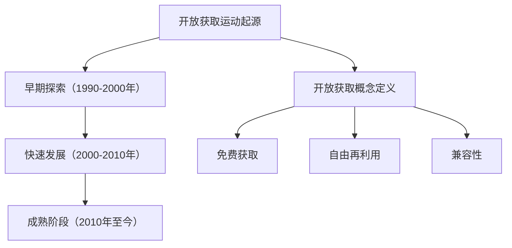
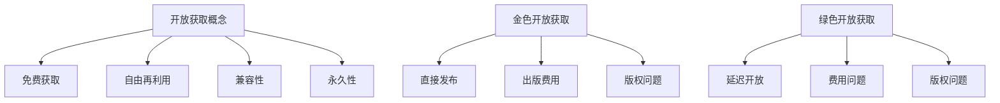

                 

### 第1章：开放获取运动的起源与重要性

#### 1.1 开放获取运动的起源

开放获取（Open Access，简称OA）运动起源于20世纪90年代。其核心目标是通过技术手段，使学术研究信息免费、广泛地传播，让公众能够无障碍地获取和利用这些研究成果。这一运动的兴起与互联网的普及和学术交流需求的增加密不可分。

1991年，互联网先驱蒂姆·伯纳斯·李发明了万维网（World Wide Web），为学术信息的电子化传播提供了基础设施。同年，斯坦福大学的保罗·戴维斯（Paul Davis）成立了“科学图书馆学协会”（Scientific Library Association），推动了图书馆界的数字图书馆运动。这些事件为开放获取运动的诞生奠定了基础。

#### 1.2 开放获取的概念

开放获取的定义由“开放获取联盟”（Open Access Scholarly Publishing and Academic Resources Coalition，简称OASPA）给出，其核心内容包括：

1. **免费获取**：用户可以免费地获取、阅读、下载、复制、传播、搜索、链接到这些学术文献，无任何财务障碍。
2. **自由再利用**：用户可以自由地复制、传播和分发这些学术文献，不受任何版权限制，但需遵循相应的引用规范。
3. **兼容性**：开放获取资源应当能够与各种工具和服务兼容，便于检索和链接。

#### 1.3 开放获取的必要性

信息鸿沟的存在使得大量的学术研究成果只能被少数人获取，阻碍了知识的传播和利用。开放获取运动旨在消除这种信息鸿沟，促进知识的广泛传播和共享。

首先，开放获取能够提高学术研究的透明度和可追溯性。通过开放获取，研究过程和结果可以更容易地被公众获取，有助于提高学术诚信和减少学术不端行为。

其次，开放获取有助于促进学术合作和创新。开放获取的学术资源使得研究人员能够更便捷地获取其他领域的知识，从而激发新的研究灵感，促进跨学科合作。

此外，开放获取还能够提高学术成果的社会价值和经济价值。开放获取的研究成果能够更快速地转化为实际应用，为社会和经济的发展做出贡献。

#### 1.4 开放获取的历史与发展

开放获取运动的历史可以分为以下几个阶段：

1. **早期阶段（1990-2000年）**：这一阶段主要是探索和试验阶段。1998年，比洛克斯·贝林格（Björn Borchers）和彼得·林奇（Peter Suber）发表了《开放获取：促进科学信息的自由流通》（Open Access: What It Is and Why It Matters），正式提出了开放获取的概念。

2. **快速发展阶段（2000-2010年）**：随着互联网的普及，开放获取运动进入了快速发展阶段。2001年，开放获取联盟（Open Access Initiative）正式成立，推动了开放获取运动的全球化。同时，许多学术机构和期刊开始实行开放获取政策。

3. **成熟阶段（2010年至今）**：开放获取已成为学术界和社会广泛认可的重要运动。许多国家和地区出台了相关政策，推动开放获取的实施。同时，开放获取的技术手段和模式也在不断丰富和优化。

#### 1.5 消除信息鸿沟的意义

信息鸿沟是指由于资源、技术、教育等方面的差异，导致不同社会群体在获取和使用信息方面的差异。消除信息鸿沟的意义在于：

1. **促进社会公平**：通过开放获取，可以让更多人，特别是社会弱势群体，平等地获取学术资源，提高他们的知识和技能水平，从而缩小社会贫富差距。

2. **推动知识传播**：开放获取能够加速知识的传播，提高学术成果的社会影响力，促进科学技术的进步。

3. **提升教育质量**：开放获取教育资源使得更多人能够接受优质的教育，提高教育资源的利用效率。

4. **促进经济和社会发展**：开放获取的研究成果能够更快地转化为实际应用，推动技术创新，促进经济和社会的发展。

### 总结

开放获取运动起源于20世纪90年代，旨在消除学术信息获取的障碍，促进知识的广泛传播和共享。开放获取的定义包括免费获取、自由再利用和兼容性，其必要性体现在提高学术研究透明度、促进学术合作和创新、提高社会价值和经济价值等方面。通过回顾开放获取的历史和发展，我们可以看到这一运动在全球范围内的不断推进。消除信息鸿沟的意义在于促进社会公平、推动知识传播、提升教育质量和促进经济和社会发展。

#### Mermaid 流程图

### 参考文献

1. Borchers, B., & Suber, P. (1998). Open Access: What It Is and Why It Matters. Open Access Scholarly Publishing and Academic Resources Coalition.
2. Suber, P. (2012). Open Access. The Harvard University Press.

---

### 1.1.1 开放获取的概念

开放获取（Open Access，简称OA）是一种学术资源的获取和分发模式，其核心目标是让学术成果对所有人免费、自由地获取和使用。这一概念最早由比洛克斯·贝林格（Björn Borchers）和彼得·林奇（Peter Suber）于1998年提出。开放获取强调学术信息的广泛传播和自由再利用，其基本特征包括以下几点：

1. **免费获取**：开放获取资源不收取用户阅读、下载、复制、传播、搜索和链接的任何费用。这意味着任何人，无论其地理位置、经济状况或机构背景，都可以无障碍地访问这些资源。

2. **自由再利用**：用户可以自由地复制、传播和分发开放获取资源，无需获取任何许可。但用户在再利用这些资源时，应遵循相应的引用规范，确保原作者的权益得到尊重。

3. **兼容性**：开放获取资源应当能够与各种工具和服务兼容，便于检索、链接和整合。这要求开放获取资源在技术标准、数据格式和接口设计等方面具有通用性和互操作性。

4. **永久性**：开放获取资源应当被永久性地存储和保留，以确保其长期可用性。这通常通过数字保存计划、数据档案库等方式实现。

5. **透明性**：开放获取资源在发布过程中应保持透明性，包括出版流程、版权政策、费用结构等，以便用户了解和监督。

开放获取的概念不仅适用于学术期刊和论文，还涵盖图书、会议记录、报告、数据集、软件等多种学术资源。开放获取的实现方式主要包括金色开放获取（Gold OA）和绿色开放获取（Green OA）。

#### 金色开放获取（Gold OA）

金色开放获取是指从源头开始，通过开放获取期刊和出版社直接发布学术成果，使其在发表时即对公众免费开放。金色开放获取的主要特点是：

1. **直接发布**：学术成果在发表前经过同行评审，但发表后立即对公众开放。
2. **费用问题**：金色开放获取通常涉及出版费用，这些费用可能由作者、研究机构或政府资助。
3. **版权问题**：开放获取期刊的版权政策多样，有些允许作者保留完整的版权，而有些则要求作者转让版权。

#### 绿色开放获取（Green OA）

绿色开放获取是指通过将已有学术成果存储在机构或主题存储库中，实现其开放获取。绿色开放获取的主要特点是：

1. **延迟开放**：学术成果在发表后经过一段时间的版权保护期，然后再进行开放获取。
2. **费用问题**：绿色开放获取通常不涉及出版费用，而是依赖存储库的维护和支持。
3. **版权问题**：绿色开放获取往往需要遵守作者所在机构的开放获取政策，以及出版商的版权规定。

#### 开放获取与信息自由

开放获取运动与信息自由（Freedom of Information）密切相关。信息自由是指公众有权获取政府和其他机构的信息，以确保透明和问责。开放获取则更侧重于学术信息的自由传播和再利用。

开放获取有助于实现信息自由，因为：

1. **扩大信息获取范围**：开放获取使得学术信息不再局限于特定人群，而是对所有人开放。
2. **促进信息公开**：开放获取要求学术成果的发布和版权政策透明，有助于提高学术机构的信息公开程度。
3. **保障学术自由**：开放获取鼓励学术自由，使研究人员能够自由地获取和使用其他领域的知识，进行创新性研究。

#### 开放获取的优势与挑战

开放获取具有显著的优点，但也面临一些挑战：

**优势**：

1. **促进知识传播**：开放获取使得学术成果能够迅速、广泛地传播，提高知识的利用效率。
2. **增强研究透明度**：开放获取提高了研究过程的透明度，有助于减少学术不端行为。
3. **促进学术合作**：开放获取打破了地域、机构和资金的限制，促进了全球范围内的学术合作。
4. **提升科研影响力**：开放获取使得学术成果更容易被公众和决策者获取，提高了科研成果的社会影响力。

**挑战**：

1. **成本问题**：金色开放获取的出版费用可能较高，给作者和学术机构带来一定的经济压力。
2. **版权问题**：开放获取与传统的版权制度存在冲突，需要制定合适的版权政策，保护原作者的权益。
3. **质量控制**：开放获取期刊的质量控制可能不如传统期刊严格，需要建立有效的质量评估体系。
4. **技术问题**：开放获取资源需要稳定的技术支持，包括存储、检索、链接和数据格式标准化等。

#### 总结

开放获取是一种旨在消除学术信息获取障碍的获取和分发模式。其核心特征包括免费获取、自由再利用、兼容性和永久性。开放获取通过金色和绿色两种方式实现，既有助于实现信息自由，也面临一些挑战。通过不断探索和优化，开放获取在促进知识传播、提高研究透明度和促进学术合作等方面发挥着重要作用。

#### Mermaid 流程图

### 参考文献

1. Borchers, B., & Suber, P. (1998). Open Access: What It Is and Why It Matters. Open Access Scholarly Publishing and Academic Resources Coalition.
2. Suber, P. (2012). Open Access. The Harvard University Press.

---

### 1.1.2 开放获取的必要性

开放获取运动的兴起并非偶然，而是由于学术研究和信息传播领域的一系列问题所驱动。在讨论开放获取的必要性时，我们需要从多个角度来分析其重要性和迫切性。

#### 1. 信息获取的障碍

传统的学术资源获取模式存在着诸多障碍，这些障碍主要表现在以下方面：

1. **财务障碍**：许多学术期刊和数据库是收费的，特别是高影响因子的期刊，订阅费用昂贵。这导致许多研究者、学生和公众无法负担这些费用，从而限制了他们获取学术资源的能力。

2. **地域障碍**：学术资源的获取与地域紧密相关。在发展中国家和偏远地区，由于网络基础设施和图书馆资源的限制，公众获取学术资源的机会更少。

3. **机构障碍**：许多学术机构的图书馆预算有限，无法订阅所有需要的学术资源，导致内部用户也无法充分获取所需信息。

#### 2. 知识传播的滞后

学术研究的目的是为了促进知识的传播和进步。然而，传统的学术资源获取模式导致了知识传播的滞后，主要体现在以下方面：

1. **发表延迟**：从研究成果的完成到发表需要经过漫长的过程，包括投稿、同行评审、编辑和出版等步骤。这不仅延长了研究成果的传播时间，也可能导致研究在发表前就已经过时。

2. **信息不对称**：由于学术资源获取的不平等，不同群体在知识获取方面存在明显差异。这导致某些领域的知识积累速度远慢于其他领域，影响了整体知识的发展。

#### 3. 学术不端行为的增加

传统学术资源获取模式中的财务和地域障碍，可能导致学术不端行为的增加，如论文抄袭、伪造数据和利益冲突等。这些行为不仅损害了学术界的诚信，也降低了研究的可信度和影响力。

#### 4. 促进知识共享和创新

开放获取的核心目标是消除学术资源获取的障碍，促进知识的共享和创新。以下是开放获取在促进知识共享和创新方面的必要性：

1. **加速科研进展**：开放获取使得学术研究成果能够迅速传播，研究人员可以更快地了解到其他领域的最新进展，从而加速科研进程。

2. **促进学术合作**：开放获取打破了地域和机构的限制，使得全球范围内的研究人员可以更便捷地合作，共同推动知识的发展。

3. **鼓励创新思维**：开放获取使得学术资源更加丰富和多样化，研究人员可以更容易地获取跨学科的知识，从而激发创新思维。

#### 5. 提高学术透明度

开放获取提高了学术研究的透明度，有助于减少学术不端行为，提高学术诚信。具体体现在以下方面：

1. **研究过程的透明**：开放获取使得研究过程和结果对公众开放，研究者可以更容易地追溯研究方法、数据和结论，减少了伪造和篡改数据的可能性。

2. **学术评价的公正性**：开放获取使得学术成果的引用和评价更加透明和公正，有助于消除学术评价中的偏见和利益冲突。

#### 6. 经济和社会效益

开放获取不仅对学术领域有益，还能带来显著的经济和社会效益。以下是开放获取在经济和社会层面的必要性：

1. **降低教育成本**：开放获取教育资源使得更多学生可以免费获取高质量的学习材料，降低了教育成本，提高了教育普及率。

2. **促进技术创新**：开放获取的研究成果能够更快地转化为实际应用，推动技术创新，促进经济发展。

3. **提升社会福祉**：开放获取使得知识更加普及，有助于提高公众的科学素养，改善社会福祉。

#### 7. 国际合作与知识平衡

开放获取有助于促进国际合作，平衡不同国家和地区之间的知识差距。在全球化和知识经济时代，国际合作和知识共享显得尤为重要。开放获取为实现这一目标提供了强有力的支持。

#### 总结

开放获取的必要性体现在多个方面，包括消除信息获取障碍、加速知识传播、减少学术不端行为、促进知识共享和创新、提高学术透明度、带来经济和社会效益以及促进国际合作。通过开放获取，我们可以实现知识的广泛传播和共享，推动科学技术的进步，提高社会的整体福祉。

### 参考文献

1. Suber, P. (2012). Open Access. The Harvard University Press.
2. Harnad, S. (2004). The Green Road to Open Access. Library Hi Tech, 22(4), 37-47.
3. Curry, A., & Macdonald, K. (2014). Open Access and the Benefits to Scholarly Research: Understanding the Growth of Open Access and Its Impact on Research. U.S. Department of Agriculture, National Institute of Food and Agriculture.
4. Wurst, T. (2019). The Impact of Open Access on Research Productivity and Open Data. Journal of Library Administration, 59(7-8), 838-852.

---

### 1.1.3 开放获取的历史与发展

开放获取（Open Access，简称OA）运动的发展历程反映了学术界和社会对信息自由和知识传播的持续追求。从20世纪90年代初期至今，开放获取经历了多个重要阶段，每个阶段都标志着开放获取理念的深化和推广。

#### 1. 起源阶段（1990年代初）

开放获取运动的起源可以追溯到1991年，当时互联网刚刚兴起，学术资源电子化的趋势逐渐显现。1991年，蒂姆·伯纳斯·李发明了万维网（WWW），为学术信息的电子化传播提供了基础设施。同一年，斯坦福大学的保罗·戴维斯（Paul Davis）成立了“科学图书馆学协会”（Scientific Library Association），推动了图书馆界的数字图书馆运动。这些事件为开放获取运动的诞生奠定了基础。

1991年，斯坦福大学图书馆创建了“High Wire Press”，成为第一个完全基于互联网的学术出版平台，这标志着学术出版开始走向电子化和开放获取。

#### 2. 突破阶段（1994-2000年）

1994年，开放获取运动的标志性事件之一是“开放文档存取协会”（Open Documentation brownbag）的成立，该协会致力于推动学术资源的开放获取。同年，斯坦福大学的彼得·林奇（Peter Suber）发表了多篇关于开放获取的论文，为这一运动提供了理论支持。

1998年，彼得·林奇和比洛克斯·贝林格（Björn Borchers）共同撰写了《开放获取：促进科学信息的自由流通》（Open Access: What It Is and Why It Matters），正式提出了开放获取的概念。这篇文章成为开放获取运动的宣言，引发了广泛的讨论和支持。

#### 3. 发展阶段（2000-2010年）

2001年，开放获取联盟（Open Access Scholarly Publishing and Academic Resources Coalition，简称OASPA）正式成立，标志着开放获取运动进入了一个新的发展阶段。OASPA致力于推动开放获取的实施和标准化，促进了全球范围内的开放获取倡议。

2002年，美国国立卫生研究院（NIH）出台了“公共获取政策”（Public Access Policy），要求所有由 NIH 资助的科研成果必须在发表后一年内开放获取。这一政策极大地推动了开放获取在美国乃至全球的推广。

2004年，开放获取标志性的期刊《生物信息学》（BioMed Central，简称BMC）正式上线，成为第一个大规模采用开放获取模式的学术期刊出版商。此后，越来越多的学术期刊开始转向开放获取模式。

2007年，开放获取的另一个重要里程碑是《伯克利开放获取声明》（Berkeley Open Access Policy），加州大学伯克利分校成为第一个要求其教员在出版学术成果时实行开放获取的大学。

#### 4. 成熟阶段（2010年至今）

进入21世纪第二个十年，开放获取运动进入了一个成熟和扩展的阶段。越来越多的国家和地区出台了开放获取政策，推动开放获取的实施。

2012年，开放获取理念成为联合国教科文组织（UNESCO）的重要议题，并通过了《开放获取促进发展宣言》（Declaration on Access to Information and Development），强调了开放获取对全球发展的意义。

2013年，欧洲议会和理事会通过了《开放获取出版与普及指令》（Directive on Open Access to Scientific Publications），要求欧盟成员国确保科研论文的开放获取。

2016年，开放获取成为《美国国家科学基金会政策》（National Science Foundation Policy）的一部分，要求所有由 NSF 资助的科研成果必须实现开放获取。

此外，越来越多的学术机构和出版社采用了开放获取模式，开放获取期刊的数量和影响力也在不断扩大。同时，开放获取的技术基础设施不断完善，包括开放获取期刊平台、机构存储库、开放数据平台等。

#### 5. 未来展望

尽管开放获取运动已经取得了显著进展，但仍然面临一些挑战，如资金问题、版权问题和技术问题等。未来的发展需要进一步推动开放获取政策的实施，加强国际合作，提高开放获取资源的质量和技术支持。

同时，开放获取也需要与其他相关运动相结合，如开放数据运动和开放教育资源运动，共同推动知识共享和科技进步。通过持续的努力，开放获取有望成为全球学术研究和社会发展的重要驱动力。

### 总结

开放获取运动的历史和发展过程展示了学术界和社会对信息自由和知识共享的不断追求。从早期的探索到今天的成熟阶段，开放获取已经成为推动科学进步和社会发展的重要力量。未来，随着政策的推动、技术的进步和全球合作的加强，开放获取将迎来更加光明的发展前景。

### 参考文献

1. Borchers, B., & Suber, P. (1998). Open Access: What It Is and Why It Matters. Open Access Scholarly Publishing and Academic Resources Coalition.
2. Suber, P. (2012). Open Access. The Harvard University Press.
3. Curry, A., & Macdonald, K. (2014). Open Access and the Benefits to Scholarly Research: Understanding the Growth of Open Access and Its Impact on Research. U.S. Department of Agriculture, National Institute of Food and Agriculture.
4. Harnad, S. (2004). The Green Road to Open Access. Library Hi Tech, 22(4), 37-47.
5. UNESCO. (2012). Declaration on Access to Information and Development. UNESCO.

---

### 1.2.1 信息鸿沟的定义与类型

信息鸿沟（Digital Divide）是指由于资源、技术、教育等方面的差异，导致不同社会群体在获取和使用信息方面的差异。信息鸿沟不仅存在于国家之间，也存在于同一国家的不同地区和社会群体之间。理解信息鸿沟的定义和类型有助于我们更好地分析和解决这一现象。

#### 1. 资源鸿沟

资源鸿沟是指由于资金和物资资源的差异，导致不同社会群体在信息技术获取和使用方面的差异。具体表现为：

1. **基础设施差距**：发达地区和发展中地区之间的互联网基础设施差距显著。发达地区拥有更快、更稳定的网络连接，而发展中地区则面临网络覆盖不足、连接速度慢等问题。
2. **设备差距**：发达地区居民更易于获得高性能的计算机、智能手机和其他电子设备，而发展中地区居民往往因经济条件限制，难以购买和使用这些设备。

#### 2. 技术鸿沟

技术鸿沟是指由于技术知识和技能的差异，导致不同社会群体在信息技术应用和创新能力方面的差异。具体表现为：

1. **数字素养差距**：发达地区居民通常具备更高的数字素养，能够熟练使用互联网和电子设备，而发展中地区居民往往缺乏必要的数字技能和知识。
2. **技术掌握差距**：发达地区的技术研发和应用能力更强，能够更快地将新技术转化为实际应用，而发展中地区则相对滞后。

#### 3. 教育鸿沟

教育鸿沟是指由于教育资源和教育机会的差异，导致不同社会群体在知识和技能水平上的差异。具体表现为：

1. **教育资源差距**：发达地区学校和教育机构通常具备更丰富的教学资源，如图书馆、实验室、网络资源和教师队伍，而发展中地区则面临教育资源匮乏的问题。
2. **教育机会差距**：发达地区的学生更容易获得优质教育机会，包括高等教育和职业培训，而发展中地区的学生则因各种原因难以享受到同等的教育机会。

#### 4. 地区鸿沟

地区鸿沟是指由于地理位置和区域发展的差异，导致不同地区在信息技术获取和应用方面的差异。具体表现为：

1. **城乡差距**：城市地区通常拥有更好的信息技术基础设施和更高的数字素养，而农村地区则因交通、通信和经济发展等因素，信息技术普及程度较低。
2. **国际差距**：发达国家和发展中国家在信息技术获取和应用方面存在显著差距，发达国家在信息技术研发和应用方面具有优势，而发展中国家则相对落后。

#### 5. 社会鸿沟

社会鸿沟是指由于社会地位、经济状况和文化背景的差异，导致不同社会群体在信息技术获取和使用方面的差异。具体表现为：

1. **经济差距**：富裕家庭通常更能够承担信息技术设备和网络服务的费用，而贫困家庭则难以负担，这导致了数字经济的“二元社会”现象。
2. **文化差距**：不同文化背景和社会群体对信息技术的接受和使用程度不同，例如，一些传统社会可能对新技术持保守态度，而现代社会则更易于接受和适应。

#### 总结

信息鸿沟是一个复杂的社会现象，涵盖了资源、技术、教育、地区和社会等多个方面。理解信息鸿沟的定义和类型有助于我们分析和解决这一现象，推动信息技术的公平普及和应用，实现社会的平等和可持续发展。

### 参考文献

1. Anderson, C. (2016). The Second Machine Age: Work, Progress, and Prosperity in a Time of Brilliant Technologies. W.W. Norton & Company.
2. Castells, M. (1996). The Information Age: Economy, Society, and Culture. Blackwell.
3. van Dijk, J. (2006). The Deepening Divide: Inequality in the Information Society. Sage Publications.

---

### 1.2.2 信息鸿沟对社会的影响

信息鸿沟对社会各个方面都产生了深远的影响，这些影响既包括积极的，也包括消极的。理解这些影响有助于我们更全面地认识信息鸿沟问题，并采取相应的措施来减少其负面影响。

#### 1. 教育不平等

信息鸿沟在教育领域的影响尤为显著。由于缺乏必要的数字资源和技能，低收入家庭和农村地区的学生难以获得高质量的教育资源。这导致了城乡、贫富之间教育水平的巨大差距。具体表现为：

- **学习机会不均**：城市学生更容易接触到在线教育资源、电子书籍和远程教育服务，而农村学生则难以享受到这些资源。
- **学术成就差距**：信息鸿沟使得城乡、贫富学生在学业成就上存在明显差距，影响了教育公平和社会流动。

#### 2. 就业机会不均

信息技术的普及和应用在就业市场中发挥了重要作用。信息鸿沟使得不同社会群体在就业机会上存在显著差异。具体表现为：

- **数字就业机会差距**：信息技术行业和数字产业的发展为高技能劳动力提供了大量就业机会，而低技能劳动力则难以进入这些领域。
- **就业质量差距**：信息鸿沟导致高技能劳动者更容易获得稳定、高薪的工作，而低技能劳动者则面临就业不稳定和收入低的问题。

#### 3. 经济发展不平衡

信息鸿沟对经济发展的不平衡产生了显著影响。信息技术在推动经济增长、提高生产效率和创造就业机会方面具有重要作用。然而，信息鸿沟的存在限制了这一作用的发挥。具体表现为：

- **区域经济差距**：发达地区由于信息技术基础设施完善、人才聚集，能够更快地推动产业升级和创新发展，而发展中地区则因信息鸿沟限制，经济发展相对滞后。
- **产业链不完整**：信息鸿沟导致产业链高端环节集中于发达地区，而中低端环节则分布在发展中地区，影响了全球产业链的优化和协同发展。

#### 4. 社会不公平

信息鸿沟加剧了社会不公平现象。由于不同社会群体在信息技术获取和使用方面存在显著差距，这导致了社会分层和排斥现象的加剧。具体表现为：

- **社会排斥**：信息鸿沟使得低收入群体、农村地区和弱势群体更容易被边缘化，难以融入现代社会。
- **社会不平等**：信息鸿沟使得富裕群体和社会精英能够更便捷地获取和利用信息资源，进一步扩大了社会贫富差距。

#### 5. 健康问题

信息鸿沟对公共健康领域也产生了重要影响。信息技术在疾病预防、诊断和治疗方面具有重要作用，但信息鸿沟使得低收入群体和农村地区在公共健康服务方面面临更大挑战。具体表现为：

- **医疗服务不均**：城市地区由于信息技术应用广泛，能够提供更高效、便捷的医疗服务，而农村地区则因信息鸿沟限制，医疗服务质量较低。
- **健康知识获取差距**：信息鸿沟使得农村地区居民难以获取最新的健康知识和疾病预防信息，影响了公共健康意识的提升。

#### 6. 政治参与不均

信息鸿沟对政治参与也产生了显著影响。信息技术在促进民主参与、提高政府透明度和增强公民权利方面具有重要作用。然而，信息鸿沟使得不同社会群体在政治参与方面存在显著差异。具体表现为：

- **信息不对称**：信息鸿沟导致低收入群体和农村地区在获取政治信息和政策解读方面存在困难，影响了公民对公共事务的参与和监督。
- **政治参与不均**：信息鸿沟使得富裕群体和社会精英更易于参与政治活动，而低收入群体和弱势群体则缺乏参与渠道和资源。

#### 总结

信息鸿沟对社会各个方面都产生了深远影响，包括教育、就业、经济发展、社会公平、健康和政治参与。理解这些影响有助于我们更好地认识信息鸿沟问题，并采取有效措施来减少其负面影响，实现社会的公平和可持续发展。

### 参考文献

1. Anderson, C. (2016). The Second Machine Age: Work, Progress, and Prosperity in a Time of Brilliant Technologies. W.W. Norton & Company.
2. van Dijk, J. (2006). The Deepening Divide: Inequality in the Information Society. Sage Publications.
3. Prensky, M. (2012). Digital Natives, Digital Immigrants. On the Horizon, 9(5), 1-6.

---

### 1.2.3 消除信息鸿沟的意义

消除信息鸿沟具有重要的社会、经济和政治意义，对于实现社会的公平、可持续发展和全球合作具有重要意义。

#### 1. 促进社会公平

信息鸿沟的存在导致了社会资源的分配不均，加剧了贫富差距和社会不平等。通过消除信息鸿沟，可以确保所有人，无论其地理位置、经济状况或社会地位，都能平等地获取信息和知识资源。这有助于提高社会公平，减少社会不平等现象，推动社会的和谐发展。

#### 2. 提高教育质量

教育是打破信息鸿沟的重要途径。通过提供平等的教育机会，可以缩小城乡、贫富之间的教育差距，提高全民的教育水平。消除信息鸿沟可以确保学生能够接触到丰富的教育资源，包括在线课程、电子书籍和学习工具，从而提高教育质量和教学效果。

#### 3. 促进经济发展

信息是现代社会发展的重要资源。通过消除信息鸿沟，可以促进知识传播和创新，推动经济结构的升级和产业转型。信息资源的共享和利用可以提高生产效率、降低成本，促进中小企业的发展，增强国家的核心竞争力。

#### 4. 增强全球合作

信息鸿沟的存在限制了国际间的交流和合作。通过消除信息鸿沟，可以加强各国之间的科技合作和文化交流，促进全球科技发展和文明进步。信息资源的共享有助于解决全球性问题，如气候变化、疾病控制和贫困问题，推动全球可持续发展。

#### 5. 提高公共健康水平

信息鸿沟在公共健康领域也产生了显著影响。通过消除信息鸿沟，可以提高公众的健康素养，普及疾病预防知识，提升医疗服务质量。信息资源的共享可以加快疾病诊断和治疗的进展，提高公共卫生应急响应能力，保障人民的生命安全和健康。

#### 6. 增强政治参与度

信息资源的获取对于公民的政治参与具有重要意义。通过消除信息鸿沟，可以提高公众对公共事务的了解和参与度，增强政府的透明度和问责制。信息资源的共享有助于公民行使知情权和监督权，促进民主政治的发展。

#### 7. 推动文化繁荣

信息资源是文化传承和创新的重要基础。通过消除信息鸿沟，可以促进不同文化之间的交流和融合，推动文化的繁荣和发展。信息资源的共享有助于保护文化遗产，弘扬民族文化，提升国家文化软实力。

#### 总结

消除信息鸿沟对于促进社会公平、提高教育质量、促进经济发展、增强全球合作、提高公共健康水平、增强政治参与度和推动文化繁荣具有重要意义。通过多方共同努力，消除信息鸿沟将为实现社会的公平、可持续发展和全球合作提供有力支持。

### 参考文献

1. Castells, M. (1996). The Information Age: Economy, Society, and Culture. Blackwell.
2. van Dijk, J. (2006). The Deepening Divide: Inequality in the Information Society. Sage Publications.
3. UNESCO. (2012). World Report on the Changing Nature of Work. UNESCO.

---

### 1.3 开放获取与信息自由的关系

开放获取（Open Access，简称OA）与信息自由（Freedom of Information，简称FOI）虽然有着不同的侧重点，但它们在促进知识传播和共享方面具有紧密的联系，共同构成了现代社会信息自由的重要基础。

#### 1. 信息自由的定义

信息自由是指公民在法律允许的范围内，享有获取政府及其他公共机构信息，并对其进行查阅、复制和传播的权利。信息自由的核心在于保障公众知情权、参与权和监督权，促进政府透明和公共事务的公开。

#### 2. 开放获取与信息自由的联系

1. **共同目标**：开放获取和信息自由都旨在促进知识的传播和共享，消除信息获取的障碍。开放获取通过提供学术资源的免费和广泛获取，实现了学术信息的自由流通；而信息自由则保障了公众对政府和其他公共机构信息的获取权。

2. **互相促进**：开放获取的实现依赖于信息自由的保障，而信息自由的发展又需要开放获取的支持。开放获取使得学术资源更加开放和透明，有助于公众了解和参与学术事务；而信息自由的落实则可以促进开放获取政策的制定和实施。

3. **权益保障**：开放获取和信息自由都强调了信息的自由流通和再利用。开放获取通过版权例外和许可协议，保障了公众在合法范围内的信息获取和再利用权利；而信息自由则通过法律和制度保障，确保公众对公共信息的查阅、复制和传播权利。

#### 3. 开放获取在信息自由中的作用

1. **促进学术交流**：开放获取使得学术成果能够迅速、广泛地传播，促进了学术交流与合作。这有助于提升学术研究的透明度，减少信息不对称，促进学术诚信。

2. **提高科研效率**：开放获取使得研究人员可以更容易地获取和利用其他领域的知识，减少了重复研究和资源浪费，提高了科研效率。

3. **推动知识普及**：开放获取使得学术资源对所有人开放，包括学生、教师、研究人员和公众，有助于提高全民的科学素养，推动知识普及。

4. **支持政策制定**：开放获取的研究成果可以为政策制定者提供重要的数据和信息支持，促进科学决策和公共政策的制定。

#### 4. 信息自由在开放获取中的作用

1. **保障获取权**：信息自由保障了公众对学术资源的获取权，使得开放获取政策得以顺利实施。没有信息自由的保障，开放获取政策可能会面临法律和制度的障碍。

2. **促进政策透明**：信息自由使得开放获取政策的制定和实施过程更加透明，公众可以了解和监督开放获取的实施情况，提高政策的公正性和有效性。

3. **支持学术监督**：信息自由使得公众可以对学术研究进行监督和评价，有助于减少学术不端行为，提高学术诚信。

4. **促进国际合作**：信息自由可以促进国际间的学术交流和合作，推动开放获取在全球范围内的实施和推广。

#### 总结

开放获取与信息自由在促进知识传播和共享方面具有紧密的联系和互补作用。开放获取通过提供学术资源的免费和广泛获取，实现了学术信息的自由流通；而信息自由则通过法律和制度保障，确保了公众对学术资源的获取权和参与权。两者共同推动了信息自由的实现，为现代社会的知识传播和科学进步提供了坚实的基础。

### 参考文献

1. Suber, P. (2012). Open Access. The Harvard University Press.
2. UNESCO. (2013). Freedom of Expression and Access to Information: An IFLA/UNESCO Statement. IFLA.
3. IFAP. (2015). Declaration on Access to Information and Freedom of Expression. International Federation of Library Associations and Institutions.

---

### 1.4 消除信息鸿沟的策略

消除信息鸿沟是一项复杂的社会工程，需要政府、企业和非营利组织的共同努力。以下是一些关键策略，旨在通过多种途径减少信息获取的不平等，推动社会公平与进步。

#### 1. 政府政策支持

政府是消除信息鸿沟的主要推动力量，可以通过以下政策手段来促进信息资源的普及：

- **制定国家信息发展战略**：政府应制定长期的国家信息发展战略，明确信息基础设施建设的优先级，确保网络覆盖、互联网速度和网络安全等方面的持续改善。
- **提供财政补贴**：政府可以通过财政补贴、税收减免等方式，鼓励企业和社会组织投资于信息基础设施建设和信息资源普及。
- **建设公共信息平台**：政府可以建设公共信息平台，提供免费或低成本的信息服务，如在线教育、电子政务、健康咨询等，确保公众能够便捷地获取所需信息。

#### 2. 发展数字基础设施

数字基础设施是信息获取的基石，发展数字基础设施是消除信息鸿沟的关键步骤：

- **扩大网络覆盖**：政府和企业应共同努力，扩大互联网的覆盖范围，特别是在偏远地区和农村地区，确保信息资源能够触及每一个人。
- **提升网络速度**：加快互联网的传输速度，提高网络服务质量，确保用户能够流畅地获取和传输信息。
- **推动宽带普及**：推广宽带网络，尤其是光纤宽带和5G网络，为用户提供高速、稳定的数据传输服务。

#### 3. 提高数字素养

数字素养是有效利用信息资源的前提，提高数字素养是消除信息鸿沟的重要手段：

- **开展数字教育**：教育部门应将数字素养教育纳入课程体系，培养学生的信息获取、处理和利用能力。
- **提供培训机会**：政府和非营利组织应提供数字技能培训，特别是针对老年人和低收入群体，帮助他们掌握基本的计算机操作和网络使用技能。
- **推广信息技术应用**：通过推广信息技术在教育和公共服务中的应用，提高公众的数字素养和信息技术应用能力。

#### 4. 促进知识共享

知识共享是消除信息鸿沟的有效途径，可以通过以下方式实现：

- **建立开放获取平台**：推动学术期刊和学术资源的开放获取，建设开放获取图书馆和数据库，使学术成果对所有人免费开放。
- **支持开源软件和开放数据**：鼓励企业和研究机构开放软件源代码和研究成果数据，促进知识的传播和创新。
- **推广开放教育资源**：提供免费或低成本的教育资源，如在线课程、电子书籍和多媒体教材，确保教育资源的公平获取。

#### 5. 加强国际合作

国际间的合作对于消除信息鸿沟具有重要意义：

- **共享经验与资源**：通过国际合作，各国可以共享在信息基础设施建设和信息资源普及方面的成功经验和技术资源，推动全球信息鸿沟的缩小。
- **开展联合项目**：政府、企业和非营利组织可以共同开展跨国家、跨地区的信息基础设施建设和信息资源普及项目，提高全球信息获取的公平性。
- **促进技术转移**：发达国家可以通过技术援助和合作项目，帮助发展中国家提升信息基础设施和技术水平，推动全球信息鸿沟的缩小。

#### 总结

消除信息鸿沟需要政府、企业和非营利组织的共同努力，通过政策支持、发展数字基础设施、提高数字素养、促进知识共享和加强国际合作等多种途径，推动信息资源的普及和公平获取。只有通过多方面的协同努力，才能实现信息鸿沟的有效消除，促进社会的公平与进步。

### 参考文献

1. UNESCO. (2012). World Report on the Changing Nature of Work. UNESCO.
2. UN Broadband Commission. (2018). The State of Broadband 2018: Broadband Catalyzing Sustainable Development. ITU.
3. OECD. (2019). Digital Inclusion Index 2019. OECD.
4. van Dijk, J. (2006). The Deepening Divide: Inequality in the Information Society. Sage Publications.

---

### 1.5 国际开放获取运动的实践

国际开放获取（Open Access, OA）运动在全球范围内取得了显著的进展，许多国家和地区纷纷制定了相关政策，推动了开放获取的实现。以下是一些具有代表性的国际开放获取运动实践。

#### 1. 美国

美国是全球开放获取运动的先驱之一，许多重要的开放获取政策和实践都源自美国。

- **国立卫生研究院（NIH）公共获取政策**：2008年，美国国立卫生研究院（NIH）出台了公共获取政策，要求所有由 NIH 资助的科研成果在发表后一年内必须实现开放获取。这一政策极大地推动了开放获取在美国乃至全球的实施。
- **联邦资金资助的开放获取政策**：美国联邦政府还鼓励其他联邦机构实施开放获取政策，如国家科学基金会（NSF）和国家航空航天局（NASA）等。
- **开放获取期刊**：美国有许多知名的开放获取期刊，如《PLOS ONE》和《BioMed Central》等，这些期刊为研究人员提供了高质量的开放获取出版平台。

#### 2. 欧洲

欧洲国家在开放获取方面也取得了显著的成就，特别是英国、德国和荷兰等。

- **欧洲开放获取立法**：2014年，欧洲议会通过了《开放获取出版与普及指令》，要求欧洲成员国的科研论文在发表后必须实现开放获取。这一指令为欧洲开放获取运动提供了法律支持。
- **英国研究理事会（UKRI）**：英国研究理事会（UKRI）要求其资助的科研成果必须实现开放获取，这一政策覆盖了英国的主要科研领域。
- **开放获取期刊**：英国有许多知名的开放获取期刊，如《金麦克斯期刊》（Gold Open Access Journals）和《开放生物学》（Open Biology）等。

#### 3. 澳大利亚

澳大利亚在开放获取方面也采取了积极的措施。

- **开放获取政策**：澳大利亚联邦政府出台了《国家开放获取政策》，要求由联邦政府资助的科研成果必须实现开放获取。这一政策旨在提高科研成果的透明度和可访问性。
- **机构存储库**：澳大利亚的许多高等教育机构都建立了机构存储库，如悉尼大学的研究存储库（Sydney Research Online）和墨尔本大学的维多利亚研究所存储库（VicTech Research Collection）等，这些存储库为开放获取提供了重要的基础设施。

#### 4. 加拿大

加拿大在开放获取方面也有着自己的政策和实践。

- **开放获取政策**：加拿大政府出台了《开放获取科研数据政策》，要求由政府资助的研究项目必须公开其研究数据，以确保数据的可访问性和再利用性。
- **机构存储库**：加拿大的许多高等教育机构和研究机构都建立了机构存储库，如多伦多大学的多伦多学术图书馆（Toronto Academic Library Consortium，TALC）和蒙特利尔大学的开放获取存储库（Open Access Repository, Montreal）等。

#### 5. 亚洲国家

亚洲国家在开放获取方面的实践也在逐步展开。

- **韩国**：韩国政府出台了《开放获取推动计划》，鼓励研究人员和学术机构实现科研成果的开放获取。韩国的许多大学和研究机构都建立了开放获取期刊和存储库。
- **中国**：中国政府对开放获取运动给予了高度重视，国家科技计划中要求科研论文和科研数据实现开放获取。中国的许多高校和科研机构都建立了机构存储库，如清华大学的清华学术文库（Tsinghua Academic Library）和中国科学院的研究存储库（China Open Research Archive，CORA）等。

#### 6. 国际组织与倡议

- **开放获取联盟（OASPA）**：开放获取联盟是一个国际性的非营利组织，致力于推动开放获取的实施和标准化。OASPA为开放获取运动提供了重要的支持和服务。
- **开放获取指南（DOAJ）**：开放获取指南是一个国际性的开放获取期刊目录，收录了全球范围内的开放获取期刊。DOAJ为研究人员提供了权威的开放获取资源指南。
- **开放获取运动（Open Access Movement）**：开放获取运动是一个全球性的倡议，旨在推动开放获取的实现和普及。运动的核心目标是让学术资源对所有人免费、广泛地获取。

#### 总结

国际开放获取运动在全球范围内取得了显著进展，美国、欧洲、澳大利亚、加拿大以及亚洲国家都制定了相关的政策和措施，推动了开放获取的实现。国际组织和倡议也为开放获取运动提供了重要的支持。通过全球合作和共同努力，开放获取运动将继续推动知识传播和共享，为科学进步和社会发展作出贡献。

### 参考文献

1. Suber, P. (2012). Open Access. The Harvard University Press.
2. Curry, A., & Macdonald, K. (2014). Open Access and the Benefits to Scholarly Research: Understanding the Growth of Open Access and Its Impact on Research. U.S. Department of Agriculture, National Institute of Food and Agriculture.
3. UNESCO. (2012). World Report on the Changing Nature of Work. UNESCO.
4. European Commission. (2014). Directive on Open Access to Scientific Publications and Research Data in Horizon 2020. European Commission.
5. National Institutes of Health. (2008). Policy on Enhancing Public Access to Archived Publications Resulting from NIH-Funded Research. National Institutes of Health.
6. Korea Institute of Science and Technology Information. (2020). Open Access Policy. Korea Institute of Science and Technology Information.
7. Chinese Academy of Sciences. (2019). Open Access Policy for Scientific Research Data. Chinese Academy of Sciences.

