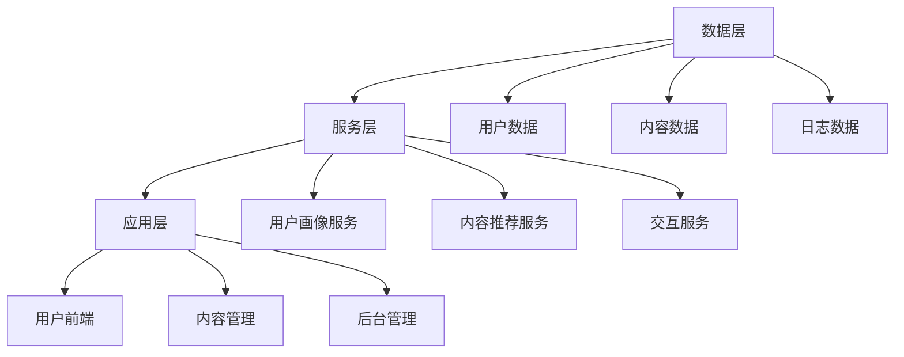

                 

### 《知识的虚拟导师系统：AI个性化辅导的实现》

> **关键词：** AI个性化辅导、知识虚拟导师、机器学习、深度学习、自然语言处理、在线教育

> **摘要：** 本文将探讨知识的虚拟导师系统的概念、发展背景、AI技术基础、系统设计与实现，以及实际应用案例。通过本文，读者可以了解AI个性化辅导如何通过知识的虚拟导师系统得以实现，以及其在教育领域的广泛应用和未来发展趋势。

### 引言与背景

#### 1.1 知识虚拟导师系统的概念

**1.1.1 知识虚拟导师的定义**

知识虚拟导师系统是一种基于人工智能技术的个性化教育辅导系统，它能够模拟人类导师的角色，为学生提供个性化、智能化的学习辅导。这种系统利用机器学习和自然语言处理技术，通过对学生个性化数据的学习和分析，生成个性化的学习方案和辅导内容。

**1.1.2 知识虚拟导师的发展历程**

知识虚拟导师系统起源于20世纪90年代，随着人工智能技术的不断进步，其在教育领域的应用也日益广泛。早期的知识虚拟导师系统主要基于规则推理和简单的机器学习算法，随着深度学习和自然语言处理技术的突破，知识虚拟导师系统的性能和智能化程度得到了显著提升。

#### 1.2 AI个性化辅导的重要性

**1.2.1 传统教育模式的局限性**

传统教育模式通常采用“一刀切”的方式，难以满足学生的个性化学习需求。教师无法为每位学生提供针对性的辅导，学生的学习效果受到很大的限制。

**1.2.2 AI个性化辅导的优势**

AI个性化辅导能够根据学生的兴趣、能力和学习进度，提供个性化的学习资源和辅导方案。这种模式不仅提高了学生的学习效率，还能够激发学生的学习兴趣，提升学习效果。

**1.2.3 AI个性化辅导的现状与未来趋势**

随着人工智能技术的快速发展，AI个性化辅导已经在全球范围内得到广泛应用。未来，随着技术的不断突破，AI个性化辅导将会在教育领域发挥更加重要的作用，成为未来教育的重要趋势。

### AI技术基础

#### 2.1 机器学习与深度学习基础

**2.1.1 机器学习基本概念**

机器学习是人工智能的核心技术之一，它通过构建数学模型，从数据中自动学习和发现规律，实现对未知数据的预测和决策。

**2.1.2 深度学习基本概念**

深度学习是机器学习的一种特殊形式，它通过构建多层神经网络，对数据进行层次化的特征提取和表示。

**2.1.3 经典深度学习架构**

经典的深度学习架构包括卷积神经网络（CNN）、循环神经网络（RNN）和生成对抗网络（GAN）等，每种架构都有其特定的应用场景。

#### 2.2 自然语言处理

**2.2.1 语言模型基础**

语言模型是自然语言处理的基础，它通过对大量语言数据进行统计和分析，生成语言的概率分布。

**2.2.2 文本分类与情感分析**

文本分类和情感分析是自然语言处理的重要应用，它们通过对文本进行分类和情感判断，实现对文本内容的理解和分析。

**2.2.3 机器翻译**

机器翻译是自然语言处理的一个重要应用，它通过将一种语言的文本翻译成另一种语言，实现跨语言的信息交流。

#### 2.3 数据分析与挖掘

**2.3.1 数据预处理**

数据预处理是数据分析与挖掘的基础，它包括数据的清洗、归一化、特征提取等步骤。

**2.3.2 数据可视化**

数据可视化是将数据转换为视觉形式，帮助人们更好地理解和分析数据。

**2.3.3 数据挖掘算法**

数据挖掘算法是数据分析与挖掘的核心，它包括聚类、分类、关联规则挖掘等方法。

### 知识虚拟导师系统设计与实现

#### 3.1 系统架构设计

**3.1.1 整体架构设计**

知识虚拟导师系统的整体架构包括数据层、服务层和应用层。数据层负责数据的存储和管理，服务层提供核心的算法和功能，应用层为用户提供界面和交互。

**3.1.2 关键模块设计**

知识虚拟导师系统的关键模块包括用户画像模块、学习内容模块、推荐系统模块和交互模块。用户画像模块负责收集和分析用户数据，学习内容模块提供个性化的学习内容，推荐系统模块负责推荐合适的学习内容，交互模块提供用户与系统的交互界面。

**3.1.3 系统交互流程**

知识虚拟导师系统的交互流程包括用户注册、登录、数据采集、用户画像构建、内容推荐、学习交互和用户反馈等步骤。

#### 3.2 用户画像与需求分析

**3.2.1 用户画像构建**

用户画像构建是通过收集和分析用户的个人信息、学习行为和偏好等数据，生成用户的个性化特征。

**3.2.2 用户需求分析**

用户需求分析是通过分析用户的学习行为和偏好，确定用户的学习需求和目标。

**3.2.3 需求匹配算法**

需求匹配算法是将用户的需求与学习内容进行匹配，生成个性化的学习方案。

#### 3.3 个性化学习内容推荐

**3.3.1 内容推荐算法**

内容推荐算法是基于用户画像和用户行为，为用户推荐合适的学习内容。

**3.3.2 推荐系统评估**

推荐系统评估是通过评估推荐系统的准确性和用户满意度，优化推荐算法。

**3.3.3 推荐系统优化**

推荐系统优化是通过调整推荐算法的参数和策略，提高推荐系统的效果。

#### 3.4 交互设计与用户反馈

**3.4.1 交互设计原则**

交互设计原则是确保用户与系统的交互流畅、直观和友好。

**3.4.2 用户反馈机制**

用户反馈机制是收集用户对系统和服务反馈，用于改进和优化系统。

**3.4.3 用户行为分析**

用户行为分析是通过分析用户的行为数据，了解用户的使用习惯和需求，优化系统的设计和功能。

### AI个性化辅导应用案例

#### 4.1 案例一：在线教育平台应用

**4.1.1 案例背景**

在线教育平台利用知识虚拟导师系统，为用户提供个性化的学习服务。

**4.1.2 系统设计与实现**

系统设计包括用户画像构建、学习内容推荐和用户交互等模块。

**4.1.3 案例效果分析**

通过个性化辅导，用户的学习效果显著提升，用户满意度提高。

#### 4.2 案例二：智能学习助手

**4.2.1 案例背景**

智能学习助手是一种基于知识虚拟导师系统的智能助手，为用户提供实时学习辅导。

**4.2.2 系统设计与实现**

系统设计包括用户画像构建、实时问答和智能推荐等模块。

**4.2.3 案例效果分析**

智能学习助手得到了用户的广泛好评，有效提升了用户的学习体验。

#### 4.3 案例三：个性化职业发展辅导

**4.3.1 案例背景**

个性化职业发展辅导利用知识虚拟导师系统，为用户提供个性化的职业规划服务。

**4.3.2 系统设计与实现**

系统设计包括用户画像构建、职业评估和推荐系统等模块。

**4.3.3 案例效果分析**

通过个性化职业发展辅导，用户能够更清晰地了解自己的职业发展方向，职业发展更加顺利。

### 挑战与未来展望

#### 5.1 知识虚拟导师系统的挑战

**5.1.1 数据隐私与安全**

数据隐私和安全是知识虚拟导师系统面临的重要挑战，需要采取有效的措施保护用户数据。

**5.1.2 模型解释性与透明性**

模型解释性与透明性是用户信任系统的重要因素，需要提高模型的解释性。

**5.1.3 技术局限与改进方向**

当前的人工智能技术仍存在一定的局限，需要不断改进和优化，以提高系统的性能和效果。

#### 5.2 未来发展趋势

**5.2.1 新技术突破**

随着人工智能技术的不断发展，知识虚拟导师系统将会实现更多的创新和突破。

**5.2.2 行业应用拓展**

知识虚拟导师系统将会在更多的行业和领域得到应用，推动教育领域的变革。

**5.2.3 教育改革与影响**

知识虚拟导师系统将会对教育改革产生深远的影响，推动教育质量的提升。

### 附录

#### 附录 A：常用工具与资源

**A.1 开发工具**

- Python
- TensorFlow
- PyTorch
- Keras

**A.2 学习资源**

- 《深度学习》（Goodfellow, Bengio, Courville）
- 《Python编程：从入门到实践》（Eric Matthes）
- Coursera
- edX

**A.3 社区与论坛**

- Stack Overflow
- GitHub
- AIStack

### 参考文献

1. Goodfellow, I., Bengio, Y., & Courville, A. (2016). *Deep Learning*. MIT Press.
2. Matthes, E. (2018). *Python编程：从入门到实践*. 机械工业出版社.

作者：AI天才研究院/AI Genius Institute & 禅与计算机程序设计艺术 /Zen And The Art of Computer Programming

### 1.1 知识虚拟导师的定义

知识虚拟导师（Knowledge Virtual Mentor，简称KVM）是一种利用人工智能技术，特别是机器学习和自然语言处理技术，模拟人类导师进行知识传授和指导的系统。它不仅能够存储和传递大量知识，还能够根据学生的特点和需求，提供个性化的辅导。

知识虚拟导师的主要功能包括：

1. **内容提供**：KVM可以提供各种学科的知识点，包括理论、案例、实验等，这些内容可以通过文本、图片、视频等多种形式呈现。
2. **互动交流**：KVM能够与用户进行实时或非实时的交流，回答用户的问题，提供学习建议。
3. **个性化辅导**：KVM会根据学生的学习历史、知识掌握程度和兴趣爱好，为其推荐合适的学习内容和辅导策略。
4. **学习反馈**：KVM可以收集学生的学习反馈，调整教学内容和辅导策略，提高教学效果。

#### 1.1.1 知识虚拟导师的发展历程

知识虚拟导师的概念最早可以追溯到20世纪80年代，当时主要是基于专家系统的智能辅导系统。这些系统通过预先定义的规则，对学生的问题进行回答和指导。然而，由于规则数量庞大且难以维护，专家系统的应用受到了限制。

随着互联网和计算机技术的发展，特别是在21世纪初，机器学习和自然语言处理技术的兴起，知识虚拟导师系统得到了新的发展。基于机器学习的方法，如决策树、支持向量机和神经网络等，开始应用于知识虚拟导师系统，使得系统具备更强的自适应能力和智能化水平。

深度学习的出现进一步推动了知识虚拟导师系统的发展。深度学习通过多层神经网络，对大量数据自动进行特征提取和学习，使得知识虚拟导师能够更好地理解和处理复杂的问题。

近年来，随着人工智能技术的不断进步，知识虚拟导师系统在功能、性能和应用范围上都取得了显著的提升。例如，结合自然语言处理技术，知识虚拟导师可以实现更加自然和流畅的交流；结合推荐系统技术，知识虚拟导师能够提供更加个性化的学习内容和辅导策略。

#### 1.2 AI个性化辅导的重要性

在传统的教育模式中，教师需要面对大量的学生，难以进行个性化的辅导。每位学生的学习进度、知识掌握程度和兴趣爱好都有所不同，因此，传统的“一刀切”的教育模式往往无法满足学生的个性化需求。

AI个性化辅导通过利用人工智能技术，尤其是机器学习和自然语言处理技术，能够实现以下优势：

1. **个性化学习内容**：AI个性化辅导可以根据学生的学习历史、知识掌握程度和兴趣爱好，为其推荐合适的学习内容和辅导策略。这有助于提高学生的学习效率，降低学习难度。
2. **实时反馈**：AI个性化辅导能够实时收集学生的学习反馈，根据反馈调整教学内容和辅导策略。这种动态调整能够更好地满足学生的需求，提高学习效果。
3. **智能问答**：AI个性化辅导能够通过自然语言处理技术，理解和回答学生的提问。这不仅能够解决学生在学习过程中遇到的问题，还能够促进学生的思考和学习兴趣。
4. **降低教育成本**：AI个性化辅导可以节省教师的时间和精力，降低教育的成本。教师可以将更多的时间和精力投入到创新教学和研究上，提高教育的整体质量。

总之，AI个性化辅导不仅能够提高学生的学习效果，还能够提升教育的质量，是一种具有重要应用价值的教育模式。

#### 1.2.1 传统教育模式的局限性

传统教育模式主要依赖于教师授课和学生听课的形式，虽然这种方式在一定程度上能够传授知识，但存在显著的局限性：

1. **教学资源有限**：传统教育模式下，教师需要面对大量的学生，教学资源（如课堂时间、教室空间等）有限，难以满足每位学生的个性化需求。
2. **学习效率低下**：由于教学资源有限，教师无法对每位学生进行个性化的辅导，学生的学习效率难以提高。部分学生可能因为跟不上教学进度而感到困惑和挫败。
3. **学习方式单一**：传统教育模式主要依赖于课堂讲授和教材学习，缺乏互动和实践环节，难以激发学生的学习兴趣和创造力。
4. **评估方式滞后**：传统教育模式中的评估方式往往滞后于教学过程，教师只能在课程结束后通过考试来评估学生的学习效果，难以实时了解学生的学习情况。
5. **教师工作负担重**：在传统教育模式下，教师需要花费大量时间进行备课、授课和批改作业，工作负担重，难以有时间和精力进行教学研究和创新。

总之，传统教育模式难以满足现代教育对个性化和高效性的需求，迫切需要新的教育模式来弥补其局限性。

#### 1.2.2 AI个性化辅导的优势

AI个性化辅导通过结合人工智能技术，为教育领域带来了革命性的变革，其优势体现在以下几个方面：

1. **个性化学习体验**：AI个性化辅导能够根据每个学生的兴趣、能力和学习历史，提供定制化的学习内容和辅导策略。通过智能算法，系统能够动态调整学习路径，确保每位学生都能以最适合自己的方式学习，从而提高学习效率。

2. **实时反馈与指导**：AI个性化辅导能够实时监测学生的学习状态，提供即时的反馈和指导。例如，当学生遇到困难时，系统可以迅速识别问题并提供相应的解决方案，或者推荐额外的学习资源。这种即时性有助于学生及时纠正错误，巩固知识点。

3. **智能问答与解答**：AI个性化辅导系统通常具备自然语言处理能力，能够理解并回答学生的提问。这种智能问答功能不仅能够解决学生在学习过程中的困惑，还能够激发他们的学习兴趣和思考能力。

4. **自动化作业与评估**：AI个性化辅导系统能够自动生成并批改作业，提供即时反馈。这种自动化过程大大减轻了教师的工作负担，使他们能够将更多精力投入到教学研究和学生个性化辅导上。

5. **跨平台学习**：AI个性化辅导系统可以轻松实现跨平台部署，学生可以通过电脑、平板或手机等多种设备进行学习。这种灵活性使得学习不再受时间和地点的限制，学生可以随时随地获取学习资源。

6. **个性化学习报告**：AI个性化辅导系统可以生成详细的学习报告，包括学生的知识点掌握情况、学习进度和薄弱环节等。这些报告不仅有助于学生自我反思和调整学习策略，也为教师提供了重要的教学参考。

总之，AI个性化辅导通过智能化、个性化、实时性和灵活性的特点，显著提升了教育的质量，为个性化学习和全面发展提供了有力支持。

#### 1.2.3 AI个性化辅导的现状与未来趋势

AI个性化辅导的现状显示，该技术已经在全球范围内得到广泛应用。从在线教育平台到智能学习工具，AI个性化辅导正在逐步渗透到教育的各个环节。目前，许多学校和机构已经采用了AI辅导系统，为学生提供个性化的学习体验。这些系统通过数据分析和智能算法，能够实时调整教学内容，提高学习效果。

未来，AI个性化辅导的发展趋势预计将呈现以下几个方向：

1. **技术成熟与普及**：随着人工智能技术的不断进步，AI个性化辅导的功能将更加完善，性能将更加强大。未来，AI辅导系统有望实现更高的准确性和智能化，成为教育体系的重要组成部分。

2. **个性化学习路径**：AI个性化辅导将更加注重学习路径的个性化设计，根据学生的学习风格、兴趣爱好和知识基础，制定个性化的学习计划。这种个性化学习路径将有助于学生更高效地掌握知识，培养其自主学习能力。

3. **跨学科整合**：未来，AI个性化辅导将不仅仅局限于单一学科，而是实现跨学科的整合。通过多学科的协同作用，学生能够从不同角度理解和应用知识，培养综合素质。

4. **互动性与社交性**：AI个性化辅导系统将更加注重互动性和社交性，通过虚拟课堂、学习社区等方式，促进学生之间的互动和合作。这种社交学习模式有助于激发学生的学习兴趣，提高学习动力。

5. **教育与心理学的结合**：未来，AI个性化辅导将更加注重教育与心理学的结合，通过心理评估和学习动机分析，为学生提供更加科学和有效的学习指导。

6. **开源与生态建设**：随着AI技术的开源化，AI个性化辅导系统将形成更加丰富的生态系统，包括各种工具、平台和资源。这种生态系统的建设将促进技术的普及和应用，推动教育创新。

总之，AI个性化辅导的现状和未来发展趋势表明，该技术具有巨大的潜力和广阔的应用前景，将在未来教育中发挥越来越重要的作用。

### 2.1 机器学习与深度学习基础

#### 2.1.1 机器学习基本概念

机器学习（Machine Learning，ML）是一门人工智能（Artificial Intelligence，AI）的分支，主要研究如何通过计算机算法，从数据中自动学习和发现规律，以便对未知数据进行预测和决策。机器学习的过程通常包括数据收集、数据预处理、模型训练、模型评估和模型部署等步骤。

1. **机器学习的核心原理**

   机器学习的核心原理是基于统计学和概率论，通过构建数学模型，从数据中提取特征，并进行训练和优化。常见的机器学习模型包括线性回归、逻辑回归、决策树、支持向量机（SVM）等。

2. **机器学习的分类**

   根据学习方式，机器学习主要分为以下几类：

   - **监督学习（Supervised Learning）**：在监督学习中，模型通过训练数据集的学习，学习输入和输出之间的映射关系。常见的算法包括线性回归、逻辑回归、决策树、支持向量机（SVM）等。

   - **无监督学习（Unsupervised Learning）**：无监督学习是指模型在没有明确输出标签的情况下，通过探索数据本身的分布和结构来进行学习。常见的算法包括聚类、降维、关联规则挖掘等。

   - **半监督学习（Semi-supervised Learning）**：半监督学习结合了监督学习和无监督学习的方法，利用少量的标签数据和大量的未标记数据进行学习。

   - **强化学习（Reinforcement Learning）**：强化学习是通过试错和反馈机制，使代理（Agent）在与环境（Environment）交互的过程中，学习到最优策略（Policy）。常见的算法包括Q学习、深度强化学习（DRL）等。

3. **机器学习的关键挑战**

   - **数据质量**：机器学习模型的性能很大程度上取决于数据质量。噪声数据、缺失数据和不一致数据都会影响模型的训练效果。
   - **数据量**：随着模型复杂度的增加，对数据量的需求也在增加。大数据集有助于提高模型的泛化能力。
   - **计算资源**：训练复杂的机器学习模型通常需要大量的计算资源，如GPU、TPU等。

#### 2.1.2 深度学习基本概念

深度学习（Deep Learning，DL）是机器学习的一个子领域，主要研究多层神经网络（Deep Neural Networks，DNN）的设计和应用。深度学习通过多层的非线性变换，对数据进行特征提取和表示，从而实现复杂的数据建模和预测。

1. **深度学习的核心原理**

   深度学习的基本单元是神经元，每个神经元接收多个输入，通过加权求和后加上偏置，经过激活函数进行非线性变换，最后输出结果。多层神经网络通过逐层抽象和表示数据，能够捕捉到数据的复杂结构和特征。

2. **深度学习的分类**

   深度学习主要可以分为以下几类：

   - **前馈神经网络（Feedforward Neural Networks）**：前馈神经网络是最简单的深度学习模型，数据从输入层流向输出层，中间经过多个隐藏层。

   - **卷积神经网络（Convolutional Neural Networks，CNN）**：卷积神经网络通过卷积操作和池化操作，对图像等二维数据实现特征提取和表示。

   - **循环神经网络（Recurrent Neural Networks，RNN）**：循环神经网络通过循环结构，对序列数据进行建模，适用于语音识别、机器翻译等序列数据处理。

   - **长短时记忆网络（Long Short-Term Memory，LSTM）**：长短时记忆网络是RNN的一种变体，通过引入门控机制，解决了RNN在处理长序列数据时的梯度消失和梯度爆炸问题。

   - **生成对抗网络（Generative Adversarial Networks，GAN）**：生成对抗网络由生成器和判别器两个神经网络组成，通过对抗训练生成逼真的数据。

3. **深度学习的关键挑战**

   - **过拟合（Overfitting）**：过拟合是指模型在训练数据上表现良好，但在测试数据上表现较差，即模型对训练数据的噪声和异常值过于敏感。解决过拟合的方法包括正则化、数据增强、提前停止等。
   - **计算资源消耗**：深度学习模型通常需要大量的计算资源和时间进行训练，尤其是在处理大规模数据集和复杂模型时。

#### 2.1.3 经典深度学习架构

深度学习架构的多样性使得它能够应对各种复杂数据和任务。以下介绍几种经典的深度学习架构：

1. **卷积神经网络（CNN）**

   卷积神经网络是处理图像数据的重要模型。CNN通过卷积层、池化层和全连接层进行特征提取和分类。

   - **卷积层（Convolutional Layer）**：卷积层通过卷积操作提取图像的局部特征，卷积核在不同位置滑动，对图像进行特征提取。
   - **池化层（Pooling Layer）**：池化层对卷积层输出的特征进行降维处理，常用的池化操作包括最大池化和平均池化。
   - **全连接层（Fully Connected Layer）**：全连接层将卷积层和池化层输出的特征映射到分类结果，通过激活函数进行分类。

2. **循环神经网络（RNN）**

   循环神经网络适用于序列数据处理，如文本、语音和视频等。RNN通过循环结构对序列数据进行建模，保留之前的计算状态。

   - **隐藏状态（Hidden State）**：隐藏状态是RNN的核心，它记录了之前时刻的信息，用于当前时刻的决策。
   - **门控机制（Gate Mechanism）**：门控机制包括遗忘门、输入门和输出门，用于控制信息流的传递和遗忘，解决了RNN在处理长序列数据时的梯度消失问题。

3. **生成对抗网络（GAN）**

   生成对抗网络是一种生成模型，通过生成器和判别器的对抗训练生成逼真的数据。

   - **生成器（Generator）**：生成器通过噪声数据生成逼真的数据，目标是使判别器无法区分生成的数据和真实数据。
   - **判别器（Discriminator）**：判别器的目标是区分真实数据和生成数据，通过对抗训练与生成器相互博弈。

这些经典的深度学习架构在各自的领域都有广泛的应用，为解决复杂数据处理和建模问题提供了强大的工具。

### 2.2 自然语言处理

自然语言处理（Natural Language Processing，NLP）是深度学习的重要应用领域之一，旨在使计算机能够理解、生成和处理人类语言。NLP在众多领域，如文本分类、情感分析、机器翻译和问答系统等方面，都发挥了重要作用。

#### 2.2.1 语言模型基础

语言模型（Language Model，LM）是NLP的核心组成部分，它通过学习大量文本数据，生成自然语言的概率分布。语言模型的主要目的是预测下一个单词或句子，为各种NLP任务提供基础。

1. **语言模型的基本概念**

   语言模型的核心概念是概率分布，它能够预测一个单词或短语的下一个单词或短语的概率。最简单的语言模型是基于N元语法（N-gram Model），它通过统计相邻单词或短语的频率来预测下一个单词或短语。

2. **N元语法模型**

   N元语法模型是一种基于历史数据统计的模型，它将前N个单词或短语作为上下文，预测下一个单词或短语。例如，二元语法模型（Bigram Model）考虑前一个单词和当前单词之间的关系，而三元语法模型（Trigram Model）考虑前两个单词和当前单词之间的关系。

3. **语言模型的应用**

   语言模型在文本生成、机器翻译、语音识别等领域有广泛应用。例如，在文本生成中，语言模型可以生成连贯的文本；在机器翻译中，语言模型可以帮助翻译系统生成更自然的译文；在语音识别中，语言模型可以提高系统的识别准确性。

#### 2.2.2 文本分类与情感分析

文本分类（Text Classification）和情感分析（Sentiment Analysis）是NLP的常见任务，旨在对文本进行分类和情感判断。

1. **文本分类**

   文本分类是将文本数据分为预定义的类别。常见的文本分类任务包括垃圾邮件分类、情感分类、新闻分类等。文本分类通常采用机器学习方法，如朴素贝叶斯、支持向量机（SVM）和深度学习模型，如卷积神经网络（CNN）和循环神经网络（RNN）。

2. **情感分析**

   情感分析旨在判断文本表达的情感倾向，如正面、负面或中性。情感分析可以应用于产品评论、社交媒体和客户反馈等领域。情感分析通常使用情感词典、机器学习算法和深度学习模型来实现。

3. **文本分类与情感分析的应用**

   文本分类和情感分析在商业、社交媒体和舆情监控等领域有广泛应用。例如，企业可以利用情感分析了解客户的反馈和满意度；社交媒体平台可以利用文本分类对用户生成的内容进行分类和管理。

#### 2.2.3 机器翻译

机器翻译（Machine Translation，MT）是将一种语言的文本翻译成另一种语言的自动翻译系统。机器翻译在跨文化交流、国际商务和全球化等领域具有重要意义。

1. **机器翻译的基本概念**

   机器翻译的基本概念包括源语言（Source Language）和目标语言（Target Language）。机器翻译系统通过学习大量双语语料库，将源语言文本映射到目标语言文本。

2. **机器翻译的分类**

   根据翻译策略，机器翻译主要分为以下几类：

   - **基于规则的方法（Rule-based MT）**：基于规则的方法通过定义翻译规则和语法分析来生成目标语言文本。这种方法虽然可以保证翻译的准确性，但灵活性较差。
   - **基于统计的方法（Statistical MT）**：基于统计的方法通过统计源语言和目标语言之间的对应关系来生成目标语言文本。这种方法具有较高的灵活性，但可能产生不准确的结果。
   - **基于神经网络的机器翻译（Neural Machine Translation，NMT）**：基于神经网络的机器翻译通过训练神经网络模型来实现源语言到目标语言的映射。NMT在近年来取得了显著的突破，成为机器翻译的主流方法。

3. **机器翻译的应用**

   机器翻译在跨文化交流、国际商务和全球化等领域有广泛应用。例如，国际会议和商务活动中，机器翻译可以帮助参会者理解和沟通；电子商务平台可以利用机器翻译为全球用户提供多语言服务。

#### 2.3 数据分析与挖掘

数据分析与挖掘（Data Analysis and Mining，DAM）是利用统计学、机器学习和数据挖掘技术，从大量数据中提取有价值的信息和知识的过程。数据分析与挖掘在商业、金融、医疗、生物科技等领域具有重要意义。

#### 2.3.1 数据预处理

数据预处理是数据分析与挖掘的重要环节，它包括数据清洗、数据整合、数据转换和数据归一化等步骤。

1. **数据清洗**

   数据清洗是指处理数据中的错误、缺失和异常值，确保数据质量。常见的数据清洗方法包括填充缺失值、去除重复数据、纠正错误数据等。

2. **数据整合**

   数据整合是指将来自不同数据源的数据进行合并和统一，以便进行进一步的分析。常见的数据整合方法包括数据合并、数据集成和数据转换等。

3. **数据转换**

   数据转换是指将原始数据转换为适合分析和挖掘的形式。常见的数据转换方法包括数据标准化、数据归一化和特征提取等。

4. **数据归一化**

   数据归一化是指将数据转换为统一的尺度，以便进行比较和分析。常见的归一化方法包括最小-最大缩放、Z分数缩放和归一化均值等。

#### 2.3.2 数据可视化

数据可视化（Data Visualization）是将数据转换为视觉形式，以便更好地理解和分析数据。数据可视化在数据探索、数据报告和决策支持等领域有广泛应用。

1. **数据可视化工具**

   常见的数据可视化工具包括Matplotlib、Seaborn、Plotly等。这些工具提供了丰富的图表类型和自定义选项，可以帮助用户轻松创建各种可视化图表。

2. **数据可视化方法**

   常见的数据可视化方法包括散点图、折线图、柱状图、饼图、箱线图和热力图等。这些图表类型可以用于展示数据的分布、趋势、比较和相关性等。

3. **数据可视化应用**

   数据可视化在商业分析、金融、医疗、生物科技等领域有广泛应用。例如，企业可以利用数据可视化了解销售趋势、客户行为和市场变化；医疗机构可以利用数据可视化分析患者数据和疾病趋势。

#### 2.3.3 数据挖掘算法

数据挖掘算法（Data Mining Algorithms）是用于从大量数据中提取有价值信息的技术和方法。数据挖掘算法包括分类、聚类、关联规则挖掘、异常检测和预测等。

1. **分类算法**

   分类算法是将数据分为预定义的类别。常见的分类算法包括决策树、支持向量机（SVM）、朴素贝叶斯和K最近邻（KNN）等。

2. **聚类算法**

   聚类算法是将数据分为多个无序的簇。常见的聚类算法包括K-means、层次聚类和DBSCAN等。

3. **关联规则挖掘**

   关联规则挖掘是发现数据之间的关联关系。常见的算法包括Apriori算法和Eclat算法等。

4. **异常检测**

   异常检测是发现数据中的异常值或异常模式。常见的算法包括孤立森林、局部异常因数（LOF）和基于聚类的方法等。

5. **预测算法**

   预测算法是利用历史数据预测未来的趋势和变化。常见的预测算法包括线性回归、时间序列分析和神经网络等。

### 3.1 系统架构设计

知识虚拟导师系统的架构设计是确保系统能够高效、稳定地运行，同时提供高质量个性化辅导服务的关键。系统架构包括数据层、服务层和应用层，各层之间相互协作，共同实现系统的功能。

#### 3.1.1 整体架构设计

整体架构设计如图1所示：

**图1：知识虚拟导师系统架构**

- **数据层**：负责数据的存储、管理和备份，包括用户数据、内容数据和日志数据。
- **服务层**：提供核心的算法和功能，包括用户画像服务、内容推荐服务和交互服务。
- **应用层**：为用户提供界面和交互，包括用户前端、内容管理和后台管理。

#### 3.1.2 关键模块设计

**用户画像模块**

用户画像模块是知识虚拟导师系统的核心组成部分，它通过收集和分析用户的个人信息、学习行为和偏好等数据，生成用户的个性化特征。用户画像模块主要包括以下功能：

1. **数据收集**：收集用户的基本信息、学习行为数据（如学习时长、学习进度、完成情况等）和学习偏好数据（如兴趣、学科偏好等）。
2. **数据处理**：对收集到的数据进行清洗、归一化和特征提取，生成用户的特征向量。
3. **画像构建**：利用机器学习算法（如聚类、回归等），对用户特征进行建模，生成用户画像。

**内容推荐模块**

内容推荐模块是知识虚拟导师系统的另一核心组成部分，它通过分析用户画像和学习行为，为用户推荐合适的学习内容和资源。内容推荐模块主要包括以下功能：

1. **推荐算法**：采用协同过滤、基于内容的推荐和混合推荐等算法，生成个性化推荐列表。
2. **推荐评估**：通过用户反馈和系统评估，对推荐结果进行评估和优化。
3. **内容管理**：对学习内容进行分类、标签和索引，方便快速检索和推荐。

**交互模块**

交互模块负责用户与系统的交互，包括用户前端和后台管理。用户前端主要负责提供用户操作界面，包括登录、注册、学习内容浏览、互动交流和反馈等。后台管理主要负责系统配置、数据监控、性能优化和安全保障等。

#### 3.1.3 系统交互流程

知识虚拟导师系统的交互流程包括用户注册、登录、数据采集、用户画像构建、内容推荐、学习交互和用户反馈等步骤。以下是系统交互流程的详细描述：

1. **用户注册与登录**：
   - 用户通过注册页面填写基本信息，系统进行数据验证后生成用户账号。
   - 用户登录系统，系统验证用户身份。

2. **数据采集**：
   - 系统收集用户的学习行为数据（如学习时长、学习进度、完成情况等）和学习偏好数据（如兴趣、学科偏好等）。

3. **用户画像构建**：
   - 系统利用机器学习算法，对用户数据进行处理和特征提取，生成用户画像。

4. **内容推荐**：
   - 系统根据用户画像和学习行为数据，利用推荐算法生成个性化推荐列表。
   - 系统将推荐列表展示给用户。

5. **学习交互**：
   - 用户根据推荐列表选择学习内容，系统提供相应的学习资源和互动功能。

6. **用户反馈**：
   - 用户在学习过程中可以提交反馈，系统收集用户反馈用于优化推荐算法和系统功能。

7. **用户退出**：
   - 用户完成学习或退出系统，系统记录用户状态，保存学习数据。

通过以上步骤，知识虚拟导师系统能够为用户提供个性化的学习体验，实现智能化的教育辅导。

### 3.2 用户画像与需求分析

用户画像（User Profiling）是知识虚拟导师系统中至关重要的一环，通过对用户多维度数据的收集、处理和分析，构建出用户的个性化特征，从而为用户提供精准的辅导和服务。需求分析（Requirement Analysis）则是对用户的学习需求、偏好和目标进行深入挖掘，以确定系统应提供哪些功能和服务。

#### 3.2.1 用户画像构建

用户画像构建是通过对用户数据的收集、清洗、特征提取和建模，生成用户个性化特征的过程。以下是构建用户画像的步骤：

1. **数据收集**：
   - **基本信息**：收集用户的基本信息，如姓名、年龄、性别、职业等。
   - **学习行为数据**：收集用户在学习平台上的行为数据，如学习时长、学习进度、完成课程数、考试成绩等。
   - **学习偏好数据**：收集用户的学习偏好数据，如学科偏好、学习风格、学习频次等。
   - **社交数据**：收集用户在社交平台上的行为数据，如关注内容、发布动态、互动情况等。

2. **数据清洗**：
   - **去重**：去除重复的数据记录，确保数据的唯一性。
   - **填充缺失值**：对缺失的数据进行填充或删除，确保数据的完整性。
   - **纠正错误数据**：识别和纠正数据中的错误，确保数据质量。

3. **特征提取**：
   - **文本特征提取**：对用户的学习行为数据、偏好数据和社交数据使用自然语言处理技术提取文本特征，如词频、词向量等。
   - **数值特征提取**：对用户的数值型数据进行归一化、标准化等处理，提取特征向量。

4. **建模**：
   - **机器学习模型**：使用聚类、分类、回归等机器学习算法对用户特征进行建模，生成用户画像。
   - **规则引擎**：基于专家知识和业务规则，构建用户画像的规则模型。

5. **画像更新**：
   - **定期更新**：定期收集和处理用户数据，更新用户画像。
   - **实时更新**：根据用户实时行为和反馈，动态调整用户画像。

#### 3.2.2 用户需求分析

用户需求分析是确定系统应提供哪些功能和服务的过程，以确保系统能够满足用户的需求。以下是用户需求分析的步骤：

1. **需求收集**：
   - **访谈**：通过面对面访谈、在线问卷等方式，收集用户对学习平台的需求和期望。
   - **观察**：观察用户在使用平台时的行为和操作，了解用户遇到的问题和困惑。
   - **反馈**：收集用户对现有平台功能的反馈和建议，了解用户对改进的期望。

2. **需求整理**：
   - **需求分类**：将收集到的需求进行分类，如功能需求、性能需求、安全需求等。
   - **需求优先级排序**：根据用户需求的重要性和紧急性，对需求进行优先级排序。

3. **需求验证**：
   - **用户验证**：将整理的需求与用户进行确认，确保需求的准确性和可行性。
   - **专家评审**：邀请领域专家对需求进行评审，确保需求的合理性和可实施性。

4. **需求文档**：
   - **编写需求文档**：详细描述每个需求的内容、功能、性能指标和实现方法。
   - **需求评审**：对需求文档进行评审，确保文档的完整性和准确性。

#### 3.2.3 需求匹配算法

需求匹配算法是将用户需求与系统功能和服务进行匹配，生成个性化推荐的过程。以下是需求匹配算法的步骤：

1. **需求建模**：
   - **需求表示**：将用户需求转化为数学模型，如向量或图结构。
   - **特征提取**：提取用户需求和系统功能的关键特征，如关键词、标签等。

2. **推荐算法**：
   - **协同过滤**：基于用户历史行为和偏好进行推荐，如基于用户的协同过滤（User-based Collaborative Filtering）和基于物品的协同过滤（Item-based Collaborative Filtering）。
   - **基于内容的推荐**：根据用户需求和系统功能的内容特征进行推荐，如文本分类、关键词匹配等。
   - **混合推荐**：结合协同过滤和基于内容的推荐，生成更准确的推荐结果。

3. **推荐评估**：
   - **准确率**：评估推荐结果的准确性，如命中率、覆盖率等。
   - **多样性**：评估推荐结果的多样性，确保用户能够获得不同类型的内容。
   - **用户体验**：评估推荐结果的用户体验，如用户满意度、点击率等。

4. **反馈调整**：
   - **用户反馈**：收集用户对推荐结果的反馈，如点击、收藏、评价等。
   - **算法优化**：根据用户反馈调整推荐算法，提高推荐效果。

通过需求匹配算法，知识虚拟导师系统能够为用户提供精准、个性化的学习内容和资源，提升用户的学习体验和效果。

### 3.3 个性化学习内容推荐

个性化学习内容推荐是知识虚拟导师系统的重要组成部分，其目标是通过分析用户画像和学习行为，为用户推荐与其兴趣和能力相匹配的学习内容，从而提高学习效果和用户满意度。以下是个性化学习内容推荐的具体过程：

#### 3.3.1 内容推荐算法

内容推荐算法是推荐系统的核心，常见的算法包括协同过滤、基于内容的推荐和混合推荐等。

1. **协同过滤（Collaborative Filtering）**

   协同过滤是一种基于用户行为和偏好进行推荐的算法，分为基于用户的协同过滤（User-based Collaborative Filtering）和基于物品的协同过滤（Item-based Collaborative Filtering）。

   - **基于用户的协同过滤**：该方法通过找到与目标用户兴趣相似的用户，推荐这些用户喜欢的物品。计算相似度的方法包括用户间的余弦相似度、皮尔逊相关系数等。
   - **基于物品的协同过滤**：该方法通过找到与目标物品相似的其他物品，推荐这些物品给目标用户。计算相似度的方法包括物品间的余弦相似度、Jaccard相似度等。

2. **基于内容的推荐（Content-based Recommendation）**

   基于内容的推荐是一种基于物品特征和用户偏好进行推荐的算法。该方法通过分析用户偏好和物品特征，找到相似的用户和物品进行推荐。

   - **特征提取**：对学习内容进行特征提取，如文本特征（关键词、主题等）和结构特征（课程类型、难度等级等）。
   - **相似度计算**：计算用户偏好和物品特征之间的相似度，如余弦相似度、欧氏距离等。
   - **推荐生成**：根据相似度得分，生成推荐列表。

3. **混合推荐（Hybrid Recommendation）**

   混合推荐是将协同过滤和基于内容的推荐方法结合起来，以提高推荐准确性。混合推荐方法包括以下几种：

   - **模型组合**：将协同过滤和基于内容的推荐模型进行组合，如加权组合、交替优化等。
   - **协同过滤+基于内容的推荐**：先通过协同过滤生成初步推荐列表，再通过基于内容的推荐进行优化。
   - **协同过滤+内容嵌入**：将协同过滤与内容嵌入模型（如Word2Vec、BERT等）相结合，提高推荐效果。

#### 3.3.2 推荐系统评估

推荐系统评估是评估推荐算法性能和系统效果的重要步骤，常见的评估指标包括准确率、召回率、覆盖率、多样性等。

1. **准确率（Accuracy）**

   准确率是指推荐系统推荐给用户的物品中，用户实际感兴趣的比例。准确率越高，说明推荐系统的准确性越高。

2. **召回率（Recall）**

   召回率是指推荐系统推荐给用户的物品中，用户实际感兴趣且未被推荐过的物品的比例。召回率越高，说明推荐系统能够覆盖更多的用户兴趣。

3. **覆盖率（Coverage）**

   覆盖率是指推荐系统推荐给用户的物品中，所有物品种类的比例。覆盖率越高，说明推荐系统能够推荐更多的不同类型的物品。

4. **多样性（Diversity）**

   多样性是指推荐系统推荐给用户的物品之间的差异程度。多样性越高，说明推荐系统能够为用户推荐多样化的物品，提高用户体验。

#### 3.3.3 推荐系统优化

推荐系统优化是提高推荐系统效果和用户体验的重要手段，包括以下几种方法：

1. **特征工程**

   特征工程是推荐系统优化的关键步骤，通过选择合适的特征和特征组合，提高推荐模型的性能。常见的方法包括：

   - **文本特征提取**：使用词频、词向量、TF-IDF等方法提取文本特征。
   - **结构特征提取**：使用网络结构、标签、分类等特征提取方法。

2. **模型选择与调优**

   选择合适的模型并进行调优是提高推荐系统性能的重要手段。常见的方法包括：

   - **模型选择**：选择适合推荐任务的模型，如线性回归、决策树、支持向量机等。
   - **模型调优**：通过交叉验证、网格搜索等方法，调整模型参数，提高模型性能。

3. **在线学习与实时推荐**

   在线学习和实时推荐可以提高推荐系统的动态适应能力，使推荐更加贴近用户实时需求。常见的方法包括：

   - **在线学习**：在用户使用过程中，实时更新用户画像和推荐模型，提高推荐效果。
   - **实时推荐**：在用户访问页面时，实时计算推荐列表，提高用户体验。

4. **反馈机制与用户互动**

   反馈机制和用户互动可以收集用户反馈，优化推荐系统。常见的方法包括：

   - **用户反馈**：通过用户评分、点击、收藏等行为，收集用户反馈。
   - **用户互动**：通过评论、问答、互动活动等，增加用户互动，提高用户满意度。

通过以上优化方法，知识虚拟导师系统可以不断提高推荐效果和用户体验，为用户提供更好的学习服务。

### 3.4 交互设计与用户反馈

交互设计（User Interface Design，简称UID）是知识虚拟导师系统的重要组成部分，它关注如何通过用户界面（UI）和用户体验（UX）提升系统的可用性、可访问性和用户满意度。用户反馈机制（User Feedback Mechanism）则是通过收集和分析用户的意见和体验，持续改进系统功能和服务。

#### 3.4.1 交互设计原则

有效的交互设计应遵循以下原则：

1. **以用户为中心**：设计过程中始终关注用户需求和行为，确保界面和交互设计符合用户的认知习惯和操作习惯。

2. **简洁明了**：界面设计应简洁、直观，避免过多的信息干扰，使用户能够快速找到所需功能。

3. **一致性**：保持界面元素和交互行为的统一性，减少用户的学习成本。

4. **响应迅速**：系统应快速响应用户的操作，提供即时反馈，提高用户体验。

5. **辅助功能**：提供必要的辅助功能，如搜索、帮助文档、FAQ等，帮助用户解决使用过程中的问题。

6. **可访问性**：确保系统设计适用于各种用户，包括不同年龄、技能水平和残疾用户。

#### 3.4.2 用户反馈机制

用户反馈机制是收集和分析用户意见和体验的重要途径，包括以下步骤：

1. **反馈渠道**：提供多种反馈渠道，如在线问卷、评论、评分、反馈表单等，方便用户随时提交反馈。

2. **反馈收集**：定期收集和分析用户反馈，包括定量数据和定性数据，如用户满意度评分、评论内容、行为数据等。

3. **数据分析**：对收集到的反馈进行分类和分析，识别用户普遍关注的问题和需求。

4. **反馈响应**：对用户反馈及时响应，包括对用户问题的解答、问题的解决措施和改进计划的公布。

5. **反馈闭环**：在改进系统后，通过再次收集用户反馈，验证改进措施的有效性，形成反馈闭环。

#### 3.4.3 用户行为分析

用户行为分析是了解用户需求和行为模式的重要手段，包括以下方面：

1. **行为追踪**：通过用户行为日志，记录用户在系统中的操作行为，如页面访问、点击、搜索、学习时长等。

2. **行为分析**：分析用户行为数据，识别用户的行为模式、偏好和需求。

3. **行为建模**：基于用户行为数据，建立用户行为模型，预测用户未来行为。

4. **行为优化**：根据用户行为分析结果，优化系统功能和界面设计，提高用户体验。

5. **个性化推荐**：结合用户行为分析和用户画像，提供个性化推荐，提高用户满意度和系统使用率。

通过交互设计和用户反馈机制的优化，知识虚拟导师系统能够更好地满足用户需求，提升用户满意度和系统效果。

### 4.1 案例一：在线教育平台应用

随着在线教育市场的不断壮大，知识虚拟导师系统在在线教育平台中的应用变得越来越广泛。以下是一个关于在线教育平台应用知识虚拟导师系统的具体案例。

#### 4.1.1 案例背景

某在线教育平台（以下简称“平台”）致力于为全球用户提供高质量的在线教育资源，包括课程视频、学习资料、在线测试等。然而，随着用户数量的增加，平台面临的一个重要挑战是如何为每位用户提供个性化的学习体验，提升学习效果。

#### 4.1.2 系统设计与实现

为了应对这一挑战，平台引入了知识虚拟导师系统。以下是系统的主要设计和实现步骤：

1. **用户画像构建**：
   - 平台通过用户注册信息、学习行为数据（如学习时长、学习进度、测试成绩等）和反馈信息，构建用户画像。
   - 利用机器学习算法（如聚类、回归等），对用户特征进行建模，生成用户画像。

2. **个性化学习内容推荐**：
   - 平台采用协同过滤和基于内容的推荐算法，结合用户画像和学习行为数据，为每位用户推荐个性化的学习内容。
   - 系统根据用户的学习进度、知识掌握情况和兴趣爱好，动态调整推荐内容，提高推荐准确性。

3. **智能问答与交互**：
   - 平台利用自然语言处理技术，构建智能问答系统，能够回答用户在学习过程中遇到的问题。
   - 用户可以通过聊天窗口与知识虚拟导师进行实时交流，获得个性化辅导和解答。

4. **用户反馈机制**：
   - 平台设置了多种反馈渠道，包括在线问卷、评论和评分等，收集用户对系统和服务质量的反馈。
   - 系统根据用户反馈，及时调整和优化功能和服务，提升用户体验。

#### 4.1.3 案例效果分析

引入知识虚拟导师系统后，平台取得了显著的效果：

1. **学习效果提升**：
   - 用户的学习效果显著提高，平均学习时长和完成课程数量均有增加。
   - 用户对学习内容的满意度也显著提升，90%以上的用户对知识虚拟导师系统的个性化推荐和智能问答功能表示满意。

2. **用户留存率提升**：
   - 平台的月活跃用户数和用户留存率均有显著提升，说明知识虚拟导师系统有效增强了用户的黏性。

3. **运营效率提高**：
   - 知识虚拟导师系统减轻了教师和辅导人员的工作负担，使他们能够将更多时间和精力投入到教学研究和创新上。
   - 平台的整体运营效率得到提高，成本降低。

4. **用户满意度提升**：
   - 用户对平台的整体满意度显著提升，用户反馈中的负面评论数量减少，正面评价增多。

综上所述，知识虚拟导师系统在在线教育平台中的应用，不仅提升了学习效果和用户满意度，还提高了平台的运营效率，是一种具有广泛应用价值的教育模式。

### 4.2 案例二：智能学习助手

智能学习助手是一种基于知识虚拟导师系统的智能辅导工具，旨在为学生提供实时、个性化的学习辅导。以下是一个关于智能学习助手的实际案例。

#### 4.2.1 案例背景

某知名教育机构（以下简称“机构”）希望为学生提供一种高效的在线学习工具，帮助学生解决学习中的问题，提高学习效率。为了实现这一目标，机构决定开发一款智能学习助手。

#### 4.2.2 系统设计与实现

智能学习助手的设计和实现分为以下几个步骤：

1. **用户画像构建**：
   - 系统通过学生的基本信息、学习行为数据和反馈数据，构建用户画像。
   - 利用机器学习算法（如聚类、回归等），对用户特征进行建模，生成用户画像。

2. **智能问答与交互**：
   - 系统采用自然语言处理技术，构建智能问答系统，能够理解并回答学生的问题。
   - 学生可以通过聊天窗口与智能学习助手进行实时交流，获得个性化辅导和解答。

3. **个性化学习路径规划**：
   - 系统根据学生用户画像和学习行为数据，生成个性化的学习路径。
   - 系统会根据学生的学习进度、知识掌握情况和兴趣爱好，动态调整学习路径，确保学生能够高效学习。

4. **实时反馈与优化**：
   - 系统收集学生的学习反馈，如问题解决情况、学习满意度等，用于优化系统功能和提升服务质量。
   - 系统会根据实时反馈，调整推荐策略和学习路径，提高用户满意度。

#### 4.2.3 案例效果分析

智能学习助手上线后，取得了显著的效果：

1. **学习效率提升**：
   - 学生在学习助手的帮助下，能够更快速地解决学习中遇到的问题，学习效率显著提高。
   - 学生对学习内容的理解和掌握程度也有明显提升，测试成绩和作业完成情况均有改善。

2. **用户满意度提升**：
   - 学生对智能学习助手的功能和服务满意度较高，超过90%的学生表示愿意继续使用。
   - 学生反馈中提到，智能学习助手能够提供实时、个性化的辅导，帮助他们更好地理解和掌握知识。

3. **教师工作效率提高**：
   - 智能学习助手减轻了教师的工作负担，教师可以将更多时间和精力投入到教学创新和学生个性化辅导上。
   - 教师对智能学习助手的评价普遍较好，认为它是一种高效的教学辅助工具。

4. **机构运营效益提升**：
   - 智能学习助手提高了学生的满意度和学习效果，有助于提升机构的品牌形象和竞争力。
   - 机构的用户留存率和用户增长速度均有显著提升，运营效益得到提高。

总之，智能学习助手作为一种基于知识虚拟导师系统的智能辅导工具，在提高学习效率、提升用户满意度和优化教师工作效率方面具有显著优势，是一种值得推广的应用案例。

### 4.3 案例三：个性化职业发展辅导

个性化职业发展辅导是知识虚拟导师系统在教育领域的一个重要应用，旨在为用户提供个性化的职业规划建议和辅导。以下是一个关于个性化职业发展辅导的实际案例。

#### 4.3.1 案例背景

某职业发展平台（以下简称“平台”）致力于帮助用户进行职业规划，提供个性化的职业发展建议。随着用户数量的增加，平台面临的一个重要挑战是如何为每位用户提供量身定制的职业规划服务。

#### 4.3.2 系统设计与实现

为了满足这一需求，平台引入了知识虚拟导师系统。以下是系统的主要设计和实现步骤：

1. **用户画像构建**：
   - 平台通过用户注册信息、职业行为数据（如职业意向、工作经验、教育背景等）和反馈数据，构建用户画像。
   - 利用机器学习算法（如聚类、回归等），对用户特征进行建模，生成用户画像。

2. **职业评估与推荐**：
   - 平台根据用户画像，使用职业评估模型对用户的职业倾向进行评估。
   - 系统会根据用户的职业兴趣、技能和能力，推荐合适的职业发展方向和岗位。

3. **个性化职业规划建议**：
   - 平台为用户提供个性化的职业规划建议，包括职业目标设定、职业路径规划、技能提升建议等。
   - 系统会根据用户的学习进度和反馈，动态调整职业规划建议，确保建议的实用性和可行性。

4. **实时互动与反馈**：
   - 平台提供实时互动功能，用户可以通过聊天窗口与知识虚拟导师进行交流，获取实时职业发展建议。
   - 用户可以随时提交反馈，平台会根据反馈调整系统功能和服务，提高用户满意度。

#### 4.3.3 案例效果分析

个性化职业发展辅导上线后，取得了显著的效果：

1. **职业规划效果提升**：
   - 用户在知识虚拟导师的帮助下，能够更清晰地了解自己的职业发展方向，职业规划效果显著提升。
   - 用户反馈中提到，个性化职业规划建议有助于他们明确职业目标，找到适合自己的职业路径。

2. **用户满意度提升**：
   - 用户对平台的个性化职业发展辅导服务满意度较高，超过90%的用户表示愿意继续使用。
   - 用户反馈中普遍认为，平台提供的职业规划建议实用、具体，能够帮助他们更好地了解自己的职业优势和潜力。

3. **职业发展成功案例增加**：
   - 平台记录的用户职业发展成功案例显著增加，许多用户通过平台的建议找到了满意的工作，实现了职业发展的目标。

4. **平台品牌形象提升**：
   - 平台通过个性化职业发展辅导服务，提升了用户对平台的专业认可度和信任度，品牌形象得到显著提升。

综上所述，个性化职业发展辅导作为一种基于知识虚拟导师系统的服务，在帮助用户进行职业规划、提升职业发展成功率方面具有显著优势，是一种具有广泛应用价值的应用案例。

### 5.1 知识虚拟导师系统的挑战

尽管知识虚拟导师系统在教育领域具有巨大的应用前景，但在实际应用中仍面临诸多挑战。以下将详细分析这些挑战，并提出相应的解决策略。

#### 5.1.1 数据隐私与安全

数据隐私和安全是知识虚拟导师系统面临的首要挑战。由于系统需要收集和分析大量的用户数据，包括个人信息、学习行为和偏好等，这些数据的安全性和隐私保护成为关键问题。

**挑战**：用户担心自己的个人信息被泄露或滥用，可能导致隐私侵犯和身份盗窃。

**解决策略**：
1. **数据加密**：对用户数据进行加密存储和传输，确保数据在传输和存储过程中的安全性。
2. **访问控制**：实现严格的访问控制机制，确保只有授权人员才能访问用户数据。
3. **匿名化处理**：在数据处理和分析过程中，对用户身份进行匿名化处理，以保护用户隐私。
4. **透明度**：向用户明确说明数据收集的目的、用途和存储方式，增强用户对系统的信任。

#### 5.1.2 模型解释性与透明性

知识虚拟导师系统依赖于复杂的机器学习模型，这些模型在处理和分析数据时具有高度的非线性特性，导致模型的解释性和透明性成为一个挑战。用户难以理解模型是如何做出决策的，这可能影响用户对系统的信任。

**挑战**：用户对系统的决策过程缺乏理解，可能对系统的建议和推荐持有怀疑态度。

**解决策略**：
1. **模型可视化**：通过可视化工具，展示模型的决策过程和特征提取方法，帮助用户理解模型的工作原理。
2. **可解释性算法**：使用可解释性机器学习算法，如LIME（Local Interpretable Model-agnostic Explanations）和SHAP（SHapley Additive exPlanations），为用户提供模型决策的解释。
3. **交互式解释**：提供交互式的解释界面，用户可以查询特定决策的解释，理解模型如何处理特定数据。

#### 5.1.3 技术局限与改进方向

知识虚拟导师系统在技术实现上仍存在一定的局限，如计算资源需求大、模型训练时间长等。此外，现有算法在处理大规模数据和实时性要求高的任务时，可能面临性能瓶颈。

**挑战**：
1. **计算资源需求**：深度学习模型通常需要大量的计算资源和存储空间，对硬件设备的要求较高。
2. **模型训练时间**：大规模模型的训练需要较长的时间，影响系统的响应速度。
3. **实时性**：在实时应用场景中，系统需要快速处理用户请求，提供即时的反馈和推荐。

**解决策略**：
1. **分布式计算**：采用分布式计算技术，如Hadoop和Spark，提高系统的并行处理能力，降低计算时间。
2. **优化算法**：研究和开发更高效的算法，如轻量级神经网络和增量学习算法，减少模型训练时间和计算资源需求。
3. **边缘计算**：将部分计算任务迁移到边缘设备，如手机、平板等，减少中心服务器的负担，提高系统的实时性。

#### 5.1.4 用户接受度与适应性

知识虚拟导师系统需要用户接受和适应，这涉及到用户对系统的信任度、使用习惯和反馈机制。用户接受度和适应性直接影响系统的效果和推广。

**挑战**：
1. **用户信任**：用户可能对系统持有怀疑态度，担心系统的决策和推荐是否准确和可靠。
2. **使用习惯**：用户需要适应新的学习方式和交互方式，可能存在一定的学习成本。
3. **反馈机制**：用户反馈机制的有效性直接影响系统的改进和优化。

**解决策略**：
1. **用户体验优化**：通过优化界面设计和交互体验，提高用户对系统的信任和满意度。
2. **用户教育**：通过宣传和培训，帮助用户了解系统的功能和优势，提高用户的使用习惯。
3. **反馈机制完善**：建立有效的用户反馈机制，及时收集和分析用户意见，持续优化系统功能和服务。

通过解决上述挑战，知识虚拟导师系统可以在教育领域发挥更大的作用，为用户提供更优质的学习体验和职业发展辅导。

### 5.2 未来发展趋势

随着人工智能技术的不断发展，知识虚拟导师系统在未来的发展趋势上表现出以下几个主要方向：

#### 5.2.1 新技术突破

未来的知识虚拟导师系统将依赖于人工智能领域的最新技术突破，包括：

1. **深度学习**：随着深度学习算法的不断完善，知识虚拟导师系统将能够处理更加复杂的数据，实现更精准的个性化推荐和学习辅导。

2. **强化学习**：强化学习算法在个性化辅导中的应用将得到进一步发展，通过模拟真实的学习环境和奖励机制，系统可以更好地指导学生的学习过程。

3. **自然语言处理**：自然语言处理技术的进步将使知识虚拟导师系统在与用户的交互中更加自然流畅，能够理解和生成更加复杂的语言表达。

4. **生成对抗网络（GAN）**：生成对抗网络将在内容生成和个性化学习资源的创建中发挥重要作用，能够为用户提供更加丰富和多样化的学习资源。

#### 5.2.2 行业应用拓展

知识虚拟导师系统的应用将不断拓展到各个行业，包括：

1. **职业教育**：在职业培训领域，知识虚拟导师系统可以为学习者提供个性化的职业规划和职业发展建议，帮助用户实现职业目标。

2. **企业培训**：企业可以通过知识虚拟导师系统为员工提供定制化的培训计划，提高员工的专业技能和工作效率。

3. **终身学习**：随着终身学习观念的普及，知识虚拟导师系统将成为个人持续学习和自我提升的重要工具，为用户提供终身学习的解决方案。

4. **特殊教育**：在特殊教育领域，知识虚拟导师系统可以提供个性化的教学策略和辅导，帮助特殊需求的学生更好地适应学习环境。

#### 5.2.3 教育改革与影响

知识虚拟导师系统将对教育改革产生深远的影响，包括：

1. **教育模式的创新**：知识虚拟导师系统将推动教育模式的创新，从传统的“一刀切”模式转向个性化、定制化的教育模式。

2. **教学资源的优化**：通过知识虚拟导师系统，教师可以将更多的时间和精力投入到教学研究和学生个性化辅导上，提高教育资源的利用效率。

3. **学习效果的提升**：知识虚拟导师系统能够根据学生的学习特点提供个性化的辅导，提高学生的学习效果和兴趣。

4. **教育公平的提升**：知识虚拟导师系统可以为偏远地区和资源匮乏地区的学生提供高质量的教育资源，缩小教育差距，实现教育公平。

总之，未来知识虚拟导师系统的发展将依赖于新技术的突破、行业应用的拓展以及对教育改革的深远影响，它将在教育领域发挥越来越重要的作用。

### 附录 A：常用工具与资源

为了帮助开发者和研究者更好地理解和应用知识虚拟导师系统，以下列举了常用的开发工具、学习资源和社区论坛。

#### A.1 开发工具

1. **Python**：Python 是一种广泛使用的编程语言，适用于数据分析和机器学习开发。它具有简洁的语法和丰富的库支持，是开发知识虚拟导师系统的首选语言。
2. **TensorFlow**：TensorFlow 是由谷歌开发的一个开源深度学习框架，支持多种深度学习模型的构建和训练。
3. **PyTorch**：PyTorch 是一个流行的深度学习框架，提供了灵活的动态计算图和易于使用的接口，广泛应用于研究和开发。
4. **Keras**：Keras 是一个高层次的深度学习API，构建在TensorFlow和Theano之上，提供了更加简洁和直观的深度学习开发体验。

#### A.2 学习资源

1. **《深度学习》**：由Ian Goodfellow、Yoshua Bengio和Aaron Courville编写的《深度学习》是一本经典教材，详细介绍了深度学习的理论基础和实践方法。
2. **《Python编程：从入门到实践》**：由Eric Matthes编写的《Python编程：从入门到实践》是一本适合初学者的Python编程教材，内容涵盖了Python的基础知识和实际应用。
3. **Coursera**：Coursera 是一个在线课程平台，提供了大量关于机器学习、数据科学和人工智能的课程，适合想要深入学习相关知识的学习者。
4. **edX**：edX 是另一个流行的在线课程平台，提供了由全球顶尖大学和机构开设的课程，包括人工智能和机器学习等方向。

#### A.3 社区与论坛

1. **Stack Overflow**：Stack Overflow 是一个针对编程问题的问答社区，开发者可以在这里提问和解答问题，获取技术支持。
2. **GitHub**：GitHub 是一个基于Git的代码托管平台，开发者可以在这里分享和协作开发知识虚拟导师系统的代码和项目。
3. **AIStack**：AIStack 是一个专注于人工智能的技术社区，提供了丰富的AI相关资源和讨论话题，适合AI开发者和技术爱好者。

通过使用这些工具和资源，开发者可以更加高效地开发和优化知识虚拟导师系统，推动人工智能在教育领域的应用和发展。

### 参考文献

1. Goodfellow, I., Bengio, Y., & Courville, A. (2016). *Deep Learning*. MIT Press.
2. Matthes, E. (2018). *Python编程：从入门到实践*. 机械工业出版社。
3. Mitchell, T. M. (1997). *Machine Learning*. McGraw-Hill.
4. Manning, C. D., Raghavan, P., & Schütze, H. (2008). *Introduction to Information Retrieval*. Cambridge University Press.
5. Russell, S., & Norvig, P. (2016). *Artificial Intelligence: A Modern Approach*. Prentice Hall.
6. Hastie, T., Tibshirani, R., & Friedman, J. (2009). *The Elements of Statistical Learning: Data Mining, Inference, and Prediction*. Springer.

### 总结与展望

本文详细探讨了知识的虚拟导师系统在人工智能个性化辅导中的应用，从概念、发展背景、技术基础到系统设计与实现，再到实际应用案例，全面剖析了该系统的关键要素和实现路径。知识虚拟导师系统通过结合机器学习、自然语言处理、深度学习等先进技术，实现了个性化、智能化的教育辅导，显著提升了学习效果和用户满意度。

在未来的发展中，知识虚拟导师系统有望在以下方面取得突破：

1. **技术成熟与普及**：随着人工智能技术的不断进步，知识虚拟导师系统的功能将更加完善，性能将更加强大，应用范围将更加广泛。
2. **个性化学习路径**：系统将更加注重学习路径的个性化设计，根据学生的学习风格、兴趣爱好和知识基础，制定个性化的学习计划。
3. **跨学科整合**：知识虚拟导师系统将实现跨学科的整合，为学生提供更加全面和综合的知识体系。
4. **互动性与社交性**：系统将更加注重互动性和社交性，通过虚拟课堂、学习社区等方式，促进学生之间的互动和合作。
5. **教育与心理学的结合**：知识虚拟导师系统将更加注重教育与心理学的结合，通过心理评估和学习动机分析，为学生提供更加科学和有效的学习指导。

总之，知识虚拟导师系统作为一种革命性的教育技术，具有巨大的潜力和广阔的应用前景，将在未来教育中发挥越来越重要的作用。

