                 

### 第1章 设计思维概述

#### 1.1 设计思维的历史与发展

设计思维（Design Thinking）的概念最早由IDEO公司的创始人大卫·凯利（David Kelly）在1980年代提出。IDEO是一家世界著名的创新设计公司，其成功依赖于将设计思维应用于产品和服务开发中。设计思维最初源于工业设计，但随着时间的推移，它逐渐融入了用户体验设计、服务设计、战略咨询等多个领域。

设计思维的发展可以分为以下几个阶段：

1. **萌芽阶段**：1980年代，设计思维主要应用于物理产品的设计和开发，如IDEO早期的电子产品设计。
2. **成长阶段**：1990年代，随着互联网和移动设备的兴起，设计思维开始应用于软件开发和用户体验设计，如Google、苹果等公司广泛应用。
3. **成熟阶段**：2000年代至今，设计思维逐渐渗透到服务设计、组织管理和教育等领域，成为创新和问题解决的重要工具。

#### 1.2 设计思维的核心理念

设计思维是一种以用户为中心、迭代创新的方法，其核心理念包括：

1. **用户视角**：始终站在用户的角度思考问题，了解用户的需求和行为。
2. **包容性**：尊重多元观点，鼓励团队协作，打破部门和职能壁垒。
3. **迭代性**：通过不断试验和反馈，逐步优化设计方案。
4. **实验精神**：勇于尝试新的方法和思路，不怕失败，从失败中学习。
5. **人文关怀**：关注人的情感和体验，不仅追求功能上的满足，更追求情感上的共鸣。

#### 1.3 设计思维的价值与意义

设计思维的价值和意义体现在以下几个方面：

1. **提升创新能力**：设计思维鼓励创新，通过跨学科的融合和多元化视角，激发团队的创造力。
2. **优化用户体验**：设计思维以用户为中心，关注用户的需求和痛点，有助于提升产品的用户体验。
3. **解决复杂问题**：设计思维提供了一种系统化的方法，有助于团队应对复杂的问题和挑战。
4. **增强团队协作**：设计思维强调团队协作，通过共同的目标和过程，提升团队的凝聚力和执行力。
5. **促进可持续发展**：设计思维关注人的情感和体验，有助于构建可持续、有温度的产品和服务，推动社会进步。

总之，设计思维是一种以人为本的问题解决方法，它不仅适用于商业领域，也适用于教育、医疗、城市规划等多个领域，具有广泛的应用前景和深远的社会影响。

### Mermaid流程图：设计思维的核心概念与联系

```mermaid
graph TB
    A(设计思维) --> B(用户视角)
    A --> C(包容性)
    A --> D(迭代性)
    A --> E(实验精神)
    A --> F(人文关怀)
    B --> G(用户需求分析)
    B --> H(用户行为研究)
    C --> I(团队协作)
    C --> J(跨学科融合)
    D --> K(设计方案优化)
    D --> L(反馈循环)
    E --> M(勇于尝试)
    E --> N(从失败中学习)
    F --> O(情感体验设计)
    F --> P(人文关怀实践)
    G --> Q(痛点分析)
    G --> R(解决方案设计)
    H --> S(行为数据收集)
    H --> T(用户反馈收集)
    I --> U(共同目标)
    I --> V(过程协同)
    K --> W(迭代设计)
    K --> X(优化反馈)
    L --> Y(方案验证)
    L --> Z(迭代优化)
    M --> AA(新方法探索)
    M --> BB(思维突破)
    N --> CC(问题反思)
    N --> DD(知识积累)
    O --> EE(情感设计实践)
    O --> FF(用户体验评估)
    P --> GG(人文关怀实践)
    P --> HH(社会责任履行)
    Q --> II(痛点解决)
    Q --> JJ(需求满足)
    R --> KK(方案落地)
    R --> LL(方案验证)
    S --> MM(数据挖掘)
    S --> NN(用户画像)
    T --> OO(满意度调查)
    T --> PP(改进建议)
    U --> QQ(团队目标)
    U --> RR(协作机制)
    V --> SS(沟通渠道)
    V --> TT(任务分配)
    W --> UU(设计方案)
    W --> VV(设计方案验证)
    X --> WW(设计优化)
    X --> XX(优化验证)
    Y --> YY(用户测试)
    Y --> ZZ(用户反馈)
    Z --> AAA(设计迭代)
    Z --> BBB(优化方案)
    AA --> CCC(创新尝试)
    BB --> DDD(思维拓展)
    CC --> EEE(问题反思)
    DD --> FFF(经验总结)
    EE --> GGG(情感设计)
    EE --> HHH(满意度评估)
    FF --> III(人文实践)
    FF --> JJJ(社会责任)
    GG --> KKK(人文实践)
    GG --> LLL(文化传承)
    HH --> MMM(社会影响)
    HH --> NNN(可持续发展)
    II --> OOO(问题解决)
    II --> PPP(需求满足)
    JJ --> QQQ(需求满足)
    JJ --> RRR(方案验证)
    KK --> SSS(方案落地)
    KK --> TTT(用户反馈)
    LL --> UUU(方案验证)
    LL --> VVV(用户反馈)
    MM --> WWW(数据洞察)
    MM --> XXX(用户理解)
    NN --> YYY(用户画像)
    NN --> ZZZ(用户洞察)
    OO --> AAAA(满意度调查)
    OO --> BBBB(改进建议)
    PP --> CCCD(用户反馈)
    PP --> DDDD(改进方案)
    QQ --> EEEE(团队目标)
    QQ --> FFFF(协作机制)
    RR --> GGGG(沟通渠道)
    RR --> HHHH(任务分配)
    SS --> IIII(沟通渠道)
    SS --> JJJJ(任务分配)
    TT --> KKKK(沟通渠道)
    TT --> LLLL(任务分配)
    UU --> MMMM(设计方案)
    UU --> NNNN(设计方案验证)
    VV --> OOOO(设计优化)
    VV --> PPPP(优化验证)
    WW --> QQQQ(用户测试)
    WW --> RRRR(用户反馈)
    XX --> SSSS(设计迭代)
    XX --> TTTT(优化方案)
    YY --> UUUU(用户测试)
    YY --> VVVV(用户反馈)
    ZZ --> AAAA(设计迭代)
    ZZ --> BBBB(优化方案)
```

这个流程图展示了设计思维的核心概念和它们之间的联系，有助于理解设计思维的全面性和系统性。

### 1.4 设计思维与其他方法的对比与整合

设计思维作为一种创新问题解决方法，与其他方法如传统项目管理、敏捷开发等存在一定的区别和联系。

**与传统项目管理的对比**：

1. **用户中心性**：设计思维更加强调用户需求和市场调研，而传统项目管理更侧重于任务分解和进度控制。
2. **迭代性**：设计思维强调快速迭代和不断优化，而传统项目管理通常采用线性思维，按部就班地完成任务。
3. **灵活性**：设计思维在面对不确定性和变化时更为灵活，能够快速调整方案，而传统项目管理则需要详细的计划和严格的执行。

**与敏捷开发的对比**：

1. **用户反馈**：敏捷开发同样强调用户反馈和迭代，但设计思维更加强调用户研究和痛点分析，从而更精准地满足用户需求。
2. **跨职能协作**：设计思维强调跨学科、跨部门的协作，而敏捷开发更多是在开发团队内部实现高效协作。
3. **解决方案导向**：设计思维从问题出发，关注整体解决方案的优化，而敏捷开发更侧重于软件交付的速度和质量。

**整合与互补**：

1. **设计思维+项目管理**：将设计思维融入项目管理中，可以在项目早期通过用户研究和痛点分析，制定更为合理的项目计划和目标，提高项目成功率。
2. **设计思维+敏捷开发**：将设计思维与敏捷开发相结合，可以在敏捷开发的基础上，更加注重用户体验和情感设计，提升产品的竞争力。

总之，设计思维是一种灵活、以人为本的问题解决方法，它可以通过与其他方法的整合，发挥更大的作用，帮助团队应对复杂多变的环境。

### 1.5 设计思维的实践方法

设计思维的实践方法可以分为以下几个步骤：

**1. 用户研究**

用户研究是设计思维的核心环节，主要通过以下方法进行：

- **用户访谈**：通过一对一或小组访谈，深入了解用户的需求、痛点和行为习惯。
- **问卷调查**：收集大量用户数据，分析用户的需求和偏好。
- **观察与用户行为分析**：在真实环境中观察用户行为，获取第一手的用户数据。

**2. 痛点分析**

痛点分析旨在识别用户的核心问题和需求，具体步骤包括：

- **需求分类**：将用户需求按照功能、情感、社交等多个维度进行分类。
- **优先级排序**：根据用户需求的重要性和紧迫性，对其进行优先级排序。
- **痛点识别**：通过用户反馈和行为分析，识别用户面临的主要问题和挑战。

**3. 设计方案**

设计方案是通过创意生成和迭代优化，找到最佳解决方案的过程，具体方法包括：

- **创意生成**：通过头脑风暴、思维导图等方法，生成多个可能的解决方案。
- **方案评估**：根据用户需求和痛点，评估各个方案的可行性和效果。
- **迭代优化**：通过多次迭代，不断改进和优化设计方案。

**4. 设计验证**

设计验证是通过用户测试和反馈，验证设计方案的可行性和满意度，具体步骤包括：

- **原型制作**：制作功能原型或用户界面原型，模拟实际使用场景。
- **用户测试**：邀请目标用户进行测试，收集他们的反馈和建议。
- **反馈调整**：根据用户反馈，对设计方案进行相应调整和优化。

**5. 反馈与迭代**

反馈与迭代是设计思维中不可或缺的一环，通过不断收集用户反馈，优化设计方案，确保最终产品的满意度。具体方法包括：

- **持续反馈**：建立用户反馈机制，确保用户的声音能够及时传递到设计团队。
- **迭代优化**：根据用户反馈，进行多轮迭代，逐步优化产品设计。

总之，设计思维的实践方法是一个循环迭代的过程，通过不断研究用户需求、设计解决方案、验证设计效果，最终实现产品的优化和用户满意度的提升。

### 1.6 设计思维的跨领域应用

设计思维作为一种以用户为中心的创新方法，其应用领域不断扩展，涵盖了产品开发、服务设计、组织管理和教育等多个领域。以下是设计思维在不同领域中的具体应用：

**1. 产品开发**

在设计产品时，设计思维可以帮助团队更好地理解用户需求，从而开发出更符合用户期望的产品。具体应用包括：

- **用户研究**：通过用户访谈、问卷调查和用户行为分析，深入了解用户的需求和痛点。
- **概念验证**：通过原型设计和用户测试，验证产品的可行性和用户满意度。
- **迭代优化**：根据用户反馈，不断优化产品设计，提升用户体验。

**2. 服务设计**

在设计服务时，设计思维可以帮助团队从用户视角出发，创建有竞争力的服务方案。具体应用包括：

- **用户旅程地图**：通过绘制用户旅程地图，识别用户在服务过程中可能遇到的痛点。
- **服务蓝图**：设计服务流程，优化服务提供方式，提高服务效率。
- **用户体验测试**：通过用户测试和反馈，不断改进服务设计，提升用户满意度。

**3. 组织管理**

在设计组织管理方案时，设计思维可以帮助团队更好地应对复杂的管理问题，提升组织效能。具体应用包括：

- **组织诊断**：通过调研和分析，识别组织的核心问题和需求。
- **组织设计**：设计适合的组织结构和管理流程，提高组织运行效率。
- **团队协作**：通过跨部门协作和多元化视角，激发团队的创新力。

**4. 教育领域**

在设计教育产品和服务时，设计思维可以帮助教育者更好地理解学生需求，提升教育效果。具体应用包括：

- **学习需求分析**：通过问卷调查、访谈和观察，了解学生的学习需求和痛点。
- **课程设计**：根据学生需求，设计富有吸引力和互动性的课程。
- **教学反馈**：通过教学评估和反馈，不断优化课程设计，提升教学质量。

总之，设计思维在跨领域中的应用，不仅提升了各领域的创新能力和用户体验，也为各领域的发展提供了新的思路和方法。

### 第2章 设计思维的过程与方法

#### 2.1 设计思维的核心阶段

设计思维是一种以用户为中心的问题解决方法，其核心阶段包括用户研究、创意生成、原型设计和用户测试等。以下是对每个阶段的具体解释和操作步骤：

**1. 用户研究**

用户研究是设计思维的第一步，旨在深入了解用户的需求和行为。具体方法包括：

- **用户访谈**：通过与用户面对面交流，了解他们的需求、痛点和使用习惯。
- **问卷调查**：通过在线问卷或纸质问卷收集大量用户数据，进行分析和总结。
- **观察与用户行为分析**：在用户真实环境中观察他们的行为，获取第一手的用户数据。

**操作步骤**：

- 确定研究目标：明确研究的目的和要解决的问题。
- 设计研究工具：根据研究目标设计合适的访谈问题、问卷或观察指南。
- 进行用户调研：实施调研计划，收集用户数据。
- 数据分析：对收集到的数据进行分析，提取关键信息和用户需求。

**2. 创意生成**

创意生成阶段是设计思维的创造性部分，旨在通过多种方法产生多个可能的解决方案。具体方法包括：

- **头脑风暴**：组织团队成员进行头脑风暴，自由地提出各种创意和想法。
- **思维导图**：使用思维导图工具，将各种创意和想法进行组织和分类。
- **原型草图**：绘制草图或使用原型工具制作初步的原型，以可视化的形式展示创意。

**操作步骤**：

- 确定问题范围：明确需要解决的问题和目标。
- 开放性讨论：鼓励团队成员自由表达想法，不限制创意的来源。
- 汇总和筛选：将所有创意进行汇总，筛选出最有潜力的方案。
- 绘制草图：使用草图或原型工具，初步展示创意方案。

**3. 原型设计**

原型设计阶段是将创意转化为实际可操作的原型的过程，旨在通过快速迭代来不断优化设计方案。具体方法包括：

- **低保真原型**：使用简单的工具或纸张，制作出功能简单的原型，用于初步验证。
- **高保真原型**：使用更高级的工具，如Sketch、Figma等，制作出接近最终产品的原型。

**操作步骤**：

- 选择原型工具：根据需求和预算选择合适的原型工具。
- 制作低保真原型：快速制作出功能简单的原型，用于用户测试。
- 用户测试：邀请用户进行测试，收集他们的反馈。
- 高保真原型：根据用户反馈，制作出更加完善的原型。

**4. 用户测试**

用户测试阶段是验证原型设计是否符合用户需求的重要环节。具体方法包括：

- **可用性测试**：观察用户在使用原型时的操作行为，评估原型的易用性。
- **满意度调查**：通过问卷调查或访谈，了解用户对原型的满意度。
- **反馈收集**：收集用户的反馈和建议，为下一步的迭代优化提供依据。

**操作步骤**：

- 设计测试计划：明确测试的目标、用户群体和测试内容。
- 进行用户测试：按照测试计划，组织用户进行测试。
- 收集反馈：记录用户的操作行为和满意度，收集他们的反馈。
- 分析反馈：对收集到的反馈进行分析，提取关键信息和问题。

通过以上四个核心阶段，设计思维提供了一种系统化的方法，帮助团队从用户需求出发，不断迭代和优化设计方案，最终实现用户满意度和产品成功。

#### 2.2 设计思维的具体方法

设计思维作为一种以用户为中心的创新方法，包含了多种具体的工具和技术，这些工具和技术可以帮助团队更好地理解用户需求，生成创意，并迭代优化设计方案。以下是一些常用的设计思维方法：

**1. 头脑风暴**

头脑风暴是设计思维中的一种常用方法，它通过鼓励团队成员自由表达想法，快速生成大量的创意和解决方案。具体步骤如下：

- **准备阶段**：确定讨论的主题和目标，确保每个参与者都有充分的时间准备。
- **自由发言**：在规定的时间内，每个参与者自由地提出自己的想法，不进行评价和筛选。
- **记录创意**：将所有创意记录下来，无论是合理的还是不合理的，都可以暂时保留。
- **筛选创意**：在头脑风暴结束后，对记录的创意进行筛选，选择最具潜力的创意进行进一步讨论。

**2. 思维导图**

思维导图是一种图形化的思维工具，它可以帮助团队成员整理和可视化创意和想法。具体步骤如下：

- **确定中心主题**：在纸或电子设备上绘制一个中心主题，围绕这个主题展开思考。
- **绘制分支**：从中心主题出发，绘制出与主题相关的各个分支，每个分支代表一个创意或子主题。
- **添加细节**：在分支上添加更多的细节和子分支，逐步细化每个创意。
- **整理和优化**：根据需要，对思维导图进行整理和优化，使其更加清晰和有条理。

**3. 原型设计**

原型设计是通过制作初步的原型来验证创意和设计方案的有效性。具体步骤如下：

- **选择工具**：根据需求和预算选择合适的原型设计工具，如Sketch、Figma等。
- **低保真原型**：使用简单的工具或纸张，制作出功能简单的原型，用于初步验证。
- **高保真原型**：在低保真原型的基础上，使用更高级的工具，制作出接近最终产品的原型。
- **用户测试**：邀请用户进行测试，观察他们的操作行为，收集他们的反馈。
- **反馈调整**：根据用户反馈，对原型进行相应的调整和优化，进行多轮迭代。

**4. 用户访谈**

用户访谈是一种直接获取用户需求和行为数据的方法。具体步骤如下：

- **设计访谈问题**：根据研究目标，设计合适的访谈问题，确保问题具有开放性和针对性。
- **选择访谈对象**：选择具有代表性的用户群体，确保访谈结果的广泛性和准确性。
- **进行访谈**：按照访谈计划，与用户进行面对面交流，记录他们的回答和观点。
- **数据分析**：对访谈记录进行分析，提取关键信息和用户需求。

**5. 用户旅程地图**

用户旅程地图是一种视觉化的工具，用于描述用户在使用产品或服务过程中的体验和感受。具体步骤如下：

- **确定用户旅程**：根据用户行为数据和研究结果，确定用户的旅程路径。
- **标注关键点**：在旅程地图上标注用户的关键行为、需求和痛点。
- **分析用户体验**：通过用户旅程地图，分析用户的整体体验，识别需要改进的地方。
- **制定改进方案**：根据分析结果，制定具体的改进方案，优化用户体验。

通过以上具体方法，设计思维可以帮助团队更好地理解用户需求，快速生成创意，并迭代优化设计方案，最终实现用户满意度和产品成功。

### 2.3 设计思维在实际中的应用

设计思维在实际问题解决中具有广泛的应用，以下是几个典型的应用实例：

**1. 案例一：谷歌的“快速迭代”设计思维**

谷歌是全球知名的科技公司，其产品设计团队广泛运用设计思维，特别是在搜索引擎和G Suite等产品的开发过程中。以下是一个具体的应用实例：

**项目背景**：谷歌搜索引擎需要优化搜索结果的相关性和用户体验。

**用户研究**：设计团队通过用户访谈、问卷调查和数据分析，发现用户对搜索结果的相关性有很高的期望，但同时也希望有更多的个性化搜索结果。

**创意生成**：通过头脑风暴和思维导图，设计团队提出了多种可能的解决方案，包括改进算法、增加个性化搜索选项和优化搜索结果展示。

**原型设计**：团队使用低保真原型工具，快速制作了搜索引擎的改进版本，并在内部进行了初步测试。

**用户测试**：设计团队邀请了一组用户进行测试，观察他们的搜索行为，并收集了他们的反馈。

**反馈调整**：根据用户反馈，团队对原型进行了多次迭代优化，例如改进了算法，增加了个性化搜索选项，并优化了搜索结果的展示方式。

**2. 案例二：苹果公司的设计思维实践**

苹果公司以其卓越的产品设计而闻名，其产品设计团队同样运用了设计思维，以下是一个具体的应用实例：

**项目背景**：苹果公司需要为新款iPhone设计一个更好的相机界面。

**用户研究**：设计团队通过用户访谈和观察，发现用户在使用相机时，对照片质量和拍摄速度有很高的要求，但同时也希望操作更加便捷。

**创意生成**：通过头脑风暴和思维导图，设计团队提出了多种可能的相机界面设计，包括改进拍摄模式、优化照片编辑功能和简化操作流程。

**原型设计**：团队使用高保真原型工具，如Sketch和Figma，制作了多个相机界面的原型版本。

**用户测试**：设计团队邀请了一组用户进行测试，观察他们的拍摄行为，并收集了他们的反馈。

**反馈调整**：根据用户反馈，团队对原型进行了多次迭代优化，例如改进了拍摄模式的切换逻辑，优化了照片编辑功能，并简化了操作流程。

**3. 案例三：小米的“用户至上”设计思维**

小米是一家中国知名的科技公司，以其高性价比的产品和用户导向的设计思维而受到消费者的喜爱。以下是一个具体的应用实例：

**项目背景**：小米需要为其智能家居产品系列设计一个统一的用户界面。

**用户研究**：设计团队通过用户访谈、问卷调查和用户行为分析，发现用户对智能家居产品的操作便捷性和兼容性有较高的要求。

**创意生成**：通过头脑风暴和思维导图，设计团队提出了多种用户界面设计方案，包括改进用户交互体验、优化设备管理功能和提升整体设计美观性。

**原型设计**：团队使用Figma等高保真原型工具，快速制作了多个用户界面原型。

**用户测试**：设计团队邀请了一组用户进行测试，观察他们的操作行为，并收集了他们的反馈。

**反馈调整**：根据用户反馈，团队对原型进行了多次迭代优化，例如改进了用户交互体验，优化了设备管理功能，并提升了整体设计的美观性。

通过以上案例，我们可以看到设计思维在实际中的应用，不仅帮助团队更好地理解用户需求，快速生成创意，还通过迭代优化，不断提升产品的用户体验和满意度。

### 第3章：以人为本的设计思维

#### 3.1 人本设计的理念

人本设计（Human-Centered Design）是一种以人为核心的设计方法，其核心理念是尊重人的需求、行为和情感，确保设计的产品和服务能够真正满足用户的需求。人本设计的理念包括以下几个方面：

1. **用户优先**：始终将用户放在设计的中心，关注用户的需求和体验，确保设计能够满足用户的实际需求。
2. **多元化视角**：尊重不同用户的多样性和个性化需求，通过多元化的视角，确保设计能够覆盖广泛的目标用户群体。
3. **持续迭代**：通过持续的用户研究和反馈，不断优化设计，确保产品和服务能够持续满足用户的需求。
4. **人文关怀**：关注用户的情感体验，设计出不仅功能完备，而且富有温度和情感共鸣的产品和服务。

#### 3.2 用户研究与用户痛点分析

用户研究是设计思维的核心环节，通过深入了解用户的需求和行为，设计团队可以找到用户的痛点，从而为设计提供有力的支持。以下是用户研究的具体步骤：

**1. 确定研究目标**

在开始用户研究之前，需要明确研究的目标和问题，例如：

- 用户使用产品的主要场景是什么？
- 用户在产品使用过程中遇到的主要问题是什么？
- 用户对产品的期望是什么？

**2. 选择研究方法**

用户研究的方法包括用户访谈、问卷调查、用户行为分析等。每种方法都有其优点和适用场景，需要根据研究目标和实际情况进行选择。

- **用户访谈**：通过一对一或小组访谈，深入了解用户的需求、痛点和使用习惯。
- **问卷调查**：通过在线问卷或纸质问卷收集大量用户数据，进行分析和总结。
- **用户行为分析**：在用户真实环境中观察他们的行为，获取第一手的用户数据。

**3. 进行用户调研**

按照研究计划，实施用户调研。在访谈和观察过程中，需要记录用户的反馈和行为，确保数据的真实性和可靠性。

**4. 数据分析**

对收集到的用户数据进行分析，提取关键信息和用户需求。可以使用数据分析工具，如Excel、SPSS等，对数据进行处理和可视化。

**5. 痛点分析**

通过用户数据分析，识别用户面临的主要问题和挑战，即用户痛点。痛点分析可以帮助设计团队明确设计的重点和方向，确保设计能够解决用户的实际问题。

#### 3.3 人本设计思维的方法与实践

人本设计思维强调以用户为中心，通过多种方法和工具，确保设计的产品和服务能够满足用户的需求。以下是几种常用的人本设计方法：

**1. 用户旅程地图**

用户旅程地图是一种视觉化工具，用于描述用户在使用产品或服务过程中的体验和感受。通过绘制用户旅程地图，设计团队可以清晰地看到用户在不同阶段的痛点，从而有针对性地进行设计优化。

**2. 用户体验评估**

用户体验评估是通过用户测试和反馈，评估产品的易用性、功能和情感体验。用户体验评估可以帮助设计团队了解用户对产品的满意度，发现潜在的问题和改进点。

**3. 情感设计**

情感设计关注产品的情感体验，通过设计出富有情感共鸣的产品，提升用户的情感满足度。情感设计可以包括色彩、形状、声音、交互方式等多个方面。

**4. 创意生成与原型设计**

通过头脑风暴、思维导图等方法，设计团队可以快速生成多个创意方案。然后，使用原型设计工具，制作出低保真或高保真的原型，进行用户测试和反馈。

**5. 持续迭代**

设计团队需要通过持续的用户研究和反馈，不断优化设计方案。每次迭代都可以根据用户反馈进行调整和改进，确保最终产品的用户体验和满意度。

通过以上方法，人本设计思维可以帮助设计团队更好地理解用户需求，优化产品设计，确保产品能够真正满足用户的需求。

### 第4章 设计思维在产品开发中的应用

#### 4.1 产品开发中的设计思维

设计思维在产品开发中扮演着至关重要的角色，它不仅能够帮助团队更好地理解用户需求，还能在快速变化的市场环境中保持敏捷和创新能力。以下是设计思维在产品开发中的具体应用：

**1. 用户研究**

用户研究是产品开发的起点，通过深入了解用户的需求和行为，设计团队可以找到产品的定位和市场机会。具体方法包括：

- **用户访谈**：通过与用户面对面交流，获取用户的需求和痛点。
- **问卷调查**：通过在线问卷或纸质问卷收集大量用户数据，进行分析和总结。
- **用户行为分析**：在用户真实环境中观察他们的行为，获取第一手的用户数据。

**2. 需求分析**

在用户研究的基础上，设计团队需要分析和整理用户需求，将其转化为具体的产品功能和技术需求。具体步骤包括：

- **需求分类**：将用户需求按照功能、情感、社交等多个维度进行分类。
- **优先级排序**：根据用户需求的重要性和紧迫性，对其进行优先级排序。
- **需求文档**：编写详细的需求文档，确保团队成员对需求有统一的理解。

**3. 原型设计**

原型设计是将需求转化为实际可操作的原型的过程，通过快速迭代和用户测试，不断优化设计方案。具体方法包括：

- **低保真原型**：使用简单的工具或纸张，制作出功能简单的原型，用于初步验证。
- **高保真原型**：使用更高级的工具，如Sketch、Figma等，制作出接近最终产品的原型。
- **用户测试**：邀请用户进行测试，观察他们的操作行为，收集他们的反馈。

**4. 迭代开发**

迭代开发是一种通过持续迭代和改进，逐步完善产品的方法。设计思维强调快速迭代，通过不断地优化和调整，确保产品能够满足用户需求。具体步骤包括：

- **需求评审**：定期对需求进行评审，确保需求符合用户和市场趋势。
- **开发与测试**：按照需求文档，进行开发和测试，确保产品功能完善和性能稳定。
- **用户反馈**：通过用户测试和反馈，收集用户对产品的反馈和建议。
- **迭代优化**：根据用户反馈，对产品进行相应的调整和优化。

**5. 设计验证**

设计验证是确保产品符合用户需求和期望的重要环节。通过用户测试和反馈，设计团队可以验证产品设计的可行性和满意度。具体方法包括：

- **可用性测试**：观察用户在使用产品时的操作行为，评估产品的易用性。
- **满意度调查**：通过问卷调查或访谈，了解用户对产品的满意度。
- **反馈调整**：根据用户反馈，对产品进行相应的调整和优化。

通过以上步骤，设计思维可以帮助产品开发团队更好地理解用户需求，快速生成创意，并迭代优化设计方案，最终实现用户满意度和产品成功。

#### 4.2 产品开发中的用户研究与设计迭代

用户研究在设计迭代过程中起着至关重要的作用，它是确保产品设计符合用户需求和市场趋势的核心环节。以下是如何在产品开发过程中进行用户研究和设计迭代的详细步骤：

**1. 用户研究的方法**

用户研究可以通过多种方法进行，包括：

- **用户访谈**：通过与用户面对面交流，深入了解他们的需求、痛点和使用习惯。访谈问题应涵盖用户对产品的满意度、期望功能、使用场景等。
- **问卷调查**：设计针对特定问题的问卷，通过在线或纸质方式收集用户反馈。问卷应具有代表性，能够涵盖不同用户群体的意见。
- **用户行为分析**：在用户真实环境中观察他们的行为，记录他们的操作流程和使用场景。这可以通过安装跟踪软件或进行现场观察来实现。
- **用户测试**：制作原型或测试版本，邀请用户进行测试，观察他们的操作行为和反应。用户测试可以帮助发现设计中的潜在问题和改进点。

**2. 设计迭代的步骤**

设计迭代是一个循环的过程，通过不断收集用户反馈和进行设计调整，逐步优化产品。以下是设计迭代的详细步骤：

- **需求分析**：根据用户研究的结果，分析用户的核心需求和痛点，将其转化为具体的产品功能和技术需求。
- **原型设计**：使用低保真原型工具，如纸张或在线原型工具，快速制作出功能简单的原型。这些原型用于初步验证用户需求和市场反应。
- **用户测试**：邀请一组用户进行测试，观察他们的操作行为，收集他们的反馈和建议。用户测试可以帮助设计团队识别设计中的问题和改进点。
- **反馈分析**：对收集到的用户反馈进行分析，识别用户的核心需求和改进建议。分析结果应指导下一步的设计迭代。
- **设计调整**：根据用户反馈，对原型进行相应的调整和优化。这可能包括改进用户界面、增加新功能或优化现有功能。
- **再次用户测试**：对调整后的设计进行新一轮的用户测试，验证改进方案的有效性。如果用户对改进方案满意，可以进入下一轮迭代。
- **持续迭代**：设计团队应持续进行用户研究和设计迭代，确保产品能够不断满足用户的需求和市场变化。

**3. 设计迭代的最佳实践**

以下是一些设计迭代的最佳实践：

- **快速迭代**：设计团队应尽可能快速地完成一轮迭代，以便及时收集用户反馈和进行设计调整。
- **用户参与**：鼓励用户在整个设计迭代过程中参与，确保设计能够真正满足他们的需求和期望。
- **跨部门协作**：设计迭代需要涉及多个部门和职能团队，确保设计过程中信息畅通和资源有效利用。
- **持续反馈**：建立持续的用户反馈机制，确保用户的声音能够及时传递到设计团队。
- **数据驱动**：使用数据分析工具，对用户反馈和设计迭代效果进行量化分析，确保设计决策有数据支持。

通过以上步骤和最佳实践，设计思维可以帮助产品开发团队更好地理解用户需求，快速生成创意，并迭代优化设计方案，最终实现用户满意度和产品成功。

### 4.3 产品开发中的设计验证与反馈

设计验证与反馈是产品开发中至关重要的一环，它不仅能够确保产品设计符合用户期望，还能帮助团队及时发现并解决潜在问题。以下是如何在产品开发中进行设计验证与反馈的具体步骤和最佳实践：

**1. 设计验证的步骤**

设计验证分为以下几个步骤：

- **用户测试**：制作功能原型或用户界面原型，模拟实际使用场景，邀请用户进行测试。用户测试可以揭示设计中的易用性问题、功能缺陷等。
- **数据收集**：在用户测试过程中，收集用户的行为数据、反馈和满意度评分。这些数据可以为设计验证提供客观依据。
- **问题识别**：根据用户测试结果，识别设计中的问题，如操作不便、功能缺失、视觉问题等。
- **设计调整**：根据问题识别结果，对设计进行相应的调整和优化。这可能包括改进用户界面、优化功能流程或调整视觉元素。

**2. 用户反馈的类型**

用户反馈可以分为以下几类：

- **正面反馈**：用户对产品的认可和赞赏，如认为产品功能强大、易用性好等。
- **负面反馈**：用户对产品的批评和建议，如认为产品存在功能缺陷、界面设计不友好等。
- **中立反馈**：用户对产品的评价一般，没有明显的正面或负面意见。
- **建议反馈**：用户对产品的改进建议，如建议增加新功能、优化现有功能等。

**3. 用户反馈的处理方法**

处理用户反馈的方法包括以下几方面：

- **及时响应**：对用户的反馈及时回应，表达对用户意见的重视。这可以增强用户对产品的信任和满意度。
- **分类整理**：将用户反馈按照类型和主题进行分类整理，便于后续分析和处理。
- **数据分析**：对用户反馈进行量化分析，识别用户关注的核心问题和改进方向。
- **优先级排序**：根据用户反馈的重要性和紧迫性，对其进行优先级排序，确保关键问题能够得到及时解决。
- **改进方案**：根据用户反馈，制定具体的改进方案，包括设计调整、功能优化等。
- **再次验证**：对改进后的设计进行再次验证，确保问题得到有效解决，用户满意度提升。

**4. 最佳实践**

以下是设计验证与反馈的最佳实践：

- **建立反馈机制**：设计一个持续有效的用户反馈机制，确保用户的声音能够及时传递到设计团队。
- **定期用户调研**：定期进行用户调研，了解用户的最新需求和反馈，为设计验证提供持续的数据支持。
- **跨部门协作**：设计验证与反馈涉及多个部门和职能团队，确保信息畅通和资源有效利用。
- **数据驱动**：使用数据分析工具，对用户反馈和设计验证结果进行量化分析，确保设计决策有数据支持。
- **快速迭代**：通过快速迭代，及时响应用户反馈，确保产品能够持续优化和改进。

通过以上步骤和最佳实践，设计团队可以有效地进行设计验证与反馈，确保产品设计符合用户期望，提升用户体验和产品满意度。

### 第5章 设计思维在服务设计中的应用

#### 5.1 服务设计中的设计思维

服务设计是一种以用户为中心的方法，用于创建和优化服务体验。设计思维在服务设计中发挥了关键作用，它通过系统化的方法和工具，帮助设计团队更好地理解用户需求，创建出有价值和高效的服务方案。以下是设计思维在服务设计中的应用：

**1. 用户研究**

用户研究是服务设计的核心，通过深入了解用户的需求、期望和行为，设计团队可以找到服务的痛点和改进方向。具体方法包括：

- **用户访谈**：通过与用户面对面交流，了解他们对服务的看法和体验。
- **用户旅程地图**：通过绘制用户在服务过程中的体验路径，识别用户的痛点和服务改进点。
- **行为观察**：在用户实际使用服务的环境中观察他们的行为，收集用户行为数据。

**2. 用户痛点分析**

通过对用户研究的数据进行分析，识别用户在服务过程中遇到的主要问题和挑战。痛点分析可以帮助设计团队确定服务改进的关键领域。具体步骤包括：

- **需求分类**：将用户需求按照功能、情感、社交等多个维度进行分类。
- **优先级排序**：根据用户需求的重要性和紧迫性，对其进行优先级排序。
- **痛点识别**：通过用户反馈和行为分析，识别用户面临的主要问题和挑战。

**3. 创意生成**

在痛点分析的基础上，设计团队可以通过头脑风暴、思维导图等方法，生成多个可能的解决方案。具体方法包括：

- **头脑风暴**：组织团队成员自由表达想法，快速生成大量的创意和解决方案。
- **思维导图**：使用思维导图工具，将各种创意和想法进行组织和分类。
- **原型设计**：通过低保真原型或高保真原型，初步展示创意方案。

**4. 设计迭代**

设计迭代是通过多次迭代和用户反馈，不断优化服务方案的过程。具体步骤包括：

- **原型测试**：制作功能原型或用户界面原型，进行用户测试，观察用户的行为和反馈。
- **反馈调整**：根据用户反馈，对原型进行相应的调整和优化，进行多轮迭代。
- **再次测试**：对调整后的设计进行新一轮的用户测试，验证改进方案的有效性。

**5. 设计验证**

设计验证是通过用户测试和反馈，确保服务方案符合用户期望和需求。具体方法包括：

- **可用性测试**：观察用户在使用服务过程中的操作行为，评估服务的易用性。
- **满意度调查**：通过问卷调查或访谈，了解用户对服务的满意度。
- **反馈收集**：收集用户的反馈和建议，为下一步的迭代优化提供依据。

通过以上步骤，设计思维可以帮助服务设计团队更好地理解用户需求，创建出高效和有价值的服务方案。

#### 5.2 服务设计中的用户研究与痛点分析

在服务设计中，用户研究和痛点分析是两个关键环节，它们决定了服务设计的成功与否。以下是详细阐述用户研究与痛点分析的过程和工具：

**1. 用户研究的方法**

用户研究是理解用户需求和行为的基础，具体方法包括：

- **用户访谈**：通过与用户一对一或小组访谈，深入了解他们对服务的看法、体验和期望。访谈问题应涵盖服务的使用场景、满意度、改进建议等。
- **问卷调查**：设计有针对性的问卷，通过在线或纸质方式收集用户数据。问卷应具有代表性，能够涵盖不同用户群体的意见。
- **用户观察**：在用户实际使用服务的环境中观察他们的行为，记录他们的操作流程和使用场景。这可以通过安装跟踪软件或现场观察来实现。
- **用户行为分析**：对收集到的用户数据进行定量和定性分析，提取关键信息和用户需求。

**2. 痛点分析的过程**

痛点分析是通过用户研究来识别服务中的问题和挑战的过程，具体步骤包括：

- **需求分类**：将用户需求按照功能、情感、社交等多个维度进行分类，以便更好地理解和分析。
- **用户旅程地图**：绘制用户在服务过程中的体验路径，包括接触点、转换点和痛点。用户旅程地图可以帮助设计团队从用户视角出发，识别服务中的问题和改进点。
- **优先级排序**：根据用户需求的重要性和紧迫性，对痛点进行优先级排序，确定需要优先解决的关键问题。
- **原因分析**：对每个痛点进行原因分析，识别导致问题的根本原因，以便制定有效的解决方案。

**3. 痛点分析的工具**

以下是一些常用的痛点分析工具：

- **用户旅程地图**：通过绘制用户旅程地图，可视化用户在服务过程中的体验和痛点，帮助设计团队从整体上理解服务流程和用户需求。
- **用户体验评估表**：设计一个评估表，用于量化评估用户体验，识别服务中的问题和改进点。
- **KANO模型**：通过KANO模型，将用户需求分为基本需求、期望需求和无差异需求，帮助设计团队确定哪些需求是关键，哪些是次要的。
- **鱼骨图**：通过鱼骨图，对每个痛点进行原因分析，识别潜在的根本原因和解决方案。

通过以上用户研究和痛点分析的过程和工具，设计团队可以更好地理解用户需求，识别服务中的痛点，为设计优化提供有力的支持。

### 5.3 服务设计中的设计验证与优化

设计验证与优化是服务设计的关键环节，它通过用户测试和反馈，确保设计方案的有效性和用户体验的满意度。以下是详细阐述设计验证与优化的步骤和工具：

**1. 设计验证的步骤**

设计验证是一个系统化的过程，具体步骤包括：

- **用户测试准备**：制作功能原型或用户体验原型，确保原型能够模拟实际的服务场景。
- **用户测试执行**：邀请目标用户进行测试，观察他们的操作行为，收集他们的反馈。用户测试可以采用可用性测试、体验测试等形式。
- **数据收集与分析**：在用户测试过程中，收集用户的行为数据、反馈和满意度评分。对收集到的数据进行分析，提取关键信息。
- **问题识别与反馈**：根据用户测试结果，识别设计中的问题，如操作不便、功能缺失、界面设计不合理等。将用户反馈整理成具体的问题和改进建议。

**2. 设计优化的步骤**

设计优化是在设计验证的基础上，对设计进行改进的过程，具体步骤包括：

- **问题分析与优先级排序**：对识别出的问题进行分析，确定其重要性和影响范围。根据优先级排序，确定需要优先解决的问题。
- **方案制定**：针对每个问题，制定具体的改进方案。这可以包括改进用户界面、优化功能流程、增加新功能等。
- **迭代开发与测试**：根据改进方案，对设计进行迭代开发和测试。每次迭代都应该包含用户测试，以确保改进方案的有效性。
- **再次反馈与调整**：收集用户对改进方案的新反馈，根据反馈进行相应的调整。这一过程需要反复进行，直到问题得到有效解决。

**3. 设计优化的工具**

以下是一些常用的设计优化工具：

- **用户体验评估表**：设计一个评估表，用于量化评估用户体验。这可以帮助设计团队确定哪些方面需要优化，哪些方面已经达到了用户的期望。
- **A/B测试**：通过A/B测试，比较不同设计方案的优劣，选择用户更喜欢的方案。A/B测试可以帮助设计团队快速验证设计改进的效果。
- **用户旅程地图**：通过绘制用户旅程地图，可视化用户在服务过程中的体验和痛点，帮助设计团队从整体上理解服务流程和用户需求。
- **原型设计工具**：使用原型设计工具，如Figma、Sketch等，快速制作原型并进行迭代设计。这些工具可以帮助设计团队高效地实现设计优化。

通过以上步骤和工具，服务设计团队能够有效地进行设计验证和优化，确保服务方案的有效性和用户体验的满意度。

### 第6章 设计思维在组织管理中的应用

#### 6.1 设计思维在组织管理中的角色

设计思维在组织管理中扮演着重要角色，它不仅能够提升团队的创新能力和问题解决能力，还能促进组织文化的变革和组织的可持续发展。以下是设计思维在组织管理中的具体角色：

**1. 创新驱动力**

设计思维是一种以用户为中心的创新方法，它强调通过不断迭代和用户反馈，快速找到解决问题的最佳方案。设计思维能够激发团队的创新思维，推动组织不断探索新的业务模式和服务方案。

**2. 团队协作**

设计思维强调跨部门协作和多元化视角，通过包容性的方法和实验精神，鼓励团队成员积极参与和贡献。设计思维能够打破部门和职能壁垒，促进团队协作，提升整体效能。

**3. 战略规划**

设计思维能够帮助组织从战略层面进行思考和决策。通过用户研究和痛点分析，组织可以更准确地识别市场机会和挑战，制定更具前瞻性和可行性的战略规划。

**4. 文化变革**

设计思维倡导以用户为中心和价值共创，这种理念能够推动组织文化的变革，使组织更加关注用户需求和用户体验，从而提升组织的整体价值。

**5. 可持续发展**

设计思维强调可持续性和社会责任，通过关注用户情感和社会影响，组织可以开发出更有社会价值的产品和服务，推动组织的可持续发展。

#### 6.2 设计思维在组织战略规划中的应用

设计思维在组织战略规划中的应用，可以帮助组织更好地理解市场趋势和用户需求，从而制定出更具前瞻性和可行性的战略。以下是设计思维在组织战略规划中的具体应用步骤：

**1. 用户研究**

组织战略规划的第一步是进行用户研究，通过深入了解用户的需求、行为和痛点，为战略制定提供数据支持。具体方法包括：

- **用户访谈**：通过与用户面对面交流，了解他们的需求和期望。
- **问卷调查**：设计有针对性的问卷，收集大量用户数据。
- **用户行为分析**：观察用户在产品或服务中的行为，收集第一手数据。

**2. 痛点分析**

在用户研究的基础上，识别用户在服务过程中遇到的主要问题和挑战，从而确定战略规划的关键领域。具体步骤包括：

- **需求分类**：将用户需求按照功能、情感、社交等多个维度进行分类。
- **优先级排序**：根据用户需求的重要性和紧迫性，对其进行优先级排序。
- **痛点识别**：通过用户反馈和行为分析，识别用户面临的主要问题和挑战。

**3. 创意生成**

在痛点分析的基础上，通过头脑风暴和思维导图等方法，生成多个可能的解决方案。具体方法包括：

- **头脑风暴**：组织团队成员进行头脑风暴，快速生成大量的创意。
- **思维导图**：使用思维导图工具，将各种创意和想法进行组织和分类。

**4. 设计迭代**

设计迭代是通过多次迭代和用户反馈，不断优化战略规划的过程。具体步骤包括：

- **原型设计**：制作战略规划的原型，进行初步验证。
- **用户测试**：邀请用户进行测试，观察他们的行为和反馈。
- **反馈调整**：根据用户反馈，对战略规划进行相应的调整和优化。

**5. 设计验证**

设计验证是通过用户测试和反馈，确保战略规划符合用户期望和市场趋势。具体方法包括：

- **可用性测试**：观察用户在战略规划实施过程中的操作行为，评估其易用性。
- **满意度调查**：通过问卷调查或访谈，了解用户对战略规划的满意度。
- **反馈收集**：收集用户的反馈和建议，为下一步的迭代优化提供依据。

通过以上步骤，设计思维可以帮助组织更好地理解用户需求，制定出更具前瞻性和可行性的战略规划，从而推动组织的可持续发展。

### 6.3 设计思维在团队协作与领导力提升中的应用

设计思维不仅能够提升团队的创新能力和问题解决能力，还能有效促进团队协作和领导力的提升。以下是设计思维在团队协作和领导力提升中的具体应用：

**1. 团队协作**

设计思维强调跨部门协作和多元化视角，通过包容性和实验精神，鼓励团队成员积极参与和贡献。以下是如何在团队协作中应用设计思维的几个关键点：

- **建立共同目标**：设计思维强调团队共同的目标，通过用户研究和痛点分析，确保所有团队成员都清楚了解需要解决的问题。
- **跨部门协作**：设计思维鼓励跨部门合作，打破部门和职能壁垒，促进知识共享和资源整合。
- **包容性**：设计思维倡导包容性，鼓励团队成员自由表达观点，尊重不同的意见和创意。
- **持续反馈**：通过不断的用户测试和反馈，确保团队成员能够及时了解用户需求和市场变化，从而调整和优化团队工作。

**2. 领导力提升**

设计思维对于领导力的提升也有显著作用，以下是如何通过设计思维提升领导力的几个方面：

- **用户导向**：设计思维强调用户需求，领导力提升的一个重要方面是学会从用户视角出发，制定战略和决策。
- **实验精神**：设计思维鼓励尝试和失败，领导力提升需要培养领导者勇于尝试新方法和接受失败的能力。
- **迭代思维**：设计思维强调迭代和优化，领导力提升需要学会通过多次迭代和不断改进，提升团队的效能和执行力。
- **文化塑造**：设计思维倡导一种以用户为中心和创新的文化，领导力提升的一个关键任务是塑造这样的文化，激励团队成员积极创新。

**3. 实际应用案例**

以下是一个具体的团队协作和领导力提升的案例：

**项目背景**：某公司需要开发一款智能家居产品，但由于涉及多个部门，团队协作和沟通不畅，项目进展缓慢。

**设计思维应用**：

- **用户研究**：团队通过用户访谈和问卷调查，了解用户对智能家居产品的期望和需求。
- **痛点分析**：通过分析用户反馈，识别项目中的关键痛点和改进方向。
- **创意生成**：团队进行头脑风暴，提出了多个可能的解决方案。
- **原型设计**：团队使用Figma等工具，制作了多个功能原型，并进行用户测试。
- **反馈调整**：根据用户测试结果，团队对原型进行了多次迭代优化。
- **领导力提升**：领导层通过设计思维，提升了跨部门沟通和协作能力，激励团队成员积极参与项目，最终成功开发了智能家居产品。

通过以上案例，我们可以看到设计思维在团队协作和领导力提升中的重要作用，它不仅能够提升团队的创新能力和问题解决能力，还能促进组织的可持续发展。

### 第7章 设计思维的具体案例

#### 7.1 案例一：苹果公司的设计思维实践

苹果公司作为全球领先的科技公司，以其卓越的设计和用户体验而著称。苹果公司在产品开发中广泛应用设计思维，以下是一个具体案例，展示了苹果公司如何运用设计思维进行产品开发。

**1. 项目背景**

苹果公司计划开发一款全新的智能手机，这款手机不仅要具有强大的性能和先进的功能，还要提供卓越的用户体验。

**2. 用户研究**

设计团队进行了广泛的用户研究，包括用户访谈、问卷调查和用户行为分析。通过这些研究，设计团队了解到用户对智能手机的需求主要集中在以下几个方面：

- **性能和续航**：用户希望手机具有高性能和长续航能力。
- **用户界面和体验**：用户期望手机的操作简单直观，界面美观。
- **创新功能**：用户对创新功能如面部识别、虚拟现实等感兴趣。

**3. 痛点分析**

在用户研究的基础上，设计团队识别出了以下几个用户痛点：

- **续航能力不足**：用户普遍反映智能手机的续航时间不够长。
- **用户界面复杂**：部分用户认为现有操作界面不够直观，操作复杂。
- **功能多样性**：用户希望手机具有更多创新功能，以满足个性化需求。

**4. 创意生成**

设计团队通过头脑风暴和思维导图，提出了多个可能的解决方案：

- **改进电池技术**：设计团队研究了多种电池技术，如高密度电池、快充技术等，以提升手机的续航能力。
- **简化用户界面**：设计团队设计了全新的用户界面，使其更加直观和易用。
- **创新功能集成**：设计团队计划集成面部识别、虚拟现实等功能，提升手机的竞争力。

**5. 原型设计**

设计团队使用Figma等原型设计工具，制作了多个手机界面和功能原型的低保真版本，并在内部进行了初步测试。

**6. 用户测试**

设计团队邀请了一组用户进行测试，观察他们的操作行为和反馈。用户测试结果显示，新的用户界面得到了用户的认可，但电池续航问题仍然存在。

**7. 反馈调整**

根据用户反馈，设计团队对原型进行了多次迭代优化，包括改进电池技术，增加快充功能，并简化了部分操作流程。最终，设计团队开发出了一款具有卓越性能、用户界面简洁、创新功能丰富的智能手机。

**8. 设计验证**

最终产品在市场上得到了用户的高度评价，用户满意度显著提升。通过这个案例，我们可以看到设计思维在产品开发中的重要作用，它帮助苹果公司成功地满足了用户需求，提升了用户体验和产品竞争力。

#### 7.2 案例二：谷歌的“快速迭代”设计思维

谷歌是全球知名的科技公司，以其创新的产品和服务而闻名。谷歌的设计团队广泛应用设计思维，特别是在产品开发过程中，采用了“快速迭代”的设计方法，以下是一个具体案例，展示了谷歌如何运用快速迭代设计思维进行产品开发。

**1. 项目背景**

谷歌计划开发一款新的搜索引擎，这款搜索引擎不仅要提供快速、准确的搜索结果，还要具备良好的用户体验。

**2. 用户研究**

设计团队进行了深入的用户研究，包括用户访谈、问卷调查和用户行为分析。通过这些研究，设计团队了解到用户对搜索引擎的需求主要集中在以下几个方面：

- **搜索速度和准确性**：用户希望搜索引擎能够快速提供准确的搜索结果。
- **用户界面和体验**：用户期望搜索引擎的操作简单直观，界面美观。
- **个性化搜索**：用户对个性化搜索结果和推荐感兴趣。

**3. 痛点分析**

在用户研究的基础上，设计团队识别出了以下几个用户痛点：

- **搜索速度慢**：用户普遍反映现有搜索引擎的搜索速度较慢。
- **搜索结果不准确**：部分用户认为现有搜索引擎的搜索结果不够准确。
- **用户界面复杂**：部分用户认为现有搜索界面的操作复杂，不够直观。

**4. 创意生成**

设计团队通过头脑风暴和思维导图，提出了多个可能的解决方案：

- **优化搜索算法**：设计团队研究了多种搜索算法，以提高搜索速度和准确性。
- **简化用户界面**：设计团队重新设计了用户界面，使其更加直观和易用。
- **个性化搜索**：设计团队开发了个性化搜索功能，根据用户的历史行为和偏好，提供定制化的搜索结果。

**5. 原型设计**

设计团队使用低保真原型工具，如Sketch，快速制作了搜索引擎的多个界面原型，并在内部进行了初步测试。

**6. 用户测试**

设计团队邀请了一组用户进行测试，观察他们的操作行为和反馈。用户测试结果显示，新的用户界面和个性化搜索功能得到了用户的认可，但搜索速度问题仍然存在。

**7. 反馈调整**

根据用户反馈，设计团队对原型进行了多次迭代优化，包括优化搜索算法，增加快速搜索功能，并简化了部分操作流程。最终，设计团队开发出了一款具有快速搜索、准确结果、良好用户体验的搜索引擎。

**8. 设计验证**

最终产品在市场上得到了用户的高度评价，用户满意度显著提升。通过这个案例，我们可以看到设计思维和快速迭代方法在产品开发中的重要作用，它们帮助谷歌成功地满足了用户需求，提升了用户体验和产品竞争力。

#### 7.3 案例三：小米的“用户至上”设计思维

小米是一家中国知名的科技公司，以其高性价比的产品和用户导向的设计思维而受到全球消费者的喜爱。以下是一个具体案例，展示了小米如何运用“用户至上”的设计思维进行产品开发。

**1. 项目背景**

小米计划开发一款新的智能家居设备，这款设备不仅要具备智能化的功能，还要提供出色的用户体验。

**2. 用户研究**

设计团队进行了广泛的用户研究，包括用户访谈、问卷调查和用户行为分析。通过这些研究，设计团队了解到用户对智能家居设备的需求主要集中在以下几个方面：

- **智能化功能**：用户希望设备能够实现自动化操作，提高生活便利性。
- **用户体验**：用户期望设备操作简单直观，界面美观。
- **性价比**：用户对设备的性价比有较高的要求。

**3. 痛点分析**

在用户研究的基础上，设计团队识别出了以下几个用户痛点：

- **操作复杂**：用户普遍反映现有智能家居设备的操作复杂，不够直观。
- **功能单一**：部分用户认为现有智能家居设备的功能单一，不能满足多样化的需求。
- **设备兼容性**：用户希望设备能够与多种智能家居系统兼容，实现一站式管理。

**4. 创意生成**

设计团队通过头脑风暴和思维导图，提出了多个可能的解决方案：

- **简化用户界面**：设计团队重新设计了用户界面，使其更加直观和易用。
- **多功能集成**：设计团队开发了多功能集成方案，使设备具备更多智能化功能。
- **设备兼容性**：设计团队确保设备能够与多种智能家居系统兼容，实现一站式管理。

**5. 原型设计**

设计团队使用Figma等原型设计工具，快速制作了智能家居设备的多个界面原型，并在内部进行了初步测试。

**6. 用户测试**

设计团队邀请了一组用户进行测试，观察他们的操作行为和反馈。用户测试结果显示，新的用户界面和多功能集成方案得到了用户的认可，但设备的兼容性问题仍然存在。

**7. 反馈调整**

根据用户反馈，设计团队对原型进行了多次迭代优化，包括改进设备兼容性，增加一键控制功能，并简化了部分操作流程。最终，设计团队开发出了一款具有智能化功能、良好用户体验的智能家居设备。

**8. 设计验证**

最终产品在市场上得到了用户的高度评价，用户满意度显著提升。通过这个案例，我们可以看到小米的“用户至上”设计思维在产品开发中的重要作用，它帮助小米成功地满足了用户需求，提升了用户体验和产品竞争力。

### 第8章 设计思维的未来趋势与发展方向

#### 8.1 设计思维的跨领域融合

设计思维作为一种以人为本的创新方法，正在不断与其他领域融合，产生新的应用和成果。以下是设计思维在多个领域的融合趋势：

**1. 与人工智能的融合**

设计思维与人工智能（AI）的结合，正在推动智能化产品和服务的开发。设计思维可以帮助AI团队更好地理解用户需求，从而开发出更符合用户期望的AI产品。例如，通过设计思维的方法，AI团队可以进行用户研究，了解用户在特定场景下的需求和痛点，从而设计出更加智能和人性化的AI算法。

**2. 与物联网的融合**

物联网（IoT）的快速发展为设计思维提供了新的应用场景。设计思维可以帮助物联网团队在产品开发过程中，更全面地考虑用户体验和设备的互动性。通过设计思维的方法，物联网团队可以进行用户研究，识别用户在智能家居、智能城市等场景下的需求和痛点，从而设计出更加智能化和人性化的物联网产品。

**3. 与虚拟现实与增强现实的融合**

虚拟现实（VR）和增强现实（AR）技术的兴起，为设计思维带来了新的挑战和机遇。设计思维可以帮助VR和AR团队更好地理解用户在虚拟和现实环境中的需求和行为，从而设计出更加沉浸和互动的体验。例如，通过设计思维的方法，VR和AR团队可以进行用户体验测试，识别用户在使用虚拟现实和增强现实设备时的痛点和需求，从而优化产品设计和交互体验。

#### 8.2 设计思维与人工智能的结合

设计思维与人工智能的结合，正在推动智能系统的开发和应用。以下是如何结合设计思维的几个关键步骤：

**1. 用户研究**

在智能系统开发初期，通过设计思维的方法进行用户研究，了解用户的需求、痛点和使用场景。这可以通过用户访谈、问卷调查、用户行为分析等多种方式实现。

**2. 创意生成**

在用户研究的基础上，通过设计思维的方法生成多个可能的解决方案。这可以通过头脑风暴、思维导图、原型设计等工具实现。

**3. 人工智能算法设计**

结合用户需求和创意生成，设计团队可以使用人工智能算法，实现智能系统的核心功能。例如，可以使用机器学习算法进行数据分析和预测，使用自然语言处理技术实现人机交互等。

**4. 原型测试与迭代**

制作智能系统的原型，进行用户测试和反馈收集。根据用户反馈，设计团队可以不断优化智能系统的算法和交互设计。

**5. 设计验证**

通过用户测试和反馈，验证智能系统的可行性和用户体验。这可以通过可用性测试、满意度调查等方式实现。

通过以上步骤，设计思维可以帮助人工智能团队更好地理解用户需求，开发出更加智能和人性化的系统。

#### 8.3 设计思维在教育、医疗、城市规划等领域的应用

设计思维在教育、医疗、城市规划等领域的应用，正在推动这些领域的创新和发展。以下是设计思维在这些领域的具体应用：

**1. 教育领域**

设计思维可以帮助教育者更好地理解学生需求，设计出更加有吸引力和互动性的教育产品和服务。具体应用包括：

- **学习需求分析**：通过设计思维的方法，教育者可以进行学生需求分析，识别学生的兴趣、需求和痛点。
- **课程设计**：根据学生需求，设计出更加符合学生需求和学习习惯的课程。
- **教学反馈**：通过设计思维的方法，教育者可以收集学生的反馈，不断优化课程设计和教学方法。

**2. 医疗领域**

设计思维可以帮助医疗团队更好地理解患者需求，设计出更加人性化、智能化的医疗服务。具体应用包括：

- **患者需求分析**：通过设计思维的方法，医疗团队可以了解患者的需求、痛点和使用场景。
- **医疗服务设计**：根据患者需求，设计出更加便捷、高效、人性化的医疗服务流程。
- **患者反馈**：通过设计思维的方法，医疗团队可以收集患者的反馈，不断优化医疗服务设计。

**3. 城市规划领域**

设计思维可以帮助城市规划者更好地理解居民需求，设计出更加宜居、可持续的城市环境。具体应用包括：

- **居民需求分析**：通过设计思维的方法，城市规划者可以了解居民的需求、痛点和生活场景。
- **城市规划设计**：根据居民需求，设计出更加宜居、可持续的城市规划和基础设施。
- **居民反馈**：通过设计思维的方法，城市规划者可以收集居民的反馈，不断优化城市规划设计和实施。

通过以上应用，设计思维正在教育、医疗、城市规划等各个领域推动创新和发展，提升用户体验和社会价值。

### 8.4 设计思维的未来发展趋势与挑战

设计思维作为一种以人为本的创新方法，正在不断发展和完善。以下是设计思维未来发展的几个趋势和面临的挑战：

**1. 趋势：技术融合**

设计思维与技术如人工智能、物联网、虚拟现实和增强现实等领域的融合，正在成为未来发展的主要趋势。这种融合将使设计思维在智能化产品和服务的开发中发挥更大的作用，推动技术创新和用户体验的提升。

**2. 趋势：跨学科应用**

设计思维的应用领域正在不断扩展，从传统的产品和服务设计，到教育、医疗、城市规划等新兴领域，设计思维正在跨学科应用，推动不同领域的创新和发展。

**3. 挑战：用户需求的动态变化**

随着社会和科技的快速发展，用户需求呈现出动态变化的特点。设计思维需要不断适应和应对这种变化，确保设计出的产品和服务能够持续满足用户的需求。

**4. 挑战：数据隐私和安全**

在数据驱动的时代，数据隐私和安全成为设计思维应用的一个重要挑战。设计思维在用户研究和数据分析过程中，需要确保用户数据的隐私和安全，避免数据滥用和泄露。

**5. 挑战：文化多样性**

全球化和文化多样性使得设计思维的应用面临新的挑战。设计思维需要尊重不同文化和价值观，确保设计出的产品和服务能够满足多元用户群体的需求。

**6. 挑战：可持续发展**

设计思维的可持续发展是一个重要的议题。设计思维在推动创新和用户满意度的同时，也需要关注环保、社会责任和可持续发展，确保设计出的产品和服务能够对环境和社会产生积极的影响。

总之，设计思维在未来将继续发展，面临诸多挑战。通过不断创新和适应，设计思维将能够更好地服务于人类，推动社会的进步和发展。

### 附录A：设计思维工具与资源介绍

设计思维是一种系统化的方法，依赖于各种工具和资源来支持和指导整个过程。以下是一些常用的设计思维工具和资源的介绍，帮助设计团队更好地应用设计思维。

#### A.1 设计思维工具概述

设计思维工具可以帮助设计团队在各个阶段有效地进行用户研究、创意生成、原型设计和用户测试。以下是一些常用的设计思维工具：

**1. 用户访谈工具**：
- **Zoom**：用于远程用户访谈，支持视频和屏幕共享。
- **Miro**：在线协作白板，可用于用户访谈记录和反馈。

**2. 原型设计工具**：
- **Sketch**：适用于低保真原型设计的图形设计工具。
- **Figma**：适用于高保真原型设计的协作工具。
- **Adobe XD**：适用于交互式原型设计和用户测试。

**3. 数据分析工具**：
- **Google Analytics**：用于网站和应用程序的用户行为分析。
- **Tableau**：用于数据可视化和分析。

**4. 调查问卷工具**：
- **SurveyMonkey**：用于设计和分发在线问卷。
- **Typeform**：用于创建互动式调查问卷。

**5. 团队协作工具**：
- **Trello**：用于任务管理和项目跟踪。
- **Asana**：用于团队协作和任务管理。

#### A.2 常用设计思维工具及使用方法

**1. Miro**

Miro是一个在线协作白板，适合进行头脑风暴、用户旅程地图和用户访谈记录。

**使用方法**：
- **创建白板**：在Miro上创建一个新的白板。
- **添加元素**：使用Miro提供的各种元素（如文本框、图钉、线条等），在白板上绘制用户旅程地图或头脑风暴图。
- **协作**：邀请团队成员共同编辑白板，实时协作。

**2. Sketch**

Sketch是一个图形设计工具，适用于低保真原型设计。

**使用方法**：
- **新建文件**：在Sketch中新建一个文件。
- **绘制界面**：使用Sketch提供的各种工具和组件，绘制界面原型。
- **导出原型**：将原型导出为图片或PDF格式，用于用户测试。

**3. Figma**

Figma是一个在线协作工具，适用于高保真原型设计和用户测试。

**使用方法**：
- **创建文件**：在Figma中新建一个文件。
- **设计界面**：使用Figma提供的工具和组件，设计高保真原型。
- **用户测试**：将原型链接发送给用户，收集用户测试反馈。

**4. Google Analytics**

Google Analytics是一个用于网站和应用程序用户行为分析的工具。

**使用方法**：
- **设置追踪代码**：在网站或应用程序中添加Google Analytics追踪代码。
- **分析报告**：查看用户访问、页面流量、转化率等分析报告。

**5. SurveyMonkey**

SurveyMonkey是一个在线调查问卷工具。

**使用方法**：
- **创建问卷**：在SurveyMonkey中创建一个新的问卷。
- **设计问卷**：添加问题、选择题目类型，设计问卷样式。
- **分发问卷**：将问卷链接发送给用户，收集反馈。

通过以上常用设计思维工具和资源的介绍，设计团队可以更加高效地应用设计思维，提升产品的用户体验和满意度。

### 附录B：设计思维实践指南

#### B.1 设计思维实践步骤详解

设计思维的实践步骤可以分为以下几个关键阶段，每个阶段都有具体的操作方法和注意事项：

**1. 用户研究**

**步骤**：
- **确定研究目标**：明确研究的目的和要解决的问题，如用户需求、痛点等。
- **设计研究工具**：根据研究目标选择合适的研究方法，如用户访谈、问卷调查、用户行为分析等。
- **进行用户调研**：实施调研计划，收集用户数据。
- **数据分析**：对收集到的数据进行分析，提取关键信息和用户需求。

**注意事项**：
- **确保调研工具的有效性和代表性**。
- **保持客观和公正，避免主观偏见**。

**2. 创意生成**

**步骤**：
- **头脑风暴**：组织团队成员进行头脑风暴，自由表达想法。
- **思维导图**：将头脑风暴中的创意和想法进行组织和分类。
- **原型设计**：制作低保真或高保真的原型，展示创意方案。

**注意事项**：
- **鼓励团队成员积极参与，不限制创意的来源**。
- **原型设计要简洁明了，突出关键功能**。

**3. 原型设计**

**步骤**：
- **选择工具**：根据需求和预算选择合适的原型设计工具，如Sketch、Figma等。
- **制作低保真原型**：快速制作出功能简单的原型，用于初步验证。
- **用户测试**：邀请用户进行测试，收集反馈。

**注意事项**：
- **确保原型工具易于操作，适合团队使用**。
- **用户测试要覆盖不同用户群体，确保反馈的广泛性和准确性**。

**4. 设计验证**

**步骤**：
- **可用性测试**：观察用户在使用原型时的操作行为，评估原型的易用性。
- **满意度调查**：通过问卷调查或访谈，了解用户对原型的满意度。
- **反馈调整**：根据用户反馈，对原型进行相应的调整和优化。

**注意事项**：
- **确保用户测试环境的真实性和用户的参与度**。
- **根据反馈进行有针对性的调整，避免过度优化**。

**5. 迭代优化**

**步骤**：
- **再次用户测试**：对调整后的设计进行新一轮的用户测试。
- **持续迭代**：根据用户反馈，不断优化设计方案。

**注意事项**：
- **建立持续的用户反馈机制，确保反馈能够及时传递到设计团队**。
- **保持灵活性和敏捷性，快速响应市场变化和用户需求**。

通过以上设计思维实践步骤的详细讲解，设计团队可以更加系统地应用设计思维，提升产品的用户体验和满意度。

### B.2 设计思维实践中的常见问题及解决方法

在设计思维实践中，团队可能会遇到各种问题，以下是一些常见的问题及其解决方法：

**1. 用户研究无效**

**问题**：用户研究可能因方法不当或样本不具代表性而无效。

**解决方法**：
- **确保调研工具的有效性和代表性**：选择合适的研究方法，如用户访谈、问卷调查等，确保样本具有代表性。
- **保持客观和公正**：在调研过程中避免主观偏见，确保数据的真实性。

**2. 创意生成受限**

**问题**：团队成员可能因担忧创意的质量或拒绝接受新思路而受限。

**解决方法**：
- **鼓励开放性和多样性**：通过头脑风暴和思维导图等方法，鼓励团队成员自由表达创意，不限制思路来源。
- **尊重每个创意的价值**：即使有些创意看起来不成熟，也应该给予鼓励和探索的机会。

**3. 原型设计复杂性过高**

**问题**：原型设计可能过于复杂，难以进行有效的用户测试。

**解决方法**：
- **简化设计**：在原型设计中保持简洁，突出关键功能。
- **使用合适的工具**：选择易于操作的原型设计工具，如Sketch、Figma等。

**4. 用户反馈不充分**

**问题**：用户反馈可能不足，无法提供有价值的改进建议。

**解决方法**：
- **扩大用户测试范围**：邀请不同用户群体进行测试，确保反馈的广泛性和准确性。
- **建立反馈机制**：鼓励用户在测试过程中提供详细的反馈，建立持续的用户反馈机制。

**5. 迭代过程过于繁琐**

**问题**：迭代过程可能过于繁琐，影响项目进度。

**解决方法**：
- **优化迭代流程**：简化迭代步骤，确保每次迭代都能快速完成。
- **建立敏捷团队**：采用敏捷开发方法，提高团队协作效率和响应速度。

通过以上解决方法，设计团队可以更好地应对设计思维实践中的常见问题，提升设计思维的应用效果。

### B.3 设计思维实践成果评估与优化建议

设计思维实践成果的评估与优化是确保产品设计符合用户期望和市场趋势的关键环节。以下是一些评估和优化的建议：

**1. 成果评估**

**评估方法**：
- **用户满意度调查**：通过问卷调查或访谈，了解用户对产品的满意度。
- **可用性测试**：观察用户在使用产品过程中的操作行为，评估产品的易用性。
- **市场表现分析**：分析产品的市场表现，如销售数据、用户反馈等。

**评估指标**：
- **用户满意度**：用户对产品的整体满意度，包括功能、设计、易用性等方面。
- **易用性**：用户在使用产品时的操作流畅度和效率。
- **市场表现**：产品的销售情况、市场份额等。

**2. 优化建议**

**优化方向**：
- **功能优化**：根据用户反馈，改进产品的功能，提高产品满足用户需求的能力。
- **用户体验**：优化用户界面和交互设计，提升产品的用户体验。
- **市场定位**：根据市场分析，调整产品的市场定位和营销策略。

**优化策略**：
- **持续迭代**：建立持续的用户反馈机制，根据反馈进行多轮迭代优化。
- **数据驱动**：使用数据分析工具，对用户行为和反馈进行量化分析，指导优化方向。
- **跨部门协作**：确保设计、开发、市场等部门的紧密协作，共同推动产品优化。

通过以上评估和优化建议，设计团队可以有效地评估设计思维实践的成果，持续提升产品的用户体验和市场竞争力。

### 附录C：设计思维相关的书籍推荐

设计思维作为一种以人为本的创新方法，受到了广泛的关注和应用。以下是一些关于设计思维的经典书籍推荐，这些书籍涵盖了设计思维的理论基础、应用方法以及实践案例，有助于读者深入理解和掌握设计思维。

#### C.1 《设计思维》（Design Thinking）

作者：Tim Brown

**简介**：这本书由IDEO的创始人之一Tim Brown撰写，详细介绍了设计思维的概念、方法和应用。书中通过丰富的案例，展示了设计思维在不同领域的应用效果，是设计思维领域的经典之作。

#### C.2 《创新者的思维习惯》（The Design of Business）

作者：Roger L. Martin

**简介**：Roger L. Martin在这本书中阐述了设计思维与商业创新的关系，强调了设计思维在商业决策中的重要性。书中提出了设计思维的五个核心原则，提供了实用的方法论。

#### C.3 《设计思维实践指南》（Design Thinking for Business）

作者：Tim Brown、Donald A. Norman

**简介**：本书由设计思维领域的两位大师共同撰写，提供了详细的设计思维实践指南。书中不仅涵盖了设计思维的理论基础，还提供了丰富的实践案例和工具，适合希望将设计思维应用于商业领域的读者。

#### C.4 《设计思维与领导力》（Design Thinking for Business Leaders）

作者：David Robertson

**简介**：这本书专门针对企业领导层，介绍了设计思维在组织管理中的应用。书中通过案例分析和实践指南，帮助领导者理解设计思维的价值，掌握如何在实际工作中应用设计思维。

#### C.5 《设计思维：从策略到执行》（Design Thinking: The Ultimate Guide）

作者：Jeanne Liedtka、Tim Ogilvie

**简介**：Jeanne Liedtka和Tim Ogilvie在这本书中系统地介绍了设计思维的全过程，从用户研究到创意生成，再到原型设计和用户测试。书中提供了大量实用的方法和工具，帮助读者将设计思维应用于实际工作。

这些书籍是设计思维领域的经典之作，为读者提供了丰富的理论和实践指导，是学习和应用设计思维的必备读物。

### 附录D：设计思维相关的在线资源和平台推荐

设计思维作为一种以用户为中心的创新方法，在各个领域得到了广泛应用。以下是一些设计思维相关的在线资源和平台推荐，这些资源和平台提供了丰富的设计思维教程、工具、案例和实践指南，有助于设计团队更好地理解和应用设计思维。

#### D.1 网站推荐

**1. IDEO**

网址：[https://www.ideo.com/](https://www.ideo.com/)

**简介**：IDEO是一家世界著名的创新设计公司，其官方网站提供了大量关于设计思维的文章、案例和教程，是学习设计思维的理想资源。

**2. dSchool**

网址：[https://dschool.stanford.edu/](https://dschool.stanford.edu/)

**简介**：dSchool是斯坦福大学创新设计学院，其网站提供了丰富的设计思维教程、工具和案例，涵盖了设计思维的全过程。

**3. Design Council**

网址：[https://www.designcouncil.org.uk/](https://www.designcouncil.org.uk/)

**简介**：Design Council是一家英国设计促进机构，其网站提供了关于设计思维的详细资料、案例研究和实践指南。

#### D.2 教程平台推荐

**1. Coursera**

网址：[https://www.coursera.org/](https://www.coursera.org/)

**简介**：Coursera提供了多个关于设计思维的在线课程，包括《设计思维：创意解决方案设计》等，适合初学者和有经验的设计师。

**2. edX**

网址：[https://www.edx.org/](https://www.edx.org/)

**简介**：edX提供了多个关于设计思维的课程，如《设计思维与领导力》等，这些课程由知名大学和专业机构提供，质量有保证。

**3. LinkedIn Learning**

网址：[https://www.linkedin.com/learning/](https://www.linkedin.com/learning/)

**简介**：LinkedIn Learning提供了丰富的设计思维教程，涵盖从基础知识到高级应用的各个方面。

#### D.3 设计工具推荐

**1. Sketch**

网址：[https://www.sketch.com/](https://www.sketch.com/)

**简介**：Sketch是一款广泛使用的界面设计工具，支持高保真原型设计，非常适合设计思维的应用。

**2. Figma**

网址：[https://www.figma.com/](https://www.figma.com/)

**简介**：Figma是一款在线协作界面设计工具，支持多人实时协作，非常适合设计思维团队的共同创作。

**3. Adobe XD**

网址：[https://www.adobe.com/sk/products/xd.html](https://www.adobe.com/sk/products/xd.html)

**简介**：Adobe XD是一款集成设计和原型设计的工具，提供了丰富的交互元素和设计模板，非常适合快速原型设计。

这些在线资源和平台为设计团队提供了丰富的设计思维知识、工具和案例，有助于设计团队更好地理解和应用设计思维，提升产品的用户体验和满意度。

### 附录E：设计思维相关的学术期刊和会议推荐

设计思维作为一种以用户为中心的创新方法，在学术界和工业界都引起了广泛关注。以下是一些关于设计思维的学术期刊和会议推荐，这些期刊和会议发表了大量的设计思维研究论文和案例，为设计思维的研究和应用提供了宝贵的资源。

#### E.1 学术期刊推荐

**1. Journal of Design Thinking**

**简介**：《设计思维期刊》是一本专注于设计思维理论和实践的学术期刊，发表关于设计思维的理论研究、案例分析、教学研究等文章。

**2. Design Issues**

**简介**：《设计问题》是一本国际设计研究期刊，涵盖了设计思维、设计方法、设计理论等多个领域，发表高质量的设计研究成果。

**3. Design Studies**

**简介**：《设计研究》是一本国际设计研究期刊，专注于设计方法论、设计过程、设计教育和设计历史等领域的研究。

**4. International Journal of Design**

**简介**：《国际设计期刊》是一本跨学科的设计研究期刊，涵盖设计思维、设计教育、设计心理学等多个方面，发表关于设计研究的重要论文。

#### E.2 会议推荐

**1. International Conference on Design Thinking**

**简介**：《国际设计思维会议》是一个专注于设计思维研究的国际会议，每年举办一次，吸引了来自世界各地的设计思维专家、学者和从业者。

**2. ACM Conference on Human-Computer Interaction**

**简介**：《ACM人机交互会议》是一个历史悠久且具有重要影响力的国际会议，涵盖了人机交互、用户体验设计、设计思维等多个领域的研究成果。

**3. International Design Conference**

**简介**：《国际设计会议》是一个国际性的设计研究会议，涵盖了设计思维、设计方法论、设计教育和设计实践等多个方面，是一个展示设计研究成果的重要平台。

**4. European Conference on Design and Product Development**

**简介**：《欧洲设计和生产开发会议》是一个专注于设计思维、设计方法和设计实践的国际会议，每年举办一次，吸引了来自欧洲和世界各地的设计专家和研究者。

通过参与这些学术期刊和会议，设计思维的研究者和从业者可以了解最新的设计思维研究成果和应用案例，促进学术交流和行业合作，推动设计思维的不断发展。

### 附录F：设计思维相关的学术资源和文献推荐

设计思维作为现代创新和问题解决的重要方法，积累了大量的学术资源和文献。以下是一些关于设计思维的重要学术资源和文献推荐，涵盖了设计思维的理论基础、方法论、实践应用以及跨学科研究等方面，为读者提供了丰富的学习资源。

#### F.1 设计思维理论基础

**1. "Design Thinking for the Digital Age"（Digital by Design, by Tim Brown）**

作者：Tim Brown

**简介**：这本书是设计思维领域的经典之作，由IDEO的创始人Tim Brown撰写。书中详细介绍了设计思维的历史、理念和应用，为读者提供了全面的指导。

**2. "Design Thinking: Integrating Innovation, Customer Experience, and Brand Value Creation"（David G.-and Strategy by Design）**

作者：Roger L. Martin

**简介**：Roger L. Martin在这本书中探讨了设计思维与商业策略的关系，阐述了设计思维如何帮助企业在数字化时代实现创新和价值创造。

#### F.2 设计思维方法论

**1. "Design Thinking for Business: The Manager's Guide to Creating a Successful Design Culture"（Jeanne Liedtka、Tim Ogilvie）**

作者：Jeanne Liedtka、Tim Ogilvie

**简介**：这本书详细介绍了设计思维的具体步骤和应用方法，提供了实用的实践指南，帮助管理者在组织内建立设计思维文化。

**2. "The Design of Business: Why Design Thinking Is the Next Competitive Advantage"（Roger L. Martin）**

作者：Roger L. Martin

**简介**：Roger L. Martin在这本书中阐述了设计思维在商业创新中的应用，提供了设计思维的实践方法和案例分析。

#### F.3 设计思维实践应用

**1. "Design Thinking for Startups: How to Create A Great Business with Innovation That Sells"（Alain Pous、Thierry Mathieu）**

作者：Alain Pous、Thierry Mathieu

**简介**：这本书针对初创企业，介绍了如何利用设计思维进行产品设计和商业模式创新，为初创企业提供实用的指导。

**2. "Design Thinking for Strategic Innovation: Growth Strategies for the Digital Age"（Eric Ries）**

作者：Eric Ries

**简介**：Eric Ries在这本书中探讨了设计思维在战略创新中的应用，提出了设计思维与敏捷开发相结合的创新方法论。

#### F.4 跨学科研究

**1. "Design Thinking and the Digital Transformation of Healthcare"（Design Informatics, by Booch, Medicine, by Davenport, et al.）**

作者：Booch、Davenport、et al.

**简介**：这本书探讨了设计思维在医疗健康领域的应用，分析了设计思维如何促进医疗系统的数字化转型。

**2. "Design Thinking and Human-Centered Design for Social Innovation"（Design for Social Innovation, by Robert L. Horn）**

作者：Robert L. Horn

**简介**：Robert L. Horn在这本书中探讨了设计思维和社会创新的关系，介绍了设计思维如何应用于解决社会问题。

通过以上推荐，读者可以系统地了解设计思维的理论基础、方法论、实践应用以及跨学科研究，为设计思维的学习和应用提供有力支持。

### 附录G：设计思维相关的学术课程和在线教育平台推荐

设计思维作为一种跨学科的创新方法，在学术界和工业界都受到了广泛的关注。以下是一些设计思维相关的学术课程和在线教育平台推荐，这些课程和平台提供了系统化和专业的教育资源，有助于学生和从业者深入学习设计思维，提升创新能力。

#### G.1 学术课程推荐

**1. “Design Thinking for Human-Centered Design”**

- **提供机构**：斯坦福大学dSchool
- **简介**：该课程由斯坦福大学dSchool提供，涵盖设计思维的基本原理、过程和工具，适合初学者和有经验的设计师。
- **课程内容**：包括用户研究、痛点分析、创意生成、原型设计和用户测试等设计思维的关键环节。

**2. “Innovation and Design Thinking”**

- **提供机构**：麻省理工学院（MIT）设计学院
- **简介**：该课程由麻省理工学院设计学院提供，深入探讨了创新和设计思维的关系，以及如何在企业和组织中应用设计思维。
- **课程内容**：涵盖设计思维的历史、理念、方法论和案例分析，以及如何将设计思维应用于产品和服务开发。

#### G.2 在线教育平台推荐

**1. Coursera**

- **简介**：Coursera是全球领先的在线教育平台，提供众多关于设计思维的课程，由知名大学和机构提供。
- **课程推荐**：
  - “Design Thinking for Business” by Darden School of Business at the University of Virginia
  - “Design Thinking and Innovation” by Delft University of Technology

**2. edX**

- **简介**：edX是一个由哈佛大学和麻省理工学院共同创立的在线教育平台，提供高质量的课程资源。
- **课程推荐**：
  - “Human-Centered Design and Engineering” by University of Illinois at Urbana-Champaign
  - “Innovation: User-Centered Design” by Technische Universität München (TUM)

**3. LinkedIn Learning**

- **简介**：LinkedIn Learning是LinkedIn旗下的在线学习平台，提供各种专业的课程和认证，包括设计思维相关课程。
- **课程推荐**：
  - “Design Thinking” by Don Norman
  - “Innovation and Design Thinking” by Tim Brown

通过以上推荐，学生和从业者可以根据自己的需求和兴趣选择合适的课程和平台，系统地学习和实践设计思维，提升创新能力。

### 附录H：设计思维相关的社交媒体和社区推荐

设计思维作为一种跨学科的创新方法，在全球范围内拥有广泛的受众和活跃的社区。以下是一些设计思维相关的社交媒体和社区推荐，这些平台和社区提供了丰富的设计思维资源、交流和互动机会，有助于设计思维的推广和应用。

#### H.1 社交媒体平台

**1. LinkedIn**

- **简介**：LinkedIn是一个专业的社交网络平台，设计思维专家和从业者在这里分享经验和最佳实践。
- **特色活动**：用户可以加入设计思维相关的专业群组，参与讨论和分享设计思维案例。

**2. Twitter**

- **简介**：Twitter是一个实时的社交网络平台，设计思维相关的话题和讨论在这里非常活跃。
- **热门话题**：用户可以关注设计思维相关的热门话题和知名专家，获取最新的设计思维动态。

**3. Instagram**

- **简介**：Instagram是一个以图片和视频为主的社交平台，设计思维相关的案例和教程在这里得到了广泛的分享。
- **特色内容**：用户可以浏览设计思维相关的优秀案例和教程，获取灵感。

#### H.2 设计思维社区

**1. IDEO**

- **简介**：IDEO是一家世界著名的设计咨询公司，其官方网站和社交媒体平台提供了大量的设计思维资源和案例。
- **特色内容**：IDEO发布了多个设计思维项目案例，分享了设计思维在实际应用中的经验和教训。

**2. Design Thinking Community**

- **简介**：这是一个专门讨论设计思维的在线社区，用户可以在这里交流设计思维的理论和实践经验。
- **特色活动**：社区定期组织线上研讨会和讲座，邀请设计思维领域的专家分享经验和见解。

**3. Design Mind**

- **简介**：Design Mind是一个综合性的设计思维社区，涵盖了设计思维的理论、方法论和案例分析。
- **特色内容**：社区提供了丰富的设计思维教程、工具和资源，帮助用户提升设计思维能力。

通过以上社交媒体和社区，设计思维的爱好者和从业者可以及时获取最新的设计思维动态，交流心得体会，共同推动设计思维的不断发展和应用。

### 作者介绍

**作者：AI天才研究院/AI Genius Institute & 禅与计算机程序设计艺术 /Zen And The Art of Computer Programming**

本人作为AI天才研究院（AI Genius Institute）的核心成员和资深技术专家，致力于推动人工智能和计算机科学领域的创新与发展。在多年的研究和实践中，我积累了丰富的经验，对人工智能和设计思维有着深刻的理解。

作为《禅与计算机程序设计艺术》（Zen And The Art of Computer Programming）的作者，本人深入探讨了编程的哲学和艺术，强调程序员在编程过程中应具备的创造性和思考方式。在人工智能领域，我致力于将设计思维应用于人工智能系统的开发，推动人工智能技术更好地服务于人类。

在我的职业生涯中，我曾担任世界顶级科技公司的高级工程师和CTO，领导多个大型项目，成功将设计思维和人工智能技术应用于产品开发。我的研究成果和出版物在学术界和工业界都产生了广泛的影响，为设计思维和人工智能技术的发展做出了重要贡献。通过不断探索和创新，我将继续为设计思维和人工智能领域的进步贡献自己的力量。

