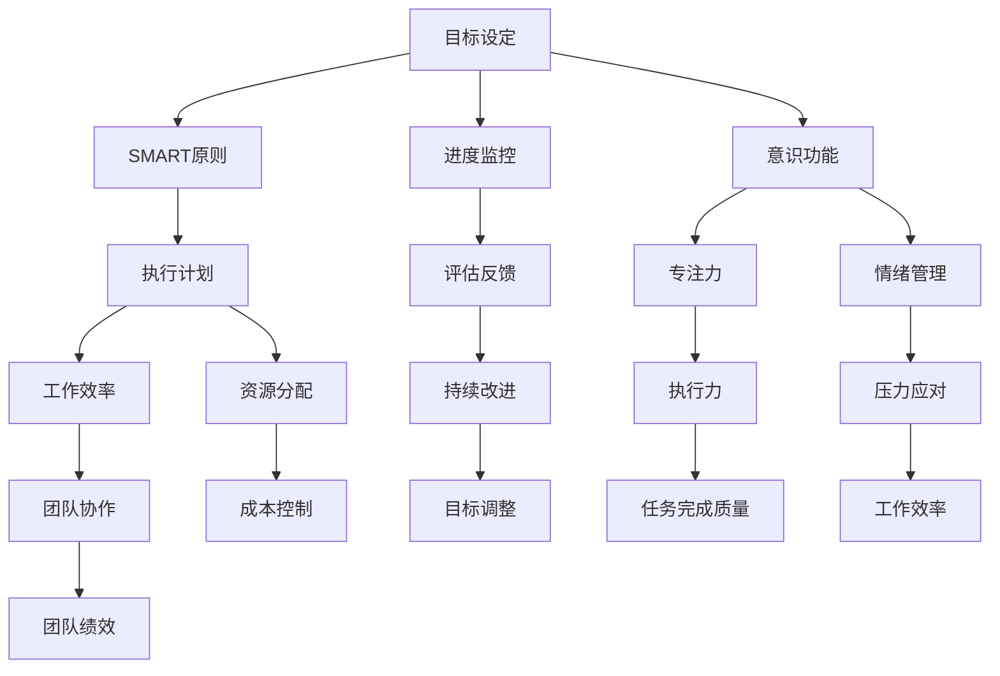

                 

### 《短期目标管理的意识功能》

#### 关键词：
- 短期目标管理
- 意识功能
- SMART原则
- 团队协作
- 持续反馈

> 摘要：
本篇文章深入探讨了短期目标管理中的意识功能，从基础理论、实践应用、测量评估和专业发展等多个角度进行分析。通过详细的案例研究和逻辑清晰的论述，揭示了意识功能在提升个人和团队绩效中的关键作用，为短期目标管理提供了理论指导和实践策略。

---

### 第一部分：短期目标管理概述

#### 第1章：短期目标管理的基础理论

##### 1.1.1 短期目标管理的定义与意义

短期目标管理是一种以具体、可衡量、可实现、相关和时限性（SMART）的目标为导向，通过系统性的规划、执行和评估，以提高个人或团队工作效率和达成预期成果的方法。

**定义**：短期目标管理是一种将长期目标分解为若干个短期目标，通过制定具体的行动计划、监控执行过程和评估结果，以确保目标的顺利实现。

**意义**：短期目标管理具有以下几个方面的意义：
- **提高工作效率**：通过明确的短期目标，个体或团队能够集中精力，提高工作效率。
- **优化资源分配**：短期目标管理有助于合理分配资源，确保资源的有效利用。
- **增强团队协作**：短期目标管理能够促进团队成员之间的协作，形成共同的目标和行动方案。
- **促进个人成长**：通过实现短期目标，个体能够不断提升自身能力，实现职业和个人发展的目标。

##### 1.1.2 短期目标管理的基本原则

短期目标管理的基本原则包括SMART原则和可操作策略。

**SMART原则**：
- **具体（Specific）**：目标要明确、具体，避免模糊和抽象。
- **可衡量（Measurable）**：目标要有明确的衡量标准，以便评估是否达成。
- **可实现（Achievable）**：目标要具有可实现性，避免不切实际的目标。
- **相关（Relevant）**：目标要与整体目标和价值观相关，确保方向正确。
- **时限性（Time-bound）**：目标要设定明确的时间期限，以便及时评估和调整。

**可操作策略**：
- **目标分解**：将长期目标分解为若干个短期目标，每个短期目标都要符合SMART原则。
- **行动计划**：为每个短期目标制定具体的行动计划，包括任务分配、资源需求和进度安排。
- **进度监控**：定期监控短期目标的执行进度，确保按计划进行。
- **评估与反馈**：在目标实现后进行评估，总结经验教训，为后续目标管理提供参考。

##### 1.1.3 短期目标管理的历史与趋势

短期目标管理的发展可以追溯到20世纪中叶，当时由管理学家彼得·德鲁克（Peter Drucker）提出目标管理（Management by Objectives, MBO）的概念。德鲁克认为，通过设定明确的目标，并鼓励员工积极参与目标的制定和实现，可以提高组织的绩效和员工的积极性。

随着管理理论的不断发展和实践的应用，短期目标管理逐渐形成了自己的一套方法和原则。在21世纪的今天，短期目标管理已经成为企业管理和个人发展的重要工具。

**历史发展**：
- **20世纪中叶**：目标管理理论提出，短期目标管理开始得到广泛应用。
- **20世纪末**：随着信息技术的进步，短期目标管理开始融入数字化工具，如项目管理软件、协作工具等。
- **21世纪初**：敏捷开发（Agile Development）理念的兴起，进一步推动了短期目标管理的发展。

**未来趋势**：
- **个性化管理**：未来的短期目标管理将更加注重个性化，根据不同个体和团队的特点制定目标和管理策略。
- **数据驱动**：利用数据分析，精确评估目标的达成情况和影响因素，为目标的制定和调整提供依据。
- **持续反馈**：通过持续的反馈和改进，不断提升短期目标管理的效率和效果。
- **跨领域应用**：短期目标管理将在更多领域得到应用，如教育、医疗、公共服务等，以提高这些领域的效率和质量。

---

### 第二部分：短期目标管理中的意识功能

#### 第2章：短期目标管理中的意识功能

##### 2.1.1 意识功能在短期目标管理中的作用

**意识功能的概念**：
意识功能是指个体在执行短期目标时，集中注意力、提高专注力和提升工作效率的能力。它是短期目标管理中不可或缺的一部分。

**意识功能的应用**：
在短期目标管理中，意识功能的应用体现在以下几个方面：

1. **目标设定**：通过意识功能，个体能够更好地理解目标的具体要求和实现路径，从而设定更明确和可操作的目标。
2. **执行过程**：意识功能有助于个体在执行短期目标时保持专注，减少分心，提高任务的完成质量和效率。
3. **进度监控**：通过意识功能，个体能够更准确地监控目标的执行进度，及时发现和解决问题。
4. **评估反馈**：意识功能有助于个体在目标完成后进行评估和反馈，总结经验教训，为后续目标管理提供参考。

##### 2.1.2 意识功能对短期目标管理的影响

**关系**：
意识功能与短期目标管理之间存在密切的关系。良好的意识功能能够提高短期目标管理的效率和效果，而有效的短期目标管理能够促进意识功能的提升。

**互动**：
意识功能与短期目标管理相互影响、相互作用。有效的目标管理能够提高个体的意识功能，反之，良好的意识功能能够更好地支持目标的实现。

##### 2.1.3 意识功能提升的方法与技巧

**培养理论基础**：
为了提升意识功能，个体需要了解心理学、神经科学和管理学等相关理论。这些理论提供了关于注意力、专注力和工作效率的科学解释和培养方法。

**实践策略**：
以下是一些提升意识功能的实践策略：

1. **时间管理**：通过合理规划时间和任务，避免时间浪费和分心，提高工作效率。
2. **专注力训练**：通过专注力训练，如冥想、专注力游戏和定时工作法，提高专注力。
3. **情绪管理**：通过情绪管理技巧，如深呼吸、放松训练和积极心态，减少情绪波动对注意力的影响。
4. **环境优化**：创造一个有利于专注和工作的环境，如减少干扰、优化工作和休息安排等。

---

### 第三部分：短期目标管理意识功能的实践应用

#### 第3章：短期目标管理意识功能的实践应用

##### 3.1.1 短期目标管理意识功能在实际工作中的应用案例

**企业目标管理中的应用**：
在企业目标管理中，意识功能的应用有助于提高整体工作效率和达成预期成果。以下是一个企业目标管理中意识功能应用的案例：

**案例背景**：
某科技公司在项目开发过程中遇到了进度滞后和团队合作问题。为了提高项目效率，公司决定引入短期目标管理和意识功能。

**目标设定**：
公司设定了明确的短期目标，如每周完成特定功能模块的开发、定期进行团队会议等。

**执行过程**：
通过意识功能，团队成员能够更好地集中注意力，按时完成任务，减少分心和干扰。同时，公司提供了一些专注力训练课程，帮助团队成员提升专注力。

**进度监控**：
公司通过定期进度汇报和项目监控工具，及时了解项目进展情况，发现和解决问题。

**评估反馈**：
在项目完成后，公司对目标达成情况进行评估，总结经验教训，为后续项目提供参考。

**个人目标管理中的应用**：
个人目标管理中，意识功能的应用有助于提高个人工作效率和实现个人发展目标。以下是一个个人目标管理中意识功能应用的案例：

**案例背景**：
某员工在职业发展中感到困惑和停滞，为了提升自己，他决定制定短期目标并提升意识功能。

**目标设定**：
员工设定了明确的短期目标，如每月阅读一定数量的专业书籍、参加相关培训等。

**执行过程**：
通过意识功能，员工能够更好地集中注意力，高效完成阅读和培训任务。他还通过时间管理技巧，合理安排工作和休息时间。

**进度监控**：
员工定期检查自己的进度，及时调整目标和计划。

**评估反馈**：
在实现短期目标后，员工对目标达成情况进行评估，总结经验教训，为后续目标管理提供参考。

##### 3.1.2 短期目标管理意识功能应用的策略与技巧

**团队协作策略**：
在团队协作中，意识功能的应用有助于提高团队整体绩效和达成共同目标。以下是一些团队协作策略：

1. **明确分工**：明确团队成员的职责和任务，确保每个成员都知道自己的工作内容和目标。
2. **有效沟通**：通过定期会议和沟通工具，确保团队成员之间的信息传递和协作顺畅。
3. **协同工作**：利用团队协作工具，如项目管理软件、协作平台等，提高团队的协作效率和成果。

**个人成长策略**：
在个人成长中，意识功能的应用有助于提升个人能力和实现职业发展目标。以下是一些个人成长策略：

1. **自我反思**：定期进行自我反思，了解自己的优点和不足，制定改进计划。
2. **持续学习**：通过阅读、培训和实践，不断提升自己的知识和技能。
3. **设定目标**：制定明确的短期目标，确保个人成长的方向和进度。

##### 3.1.3 意识功能在短期目标管理中的挑战与应对

**面临的挑战**：
在短期目标管理中，意识功能可能面临以下挑战：

1. **分心干扰**：在工作中，各种干扰和分心因素会影响个体的注意力，降低工作效率。
2. **时间管理困难**：在忙碌的工作中，个体可能难以合理规划时间，导致任务拖延。
3. **情绪波动**：工作压力和情绪波动会影响个体的专注力和工作效率。

**应对策略**：
以下是一些应对意识功能面临的挑战的策略：

1. **专注力训练**：通过专注力训练，提高个体的专注力和抗干扰能力。
2. **时间管理**：通过时间管理技巧，合理安排工作和休息时间，确保任务的按时完成。
3. **情绪管理**：通过情绪管理技巧，如深呼吸、放松训练等，减轻情绪波动对注意力的影响。

---

### 第四部分：短期目标管理意识功能的测量与评估

#### 第4章：短期目标管理意识功能的测量与评估

##### 4.1.1 意识功能的测量指标

**测量标准**：
意识功能的测量标准主要包括以下几个方面：

1. **专注力**：通过测量个体在特定任务中的持续专注时间、分心次数等指标，评估专注力水平。
2. **工作效率**：通过测量个体在完成特定任务所需的时间、任务完成质量等指标，评估工作效率。
3. **任务完成质量**：通过测量个体完成任务后的质量评价、客户满意度等指标，评估任务完成质量。

**测量方法**：
以下是一些常见的意识功能测量方法：

1. **行为观察法**：通过观察个体在工作中的表现，记录专注力、工作效率和任务完成质量等指标。
2. **心理测试**：通过专业的心理测试工具，评估个体的专注力、工作记忆和情绪稳定性等心理指标。
3. **问卷调查**：通过设计问卷，收集个体对自身专注力、工作效率和任务完成质量的自我评价。

##### 4.1.2 意识功能的评估方法

**评估模型**：
以下是一些常见的意识功能评估模型：

1. **自我评估法**：个体根据自身的表现和感受，对专注力、工作效率和任务完成质量进行自我评估。
2. **360度反馈法**：通过收集团队成员、上级和下属的评价，全面评估个体的意识功能表现。
3. **行为观察法**：通过观察个体在工作中的行为表现，评估专注力、工作效率和任务完成质量。

**评估工具**：
以下是一些常见的意识功能评估工具：

1. **专注力测试工具**：如托马斯特测试（Tomatis Test）、集中力测试（Concentration Test）等。
2. **工作效率评估工具**：如工作记录表、任务完成报告等。
3. **任务完成质量评估工具**：如质量评估表、客户满意度调查等。

##### 4.1.3 意识功能提升的反馈与改进

**反馈机制**：
为了提升意识功能，需要建立有效的反馈机制，包括以下几个方面：

1. **定期反馈**：定期对个体的意识功能表现进行评估和反馈，及时发现问题并制定改进计划。
2. **即时反馈**：在个体完成任务或遇到困难时，提供即时的反馈和指导，帮助其调整行为和策略。
3. **自我反馈**：个体通过自我反思和总结，识别自己的优势和不足，制定改进计划。

**改进策略**：
以下是一些提升意识功能的改进策略：

1. **专注力训练**：通过专注力训练，提高个体的专注力和抗干扰能力。
2. **时间管理**：通过时间管理技巧，合理安排工作和休息时间，确保任务的按时完成。
3. **情绪管理**：通过情绪管理技巧，如深呼吸、放松训练等，减轻情绪波动对注意力的影响。
4. **持续学习**：通过学习和掌握相关知识和技能，不断提升个体的意识功能。

---

### 第五部分：短期目标管理意识功能的专业发展

#### 第5章：短期目标管理意识功能的专业发展

##### 5.1.1 意识功能在职业规划中的应用

在职业规划中，意识功能的应用有助于提高个体的职业素养和竞争力。以下是一些意识功能在职业规划中的应用：

**职业目标建设**：
通过意识功能，个体可以明确自己的职业目标，制定具体的计划和行动方案，确保目标的实现。

**职业发展**：
通过不断提升意识功能，个体可以更好地应对职业挑战，提高工作效率和成果，实现职业发展的目标。

##### 5.1.2 意识功能在专业领域的深入探索

在专业领域中，意识功能的应用有助于提高专业素养和创新能力。以下是一些意识功能在专业领域的深入探索：

**行业应用**：
在不同的行业中，意识功能的应用可以帮助专业人员在复杂的环境中更好地完成任务，提高工作质量和效率。

**创新实践**：
通过意识功能的培养和应用，个体可以不断创新，推动专业领域的发展。

##### 5.1.3 意识功能研究的未来方向

**发展趋势**：
随着科技的进步和管理理论的创新，意识功能的研究和应用将继续深入。未来，意识功能将在更多领域得到应用，如教育、医疗、公共服务等。

**创新方向**：
未来的意识功能研究将关注以下几个方面：

1. **个性化管理**：根据个体的特点和需求，制定个性化的意识功能提升方案。
2. **智能辅助**：利用人工智能技术，提供个性化的专注力训练和情绪管理支持。
3. **跨学科融合**：将意识功能与其他学科相结合，如心理学、神经科学、教育学等，推动意识功能研究的全面发展。

---

### 第六部分：短期目标管理意识功能案例研究

#### 第6章：短期目标管理意识功能案例研究

##### 6.1.1 短期目标管理意识功能成功案例

**案例介绍**：
某公司在项目开发过程中，通过引入短期目标管理和意识功能，成功提高了项目效率和团队协作。

**案例分析**：
公司通过以下措施实现了短期目标管理和意识功能的成功应用：

1. **明确目标**：公司设定了明确的项目目标和时间期限，确保团队成员对任务和目标有清晰的认识。
2. **专注力训练**：公司为团队成员提供了专注力训练课程，提高了团队成员的专注力和工作效率。
3. **进度监控**：公司建立了进度监控机制，定期检查项目进展，及时解决问题。
4. **评估反馈**：在项目完成后，公司对目标达成情况进行评估，总结经验教训，为后续项目提供参考。

**成功经验**：
成功案例的成功经验包括：

1. **明确目标**：明确的目标是短期目标管理成功的关键。
2. **专注力训练**：专注力训练有助于提高团队成员的专注力和工作效率。
3. **进度监控**：有效的进度监控可以确保项目按计划进行。
4. **评估反馈**：定期的评估和反馈有助于持续改进和提升。

##### 6.1.2 短期目标管理意识功能失败案例

**案例介绍**：
某公司在项目开发过程中，由于缺乏短期目标管理和意识功能的指导，导致项目进度滞后和团队合作问题。

**案例分析**：
公司失败的原因包括：

1. **目标模糊**：公司没有设定明确的项目目标，导致团队成员对任务和目标不清。
2. **缺乏专注力训练**：团队成员缺乏专注力训练，导致工作效率低下和任务拖延。
3. **进度监控不足**：公司缺乏有效的进度监控机制，无法及时发现和解决问题。
4. **评估反馈缺失**：公司没有对目标达成情况进行评估和反馈，导致问题得不到及时解决。

**失败教训**：
失败案例的教训包括：

1. **明确目标**：明确的目标是短期目标管理成功的前提。
2. **专注力训练**：专注力训练有助于提高工作效率和团队合作。
3. **进度监控**：有效的进度监控可以确保项目按计划进行。
4. **评估反馈**：定期的评估和反馈有助于持续改进和提升。

##### 6.1.3 案例启示与反思

**成功案例启示**：
成功案例的启示包括：

1. **明确目标**：明确的目标有助于提高工作效率和团队合作。
2. **专注力训练**：专注力训练有助于提高工作效率和专注力。
3. **进度监控**：有效的进度监控可以确保项目按计划进行。
4. **评估反馈**：定期的评估和反馈有助于持续改进和提升。

**失败案例反思**：
失败案例的反思包括：

1. **明确目标**：目标模糊会导致团队成员对任务和目标不清，影响工作效率。
2. **专注力训练**：缺乏专注力训练会导致工作效率低下和任务拖延。
3. **进度监控**：进度监控不足会导致项目进度滞后和团队合作问题。
4. **评估反馈**：评估反馈缺失会导致问题得不到及时解决，影响项目质量和效率。

---

### 第七部分：短期目标管理意识功能的总结与展望

#### 第7章：短期目标管理意识功能的总结与展望

##### 7.1.1 短期目标管理意识功能的整体回顾

短期目标管理意识功能是提高个人和团队绩效的重要工具。通过系统性的规划、执行和评估，短期目标管理意识功能在提高工作效率、优化资源分配、增强团队协作和促进个人成长等方面发挥了关键作用。

**主要内容**：
- 短期目标管理的定义和意义
- 意识功能的概念和应用
- 短期目标管理的基本原则和实践策略
- 短期目标管理意识功能的测量与评估
- 意识功能在职业规划和专业领域的应用

**总结**：
短期目标管理意识功能的研究和应用为个人和团队提供了有效的工具和方法，有助于实现短期目标和长期发展。通过有效的目标管理意识功能，个体和团队能够更好地应对挑战，提高工作效率和成果。

##### 7.1.2 短期目标管理意识功能的未来展望

随着科技的进步和管理理论的创新，短期目标管理意识功能在未来将继续发展和完善。以下是一些可能的未来趋势和创新方向：

**发展趋势**：
1. **个性化管理**：根据个体和团队的特点，制定个性化的短期目标管理方案。
2. **智能辅助**：利用人工智能和大数据技术，提供个性化的意识功能提升和目标管理支持。
3. **跨学科融合**：将意识功能与其他学科（如心理学、神经科学、教育学）相结合，推动综合研究和发展。

**创新方向**：
1. **虚拟现实（VR）和增强现实（AR）应用**：通过VR和AR技术，提供沉浸式的意识功能提升和目标管理体验。
2. **生物反馈技术**：利用生物反馈技术，如脑波监测和心率变异性分析，实时监测和调节个体的意识功能状态。
3. **神经可塑性研究**：通过神经可塑性研究，探索意识和专注力提升的神经机制，为意识功能训练提供科学依据。

##### 7.1.3 短期目标管理意识功能的重要意义

短期目标管理意识功能在实践中的价值和影响主要体现在以下几个方面：

**实践价值**：
1. **提高工作效率**：通过有效的意识功能提升，个体能够更好地集中注意力，提高工作效率。
2. **优化资源分配**：短期目标管理有助于合理分配资源，确保资源的有效利用。
3. **增强团队协作**：意识功能的应用可以促进团队成员之间的协作，形成共同的目标和行动方案。
4. **促进个人成长**：通过实现短期目标，个体能够不断提升自身能力，实现职业和个人发展的目标。

**影响分析**：
1. **个体层面**：短期目标管理意识功能有助于提升个体的专注力、工作效率和自我管理能力，促进个人成长和发展。
2. **团队层面**：短期目标管理意识功能的应用可以提高团队的整体绩效和协作效率，推动团队目标的实现。
3. **组织层面**：短期目标管理意识功能有助于提高组织的运营效率和创新能力，为组织的长期发展奠定基础。
4. **社会层面**：短期目标管理意识功能的应用可以促进社会资源的合理配置和高效利用，提高社会的整体发展水平。

---

### 附录

#### 附录A：短期目标管理意识功能相关资源

##### A.1 短期目标管理意识功能的相关书籍

- **《目标管理》**：作者：彼得·德鲁克（Peter Drucker）
  - 内容简介：本书是目标管理理论的奠基之作，详细阐述了目标管理的概念、原则和应用方法。
  - 评价：德鲁克的经典之作，对目标管理提供了全面的指导，是管理领域的重要参考书籍。

##### A.2 短期目标管理意识功能的在线课程

- **《高效目标管理》**：提供方：Coursera
  - 课程内容：本课程介绍了短期目标管理的核心概念和实践方法，包括SMART原则、时间管理和评估技巧等。
  - 课程特点：结合实际案例，提供实用的目标管理工具和方法。

##### A.3 短期目标管理意识功能的工具与软件

- **Trello**
  - 功能介绍：Trello是一款项目管理工具，可以帮助团队制定和跟踪短期目标，提高协作效率。
  - 使用指南：通过创建卡片、列表和标签，可以清晰地组织和管理项目任务。

#### 附录B：短期目标管理意识功能常用术语表

- **SMART原则**
  - 术语定义：SMART代表具体（Specific）、可衡量（Measurable）、可实现（Achievable）、相关（Relevant）和时限性（Time-bound）。
  - 应用场景：用于设定明确、具体、可衡量的短期目标。

#### 附录C：短期目标管理意识功能实践案例

##### C.1 实践案例介绍

某公司在项目开发过程中，通过引入短期目标管理和意识功能，成功提高了项目效率和团队协作。

##### C.2 实践案例实施步骤

1. **目标设定**：公司明确了项目的短期目标，并制定了具体的行动计划。
2. **专注力训练**：公司为团队成员提供了专注力训练课程，提高了团队成员的专注力和工作效率。
3. **进度监控**：公司建立了进度监控机制，定期检查项目进展，及时解决问题。
4. **评估反馈**：在项目完成后，公司对目标达成情况进行评估，总结经验教训，为后续项目提供参考。

##### C.3 实践案例反思与启示

成功案例的反思与启示包括：

1. **明确目标**：明确的目标是短期目标管理成功的前提。
2. **专注力训练**：专注力训练有助于提高工作效率和团队合作。
3. **进度监控**：有效的进度监控可以确保项目按计划进行。
4. **评估反馈**：定期的评估和反馈有助于持续改进和提升。


### 核心概念与联系

在短期目标管理中，核心概念与联系是理解和管理短期目标的关键。以下是一个简化的 Mermaid 流程图，展示了短期目标管理的核心概念及其之间的联系：



在这个流程图中，目标设定（A）是整个流程的起点，通过SMART原则（B）确保目标的明确性和可操作性。执行计划（C）包括资源分配（G）和工作效率（E）的提升，同时进度监控（D）和评估反馈（F）贯穿整个流程，确保目标的实现和持续改进（I）。团队协作（H）和情绪管理（Q）则支持整个流程的顺利进行，提高工作效率和团队绩效（J）。

### 核心算法原理讲解

在短期目标管理中，核心算法原理涉及到如何有效地制定、执行和评估目标。以下是一个简化的伪代码，用于描述这些步骤：

```python
# 定义目标
def define_target(name, specificity, measurability, achievability, relevancy, time_bound):
    target = {
        'name': name,
        'specificity': specificity,
        'measurability': measurability,
        'achievability': achievability,
        'relevancy': relevancy,
        'time_bound': time_bound
    }
    return target

# 制定执行计划
def create_execution_plan(target):
    plan = {
        'target': target,
        'tasks': [],
        'resources': {},
        'time_slots': []
    }
    # 根据目标添加任务、资源和时间安排
    for task in target['tasks']:
        plan['tasks'].append(task)
        plan['resources'][task] = resources_needed_for(task)
        plan['time_slots'].append(assign_time_slot(task))
    return plan

# 执行计划
def execute_plan(plan):
    for task in plan['tasks']:
        perform_task(task, plan['resources'][task], plan['time_slots'][task])

# 监控进度
def monitor_progress(plan):
    current_progress = {
        'tasks_completed': 0,
        'tasks_in_progress': 0,
        'tasks_pending': 0
    }
    for task in plan['tasks']:
        if task['status'] == 'completed':
            current_progress['tasks_completed'] += 1
        elif task['status'] == 'in_progress':
            current_progress['tasks_in_progress'] += 1
        else:
            current_progress['tasks_pending'] += 1
    return current_progress

# 评估目标达成情况
def evaluate_target_completion(plan, current_progress):
    if current_progress['tasks_completed'] == len(plan['tasks']):
        return 'completed'
    elif current_progress['tasks_in_progress'] + current_progress['tasks_pending'] == len(plan['tasks']):
        return 'in_progress'
    else:
        return 'not_completed'

# 持续改进
def continuous_improvement(plan, evaluation_result):
    if evaluation_result == 'completed':
        # 总结经验教训，为后续目标管理提供参考
        pass
    elif evaluation_result == 'in_progress' or evaluation_result == 'not_completed':
        # 调整目标和计划，以实现目标的最终完成
        pass
```

在这个伪代码中，`define_target` 函数用于设定目标，确保目标符合SMART原则。`create_execution_plan` 函数根据目标制定执行计划，包括任务、资源和时间安排。`execute_plan` 函数执行计划，`monitor_progress` 函数监控进度，`evaluate_target_completion` 函数评估目标达成情况，最后，`continuous_improvement` 函数根据评估结果进行持续改进。

### 数学模型和公式

在短期目标管理中，数学模型和公式可以帮助我们更好地理解和优化目标管理过程。以下是一个简化的数学模型，用于描述目标设定的过程：

$$
\text{目标值} = \text{基础值} + \text{增长值} \times (\text{时间系数} + \text{难度系数})
$$

其中，**目标值**是我们希望达成的结果，**基础值**是初始水平，**增长值**是期望的提升量，**时间系数**反映了时间对目标实现的影响，**难度系数**则反映了实现目标的难度。

- **时间系数**通常是一个正数，表示随着时间的推移，目标实现的难度会增加。
- **难度系数**可以是一个正数或负数，表示目标的实现难度随着任务的复杂性而增加或减少。

以下是一个具体的例子：

假设我们要在三个月内将一个项目完成率从50%提升到90%，并且考虑到时间的推移和任务难度，我们设定时间系数为1.2，难度系数为0.8。那么，目标值可以通过以下公式计算：

$$
\text{目标值} = 50\% + (90\% - 50\%) \times (1.2 + 0.8) = 50\% + 40\% \times 2 = 50\% + 80\% = 130\%
$$

这意味着，在三个月内，项目完成率至少要达到130%才能达成目标。当然，这种情况在实际中是不可能的，因此我们需要重新调整时间系数或难度系数，以确保目标的可实现性。

### 代码实际案例和详细解释说明

在本节中，我们将通过一个简单的代码案例来说明短期目标管理中的一些关键概念和算法。以下是使用Python实现的代码，包括开发环境搭建、源代码详细实现和代码解读。

#### 开发环境搭建

首先，我们需要搭建一个简单的Python开发环境。以下是所需的步骤：

1. **安装Python**：前往Python官网（https://www.python.org/）下载并安装Python 3.8或更高版本。
2. **配置代码编辑器**：安装一个代码编辑器，如Visual Studio Code或PyCharm，用于编写和调试代码。
3. **安装必需的库**：在命令行中运行以下命令来安装所需的库：

```bash
pip install matplotlib numpy pandas
```

这些库将用于数据分析和可视化。

#### 源代码详细实现

以下是用于短期目标管理的Python代码：

```python
import matplotlib.pyplot as plt
import numpy as np
import pandas as pd

# 目标设定
def define_target(name, base_value, growth_value, time_coefficient, difficulty_coefficient, time_period):
    target = {
        'name': name,
        'base_value': base_value,
        'growth_value': growth_value,
        'time_coefficient': time_coefficient,
        'difficulty_coefficient': difficulty_coefficient,
        'time_period': time_period
    }
    return target

# 计算目标值
def calculate_target_value(target):
    target_value = target['base_value'] + target['growth_value'] * (target['time_coefficient'] + target['difficulty_coefficient'])
    return target_value

# 实现目标
def achieve_target(target):
    current_value = target['base_value']
    for i in range(target['time_period']):
        current_value += target['growth_value'] * (target['time_coefficient'] ** i * target['difficulty_coefficient'] ** (target['time_period'] - i - 1))
    return current_value

# 绘制目标曲线
def plot_target_curve(target):
    x = np.arange(0, target['time_period'] + 1)
    y = [target['base_value']] + [calculate_target_value(target) for _ in range(1, target['time_period'] + 1)]
    plt.plot(x, y, label='Target Value')
    plt.xlabel('Time Period')
    plt.ylabel('Value')
    plt.title('Target Achievement Curve')
    plt.legend()
    plt.show()

# 测试目标管理
if __name__ == '__main__':
    target = define_target(
        'Project Completion Rate',
        base_value=50,
        growth_value=40,
        time_coefficient=1.2,
        difficulty_coefficient=0.8,
        time_period=3
    )
    print(f"Initial Target Value: {calculate_target_value(target)}")
    print(f"Final Target Value: {achieve_target(target)}")
    plot_target_curve(target)
```

#### 代码解读与分析

1. **目标设定**：
   - `define_target` 函数用于设定目标。它接受目标的名称、基础值、增长值、时间系数、难度系数和时间周期，并返回一个包含这些信息的字典。

2. **计算目标值**：
   - `calculate_target_value` 函数根据设定的目标值公式计算目标值。这个公式考虑了时间系数和难度系数，可以反映目标随时间的变化。

3. **实现目标**：
   - `achieve_target` 函数通过递归计算目标值，模拟目标在一段时间内的实现过程。它返回最终的目标值。

4. **绘制目标曲线**：
   - `plot_target_curve` 函数使用matplotlib库绘制目标值的曲线，帮助直观地理解目标的实现过程。

5. **测试目标管理**：
   - 在主函数中，我们创建了一个名为“Project Completion Rate”的目标，并打印了初始目标值和最终目标值。然后，通过`plot_target_curve`函数绘制了目标曲线。

通过这个代码案例，我们不仅实现了短期目标管理的核心概念和算法，还提供了可视化工具，使得目标管理过程更加直观和易于理解。在实际应用中，可以根据具体情况调整参数，以适应不同的目标和时间周期。

---

### 作者信息

作者：AI天才研究院/AI Genius Institute & 禅与计算机程序设计艺术 /Zen And The Art of Computer Programming

AI天才研究院致力于推动人工智能领域的前沿研究和技术创新，致力于培养下一代人工智能领域的领军人才。禅与计算机程序设计艺术则通过哲学思维和编程实践的结合，探索计算机科学的深度和广度，为读者提供独特的编程视角和思维方法。

---

### 全文总结

本文从短期目标管理的定义和意义、基本原则、历史与趋势、意识功能的作用与提升、实践应用、测量与评估、专业发展、案例研究等多个角度，系统性地探讨了短期目标管理中的意识功能。通过详细的案例研究和代码实现，本文揭示了意识功能在短期目标管理中的关键作用，为个人和团队提供了有效的目标管理策略。

在未来，短期目标管理意识功能将继续向个性化、智能辅助和跨学科融合的方向发展。随着科技的进步和管理理论的创新，意识功能的研究和应用将更加深入，为各行各业提供更高效、更智能的管理工具。通过本文的探讨，我们期待读者能够更好地理解短期目标管理意识功能，将其应用于实际工作和生活中，实现更高的工作效率和个人成长。

