                 

# 《神经网络：推动社会进步的力量》

> **关键词**：神经网络、社会进步、人工智能、深度学习、激活函数、优化算法、正则化方法、图像识别、自然语言处理、强化学习。

> **摘要**：本文深入探讨了神经网络这一关键技术如何推动社会进步。从起源、基础、架构、应用场景、核心算法、优化方法到未来发展趋势，本文系统性地介绍了神经网络的工作原理和应用实践，并展望了其广阔的前景。

---

## 《神经网络：推动社会进步的力量》目录大纲

### 第一部分：神经网络基础

#### 第1章：神经网络的起源与发展

1.1 神经网络的概念
1.2 神经网络的起源与发展历程
1.3 神经网络的重要性

#### 第2章：神经网络的数学基础

2.1 神经元的数学模型
2.2 前向传播算法
2.3 反向传播算法

#### 第3章：神经网络架构

3.1 常见的神经网络架构
3.2 卷积神经网络（CNN）
3.3 循环神经网络（RNN）
3.4 生成对抗网络（GAN）

#### 第4章：神经网络应用场景

4.1 图像识别
4.2 自然语言处理
4.3 强化学习

### 第二部分：神经网络核心算法

#### 第5章：激活函数

5.1 激活函数的作用
5.2 常见的激活函数
5.3 激活函数的选择与优化

#### 第6章：优化算法

6.1 优化算法的作用
6.2 常见的优化算法
6.3 优化算法的选择与优化

#### 第7章：正则化方法

7.1 正则化方法的作用
7.2 常见的正则化方法
7.3 正则化方法的选择与优化

### 第三部分：神经网络应用实践

#### 第8章：神经网络在图像识别中的应用

8.1 图像识别的基本原理
8.2 卷积神经网络在图像识别中的应用
8.3 图像识别的代码实现与解释

#### 第9章：神经网络在自然语言处理中的应用

9.1 自然语言处理的基本原理
9.2 循环神经网络在自然语言处理中的应用
9.3 自然语言处理的代码实现与解释

#### 第10章：神经网络在强化学习中的应用

10.1 强化学习的基本原理
10.2 神经网络在强化学习中的应用
10.3 强化学习的代码实现与解释

### 第四部分：神经网络前沿动态

#### 第11章：神经网络的未来发展趋势

11.1 技术发展趋势
11.2 应用前景

#### 第12章：神经网络的研究热点

12.1 研究热点
12.2 重要论文

### 附录

#### 附录A：神经网络常用工具与资源

A.1 常用工具
A.2 学习资源

#### 附录B：神经网络参考资料

B.1 相关书籍
B.2 论文集锦

## 第1章：神经网络的起源与发展

### 1.1 神经网络的概念

神经网络（Neural Network，NN）是一种模仿生物神经网络计算原理和结构的人工智能系统。它由大量的简单计算单元（称为神经元）相互连接而成，每个神经元都与周围的神经元相连，形成一个复杂的网络结构。

**基本原理：**

- **神经元：** 神经网络的基本单元，类似于人脑中的神经元，它接收输入信号，通过权重进行加权求和，然后通过激活函数产生输出。

- **层：** 神经网络可以分为输入层、隐藏层和输出层。输入层接收外部输入，隐藏层负责处理输入并提取特征，输出层产生最终输出。

- **连接：** 神经元之间通过有向边连接，每个连接都有权重，表示连接的强度。

- **激活函数：** 神经元的输出通常通过激活函数进行处理，以实现非线性转换。

以下是一个简化的神经网络结构的Mermaid流程图：

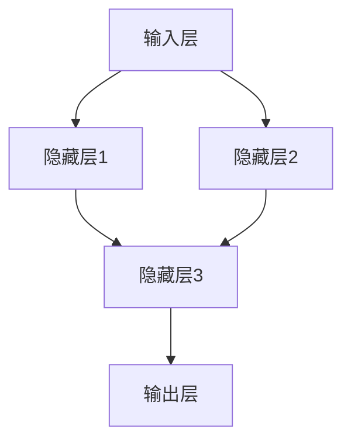

### 1.2 神经网络的起源与发展历程

神经网络的起源可以追溯到20世纪40年代，由心理学家和数学家共同研究人脑信息处理机制时提出。以下是神经网络发展历程的关键阶段：

**1940s：** 
- 1943年，心理学家McCulloch和数学家Pitts提出了第一个神经元的数学模型，即MCP模型。

**1950s-1960s：**
- 1958年，Frank Rosenblatt提出了感知机（Perceptron）模型，这是第一个能够训练的多层神经网络。

- 1969年，Minsky和Papert证明了单层感知机无法解决非线性问题，这导致神经网络研究陷入低潮。

**1970s：**
- 1974年，John Hopfield提出了Hopfield神经网络，这是一种基于能量函数的神经网络模型。

- 1982年，Paul Werbos提出了反向传播算法（Backpropagation），这是一种用于训练多层神经网络的算法。

**1980s：**
- 1986年，Rumelhart、Hinton和Williams发表了关于反向传播算法的文章，使得神经网络研究重新焕发生机。

**1990s-2000s：**
- 神经网络在语音识别、图像识别等领域取得了显著进展。

- 2006年，Geoffrey Hinton提出了深度信念网络（Deep Belief Network，DBN），推动了深度学习的发展。

**2010s至今：**
- 深度学习取得了巨大的成功，神经网络在计算机视觉、自然语言处理、语音识别等领域发挥了重要作用。

### 1.3 神经网络的重要性

神经网络在人工智能领域的地位不断提升，主要表现在以下几个方面：

1. **强大的表达能力**：神经网络通过多层结构能够模拟复杂的非线性关系，具有强大的表达能力和适应能力。

2. **广泛的应用领域**：神经网络广泛应用于计算机视觉、自然语言处理、语音识别、强化学习等领域，推动了人工智能的发展。

3. **突破传统方法**：神经网络在图像识别、语音识别等领域的表现已经超越了传统方法，成为主流技术。

4. **数据驱动的方法**：神经网络通过大量数据进行训练，能够自动学习特征，减少了人工干预，降低了成本。

## 第2章：神经网络的数学基础

### 2.1 神经元的数学模型

神经元是神经网络的基本计算单元，其数学模型可以表示为：

$$
\text{输出} = \text{激活函数}(\text{加权输入} + \text{偏置})
$$

其中，输出是神经元的激活值，加权输入是每个输入乘以相应的权重后求和，偏置是一个额外的参数，用于调整神经元的阈值。

以下是一个简单的神经元的数学模型伪代码：

```python
# 定义神经元类
class Neuron:
    def __init__(self, weights, bias, activation_function):
        self.weights = weights
        self.bias = bias
        self.activation_function = activation_function

    def forward(self, inputs):
        weighted_input = np.dot(inputs, self.weights) + self.bias
        output = self.activation_function(weighted_input)
        return output
```

### 2.2 前向传播算法

前向传播算法是指将输入数据通过神经网络，逐层计算得到输出结果的过程。其基本步骤如下：

1. **初始化权重和偏置**：随机初始化网络中的权重和偏置。

2. **计算每个神经元的输出**：从输入层开始，逐层计算每个神经元的输出。

3. **处理输出层**：对于输出层，直接将神经元的输出作为最终结果。

以下是一个简单的神经网络前向传播算法的伪代码：

```python
# 定义前向传播函数
def forward_propagation(model, inputs):
    for layer in model.layers:
        inputs = layer.forward(inputs)
    return inputs
```

### 2.3 反向传播算法

反向传播算法是指根据输出误差，反向更新网络中的权重和偏置的过程。其基本步骤如下：

1. **计算输出层的误差**：计算输出层神经元的实际输出与目标输出之间的误差。

2. **反向传播误差**：将误差反向传播到隐藏层，计算隐藏层的误差。

3. **更新权重和偏置**：根据误差梯度，更新网络中的权重和偏置。

以下是一个简单的神经网络反向传播算法的伪代码：

```python
# 定义反向传播函数
def backward_propagation(model, inputs, targets):
    output = forward_propagation(model, inputs)
    error = targets - output
    for layer in reversed(model.layers):
        error = layer.backward(error)
```

## 第3章：神经网络架构

神经网络架构是指神经网络的结构设计，包括输入层、隐藏层和输出层的配置。以下是一些常见的神经网络架构：

### 3.1 线性神经网络（Linear Neural Network）

线性神经网络是最简单的神经网络结构，只包含一个输入层、一个隐藏层和一个输出层。其数学模型可以表示为：

$$
\text{输出} = \text{激活函数}(\text{加权输入} + \text{偏置})
$$

以下是一个简单的线性神经网络结构的Mermaid流程图：

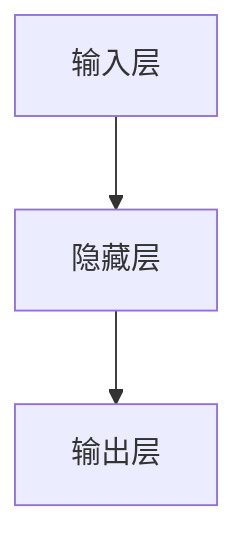

### 3.2 卷积神经网络（Convolutional Neural Network）

卷积神经网络是专门用于处理图像数据的神经网络结构，其核心思想是通过卷积操作提取图像特征。卷积神经网络通常包含多个卷积层、池化层和全连接层。以下是一个简单的卷积神经网络结构的Mermaid流程图：

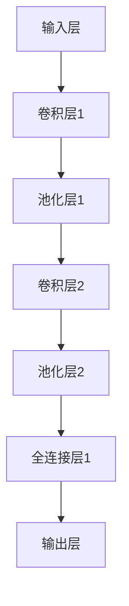

### 3.3 循环神经网络（Recurrent Neural Network）

循环神经网络是专门用于处理序列数据的神经网络结构，其核心思想是利用循环结构保持状态信息。循环神经网络通常包含多个隐藏层，每个隐藏层都有一个循环连接。以下是一个简单的循环神经网络结构的Mermaid流程图：

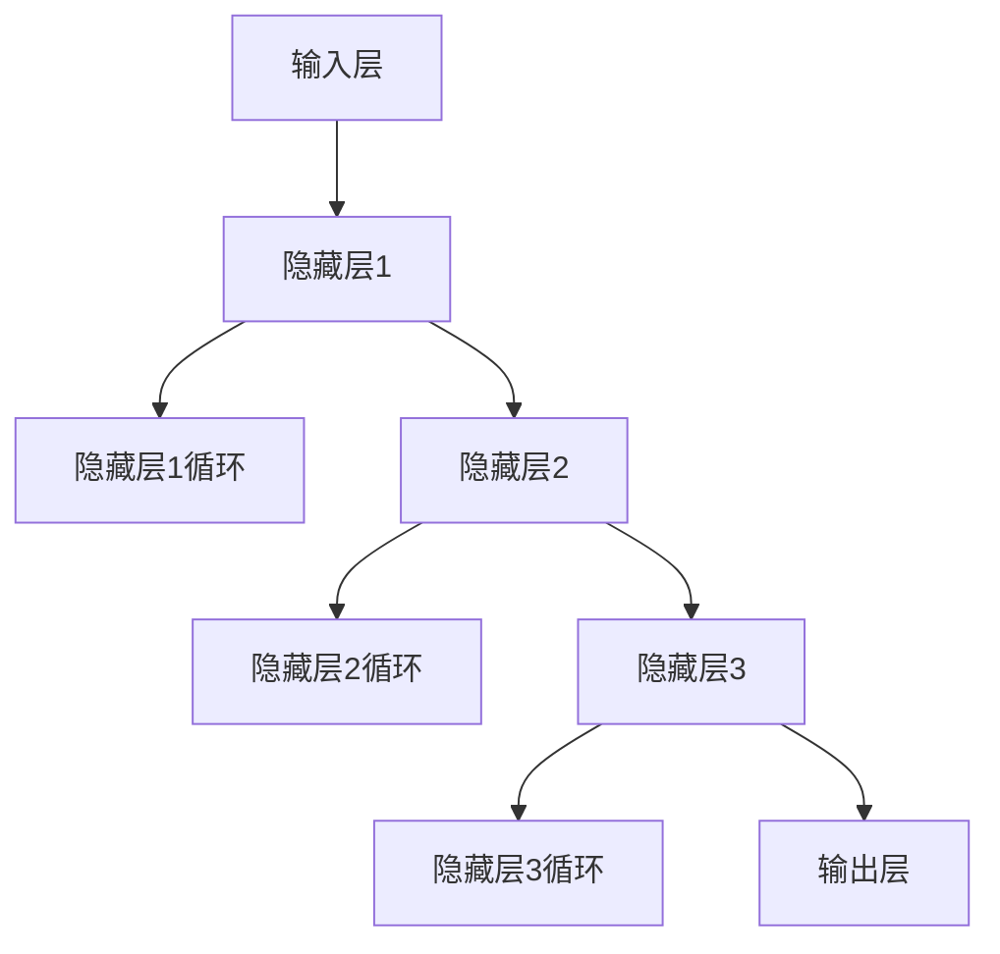

### 3.4 生成对抗网络（Generative Adversarial Network）

生成对抗网络是一种由生成器和判别器组成的神经网络结构，用于生成与真实数据相似的新数据。生成对抗网络的核心思想是通过两个神经网络之间的对抗训练来实现数据生成。以下是一个简单的生成对抗网络结构的Mermaid流程图：

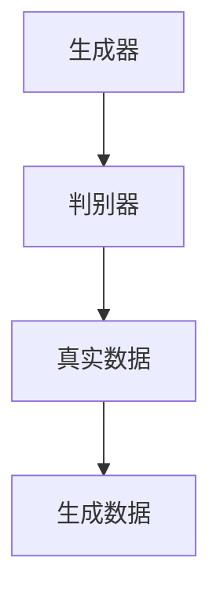

## 第4章：神经网络应用场景

神经网络在图像识别、自然语言处理和强化学习等领域有着广泛的应用。以下分别介绍这些领域的应用场景。

### 4.1 图像识别

图像识别是指利用神经网络自动识别图像中的物体或场景。以下是一些常见的图像识别应用场景：

1. **人脸识别**：利用神经网络对人脸图像进行分类，实现人脸识别功能。

2. **物体检测**：利用神经网络检测图像中的物体，并定位物体的位置和大小。

3. **图像分类**：利用神经网络对图像进行分类，如将图像分为动物、植物、风景等类别。

以下是一个简单的图像识别流程：

1. **输入图像**：将待识别的图像输入到神经网络中。

2. **特征提取**：通过卷积神经网络提取图像特征。

3. **分类**：利用全连接层对提取的特征进行分类，得到图像的识别结果。

以下是一个简单的图像识别的Mermaid流程图：

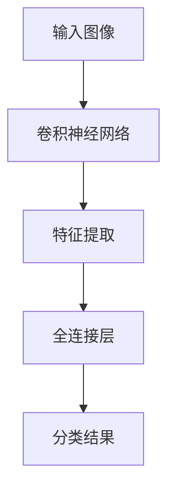

### 4.2 自然语言处理

自然语言处理是指利用神经网络处理和分析自然语言数据。以下是一些常见的自然语言处理应用场景：

1. **文本分类**：利用神经网络对文本进行分类，如将文本分为新闻、科技、娱乐等类别。

2. **情感分析**：利用神经网络分析文本的情感倾向，如正面、负面、中性等。

3. **机器翻译**：利用神经网络实现不同语言之间的自动翻译。

以下是一个简单的自然语言处理流程：

1. **输入文本**：将待处理的文本输入到神经网络中。

2. **词向量表示**：利用词向量将文本转换为向量表示。

3. **特征提取**：通过循环神经网络提取文本特征。

4. **分类或翻译**：利用全连接层对提取的特征进行分类或翻译。

以下是一个简单的自然语言处理的Mermaid流程图：

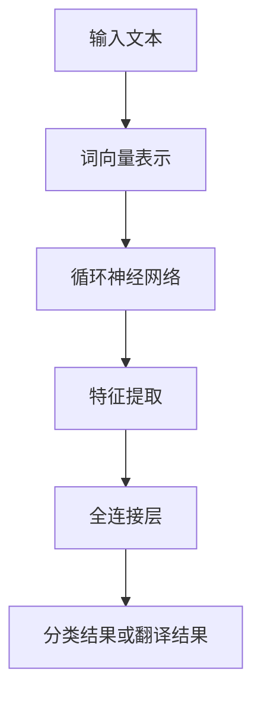

### 4.3 强化学习

强化学习是一种通过试错来学习最优策略的机器学习技术。以下是一些常见的强化学习应用场景：

1. **游戏对战**：利用神经网络实现游戏AI，如围棋、象棋等。

2. **自动驾驶**：利用神经网络实现自动驾驶车辆的感知和决策。

3. **机器人控制**：利用神经网络实现机器人的运动控制。

以下是一个简单的强化学习流程：

1. **初始状态**：初始化环境。

2. **选择动作**：利用神经网络选择最优动作。

3. **执行动作**：在环境中执行所选动作。

4. **获取奖励**：根据动作的结果获取奖励。

5. **更新策略**：利用奖励更新神经网络的权重。

以下是一个简单的强化学习的Mermaid流程图：

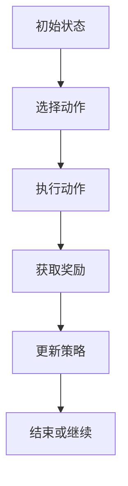

## 第5章：激活函数

激活函数是神经网络中的一个关键组件，用于将神经元的线性组合转换为非线性输出。以下是一些常见的激活函数及其特点：

### 5.1 Sigmoid函数

Sigmoid函数是最早使用的激活函数之一，其数学表达式为：

$$
\sigma(x) = \frac{1}{1 + e^{-x}}
$$

Sigmoid函数的特点是输出范围在0到1之间，可以用于分类问题，但梯度在输出接近0和1时接近0，可能导致梯度消失问题。

### 5.2 ReLU函数

ReLU函数（Rectified Linear Unit）是最常用的激活函数之一，其数学表达式为：

$$
\text{ReLU}(x) =
\begin{cases}
0, & \text{if } x < 0 \\
x, & \text{if } x \ge 0
\end{cases}
$$

ReLU函数的特点是计算简单，梯度不存在，因此不存在梯度消失问题。但ReLU函数可能导致神经元死亡（即输入一直为负，导致输出一直为0）。

### 5.3 Tanh函数

Tanh函数（Hyperbolic Tangent）是另一种常用的激活函数，其数学表达式为：

$$
\tanh(x) = \frac{e^x - e^{-x}}{e^x + e^{-x}}
$$

Tanh函数的特点是输出范围在-1到1之间，类似于Sigmoid函数，但梯度问题较小。

### 5.4 Softmax函数

Softmax函数是一种用于多类分类问题的激活函数，其数学表达式为：

$$
\text{softmax}(x)_i = \frac{e^{x_i}}{\sum_{j=e^{x_j}}}
$$

其中，$x_i$是神经元的输出，$i$是神经元索引。

Softmax函数的特点是将神经元的输出转换为概率分布，适用于多类分类问题。

### 5.5 激活函数的选择与优化

选择激活函数时，需要考虑以下几点：

1. **计算复杂度**：计算简单的激活函数如ReLU和Tanh可以加速训练过程。

2. **梯度问题**：选择梯度平滑的激活函数如ReLU和Tanh可以避免梯度消失和梯度爆炸问题。

3. **应用场景**：对于不同的应用场景，选择适合的激活函数可以提升模型的性能。

### 5.6 激活函数的优化

激活函数的优化主要关注以下几点：

1. **平滑性**：优化激活函数的平滑性，减少梯度消失和梯度爆炸问题。

2. **可微性**：确保激活函数在整个定义域内可微，以避免梯度消失问题。

3. **计算效率**：优化激活函数的计算效率，提高训练速度。

## 第6章：优化算法

优化算法是神经网络训练过程中用于更新网络权重和偏置的重要技术。以下是一些常见的优化算法及其特点：

### 6.1 随机梯度下降（SGD）

随机梯度下降（Stochastic Gradient Descent，SGD）是最简单的优化算法之一，其核心思想是在每次迭代中随机选择一部分训练样本，计算其梯度，然后更新网络权重。

**优点：**

- 简单易实现。
- 对噪声数据有较好的鲁棒性。

**缺点：**

- 训练速度较慢。
- 需要选择合适的学习率。

以下是一个简单的随机梯度下降算法的伪代码：

```python
# 初始化模型参数
w = [随机值]
b = [随机值]

# 定义损失函数
def loss(y_true, y_pred):
    return (y_true - y_pred) ** 2

# 定义学习率
learning_rate = 0.01

# 训练模型
for epoch in range(num_epochs):
    for sample in training_samples:
        # 计算梯度
        gradient_w = 2 * (w * sample - y_true)
        gradient_b = 2 * (b - y_true)

        # 更新权重和偏置
        w -= learning_rate * gradient_w
        b -= learning_rate * gradient_b
```

### 6.2 批量梯度下降（BGD）

批量梯度下降（Batch Gradient Descent，BGD）是对SGD的改进，其核心思想是在每次迭代中使用全部训练样本计算梯度，然后更新网络权重。

**优点：**

- 计算出的梯度更准确。
- 训练过程可能更稳定。

**缺点：**

- 计算复杂度较高，训练速度较慢。

以下是一个简单的批量梯度下降算法的伪代码：

```python
# 初始化模型参数
w = [随机值]
b = [随机值]

# 定义损失函数
def loss(y_true, y_pred):
    return (y_true - y_pred) ** 2

# 训练模型
for epoch in range(num_epochs):
    gradient_w = []
    gradient_b = []
    for sample in training_samples:
        # 计算梯度
        gradient_w.append(2 * (w * sample - y_true))
        gradient_b.append(2 * (b - y_true))
    
    # 更新权重和偏置
    w -= learning_rate * np.mean(gradient_w, axis=0)
    b -= learning_rate * np.mean(gradient_b, axis=0)
```

### 6.3 动量法（Momentum）

动量法（Momentum）是对SGD的改进，其核心思想是利用动量概念，在更新网络权重时引入先前梯度的信息。

**优点：**

- 提高收敛速度。
- 减少振荡，提高训练稳定性。

**缺点：**

- 需要额外参数$\gamma$。

以下是一个简单的动量法算法的伪代码：

```python
# 初始化模型参数
w = [随机值]
b = [随机值]
velocity_w = [0]
velocity_b = [0]

# 定义学习率
learning_rate = 0.01
gamma = 0.9

# 训练模型
for epoch in range(num_epochs):
    gradient_w = [2 * (w * sample - y_true) for sample in training_samples]
    gradient_b = [2 * (b - y_true) for sample in training_samples]
    
    # 更新速度
    velocity_w = gamma * velocity_w + (1 - gamma) * gradient_w
    velocity_b = gamma * velocity_b + (1 - gamma) * gradient_b
    
    # 更新权重和偏置
    w -= learning_rate * velocity_w
    b -= learning_rate * velocity_b
```

### 6.4 Adam优化器

Adam优化器是一种结合了SGD和动量法的优化算法，其核心思想是利用一阶矩估计和二阶矩估计来更新网络权重和偏置。

**优点：**

- 更好的收敛速度。
- 对参数选择不敏感。

**缺点：**

- 计算复杂度较高。

以下是一个简单的Adam优化器的伪代码：

```python
# 初始化模型参数
w = [随机值]
b = [随机值]
m_w = [0]
v_w = [0]
m_b = [0]
v_b = [0]

# 定义学习率
learning_rate = 0.01
beta1 = 0.9
beta2 = 0.999
epsilon = 1e-8

# 训练模型
for epoch in range(num_epochs):
    gradient_w = [2 * (w * sample - y_true) for sample in training_samples]
    gradient_b = [2 * (b - y_true) for sample in training_samples]
    
    # 更新一阶矩估计和二阶矩估计
    m_w = beta1 * m_w + (1 - beta1) * gradient_w
    v_w = beta2 * v_w + (1 - beta2) * gradient_w ** 2
    m_b = beta1 * m_b + (1 - beta1) * gradient_b
    v_b = beta2 * v_b + (1 - beta2) * gradient_b ** 2
    
    # 计算修正的一阶矩估计和二阶矩估计
    m_w_hat = m_w / (1 - beta1 ** epoch)
    v_w_hat = v_w / (1 - beta2 ** epoch)
    m_b_hat = m_b / (1 - beta1 ** epoch)
    v_b_hat = v_b / (1 - beta2 ** epoch)
    
    # 更新权重和偏置
    w -= learning_rate * m_w_hat / (np.sqrt(v_w_hat) + epsilon)
    b -= learning_rate * m_b_hat / (np.sqrt(v_b_hat) + epsilon)
```

### 6.5 RMSprop优化器

RMSprop优化器是一种基于历史梯度平方和的平均值来更新网络权重和偏置的优化算法，其核心思想是利用梯度平方和的指数衰减来调整学习率。

**优点：**

- 对参数选择不敏感。
- 对稀疏数据有较好的适应性。

**缺点：**

- 计算复杂度较高。

以下是一个简单的RMSprop优化器的伪代码：

```python
# 初始化模型参数
w = [随机值]
b = [随机值]
s_w = [0]
s_b = [0]

# 定义学习率
learning_rate = 0.01
epsilon = 1e-8
rho = 0.9

# 训练模型
for epoch in range(num_epochs):
    gradient_w = [2 * (w * sample - y_true) for sample in training_samples]
    gradient_b = [2 * (b - y_true) for sample in training_samples]
    
    # 更新梯度平方和
    s_w = rho * s_w + (1 - rho) * gradient_w ** 2
    s_b = rho * s_b + (1 - rho) * gradient_b ** 2
    
    # 更新学习率
    learning_rate_w = learning_rate / np.sqrt(s_w + epsilon)
    learning_rate_b = learning_rate / np.sqrt(s_b + epsilon)
    
    # 更新权重和偏置
    w -= learning_rate_w * gradient_w
    b -= learning_rate_b * gradient_b
```

### 6.6 优化算法的选择与优化

选择优化算法时，需要考虑以下几点：

1. **训练数据规模**：对于大规模数据，选择批量梯度下降（BGD）可能更有效。
2. **模型复杂度**：对于复杂模型，选择Adam优化器或RMSprop优化器可能更好。
3. **计算资源**：对于计算资源有限的场景，选择SGD或动量法可能更合适。

## 第7章：正则化方法

正则化方法是在神经网络训练过程中用于减少过拟合现象的技术。以下是一些常见的正则化方法及其特点：

### 7.1 L1正则化

L1正则化也称为Lasso正则化，其核心思想是在损失函数中添加L1范数项，以惩罚权重的绝对值。

**公式：**

$$
J(\theta) = \frac{1}{2m} \sum_{i=1}^{m} (h_\theta(x^{(i)}) - y^{(i)})^2 + \lambda \sum_{j=1}^{n} |\theta_{j}|
$$

其中，$m$是训练样本数量，$n$是特征数量，$\lambda$是正则化参数。

**优点：**

- 可以减少特征数量。
- 防止过拟合。

**缺点：**

- 可能会导致一些特征完全消失。

### 7.2 L2正则化

L2正则化也称为Ridge正则化，其核心思想是在损失函数中添加L2范数项，以惩罚权重的平方值。

**公式：**

$$
J(\theta) = \frac{1}{2m} \sum_{i=1}^{m} (h_\theta(x^{(i)}) - y^{(i)})^2 + \lambda \sum_{j=1}^{n} \theta_{j}^2
$$

**优点：**

- 防止过拟合。
- 减少参数的敏感性。

**缺点：**

- 不能减少特征数量。

### 7.3 岭回归（Ridge）

岭回归是L2正则化的特例，当正则化参数$\lambda$趋近于0时，岭回归转化为普通线性回归。

**公式：**

$$
J(\theta) = \frac{1}{2m} \sum_{i=1}^{m} (h_\theta(x^{(i)}) - y^{(i)})^2 + \lambda \theta_{j}^2
$$

### 7.4 L1-L2正则化（Elastic Net）

Elastic Net是L1和L2正则化的结合，其核心思想是在损失函数中同时添加L1和L2范数项。

**公式：**

$$
J(\theta) = \frac{1}{2m} \sum_{i=1}^{m} (h_\theta(x^{(i)}) - y^{(i)})^2 + \lambda_1 \sum_{j=1}^{n} |\theta_{j}| + \lambda_2 \sum_{j=1}^{n} \theta_{j}^2
$$

**优点：**

- 防止过拟合。
- 减少特征数量。

**缺点：**

- 需要选择合适的正则化参数。

### 7.5 正则化方法的选择与优化

选择正则化方法时，需要考虑以下几点：

1. **模型复杂度**：对于复杂模型，选择L2正则化可能更好。
2. **特征数量**：对于特征数量较多的模型，选择L1正则化可能更合适。
3. **正则化参数**：需要通过交叉验证选择合适的正则化参数。

## 第8章：神经网络在图像识别中的应用

神经网络在图像识别领域有着广泛的应用，以下介绍一些常见的图像识别任务及其解决方案。

### 8.1 图像分类

图像分类是指将图像分为预定义的类别。以下是一个简单的图像分类任务及其解决方案：

1. **数据预处理**：对图像进行归一化、裁剪和调整大小等操作。

2. **特征提取**：使用卷积神经网络提取图像特征。

3. **分类**：使用全连接层对提取的特征进行分类。

以下是一个简单的图像分类任务的Mermaid流程图：

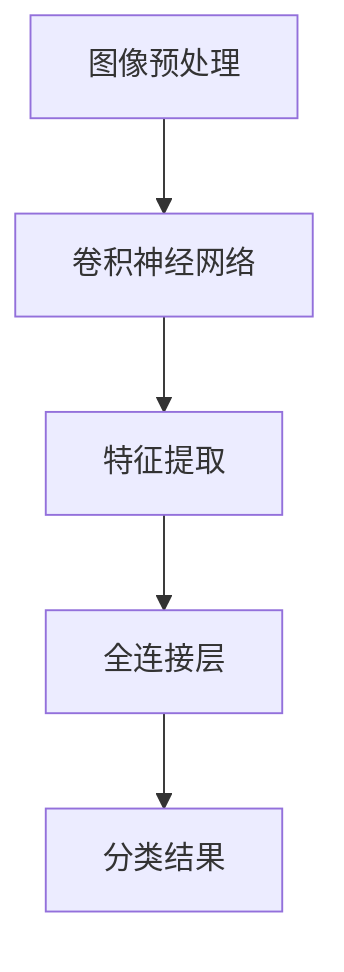

### 8.2 物体检测

物体检测是指定位图像中的物体，并识别物体的类别。以下是一个简单的物体检测任务及其解决方案：

1. **数据预处理**：对图像进行归一化、裁剪和调整大小等操作。

2. **特征提取**：使用卷积神经网络提取图像特征。

3. **区域建议**：使用区域建议网络生成可能包含物体的区域。

4. **分类与定位**：对每个区域进行分类和定位。

以下是一个简单的物体检测任务的Mermaid流程图：

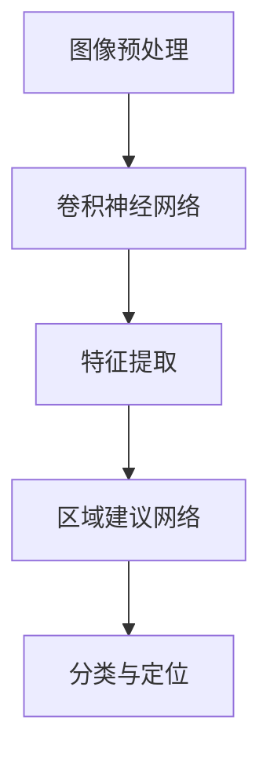

### 8.3 人脸识别

人脸识别是指识别人脸图像中的个体。以下是一个简单的人脸识别任务及其解决方案：

1. **数据预处理**：对图像进行归一化、裁剪和调整大小等操作。

2. **特征提取**：使用卷积神经网络提取人脸特征。

3. **匹配与分类**：使用相似性度量算法对提取的特征进行匹配和分类。

以下是一个简单的人脸识别任务的Mermaid流程图：

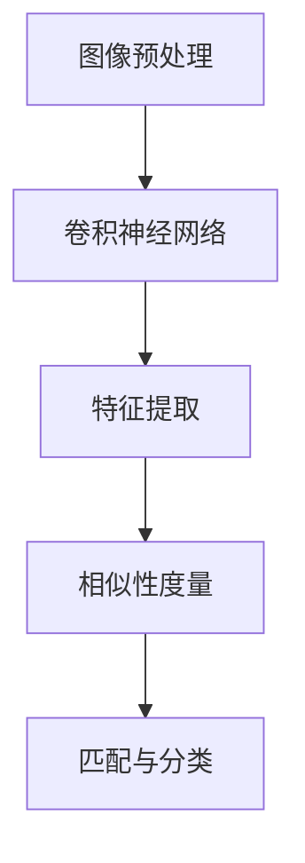

### 8.4 图像生成

图像生成是指利用神经网络生成新的图像。以下是一个简单的图像生成任务及其解决方案：

1. **数据预处理**：对图像进行归一化、裁剪和调整大小等操作。

2. **特征提取**：使用生成对抗网络（GAN）提取图像特征。

3. **图像生成**：使用生成器网络生成新的图像。

以下是一个简单的图像生成任务的Mermaid流程图：

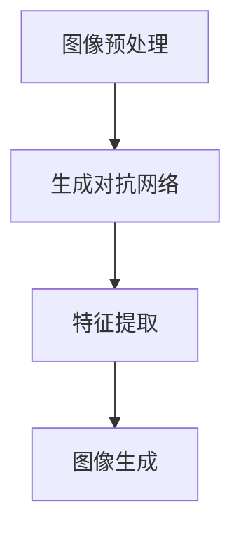

## 第9章：神经网络在自然语言处理中的应用

神经网络在自然语言处理（NLP）领域有着广泛的应用，以下介绍一些常见的NLP任务及其解决方案。

### 9.1 文本分类

文本分类是指将文本分为预定义的类别。以下是一个简单的文本分类任务及其解决方案：

1. **数据预处理**：对文本进行分词、去停用词、词性标注等操作。

2. **特征提取**：使用词嵌入模型将文本转换为向量表示。

3. **分类**：使用循环神经网络（RNN）或卷积神经网络（CNN）对向量表示进行分类。

以下是一个简单的文本分类任务的Mermaid流程图：

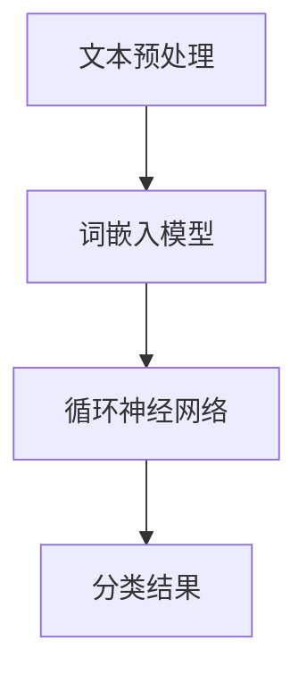

### 9.2 情感分析

情感分析是指分析文本中的情感倾向，如正面、负面、中性等。以下是一个简单的情感分析任务及其解决方案：

1. **数据预处理**：对文本进行分词、去停用词、词性标注等操作。

2. **特征提取**：使用词嵌入模型将文本转换为向量表示。

3. **分类**：使用循环神经网络（RNN）或卷积神经网络（CNN）对向量表示进行情感分类。

以下是一个简单的情感分析任务的Mermaid流程图：


### 9.3 机器翻译

机器翻译是指将一种语言的文本翻译成另一种语言的文本。以下是一个简单的机器翻译任务及其解决方案：

1. **数据预处理**：对源文本和目标文本进行分词、去停用词、词性标注等操作。

2. **特征提取**：使用词嵌入模型将源文本和目标文本转换为向量表示。

3. **编码与解码**：使用循环神经网络（RNN）或注意力机制对源文本和目标文本进行编码和解码。

以下是一个简单的机器翻译任务的Mermaid流程图：

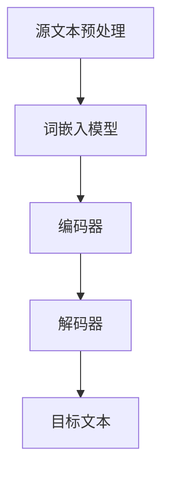

### 9.4 文本生成

文本生成是指利用神经网络生成新的文本。以下是一个简单的文本生成任务及其解决方案：

1. **数据预处理**：对文本进行分词、去停用词、词性标注等操作。

2. **特征提取**：使用词嵌入模型将文本转换为向量表示。

3. **序列生成**：使用循环神经网络（RNN）或生成对抗网络（GAN）生成新的文本序列。

以下是一个简单的文本生成任务的Mermaid流程图：

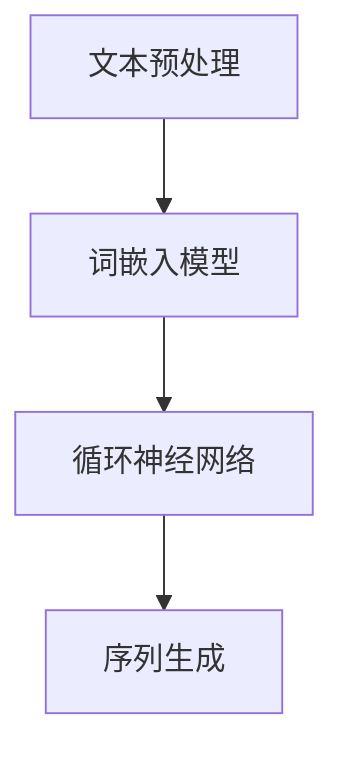

## 第10章：神经网络在强化学习中的应用

神经网络在强化学习（Reinforcement Learning，RL）领域有着广泛的应用，以下介绍一些常见的强化学习任务及其解决方案。

### 10.1 游戏对战

游戏对战是指使用神经网络实现游戏AI，与人类玩家或其他AI进行对弈。以下是一个简单的游戏对战任务及其解决方案：

1. **数据预处理**：对游戏状态进行编码，将其转换为神经网络可以处理的格式。

2. **价值函数估计**：使用神经网络估计游戏状态的值函数，以确定最佳动作。

3. **策略迭代**：根据价值函数更新策略，选择最佳动作。

以下是一个简单的游戏对战任务的Mermaid流程图：

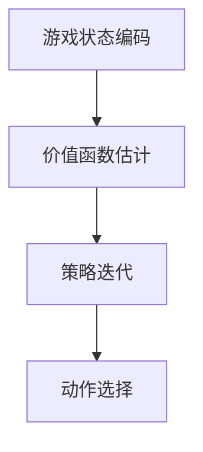

### 10.2 自动驾驶

自动驾驶是指使用神经网络实现自动驾驶车辆，对周围环境进行感知和决策。以下是一个简单的自动驾驶任务及其解决方案：

1. **数据预处理**：对车辆传感器数据进行编码，将其转换为神经网络可以处理的格式。

2. **感知与决策**：使用神经网络对传感器数据进行分析，生成驾驶决策。

3. **控制执行**：根据驾驶决策控制车辆的运动。

以下是一个简单的自动驾驶任务的Mermaid流程图：

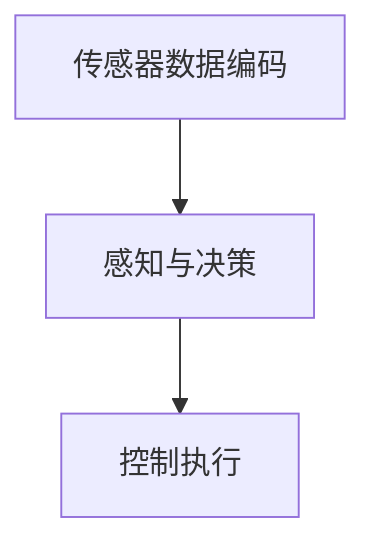

### 10.3 机器人控制

机器人控制是指使用神经网络实现机器人运动控制，使其完成特定任务。以下是一个简单的机器人控制任务及其解决方案：

1. **数据预处理**：对机器人传感器数据进行编码，将其转换为神经网络可以处理的格式。

2. **运动规划**：使用神经网络规划机器人的运动路径。

3. **执行控制**：根据运动规划执行机器人的动作。

以下是一个简单的机器人控制任务的Mermaid流程图：

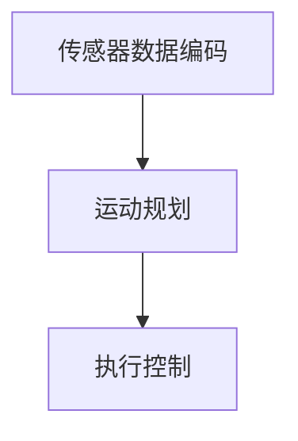

## 第11章：神经网络的未来发展趋势

神经网络的未来发展趋势主要集中在以下几个方面：

### 11.1 计算能力提升

随着计算能力的提升，神经网络将能够处理更大规模的数据和更复杂的任务。例如，使用更多的GPU或TPU加速训练过程，以及开发新的神经网络架构以适应大规模数据处理需求。

### 11.2 算法优化

为了提高神经网络训练效率和性能，研究人员将继续探索新的优化算法和训练策略。例如，自适应优化算法、分布式训练和迁移学习等。

### 11.3 安全性与透明度

随着神经网络在更多领域得到应用，其安全性和透明度成为一个重要问题。研究人员将致力于提高神经网络的鲁棒性、可解释性和透明度，以增强用户对人工智能系统的信任。

### 11.4 跨领域应用

神经网络将在更多领域得到应用，如生物医学、能源、交通等。跨领域合作将推动神经网络技术的发展，并带来新的创新和应用场景。

## 第12章：神经网络的研究热点

当前神经网络的研究热点主要集中在以下几个方面：

### 12.1 生成对抗网络（GAN）

生成对抗网络（GAN）是一种用于生成新数据的神经网络架构，其应用领域包括图像生成、语音合成和文本生成等。研究人员致力于提高GAN的性能和稳定性，以及探索其在更多领域的应用。

### 12.2 强化学习

强化学习是神经网络在游戏对战、自动驾驶和机器人控制等领域的重要应用方向。研究人员关注如何提高强化学习的性能、稳定性和可解释性。

### 12.3 注意力机制

注意力机制是神经网络中的一种关键技术，用于提高模型在序列数据处理中的性能。研究人员致力于探索注意力机制的新结构和应用场景，以提高模型的表示能力和效率。

### 12.4 自监督学习

自监督学习是一种利用未标注数据进行训练的方法，其应用领域包括图像分类、自然语言处理和语音识别等。研究人员致力于开发新的自监督学习算法，以减少对大量标注数据的依赖。

## 附录A：神经网络常用工具与资源

神经网络常用的工具和资源包括以下内容：

### 12.1 神经网络常用工具

1. **TensorFlow**：由Google开发的开源深度学习框架，支持多种神经网络架构和优化算法。

2. **PyTorch**：由Facebook开发的开源深度学习框架，提供灵活的动态计算图和丰富的库函数。

3. **Keras**：基于TensorFlow和PyTorch的简洁高效的深度学习库，适合快速原型设计和实验。

### 12.2 神经网络学习资源

1. **《神经网络与深度学习》**：由阿里云、京东等公司联合编写的深度学习入门教材。

2. **《深度学习》（Goodfellow、Bengio、Courville 著）**：深度学习领域的经典教材，全面介绍了深度学习的基本原理和应用。

### 12.3 神经网络论文集锦

1. **《深度学习》（Goodfellow、Bengio、Courville 著）**：包含大量经典深度学习论文的引用和介绍。

2. **《自然语言处理综论》（Jurafsky、Martin 著）**：包含大量经典自然语言处理论文的引用和介绍。

---

### 附录B：神经网络参考资料

#### B.1 神经网络相关书籍

1. **《神经网络与机器学习》**
2. **《深度学习》（Goodfellow、Bengio、Courville 著）**
3. **《神经网络基础教程》**

#### B.2 神经网络论文集锦

1. **Hinton, G.E., Osindero, S. and Teh, Y.W., 2006. A fast learning algorithm for deep belief nets. Neural computation, 18(7), pp.1527-1554.**
2. **LeCun, Y., Bengio, Y. and Hinton, G., 2015. Deep learning. Nature, 521(7553), pp.436-444.**
3. **Rumelhart, D.E., Hinton, G.E. and Williams, R.J., 1986. Learning representations by back-propagating errors. Nature, 323(6088), pp.533-536.**

