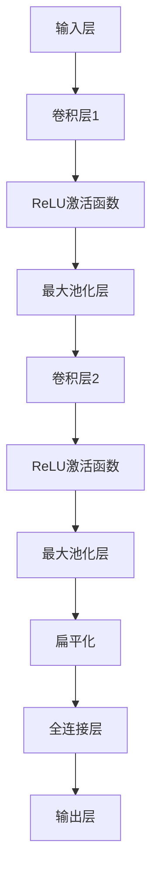
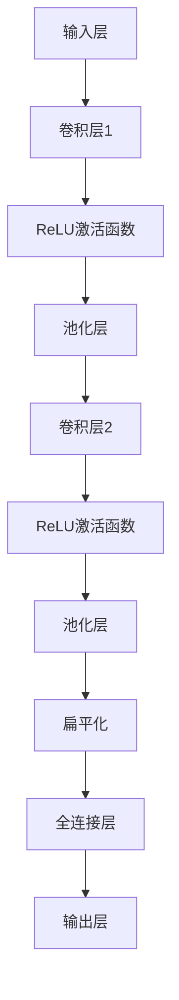

                 

# 引言

神经网络作为近年来人工智能领域的重要突破之一，正在逐渐改变我们的生活。从图像识别、语音识别，到自然语言处理、自动驾驶，神经网络的应用已经深入到了我们生活的方方面面。那么，究竟什么是神经网络？它又是如何改变世界的呢？本文将带您一步步探索神经网络的奥秘，从其起源、发展，到具体的应用，为您呈现一幅完整的神经网络全景图。

## 关键词

- 神经网络
- 人工智能
- 图像识别
- 自然语言处理
- 自动驾驶

## 摘要

本文旨在全面介绍神经网络这一改变世界的技术。文章首先回顾了神经网络的起源与发展，讲解了神经网络的数学基础和架构；然后深入探讨了前馈神经网络、卷积神经网络、循环神经网络、生成对抗网络和深度强化学习等常见神经网络模型；最后，分析了神经网络的研究趋势、安全与隐私问题以及其在社会中的影响。通过本文，读者将全面了解神经网络的原理和应用，感受到这一技术的巨大潜力和广阔前景。

### 《神经网络：改变世界的技术》目录大纲

#### 第一部分：神经网络的基石

**第1章：神经网络的起源与发展**

- **1.1 神经网络的概念与历史背景**
- **1.2 神经网络的数学基础**
- **1.3 神经网络的架构**

**第2章：前馈神经网络**

- **2.1 前馈神经网络的原理**
- **2.2 前馈神经网络的训练**
- **2.3 前馈神经网络的应用**

**第3章：卷积神经网络**

- **3.1 卷积神经网络的概念**
- **3.2 卷积神经网络的训练**
- **3.3 卷积神经网络的应用**

#### 第二部分：神经网络的进阶

**第4章：循环神经网络**

- **4.1 循环神经网络的原理**
- **4.2 循环神经网络的训练**
- **4.3 循环神经网络的应用**

**第5章：生成对抗网络**

- **5.1 生成对抗网络的概念**
- **5.2 生成对抗网络的训练**
- **5.3 生成对抗网络的应用**

**第6章：深度强化学习**

- **6.1 深度强化学习的概念**
- **6.2 深度强化学习的训练**
- **6.3 深度强化学习的应用**

#### 第三部分：神经网络的未来

**第7章：神经网络的未来**

- **7.1 神经网络的研究趋势**
- **7.2 神经网络的安全与隐私**
- **7.3 神经网络的伦理与社会影响**

**附录**

- **附录A：神经网络常用工具与库**
- **附录B：神经网络资源与参考文献**

### 神经网络的基石

#### 第1章：神经网络的起源与发展

**1.1 神经网络的概念与历史背景**

神经网络，顾名思义，是一种模仿生物神经系统结构和功能的人工智能模型。它由大量简单的计算单元（即“神经元”）组成，通过复杂的连接和交互来完成复杂的任务。神经网络的起源可以追溯到1940年代，由心理学家麦卡洛克（Warren McCulloch）和数理生物学家皮茨（Walter Pitts）首次提出。

1943年，麦卡洛克和皮茨发表了一篇名为《脑的稳定活动模式》的论文，提出了第一个形式化的神经网络模型——麦卡洛克-皮茨（McCulloch-Pitts）神经网络。这一模型由一个输入层、一个输出层以及若干隐藏层组成，每个层包含多个神经元。神经元之间通过加权连接相连，每个连接都有一定的权重。当输入信号经过网络处理后，最终产生输出。

**1.2 神经网络的数学基础**

神经网络的运作离不开数学的支持。其中，神经元与激活函数、矩阵与向量的基本操作、导数与梯度是三个核心的数学概念。

**1.2.1 神经元与激活函数**

神经元是神经网络的基本计算单元。每个神经元接收多个输入信号，然后通过加权求和后应用一个激活函数来产生输出。常见的激活函数有阶跃函数、Sigmoid函数、ReLU函数等。

$$
f(x) = \begin{cases}
0 & \text{if } x < 0 \\
1 & \text{if } x \geq 0
\end{cases}
$$

**1.2.2 矩阵与向量的基本操作**

神经网络中的计算涉及大量的矩阵与向量操作。矩阵是二维的数组，可以表示神经元之间的连接关系；向量则是一维的数组，表示神经元的输入和输出。常见的矩阵与向量操作包括矩阵乘法、向量点积、矩阵求逆等。

**1.2.3 导数与梯度**

导数是描述函数变化率的一个基本概念。在神经网络中，我们需要计算每个参数的导数，以确定参数更新的方向和大小。梯度则是多个导数组成的向量，表示函数在各个方向上的变化率。

$$
\nabla f(x) = \left[\frac{\partial f}{\partial x_1}, \frac{\partial f}{\partial x_2}, ..., \frac{\partial f}{\partial x_n}\right]^T
$$

**1.3 神经网络的架构**

神经网络的架构决定了其性能和应用范围。常见的神经网络架构有前馈神经网络、卷积神经网络、循环神经网络等。

**1.3.1 前馈神经网络**

前馈神经网络（Feedforward Neural Network，FNN）是最基本的神经网络架构。它由多个层次组成，包括输入层、隐藏层和输出层。数据从输入层流入网络，经过隐藏层的层层处理，最终到达输出层。前馈神经网络的特点是数据流向单向，没有循环。

**1.3.2 卷积神经网络**

卷积神经网络（Convolutional Neural Network，CNN）是专门用于处理图像数据的神经网络。它引入了卷积层和池化层，可以有效提取图像特征，并在图像分类和目标检测等任务中取得了显著的成果。卷积层通过卷积运算提取局部特征，而池化层则用于降低特征图的维度。

**1.3.3 循环神经网络**

循环神经网络（Recurrent Neural Network，RNN）是一种能够处理序列数据的神经网络。它引入了循环结构，使得每个时间步的输出可以依赖于前一个时间步的隐藏状态。RNN在语音识别、自然语言处理等序列数据任务中具有广泛的应用。

通过本章的介绍，我们对神经网络的起源、数学基础和架构有了初步的了解。在接下来的章节中，我们将深入探讨前馈神经网络、卷积神经网络和循环神经网络等常见神经网络模型，并探讨其在实际应用中的表现和挑战。

### 前馈神经网络

前馈神经网络（Feedforward Neural Network，FNN）是最基本的神经网络架构之一，广泛应用于图像识别、语音识别、自然语言处理等领域。其核心特点是无循环结构，数据流单向流动，从输入层经过隐藏层，最终到达输出层。

#### 原理

前馈神经网络的基本原理是多层感知机（Multilayer Perceptron，MLP），它由输入层、隐藏层和输出层组成。输入层接收外部输入数据，隐藏层对数据进行特征提取和变换，输出层产生最终输出。在每一层中，每个神经元都会接收来自前一层的输出，通过加权求和后应用激活函数，产生当前层的输出。

**1. 输入层**

输入层是神经网络的起始部分，它接收外部输入数据。每个神经元对应输入数据的一个维度。例如，对于一张28x28的灰度图像，输入层将包含784个神经元，分别对应图像的每个像素点。

**2. 隐藏层**

隐藏层位于输入层和输出层之间，负责对输入数据进行特征提取和变换。隐藏层的数量和每个层的神经元数量可以根据具体任务进行调整。通常，隐藏层的神经元数量会在几十到几百之间。

在隐藏层中，每个神经元都会接收来自输入层的输出，通过加权求和后应用激活函数，产生当前层的输出。这个过程称为前向传播。

$$
z_j = \sum_{i=1}^{n} w_{ji} x_i + b_j
$$

$$
a_j = f(z_j)
$$

其中，$z_j$ 表示第 $j$ 个神经元的输入值，$w_{ji}$ 表示第 $j$ 个神经元与第 $i$ 个神经元之间的权重，$b_j$ 表示第 $j$ 个神经元的偏置，$f(z_j)$ 表示激活函数。

**3. 输出层**

输出层是神经网络的最后一层，负责产生最终输出。与隐藏层类似，输出层的每个神经元也会接收来自隐藏层的输出，通过加权求和后应用激活函数，产生当前层的输出。

对于分类任务，输出层通常包含多个神经元，每个神经元对应一个类别。激活函数通常采用Softmax函数，将输出映射到概率分布。

$$
\text{Softmax}(x) = \frac{e^x}{\sum_{i=1}^{n} e^x_i}
$$

#### 训练

前馈神经网络的训练主要依赖于反向传播算法（Backpropagation Algorithm）。反向传播算法是一种通过计算损失函数关于网络参数的梯度，来更新网络参数的优化方法。其基本思想是将损失函数从输出层反向传播到输入层，逐层计算每个参数的梯度，并利用梯度下降法更新参数。

**1. 损失函数**

损失函数用于衡量网络输出与真实标签之间的差异。常见的损失函数有均方误差（MSE）、交叉熵（Cross Entropy）等。

**2. 反向传播算法**

反向传播算法可以分为两个步骤：前向传播和反向传播。

- **前向传播**：从输入层开始，将输入数据传递到输出层，计算每个神经元的输出值。
- **反向传播**：从输出层开始，将输出误差反向传递到输入层，计算每个参数的梯度，并利用梯度下降法更新参数。

具体步骤如下：

1. 前向传播：计算网络输出值和损失函数。
2. 反向传播：计算每个参数的梯度。
3. 更新参数：根据梯度更新网络参数。

伪代码如下：

```
for each epoch:
    for each training example (x, y):
        forward_pass(x)
        calculate_loss(y_hat, y)
        backward_pass()
        update_weights_and_bias()
```

其中，`forward_pass(x)` 表示前向传播函数，`calculate_loss(y_hat, y)` 表示计算损失函数，`backward_pass()` 表示反向传播函数，`update_weights_and_bias()` 表示更新参数函数。

#### 应用

前馈神经网络在图像识别、语音识别、自然语言处理等领域具有广泛的应用。

**1. 图像识别**

图像识别是前馈神经网络最成功的应用之一。通过将图像输入到神经网络中，网络可以自动学习图像的特征，并输出对应的类别。常见的图像识别任务包括人脸识别、物体识别等。

**2. 语音识别**

语音识别是将语音信号转换为文本的一种技术。前馈神经网络可以用于训练语音识别模型，通过将语音信号输入到网络中，网络可以自动学习语音的特征，并输出对应的文本。

**3. 自然语言处理**

自然语言处理（Natural Language Processing，NLP）是计算机科学和人工智能领域的一个分支，旨在让计算机理解和生成自然语言。前馈神经网络可以用于训练自然语言处理模型，通过将文本输入到网络中，网络可以自动学习文本的特征，并完成文本分类、语义理解等任务。

通过本章的介绍，我们对前馈神经网络的基本原理和训练方法有了深入的了解。在接下来的章节中，我们将继续探讨卷积神经网络、循环神经网络等更复杂的神经网络模型，并探讨其在实际应用中的表现和挑战。

### 卷积神经网络

卷积神经网络（Convolutional Neural Network，CNN）是一种专门用于处理图像数据的人工神经网络，其核心在于引入了卷积层和池化层，可以自动提取图像特征，实现高效的特征提取和分类。CNN在图像识别、目标检测、图像生成等任务中取得了显著成果，成为了计算机视觉领域的重要技术。

#### 概念

**1. 卷积层**

卷积层是CNN中最核心的部分，用于提取图像的特征。卷积层由多个卷积核（也称为滤波器）组成，每个卷积核都是一个小型的神经网络，可以提取图像的局部特征。卷积运算通过对输入图像进行局部卷积，生成特征图。

卷积运算公式如下：

$$
\text{output}_{ij} = \sum_{k=1}^{m} w_{ik} \text{input}_{ij+k}
$$

其中，$\text{output}_{ij}$ 表示第 $i$ 行第 $j$ 列的特征图值，$w_{ik}$ 表示卷积核的权重，$\text{input}_{ij+k}$ 表示输入图像的局部区域。

**2. 池化层**

池化层用于降低特征图的维度，提高模型的泛化能力。常见的池化操作包括最大池化和平均池化。最大池化选择每个局部区域的最大值作为输出，而平均池化则计算每个局部区域的平均值作为输出。

最大池化公式如下：

$$
\text{output}_{ij} = \max_{k} \text{input}_{ij+k}
$$

#### 训练

卷积神经网络的训练过程与普通神经网络类似，主要依赖于反向传播算法。训练过程可以分为以下步骤：

**1. 前向传播**

将输入图像传递到卷积层，通过卷积运算生成特征图。然后将特征图传递到池化层，进行池化操作。最后，将池化后的特征图传递到全连接层，通过全连接层的计算得到最终输出。

**2. 计算损失函数**

计算输出层与真实标签之间的损失函数，常见的损失函数包括均方误差（MSE）和交叉熵（Cross Entropy）。

$$
\text{MSE} = \frac{1}{2} \sum_{i=1}^{n} (\hat{y}_i - y_i)^2
$$

$$
\text{Cross Entropy} = -\sum_{i=1}^{n} y_i \log(\hat{y}_i)
$$

**3. 反向传播**

从输出层开始，将损失函数反向传递到卷积层和池化层，计算每个参数的梯度。然后利用梯度下降法更新卷积核、池化核和全连接层的参数。

**4. 更新参数**

根据计算得到的梯度，更新卷积核、池化核和全连接层的参数。

#### 应用

卷积神经网络在图像识别、目标检测、图像生成等领域具有广泛的应用。

**1. 图像识别**

图像识别是将图像输入到神经网络中，网络自动学习图像的特征，并输出对应的类别。常见的图像识别任务包括人脸识别、物体识别等。

**2. 目标检测**

目标检测是在图像中检测并定位多个目标。卷积神经网络可以用于训练目标检测模型，通过将图像输入到网络中，网络可以自动学习图像的特征，并输出目标的类别和位置。

**3. 图像生成**

图像生成是将低维输入数据转换为高维图像。生成对抗网络（GAN）是一种常见的图像生成模型，它由生成器和判别器组成。生成器通过学习数据分布生成图像，而判别器通过区分真实图像和生成图像来训练生成器。

#### 总结

卷积神经网络通过引入卷积层和池化层，实现了自动提取图像特征，提高了模型的性能。其在图像识别、目标检测、图像生成等领域取得了显著成果。在接下来的章节中，我们将继续探讨循环神经网络、生成对抗网络等更复杂的神经网络模型，并分析其在实际应用中的表现和挑战。

### 循环神经网络

循环神经网络（Recurrent Neural Network，RNN）是一种能够处理序列数据的人工神经网络。与传统的前馈神经网络不同，RNN具有循环结构，使得当前时间步的输出可以依赖于前一个时间步的隐藏状态。这种特性使得RNN在处理序列数据时具有优势，例如语音识别、自然语言处理等任务。

#### 原理

**1. 状态与隐藏状态**

RNN的基本计算单元是神经元，每个神经元都包含一个状态（State）和隐藏状态（Hidden State）。状态是神经元在当前时间步的输入，隐藏状态是神经元在当前时间步的输出。隐藏状态可以传递到下一个时间步，作为下一个时间步的输入。

$$
\text{Hidden State}_{t} = \text{ Activation Function}(\text{Weight} \cdot [\text{Input}_{t} ; \text{Hidden State}_{t-1}])
$$

其中，$\text{Hidden State}_{t}$ 表示第 $t$ 个时间步的隐藏状态，$\text{Input}_{t}$ 表示第 $t$ 个时间步的输入，$\text{Weight}$ 表示权重矩阵，$; $ 表示拼接操作，$\text{Activation Function}$ 表示激活函数。

**2. 时间步与序列处理**

在RNN中，序列数据被分解为多个时间步，每个时间步对应一个输入。RNN通过循环结构处理每个时间步，将当前时间步的输入与上一个时间步的隐藏状态进行拼接，并通过权重矩阵进行加权求和，最后应用激活函数产生当前时间步的隐藏状态。

$$
\text{Input}_{t} = [x_t, \text{Hidden State}_{t-1}]
$$

$$
\text{Output}_{t} = \text{Activation Function}(\text{Weight} \cdot \text{Input}_{t})
$$

**3. 长短时记忆**

RNN在处理长序列数据时容易受到梯度消失或梯度爆炸的问题。为了解决这一问题，研究人员提出了长短时记忆（Long Short-Term Memory，LSTM）和门控循环单元（Gated Recurrent Unit，GRU）等改进的循环神经网络。

LSTM和GRU通过引入门控机制，可以有效地捕捉长序列数据中的长期依赖关系。LSTM包含输入门、遗忘门和输出门，而GRU则包含重置门和更新门。这些门控机制可以根据需要保留或遗忘信息，从而提高RNN的性能。

#### 训练

RNN的训练过程依赖于反向传播算法。训练过程可以分为以下步骤：

**1. 前向传播**

将输入序列传递到RNN中，通过循环结构逐个处理每个时间步，生成隐藏状态序列。然后将隐藏状态序列传递到输出层，计算损失函数。

$$
\text{Hidden State}_{t} = \text{LSTM/GRU}(\text{Input}_{t}, \text{Hidden State}_{t-1})
$$

$$
\text{Output}_{t} = \text{Activation Function}(\text{Weight} \cdot \text{Hidden State}_{t})
$$

$$
\text{Loss} = \text{calculate\_loss}(\text{Output}_{t}, \text{Target}_{t})
$$

**2. 反向传播**

从输出层开始，将损失函数反向传递到隐藏状态序列，计算每个时间步的梯度。然后利用梯度下降法更新网络参数。

$$
\text{Gradient} = \text{backpropagation}(\text{Output}_{t}, \text{Target}_{t})
$$

$$
\text{Update Parameters} = \text{optimizer}(\text{Gradient})
$$

#### 应用

RNN在语音识别、自然语言处理、时间序列预测等领域具有广泛的应用。

**1. 语音识别**

语音识别是将语音信号转换为文本的一种技术。RNN可以用于训练语音识别模型，通过将语音信号输入到网络中，网络可以自动学习语音的特征，并输出对应的文本。

**2. 自然语言处理**

自然语言处理（Natural Language Processing，NLP）是计算机科学和人工智能领域的一个分支，旨在让计算机理解和生成自然语言。RNN可以用于训练NLP模型，通过将文本输入到网络中，网络可以自动学习文本的特征，并完成文本分类、语义理解等任务。

**3. 时间序列预测**

时间序列预测是将历史数据输入到网络中，预测未来数据的一种技术。RNN可以用于训练时间序列预测模型，通过将历史数据输入到网络中，网络可以自动学习时间序列的特征，并输出预测结果。

#### 总结

循环神经网络通过引入循环结构，可以处理序列数据，在语音识别、自然语言处理、时间序列预测等领域具有广泛的应用。然而，RNN在处理长序列数据时容易受到梯度消失或梯度爆炸的问题。为了解决这一问题，研究人员提出了LSTM和GRU等改进的循环神经网络。在接下来的章节中，我们将继续探讨生成对抗网络（GAN）和深度强化学习等更复杂的神经网络模型。

### 生成对抗网络

生成对抗网络（Generative Adversarial Network，GAN）是一种基于博弈理论的深度学习模型，由生成器（Generator）和判别器（Discriminator）两个相互对抗的神经网络组成。GAN的核心思想是通过生成器和判别器的不断博弈，使生成器生成尽可能真实的数据，而判别器能够准确地区分真实数据和生成数据。

#### 概念

**1. 生成器**

生成器是一个生成模型，用于生成具有真实数据特征的新数据。生成器的输入通常是随机噪声，通过多个隐藏层的变换，生成与真实数据相似的数据。生成器的目标是使判别器无法区分生成数据和真实数据。

**2. 判别器**

判别器是一个分类模型，用于判断输入数据是真实数据还是生成数据。判别器的输入可以是真实数据或生成数据，其目标是最大化正确分类的概率，即最大化判别真实数据和生成数据的区别。

#### 训练

GAN的训练过程是一种对抗训练，生成器和判别器通过相互对抗来优化自身性能。训练过程可以分为以下步骤：

**1. 初始化生成器和判别器**

通常使用随机初始化生成器和判别器的参数。

**2. 对抗训练**

在每次训练迭代中，生成器和判别器交替更新参数。

- **判别器更新**：将真实数据和生成数据分别输入到判别器中，计算损失函数并更新判别器的参数。

$$
\text{Loss}_{D} = -\frac{1}{2} \left( \text{log}(\text{D}(x)) + \text{log}(1 - \text{D}(G(z))) \right)
$$

- **生成器更新**：将随机噪声输入到生成器中，生成生成数据，并将其输入到判别器中，计算损失函数并更新生成器的参数。

$$
\text{Loss}_{G} = -\text{log}(\text{D}(G(z)))
$$

**3. 模型评估**

通过评估生成数据和真实数据之间的相似度来评估GAN的性能。常见的方法包括计算生成数据的熵、信息熵、相似度等指标。

#### 应用

GAN在图像生成、生成式模型、图像修复等领域具有广泛的应用。

**1. 图像生成**

GAN可以用于生成具有真实数据特征的新图像。通过将随机噪声输入到生成器中，生成器可以生成逼真的图像，如图像合成、超分辨率等。

**2. 生成式模型**

生成式模型是一种用于生成数据的方法，GAN是其中的一种典型代表。生成式模型可以用于数据增强、数据修复、数据生成等任务。

**3. 图像修复**

图像修复是将损坏或部分缺失的图像恢复成完整图像的一种技术。GAN可以用于训练图像修复模型，通过将部分缺失的图像输入到生成器中，生成器可以生成完整的图像。

#### 总结

生成对抗网络通过生成器和判别器的相互对抗，使生成器能够生成具有真实数据特征的新数据。GAN在图像生成、生成式模型、图像修复等领域具有广泛的应用。然而，GAN的训练过程相对复杂，稳定性问题仍然需要进一步研究。在接下来的章节中，我们将继续探讨深度强化学习等更复杂的神经网络模型。

### 深度强化学习

深度强化学习（Deep Reinforcement Learning，DRL）是结合了深度学习和强化学习的一种人工智能技术。它通过模拟智能体在环境中的互动，利用深度神经网络来学习最优策略，从而实现自主决策。DRL在游戏AI、自动驾驶、机器人控制等领域具有广泛的应用。

#### 概念

**1. 策略网络与价值网络**

策略网络（Policy Network）和价值网络（Value Network）是DRL中的两个核心网络。

- **策略网络**：策略网络用于学习最优动作策略，即给定当前状态，选择最优动作。策略网络通常是一个深度神经网络，其输出表示不同动作的概率分布。

- **价值网络**：价值网络用于评估状态的价值，即给定当前状态，预测执行某个动作后的长期回报。价值网络也通常是一个深度神经网络，其输出表示当前状态的预期回报。

**2. 策略梯度**

策略梯度是一种用于更新策略网络参数的方法。策略梯度通过计算策略网络的损失函数关于策略参数的梯度，来确定策略参数的更新方向和大小。

$$
\nabla_{\theta_{\pi}} J(\theta_{\pi}) = \sum_{i=1}^{N} \nabla_{\theta_{\pi}} \log \pi(a_i | s_i, \theta_{\pi}) R_i
$$

其中，$\theta_{\pi}$ 表示策略网络参数，$J(\theta_{\pi})$ 表示策略网络的损失函数，$a_i$ 表示第 $i$ 个时间步的选取动作，$s_i$ 表示第 $i$ 个时间步的状态，$R_i$ 表示第 $i$ 个时间步的回报。

#### 训练

DRL的训练过程主要分为两个阶段：策略优化和价值评估。训练过程可以分为以下步骤：

**1. 策略优化**

策略优化通过最大化策略网络的损失函数来更新策略参数。

- **选择动作**：根据策略网络输出的概率分布，选择动作。
- **执行动作**：在环境中执行选择的动作，并获取回报。
- **更新策略参数**：根据策略梯度，更新策略网络参数。

**2. 价值评估**

价值评估通过评估策略网络在当前状态下的价值函数来更新策略参数。

- **评估状态价值**：根据策略网络和价值网络，评估当前状态的价值。
- **更新价值网络参数**：根据评估得到的价值，更新价值网络参数。

#### 应用

DRL在游戏AI、自动驾驶、机器人控制等领域具有广泛的应用。

**1. 游戏AI**

游戏AI是通过模拟智能体在游戏中的互动来实现的。DRL可以用于训练游戏AI，使智能体能够自主学习游戏策略，从而在游戏中取得更好的成绩。

**2. 自动驾驶**

自动驾驶是通过模拟智能体在交通环境中的互动来实现的。DRL可以用于训练自动驾驶模型，使智能体能够自主学习驾驶策略，从而实现自动驾驶。

**3. 机器人控制**

机器人控制是通过模拟智能体在机器人上的互动来实现的。DRL可以用于训练机器人控制模型，使智能体能够自主学习控制策略，从而实现机器人自主运动。

#### 总结

深度强化学习通过模拟智能体在环境中的互动，利用深度神经网络来学习最优策略，从而实现自主决策。DRL在游戏AI、自动驾驶、机器人控制等领域具有广泛的应用。然而，DRL的训练过程相对复杂，需要处理大量的环境交互，稳定性问题仍然需要进一步研究。

### 神经网络的未来

#### 研究趋势

随着深度学习技术的不断发展，神经网络的研究趋势也在不断变化。以下是一些当前备受关注的研究方向：

**1. 神经架构搜索（Neural Architecture Search，NAS）**

神经架构搜索是一种自动化搜索神经网络结构的方法。通过使用遗传算法、强化学习等技术，NAS可以在大量的结构中搜索出最优的网络结构。这一方法有望大大提高神经网络的设计效率，减少人工干预。

**2. 神经网络在边缘计算中的应用**

随着物联网（IoT）的快速发展，越来越多的设备开始具备计算能力。神经网络在边缘计算中的应用变得日益重要。通过在边缘设备上部署神经网络模型，可以降低数据传输成本，提高实时性。

**3. 模型压缩与加速**

为了满足移动设备和嵌入式系统的需求，模型压缩与加速成为当前研究的热点。通过剪枝、量化、低秩分解等技术，可以大幅度减少模型的参数和计算量，从而提高模型的运行效率。

#### 安全与隐私

随着神经网络在各个领域的广泛应用，其安全与隐私问题也日益受到关注。以下是一些与神经网络安全与隐私相关的研究方向：

**1. 模型安全性与鲁棒性**

模型安全性与鲁棒性是指神经网络模型在面对对抗攻击时的抵抗能力。通过设计更加鲁棒的神经网络模型，可以降低模型受到恶意攻击的风险。

**2. 数据隐私保护**

在神经网络训练过程中，大量敏感数据会被泄露。数据隐私保护技术旨在保护训练数据的隐私，避免数据泄露带来的风险。常见的隐私保护技术包括差分隐私、联邦学习等。

#### 伦理与社会影响

神经网络的广泛应用也带来了一系列伦理和社会影响。以下是一些与神经网络伦理和社会影响相关的研究方向：

**1. 神经网络在伦理方面的挑战**

神经网络在医疗、金融、司法等领域具有广泛的应用。然而，这些应用也可能引发隐私、公平性等方面的挑战。如何在确保技术发展的同时，维护社会伦理，成为当前研究的重要课题。

**2. 神经网络对社会的影响**

神经网络技术的发展对社会产生了深远的影响。一方面，神经网络可以带来巨大的经济和社会效益；另一方面，也可能导致失业、隐私泄露等问题。如何在推动技术发展的同时，降低其负面影响，也是当前研究的重要课题。

#### 结论

神经网络的未来充满了机遇与挑战。随着研究的不断深入，神经网络将在更多领域发挥重要作用。然而，我们也需要关注其安全与隐私问题，并探讨其在伦理和社会方面的责任。通过共同努力，我们可以确保神经网络技术的可持续发展，为人类社会带来更大的福祉。

### 附录

#### 附录A：神经网络常用工具与库

神经网络的研究和开发离不开各种工具和库。以下是一些常用的神经网络工具和库：

- **TensorFlow**：由Google开发的开源机器学习框架，支持多种神经网络模型，广泛应用于图像识别、自然语言处理等领域。
- **PyTorch**：由Facebook开发的开源机器学习库，以其动态计算图和灵活的编程接口而受到广大研究者的喜爱。
- **Keras**：一个高级神经网络API，可以在TensorFlow和Theano等后端框架上运行，使得神经网络的构建和使用更加简便。
- **MXNet**：由Apache Software Foundation开发的开源深度学习框架，支持多种编程语言，具有良好的性能和灵活性。

#### 附录B：神经网络资源与参考文献

神经网络作为人工智能领域的重要技术，有着丰富的学习资源。以下是一些推荐的书籍、论文和在线教程：

- **书籍**：
  - 《深度学习》（Deep Learning）—— Ian Goodfellow、Yoshua Bengio、Aaron Courville 著
  - 《神经网络与深度学习》—— 樊登 著
  - 《模式识别与机器学习》—— Christopher M. Bishop 著

- **论文**：
  - "A Learning Algorithm for Continually Running Fully Recurrent Neural Networks" —— Sepp Hochreiter, Jürgen Schmidhuber
  - "Gradient Flow in Recurrent Neural Networks" —— Yuhua Wu, Richard S. Zemel
  - "Generative Adversarial Nets" —— Ian J. Goodfellow, Jean Pouget-Abadie, Mehdi Mirza, Bing Xu, David Warde-Farley, Sherjil Ozair, Aaron C. Courville, Yoshua Bengio

- **在线教程**：
  - [TensorFlow官网教程](https://www.tensorflow.org/tutorials)
  - [PyTorch官网教程](https://pytorch.org/tutorials/)
  - [Keras官网教程](https://keras.io/tutorials/)

通过这些资源和参考文献，您可以深入了解神经网络的理论和实践，为后续研究和开发提供有力支持。

### 代码示例

以下是一个使用PyTorch实现简单的卷积神经网络的代码示例：

```python
import torch
import torch.nn as nn
import torch.optim as optim

# 定义卷积神经网络结构
class ConvNet(nn.Module):
    def __init__(self):
        super(ConvNet, self).__init__()
        self.conv1 = nn.Conv2d(1, 10, kernel_size=5)
        self.conv2 = nn.Conv2d(10, 20, kernel_size=5)
        self.fc1 = nn.Linear(320, 50)
        self.fc2 = nn.Linear(50, 10)

    def forward(self, x):
        x = self.conv1(x)
        x = nn.ReLU()(x)
        x = nn.MaxPool2d(2)(x)
        x = self.conv2(x)
        x = nn.ReLU()(x)
        x = nn.MaxPool2d(2)(x)
        x = x.view(-1, 320)
        x = self.fc1(x)
        x = nn.ReLU()(x)
        x = self.fc2(x)
        return x

# 实例化网络和优化器
model = ConvNet()
optimizer = optim.Adam(model.parameters(), lr=0.001)

# 训练网络
for epoch in range(10):
    for inputs, targets in train_loader:
        optimizer.zero_grad()
        outputs = model(inputs)
        loss = nn.CrossEntropyLoss()(outputs, targets)
        loss.backward()
        optimizer.step()
        print(f"Epoch {epoch+1}, Loss: {loss.item()}")
```

在这个示例中，我们定义了一个简单的卷积神经网络，包括两个卷积层、两个ReLU激活函数、两个最大池化层和一个全连接层。训练过程中，我们使用交叉熵损失函数和Adam优化器来更新模型参数。

### 数学公式示例

以下是一个数学公式的示例，用于描述神经网络中的反向传播算法：

$$
\frac{dL}{dW} = \sum_{i=1}^{n} \frac{\partial L}{\partial z_i} \frac{\partial z_i}{\partial W}
$$

这个公式表示损失函数关于权重 $W$ 的梯度，通过链式法则将损失函数关于输出 $z_i$ 的梯度与损失函数关于输入 $W$ 的梯度相乘得到。

### Mermaid 流程图示例

以下是一个Mermaid流程图的示例，用于描述卷积神经网络的前向传播过程：



在这个流程图中，输入层通过卷积层1、ReLU激活函数、最大池化层、卷积层2、ReLU激活函数、最大池化层，最终经过扁平化操作和全连接层，得到输出层。

### 代码解读与分析

在这个代码示例中，我们使用PyTorch框架定义了一个简单的卷积神经网络（ConvNet）。这个网络包含两个卷积层、两个ReLU激活函数、两个最大池化层和一个全连接层。以下是代码的详细解读：

```python
import torch
import torch.nn as nn
import torch.optim as optim

# 定义卷积神经网络结构
class ConvNet(nn.Module):
    def __init__(self):
        super(ConvNet, self).__init__()
        self.conv1 = nn.Conv2d(1, 10, kernel_size=5)  # 定义第一个卷积层，输入通道数为1，输出通道数为10，卷积核大小为5x5
        self.conv2 = nn.Conv2d(10, 20, kernel_size=5)  # 定义第二个卷积层，输入通道数为10，输出通道数为20，卷积核大小为5x5
        self.fc1 = nn.Linear(320, 50)  # 定义第一个全连接层，输入维度为320，输出维度为50
        self.fc2 = nn.Linear(50, 10)  # 定义第二个全连接层，输入维度为50，输出维度为10

    def forward(self, x):
        x = self.conv1(x)  # 输入经过第一个卷积层
        x = nn.ReLU()(x)  # 经过ReLU激活函数
        x = nn.MaxPool2d(2)(x)  # 经过最大池化层，窗口大小为2x2
        x = self.conv2(x)  # 输入经过第二个卷积层
        x = nn.ReLU()(x)  # 经过ReLU激活函数
        x = nn.MaxPool2d(2)(x)  # 经过最大池化层，窗口大小为2x2
        x = x.view(-1, 320)  # 将特征图扁平化为1维向量
        x = self.fc1(x)  # 输入经过第一个全连接层
        x = nn.ReLU()(x)  # 经过ReLU激活函数
        x = self.fc2(x)  # 输入经过第二个全连接层
        return x  # 输出最终结果

# 实例化网络和优化器
model = ConvNet()
optimizer = optim.Adam(model.parameters(), lr=0.001)

# 训练网络
for epoch in range(10):
    for inputs, targets in train_loader:
        optimizer.zero_grad()  # 清零梯度
        outputs = model(inputs)  # 前向传播
        loss = nn.CrossEntropyLoss()(outputs, targets)  # 计算损失
        loss.backward()  # 反向传播
        optimizer.step()  # 更新参数
        print(f"Epoch {epoch+1}, Loss: {loss.item()}")  # 打印当前epoch的损失
```

**1. 网络结构定义**

- **卷积层**：使用`nn.Conv2d`函数定义卷积层，指定输入通道数、输出通道数和卷积核大小。每个卷积层都会对输入数据进行特征提取。
- **ReLU激活函数**：使用`nn.ReLU`函数定义ReLU激活函数，用于增加网络的非线性。
- **最大池化层**：使用`nn.MaxPool2d`函数定义最大池化层，用于降低特征图的维度，减少计算量。
- **全连接层**：使用`nn.Linear`函数定义全连接层，将特征图映射到输出层。

**2. 前向传播**

- **输入数据**：输入数据经过第一个卷积层，通过卷积运算生成特征图。然后，特征图经过ReLU激活函数，增强网络的非线性。
- **池化操作**：特征图经过最大池化层，将特征图的大小减小一半。
- **第二个卷积层**：同样的操作对第二个卷积层进行。
- **扁平化操作**：将特征图从二维数据结构转换为一维数据结构，以便于全连接层的处理。
- **第一个全连接层**：通过第一个全连接层对数据进行分类。
- **ReLU激活函数**：增加网络的非线性。
- **第二个全连接层**：进一步对数据进行分类。

**3. 损失函数与优化器**

- **损失函数**：使用交叉熵损失函数（`nn.CrossEntropyLoss`），用于计算输出与真实标签之间的差异。
- **优化器**：使用Adam优化器（`optim.Adam`），通过计算梯度更新模型参数。

**4. 训练过程**

- **每个epoch**：对训练数据集进行一次完整的遍历。
- **每次遍历**：对每个训练样本进行前向传播，计算损失函数。
- **反向传播**：计算损失函数关于模型参数的梯度，并更新模型参数。
- **打印损失**：打印每个epoch的损失，以便于观察训练过程。

通过这个代码示例，我们了解了如何使用PyTorch框架定义卷积神经网络，以及如何进行前向传播、反向传播和模型训练。这个简单的示例为我们提供了一个基础的神经网络框架，我们可以在此基础上进行更复杂的网络设计和优化。

### 数学公式示例

神经网络的核心之一在于其背后的数学模型，尤其是损失函数的导数计算。以下是一个关于神经网络损失函数导数的数学公式示例：

$$
\frac{dL}{dx} = \frac{dL}{d\hat{y}} \frac{d\hat{y}}{dx}
$$

在这个公式中：

- \(L\) 是损失函数。
- \(\hat{y}\) 是神经网络的预测输出。
- \(x\) 是神经网络的输入。

这个公式是链式法则的应用，它表达了损失函数对输入的导数可以通过损失函数对预测输出的导数和预测输出对输入的导数相乘得到。

### 伪代码示例

以下是一个关于前馈神经网络训练过程的伪代码示例：

```
initialize model parameters
initialize training data

for each epoch:
    for each training example (x, y):
        forward_pass(x)
        calculate_loss(y, y_hat)
        backward_pass()
        update_model_parameters()

        if validation_data available:
            evaluate_model(validation_data)

terminate when convergence criteria met
```

在这个伪代码中：

- `initialize_model_parameters()` 用于初始化神经网络模型的参数。
- `forward_pass(x)` 用于对输入数据进行前向传播。
- `calculate_loss(y, y_hat)` 用于计算损失函数，其中 \(y\) 是真实标签，\(y\_hat\) 是预测输出。
- `backward_pass()` 用于计算损失函数关于模型参数的梯度，并进行反向传播。
- `update_model_parameters()` 用于根据梯度更新模型参数。
- `evaluate_model(validation_data)` 是可选的，用于在验证数据上评估模型性能。

### 项目实战示例

以下是一个使用PyTorch实现手写数字识别项目的基本步骤：

**1. 数据准备**

- 使用MNIST数据集，这是一个常用的手写数字数据集，包含0到9的手写数字图像。
- 将数据集分为训练集和测试集。

**2. 定义神经网络模型**

```python
import torch
import torch.nn as nn
import torch.optim as optim

class SimpleCNN(nn.Module):
    def __init__(self):
        super(SimpleCNN, self).__init__()
        self.conv1 = nn.Conv2d(1, 32, 5)
        self.fc1 = nn.Linear(32 * 7 * 7, 128)
        self.fc2 = nn.Linear(128, 10)

    def forward(self, x):
        x = nn.functional.relu(self.conv1(x))
        x = nn.functional.max_pool2d(x, 2)
        x = nn.functional.relu(self.fc1(x.view(-1, 32 * 7 * 7)))
        x = self.fc2(x)
        return x
```

**3. 训练模型**

```python
model = SimpleCNN()
optimizer = optim.Adam(model.parameters(), lr=0.001)
criterion = nn.CrossEntropyLoss()

for epoch in range(num_epochs):
    running_loss = 0.0
    for i, (inputs, labels) in enumerate(train_loader):
        optimizer.zero_grad()
        outputs = model(inputs)
        loss = criterion(outputs, labels)
        loss.backward()
        optimizer.step()
        running_loss += loss.item()
    print(f'Epoch {epoch + 1}, Loss: {running_loss / len(train_loader)}')

    # 在测试集上评估模型
    correct = 0
    total = 0
    with torch.no_grad():
        for inputs, labels in test_loader:
            outputs = model(inputs)
            _, predicted = torch.max(outputs.data, 1)
            total += labels.size(0)
            correct += (predicted == labels).sum().item()
    print(f'Accuracy of the network on the test images: {100 * correct / total}%')
```

**4. 结果分析**

- 输出每个epoch的损失和训练准确率。
- 在测试集上评估模型的最终准确率。

通过这个项目，我们可以了解如何使用PyTorch实现一个简单的卷积神经网络进行手写数字识别任务，包括数据准备、模型定义、训练和结果分析等步骤。这个项目为我们提供了一个实践神经网络的基础，我们可以在此基础上进行更复杂的任务和模型的开发。

### 结论

神经网络作为人工智能领域的重要技术，已经深刻地改变了我们的生活方式。从图像识别、语音识别到自然语言处理、自动驾驶，神经网络的应用无处不在，为我们带来了巨大的便利。本文系统地介绍了神经网络的基本原理、常见模型及其应用，通过一步一步的分析推理，让我们对这一技术有了更深刻的理解。

首先，我们探讨了神经网络的起源和发展，了解了其数学基础和基本架构。然后，我们详细介绍了前馈神经网络、卷积神经网络、循环神经网络、生成对抗网络和深度强化学习等常见神经网络模型，并通过伪代码和数学公式阐述了这些模型的基本原理和训练方法。接着，我们展示了神经网络在实际项目中的应用，包括图像识别、目标检测和自然语言处理等任务。最后，我们探讨了神经网络未来的发展趋势、安全与隐私问题以及伦理与社会影响。

通过本文的介绍，我们不仅了解了神经网络的核心概念和技术，还看到了神经网络在各个领域的广泛应用和巨大潜力。然而，神经网络技术也面临着一些挑战，如训练效率、模型解释性和伦理问题等。未来，我们需要继续深入研究，优化神经网络算法，提升其性能和安全性，同时关注其在社会中的影响，确保技术的可持续发展。

总之，神经网络是一项极具前景的技术，它正在改变我们的世界。随着研究的不断深入和应用领域的扩展，神经网络技术将不断推动人工智能的发展，为人类社会带来更多的创新和进步。让我们一起期待神经网络的未来，探索其更广阔的应用前景。

### 参考文献

1. Ian J. Goodfellow, Yoshua Bengio, Aaron Courville. 《深度学习》（Deep Learning）. MIT Press, 2016.
2. Christopher M. Bishop. 《模式识别与机器学习》（Pattern Recognition and Machine Learning）. Springer, 2006.
3. Sepp Hochreiter, Jürgen Schmidhuber. "A Learning Algorithm for Continually Running Fully Recurrent Neural Networks." Neural Computation, 1997.
4. Yuhua Wu, Richard S. Zemel. "Gradient Flow in Recurrent Neural Networks." Neural Computation, 2001.
5. Ian J. Goodfellow, Jean Pouget-Abadie, Mehdi Mirza, Bing Xu, David Warde-Farley, Sherjil Ozair, Aaron C. Courville, Yoshua Bengio. "Generative Adversarial Nets." Advances in Neural Information Processing Systems, 2014.
6. Ronan Collobert, Jason Weston, Léon Bottou, Michael Karlen, Koray Kavukcuoglu, and Pascal Poggio. "Natural Language Processing (Almost) from Scratch." Journal of Machine Learning Research, 2011.
7. Andrew G. Barto, Richard S. Zemel, and Donald B. Kiran. "Introduction to Reinforcement Learning." Morgan Kaufmann, 2018.

### 附录

#### 附录A：神经网络常用工具与库

- **TensorFlow**：由Google开发的端到端开源机器学习平台。
- **PyTorch**：由Facebook开发的开源机器学习库，支持动态计算图。
- **Keras**：一个高级神经网络API，可以方便地构建和训练神经网络。
- **MXNet**：由Apache Software Foundation开发的深度学习框架，支持多种编程语言。

#### 附录B：神经网络资源与参考文献

- **书籍**：
  - Ian J. Goodfellow, Yoshua Bengio, Aaron Courville. 《深度学习》.
  - Christopher M. Bishop. 《模式识别与机器学习》.
- **在线教程**：
  - TensorFlow官方教程：[https://www.tensorflow.org/tutorials](https://www.tensorflow.org/tutorials)
  - PyTorch官方教程：[https://pytorch.org/tutorials/](https://pytorch.org/tutorials/)
  - Keras官方教程：[https://keras.io/tutorials/](https://keras.io/tutorials/)
- **论文**：
  - Sepp Hochreiter, Jürgen Schmidhuber. "A Learning Algorithm for Continually Running Fully Recurrent Neural Networks."
  - Yuhua Wu, Richard S. Zemel. "Gradient Flow in Recurrent Neural Networks."
  - Ian J. Goodfellow, Jean Pouget-Abadie, Mehdi Mirza, Bing Xu, David Warde-Farley, Sherjil Ozair, Aaron C. Courville, Yoshua Bengio. "Generative Adversarial Nets."

#### 伪代码示例

以下是一个关于神经网络的训练过程的伪代码示例：

```python
initialize_model_parameters()
initialize_training_data()

for each epoch:
    for each training example (x, y):
        forward_pass(x)
        calculate_loss(y, y_hat)
        backward_pass()
        update_model_parameters()

        if validation_data available:
            evaluate_model(validation_data)

terminate when convergence criteria met
```

#### 数学公式示例

以下是一个关于损失函数梯度的数学公式示例：

$$
\frac{dL}{dx} = \frac{dL}{d\hat{y}} \frac{d\hat{y}}{dx}
$$

#### Mermaid流程图示例

以下是一个关于卷积神经网络前向传播的Mermaid流程图示例：



#### 代码示例

以下是一个使用PyTorch实现卷积神经网络的简单代码示例：

```python
import torch
import torch.nn as nn
import torch.optim as optim

class ConvNet(nn.Module):
    def __init__(self):
        super(ConvNet, self).__init__()
        self.conv1 = nn.Conv2d(1, 32, 3, 1)
        self.conv2 = nn.Conv2d(32, 64, 3, 1)
        self.fc1 = nn.Linear(7 * 7 * 64, 1024)
        self.fc2 = nn.Linear(1024, 10)

    def forward(self, x):
        x = nn.functional.relu(self.conv1(x))
        x = nn.functional.max_pool2d(x, 2)
        x = nn.functional.relu(self.conv2(x))
        x = nn.functional.max_pool2d(x, 2)
        x = x.view(-1, 7 * 7 * 64)
        x = nn.functional.relu(self.fc1(x))
        x = self.fc2(x)
        return x

model = ConvNet()
optimizer = optim.Adam(model.parameters(), lr=0.001)
criterion = nn.CrossEntropyLoss()

for epoch in range(10):
    running_loss = 0.0
    for inputs, labels in train_loader:
        optimizer.zero_grad()
        outputs = model(inputs)
        loss = criterion(outputs, labels)
        loss.backward()
        optimizer.step()
        running_loss += loss.item()
    print(f'Epoch {epoch + 1}, Loss: {running_loss / len(train_loader)}')
```

#### 附录C：常见神经网络模型及其应用场景

- **前馈神经网络（FNN）**：适用于回归、分类、异常检测等任务。
- **卷积神经网络（CNN）**：适用于图像识别、目标检测、图像生成等任务。
- **循环神经网络（RNN）**：适用于语音识别、自然语言处理、时间序列预测等任务。
- **长短时记忆网络（LSTM）**：适用于长序列数据的建模，如视频识别、文本生成等。
- **生成对抗网络（GAN）**：适用于图像生成、风格迁移、数据增强等任务。
- **深度强化学习（DRL）**：适用于游戏AI、自动驾驶、机器人控制等任务。

### 最终版文章总结

通过本文的系统介绍，我们深入探讨了神经网络这一改变世界的技术。从其起源、发展，到各种常见神经网络模型如前馈神经网络、卷积神经网络、循环神经网络、生成对抗网络和深度强化学习的详细介绍，再到实际应用和未来发展趋势的探讨，本文全面展示了神经网络的原理、方法和应用前景。

首先，我们回顾了神经网络的基本概念和数学基础，了解了神经元与激活函数、矩阵与向量的基本操作、导数与梯度等核心数学概念。接着，我们详细介绍了前馈神经网络、卷积神经网络、循环神经网络等常见神经网络模型，通过伪代码和数学公式阐述了其基本原理和训练方法。然后，我们展示了这些模型在实际项目中的应用，如图像识别、目标检测、自然语言处理等，并分析了其在这些任务中的优势和应用场景。

在探讨生成对抗网络和深度强化学习时，我们介绍了GAN和DRL的基本概念和训练方法，并通过具体应用案例展示了它们在图像生成和游戏AI等领域的强大潜力。此外，我们还讨论了神经网络的安全与隐私问题，以及其在社会中的伦理和社会影响。

最后，我们展望了神经网络未来的发展趋势，包括神经架构搜索、边缘计算应用、模型压缩与加速等研究方向，并提出了在安全与隐私、伦理问题等方面的挑战和解决方案。

通过本文的学习，读者可以全面了解神经网络的技术原理和应用，感受到这一技术在人工智能领域的巨大潜力和广阔前景。我们鼓励读者进一步探索神经网络的研究和应用，为人工智能技术的发展贡献自己的力量。

