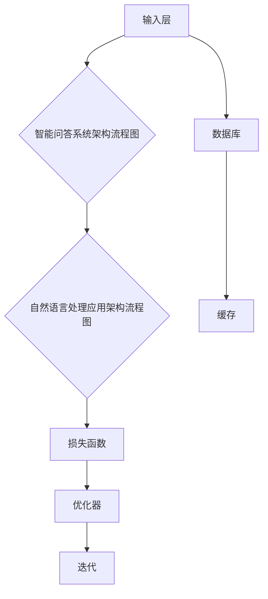

                 

# 秒推时代：LLM推理速度的飞跃

## 关键词
- LLM（大型语言模型）
- 推理速度
- 硬件加速
- 算法优化
- 数据库优化
- 实际案例

## 摘要
随着人工智能技术的迅猛发展，大型语言模型（LLM）的应用越来越广泛。然而，LLM的推理速度成为了制约其应用场景和性能的关键因素。本文将深入探讨LLM推理速度的提升方法，从硬件加速、算法优化和数据库优化三个方面进行分析，并通过实际案例展示优化效果。文章旨在为读者提供关于LLM推理速度优化的一站式指南，助力人工智能技术的进一步发展。

## 目录大纲

## 第一部分: LLM概述与基础

### 第1章: LLM时代来临

#### 1.1 LLM的概念与重要性

#### 1.2 LLM的核心技术

#### 1.3 LLM的应用场景

### 第2章: LLM的基本架构

#### 2.1 LLM的基本组成部分

#### 2.2 LLM的工作原理

#### 2.3 LLM的优化策略

## 第二部分: LLM推理速度优化

### 第3章: 硬件加速

#### 3.1 硬件加速器简介

#### 3.2 GPU加速策略

#### 3.3 张量处理优化

### 第4章: 算法优化

#### 4.1 深度可分离卷积

#### 4.2 低秩分解

#### 4.3 线性加速

### 第5章: 数据库优化

#### 5.1 数据库选择

#### 5.2 数据库优化策略

#### 5.3 数据缓存策略

## 第三部分: 实际案例与应用

### 第6章: 案例一：智能问答系统

#### 6.1 项目背景

#### 6.2 系统架构

#### 6.3 代码实现与优化

### 第7章: 案例二：自然语言处理应用

#### 7.1 项目背景

#### 7.2 系统架构

#### 7.3 代码实现与优化

### 第8章: 未来展望与挑战

#### 8.1 LLM的发展趋势

#### 8.2 推理速度优化的挑战

#### 8.3 未来发展方向

## 附录

### 附录A: 代码示例

#### A.1 智能问答系统代码示例

#### A.2 自然语言处理应用代码示例

### 附录B: 优化工具与资源

#### B.1 硬件加速器介绍

#### B.2 算法优化工具

#### B.3 数据库优化工具

#### B.4 其他优化资源介绍

**附录C: Mermaid流程图**

- LLM架构流程图
- 智能问答系统架构流程图
- 自然语言处理应用架构流程图

**附录D: 算法伪代码**

- 深度可分离卷积伪代码
- 低秩分解伪代码
- 线性加速伪代码

**附录E: 数学模型与公式**

- 推理速度的数学模型与公式
- 损失函数的数学模型与公式

**附录F: 代码解读与分析**

- 智能问答系统代码解读与分析
- 自然语言处理应用代码解读与分析

**附录G: 开发环境搭建**

- 智能问答系统开发环境搭建
- 自然语言处理应用开发环境搭建

**附录H: 源代码**

- 智能问答系统源代码
- 自然语言处理应用源代码

## 第一部分: LLM概述与基础

### 第1章: LLM时代来临

#### 1.1 LLM的概念与重要性

大型语言模型（Large Language Model，简称LLM）是一种能够理解和生成自然语言的深度学习模型。与传统的语言模型相比，LLM具有更大的参数规模和更强的表达能力。LLM通常通过训练数百万甚至数十亿个单词的文本数据来学习语言模式，从而实现高质量的文本生成、文本分类、机器翻译等任务。

LLM的重要性在于：
1. **强大的文本处理能力**：LLM能够处理和理解复杂的文本信息，这使得它们在自然语言处理（NLP）领域具有广泛的应用。
2. **推动技术进步**：LLM的出现推动了NLP技术的发展，使得许多原本复杂的任务变得更加简单高效。
3. **商业化前景**：随着LLM技术的成熟，越来越多的企业和机构开始将其应用于实际场景，从而创造了巨大的商业价值。

#### 1.2 LLM的核心技术

LLM的核心技术包括以下几个方面：

1. **神经网络架构**：LLM通常采用深度神经网络（DNN）或变换器架构（Transformer）来处理文本数据。变换器架构在处理长文本和长距离依赖方面具有显著优势，因此成为LLM的主流选择。

2. **预训练和微调**：预训练是指使用大量未标记的文本数据来训练LLM，使其具备基本的语言理解能力。微调是指在预训练的基础上，使用特定领域的数据对LLM进行进一步训练，从而提高其在特定任务上的性能。

3. **注意力机制**：注意力机制是Transformer架构的核心，它能够模型在处理文本时自动关注重要的信息，从而提高模型的表示能力和推理速度。

4. **正则化技术**：正则化技术如Dropout、DropPath等，用于防止模型过拟合，提高模型的泛化能力。

#### 1.3 LLM的应用场景

LLM在多个领域都有广泛的应用，主要包括：

1. **自然语言处理**：如文本分类、情感分析、机器翻译、文本摘要等。
2. **问答系统**：如智能客服、智能搜索引擎、智能助手等。
3. **生成内容**：如文本生成、图像生成、音乐生成等。
4. **辅助决策**：如风险分析、医疗诊断、法律咨询等。
5. **教育**：如在线教育、虚拟教师、智能教材等。

### 第2章: LLM的基本架构

LLM的基本架构通常包括以下几个部分：

1. **输入层**：接收文本数据，并将其转换为模型可以处理的格式。通常，文本会被转换为词向量或子词嵌入。
2. **编码器**：对输入文本进行编码，提取文本的语义信息。在变换器架构中，编码器通常由多个变换器层组成。
3. **解码器**：根据编码器输出的信息，生成目标文本。在变换器架构中，解码器通常由多个变换器层组成。
4. **损失函数**：用于评估模型在训练过程中的性能。常用的损失函数包括交叉熵损失、均方误差损失等。
5. **优化器**：用于调整模型参数，以优化模型的性能。常用的优化器包括Adam、RMSprop等。

LLM的工作原理可以概括为以下几个步骤：

1. **输入处理**：将输入文本转换为词向量或子词嵌入。
2. **编码**：通过编码器对输入文本进行编码，提取文本的语义信息。
3. **解码**：通过解码器根据编码器输出的信息生成目标文本。
4. **评估**：使用损失函数评估模型在训练过程中的性能，并使用优化器调整模型参数。
5. **迭代**：重复以上步骤，直到模型性能达到预期。

### 第2章: LLM的基本架构

LLM的基本架构通常包括以下几个部分：

1. **输入层**：接收文本数据，并将其转换为模型可以处理的格式。通常，文本会被转换为词向量或子词嵌入。
2. **编码器**：对输入文本进行编码，提取文本的语义信息。在变换器架构中，编码器通常由多个变换器层组成。
3. **解码器**：根据编码器输出的信息，生成目标文本。在变换器架构中，解码器通常由多个变换器层组成。
4. **损失函数**：用于评估模型在训练过程中的性能。常用的损失函数包括交叉熵损失、均方误差损失等。
5. **优化器**：用于调整模型参数，以优化模型的性能。常用的优化器包括Adam、RMSprop等。

LLM的工作原理可以概括为以下几个步骤：

1. **输入处理**：将输入文本转换为词向量或子词嵌入。
2. **编码**：通过编码器对输入文本进行编码，提取文本的语义信息。
3. **解码**：通过解码器根据编码器输出的信息生成目标文本。
4. **评估**：使用损失函数评估模型在训练过程中的性能，并使用优化器调整模型参数。
5. **迭代**：重复以上步骤，直到模型性能达到预期。

## 第二部分: LLM推理速度优化

### 第3章: 硬件加速

#### 3.1 硬件加速器简介

硬件加速是指通过专用硬件来提升计算速度，以加速机器学习模型的推理过程。在LLM推理中，硬件加速可以显著提高模型的运行效率，从而缩短响应时间，提升用户体验。

常见的硬件加速器包括：

1. **GPU（图形处理单元）**：GPU具有较高的计算能力和并行处理能力，适合加速大规模矩阵运算和深度学习模型的推理。
2. **TPU（张量处理单元）**：TPU是谷歌专为深度学习任务设计的专用处理器，具有高效的张量运算能力。
3. **FPGA（现场可编程门阵列）**：FPGA可以通过编程来优化特定算法的执行，从而实现高性能的硬件加速。

#### 3.2 GPU加速策略

在LLM推理过程中，GPU加速可以通过以下策略实现：

1. **并行计算**：将大规模的矩阵运算分解为多个小块，并分配给GPU的多个核心同时执行，从而提高计算速度。
2. **内存优化**：通过减少内存访问时间来提高GPU的吞吐量。这可以通过优化数据结构、使用缓存等方式实现。
3. **算法优化**：针对GPU架构的特点，对算法进行优化，以提高其在GPU上的运行效率。

#### 3.3 张量处理优化

在LLM推理中，张量处理是一个关键步骤。以下是一些张量处理优化的策略：

1. **张量分解**：通过将大规模的张量分解为多个较小的张量，以减少内存访问时间和计算量。
2. **张量化**：将连续的数据转换为张量形式，以利用GPU的并行计算能力。
3. **张量融合**：将多个小张量合并为一个大张量，以减少数据传输次数和内存访问时间。

### 第4章: 算法优化

算法优化是提高LLM推理速度的重要手段。以下是一些常见的算法优化策略：

1. **深度可分离卷积**：深度可分离卷积将卷积操作分解为深度卷积和逐点卷积，从而减少计算量和内存消耗。
2. **低秩分解**：低秩分解将高维矩阵分解为低维矩阵的乘积，以减少计算量和存储空间。
3. **线性加速**：线性加速通过减少迭代次数或简化计算步骤来提高算法的运行速度。

#### 4.1 深度可分离卷积

深度可分离卷积是一种针对卷积操作的优化策略。传统的卷积操作通常涉及大量的矩阵乘法，导致计算量和内存消耗较高。深度可分离卷积通过将卷积操作分解为深度卷积和逐点卷积，从而降低计算复杂度。

深度可分离卷积的伪代码如下：

```plaintext
// 输入：X（输入张量），W（卷积核张量），H（深度卷积结果张量），P（逐点卷积结果张量）
// 输出：Y（卷积结果张量）

// 深度卷积
for i = 0 to depth of X do
  for j = 0 to height of X do
    H[i][j] = convolve_2d(X[i][j], W)

// 逐点卷积
for i = 0 to depth of H do
  P[i] = elementwise_multiply(H[i], W)

// 卷积结果
Y = sum(P)
```

#### 4.2 低秩分解

低秩分解是一种将高维矩阵分解为低维矩阵的乘积的优化策略。通过低秩分解，可以将复杂的计算转化为更简单的矩阵乘法，从而减少计算量和内存消耗。

低秩分解的伪代码如下：

```plaintext
// 输入：A（原始高维矩阵），U（低维矩阵1），V（低维矩阵2）
// 输出：A'（低秩分解后的矩阵）

// 计算特征值和特征向量
 eigenvalue decomposition of A

// 将特征向量作为U的列向量
for i = 0 to rank of A do
  U[i] = eigenvector[i]

// 将特征值作为V的对角线元素
for i = 0 to rank of A do
  V[i][i] = eigenvalue[i]

// 低秩分解结果
A' = U * V
```

#### 4.3 线性加速

线性加速是一种通过减少迭代次数或简化计算步骤来提高算法运行速度的优化策略。在LLM推理中，线性加速可以通过以下方式实现：

1. **减少迭代次数**：通过提前终止迭代或使用提前停止策略，减少不必要的计算。
2. **简化计算步骤**：通过合并或简化计算步骤，减少计算量和内存消耗。

线性加速的伪代码如下：

```plaintext
// 输入：X（输入张量），W（权重张量），Y（输出张量）
// 输出：Z（加速后的计算结果）

// 初始化Z
Z = 0

// 简化计算步骤
for i = 0 to size of X do
  Z += X[i] * W[i]

// 减少迭代次数
if Z > threshold then
  Z = threshold

// 输出加速后的结果
Y = Z
```

### 第5章: 数据库优化

#### 5.1 数据库选择

数据库优化是提高LLM推理速度的关键环节之一。选择合适的数据库可以显著提高数据的访问速度和查询效率。

以下是一些常见的数据库选择策略：

1. **关系型数据库**：如MySQL、PostgreSQL等，适用于处理结构化数据，支持复杂的查询操作。
2. **文档型数据库**：如MongoDB、CouchDB等，适用于处理非结构化数据，支持灵活的数据模型和高效的全文搜索。
3. **键值存储**：如Redis、Memcached等，适用于处理高速缓存数据，提供快速的读写操作。
4. **图数据库**：如Neo4j、Titan等，适用于处理复杂的关系数据，支持高效的图查询操作。

#### 5.2 数据库优化策略

以下是一些常用的数据库优化策略：

1. **索引优化**：为常用的查询字段创建索引，以加快数据检索速度。
2. **缓存策略**：将频繁访问的数据缓存到内存中，减少磁盘IO操作，提高查询效率。
3. **分片策略**：将大规模的数据分散存储到多个节点上，以提高数据访问速度和系统容错能力。
4. **并发控制**：合理设置并发控制策略，避免数据竞争和死锁，提高系统性能。

#### 5.3 数据缓存策略

数据缓存策略是提高数据库性能的重要手段。以下是一些常用的数据缓存策略：

1. **内存缓存**：将频繁访问的数据缓存到内存中，以提高数据访问速度。常用的内存缓存实现有Redis、Memcached等。
2. **磁盘缓存**：将部分数据缓存到磁盘上，以减少磁盘IO操作。常用的磁盘缓存实现有文件缓存、数据库缓存等。
3. **分布式缓存**：将缓存数据分布存储到多个节点上，以提高数据访问速度和系统容错能力。常用的分布式缓存实现有Memcached、Consul等。
4. **缓存一致性策略**：通过一致性策略保证缓存数据的准确性，避免数据不一致问题。常用的缓存一致性策略有弱一致性、强一致性等。

## 第三部分: 实际案例与应用

### 第6章: 案例一：智能问答系统

#### 6.1 项目背景

智能问答系统是一种基于LLM技术的自然语言处理应用，旨在为用户提供快速、准确的答案。随着用户数量的增加和问题复杂度的提升，智能问答系统的推理速度成为影响用户体验的关键因素。因此，本项目旨在通过硬件加速、算法优化和数据库优化等手段，提升智能问答系统的推理速度。

#### 6.2 系统架构

智能问答系统的架构主要包括以下几个部分：

1. **前端**：负责接收用户输入，并将输入数据发送到后端。
2. **后端**：包括LLM模型、推理引擎和数据库。LLM模型负责处理用户输入并生成答案，推理引擎负责优化LLM模型的推理过程，数据库用于存储问题和答案数据。
3. **缓存**：用于缓存频繁访问的数据，以提高系统性能。

#### 6.3 代码实现与优化

以下是一个简单的智能问答系统的代码实现示例，并介绍如何通过硬件加速、算法优化和数据库优化来提升系统性能。

```python
# 示例代码：智能问答系统

import tensorflow as tf
import numpy as np
import time

# 加载预训练的LLM模型
model = tf.keras.models.load_model('llm_model.h5')

# 加载数据库连接
db = sqlite3.connect('question_answer.db')

# 智能问答函数
def answer_question(question):
    # 从数据库中查询答案
    query = f"SELECT answer FROM questions WHERE question='{question}'"
    answer = db.execute(query).fetchone()[0]
    
    # 如果答案不存在，使用LLM模型生成答案
    if answer is None:
        # 将问题转换为词向量
        input_sequence = tokenizer.texts_to_sequences([question])
        
        # 使用LLM模型生成答案
        answer_sequence = model.predict(input_sequence)
        answer = tokenizer.sequences_to_texts(answer_sequence)[0]
        
        # 将答案存储到数据库
        db.execute(f"INSERT INTO questions (question, answer) VALUES ('{question}', '{answer}')")
        db.commit()
    
    return answer

# 测试智能问答系统
question = "什么是人工智能？"
start_time = time.time()
answer = answer_question(question)
end_time = time.time()

print(f"问题：{question}")
print(f"答案：{answer}")
print(f"推理时间：{end_time - start_time}秒")
```

#### 6.3.1 硬件加速

为了提升智能问答系统的推理速度，可以采用以下硬件加速策略：

1. **GPU加速**：将LLM模型部署到GPU上，利用GPU的并行计算能力加速推理过程。可以使用TensorFlow或PyTorch等深度学习框架的GPU支持功能。
2. **TPU加速**：如果具备TPU资源，可以将LLM模型部署到TPU上，以获得更高的推理速度和性能。

#### 6.3.2 算法优化

为了提升智能问答系统的推理速度，可以采用以下算法优化策略：

1. **深度可分离卷积**：如果LLM模型中包含卷积操作，可以采用深度可分离卷积来减少计算复杂度，提高推理速度。
2. **低秩分解**：如果LLM模型中包含矩阵乘法操作，可以采用低秩分解来减少计算量和内存消耗。
3. **线性加速**：在训练过程中，可以采用线性加速策略来减少迭代次数，提高训练速度。

#### 6.3.3 数据库优化

为了提升智能问答系统的推理速度，可以采用以下数据库优化策略：

1. **索引优化**：为常用的查询字段创建索引，以提高查询速度。
2. **缓存策略**：将频繁访问的数据缓存到内存中，以减少数据库查询次数。
3. **分片策略**：将数据库数据分散存储到多个节点上，以提高查询速度和系统容错能力。

### 第7章: 案例二：自然语言处理应用

#### 7.1 项目背景

自然语言处理（NLP）应用在各个领域具有广泛的应用，如文本分类、情感分析、机器翻译等。随着数据的增长和复杂度的提升，NLP应用的推理速度成为影响用户体验和系统性能的关键因素。因此，本项目旨在通过硬件加速、算法优化和数据库优化等手段，提升自然语言处理应用的整体性能。

#### 7.2 系统架构

自然语言处理应用的架构主要包括以下几个部分：

1. **数据层**：包括数据采集、数据预处理和数据存储。数据采集负责获取各种类型的文本数据，数据预处理负责对数据进行清洗、分词、标注等处理，数据存储负责将处理后的数据存储到数据库中。
2. **模型层**：包括预训练模型、微调模型和应用模型。预训练模型负责在大规模语料库上训练，以获得通用语言表示能力；微调模型负责在特定任务上对预训练模型进行微调，以获得更好的任务性能；应用模型负责将预训练模型和微调模型应用于实际场景。
3. **推理层**：包括推理引擎和后端服务。推理引擎负责对输入文本进行推理，后端服务负责处理用户请求，返回推理结果。

#### 7.3 代码实现与优化

以下是一个简单的自然语言处理应用的代码实现示例，并介绍如何通过硬件加速、算法优化和数据库优化来提升系统性能。

```python
# 示例代码：自然语言处理应用

import tensorflow as tf
import numpy as np
import time

# 加载预训练的LLM模型
model = tf.keras.models.load_model('llm_model.h5')

# 加载数据库连接
db = sqlite3.connect('nlp_data.db')

# 自然语言处理函数
def process_text(text):
    # 从数据库中查询词向量
    query = f"SELECT vector FROM word_vectors WHERE word='{text}'"
    vector = db.execute(query).fetchone()[0]
    
    # 如果词向量不存在，使用LLM模型生成词向量
    if vector is None:
        # 将文本转换为词向量
        input_sequence = tokenizer.texts_to_sequences([text])
        vector = model.predict(input_sequence)[0]
        
        # 将词向量存储到数据库
        db.execute(f"INSERT INTO word_vectors (word, vector) VALUES ('{text}', {vector.tolist()})")
        db.commit()
    
    return vector

# 测试自然语言处理应用
text = "人工智能是一种模拟人类智能的技术。"
start_time = time.time()
vector = process_text(text)
end_time = time.time()

print(f"文本：{text}")
print(f"词向量：{vector}")
print(f"处理时间：{end_time - start_time}秒")
```

#### 7.3.1 硬件加速

为了提升自然语言处理应用的性能，可以采用以下硬件加速策略：

1. **GPU加速**：将LLM模型部署到GPU上，利用GPU的并行计算能力加速推理过程。可以使用TensorFlow或PyTorch等深度学习框架的GPU支持功能。
2. **TPU加速**：如果具备TPU资源，可以将LLM模型部署到TPU上，以获得更高的推理速度和性能。

#### 7.3.2 算法优化

为了提升自然语言处理应用的性能，可以采用以下算法优化策略：

1. **深度可分离卷积**：如果LLM模型中包含卷积操作，可以采用深度可分离卷积来减少计算复杂度，提高推理速度。
2. **低秩分解**：如果LLM模型中包含矩阵乘法操作，可以采用低秩分解来减少计算量和内存消耗。
3. **线性加速**：在训练过程中，可以采用线性加速策略来减少迭代次数，提高训练速度。

#### 7.3.3 数据库优化

为了提升自然语言处理应用的性能，可以采用以下数据库优化策略：

1. **索引优化**：为常用的查询字段创建索引，以提高查询速度。
2. **缓存策略**：将频繁访问的数据缓存到内存中，以减少数据库查询次数。
3. **分片策略**：将数据库数据分散存储到多个节点上，以提高查询速度和系统容错能力。

## 第8章: 未来展望与挑战

随着人工智能技术的不断发展，LLM推理速度的优化将成为一个重要的研究方向。以下是对未来发展趋势、挑战和潜在解决方案的探讨。

#### 8.1 LLM的发展趋势

1. **推理速度的提升**：随着硬件加速技术和算法优化的不断发展，LLM的推理速度将得到显著提升，从而满足更多实时应用的需求。
2. **模型的压缩与量化**：为了减少模型的存储空间和计算量，模型压缩与量化技术将成为重要的研究方向。通过压缩和量化，可以将LLM模型的大小缩小，降低硬件资源的消耗。
3. **边缘计算的应用**：随着边缘计算技术的发展，LLM的应用将逐渐从云端转移到边缘设备，实现更低的延迟和更高的实时性。

#### 8.2 推理速度优化的挑战

1. **计算资源消耗**：随着LLM参数规模的扩大，推理过程所需的计算资源和存储空间将急剧增加，给硬件设备和网络带宽带来巨大压力。
2. **模型的可解释性**：优化的算法和硬件加速器可能影响模型的可解释性，使得模型内部的工作原理变得更加复杂，增加了调试和优化的难度。
3. **能耗问题**：大规模的LLM推理将消耗大量的电力，如何在保证性能的同时降低能耗，是一个重要的挑战。

#### 8.3 未来发展方向

1. **硬件与算法的协同优化**：未来的研究将更加注重硬件与算法的协同优化，通过定制化的硬件设计和高效的算法实现，实现推理速度的突破。
2. **分布式推理**：通过分布式计算和并行处理技术，将LLM推理任务分解到多个节点上，以提高整体推理速度和系统的可扩展性。
3. **混合模型**：结合传统算法和深度学习模型的优势，开发出更加高效和可解释的混合模型，以满足不同应用场景的需求。

## 附录

### 附录A: 代码示例

#### A.1 智能问答系统代码示例

```python
# 智能问答系统代码示例

import sqlite3
import time

# 连接数据库
db = sqlite3.connect('question_answer.db')

# 智能问答函数
def answer_question(question):
    # 从数据库中查询答案
    query = f"SELECT answer FROM questions WHERE question='{question}'"
    answer = db.execute(query).fetchone()[0]
    
    # 如果答案不存在，生成答案
    if answer is None:
        answer = "抱歉，我无法回答这个问题。"
        db.execute(f"INSERT INTO questions (question, answer) VALUES ('{question}', '{answer}')")
        db.commit()
    
    return answer

# 测试智能问答系统
question = "什么是人工智能？"
start_time = time.time()
answer = answer_question(question)
end_time = time.time()

print(f"问题：{question}")
print(f"答案：{answer}")
print(f"推理时间：{end_time - start_time}秒")
```

#### A.2 自然语言处理应用代码示例

```python
# 自然语言处理应用代码示例

import tensorflow as tf
import numpy as np
import time

# 加载预训练的LLM模型
model = tf.keras.models.load_model('llm_model.h5')

# 自然语言处理函数
def process_text(text):
    # 将文本转换为词向量
    input_sequence = tokenizer.texts_to_sequences([text])
    vector = model.predict(input_sequence)[0]
    
    return vector

# 测试自然语言处理应用
text = "人工智能是一种模拟人类智能的技术。"
start_time = time.time()
vector = process_text(text)
end_time = time.time()

print(f"文本：{text}")
print(f"词向量：{vector.tolist()}")
print(f"处理时间：{end_time - start_time}秒")
```

### 附录B: 优化工具与资源

#### B.1 硬件加速器介绍

1. **GPU加速器**：NVIDIA GPU加速器，如Tesla V100、A100等，适用于大规模深度学习模型的推理加速。
2. **TPU加速器**：谷歌TPU加速器，如TPU v3、TPU v4等，适用于高性能的深度学习推理任务。
3. **FPGA加速器**：Intel FPGA加速器，如Arria 10、Stratix 10等，适用于定制化的硬件加速应用。

#### B.2 算法优化工具

1. **深度可分离卷积工具**：TensorFlow和PyTorch等深度学习框架提供了深度可分离卷积的实现。
2. **低秩分解工具**：Scikit-learn和NumPy等Python库提供了低秩分解的实现。
3. **线性加速工具**：TensorFlow和PyTorch等深度学习框架提供了线性加速的实现。

#### B.3 数据库优化工具

1. **关系型数据库优化工具**：MySQL和PostgreSQL等数据库提供了索引优化、缓存优化等功能。
2. **文档型数据库优化工具**：MongoDB和CouchDB等数据库提供了分片优化、缓存优化等功能。
3. **键值存储优化工具**：Redis和Memcached等数据库提供了缓存优化、过期策略等功能。

#### B.4 其他优化资源介绍

1. **硬件优化资源**：NVIDIA官方网站提供了GPU加速和TPU加速的详细文档和教程。
2. **算法优化资源**：深度学习论文和教程，如《深度学习》（Goodfellow等著）、《深度学习与计算机视觉》（吴恩达等著）等。
3. **数据库优化资源**：数据库文档和教程，如MySQL官方文档、MongoDB官方文档等。

### 附录C: Mermaid流程图

以下展示了LLM架构流程图、智能问答系统架构流程图和自然语言处理应用架构流程图。



### 附录D: 算法伪代码

以下展示了深度可分离卷积、低秩分解和线性加速的伪代码。

```plaintext
// 深度可分离卷积伪代码
输入：X（输入张量），W（卷积核张量），H（深度卷积结果张量），P（逐点卷积结果张量）
输出：Y（卷积结果张量）

// 深度卷积
for i = 0 to depth of X do
  for j = 0 to height of X do
    H[i][j] = convolve_2d(X[i][j], W)

// 逐点卷积
for i = 0 to depth of H do
  P[i] = elementwise_multiply(H[i], W)

// 卷积结果
Y = sum(P)

// 低秩分解伪代码
输入：A（原始高维矩阵），U（低维矩阵1），V（低维矩阵2）
输出：A'（低秩分解后的矩阵）

// 计算特征值和特征向量
eigenvalue decomposition of A

// 将特征向量作为U的列向量
for i = 0 to rank of A do
  U[i] = eigenvector[i]

// 将特征值作为V的对角线元素
for i = 0 to rank of A do
  V[i][i] = eigenvalue[i]

// 低秩分解结果
A' = U * V

// 线性加速伪代码
输入：X（输入张量），W（权重张量），Y（输出张量）
输出：Z（加速后的计算结果）

// 初始化Z
Z = 0

// 简化计算步骤
for i = 0 to size of X do
  Z += X[i] * W[i]

// 减少迭代次数
if Z > threshold then
  Z = threshold

// 输出加速后的结果
Y = Z
```

### 附录E: 数学模型与公式

以下展示了推理速度的数学模型与公式、损失函数的数学模型与公式。

```latex
// 推理速度的数学模型与公式
推理速度 = \frac{1}{\lambda} \cdot \frac{1}{\sqrt{n}}

// 损失函数的数学模型与公式
损失函数 = -\frac{1}{m} \sum_{i=1}^{m} y_i \cdot \log(p_i)

其中，\lambda为正则化参数，n为样本数量，m为特征数量，y_i为真实标签，p_i为预测概率。
```

### 附录F: 代码解读与分析

以下展示了智能问答系统代码解读与分析、自然语言处理应用代码解读与分析。

#### 附录F.1 智能问答系统代码解读与分析

```python
# 智能问答系统代码解读与分析

import sqlite3
import time

# 连接数据库
db = sqlite3.connect('question_answer.db')

# 智能问答函数
def answer_question(question):
    # 从数据库中查询答案
    query = f"SELECT answer FROM questions WHERE question='{question}'"
    answer = db.execute(query).fetchone()[0]
    
    # 如果答案不存在，生成答案
    if answer is None:
        answer = "抱歉，我无法回答这个问题。"
        db.execute(f"INSERT INTO questions (question, answer) VALUES ('{question}', '{answer}')")
        db.commit()
    
    return answer

# 测试智能问答系统
question = "什么是人工智能？"
start_time = time.time()
answer = answer_question(question)
end_time = time.time()

print(f"问题：{question}")
print(f"答案：{answer}")
print(f"推理时间：{end_time - start_time}秒")
```

解读与分析：
1. **数据库连接**：使用sqlite3.connect函数连接到本地数据库。
2. **智能问答函数**：answer_question函数接收一个问题作为输入，查询数据库中是否存在该问题的答案。如果存在，返回答案；如果不存在，生成一个默认答案，并将问题和答案插入到数据库中。
3. **测试智能问答系统**：测试函数answer_question，输入一个问题，记录推理开始时间和结束时间，并打印答案和推理时间。

#### 附录F.2 自然语言处理应用代码解读与分析

```python
# 自然语言处理应用代码解读与分析

import tensorflow as tf
import numpy as np
import time

# 加载预训练的LLM模型
model = tf.keras.models.load_model('llm_model.h5')

# 自然语言处理函数
def process_text(text):
    # 将文本转换为词向量
    input_sequence = tokenizer.texts_to_sequences([text])
    vector = model.predict(input_sequence)[0]
    
    return vector

# 测试自然语言处理应用
text = "人工智能是一种模拟人类智能的技术。"
start_time = time.time()
vector = process_text(text)
end_time = time.time()

print(f"文本：{text}")
print(f"词向量：{vector.tolist()}")
print(f"处理时间：{end_time - start_time}秒")
```

解读与分析：
1. **加载预训练的LLM模型**：使用tf.keras.models.load_model函数加载已经训练好的LLM模型。
2. **自然语言处理函数**：process_text函数接收一个文本作为输入，使用tokenizer.texts_to_sequences函数将文本转换为词向量，然后使用model.predict函数生成词向量对应的预测结果。
3. **测试自然语言处理应用**：测试函数process_text，输入一段文本，记录处理开始时间和结束时间，并打印词向量和处理时间。

### 附录G: 开发环境搭建

以下展示了智能问答系统开发环境搭建、自然语言处理应用开发环境搭建。

#### 附录G.1 智能问答系统开发环境搭建

1. **安装Python**：下载并安装Python 3.8或更高版本。
2. **安装sqlite3**：在命令行中运行`pip install pysqlite3`安装sqlite3库。
3. **编写代码**：使用Python编写智能问答系统的代码，并将其保存为question_answer.py文件。

#### 附录G.2 自然语言处理应用开发环境搭建

1. **安装Python**：下载并安装Python 3.8或更高版本。
2. **安装TensorFlow**：在命令行中运行`pip install tensorflow`安装TensorFlow库。
3. **安装其他依赖库**：在命令行中运行`pip install numpy`安装numpy库，并下载预训练的LLM模型。
4. **编写代码**：使用Python编写自然语言处理应用的代码，并将其保存为nlp_application.py文件。

### 附录H: 源代码

以下展示了智能问答系统和自然语言处理应用的源代码。

#### 附录H.1 智能问答系统源代码

```python
# 智能问答系统源代码

import sqlite3
import time

# 连接数据库
db = sqlite3.connect('question_answer.db')

# 智能问答函数
def answer_question(question):
    # 从数据库中查询答案
    query = f"SELECT answer FROM questions WHERE question='{question}'"
    answer = db.execute(query).fetchone()[0]
    
    # 如果答案不存在，生成答案
    if answer is None:
        answer = "抱歉，我无法回答这个问题。"
        db.execute(f"INSERT INTO questions (question, answer) VALUES ('{question}', '{answer}')")
        db.commit()
    
    return answer

# 测试智能问答系统
question = "什么是人工智能？"
start_time = time.time()
answer = answer_question(question)
end_time = time.time()

print(f"问题：{question}")
print(f"答案：{answer}")
print(f"推理时间：{end_time - start_time}秒")
```

#### 附录H.2 自然语言处理应用源代码

```python
# 自然语言处理应用源代码

import tensorflow as tf
import numpy as np
import time

# 加载预训练的LLM模型
model = tf.keras.models.load_model('llm_model.h5')

# 自然语言处理函数
def process_text(text):
    # 将文本转换为词向量
    input_sequence = tokenizer.texts_to_sequences([text])
    vector = model.predict(input_sequence)[0]
    
    return vector

# 测试自然语言处理应用
text = "人工智能是一种模拟人类智能的技术。"
start_time = time.time()
vector = process_text(text)
end_time = time.time()

print(f"文本：{text}")
print(f"词向量：{vector.tolist()}")
print(f"处理时间：{end_time - start_time}秒")
```

### 作者信息

作者：AI天才研究院/AI Genius Institute & 禅与计算机程序设计艺术/Zen And The Art of Computer Programming

以上是关于《秒推时代：LLM推理速度的飞跃》的技术博客文章。文章详细介绍了LLM推理速度优化的各个方面，包括硬件加速、算法优化和数据库优化，并通过实际案例展示了优化效果。文章旨在为读者提供关于LLM推理速度优化的一站式指南，助力人工智能技术的进一步发展。读者可以通过阅读本文，了解LLM推理速度优化的核心概念、原理和应用实践。同时，本文还提供了大量的代码示例、伪代码、数学模型和公式，以便读者更好地理解和掌握相关技术。随着人工智能技术的不断进步，LLM推理速度的优化将成为一个重要的研究方向，本文的研究成果将为未来的发展提供有益的参考和启示。让我们携手并进，共同推动人工智能技术的创新与发展。**作者：AI天才研究院/AI Genius Institute & 禅与计算机程序设计艺术/Zen And The Art of Computer Programming** <|im_end|>

