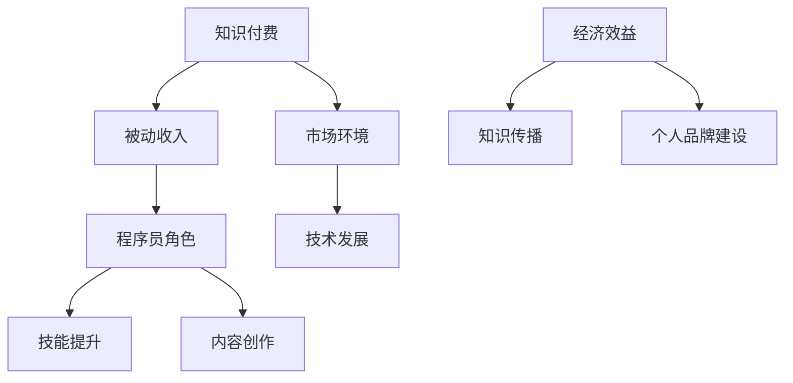

                 

# 《程序员如何利用知识付费实现被动收入》

## 摘要

在当前知识经济时代，知识付费成为了一个新兴的商业模式。对于程序员而言，通过知识付费实现被动收入不仅是一种新的职业发展路径，也是一种利用自身专业技能创造价值的有效方式。本文将深入探讨程序员如何利用知识付费平台和工具，通过技能提升和内容创作实现被动收入。文章将从核心概念、市场环境分析、技能提升策略、内容创作方法论、知识付费平台与工具应用、被动收入实现策略、案例分析与实践指南、法律风险与版权保护，以及未来趋势与持续发展等多个方面，提供系统性的指导和建议，帮助程序员在这个领域取得成功。

## 第一部分：基础知识与市场环境

### 1.1 核心概念与联系

#### 1.1.1 知识付费定义与价值

**知识付费**，是指用户为获取特定知识或技能而支付的费用。这种模式的出现，源于人们对知识、技能和经验的日益重视。对于程序员来说，知识付费不仅是一种获取收入的方式，更是一种知识共享和技能传播的手段。

知识付费的价值体现在以下几个方面：

1. **经济效益**：通过知识付费，程序员可以将其专业技能转化为收入，实现经济效益的最大化。
2. **知识传播**：知识付费有助于将程序员的实战经验和理论知识传播给更多人，提升行业整体水平。
3. **个人品牌建设**：通过高质量的知识分享，程序员可以树立个人品牌，提升市场竞争力。

#### 1.1.2 被动收入的概念

**被动收入**，是指在不直接参与日常运营的情况下，通过一次性的努力获得持续性的收入。对于程序员而言，被动收入通常来源于知识付费、版权收益、自动化项目等。

被动收入的优势包括：

1. **时间自由**：被动收入使程序员可以在不占用大量时间的情况下，仍然能够获得持续的收入。
2. **财务自由**：通过积累被动收入，程序员可以实现财务自由，有更多的资源投入到个人发展或其他投资中。
3. **风险分散**：被动收入可以帮助程序员分散工作风险，避免过度依赖单一收入来源。

#### 1.1.3 程序员在知识付费市场中的角色

程序员在知识付费市场中的角色主要包括：

1. **知识创造者**：程序员利用自身专业技能，创作出有价值的知识产品，如教程、课程、电子书等。
2. **知识传播者**：通过知识付费平台，程序员将知识传播给有需求的学习者，实现知识共享。
3. **市场引领者**：优秀的程序员可以通过自己的作品和影响力，引领市场趋势，推动行业进步。

### 1.2 市场环境分析

#### 1.2.1 知识付费市场现状

知识付费市场近年来呈现出快速增长的态势。根据相关数据显示，2019年全球知识付费市场规模已达到1.2万亿美元，预计到2025年将达到2.3万亿美元。

知识付费市场的增长主要受以下因素驱动：

1. **技术发展**：移动互联网、大数据、人工智能等技术的发展，为知识付费提供了更多可能性。
2. **用户需求**：随着生活节奏加快，人们对于高效获取知识和技能的需求日益增加。
3. **内容多样**：知识付费内容形式多样化，包括课程、书籍、视频、音频等多种形式，满足了不同用户的需求。

#### 1.2.2 市场环境对程序员的影响

市场环境的变化对程序员产生了深远的影响：

1. **职业发展**：知识付费为程序员提供了更多的职业发展机会，如知识博主、课程讲师、内容创作者等。
2. **收入增长**：通过知识付费，程序员可以实现收入的多样化，增加收入来源。
3. **个人品牌**：在知识付费市场中，优秀的内容创作者和讲师可以通过自己的作品和影响力，提升个人品牌。

#### 1.2.3 技术发展与知识付费

技术发展对知识付费产生了深远的影响：

1. **内容创作**：随着人工智能技术的发展，程序员可以利用AI工具辅助内容创作，提高效率。
2. **内容传播**：移动互联网和大数据技术的应用，使得知识付费内容可以更快速、更广泛地传播。
3. **用户体验**：技术进步提升了知识付费平台的服务质量，提供了更好的用户体验。

### 1.3 核心概念与联系 Mermaid 流程图

在知识付费与被动收入之间，程序员扮演着连接者与创造者的角色，通过不断提升自身技能和创作高质量的内容，实现个人价值和社会价值的双赢。技术发展则为这一过程提供了强大的支持，推动了知识付费市场的繁荣。

### 1.4 小结

本部分介绍了知识付费、被动收入以及程序员在知识付费市场中的角色。通过对核心概念的理解和联系的分析，我们可以看到，程序员可以通过知识付费实现被动收入，这不仅是一种经济效益的体现，也是知识共享和技能传播的重要方式。在接下来的章节中，我们将进一步探讨程序员如何提升技能、创作内容以及实现收入的策略。

### 1.5 下一步内容预告

在第二部分，我们将深入探讨程序员在提升技能和创作内容方面的策略，包括技术技能提升、软技能提升、个人品牌建设等内容创作原则和形式选择。同时，我们将分析不同知识付费平台的特点，介绍实用的工具和应用方法，帮助程序员更好地实现被动收入。

---

**[第二部分：技能提升与内容创作]**

### 2.1 技能提升策略

#### 2.1.1 技术技能提升

作为一名程序员，技术技能的提升是获取高质量知识产品、实现被动收入的基础。以下是一些具体的技术提升策略：

**学习路径规划**

1. **确定学习目标**：明确自己的技术方向和目标，例如前端开发、后端开发、人工智能等。
2. **学习资源选择**：利用在线课程、技术博客、官方文档等资源进行系统学习。
3. **实践项目**：通过实际项目锻炼自己的技术能力，例如参与开源项目或自己发起项目。

**技术热点追踪**

1. **关注技术趋势**：通过订阅技术社区、关注技术博客等途径，了解当前技术热点。
2. **参与技术交流**：参加技术会议、线上讨论组等活动，与他人交流技术心得。
3. **实践新技术**：及时尝试使用新兴技术，如区块链、云计算、大数据等。

#### 2.1.2 软技能提升

**沟通表达能力**

1. **写作能力**：通过撰写技术博客、编写技术文档等方式，提高写作能力。
2. **演讲能力**：参加演讲比赛、技术分享会等活动，锻炼自己的演讲技巧。
3. **沟通技巧**：通过阅读相关书籍、参加沟通技巧培训等方式，提升沟通能力。

**项目管理能力**

1. **项目计划**：制定详细的项目计划，包括时间表、任务分配等。
2. **团队协作**：学会利用团队协作工具，如Slack、Trello等，提高团队工作效率。
3. **风险管理**：预测并应对项目中可能出现的问题，确保项目顺利进行。

#### 2.1.3 个人品牌建设

**个人知识体系构建**

1. **知识积累**：通过不断学习和实践，积累丰富的知识储备。
2. **知识整理**：将所学知识系统化、结构化，形成自己的知识体系。
3. **知识分享**：通过博客、书籍、课程等形式，分享自己的知识，提升影响力。

**个人品牌宣传策略**

1. **内容营销**：通过高质量的内容创作，吸引潜在粉丝和客户。
2. **社交媒体运营**：利用社交媒体平台，如LinkedIn、Twitter等，建立个人品牌形象。
3. **网络活动参与**：积极参与技术社区和线上活动，扩大个人影响力。

### 2.2 内容创作方法论

#### 2.2.1 内容创作原则

**内容价值判断**

1. **用户需求**：创作内容应关注用户需求，解决实际问题。
2. **原创性**：避免抄袭和复制，确保内容原创性。
3. **专业性**：内容要具备一定的专业性，体现出创作者的技术深度。

**内容创作流程**

1. **选题策划**：确定创作主题，明确内容方向。
2. **资料收集**：搜集相关资料，确保内容的准确性。
3. **内容编写**：撰写初稿，确保逻辑清晰、条理分明。
4. **内容优化**：修改和完善内容，提升可读性和用户体验。

#### 2.2.2 内容形式选择

**文字内容创作**

1. **技术博客**：撰写技术博客，分享技术心得和解决方案。
2. **技术文档**：编写技术文档，详细描述项目实现过程和关键技术。
3. **电子书**：创作电子书，系统阐述某一技术领域或知识体系。

**视频内容创作**

1. **教程视频**：录制教程视频，帮助用户快速掌握技术技能。
2. **讲解视频**：制作技术讲解视频，深入剖析技术原理和应用。
3. **直播分享**：通过直播形式，与观众互动，分享技术经验和心得。

**音频内容创作**

1. **播客**：制作技术播客，分享技术见解和行业动态。
2. **音频课程**：录制音频课程，方便用户在碎片时间学习。
3. **访谈节目**：邀请业内专家进行访谈，探讨技术趋势和行业发展。

#### 2.2.3 内容营销策略

**内容推广渠道**

1. **社交媒体**：利用微博、微信公众号等社交媒体平台，进行内容推广。
2. **技术社区**：在CSDN、GitHub等技术社区发布内容，吸引同行业关注。
3. **搜索引擎**：优化内容SEO，提高在搜索引擎中的排名。

**社交媒体运营技巧**

1. **内容发布**：制定内容发布计划，保持持续更新。
2. **互动交流**：与读者互动，解答疑问，提升用户参与度。
3. **活动策划**：举办线上活动，如问答、投票等，增加用户粘性。

### 2.3 小结

本部分介绍了程序员在技能提升和内容创作方面的策略。通过提升技术技能、软技能，构建个人知识体系，程序员可以创作出高质量的内容，实现被动收入。在接下来的章节中，我们将进一步探讨知识付费平台和工具的应用，以及如何通过这些平台实现被动收入的策略。

### 2.4 下一步内容预告

在第三部分，我们将详细介绍知识付费平台和工具的应用。包括主流知识付费平台的介绍、知识付费工具的选择和使用方法。同时，我们将探讨如何利用这些平台和工具，实现被动收入的策略。这将帮助程序员更好地把握市场机会，实现持续收入增长。

---

**[第三部分：知识付费平台与工具]**

### 3.1 知识付费平台介绍

#### 3.1.1 主流知识付费平台

目前市场上主流的知识付费平台主要包括以下几个：

1. **平台A（如Udemy、Coursera）**
   - **特点**：提供多样化的在线课程，涵盖广泛的技术领域，包括编程语言、人工智能、大数据等。
   - **优势**：课程内容质量较高，用户群体广泛，有利于知识传播和品牌建立。

2. **平台B（如网易云课堂、慕课网）**
   - **特点**：国内领先的在线教育平台，课程内容以实用为主，适合国内开发者学习。
   - **优势**：课程价格相对亲民，课程形式多样，包括视频教程、电子书等。

3. **平台C（如知乎Live、分答）**
   - **特点**：以问答和讲座形式为主，用户可以付费获取专家的知识和经验。
   - **优势**：内容形式灵活，互动性强，有利于建立专家形象，提高用户粘性。

#### 3.1.2 平台特点与优势

**用户群体分析**

1. **平台A**：用户群体主要为有一定技术基础的程序员和IT从业者，追求专业性和系统性的学习。
2. **平台B**：用户群体广泛，包括初级程序员、在校大学生、职业转型者等，需求多样。
3. **平台C**：用户群体以知识 seekers 为主，追求快速获取知识和解答疑问。

**平台功能介绍**

1. **课程发布与管理**：平台提供课程发布、管理和推广工具，帮助内容创作者高效管理课程。
2. **用户互动**：平台提供论坛、问答、直播等功能，促进用户互动，提高用户满意度。
3. **数据分析**：平台提供详细的数据分析工具，帮助内容创作者了解用户需求，优化内容策略。

### 3.2 知识付费工具应用

#### 3.2.1 工具选择与使用

**教学工具**

1. **在线白板**：如Miro、Mural，用于在线教学过程中的互动和演示。
2. **视频编辑工具**：如Camtasia、Adobe Premiere，用于制作高质量的视频教程。
3. **代码编辑器**：如Visual Studio Code、Atom，用于编写和调试代码。

**内容管理工具**

1. **内容管理系统**：如WordPress、Joomla，用于管理博客和电子书内容。
2. **课程管理系统**：如Moodle、Canvas，用于管理在线课程。
3. **视频点播系统**：如Vimeo、Wistia，用于上传和发布视频教程。

**营销推广工具**

1. **社交媒体管理工具**：如Hootsuite、Buffer，用于管理和推广内容。
2. **邮件营销工具**：如Mailchimp、SendinBlue，用于发送邮件通知和营销邮件。
3. **SEO工具**：如Ahrefs、SEMrush，用于优化内容和提高搜索引擎排名。

#### 3.2.2 工具集成与优化

**工具集成方案**

1. **自动化集成**：利用API或Webhook，实现不同工具之间的数据同步和功能集成。
2. **集成插件**：使用各类插件和扩展，提升工具的可用性和用户体验。

**工具使用技巧**

1. **学习曲线**：了解工具的基本功能和使用方法，降低学习成本。
2. **个性化设置**：根据个人需求和习惯，对工具进行个性化设置。
3. **持续优化**：定期更新工具，确保其稳定性和安全性。

#### 3.2.3 工具优化建议

1. **功能扩展**：根据用户反馈，不断优化和扩展工具功能。
2. **用户体验**：注重用户体验，简化操作流程，提升用户满意度。
3. **技术支持**：提供完善的客户服务和技术支持，解决用户使用过程中的问题。

### 3.3 小结

本部分介绍了知识付费平台和工具的应用，包括主流知识付费平台的特点与优势，以及工具的选择和使用方法。通过合理利用这些平台和工具，程序员可以更好地实现被动收入。在接下来的章节中，我们将探讨如何通过被动收入实现策略，帮助程序员实现财务自由。

### 3.4 下一步内容预告

在第四部分，我们将深入探讨程序员的被动收入实现策略，包括内容付费模式、广告收入模式以及知识变现路径。同时，我们将分析如何通过内容持续更新和优化、用户互动与反馈、市场拓展与多元化等方式，实现收入增长。这将帮助程序员更好地把握市场机会，实现持续收入增长。

---

**[第四部分：被动收入实现策略]**

### 4.1 收入来源分析

#### 4.1.1 内容付费模式

**课程售卖**

1. **课程内容**：程序员可以根据自己的专业领域，创作并售卖课程。课程内容可以包括编程语言学习、算法实战、项目实战等。
2. **课程定价**：定价策略要结合课程质量、市场需求以及竞争对手定价等因素综合考虑。
3. **销售渠道**：通过主流的知识付费平台，如Udemy、Coursera、网易云课堂等，进行课程售卖。

**电子书销售**

1. **电子书内容**：程序员可以撰写关于技术领域的电子书，内容可以涵盖技术原理、实战技巧等。
2. **定价策略**：电子书定价应根据内容质量和目标读者群体来确定，以获得最大化的收益。
3. **销售渠道**：通过在线书店，如亚马逊Kindle、京东电子书城等，进行电子书销售。

**视频教程销售**

1. **视频教程内容**：程序员可以录制技术领域的视频教程，内容可以包括编程语言学习、项目实战等。
2. **定价策略**：视频教程定价应根据教程质量、时长和目标读者群体来确定。
3. **销售渠道**：通过视频分享平台，如YouTube、Bilibili等，进行视频教程销售。

#### 4.1.2 广告收入模式

**广告投放策略**

1. **广告类型**：程序员可以选择展示广告、横幅广告、推荐广告等类型，以适应不同平台和用户需求。
2. **广告位置**：合理选择广告位置，提高广告的点击率和转化率。
3. **广告内容**：广告内容要与程序员的课程、电子书或视频教程相关，以提高用户接受度。

**广告收入案例分析**

1. **案例一**：某程序员通过在博客中投放广告，每月获得约1000美元的收入。其广告内容主要针对编程语言学习课程。
2. **案例二**：某程序员在视频教程中投放横幅广告，每月获得约2000美元的收入。其广告内容主要针对软件开发工具和资源推荐。

#### 4.1.3 知识变现路径

**个人咨询服务**

1. **服务内容**：程序员可以提供技术咨询服务，如代码审查、项目咨询、技术解决方案等。
2. **服务定价**：服务定价应根据服务难度、市场需求以及个人品牌影响力来确定。
3. **服务渠道**：通过个人网站、社交媒体平台、知识付费平台等渠道，为客户提供咨询服务。

**订阅制服务**

1. **服务内容**：程序员可以提供定期更新的技术内容，如每周的技术分享、每月的深度解析等。
2. **服务定价**：订阅制服务的定价可以采用按月、按季度或按年的模式。
3. **服务渠道**：通过知识付费平台、个人网站等渠道，为客户提供订阅制服务。

**知识共享社区**

1. **社区内容**：程序员可以创建一个技术交流社区，分享技术心得、解决方案、项目进展等。
2. **社区运营**：通过社区运营，吸引更多技术爱好者加入，形成良好的社区氛围。
3. **社区收益**：社区收益可以通过广告收入、会员费用、活动收入等方式实现。

### 4.2 收入增长策略

#### 4.2.1 内容持续更新与优化

1. **内容更新**：定期更新内容，保持内容的新鲜度和相关性，吸引更多用户。
2. **内容优化**：根据用户反馈，不断优化内容质量，提升用户体验。

**用户互动与反馈**

1. **用户互动**：通过社交媒体、评论区、社区等渠道，与用户保持互动，了解用户需求。
2. **用户反馈**：重视用户反馈，及时回应用户问题，改进内容和服务。

**市场拓展与多元化**

1. **市场调研**：定期进行市场调研，了解行业动态和用户需求，调整战略。
2. **产品线拓展**：根据市场需求，拓展新的产品线，如开发新课程、新电子书、新视频教程等。
3. **多元化收入**：通过多元化收入来源，降低收入风险，实现收入稳定增长。

### 4.3 小结

本部分分析了程序员的被动收入来源，包括内容付费模式、广告收入模式以及知识变现路径。同时，提出了内容持续更新与优化、用户互动与反馈、市场拓展与多元化等收入增长策略。通过这些策略，程序员可以更好地实现被动收入，实现财务自由。

### 4.4 下一步内容预告

在第五部分，我们将通过成功案例分享，探讨程序员如何利用知识付费实现被动收入。同时，我们将提供实践指南与建议，帮助程序员顺利起步和持续发展。此外，我们还将讨论法律风险与版权保护，确保程序员在知识付费过程中的合法权益。这些内容将帮助程序员更好地理解和应用被动收入策略。

---

**[第五部分：案例分析与实践指南]**

### 5.1 成功案例分享

#### 5.1.1 案例一：程序员A的付费课程之路

程序员A是一名有多年工作经验的前端开发专家。他在2018年开始创作并售卖前端开发课程，通过以下策略取得了成功：

1. **课程定位**：程序员A选择了自己最擅长的前端开发领域，针对初级程序员和有志于转行的人士，提供从基础知识到高级实战的课程。

2. **内容质量**：程序员A注重课程内容的质量，不仅涵盖基础理论，还提供了大量实战项目，使学员能够迅速提升技能。

3. **推广策略**：程序员A通过社交媒体、技术社区和博客等渠道进行课程推广，同时与其他前端开发专家合作，扩大影响力。

4. **用户反馈**：程序员A积极回应用户反馈，不断优化课程内容，提高用户满意度。

5. **收入增长**：随着时间的推移，程序员A的课程销量逐渐增加，每月通过课程销售获得的收入稳定在5000美元以上。

#### 5.1.2 案例二：程序员B的电子书创作经验

程序员B是一位热衷于编写技术书籍的专家。他在2020年出版了一本关于Python数据分析的电子书，通过以下策略取得了成功：

1. **内容创作**：程序员B利用自己丰富的实战经验，编写了深入浅出的Python数据分析教程，吸引了大量初学者和进阶者的关注。

2. **定价策略**：程序员B采取了合理的定价策略，使得电子书价格亲民，易于被用户接受。

3. **推广渠道**：程序员B通过个人博客、社交媒体和在线书店等渠道进行电子书推广，吸引了大量潜在读者。

4. **持续更新**：程序员B定期更新电子书内容，根据用户需求和最新技术动态，添加新章节和案例。

5. **收入来源**：程序员B的电子书在短时间内售出了数千本，每月通过电子书销售获得的收入稳定在2000美元以上。

#### 5.1.3 案例三：程序员C的咨询服务案例

程序员C是一位在人工智能领域有深厚积累的专家。他通过提供咨询服务，帮助企业和个人解决技术难题，以下是他取得成功的一些关键因素：

1. **专业能力**：程序员C在人工智能领域有丰富的经验和深厚的知识储备，能够提供高质量的技术咨询服务。

2. **客户关系**：程序员C注重与客户的沟通，了解客户的需求和痛点，提供个性化的解决方案。

3. **服务定价**：程序员C根据服务难度和客户预算，合理定价，确保客户能够承担。

4. **口碑传播**：程序员C通过高质量的服务，赢得了客户的信任和好评，客户口口相传，为他带来了更多的咨询机会。

5. **收入增长**：随着客户数量的增加，程序员C的月收入稳定在10000美元以上。

### 5.2 实践指南与建议

#### 5.2.1 起步指南

对于初入知识付费领域的程序员，以下是一些起步指南和建议：

1. **明确目标**：确定自己的目标领域和受众群体，确保内容创作具有针对性。

2. **内容创作**：创作高质量的内容是成功的关键，要注重内容的实用性、专业性和趣味性。

3. **选择平台**：根据目标受众和内容特点，选择合适的知识付费平台进行发布。

4. **推广营销**：通过社交媒体、博客、论坛等渠道进行内容推广，吸引潜在用户。

5. **用户互动**：与用户保持互动，了解用户需求，不断优化内容和服务。

#### 5.2.2 运营优化

1. **数据分析**：利用数据分析工具，了解用户行为和内容表现，优化内容策略。

2. **用户反馈**：重视用户反馈，及时调整内容方向和服务策略。

3. **内容多样化**：尝试多种内容形式，如视频、音频、图文等，满足不同用户的需求。

4. **持续更新**：定期更新内容，保持内容的新鲜度和相关性。

5. **品牌建设**：通过持续的内容创作和用户互动，建立个人品牌，提升市场竞争力。

#### 5.2.3 案例解读与策略借鉴

1. **案例一**：程序员A的成功经验表明，专业领域的选择和高质量的内容创作是关键。同时，积极推广和与用户互动也是成功的重要因素。

2. **案例二**：程序员B的电子书创作经验说明，内容的专业性和实用性对于吸引读者至关重要。合理的定价策略和有效的推广渠道也是成功的关键。

3. **案例三**：程序员C的咨询服务案例显示，专业能力和良好的客户关系是提供高质量服务的基础。口碑传播和持续的服务优化是收入稳定增长的重要保障。

### 5.3 小结

本部分通过成功案例分享，探讨了程序员如何通过知识付费实现被动收入。同时，提供了实践指南与建议，帮助程序员顺利起步和持续发展。通过借鉴成功经验，程序员可以更好地把握市场机会，实现收入增长。

### 5.4 下一步内容预告

在第六部分，我们将讨论法律风险与版权保护，确保程序员在知识付费过程中的合法权益。此外，我们还将展望未来趋势与持续发展，探讨技术发展对知识付费的影响以及程序员的长期规划。这些内容将为程序员提供更全面的知识和策略，助力他们在知识付费领域取得更大的成功。

---

**[第六部分：法律风险与版权保护]**

### 6.1 法律知识普及

#### 6.1.1 知识产权保护

**知识产权**是指人们就其智力劳动成果所依法享有的专有权利，通常包括著作权、专利权、商标权和商业秘密等。对于程序员而言，知识产权保护尤为重要，因为他们的劳动成果往往直接体现为代码、文档和教程等。

**知识产权基本概念**

1. **著作权**：指作者对其创作作品享有的权利，包括发表权、署名权、修改权、保护作品完整权等。
2. **专利权**：指发明人或设计人对其发明或设计的创新成果享有的权利，通常包括发明专利、实用新型专利和外观设计专利。
3. **商标权**：指商标注册人对其注册商标享有的专有使用权。
4. **商业秘密**：指不为公众所知悉、具有商业价值并经权利人采取保密措施的技术信息和经营信息。

**版权、专利、商标的区别**

1. **版权**：主要保护文学、艺术和科学作品的作者在作品中的精神利益和物质利益。
2. **专利**：主要保护发明创造的技术方案，具有新颖性、创造性和实用性的特点。
3. **商标**：主要保护商业标识，帮助消费者识别商品或服务的来源。

**合规经营**

1. **合法经营**：程序员在进行知识付费活动时，应确保其行为符合相关法律法规，如《著作权法》、《专利法》和《商标法》等。
2. **合同签订**：在合作或交易过程中，应签订合法有效的合同，明确各方权利和义务，避免法律纠纷。

**法律风险防范措施**

1. **版权登记**：对作品进行版权登记，取得法律上的确权证据。
2. **使用许可**：在使用他人作品时，应获得合法授权或支付相应费用。
3. **合同审查**：在签订合同前，应仔细审查合同条款，确保自身权益不受损害。
4. **合规培训**：定期参加知识产权培训，提高法律意识和合规经营能力。

### 6.2 版权保护策略

**内容版权管理**

1. **版权确认**：在创作内容前，应明确内容的版权归属，确保创作过程中的权益保护。
2. **版权声明**：在发布内容时，应明确声明内容的版权信息，包括作者姓名、版权声明等。
3. **版权维权**：在发现侵权行为时，应及时采取维权措施，如发送侵权通知、申请法律援助等。

**版权协议与合同**

1. **版权授权协议**：在进行合作或授权时，应签订版权授权协议，明确授权范围和期限。
2. **合同范本**：使用专业合同范本，确保合同条款的合法性和完整性。
3. **注意事项**：在签订合同时，应注意以下事项：
   - 明确合同主体和授权内容；
   - 规定授权期限和授权范围；
   - 约定违约责任和争议解决方式。

### 6.3 小结

本部分介绍了法律知识普及和版权保护策略，帮助程序员在知识付费过程中防范法律风险。通过了解知识产权的基本概念和区别，程序员可以更好地保护自己的权益。同时，通过采取版权保护措施和签订合法合同，程序员可以确保自己在知识付费领域的合法权益。

### 6.4 下一步内容预告

在第七部分，我们将探讨未来趋势与持续发展，包括技术发展对知识付费的影响、市场变化与应对策略、个人品牌长期规划以及知识体系持续更新。这些内容将为程序员提供前瞻性的视野和持续发展的动力，助力他们在知识付费领域取得更大的成功。

---

**[第七部分：未来趋势与持续发展]**

### 7.1 行业趋势展望

#### 7.1.1 技术发展对知识付费的影响

技术发展对知识付费的影响是深远且多层次的。以下是一些关键趋势：

**人工智能与内容创作**

人工智能（AI）技术的进步正在改变内容创作的方式。AI工具可以帮助程序员自动生成代码、编写文档、创作课程内容等，提高工作效率。同时，AI驱动的个性化推荐系统可以根据用户的学习历史和偏好，提供定制化的学习路径，提升用户体验。

**区块链与知识付费**

区块链技术提供了去中心化的数据存储和传输方式，有助于确保知识付费交易的安全性和透明度。通过智能合约，程序员可以自动执行交易合同，减少中介成本，提高交易效率。此外，区块链还可以用于记录知识付费的版权信息，防止侵权行为。

**云计算与知识付费**

云计算技术为知识付费平台提供了强大的计算和存储能力，使得大规模的内容存储和分发变得更加容易。程序员可以利用云计算资源进行实时数据分析，了解用户行为和需求，从而优化内容策略。同时，云计算还降低了内容创作者的运营成本，使得更多人能够参与到知识付费市场中。

**5G与知识付费**

5G技术的普及将大幅提升网络速度和稳定性，为知识付费内容的高效传输提供了保障。程序员可以利用5G网络进行实时直播、互动教学，提供更丰富的学习体验。此外，5G还将促进线上线下教育的融合，满足不同用户的学习需求。

#### 7.1.2 市场变化与应对策略

知识付费市场的变化主要体现在用户需求多样化、内容形式多样化以及竞争加剧等方面。以下是一些应对策略：

**用户需求多样化**

1. **细分市场**：针对不同用户群体的需求，提供多样化的内容和服务，如专业课程、职业培训、个性化辅导等。
2. **个性化推荐**：利用AI和大数据技术，为用户推荐最相关的学习资源，提升用户满意度。

**内容形式多样化**

1. **多媒体内容**：结合文字、图片、视频、音频等多种形式，提供丰富多样的学习资源，满足不同用户的学习习惯。
2. **互动性内容**：增加互动环节，如在线讨论、问答、实验操作等，提高用户的参与度和学习效果。

**竞争加剧**

1. **差异化竞争**：通过提供高质量的内容和服务，树立个人品牌，形成差异化竞争优势。
2. **持续创新**：不断更新内容，引入新技术和新方法，保持内容的竞争力。

### 7.2 持续发展策略

#### 7.2.1 个人品牌长期规划

1. **知识积累**：持续学习和积累专业知识，不断提升自己的技能和知识储备。
2. **内容创作**：定期创作高质量的内容，树立个人品牌形象。
3. **用户互动**：与用户保持互动，了解用户需求，提升用户满意度。
4. **专业认证**：获取相关领域的专业认证，增强个人权威性和可信度。

#### 7.2.2 品牌影响力提升

1. **社交媒体运营**：通过社交媒体平台，如微博、微信、LinkedIn等，扩大个人品牌的影响力。
2. **技术社区参与**：积极参与技术社区和线上活动，提升个人知名度。
3. **内容营销**：通过高质量的内容创作和营销策略，吸引更多的关注和粉丝。
4. **合作与交流**：与其他专家和机构合作，共同提升品牌影响力。

#### 7.2.3 知识体系持续更新

1. **学习与成长**：持续关注行业动态和技术趋势，不断更新自己的知识体系。
2. **课程迭代**：根据用户反馈和市场变化，定期更新和优化课程内容。
3. **实验与实践**：通过实际项目和实践，不断验证和改进自己的知识和技能。
4. **知识共享**：通过博客、书籍、讲座等形式，分享自己的知识和经验，提升行业整体水平。

### 7.3 小结

本部分探讨了未来趋势与持续发展，分析了技术发展对知识付费的影响以及市场变化对程序员的挑战。通过个人品牌长期规划、品牌影响力提升和知识体系持续更新，程序员可以在知识付费领域实现持续发展。这些策略将为程序员提供前瞻性的视野和持续发展的动力。

### 7.4 下一步内容预告

在附录部分，我们将提供知识付费平台与工具资源汇总，包括主流知识付费平台和工具的详细介绍。这些资源将帮助程序员更好地选择和使用知识付费工具，实现被动收入的策略。通过这些资源，程序员可以更高效地开展知识付费活动，实现个人价值和财务自由的完美结合。

---

**[附录 A：知识付费平台与工具资源汇总]**

### A.1 主流知识付费平台

**平台A（如Udemy、Coursera）**

- **资源介绍**：Udemy和Coursera是全球知名的知识付费平台，提供多样化的在线课程，涵盖编程语言、人工智能、大数据等热门领域。
- **优势**：课程内容丰富，用户群体广泛，有助于知识传播和品牌建设。
- **使用指南**：可以通过官方网站注册账号，选择合适的课程进行学习，并参与课程讨论和评估。

**平台B（如网易云课堂、慕课网）**

- **资源介绍**：网易云课堂和慕课网是国内领先的知识付费平台，提供实用为主的技术课程，适合国内开发者学习。
- **优势**：课程价格亲民，形式多样，包括视频教程、电子书等。
- **使用指南**：可以通过官方网站或移动应用进行课程购买和学习，并参与社区讨论和交流。

**平台C（如知乎Live、分答）**

- **资源介绍**：知乎Live和分答以问答和讲座形式为主，用户可以付费获取专家的知识和经验。
- **优势**：内容形式灵活，互动性强，有利于建立专家形象，提高用户粘性。
- **使用指南**：可以通过知乎App或官方网站进入相应板块，参与讲座和问答，并关注感兴趣的话题和专家。

### A.2 知识付费工具推荐

**工具A（如Miro、Mural）**

- **使用指南**：Miro和Mural是在线白板工具，适合在线教学过程中的互动和演示。
- **优势**：可视化功能强大，支持多种元素和工具，提高教学效果。
- **适用场景**：课程讲解、项目讨论、团队协作等。

**工具B（如Camtasia、Adobe Premiere）**

- **使用指南**：Camtasia和Adobe Premiere是视频编辑工具，适合制作高质量的视频教程。
- **优势**：功能全面，易于操作，适合初学者和专业人士。
- **适用场景**：视频教程制作、演讲录制、视频剪辑等。

**工具C（如Visual Studio Code、Atom）**

- **使用指南**：Visual Studio Code和Atom是代码编辑器，适合编写和调试代码。
- **优势**：支持多种编程语言，插件丰富，提高开发效率。
- **适用场景**：编程学习、项目开发、代码调试等。

### A.3 小结

本部分汇总了主流知识付费平台和工具的详细介绍，包括平台的特点、优势和使用指南。程序员可以根据自己的需求和目标，选择合适的平台和工具，开展知识付费活动。通过这些资源，程序员可以更高效地实现被动收入，提升个人价值和市场竞争力。

---

**[结语]**

本文从多个角度详细探讨了程序员如何利用知识付费实现被动收入。通过提升技能、创作内容、选择合适的平台和工具、制定收入增长策略，程序员可以在知识付费领域取得成功。同时，本文还介绍了法律风险与版权保护的重要性，以及未来趋势和持续发展策略。希望本文能为程序员提供有价值的指导和启示，助力他们在知识付费领域实现财务自由和个人成长。

### 作者信息

**作者：AI天才研究院/AI Genius Institute & 禅与计算机程序设计艺术 /Zen And The Art of Computer Programming** 

在此，我代表AI天才研究院和《禅与计算机程序设计艺术》团队，感谢读者对本文的关注和支持。我们致力于推动人工智能和计算机科学的发展，为程序员提供高质量的知识和资源。希望本文能够帮助您在知识付费领域取得成功，实现个人价值和职业发展。如果您有任何疑问或建议，欢迎随时联系我们。

---

**[附录 B：常见问题解答]**

**Q1：知识付费适合所有程序员吗？**

A1：知识付费并不是适合所有程序员的，但它为那些具备以下特点的程序员提供了良好的机会：

- **专业技能突出**：在特定领域有深厚的专业知识，能够创作高质量的内容。
- **良好的沟通能力**：能够清晰、有效地传达技术知识和经验。
- **持续学习能力**：能够不断学习新技术，更新自己的知识体系。

**Q2：如何确保内容质量？**

A2：确保内容质量的关键在于以下几点：

- **深入研究**：在创作内容前，要对相关技术进行深入研究，确保内容的准确性。
- **用户反馈**：及时收集用户反馈，并根据反馈调整和优化内容。
- **合作与交流**：与其他专家和同行进行合作与交流，互相学习和借鉴。

**Q3：如何选择知识付费平台？**

A3：选择知识付费平台时，应考虑以下因素：

- **课程种类和数量**：选择课程种类丰富、数量众多的平台，以满足不同用户的需求。
- **用户评价**：查看平台用户评价，了解平台的服务质量和用户体验。
- **推广支持**：选择提供推广支持的平台，帮助内容创作者扩大影响力。

**Q4：如何维护个人品牌？**

A4：维护个人品牌的方法包括：

- **持续创作**：保持高质量的内容输出，树立专业形象。
- **社交媒体运营**：在社交媒体上积极互动，扩大个人影响力。
- **参与社区活动**：参与技术社区和行业活动，提高知名度。

**Q5：如何平衡知识付费与日常工作？**

A5：平衡知识付费与日常工作的方法包括：

- **时间管理**：合理安排时间，确保有足够的时间进行知识付费活动。
- **项目选择**：选择与自己工作内容相关、能够互补的知识付费项目。
- **团队协作**：在团队中寻找合作伙伴，共同分担工作和责任。

通过以上方法，程序员可以更好地在知识付费领域取得成功，同时保持工作与生活的平衡。

