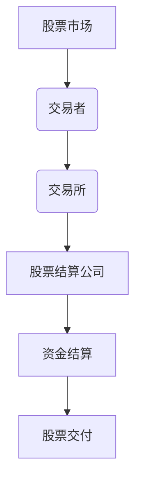
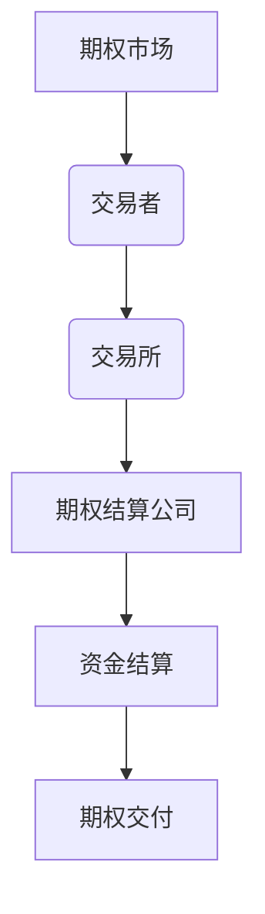
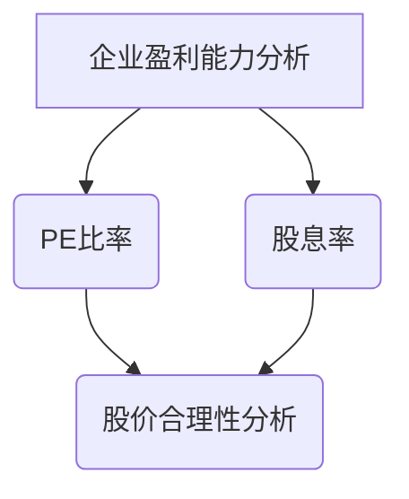
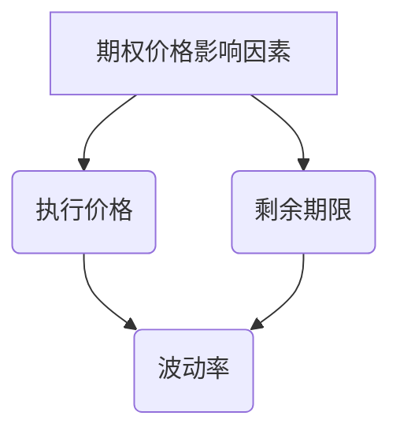

                 

# 《程序员如何处理股票和期权》

## 关键词
股票交易、期权交易、交易策略、风险管理、技术分析、算法交易、Black-Scholes模型、编程工具、数据分析。

## 摘要
本文旨在为程序员提供关于股票和期权交易的全面指导。我们将从基本概念开始，逐步深入探讨股票和期权的市场结构、交易流程、估值方法，以及实际操作中的交易策略和风险管理。通过案例分析，我们将展示如何将技术分析和算法应用于实战，并提供详细的代码实现和解读。最后，我们将总结实战经验，并推荐相关的编程工具和资源。

### 《程序员如何处理股票和期权》目录大纲

#### 第一部分：股票和期权基本概念

**第1章：股票和期权的概述**
1.1 股票的基本概念
1.2 期权的基本概念
1.3 股票和期权的联系与区别

**第2章：股票市场基础知识**
2.1 股票市场的结构
2.2 股票交易的基本流程
2.3 股票估值方法

**第3章：期权市场基础知识**
3.1 期权市场的结构
3.2 期权交易的基本流程
3.3 期权估值方法

#### 第二部分：股票和期权策略

**第4章：股票交易策略**
4.1 长期投资策略
4.2 短期交易策略
4.3 股票组合策略

**第5章：期权交易策略**
5.1 买入策略
5.2 卖出策略
5.3 复合策略

**第6章：风险管理**
6.1 股票风险管理
6.2 期权风险管理
6.3 风险管理策略

#### 第三部分：股票和期权案例分析

**第7章：股票投资案例分析**
7.1 案例一：股票基本面分析
7.2 案例二：股票技术分析
7.3 案例三：股票组合投资

**第8章：期权投资案例分析**
8.1 案例一：期权交易策略应用
8.2 案例二：期权风险管理应用
8.3 案例三：期权组合策略应用

#### 第四部分：实战指导

**第9章：实战准备**
9.1 股票交易环境搭建
9.2 期权交易环境搭建
9.3 股票和期权交易工具使用

**第10章：实战案例解析**
10.1 实战一：股票交易案例分析
10.2 实战二：期权交易案例分析
10.3 实战三：股票和期权组合交易案例分析

**第11章：实战总结与拓展**
11.1 股票交易实战总结
11.2 期权交易实战总结
11.3 股票和期权组合交易实战总结

#### 附录：股票和期权相关资源

**附录 A：股票交易相关资源**
A.1 股票市场主要指标
A.2 股票交易相关网站

**附录 B：期权交易相关资源**
B.1 期权市场主要指标
B.2 期权交易相关网站

**附录 C：编程工具与资源**
C.1 Python编程工具
C.2 Python在股票和期权交易中的应用
C.3 数据分析工具

**附录 D：参考文献**
D.1 股票交易相关书籍
D.2 期权交易相关书籍
D.3 编程相关书籍

---

**核心概念与联系**

在进行股票和期权交易之前，理解其核心概念及其相互关系至关重要。以下是股票市场交易流程和期权交易流程的Mermaid流程图，以及股票估值方法和期权估值方法的比较。

**股票市场交易流程**：

**期权交易流程**：

**股票估值方法**：

**期权估值方法**：

在股票市场中，交易者通过交易所进行股票买卖，股票结算公司负责资金的结算和股票的交付。在期权市场中，交易者通过交易所进行期权买卖，期权结算公司负责资金的结算和期权的交付。股票的估值方法主要关注企业的盈利能力和股价的合理性，而期权的估值方法则依赖于执行价格、剩余期限和波动率等因素。

接下来，我们将详细探讨股票和期权的基本概念，以及其在市场中的运作方式。

### 第1章：股票和期权的概述

#### 1.1 股票的基本概念

股票是一种证券，代表公司所有权的一部分。每支股票都代表公司的股份，股票的持有者被称为股东。股东有权参加公司的股东大会，并在某些情况下享有投票权。股票的价格由市场供求关系决定，受到公司业绩、行业趋势、宏观经济环境等多种因素的影响。

**股票的类型**：

1. **普通股**：最常见的股票类型，股东享有投票权和分红权。
2. **优先股**：优先于普通股股东分红，但通常没有投票权。
3. **认股权证**：赋予持有者在特定时间内以特定价格购买股票的权利。

**股票市场的结构**：

1. **交易所**：如纽约证券交易所（NYSE）和纳斯达克（NASDAQ），是股票交易的主要场所。
2. **场外交易市场**（OTC）：包括纳斯达克和纽交所之外的交易市场。
3. **证券交易所**：负责股票交易的监管和清算。

**股票交易的基本流程**：

1. **开户**：投资者在证券公司开设账户。
2. **下单**：投资者通过账户下达买卖指令。
3. **交易执行**：交易指令在交易所执行。
4. **结算**：交易完成后，资金和股票进行结算。

#### 1.2 期权的基本概念

期权是一种金融衍生品，赋予持有者在特定时间内以特定价格买入或卖出某种资产（如股票）的权利。期权分为两种主要类型：看涨期权（Call）和看跌期权（Put）。

**看涨期权**：购买者在未来某个时间以固定价格购买股票的权利。如果股票价格高于执行价格，购买者可以行使期权获利。

**看跌期权**：购买者在未来某个时间以固定价格出售股票的权利。如果股票价格低于执行价格，购买者可以行使期权获利。

**期权的要素**：

1. **执行价格**：期权规定的股票价格。
2. **到期日**：期权有效的最后日期。
3. **波动率**：股票价格变动的程度。
4. **权利金**：购买期权的价格。

**期权市场的结构**：

1. **交易所**：期权交易的主要场所，如芝加哥期权交易所（CBOE）。
2. **电子交易平台**：提供期权买卖的电子系统。
3. **结算公司**：负责期权交易的结算和担保。

**期权交易的基本流程**：

1. **开户**：投资者在证券公司开设期权账户。
2. **下单**：投资者通过账户下达期权买卖指令。
3. **交易执行**：交易指令在交易所执行。
4. **结算**：交易完成后，权利金和期权进行结算。

#### 1.3 股票和期权的联系与区别

股票和期权虽然都是金融市场中的重要组成部分，但它们在性质、用途和交易方式上有所不同。

**联系**：

1. **共同点**：股票和期权都是金融工具，可以用来进行投资和风险管理。
2. **关联性**：期权交易的标的资产通常是股票，期权价格与股票价格密切相关。

**区别**：

1. **本质差异**：股票是所有权凭证，而期权是权利凭证。
2. **风险和收益**：股票投资风险较高，但潜在收益也较大；期权投资风险较低，但收益有限。
3. **交易策略**：股票交易策略多样，包括长期持有和短期交易；期权交易策略更多样，包括买入、卖出和组合策略。

通过以上对股票和期权基本概念的了解，我们可以更好地理解它们在金融市场中的作用和运作机制。接下来，我们将深入探讨股票市场的基础知识，包括股票市场的结构、交易流程和估值方法。

### 第2章：股票市场基础知识

#### 2.1 股票市场的结构

股票市场是由多个组成部分构成的复杂系统，包括交易所、经纪商、投资者和监管机构等。理解股票市场的结构有助于我们更好地把握市场的运作机制。

**交易所**：交易所是股票交易的主要场所，负责提供交易的平台和设施。全球主要的交易所包括纽约证券交易所（NYSE）、纳斯达克（NASDAQ）、伦敦证券交易所（LSE）等。交易所通过提供透明的交易环境，确保交易的公平和有序。

**经纪商**：经纪商是投资者的中介，负责执行投资者的交易指令。经纪商通过收取佣金来盈利。经纪商分为全权经纪商和限价经纪商，前者负责以最佳价格执行交易，后者根据投资者的限价执行交易。

**投资者**：投资者是股票市场的重要参与者，包括个人投资者、机构投资者和投机者。投资者通过购买股票来分享公司的利润，或者通过交易股票来获取短期利润。

**监管机构**：监管机构负责监督股票市场的合规性和透明度，确保市场的公平和稳定。美国证券交易委员会（SEC）是全球最著名的监管机构之一，其他国家和地区也有相应的监管机构。

**股票市场的分类**：

1. **主板市场**：为主流上市公司提供交易场所，通常对上市公司的财务状况和治理结构有较高的要求。
2. **创业板市场**：为具有高增长潜力的中小企业提供交易场所，通常对上市公司的财务要求较低。
3. **场外交易市场**（OTC）：为未能满足主板或创业板上市要求的公司提供交易场所，交易相对灵活。

#### 2.2 股票交易的基本流程

股票交易的基本流程包括开户、下单、交易执行和结算等步骤。

**开户**：投资者首先需要在证券公司开设账户。开户过程通常需要提供身份证明、收入证明等材料，并签署相关的协议和文件。

**下单**：投资者通过账户下达买卖指令。买卖指令包括股票代码、买卖方向、价格和数量等信息。投资者可以选择全权委托或限价委托，全权委托由经纪商以市场最优价格执行交易，限价委托则按照投资者指定的价格执行交易。

**交易执行**：交易指令在交易所或电子交易平台执行。交易所通过交易系统将买卖指令进行匹配，实现交易。交易系统通常采用撮合成交机制，确保交易价格的公平性和透明度。

**结算**：交易完成后，资金和股票进行结算。结算通常分为T+0、T+1和T+2等不同模式，T+0表示当天交易当天结算，T+1表示交易次日结算，T+2表示交易次日后的第二天结算。

#### 2.3 股票估值方法

股票估值是投资决策的重要环节，合理的估值方法有助于投资者判断股票的价值和潜在投资机会。以下是一些常见的股票估值方法：

**1. 市盈率（PE比率）**

市盈率是股票价格与每股收益（EPS）的比值。计算公式如下：

$$
\text{市盈率} = \frac{\text{股票价格}}{\text{每股收益}}
$$

市盈率反映了投资者对股票的预期收益水平。一般来说，市盈率越低，股票的估值越低，可能具有投资价值。

**2. 股息率**

股息率是股票每年的股息与股票价格的比值。计算公式如下：

$$
\text{股息率} = \frac{\text{每股股息}}{\text{股票价格}}
$$

股息率反映了投资者通过股票获得的现金回报。较高的股息率通常意味着股票具有良好的投资价值。

**3. 股价合理性分析**

股价合理性分析是一种通过比较股票价格与公司基本面指标（如净利润、现金流量等）来确定股票估值是否合理的方法。常用的指标包括市净率（PB）、市销率（PS）等。

**4. 技术分析**

技术分析是通过分析股票的历史价格和交易量等数据，预测未来股票价格趋势的方法。常用的技术分析工具包括均线、MACD、RSI等。

通过以上股票市场基础知识的介绍，我们可以更好地理解股票市场的运作机制和投资策略。接下来，我们将深入探讨期权市场的基础知识，包括期权市场的结构、交易流程和估值方法。

### 第3章：期权市场基础知识

#### 3.1 期权市场的结构

期权市场是由多个组成部分构成的复杂系统，包括交易所、经纪商、投资者和监管机构等。了解期权市场的结构有助于我们更好地把握市场的运作机制。

**交易所**：交易所是期权交易的主要场所，负责提供交易的平台和设施。全球主要的期权交易所包括芝加哥期权交易所（CBOE）、纽约证券交易所（NYSE）、纳斯达克（NASDAQ）等。交易所通过提供透明的交易环境，确保交易的公平和有序。

**经纪商**：经纪商是投资者的中介，负责执行投资者的交易指令。经纪商通过收取佣金来盈利。经纪商分为全权经纪商和限价经纪商，前者负责以最佳价格执行交易，后者根据投资者的限价执行交易。

**投资者**：投资者是期权市场的重要参与者，包括个人投资者、机构投资者和投机者。投资者通过购买期权来获取潜在的收益，或者通过交易期权来获取短期利润。

**监管机构**：监管机构负责监督期权市场的合规性和透明度，确保市场的公平和稳定。美国证券交易委员会（SEC）是全球最著名的监管机构之一，其他国家和地区也有相应的监管机构。

**期权市场的分类**：

1. **交易所交易期权（ETP）**：在交易所上市的标准化期权，交易量大，流动性好。
2. **场外交易期权（OTC）**：在交易所之外进行的非标准化期权交易，交易灵活，但流动性较低。

#### 3.2 期权交易的基本流程

期权交易的基本流程包括开户、下单、交易执行和结算等步骤。

**开户**：投资者首先需要在证券公司开设期权账户。开户过程通常需要提供身份证明、收入证明等材料，并签署相关的协议和文件。

**下单**：投资者通过账户下达买卖指令。买卖指令包括期权合约的标的资产、交易方向、执行价格、到期日和数量等信息。投资者可以选择全权委托或限价委托，全权委托由经纪商以市场最优价格执行交易，限价委托则按照投资者指定的价格执行交易。

**交易执行**：交易指令在交易所或电子交易平台执行。交易所通过交易系统将买卖指令进行匹配，实现交易。交易系统通常采用撮合成交机制，确保交易价格的公平性和透明度。

**结算**：交易完成后，权利金和期权进行结算。期权结算通常分为T+0、T+1和T+2等不同模式，T+0表示当天交易当天结算，T+1表示交易次日结算，T+2表示交易次日后的第二天结算。

#### 3.3 期权估值方法

期权估值是投资决策的重要环节，合理的估值方法有助于投资者判断期权的价值。以下是一些常见的期权估值方法：

**1. Black-Scholes模型**

Black-Scholes模型是最著名的期权定价模型之一，用于计算欧式期权的价格。模型基于以下假设：

- 期权为欧式期权
- 股票价格呈几何布朗运动
- 无风险利率恒定
- 股票不支付股息

Black-Scholes模型的公式如下：

$$
\text{C} = \text{S} * \phi(d_1) - \text{K} * e^{-rT} * \phi(d_2)
$$

$$
\text{P} = \text{K} * e^{-rT} * \phi(-d_2) - \text{S} * \phi(-d_1)
$$

其中，C和P分别为看涨期权和看跌期权的价格，S为股票价格，K为执行价格，T为剩余期限，r为无风险利率，σ为股票价格波动率，$\phi$为标准正态分布的累积分布函数。

**2. 二叉树模型**

二叉树模型是一种用于计算欧式期权价格的简单方法，通过构建股票价格路径的二叉树，计算期权的内在价值和时间价值。

二叉树模型的公式如下：

$$
u = \frac{S_{t+1}}{S_t}
$$

$$
d = \frac{K}{S_t}
$$

$$
p = \frac{e^{r\Delta t} - d}{u - d}
$$

$$
q = 1 - p
$$

其中，u和d分别为上涨和下跌的因子，p和q分别为上涨和下跌的概率，$\Delta t$为时间间隔。

通过以上期权市场基础知识的介绍，我们可以更好地理解期权市场的运作机制和投资策略。接下来，我们将深入探讨股票交易策略，包括长期投资策略、短期交易策略和股票组合策略。

### 第4章：股票交易策略

#### 4.1 长期投资策略

长期投资策略是一种以长期持有股票为目标的投资方法，旨在通过公司业绩的持续增长和股票市场的上涨来获得收益。以下是一些常见的长期投资策略：

**1. 分红再投资策略**

分红再投资策略是指将股票分红再投资于同一公司的股票，以实现复利增长。这种方法有助于投资者充分利用公司分红带来的收益，并在长期内实现资产增值。

**2. 基本面分析策略**

基本面分析策略是通过分析公司的财务报表、行业趋势和宏观经济环境等因素，评估公司的内在价值，并选择具有投资价值的股票。这种方法适用于那些注重公司业绩和成长性的投资者。

**3. 价值投资策略**

价值投资策略是指以低于其内在价值的价格购买股票，并持有至其内在价值回归。这种方法通常适用于那些具有强大基本面和低估价值的股票。

**4. 成长投资策略**

成长投资策略是通过投资那些具有高增长潜力的公司，以实现资本增值。这种方法适用于那些追求资本快速增长的投资者。

#### 4.2 短期交易策略

短期交易策略是一种以短期获利为目标的投资方法，通常涉及日内交易、套利交易和趋势交易等。以下是一些常见的短期交易策略：

**1. 日内交易策略**

日内交易策略是指在一个交易日内完成多次买卖操作，以获取小额利润。这种方法适用于那些具有高时间敏感性和快速交易能力的投资者。

**2. 套利交易策略**

套利交易策略是指通过在不同市场或不同交易时间内利用价格差异来获取利润。这种方法通常涉及跨市场套利、跨品种套利和跨期套利等。

**3. 趋势交易策略**

趋势交易策略是指通过识别和跟踪股票价格的趋势，选择合适的入场和出场时机。这种方法适用于那些能够准确判断市场趋势的投资者。

**4. 技术分析策略**

技术分析策略是通过分析股票的历史价格和交易量等数据，预测股票价格的未来走势。常用的技术分析工具包括均线、MACD、RSI等。

#### 4.3 股票组合策略

股票组合策略是通过选择多种股票进行投资，以分散风险并实现投资目标。以下是一些常见的股票组合策略：

**1. 分散投资策略**

分散投资策略是通过投资不同行业、不同规模和不同风险的股票，以分散市场风险。这种方法适用于那些希望降低投资组合波动性的投资者。

**2. 成长与价值平衡策略**

成长与价值平衡策略是通过投资一部分高增长潜力的股票和一部分低估价值的股票，以实现风险与收益的平衡。这种方法适用于那些希望同时追求成长和价值的投资者。

**3. 风险平价策略**

风险平价策略是通过投资多种资产，使投资组合的整体风险保持恒定。这种方法适用于那些希望控制投资组合风险并追求稳定收益的投资者。

**4. 轮动投资策略**

轮动投资策略是通过在不同行业和板块之间轮换投资，以捕捉市场的热点和机会。这种方法适用于那些具备市场洞察力和灵活应对能力的投资者。

通过以上对股票交易策略的探讨，我们可以看到，不同的投资策略适用于不同的市场环境和投资者偏好。在实际操作中，投资者应根据自身的风险承受能力和投资目标，选择合适的交易策略。接下来，我们将深入探讨期权交易策略，包括买入策略、卖出策略和复合策略。

### 第5章：期权交易策略

#### 5.1 买入策略

买入期权策略是最基本的期权交易策略之一，投资者通过购买期权获得未来买卖某种资产（如股票）的权利，但不负有义务。以下是一些常见的买入期权策略：

**1. 看涨期权（Call）**

看涨期权是一种买入策略，投资者预期股票价格将上涨，因此购买看涨期权。如果股票价格在到期日高于执行价格，投资者可以行使期权，以执行价格购买股票并立即在市场上以更高的价格出售，从而获得利润。如果股票价格在到期日低于执行价格，投资者不会行使期权，损失的权利金即为成本。

**2. 看跌期权（Put）**

看跌期权是一种买入策略，投资者预期股票价格将下跌，因此购买看跌期权。如果股票价格在到期日低于执行价格，投资者可以行使期权，以执行价格出售股票并立即在市场上以更低的价格购买，从而获得利润。如果股票价格在到期日高于执行价格，投资者不会行使期权，损失的权利金即为成本。

**3. 保护性看涨期权**

保护性看涨期权是一种结合股票和看涨期权的策略，旨在降低投资组合的整体风险。投资者购买一定数量的看涨期权，以保护股票投资。如果股票价格下跌，看涨期权的价值会增加，从而部分或完全抵消股票投资损失。

**4. 保护性看跌期权**

保护性看跌期权是一种结合股票和看跌期权的策略，旨在降低投资组合的整体风险。投资者购买一定数量的看跌期权，以保护股票投资。如果股票价格上涨，看跌期权的价值会降低，但股票投资的价值会增加，从而实现风险对冲。

#### 5.2 卖出策略

卖出期权策略是投资者通过卖出期权来获取收益的策略。以下是一些常见的卖出期权策略：

**1. 卖出看涨期权（Write Call）**

卖出看涨期权是一种卖出策略，投资者预期股票价格将下跌，因此出售看涨期权。如果股票价格在到期日低于执行价格，投资者可以保留全部的权利金收入。如果股票价格在到期日高于执行价格，投资者必须以执行价格购买股票，然后出售以赚取权利金。

**2. 卖出看跌期权（Write Put）**

卖出看跌期权是一种卖出策略，投资者预期股票价格将上涨，因此出售看跌期权。如果股票价格在到期日高于执行价格，投资者可以保留全部的权利金收入。如果股票价格在到期日低于执行价格，投资者必须以执行价格购买股票，然后出售以赚取权利金。

**3. 卖出宽跨式期权（Write Straddle）**

卖出宽跨式期权是一种同时出售一份看涨期权和一份看跌期权，两者的执行价格相同，但到期日不同。这种策略适用于投资者预期市场波动性将下降，因为当市场波动性下降时，期权的时间价值会减少。

**4. 卖出宽差期权（Write Strangle）**

卖出宽差期权是一种同时出售一份看涨期权和一份看跌期权，两者的执行价格不同，但到期日相同。这种策略适用于投资者预期市场波动性将下降，因为当市场波动性下降时，期权的时间价值会减少。

#### 5.3 复合策略

复合策略是结合买入和卖出策略，以实现特定的投资目标。以下是一些常见的复合策略：

**1. 跨式期权（Straddle）**

跨式期权是一种同时购买一份看涨期权和一份看跌期权，两者的执行价格和到期日相同。这种策略适用于投资者预期市场将出现大幅波动。

**2. 铜期权（Strangle）**

铜期权是一种同时购买一份看涨期权和一份看跌期权，两者的执行价格不同，但到期日相同。这种策略适用于投资者预期市场将出现大幅波动，但不确定方向。

**3. 保护性看涨期权+卖出看跌期权（Protective Call + Write Put）**

这种策略通过同时购买一份保护性看涨期权和出售一份看跌期权来降低投资组合的整体风险。这种策略适用于投资者持有股票，并希望保护股票投资的同时获得额外收益。

**4. 保护性看跌期权+卖出看涨期权（Protective Put + Write Call）**

这种策略通过同时购买一份保护性看跌期权和出售一份看涨期权来降低投资组合的整体风险。这种策略适用于投资者持有股票，并希望保护股票投资的同时获得额外收益。

通过以上对期权交易策略的探讨，我们可以看到，不同的期权策略适用于不同的市场环境和投资者偏好。在实际操作中，投资者应根据自身的投资目标和风险承受能力，选择合适的期权交易策略。接下来，我们将探讨风险管理在股票和期权交易中的重要性。

### 第6章：风险管理

#### 6.1 股票风险管理

股票风险管理是投资者在股票投资过程中采取的一系列措施，旨在降低投资风险，保护投资资本，确保投资组合的稳定收益。以下是一些常见的股票风险管理策略：

**1. 分散投资**

分散投资是指将投资资金分散投资于多种不同行业、不同规模和不同风险的股票，以降低投资组合的整体风险。通过分散投资，投资者可以避免因单一行业或公司的风险而导致的投资损失。

**2. 价值投资**

价值投资是一种基于公司内在价值评估的投资策略。投资者通过分析公司的基本面指标，如盈利能力、成长性和财务状况，评估股票的内在价值，并选择价格低于内在价值的股票进行投资。这种方法有助于降低投资风险，确保长期投资收益。

**3. 股票止损**

股票止损是指投资者在购买股票时设定一个价格，当股票价格下跌到设定价格时，投资者自动卖出股票以避免进一步损失。股票止损有助于投资者在市场波动中控制损失，避免因情绪波动而做出错误的投资决策。

**4. 长期持有**

长期持有是指投资者在购买股票后，不因短期市场波动而轻易卖出股票，而是长期持有，以期待公司业绩的持续增长和股票市场的上涨。长期持有有助于降低投资风险，同时享受复利效应，实现资产的长期增值。

#### 6.2 期权风险管理

期权风险管理是指投资者在期权交易过程中采取的一系列措施，旨在降低交易风险，确保投资组合的稳定收益。以下是一些常见的期权风险管理策略：

**1. 杠杆控制**

杠杆控制是指投资者在期权交易中控制使用的杠杆比例，以降低交易风险。高杠杆虽然可以放大收益，但同时也放大了损失。投资者应根据自己的风险承受能力和资金状况，合理控制杠杆比例。

**2. 风险对冲**

风险对冲是指投资者通过购买期权或其他金融工具，对冲投资组合中的风险。例如，投资者持有股票，可以通过购买看跌期权来对冲股票价格下跌的风险。风险对冲有助于降低投资组合的整体风险，确保收益的稳定性。

**3. 杠杆式投资组合**

杠杆式投资组合是指投资者通过使用期权和其他金融工具，构建具有高杠杆效应的投资组合。这种策略可以放大投资收益，但也增加了交易风险。投资者应谨慎使用杠杆，确保投资组合的稳定性。

**4. 期权到期日管理**

期权到期日管理是指投资者在期权交易过程中，对即将到期的期权进行合理的管理，以降低交易风险。例如，投资者可以选择对即将到期的期权进行平仓、续约或替换。期权到期日管理有助于投资者避免因到期日临近而导致的亏损。

#### 6.3 风险管理策略

风险管理策略是投资者在股票和期权交易过程中采取的一系列措施，旨在降低风险，确保投资组合的稳定收益。以下是一些常见的风险管理策略：

**1. 组合投资**

组合投资是指投资者将股票和期权等金融工具结合在一起，构建具有不同风险和收益特性的投资组合。通过组合投资，投资者可以在享受股票投资稳定收益的同时，利用期权交易获取更高的收益，实现投资收益的最大化。

**2. 风险评估**

风险评估是指投资者在投资前对投资标的的风险进行评估，包括股票和期权的市场风险、信用风险、操作风险等。通过风险评估，投资者可以了解投资标的的风险水平，从而制定合适的投资策略。

**3. 资金管理**

资金管理是指投资者在投资过程中合理分配投资资金，确保投资组合的稳定性和流动性。投资者应根据自己的投资目标和风险承受能力，合理分配资金，避免过度集中于某一行业或股票。

**4. 情绪控制**

情绪控制是指投资者在投资过程中保持冷静和理性，避免因情绪波动而做出错误的投资决策。投资者应学会在市场波动中保持冷静，理性分析市场走势和投资标的，遵循投资策略，避免情绪化交易。

通过以上对股票和期权交易风险管理策略的探讨，我们可以看到，风险管理在投资过程中至关重要。投资者应根据自己的投资目标和风险承受能力，选择合适的风险管理策略，确保投资组合的稳定性和收益。接下来，我们将通过具体的案例分析，展示股票和期权投资的实际应用。

### 第7章：股票投资案例分析

#### 7.1 案例一：股票基本面分析

**案例背景**：某投资者准备投资一家知名科技企业，通过基本面分析来评估其投资价值。

**分析步骤**：

1. **收集数据**：收集该公司近三年的财务报表、业务发展情况、行业趋势等相关数据。

2. **财务分析**：
   - **盈利能力**：计算每股收益（EPS）、净利润增长率等指标，分析公司的盈利能力。
   - **偿债能力**：计算流动比率、速动比率等指标，评估公司的偿债能力。
   - **营运能力**：计算存货周转率、应收账款周转率等指标，评估公司的营运能力。
   - **发展能力**：计算三年复合增长率、市场份额等指标，分析公司的未来发展潜力。

3. **行业分析**：
   - **行业地位**：分析该公司在行业中的地位，包括市场份额、竞争力等。
   - **行业趋势**：分析行业的发展趋势，包括市场需求、技术变革等。

4. **综合评估**：根据财务分析和行业分析的结果，评估该公司的投资价值。

**案例分析**：

通过财务分析和行业分析，我们发现该公司的盈利能力强，业务发展稳健，在行业中具有领先地位。尽管市场波动较大，但公司具有强大的抗风险能力和持续增长潜力。因此，我们建议投资者进行长期投资，并密切关注市场动态，适时调整投资策略。

#### 7.2 案例二：股票技术分析

**案例背景**：某投资者通过技术分析来评估某只股票的买入时机。

**分析步骤**：

1. **收集数据**：收集该股票的历史价格和交易量数据。

2. **技术指标分析**：
   - **均线**：计算短期和长期移动平均线，观察股票价格是否突破均线，判断买入时机。
   - **MACD**：观察MACD指标的金叉和死叉信号，判断股票价格的趋势。
   - **RSI**：分析RSI指标，判断股票是否处于超买或超卖状态。

3. **形态分析**：
   - **头肩顶**：识别头肩顶形态，判断股票价格是否见顶。
   - **W底**：识别W底形态，判断股票价格是否触底反弹。

4. **综合评估**：结合技术指标和形态分析，评估买入时机。

**案例分析**：

通过技术分析，我们发现该股票价格突破长期均线，MACD指标出现金叉，RSI指标处于50上方。同时，股票价格形成W底形态，表明股价可能见底反弹。因此，我们建议投资者在当前价格区间买入，并设置适当的止损点，以控制风险。

#### 7.3 案例三：股票组合投资

**案例背景**：某投资者通过股票组合投资来分散风险并实现资产增值。

**分析步骤**：

1. **确定投资目标**：根据投资者的风险承受能力和收益目标，确定投资组合的比例。

2. **选择股票**：
   - **行业分布**：选择不同行业的股票，以分散行业风险。
   - **市值分布**：选择不同市值规模的股票，以分散市场风险。
   - **业绩分布**：选择业绩稳定和有增长潜力的股票，以实现资产增值。

3. **构建组合**：根据选择的投资标的，构建股票组合。

4. **动态调整**：根据市场变化和公司业绩，定期调整投资组合，以保持投资组合的平衡。

**案例分析**：

通过股票组合投资，我们发现投资组合在经历市场波动时，整体波动性较低，风险得到有效分散。同时，组合中不同股票的业绩增长带动了整体收益的提升。因此，我们建议投资者在构建股票组合时，注重分散投资和业绩增长，以实现资产的稳定增值。

### 第8章：期权投资案例分析

#### 8.1 案例一：期权交易策略应用

**案例背景**：某投资者利用期权交易策略来获取收益。

**分析步骤**：

1. **市场分析**：
   - **趋势判断**：通过技术分析判断市场趋势。
   - **波动率**：分析股票的波动率，判断期权价格。

2. **策略选择**：
   - **看涨期权**：预期股票价格上涨，购买看涨期权。
   - **看跌期权**：预期股票价格下跌，购买看跌期权。
   - **宽跨式期权**：预期市场波动性增加，同时购买看涨期权和看跌期权。
   - **保护性看涨期权**：持有股票，购买看涨期权以对冲风险。

3. **执行交易**：根据策略选择，进行期权交易。

**案例分析**：

通过分析市场趋势和波动率，投资者判断市场处于上涨趋势，因此购买看涨期权。在股票价格上涨后，投资者行使期权，以较低的权利金赚取较高收益。此案例表明，通过期权交易策略，投资者可以在股票市场波动中获取稳定的收益。

#### 8.2 案例二：期权风险管理应用

**案例背景**：某投资者在股票投资中利用期权进行风险管理。

**分析步骤**：

1. **风险识别**：识别股票投资中的潜在风险，如市场波动、公司业绩下滑等。

2. **策略选择**：
   - **保护性看跌期权**：购买看跌期权以对冲股票价格下跌的风险。
   - **跨式期权**：同时购买看涨期权和看跌期权，以分散风险。

3. **执行交易**：根据策略选择，进行期权交易。

**案例分析**：

投资者通过购买保护性看跌期权，将股票投资的风险限制在一定范围内。当市场波动时，看跌期权的价值增加，部分或完全抵消股票投资的损失。此案例表明，通过期权风险管理，投资者可以降低投资风险，确保投资组合的稳定性。

#### 8.3 案例三：期权组合策略应用

**案例背景**：某投资者通过期权组合策略进行投资。

**分析步骤**：

1. **策略选择**：
   - **蝶式期权**：同时购买两个不同执行价格的看涨期权和看跌期权。
   - **铁蝴蝶**：同时购买多个期权，以实现更复杂的组合策略。

2. **执行交易**：根据策略选择，进行期权交易。

3. **风险管理**：定期评估期权组合的风险，调整策略。

**案例分析**：

通过蝶式期权策略，投资者可以锁定利润区间，同时享受股票价格上涨的收益。当市场波动较大时，蝶式期权组合可以提供更好的风险保护。此案例表明，通过期权组合策略，投资者可以在复杂的金融市场环境中实现收益最大化。

### 第9章：实战准备

#### 9.1 股票交易环境搭建

在进行股票交易之前，投资者需要搭建一个良好的交易环境，包括选择合适的交易平台、开设交易账户、熟悉交易规则等。

**1. 选择交易平台**

投资者应根据自身的需求和资金量选择合适的交易平台。常见的交易平台包括：

- **在线交易平台**：如富途证券、老虎证券等，提供便捷的在线交易服务。
- **移动交易平台**：如同花顺、雪球等，提供手机APP，方便投资者随时进行交易。
- **专业交易平台**：如恒生电子、大智慧等，提供专业的交易工具和丰富的数据资源。

**2. 开设交易账户**

投资者需要选择一家证券公司，并按照要求提交身份证明、收入证明等材料，开设股票交易账户。开户过程通常包括以下步骤：

- **选择证券公司**：投资者可以根据费用、服务、平台稳定性等因素选择合适的证券公司。
- **提交开户资料**：投资者需要提交身份证明、收入证明等材料。
- **验证身份**：证券公司会对投资者提交的资料进行审核，并进行视频验证或人脸识别验证。
- **签署协议**：投资者需要签署开户协议和相关风险揭示书。
- **账户激活**：完成上述步骤后，账户即可激活，投资者可以开始交易。

**3. 熟悉交易规则**

投资者在开户后，需要熟悉股票交易的基本规则，包括交易时间、交易方式、交易费用等。以下是一些常见的交易规则：

- **交易时间**：我国股票市场的交易时间为周一至周五，上午9:30至11:30，下午13:00至15:00。
- **交易方式**：投资者可以通过在线交易平台、移动交易平台或券商柜台进行交易。
- **交易费用**：包括佣金、过户费、印花税等，投资者需要了解相关费用的收取标准和计算方式。

#### 9.2 期权交易环境搭建

期权交易相对于股票交易来说，具有较高的专业性和风险性。投资者在进行期权交易之前，需要搭建一个专业的期权交易环境。

**1. 选择期权交易平台**

投资者应根据自身的需求和资金量选择合适的期权交易平台。以下是一些常见的期权交易平台：

- **在线期权交易平台**：如富途期权、老虎期权等，提供便捷的在线交易服务。
- **专业期权交易平台**：如万得期权、同花顺期权等，提供专业的期权交易工具和丰富的期权数据。
- **银行期权交易平台**：如中国银行、工商银行等，提供银行间市场的期权交易服务。

**2. 开设期权交易账户**

投资者需要选择一家提供期权交易服务的证券公司，并按照要求开设期权交易账户。开户过程通常包括以下步骤：

- **选择证券公司**：投资者可以根据费用、服务、平台稳定性等因素选择合适的证券公司。
- **提交开户资料**：投资者需要提交身份证明、收入证明等材料。
- **期权知识测试**：部分证券公司要求投资者进行期权知识测试，以评估其期权交易能力。
- **签署协议**：投资者需要签署期权交易协议和相关风险揭示书。
- **账户激活**：完成上述步骤后，期权交易账户即可激活，投资者可以开始期权交易。

**3. 熟悉期权交易规则**

投资者在开户后，需要熟悉期权交易的基本规则，包括交易时间、交易方式、交易费用、期权合约等内容。以下是一些常见的期权交易规则：

- **交易时间**：期权交易时间为周一至周五，上午9:30至11:30，下午13:00至15:00。
- **交易方式**：投资者可以通过在线期权交易平台、移动期权交易平台或券商柜台进行交易。
- **交易费用**：包括期权交易手续费、结算费、保证金等，投资者需要了解相关费用的收取标准和计算方式。
- **期权合约**：期权合约包括执行价格、到期日、权利金等要素，投资者需要了解期权合约的构成和交易规则。

#### 9.3 股票和期权交易工具使用

在股票和期权交易过程中，投资者需要使用各种交易工具来辅助决策，提高交易效率。以下是一些常用的交易工具：

**1. 技术分析工具**

- **K线图**：展示股票价格走势，投资者可以通过K线图分析价格趋势和形态。
- **均线**：计算股票价格的移动平均值，投资者可以通过均线判断市场趋势。
- **MACD**：分析股票价格趋势和动量，投资者可以通过MACD判断买入和卖出的时机。
- **RSI**：分析股票价格的强弱，投资者可以通过RSI判断超买或超卖状态。

**2. 数据分析工具**

- **财务报表**：包括利润表、资产负债表和现金流量表，投资者可以通过财务报表分析公司的财务状况。
- **行业报告**：分析行业趋势和公司竞争力，投资者可以通过行业报告了解市场动态。
- **经济指标**：包括GDP、通货膨胀率、失业率等，投资者可以通过经济指标判断宏观经济环境。

**3. 期权定价工具**

- **Black-Scholes模型**：计算欧式期权的价格，投资者可以通过Black-Scholes模型评估期权的价值。
- **二叉树模型**：计算美式期权的价格，投资者可以通过二叉树模型评估期权的价值。
- **期权报价系统**：提供实时期权报价，投资者可以通过期权报价系统了解期权的市场价格。

通过以上实战准备的介绍，投资者可以搭建一个良好的股票和期权交易环境，熟悉交易规则和交易工具的使用，为实际操作奠定基础。接下来，我们将通过具体的实战案例，展示股票和期权交易的实际操作过程。

### 第10章：实战案例解析

#### 10.1 实战一：股票交易案例分析

**案例背景**：投资者A通过技术分析和基本面分析，选择了一只具备良好增长潜力的科技股票进行投资。

**分析步骤**：

1. **技术分析**：
   - **K线图**：观察股票价格的走势，发现股票价格在经过一段时间的调整后，出现底部形态，如W底。
   - **均线**：短期均线（如5日均线）上穿长期均线（如20日均线），形成金叉，表明市场趋势可能发生变化。
   - **MACD**：MACD指标金叉，表明市场处于上升趋势。

2. **基本面分析**：
   - **财务报表**：查看公司的财务报表，发现公司的收入和净利润持续增长，盈利能力增强。
   - **行业地位**：该公司在行业中具有领先地位，市场份额不断提升。
   - **行业趋势**：科技行业正处于快速发展阶段，市场需求旺盛。

3. **综合判断**：通过技术分析和基本面分析，投资者A认为该股票具有投资价值，决定进行买入。

**执行操作**：

1. **下单买入**：投资者A通过在线交易平台下单，以当前市价购买100股该股票。

2. **设置止损**：为控制风险，投资者A设置止损点，当股票价格下跌到一定价位时自动卖出。

**结果分析**：

经过一段时间的持有，股票价格上涨至目标价位，投资者A执行卖出操作。通过这次操作，投资者A获得了可观的收益。此案例表明，通过技术分析和基本面分析，投资者可以准确把握买入和卖出的时机，实现投资收益。

#### 10.2 实战二：期权交易案例分析

**案例背景**：投资者B通过期权交易策略，利用期权对冲股票投资的风险。

**分析步骤**：

1. **市场分析**：
   - **趋势判断**：通过技术分析判断市场趋势，发现市场处于下跌趋势。
   - **波动率**：通过分析股票的波动率，判断期权的价格。

2. **策略选择**：
   - **保护性看涨期权**：投资者B持有股票，同时购买看涨期权，以对冲股票价格下跌的风险。

3. **执行交易**：
   - **买入股票**：投资者B以当前市价购买100股股票。
   - **购买看涨期权**：投资者B购买一份执行价格为当前市价、到期日为一个月后的看涨期权。

**结果分析**：

市场如预期下跌，股票价格下跌至止损点，投资者B执行止损操作，卖出股票。与此同时，看涨期权的价值增加，投资者B可以以较高的权利金卖出期权，从而部分或完全抵消股票投资的损失。此案例表明，通过期权交易策略，投资者可以在市场下跌时保护股票投资，降低风险。

#### 10.3 实战三：股票和期权组合交易案例分析

**案例背景**：投资者C通过股票和期权的组合交易，实现风险收益的平衡。

**分析步骤**：

1. **策略选择**：
   - **蝶式期权组合**：投资者C同时购买两个不同执行价格的看涨期权和一个执行价格的看跌期权，以锁定利润区间。

2. **执行交易**：
   - **购买看涨期权**：投资者C购买一份执行价格为100元、到期日为一个月后的看涨期权。
   - **购买看跌期权**：投资者C购买一份执行价格为110元、到期日为一个月后的看跌期权。
   - **购买另一个看涨期权**：投资者C购买一份执行价格为120元、到期日为一个月后的看涨期权。

3. **风险管理**：
   - **定期评估**：投资者C定期评估期权组合的风险，根据市场变化调整策略。
   - **止盈止损**：设置止盈止损点，当价格达到预期目标时进行操作。

**结果分析**：

市场波动，股票价格在100元至120元之间波动。投资者C通过蝶式期权组合，实现了收益的最大化和风险的控制。当股票价格接近执行价格时，投资者C根据市场情况选择行使看涨期权或看跌期权，获得收益。此案例表明，通过股票和期权的组合交易，投资者可以在复杂的金融市场环境中实现风险收益的平衡。

通过以上实战案例的解析，我们可以看到，投资者通过技术分析和基本面分析，结合期权交易策略，可以在股票和期权市场中实现投资目标。接下来，我们将总结实战经验，并探讨股票和期权交易中的关键要点。

### 第11章：实战总结与拓展

#### 11.1 股票交易实战总结

通过股票交易的实战案例，我们总结了以下几个关键要点：

1. **技术分析与基本面分析相结合**：技术分析能够帮助我们判断市场趋势，而基本面分析则有助于评估股票的内在价值。两者相结合，可以更准确地把握买入和卖出的时机。

2. **风险管理**：止损策略是控制投资风险的重要手段。通过设置合理的止损点，投资者可以在市场波动时减少损失。

3. **灵活应对**：市场情况随时可能发生变化，投资者应保持灵活，根据市场变化及时调整交易策略。

4. **长期持有**：股票投资并非一蹴而就，长期持有优质股票是实现稳定收益的有效途径。

#### 11.2 期权交易实战总结

期权交易的实战案例告诉我们以下几个关键要点：

1. **期权交易策略的选择**：根据市场趋势和波动率，选择合适的期权交易策略，如保护性看涨期权、蝶式期权等，可以有效降低投资风险。

2. **杠杆控制**：期权交易具有较高的杠杆效应，投资者应合理控制杠杆比例，避免因杠杆放大而导致的巨额损失。

3. **风险评估与对冲**：通过定期评估期权组合的风险，进行风险对冲，如购买保护性看涨期权或看跌期权，可以确保投资组合的稳定性。

4. **市场波动性管理**：期权价格受市场波动性影响较大，投资者应关注波动率的变化，及时调整交易策略。

#### 11.3 股票和期权组合交易实战总结

股票和期权组合交易的实战案例展示了以下几个关键要点：

1. **风险分散**：通过股票和期权的组合交易，投资者可以实现风险的分散，降低整体投资组合的波动性。

2. **收益最大化**：通过组合策略，如蝶式期权，投资者可以在市场波动中实现收益的最大化。

3. **动态调整**：市场环境随时可能发生变化，投资者应定期评估组合风险，根据市场变化动态调整策略。

4. **复杂策略的应用**：复杂策略如铁蝴蝶、宽跨式期权等，可以提供更灵活的风险管理和收益机会，但需要投资者具备较高的专业知识和操作能力。

#### 11.4 实战拓展

为了进一步提升实战能力，投资者可以尝试以下拓展：

1. **学习编程与数据分析**：掌握Python等编程语言和数据分析工具，可以更高效地进行技术分析和数据处理，提高交易决策的准确性。

2. **参与模拟交易**：通过模拟交易平台，投资者可以在不涉及实际资金的情况下，练习交易策略，积累实战经验。

3. **参加投资论坛和研讨会**：积极参与投资论坛和研讨会，与同行交流经验，拓展投资视野。

4. **制定个性化投资策略**：根据自己的投资目标和风险承受能力，制定个性化的投资策略，并在实践中不断完善。

通过以上实战总结和拓展，投资者可以更好地应对股票和期权交易中的挑战，实现投资目标。在未来的投资旅程中，持续学习、实践和优化策略将是取得成功的关键。

### 附录：股票和期权相关资源

#### 附录 A：股票交易相关资源

**A.1 股票市场主要指标**

- **市盈率（PE）**：股票价格与每股收益的比率。
- **市净率（PB）**：股票价格与每股净资产的比率。
- **股息率**：公司派发的股息与股票价格的比率。
- **流动比率**：流动资产与流动负债的比率。
- **速动比率**：速动资产与流动负债的比率。
- **净利润增长率**：净利润年度增长百分比。
- **市销率（PS）**：股票价格与每股销售收入的比率。

**A.2 股票交易相关网站**

- **新浪财经**：提供股票市场新闻、数据和分析工具。
- **同花顺**：提供股票行情、交易软件和数据分析服务。
- **东方财富**：提供股票市场资讯、数据和研究报告。

#### 附录 B：期权交易相关资源

**B.1 期权市场主要指标**

- **权利金**：购买期权所需支付的费用。
- **内在价值**：期权执行价格与标的资产当前价格的差额。
- **时间价值**：期权价格中除去内在价值的部分。
- **波动率**：标的资产价格变动的程度。

**B.2 期权交易相关网站**

- **CBOE**：提供期权交易数据、分析和市场资讯。
- **纳斯达克**：提供期权交易行情和相关信息。
- **腾讯证券**：提供期权交易新闻、数据和交易工具。

#### 附录 C：编程工具与资源

**C.1 Python编程工具**

- **Pandas**：用于数据清洗、数据处理和分析的库。
- **NumPy**：用于数值计算的库。
- **Matplotlib**：用于数据可视化的库。
- **Scikit-learn**：用于机器学习和数据挖掘的库。

**C.2 Python在股票和期权交易中的应用**

- **技术分析**：使用Python编写技术分析算法，如均线策略、MACD策略等。
- **期权定价**：使用Black-Scholes模型等公式，编写期权定价脚本。
- **数据分析**：使用Python进行股票和期权数据的统计分析。

**C.3 数据分析工具**

- **Excel**：用于数据管理和基本数据分析的工具。
- **Tableau**：用于数据可视化的工具。
- **Power BI**：用于数据分析和报告的工具。

#### 附录 D：参考文献

**D.1 股票交易相关书籍**

- **《股票大作手回忆录》**：杰西·利弗莫尔
- **《股票大作手操盘术》**：爱德温·路易斯
- **《股票投资心理游戏》**：罗伯特·泰力

**D.2 期权交易相关书籍**

- **《期权交易从入门到精通》**：安德鲁·艾什沃斯
- **《期权策略分析》**：斯图尔特·柯里
- **《期权交易策略》**：詹姆斯·奥斯汀

**D.3 编程相关书籍**

- **《Python编程：从入门到实践》**：埃里克·马瑟斯
- **《Python核心编程》**：张亮
- **《Python数据分析》**：费利克斯·塔南鲍姆

通过以上资源的介绍，读者可以进一步学习和了解股票和期权交易的理论和实践知识，为投资决策提供有力的支持。最后，再次感谢您阅读本文，希望本文能对您的投资之路有所帮助。作者：AI天才研究院/AI Genius Institute & 禅与计算机程序设计艺术 /Zen And The Art of Computer Programming。

