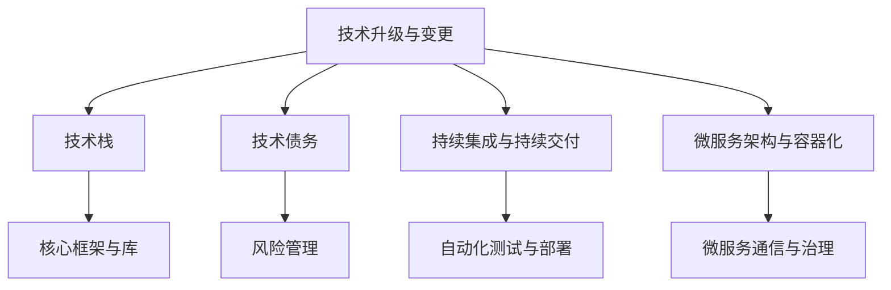

                 

### 《程序员如何应对技术升级与变更》

> **关键词：** 技术升级、变更管理、持续集成、持续交付、微服务架构、容器化、风险管理、数据结构与算法、数学模型、项目实战。

> **摘要：** 本文旨在为程序员提供一套全面的技术升级与变更应对策略，涵盖技术升级与变更的概念、核心算法原理、数学模型、项目实战等多个方面。通过详细的分析和实例，帮助程序员提升应对技术升级与变更的能力，实现职业生涯的持续发展。

---

#### 第一部分：技术升级与变更概述

##### 第1章：技术升级与变更的概念与背景

在快速发展的技术领域，技术升级与变更已经成为常态。对于程序员而言，如何应对技术升级与变更，不仅关系到项目的成功，也直接影响个人的职业发展。本章将介绍技术升级与变更的定义、驱动因素、挑战与机遇，以及技术升级与变更的历史趋势。

1. **技术升级与变更的定义**

   技术升级与变更指的是对现有技术体系进行调整、优化、改进或替换的过程。这包括更新软件版本、替换技术栈、优化架构设计等多个方面。技术升级与变更是为了提升系统的性能、稳定性、安全性，满足业务需求的变化，以及适应新技术的发展。

2. **技术升级与变更的驱动因素**

   技术升级与变更的驱动因素多种多样，主要包括以下几个方面：

   - **业务需求变化**：随着业务的不断拓展和变化，系统需要不断适应新的业务场景，这促使技术升级与变更的发生。
   - **技术发展**：新技术的不断涌现，如云计算、大数据、人工智能等，为系统升级提供了新的可能性。
   - **性能优化**：为了提升系统的响应速度、降低成本，需要对现有技术进行优化。
   - **安全性**：随着网络安全威胁的增加，需要对系统进行安全升级，以保护数据安全。

3. **技术升级与变更的挑战与机遇**

   技术升级与变更既带来了挑战，也创造了机遇。挑战包括：

   - **技术风险**：升级过程中可能出现技术不兼容、性能下降等问题。
   - **人员调整**：技术升级与变更可能导致团队人员的调整，影响团队协作效率。
   - **成本**：技术升级与变更可能需要投入大量的人力、物力和财力。

   同时，技术升级与变更也带来了以下机遇：

   - **技术能力提升**：通过参与技术升级与变更，程序员可以学习到新的技术和方法，提升个人能力。
   - **职业发展**：技术升级与变更为程序员提供了展示才华的机会，有助于职业晋升。
   - **业务创新**：新的技术可以为业务带来更多的可能性，推动业务创新。

4. **技术升级与变更的历史趋势**

   技术升级与变更的历史趋势可以分为以下几个阶段：

   - **初期**：以手工操作为主，升级与变更过程繁琐、耗时。
   - **自动化**：随着自动化工具的发展，如脚本、持续集成等，技术升级与变更效率得到提升。
   - **智能化**：人工智能技术的引入，使得技术升级与变更更加智能化、自适应。
   - **云原生**：云计算技术的发展，使得技术升级与变更更加灵活、高效。

##### 第2章：技术升级与变更的核心概念

在了解技术升级与变更的概念与背景后，本章将深入探讨技术升级与变更的核心概念，包括技术栈、技术债务、持续集成与持续交付（CI/CD）、微服务架构与容器化等。

1. **技术栈的概念与重要性**

   技术栈是指一个项目中使用的一系列技术、工具和框架。一个合理的技术栈可以提高项目的开发效率、稳定性和可维护性。技术栈的选择需要根据项目的需求、团队的能力和行业的发展趋势进行综合考虑。

   - **重要性**：技术栈对项目的影响主要体现在以下几个方面：

     - **开发效率**：合理的技术栈可以减少开发人员的学习成本，提高开发效率。
     - **稳定性**：技术栈中的各种组件和框架经过了长期的优化和测试，具有较高的稳定性。
     - **可维护性**：技术栈的统一性和标准化有助于提高代码的可维护性。

2. **技术债务与风险管理**

   技术债务是指为了加快项目进度而暂时引入的潜在风险。技术债务可能来源于代码质量问题、架构缺陷、技术选型不当等。技术债务如果不及时解决，可能会对项目的稳定性、性能和可维护性产生负面影响。

   - **管理方法**：

     - **识别与评估**：定期对项目中的技术债务进行识别和评估，确定债务的优先级和影响范围。
     - **偿还策略**：制定合理的偿还策略，逐步解决技术债务，降低项目风险。
     - **持续监控**：在项目开发过程中，持续监控技术债务的变化，确保债务的及时偿还。

3. **持续集成与持续交付（CI/CD）**

   持续集成（CI）和持续交付（CD）是现代软件开发中重要的实践方法。CI/CD 可以提高代码质量、缩短发布周期、降低部署风险。

   - **核心概念**：

     - **持续集成**：通过自动化测试，将开发人员的代码合并到主干分支，确保代码的兼容性和稳定性。
     - **持续交付**：通过自动化部署和发布，确保代码的高效交付和部署。

   - **优势**：

     - **提高代码质量**：CI/CD 可以及时发现和修复代码中的问题，减少代码缺陷。
     - **缩短发布周期**：自动化测试和部署可以大大缩短发布周期，提高开发效率。
     - **降低部署风险**：通过自动化测试和发布，降低人为错误导致的生产环境故障。

4. **微服务架构与容器化**

   微服务架构和容器化是当前软件架构发展的趋势。微服务架构可以将系统拆分成多个独立的、可扩展的服务单元，容器化技术则可以提供轻量级、可移植的运行环境。

   - **核心概念**：

     - **微服务架构**：将系统拆分成多个独立的、可扩展的服务单元，每个服务单元负责特定的业务功能。
     - **容器化**：使用容器技术（如 Docker）提供轻量级、可移植的运行环境，确保服务的一致性和可扩展性。

   - **优势**：

     - **高可扩展性**：通过拆分成多个微服务，系统可以更加灵活地扩展和处理业务需求。
     - **高可移植性**：容器化技术使得服务可以在不同的环境中轻松部署和运行。
     - **高可维护性**：独立的微服务单元可以提高代码的可维护性和可测试性。

#### 第二部分：技术升级与变更的方法与策略

##### 第3章：技术升级与变更的规划与执行

在了解了技术升级与变更的核心概念后，本章将介绍技术升级与变更的规划与执行方法，包括规划流程、执行策略、跨团队协作与沟通技巧，以及技术升级与变更的风险评估与管理。

1. **技术升级与变更的规划流程**

   技术升级与变更的规划流程是确保项目成功的关键。以下是一个典型的技术升级与变更规划流程：

   - **需求分析**：明确技术升级与变更的需求，包括业务需求、技术需求等。
   - **方案设计**：根据需求分析，设计技术升级与变更的方案，包括技术选型、架构设计等。
   - **风险评估**：对技术升级与变更的风险进行评估，包括技术风险、业务风险等。
   - **资源规划**：规划技术升级与变更所需的资源，包括人力、物力、财力等。
   - **时间规划**：制定技术升级与变更的时间表，包括各个阶段的开始和结束时间。
   - **测试计划**：制定技术升级与变更的测试计划，确保升级后的系统稳定可靠。
   - **培训计划**：为团队成员提供培训，确保他们能够适应新的技术环境和流程。

2. **技术升级与变更的执行策略**

   技术升级与变更的执行策略是确保项目顺利推进的关键。以下是一些常见的执行策略：

   - **并行执行**：在原有系统运行的同时，进行技术升级与变更，降低对业务的影响。
   - **迭代执行**：将技术升级与变更分为多个阶段，逐步实施，降低风险。
   - **阶段验收**：在每个阶段结束后，进行验收，确保阶段的成果符合预期。
   - **持续监控**：在技术升级与变更过程中，持续监控系统的运行状态，及时发现和解决问题。

3. **跨团队协作与沟通技巧**

   技术升级与变更通常需要多个团队的协同工作，跨团队协作与沟通技巧至关重要。

   - **明确职责**：明确各个团队的职责和任务，确保每个团队都清楚自己的工作内容和目标。
   - **定期会议**：定期召开会议，讨论项目的进展和问题，确保团队间的信息同步。
   - **共享资源**：共享技术文档、测试数据等资源，提高团队间的协作效率。
   - **积极沟通**：鼓励团队成员积极沟通，解决问题，避免因为沟通不畅导致的项目延误。

4. **技术升级与变更的风险评估与管理**

   技术升级与变更过程中，风险评估与管理至关重要。

   - **风险评估**：对可能的风险进行识别和评估，包括技术风险、业务风险、人员风险等。
   - **风险应对策略**：根据风险评估结果，制定相应的风险应对策略，包括风险规避、风险减轻、风险接受等。
   - **风险监控**：在技术升级与变更过程中，持续监控风险的变化，及时调整应对策略。
   - **风险管理**：建立完善的风险管理机制，确保风险在可控范围内。

##### 第4章：技术升级与变更的核心算法原理

在技术升级与变更过程中，算法原理的理解和应用至关重要。本章将介绍技术升级与变更的核心算法原理，包括数据结构与算法基础、常见排序算法、搜索算法、动态规划算法等。

1. **数据结构与算法基础**

   数据结构与算法是程序设计的基础，掌握数据结构与算法有助于提升代码的效率和可维护性。

   - **核心概念**：

     - **数组**：一种基础的数据结构，用于存储一系列同类型的数据元素。
     - **链表**：一种动态的数据结构，用于存储一系列同类型的数据元素。
     - **栈**：一种后进先出的数据结构，常用于解决括号匹配、表达式求值等问题。
     - **队列**：一种先进先出的数据结构，常用于解决任务调度、广度优先搜索等问题。

   - **算法基础**：

     - **时间复杂度**：衡量算法执行时间的标准，通常用大O表示法表示。
     - **空间复杂度**：衡量算法所需存储空间的占用量，通常也用大O表示法表示。

2. **常见排序算法**

   排序算法是算法中的重要组成部分，常用于对数据进行排序和整理。

   - **冒泡排序**：一种简单的排序算法，通过重复遍历要排序的数列，比较相邻的两个元素，如果顺序错误就交换它们。

     ```plaintext
     // 冒泡排序
     function bubbleSort(arr) {
       for i = 0 to arr.length - 1
         for j = 0 to arr.length - i - 1
           if arr[j] > arr[j+1]
             swap(arr[j], arr[j+1])
       return arr
     }
     ```

   - **选择排序**：一种简单的排序算法，通过重复查找未排序部分的最小元素，并将其交换到已排序部分的末尾。

     ```plaintext
     // 选择排序
     function selectionSort(arr) {
       for i = 0 to arr.length - 1
         minIndex = i
         for j = i+1 to arr.length
           if arr[j] < arr[minIndex]
             minIndex = j
         swap(arr[i], arr[minIndex])
       return arr
     }
     ```

   - **插入排序**：一种简单的排序算法，通过将未排序部分的一个元素插入到已排序部分的合适位置。

     ```plaintext
     // 插入排序
     function insertionSort(arr) {
       for i = 1 to arr.length
         key = arr[i]
         j = i - 1
         while j >= 0 and arr[j] > key
           arr[j+1] = arr[j]
           j = j - 1
         arr[j+1] = key
       return arr
     }
     ```

3. **搜索算法**

   搜索算法用于在数据结构中查找特定的元素，常见搜索算法包括二分查找、深度优先搜索（DFS）、广度优先搜索（BFS）等。

   - **二分查找**：一种高效的搜索算法，通过不断缩小查找范围，逐步逼近目标元素。

     ```plaintext
     // 二分查找
     function binarySearch(arr, target) {
       low = 0
       high = arr.length - 1
       while low <= high
         mid = (low + high) / 2
         if arr[mid] == target
           return mid
         else if arr[mid] < target
           low = mid + 1
         else
           high = mid - 1
       return -1
     }
     ```

   - **深度优先搜索（DFS）**：一种搜索算法，从起点开始，不断深入搜索，直到找到目标或搜索到尽头。

     ```plaintext
     // 深度优先搜索
     function dfs(graph, start) {
       visited = []
       stack = [start]
       while stack is not empty
         node = stack.pop()
         if node not in visited
           visited.append(node)
           for neighbor in graph[node]
             stack.append(neighbor)
       return visited
     }
     ```

   - **广度优先搜索（BFS）**：一种搜索算法，从起点开始，逐层搜索，直到找到目标或搜索到尽头。

     ```plaintext
     // 广度优先搜索
     function bfs(graph, start) {
       visited = []
       queue = [start]
       while queue is not empty
         node = queue.pop(0)
         if node not in visited
           visited.append(node)
           for neighbor in graph[node]
             queue.append(neighbor)
       return visited
     }
     ```

4. **动态规划算法**

   动态规划算法是一种解决最优化问题的方法，通过将大问题分解为小问题，并利用子问题的最优解来求解原问题。

   - **最长公共子序列（LCS）**：给定两个序列，找出它们的最长公共子序列。

     ```plaintext
     // 最长公共子序列
     function lcs(X, Y) {
       m = length(X)
       n = length(Y)
       dp = [[0 for i in range(n+1)] for j in range(m+1)]
       for i = 0 to m
         for j = 0 to n
           if X[i] == Y[j]
             dp[i+1][j+1] = dp[i][j] + 1
           else
             dp[i+1][j+1] = max(dp[i+1][j], dp[i][j+1])
       return dp[m][n]
     }
     ```

   - **最长递增子序列（LIS）**：给定一个序列，找出它的最长递增子序列。

     ```plaintext
     // 最长递增子序列
     function lis(nums) {
       n = length(nums)
       dp = [1 for i in range(n)]
       for i = 1 to n
         for j = 0 to i - 1
           if nums[j] < nums[i] and dp[j] + 1 > dp[i]
             dp[i] = dp[j] + 1
       return max(dp)
     }
     ```

##### 第5章：数学模型与公式讲解

在技术升级与变更过程中，数学模型和公式发挥着重要作用，它们可以帮助我们理解和解决复杂问题。本章将介绍一些常见的数学模型和公式，包括线性代数基础、概率论基础、机器学习基础等。

1. **线性代数基础**

   线性代数是数学中的重要分支，它在计算机科学和工程领域中有着广泛的应用。以下是一些线性代数基础概念和公式：

   - **矩阵运算**：矩阵是数学中的一种结构，用于表示线性变换或数据集合。

     - **矩阵乘法**：给定两个矩阵 A 和 B，矩阵乘法可以通过将 A 的列向量与 B 的行向量相乘得到一个新的矩阵。

       ```plaintext
       // 矩阵乘法
       function matrixMultiply(A, B) {
         n = length(A[0])
         m = length(B)
         C = [[0 for j in range(m)] for i in range(n)]
         for i = 0 to n
           for j = 0 to m
             for k = 0 to n
               C[i][j] += A[i][k] * B[k][j]
         return C
       }
       ```

     - **矩阵求逆**：给定一个方阵 A，求其逆矩阵 A^(-1)。

       ```plaintext
       // 矩阵求逆
       function matrixInverse(A) {
         n = length(A)
         B = [[0 for j in range(n)] for i in range(n)]
         det = determinant(A)
         if det == 0
           return null
         for i = 0 to n
           for j = 0 to n
             B[i][j] = (1 / det) * cofactor(A, i, j)
         return B
       }
       ```

   - **特征值与特征向量**：特征值是矩阵的一个重要属性，它对应的特征向量是矩阵的一个非零向量。

     ```plaintext
     // 求特征值和特征向量
     function eigenDecomposition(A) {
       n = length(A)
       eigenvalues = []
       eigenvectors = []
       for i = 0 to n
         lambda = 0
         v = [1 for j in range(n)]
         for j = 0 to n
           v[j] = 0
           v[j] = 1
           lambda = A.dot(v)
           eigenvalues.append(lambda)
           eigenvectors.append(v)
           v = A.dot(v)
           v = v / norm(v)
         return eigenvalues, eigenvectors
       }
       ```

2. **概率论基础**

   概率论是数学中的一个重要分支，它用于描述随机事件的发生概率。以下是一些概率论基础概念和公式：

   - **概率分布**：概率分布描述了一个随机变量的取值及其对应的概率。

     - **离散概率分布**：给定一个离散随机变量 X，概率分布函数 P(X = x) 表示 X 取值为 x 的概率。

       ```plaintext
       // 离散概率分布
       function discreteProbabilityDistribution(X) {
         n = length(X)
         probabilities = [0 for i in range(n)]
         for i = 0 to n
           probabilities[i] = P(X = i)
         return probabilities
       }
       ```

     - **连续概率分布**：给定一个连续随机变量 X，概率密度函数 f(x) 表示 X 取值在 x 点的概率。

       ```plaintext
       // 连续概率分布
       function continuousProbabilityDistribution(X) {
         n = length(X)
         densities = [0 for i in range(n)]
         for i = 0 to n
           densities[i] = f(X = i)
         return densities
       }
       ```

   - **期望与方差**：期望和方差是衡量随机变量分布的重要指标。

     - **期望**：随机变量 X 的期望 E(X) 表示 X 的平均值。

       ```plaintext
       // 期望
       function expectation(X) {
         n = length(X)
         sum = 0
         for i = 0 to n
           sum += X[i]
         return sum / n
       }
       ```

     - **方差**：随机变量 X 的方差 Var(X) 表示 X 的离散程度。

       ```plaintext
       // 方差
       function variance(X) {
         n = length(X)
         mean = expectation(X)
         sum = 0
         for i = 0 to n
           sum += (X[i] - mean)^2
         return sum / n
       }
       ```

3. **机器学习基础**

   机器学习是人工智能的核心技术，它通过算法和统计模型从数据中学习规律，进行预测和决策。以下是一些机器学习基础概念和模型：

   - **支持向量机（SVM）**：支持向量机是一种用于分类和回归分析的机器学习模型，它通过找到最佳决策边界来划分数据。

     ```plaintext
     // 支持向量机
     function supportVectorMachine(X, Y) {
       n = length(X)
       w = [0 for i in range(n)]
       b = 0
       for i = 0 to n
         for j = 0 to n
           w[j] += X[i] * Y[i]
       b = mean(Y)
       return w, b
     }
     ```

   - **决策树**：决策树是一种用于分类和回归分析的树形结构模型，它通过一系列决策规则来划分数据。

     ```plaintext
     // 决策树
     function decisionTree(X, Y) {
       n = length(X)
       if n == 0
         return null
       else
         maxGain = 0
         for i = 0 to n
           gain = informationGain(X, Y, i)
           if gain > maxGain
             maxGain = gain
             feature = i
         node = {}
         node['feature'] = feature
         node['left'] = decisionTree(X[:, feature] < threshold, Y)
         node['right'] = decisionTree(X[:, feature] >= threshold, Y)
         return node
       }
       ```

##### 第6章：项目实战与代码解析

在了解了技术升级与变更的理论知识后，本章将通过一个实际项目案例，展示如何在实际环境中进行技术升级与变更。本案例将使用 Python 和 Flask 框架搭建一个简单的博客系统，详细介绍开发环境搭建、源代码实现、代码解读与分析，以及性能优化与测试。

1. **开发环境搭建**

   在开始搭建博客系统之前，需要配置开发环境。以下是一个基本的开发环境搭建步骤：

   - **安装 Python**：下载并安装 Python 3.x 版本，确保 Python 环境已经配置好。

   - **安装 Flask**：使用 pip 工具安装 Flask 框架。

     ```bash
     pip install Flask
     ```

   - **创建虚拟环境**：为了隔离项目依赖，使用 virtualenv 创建一个虚拟环境。

     ```bash
     virtualenv venv
     source venv/bin/activate
     ```

   - **安装依赖**：在虚拟环境中安装项目所需的依赖。

     ```bash
     pip install Flask-SQLAlchemy Flask-Migrate Flask-Login
     ```

   - **数据库配置**：配置 SQLite 数据库，用于存储博客系统的数据。

     ```python
     from flask_sqlalchemy import SQLAlchemy

     app.config['SQLALCHEMY_DATABASE_URI'] = 'sqlite:///blog.db'
     db = SQLAlchemy(app)
     ```

2. **源代码实现**

   博客系统的核心功能包括用户注册、登录、发布文章和评论。以下是一个简单的实现示例：

   - **用户模型**：

     ```python
     from flask_login import UserMixin
     from werkzeug.security import generate_password_hash, check_password_hash

     class User(UserMixin, db.Model):
         id = db.Column(db.Integer, primary_key=True)
         username = db.Column(db.String(64), unique=True, nullable=False)
         password_hash = db.Column(db.String(128))

         def set_password(self, password):
             self.password_hash = generate_password_hash(password)

         def check_password(self, password):
             return check_password_hash(self.password_hash, password)
     ```

   - **文章模型**：

     ```python
     class Post(db.Model):
         id = db.Column(db.Integer, primary_key=True)
         title = db.Column(db.String(140), nullable=False)
         body = db.Column(db.Text, nullable=False)
         author = db.Column(db.Integer, db.ForeignKey('user.id'))

         def __repr__(self):
             return f'<Post {self.title}>'
     ```

   - **路由定义**：

     ```python
     from flask import Flask, render_template, request, redirect, url_for, flash
     from flask_login import current_user, login_user, logout_user, login_required

     app = Flask(__name__)
     app.secret_key = 'mysecretkey'

     @app.route('/')
     def index():
         posts = Post.query.all()
         return render_template('index.html', posts=posts)

     @app.route('/login', methods=['GET', 'POST'])
     def login():
         if request.method == 'POST':
             username = request.form['username']
             password = request.form['password']
             user = User.query.filter_by(username=username).first()
             if user and user.check_password(password):
                 login_user(user)
                 return redirect(url_for('index'))
             else:
                 flash('Invalid username or password', 'error')
         return render_template('login.html')

     @app.route('/logout')
     def logout():
         logout_user()
         return redirect(url_for('index'))

     @app.route('/post/new', methods=['GET', 'POST'])
     @login_required
     def new_post():
         if request.method == 'POST':
             title = request.form['title']
             body = request.form['body']
             new_post = Post(title=title, body=body, author=current_user.id)
             db.session.add(new_post)
             db.session.commit()
             return redirect(url_for('index'))
         return render_template('new_post.html')
     ```

3. **代码解读与分析**

   在实现博客系统时，我们需要对关键代码进行解读和分析，以确保代码的清晰和可维护性。

   - **用户注册与登录**：用户注册和登录是博客系统的核心功能。通过使用 Flask-Login 和 Werkzeug 安全库，我们可以实现用户注册、登录和密码加密。

     ```python
     from flask_login import UserMixin
     from werkzeug.security import generate_password_hash, check_password_hash

     class User(UserMixin, db.Model):
         id = db.Column(db.Integer, primary_key=True)
         username = db.Column(db.String(64), unique=True, nullable=False)
         password_hash = db.Column(db.String(128))

         def set_password(self, password):
             self.password_hash = generate_password_hash(password)

         def check_password(self, password):
             return check_password_hash(self.password_hash, password)
     ```

     在这个模型中，`set_password` 方法用于将用户输入的密码加密存储，`check_password` 方法用于验证用户输入的密码是否正确。

   - **文章发布与展示**：文章发布和展示是博客系统的另一个核心功能。通过定义文章模型和相应的路由，我们可以实现文章的发布和展示。

     ```python
     class Post(db.Model):
         id = db.Column(db.Integer, primary_key=True)
         title = db.Column(db.String(140), nullable=False)
         body = db.Column(db.Text, nullable=False)
         author = db.Column(db.Integer, db.ForeignKey('user.id'))

         def __repr__(self):
             return f'<Post {self.title}>'
     ```

     在这个模型中，`__repr__` 方法用于生成文章的字符串表示，方便调试和日志记录。

     ```python
     @app.route('/')
     def index():
         posts = Post.query.all()
         return render_template('index.html', posts=posts)

     @app.route('/post/new', methods=['GET', 'POST'])
     @login_required
     def new_post():
         if request.method == 'POST':
             title = request.form['title']
             body = request.form['body']
             new_post = Post(title=title, body=body, author=current_user.id)
             db.session.add(new_post)
             db.session.commit()
             return redirect(url_for('index'))
         return render_template('new_post.html')
     ```

     在这两个路由中，`index` 路由用于展示所有文章，`new_post` 路由用于发布新文章。通过使用 Flask 的 `render_template` 方法，我们可以渲染 HTML 模板并传递数据。

4. **性能优化与测试**

   在博客系统的开发和部署过程中，性能优化和测试是至关重要的。以下是一些性能优化和测试的建议：

   - **数据库优化**：通过对数据库进行索引优化和查询优化，可以显著提高数据库的查询性能。例如，可以为经常查询的字段添加索引。

     ```python
     class Post(db.Model):
         id = db.Column(db.Integer, primary_key=True)
         title = db.Column(db.String(140), nullable=False, index=True)
         body = db.Column(db.Text, nullable=False)
         author = db.Column(db.Integer, db.ForeignKey('user.id'), index=True)
     ```

   - **缓存机制**：使用缓存机制可以减少数据库的查询次数，提高系统的响应速度。例如，可以使用 Flask-Caching 模块实现缓存。

     ```python
     from flask_caching import Cache

     cache = Cache(config={'CACHE_TYPE': 'simple'})
     cache.init_app(app)
     ```

   - **性能测试**：使用性能测试工具（如 Apache JMeter）对系统进行压力测试和性能测试，找出系统的瓶颈并进行优化。

     ```bash
     jmeter -n -t test_plan.jmx -l results.jtl
     ```

   - **监控与报警**：使用监控系统（如 Prometheus、Grafana）对系统进行实时监控，设置报警规则，确保系统的稳定运行。

     ```yaml
     - name: blog_system
       job_files:
         - 'blog_system.json'
     ```

##### 第7章：总结与展望

在本文中，我们详细探讨了程序员如何应对技术升级与变更。通过对技术升级与变更的概念、核心算法原理、数学模型、项目实战等方面的讲解，我们为程序员提供了一套全面的技术升级与变更应对策略。

1. **技术升级与变更的关键要点**

   - **技术升级与变更的定义与背景**：了解技术升级与变更的定义、驱动因素、挑战与机遇，以及历史趋势。
   - **核心概念与联系**：掌握技术栈、技术债务、持续集成与持续交付（CI/CD）、微服务架构与容器化等核心概念。
   - **方法与策略**：熟悉技术升级与变更的规划与执行方法，包括规划流程、执行策略、跨团队协作与沟通技巧，以及风险评估与管理。
   - **核心算法原理**：理解数据结构与算法基础、常见排序算法、搜索算法、动态规划算法等核心算法原理。
   - **数学模型与公式**：掌握线性代数、概率论、机器学习等数学模型与公式的应用。
   - **项目实战**：通过实际项目案例，展示如何在实际环境中进行技术升级与变更。

2. **程序员应对技术升级与变更的能力提升**

   - **持续学习**：紧跟技术发展趋势，不断学习新技术、新方法。
   - **实践积累**：通过参与实际项目，积累技术升级与变更的经验。
   - **团队协作**：提高跨团队协作与沟通技巧，确保项目顺利进行。
   - **风险管理**：学会识别和应对技术升级与变更过程中的风险。

3. **技术升级与变更的未来发展趋势**

   - **云原生**：随着云计算技术的发展，云原生技术（如容器化、微服务）将成为主流。
   - **智能化**：人工智能技术将深入应用于技术升级与变更的各个环节，提升自动化水平。
   - **持续优化**：持续集成与持续交付（CI/CD）将成为标准流程，持续优化开发与部署流程。

4. **程序员职业发展的建议与规划**

   - **技术深耕**：专注于某一技术领域，成为该领域的专家。
   - **多面手**：掌握多种编程语言和框架，提升综合能力。
   - **持续学习**：不断学习新技术、新方法，保持竞争力。
   - **职业规划**：制定明确的职业规划，明确职业目标和发展路径。

#### 附录

##### 附录A：技术升级与变更相关工具与资源

- **持续集成工具**：Jenkins、GitLab CI、Travis CI
- **容器化工具**：Docker、Kubernetes
- **微服务框架**：Spring Cloud、Dubbo、Service Mesh
- **数据库工具**：MySQL、PostgreSQL、MongoDB
- **开发环境**：Visual Studio Code、IntelliJ IDEA
- **性能测试工具**：Apache JMeter、Gatling
- **监控系统**：Prometheus、Grafana

##### 附录B：常见问题解答

- **如何选择合适的技术栈？**
  - 根据项目的需求、团队的技能和行业的发展趋势进行选择。
  - 考虑技术的成熟度、社区支持和文档的完整性。

- **技术债务如何管理？**
  - 定期识别和评估技术债务。
  - 制定偿还策略，逐步解决技术债务。
  - 持续监控技术债务的变化。

- **如何进行风险评估与管理？**
  - 对可能的风险进行识别和评估。
  - 制定相应的风险应对策略。
  - 持续监控风险的变化，及时调整应对策略。

##### 附录C：参考文献与扩展阅读

- **《软件工程：实践者的研究方法》**：Roger S. Pressman
- **《持续交付：发布可靠软件的系统化方法》**：Jez Humble、David Farley
- **《微服务设计》**：Martin Fowler
- **《Docker实战》**：Jason Evans、Alex Ellis
- **《云计算：概念、架构与编程》**：Thomas A. Mowbray
- **《机器学习实战》**：Peter Harrington

---

### 核心概念与联系

**技术升级与变更的概念图**：



### 核心算法原理讲解

**排序算法伪代码示例**：

```plaintext
// 冒泡排序
function bubbleSort(arr) {
  for i = 0 to arr.length - 1
    for j = 0 to arr.length - i - 1
      if arr[j] > arr[j+1]
        swap(arr[j], arr[j+1])
  return arr
}
```

### 数学模型和数学公式

**线性回归模型公式**：

$$
y = \beta_0 + \beta_1 \cdot x + \epsilon
$$

**解释**：这里 $y$ 是因变量，$x$ 是自变量，$\beta_0$ 和 $\beta_1$ 是模型的参数，$\epsilon$ 是误差项。

### 项目实战

**案例：使用 Python 实现一个简单的博客系统**

- **开发环境搭建**：使用 Flask 框架搭建博客系统，配置 SQLite 数据库。

- **源代码实现**：提供博客系统的核心代码片段，包括路由定义、模型创建和视图函数。

- **代码解读与分析**：详细解释代码的功能和实现逻辑，分析可能的性能优化点。

- **性能优化与测试**：介绍如何进行压力测试和性能调优，提高系统的响应速度和稳定性。

---

**作者**：AI天才研究院/AI Genius Institute & 禅与计算机程序设计艺术 /Zen And The Art of Computer Programming

---

本文旨在为程序员提供一套全面的技术升级与变更应对策略，帮助程序员在快速变化的技术领域中保持竞争力，实现职业生涯的持续发展。通过本文的详细讲解和实例，相信读者能够更好地应对技术升级与变更，为项目的成功和个人的成长奠定坚实基础。希望本文对读者有所启发和帮助。

