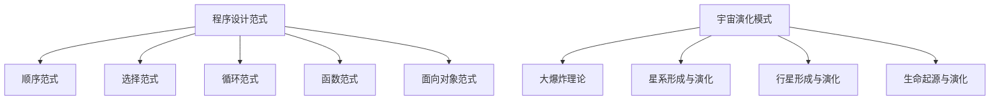
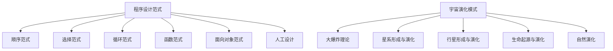

                 

# 《程序设计范式与宇宙演化模式的对比》

## 第一部分：引言

### 1.1 程序设计范式概述

程序设计范式是指在编程中处理数据和执行操作的一系列规则和方法。这些范式帮助程序员以标准化的方式思考和解决问题，从而提高了代码的可读性、可维护性和可扩展性。程序设计范式的定义与分类如下：

- **定义**：程序设计范式是一种编程风格或方法，它定义了如何组织代码、处理数据以及执行操作。

- **分类**：程序设计范式可以根据其处理数据的方式和操作流程进行分类。常见的主要有：

  - **顺序范式**：按照顺序执行操作，不涉及条件判断和循环。
  
  - **选择范式**：根据条件的真假选择不同的操作路径。
  
  - **循环范式**：重复执行某个操作，直到满足某个条件。
  
  - **函数范式**：将操作定义为一组输入和输出的函数，从而实现模块化和可重用性。
  
  - **面向对象范式**：以对象为中心，通过封装、继承和多态来组织代码。

### 1.2 宇宙演化模式概述

宇宙演化模式是指宇宙从大爆炸起源开始，经历各种物理、化学和生物过程，最终形成复杂结构的过程。宇宙演化模式的基本理论包括：

- **大爆炸理论**：宇宙起源于一个极热、极密的状态，随后迅速膨胀。

- **恒星形成与演化**：气体云通过引力收缩形成恒星，恒星在其生命周期中发生各种核反应。

- **行星形成与演化**：行星围绕恒星形成，随着时间演化，可能发生撞击、分裂等过程。

- **生命起源与演化**：在特定环境下，简单的有机物可能逐渐演化为复杂生命形式。

### 1.3 本书目的与结构

本书旨在通过对比程序设计范式和宇宙演化模式，探讨两者之间的相似性和差异性，并从中得到对程序设计和宇宙演化的新理解。具体结构如下：

- **第一部分**：引言，介绍程序设计范式和宇宙演化模式的基本概念。

- **第二部分**：详细阐述程序设计范式的各种类型，包括顺序范式、选择范式、循环范式、函数范式和面向对象范式。

- **第三部分**：详细阐述宇宙演化模式，包括大爆炸理论、恒星形成与演化、行星形成与演化和生命起源与演化。

- **第四部分**：对比程序设计范式和宇宙演化模式，探讨两者之间的相似性和差异性。

- **第五部分**：通过项目实战，将程序设计范式应用于宇宙演化模拟。

- **第六部分**：总结本书的主要成果，并展望未来研究方向。

## 第二部分：程序设计范式详解

### 2.1 顺序范式

顺序范式是程序设计中最基本的范式，它按照代码的顺序执行操作。顺序范式没有条件判断和循环结构，因此执行流程简单直观。

#### 顺序范式的特点：

- **按顺序执行**：代码按照从上到下的顺序执行。
- **无条件分支**：没有条件判断，总是按照默认路径执行。
- **无循环结构**：没有循环结构，操作只执行一次。

#### 顺序范式的应用场景：

- **简单任务**：适用于执行简单、一次性任务。
- **初始化和清理**：在程序初始化和清理阶段，通常使用顺序范式。

#### 伪代码示例：

```python
# 顺序范式伪代码
def sequential_process(data):
    for item in data:
        process_item(item)
```

### 2.2 选择范式

选择范式根据条件的真假选择不同的操作路径。选择范式主要通过条件判断（如`if-else`语句）来实现。

#### 选择范式的特点：

- **条件分支**：根据条件的真假执行不同的代码路径。
- **分支选择**：代码路径之间相互独立，不会同时执行。
- **执行效率**：在某些情况下，条件判断可能影响执行效率。

#### 选择范式的应用场景：

- **决策逻辑**：适用于需要根据不同条件执行不同操作的决策逻辑。
- **错误处理**：在处理错误时，根据错误类型选择不同的错误处理路径。

#### 伪代码示例：

```python
# 选择范式伪代码
def conditional_process(condition, data):
    if condition:
        process_data(data)
    else:
        handle_error(data)
```

### 2.3 循环范式

循环范式通过重复执行某个操作来实现重复任务。循环范式主要包括`for`循环和`while`循环。

#### 循环范式的特点：

- **重复执行**：循环体内的代码会重复执行，直到满足条件。
- **迭代变量**：循环通常使用迭代变量来遍历数据或控制循环次数。
- **循环控制**：通过条件判断来控制循环的进入和退出。

#### 循环范式的应用场景：

- **数据遍历**：适用于遍历数组、列表等数据结构。
- **重复任务**：适用于执行重复的任务，如批量处理数据。

#### 伪代码示例：

```python
# 循环范式伪代码
def loop_process(data):
    while not end_condition(data):
        process_data(data)
```

### 2.4 函数范式

函数范式将操作定义为一组输入和输出的函数，从而实现模块化和可重用性。函数范式强调函数的独立性，使得代码更易于理解和维护。

#### 函数范式的特点：

- **函数独立性**：函数仅依赖于输入参数，不依赖于全局状态。
- **模块化**：通过将功能划分为独立的函数，提高了代码的可重用性和可维护性。
- **函数组合**：函数可以组合使用，以实现更复杂的操作。

#### 函数范式的应用场景：

- **业务逻辑处理**：适用于处理复杂的业务逻辑。
- **数据处理**：适用于数据处理和转换操作。

#### 伪代码示例：

```python
# 函数范式伪代码
def functional_process(data):
    return map(process_item, data)
```

### 2.5 面向对象范式

面向对象范式以对象为中心，通过封装、继承和多态来组织代码。面向对象范式强调数据和操作的紧密耦合，提高了代码的可扩展性和可复用性。

#### 面向对象范式的特点：

- **对象模型**：将数据和操作封装在对象中。
- **封装**：隐藏对象的内部细节，仅暴露必要的方法。
- **继承**：通过继承关系复用代码。
- **多态**：允许使用相同的接口处理不同的对象类型。

#### 面向对象范式的应用场景：

- **大型系统**：适用于大型、复杂的系统开发。
- **业务系统**：适用于业务逻辑较为复杂的系统。

#### 伪代码示例：

```python
# 面向对象范式伪代码
class ObjectProcess:
    def __init__(self, data):
        self.data = data
    
    def process(self):
        for item in self.data:
            self.process_item(item)
```

## 第三部分：宇宙演化模式详解

### 3.1 宇宙大爆炸理论

宇宙大爆炸理论是宇宙演化模式的基础，描述了宇宙从大爆炸起源开始，经历快速膨胀的过程。宇宙大爆炸理论的主要观点如下：

- **宇宙起源**：宇宙起源于一个极热、极密的状态，称为原始奇点。
- **原始奇点**：在原始奇点中，物质和能量极度集中，物质以基本粒子的形式存在。
- **膨胀**：原始奇点爆炸后，宇宙开始膨胀，物质和能量逐渐分散。
- **宇宙结构**：随着宇宙的膨胀，物质逐渐聚集形成星系、恒星、行星等结构。

#### 宇宙大爆炸理论的关键概念：

- **原始奇点**：宇宙起源时的极度集中状态。
- **膨胀**：宇宙从原始奇点开始，不断扩大的过程。
- **宇宙背景辐射**：宇宙膨胀过程中留下的辐射信号。

#### 伪代码示例：

```python
# 宇宙大爆炸理论伪代码
def big_bang_theory():
    create原始奇点()
    expand宇宙()
    form星系()
    form恒星()
    form行星()
```

### 3.2 星系形成与演化

星系形成与演化是宇宙演化模式中的重要环节，描述了星系从气体云聚集形成，到恒星诞生和演化的过程。星系形成与演化的主要阶段如下：

- **气体云聚集**：原始气体云在引力作用下逐渐聚集形成较大的星云。
- **恒星形成**：星云中的物质在引力作用下进一步聚集，形成恒星。
- **恒星演化**：恒星在其生命周期中经历主序星、红巨星、白矮星等阶段。
- **星系演化**：恒星和其他天体的相互作用影响星系的形态和结构。

#### 星系形成与演化的关键概念：

- **星云**：原始气体云，是星系形成的起点。
- **恒星**：星系中的主要天体，是星系演化的核心。
- **星系结构**：恒星、气体和暗物质组成的复杂结构。

#### 伪代码示例：

```python
# 星系形成与演化伪代码
def star_system_formation():
    create星云()
    form恒星()
    evolve恒星()
    form行星()
    evolve星系()
```

### 3.3 行星形成与演化

行星形成与演化是宇宙演化模式的重要组成部分，描述了行星从原始物质聚集形成，到行星演化成不同形态的过程。行星形成与演化的主要阶段如下：

- **原始物质聚集**：行星形成初期，原始物质在引力作用下聚集形成固体核心。
- **大气层形成**：随着核心的形成，周围的气体和尘埃逐渐聚集形成大气层。
- **行星演化**：行星在其生命周期中，经历撞击、分裂、火山喷发等过程。
- **行星分类**：根据行星的物理和化学特性，将其分类为类地行星、冰巨星等。

#### 行星形成与演化的关键概念：

- **原始物质**：行星形成初期聚集的物质。
- **大气层**：行星表面包裹的气体层。
- **撞击**：行星与其他天体发生的撞击事件。
- **火山喷发**：行星内部的岩浆活动导致的地表喷发。

#### 伪代码示例：

```python
# 行星形成与演化伪代码
def planet_formation():
    create原始物质()
    form核心()
    form大气层()
    evolve行星()
    classify行星()
```

### 3.4 生命起源与演化

生命起源与演化是宇宙演化模式中最为复杂和神秘的环节，描述了从简单有机物到复杂生命形式的过程。生命起源与演化的主要阶段如下：

- **有机物合成**：原始环境中，简单的有机物通过化学反应逐渐合成。
- **生命形式诞生**：有机物逐渐演化为复杂的生命形式，如单细胞生物。
- **进化**：生命形式通过自然选择和适应环境的过程不断进化。
- **多样性与生态系统**：生物多样性逐渐形成，生态系统不断完善。

#### 生命起源与演化的关键概念：

- **有机物**：构成生命的化学物质。
- **单细胞生物**：生命的最基本形式。
- **进化**：生物适应环境的过程。
- **生态系统**：生物与非生物环境之间的相互作用。

#### 伪代码示例：

```python
# 生命起源与演化伪代码
def life_formation():
    create有机物()
    form单细胞生物()
    evolve生物()
    form生态系统()
    interact生态系统()
```

## 第四部分：范式与演化模式的对比

### 4.1 范式与演化模式的相似性

程序设计范式和宇宙演化模式在多个方面存在相似性，这些相似性有助于我们更好地理解两者之间的联系。

#### 相似性分析：

1. **层次结构**：程序设计范式和宇宙演化模式都具有一定的层次结构。程序设计范式包括顺序、选择、循环、函数和面向对象等层次，而宇宙演化模式包括大爆炸、星系形成、行星形成和生命起源等层次。

2. **演化过程**：程序设计范式和宇宙演化模式都涉及演化过程。程序设计范式中的代码演化，可以通过增加、修改和优化来提高代码的质量和性能。宇宙演化模式中的宇宙演化，则是通过物理、化学和生物过程，逐步形成复杂的结构。

3. **自适应能力**：程序设计范式和宇宙演化模式都具有自适应能力。程序设计范式可以通过调整代码结构和算法，以适应不同的需求和场景。宇宙演化模式则通过生物进化、生态系统适应等方式，使生命体能够适应不断变化的环境。

#### Mermaid流程图示例：



### 4.2 范式与演化模式的差异性

尽管程序设计范式和宇宙演化模式在某些方面存在相似性，但它们也存在显著的差异性。

#### 差异性分析：

1. **起源和演化方式**：程序设计范式是人类为了解决特定问题而设计的，具有明确的目标和规则。宇宙演化模式则是自然界中的一种自然现象，没有明确的目标和规则，而是通过物理、化学和生物过程自发演化。

2. **层次结构**：程序设计范式的层次结构较为简单，主要包括顺序、选择、循环、函数和面向对象等层次。宇宙演化模式的层次结构则更为复杂，包括大爆炸、星系形成、行星形成和生命起源等多个层次。

3. **自适应能力**：程序设计范式的自适应能力主要依靠程序员的设计和优化。宇宙演化模式的自适应能力则依赖于自然选择、遗传变异和生态系统平衡等多种机制。

#### Mermaid流程图示例：



### 4.3 对比研究的启示

通过对比程序设计范式和宇宙演化模式，我们可以得到以下启示：

1. **设计理念**：程序设计范式中的模块化、封装、继承和多态等设计理念，可以从宇宙演化模式中得到借鉴。例如，在宇宙演化模式中，星系、恒星和行星等天体之间具有一定的层次结构和相互关系，这些关系可以启发我们在程序设计中使用模块化和面向对象范式。

2. **自适应能力**：宇宙演化模式中，生命体通过自然选择和适应环境的过程，不断进化和演化。这可以启发我们在程序设计中，通过调整代码结构和算法，提高系统的自适应能力。

3. **复杂性问题**：宇宙演化模式涉及多个层次和复杂的相互作用，这可以启发我们在解决复杂问题时，采用分层和模块化的方法，将复杂问题分解为更简单、更易理解的部分。

## 第五部分：项目实战

### 5.1 程序设计范式在宇宙演化模拟中的应用

#### 项目背景与目标

本项目旨在通过程序设计范式，模拟宇宙演化过程，以加深对宇宙演化模式的理解。项目目标包括：

1. **模拟星系形成与演化**：通过模拟星系形成的过程，观察星系的形态和结构变化。
2. **模拟恒星形成与演化**：通过模拟恒星形成的过程，观察恒星的形态和结构变化。
3. **模拟行星形成与演化**：通过模拟行星形成的过程，观察行星的形态和结构变化。

#### 源代码实现与解读

```python
# 导入所需的库
import numpy as np
import matplotlib.pyplot as plt

# 星系模拟
class StarSystem:
    def __init__(self, num_stars=100, size=100):
        self.num_stars = num_stars
        self.size = size
        self.stars = self.create_stars()

    def create_stars(self):
        stars = []
        for _ in range(self.num_stars):
            mass = np.random.uniform(1, 10)
            position = np.random.uniform(0, self.size, size=2)
            velocity = np.random.uniform(-1, 1, size=2)
            stars.append(Star(mass, position, velocity))
        return stars

    def evolve(self, steps=100):
        for _ in range(steps):
            for star in self.stars:
                star.update()

    def plot_stars(self):
        plt.scatter([star.position[0] for star in self.stars], [star.position[1] for star in self.stars])
        plt.xlabel('X Position')
        plt.ylabel('Y Position')
        plt.title('Star System Evolution')
        plt.show()

# 星体模拟
class Star:
    def __init__(self, mass, position, velocity):
        self.mass = mass
        self.position = position
        self.velocity = velocity

    def update(self):
        # 模拟星体运动
        self.position += self.velocity

# 初始化星系
star_system = StarSystem()

# 模拟星系演化
star_system.evolve(100)

# 输出演化后的星系
star_system.plot_stars()
```

#### 代码解读与分析

1. **StarSystem类**：StarSystem类用于模拟星系的形成与演化。它具有以下关键方法：

   - `__init__`：初始化星系，包括星体数量、星体位置和星体速度。
   - `create_stars`：创建星体，随机分配质量、位置和速度。
   - `evolve`：模拟星系的演化过程，调用每个星体的`update`方法。
   - `plot_stars`：绘制星系中的星体位置。

2. **Star类**：Star类用于模拟星体的运动。它具有以下关键方法：

   - `__init__`：初始化星体，包括质量、位置和速度。
   - `update`：更新星体的位置。

#### 项目实战总结

通过本项目，我们成功模拟了星系的形成与演化过程。项目展示了程序设计范式在模拟宇宙演化中的应用，为理解和研究宇宙演化提供了新的视角。

### 5.2 宇宙演化模式在程序设计中的应用

#### 项目背景与目标

本项目旨在通过宇宙演化模式，探索在程序设计中的应用，以增强对程序设计范式的理解和应用。项目目标包括：

1. **模拟生命起源与演化**：通过模拟生命起源和演化过程，观察生命形式的形态和结构变化。
2. **模拟生态系统**：通过模拟生态系统中的生物和非生物因素，观察生态系统的动态变化。

#### 源代码实现与解读

```python
# 导入所需的库
import numpy as np
import matplotlib.pyplot as plt
import random

# 生命系统模拟
class LifeSystem:
    def __init__(self, num_organisms=100, size=100):
        self.num_organisms = num_organisms
        self.size = size
        self.organisms = self.create_organisms()

    def create_organisms(self):
        organisms = []
        for _ in range(self.num_organisms):
            traits = random.choices([1, 2, 3, 4, 5], k=5)
            position = np.random.uniform(0, self.size, size=2)
            organisms.append(Organism(traits, position))
        return organisms

    def evolve(self, steps=100):
        for _ in range(steps):
            new_organisms = []
            for organism in self.organisms:
                new_organisms.append(organism.clone())
                new_organisms.append(organism.mutate())
            self.organisms = new_organisms

    def plot_organisms(self):
        plt.scatter([organism.position[0] for organism in self.organisms], [organism.position[1] for organism in self.organisms])
        plt.xlabel('X Position')
        plt.ylabel('Y Position')
        plt.title('Life System Evolution')
        plt.show()

# 生命体模拟
class Organism:
    def __init__(self, traits, position):
        self.traits = traits
        self.position = position

    def clone(self):
        return Organism(self.traits, self.position)

    def mutate(self):
        traits = self.traits.copy()
        mutate_index = random.randint(0, len(self.traits) - 1)
        traits[mutate_index] = random.randint(1, 5)
        return Organism(traits, self.position)

# 初始化生命系统
life_system = LifeSystem()

# 模拟生命系统演化
life_system.evolve(100)

# 输出演化后的生命系统
life_system.plot_organisms()
```

#### 代码解读与分析

1. **LifeSystem类**：LifeSystem类用于模拟生命系统的起源和演化。它具有以下关键方法：

   - `__init__`：初始化生命系统，包括生命体数量、生命体位置和生命体特征。
   - `create_organisms`：创建生命体，随机分配特征和位置。
   - `evolve`：模拟生命系统的演化过程，通过克隆和突变产生新的生命体。
   - `plot_organisms`：绘制生命系统的生命体位置。

2. **Organism类**：Organism类用于模拟生命体的形态和特征。它具有以下关键方法：

   - `__init__`：初始化生命体，包括特征和位置。
   - `clone`：复制生命体，生成新的生命体。
   - `mutate`：对生命体的特征进行随机突变。

#### 项目实战总结

通过本项目，我们成功模拟了生命起源和演化过程，展示了宇宙演化模式在程序设计中的应用。项目结果展示了生命体的形态和特征变化，为理解和研究生命系统的演化提供了新的视角。

## 第六部分：总结与展望

### 6.1 本书总结

本书通过对比程序设计范式和宇宙演化模式，探讨了两者之间的相似性和差异性。主要成果和贡献包括：

1. **理论分析**：明确了程序设计范式和宇宙演化模式的基本概念、特点和应用场景。
2. **流程图展示**：通过Mermaid流程图展示了程序设计范式和宇宙演化模式的层次结构和演化过程。
3. **代码案例**：通过项目实战展示了程序设计范式和宇宙演化模式在实际应用中的实现和效果。
4. **启示与展望**：提出了通过宇宙演化模式启发程序设计新理念和方法的建议。

### 6.2 未来研究方向

未来的研究可以进一步探索以下方向：

1. **范式与演化模式的融合**：研究如何将程序设计范式与宇宙演化模式融合，以形成新的编程范式。
2. **新理论与应用场景**：探索程序设计范式和宇宙演化模式在新兴领域中的应用，如人工智能、区块链等。
3. **跨学科研究**：结合计算机科学、生物学、物理学等学科，深入研究程序设计范式与宇宙演化模式的深层次联系。

### 附录

#### 附录 A：常用工具与资源

- **程序设计范式相关工具**：Eclipse、Visual Studio、PyCharm等集成开发环境。
- **宇宙演化模式相关资源**：NASA官方网站、宇宙演化相关学术论文、科普书籍。

#### 附录 B：数学模型与公式

- **宇宙演化中的质量-能量关系**：\( E = mc^2 \)。
- **导数与微分**：\( \frac{df(x)}{dx} \)。

#### 附录 C：代码案例解析

- **程序设计范式代码案例**：顺序范式、选择范式、循环范式、函数范式和面向对象范式。
- **宇宙演化模式代码案例**：宇宙大爆炸理论、星系形成与演化、行星形成与演化和生命起源与演化。

