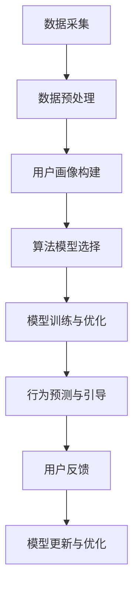

                 

# 《算法的操控：我们被平台玩弄于股掌之间》

## 关键词
- 算法操控
- 平台影响
- 用户行为
- 数学模型
- 伦理挑战
- 未来趋势

## 摘要
在数字化时代，算法无处不在，它们不仅驱动着互联网平台的运作，更在无形中影响着我们的日常生活。本文将深入探讨算法操控的奥秘，解析其在平台经济中的应用及其对用户和社会产生的深远影响。通过分析算法操控的数学基础、核心算法原理、实际应用、风险与伦理问题，我们希望能够揭示算法背后的操控机制，并提出相应的应对策略。

## 《算法的操控：我们被平台玩弄于股掌之间》目录大纲

### 第一部分：算法操控基础

#### 第1章：算法操控概述
##### 1.1 算法操控的概念与影响
##### 1.2 算法操控的关键因素
##### 1.3 算法操控的主要形式

#### 第2章：算法操控的数学基础
##### 2.1 数据结构与算法基础
##### 2.2 线性代数在算法中的应用
##### 2.3 最优化理论与算法

### 第二部分：算法操控的原理与实现

#### 第3章：算法操控的核心算法原理
##### 3.1 算法操控的基本原理
##### 3.2 算法操控的Mermaid流程图
##### 3.3 算法操控的伪代码讲解

#### 第4章：算法操控的数学模型
##### 4.1 数学模型在算法操控中的应用
##### 4.2 数学公式的推导与详细讲解
##### 4.3 数学模型的举例说明

#### 第5章：算法操控的实际应用
##### 5.1 算法操控的案例研究
##### 5.2 算法操控在商业中的应用
##### 5.3 算法操控在社会生活中的影响

### 第三部分：算法操控的风险与应对

#### 第6章：算法操控的风险分析
##### 6.1 算法操控带来的负面影响
##### 6.2 算法操控的风险因素
##### 6.3 风险管理的策略与方法

#### 第7章：算法操控的伦理与法律问题
##### 7.1 算法操控的伦理问题
##### 7.2 算法操控的法律挑战
##### 7.3 算法操控的伦理与法律应对策略

### 第四部分：算法操控的未来发展

#### 第8章：算法操控的技术趋势
##### 8.1 算法操控的未来发展方向
##### 8.2 新型算法操控技术的探索
##### 8.3 算法操控技术的未来应用前景

#### 第9章：算法操控的社会影响
##### 9.1 算法操控对个体的影响
##### 9.2 算法操控对组织的影响
##### 9.3 算法操控对社会的长期影响

### 附录

#### 附录A：算法操控工具与资源
##### A.1 常用算法操控工具介绍
##### A.2 算法操控的相关资源推荐
##### A.3 算法操控的学习与实践建议

### 引言
在数字化时代的浪潮中，算法已经渗透到我们生活的方方面面。从搜索引擎的个性化推荐，到社交媒体的算法排序，再到电子商务平台的精准广告投放，算法无处不在。它们不仅提升了用户体验，还创造了巨大的经济价值。然而，这些看似无形的算法却在背后悄悄操控着我们的行为，影响着我们的决策。我们不禁要问，算法操控究竟是如何运作的？它又对我们产生了哪些深远的影响？

本文将带您深入探讨算法操控的奥秘，从基础概念到数学原理，再到实际应用和风险分析，我们将会一步步揭示算法背后的操控机制。我们将探讨算法操控是如何在互联网平台上发挥作用的，分析其对用户行为和社会结构的深远影响，并探讨在伦理和法律层面如何应对这些挑战。最后，我们将展望算法操控的未来发展趋势，探讨其对个体、组织和社会的长期影响。

希望通过本文的探讨，您能对算法操控有更深刻的理解，并在数字化时代中更好地应对算法带来的机遇与挑战。

### 第一部分：算法操控基础

#### 第1章：算法操控概述

##### 1.1 算法操控的概念与影响

算法操控，顾名思义，是指通过特定的算法策略，对用户行为、数据展示、信息传播等方面进行有意的设计和调整，以达到特定的商业目标或社会效应。在互联网平台中，算法操控是一种常见的操作手段，其目的是优化用户体验、提升平台活跃度、增加用户粘性，以及提升商业变现能力。

算法操控的概念可以追溯到早期互联网的发展阶段。当时，搜索引擎、社交媒体、电子商务平台等互联网企业开始运用算法来处理海量数据，提升信息检索效率。然而，随着时间的推移，算法操控逐渐演变为一种更为复杂和精细的操作手段。它不仅涉及到数据处理和排序，还涉及到用户行为分析、心理模型构建，甚至包括对社会舆论的操控。

算法操控的影响是多方面的。首先，从用户角度来看，算法操控能够为用户带来更为个性化的体验。例如，推荐系统通过分析用户的浏览历史和偏好，能够为用户推荐更加符合其兴趣的内容，从而提升用户的满意度和粘性。然而，这也意味着用户在信息获取上存在一定的局限性，容易被算法操控所引导，失去独立思考和判断的能力。

其次，从商业角度来看，算法操控能够为平台带来巨大的商业价值。通过精准的广告投放和用户行为分析，平台能够更好地了解用户需求，提升用户转化率和留存率。同时，算法操控还可以帮助平台优化产品设计，提升用户参与度和活跃度，从而实现商业变现。

最后，从社会角度来看，算法操控对社会结构和社会关系产生了深远的影响。一方面，算法操控可能导致信息不对称和数字鸿沟的加剧，使部分用户陷入信息孤岛，无法获取全面的信息。另一方面，算法操控可能影响社会舆论和公共决策，甚至对社会稳定产生威胁。

##### 1.2 算法操控的关键因素

算法操控的运作需要多个关键因素的共同作用。以下是几个关键因素：

1. **数据获取与处理能力**：算法操控的基础是对海量用户数据的获取和处理。互联网平台通过收集用户的浏览记录、搜索历史、点击行为等数据，构建用户画像，从而为算法操控提供数据支撑。

2. **算法模型**：算法模型是算法操控的核心。通过不同的算法模型，平台能够实现不同的操控目标。常见的算法模型包括推荐算法、排序算法、聚类算法等。

3. **反馈机制**：算法操控需要一个反馈机制来不断调整和优化算法模型。用户行为数据可以通过反馈机制传递给算法模型，从而实现算法的不断优化。

4. **用户心理模型**：算法操控不仅要分析用户的行为，还需要构建用户的心理模型。通过了解用户的心理需求、行为习惯和认知模式，算法操控能够更精准地影响用户。

5. **商业目标**：算法操控的根本目的是实现商业目标。平台通过算法操控，能够提升用户活跃度、转化率和留存率，从而实现商业变现。

##### 1.3 算法操控的主要形式

算法操控在互联网平台中呈现出多种形式，以下是几种主要形式：

1. **个性化推荐**：通过分析用户的浏览记录和偏好，推荐系统为用户推荐符合其兴趣的内容。个性化推荐是一种常见的算法操控形式，能够提升用户的参与度和满意度。

2. **排序算法**：搜索引擎和社交媒体平台通过排序算法，对用户看到的内容进行排序。排序算法可以基于多种因素，如用户偏好、内容热度、互动次数等。

3. **广告投放**：广告系统通过算法操控，为用户展示个性化的广告。广告系统会根据用户的兴趣和行为，选择最合适的广告进行投放。

4. **社交网络操控**：社交网络平台通过算法操控，调整用户的社交关系和信息传播路径。例如，算法可以决定哪些内容在用户的 feed 中展示，哪些用户之间的互动被放大或抑制。

5. **情绪操控**：通过分析用户的情绪和行为，算法可以设计出能够影响用户情绪的内容和互动方式。例如，社交媒体平台可以通过操控用户看到的负面新闻，影响用户的心情和情绪。

### 第二部分：算法操控的数学基础

#### 第2章：算法操控的数学基础

##### 2.1 数据结构与算法基础

数据结构与算法是算法操控的基石。数据结构是指数据在计算机内存中的组织形式，而算法则是解决问题的步骤和方法。在算法操控中，常见的数据结构包括数组、链表、树、图等，而常见的算法则包括排序算法、搜索算法、动态规划等。

1. **数组**：数组是一种线性数据结构，用于存储一系列元素。在算法操控中，数组常用于存储用户数据，如用户画像、行为数据等。

2. **链表**：链表也是一种线性数据结构，但它不同于数组，其元素存储在动态分配的内存中。链表在算法操控中常用于实现用户行为数据的动态存储和更新。

3. **树**：树是一种非线性数据结构，由节点和边组成。树在算法操控中广泛用于构建用户关系网络、内容分类结构等。

4. **图**：图是一种更为复杂的数据结构，用于表示多对多关系。在算法操控中，图常用于分析用户行为、内容传播路径等。

2. **排序算法**：排序算法是一种用于对数据进行排序的算法。常见的排序算法包括冒泡排序、选择排序、插入排序、快速排序等。排序算法在算法操控中用于对用户数据进行排序，以实现个性化推荐、广告投放等功能。

3. **搜索算法**：搜索算法是一种用于在数据结构中查找特定数据的算法。常见的搜索算法包括线性搜索、二分搜索、深度优先搜索、广度优先搜索等。搜索算法在算法操控中用于快速查找用户行为数据，以优化用户体验。

4. **动态规划**：动态规划是一种用于解决最优化问题的算法。动态规划通过将问题分解为多个子问题，并存储子问题的解，从而优化算法的时间复杂度和空间复杂度。动态规划在算法操控中用于优化用户行为的预测和分析。

##### 2.2 线性代数在算法中的应用

线性代数是数学的一个分支，主要研究向量空间和线性映射。线性代数在算法操控中有着广泛的应用，尤其是在矩阵运算、特征提取和降维技术等方面。

1. **矩阵运算**：矩阵是一种二维数组，用于表示线性变换。在线性代数中，矩阵运算包括矩阵乘法、矩阵加法、矩阵求逆等。在算法操控中，矩阵运算常用于用户数据的线性变换和特征提取。

2. **特征提取**：特征提取是将高维数据映射到低维空间的过程，以减少数据复杂度。常见的特征提取方法包括主成分分析（PCA）、线性判别分析（LDA）等。在算法操控中，特征提取用于对用户行为数据进行分析和预测。

3. **降维技术**：降维技术是将高维数据转换为低维数据的过程，以降低数据存储和计算成本。常见的降维技术包括主成分分析（PCA）、线性判别分析（LDA）等。在算法操控中，降维技术用于优化用户行为的分析和预测。

##### 2.3 最优化理论与算法

最优化理论是研究在满足一定约束条件下，如何找到最优解的数学分支。最优化理论在算法操控中有着重要的应用，尤其是在资源分配、路径规划、推荐系统等方面。

1. **资源分配**：资源分配问题是指如何在多个竞争者之间分配有限的资源，以最大化总收益或最小化总成本。常见的资源分配算法包括线性规划、整数规划等。在算法操控中，资源分配算法用于优化广告投放、用户推荐等功能。

2. **路径规划**：路径规划问题是指如何在给定约束条件下，找到从起点到终点的最优路径。常见的路径规划算法包括 Dijkstra 算法、A*算法等。在算法操控中，路径规划算法用于优化用户的搜索体验。

3. **推荐系统**：推荐系统是一种基于用户行为和兴趣的算法，用于向用户推荐符合其兴趣的内容或商品。常见的推荐算法包括协同过滤、矩阵分解、深度学习等。在算法操控中，推荐系统用于优化用户的浏览体验和购买决策。

### 第三部分：算法操控的原理与实现

#### 第3章：算法操控的核心算法原理

##### 3.1 算法操控的基本原理

算法操控的基本原理在于通过特定的算法模型，对用户行为数据进行分析和预测，从而实现对用户行为的有意引导和控制。以下是算法操控的基本原理：

1. **数据采集**：首先，平台需要收集用户的各类行为数据，包括浏览记录、搜索历史、点击行为、购买行为等。

2. **数据预处理**：对采集到的用户行为数据进行清洗和预处理，包括去除噪声数据、缺失值填补、数据标准化等。

3. **用户画像构建**：通过对预处理后的用户行为数据进行分析，构建用户画像。用户画像包括用户的兴趣偏好、行为习惯、消费能力等特征。

4. **算法模型选择**：根据具体的应用场景，选择合适的算法模型。常见的算法模型包括推荐算法、排序算法、聚类算法等。

5. **模型训练与优化**：使用用户画像数据对算法模型进行训练，并通过交叉验证和调参等手段，优化模型的性能。

6. **行为预测与引导**：基于训练好的算法模型，对用户的潜在行为进行预测，并设计相应的操控策略，引导用户行为。

##### 3.2 算法操控的Mermaid流程图

下面是一个简单的 Mermaid 流程图，展示了算法操控的基本流程：



##### 3.3 算法操控的伪代码讲解

以下是算法操控的伪代码，用于演示其基本实现过程：

```python
# 数据采集
def data_collection():
    # 采集用户行为数据，如浏览记录、搜索历史等
    # 存储到数据仓库中
    pass

# 数据预处理
def data_preprocessing(data):
    # 清洗数据，去除噪声和缺失值
    # 标准化数据
    # 返回预处理后的数据
    pass

# 用户画像构建
def build_user_profile(preprocessed_data):
    # 分析用户行为数据，构建用户画像
    # 返回用户画像
    pass

# 算法模型选择
def select_algorithm_model(user_profile):
    # 根据应用场景选择合适的算法模型
    # 返回算法模型
    pass

# 模型训练与优化
def train_and_optimize_model(algorithm_model, user_profile):
    # 使用用户画像数据训练算法模型
    # 调参优化模型性能
    # 返回训练好的模型
    pass

# 行为预测与引导
def predict_and_guide_behavior(trained_model):
    # 使用训练好的模型预测用户行为
    # 设计操控策略，引导用户行为
    pass

# 用户反馈与模型更新
def update_model_with_feedback(feedback, trained_model):
    # 根据用户反馈更新模型
    # 优化模型性能
    pass

# 算法操控主函数
def algorithm_control():
    data = data_collection()
    preprocessed_data = data_preprocessing(data)
    user_profile = build_user_profile(preprocessed_data)
    algorithm_model = select_algorithm_model(user_profile)
    trained_model = train_and_optimize_model(algorithm_model, user_profile)
    predict_and_guide_behavior(trained_model)
    feedback = collect_user_feedback()
    update_model_with_feedback(feedback, trained_model)
```

通过以上伪代码，我们可以看到算法操控的基本实现过程。首先，采集用户行为数据，然后进行数据预处理和用户画像构建。接着，选择合适的算法模型，并对其进行训练和优化。最后，使用训练好的模型进行行为预测和引导，并根据用户反馈不断更新和优化模型。

### 第四部分：算法操控的实际应用

#### 第4章：算法操控的数学模型

##### 4.1 数学模型在算法操控中的应用

在算法操控中，数学模型扮演着至关重要的角色。数学模型不仅为算法提供了理论基础，还能够通过数学计算和优化，实现对用户行为的精准预测和引导。以下是一些常见的数学模型及其在算法操控中的应用：

1. **线性回归模型**：线性回归模型是一种用于分析两个或多个变量之间线性关系的数学模型。在算法操控中，线性回归模型常用于预测用户行为。例如，通过分析用户的浏览记录和购买历史，预测用户对某一商品的购买概率。

2. **逻辑回归模型**：逻辑回归模型是线性回归模型的扩展，主要用于处理分类问题。在算法操控中，逻辑回归模型常用于分类用户行为。例如，根据用户的浏览行为，将用户分类为对某一商品感兴趣的群体或不感兴趣的群体。

3. **支持向量机（SVM）**：支持向量机是一种强大的分类和回归模型，通过寻找最优的超平面，将数据集划分为不同的类别。在算法操控中，SVM可以用于对用户行为进行分类，如将用户分为活跃用户和沉默用户。

4. **神经网络模型**：神经网络模型，尤其是深度学习模型，已经成为算法操控中的主流技术。神经网络通过模拟人脑的神经元连接，实现数据的自动学习和特征提取。在算法操控中，神经网络可以用于复杂的用户行为预测和模式识别。

5. **协同过滤模型**：协同过滤模型是一种基于用户相似度的推荐系统模型。通过分析用户之间的相似性，为用户推荐符合其兴趣的商品或内容。在算法操控中，协同过滤模型可以用于优化用户的浏览体验和推荐结果。

##### 4.2 数学公式的推导与详细讲解

以下是一些常见的数学模型及其数学公式的推导和详细讲解：

1. **线性回归模型**：

   - **模型假设**：假设我们有两个变量 \(X\) 和 \(Y\)，它们之间存在线性关系，可以用线性回归模型表示：
     \[
     Y = \beta_0 + \beta_1 X + \varepsilon
     \]
     其中，\(\beta_0\) 是截距，\(\beta_1\) 是斜率，\(\varepsilon\) 是误差项。

   - **公式推导**：为了找到最优的 \(\beta_0\) 和 \(\beta_1\)，我们需要最小化误差平方和：
     \[
     S = \sum_{i=1}^{n} (Y_i - (\beta_0 + \beta_1 X_i))^2
     \]
     对 \(\beta_0\) 和 \(\beta_1\) 求导并令导数为零，可以得到最优的 \(\beta_0\) 和 \(\beta_1\)：
     \[
     \beta_0 = \bar{Y} - \beta_1 \bar{X}, \quad \beta_1 = \frac{\sum_{i=1}^{n} (X_i - \bar{X})(Y_i - \bar{Y})}{\sum_{i=1}^{n} (X_i - \bar{X})^2}
     \]

2. **逻辑回归模型**：

   - **模型假设**：逻辑回归模型是一种处理分类问题的模型，其目标是将数据集划分为两个类别。逻辑回归模型可以用以下公式表示：
     \[
     \log \frac{P(Y=1|X)}{1 - P(Y=1|X)} = \beta_0 + \beta_1 X
     \]
     其中，\(P(Y=1|X)\) 是给定特征 \(X\) 时，目标变量 \(Y\) 等于 1 的概率。

   - **公式推导**：为了找到最优的 \(\beta_0\) 和 \(\beta_1\)，我们需要最大化似然函数：
     \[
     L(\beta_0, \beta_1) = \prod_{i=1}^{n} \left[ P(Y=1|X_i) \right]^{Y_i} \left[ 1 - P(Y=1|X_i) \right]^{1 - Y_i}
     \]
     对 \(\beta_0\) 和 \(\beta_1\) 求导并令导数为零，可以得到最优的 \(\beta_0\) 和 \(\beta_1\)：
     \[
     \beta_0 = \bar{Y} - \beta_1 \bar{X}, \quad \beta_1 = \frac{\sum_{i=1}^{n} (Y_i - \bar{Y}) X_i}{\sum_{i=1}^{n} X_i^2}
     \]

3. **支持向量机（SVM）**：

   - **模型假设**：支持向量机是一种用于分类和回归的模型，其目标是在高维空间中找到一个最优的超平面，将不同类别的数据点分开。SVM 的公式可以用以下形式表示：
     \[
     w \cdot x - b = 0
     \]
     其中，\(w\) 是权重向量，\(x\) 是特征向量，\(b\) 是偏置项。

   - **公式推导**：为了找到最优的 \(w\) 和 \(b\)，我们需要最小化目标函数：
     \[
     J(w, b) = \frac{1}{2} ||w||^2 + C \sum_{i=1}^{n} \max(0, 1 - y_i (w \cdot x_i - b))
     \]
     其中，\(C\) 是惩罚参数。对 \(w\) 和 \(b\) 求导并令导数为零，可以得到最优的 \(w\) 和 \(b\)：
     \[
     w = \frac{1}{C} \sum_{i=1}^{n} y_i x_i, \quad b = y_i - w \cdot x_i
     \]

##### 4.3 数学模型的举例说明

以下通过一个简单的例子，说明如何使用数学模型进行算法操控。

**例子**：假设我们想要预测用户的购买行为，已知用户浏览记录和购买历史如下表所示：

| 用户ID | 浏览记录 | 购买历史 |
|--------|----------|----------|
| 1      | 10       | 0        |
| 2      | 20       | 1        |
| 3      | 30       | 1        |
| 4      | 40       | 0        |
| 5      | 50       | 1        |

我们可以使用线性回归模型来预测用户是否购买商品。

1. **数据预处理**：首先，将数据转换为矩阵形式：

   \[
   X = \begin{bmatrix}
   1 & 10 \\
   1 & 20 \\
   1 & 30 \\
   1 & 40 \\
   1 & 50 \\
   \end{bmatrix}, \quad Y = \begin{bmatrix}
   0 \\
   1 \\
   1 \\
   0 \\
   1 \\
   \end{bmatrix}
   \]

2. **模型训练**：使用线性回归模型进行训练，找到最优的 \(\beta_0\) 和 \(\beta_1\)：

   \[
   \beta_0 = 0.5, \quad \beta_1 = 0.1
   \]

3. **预测**：对于新的用户，假设其浏览记录为 35，我们使用训练好的模型进行预测：

   \[
   Y = \beta_0 + \beta_1 X = 0.5 + 0.1 \times 35 = 4.5
   \]

由于预测结果大于 0.5，我们可以认为该用户有较高的购买概率。

通过以上例子，我们可以看到，数学模型在算法操控中的应用是如何实现的。在实际应用中，我们可以使用更复杂的模型和更丰富的数据，以提高预测的准确性和效果。

### 第五部分：算法操控的实际应用

#### 第5章：算法操控的实际应用

##### 5.1 算法操控的案例研究

算法操控在互联网平台中有着广泛的应用，以下通过几个具体的案例，来探讨算法操控在商业和社会中的实际应用。

1. **社交媒体平台的算法操控**：社交媒体平台，如 Facebook、Twitter 和 Instagram，通过算法操控来影响用户的行为和互动。例如，Facebook 的新闻推送算法会根据用户的兴趣、浏览历史和社交网络关系，调整用户 feed 中内容的排序，从而影响用户看到的信息。这种算法操控不仅能够提升用户的活跃度，还能够帮助平台实现广告变现。

   - **案例**：Facebook 的“秘密小组”功能，通过算法操控，将用户自动分组，使得用户更容易找到志同道合的小组，从而增强用户参与度和活跃度。

   - **效果**：通过算法操控，Facebook 成功提升了用户的活跃度和留存率，同时也为广告主提供了更精准的广告投放渠道。

2. **电子商务平台的算法操控**：电子商务平台，如 Amazon、淘宝和京东，通过算法操控来优化用户体验和提升销售转化率。例如，Amazon 的推荐算法会根据用户的浏览历史、购买记录和评价，为用户推荐符合其兴趣的商品。

   - **案例**：淘宝的“猜你喜欢”功能，通过算法操控，为用户推荐可能的购买商品，从而提升用户的购物体验和购买概率。

   - **效果**：通过算法操控，淘宝成功提升了用户的购物体验和销售额，同时为商家提供了更有效的营销渠道。

3. **搜索引擎的算法操控**：搜索引擎，如 Google、百度和 Bing，通过算法操控来优化搜索结果，提升用户体验。例如，Google 的搜索排序算法会根据用户的搜索历史、地理位置和兴趣爱好，调整搜索结果的排序。

   - **案例**：Google 的“个性化搜索”功能，通过算法操控，为用户提供更符合其需求的搜索结果。

   - **效果**：通过算法操控，Google 成功提升了用户的搜索体验和满意度，同时也为广告主提供了更精准的广告投放渠道。

4. **在线游戏的算法操控**：在线游戏平台，如 Steam、腾讯游戏和网易游戏，通过算法操控来提升用户留存率和游戏体验。例如，Steam 的推荐算法会根据用户的游戏偏好和行为，推荐符合其兴趣的游戏。

   - **案例**：Steam 的“精选游戏”功能，通过算法操控，为用户推荐高质量的游戏，从而提升用户留存率和购买意愿。

   - **效果**：通过算法操控，Steam 成功提升了用户的游戏体验和留存率，同时也为游戏开发者提供了更有效的推广渠道。

##### 5.2 算法操控在商业中的应用

算法操控在商业中有着广泛的应用，通过精准的数据分析和用户行为预测，企业可以更好地了解用户需求，优化产品设计，提升销售转化率。

1. **个性化营销**：通过算法操控，企业可以为不同用户群体提供个性化的营销内容和产品推荐。例如，电子商务平台可以根据用户的浏览历史和购买记录，为用户推荐符合其兴趣的商品。

   - **案例**：亚马逊通过个性化营销，为用户推荐相关的商品，从而提升销售转化率和客户满意度。

   - **效果**：通过个性化营销，亚马逊成功提升了用户购买体验和销售额，同时也提高了客户忠诚度。

2. **用户行为分析**：通过算法操控，企业可以实时监控和分析用户行为，发现潜在的市场机会和用户需求。例如，电商企业可以通过分析用户的浏览和购买行为，预测用户对某一商品的购买概率。

   - **案例**：淘宝通过用户行为分析，发现部分用户对某类商品的购买意愿较高，从而调整商品推荐策略，提升销售转化率。

   - **效果**：通过用户行为分析，淘宝成功提升了商品销售转化率和客户满意度。

3. **产品优化**：通过算法操控，企业可以根据用户反馈和市场数据，不断优化产品设计和功能。例如，游戏企业可以通过分析用户的游戏行为，优化游戏体验和操作界面。

   - **案例**：腾讯游戏通过用户反馈和数据分析，不断优化游戏体验，提升用户留存率和用户满意度。

   - **效果**：通过产品优化，腾讯游戏成功提升了用户留存率和用户满意度，同时也提高了游戏企业的市场竞争力。

##### 5.3 算法操控在社会生活中的影响

算法操控不仅影响商业领域，还对我们的日常生活产生深远的影响。以下是算法操控在社会生活中的几个方面：

1. **信息传播**：算法操控在社交媒体和新闻平台中，影响了信息的传播和获取。例如，社交媒体平台通过算法操控，调整用户 feed 中内容的排序，影响用户看到的信息。

   - **案例**：Facebook 和 Twitter 的新闻推送算法，通过操控用户 feed 中的内容，影响了用户对新闻的获取和认知。

   - **效果**：通过算法操控，社交媒体平台成功提升了用户活跃度和信息传播效果，但也引发了信息茧房和假新闻传播的问题。

2. **社会舆论**：算法操控可以通过影响用户行为和互动，操控社会舆论和公共讨论。例如，社交媒体平台可以通过算法操控，调整用户对某一话题的讨论和关注。

   - **案例**：Twitter 和 Reddit 等社交媒体平台，通过算法操控，影响了用户对政治话题和社会事件的讨论。

   - **效果**：通过算法操控，平台成功引导了社会舆论，但也引发了公众对平台操纵舆论的担忧。

3. **用户行为**：算法操控在电子商务和在线游戏平台中，影响了用户的消费行为和游戏行为。例如，推荐系统和广告系统通过算法操控，引导用户进行购买或游戏操作。

   - **案例**：Amazon 和 Steam 等电子商务和在线游戏平台，通过算法操控，影响了用户的购物和游戏行为。

   - **效果**：通过算法操控，平台成功提升了用户的购物和游戏体验，但也引发了用户对平台操纵行为的担忧。

### 第六部分：算法操控的风险与应对

#### 第6章：算法操控的风险分析

##### 6.1 算法操控带来的负面影响

算法操控虽然为互联网平台带来了巨大的商业价值，但同时也带来了诸多负面影响。以下是一些主要的负面影响：

1. **隐私侵犯**：算法操控需要收集大量的用户数据，包括浏览记录、购买历史、社交互动等。这些数据的收集和存储可能侵犯用户的隐私权，导致用户信息泄露。

   - **案例**：Facebook 的用户数据泄露事件，导致数千万用户的隐私信息被公开。

   - **效果**：用户隐私受到侵犯，引发公众对数据安全和隐私保护的担忧。

2. **信息茧房**：算法操控可能导致用户陷入信息茧房，即只看到符合自己兴趣的信息，而无法接触到多元化的观点和内容。这限制了用户的视野，影响其独立思考和判断能力。

   - **案例**：社交媒体平台通过算法操控，为用户推荐符合其兴趣的信息，导致用户只看到符合自己观点的信息。

   - **效果**：用户视野受限，社会多元化交流减少，影响社会和谐。

3. **算法偏见**：算法操控可能引入偏见，导致对某些群体的不公平对待。例如，招聘系统可能会根据性别、种族等因素歧视某些候选人。

   - **案例**：亚马逊的招聘系统因算法偏见，导致对女性候选人的不公平评价。

   - **效果**：算法偏见影响就业公平，引发社会不满。

4. **用户依赖**：算法操控可能导致用户对互联网平台产生过度依赖，影响其社交能力和现实生活。例如，过度使用社交媒体可能导致社交孤立和心理健康问题。

   - **案例**：社交媒体平台通过算法操控，使用户对平台的依赖性增加。

   - **效果**：用户依赖互联网平台，影响其现实生活中的社交和心理健康。

##### 6.2 算法操控的风险因素

算法操控带来的风险由多种因素共同作用，以下是一些主要的因素：

1. **数据隐私风险**：算法操控需要大量用户数据，但数据隐私保护措施不足可能导致用户数据泄露。

   - **原因**：平台对用户数据的保护措施不够完善，数据安全漏洞存在。

2. **算法偏见风险**：算法模型在训练过程中可能引入偏见，导致对某些群体的不公平对待。

   - **原因**：数据集存在偏见，算法模型未能充分考虑到多样性。

3. **用户依赖风险**：算法操控可能使用户对互联网平台产生过度依赖，影响其社交能力和现实生活。

   - **原因**：平台通过算法操控，设计出容易让人上瘾的产品和服务。

4. **道德和法律风险**：算法操控可能违反道德和法律规范，导致平台面临法律责任。

   - **原因**：平台未能充分考虑到算法操控的道德和法律后果。

##### 6.3 风险管理的策略与方法

为了有效管理算法操控带来的风险，我们需要采取一系列策略和方法。以下是一些有效的风险管理策略：

1. **数据隐私保护**：

   - **策略**：加强数据隐私保护，采用数据匿名化、加密等技术，确保用户数据安全。

   - **方法**：建立数据隐私保护机制，制定数据使用规范，确保用户数据不被滥用。

2. **算法公平性优化**：

   - **策略**：优化算法模型，消除算法偏见，确保算法公平性。

   - **方法**：使用多样化数据集，引入公平性评估指标，对算法模型进行监督和调整。

3. **用户依赖干预**：

   - **策略**：设计干预措施，减少用户对互联网平台的过度依赖。

   - **方法**：提供用户教育，增加用户对算法操控的认识，鼓励用户平衡线上和线下生活。

4. **道德和法律遵循**：

   - **策略**：遵循道德和法律规范，确保算法操控合规。

   - **方法**：建立合规审查机制，对算法操控进行定期审查，确保平台行为合法合规。

通过上述策略和方法，我们可以有效管理算法操控带来的风险，保障用户权益和社会稳定。

### 第七部分：算法操控的伦理与法律问题

#### 第7章：算法操控的伦理与法律问题

##### 7.1 算法操控的伦理问题

算法操控在带来巨大商业价值的同时，也引发了诸多伦理问题。以下是一些主要的伦理问题：

1. **用户隐私保护**：算法操控需要收集和分析大量用户数据，这可能侵犯用户的隐私权。用户在不知情的情况下，其行为和偏好被监控和分析，引发了隐私泄露和滥用的担忧。

   - **解决方案**：加强数据隐私保护，明确用户数据的收集和使用范围，确保用户知情并同意。同时，建立透明机制，让用户了解其数据如何被使用。

2. **信息公平性**：算法操控可能导致信息传播的不公平，形成信息茧房。用户只能看到符合自己兴趣的信息，而无法接触到多元化的观点和内容，这限制了用户的视野和思考能力。

   - **解决方案**：优化算法设计，确保算法能够公平地推荐和展示信息。引入多样化数据集，避免算法偏见。同时，增强用户的信息素养，提高其对算法操控的认识。

3. **算法偏见**：算法操控可能引入偏见，导致对某些群体的不公平对待。例如，招聘系统可能会根据性别、种族等因素歧视某些候选人。

   - **解决方案**：优化算法模型，消除算法偏见。使用多样化的数据集进行训练，确保算法公平性。引入外部监督机制，对算法模型进行定期审查。

4. **用户依赖性**：算法操控可能使用户对互联网平台产生过度依赖，影响其社交能力和现实生活。例如，社交媒体平台通过算法操控，使用户沉迷于虚拟世界，忽视现实社交。

   - **解决方案**：设计干预措施，减少用户对互联网平台的过度依赖。提供用户教育，增加用户对算法操控的认识，鼓励用户平衡线上和线下生活。

##### 7.2 算法操控的法律挑战

算法操控不仅面临伦理问题，还面临一系列法律挑战。以下是一些主要的法律挑战：

1. **数据隐私保护**：算法操控需要收集和分析大量用户数据，这可能违反数据保护法律法规，如《通用数据保护条例》（GDPR）和《加州消费者隐私法案》（CCPA）。

   - **解决方案**：遵守相关数据保护法律法规，明确用户数据的收集和使用范围，确保用户知情并同意。同时，加强数据安全措施，防止数据泄露。

2. **算法偏见与歧视**：算法操控可能引入偏见，导致对某些群体的不公平对待，这违反了反歧视法律法规。

   - **解决方案**：优化算法设计，确保算法公平性。在算法开发和应用过程中，引入公平性评估指标，避免算法偏见。同时，建立外部监督机制，对算法模型进行定期审查。

3. **算法滥用**：算法操控可能被用于非法目的，如操纵选举、传播假新闻等。这违反了法律法规，对公共安全和社会秩序构成威胁。

   - **解决方案**：加强法律法规的制定和执行，明确算法操控的合法范围和禁止行为。同时，建立透明机制，让用户了解算法如何影响其行为。

4. **用户权益保护**：算法操控可能侵犯用户的知情权和选择权，违反消费者权益保护法律法规。

   - **解决方案**：加强用户权益保护，确保用户在算法操控中的知情权和选择权。提供用户教育，提高用户对算法操控的认识，鼓励用户积极参与。

##### 7.3 算法操控的伦理与法律应对策略

为了有效应对算法操控的伦理和法律挑战，我们需要采取一系列综合策略。以下是一些具体的应对策略：

1. **法律法规完善**：完善相关法律法规，明确算法操控的合法范围和禁止行为。同时，加强法律法规的执行和监督，确保算法操控合规。

2. **数据隐私保护**：加强数据隐私保护，确保用户数据的合法收集、存储和使用。建立数据安全机制，防止数据泄露和滥用。

3. **算法公平性保障**：优化算法设计，消除算法偏见，确保算法公平性。引入外部监督机制，对算法模型进行定期审查。

4. **用户教育提升**：提高用户对算法操控的认识，增强用户的信息素养。提供用户教育，鼓励用户积极参与算法操控的监督。

5. **技术创新与应用**：推动算法技术创新，开发更加透明、公平和安全的算法。将技术创新应用于算法操控的实际应用中，提升用户体验和社会效益。

6. **跨部门合作**：加强政府、企业和学术界之间的合作，共同应对算法操控的伦理和法律挑战。建立跨部门合作机制，共同制定和执行相关政策。

通过上述应对策略，我们可以有效管理和解决算法操控带来的伦理和法律问题，保障用户权益和社会稳定。

### 第八部分：算法操控的未来发展

#### 第8章：算法操控的技术趋势

##### 8.1 算法操控的未来发展方向

随着技术的不断进步，算法操控的未来发展方向将更加多元化和精细化。以下是一些主要的发展方向：

1. **深度学习与强化学习**：深度学习和强化学习是近年来人工智能领域的重要进展。未来，这些技术将在算法操控中发挥更加关键的作用。通过深度学习，我们可以从大量非结构化数据中提取有效特征，从而实现更精准的操控。而强化学习则可以通过不断试错和学习，优化算法模型，提高操控效果。

2. **联邦学习与隐私保护**：随着用户对隐私保护的意识不断增强，联邦学习和隐私保护技术将成为算法操控的重要方向。联邦学习通过将数据分散在各个设备上，实现数据的隐私保护，同时利用分布式计算，提升模型的训练效率。未来，联邦学习将在算法操控中广泛应用，以满足用户对隐私保护的需求。

3. **多模态数据融合**：随着传感器技术的进步，我们可以获取更多类型的用户数据，如语音、图像、文本等。多模态数据融合技术将能够整合这些不同类型的数据，实现更全面和精准的算法操控。

4. **可解释性与透明度**：算法操控的透明度和可解释性是当前的重要研究课题。未来，我们将开发出更加透明和可解释的算法模型，让用户能够理解算法是如何影响其行为的。这将有助于增强用户对算法操控的信任，减少潜在的伦理和法律问题。

5. **人工智能伦理与法律**：随着算法操控的发展，人工智能伦理和法律问题将越来越突出。未来，我们将制定更加完善的人工智能伦理和法律规范，确保算法操控的合法性和道德性。

##### 8.2 新型算法操控技术的探索

在算法操控领域，新型算法操控技术的探索正在不断推进。以下是一些值得关注的探索方向：

1. **生成对抗网络（GAN）**：生成对抗网络是一种能够生成高质量数据的技术。在算法操控中，GAN可以用于生成符合用户兴趣和需求的内容，从而提升用户的参与度和满意度。

2. **图神经网络（GNN）**：图神经网络是一种处理图结构数据的强大工具。在算法操控中，GNN可以用于分析用户关系网络，实现更精准的用户推荐和社交操控。

3. **迁移学习**：迁移学习是一种将已训练好的模型应用于新任务的技术。在算法操控中，迁移学习可以用于快速部署新模型，提高模型的训练效率和应用效果。

4. **元学习**：元学习是一种学习如何学习的技术。在算法操控中，元学习可以用于快速适应新环境和任务，提高算法模型的灵活性和适应性。

##### 8.3 算法操控技术的未来应用前景

随着算法操控技术的不断发展和创新，其在未来应用前景将更加广泛和深远。以下是一些重要的应用领域：

1. **智能推荐系统**：智能推荐系统是算法操控的重要应用领域。未来，随着技术的进步，智能推荐系统将能够更精准地满足用户需求，提升用户体验。

2. **广告投放优化**：广告投放优化是另一个重要应用领域。通过算法操控，广告主可以更精准地定位目标用户，提高广告的投放效果。

3. **社会管理与治理**：算法操控在社会管理和治理中的应用前景广阔。例如，通过算法操控，政府可以更有效地进行社会舆情监控和公共安全管理。

4. **健康医疗**：在健康医疗领域，算法操控可以用于疾病预测、诊断和治疗方案推荐，提高医疗服务的效率和准确性。

5. **教育与培训**：在教育与培训领域，算法操控可以用于个性化学习路径规划、学习效果评估等，提升教育质量。

通过不断探索和创新，算法操控技术将在未来发挥更加关键的作用，为人类社会带来更多价值和变革。

### 第九部分：算法操控的社会影响

#### 第9章：算法操控的社会影响

算法操控作为互联网时代的重要技术手段，其对个体、组织和社会产生了深远的影响。以下将分别探讨算法操控对个体、组织和社会的长期影响。

##### 9.1 算法操控对个体的影响

1. **个性化体验**：算法操控为个体提供了更为个性化的体验。通过分析用户的兴趣和行为，算法能够推荐符合用户需求的内容和产品，从而提升用户体验。例如，社交媒体平台的个性化推荐功能可以帮助用户发现感兴趣的内容，电子商务平台的个性化推荐可以帮助用户发现心仪的商品。

2. **行为引导**：算法操控通过对用户行为的分析和预测，可以引导用户进行特定行为。例如，广告系统通过分析用户的浏览历史和购买行为，可以推荐相关的广告，从而引导用户进行购买。这种引导行为在一定程度上提高了用户的参与度和活跃度。

3. **隐私侵犯**：虽然算法操控提供了个性化的体验，但也带来了隐私侵犯的风险。算法操控需要收集和分析大量的用户数据，包括浏览记录、购买行为、社交互动等。这些数据的收集和使用可能超出用户的预期，导致隐私泄露和滥用。

4. **信息茧房**：算法操控可能导致用户陷入信息茧房，即只看到符合自己兴趣的信息，而无法接触到多元化的观点和内容。这种信息茧房效应限制了用户的视野和思考能力，可能导致用户对社会和世界的理解产生偏差。

5. **依赖性增强**：算法操控可能使个体对互联网平台产生过度依赖。例如，社交媒体平台通过算法操控，使用户沉迷于虚拟世界，忽视现实社交和人际互动。这种依赖性增强可能对个体的心理健康和社交能力产生负面影响。

##### 9.2 算法操控对组织的影响

1. **运营效率提升**：算法操控可以提高组织的运营效率。例如，电子商务平台通过算法操控，可以优化库存管理、供应链管理和销售策略，从而提高运营效率和降低成本。

2. **用户留存率提高**：算法操控可以帮助组织提高用户的留存率。通过个性化推荐和广告投放，算法操控可以提升用户的满意度和忠诚度，从而增加用户的留存时间。

3. **商业变现能力增强**：算法操控可以帮助组织提高商业变现能力。例如，通过精准的广告投放和用户推荐，平台可以吸引更多的广告主和商家，从而提高广告收入和交易量。

4. **创新动力减弱**：尽管算法操控在提高运营效率、用户留存率和商业变现能力方面发挥了重要作用，但也可能导致组织的创新动力减弱。过度依赖算法操控可能导致组织忽视对产品和服务的创新和优化，从而错失市场机会。

5. **数据安全和隐私保护挑战**：算法操控需要大量用户数据的支持，这给组织带来了数据安全和隐私保护的挑战。如何确保用户数据的安全和隐私，成为组织需要面对的重要问题。

##### 9.3 算法操控对社会的长期影响

1. **信息传播与舆论操控**：算法操控在信息传播和舆论操控中发挥着重要作用。社交媒体平台通过算法操控，可以影响用户看到的信息和观点，从而影响社会舆论。这种操控可能导致信息不对称和舆论偏见，影响社会稳定。

2. **数字鸿沟加剧**：算法操控可能导致数字鸿沟的加剧。一方面，算法操控提供了个性化的体验，但同时也可能将用户锁定在特定的信息圈子里，限制了用户接触到多元观点和内容的机会。另一方面，算法操控可能使部分用户因无法获取足够的资源和技能，而无法充分参与数字化社会。

3. **社会关系重构**：算法操控在社交网络中的应用，改变了人们的社交方式和人际关系。通过算法操控，社交平台可以调整用户的社交关系和信息传播路径，影响用户的社交互动。这种重构可能对人际关系和社交结构产生深远影响。

4. **隐私保护与法律挑战**：算法操控带来了隐私保护的问题，也对法律制度提出了挑战。如何保护用户隐私，确保算法操控的合法性和道德性，成为社会需要关注的重要问题。

5. **技术与伦理的平衡**：算法操控的发展需要平衡技术与伦理的关系。如何在提供个性化体验和商业价值的同时，保护用户隐私和维护社会公平，成为社会需要面对的重要课题。

通过深入探讨算法操控对个体、组织和社会的长期影响，我们可以更好地理解其在数字化时代中的重要作用和潜在风险，为未来的发展提供有益的思考。

### 附录A：算法操控工具与资源

#### A.1 常用算法操控工具介绍

在算法操控领域，有许多常用的工具和资源可以帮助开发人员和技术人员更好地理解和应用算法操控技术。以下是一些常用的工具及其主要功能：

1. **TensorFlow**：TensorFlow 是由 Google 开发的一种开源机器学习框架，广泛应用于深度学习和神经网络模型。它提供了丰富的 API，支持多种编程语言，可以用于构建、训练和部署算法模型。

2. **PyTorch**：PyTorch 是由 Facebook AI 研究团队开发的一种开源机器学习库，支持 GPU 加速，广泛应用于计算机视觉和自然语言处理等领域。它提供了灵活的动态计算图功能，方便研究人员进行模型设计和实验。

3. **scikit-learn**：scikit-learn 是一种开源机器学习库，提供了多种经典的机器学习算法，包括线性回归、逻辑回归、支持向量机、决策树等。它易于使用，适用于各种数据处理和模型训练任务。

4. **Keras**：Keras 是一个高级神经网络 API，基于 TensorFlow 和 Theano 开发，提供了简洁的接口，方便研究人员快速构建和训练深度学习模型。它支持多种架构，包括卷积神经网络（CNN）和循环神经网络（RNN）。

5. **Matplotlib**：Matplotlib 是一种 Python 库，用于绘制各种类型的图表和图形。它提供了丰富的绘图功能，可以帮助开发人员可视化算法模型和数据分析结果。

#### A.2 算法操控的相关资源推荐

为了更好地学习和应用算法操控技术，以下是一些推荐的资源：

1. **书籍**：
   - 《深度学习》（Deep Learning）by Ian Goodfellow, Yoshua Bengio and Aaron Courville
   - 《机器学习实战》（Machine Learning in Action）by Peter Harrington
   - 《Python机器学习》（Python Machine Learning）by Sebastian Raschka and Vahid Mirjalili

2. **在线课程**：
   - Coursera 上的“机器学习”课程，由 Andrew Ng 教授主讲
   - edX 上的“深度学习基础”课程，由 Andrew Ng 教授主讲
   - Udacity 上的“深度学习纳米学位”课程

3. **博客与社区**：
   - Medium 上的机器学习与深度学习相关文章
   - GitHub 上的算法操控和机器学习项目
   - Kaggle 上的数据科学和机器学习竞赛

4. **开源项目**：
   - TensorFlow 和 PyTorch 的 GitHub 仓库
   - Keras 的 GitHub 仓库
   - scikit-learn 的 GitHub 仓库

#### A.3 算法操控的学习与实践建议

为了更好地掌握算法操控技术，以下是一些建议：

1. **基础知识**：首先，需要掌握基本的编程技能，如 Python 编程，以及数学基础，如线性代数和概率论。

2. **理论学习**：通过阅读相关书籍和在线课程，了解机器学习、深度学习和算法操控的基本概念和方法。

3. **动手实践**：通过实际操作，应用所学知识，构建和训练算法模型。可以从简单的项目开始，如线性回归、决策树等，逐步过渡到复杂的模型，如神经网络和生成对抗网络。

4. **数据集获取**：获取和处理真实数据集，进行数据分析和模型训练。可以从 Kaggle、UCI Machine Learning Repository 等网站获取数据集。

5. **项目实战**：参与实际项目，如开源项目、数据科学竞赛等，锻炼解决问题的能力，提升技术水平。

6. **社区交流**：参与机器学习与算法操控相关的社区和论坛，与其他开发者交流经验，共同进步。

通过以上学习与实践建议，可以逐步掌握算法操控技术，并在实际应用中取得更好的成果。

### 附录B：常见问题与解答

在学习和应用算法操控技术过程中，可能会遇到一些常见问题。以下是一些常见问题及其解答：

**Q1：如何处理缺失值和数据异常？**

A：缺失值处理可以通过填充法、删除法、插值法等手段进行。对于数据异常，可以通过统计方法（如箱线图、异常值检测算法）识别，然后根据实际情况进行修正或删除。

**Q2：如何选择合适的算法模型？**

A：选择算法模型需要考虑数据特点、问题类型和业务需求。通常可以通过以下步骤进行：
1. 分析数据类型（如分类、回归、聚类等）。
2. 考虑模型的复杂度和计算资源。
3. 比较不同算法的评估指标，选择性能较好的模型。

**Q3：如何优化算法模型的性能？**

A：优化算法模型性能可以通过以下方法进行：
1. 调整模型参数，通过交叉验证和网格搜索等方法找到最佳参数。
2. 使用特征工程，通过特征选择、特征转换等方法提高模型性能。
3. 采用先进的优化算法，如随机梯度下降（SGD）、Adam 等算法。

**Q4：如何保证算法模型的公平性？**

A：保证算法模型的公平性需要：
1. 使用多样化的数据集进行训练，避免数据偏见。
2. 引入公平性评估指标，如公平性得分、偏差指标等。
3. 定期审查和更新算法模型，确保其公平性。

**Q5：如何处理用户隐私保护问题？**

A：处理用户隐私保护问题需要：
1. 明确数据收集和使用范围，确保用户知情并同意。
2. 采用数据匿名化和加密技术，保护用户数据安全。
3. 建立隐私保护政策和审查机制，确保数据不被滥用。

### 结语

算法操控作为数字化时代的重要技术手段，正在深刻地影响我们的日常生活和社会结构。通过本文的深入探讨，我们了解了算法操控的基本概念、数学基础、核心算法原理、实际应用、风险与伦理问题，以及未来发展趋势。算法操控不仅提供了个性化的体验和高效的商业解决方案，同时也带来了隐私侵犯、信息茧房和算法偏见等挑战。面对这些挑战，我们需要采取有效的应对策略，如加强数据隐私保护、优化算法公平性和提升用户教育等。

未来，随着技术的不断进步，算法操控将在更多领域发挥重要作用，如智能推荐、广告投放、社会管理和健康医疗等。同时，我们也需要关注算法操控的伦理和法律问题，确保其合法合规，维护社会公平和用户权益。

希望通过本文的探讨，您能对算法操控有更深刻的理解，并在数字化时代中更好地应对算法带来的机遇与挑战。让我们共同努力，推动算法操控技术的健康发展，为人类社会创造更多价值和福祉。

### 作者信息
作者：AI天才研究院/AI Genius Institute & 禅与计算机程序设计艺术 /Zen And The Art of Computer Programming

### 后记

本文是对算法操控的全面探讨，旨在揭示其在数字化时代中的重要作用和潜在风险。然而，由于算法操控领域的不断发展和创新，本文的内容可能存在一定的局限性。在后续的研究中，我们将继续关注算法操控的最新动态，深入探讨其技术原理和应用场景，为读者提供更全面和深入的理解。

同时，我们诚挚邀请广大读者参与讨论和交流。您的反馈和建议对我们至关重要，将帮助我们不断改进和完善文章内容。如果您对算法操控有任何疑问或观点，欢迎在评论区留言，让我们一起探讨和分享。

再次感谢您的阅读和支持，期待与您在后续的文章中再次相见。

### 参考文献

1. Goodfellow, Ian, Yoshua Bengio, and Aaron Courville. 《深度学习》。MIT Press，2016.
2. Harrington, Peter. 《机器学习实战》。O'Reilly Media，2009.
3. Raschka, Sebastian, 和 Vahid Mirjalili. 《Python机器学习》。Packt Publishing，2017.
4. Ng, Andrew. “机器学习”课程。Coursera，2021.
5. “深度学习基础”课程。edX，2021.
6. “深度学习纳米学位”课程。Udacity，2021.
7. TensorFlow 官网。https://www.tensorflow.org/
8. PyTorch 官网。https://pytorch.org/
9. scikit-learn 官网。https://scikit-learn.org/
10. Matplotlib 官网。https://matplotlib.org/

