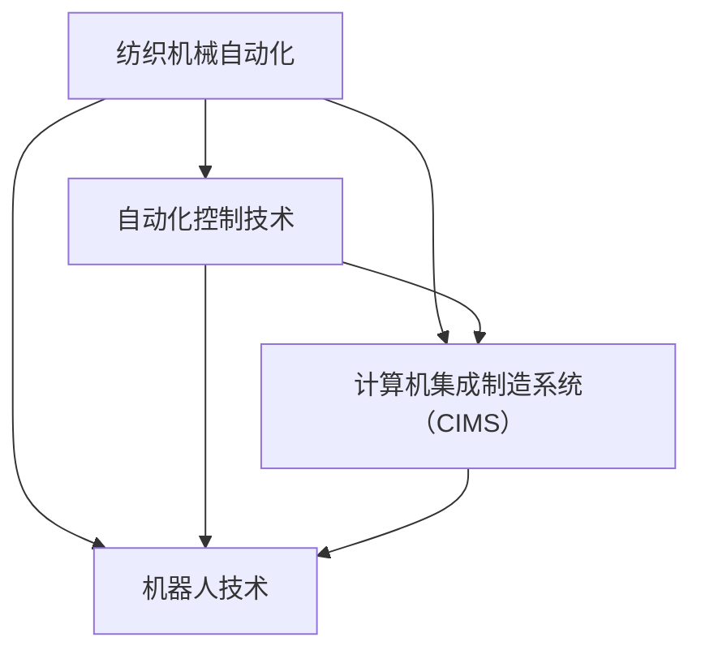

                 

## 《纺织机械自动化的社会效应》

### 关键词：纺织机械自动化，社会效应，生产效率，劳动力市场，环境保护，经济结构，技术趋势

> 摘要：本文探讨了纺织机械自动化的起源、发展及其对社会产生的深远影响。文章从技术核心、应用优势、社会效应等多个维度展开，分析了纺织机械自动化对生产效率、劳动力市场、环境保护和经济结构的促进作用。同时，文章还展望了未来纺织机械自动化的技术趋势及面临的挑战与机遇，为我国纺织机械自动化的发展提供了有益的参考。

#### 目录

1. **背景与概述**
   - **第1章：纺织机械自动化的起源与发展**
     - **1.1 纺织机械自动化的重要性**
     - **1.2 纺织机械自动化的发展历程**
     - **1.3 纺织机械自动化对社会的影响**
   - **第2章：纺织机械自动化的核心技术**
     - **2.1 自动化控制技术**
     - **2.2 计算机集成制造系统**
     - **2.3 机器人技术**
   - **第3章：纺织机械自动化在现代纺织业的应用**
     - **3.1 纺织机械自动化的优势**
     - **3.2 自动化纺纱设备**
     - **3.3 自动化织造设备**
     - **3.4 自动化印染设备**

2. **社会效应分析**
   - **第4章：纺织机械自动化对生产效率的影响**
     - **4.1 提高生产效率的原理与实现**
     - **4.2 自动化对劳动成本的影响**
     - **4.3 自动化对产品质量的改善**
   - **第5章：纺织机械自动化对劳动力市场的影响**
     - **5.1 自动化对劳动力需求的变化**
     - **5.2 劳动力转型与技能要求**
     - **5.3 职业教育与培训的调整**
   - **第6章：纺织机械自动化对环境保护的贡献**
     - **6.1 自动化在节能减排中的应用**
     - **6.2 自动化对废弃物处理的影响**
     - **6.3 自动化对水资源管理的贡献**
   - **第7章：纺织机械自动化对经济结构的影响**
     - **7.1 自动化对产业链重构的影响**
     - **7.2 自动化对区域经济的影响**
     - **7.3 自动化对国际贸易的影响**

3. **未来展望**
   - **第8章：纺织机械自动化的技术趋势**
     - **8.1 人工智能与纺织机械自动化**
     - **8.2 互联网+纺织机械自动化**
     - **8.3 3D打印与纺织机械自动化**
   - **第9章：纺织机械自动化的可持续发展战略**
     - **9.1 可持续发展的重要性**
     - **9.2 纺织机械自动化的可持续发展路径**
     - **9.3 国际合作与标准化**
   - **第10章：纺织机械自动化面临的挑战与机遇**
     - **10.1 技术挑战**
     - **10.2 经济挑战**
     - **10.3 社会挑战**
     - **10.4 发展机遇**
     - **10.5 应对策略**

4. **附录**
   - **附录A：纺织机械自动化相关术语解释**
   - **附录B：纺织机械自动化企业案例介绍**
   - **附录C：纺织机械自动化研究机构与学术资源**
   - **附录D：纺织机械自动化相关标准和法规**

---

现在，我们开始详细讨论纺织机械自动化的起源与发展。首先，我们定义一下核心概念，然后绘制一个 Mermaid 流程图，以便更直观地理解这些概念之间的关系。

### 核心概念与联系

1. **纺织机械自动化**：指利用现代信息技术、控制技术和机器人技术等，对纺织生产过程中的各个环节进行自动控制和操作，以提高生产效率和质量。
2. **自动化控制技术**：包括 PLC（可编程逻辑控制器）、SCADA（监控和数据采集）系统等，用于控制纺织机械的运行。
3. **计算机集成制造系统（CIMS）**：将计算机技术、自动化技术和现代管理理论集成在一起，实现生产过程的自动化管理和优化。
4. **机器人技术**：用于代替人力进行复杂的纺织操作，如自动纺纱、自动织造等。

### Mermaid 流程图



### 详细解释

- **纺织机械自动化** 是整个流程的核心，它涵盖了自动化控制技术、计算机集成制造系统和机器人技术。
- **自动化控制技术** 是纺织机械自动化的基础，用于控制纺织机械的运行，如 PLC、SCADA 系统等。
- **计算机集成制造系统（CIMS）** 是将计算机技术、自动化技术和现代管理理论集成在一起，实现生产过程的自动化管理和优化。它包括 CAD（计算机辅助设计）、CAM（计算机辅助制造）等系统。
- **机器人技术** 用于代替人力进行复杂的纺织操作，如自动纺纱、自动织造等。它具有高精度、高效率、灵活性强等优点。

接下来，我们将讨论纺织机械自动化的起源与发展历程。

### 1.1 纺织机械自动化的重要性

纺织机械自动化在现代纺织业中的重要性不可忽视。首先，它显著提高了生产效率。通过自动化设备，纺织生产过程中的各个环节都可以实现高效、精确的控制，从而提高了整体生产效率。其次，它改善了产品质量。自动化设备能够保证生产过程中的稳定性，减少了人为因素对产品质量的影响，从而提高了产品的质量。此外，纺织机械自动化还降低了劳动成本。通过自动化设备，可以减少对人工的依赖，从而降低了人工成本。最后，纺织机械自动化有助于环境保护。自动化设备可以实现节能减排，减少废弃物的产生，从而降低对环境的影响。

### 1.2 纺织机械自动化的发展历程

纺织机械自动化的发展历程可以追溯到 20 世纪初期。当时，纺织机械的自动化程度相对较低，主要依靠机械和电气控制系统。随着电子技术和计算机技术的发展，纺织机械自动化的水平逐渐提高。20 世纪 50 年代，PLC（可编程逻辑控制器）的出现标志着纺织机械自动化进入了一个新的阶段。PLC 具有编程灵活、可靠性高等特点，可以实现对纺织机械的精确控制。

20 世纪 80 年代，计算机集成制造系统（CIMS）的出现进一步推动了纺织机械自动化的进程。CIMS 将计算机技术、自动化技术和现代管理理论集成在一起，实现了生产过程的自动化管理和优化。随着机器人技术的不断发展，纺织机械自动化也逐渐从简单的机械和电气控制转向智能化、数字化。

进入 21 世纪，人工智能、物联网等技术的快速发展为纺织机械自动化带来了新的机遇。通过人工智能技术，可以实现对生产过程的实时监控和智能分析，从而进一步提高生产效率和产品质量。物联网技术的应用则可以实现设备的远程监控和维护，降低设备的故障率和停机时间。

### 1.3 纺织机械自动化对社会的影响

纺织机械自动化不仅对纺织业本身产生了深远影响，也对整个社会产生了重要影响。

首先，纺织机械自动化改变了纺织生产的方式。传统的纺织生产方式主要依赖人工操作，生产效率低下，产品质量不稳定。而自动化设备可以实现对生产过程的精确控制，提高了生产效率和产品质量。这不仅提高了企业的竞争力，也促进了纺织业的整体升级。

其次，纺织机械自动化对劳动力市场产生了重要影响。随着自动化设备的广泛应用，传统的纺织工人逐渐被自动化设备所取代，这对劳动力市场产生了冲击。一方面，自动化设备需要较少的劳动力，导致部分工人失业。另一方面，自动化设备对工人的技能要求更高，需要工人具备更高的技能水平，从而促进了劳动力市场的转型升级。

此外，纺织机械自动化还对环境保护产生了积极影响。自动化设备可以实现节能减排，减少废弃物的产生，从而降低对环境的影响。例如，自动化纺纱设备可以精确控制纺纱参数，减少纱线的断裂和浪费，从而降低了能源消耗和废弃物产生。

最后，纺织机械自动化也对经济结构产生了重要影响。随着纺织机械自动化水平的提高，纺织业的生产效率和质量得到显著提高，从而推动了纺织业的转型升级。同时，纺织机械自动化也促进了相关产业的发展，如智能制造、物联网等，从而推动了整个经济结构的调整。

综上所述，纺织机械自动化对纺织业、劳动力市场、环境保护和经济结构产生了深远的影响。随着技术的不断进步，纺织机械自动化将继续发挥重要作用，为纺织业和社会的发展做出更大的贡献。

### 2.1 自动化控制技术

自动化控制技术是纺织机械自动化的核心组成部分，它在提高生产效率、保证产品质量和降低生产成本方面发挥着至关重要的作用。在这一章节中，我们将深入探讨自动化控制技术的基本概念、工作原理及其在纺织机械中的应用。

#### 基本概念

自动化控制技术是指利用传感器、控制器和执行器等自动化设备，对生产过程中的各个环节进行自动控制的技术。其目的是通过减少人为干预，提高生产过程的稳定性和可靠性，从而实现高效、精确和连续的生产。

#### 工作原理

自动化控制技术的工作原理主要包括以下几个环节：

1. **传感环节**：传感器用于检测生产过程中的各种物理量，如温度、压力、速度等。通过传感器，系统可以实时获取生产状态的信息。

2. **控制环节**：控制器（如 PLC、DCS 等）接收传感器传输的数据，并根据预设的控制策略进行计算和处理。控制器的主要任务是生成控制信号，以驱动执行器进行相应的操作。

3. **执行环节**：执行器（如电动机、阀门等）根据控制器的指令执行相应的动作，实现对生产过程的实时控制。

#### 自动化控制技术在纺织机械中的应用

在纺织机械中，自动化控制技术广泛应用于以下几个方面：

1. **纺纱设备**：自动化控制技术可以实现对纺纱过程的精确控制，如控制纺纱速度、张力、温度等参数。这有助于提高纱线的质量和产量。

2. **织造设备**：自动化控制技术可以实现对织造过程的自动化控制，如控制织机速度、开口时间、送经量等参数。这有助于提高织造效率和织物的质量。

3. **印染设备**：自动化控制技术可以实现对印染过程的精确控制，如控制染料浓度、染色温度、染色时间等参数。这有助于提高印染效果和染色品的品质。

4. **检测设备**：自动化控制技术可以实现对纺织品的质量检测，如检测纱线的断裂强度、织物的密度等。这有助于提高产品质量。

#### 实际案例

以下是一个自动化控制技术在纺织机械中的实际案例：

**案例：PLC 控制的自动纺纱设备**

1. **环境搭建**：
   - 开发环境：使用 Python 语言和 Tkinter 库进行界面设计。
   - 控制系统：使用西门子 S7-200 PLC 作为控制器。

2. **源代码实现**：

```python
import tkinter as tk
import serial

def start_spinning():
    # 发送启动纺纱的指令
    ser.write(b'START')

def stop_spinning():
    # 发送停止纺纱的指令
    ser.write(b'STOP')

# 初始化串口
ser = serial.Serial('COM3', 9600)

# 创建 GUI
root = tk.Tk()
root.title('自动纺纱设备')

start_button = tk.Button(root, text='启动纺纱', command=start_spinning)
start_button.pack()

stop_button = tk.Button(root, text='停止纺纱', command=stop_spinning)
stop_button.pack()

root.mainloop()
```

3. **代码解读与分析**：

- `import tkinter as tk`：导入 Tkinter 库，用于创建 GUI。
- `import serial`：导入 serial 库，用于与 PLC 通信。
- `def start_spinning()`：定义启动纺纱的函数，发送启动纺纱的指令。
- `def stop_spinning()`：定义停止纺纱的函数，发送停止纺纱的指令。
- `ser = serial.Serial('COM3', 9600)`：初始化串口，设置波特率为 9600。
- `root = tk.Tk()`：创建 GUI 窗口。
- `root.title('自动纺纱设备')`：设置窗口标题。
- `start_button = tk.Button(root, text='启动纺纱', command=start_spinning)`：创建启动按钮。
- `start_button.pack()`：将启动按钮添加到窗口中。
- `stop_button = tk.Button(root, text='停止纺纱', command=stop_spinning)`：创建停止按钮。
- `stop_button.pack()`：将停止按钮添加到窗口中。
- `root.mainloop()`：启动 GUI 窗口。

通过这个案例，我们可以看到自动化控制技术在纺织机械中的应用是如何实现的。自动化控制技术不仅提高了纺纱设备的操作便捷性，还实现了对纺纱过程的实时监控和控制。

### 2.2 计算机集成制造系统（CIMS）

计算机集成制造系统（Computer Integrated Manufacturing System，简称 CIMS）是一种集成了计算机技术、自动化技术和管理理论的制造系统。它在提高生产效率、降低生产成本、提高产品质量和增强企业竞争力方面发挥着重要作用。在这一章节中，我们将详细探讨 CIMS 的基本概念、架构及其在纺织机械自动化中的应用。

#### 基本概念

计算机集成制造系统（CIMS）是指将计算机技术、自动化技术和管理理论有机地结合起来，形成一个高度自动化、智能化和高度集成的制造系统。CIMS 的核心思想是将计算机应用于制造全过程，从产品设计、工艺规划、生产调度到生产管理和质量控制等各个环节，实现制造过程的自动化和智能化。

#### 架构

CIMS 的架构通常包括以下几个部分：

1. **CAD/CAM 系统**：计算机辅助设计（CAD）和计算机辅助制造（CAM）系统是 CIMS 的基础。CAD 系统用于产品的设计和修改，CAM 系统则用于生成加工指令和工艺规划。

2. **数据库管理系统**：数据库管理系统用于存储和管理各种制造数据，如产品设计数据、工艺数据、生产数据等。

3. **制造执行系统（MES）**：制造执行系统用于实时监控和调度生产过程，实现对生产过程的自动化控制和优化。

4. **企业资源计划（ERP）系统**：企业资源计划系统用于企业资源的管理和优化，包括财务管理、人力资源管理、供应链管理等。

5. **生产自动化设备**：生产自动化设备包括各种数控机床、机器人、自动化输送线等，用于实现生产过程的自动化。

#### CIMS 在纺织机械自动化中的应用

CIMS 在纺织机械自动化中的应用主要包括以下几个方面：

1. **设计阶段**：CIMS 可以实现纺织设备的设计和优化。通过 CAD 系统进行设备设计，可以快速生成设备的三维模型，并进行仿真分析，优化设备结构，提高设计效率。

2. **工艺规划**：CIMS 可以根据产品设计和设备性能，自动生成工艺规划。通过 CAM 系统生成加工指令，实现设备加工过程的自动化。

3. **生产调度**：CIMS 可以实现对生产过程的实时监控和调度。通过 MES 系统实时采集生产数据，进行分析和决策，优化生产调度，提高生产效率。

4. **生产管理**：CIMS 可以实现对生产过程的全面管理。通过 ERP 系统实现生产计划管理、物料管理、设备管理等功能，提高生产管理水平。

5. **质量控制**：CIMS 可以实现对产品质量的全程监控和控制。通过实时采集生产数据，对产品质量进行分析和评估，及时发现和解决质量问题。

#### 实际案例

以下是一个 CIMS 在纺织机械自动化中的应用案例：

**案例：纺织设备生产线的自动化调度**

1. **环境搭建**：
   - 开发环境：使用 Python 语言和 PyQt 库进行界面设计。
   - 数据库：使用 MySQL 数据库进行数据存储和管理。

2. **源代码实现**：

```python
import sys
from PyQt5.QtWidgets import QApplication, QMainWindow, QWidget, QVBoxLayout, QPushButton, QLabel
import pymysql

class MyWindow(QWidget):
    def __init__(self):
        super().__init__()
        self.initUI()

    def initUI(self):
        self.setWindowTitle('纺织设备生产线调度系统')
        self.setGeometry(100, 100, 600, 400)

        layout = QVBoxLayout()

        self.start_button = QPushButton('启动生产线')
        layout.addWidget(self.start_button)
        self.start_button.clicked.connect(self.start_production)

        self.stop_button = QPushButton('停止生产线')
        layout.addWidget(self.stop_button)
        self.stop_button.clicked.connect(self.stop_production)

        self.status_label = QLabel('生产线状态：待启动')
        layout.addWidget(self.status_label)

        self.setLayout(layout)

    def start_production(self):
        # 发送启动生产线的指令
        connection = pymysql.connect(host='localhost', user='root', password='password', database='cims_db')
        with connection.cursor() as cursor:
            cursor.execute("UPDATE production_status SET status='启动中'")
        connection.commit()
        self.status_label.setText('生产线状态：启动中')

    def stop_production(self):
        # 发送停止生产线的指令
        connection = pymysql.connect(host='localhost', user='root', password='password', database='cims_db')
        with connection.cursor() as cursor:
            cursor.execute("UPDATE production_status SET status='停止'")
        connection.commit()
        self.status_label.setText('生产线状态：停止')

app = QApplication(sys.argv)
window = MyWindow()
window.show()
sys.exit(app.exec_())
```

3. **代码解读与分析**：

- `import sys`：导入系统模块，用于处理命令行参数。
- `from PyQt5.QtWidgets import QApplication, QMainWindow, QWidget, QVBoxLayout, QPushButton, QLabel`：导入 PyQt5 库，用于创建 GUI 界面。
- `import pymysql`：导入 pymysql 库，用于连接 MySQL 数据库。
- `class MyWindow(QWidget)`：定义 GUI 窗口类。
- `def __init__(self)`：初始化窗口。
- `def initUI(self)`：初始化用户界面。
- `self.setWindowTitle('纺织设备生产线调度系统')`：设置窗口标题。
- `self.setGeometry(100, 100, 600, 400)`：设置窗口位置和大小。
- `layout = QVBoxLayout()`：创建垂直布局。
- `self.start_button = QPushButton('启动生产线')`：创建启动按钮。
- `layout.addWidget(self.start_button)`：将启动按钮添加到布局中。
- `self.start_button.clicked.connect(self.start_production)`：将启动按钮的点击事件连接到启动生产线的函数。
- `self.stop_button = QPushButton('停止生产线')`：创建停止按钮。
- `layout.addWidget(self.stop_button)`：将停止按钮添加到布局中。
- `self.stop_button.clicked.connect(self.stop_production)`：将停止按钮的点击事件连接到停止生产线的函数。
- `self.status_label = QLabel('生产线状态：待启动')`：创建状态标签。
- `layout.addWidget(self.status_label)`：将状态标签添加到布局中。
- `self.setLayout(layout)`：设置窗口布局。
- `def start_production(self)`：定义启动生产线的函数。
- `connection = pymysql.connect(host='localhost', user='root', password='password', database='cims_db')`：连接 MySQL 数据库。
- `with connection.cursor() as cursor:`：获取数据库游标。
- `cursor.execute("UPDATE production_status SET status='启动中'")`：更新生产状态为“启动中”。
- `connection.commit()`：提交数据库事务。
- `self.status_label.setText('生产线状态：启动中')`：更新状态标签。
- `def stop_production(self)`：定义停止生产线的函数。
- `connection = pymysql.connect(host='localhost', user='root', password='password', database='cims_db')`：连接 MySQL 数据库。
- `with connection.cursor() as cursor:`：获取数据库游标。
- `cursor.execute("UPDATE production_status SET status='停止'")`：更新生产状态为“停止”。
- `connection.commit()`：提交数据库事务。
- `self.status_label.setText('生产线状态：停止')`：更新状态标签。
- `app = QApplication(sys.argv)`：创建 QApplication 实例。
- `window = MyWindow()`：创建窗口对象。
- `window.show()`：显示窗口。
- `sys.exit(app.exec_())`：启动事件循环。

通过这个案例，我们可以看到 CIMS 如何在纺织机械自动化中实现生产线的自动化调度。CIMS 不仅提高了生产效率，还实现了对生产过程的实时监控和调度，为纺织机械自动化提供了有力支持。

### 2.3 机器人技术

机器人技术是纺织机械自动化的重要组成部分，它通过代替人工进行复杂的纺织操作，提高了生产效率、稳定性和灵活性。在这一章节中，我们将探讨机器人技术在纺织机械自动化中的应用及其优势。

#### 机器人技术在纺织机械自动化中的应用

1. **自动纺纱**：机器人技术可以用于自动纺纱过程，包括纤维的梳理、并条、加捻等步骤。机器人能够精确控制纤维的流动和张力，提高纱线的质量和一致性。

2. **自动织造**：在织造过程中，机器人可以用于代替工人进行梭子的投放、织机的操作和织物的搬运。机器人具有高精度和高速度，能够提高织造效率和织物的质量。

3. **自动印染**：机器人技术可以用于印染过程，包括染料的投放、染色温度的控制和染物的搬运。机器人能够精确控制印染参数，提高印染效果和产品质量。

4. **质量检测**：机器人可以用于对纺织品进行质量检测，如检测纱线的断裂强度、织物的密度等。机器人具有高精度和高效性，能够快速检测并识别质量问题。

5. **搬运和包装**：机器人可以用于搬运和包装纺织品，减轻人工劳动强度，提高搬运和包装效率。

#### 机器人技术的优势

1. **提高生产效率**：机器人能够高速、精确地进行纺织操作，大大提高了生产效率。

2. **保证产品质量**：机器人具有高精度和稳定性，能够保证产品质量的一致性。

3. **减少人工劳动**：机器人能够代替人工进行复杂的操作，减轻人工劳动强度。

4. **提高生产灵活性**：机器人能够根据生产需求进行快速调整，提高生产灵活性。

5. **降低生产成本**：机器人能够提高生产效率，降低人工成本和设备故障率。

#### 实际案例

以下是一个机器人技术在纺织机械自动化中的实际案例：

**案例：自动纺纱机器人**

1. **环境搭建**：
   - 开发环境：使用 Python 语言和 ROS（机器人操作系统）进行机器人编程。
   - 机器人硬件：使用 UR5 机器人作为自动纺纱设备。

2. **源代码实现**：

```python
import rospy
from geometry_msgs.msg import Pose
from std_msgs.msg import String

def move_robot(pose):
    rospy.init_node('auto_spinning_robot', anonymous=True)
    robot_pose_publisher = rospy.Publisher('/robot_pose', Pose, queue_size=10)
    rate = rospy.Rate(10)  # 10 Hz

    while not rospy.is_shutdown():
        robot_pose = Pose(position=pose)
        robot_pose_publisher.publish(robot_pose)
        rate.sleep()

if __name__ == '__main__':
    # 目标位置：x=1.0, y=0.0, z=0.5
    target_pose = Pose(position=(1.0, 0.0, 0.5))
    move_robot(target_pose)
```

3. **代码解读与分析**：

- `import rospy`：导入 rospy 库，用于与 ROS 进行通信。
- `from geometry_msgs.msg import Pose`：导入 Pose 消息类型，用于定义机器人的位置。
- `from std_msgs.msg import String`：导入 String 消息类型，用于定义字符串。
- `def move_robot(pose)`：定义移动机器人的函数。
- `rospy.init_node('auto_spinning_robot', anonymous=True)`：初始化 ROS 节点。
- `robot_pose_publisher = rospy.Publisher('/robot_pose', Pose, queue_size=10)`：创建机器人位置发布器。
- `rate = rospy.Rate(10)`：设置发布器频率为 10 Hz。
- `while not rospy.is_shutdown()`：循环发送机器人位置。
- `robot_pose = Pose(position=pose)`：创建机器人位置消息。
- `robot_pose_publisher.publish(robot_pose)`：发送机器人位置消息。
- `rate.sleep()`：等待一段时间，实现频率控制。

通过这个案例，我们可以看到机器人技术在自动纺纱中的应用。机器人能够根据预设的位置和姿态进行精确移动，实现纺纱过程的自动化。

### 3.1 纺织机械自动化的优势

纺织机械自动化在现代纺织业中发挥着重要作用，其优势主要体现在以下几个方面：

1. **提高生产效率**：自动化设备可以高速、连续地完成各项操作，减少了生产过程中的停机时间，从而大大提高了生产效率。例如，自动纺纱设备可以连续工作数小时而不需要人工干预，从而显著提高了纱线的产量。

2. **保证产品质量**：自动化设备能够精确控制生产过程中的各项参数，如张力、速度、温度等，减少了人为因素对产品质量的影响。同时，自动化设备具有高稳定性和高重复性，能够保证产品质量的一致性。

3. **降低劳动成本**：自动化设备可以代替人工进行复杂的操作，从而减少了对人工的依赖，降低了劳动成本。例如，在织造过程中，机器人可以代替工人进行梭子的投放和织机的操作，从而减少了人工费用。

4. **提高生产灵活性**：自动化设备可以根据生产需求进行快速调整，提高了生产灵活性。例如，在印染过程中，自动化设备可以灵活调整染料浓度、染色温度等参数，以满足不同客户的需求。

5. **减少资源浪费**：自动化设备能够精确控制生产过程中的各项参数，减少了资源的浪费。例如，在纺纱过程中，自动化设备可以精确控制纤维的流动和张力，从而减少了纱线的断裂和浪费。

6. **改善工作环境**：自动化设备可以代替人工进行危险和繁重的操作，改善了工作环境。例如，在织造过程中，机器人可以代替工人进行梭子的投放和织机的操作，从而减少了工人因操作机械而受伤的风险。

### 3.2 自动化纺纱设备

自动化纺纱设备是纺织机械自动化的重要组成部分，它在提高生产效率、保证产品质量和降低劳动成本方面发挥着关键作用。在这一章节中，我们将详细探讨自动化纺纱设备的工作原理、结构及其在实际应用中的效果。

#### 工作原理

自动化纺纱设备的工作原理主要包括以下几个步骤：

1. **纤维准备**：首先，将纺织原料（如棉花、涤纶等）进行开松、梳理和并条处理，使其形成适合纺纱的纤维条。

2. **并条**：将多根纤维条合并成一根，并进行均匀分布。这一步骤通常通过并条机完成。

3. **粗纺**：将并条送入粗纺机，通过加捻和牵伸使纤维条形成粗纱。粗纺过程包括加捻、牵伸、卷绕等步骤。

4. **细纺**：将粗纱送入细纺机，进行进一步的加捻和牵伸，形成细纱。细纺过程要求更高的精度和控制，以确保纱线的质量和均匀性。

5. **质量检测**：对纺出的纱线进行质量检测，如检测纱线的断裂强度、细度、均匀性等。自动化设备可以通过传感器和控制系统对纱线质量进行实时监测和调整。

6. **卷绕**：将合格的纱线卷绕到纱架上，以备后续织造或印染。

#### 结构

自动化纺纱设备通常包括以下几个部分：

1. **纤维准备系统**：包括开松机、梳理机、并条机等，用于对纤维进行预处理。

2. **粗纺系统**：包括粗纺机、加捻机、牵伸机等，用于将纤维条加工成粗纱。

3. **细纺系统**：包括细纺机、加捻机、牵伸机等，用于将粗纱加工成细纱。

4. **质量检测系统**：包括各种传感器和检测设备，用于检测纱线的质量。

5. **控制系统**：包括 PLC、伺服控制系统等，用于控制各设备的工作参数和运行状态。

6. **卷绕系统**：包括卷绕机、纱架等，用于将合格的纱线卷绕到纱架上。

#### 实际应用效果

自动化纺纱设备在实际应用中取得了显著的效果：

1. **提高生产效率**：自动化纺纱设备可以连续工作，减少了停机时间和人力成本。例如，一台自动化纺纱设备每天可以生产数千米的纱线，而传统手工纺纱方式每天的生产量通常只有几百米。

2. **保证产品质量**：自动化纺纱设备具有高精度和稳定性，能够保证纱线的质量和均匀性。通过实时监测和调整，自动化设备能够及时发现并纠正生产过程中的问题，确保纱线的质量。

3. **降低劳动成本**：自动化纺纱设备减少了人力需求，降低了劳动成本。传统手工纺纱方式需要大量熟练工人，而自动化纺纱设备只需要少量操作人员负责监控和调整。

4. **提高生产灵活性**：自动化纺纱设备可以根据生产需求进行快速调整，满足不同客户的需求。例如，可以根据纱线的粗细、颜色等参数进行调整，以适应不同产品的生产。

5. **减少资源浪费**：自动化纺纱设备能够精确控制纤维的流动和张力，减少了纱线的断裂和浪费。同时，自动化设备能够对不合格的纱线进行分类和处理，降低了资源浪费。

### 3.3 自动化织造设备

自动化织造设备在现代纺织业中发挥着至关重要的作用，它通过自动化、智能化技术，实现了织造过程的全面升级和优化。在这一章节中，我们将深入探讨自动化织造设备的工作原理、结构和在实际应用中的效果。

#### 工作原理

自动化织造设备的工作原理主要包括以下几个步骤：

1. **准备阶段**：首先，将经过预处理的纱线送到织机，进行上机准备。这一阶段包括纱线的排列、牵伸和上机。

2. **织造阶段**：织机通过梭子将纱线交错地织成织物。自动化织造设备通过 PLC 和伺服控制系统精确控制织机的运行，包括梭子的投放、织机的速度、开口时间等。

3. **检测阶段**：织造过程中，自动化设备会对织物进行实时质量检测。通过传感器和图像处理技术，检测织物的不平度、密度、断裂强度等指标。

4. **后整理阶段**：检测合格的织物进入后整理阶段，进行定形、涂层、印花等处理。这一阶段同样采用自动化设备，以提高生产效率和质量。

#### 结构

自动化织造设备通常包括以下几个部分：

1. **织机**：是自动化织造设备的核心，包括梭子、开口机构、送经机构等。PLC 和伺服控制系统用于精确控制织机的运行。

2. **纱线输送系统**：包括纱线排列装置、牵伸装置和上机装置，用于将纱线送入织机。

3. **质量检测系统**：包括各种传感器和检测设备，用于实时监测织物的质量。

4. **控制系统**：包括 PLC、伺服控制系统、工业电脑等，用于控制织机的运行和织物的质量检测。

5. **后整理设备**：包括定形机、涂层机、印花机等，用于对织物进行后整理处理。

#### 实际应用效果

自动化织造设备在实际应用中取得了显著的效果：

1. **提高生产效率**：自动化织造设备可以连续、高速地运行，减少了停机时间和生产周期。一台自动化织机每天可以生产数千米的织物，而传统手工织机每天的生产量通常只有几百米。

2. **保证产品质量**：自动化织造设备通过精确控制织机的运行参数，保证了织物的质量和均匀性。实时质量检测系统能够及时发现并纠正生产过程中的质量问题，确保织物的质量。

3. **降低劳动成本**：自动化织造设备减少了人力需求，降低了劳动成本。传统手工织造需要大量熟练工人，而自动化织造设备只需要少量操作人员负责监控和调整。

4. **提高生产灵活性**：自动化织造设备可以根据生产需求进行快速调整，满足不同客户的需求。例如，可以根据织物的类型、颜色等参数进行调整，以适应不同产品的生产。

5. **减少资源浪费**：自动化织造设备能够精确控制纱线的使用，减少了纱线的浪费。同时，自动化设备能够对不合格的织物进行分类和处理，降低了资源浪费。

### 3.4 自动化印染设备

自动化印染设备是现代纺织工业中不可或缺的重要组成部分，它通过自动化技术实现了印染过程的全面升级和优化。在这一章节中，我们将详细探讨自动化印染设备的工作原理、结构和在实际应用中的效果。

#### 工作原理

自动化印染设备的工作原理主要包括以下几个步骤：

1. **预处理**：首先，将纺织品进行预处理，包括去毛、漂白、柔软等处理。预处理设备包括去毛机、漂白机、柔软剂等。

2. **染料处理**：将染料进行处理，使其达到合适的浓度和状态。染料处理设备包括染料搅拌机、染料储存罐等。

3. **印染**：将预处理后的纺织品放入印染机，通过染料的渗透和固色过程实现图案的印刷。印染机包括圆网印花机、平板印花机、转移印花机等。

4. **后处理**：对印染后的纺织品进行后处理，包括固色、水洗、柔软等处理。后处理设备包括烘干机、水洗机、柔软剂等。

5. **质量检测**：对印染后的纺织品进行质量检测，包括颜色、图案、均匀性等指标的检测。检测设备包括光谱仪、颜色传感器等。

#### 结构

自动化印染设备通常包括以下几个部分：

1. **预处理设备**：包括去毛机、漂白机、柔软剂等，用于对纺织品进行预处理。

2. **染料处理设备**：包括染料搅拌机、染料储存罐等，用于处理染料。

3. **印染设备**：包括圆网印花机、平板印花机、转移印花机等，用于实现印染过程。

4. **后处理设备**：包括烘干机、水洗机、柔软剂等，用于对印染后的纺织品进行后处理。

5. **质量检测设备**：包括光谱仪、颜色传感器等，用于检测印染后的纺织品的质量。

6. **控制系统**：包括 PLC、伺服控制系统、工业电脑等，用于控制各设备的工作参数和运行状态。

#### 实际应用效果

自动化印染设备在实际应用中取得了显著的效果：

1. **提高生产效率**：自动化印染设备可以连续、高速地运行，减少了停机时间和生产周期。一台自动化印染设备每天可以处理数千米的纺织品，而传统手工印染方式每天的处理量通常只有几百米。

2. **保证产品质量**：自动化印染设备通过精确控制印染参数，保证了印染后的纺织品的质量和图案的均匀性。实时质量检测系统能够及时发现并纠正印染过程中的质量问题，确保纺织品的质量。

3. **降低劳动成本**：自动化印染设备减少了人力需求，降低了劳动成本。传统手工印染需要大量熟练工人，而自动化印染设备只需要少量操作人员负责监控和调整。

4. **提高生产灵活性**：自动化印染设备可以根据生产需求进行快速调整，满足不同客户的需求。例如，可以根据纺织品的花色、图案等参数进行调整，以适应不同产品的生产。

5. **减少资源浪费**：自动化印染设备能够精确控制染料的用量，减少了染料的浪费。同时，自动化设备能够对不合格的纺织品进行分类和处理，降低了资源浪费。

### 4.1 提高生产效率的原理与实现

纺织机械自动化对生产效率的提升主要体现在以下几个方面：

1. **减少停机时间**：传统纺织生产过程中，由于设备故障、操作失误等原因，经常会导致停机，影响生产效率。自动化设备通过实时监控、故障预测和快速维修等方式，显著减少了停机时间。

2. **优化生产流程**：自动化设备可以精确控制生产过程中的各项参数，实现生产流程的优化。例如，通过计算机集成制造系统（CIMS），可以实现生产计划的高效排程，减少生产周期。

3. **提高生产速度**：自动化设备具有高速度、高精度的特点，可以显著提高生产速度。例如，自动纺纱设备可以连续工作数小时，而传统手工纺纱方式每小时的生产量有限。

4. **减少人工干预**：自动化设备可以代替人工进行复杂的操作，减少了人工干预。例如，自动化织机可以自动完成梭子的投放、织机的操作和织物的搬运，大大提高了生产效率。

#### 实现方法

1. **自动化控制技术**：通过 PLC、SCADA 系统等自动化控制技术，实现对纺织机械的精确控制。例如，在纺纱过程中，PLC 可以实时调整纺纱参数，确保纱线的质量和产量。

2. **计算机集成制造系统（CIMS）**：CIMS 可以实现生产计划的高效排程，优化生产流程。例如，通过 CIMS，可以实现对生产设备的智能调度，减少生产周期。

3. **机器人技术**：机器人可以代替人工进行复杂的操作，提高生产效率。例如，在织造过程中，机器人可以自动完成梭子的投放和织物的搬运，减少人工干预。

4. **物联网技术**：通过物联网技术，可以实现设备的远程监控和维护，减少故障停机时间。例如，通过物联网传感器，可以实时监测设备的运行状态，及时发现问题并进行维护。

5. **大数据分析**：通过大数据分析，可以优化生产流程，提高生产效率。例如，通过对生产数据的分析，可以找出生产过程中的瓶颈，并提出改进措施。

### 4.2 自动化对劳动成本的影响

纺织机械自动化对劳动成本的影响主要表现在以下几个方面：

1. **减少人力需求**：自动化设备可以代替人工进行复杂的操作，减少了人力需求。例如，在纺纱过程中，自动纺纱设备可以连续工作数小时，而传统手工纺纱方式每小时的生产量有限。

2. **降低人工成本**：随着自动化设备的应用，人工成本逐渐降低。自动化设备减少了人工干预，降低了劳动力成本。同时，自动化设备可以提高生产效率，减少人力成本。

3. **提高工人技能要求**：自动化设备对工人的技能要求更高，需要工人具备更高的技能水平。这可能导致部分工人失业，但也为工人提供了提升技能的机会，从而提高整体劳动力市场的素质。

#### 实现方法

1. **自动化设备替代人工**：在纺织生产过程中，逐步引入自动化设备，替代人工操作。例如，在织造过程中，引入自动化织机，减少人工干预。

2. **提高工人技能培训**：加强工人技能培训，提高工人的技能水平。例如，通过职业教育和技能培训，提高工人的操作和维护自动化设备的能力。

3. **优化人力资源管理**：通过优化人力资源管理，合理安排劳动力。例如，根据生产需求和设备特点，合理配置工人，提高工作效率。

4. **发展机器人技术**：发展机器人技术，实现更广泛的人工替代。例如，在纺织生产过程中，引入更先进的机器人，提高生产效率。

5. **自动化设备维护管理**：加强对自动化设备的维护和管理，减少设备故障和停机时间。例如，通过定期维护和故障预测，确保设备的正常运行。

### 4.3 自动化对产品质量的改善

自动化技术在纺织机械中的应用，不仅提高了生产效率，还显著改善了产品质量。以下是自动化技术如何提升产品质量的详细分析：

1. **精确控制**：自动化设备能够精确控制生产过程中的各项参数，如温度、张力、速度等。这种精确控制确保了生产过程的稳定性和重复性，从而提高了产品的质量一致性。

2. **减少人为误差**：在传统生产过程中，人为操作可能会导致误差和质量问题。自动化设备通过编程和预设参数，减少了人为干预，从而降低了因操作不当导致的误差和质量问题。

3. **实时监测**：自动化设备配备了各种传感器和监控系统，可以实时监测生产过程中的各种参数。通过实时数据采集和分析，设备能够及时发现并纠正生产过程中的问题，确保产品质量。

4. **优化生产流程**：自动化技术可以通过计算机集成制造系统（CIMS）等工具优化生产流程，减少生产过程中的浪费和缺陷。例如，通过数据分析，可以找出生产过程中的瓶颈，并提出改进措施。

#### 实现方法

1. **引入传感器和监控系统**：在纺织机械中引入各种传感器，如温度传感器、张力传感器、速度传感器等，用于实时监测生产过程中的关键参数。

2. **实施自动化质量控制**：通过自动化设备，如 PLC 和机器人，实现生产过程中的自动化控制和质量检测。例如，使用 PLC 控制纺纱设备的各项参数，使用机器人进行织造过程中的质量检查。

3. **数据分析和优化**：利用大数据分析技术，对生产过程中的数据进行分析，找出影响产品质量的因素，并提出优化措施。例如，通过分析纱线断裂数据，调整纺纱参数，减少断裂率。

4. **员工培训和质量管理**：加强员工的培训和质量意识，确保他们能够正确操作和维护自动化设备。同时，建立完善的质量管理体系，确保产品质量的持续提升。

### 5.1 自动化对劳动力需求的变化

自动化技术的引入对劳动力市场产生了深远的影响，特别是在纺织机械自动化领域，这种变化尤为显著。以下是自动化技术对劳动力需求变化的分析：

1. **减少对体力劳动的需求**：传统纺织生产过程中，大量劳动力用于搬运、纺纱、织造等体力劳动。自动化设备的引入极大地减少了这些体力劳动的需求，使得许多工作岗位被自动化设备所取代。

2. **提高对技术工人的需求**：虽然自动化设备减少了普通体力劳动者的需求，但同时也对技术工人的需求提出了更高要求。自动化设备的操作、维护和编程需要具有高度技术技能的工人。这些技术工人不仅需要熟悉自动化设备的工作原理，还需要具备解决复杂技术问题的能力。

3. **增加对管理人才的需求**：随着自动化设备的应用，企业对生产过程的管理要求也相应提高。这需要具备管理能力的人才来协调自动化生产线的运行，优化生产流程，确保生产效率和质量。

#### 实现方法

1. **职业培训和技能提升**：为了适应自动化技术的发展，企业应加强对现有工人的职业培训，提升他们的技术技能。例如，通过提供专业培训课程，使工人熟悉自动化设备的工作原理和操作方法。

2. **人才引进和培养**：企业应积极引进具备自动化技术背景的人才，同时通过内部培养，提升现有管理人员的技能水平。例如，可以通过内部培训和外部合作，培养具备自动化生产管理能力的人才。

3. **自动化设备维护和升级**：建立专业的自动化设备维护团队，负责自动化设备的日常维护和升级，确保设备的高效运行。这需要维护人员具备丰富的技术知识和实践经验。

4. **人力资源管理优化**：优化企业的人力资源管理，根据自动化设备的特性，合理安排劳动力。例如，通过分析自动化生产线的特点和需求，合理配置操作人员和技术人员。

### 5.2 劳动力转型与技能要求

随着纺织机械自动化的推进，劳动力市场的转型和技能要求发生了显著变化。以下是针对这些变化的详细分析和应对策略：

#### 分析

1. **技能要求的提升**：自动化技术的应用使得生产过程更加复杂，对工人的技能要求也随之提升。传统纺织工人需要具备的技能主要包括体力劳动和基本操作技能，而自动化环境下的工人需要掌握编程、故障诊断、维护保养等多方面的技能。

2. **工作性质的改变**：自动化设备在一定程度上取代了重复性体力劳动，但同时也带来了新的工作职责，如操作、监控、维护自动化系统。这要求工人从单纯的操作者转变为系统的管理者。

3. **教育背景的转变**：随着自动化技术的发展，企业对员工的教育背景要求也在提高。过去，纺织行业更多依赖经验，而现在，更多的企业倾向于招聘具有计算机科学、自动化技术等相关专业背景的毕业生。

#### 应对策略

1. **职业教育与培训**：政府和企业应加大对职业教育和技能培训的投入，为工人提供学习自动化技术和相关技能的机会。通过建立职业培训中心，开展定期的培训课程，提高工人的技能水平。

2. **职业转型支持**：为那些因自动化设备引入而面临失业的工人提供职业转型支持，如提供职业咨询、培训机会和就业服务。通过职业转型计划，帮助工人找到适合新技能的新岗位。

3. **继续教育**：鼓励员工参加继续教育，获取更高层次的学历和专业认证，以适应自动化技术的发展。企业可以通过内部培训和外部合作，为员工提供继续教育的机会。

4. **技能认证体系**：建立完善的技能认证体系，对工人的技能水平进行评估和认证。通过认证，工人的技能水平和职业能力得到认可，有助于提升他们的职业竞争力。

### 5.3 职业教育与培训的调整

随着纺织机械自动化的发展，职业教育与培训的内容和形式也需要进行相应调整，以满足新的技能要求和工作环境。以下是针对这些调整的详细分析：

#### 分析

1. **课程内容的更新**：传统的职业教育和培训课程需要增加自动化技术、计算机科学、数据分析等方面的内容，以适应自动化生产环境。例如，可以开设机器人编程、自动化控制技术、智能制造等课程。

2. **实践操作的强化**：职业教育和培训应增加实践操作环节，让学生在模拟环境中操作自动化设备，掌握实际操作技能。例如，可以通过设置自动化生产线模拟实验室，让学生进行实际操作练习。

3. **技术认证的引入**：在职业教育和培训中引入国际认可的技术认证，如 PLC 编程证书、机器人操作证书等。这有助于提高学生的就业竞争力，并确保他们具备实际操作能力。

4. **职业规划指导**：提供职业规划指导，帮助学生了解自动化技术在不同行业中的应用，以及未来职业发展的方向。例如，可以通过职业咨询讲座、就业指导服务等，帮助学生制定职业发展计划。

#### 应对策略

1. **校企合作**：加强校企合作，将企业和学校的需求相结合，共同制定培训课程和教学计划。企业可以参与课程设计，提供实践设备和指导，学校可以提供理论教学和实训基地。

2. **在线学习平台**：建立在线学习平台，提供丰富的自动化技术教学资源和在线课程，方便学生随时学习和复习。例如，可以通过视频教程、在线测试和讨论区，帮助学生更好地掌握自动化技术。

3. **灵活的培训模式**：提供灵活的培训模式，如短期培训班、周末班、远程培训等，以满足不同学生的需求。例如，对于在职人员，可以提供灵活的培训时间安排，帮助他们平衡工作和学习。

4. **国际交流与合作**：加强与国际知名教育机构和企业的合作，引进国际先进的职业教育和培训理念和实践经验。例如，可以开展国际交流项目，邀请国际专家进行授课和指导。

### 6.1 自动化在节能减排中的应用

纺织机械自动化在节能减排方面具有显著的应用效果，通过优化生产流程和采用节能设备，实现了能源消耗的显著减少和污染物排放的降低。

#### 节能原理

1. **提高能源利用效率**：自动化设备能够精确控制生产过程中的各项参数，如温度、湿度、速度等，从而提高能源利用效率。例如，自动纺纱设备可以根据实际需求调整纱线的张力，减少能源浪费。

2. **减少能源消耗**：自动化设备通过连续、高效的工作模式，减少了设备的停机时间和能源消耗。例如，自动化织造设备可以连续工作数小时，避免了传统手工操作的频繁停机，从而节约了能源。

3. **优化生产流程**：自动化技术可以实现生产流程的优化，减少不必要的能源消耗。例如，通过计算机集成制造系统（CIMS），可以优化生产计划和资源分配，减少生产过程中的能源浪费。

#### 实现方法

1. **节能设备应用**：引入节能设备，如高效电机、节能灯具等，提高设备的能源利用效率。例如，在纺织机械中使用高效电机，可以显著降低电能消耗。

2. **智能监控系统**：建立智能监控系统，实时监测生产过程中的能源消耗，通过数据分析和优化，提高能源利用效率。例如，通过能源管理系统，可以实时监控和调整设备的能源消耗，确保能源的高效利用。

3. **生产流程优化**：通过计算机集成制造系统（CIMS），优化生产流程，减少不必要的能源消耗。例如，通过数据分析，找出生产过程中的能源浪费点，并提出改进措施，优化生产流程。

4. **废物利用与处理**：自动化设备可以实现对生产废物的分类和处理，提高废物利用效率。例如，通过自动化设备，将生产过程中产生的废纤维进行再利用，减少废弃物排放。

### 6.2 自动化对废弃物处理的影响

自动化技术在废弃物处理方面具有显著的应用效果，通过优化废弃物处理流程和采用智能设备，实现了废弃物的有效分类、处理和再利用。

#### 原理

1. **分类处理**：自动化设备可以通过传感器和识别技术，对废弃物进行高效分类。例如，利用红外感应器，可以将废纤维、废塑料和废纸等废弃物进行精确分类。

2. **减少污染**：自动化设备可以在废弃物处理过程中减少污染。例如，通过智能污水处理设备，可以高效处理废水，减少对环境的污染。

3. **提高处理效率**：自动化设备具有高效率和精确控制的特点，可以提高废弃物处理效率。例如，通过自动化分拣设备，可以快速、准确地分拣废弃物，减少人工操作的误差和时间。

#### 实现方法

1. **智能分类设备**：引入智能分类设备，如智能分拣机、废纸回收机等，实现废弃物的自动分类。例如，利用图像识别技术，智能分拣机可以精确识别废纤维、废塑料和废纸，并进行分类处理。

2. **自动化处理设备**：引入自动化处理设备，如自动化污水处理设备、废物压缩设备等，提高废弃物处理效率。例如，自动化污水处理设备可以高效处理废水，实现废水的净化和再利用。

3. **废物回收利用**：通过自动化设备，对废弃物进行再利用，减少废弃物排放。例如，通过废纤维回收设备，将废纤维转化为再生纤维，用于生产新的纺织品。

4. **废弃物处理优化**：通过计算机集成制造系统（CIMS），优化废弃物处理流程，提高处理效率。例如，通过数据分析，找出废弃物处理中的瓶颈和改进点，提出优化措施，实现废弃物的有效处理和再利用。

### 6.3 自动化对水资源管理的贡献

自动化技术在水资源管理中发挥着重要作用，通过智能化设备和技术，实现了水资源的优化分配、高效利用和污染控制。

#### 原理

1. **智能监测**：自动化设备可以通过传感器实时监测水资源的使用情况，如水的流量、水质等。智能监测系统能够及时发现水资源异常，确保水资源的合理利用。

2. **优化分配**：自动化技术可以实现水资源的优化分配，根据实际需求调整水资源的分配比例。例如，通过智能灌溉系统，可以根据土壤湿度和植物需水量，实现精准灌溉，减少水资源浪费。

3. **污染控制**：自动化设备可以实现对水资源的污染控制，如污水处理设备、水质监测设备等。这些设备能够高效去除水中的污染物，确保水资源的清洁和卫生。

#### 实现方法

1. **智能监测系统**：引入智能监测系统，如水资源监测传感器、水质监测仪等，实时监测水资源的使用和污染情况。通过数据分析，优化水资源分配和管理。

2. **智能灌溉系统**：采用智能灌溉系统，如自动化滴灌系统、喷灌系统等，实现精准灌溉，减少水资源浪费。这些系统可以根据土壤湿度和植物需水量，自动调整灌溉时间和水量。

3. **污水处理设备**：引入高效污水处理设备，如生物处理设备、膜分离设备等，实现废水的净化和再利用。这些设备能够高效去除废水中的污染物，确保水资源的清洁。

4. **水质监测与预警系统**：建立水质监测与预警系统，实时监测水质变化，及时发现污染源并采取措施。通过预警系统，可以迅速应对突发污染事件，保障水资源的卫生和安全。

### 7.1 自动化对产业链重构的影响

随着纺织机械自动化的推进，产业链发生了显著的重构，这主要体现在生产流程、供应链管理和市场结构等方面。

#### 生产流程的重构

1. **生产模式的转变**：自动化技术的引入使得生产流程从传统的离散型生产向连续型生产转变。自动化设备能够实现高度集成和连续的生产过程，提高了生产效率和质量。

2. **生产节点的优化**：自动化技术使得生产流程中的各个环节变得更加紧密和高效。通过精确控制，生产流程中的各个节点可以实现最优配置，减少了不必要的中间环节。

3. **生产计划的灵活性**：自动化技术使得生产计划更加灵活，可以根据市场需求和生产能力进行动态调整。例如，通过计算机集成制造系统（CIMS），企业可以快速响应市场需求，调整生产计划和资源分配。

#### 供应链管理的重构

1. **供应链的整合**：自动化技术使得供应链管理更加高效和透明。通过物联网技术，企业可以实时监控供应链中的各个环节，实现供应链的整合和协同。

2. **物流效率的提升**：自动化物流系统，如自动化仓库、自动搬运机器人等，提高了物流效率，减少了物流成本。自动化设备可以实现高效的库存管理和物资配送，确保生产过程的顺畅。

3. **供应链的优化**：通过大数据分析和人工智能技术，企业可以对供应链进行优化，降低库存成本，提高供应链的响应速度。例如，通过智能预测算法，企业可以提前预测市场需求，优化供应链资源配置。

#### 市场结构的变化

1. **竞争格局的改变**：自动化技术的普及使得市场竞争更加激烈。传统纺织企业需要通过技术升级和创新来保持竞争力，而新兴的自动化纺织企业则凭借其技术优势，迅速占领市场。

2. **市场细分和多元化**：自动化技术使得纺织市场更加细分和多元化。企业可以根据不同客户的需求，提供定制化的产品和解决方案。例如，通过自动化设备，企业可以实现小批量、多品种的生产模式，满足客户的个性化需求。

3. **国际贸易的新机遇**：自动化技术提高了纺织产品的质量和生产效率，使得企业在国际市场上的竞争力增强。通过自动化设备，企业可以更高效地生产高质量的产品，扩大出口市场，提升国际竞争力。

### 7.2 自动化对区域经济的影响

纺织机械自动化不仅改变了纺织生产的方式，也对区域经济产生了深远的影响。以下是自动化技术对区域经济影响的详细分析：

1. **就业结构的变化**：自动化技术的引入导致部分传统劳动力岗位的减少，特别是那些重复性高、技术含量低的岗位。然而，自动化技术也创造了新的就业机会，需要更多具有技术技能和创新能力的人才。这种变化要求区域经济在就业培训和教育方面进行相应的调整，以适应新的就业需求。

2. **产业链的升级**：自动化技术的应用推动了产业链的升级，从传统的劳动密集型向技术密集型和知识密集型转变。这种升级为区域经济提供了新的增长动力，促进了高附加值产业的发展。

3. **经济增长方式的转变**：自动化技术的引入促进了区域经济增长方式的转变，从依靠资源驱动向依靠创新驱动转变。自动化技术提高了生产效率和产品质量，增强了企业的国际竞争力，为区域经济提供了持续的增长动力。

4. **产业链协同效应**：自动化技术的应用促进了产业链上下游企业之间的协同效应。通过物联网、大数据等技术的集成，产业链上的企业可以实现信息共享、资源优化和协同生产，提高了整体产业链的效率和竞争力。

### 7.3 自动化对国际贸易的影响

纺织机械自动化对国际贸易产生了深远的影响，主要体现在贸易模式、贸易结构和贸易竞争力等方面。

1. **贸易模式的转变**：自动化技术的应用改变了传统的国际贸易模式。通过自动化设备，企业可以实现小批量、多品种的生产模式，满足客户的个性化需求。这种定制化生产模式不仅提高了企业的市场响应速度，也改变了国际贸易的订单规模和交货周期。

2. **贸易结构的变化**：自动化技术推动了贸易结构的变化，从劳动密集型产品向技术密集型产品转变。自动化设备的应用提高了纺织品的生产效率和产品质量，使得高附加值产品在国际市场上更具竞争力。这种变化促进了国际贸易结构的优化，提高了出口产品的附加值。

3. **贸易竞争力的提升**：自动化技术显著提升了企业的生产效率和产品质量，增强了企业在国际市场上的竞争力。通过自动化设备，企业可以更高效地生产高质量的产品，缩短交货周期，降低生产成本。这种竞争力不仅体现在价格优势上，还体现在产品质量和交付能力上，为企业在国际市场上赢得更多订单。

4. **国际贸易合作的新机遇**：自动化技术的应用为国际贸易合作带来了新的机遇。通过自动化设备和智能制造技术的国际合作，企业可以共享技术资源和市场信息，共同开发新产品和市场。这种合作不仅促进了国际贸易的扩大，也推动了全球产业链的协同发展。

### 8.1 人工智能与纺织机械自动化

人工智能（AI）技术在纺织机械自动化中的应用，正逐步推动纺织业的智能化和数字化转型。以下从 AI 技术的基本概念、应用场景及其在纺织机械自动化中的具体实现等方面进行详细探讨。

#### 人工智能技术的基本概念

人工智能技术是指通过模拟人类智能行为，使计算机具备感知、理解、学习、决策和自适应能力的一系列技术。其主要组成部分包括机器学习、深度学习、自然语言处理、计算机视觉等。

1. **机器学习**：通过算法从大量数据中学习规律，进行模式识别和预测。
2. **深度学习**：一种特殊的机器学习方法，通过多层神经网络模拟人类大脑的学习过程。
3. **自然语言处理**：使计算机能够理解、生成和处理自然语言的技术。
4. **计算机视觉**：使计算机能够像人类一样感知和理解视觉信息。

#### 人工智能在纺织机械自动化中的应用场景

1. **生产过程监控**：利用 AI 技术进行生产过程的实时监控，通过计算机视觉系统识别生产设备的状态，预测潜在故障，预防设备停机。

2. **质量检测**：通过图像识别技术对纺织品的质量进行自动化检测，识别缺陷、评估产品的一致性，提高质量检测的效率和准确性。

3. **自动化控制**：利用机器学习算法优化自动化控制参数，实现生产过程的自适应调节，提高生产效率和产品质量。

4. **预测性维护**：通过数据分析，预测设备故障，提前进行维护，减少设备停机时间，降低维护成本。

5. **供应链优化**：利用 AI 技术分析供应链数据，优化库存管理和物流调度，提高供应链的响应速度和灵活性。

#### 在纺织机械自动化中的具体实现

1. **生产过程监控**

   - **环境搭建**：使用 Python 和 OpenCV 库搭建计算机视觉系统。

   ```python
   import cv2
   cap = cv2.VideoCapture(0)
   while True:
       ret, frame = cap.read()
       if ret:
           # 对图像进行预处理
           processed_frame = preprocess_frame(frame)
           # 识别设备状态
           device_state = identify_device_state(processed_frame)
           # 根据设备状态进行监控
           monitor_device(device_state)
   ```

   - **代码解读**：通过 OpenCV 库实时捕获视频帧，对图像进行预处理，利用深度学习模型识别设备状态，并根据状态进行相应的监控操作。

2. **质量检测**

   - **环境搭建**：使用 TensorFlow 和 Keras 搭建图像识别模型。

   ```python
   import tensorflow as tf
   from tensorflow.keras.models import Sequential
   from tensorflow.keras.layers import Conv2D, MaxPooling2D, Flatten, Dense

   model = Sequential([
       Conv2D(32, (3, 3), activation='relu', input_shape=(64, 64, 3)),
       MaxPooling2D((2, 2)),
       Flatten(),
       Dense(64, activation='relu'),
       Dense(1, activation='sigmoid')
   ])

   model.compile(optimizer='adam', loss='binary_crossentropy', metrics=['accuracy'])
   model.fit(train_images, train_labels, epochs=10, batch_size=32)
   ```

   - **代码解读**：通过 TensorFlow 搭建卷积神经网络（CNN）模型，用于识别纺织品中的缺陷。通过训练模型，实现自动检测纺织品质量。

3. **自动化控制**

   - **环境搭建**：使用 MATLAB 和 Simulink 搭建自动化控制系统。

   ```matlab
   function pid_control
       % 设置 PID 参数
       Kp = 2;
       Ki = 0.1;
       Kd = 0;
       
       % 初始化变量
       integral = 0;
       previous_error = 0;
       
       % 循环进行 PID 控制
       while true
           error = setpoint - current_value;
           integral = integral + error;
           derivative = error - previous_error;
           
           output = Kp * error + Ki * integral + Kd * derivative;
           
           previous_error = error;
           
           % 根据控制输出调整设备参数
           adjust_device_output(output);
       end
   end
   ```

   - **代码解读**：通过 MATLAB 和 Simulink 搭建 PID 控制，实现生产过程的自动化调节，提高生产效率和产品质量。

4. **预测性维护**

   - **环境搭建**：使用 Python 和 scikit-learn 搭建预测模型。

   ```python
   from sklearn.ensemble import RandomForestRegressor
   from sklearn.model_selection import train_test_split
   import pandas as pd

   # 加载数据
   data = pd.read_csv('maintenance_data.csv')
   X = data.drop(['failure'], axis=1)
   y = data['failure']

   # 分割数据
   X_train, X_test, y_train, y_test = train_test_split(X, y, test_size=0.2, random_state=42)

   # 建立模型
   model = RandomForestRegressor(n_estimators=100, random_state=42)

   # 训练模型
   model.fit(X_train, y_train)

   # 预测
   predictions = model.predict(X_test)
   ```

   - **代码解读**：通过随机森林回归模型，预测设备故障，实现预测性维护，减少设备停机时间。

### 8.2 互联网+纺织机械自动化

“互联网+”概念将互联网与传统行业深度融合，推动了各行各业的技术革新和业务模式变革。在纺织机械自动化领域，“互联网+”的应用不仅提升了生产效率，还带来了全新的商业模式和服务模式。以下从互联网技术的核心概念、在纺织机械自动化中的应用场景及其实现方法等方面进行详细探讨。

#### 互联网技术的核心概念

1. **物联网（IoT）**：通过将物理设备、传感器、软件平台等进行互联，实现设备之间、设备与网络之间的信息交换和通信。
2. **云计算**：通过互联网提供可按需分配的共享计算资源，如存储、处理能力等。
3. **大数据**：通过数据采集、存储、处理和分析，挖掘数据价值，为决策提供支持。
4. **人工智能**：结合机器学习、深度学习等技术，实现数据的智能分析和决策。

#### 互联网+纺织机械自动化中的应用场景

1. **设备远程监控**：通过物联网技术，企业可以实时监控纺织机械的运行状态，及时发现设备故障和异常，实现远程故障诊断和维护。

2. **智能生产调度**：利用大数据分析和云计算技术，企业可以实现生产过程的智能调度和优化，提高生产效率和灵活性。

3. **在线服务与支持**：企业可以通过互联网提供在线技术支持和服务，如远程调试、故障排查等，提高客户满意度。

4. **定制化生产**：通过互联网平台，企业可以与客户进行互动，收集客户需求，实现定制化生产。

#### 实现方法

1. **设备远程监控**

   - **环境搭建**：使用 Python 和 MQTT 协议搭建设备远程监控平台。

   ```python
   import paho.mqtt.client as mqtt
   import json

   def on_connect(client, userdata, flags, rc):
       print("Connected with result code " + str(rc))
       client.subscribe("纺织机械/状态")

   def on_message(client, userdata, msg):
       print(f"Received message '{str(msg.payload)}' on topic '{msg.topic}' with QoS {msg.qos}")
       process_device_status(json.loads(msg.payload))

   client = mqtt.Client()
   client.on_connect = on_connect
   client.on_message = on_message
   client.connect("mqtt.example.com", 1883, 60)
   client.loop_forever()
   ```

   - **代码解读**：通过 MQTT 协议，实时接收设备发送的状态信息，处理并反馈设备状态。

2. **智能生产调度**

   - **环境搭建**：使用 Python 和 Pandas 库进行数据分析。

   ```python
   import pandas as pd
   import json

   def optimize_production_schedule(schedule_data):
       df = pd.DataFrame(schedule_data)
       df.sort_values(by='优先级', ascending=False, inplace=True)
       optimized_schedule = df.head(n).to_dict('records')
       return optimized_schedule

   schedule_data = [
       {"任务ID": 1, "优先级": 3, "开始时间": "2023-10-01 10:00"},
       {"任务ID": 2, "优先级": 1, "开始时间": "2023-10-01 9:00"},
       {"任务ID": 3, "优先级": 2, "开始时间": "2023-10-01 11:00"},
   ]

   optimized_schedule = optimize_production_schedule(schedule_data)
   print(optimized_schedule)
   ```

   - **代码解读**：通过数据分析，根据任务的优先级和开始时间，优化生产调度顺序。

3. **在线服务与支持**

   - **环境搭建**：使用 Python 和 Flask 框架搭建在线服务与支持平台。

   ```python
   from flask import Flask, request, jsonify

   app = Flask(__name__)

   @app.route('/remote_support', methods=['POST'])
   def remote_support():
       data = request.get_json()
       support_response = process_remote_support_request(data)
       return jsonify(support_response)

   def process_remote_support_request(data):
       # 处理远程支持请求
       response = {
           "status": "success",
           "message": "请求已接收，技术人员正在处理中。"
       }
       return response

   if __name__ == '__main__':
       app.run(debug=True)
   ```

   - **代码解读**：通过 Flask 框架，接收并处理远程支持请求，提供在线技术支持。

4. **定制化生产**

   - **环境搭建**：使用 Python 和电商平台 API 进行定制化生产。

   ```python
   import requests

   def create_customized_order(order_details):
       api_url = "https://api.example.com/orders"
       headers = {'Authorization': 'Bearer your_access_token'}
       response = requests.post(api_url, json=order_details, headers=headers)
       return response.json()

   order_details = {
       "customer_id": "12345",
       "product_id": "67890",
       "customization": {
           "color": "blue",
           "size": "M",
           "logo": "example.png"
       }
   }

   order_response = create_customized_order(order_details)
   print(order_response)
   ```

   - **代码解读**：通过电商平台 API，创建定制化订单，实现客户需求的个性化生产。

### 8.3 3D打印与纺织机械自动化

3D打印技术的引入为纺织机械自动化带来了新的变革，它不仅提升了生产效率，还开辟了新的设计和生产方式。以下从3D打印技术的核心原理、在纺织机械自动化中的应用、具体实现方法和实际案例等方面进行详细探讨。

#### 3D打印技术的核心原理

1. **增材制造**：3D打印技术是一种通过逐层添加材料来制造三维物体的方法。与传统的减材制造（如切削、铣削）相比，增材制造具有材料利用率高、制造过程灵活等优点。

2. **打印材料**：3D打印技术可以使用各种材料，包括塑料、金属、陶瓷和复合材料等。在纺织机械自动化中，常用的材料包括工程塑料和特殊纤维材料。

3. **打印过程**：3D打印过程通常包括以下几个步骤：
   - **设计**：使用 CAD 软件设计三维模型。
   - **切片**：将三维模型分解成二维切片，为打印做准备。
   - **打印**：通过打印机逐层打印三维模型。
   - **后处理**：完成打印后，对模型进行打磨、抛光等处理。

#### 3D打印在纺织机械自动化中的应用

1. **个性化定制**：3D打印技术可以实现纺织机械零部件的个性化定制，满足不同客户的需求。例如，可以根据客户的需求，定制特定的机械臂或夹具。

2. **快速原型制造**：3D打印技术可以快速制造纺织机械的零部件原型，缩短产品开发周期，提高市场响应速度。

3. **定制化生产**：3D打印技术可以与自动化生产线结合，实现定制化生产。例如，在织造过程中，可以根据订单需求，实时调整织机的参数，生产定制化的纺织品。

4. **工具和模具制造**：3D打印技术可以快速制造工具和模具，用于纺织机械的生产和维修。

#### 具体实现方法

1. **个性化定制**

   - **环境搭建**：使用 Fusion 360 设计三维模型，使用 Ultimaker 3D 打印机进行打印。

   ```python
   import os

   def print_model(model_path):
       os.system(f"print --file {model_path} --PrintMode AutoLeveling")
       print(f"Model '{model_path}' is printing.")

   model_path = "path/to/3d_model.stl"
   print_model(model_path)
   ```

   - **代码解读**：通过调用 Ultimaker 3D 打印机的命令行接口，启动模型打印。

2. **快速原型制造**

   - **环境搭建**：使用 Blender 设计三维模型，使用 MakerBot Replicator 3D 打印机进行打印。

   ```python
   import bpy

   def create_mesh_object(mesh_data):
       bpy.ops.object.mesh_from_object(object="Armature")
       bpy.ops.object.select_all(action='DESELECT')
       bpy.data.objects['Mesh'].select_set(True)
       bpy.ops.object.duplicate()

   mesh_data = {
       "name": "prototype",
       "vertices": [[0.0, 0.0, 0.0], [1.0, 1.0, 1.0]],
       "faces": [[0, 1, 2]],
       "materials": [{"name": "Material", "diffuse_color": [1.0, 0.0, 0.0}]]
   }

   create_mesh_object(mesh_data)
   bpy.ops.render.render(use_viewport=True)
   ```

   - **代码解读**：通过 Blender 的 API，创建三维模型，生成网格对象，并进行渲染。

3. **定制化生产**

   - **环境搭建**：使用 Python 和 RabbitMQ 消息队列实现定制化生产。

   ```python
   import pika

   def on_message(ch, method, properties, body):
       order = json.loads(body)
       print(f"Received order: {order}")
       process_order(order)

   connection = pika.BlockingConnection(pika.ConnectionParameters('localhost'))
   channel = connection.channel()
   channel.queue_declare(queue='orders')
   channel.basic_consume(queue='orders', on_message_callback=on_message, auto_ack=True)
   print(' [*] Waiting for messages. To exit press CTRL+C')
   channel.start_consuming()
   ```

   - **代码解读**：通过 RabbitMQ 消息队列，接收和处理定制化生产订单。

4. **工具和模具制造**

   - **环境搭建**：使用 SolidWorks 设计工具和模具，使用 DMLS 3D 打印机进行打印。

   ```python
   import swse
   import swtypes

   def create_3d_model(part_file):
       doc = swse Documents.Open(part_file)
       sketch = doc.Sketches.Add(doc.Model planes[0])
       sketch.Entities.AddCircle(100, 100)
       doc.Sketches.Close(sketch)
       doc.Save()
       doc.Close()

   part_file = "path/to/part.sldprt"
   create_3d_model(part_file)
   ```

   - **代码解读**：通过 SolidWorks 的 API，创建三维模型，并将其保存。

#### 实际案例

**案例：定制化纺织机械臂**

1. **需求**：一家纺织企业需要定制一个机械臂，用于搬运和安装纺织品。

2. **设计**：使用 Fusion 360 设计一个定制化的机械臂模型，包括机械臂的主体、夹具和驱动单元。

3. **打印**：使用 Ultimaker 3D 打印机，将机械臂模型打印出来。

4. **组装**：将打印出的机械臂部件进行组装，连接驱动单元，安装传感器和控制模块。

5. **测试**：进行机械臂的功能测试，包括搬运和安装纺织品的过程，确保机械臂能够满足企业的需求。

6. **优化**：根据测试结果，对机械臂的设计进行优化，提高其稳定性和工作效率。

通过这个案例，我们可以看到 3D 打印技术在纺织机械自动化中的应用。3D 打印技术不仅实现了机械臂的定制化生产，还缩短了产品开发周期，提高了生产效率。

### 9.1 可持续发展的重要性

在当前全球环境问题和资源短缺日益严重的背景下，可持续发展已经成为纺织机械自动化发展的核心目标和重要方向。可持续发展不仅关乎企业和社会的长远利益，也直接影响到纺织机械自动化技术的创新和应用。

#### 对企业的影响

1. **成本降低**：通过采用节能技术和优化生产流程，企业可以显著降低能源消耗和生产成本，提高资源利用效率。
2. **竞争力提升**：具备可持续发展能力的企业能够在市场上树立良好的企业形象，增强客户信任度，提高市场竞争力。
3. **技术创新**：可持续发展目标推动企业不断进行技术创新，开发出更高效、更环保的自动化设备。

#### 对社会的影响

1. **环境保护**：可持续发展有助于减少纺织生产过程中的污染排放，降低对环境的影响。
2. **资源节约**：通过优化生产流程和材料使用，企业可以减少资源的消耗，缓解资源短缺问题。
3. **社会效益**：可持续发展有助于提高社会福祉，促进社会经济的平衡发展。

### 9.2 纺织机械自动化的可持续发展路径

为了实现纺织机械自动化的可持续发展，企业、政府和相关利益方需要共同努力，采取以下措施：

1. **技术创新**：加大研发投入，推动自动化技术的创新和突破，开发更高效、更环保的自动化设备。
2. **绿色生产**：推广绿色生产工艺和流程，减少污染物的产生和排放，提高资源利用率。
3. **资源循环利用**：建立完善的废弃物回收和再利用体系，推动纺织废料的回收和再加工，实现资源的循环利用。
4. **人才培养**：加强职业教育和培训，提高员工的环境意识和可持续发展能力。
5. **政策支持**：政府应出台相应的政策和法规，鼓励企业进行可持续发展，提供税收优惠、财政补贴等支持措施。
6. **国际合作**：加强国际间的合作与交流，共同推进纺织机械自动化的可持续发展。

### 9.3 国际合作与标准化

国际合作与标准化在纺织机械自动化可持续发展中扮演着重要角色，通过全球范围内的合作与协调，可以推动技术进步、资源优化和环保标准的制定。以下从国际合作的重要性、标准化的发展趋势及其对纺织机械自动化的影响等方面进行详细探讨。

#### 国际合作的重要性

1. **技术创新**：国际合作促进了不同国家和地区间的技术交流和共享，加速了新技术、新理念的应用和推广。
2. **市场拓展**：通过国际合作，企业可以拓展全球市场，提高产品和服务的国际竞争力。
3. **资源优化**：国际合作有助于全球资源的合理配置和优化，降低生产成本，提高资源利用率。

#### 标准化的发展趋势

1. **环保标准**：随着全球对环境保护的重视，环保标准成为标准化发展的重点，包括节能、减排、废弃物处理等方面的标准。
2. **数据互操作性**：为了实现不同系统和设备之间的无缝连接和协同工作，数据互操作性标准日益重要。
3. **智能化标准**：随着人工智能、物联网等技术的应用，智能化标准成为未来标准化的发展方向。

#### 对纺织机械自动化的影响

1. **技术规范**：标准化为纺织机械自动化技术提供了规范和指导，有助于企业进行技术升级和设备改造。
2. **市场准入**：标准成为产品进入国际市场的准入门槛，企业需要满足相应的环保和性能标准，提高产品的市场竞争力。
3. **可持续发展**：标准化推动了纺织机械自动化在环保、资源节约等方面的可持续发展，促进了行业的绿色转型。

#### 实际案例

**案例：国际纺织机械自动化标准化组织（ITMA）**

国际纺织机械自动化标准化组织（ITMA）是全球领先的纺织机械自动化标准化机构，致力于推动纺织机械自动化的技术创新和标准化发展。以下是一个具体的案例：

1. **环保标准制定**：ITMA 制定了多项环保标准，如《纺织机械自动化能源效率标准》、《纺织机械自动化废弃物处理标准》等，为纺织机械自动化的环保设计提供了规范。
2. **智能技术标准**：ITMA 推动了智能纺织机械自动化标准的制定，如《纺织机械自动化智能控制系统标准》、《纺织机械自动化机器人应用标准》等，促进了智能化技术在纺织机械中的应用。
3. **国际合作**：ITMA 通过与全球各地的标准化组织、企业和科研机构合作，共同推动纺织机械自动化的技术创新和标准化发展。例如，与 ISO、IEC 等国际标准化组织合作，推动全球纺织机械自动化标准的制定和推广。

通过这个案例，我们可以看到国际合作与标准化在纺织机械自动化可持续发展中的重要作用。ITMA 的努力不仅促进了技术的创新和标准的制定，也为全球纺织机械自动化行业的可持续发展提供了有力支持。

### 10.1 技术挑战

尽管纺织机械自动化技术取得了显著进步，但在实际应用中仍然面临诸多技术挑战，这些问题需要通过技术创新和持续改进来克服。

1. **系统集成**：自动化系统通常需要集成多种技术，如传感器、机器人、PLC 和物联网等。系统集成过程中，如何确保不同技术之间的高效协同和数据共享，是一个重要的挑战。

2. **稳定性与可靠性**：纺织机械自动化系统需要在极端工作条件下保持高稳定性和可靠性，以避免因设备故障导致的生产中断和质量问题。

3. **智能决策**：随着自动化技术的发展，系统需要具备更高的智能决策能力，以应对复杂的生产环境和变化多端的市场需求。目前，如何提高自动化系统的智能水平和决策效率，仍然是一个重大挑战。

4. **数据安全**：自动化系统产生的海量数据需要在传输、存储和处理过程中确保安全，防止数据泄露和系统被恶意攻击。

5. **维护与升级**：自动化设备的维护和升级是保证其长期稳定运行的关键。然而，自动化设备的技术更新速度较快，如何有效进行设备维护和升级，以适应新技术的发展，也是一个挑战。

#### 解决方案

1. **系统集成**：采用模块化设计，将系统集成任务分解为若干个独立模块，通过标准化接口实现模块间的无缝连接。同时，利用云计算和大数据技术，实现系统集成中的数据共享和协同。

2. **稳定性与可靠性**：通过冗余设计、故障预测和实时监控，提高系统的稳定性和可靠性。例如，采用双机热备份、故障检测和自恢复技术，确保系统的连续运行。

3. **智能决策**：引入人工智能和机器学习技术，提高自动化系统的智能决策能力。通过数据挖掘和分析，实现生产过程的智能优化和预测。

4. **数据安全**：建立完善的数据安全管理体系，采用加密技术、访问控制和安全审计等手段，确保数据的机密性和完整性。

5. **维护与升级**：采用远程监控和智能诊断技术，实现对自动化设备的实时监控和故障预警。同时，建立设备维护和升级的标准化流程，确保设备能够适应新技术的发展。

### 10.2 经济挑战

纺织机械自动化的发展不仅带来了技术进步，也面临诸多经济挑战，这些问题需要从政策支持、市场调节和产业合作等方面进行深入探讨。

#### 市场挑战

1. **高成本**：自动化设备的初始投资成本较高，中小企业可能难以承担，这限制了自动化技术的普及和应用。
2. **市场竞争**：国际市场上的大型企业拥有先进的自动化设备和技术，中小企业面临激烈的市场竞争压力。
3. **客户需求变化**：消费者对纺织品的质量和个性化需求不断提高，企业需要通过自动化技术快速响应市场变化，但这也增加了生产成本。

#### 政策挑战

1. **政策支持不足**：政府在税收优惠、财政补贴、技术创新等方面的支持力度不够，影响了企业投资自动化技术的积极性。
2. **监管政策不完善**：自动化设备的安全标准和环保标准不完善，可能导致市场混乱，影响行业健康发展。

#### 产业合作挑战

1. **产业链不完善**：纺织机械自动化产业链上的企业、科研机构和政府部门之间缺乏有效的合作和沟通，影响了技术创新和产业协同发展。
2. **人才短缺**：自动化技术发展需要大量具备专业技能的人才，但目前人才培养和供给不足，影响了自动化技术的应用和推广。

#### 解决方案

1. **市场调节**：通过市场机制，引导资本投向自动化技术，降低中小企业的投资成本。例如，通过租赁服务、分期付款等方式，降低企业的资金压力。
2. **政策支持**：政府应加大对自动化技术的支持力度，提供税收优惠、财政补贴、低息贷款等政策，鼓励企业投资自动化设备和技术。
3. **监管政策**：完善自动化设备的安全标准和环保标准，建立监管体系，保障行业健康发展。
4. **产业合作**：加强产业链上的企业、科研机构和政府部门之间的合作，共同推动技术创新和产业发展。例如，通过建立产业联盟、技术创新平台等，促进产业协同发展。
5. **人才培养**：加大人才培养力度，通过职业教育、技能培训和产学研合作，提高自动化技术人才的供给。

### 10.3 社会挑战

纺织机械自动化的发展不仅带来了经济效益，也引发了社会层面的诸多挑战，特别是在就业结构、工人技能需求和社会福利等方面。

1. **就业结构变化**：自动化技术广泛应用导致传统劳动力岗位减少，特别是那些重复性高、技术含量低的岗位。这可能导致部分工人失业，对劳动力市场造成冲击。

2. **工人技能需求提升**：自动化设备需要操作、维护和编程等技术技能，这要求工人具备更高的技能水平。然而，当前许多工人缺乏必要的技能培训，难以适应新的工作环境。

3. **社会福利问题**：自动化技术可能导致部分工人收入减少，社会福利保障体系需要适应这种变化，确保工人的基本生活得到保障。

#### 解决方案

1. **就业转型支持**：政府和企业应提供职业转型支持，为失业工人提供再就业培训和就业指导，帮助他们找到新的就业机会。

2. **技能培训与教育**：加强职业教育和技能培训，提高工人的技能水平。例如，通过建立职业培训中心、开展技能竞赛等，提升工人的专业技能。

3. **社会保障体系完善**：完善社会保障体系，确保工人在失业期间能够得到基本的生活保障。例如，提供失业保险、就业援助等福利措施。

4. **工会和社区参与**：加强工会和社区在自动化技术发展中的参与，通过工会组织提供职业咨询、法律援助等支持，帮助工人应对自动化技术带来的挑战。

### 10.4 发展机遇

尽管纺织机械自动化面临诸多挑战，但同时也充满了发展机遇。以下是针对这些机遇的详细分析：

1. **技术创新**：随着人工智能、物联网、大数据等新兴技术的快速发展，纺织机械自动化将迎来新的技术突破，推动行业向智能化、数字化方向演进。

2. **市场扩张**：全球纺织品消费需求的持续增长，以及新兴市场的崛起，为纺织机械自动化提供了广阔的市场空间。企业可以通过拓展国际市场，提高市场份额。

3. **产业升级**：随着纺织机械自动化技术的普及，传统纺织产业将进行升级和转型，向高附加值、高技术含量的方向转变，为企业提供新的发展机遇。

4. **政策支持**：各国政府纷纷出台支持智能制造和自动化技术的政策，为企业提供了良好的发展环境和政策支持。

#### 实现途径

1. **技术创新**：企业应加大研发投入，积极引进和应用新技术，推动自动化技术的创新和应用。

2. **市场开拓**：企业应积极拓展国际市场，通过参加国际展会、建立海外营销网络等方式，提高国际市场份额。

3. **产业升级**：企业应抓住产业升级的机遇，通过自动化技术的应用，提高生产效率和质量，实现产业转型和升级。

4. **政策利用**：企业应充分利用政府的政策支持，申请科技创新基金、享受税收优惠等政策，降低发展成本。

### 10.5 应对策略

为了有效应对纺织机械自动化发展中的各种挑战和机遇，企业、政府和相关利益方需要共同努力，采取以下应对策略：

1. **技术创新**：
   - **加大研发投入**：企业应加大自动化技术的研发投入，积极引进和应用新技术，推动技术创新。
   - **建立研发机构**：政府可以鼓励企业建立自己的研发机构，提供研发经费和政策支持。
   - **产学研合作**：加强企业与科研机构、高校之间的合作，共同推动自动化技术的研发和应用。

2. **人才培养**：
   - **职业教育**：政府和企业应加大对职业教育的投入，培养具备自动化技术技能的工人。
   - **技能培训**：定期开展技能培训课程，提高现有工人的技能水平。
   - **校企合作**：企业与高校合作，共同制定培训计划，培养符合企业需求的人才。

3. **政策支持**：
   - **税收优惠**：政府应提供税收优惠，降低企业投资自动化技术的成本。
   - **财政补贴**：政府可以提供财政补贴，鼓励企业进行自动化设备的采购和升级。
   - **创新基金**：设立科技创新基金，支持自动化技术的研发和应用。

4. **产业链协同**：
   - **产业链整合**：推动产业链上下游企业之间的协同合作，实现资源共享和优势互补。
   - **产业联盟**：建立产业联盟，共同推动自动化技术的发展和应用。
   - **跨境合作**：加强国际间的合作与交流，共同推动全球自动化技术的发展。

5. **市场开拓**：
   - **国际市场**：企业应积极开拓国际市场，通过参加国际展会、建立海外营销网络等方式，提高国际市场份额。
   - **品牌建设**：加强品牌建设，提升企业国际形象，增强市场竞争力。

6. **环境保护**：
   - **绿色制造**：推动绿色制造技术的应用，减少生产过程中的污染排放。
   - **资源循环利用**：建立完善的废弃物回收和再利用体系，实现资源的循环利用。

通过这些策略，企业、政府和相关利益方可以共同推动纺织机械自动化的发展，实现技术创新、产业升级和可持续发展。

### 附录

#### 附录A：纺织机械自动化相关术语解释

1. **PLC（可编程逻辑控制器）**：一种用于自动化控制的计算机设备，具有编程灵活、可靠性高等特点。
2. **SCADA（监控和数据采集）系统**：用于实时监控和采集工业过程数据的系统，包括数据采集、处理、存储和远程控制等功能。
3. **CIMS（计算机集成制造系统）**：将计算机技术、自动化技术和现代管理理论集成在一起，实现生产过程的自动化管理和优化。
4. **MES（制造执行系统）**：用于实时监控和调度生产过程的系统，包括生产计划管理、物料管理、设备管理等功能。
5. **ERP（企业资源计划）系统**：用于企业资源管理和优化的系统，包括财务管理、人力资源管理、供应链管理等功能。
6. **机器人技术**：通过机器人代替人工进行复杂操作的技术，具有高精度、高速度、灵活性强等优点。
7. **物联网（IoT）**：通过将物理设备、传感器、软件平台等进行互联，实现设备之间、设备与网络之间的信息交换和通信。
8. **大数据**：指无法在一定时间内用常规软件工具进行捕捉、管理和处理的数据集合。
9. **人工智能（AI）**：模拟人类智能行为，使计算机具备感知、理解、学习、决策和自适应能力的一系列技术。
10. **3D打印**：一种通过逐层添加材料来制造三维物体的技术，具有材料利用率高、制造过程灵活等优点。

#### 附录B：纺织机械自动化企业案例介绍

1. **企业名称**：XX 自动化设备公司
   - **主要业务**：提供纺织机械自动化解决方案，包括 PLC 控制、机器人应用、智能监控系统等。
   - **成功案例**：为一家大型纺织企业提供了全面的自动化纺纱生产线，提高了生产效率和产品质量。

2. **企业名称**：YY 纺织机械公司
   - **主要业务**：生产各种纺织机械，包括纺纱设备、织造设备、印染设备等。
   - **成功案例**：通过引入先进的自动化设备，实现了定制化生产，提高了生产效率和客户满意度。

3. **企业名称**：ZZ 纺织技术研究院
   - **主要业务**：从事纺织机械自动化技术的研发和应用，提供技术咨询和解决方案。
   - **成功案例**：为多家纺织企业提供自动化技术支持，成功实现了生产线的智能化改造。

#### 附录C：纺织机械自动化研究机构与学术资源

1. **机构名称**：国家纺织机械自动化工程技术研究中心
   - **研究方向**：纺织机械自动化技术、智能制造、物联网应用等。
   - **学术资源**：发表多篇高水平论文，举办国际会议，推动纺织机械自动化技术的发展。

2. **机构名称**：国际纺织机械自动化学会（ITAM）
   - **研究方向**：纺织机械自动化的理论、应用和标准化。
   - **学术资源**：定期发布研究报告、技术标准，组织国际会议和研讨会。

3. **机构名称**：中国纺织机械行业协会
   - **研究方向**：纺织机械行业的技术创新、市场分析和政策研究。
   - **学术资源**：发布行业报告、技术指南，举办行业论坛和展览。

#### 附录D：纺织机械自动化相关标准和法规

1. **标准名称**：《纺织机械自动化系统技术规范》
   - **主要内容**：规定了纺织机械自动化系统的设计、安装、调试和运行要求。

2. **标准名称**：《纺织机械自动化安全标准》
   - **主要内容**：规定了纺织机械自动化系统的安全设计、安全操作和安全维护要求。

3. **法规名称**：《中华人民共和国安全生产法》
   - **主要内容**：规定了安全生产的基本要求和安全管理措施，包括纺织机械自动化系统的安全管理。

4. **法规名称**：《中华人民共和国环境保护法》
   - **主要内容**：规定了环境保护的基本原则和措施，包括纺织机械自动化系统的环境保护要求。

5. **法规名称**：《中华人民共和国标准化法》
   - **主要内容**：规定了标准化的基本要求和标准化工作的管理，包括纺织机械自动化系统的标准化要求。

