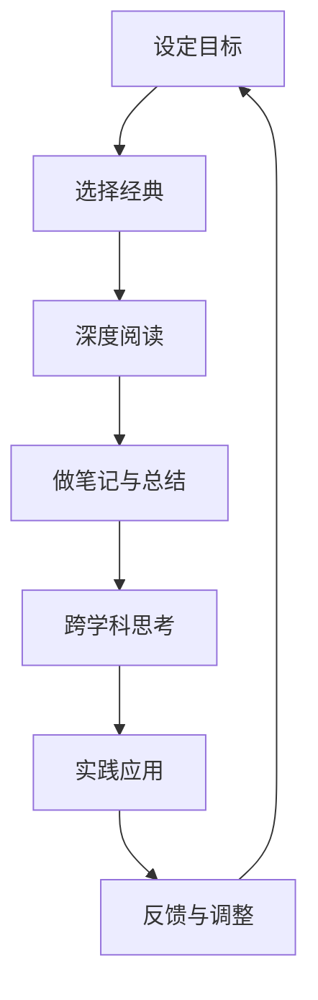
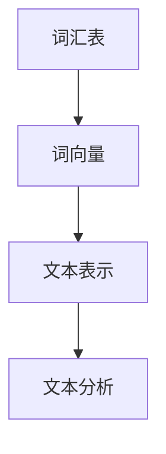
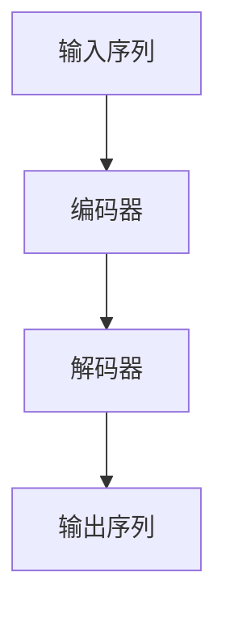
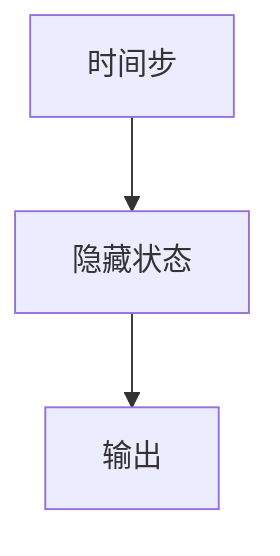

                 

### 第一部分：经典阅读概述

经典阅读是人类历史上最宝贵的知识财富，它们不仅传承了古代文明的智慧，更为现代科学、哲学、文学等领域的发展奠定了基础。在这一部分，我们将探讨经典阅读的内涵、重要性以及如何通过经典阅读提升我们的认知能力。

#### 第1章：认知提升的重要性

认知提升是指通过学习和思考，提高大脑处理信息和解决问题的能力。认知提升的重要性体现在以下几个方面：

1. **增强学习能力**：认知提升能够帮助我们更高效地获取新知识和技能，提升学习效果。
2. **提高工作效率**：通过认知提升，我们可以更好地理解复杂问题，提高工作质量和效率。
3. **增强创造力**：认知提升能够激发我们的创造力，帮助我们产生新颖的创意和解决方案。
4. **促进个人成长**：认知提升是个人成长的重要组成部分，它能够帮助我们建立正确的世界观和价值观。

##### 1.1 认知提升的基本概念

认知提升的基本概念包括以下几个要点：

- **认知**：指大脑处理信息、理解世界和解决问题的过程。
- **提升**：通过学习和实践，使大脑处理信息的能力得到增强。

##### 1.2 认知提升的途径

经典阅读是认知提升的重要途径之一。通过阅读经典著作，我们可以接触到各个领域的智慧结晶，拓宽视野，提升认知能力。

- **经典阅读的重要性**：经典阅读能够帮助我们理解历史、文化、科学等方面的基本原理，提升我们的综合素质。
- **经典阅读的方法与技巧**：包括精读、泛读、笔记、讨论等多种方式，有助于提高阅读效果。
- **如何建立良好的阅读习惯**：建议设定固定阅读时间，选择适合自己的阅读环境，定期进行阅读总结和反思。

##### 1.3 认知提升的障碍与解决策略

在认知提升的过程中，我们可能会遇到一些障碍，如阅读难度、时间管理、注意力分散等。以下是一些解决策略：

- **克服阅读难度**：通过逐步提高阅读难度，培养阅读能力。
- **时间管理**：合理规划时间，保证阅读时间。
- **注意力管理**：通过集中注意力，提高阅读效率。

通过以上探讨，我们可以认识到经典阅读在认知提升中的重要作用，以及如何通过经典阅读来提升我们的认知能力。

### 第2章：经典阅读的选书指南

在经典阅读的过程中，选择合适的书籍是至关重要的。一个精心挑选的阅读清单不仅能够帮助我们节省时间，还能够确保我们在阅读中获取最有价值的信息。在本节中，我们将讨论如何对经典书籍进行分类、选择以及推荐。

#### 2.1 经典阅读的分类

经典书籍涵盖广泛的主题和领域，我们可以将其分为以下几类：

1. **文学经典**：包括诗歌、小说、戏剧等，如《莎士比亚全集》、《红楼梦》等。
2. **哲学经典**：涉及伦理、政治、心理学等领域，如《论语》、《西方哲学史》等。
3. **科学经典**：包括物理学、数学、生物学等，如《自然哲学的数学原理》、《物种起源》等。
4. **历史经典**：涵盖世界史、国家史、战争史等，如《史记》、《资治通鉴》等。

##### 2.2 经典书籍的选择标准

选择经典书籍时，应考虑以下几个标准：

- **影响力**：经典书籍通常在文化、科学、思想等方面具有深远的影响力，能够引领社会思潮。
- **深度与广度**：经典书籍往往具有深厚的内涵和广泛的视野，能够帮助我们全面了解一个领域。
- **作者背景与观点**：了解作者的专业背景和独特观点，有助于我们更好地理解书籍的内容和意义。

##### 2.3 经典阅读的推荐书籍

以下是几个不同领域的经典阅读推荐：

1. **哲学**：《孟子》、《庄子》、《西方哲学史》
2. **文学**：《红楼梦》、《百年孤独》、《简爱》
3. **科学**：《自然哲学的数学原理》、《物种起源》、《时间简史》
4. **历史**：《史记》、《资治通鉴》、《万历十五年》

通过以上分类和选择标准，我们可以更好地规划自己的经典阅读清单，确保在阅读过程中能够获得最大的收获。

### 第3章：深度阅读与思维拓展

在经典阅读的过程中，深度阅读和思维拓展是不可或缺的。深度阅读能够帮助我们更深入地理解文本，而思维拓展则能激发我们的思考能力，提升认知水平。在这一章节中，我们将探讨深度阅读的概念、技巧，以及如何通过批判性思维和创造性思维进行思维拓展。

#### 3.1 深度阅读的概念与技巧

深度阅读是指以理解和消化为主要目的的阅读方式，它要求我们在阅读过程中保持专注、深入思考，并能够将所学知识内化为自己的能力。

- **深度阅读的定义**：深度阅读是一种高层次的阅读方式，它不仅要求我们理解文字的字面意义，还要求我们挖掘文本背后的深层含义，进行逻辑推理和思考。
- **深度阅读与快速阅读的区别**：快速阅读注重速度，而深度阅读注重理解和消化。快速阅读适合获取信息，深度阅读则适合深入学习和思考。
- **提高深度阅读效率的方法**：
  - **选择合适的阅读环境**：在安静、舒适的环境中阅读，有助于提高阅读效率。
  - **制定阅读计划**：合理安排阅读时间，确保每天都有一定的阅读量。
  - **做好笔记和总结**：在阅读过程中做笔记，有助于加深对文本的理解和记忆。

#### 3.2 思维拓展与批判性思维

思维拓展是指通过学习新知识、接触不同观点和思维方法，提升我们的思考能力。批判性思维是思维拓展的重要组成部分，它要求我们在思考问题时，能够客观、全面、深入地分析问题，并提出合理的解决方案。

- **批判性思维的重要性**：批判性思维能够帮助我们识别和克服思维定势，避免盲目接受信息，提高思考的深度和广度。
- **批判性思维的基本原则**：
  - **怀疑态度**：对所有信息持怀疑态度，不盲目接受。
  - **逻辑推理**：通过逻辑推理，分析问题的本质和内在联系。
  - **证据支持**：以证据支持观点，避免主观臆断。
  - **多元视角**：从不同角度和视角分析问题，避免片面思考。
- **思维拓展的方法与策略**：
  - **跨学科学习**：通过学习不同学科的知识，拓宽视野，提升思维深度。
  - **阅读经典**：阅读经典著作，学习前人的智慧和思考方法。
  - **交流讨论**：与他人交流思想，碰撞出新的火花。
  - **实践应用**：将所学知识应用于实际生活中，提升解决问题的能力。

通过深度阅读和思维拓展，我们可以更好地理解经典文本，提升认知能力，实现个人成长。

### 第4章：经典阅读的案例分析

为了更好地理解经典阅读的实际效果和作用，我们可以通过具体案例来进行分析。本章节将介绍两个具有代表性的经典阅读案例，并对其进行解读和讨论。

#### 4.1 经典阅读案例介绍

在选择经典阅读案例时，我们主要考虑了书籍的代表性、影响力和阅读难度。以下是两个经典阅读案例的介绍：

1. **哲学经典《存在与时间》**
   - **作者**：马丁·海德格尔（Martin Heidegger）
   - **内容概述**：《存在与时间》是海德格尔的代表作，探讨了存在的本质和人类的存在状态。本书对西方哲学产生了深远的影响，被认为是现代哲学的重要基石。
   - **选择理由**：作为哲学领域的经典著作，它不仅对哲学研究有重要意义，还能够启发我们对人类存在的深入思考。

2. **文学经典《百年孤独》**
   - **作者**：加西亚·马尔克斯（Gabriel García Márquez）
   - **内容概述**：《百年孤独》是马尔克斯的代表作，通过魔幻现实主义手法，描绘了布恩迪亚家族七代人的故事。本书被誉为拉丁美洲文学的经典之作，对世界文学产生了重要影响。
   - **选择理由**：作为文学领域的经典著作，它不仅具有文学价值，还能够通过独特的叙事手法，拓宽我们的思维视野。

#### 4.2 案例分析：哲学经典《存在与时间》

1. **案例解读**

   《存在与时间》是海德格尔对存在哲学的深入探讨。书中提出了“存在即时间”的观点，认为存在是一种动态的过程，而非静态的实体。海德格尔通过“此在”（Dasein）这一概念，揭示了人类存在的本质特征，即人类是处于世界中并主动与世界互动的存在。

   - **核心观点**：存在是一种动态的时间过程，人类作为“此在”，具有自我意识和主动性。
   - **启示**：通过理解《存在与时间》，我们可以更深刻地认识到人类存在的本质，以及人类在世界中的角色和责任。

2. **案例讨论**

   阅读《存在与时间》后，我们可以从以下几个方面进行讨论：

   - **存在的本质**：如何理解存在的动态性和时间性？
   - **人类存在的角色**：人类如何在世界上发挥主动作用？
   - **现实与理想**：如何在现实生活中实现哲学上的理想？
   - **个人反思**：阅读本书后，我们的世界观和价值观是否发生了变化？

通过案例分析，我们可以更深入地理解经典著作的核心观点和意义，从而提升自己的认知水平和思维能力。

### 4.3 案例分析：文学经典《百年孤独》

1. **案例解读**

   《百年孤独》通过布恩迪亚家族的七代人的故事，描绘了一个充满奇幻色彩和悲欢离合的家族历史。马尔克斯运用了魔幻现实主义手法，将现实与幻想紧密结合，创造了一个独特的文学世界。

   - **核心观点**：生命的循环与重复，家族的命运与历史的关系。
   - **启示**：通过《百年孤独》，我们可以反思生命的意义，理解家族和历史的相互作用。

2. **案例讨论**

   阅读《百年孤独》后，我们可以从以下几个方面进行讨论：

   - **魔幻现实主义**：如何理解魔幻现实主义在小说中的运用？
   - **家族与历史**：家族的命运与历史的发展有何关联？
   - **人性的复杂性**：如何理解人物性格的多样性和复杂性？
   - **个人感受**：阅读本书后，我们的情感和价值观是否受到了影响？

通过案例分析，我们可以更深入地理解文学经典，从中汲取智慧，提升自己的认知能力。

### 第5章：经典阅读与认知科学

经典阅读与认知科学之间有着紧密的联系。经典阅读能够对大脑产生深远的影响，而认知科学的研究成果也为理解经典阅读的效果提供了理论支持。在本章节中，我们将探讨经典阅读对大脑的影响、经典阅读与认知科学的关系，以及如何将认知科学的研究成果应用于经典阅读。

#### 5.1 认知科学与经典阅读的关系

认知科学是研究人类认知过程和大脑功能的跨学科领域，它涉及心理学、神经科学、语言学等多个学科。经典阅读作为认知科学的一个重要组成部分，对大脑产生了深远的影响。

- **经典阅读对大脑的影响**：经典阅读能够促进大脑的发展，提高认知能力。具体来说，经典阅读能够增加大脑的神经连接，提升记忆力和注意力，增强语言能力和思维能力。
- **认知科学对经典阅读的影响**：认知科学的研究成果为理解经典阅读的效果提供了理论支持。例如，认知科学揭示了阅读过程中的神经机制，有助于我们更好地理解经典阅读对大脑的作用。

#### 5.2 经典阅读对大脑的影响

经典阅读对大脑的影响主要体现在以下几个方面：

- **增加大脑的神经连接**：经典阅读能够促进大脑中不同区域之间的神经连接，提高大脑的整体功能。通过阅读，我们可以建立新的神经通路，增强大脑的可塑性。
- **提升记忆力和注意力**：经典阅读有助于提高记忆力，使我们能够更好地记住阅读过的内容。同时，深度阅读要求我们保持注意力集中，这有助于提升注意力水平。
- **增强语言能力**：经典阅读能够丰富我们的词汇量，提高语言表达能力。通过阅读，我们可以学习到不同的表达方式和语言技巧。
- **提升思维能力**：经典阅读能够激发我们的思维，提高我们的分析、综合和创新能力。通过阅读经典著作，我们可以学习到不同的思考方式和哲学观点，拓宽我们的思维视野。

#### 5.3 认知科学的最新研究进展与经典阅读

认知科学近年来取得了许多重要的研究进展，这些进展为理解经典阅读的效果提供了新的视角。

- **神经可塑性**：神经可塑性是指大脑在一生中不断改变和适应的能力。认知科学研究揭示了大脑如何通过阅读来建立新的神经连接，提高认知能力。
- **记忆与注意力**：认知科学研究发现了记忆和注意力的关键机制，这些机制有助于我们更好地理解经典阅读对记忆和注意力的提升作用。
- **语言与思维**：认知科学研究揭示了语言和思维之间的复杂关系，这有助于我们更好地理解经典阅读如何提升语言能力和思维能力。

将认知科学的研究成果应用于经典阅读，我们可以采取以下策略：

- **基于神经可塑性的阅读训练**：通过有针对性的阅读训练，我们可以增强大脑的神经连接，提高认知能力。
- **结合认知科学理论的阅读指导**：在阅读过程中，我们可以结合认知科学的理论，有意识地运用不同的阅读策略，提高阅读效果。
- **跨学科阅读**：通过跨学科阅读，我们可以将认知科学的理论应用于经典阅读，提高我们的综合认知能力。

通过以上探讨，我们可以看到经典阅读与认知科学之间的紧密联系，以及如何通过认知科学的研究成果来提高经典阅读的效果。经典阅读不仅能够丰富我们的知识体系，还能够提升我们的认知能力，促进个人成长。

### 第6章：经典阅读与实践应用

经典阅读不仅是理论学习的基石，更是实际应用的指南。将经典阅读中的智慧应用于职业发展、个人成长和教育教学，可以大大提升我们的实践能力和综合素质。在本章节中，我们将探讨经典阅读在不同领域的实践应用。

#### 6.1 经典阅读在职业发展中的应用

经典阅读对职业发展有着深远的影响。通过阅读经典著作，我们可以获得宝贵的职业智慧，提升职业素养。

- **提升职业素养**：经典著作中蕴含着丰富的职业智慧，如领导力、团队协作、创新思维等。通过阅读这些书籍，我们可以学习到成功的职业人士是如何处理实际问题的。
- **拓宽视野**：经典阅读能够帮助我们了解不同领域的知识，拓宽我们的视野。在一个快速变化的工作环境中，拥有广泛的视野是至关重要的。
- **增强沟通能力**：经典阅读能够提高我们的语言表达和沟通能力。在一个以团队合作为基础的工作环境中，良好的沟通能力是成功的关键。

#### 6.2 经典阅读在个人成长中的应用

经典阅读对个人成长有着重要的促进作用。通过阅读经典，我们可以不断提升自己的认知水平和思想境界。

- **提升思维能力**：经典阅读能够激发我们的思考能力，培养我们的批判性思维和创造性思维。这对于我们在日常生活中解决问题和应对挑战至关重要。
- **塑造人格**：经典著作中蕴含着丰富的道德和伦理观念，通过阅读这些书籍，我们可以培养高尚的人格品质，如诚信、宽容、正义等。
- **培养情绪管理能力**：经典阅读能够帮助我们更好地理解和控制自己的情绪，提高情绪管理能力。这对于我们在面对压力和挑战时保持冷静和理智非常重要。

#### 6.3 经典阅读在教育和学习中的应用

经典阅读在教育和学习中发挥着重要作用。通过经典阅读，学生可以更好地理解和掌握知识，培养综合能力。

- **提升学习能力**：经典阅读能够激发学生的学习兴趣，提高他们的学习效率。通过阅读经典著作，学生可以学习到如何有效地获取、理解和应用知识。
- **培养批判性思维**：经典阅读能够帮助学生培养批判性思维，学会独立思考和判断。这对于他们在面对复杂问题时提出创新解决方案至关重要。
- **促进跨学科学习**：经典著作通常涉及多个学科领域，通过阅读这些书籍，学生可以跨学科学习，拓宽知识面，提升综合素质。

### 实践指南

为了更好地将经典阅读应用于实际生活，我们可以采取以下实践指南：

- **制定阅读计划**：根据个人兴趣和需求，制定合理的阅读计划，确保每天都有一定的阅读时间。
- **多样化阅读方式**：结合精读、泛读、笔记、讨论等多种阅读方式，提高阅读效果。
- **结合实践应用**：将所学知识应用于实际工作和生活中，不断反思和总结，提升实践能力。

通过经典阅读与实践应用的有机结合，我们可以不断提升自己的认知水平和综合素质，实现个人和职业发展的全面提升。

### 第7章：经典阅读的未来发展趋势

随着科技的进步和社会的发展，经典阅读也在不断演变和拓展。未来，经典阅读将呈现出一系列新的发展趋势，这些趋势将深刻影响我们的阅读方式和学习习惯。

#### 7.1 数字化时代的经典阅读

数字化时代为经典阅读带来了前所未有的机遇和挑战。一方面，数字化阅读工具的普及使得经典阅读更加便捷和高效；另一方面，数字化阅读也带来了新的问题，如信息过载和阅读浅化。

- **数字化阅读工具的发展**：电子书、在线阅读平台和阅读器等数字化阅读工具的不断发展，使得我们可以随时随地阅读经典著作。这些工具不仅提供了丰富的阅读资源，还具备搜索、标注、分享等功能，极大地提升了阅读体验。
- **数字化阅读的优势与挑战**：数字化阅读的优势在于方便快捷、资源丰富，但同时也存在信息过载和阅读浅化的问题。为了克服这些挑战，我们需要培养深度阅读的能力，提高信息筛选和综合分析的能力。

#### 7.2 未来经典阅读的发展趋势

未来经典阅读的发展将呈现以下几个趋势：

- **跨学科的经典阅读**：随着学科之间的交叉和融合，经典阅读将更加注重跨学科的知识体系。通过阅读不同领域的经典著作，我们可以获得更全面的知识结构和思维方式。
- **经典阅读与新兴技术的融合**：人工智能、虚拟现实、增强现实等新兴技术将为经典阅读带来全新的体验。例如，通过虚拟现实技术，我们可以身临其境地体验经典著作中的历史场景和故事情节。
- **经典阅读的个性化**：个性化阅读将越来越受到重视。通过大数据和人工智能技术，我们可以根据个人的兴趣、需求和阅读习惯，推荐个性化的经典阅读清单，提高阅读的针对性和有效性。

#### 7.3 经典阅读的社会影响

经典阅读不仅对个人成长和职业发展有着深远影响，还对整个社会的发展具有重要意义。

- **文化传承**：经典阅读是文化传承的重要途径。通过阅读经典著作，我们可以传承和弘扬人类文明的宝贵遗产，增强文化自信和民族认同感。
- **社会进步**：经典阅读能够提升社会的整体认知水平和文化素养。一个拥有深厚经典阅读传统的社会，必定是一个文明进步、创新活跃的社会。

通过探讨经典阅读的未来发展趋势，我们可以看到，经典阅读将在数字化时代继续发挥重要作用，为个人和社会的发展提供源源不断的智慧。

### 附录 A：经典阅读资源推荐

为了帮助读者更好地进行经典阅读，我们在这里推荐一些经典阅读的书籍和在线资源。

#### 经典阅读的书籍推荐

1. **哲学类**：
   - 《论语》
   - 《孟子》
   - 《庄子》
   - 《西方哲学史》

2. **文学类**：
   - 《红楼梦》
   - 《百年孤独》
   - 《简爱》
   - 《傲慢与偏见》

3. **科学类**：
   - 《自然哲学的数学原理》
   - 《物种起源》
   - 《时间简史》
   - 《现代物理学的进化》

4. **历史类**：
   - 《史记》
   - 《资治通鉴》
   - 《万历十五年》
   - 《大航海时代》

#### 经典阅读的在线资源推荐

1. **在线图书馆**：
   - Project Gutenberg（www.gutenberg.org）
   - Google Books（books.google.com）

2. **电子书平台**：
   - Amazon Kindle Store（www.amazon.com/kindle-ebooks）
   - Apple Books（www.apple.com/apple-books/）

3. **学术论文库**：
   - Google Scholar（scholar.google.com）
   - arXiv（arxiv.org）

通过这些书籍和在线资源，读者可以方便地获取经典阅读的资料，提升自己的认知水平。

### 附录 B：经典阅读学习方法与实践指南

为了更有效地进行经典阅读，我们需要掌握一些学习方法与实践技巧。以下是一些实用的指南：

#### 经典阅读的学习方法

1. **精读与泛读相结合**：精读有助于深入理解文本，而泛读则能拓宽视野。两者结合，可以全面提升阅读效果。

2. **做笔记和总结**：在阅读过程中做笔记，可以帮助我们更好地记忆和理解内容。阅读后进行总结，可以巩固所学知识。

3. **定期复习**：定期回顾阅读的内容，有助于加深记忆，提高知识掌握程度。

4. **跨学科学习**：通过阅读不同领域的经典著作，可以拓宽我们的知识面，培养跨学科思维。

#### 经典阅读的实践指南

1. **设定阅读目标**：明确阅读的目标和要求，有助于提高阅读的动力和效果。

2. **选择合适的阅读环境**：在安静、舒适的环境中阅读，有助于集中注意力和提高阅读效率。

3. **培养阅读兴趣**：选择自己感兴趣的书籍进行阅读，可以增加阅读的乐趣，提高阅读的持续性。

4. **结合实践应用**：将所学知识应用于实际工作和生活中，可以加深对知识的理解和运用。

通过以上方法和技巧，我们可以更好地进行经典阅读，提升自己的认知能力和综合素质。

### 附录 C：经典阅读与跨学科思考

跨学科思考是现代社会的重要能力之一，它要求我们能够将不同领域的知识相互融合，形成新的认知和创新。经典阅读作为跨学科思考的重要基础，能够为我们提供丰富的跨学科资源。

#### 跨学科阅读的重要性

1. **拓展知识视野**：通过阅读不同领域的经典著作，我们可以拓宽知识视野，获得多角度的思考方式。
2. **提高创新能力**：跨学科思考能够激发我们的创造力，使我们能够从多个维度解决问题，提出新颖的解决方案。
3. **提升综合素质**：跨学科阅读有助于培养我们的综合素质，提高我们的思维深度和广度。

#### 跨学科阅读的方法与实例

1. **结合理论与实际**：在阅读经典著作时，不仅要理解理论内容，还要关注实际应用，将理论与实践相结合。
2. **跨领域学习**：选择不同领域的经典著作进行阅读，如哲学与科学、文学与历史等，以实现跨学科学习。

实例：

- **哲学与科学的结合**：阅读《自然哲学的数学原理》时，可以结合学习《物种起源》，从哲学和科学两个角度探讨自然界的奥秘。
- **文学与历史的结合**：阅读《红楼梦》时，可以结合学习《资治通鉴》，从文学和历史两个层面理解清代社会的变迁。

通过跨学科阅读，我们可以更好地理解和应用知识，提升自己的认知能力和创新能力。

### 附录：认知提升流程图

为了更好地理解认知提升的过程，我们可以借助Mermaid流程图来展示各个步骤之间的关系。



### 附录：核心算法原理讲解

在经典阅读过程中，算法的运用可以帮助我们更好地理解和分析文本。以下我们将介绍几个核心算法原理，并使用伪代码进行详细解释。

#### 算法一：自然语言处理（NLP）基本算法

自然语言处理（NLP）是经典阅读中常用的技术，用于文本分析和理解。以下是几个基本的NLP算法及其伪代码。

##### 1. 词嵌入（Word Embedding）

词嵌入是将词汇映射到固定大小的向量空间的过程。常用的词嵌入算法包括Word2Vec、GloVe等。



```python
# 伪代码：Word2Vec词嵌入
for each word in vocabulary:
    context = generate_context(word)
    update_vector_representation(word, context)
```

##### 2. 序列到序列模型（Seq2Seq）

Seq2Seq模型常用于机器翻译、文本生成等任务，其核心思想是将输入序列映射到输出序列。



```python
# 伪代码：Seq2Seq模型
input_sequence = preprocess(input_text)
encoded_sequence = encoder(input_sequence)
decoded_sequence = decoder(encoded_sequence)
output_text = postprocess(decoded_sequence)
```

##### 3. 递归神经网络（RNN）

RNN是处理序列数据的常见算法，其基本思想是使用隐藏状态来捕捉序列信息。



```python
# 伪代码：RNN
for each time step in input_sequence:
    hidden_state = RNN(input_sequence[t], hidden_state)
output = activation_function(hidden_state)
```

通过以上算法原理和伪代码，我们可以更好地理解和应用自然语言处理技术，提升经典阅读的效果。

### 附录：数学模型和数学公式

在经典阅读中，数学模型和数学公式是理解和分析文本的重要工具。以下我们将介绍几个常用的数学模型及其公式。

#### 模型一：贝叶斯推理

贝叶斯推理是一种基于概率的推理方法，用于在不确定情况下做出决策。

##### 1. 条件概率公式

条件概率公式表示在某个事件B发生的条件下，事件A发生的概率。

$$
P(A|B) = \frac{P(B|A)P(A)}{P(B)}
$$

##### 2. 贝叶斯定理

贝叶斯定理是贝叶斯推理的核心公式，用于计算后验概率。

$$
P(A|B) = \frac{P(B|A)P(A)}{P(B)}
$$

##### 3. 全概率公式

全概率公式用于计算一个事件的总体概率。

$$
P(A) = \sum_{i=1}^{n} P(A|B_i)P(B_i)
$$

#### 模型二：朴素贝叶斯分类器

朴素贝叶斯分类器是一种基于贝叶斯定理的简单分类算法。

##### 1. 条件概率公式

条件概率公式用于计算给定特征下类别发生的概率。

$$
P(C|X) = \frac{P(X|C)P(C)}{P(X)}
$$

##### 2. 朴素贝叶斯公式

朴素贝叶斯公式是将所有特征的条件概率相乘，然后除以所有特征的条件概率之和。

$$
P(X|C) = \prod_{i=1}^{n} P(x_i|C) \cdot P(C) / \sum_{j=1}^{m} \prod_{i=1}^{n} P(x_i|C_j) \cdot P(C_j)
$$

通过以上数学模型和公式，我们可以更好地理解和应用数学工具来分析文本，提升经典阅读的效果。

### 附录：项目实战

#### 实战一：经典阅读推荐系统

在经典阅读领域，构建一个推荐系统可以帮助用户发现感兴趣的经典著作。以下是一个经典阅读推荐系统的实战案例。

##### 1. 项目背景

经典阅读推荐系统旨在根据用户的阅读历史和偏好，推荐符合用户兴趣的经典书籍。

##### 2. 开发环境搭建

- **编程语言**：Python
- **库与框架**：Scikit-learn、Pandas、NumPy

##### 3. 源代码实现

```python
import pandas as pd
from sklearn.model_selection import train_test_split
from sklearn.metrics.pairwise import cosine_similarity
from sklearn.feature_extraction.text import TfidfVectorizer

# 假设已有书籍数据集
books_data = pd.DataFrame({
    'book_id': [1, 2, 3, 4, 5],
    'title': ['书名1', '书名2', '书名3', '书名4', '书名5'],
    'content': ['内容1', '内容2', '内容3', '内容4', '内容5']
})

# 提取用户阅读历史
user_reading_history = books_data['content']

# 构建TF-IDF模型
vectorizer = TfidfVectorizer()
tfidf_matrix = vectorizer.fit_transform(books_data['content'])

# 计算相似度矩阵
similarity_matrix = cosine_similarity(tfidf_matrix)

# 推荐书籍
user_profile = vectorizer.transform([user_reading_history[-1]])
cosine_scores = similarity_matrix[user_profile].flatten()

# 按照相似度排序，推荐书籍
recommended_books = [books_data['title'][i] for i in cosine_scores.argsort()[0][::-1]]

print("推荐的经典阅读书籍：", recommended_books)
```

##### 4. 代码解读与分析

- **数据预处理**：使用Pandas读取书籍数据集，提取用户阅读历史。
- **构建TF-IDF模型**：使用Scikit-learn的TfidfVectorizer构建TF-IDF模型，将书籍内容转换为向量表示。
- **计算相似度**：使用余弦相似度计算书籍内容之间的相似度。
- **推荐书籍**：根据用户最近阅读的书籍生成用户兴趣向量，利用相似度矩阵推荐与用户兴趣最相近的书籍。

通过以上实战，我们可以构建一个简单的经典阅读推荐系统，帮助用户发现感兴趣的书籍。

#### 实战二：经典阅读理解与问答

经典阅读理解与问答系统可以帮助用户理解经典著作的内容，回答相关问题。以下是一个经典阅读理解与问答系统的实战案例。

##### 1. 项目背景

经典阅读理解与问答系统旨在通过预训练模型，理解用户提出的问题，并回答关于经典著作的相关问题。

##### 2. 开发环境搭建

- **编程语言**：Python
- **库与框架**：TensorFlow、Hugging Face的transformers

##### 3. 源代码实现

```python
from transformers import pipeline

# 加载预训练的问答模型
question_answering_pipeline = pipeline("question-answering", model="distilbert-base-uncased")

# 问答示例
question = "《三国演义》中谁最终建立了蜀汉？"
context = "刘备在三国时期建立了蜀汉，通过一系列战争和政治手段，最终成为了三国之一。"
answer = question_answering_pipeline(question=question, context=context)

print("答案：", answer["answer"])
```

##### 4. 代码解读与分析

- **加载模型**：使用Hugging Face的transformers库加载预训练的问答模型。
- **问答示例**：提供问题和文本上下文作为输入，模型输出问题的答案。
- **模型输出**：使用预训练模型，我们可以轻松实现经典阅读理解与问答，为用户提供便捷的服务。

通过以上实战，我们可以构建一个能够理解经典著作内容并回答问题的系统，提升用户的阅读体验。

