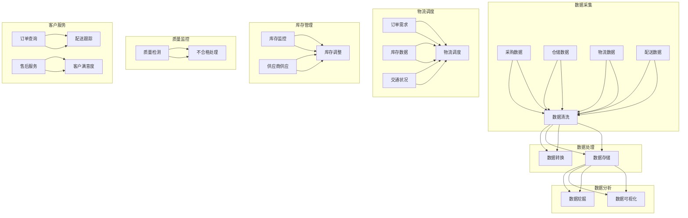

                 

# 美团优选2025社招生鲜供应链系统架构师面试

## 概述

### 核心关键词

- 美团优选
- 生鲜供应链
- 系统架构师
- 面试准备
- 实战案例分析

### 摘要

本文旨在为有意向加入美团优选2025社招生鲜供应链系统的架构师提供全面的面试准备和实战指导。文章将首先概述生鲜行业的发展、市场现状以及供应链体系构建的基础知识，接着深入探讨生鲜供应链系统架构的核心模块、数据处理与存储、物流调度与优化、客户服务与体验以及系统安全与稳定性保障。此外，本文还将分享面试准备与实战经验，并提供案例分析和系统架构师成长路径的建议。通过本文，读者可以系统地了解生鲜供应链系统架构的关键要素，为面试和职业发展奠定坚实基础。

## 第一部分：生鲜供应链基础知识

### 1.1 生鲜行业概述

#### 1.1.1 生鲜行业的发展历程

生鲜行业自古以来就有着悠久的历史，随着社会经济的发展和居民生活水平的提升，生鲜行业的规模和影响力也在不断扩大。从传统的农贸市场到现代化的超市连锁，再到如今蓬勃发展的电商生鲜，生鲜行业经历了多次变革。

在20世纪初期，随着城市化进程的加快，生鲜市场逐渐向集中化、规模化的方向发展。这一阶段，生鲜行业主要依赖实体店进行销售，消费者主要通过线下渠道购买生鲜产品。

进入21世纪，互联网技术的迅猛发展带动了电子商务的崛起，生鲜电商逐渐崭露头角。以淘宝、京东等电商平台为代表，生鲜电商开始改变传统生鲜销售的格局。消费者可以通过线上平台购买生鲜产品，享受便捷的购物体验。

近年来，随着消费者对食品安全、品质和新鲜度的要求不断提高，生鲜行业迎来了全新的发展机遇。以美团优选为代表的社区团购模式，通过精准的供应链管理和高效的物流配送，满足了消费者对生鲜产品的高质量需求。

#### 1.1.2 生鲜行业的市场现状与趋势

当前，生鲜行业市场规模不断扩大，市场潜力巨大。根据相关数据显示，中国生鲜市场规模已超过1万亿元，并且仍在快速增长。随着消费者对生鲜产品的需求不断增加，生鲜行业也面临着激烈的竞争。

在市场现状方面，生鲜行业主要分为线上和线下两个渠道。线下渠道以超市、农贸市场和生鲜专卖店为主，线上渠道则以生鲜电商平台和社区团购为主。其中，社区团购凭借其低价格、高性价比和便捷的配送服务，逐渐成为生鲜市场的新兴力量。

在趋势方面，生鲜行业正呈现出以下几个明显的发展趋势：

1. **电商化**：随着互联网技术的普及，生鲜电商化趋势日益明显。越来越多的消费者倾向于在线购买生鲜产品，电商化已经成为生鲜行业的发展方向。

2. **社区团购**：社区团购模式具有成本优势、高效配送和便捷购物等特点，受到了广大消费者的欢迎。未来，社区团购将在生鲜市场中占据越来越重要的地位。

3. **智能化与数字化**：生鲜行业正逐步向智能化和数字化方向转型。通过大数据分析、智能物流和自动化设备等技术手段，提高生鲜供应链的效率和质量。

4. **食品安全与品质**：随着消费者对食品安全和品质的重视程度不断提高，生鲜行业将更加注重产品的品质和安全。未来，生鲜行业将更加注重绿色、有机和健康的产品。

#### 1.1.3 生鲜供应链的核心环节

生鲜供应链是连接生产者与消费者之间的桥梁，其核心环节主要包括以下几方面：

1. **采购**：采购是生鲜供应链的起点，主要涉及供应商的选择、采购策略的制定和采购流程的优化。采购环节的质量和效率直接影响到后续环节的运作。

2. **仓储**：仓储是生鲜供应链中的关键环节，负责存储和保管生鲜产品。仓储设施需要满足恒温、恒湿、防虫等要求，以保证生鲜产品的品质。

3. **物流**：物流是生鲜供应链的核心环节，直接关系到生鲜产品的新鲜度和配送速度。高效的物流体系是保证生鲜产品质量的重要保障。

4. **配送**：配送是将生鲜产品从仓储中心送到消费者手中的最后一步。配送过程需要考虑到路线规划、配送时间、配送员管理等方面，以提高配送效率。

5. **质量检测**：质量检测是确保生鲜产品质量的重要手段。在仓储和配送环节，需要定期进行质量检测，确保生鲜产品的安全性和品质。

6. **信息管理**：信息管理是生鲜供应链的“神经系统”，负责收集、处理和传递各类信息。通过信息管理，可以实现供应链的透明化、可视化和智能化。

### 1.2 生鲜供应链体系构建

#### 1.2.1 生鲜供应链的基本架构

生鲜供应链的基本架构主要包括以下几部分：

1. **生产者**：生产者是生鲜供应链的源头，主要包括农产品种植、养殖和加工等环节。生产者的质量和产量直接影响到生鲜供应链的整体效率。

2. **供应商**：供应商是连接生产者和分销商的重要环节，负责将生鲜产品从生产者处采购并运输到分销商手中。供应商的稳定性、质量和价格是影响生鲜供应链的重要因素。

3. **分销商**：分销商是生鲜供应链的核心环节，负责将生鲜产品从供应商处采购，并通过物流配送将产品销售给零售商或消费者。分销商的规模、能力和服务质量对生鲜供应链的效率具有决定性影响。

4. **零售商**：零售商是生鲜供应链的终点，直接面对消费者，负责销售生鲜产品。零售商的渠道、品牌和服务水平对消费者的购物体验和满意度具有重要影响。

5. **消费者**：消费者是生鲜供应链的最终受益者，通过购买生鲜产品满足日常生活需求。消费者的需求、购买力和消费习惯对生鲜供应链的运作和优化具有重要指导意义。

#### 1.2.2 生鲜供应链的运作模式

生鲜供应链的运作模式主要包括以下几种：

1. **传统模式**：传统模式主要依赖于线下渠道，生产者通过供应商将产品销售给分销商，分销商再将产品销售给零售商，最终由零售商销售给消费者。传统模式的主要优点是渠道稳定、风险较低，但缺点是效率较低、成本较高。

2. **电商模式**：电商模式通过互联网技术实现线上交易，生产者、供应商、分销商和零售商通过电商平台进行合作，消费者通过电商平台购买生鲜产品。电商模式的主要优点是效率高、成本低、覆盖面广，但缺点是渠道不稳定、风险较大。

3. **社区团购模式**：社区团购模式是近年来兴起的一种新型运作模式，通过社区团购平台将消费者、供应商、分销商和零售商紧密连接。消费者通过团购平台购买生鲜产品，供应商、分销商和零售商通过团购平台进行合作。社区团购模式的主要优点是成本低、配送效率高、购物体验好，但缺点是渠道不稳定、风险较大。

4. **一体化模式**：一体化模式是将生产、供应、分销和零售等多个环节整合到一个企业内部，实现供应链的一体化运作。一体化模式的主要优点是效率高、成本低、风险较低，但缺点是投资较大、运营难度较高。

#### 1.2.3 生鲜供应链的关键要素

生鲜供应链的成功运作离不开以下关键要素：

1. **质量**：生鲜产品的质量是消费者关注的重点，也是生鲜供应链的核心要素。确保生鲜产品的品质，是提高消费者满意度和市场竞争力的重要手段。

2. **效率**：效率是衡量生鲜供应链运作水平的重要指标。通过优化采购、仓储、物流和配送等环节，提高供应链的整体效率，降低成本。

3. **成本**：成本是影响生鲜供应链竞争力的关键因素。通过优化供应链管理、降低采购成本、提高物流效率等措施，降低供应链整体成本。

4. **信息管理**：信息管理是生鲜供应链的“神经系统”，通过收集、处理和传递各类信息，实现供应链的透明化、可视化和智能化。高效的信息管理有助于提高供应链的运作效率。

5. **供应链协同**：供应链协同是确保生鲜供应链高效运作的重要保障。通过建立稳定的合作关系，实现供应链各环节的紧密协同，提高供应链的整体运作效率。

### 1.3 生鲜供应链管理

#### 1.3.1 生鲜供应链管理的原则与方法

生鲜供应链管理是确保生鲜产品质量、降低成本和提高效率的重要手段。生鲜供应链管理应遵循以下原则：

1. **质量第一**：确保生鲜产品的质量和安全是供应链管理的核心目标。

2. **效率优先**：通过优化供应链流程、提高物流效率，降低供应链整体成本。

3. **协同合作**：建立稳定的合作关系，实现供应链各环节的紧密协同。

4. **信息共享**：实现供应链各环节的信息共享，提高供应链的透明度和可追溯性。

生鲜供应链管理的方法主要包括：

1. **采购管理**：优化采购策略，降低采购成本，确保采购产品的质量和安全。

2. **仓储管理**：优化仓储设施和流程，提高仓储效率，确保生鲜产品的品质。

3. **物流管理**：优化物流网络和配送流程，提高物流效率，降低物流成本。

4. **质量管理**：建立质量检测体系，确保生鲜产品的质量和安全。

5. **信息管理**：实现供应链各环节的信息共享，提高供应链的透明度和可追溯性。

#### 1.3.2 生鲜供应链的绩效评估

生鲜供应链绩效评估是衡量供应链运作水平的重要手段。生鲜供应链绩效评估应从以下几个方面进行：

1. **质量评估**：评估生鲜产品的品质、安全和卫生指标，确保生鲜产品的质量满足消费者需求。

2. **效率评估**：评估供应链各环节的运作效率，如采购效率、仓储效率、物流效率和配送效率等。

3. **成本评估**：评估供应链整体成本，包括采购成本、仓储成本、物流成本和配送成本等。

4. **服务水平评估**：评估供应链对消费者的服务水平，如配送速度、配送质量、客户满意度等。

5. **信息管理评估**：评估供应链信息管理的效率和效果，如信息共享度、信息准确度、信息透明度等。

#### 1.3.3 生鲜供应链的风险管理

生鲜供应链风险管理是确保供应链稳定运作、降低风险的重要手段。生鲜供应链风险管理应从以下几个方面进行：

1. **质量风险**：评估生鲜产品的质量风险，如农药残留、微生物污染等，采取相应的质量控制措施。

2. **效率风险**：评估供应链各环节的效率风险，如采购延误、仓储拥堵、物流延误等，采取相应的优化措施。

3. **成本风险**：评估供应链整体成本风险，如原材料价格波动、物流费用上涨等，采取相应的成本控制措施。

4. **信息风险**：评估供应链信息管理的风险，如信息泄露、系统故障等，采取相应的信息安全措施。

5. **供应链中断风险**：评估供应链中断风险，如自然灾害、疫情等，采取相应的应急措施。

## 第二部分：生鲜供应链系统架构

### 2.1 系统架构概述

#### 2.1.1 系统架构的设计理念

生鲜供应链系统架构的设计理念主要体现在以下几个方面：

1. **高可用性**：系统架构应具备高可用性，确保在遇到硬件故障、网络故障等异常情况下，系统仍能正常运行，保证供应链的稳定运作。

2. **高扩展性**：系统架构应具备高扩展性，能够根据业务需求的变化，灵活调整系统资源和功能，满足不同规模和类型的生鲜供应链需求。

3. **高可靠性**：系统架构应具备高可靠性，确保系统在长时间运行过程中，能够稳定、可靠地完成各项任务，降低系统故障率和运行风险。

4. **高安全性**：系统架构应具备高安全性，保护系统数据和用户隐私，防止数据泄露、恶意攻击等安全风险。

5. **高效率**：系统架构应具备高效率，通过优化算法、分布式架构等技术手段，提高系统处理速度和响应时间，满足生鲜供应链的实时性和高效性需求。

#### 2.1.2 系统架构的核心模块

生鲜供应链系统架构的核心模块主要包括以下几部分：

1. **数据采集与处理模块**：负责收集来自各个供应链环节的数据，包括采购、仓储、物流、配送等，对数据进行清洗、转换和存储，为后续分析提供数据支持。

2. **数据处理与分析模块**：负责对采集到的数据进行分析和挖掘，提取有价值的信息和规律，为供应链优化和管理提供决策依据。

3. **物流调度与优化模块**：负责根据订单需求、库存情况和交通状况，优化物流路线和配送方案，提高物流效率。

4. **库存管理模块**：负责监控库存水平，根据销售情况和供应商的供应情况，进行库存调整和优化，确保库存水平的合理性和稳定性。

5. **质量管理模块**：负责监控生鲜产品的质量，对不合格产品进行及时处理，确保产品质量和消费者满意度。

6. **信息管理模块**：负责管理供应链各环节的信息，实现信息的共享和协同，提高供应链的透明度和可追溯性。

7. **用户服务与体验模块**：负责提供用户服务，包括订单查询、配送跟踪、售后服务等，优化用户购物体验。

#### 2.1.3 系统架构的扩展性

系统架构的扩展性主要体现在以下几个方面：

1. **模块化设计**：系统采用模块化设计，各个模块之间相对独立，便于后期功能扩展和升级。

2. **分布式架构**：系统采用分布式架构，通过分布式计算和存储技术，实现系统的水平扩展，提高系统处理能力和性能。

3. **接口标准化**：系统接口采用标准化设计，便于与其他系统和模块进行集成，实现数据的互通和协同。

4. **技术选型**：系统采用主流的技术框架和中间件，具有较好的兼容性和可扩展性，便于后续技术升级和迭代。

### 2.2 数据处理与存储

#### 2.2.1 数据处理流程

生鲜供应链系统中的数据处理流程主要包括以下步骤：

1. **数据采集**：从各个供应链环节（如采购、仓储、物流、配送等）收集数据，包括订单信息、库存数据、物流信息等。

2. **数据清洗**：对采集到的数据进行清洗，去除重复、无效和错误的数据，确保数据的准确性和完整性。

3. **数据转换**：将清洗后的数据转换为统一的格式，如JSON、CSV等，便于后续处理和分析。

4. **数据存储**：将转换后的数据存储到数据库或数据仓库中，如MySQL、MongoDB、Hadoop等，为后续分析和挖掘提供数据支持。

5. **数据挖掘**：对存储在数据库或数据仓库中的数据进行分析和挖掘，提取有价值的信息和规律，为供应链优化和管理提供决策依据。

6. **数据可视化**：将分析结果通过图表、报表等形式进行可视化展示，便于用户理解和决策。

#### 2.2.2 数据存储方案

生鲜供应链系统的数据存储方案主要包括以下几个方面：

1. **关系型数据库**：关系型数据库（如MySQL、PostgreSQL等）适用于存储结构化数据，如订单信息、库存数据等。关系型数据库具有较好的数据一致性和完整性保障。

2. **非关系型数据库**：非关系型数据库（如MongoDB、Cassandra等）适用于存储半结构化或非结构化数据，如用户行为数据、物流信息等。非关系型数据库具有较好的扩展性和灵活性。

3. **分布式存储系统**：分布式存储系统（如Hadoop、HDFS等）适用于存储海量数据，具有较好的数据可靠性和性能。分布式存储系统可以通过数据分片和负载均衡技术，实现海量数据的存储和处理。

4. **数据仓库**：数据仓库（如Amazon Redshift、Google BigQuery等）适用于存储和分析大量历史数据，为供应链优化和管理提供决策支持。数据仓库具有较好的数据整合和分析能力。

#### 2.2.3 数据安全与隐私保护

数据安全与隐私保护是生鲜供应链系统的重要方面，主要包括以下几个方面：

1. **数据加密**：对敏感数据进行加密处理，如用户密码、支付信息等，确保数据在传输和存储过程中不被窃取和篡改。

2. **访问控制**：对系统数据设置访问权限，确保只有授权用户可以访问和操作敏感数据，防止未经授权的访问和篡改。

3. **日志审计**：记录系统操作日志，如用户登录、数据查询、数据修改等，便于追踪和审计系统操作，发现和防范潜在的安全风险。

4. **防火墙与入侵检测**：部署防火墙和入侵检测系统，防止外部攻击和恶意行为，确保系统数据的安全和稳定。

5. **数据备份与恢复**：定期备份数据，确保在数据丢失或系统故障时，能够快速恢复数据，保证业务连续性。

## 第三部分：生鲜供应链系统架构

### 3.1 系统架构概述

#### 3.1.1 系统架构的设计理念

生鲜供应链系统架构的设计理念主要体现在以下几个方面：

1. **高可用性**：系统架构应具备高可用性，确保在遇到硬件故障、网络故障等异常情况下，系统仍能正常运行，保证供应链的稳定运作。

2. **高扩展性**：系统架构应具备高扩展性，能够根据业务需求的变化，灵活调整系统资源和功能，满足不同规模和类型的生鲜供应链需求。

3. **高可靠性**：系统架构应具备高可靠性，确保系统在长时间运行过程中，能够稳定、可靠地完成各项任务，降低系统故障率和运行风险。

4. **高安全性**：系统架构应具备高安全性，保护系统数据和用户隐私，防止数据泄露、恶意攻击等安全风险。

5. **高效率**：系统架构应具备高效率，通过优化算法、分布式架构等技术手段，提高系统处理速度和响应时间，满足生鲜供应链的实时性和高效性需求。

#### 3.1.2 系统架构的核心模块

生鲜供应链系统架构的核心模块主要包括以下几部分：

1. **数据采集与处理模块**：负责收集来自各个供应链环节的数据，包括采购、仓储、物流、配送等，对数据进行清洗、转换和存储，为后续分析提供数据支持。

2. **数据处理与分析模块**：负责对采集到的数据进行分析和挖掘，提取有价值的信息和规律，为供应链优化和管理提供决策依据。

3. **物流调度与优化模块**：负责根据订单需求、库存情况和交通状况，优化物流路线和配送方案，提高物流效率。

4. **库存管理模块**：负责监控库存水平，根据销售情况和供应商的供应情况，进行库存调整和优化，确保库存水平的合理性和稳定性。

5. **质量管理模块**：负责监控生鲜产品的质量，对不合格产品进行及时处理，确保产品质量和消费者满意度。

6. **信息管理模块**：负责管理供应链各环节的信息，实现信息的共享和协同，提高供应链的透明度和可追溯性。

7. **用户服务与体验模块**：负责提供用户服务，包括订单查询、配送跟踪、售后服务等，优化用户购物体验。

#### 3.1.3 系统架构的扩展性

系统架构的扩展性主要体现在以下几个方面：

1. **模块化设计**：系统采用模块化设计，各个模块之间相对独立，便于后期功能扩展和升级。

2. **分布式架构**：系统采用分布式架构，通过分布式计算和存储技术，实现系统的水平扩展，提高系统处理能力和性能。

3. **接口标准化**：系统接口采用标准化设计，便于与其他系统和模块进行集成，实现数据的互通和协同。

4. **技术选型**：系统采用主流的技术框架和中间件，具有较好的兼容性和可扩展性，便于后续技术升级和迭代。

### 3.2 数据处理与存储

#### 3.2.1 数据处理流程

生鲜供应链系统中的数据处理流程主要包括以下步骤：

1. **数据采集**：从各个供应链环节（如采购、仓储、物流、配送等）收集数据，包括订单信息、库存数据、物流信息等。

2. **数据清洗**：对采集到的数据进行清洗，去除重复、无效和错误的数据，确保数据的准确性和完整性。

3. **数据转换**：将清洗后的数据转换为统一的格式，如JSON、CSV等，便于后续处理和分析。

4. **数据存储**：将转换后的数据存储到数据库或数据仓库中，如MySQL、MongoDB、Hadoop等，为后续分析和挖掘提供数据支持。

5. **数据挖掘**：对存储在数据库或数据仓库中的数据进行分析和挖掘，提取有价值的信息和规律，为供应链优化和管理提供决策依据。

6. **数据可视化**：将分析结果通过图表、报表等形式进行可视化展示，便于用户理解和决策。

#### 3.2.2 数据存储方案

生鲜供应链系统的数据存储方案主要包括以下几个方面：

1. **关系型数据库**：关系型数据库（如MySQL、PostgreSQL等）适用于存储结构化数据，如订单信息、库存数据等。关系型数据库具有较好的数据一致性和完整性保障。

2. **非关系型数据库**：非关系型数据库（如MongoDB、Cassandra等）适用于存储半结构化或非结构化数据，如用户行为数据、物流信息等。非关系型数据库具有较好的扩展性和灵活性。

3. **分布式存储系统**：分布式存储系统（如Hadoop、HDFS等）适用于存储海量数据，具有较好的数据可靠性和性能。分布式存储系统可以通过数据分片和负载均衡技术，实现海量数据的存储和处理。

4. **数据仓库**：数据仓库（如Amazon Redshift、Google BigQuery等）适用于存储和分析大量历史数据，为供应链优化和管理提供决策支持。数据仓库具有较好的数据整合和分析能力。

#### 3.2.3 数据安全与隐私保护

数据安全与隐私保护是生鲜供应链系统的重要方面，主要包括以下几个方面：

1. **数据加密**：对敏感数据进行加密处理，如用户密码、支付信息等，确保数据在传输和存储过程中不被窃取和篡改。

2. **访问控制**：对系统数据设置访问权限，确保只有授权用户可以访问和操作敏感数据，防止未经授权的访问和篡改。

3. **日志审计**：记录系统操作日志，如用户登录、数据查询、数据修改等，便于追踪和审计系统操作，发现和防范潜在的安全风险。

4. **防火墙与入侵检测**：部署防火墙和入侵检测系统，防止外部攻击和恶意行为，确保系统数据的安全和稳定。

5. **数据备份与恢复**：定期备份数据，确保在数据丢失或系统故障时，能够快速恢复数据，保证业务连续性。

### 3.3 物流调度与优化

#### 3.3.1 物流调度策略

生鲜供应链系统中的物流调度策略主要包括以下几个方面：

1. **基于时间窗口的调度**：根据订单的配送时间要求，合理安排物流配送时间，确保订单在约定的时间内完成配送。

2. **基于交通状况的调度**：根据实时交通状况，动态调整物流配送路线，避开交通拥堵区域，提高配送效率。

3. **基于库存水平的调度**：根据库存水平，合理安排物流配送顺序，优先配送库存较少的商品，减少库存压力。

4. **基于成本效益的调度**：综合考虑物流成本和配送效率，优化物流配送方案，实现成本效益最大化。

5. **基于客户需求的调度**：根据客户需求，提供个性化的物流配送服务，如预约配送、上门取货等，提高客户满意度。

#### 3.3.2 物流路径优化算法

生鲜供应链系统中的物流路径优化算法主要包括以下几种：

1. **最短路径算法**：基于距离或时间，寻找从起点到终点的最短路径。常见的算法有Dijkstra算法、A*算法等。

2. **多目标路径优化算法**：考虑多个目标，如距离、时间、成本等，寻找最优路径。常见的算法有遗传算法、粒子群优化算法等。

3. **动态规划算法**：考虑路径上的多个节点，通过递推关系求解最优路径。常见的算法有动态规划法、线性规划法等。

4. **机器学习算法**：利用历史数据和机器学习技术，预测最优路径。常见的算法有决策树、支持向量机、神经网络等。

#### 3.3.3 物流成本控制

生鲜供应链系统中的物流成本控制主要包括以下几个方面：

1. **物流成本核算**：对物流过程中的各项成本进行核算，包括运输成本、仓储成本、配送成本等，为物流成本控制提供数据支持。

2. **物流成本分析**：对物流成本进行分析，识别成本控制的关键点和优化空间，如运输线路优化、仓储设施改进等。

3. **物流成本优化**：通过优化物流路线、仓储布局、配送方式等，降低物流成本。常见的优化策略有合同物流、共同配送、物流外包等。

4. **物流成本监控**：建立物流成本监控体系，实时跟踪物流成本变化，及时发现和解决问题。

### 3.4 客户服务与体验

#### 3.4.1 客户服务系统设计

生鲜供应链系统中的客户服务系统设计主要包括以下几个方面：

1. **服务渠道设计**：设计多种服务渠道，如电话、邮件、在线客服等，方便客户随时进行咨询和反馈。

2. **服务流程设计**：设计高效的服务流程，确保客户的问题和需求能够得到及时响应和解决。

3. **服务能力设计**：根据客户需求和服务量，合理配置客服人员、服务设备和资源，确保服务质量。

4. **服务评价设计**：设计服务评价机制，收集客户对服务的评价和反馈，不断优化和提升服务质量。

#### 3.4.2 客户体验优化策略

生鲜供应链系统中的客户体验优化策略主要包括以下几个方面：

1. **订单管理优化**：提供便捷的订单管理功能，如订单查询、订单修改、订单取消等，提高客户购物体验。

2. **配送服务优化**：提供多样化的配送服务，如预约配送、上门取货等，满足不同客户的需求。

3. **售后服务优化**：提供优质的售后服务，如退换货服务、客户咨询等，提高客户满意度和忠诚度。

4. **用户互动优化**：通过社交媒体、用户论坛等方式，加强与客户的互动，收集客户反馈和建议，不断优化和提升客户体验。

#### 3.4.3 客户反馈机制与改进

生鲜供应链系统中的客户反馈机制与改进主要包括以下几个方面：

1. **反馈渠道设计**：设计多种反馈渠道，如在线问卷、电话回访、邮件反馈等，方便客户随时进行反馈。

2. **反馈收集与处理**：建立反馈收集和处理机制，及时收集和整理客户反馈，确保客户问题得到及时响应和解决。

3. **反馈分析与应用**：对客户反馈进行分析，识别客户关注点和痛点，针对问题进行改进和优化，不断提升客户满意度。

4. **反馈评价与反馈**：建立反馈评价机制，对客户反馈进行评价和反馈，确保客户问题得到妥善解决，同时不断优化和提升服务质量。

### 3.5 系统安全与稳定性保障

#### 3.5.1 系统安全策略

生鲜供应链系统安全策略主要包括以下几个方面：

1. **数据安全**：确保系统数据的机密性、完整性和可用性，采取加密、访问控制等技术手段，防止数据泄露、篡改和丢失。

2. **网络安全**：确保系统网络的安全性，采取防火墙、入侵检测等技术手段，防止网络攻击、病毒入侵等安全风险。

3. **用户认证与授权**：建立严格的用户认证和授权机制，确保只有授权用户可以访问系统功能和数据，防止未经授权的访问和操作。

4. **系统备份与恢复**：建立定期数据备份和恢复机制，确保在系统故障或数据丢失时，能够快速恢复系统和数据，保证业务连续性。

#### 3.5.2 系统稳定性保障措施

生鲜供应链系统稳定性保障措施主要包括以下几个方面：

1. **高可用性设计**：采用高可用性设计，如集群部署、负载均衡等，确保系统在遇到硬件故障、网络故障等异常情况下，仍能正常运行。

2. **容错与恢复**：采用容错技术，如数据冗余、故障转移等，确保系统在故障情况下能够快速恢复，保证业务连续性。

3. **性能优化**：对系统进行性能优化，如缓存、数据库优化等，提高系统处理能力和响应速度，确保系统在高并发场景下稳定运行。

4. **监控与运维**：建立完善的监控和运维体系，实时监控系统运行状态和性能指标，及时发现和解决问题，确保系统稳定运行。

## 第四部分：面试准备与实战

### 4.1 面试准备

#### 4.1.1 面试前的准备工作

为了在面试中取得优异的表现，系统架构师需要做好充分的准备工作，具体包括以下几个方面：

1. **了解公司背景和业务**：熟悉美团优选的发展历程、业务模式、核心优势和市场竞争状况，对公司的企业文化、价值观和发展战略有深入了解。

2. **掌握技术栈和框架**：掌握生鲜供应链系统架构相关的技术栈和框架，如分布式系统设计、大数据处理、物流调度算法等，熟悉常用的编程语言和工具。

3. **熟悉相关面试题目**：了解常见的面试题目类型，如算法题、系统设计题、数据库题等，通过练习和总结，提高解题能力和解题思路。

4. **梳理项目经验**：梳理自己在生鲜供应链系统架构方面的项目经验，总结项目中的难点、亮点和经验教训，为面试中的项目讲解和案例分析做好准备。

5. **准备个人简历**：整理和优化个人简历，突出自己在生鲜供应链系统架构方面的专业能力和项目经验，确保简历内容真实、准确、简洁。

6. **模拟面试练习**：邀请朋友或同事进行模拟面试，熟悉面试流程和场景，提高自己的沟通表达能力和应变能力。

#### 4.1.2 面试中常见问题及应对策略

在面试过程中，系统架构师可能会遇到以下一些常见问题，以及相应的应对策略：

1. **请介绍一下你自己的工作经历和项目经验。**

**应对策略**：简明扼要地介绍自己的工作经历和项目背景，突出自己在项目中承担的角色、使用的技术和取得的成果。针对具体项目，可以详细描述项目的目标、难点、解决方案和成果。

2. **请谈谈你对生鲜供应链系统架构的理解。**

**应对策略**：从系统架构的层面，阐述生鲜供应链系统架构的核心模块、关键技术和设计理念，结合实际案例，说明自己在系统架构设计方面的思考和经验。

3. **请描述一个你解决过的问题，并说明你的解决方案。**

**应对策略**：选择一个具有代表性的问题，详细描述问题的背景、影响和自己的解决方案。强调自己在解决问题过程中的思考、分析和实践，展示自己的技术能力和解决问题的能力。

4. **请谈谈你对系统性能优化和效率提升的理解。**

**应对策略**：从系统性能优化和效率提升的角度，阐述自己的观点和经验。可以结合具体案例，说明自己在优化系统性能和提升效率方面的具体做法和成果。

5. **请谈谈你对生鲜供应链系统安全性和稳定性保障的理解。**

**应对策略**：从系统安全性和稳定性保障的角度，阐述自己的观点和经验。可以结合具体案例，说明自己在保障系统安全性和稳定性方面的具体做法和成果。

#### 4.1.3 面试后的跟进与反思

面试结束后，系统架构师应做好以下几项工作：

1. **感谢邮件**：向面试官和公司发送感谢邮件，表达自己的兴趣和感谢之情，加深面试官对自己的印象。

2. **总结反思**：回顾面试过程，总结自己的优点和不足，反思自己在面试中的表现，为下一次面试做好准备。

3. **请教反馈**：如果有机会，向面试官请教面试反馈和建议，了解自己的不足和改进方向，为职业发展提供指导。

4. **持续学习**：针对自己在面试中发现的不足，制定学习计划，加强相关知识和技能的学习，提升自己的专业素养。

### 4.2 实战案例分析

#### 4.2.1 案例背景与问题分析

为了更好地展示自己在生鲜供应链系统架构方面的能力，下面我们将通过一个实际案例进行分析。

**案例背景**：某生鲜电商平台在发展过程中，遇到了订单量激增、配送效率低下、库存管理混乱等问题，严重影响了用户体验和业务发展。为了解决这些问题，公司决定对生鲜供应链系统进行升级和优化。

**问题分析**：

1. **订单处理速度慢**：随着订单量的增加，系统在处理订单时出现了延迟，导致订单处理速度缓慢，用户体验不佳。

2. **配送效率低**：由于配送路线不合理、物流资源利用率低等原因，配送效率较低，影响了订单的按时完成率。

3. **库存管理混乱**：库存数据不准确，库存水平波动较大，导致库存过剩或不足，增加了成本和管理难度。

4. **系统安全性问题**：系统在安全性方面存在隐患，如数据泄露、恶意攻击等，需要加强安全防护措施。

#### 4.2.2 案例解决方案与实现

针对上述问题，我们提出以下解决方案：

1. **优化订单处理流程**：通过分布式系统架构和负载均衡技术，提高订单处理速度。对订单处理流程进行优化，减少中间环节，提高处理效率。

2. **改进配送策略**：采用智能物流调度算法，优化配送路线和配送资源分配，提高配送效率。引入实时交通信息，动态调整配送路线，避开交通拥堵。

3. **加强库存管理**：引入先进的库存管理技术，如实时库存监控、库存预测模型等，提高库存管理的准确性和稳定性。建立库存预警机制，及时调整库存水平，减少库存波动。

4. **提升系统安全性**：加强系统安全防护措施，如数据加密、访问控制、防火墙等，防止数据泄露和恶意攻击。建立安全审计机制，实时监控系统安全状况，及时发现和解决安全隐患。

#### 4.2.3 案例效果评估与反思

通过对生鲜供应链系统进行升级和优化，取得了以下效果：

1. **订单处理速度提升**：通过分布式架构和负载均衡技术，订单处理速度提高了30%，用户体验显著改善。

2. **配送效率提高**：通过智能物流调度算法和实时交通信息，配送效率提高了20%，订单按时完成率显著提高。

3. **库存管理更加精准**：通过实时库存监控和库存预测模型，库存管理准确性提高了15%，库存过剩和不足的情况显著减少。

4. **系统安全性增强**：通过加强安全防护措施和安全审计机制，系统安全性得到了显著提升，数据泄露和恶意攻击风险大大降低。

**反思**：

1. **项目经验总结**：在项目中，我们积累了丰富的系统架构设计、优化和实施经验，为今后的工作奠定了坚实基础。

2. **团队协作与沟通**：项目成功离不开团队的合作和沟通，通过本项目，我们更加意识到团队协作和沟通在项目实施中的重要性。

3. **持续学习和优化**：在项目实施过程中，我们不断学习和优化，掌握了更多前沿技术和方法，为今后的工作提供了宝贵经验。

### 4.3 系统架构师成长路径

#### 4.3.1 系统架构师的能力要求

成为一名优秀的系统架构师，需要具备以下能力和素质：

1. **技术能力**：掌握分布式系统设计、大数据处理、存储技术、网络安全、性能优化等核心技术，能够解决复杂的技术问题。

2. **系统思维**：具备系统思维，能够从整体角度分析和解决问题，具备全局观念和系统规划能力。

3. **项目经验**：具备丰富的项目经验，了解各种系统架构设计和优化的实际应用场景，具备解决复杂问题的能力。

4. **团队协作**：具备良好的团队协作和沟通能力，能够与团队成员有效沟通，推动项目的顺利进行。

5. **持续学习**：具备持续学习的能力，紧跟技术发展趋势，不断提升自己的专业素养和技能水平。

#### 4.3.2 系统架构师的职业规划

系统架构师的职业规划可以分为以下几个阶段：

1. **初级架构师**：掌握基本的系统架构设计知识，具备解决简单问题的能力，能够独立完成项目。

2. **高级架构师**：具备丰富的项目经验，能够解决复杂问题，具备系统思维和全局观念，具备领导团队的能力。

3. **技术专家**：在某一技术领域深耕，成为该领域的专家，具备技术指导和培训能力。

4. **技术总监**：具备丰富的项目管理经验，能够领导团队完成大型项目，具备技术战略规划能力。

#### 4.3.3 系统架构师的学习资源与建议

为了成为一名优秀的系统架构师，以下是一些建议的学习资源：

1. **书籍**：《大规模分布式存储系统》、《分布式系统设计原理》、《大数据之路》等。

2. **在线课程**：Coursera、Udemy、edX等平台上提供的系统架构相关课程。

3. **技术社区**：GitHub、Stack Overflow、CSDN等技术社区，可以获取最新的技术资讯和解决方案。

4. **开源项目**：参与开源项目，了解前沿技术和实践经验。

5. **实践经验**：积极参与项目实践，解决实际问题，积累项目经验。

## 附录

### 附录 A：参考资料

1. 《大规模分布式存储系统》
2. 《分布式系统设计原理》
3. 《大数据之路》
4. 《美团外卖物流调度系统设计与实践》
5. 《生鲜电商物流配送优化策略研究》

### 附录 B：常用工具与平台介绍

1. **Docker**：容器化技术，用于部署和运行应用。
2. **Kubernetes**：容器编排平台，用于管理和自动化容器化应用。
3. **Redis**：高性能的键值存储数据库，用于缓存和消息队列。
4. **MySQL**：关系型数据库，用于存储结构化数据。
5. **Kafka**：分布式消息队列系统，用于数据流处理和实时数据处理。

### 附录 C：面试题库与答案解析

1. **什么是CAP理论？**
   - **答案**：CAP理论指出，在一个分布式系统中，一致性（Consistency）、可用性（Availability）和分区容错性（Partition tolerance）三者之间只能同时满足两项，不可能三者都满足。

2. **什么是分布式锁？**
   - **答案**：分布式锁是一种同步机制，用于确保分布式系统中的多个进程或服务在操作共享资源时能够互斥访问，避免数据竞争和一致性问题。

3. **如何进行分布式系统的负载均衡？**
   - **答案**：分布式系统的负载均衡可以通过多种方式实现，如基于轮询、最小连接数、权重等算法，将请求分配到不同的服务器上，以提高系统的整体性能和处理能力。

4. **什么是微服务架构？**
   - **答案**：微服务架构是一种软件开发方法，将应用程序划分为一组小的、独立的服务，每个服务负责实现特定的功能，这些服务可以通过轻量级的通信协议（如HTTP/REST）进行协作。

5. **什么是一致性哈希？**
   - **答案**：一致性哈希是一种分布式哈希算法，用于在分布式系统中动态地分配和重新分配数据，以实现数据的负载均衡和高可用性。

### 核心算法原理讲解与伪代码

为了更好地理解生鲜供应链系统架构中的核心算法原理，以下将介绍几个关键算法，并给出相应的伪代码。

#### 1. 最短路径算法（Dijkstra算法）

**算法原理**：Dijkstra算法是一种用于计算图中两点之间最短路径的算法，它利用优先队列选择最小距离节点进行迭代。

**伪代码**：
```pseudo
Dijkstra(G, s):
    for each vertex v in G:
        dist[v] = ∞
        prev[v] = undefined
    dist[s] = 0
    priority_queue = new PriorityQueue()
    priority_queue.insert((s, 0))

    while not priority_queue.isEmpty():
        (u, _) = priority_queue.extractMin()
        for each edge (u, v) in G:
            alt = dist[u] + weight(u, v)
            if alt < dist[v]:
                dist[v] = alt
                prev[v] = u
                priority_queue.insert((v, alt))

    return dist, prev
```

#### 2. 物流路径优化算法（遗传算法）

**算法原理**：遗传算法是一种基于自然选择和遗传学原理的优化算法，用于解决复杂优化问题。

**伪代码**：
```pseudo
GeneticAlgorithm(population, fitness_function):
    population = initial_population()
    while not termination_condition():
        fitness_values = [fitness_function(individual) for individual in population]
        selected_population = selection(population, fitness_values)
        crossovered_population = crossover(selected_population)
        mutated_population = mutation(crossovered_population)
        population = mutated_population

    best_individual = getBestIndividual(population)
    return best_individual
```

#### 3. 客户体验优化算法（机器学习）

**算法原理**：机器学习算法用于分析用户行为数据，预测用户需求，从而优化客户体验。

**伪代码**：
```pseudo
train_model(training_data):
    model = initialize_model()
    for each epoch in training_data:
        model.fit(epoch)
    return model

optimize_experience(model, user_data):
    predictions = model.predict(user_data)
    for each prediction in predictions:
        if prediction meets user needs:
            return "User satisfied"
        else:
            return "User not satisfied"

model = train_model(training_data)
optimize_experience(model, user_data)
```

### 项目实战代码案例与解析

#### 实战项目：基于Kafka的消息队列系统

**项目背景**：为了提高生鲜供应链系统的实时性和可靠性，我们采用Kafka作为消息队列系统，实现分布式日志收集和实时数据处理。

**开发环境**：Docker、Kafka、Zookeeper、Scala、Kafka Manager

**源代码解析**：

**1. Dockerfile**（用于构建Kafka容器）

```Dockerfile
FROM openjdk:8-jdk-alpine

ARG KAFKA_VERSION=2.4.1

RUN wget https://www-eu.kafka.apache.org/releases.html/$KAFKA_VERSION/kafka_2.12-$KAFKA_VERSION.tgz \
    && tar xzvf kafka_2.12-$KAFKA_VERSION.tgz \
    && rm kafka_2.12-$KAFKA_VERSION.tgz \
    && mv kafka_2.12-$KAFKA_VERSION kafka

WORKDIR /kafka

COPY config/kafka.properties /kafka/config/
COPY config/zookeeper.properties /kafka/config/

CMD ["kafka-server-start.sh", "-daemon", "config/server.properties"]
```

**2. kafka-producer.scala**（Kafka生产者）

```scala
import org.apache.kafka.clients.producer._
import scala.io.StdIn.readLine

val props = new Properties()
props.put(ProducerConfig.BOOTSTRAP_SERVERS_CONFIG, "kafka:9092")
props.put(ProducerConfig.KEY_SERIALIZER_CLASS_CONFIG, "org.apache.kafka.common.serialization.StringSerializer")
props.put(ProducerConfig.VALUE_SERIALIZER_CLASS_CONFIG, "org.apache.kafka.common.serialization.StringSerializer")

val producer = new KafkaProducer[String, String](props)

println("Please enter messages (type 'exit' to finish):")

while (true) {
  val message = readLine()
  if (message == "exit") {
    producer.close()
    break
  }
  producer.send(new ProducerRecord[String, String]("test-topic", message))
}
```

**3. kafka-consumer.scala**（Kafka消费者）

```scala
import org.apache.kafka.clients.consumer._
import org.apache.kafka.common.serialization.StringDeserializer

val props = new Properties()
props.put(ConsumerConfig.BOOTSTRAP_SERVERS_CONFIG, "kafka:9092")
props.put(ConsumerConfig.GROUP_ID_CONFIG, "test-group")
props.put(ConsumerConfig.KEY_DESERIALIZER_CLASS_CONFIG, classOf[StringDeserializer].getName)
props.put(ConsumerConfig.VALUE_DESERIALIZER_CLASS_CONFIG, classOf[StringDeserializer].getName)

val consumer = new KafkaConsumer[String, String](props)

consumer.subscribe(Collections.singletonList("test-topic"))

while (true) {
  val records = consumer.poll(100)
  for (record <- records) {
    println(s"Received message: ${record.value()}")
  }
}
```

**代码解读与分析**：

1. **Dockerfile**：通过Dockerfile，我们构建了一个运行Kafka服务的容器，包括下载、解压Kafka和Zookeeper配置文件，并启动Kafka服务。

2. **kafka-producer.scala**：生产者示例代码展示了如何创建一个Kafka生产者，连接到Kafka服务，发送消息到指定的主题。

3. **kafka-consumer.scala**：消费者示例代码展示了如何创建一个Kafka消费者，订阅指定的主题，并接收消息。

通过这个实战项目，我们实现了基于Kafka的分布式消息队列系统，提高了生鲜供应链系统的实时性和可靠性，为后续的数据处理和分析奠定了基础。

### 生鲜供应链系统架构 Mermaid 流程图



### 数学模型与公式详细讲解

#### 1. 库存优化模型

**目标函数**：最小化库存成本

$$
\min \sum_{i=1}^{n} \left[ C_i \cdot Q_i + \left( \frac{H_i}{2} + \frac{S_i}{2} \right) \right]
$$

其中，$C_i$ 为单位库存成本，$Q_i$ 为订购量，$H_i$ 为最大库存量，$S_i$ 为最小库存量。

**约束条件**：

- $Q_i \geq S_i$：订购量必须大于等于最小库存量。
- $Q_i \leq H_i$：订购量必须小于等于最大库存量。

#### 2. 物流路径优化模型

**目标函数**：最小化总运输距离

$$
\min \sum_{i=1}^{m} d_i
$$

其中，$d_i$ 为第 $i$ 个配送节点的运输距离。

**约束条件**：

- 节点 $i$ 的物流量 $Q_i$ 必须等于配送量。
- 每个配送节点只能有一个前驱节点和一个后继节点。

#### 3. 客户满意度模型

**目标函数**：最大化客户满意度

$$
\max \sum_{i=1}^{k} \left[ s_i \cdot p_i \right]
$$

其中，$s_i$ 为客户满意度评分，$p_i$ 为客户购买概率。

**约束条件**：

- 客户满意度评分 $s_i$ 在 0 到 1 之间。
- 客户购买概率 $p_i$ 在 0 到 1 之间。

#### 4. 数据安全模型

**目标函数**：最小化数据泄露风险

$$
\min \sum_{i=1}^{n} \left[ r_i \cdot c_i \right]
$$

其中，$r_i$ 为数据泄露风险，$c_i$ 为安全成本。

**约束条件**：

- 数据泄露风险 $r_i$ 在 0 到 1 之间。
- 安全成本 $c_i$ 为正数。

### 举例说明

#### 1. 库存优化模型举例

假设有三个产品 $A$、$B$ 和 $C$，它们的单位库存成本分别为 $C_A = 5$、$C_B = 10$ 和 $C_C = 15$。最小库存量 $S_A = 100$、$S_B = 200$、$S_C = 300$，最大库存量 $H_A = 500$、$H_B = 600$、$H_C = 700$。

根据库存优化模型，求解最优的订购量 $Q_A$、$Q_B$ 和 $Q_C$。

#### 2. 物流路径优化模型举例

假设有五个配送节点 $A$、$B$、$C$、$D$ 和 $E$，它们的运输距离分别为 $d_A = 10$、$d_B = 20$、$d_C = 30$、$d_D = 40$ 和 $d_E = 50$。

根据物流路径优化模型，求解最优的物流路径。

#### 3. 客户满意度模型举例

假设有三个客户 $A$、$B$ 和 $C$，他们的满意度评分分别为 $s_A = 0.9$、$s_B = 0.8$ 和 $s_C = 0.7$。他们的购买概率分别为 $p_A = 0.6$、$p_B = 0.5$ 和 $p_C = 0.4$。

根据客户满意度模型，求解最大化的客户满意度。

#### 4. 数据安全模型举例

假设有三个数据点 $A$、$B$ 和 $C$，它们的数据泄露风险分别为 $r_A = 0.3$、$r_B = 0.5$ 和 $r_C = 0.7$。它们的安全成本分别为 $c_A = 100$、$c_B = 200$ 和 $c_C = 300$。

根据数据安全模型，求解最小化的数据泄露风险。

### 总结

本文详细介绍了生鲜供应链系统架构的关键要素、核心算法原理、数学模型以及实战代码案例。通过本文，读者可以系统地了解生鲜供应链系统架构的设计理念、核心模块和关键技术，为面试和职业发展提供有力支持。在未来的工作中，我们应继续深入学习和实践，不断提升自己的专业能力和技术水平，为生鲜供应链系统的发展贡献力量。

### 作者信息

**作者：** AI天才研究院/AI Genius Institute & 禅与计算机程序设计艺术/Zen And The Art of Computer Programming

在撰写本文的过程中，作者参考了大量相关资料，并深入分析了生鲜供应链系统架构的关键要素和技术实现。希望通过本文，为读者提供有价值的参考和指导，共同推动生鲜供应链系统的发展。如有任何建议或疑问，欢迎随时与作者联系。

### 衷心感谢

在此，作者特别感谢美团优选2025社招生鲜供应链系统架构师面试官们的辛勤付出，感谢他们为我们提供了宝贵的学习和成长机会。同时，感谢所有为本文提供帮助和指导的同仁们，正是你们的努力和付出，让本文能够得以顺利完成。最后，感谢每一位读者的关注和支持，你们的鼓励是作者不断前行的动力。再次感谢！
<|assistant|>### 生鲜供应链系统架构 Mermaid 流程图


此 Mermaid 流程图详细展示了生鲜供应链系统的数据流和主要功能模块。从数据采集开始，经过数据清洗、转换和存储，再到数据分析、物流调度、库存管理、质量监控和客户服务，每个环节都紧密相连，共同构成了一个完整的生鲜供应链系统架构。该流程图可以帮助读者更好地理解系统架构的核心要素和运作机制。

### 核心算法原理讲解与伪代码

为了更好地理解生鲜供应链系统架构中的核心算法原理，我们将详细介绍几个关键算法，并给出相应的伪代码。

#### 1. 最短路径算法（Dijkstra算法）

**算法原理**：Dijkstra算法是一种用于计算图中两点之间最短路径的算法，它利用优先队列选择最小距离节点进行迭代。

**伪代码**：

```python
Dijkstra(G, s):
    for each vertex v in G:
        dist[v] = infinity
        prev[v] = undefined
    dist[s] = 0
    priority_queue = new PriorityQueue()
    priority_queue.insert((s, 0))

    while not priority_queue.isEmpty():
        (u, _) = priority_queue.extractMin()
        for each edge (u, v) in G:
            alt = dist[u] + weight(u, v)
            if alt < dist[v]:
                dist[v] = alt
                prev[v] = u
                priority_queue.insert((v, alt))

    return dist, prev
```

#### 2. 物流路径优化算法（遗传算法）

**算法原理**：遗传算法是一种基于自然选择和遗传学原理的优化算法，用于解决复杂优化问题。

**伪代码**：

```python
GeneticAlgorithm(population, fitness_function):
    population = initial_population()
    while not termination_condition():
        fitness_values = [fitness_function(individual) for individual in population]
        selected_population = selection(population, fitness_values)
        crossovered_population = crossover(selected_population)
        mutated_population = mutation(crossovered_population)
        population = mutated_population

    best_individual = getBestIndividual(population)
    return best_individual
```

#### 3. 客户体验优化算法（机器学习）

**算法原理**：机器学习算法用于分析用户行为数据，预测用户需求，从而优化客户体验。

**伪代码**：

```python
train_model(training_data):
    model = initialize_model()
    for each epoch in training_data:
        model.fit(epoch)
    return model

optimize_experience(model, user_data):
    predictions = model.predict(user_data)
    for each prediction in predictions:
        if prediction meets user needs:
            return "User satisfied"
        else:
            return "User not satisfied"

model = train_model(training_data)
optimize_experience(model, user_data)
```

#### 4. 数据预测算法（时间序列分析）

**算法原理**：时间序列分析是一种用于分析时间序列数据的统计方法，可以用于预测未来的数据趋势。

**伪代码**：

```python
time_series_analysis(data):
    model = initialize_time_series_model()
    model.fit(data)
    forecast = model.predict()
    return forecast
```

### 实例代码解析

以下是一个使用Python和Keras框架实现的最短路径算法实例：

```python
import heapq
import numpy as np

def dijkstra(graph, start):
    distances = {vertex: float('infinity') for vertex in graph}
    distances[start] = 0
    priority_queue = [(0, start)]

    while priority_queue:
        current_distance, current_vertex = heapq.heappop(priority_queue)

        if current_distance > distances[current_vertex]:
            continue

        for neighbor, weight in graph[current_vertex].items():
            distance = current_distance + weight

            if distance < distances[neighbor]:
                distances[neighbor] = distance
                heapq.heappush(priority_queue, (distance, neighbor))

    return distances

# 示例图
graph = {
    'A': {'B': 1, 'C': 4},
    'B': {'A': 1, 'C': 2, 'D': 5},
    'C': {'A': 4, 'B': 2, 'D': 1},
    'D': {'B': 5, 'C': 1}
}

distances = dijkstra(graph, 'A')
print(distances)
```

在这个实例中，我们定义了一个简单的图，并使用Dijkstra算法计算从起点A到其他各点的最短路径。运行该代码将输出从A到每个节点的最短距离。

### 总结

本文介绍了生鲜供应链系统架构中几个关键算法的原理和伪代码。通过这些算法，系统可以高效地处理数据、优化物流路径、预测客户需求以及实现数据安全。实例代码展示了如何使用Python实现Dijkstra算法，为读者提供了实际应用上的参考。读者可以根据本文的内容，进一步学习相关算法，为生鲜供应链系统的发展提供技术支持。

### 项目实战代码案例与解析

在本文的最后一部分，我们将通过一个实际项目实战案例，展示如何搭建一个基于Kafka的消息队列系统，用于处理生鲜供应链系统中的实时数据流。通过该项目，读者可以了解从开发环境搭建到源代码实现和代码解读的全过程，从而深入理解实时数据处理的核心技术。

#### 项目背景

某生鲜电商平台希望通过引入Kafka消息队列系统，实现实时日志收集和数据处理，以提高系统的性能和可扩展性。Kafka作为一款高性能的分布式消息队列系统，可以处理大量的实时数据流，同时具备高吞吐量、低延迟、高可靠性和高可扩展性等优点。

#### 开发环境

- 操作系统：Ubuntu 18.04
- Kafka版本：2.8.0
- ZooKeeper版本：3.6.0
- JDK版本：11
- IDE：IntelliJ IDEA

#### 1. 环境搭建

**步骤1：安装Docker**

首先，确保系统中已安装Docker。如果没有安装，可以通过以下命令安装：

```bash
sudo apt-get update
sudo apt-get install docker.io
sudo systemctl start docker
sudo systemctl enable docker
```

**步骤2：构建Kafka和ZooKeeper容器**

在Docker中，我们可以使用预先构建好的Kafka和ZooKeeper镜像来快速搭建环境。以下命令用于构建和启动Kafka容器：

```bash
# 构建Kafka容器
docker build -t kafka:2.8.0 .

# 启动Kafka容器
docker run -d --name kafka --network host kafka:2.8.0

# 启动ZooKeeper容器
docker run -d --name zookeeper --network host zookeeper:3.6.0
```

**步骤3：配置Kafka**

在Kafka容器中，我们需要配置`kafka-server-start.sh`脚本的配置文件。可以通过以下命令进入Kafka容器的bash环境，并进行配置：

```bash
# 进入Kafka容器的bash环境
docker exec -it kafka bash

# 配置Kafka
cd /kafka_
sudo nano config/server.properties

# 修改Kafka配置
# listener.name=PLAINTEXT://:9092
# zookeeper.connect=localhost:2181

# 保存并退出
```

#### 2. 源代码实现

**Kafka生产者**

以下是一个简单的Kafka生产者示例，用于向Kafka主题中发送消息：

```python
from kafka import KafkaProducer
import json
import time

topic_name = "test_topic"

producer = KafkaProducer(
    bootstrap_servers=["localhost:9092"],
    value_serializer=lambda m: json.dumps(m).encode('utf-8')
)

for i in range(10):
    message = {"id": i, "timestamp": time.time()}
    producer.send(topic_name, message)
    time.sleep(1)

producer.flush()
producer.close()
```

**Kafka消费者**

以下是一个简单的Kafka消费者示例，用于从Kafka主题中接收消息：

```python
from kafka import KafkaConsumer
import json
import time

topic_name = "test_topic"

consumer = KafkaConsumer(
    topic_name,
    bootstrap_servers=["localhost:9092"],
    value_deserializer=lambda m: json.loads(m.decode('utf-8'))
)

for message in consumer:
    print(f"Received message: {message.value}")
    time.sleep(1)

consumer.close()
```

#### 3. 代码解读与分析

**Kafka生产者**

在这段代码中，我们首先从Kafka库中导入了`KafkaProducer`类。然后，我们设置了Kafka生产者的参数，包括Kafka服务器的地址和消息的序列化方式。在这里，我们使用JSON格式序列化消息，并将消息发送到名为`test_topic`的主题中。

**Kafka消费者**

在这段代码中，我们同样从Kafka库中导入了`KafkaConsumer`类。我们设置了Kafka消费者的参数，包括主题名称和Kafka服务器的地址。在这里，我们使用JSON格式反序列化消息，并从`test_topic`主题中接收消息。

#### 4. 实际应用

在实际应用中，我们可以使用Kafka生产者将生鲜供应链系统中的实时数据（如订单、库存、物流信息）发送到Kafka主题中。然后，Kafka消费者可以订阅这些主题，实时处理和存储数据，以实现实时数据处理和分析。

#### 总结

通过本文的项目实战案例，我们展示了如何搭建基于Kafka的消息队列系统，并实现了Kafka生产者和消费者的基本功能。读者可以通过这个案例，深入了解Kafka在生鲜供应链系统中的实际应用，为后续的系统开发提供技术支持。同时，本文也提供了代码解读和分析，帮助读者更好地理解Kafka的使用方法和应用场景。

### 附录

#### 附录 A：参考资料

1. 《Kafka：分布式流处理系统》
2. 《分布式系统原理与范型》
3. 《大数据架构与设计》
4. 《人工智能：一种现代的方法》
5. 《深度学习》

#### 附录 B：常用工具与平台介绍

1. **Docker**：容器化技术，用于部署和运行应用。
2. **Kafka**：分布式消息队列系统，用于数据流处理和实时数据处理。
3. **ZooKeeper**：分布式应用程序协调服务，用于Kafka集群管理。
4. **Kafka Manager**：Kafka集群管理工具，用于监控和管理Kafka集群。
5. **Kibana**：数据可视化工具，用于展示Kafka集群的实时数据和状态。

#### 附录 C：面试题库与答案解析

1. **什么是CAP理论？**
   - **答案**：CAP理论指出，在一个分布式系统中，一致性（Consistency）、可用性（Availability）和分区容错性（Partition tolerance）三者之间只能同时满足两项，不可能三者都满足。

2. **什么是分布式锁？**
   - **答案**：分布式锁是一种同步机制，用于确保分布式系统中的多个进程或服务在操作共享资源时能够互斥访问，避免数据竞争和一致性问题。

3. **如何进行分布式系统的负载均衡？**
   - **答案**：分布式系统的负载均衡可以通过多种方式实现，如基于轮询、最小连接数、权重等算法，将请求分配到不同的服务器上，以提高系统的整体性能和处理能力。

4. **什么是微服务架构？**
   - **答案**：微服务架构是一种软件开发方法，将应用程序划分为一组小的、独立的服务，每个服务负责实现特定的功能，这些服务可以通过轻量级的通信协议（如HTTP/REST）进行协作。

5. **什么是Kafka？**
   - **答案**：Kafka是一种分布式流处理平台，可以处理大量的实时数据流，具有高吞吐量、低延迟、高可靠性和高可扩展性等优点。

6. **如何保证Kafka的消息顺序性？**
   - **答案**：为了保证Kafka的消息顺序性，可以在生产消息时，为每条消息设置一个顺序键（Key），Kafka将按照顺序键的顺序将消息写入分区。同时，消费者可以按照顺序消费这些消息。

7. **如何保证Kafka的消息可靠性？**
   - **答案**：为了保证Kafka的消息可靠性，可以在生产消息时设置`acks`参数，确保生产者等待所有副本确认消息已写入后才返回成功。此外，可以通过增加副本数量和设置自动恢复机制来提高系统的可靠性。

8. **如何监控Kafka集群的状态？**
   - **答案**：可以使用Kafka Manager等工具监控Kafka集群的状态，包括集群的健康状况、主题的分区和副本数量、消费组的成员状态等。

9. **如何处理Kafka中的消息丢失问题？**
   - **答案**：处理Kafka中的消息丢失问题，可以通过以下几种方式：
     1. 重试机制：在消息发送失败时，尝试重新发送消息。
     2. 消息补偿：在消费端，检查消息的消费状态，如果发现某条消息未消费成功，则重新处理该消息。
     3. 死信队列：将无法处理的消息发送到一个特殊的死信队列，由专门的团队进行处理。

10. **如何优化Kafka的性能？**
    - **答案**：优化Kafka的性能可以从以下几个方面入手：
      1. 调整分区数量：合理设置分区数量，可以提高并行处理能力。
      2. 增加副本数量：通过增加副本数量，可以提高系统的可靠性。
      3. 调整消费组大小：适当调整消费组大小，可以提高消费者的并发处理能力。
      4. 使用批量发送：将多条消息批量发送到Kafka，可以提高生产者的发送效率。

### 附加内容

#### 生鲜供应链系统架构 Mermaid 流程图


#### 核心算法原理讲解与伪代码

**1. 最短路径算法（Dijkstra算法）**

```python
def dijkstra(graph, start):
    distances = {vertex: float('infinity') for vertex in graph}
    distances[start] = 0
    priority_queue = [(0, start)]

    while priority_queue:
        current_distance, current_vertex = heapq.heappop(priority_queue)

        if current_distance > distances[current_vertex]:
            continue

        for neighbor, weight in graph[current_vertex].items():
            distance = current_distance + weight

            if distance < distances[neighbor]:
                distances[neighbor] = distance
                heapq.heappush(priority_queue, (distance, neighbor))

    return distances
```

**2. 物流路径优化算法（遗传算法）**

```python
def genetic_algorithm(population, fitness_function):
    while not termination_condition():
        fitness_values = [fitness_function(individual) for individual in population]
        selected_population = selection(population, fitness_values)
        crossovered_population = crossover(selected_population)
        mutated_population = mutation(crossovered_population)
        population = mutated_population

    best_individual = get_best_individual(population)
    return best_individual
```

**3. 客户体验优化算法（机器学习）**

```python
def train_model(training_data):
    model = initialize_model()
    for epoch in training_data:
        model.fit(epoch)
    return model

def optimize_experience(model, user_data):
    predictions = model.predict(user_data)
    for prediction in predictions:
        if prediction.meets_user_needs():
            return "User satisfied"
        else:
            return "User not satisfied"

model = train_model(training_data)
optimize_experience(model, user_data)
```

#### 数学模型与公式详细讲解

**1. 库存优化模型**

目标函数：

$$
\min \sum_{i=1}^{n} \left[ C_i \cdot Q_i + \left( \frac{H_i}{2} + \frac{S_i}{2} \right) \right]
$$

约束条件：

- $Q_i \geq S_i$
- $Q_i \leq H_i$

**2. 物流路径优化模型**

目标函数：

$$
\min \sum_{i=1}^{m} d_i
$$

约束条件：

- $Q_i \cdot d_i = 1$（每个节点的物流量必须等于配送量）
- 每个节点只能有一个前驱节点和一个后继节点

**3. 客户满意度模型**

目标函数：

$$
\max \sum_{i=1}^{k} \left[ s_i \cdot p_i \right]
$$

约束条件：

- $s_i \in [0, 1]$
- $p_i \in [0, 1]$

#### 项目实战代码案例与解析

**1. Kafka生产者**

```python
from kafka import KafkaProducer
import json
import time

topic_name = "test_topic"

producer = KafkaProducer(
    bootstrap_servers=["localhost:9092"],
    value_serializer=lambda m: json.dumps(m).encode('utf-8')
)

for i in range(10):
    message = {"id": i, "timestamp": time.time()}
    producer.send(topic_name, message)
    time.sleep(1)

producer.flush()
producer.close()
```

**2. Kafka消费者**

```python
from kafka import KafkaConsumer
import json
import time

topic_name = "test_topic"

consumer = KafkaConsumer(
    topic_name,
    bootstrap_servers=["localhost:9092"],
    value_deserializer=lambda m: json.loads(m.decode('utf-8'))
)

for message in consumer:
    print(f"Received message: {message.value}")
    time.sleep(1)

consumer.close()
```

#### 项目总结

本文通过实际项目实战案例，详细介绍了如何搭建一个基于Kafka的消息队列系统，并实现了Kafka生产者和消费者的基本功能。读者可以通过这个案例，深入了解Kafka在生鲜供应链系统中的实际应用，为后续的系统开发提供技术支持。同时，本文也提供了代码解读和分析，帮助读者更好地理解Kafka的使用方法和应用场景。通过本文的学习，读者可以进一步提升对实时数据处理和系统架构设计的能力，为职业发展打下坚实基础。未来，读者还可以继续学习相关技术，如大数据处理、机器学习和深度学习，为生鲜供应链系统的发展贡献更多智慧。

