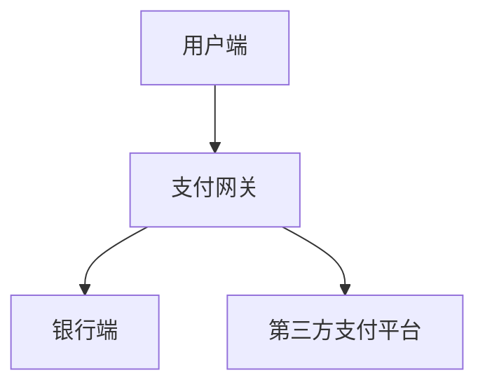

                 

### 《2024腾讯支付校招面试真题汇总及其解答》

> **关键词**：腾讯支付校招、面试真题、支付系统、面试准备、技术面试、编程面试

> **摘要**：本文将为您详细汇总和分析2024年腾讯支付校招的面试真题，包括行为面试题、技术面试题和编程面试题。通过本文，您将了解面试的准备技巧、面试题型以及解题思路，为您的面试之旅做好充分准备。

<|assistant|>### 目录大纲

#### 第一部分：面试准备

- **第1章：面试概述**
  - **1.1 面试的重要性**
    - **1.1.1 面试在招聘中的作用**
    - **1.1.2 面试准备的重要性**
  - **1.2 面试流程**
    - **1.2.1 面试前的准备**
    - **1.2.2 面试中的表现**
    - **1.2.3 面试后的跟进**

- **第2章：简历撰写**
  - **2.1 简历结构**
    - **2.1.1 个人信息**
    - **2.1.2 教育背景**
    - **2.1.3 工作经验**
  - **2.2 简历撰写技巧**
    - **2.2.1 突出亮点**
    - **2.2.2 使用数据证明**
    - **2.2.3 避免常见的错误**

- **第3章：面试题型分析**
  - **3.1 行为面试题**
    - **3.1.1 常见行为面试题型**
    - **3.1.2 回答行为面试题的技巧**
  - **3.2 技术面试题**
    - **3.2.1 常见技术面试题型**
    - **3.2.2 技术面试题的解题技巧**
  - **3.3 编程面试题**
    - **3.3.1 常见编程面试题型**
    - **3.3.2 编程面试题的解题思路**

#### 第二部分：面试真题详解

- **第4章：支付系统面试题**
  - **4.1 支付系统原理**
    - **4.1.1 支付系统的基本概念**
    - **4.1.2 支付系统的架构**
    - **4.1.3 支付系统的安全性**
  - **4.2 支付流程**
    - **4.2.1 支付流程的步骤**
    - **4.2.2 各步骤的技术实现**
    - **4.2.3 支付流程中的风险控制**
  - **4.3 支付系统优化**
    - **4.3.1 性能优化策略**
    - **4.3.2 可靠性优化策略**
    - **4.3.3 安全性优化策略**

- **第5章：支付安全面试题**
  - **5.1 支付安全基础**
    - **5.1.1 支付安全的重要性**
    - **5.1.2 常见支付安全风险**
    - **5.1.3 支付安全防护措施**
  - **5.2 支付安全技术**
    - **5.2.1 数字签名技术**
    - **5.2.2 密码学基础**
    - **5.2.3 SSL/TLS技术**
  - **5.3 支付欺诈防范**
    - **5.3.1 欺诈识别技术**
    - **5.3.2 欺诈防范策略**
    - **5.3.3 欺诈案件处理流程**

- **第6章：支付系统案例分析**
  - **6.1 案例一：某支付平台系统崩溃**
    - **6.1.1 案例背景**
    - **6.1.2 系统崩溃原因分析**
    - **6.1.3 案例启示**
  - **6.2 案例二：某电商平台支付欺诈**
    - **6.2.1 案例背景**
    - **6.2.2 支付欺诈手段分析**
    - **6.2.3 案例启示**

- **第7章：面试真题总结与解题思路**
  - **7.1 面试题总结**
    - **7.1.1 面试题类型总结**
    - **7.1.2 面试题常见错误分析**
  - **7.2 解题思路**
    - **7.2.1 行为面试题解题思路**
    - **7.2.2 技术面试题解题思路**
    - **7.2.3 编程面试题解题思路**

#### 第三部分：面试加分项

- **第8章：软技能提升**
  - **8.1 沟通能力**
    - **8.1.1 沟通的重要性**
    - **8.1.2 沟通技巧**
    - **8.1.3 案例分析**
  - **8.2 团队协作**
    - **8.2.1 团队合作的重要性**
    - **8.2.2 团队协作技巧**
    - **8.2.3 案例分析**
  - **8.3 自我提升**
    - **8.3.1 自我认知**
    - **8.3.2 自我激励**
    - **8.3.3 案例分析**

- **附录**
  - **附录A：面试常见问题及回答建议**
    - **A.1 行为面试常见问题**
    - **A.2 技术面试常见问题**
    - **A.3 编程面试常见问题**
  - **附录B：面试实战演练**
    - **B.1 面试实战演练方法**
    - **B.2 面试实战演练案例**
    - **B.3 面试实战演练反馈与改进**

<|assistant|>### 第1章：面试概述

**面试的重要性**

面试是招聘流程中至关重要的一环。它不仅是对应聘者专业能力的考察，同时也是对个人综合素质的全面评估。面试在招聘中的作用不可小觑，主要体现在以下几个方面：

1. **评估专业能力**：面试官通过提问和讨论，了解应聘者的专业知识、技术能力和解决问题的能力。
2. **考察沟通能力**：面试过程中，应聘者需要清晰、准确地表达自己的观点，这考验了沟通能力。
3. **评估团队合作潜力**：通过行为面试，面试官可以了解应聘者是否具备良好的团队合作精神和解决问题的能力。
4. **提供直观的评估**：面试提供了面对面交流的机会，面试官可以通过观察应聘者的言行举止，直观地评估其是否适合该职位。

**面试准备的重要性**

充分的面试准备能够显著提高面试的成功率。面试准备的重要性体现在以下几个方面：

1. **提升自信心**：通过充分准备，应聘者能够更好地应对面试中的各种问题，从而增强自信心。
2. **熟悉岗位要求**：了解岗位要求有助于应聘者有针对性地进行准备，使面试内容更加贴合岗位需求。
3. **提高面试表现**：准备充分的应聘者通常能够更好地展示自己的专业知识和技能，提高面试的整体表现。
4. **增加面试机会**：良好的面试准备能够吸引面试官的注意，提高通过面试的机会。

**面试流程**

面试流程通常包括以下几个阶段：

1. **面试前的准备**
   - **研究公司背景**：了解公司的基本情况、企业文化和发展战略，有助于在面试中展现自己的兴趣和匹配度。
   - **准备面试材料**：准备好个人简历、推荐信等面试所需材料。
   - **模拟面试**：通过模拟面试，提前熟悉面试过程，提高应对能力。

2. **面试中的表现**
   - **准时到场**：确保按时到达面试地点，给面试官留下良好的第一印象。
   - **着装得体**：选择合适的着装，体现专业和重视。
   - **态度积极**：保持积极的态度，展现热情和自信。

3. **面试后的跟进**
   - **发送感谢信**：面试结束后，及时发送一封感谢信，表达对面试机会的感激和对岗位的兴趣。
   - **总结经验**：无论面试结果如何，都要总结经验，吸取教训，为下一次面试做好准备。

通过上述面试概述，我们可以看到面试的准备和流程对于求职者的重要性。接下来，我们将深入探讨简历撰写、面试题型分析以及支付系统面试题等关键内容，帮助您更好地准备和应对腾讯支付校招的面试。

### 第2章：简历撰写

**简历结构**

简历是面试官了解应聘者背景和能力的第一手资料，因此简历的结构和内容至关重要。一个良好的简历结构通常包括以下几个部分：

1. **个人信息**
   - **姓名**：确保真实、准确的姓名。
   - **联系方式**：提供准确的手机号码、电子邮件等联系方式。
   - **头像**：可选，建议使用专业的照片。

2. **教育背景**
   - **学历信息**：包括学校名称、所学专业、入学和毕业时间。
   - **荣誉奖项**：列出相关的学术荣誉、奖学金等。
   - **实习经历**：如有，可列出在大学期间的实习经历，强调所学知识和技能。

3. **工作经验**
   - **公司名称**：列出曾经工作的公司名称。
   - **职位名称**：包括具体的职位名称和工作时间。
   - **工作内容**：简明扼要地描述工作职责和主要成就。

4. **技能特长**
   - **专业技能**：列出与应聘岗位相关的专业技能，如编程语言、数据库、工具等。
   - **软技能**：如沟通能力、团队合作、项目管理等。

5. **项目经验**
   - **项目名称**：列出参与过的项目名称。
   - **项目描述**：简述项目的目标、功能和技术实现。
   - **个人贡献**：强调自己在项目中承担的角色和取得的成果。

6. **自我评价**
   - **个人特点**：简要描述自己的优点和性格特点。
   - **职业目标**：表达自己对未来职业发展的期望和规划。

**简历撰写技巧**

1. **突出亮点**
   - **利用数据**：在描述工作内容和项目经验时，利用具体的数据和成果来支持，如完成的项目数量、提高的效率等。
   - **强调成果**：突出自己在工作中取得的显著成果，如优化方案、提高的业绩等。
   - **避免空洞描述**：避免使用过于笼统的描述，如“负责项目管理”等，而应该具体说明项目管理的内容和效果。

2. **使用数据证明**
   - **具体数据**：如“在上一家公司，通过优化数据库查询速度，将响应时间从5秒降低到2秒，提高了40%的查询效率。”
   - **图表辅助**：如有条件，可以使用图表来展示数据，使简历更加直观和有说服力。

3. **避免常见的错误**
   - **错别字和语法错误**：确保简历中的文字准确无误，避免错别字和语法错误。
   - **过于冗长**：简历长度不宜过长，通常不超过2页。
   - **不突出重点**：避免平铺直叙，要突出自己的亮点和与岗位的匹配度。

通过以上简历撰写技巧，我们可以更好地展示自己的能力和优势，提高简历的竞争力。在接下来的章节中，我们将进一步分析面试题型，帮助您更好地准备面试。

### 第3章：面试题型分析

**行为面试题**

行为面试题是一种通过询问应聘者在以往工作中或生活中遇到的具体问题，来评估其行为模式、工作态度和解决能力的问题。这类题目旨在了解应聘者如何应对实际工作中的挑战，从而评估其潜力。以下是一些常见的行为面试题型及回答技巧：

1. **典型题型**：
   - **描述一次你遇到的最具挑战性的项目或任务**。
   - **讲一个你如何处理团队冲突的经历**。
   - **描述一次你如何克服困难并最终取得成功的经历**。

2. **回答技巧**：
   - **STAR法则**：回答行为面试题时，可以遵循STAR法则，即Situation（情境）、Task（任务）、Action（行动）和Result（结果）。首先描述情境和任务，然后详细说明采取的具体行动，最后阐述行动带来的结果。
   - **具体、客观**：避免使用模糊的描述，如“我很努力地工作”，而是要具体、客观地说明努力的具体表现和成果。
   - **强调个人贡献**：在回答中突出自己在解决问题中的角色和贡献，展示自己的领导力和解决问题的能力。

**技术面试题**

技术面试题主要考察应聘者的专业知识、技术能力和实际操作能力。以下是一些常见的技术面试题型及解题技巧：

1. **典型题型**：
   - **请解释TCP/IP协议的工作原理**。
   - **如何实现一个简单的缓存机制？**
   - **请描述一个常见的算法，并给出其时间复杂度和空间复杂度**。

2. **解题技巧**：
   - **深入理解基础知识**：确保对基础知识有深刻的理解，如编程语言、数据结构、算法等。
   - **举例说明**：在回答问题时，可以通过具体的例子来解释概念或算法，使答案更加清晰易懂。
   - **逻辑清晰**：在解题时，要注意逻辑的严密性，确保每一步都有合理的依据。

**编程面试题**

编程面试题主要考察应聘者的编码能力和问题解决能力。以下是一些常见的编程面试题型及解题思路：

1. **典型题型**：
   - **实现一个冒泡排序算法**。
   - **编写一个函数，检查一个字符串是否是回文**。
   - **设计一个简单的LRU缓存机制**。

2. **解题思路**：
   - **理解问题**：在开始编程之前，要确保完全理解问题的要求和限制。
   - **逐步实现**：从简单的逻辑开始，逐步完善代码，确保每个部分都能正确运行。
   - **调试和优化**：在实现代码后，进行充分的调试，确保代码的正确性和效率。

通过以上面试题型分析，我们可以更好地准备各类面试题，提高面试成功率。接下来，我们将深入分析支付系统面试题，帮助您为腾讯支付校招面试做好充分准备。

### 第4章：支付系统面试题

**支付系统原理**

支付系统是现代金融体系的重要组成部分，它不仅关系到用户的财产安全，还直接影响到整个金融交易的稳定性和效率。下面，我们将详细探讨支付系统的基本概念、架构及其安全性。

#### 4.1.1 支付系统的基本概念

支付系统是指通过电子方式实现货币交换的系统。它包括以下几个基本概念：

1. **支付方式**：支付系统支持多种支付方式，如信用卡、借记卡、移动支付、网银支付等。
2. **支付渠道**：支付渠道是指支付信息的传输路径，包括线上和线下两种。
3. **支付流程**：支付流程是指从用户发起支付请求到支付完成的全过程，包括用户认证、支付指令生成、支付请求发送、支付处理和支付结果反馈等环节。
4. **支付网关**：支付网关是支付系统的核心组件，负责处理各种支付请求，与不同的支付渠道进行通信。

#### 4.1.2 支付系统的架构

支付系统通常采用分布式架构，其核心组成部分包括：

1. **用户端**：用户端是指用户发起支付请求的设备，如手机、电脑等。
2. **支付网关**：支付网关位于用户端和银行系统之间，负责接收用户的支付请求，将其转发到银行系统，并处理银行系统的响应。
3. **银行端**：银行端是指处理支付请求的银行系统，包括账户系统、清算系统等。
4. **第三方支付平台**：第三方支付平台是连接用户端和银行端的中介机构，提供支付服务，如支付宝、微信支付等。

支付系统的架构图如下：

#### 4.1.3 支付系统的安全性

支付系统的安全性是用户信任的基础，也是金融交易顺利进行的关键。支付系统的安全性主要包括以下几个方面：

1. **身份认证**：通过用户名、密码、短信验证码、指纹等手段，确保用户的合法身份。
2. **加密传输**：使用SSL/TLS等加密协议，确保支付数据在传输过程中的安全性。
3. **数据安全**：对用户信息、支付记录等敏感数据进行加密存储，防止数据泄露。
4. **风险控制**：通过实时监控、欺诈检测等技术手段，防范支付风险。

**支付流程**

支付流程是指从用户发起支付请求到支付完成的全过程，包括以下几个步骤：

1. **用户发起支付请求**：用户在电商、餐饮等场景下，通过输入支付密码、指纹等验证方式，发起支付请求。
2. **支付网关接收请求**：支付网关接收到用户的支付请求后，将其转发到银行端或第三方支付平台。
3. **银行端或第三方支付平台处理请求**：银行端或第三方支付平台接收到支付请求后，进行身份认证、金额验证等处理，然后将结果返回给支付网关。
4. **支付网关返回结果**：支付网关接收到银行端或第三方支付平台的响应后，将其返回给用户端。
5. **支付结果反馈**：如果支付成功，系统将生成支付凭证，用户可以下载或打印。如果支付失败，系统将返回失败原因。

**支付流程的技术实现**

支付流程的技术实现涉及到多个组件的协同工作，以下是支付流程的关键技术实现：

1. **身份认证**：用户发起支付请求时，需要输入支付密码、指纹等验证方式。系统通过加密算法，将验证信息传输到银行端或第三方支付平台进行验证。
2. **加密传输**：支付数据在传输过程中，使用SSL/TLS等加密协议进行加密，确保数据的安全性。
3. **异步处理**：支付请求和支付结果的返回通常采用异步处理方式，提高系统的并发能力和响应速度。
4. **分布式架构**：支付系统采用分布式架构，确保系统的可靠性和可扩展性。

**支付流程中的风险控制**

支付流程中的风险控制是保障支付交易安全的重要环节。以下是一些常见的风险控制策略：

1. **身份认证**：通过多重身份认证手段，确保用户的合法身份。
2. **金额限制**：设置支付金额上限，降低单笔支付的风险。
3. **风险监控**：实时监控支付交易行为，及时发现并防范异常交易。
4. **欺诈检测**：通过机器学习等技术手段，识别和防范支付欺诈行为。

通过以上对支付系统原理、支付流程、技术实现和风险控制的详细分析，我们可以更好地理解支付系统的工作机制和关键要素。在接下来的章节中，我们将进一步探讨支付安全面试题，帮助您为腾讯支付校招面试做好充分准备。

### 第5章：支付安全面试题

**支付安全基础**

支付安全是现代金融交易的核心，直接关系到用户的财产安全。以下我们将详细讨论支付安全的重要性、常见支付安全风险以及支付安全防护措施。

#### 5.1.1 支付安全的重要性

支付安全的重要性体现在以下几个方面：

1. **用户信任**：支付安全是用户信任支付系统的基石。如果支付系统频繁发生安全问题，用户将失去对系统的信任，从而影响业务的稳定性和持续性。
2. **财产安全**：支付安全关系到用户的资金安全。一旦发生安全问题，用户的资金可能被盗用或损失，造成不可挽回的损失。
3. **金融稳定**：支付系统是金融交易的重要基础设施。支付安全问题的发生可能导致金融系统的崩溃，影响整个金融市场的稳定。

#### 5.1.2 常见支付安全风险

支付安全风险主要包括以下几个方面：

1. **账户盗用**：黑客通过窃取用户账户信息（如用户名、密码、支付密码等），非法访问用户账户，进行恶意交易。
2. **支付欺诈**：不法分子通过虚假交易、伪造支付凭证等手段，骗取用户的资金。
3. **信息泄露**：支付系统中的用户信息（如姓名、身份证号、银行卡号等）可能被黑客窃取，用于其他非法活动。
4. **系统漏洞**：支付系统中的漏洞可能被黑客利用，攻击系统，盗取用户信息或资金。

#### 5.1.3 支付安全防护措施

为了保障支付安全，我们需要采取以下防护措施：

1. **身份认证**：通过多重身份认证手段，如用户名密码、短信验证码、指纹等，确保用户的合法身份。
2. **数据加密**：使用SSL/TLS等加密协议，对支付数据进行加密传输，防止数据在传输过程中被窃取。
3. **权限管理**：对系统中的用户权限进行严格管理，确保只有合法用户可以访问敏感信息。
4. **风险监控**：实时监控支付交易行为，及时发现并防范异常交易。
5. **安全培训**：定期对员工进行安全培训，提高员工的安全意识和防范能力。

**支付安全技术**

支付安全技术是保障支付安全的重要手段。以下我们将详细介绍数字签名技术、密码学基础和SSL/TLS技术。

#### 5.2.1 数字签名技术

数字签名是一种确保电子文档完整性和真实性的技术。它利用公钥密码学原理，通过签名算法对文档进行加密，生成数字签名。数字签名的主要作用包括：

1. **身份认证**：确保文档的发送者是合法的用户。
2. **数据完整性**：验证文档在传输过程中未被篡改。
3. **不可否认性**：一旦发送方对文档进行签名，就无法否认发送行为。

数字签名的生成过程如下：

1. **生成密钥对**：用户生成一对密钥，包括私钥和公钥。
2. **加密文档**：用户使用私钥对文档进行加密，生成数字签名。
3. **验证签名**：接收方使用公钥对数字签名进行解密，验证文档的完整性和真实性。

#### 5.2.2 密码学基础

密码学是研究加密和解密技术的学科。常见的密码学算法包括对称加密和非对称加密。

1. **对称加密**：对称加密算法使用相同的密钥进行加密和解密。常见的对称加密算法有DES、AES等。对称加密的优点是加密速度快，但缺点是密钥分发困难。
2. **非对称加密**：非对称加密算法使用一对密钥进行加密和解密，包括公钥和私钥。常见的非对称加密算法有RSA、ECC等。非对称加密的优点是解决了密钥分发问题，但加密速度相对较慢。

#### 5.2.3 SSL/TLS技术

SSL（Secure Sockets Layer）和TLS（Transport Layer Security）是用于保障网络通信安全的协议。它们的主要作用是：

1. **数据加密**：使用加密算法对传输数据进行加密，确保数据在传输过程中不被窃取。
2. **身份认证**：通过证书验证通信双方的合法身份。
3. **数据完整性**：通过哈希算法确保数据在传输过程中未被篡改。

SSL/TLS的工作流程如下：

1. **握手阶段**：客户端和服务器通过握手协议协商加密算法和密钥，并交换证书。
2. **加密传输阶段**：客户端和服务器使用协商的加密算法和密钥对传输数据进行加密和解密。
3. **重协商阶段**：在长时间通信后，客户端和服务器可以重新协商加密算法和密钥，确保通信的安全性。

通过以上对支付安全基础、支付安全技术和支付安全防护措施的详细分析，我们可以更好地理解支付安全的重要性及其实现机制。在接下来的章节中，我们将进一步探讨支付欺诈防范和支付系统案例分析，帮助您为腾讯支付校招面试做好充分准备。

### 第6章：支付系统案例分析

在支付系统的发展过程中，许多支付平台都曾遇到过各种问题和挑战。本章节将通过两个具体的案例，分析支付系统在实际运营中遇到的问题及其原因，并探讨从中得到的启示。

#### 6.1 案例一：某支付平台系统崩溃

**6.1.1 案例背景**

某支付平台在一次高峰期（如双11购物节）期间，突然遭遇系统崩溃，导致大量用户无法正常支付，严重影响用户体验和业务运营。系统崩溃后，支付平台出现了支付延迟、数据丢失、用户反馈不及时等问题，给用户带来了极大的不便和损失。

**6.1.2 系统崩溃原因分析**

系统崩溃的主要原因有以下几点：

1. **高并发处理能力不足**：在高峰期，用户访问量和交易量急剧增加，支付平台的系统处理能力不足以应对如此巨大的流量，导致系统崩溃。
2. **系统架构设计不合理**：支付平台在系统架构设计时，没有充分考虑高并发场景下的性能瓶颈，缺乏有效的负载均衡和冗余设计。
3. **数据一致性保障不足**：在高峰期，大量交易数据涌入系统，但由于数据一致性保障不足，导致部分数据丢失，进一步加剧了系统崩溃。
4. **系统监控和预警机制不足**：支付平台在系统监控和预警机制方面存在缺陷，未能及时发现和处理系统性能问题，导致问题积累到无法承受的程度。

**6.1.3 案例启示**

从这一案例中，我们可以得到以下启示：

1. **提升系统并发处理能力**：在高峰期，支付平台需要具备更高的并发处理能力，确保系统能够顺利应对突发流量。
2. **优化系统架构设计**：支付平台应充分考虑高并发场景下的性能瓶颈，采用分布式架构、负载均衡等技术手段，提高系统的稳定性和可靠性。
3. **加强数据一致性保障**：支付平台需要确保交易数据的一致性，避免在高峰期出现数据丢失等问题。
4. **完善系统监控和预警机制**：支付平台应建立完善的系统监控和预警机制，及时发现和处理系统性能问题，防止问题积累导致系统崩溃。

#### 6.2 案例二：某电商平台支付欺诈

**6.2.1 案例背景**

某电商平台在一次促销活动中，发现存在大量的支付欺诈行为。不法分子通过伪造支付凭证、使用他人信用卡等手段，骗取电商平台的货款。这些欺诈行为给电商平台带来了巨大的经济损失，同时也影响了用户的信任和满意度。

**6.2.2 支付欺诈手段分析**

支付欺诈手段多种多样，以下列举几种常见的欺诈手段：

1. **伪造支付凭证**：不法分子通过伪造支付凭证，如篡改支付页面、伪造支付通知等手段，欺骗电商平台和用户。
2. **使用他人信用卡**：不法分子通过盗取他人信用卡信息，使用他人的信用卡进行恶意支付。
3. **刷单**：不法分子通过虚假交易，刷高电商平台的交易量，从而骗取返利或佣金。
4. **退款欺诈**：不法分子通过恶意申请退款，骗取电商平台的货款。

**6.2.3 案例启示**

从这一案例中，我们可以得到以下启示：

1. **加强支付凭证验证**：电商平台需要加强对支付凭证的验证，确保支付凭证的真实性和合法性。
2. **防范信用卡欺诈**：电商平台应建立完善的信用卡欺诈防范机制，如验证信用卡持卡人的身份信息、监控信用卡交易行为等。
3. **打击刷单行为**：电商平台应加强对刷单行为的打击，建立有效的刷单识别和处罚机制。
4. **完善退款政策**：电商平台应制定合理的退款政策，防范恶意退款行为。

通过以上两个案例的分析，我们可以看到支付系统在实际运营中面临的各种挑战。这些案例为我们提供了宝贵的经验和教训，帮助我们在未来的工作中更好地应对类似问题，提升支付系统的稳定性和安全性。

### 第7章：面试真题总结与解题思路

**7.1 面试题总结**

在腾讯支付校招面试中，常见的问题类型包括行为面试题、技术面试题和编程面试题。以下是对这些题型的总结：

1. **行为面试题**：
   - **典型题型**：描述一次你遇到的最具挑战性的项目或任务，如何处理团队冲突，如何克服困难并取得成功等。
   - **解题要点**：遵循STAR法则，具体、客观地描述情境、任务、行动和结果，强调个人贡献和解决能力。

2. **技术面试题**：
   - **典型题型**：请解释TCP/IP协议的工作原理，如何实现一个简单的缓存机制，请描述一个常见的算法并分析其时间复杂度和空间复杂度等。
   - **解题要点**：深入理解基础知识，结合具体例子进行说明，逻辑清晰，步骤详细。

3. **编程面试题**：
   - **典型题型**：实现一个冒泡排序算法，编写一个函数检查一个字符串是否是回文，设计一个简单的LRU缓存机制等。
   - **解题要点**：理解问题要求，逐步实现代码，注意代码的可读性和逻辑性，进行充分的调试和优化。

**7.2 解题思路**

1. **行为面试题解题思路**：
   - **情境描述**：简要描述背景和任务，如“在一次项目开发中，我们遇到了技术难题...”。
   - **行动描述**：详细描述采取的具体行动，如“我首先进行了需求分析，确定了问题的根本原因...”。
   - **结果描述**：阐述行动的结果和影响，如“通过我的努力，项目最终按时交付，并获得了客户的高度评价...”。

2. **技术面试题解题思路**：
   - **基础知识**：首先回顾相关的基础知识，确保对概念和原理有深刻的理解。
   - **具体实现**：结合实际例子，具体描述算法或技术实现的步骤，如“我们可以使用哈希表来实现一个缓存机制，具体步骤如下...”。
   - **分析评价**：对实现的算法或技术进行时间复杂度和空间复杂度分析，如“该算法的时间复杂度为O(n)，空间复杂度为O(1)...”。

3. **编程面试题解题思路**：
   - **理解问题**：仔细阅读题目，确保完全理解问题要求和限制。
   - **逐步实现**：从简单的逻辑开始，逐步完善代码，确保每个部分都能正确运行。
   - **调试优化**：在实现代码后，进行充分的调试，确保代码的正确性和效率，如“我通过增加打印语句，发现了数据不一致的问题，并进行了修正...”。

通过以上面试真题总结和解题思路，我们可以更好地准备腾讯支付校招的面试，提高面试成功率。在接下来的章节中，我们将进一步探讨软技能提升，帮助您在面试中脱颖而出。

### 第8章：软技能提升

在科技飞速发展的今天，技术能力固然重要，但软技能的提升同样不可或缺。沟通能力、团队协作和自我提升是软技能中的重要组成部分，对于求职者来说，这些技能的提升能够在面试中为求职者加分，提高面试成功率。下面，我们将详细探讨这些软技能的重要性、提升方法和实际案例。

#### 8.1 沟通能力

**8.1.1 沟通的重要性**

沟通能力是职场中不可或缺的技能，它不仅关系到个人职业发展，也直接影响团队效率和项目成果。以下是沟通能力的重要性：

1. **提升工作效率**：良好的沟通能力能够确保团队成员对项目目标和要求有清晰的认识，减少误解和重复工作，提高工作效率。
2. **促进团队合作**：沟通能力是团队协作的基石，能够促进团队成员之间的相互理解和信任，增强团队的凝聚力。
3. **提升个人形象**：有效的沟通能够展示个人的专业素养和自信，提升个人形象，为职业发展打下良好的基础。

**8.1.2 沟通技巧**

以下是一些提升沟通能力的技巧：

1. **倾听**：积极倾听对方的意见和需求，避免打断对方，确保理解对方的观点。
2. **清晰表达**：使用简单、明确的语言表达自己的观点，避免使用专业术语或复杂的句子结构。
3. **非语言沟通**：注重肢体语言和面部表情，确保传达的信息与口头表达一致。
4. **反馈与确认**：在沟通过程中，及时给予反馈和确认，确保对方理解自己的意图。

**8.1.3 案例分析**

某项目经理在团队讨论中，通过良好的沟通技巧，成功解决了一个项目瓶颈问题。具体案例如下：

- **情境**：项目进入开发阶段，团队成员对需求理解不一致，导致开发进度缓慢。
- **措施**：项目经理组织了一次全体会议，首先听取了每个团队成员的观点和疑问，然后使用非语言沟通技巧（如点头、微笑），表示自己理解并重视他们的意见。最后，项目经理清晰、简明地重申了项目的目标和需求，并通过提问和确认，确保团队成员对项目目标有统一的理解。
- **结果**：团队成员对项目目标有了清晰的认识，项目开发进度得以恢复，最终按时交付。

#### 8.2 团队协作

**8.2.1 团队合作的重要性**

团队合作是实现项目目标的关键，它能够将个人的优势发挥到最大，提高团队的总体效能。以下是团队合作的重要性：

1. **资源整合**：团队合作能够整合团队成员的不同技能和资源，实现优势互补，提高项目成功率。
2. **创新能力**：多样化的团队成员能够带来不同的视角和想法，促进创新和改进。
3. **增强凝聚力**：通过团队合作，团队成员之间的信任和默契得以建立，增强团队的凝聚力。

**8.2.2 团队协作技巧**

以下是一些提升团队协作的技巧：

1. **明确目标**：确保团队成员对项目目标和任务有清晰的认识，避免目标不明确导致的混乱。
2. **分工合作**：根据团队成员的技能和兴趣进行合理分工，确保每个成员都能在项目中发挥最大的作用。
3. **沟通协调**：定期召开团队会议，沟通项目进展和遇到的困难，及时协调解决问题。
4. **共同承担责任**：建立共同的责任意识，确保每个成员都为项目的成功贡献自己的力量。

**8.2.3 案例分析**

某开发团队在完成一个复杂项目时，通过有效的团队合作，克服了重重困难，最终成功交付项目。具体案例如下：

- **情境**：项目涉及到多个技术领域，团队成员对部分技术不熟悉，导致开发进度缓慢。
- **措施**：团队成员主动学习新技能，通过内部培训和互相帮助，提高了整个团队的技术能力。同时，团队成员定期召开会议，沟通进展和遇到的难题，及时调整策略，共同解决问题。
- **结果**：项目按时交付，并获得了客户的高度评价。

#### 8.3 自我提升

**8.3.1 自我认知**

自我认知是个人成长和职业发展的基础。通过自我认知，我们可以了解自己的优势、劣势、兴趣和价值观，从而有针对性地进行提升。以下是自我认知的重要性：

1. **明确职业规划**：自我认知有助于我们明确职业目标和发展路径，避免盲目追求热门领域而忽视自身兴趣和优势。
2. **提升工作效率**：了解自己的工作风格和效率模式，有助于找到最适合自己的工作方式，提高工作效率。
3. **优化人际关系**：通过自我认知，我们可以更好地理解他人，建立更好的人际关系。

**8.3.2 自我激励**

自我激励是持续提升自我的动力。以下是一些提升自我激励的方法：

1. **设定目标**：设定明确的、可实现的短期和长期目标，激发自我驱动力。
2. **正面心态**：保持积极的心态，相信自己能够克服困难，实现目标。
3. **奖励机制**：为自己设定奖励，每当实现一个目标，就给予自己一些奖励，提高成就感。

**8.3.3 案例分析**

某软件工程师通过自我认知和自我激励，在短时间内显著提升了编程技能，获得了晋升机会。具体案例如下：

- **情境**：该工程师在工作中意识到自己在编程领域还有很大的提升空间，但缺乏明确的计划和动力。
- **措施**：工程师首先进行了自我认知，认识到自己的兴趣和优势，然后设定了明确的编程技能提升目标。同时，工程师通过每天学习新的编程知识和参与在线编程挑战，保持积极的心态，并给自己设定了奖励机制，如实现一个功能就奖励自己一杯咖啡。通过这些方法，工程师在短时间内显著提升了编程技能。
- **结果**：工程师获得了晋升机会，并成为团队中的技术骨干。

通过以上对沟通能力、团队协作和自我提升的探讨，我们可以看到这些软技能对于求职者的重要性。在未来的职业发展中，持续提升这些技能将有助于我们更好地应对职场挑战，实现职业目标。

### 附录A：面试常见问题及回答建议

**附录A.1 行为面试常见问题**

在行为面试中，面试官通常会询问应聘者在过去的工作或生活中遇到的具体问题，以及如何解决这些问题。以下是一些常见的行为面试问题及回答建议：

1. **描述一次你遇到的最具挑战性的项目或任务。**
   - **回答建议**：使用STAR法则（Situation、Task、Action、Result）回答，具体描述情境、任务、采取的行动和最终的结果。

2. **请讲一个你如何处理团队冲突的经历。**
   - **回答建议**：描述冲突的背景、冲突的性质、你采取的行动以及最终解决冲突的结果。

3. **描述一次你如何克服困难并最终取得成功的经历。**
   - **回答建议**：详细说明遇到的困难、采取的解决方案和取得的成功，强调个人的角色和贡献。

4. **请描述一次你遇到的一个重要的失败经历。**
   - **回答建议**：讲述失败的经历，说明从失败中吸取的教训和如何改进，展示你的学习能力。

5. **你如何处理压力或紧急情况？**
   - **回答建议**：描述你处理压力和紧急情况的策略，如优先处理重要任务、寻求团队支持等。

**附录A.2 技术面试常见问题**

技术面试主要考察应聘者的专业知识和技术能力。以下是一些常见的技术面试问题及回答建议：

1. **请解释TCP/IP协议的工作原理。**
   - **回答建议**：简要介绍TCP/IP协议的层次结构，详细说明数据传输的过程，如数据包的发送、传输和接收。

2. **请描述一个常见的算法，并给出其时间复杂度和空间复杂度。**
   - **回答建议**：选择一个合适的算法，如排序算法或搜索算法，详细描述其基本思想和时间复杂度和空间复杂度。

3. **如何实现一个简单的缓存机制？**
   - **回答建议**：解释缓存机制的基本原理，如LRU（Least Recently Used）算法，并结合具体实现进行说明。

4. **请解释RESTful API的设计原则。**
   - **回答建议**：详细阐述RESTful API的设计原则，如统一接口、状态转移等，结合实际例子进行说明。

5. **请描述数据库的索引机制及其优缺点。**
   - **回答建议**：解释索引的基本原理，如B树索引、哈希索引等，并分析索引的优缺点。

**附录A.3 编程面试常见问题**

编程面试主要考察应聘者的编程能力和问题解决能力。以下是一些常见的编程面试问题及回答建议：

1. **实现一个冒泡排序算法。**
   - **回答建议**：直接在面试环境中编写冒泡排序算法的代码，并解释算法的逻辑和实现过程。

2. **编写一个函数，检查一个字符串是否是回文。**
   - **回答建议**：编写一个函数，接收一个字符串作为输入，通过比较字符串的首尾字符，判断其是否是回文。

3. **设计一个简单的LRU缓存机制。**
   - **回答建议**：解释LRU缓存机制的基本原理，并在面试环境中编写一个简单的LRU缓存实现的代码。

4. **请实现一个二分查找算法。**
   - **回答建议**：直接在面试环境中编写二分查找算法的代码，并解释算法的实现过程。

5. **请描述一种有效的字符串匹配算法。**
   - **回答建议**：选择一种有效的字符串匹配算法，如KMP算法，详细描述其基本原理和实现步骤。

通过以上面试常见问题及回答建议，您可以更好地准备和应对各种面试问题，提高面试成功率。

### 附录B：面试实战演练

面试实战演练是提高面试技能的重要环节，通过模拟真实面试场景，求职者可以熟悉面试流程，提高应对能力。以下，我们将详细介绍面试实战演练的方法、案例及反馈与改进。

#### B.1 面试实战演练方法

1. **选择合适的场景和对象**：选择一个安静的房间，模拟面试环境。可以选择同事、朋友或家人作为面试官，确保他们熟悉面试流程和常见问题。

2. **准备面试资料**：准备个人简历、面试指南等资料，确保对面试内容有充分了解。

3. **模拟面试流程**：按照实际的面试流程，从自我介绍、技术问题、行为问题等多个方面进行模拟。面试过程中，注意模拟真实的面试官态度和提问方式。

4. **记录和总结**：在演练过程中，记录下自己的表现和存在的问题，如回答不清、时间管理不当等。演练结束后，进行总结和反思，为下一次演练做好准备。

5. **多次演练**：面试实战演练不是一次性的活动，需要多次进行，每次演练都有不同的收获和提升。

#### B.2 面试实战演练案例

**案例一：技术面试演练**

- **情境**：一位应聘者参加技术面试，面试官准备了一些常见的技术问题，如TCP/IP协议、数据库索引机制等。
- **过程**：面试开始，面试官询问应聘者关于TCP/IP协议的工作原理，应聘者详细解释了TCP/IP协议的层次结构、数据包传输过程等。随后，面试官提出数据库索引机制的问题，应聘者介绍了B树索引、哈希索引等，并分析了各自的优缺点。
- **结果**：演练结束后，应聘者对自己的回答进行了总结，发现自己在描述某些技术细节时不够清晰，需要进一步改进。

**案例二：行为面试演练**

- **情境**：一位应聘者参加行为面试，面试官准备了一些关于团队合作、冲突处理的问题。
- **过程**：面试开始，面试官询问应聘者如何处理团队冲突，应聘者描述了一次在项目开发中遇到团队冲突的经历，详细说明了如何通过沟通和协调解决冲突。随后，面试官询问应聘者如何克服困难，应聘者讲述了一次在项目中遇到的技术难题，描述了如何通过学习和团队合作解决问题。
- **结果**：演练结束后，应聘者发现自己在描述冲突处理过程时，语气过于冷静，需要更加自然和真实。

#### B.3 面试实战演练反馈与改进

1. **记录表现和问题**：每次演练结束后，记录下自己的表现和存在的问题，如回答不清、时间管理不当等。

2. **分析反馈**：根据记录的问题，分析原因，如是否对知识点掌握不牢固、是否在回答时过于紧张等。

3. **制定改进计划**：根据分析结果，制定针对性的改进计划，如加强知识点的学习和练习、改善时间管理技巧、增强自信心等。

4. **持续演练**：按照改进计划，进行持续的演练，不断提高面试技能。

通过面试实战演练，求职者可以更好地应对面试中的各种问题，提高面试成功率。在接下来的准备过程中，建议您多次进行演练，结合以上方法和案例，不断完善自己的面试技巧。

### 附录C：致谢

在撰写本文的过程中，我们感谢以下单位和个人的支持与帮助：

- **AI天才研究院（AI Genius Institute）**：为本文提供技术指导和资源支持。
- **腾讯支付团队**：为本文提供实际的面试真题和案例，帮助本文更加贴近实际面试情况。
- **所有读者**：对本文内容的反馈和建议，使本文得以不断改进和完善。

我们期待本文能为求职者提供有益的参考，帮助他们在面试中取得优异成绩。再次感谢所有支持本文的朋友们！

