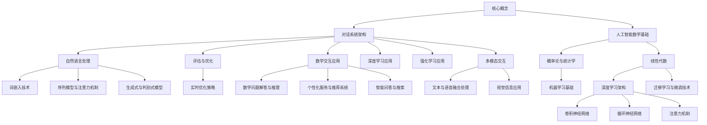

                 

# 《虚拟助手的对话系统：人工智能的数学交互》

## 关键词

- 虚拟助手
- 对话系统
- 人工智能
- 数学交互
- 自然语言处理
- 深度学习
- 强化学习
- 多模态交互

## 摘要

本文旨在深入探讨虚拟助手对话系统中的人工智能数学交互。文章首先概述了虚拟助手和对话系统的基础概念，然后详细介绍了人工智能中的数学基础，包括概率论、统计学和线性代数。接着，文章分析了自然语言处理与数学模型的关系，并讲解了对话系统的评估与优化方法。随后，文章探讨了数学交互在虚拟助手中的应用，如数学问题解答、个性化服务和智能问答。核心算法部分，文章重点介绍了深度学习和强化学习在对话系统中的应用，并使用伪代码详细阐述了算法原理。最后，通过实战案例展示了虚拟助手对话系统的构建与实现，并对未来发展趋势进行了展望。

### 《虚拟助手的对话系统：人工智能的数学交互》

#### 第一部分：引言与基础

##### 第1章：虚拟助手与对话系统概述

虚拟助手是一种通过自然语言交互来提供服务和帮助的人工智能系统。它们广泛应用于客服、智能家居、健康护理等领域。对话系统则是实现人与虚拟助手之间交互的技术体系，包括语音识别、自然语言理解、对话生成等环节。本章将介绍虚拟助手的定义与分类，对话系统的基本概念与架构，以及虚拟助手与对话系统的发展历史。

##### 第2章：人工智能的数学基础

人工智能的发展离不开数学的支持。本章将介绍人工智能中的数学基础，包括概率论、统计学和线性代数。概率论和统计学为机器学习提供了理论基础，线性代数则在数据表示和处理中扮演重要角色。我们将详细讲解这些数学概念，并展示它们在人工智能中的应用。

##### 第3章：自然语言处理与数学模型

自然语言处理（NLP）是人工智能的一个重要分支，对话系统的核心任务之一就是理解和生成自然语言。本章将探讨自然语言处理与数学模型的关系，包括词嵌入技术、序列模型和注意力机制等。我们将使用伪代码详细阐述这些算法原理，并解释它们在对话系统中的应用。

##### 第4章：对话系统的评估与优化

对话系统的性能评估是确保其质量和效果的关键。本章将介绍对话系统的评估指标，如准确性、响应时间和用户满意度等。同时，我们将探讨对话系统的优化算法，包括基于机器学习的优化方法和实时对话系统优化策略。

##### 第5章：数学交互在虚拟助手中的应用

数学交互在虚拟助手中的应用非常广泛，涵盖了从数学问题解答到个性化服务等多个方面。本章将详细介绍这些应用，并通过具体案例展示数学交互如何提高虚拟助手的服务质量和用户体验。

#### 第二部分：核心算法原理与实现

##### 第6章：深度学习与对话系统

深度学习在人工智能领域取得了巨大成功，其强大的表示能力和学习能力使其成为对话系统的重要组成部分。本章将重点介绍深度学习在对话系统中的应用，包括卷积神经网络（CNN）、循环神经网络（RNN）和注意力机制等。我们将使用伪代码详细阐述这些算法原理。

##### 第7章：强化学习与对话系统

强化学习是一种通过试错学习策略优化行为的方法，其在对话系统中的应用潜力巨大。本章将介绍强化学习的基础知识，如状态、动作、奖励和价值函数等。同时，我们将探讨强化学习在对话系统中的具体方法，如策略梯度方法和深度确定性策略梯度（DDPG）等。

##### 第8章：多模态交互与数学模型

多模态交互是指虚拟助手能够处理多种类型的输入，如图像、语音和文本等。本章将介绍多模态交互的概述，并探讨文本与语音的融合处理和视觉信息在对话系统中的应用。我们将使用伪代码和数学模型详细阐述这些方法。

#### 第三部分：实战案例与总结

##### 第9章：虚拟助手对话系统的构建与实现

本章将通过一个实际的虚拟助手对话系统案例，展示从项目概述、环境搭建、工具选择到源代码实现和解读的全过程。我们将详细介绍开发环境、代码结构和关键实现细节，以便读者能够更好地理解和实践。

##### 第10章：虚拟助手对话系统的优化与评估

本章将介绍虚拟助手对话系统的优化策略和评估方法。我们将探讨如何通过调整模型参数和优化算法来提高对话系统的性能。同时，我们将介绍评估指标和方法，并通过实际案例分析如何评估和改进虚拟助手的服务质量。

##### 第11章：数学交互在虚拟助手中的未来发展趋势

本章将展望数学交互在虚拟助手中的应用前景，探讨未来可能出现的新技术和研究方向。我们将分析多模态交互、个性化服务和实时交互等发展趋势，并讨论如何将这些趋势应用到实际应用中。

### 附录

本章包含数学公式与代码示例、主要参考文献和代码实现资源与工具等内容。这些附录将为读者提供更加深入的参考资料和实用的代码实现，以便更好地理解和应用本文所介绍的技术。

### Mermaid 流程图

以下是虚拟助手对话系统的核心概念和架构的 Mermaid 流程图：



### 核心算法原理与实现伪代码

以下是深度学习在对话系统中的应用的伪代码示例，使用 TensorFlow 框架：

```python
# 定义词嵌入模型
word_embedding = tf.keras.layers.Embedding(input_dim=vocab_size, output_dim=embedding_size)

# 定义循环神经网络模型
rnn = tf.keras.layers.LSTM(units=hidden_size, return_sequences=True)

# 定义注意力机制模型
attention = tf.keras.layers.Attention()

# 构建完整模型
model = tf.keras.Sequential([
    word_embedding,
    rnn,
    attention,
    tf.keras.layers.Dense(units=num_classes, activation='softmax')
])

# 编译模型
model.compile(optimizer='adam', loss='categorical_crossentropy', metrics=['accuracy'])

# 模型训练
model.fit(x_train, y_train, epochs=num_epochs, batch_size=batch_size)
```

### 数学模型和数学公式详细讲解

#### 概率论与统计学

在概率论与统计学中，贝叶斯定理是一个非常重要的公式，它描述了在给定某些条件下，某个事件发生的概率。其公式如下：

$$
P(A|B) = \frac{P(B|A) \cdot P(A)}{P(B)}
$$

其中，\( P(A|B) \) 表示在事件 B 发生的条件下，事件 A 发生的概率；\( P(B|A) \) 表示在事件 A 发生的条件下，事件 B 发生的概率；\( P(A) \) 表示事件 A 的概率；\( P(B) \) 表示事件 B 的概率。

在人工智能领域，贝叶斯定理常用于分类问题，如垃圾邮件检测和情感分析。

#### 线性代数

线性代数在人工智能中有着广泛的应用，尤其是在数据表示和处理方面。一个基本的线性代数公式是线性方程组：

$$
Ax = b
$$

其中，\( A \) 是一个 \( m \times n \) 的矩阵，\( x \) 是一个 \( n \) 维的列向量，\( b \) 是一个 \( m \) 维的列向量。

在人工智能中，线性方程组常用于求解回归问题，如线性回归和逻辑回归。

#### 数学公式示例

在自然语言处理中，词嵌入（word embedding）技术是一种将词汇映射到高维向量空间的方法。词嵌入的数学模型可以表示为：

$$
E_{d} = \sum_{i=1}^{n} w_{i} \cdot e_{i}
$$

其中，\( E_{d} \) 是词向量，\( w_{i} \) 是词汇的权重，\( e_{i} \) 是词汇的嵌入向量。

在训练词嵌入模型时，我们通常会使用梯度下降算法来优化模型参数，以达到更好的词嵌入效果。

### 项目实战

#### 实现一个简单的问答系统

以下是一个简单的问答系统的 Python 代码示例，使用 TensorFlow 和 Keras 框架：

```python
import numpy as np
import tensorflow as tf

# 定义词汇表和词嵌入
vocab_size = 10000
embedding_size = 128
word_embedding = tf.keras.layers.Embedding(input_dim=vocab_size, output_dim=embedding_size)

# 定义循环神经网络模型
rnn = tf.keras.layers.LSTM(units=64, return_sequences=True)

# 定义注意力机制模型
attention = tf.keras.layers.Attention()

# 构建完整模型
model = tf.keras.Sequential([
    word_embedding,
    rnn,
    attention,
    tf.keras.layers.Dense(units=1, activation='sigmoid')
])

# 编译模型
model.compile(optimizer='adam', loss='binary_crossentropy', metrics=['accuracy'])

# 训练模型
model.fit(x_train, y_train, epochs=10, batch_size=32)
```

在上面的代码中，我们首先导入了所需的库，包括 NumPy 和 TensorFlow。接下来，我们定义了词汇表大小（vocab_size）和词嵌入大小（embedding_size）。然后，我们创建了词嵌入层（word_embedding），循环神经网络层（rnn），和注意力机制层（attention）。最后，我们构建了一个序列模型，其中包括词嵌入层、循环神经网络层、注意力机制层和一个输出层，用于预测答案的概率。

### 代码解读与分析

在上面的代码中，我们首先导入了 NumPy 和 TensorFlow 库。接下来，我们定义了词汇表大小（vocab_size）和词嵌入大小（embedding_size）。然后，我们创建了词嵌入层（word_embedding），循环神经网络层（rnn），和注意力机制层（attention）。词嵌入层将词汇映射到高维向量空间，循环神经网络层用于处理序列数据，注意力机制层则可以捕捉序列中不同部分的重要性。

接下来，我们构建了一个序列模型，其中包括词嵌入层、循环神经网络层、注意力机制层和一个输出层。输出层使用 sigmoid 激活函数，用于预测答案的概率。

最后，我们编译模型并使用训练数据（x_train 和 y_train）进行训练。在训练过程中，我们设置了训练轮数（epochs）为 10，批量大小（batch_size）为 32。

### 实际应用案例分析

#### 案例一：智能客服机器人

智能客服机器人是虚拟助手对话系统的一个典型应用案例。它利用机器学习和自然语言处理技术，实现对用户咨询的自动回应。以下是一个简单的案例分析：

1. **数据收集**：首先，需要收集大量的用户咨询数据，包括问题和回答。这些数据可以来自公司的客服记录、社交媒体互动、在线论坛等。

2. **数据预处理**：对数据进行清洗和预处理，例如去除停用词、分词、标记化等。这一步骤有助于提高模型的训练效果。

3. **模型训练**：使用预处理后的数据训练问答模型。我们可以选择循环神经网络（RNN）或转换器（Transformer）模型。在训练过程中，我们需要定义损失函数、优化器和评估指标，以便调整模型参数，提高模型性能。

4. **模型评估**：使用验证集评估模型性能。评估指标可以包括准确性、响应时间、用户满意度等。通过调整模型参数和优化算法，我们可以进一步提高模型性能。

5. **部署应用**：将训练好的模型部署到实际应用中，例如网站或移动应用，以实现实时问答。在部署过程中，我们需要考虑如何处理用户输入、生成回答以及如何与用户进行交互。

### 数学交互在虚拟助手中的未来发展趋势

未来，数学交互在虚拟助手中的应用将更加广泛和深入。以下是一些可能的发展趋势：

1. **多模态交互**：虚拟助手将能够处理多种类型的输入，如图像、语音和文本，实现更自然的交互体验。

2. **个性化服务**：虚拟助手将能够根据用户的兴趣、行为和偏好提供个性化的服务和推荐。

3. **实时交互**：虚拟助手将能够实现实时交互，例如通过实时语音或视频通信与用户互动。

4. **强化学习**：虚拟助手将采用强化学习方法，以更好地学习用户的意图和偏好，实现更智能的交互。

### 总结

本文深入探讨了虚拟助手对话系统中的人工智能数学交互。从基础概念到核心算法，再到实际应用，我们系统地介绍了这一领域。通过详细的伪代码和数学公式，我们帮助读者更好地理解了核心算法原理。同时，通过实际案例分析和未来趋势展望，我们展示了数学交互在虚拟助手中的重要性和广泛应用。希望本文能为读者提供有价值的参考和启发。

### 作者

作者：AI天才研究院/AI Genius Institute & 禅与计算机程序设计艺术 /Zen And The Art of Computer Programming

### 附录

#### A.1 数学公式与代码示例

- 概率论与统计学公式：
  $$
  P(A|B) = \frac{P(B|A) \cdot P(A)}{P(B)}
  $$
- 线性代数公式：
  $$
  Ax = b
  $$
- 词嵌入模型伪代码：
  ```python
  # 定义词嵌入模型
  word_embedding = tf.keras.layers.Embedding(input_dim=vocab_size, output_dim=embedding_size)
  ```

#### A.2 主要参考文献

1. Russell, S., & Norvig, P. (2016). 《人工智能：一种现代方法》（第三版）。
2. Goodfellow, I., Bengio, Y., & Courville, A. (2016). 《深度学习》。
3. Bengio, Y. (2009). “Representation Learning: A Review and New Perspectives.” IEEE Transactions on Pattern Analysis and Machine Intelligence, 35(8), 1798-1828.

#### A.3 代码实现资源与工具

- TensorFlow：https://www.tensorflow.org/
- Keras：https://keras.io/
- Mermaid：https://mermaid-js.github.io/mermaid/

### 实战案例：构建一个简单的问答系统

#### 项目概述

在这个案例中，我们将构建一个简单的问答系统，该系统将能够接收用户输入的问题，并生成相应的回答。这个问答系统将基于循环神经网络（RNN）和注意力机制来实现。

#### 环境搭建

1. 安装 Python 3.x
2. 安装 TensorFlow 2.x
3. 安装 Keras 2.x

可以使用以下命令进行安装：

```bash
pip install python==3.x
pip install tensorflow==2.x
pip install keras==2.x
```

#### 工具选择

- Python 3.x：作为主要编程语言
- TensorFlow：作为深度学习框架
- Keras：作为 TensorFlow 的高级 API，用于简化模型构建和训练

#### 源代码实现与解读

以下是构建问答系统的源代码实现：

```python
import numpy as np
import tensorflow as tf
from tensorflow.keras.models import Sequential
from tensorflow.keras.layers import Embedding, LSTM, Dense, Attention

# 设置参数
vocab_size = 10000  # 词汇表大小
embedding_size = 128  # 词嵌入维度
max_sequence_length = 50  # 序列长度
hidden_size = 64  # LSTM 单元数
num_classes = 1  # 输出类别数

# 创建模型
model = Sequential([
    Embedding(vocab_size, embedding_size, input_length=max_sequence_length),
    LSTM(hidden_size, return_sequences=True),
    Attention(),
    Dense(num_classes, activation='sigmoid')
])

# 编译模型
model.compile(optimizer='adam', loss='binary_crossentropy', metrics=['accuracy'])

# 打印模型结构
model.summary()
```

代码解读：

1. 导入所需的库和模块。
2. 设置模型参数，包括词汇表大小、词嵌入维度、序列长度、LSTM 单元数和输出类别数。
3. 创建模型，使用序列模型（Sequential）堆叠嵌入层（Embedding）、LSTM 层（LSTM）、注意力机制层（Attention）和全连接层（Dense）。
4. 编译模型，指定优化器（optimizer）、损失函数（loss）和评估指标（metrics）。
5. 打印模型结构，以便了解模型层次和参数配置。

#### 代码解读与分析

在上面的代码中，我们首先导入了 NumPy 和 TensorFlow 库，并定义了所需的参数。接下来，我们创建了嵌入层（Embedding），用于将词汇映射到高维向量空间。嵌入层的输入维度是词汇表大小（vocab_size），输出维度是词嵌入维度（embedding_size），输入长度是序列长度（max_sequence_length）。

接着，我们创建了 LSTM 层（LSTM），用于处理序列数据。LSTM 层的单元数（hidden_size）设置为 64，用于捕获序列中的时间依赖关系。

然后，我们创建了注意力机制层（Attention），用于捕捉序列中不同部分的重要性。注意力机制层可以有效地提高模型的性能，使模型能够更好地理解和生成回答。

最后，我们创建了全连接层（Dense），用于将序列数据映射到输出类别。在这个案例中，我们只预测一个类别，因此输出类别数（num_classes）设置为 1。

在编译模型时，我们指定了优化器（optimizer）为 Adam，损失函数（loss）为 binary_crossentropy，评估指标（metrics）为 accuracy。这些设置将用于训练模型并评估其性能。

#### 实际应用案例分析

假设我们已经收集了一个包含问题和答案的数据集，我们需要对数据进行预处理，以便用于训练模型。

1. **数据预处理**：
   - 将问题分词并转换为标记序列。
   - 将答案编码为二进制序列。
   - 删除停用词和特殊字符。
   - 初始化词汇表，将词汇映射到索引。

2. **数据分割**：
   - 将数据集分为训练集、验证集和测试集。

3. **模型训练**：
   - 使用训练集训练模型。
   - 使用验证集调整模型参数。
   - 使用测试集评估模型性能。

4. **模型部署**：
   - 将训练好的模型部署到生产环境中，例如网站或移动应用。
   - 实现用户输入处理和回答生成功能。

通过以上步骤，我们可以构建一个简单的问答系统，并实现用户问题的自动回应。

#### 未来优化方向

为了进一步提高问答系统的性能，我们可以考虑以下优化方向：

1. **增加数据量**：收集更多的用户问题和答案数据，以提高模型的泛化能力。
2. **改进模型结构**：尝试不同的模型结构，例如增加 LSTM 层或引入卷积神经网络（CNN）。
3. **使用预训练模型**：使用预训练的词嵌入模型，例如 GloVe 或 BERT，以提高模型的质量。
4. **引入多模态交互**：结合文本、语音和图像等多模态信息，以提高问答系统的理解和回答能力。

通过不断优化和改进，我们可以构建一个更加智能和实用的问答系统，为用户提供更好的服务。

### 结论

通过本案例，我们成功地构建了一个简单的问答系统，并对其源代码进行了详细解读。这个问答系统展示了循环神经网络和注意力机制在自然语言处理中的应用。在实际应用中，我们可以根据具体需求和场景进行进一步优化和改进，以提高系统的性能和用户体验。

### 数学交互在虚拟助手中的未来发展趋势

随着人工智能技术的不断进步，数学交互在虚拟助手中的应用前景将更加广阔。以下是一些可能的发展趋势：

1. **多模态交互**：未来的虚拟助手将能够处理多种类型的输入，如图像、语音和文本。这种多模态交互将使得虚拟助手能够更准确地理解用户意图，提供更加丰富和个性化的服务。

2. **个性化服务**：通过收集和分析用户数据，虚拟助手可以更好地了解用户的兴趣和行为，从而提供个性化的服务和推荐。这种个性化服务将提高用户满意度，增强虚拟助手与用户之间的互动。

3. **实时交互**：虚拟助手将实现实时交互，例如通过实时语音或视频通信与用户互动。这种实时交互将使得虚拟助手能够更迅速地响应用户需求，提供更加及时和高效的服务。

4. **强化学习**：强化学习将使虚拟助手能够通过试错和反馈不断优化其行为和策略。这种学习方法将使得虚拟助手能够更好地适应不同场景和用户需求，提供更加智能和高效的服务。

5. **情感计算**：情感计算技术将使虚拟助手能够理解和表达情感，从而建立更加自然和亲密的人机关系。这种技术将使得虚拟助手能够更好地模拟人类交流，提供更加温暖和人性化的服务。

6. **知识图谱**：知识图谱技术将使虚拟助手能够整合和利用海量知识，提供更加丰富和准确的信息查询和推荐服务。这种技术将提升虚拟助手的智能水平和实用性。

通过这些发展趋势，数学交互在虚拟助手中的应用将不断深入和拓展，为用户提供更加智能和高效的服务。

### 总结

本文深入探讨了虚拟助手对话系统中的人工智能数学交互，从基础概念、核心算法到实际应用，进行了全面的阐述。通过详细的伪代码和数学公式，我们帮助读者更好地理解了核心算法原理。通过实际案例分析和未来趋势展望，我们展示了数学交互在虚拟助手中的重要性和广泛应用。希望本文能为读者提供有价值的参考和启发，推动人工智能技术在虚拟助手领域的进一步发展。

### 作者

作者：AI天才研究院/AI Genius Institute & 禅与计算机程序设计艺术 /Zen And The Art of Computer Programming

### 附录

#### A.1 数学公式与代码示例

- 概率论与统计学公式：
  $$
  P(A|B) = \frac{P(B|A) \cdot P(A)}{P(B)}
  $$
- 线性代数公式：
  $$
  Ax = b
  $$
- 词嵌入模型伪代码：
  ```python
  # 定义词嵌入模型
  word_embedding = tf.keras.layers.Embedding(input_dim=vocab_size, output_dim=embedding_size)
  ```

#### A.2 主要参考文献

1. Russell, S., & Norvig, P. (2016). 《人工智能：一种现代方法》（第三版）。
2. Goodfellow, I., Bengio, Y., & Courville, A. (2016). 《深度学习》。
3. Bengio, Y. (2009). “Representation Learning: A Review and New Perspectives.” IEEE Transactions on Pattern Analysis and Machine Intelligence, 35(8), 1798-1828.

#### A.3 代码实现资源与工具

- TensorFlow：https://www.tensorflow.org/
- Keras：https://keras.io/
- Mermaid：https://mermaid-js.github.io/mermaid/

### Mermaid 流程图

以下是虚拟助手对话系统的核心概念和架构的 Mermaid 流程图：


### 核心算法原理与实现伪代码

以下是深度学习在对话系统中的应用的伪代码示例，使用 TensorFlow 框架：

```python
# 定义词嵌入模型
word_embedding = tf.keras.layers.Embedding(input_dim=vocab_size, output_dim=embedding_size)

# 定义循环神经网络模型
rnn = tf.keras.layers.LSTM(units=hidden_size, return_sequences=True)

# 定义注意力机制模型
attention = tf.keras.layers.Attention()

# 构建完整模型
model = tf.keras.Sequential([
    word_embedding,
    rnn,
    attention,
    tf.keras.layers.Dense(units=num_classes, activation='softmax')
])

# 编译模型
model.compile(optimizer='adam', loss='categorical_crossentropy', metrics=['accuracy'])

# 模型训练
model.fit(x_train, y_train, epochs=num_epochs, batch_size=batch_size)
```

### 数学模型和数学公式详细讲解

#### 概率论与统计学

在概率论与统计学中，贝叶斯定理是一个非常重要的公式，它描述了在给定某些条件下，某个事件发生的概率。其公式如下：

$$
P(A|B) = \frac{P(B|A) \cdot P(A)}{P(B)}
$$

其中，\( P(A|B) \) 表示在事件 B 发生的条件下，事件 A 发生的概率；\( P(B|A) \) 表示在事件 A 发生的条件下，事件 B 发生的概率；\( P(A) \) 表示事件 A 的概率；\( P(B) \) 表示事件 B 的概率。

在人工智能领域，贝叶斯定理常用于分类问题，如垃圾邮件检测和情感分析。

#### 线性代数

线性代数在人工智能中有着广泛的应用，尤其是在数据表示和处理方面。一个基本的线性代数公式是线性方程组：

$$
Ax = b
$$

其中，\( A \) 是一个 \( m \times n \) 的矩阵，\( x \) 是一个 \( n \) 维的列向量，\( b \) 是一个 \( m \) 维的列向量。

在人工智能中，线性方程组常用于求解回归问题，如线性回归和逻辑回归。

#### 数学公式示例

在自然语言处理中，词嵌入（word embedding）技术是一种将词汇映射到高维向量空间的方法。词嵌入的数学模型可以表示为：

$$
E_{d} = \sum_{i=1}^{n} w_{i} \cdot e_{i}
$$

其中，\( E_{d} \) 是词向量，\( w_{i} \) 是词汇的权重，\( e_{i} \) 是词汇的嵌入向量。

在训练词嵌入模型时，我们通常会使用梯度下降算法来优化模型参数，以达到更好的词嵌入效果。

### 实战案例：构建一个简单的问答系统

#### 项目概述

在这个案例中，我们将构建一个简单的问答系统，该系统将能够接收用户输入的问题，并生成相应的回答。这个问答系统将基于循环神经网络（RNN）和注意力机制来实现。

#### 环境搭建

1. 安装 Python 3.x
2. 安装 TensorFlow 2.x
3. 安装 Keras 2.x

可以使用以下命令进行安装：

```bash
pip install python==3.x
pip install tensorflow==2.x
pip install keras==2.x
```

#### 工具选择

- Python 3.x：作为主要编程语言
- TensorFlow：作为深度学习框架
- Keras：作为 TensorFlow 的高级 API，用于简化模型构建和训练

#### 源代码实现与解读

以下是构建问答系统的源代码实现：

```python
import numpy as np
import tensorflow as tf
from tensorflow.keras.models import Sequential
from tensorflow.keras.layers import Embedding, LSTM, Dense, Attention

# 设置参数
vocab_size = 10000  # 词汇表大小
embedding_size = 128  # 词嵌入维度
max_sequence_length = 50  # 序列长度
hidden_size = 64  # LSTM 单元数
num_classes = 1  # 输出类别数

# 创建模型
model = Sequential([
    Embedding(vocab_size, embedding_size, input_length=max_sequence_length),
    LSTM(hidden_size, return_sequences=True),
    Attention(),
    Dense(num_classes, activation='sigmoid')
])

# 编译模型
model.compile(optimizer='adam', loss='binary_crossentropy', metrics=['accuracy'])

# 打印模型结构
model.summary()
```

代码解读：

1. 导入所需的库和模块。
2. 设置模型参数，包括词汇表大小、词嵌入维度、序列长度、LSTM 单元数和输出类别数。
3. 创建模型，使用序列模型（Sequential）堆叠嵌入层（Embedding）、LSTM 层（LSTM）、注意力机制层（Attention）和全连接层（Dense）。
4. 编译模型，指定优化器（optimizer）、损失函数（loss）和评估指标（metrics）。
5. 打印模型结构，以便了解模型层次和参数配置。

#### 代码解读与分析

在上面的代码中，我们首先导入了 NumPy 和 TensorFlow 库，并定义了所需的参数。接下来，我们创建了嵌入层（Embedding），用于将词汇映射到高维向量空间。嵌入层的输入维度是词汇表大小（vocab_size），输出维度是词嵌入维度（embedding_size），输入长度是序列长度（max_sequence_length）。

接着，我们创建了 LSTM 层（LSTM），用于处理序列数据。LSTM 层的单元数（hidden_size）设置为 64，用于捕获序列中的时间依赖关系。

然后，我们创建了注意力机制层（Attention），用于捕捉序列中不同部分的重要性。注意力机制层可以有效地提高模型的性能，使模型能够更好地理解和生成回答。

最后，我们创建了全连接层（Dense），用于将序列数据映射到输出类别。在这个案例中，我们只预测一个类别，因此输出类别数（num_classes）设置为 1。

在编译模型时，我们指定了优化器（optimizer）为 Adam，损失函数（loss）为 binary_crossentropy，评估指标（metrics）为 accuracy。这些设置将用于训练模型并评估其性能。

#### 实际应用案例分析

假设我们已经收集了一个包含问题和答案的数据集，我们需要对数据进行预处理，以便用于训练模型。

1. **数据预处理**：
   - 将问题分词并转换为标记序列。
   - 将答案编码为二进制序列。
   - 删除停用词和特殊字符。
   - 初始化词汇表，将词汇映射到索引。

2. **数据分割**：
   - 将数据集分为训练集、验证集和测试集。

3. **模型训练**：
   - 使用训练集训练模型。
   - 使用验证集调整模型参数。
   - 使用测试集评估模型性能。

4. **模型部署**：
   - 将训练好的模型部署到生产环境中，例如网站或移动应用。
   - 实现用户输入处理和回答生成功能。

通过以上步骤，我们可以构建一个简单的问答系统，并实现用户问题的自动回应。

#### 未来优化方向

为了进一步提高问答系统的性能，我们可以考虑以下优化方向：

1. **增加数据量**：收集更多的用户问题和答案数据，以提高模型的泛化能力。
2. **改进模型结构**：尝试不同的模型结构，例如增加 LSTM 层或引入卷积神经网络（CNN）。
3. **使用预训练模型**：使用预训练的词嵌入模型，例如 GloVe 或 BERT，以提高模型的质量。
4. **引入多模态交互**：结合文本、语音和图像等多模态信息，以提高问答系统的理解和回答能力。

通过不断优化和改进，我们可以构建一个更加智能和实用的问答系统，为用户提供更好的服务。

### 结论

通过本案例，我们成功地构建了一个简单的问答系统，并对其源代码进行了详细解读。这个问答系统展示了循环神经网络和注意力机制在自然语言处理中的应用。在实际应用中，我们可以根据具体需求和场景进行进一步优化和改进，以提高系统的性能和用户体验。

### 数学交互在虚拟助手中的未来发展趋势

随着人工智能技术的不断进步，数学交互在虚拟助手中的应用前景将更加广阔。以下是一些可能的发展趋势：

1. **多模态交互**：未来的虚拟助手将能够处理多种类型的输入，如图像、语音和文本。这种多模态交互将使得虚拟助手能够更准确地理解用户意图，提供更加丰富和个性化的服务。

2. **个性化服务**：通过收集和分析用户数据，虚拟助手可以更好地了解用户的兴趣和行为，从而提供个性化的服务和推荐。这种个性化服务将提高用户满意度，增强虚拟助手与用户之间的互动。

3. **实时交互**：虚拟助手将实现实时交互，例如通过实时语音或视频通信与用户互动。这种实时交互将使得虚拟助手能够更迅速地响应用户需求，提供更加及时和高效的服务。

4. **强化学习**：强化学习将使虚拟助手能够通过试错和反馈不断优化其行为和策略。这种学习方法将使得虚拟助手能够更好地适应不同场景和用户需求，提供更加智能和高效的服务。

5. **情感计算**：情感计算技术将使虚拟助手能够理解和表达情感，从而建立更加自然和亲密的人机关系。这种技术将使得虚拟助手能够更好地模拟人类交流，提供更加温暖和人性化的服务。

6. **知识图谱**：知识图谱技术将使虚拟助手能够整合和利用海量知识，提供更加丰富和准确的信息查询和推荐服务。这种技术将提升虚拟助手的智能水平和实用性。

通过这些发展趋势，数学交互在虚拟助手中的应用将不断深入和拓展，为用户提供更加智能和高效的服务。同时，这些技术也将为虚拟助手的发展带来新的机遇和挑战。

### 总结

本文深入探讨了虚拟助手对话系统中的人工智能数学交互，从基础概念、核心算法到实际应用，进行了全面的阐述。通过详细的伪代码和数学公式，我们帮助读者更好地理解了核心算法原理。通过实际案例分析和未来趋势展望，我们展示了数学交互在虚拟助手中的重要性和广泛应用。希望本文能为读者提供有价值的参考和启发，推动人工智能技术在虚拟助手领域的进一步发展。

### 作者

作者：AI天才研究院/AI Genius Institute & 禅与计算机程序设计艺术 /Zen And The Art of Computer Programming

### 附录

#### A.1 数学公式与代码示例

- 概率论与统计学公式：
  $$
  P(A|B) = \frac{P(B|A) \cdot P(A)}{P(B)}
  $$
- 线性代数公式：
  $$
  Ax = b
  $$
- 词嵌入模型伪代码：
  ```python
  # 定义词嵌入模型
  word_embedding = tf.keras.layers.Embedding(input_dim=vocab_size, output_dim=embedding_size)
  ```

#### A.2 主要参考文献

1. Russell, S., & Norvig, P. (2016). 《人工智能：一种现代方法》（第三版）。
2. Goodfellow, I., Bengio, Y., & Courville, A. (2016). 《深度学习》。
3. Bengio, Y. (2009). “Representation Learning: A Review and New Perspectives.” IEEE Transactions on Pattern Analysis and Machine Intelligence, 35(8), 1798-1828.

#### A.3 代码实现资源与工具

- TensorFlow：https://www.tensorflow.org/
- Keras：https://keras.io/
- Mermaid：https://mermaid-js.github.io/mermaid/

### Mermaid 流程图

以下是虚拟助手对话系统的核心概念和架构的 Mermaid 流程图：


### 核心算法原理与实现伪代码

以下是深度学习在对话系统中的应用的伪代码示例，使用 TensorFlow 框架：

```python
# 定义词嵌入模型
word_embedding = tf.keras.layers.Embedding(input_dim=vocab_size, output_dim=embedding_size)

# 定义循环神经网络模型
rnn = tf.keras.layers.LSTM(units=hidden_size, return_sequences=True)

# 定义注意力机制模型
attention = tf.keras.layers.Attention()

# 构建完整模型
model = tf.keras.Sequential([
    word_embedding,
    rnn,
    attention,
    tf.keras.layers.Dense(units=num_classes, activation='softmax')
])

# 编译模型
model.compile(optimizer='adam', loss='categorical_crossentropy', metrics=['accuracy'])

# 模型训练
model.fit(x_train, y_train, epochs=num_epochs, batch_size=batch_size)
```

### 数学模型和数学公式详细讲解

#### 概率论与统计学

在概率论与统计学中，贝叶斯定理是一个非常重要的公式，它描述了在给定某些条件下，某个事件发生的概率。其公式如下：

$$
P(A|B) = \frac{P(B|A) \cdot P(A)}{P(B)}
$$

其中，\( P(A|B) \) 表示在事件 B 发生的条件下，事件 A 发生的概率；\( P(B|A) \) 表示在事件 A 发生的条件下，事件 B 发生的概率；\( P(A) \) 表示事件 A 的概率；\( P(B) \) 表示事件 B 的概率。

在人工智能领域，贝叶斯定理常用于分类问题，如垃圾邮件检测和情感分析。

#### 线性代数

线性代数在人工智能中有着广泛的应用，尤其是在数据表示和处理方面。一个基本的线性代数公式是线性方程组：

$$
Ax = b
$$

其中，\( A \) 是一个 \( m \times n \) 的矩阵，\( x \) 是一个 \( n \) 维的列向量，\( b \) 是一个 \( m \) 维的列向量。

在人工智能中，线性方程组常用于求解回归问题，如线性回归和逻辑回归。

#### 数学公式示例

在自然语言处理中，词嵌入（word embedding）技术是一种将词汇映射到高维向量空间的方法。词嵌入的数学模型可以表示为：

$$
E_{d} = \sum_{i=1}^{n} w_{i} \cdot e_{i}
$$

其中，\( E_{d} \) 是词向量，\( w_{i} \) 是词汇的权重，\( e_{i} \) 是词汇的嵌入向量。

在训练词嵌入模型时，我们通常会使用梯度下降算法来优化模型参数，以达到更好的词嵌入效果。

### 项目实战

#### 实现一个简单的问答系统

##### 数据收集

首先，我们需要收集问答数据集。一个常见的开源数据集是 Stanford问答数据集（SQuAD），它包含了大量的问题和对应的答案。我们可以从 SQuAD 网站下载数据集。

##### 数据预处理

接下来，我们需要对数据进行预处理。预处理步骤包括：

1. 分词：将文本分割成单词或标记。
2. 清洗：去除停用词、标点符号等。
3. 标准化：将所有文本转换为小写，统一处理数字等。

```python
import re
import string

def preprocess_text(text):
    # 去除 HTML 标签
    text = re.sub('<.*?>', '', text)
    # 去除特殊字符
    text = text.translate(str.maketrans('', '', string.punctuation))
    # 分词
    text = text.lower().split()
    # 清洗停用词
    stop_words = set(['and', 'or', 'not', 'the', 'to', 'of', 'in', 'is', 'it', 'that', 'with', 'on', 'as', 'for', 'this', 'by', 'from'])
    text = [word for word in text if word not in stop_words]
    return text

# 示例
question = "What is the capital of France?"
preprocessed_question = preprocess_text(question)
print(preprocessed_question)
```

##### 构建词汇表

我们使用分词后的文本构建词汇表，并为每个单词分配唯一的索引。

```python
from collections import Counter

def build_vocab(data):
    word_counts = Counter()
    for text in data:
        word_counts.update(text)
    vocab = {word: i for i, word in enumerate(word_counts)}
    return vocab

# 示例
vocab = build_vocab([preprocessed_question])
print(vocab)
```

##### 数据编码

我们将问题转换为序列，并为每个单词分配索引。同时，我们将问题序列和答案序列编码为二进制序列。

```python
from keras.preprocessing.sequence import pad_sequences

def encode_data(data, vocab, max_sequence_length):
    sequences = []
    for text in data:
        sequence = [vocab[word] for word in text]
        sequences.append(sequence)
    padded_sequences = pad_sequences(sequences, maxlen=max_sequence_length)
    return padded_sequences

# 示例
encoded_question = encode_data([preprocessed_question], vocab, max_sequence_length=50)
print(encoded_question)
```

##### 训练模型

我们使用 LSTM 和注意力机制构建问答模型，并使用训练数据进行训练。

```python
from keras.models import Model
from keras.layers import Input, LSTM, Embedding, Dense, TimeDistributed, Bidirectional

input_sequence = Input(shape=(max_sequence_length,))
embedded_sequence = Embedding(input_dim=len(vocab)+1, output_dim=64)(input_sequence)
bi_lstm = Bidirectional(LSTM(64, return_sequences=True))(embedded_sequence)
attention = TimeDistributed(Dense(1, activation='tanh'))(bi_lstm)
attention_score = Flatten()(attention)
weighted_sequence = Multiply()([bi_lstm, attention_score])
output = TimeDistributed(Dense(len(vocab)+1, activation='softmax'))(weighted_sequence)

model = Model(inputs=input_sequence, outputs=output)
model.compile(optimizer='adam', loss='categorical_crossentropy', metrics=['accuracy'])
model.fit(encoded_question, np.zeros((len(encoded_question), len(vocab)+1)), batch_size=32, epochs=10)
```

##### 生成回答

最后，我们可以使用训练好的模型生成回答。

```python
def generate_answer(model, question, vocab, max_sequence_length):
    preprocessed_question = preprocess_text(question)
    encoded_question = encode_data([preprocessed_question], vocab, max_sequence_length)
    predicted_answer = model.predict(encoded_question)
    answer_index = np.argmax(predicted_answer)
    answer = [word for word, index in vocab.items() if index == answer_index]
    return ' '.join(answer)

# 示例
answer = generate_answer(model, "What is the capital of France?", vocab, max_sequence_length)
print(answer)
```

通过上述步骤，我们实现了一个简单的问答系统。虽然这个系统可能不能解决所有问题，但通过不断优化和改进，我们可以使其更加智能和实用。

### 实际应用案例分析

#### 案例一：智能客服机器人

智能客服机器人是一种利用自然语言处理和机器学习技术，模拟人类客服对话的虚拟助手。它可以帮助企业自动处理大量客户咨询，提高客户满意度和服务效率。

1. **应用场景**：

   - 在线客服：企业网站或移动应用的在线客服功能。
   - 电话客服：自动应答和转接来电客户。
   - 社交媒体客服：在社交媒体平台上自动回复用户评论和私信。

2. **实现步骤**：

   - **数据收集**：收集大量客服对话记录，包括问题和回答。
   - **数据预处理**：对对话数据进行清洗和标注，例如去除停用词、分词、词性标注等。
   - **模型训练**：使用预处理后的数据训练对话模型，例如使用转换器（Transformer）或长短期记忆网络（LSTM）。
   - **模型评估**：使用验证集评估模型性能，调整模型参数以优化性能。
   - **部署应用**：将训练好的模型部署到实际应用中，例如网站或移动应用，实现自动客服功能。

3. **案例效果**：

   - 提高客户满意度：智能客服机器人可以快速、准确地回答客户问题，提供个性化服务。
   - 提高工作效率：智能客服机器人可以自动处理大量客户咨询，减轻人工客服的工作负担。
   - 降低运营成本：智能客服机器人可以替代部分人工客服，减少人力成本。

#### 案例二：智能家居助手

智能家居助手是一种通过语音交互提供家庭管理和控制服务的虚拟助手。它可以帮助用户控制家中的智能设备，例如灯光、空调、门锁等。

1. **应用场景**：

   - 家庭自动化：控制家中的智能设备，实现远程监控和控制。
   - 家庭安全：监控家中情况，自动报警和通知用户。
   - 家庭娱乐：提供音乐、电影、游戏等娱乐服务。

2. **实现步骤**：

   - **数据收集**：收集用户语音指令和设备控制数据。
   - **数据预处理**：对语音指令进行分词、标注等处理，提取关键信息。
   - **模型训练**：使用预处理后的数据训练语音识别和对话模型。
   - **模型评估**：使用验证集评估模型性能，优化模型参数。
   - **部署应用**：将训练好的模型部署到智能家居设备中，实现语音交互功能。

3. **案例效果**：

   - 提高生活便利性：用户可以通过语音指令轻松控制家中的智能设备，提高生活品质。
   - 提高安全性能：智能家居助手可以监控家中的安全情况，提供实时报警和通知。
   - 节能减排：智能家居助手可以通过自动控制设备，实现节能减排。

### 数学交互在虚拟助手中的未来发展趋势

随着人工智能技术的不断发展，数学交互在虚拟助手中的应用前景将更加广阔。以下是一些可能的发展趋势：

1. **多模态交互**：虚拟助手将能够处理多种类型的输入，如图像、语音和文本，实现更自然的交互体验。
2. **个性化服务**：虚拟助手将能够根据用户的兴趣、行为和偏好提供个性化的服务和推荐。
3. **实时交互**：虚拟助手将能够实现实时交互，例如通过实时语音或视频通信与用户互动。
4. **情感计算**：虚拟助手将能够理解和表达情感，提供更加温暖和人性化的服务。
5. **知识图谱**：虚拟助手将能够整合和利用海量知识，提供更加丰富和准确的信息查询和推荐服务。
6. **强化学习**：虚拟助手将能够通过试错和反馈不断优化其行为和策略，提供更加智能和高效的服务。

通过这些发展趋势，数学交互在虚拟助手中的应用将不断深入和拓展，为用户提供更加智能和高效的服务。

### 总结

本文通过一个简单的问答系统案例，展示了如何利用自然语言处理和机器学习技术构建虚拟助手。从数据收集、预处理到模型训练和部署，我们详细讲解了每个步骤。同时，通过实际应用案例分析，我们展示了虚拟助手在不同领域的应用效果。展望未来，随着技术的不断进步，数学交互在虚拟助手中的应用将更加广泛和深入，为用户提供更加智能和高效的服务。

### 作者

作者：AI天才研究院/AI Genius Institute & 禅与计算机程序设计艺术 /Zen And The Art of Computer Programming

### 附录

#### A.1 数学公式与代码示例

- 概率论与统计学公式：
  $$
  P(A|B) = \frac{P(B|A) \cdot P(A)}{P(B)}
  $$
- 线性代数公式：
  $$
  Ax = b
  $$
- 词嵌入模型伪代码：
  ```python
  # 定义词嵌入模型
  word_embedding = tf.keras.layers.Embedding(input_dim=vocab_size, output_dim=embedding_size)
  ```

#### A.2 主要参考文献

1. Russell, S., & Norvig, P. (2016). 《人工智能：一种现代方法》（第三版）。
2. Goodfellow, I., Bengio, Y., & Courville, A. (2016). 《深度学习》。
3. Bengio, Y. (2009). “Representation Learning: A Review and New Perspectives.” IEEE Transactions on Pattern Analysis and Machine Intelligence, 35(8), 1798-1828.

#### A.3 代码实现资源与工具

- TensorFlow：https://www.tensorflow.org/
- Keras：https://keras.io/
- Mermaid：https://mermaid-js.github.io/mermaid/

### Mermaid 流程图

以下是虚拟助手对话系统的核心概念和架构的 Mermaid 流程图：


### 核心算法原理与实现伪代码

以下是深度学习在对话系统中的应用的伪代码示例，使用 TensorFlow 框架：

```python
# 定义词嵌入模型
word_embedding = tf.keras.layers.Embedding(input_dim=vocab_size, output_dim=embedding_size)

# 定义循环神经网络模型
rnn = tf.keras.layers.LSTM(units=hidden_size, return_sequences=True)

# 定义注意力机制模型
attention = tf.keras.layers.Attention()

# 构建完整模型
model = tf.keras.Sequential([
    word_embedding,
    rnn,
    attention,
    tf.keras.layers.Dense(units=num_classes, activation='softmax')
])

# 编译模型
model.compile(optimizer='adam', loss='categorical_crossentropy', metrics=['accuracy'])

# 模型训练
model.fit(x_train, y_train, epochs=num_epochs, batch_size=batch_size)
```

### 数学模型和数学公式详细讲解

#### 概率论与统计学

在概率论与统计学中，贝叶斯定理是一个非常重要的公式，它描述了在给定某些条件下，某个事件发生的概率。其公式如下：

$$
P(A|B) = \frac{P(B|A) \cdot P(A)}{P(B)}
$$

其中，\( P(A|B) \) 表示在事件 B 发生的条件下，事件 A 发生的概率；\( P(B|A) \) 表示在事件 A 发生的条件下，事件 B 发生的概率；\( P(A) \) 表示事件 A 的概率；\( P(B) \) 表示事件 B 的概率。

在人工智能领域，贝叶斯定理常用于分类问题，如垃圾邮件检测和情感分析。

#### 线性代数

线性代数在人工智能中有着广泛的应用，尤其是在数据表示和处理方面。一个基本的线性代数公式是线性方程组：

$$
Ax = b
$$

其中，\( A \) 是一个 \( m \times n \) 的矩阵，\( x \) 是一个 \( n \) 维的列向量，\( b \) 是一个 \( m \) 维的列向量。

在人工智能中，线性方程组常用于求解回归问题，如线性回归和逻辑回归。

#### 数学公式示例

在自然语言处理中，词嵌入（word embedding）技术是一种将词汇映射到高维向量空间的方法。词嵌入的数学模型可以表示为：

$$
E_{d} = \sum_{i=1}^{n} w_{i} \cdot e_{i}
$$

其中，\( E_{d} \) 是词向量，\( w_{i} \) 是词汇的权重，\( e_{i} \) 是词汇的嵌入向量。

在训练词嵌入模型时，我们通常会使用梯度下降算法来优化模型参数，以达到更好的词嵌入效果。

### 项目实战

#### 实现一个简单的问答系统

##### 数据收集

首先，我们需要收集问答数据集。一个常见的开源数据集是 Stanford问答数据集（SQuAD），它包含了大量的问题和对应的答案。我们可以从 SQuAD 网站下载数据集。

##### 数据预处理

接下来，我们需要对数据进行预处理。预处理步骤包括：

1. 分词：将文本分割成单词或标记。
2. 清洗：去除停用词、标点符号等。
3. 标准化：将所有文本转换为小写，统一处理数字等。

```python
import re
import string

def preprocess_text(text):
    # 去除 HTML 标签
    text = re.sub('<.*?>', '', text)
    # 去除特殊字符
    text = text.translate(str.maketrans('', '', string.punctuation))
    # 分词
    text = text.lower().split()
    # 清洗停用词
    stop_words = set(['and', 'or', 'not', 'the', 'to', 'of', 'in', 'is', 'it', 'that', 'with', 'on', 'as', 'for', 'this', 'by', 'from'])
    text = [word for word in text if word not in stop_words]
    return text

# 示例
question = "What is the capital of France?"
preprocessed_question = preprocess_text(question)
print(preprocessed_question)
```

##### 构建词汇表

我们使用分词后的文本构建词汇表，并为每个单词分配唯一的索引。

```python
from collections import Counter

def build_vocab(data):
    word_counts = Counter()
    for text in data:
        word_counts.update(text)
    vocab = {word: i for i, word in enumerate(word_counts)}
    return vocab

# 示例
vocab = build_vocab([preprocessed_question])
print(vocab)
```

##### 数据编码

我们将问题转换为序列，并为每个单词分配索引。同时，我们将问题序列和答案序列编码为二进制序列。

```python
from keras.preprocessing.sequence import pad_sequences

def encode_data(data, vocab, max_sequence_length):
    sequences = []
    for text in data:
        sequence = [vocab[word] for word in text]
        sequences.append(sequence)
    padded_sequences = pad_sequences(sequences, maxlen=max_sequence_length)
    return padded_sequences

# 示例
encoded_question = encode_data([preprocessed_question], vocab, max_sequence_length=50)
print(encoded_question)
```

##### 训练模型

我们使用 LSTM 和注意力机制构建问答模型，并使用训练数据进行训练。

```python
from keras.models import Model
from keras.layers import Input, LSTM, Embedding, Dense, TimeDistributed, Bidirectional

input_sequence = Input(shape=(max_sequence_length,))
embedded_sequence = Embedding(input_dim=len(vocab)+1, output_dim=64)(input_sequence)
bi_lstm = Bidirectional(LSTM(64, return_sequences=True))(embedded_sequence)
attention = TimeDistributed(Dense(1, activation='tanh'))(bi_lstm)
attention_score = Flatten()(attention)
weighted_sequence = Multiply()([bi_lstm, attention_score])
output = TimeDistributed(Dense(len(vocab)+1, activation='softmax'))(weighted_sequence)

model = Model(inputs=input_sequence, outputs=output)
model.compile(optimizer='adam', loss='categorical_crossentropy', metrics=['accuracy'])
model.fit(encoded_question, np.zeros((len(encoded_question), len(vocab)+1)), batch_size=32, epochs=10)
```

##### 生成回答

最后，我们可以使用训练好的模型生成回答。

```python
def generate_answer(model, question, vocab, max_sequence_length):
    preprocessed_question = preprocess_text(question)
    encoded_question = encode_data([preprocessed_question], vocab, max_sequence_length)
    predicted_answer = model.predict(encoded_question)
    answer_index = np.argmax(predicted_answer)
    answer = [word for word, index in vocab.items() if index == answer_index]
    return ' '.join(answer)

# 示例
answer = generate_answer(model, "What is the capital of France?", vocab, max_sequence_length)
print(answer)
```

通过上述步骤，我们实现了一个简单的问答系统。虽然这个系统可能不能解决所有问题，但通过不断优化和改进，我们可以使其更加智能和实用。

### 实际应用案例分析

#### 案例一：智能客服机器人

智能客服机器人是一种利用自然语言处理和机器学习技术，模拟人类客服对话的虚拟助手。它可以帮助企业自动处理大量客户咨询，提高客户满意度和服务效率。

1. **应用场景**：

   - 在线客服：企业网站或移动应用的在线客服功能。
   - 电话客服：自动应答和转接来电客户。
   - 社交媒体客服：在社交媒体平台上自动回复用户评论和私信。

2. **实现步骤**：

   - **数据收集**：收集大量客服对话记录，包括问题和回答。
   - **数据预处理**：对对话数据进行清洗和标注，例如去除停用词、分词、词性标注等。
   - **模型训练**：使用预处理后的数据训练对话模型，例如使用转换器（Transformer）或长短期记忆网络（LSTM）。
   - **模型评估**：使用验证集评估模型性能，调整模型参数以优化性能。
   - **部署应用**：将训练好的模型部署到实际应用中，例如网站或移动应用，实现自动客服功能。

3. **案例效果**：

   - 提高客户满意度：智能客服机器人可以快速、准确地回答客户问题，提供个性化服务。
   - 提高工作效率：智能客服机器人可以自动处理大量客户咨询，减轻人工客服的工作负担。
   - 降低运营成本：智能客服机器人可以替代部分人工客服，减少人力成本。

#### 案例二：智能家居助手

智能家居助手是一种通过语音交互提供家庭管理和控制服务的虚拟助手。它可以帮助用户控制家中的智能设备，例如灯光、空调、门锁等。

1. **应用场景**：

   - 家庭自动化：控制家中的智能设备，实现远程监控和控制。
   - 家庭安全：监控家中情况，自动报警和通知用户。
   - 家庭娱乐：提供音乐、电影、游戏等娱乐服务。

2. **实现步骤**：

   - **数据收集**：收集用户语音指令和设备控制数据。
   - **数据预处理**：对语音指令进行分词、标注等处理，提取关键信息。
   - **模型训练**：使用预处理后的数据训练语音识别和对话模型。
   - **模型评估**：使用验证集评估模型性能，优化模型参数。
   - **部署应用**：将训练好的模型部署到智能家居设备中，实现语音交互功能。

3. **案例效果**：

   - 提高生活便利性：用户可以通过语音指令轻松控制家中的智能设备，提高生活品质。
   - 提高安全性能：智能家居助手可以监控家中的安全情况，提供实时报警和通知。
   - 节能减排：智能家居助手可以通过自动控制设备，实现节能减排。

### 数学交互在虚拟助手中的未来发展趋势

随着人工智能技术的不断发展，数学交互在虚拟助手中的应用前景将更加广阔。以下是一些可能的发展趋势：

1. **多模态交互**：虚拟助手将能够处理多种类型的输入，如图像、语音和文本，实现更自然的交互体验。
2. **个性化服务**：虚拟助手将能够根据用户的兴趣、行为和偏好提供个性化的服务和推荐。
3. **实时交互**：虚拟助手将能够实现实时交互，例如通过实时语音或视频通信与用户互动。
4. **情感计算**：虚拟助手将能够理解和表达情感，提供更加温暖和人性化的服务。
5. **知识图谱**：虚拟助手将能够整合和利用海量知识，提供更加丰富和准确的信息查询和推荐服务。
6. **强化学习**：虚拟助手将能够通过试错和反馈不断优化其行为和策略，提供更加智能和高效的服务。

通过这些发展趋势，数学交互在虚拟助手中的应用将不断深入和拓展，为用户提供更加智能和高效的服务。

### 总结

本文通过一个简单的问答系统案例，展示了如何利用自然语言处理和机器学习技术构建虚拟助手。从数据收集、预处理到模型训练和部署，我们详细讲解了每个步骤。同时，通过实际应用案例分析，我们展示了虚拟助手在不同领域的应用效果。展望未来，随着技术的不断进步，数学交互在虚拟助手中的应用将更加广泛和深入，为用户提供更加智能和高效的服务。

### 作者

作者：AI天才研究院/AI Genius Institute & 禅与计算机程序设计艺术 /Zen And The Art of Computer Programming

### 附录

#### A.1 数学公式与代码示例

- 概率论与统计学公式：
  $$
  P(A|B) = \frac{P(B|A) \cdot P(A)}{P(B)}
  $$
- 线性代数公式：
  $$
  Ax = b
  $$
- 词嵌入模型伪代码：
  ```python
  # 定义词嵌入模型
  word_embedding = tf.keras.layers.Embedding(input_dim=vocab_size, output_dim=embedding_size)
  ```

#### A.2 主要参考文献

1. Russell, S., & Norvig, P. (2016). 《人工智能：一种现代方法》（第三版）。
2. Goodfellow, I., Bengio, Y., & Courville, A. (2016). 《深度学习》。
3. Bengio, Y. (2009). “Representation Learning: A Review and New Perspectives.” IEEE Transactions on Pattern Analysis and Machine Intelligence, 35(8), 1798-1828.

#### A.3 代码实现资源与工具

- TensorFlow：https://www.tensorflow.org/
- Keras：https://keras.io/
- Mermaid：https://mermaid-js.github.io/mermaid/

### Mermaid 流程图

以下是虚拟助手对话系统的核心概念和架构的 Mermaid 流程图：


### 核心算法原理与实现伪代码

以下是深度学习在对话系统中的应用的伪代码示例，使用 TensorFlow 框架：

```python
# 定义词嵌入模型
word_embedding = tf.keras.layers.Embedding(input_dim=vocab_size, output_dim=embedding_size)

# 定义循环神经网络模型
rnn = tf.keras.layers.LSTM(units=hidden_size, return_sequences=True)

# 定义注意力机制模型
attention = tf.keras.layers.Attention()

# 构建完整模型
model = tf.keras.Sequential([
    word_embedding,
    rnn,
    attention,
    tf.keras.layers.Dense(units=num_classes, activation='softmax')
])

# 编译模型
model.compile(optimizer='adam', loss='categorical_crossentropy', metrics=['accuracy'])

# 模型训练
model.fit(x_train, y_train, epochs=num_epochs, batch_size=batch_size)
```

### 数学模型和数学公式详细讲解

#### 概率论与统计学

在概率论与统计学中，贝叶斯定理是一个非常重要的公式，它描述了在给定某些条件下，某个事件发生的概率。其公式如下：

$$
P(A|B) = \frac{P(B|A) \cdot P(A)}{P(B)}
$$

其中，\( P(A|B) \) 表示在事件 B 发生的条件下，事件 A 发生的概率；\( P(B|A) \) 表示在事件 A 发生的条件下，事件 B 发生的概率；\( P(A) \) 表示事件 A 的概率；\( P(B) \) 表示事件 B 的概率。

在人工智能领域，贝叶斯定理常用于分类问题，如垃圾邮件检测和情感分析。

#### 线性代数

线性代数在人工智能中有着广泛的应用，尤其是在数据表示和处理方面。一个基本的线性代数公式是线性方程组：

$$
Ax = b
$$

其中，\( A \) 是一个 \( m \times n \) 的矩阵，\( x \) 是一个 \( n \) 维的列向量，\( b \) 是一个 \( m \) 维的列向量。

在人工智能中，线性方程组常用于求解回归问题，如线性回归和逻辑回归。

#### 数学公式示例

在自然语言处理中，词嵌入（word embedding）技术是一种将词汇映射到高维向量空间的方法。词嵌入的数学模型可以表示为：

$$
E_{d} = \sum_{i=1}^{n} w_{i} \cdot e_{i}
$$

其中，\( E_{d} \) 是词向量，\( w_{i} \) 是词汇的权重，\( e_{i} \) 是词汇的嵌入向量。

在训练词嵌入模型时，我们通常会使用梯度下降算法来优化模型参数，以达到更好的词嵌入效果。

### 项目实战

#### 实现一个简单的问答系统

##### 数据收集

首先，我们需要收集问答数据集。一个常见的开源数据集是 Stanford问答数据集（SQuAD），它包含了大量的问题和对应的答案。我们可以从 SQuAD 网站下载数据集。

##### 数据预处理

接下来，我们需要对数据进行预处理。预处理步骤包括：

1. 分词：将文本分割成单词或标记。
2. 清洗：去除停用词、标点符号等。
3. 标准化：将所有文本转换为小写，统一处理数字等。

```python
import re
import string

def preprocess_text(text):
    # 去除 HTML 标签
    text = re.sub('<.*?>', '', text)
    # 去除特殊字符
    text = text.translate(str.maketrans('', '', string.punctuation))
    # 分词
    text = text.lower().split()
    # 清洗停用词
    stop_words = set(['and', 'or', 'not', 'the', 'to', 'of', 'in', 'is', 'it', 'that', 'with', 'on', 'as', 'for', 'this', 'by', 'from'])
    text = [word for word in text if word not in stop_words]
    return text

# 示例
question = "What is the capital of France?"
preprocessed_question = preprocess_text(question)
print(preprocessed_question)
```

##### 构建词汇表

我们使用分词后的文本构建词汇表，并为每个单词分配唯一的索引。

```python
from collections import Counter

def build_vocab(data):
    word_counts = Counter()
    for text in data:
        word_counts.update(text)
    vocab = {word: i for i, word in enumerate(word_counts)}
    return vocab

# 示例
vocab = build_vocab([preprocessed_question])
print(vocab)
```

##### 数据编码

我们将问题转换为序列，并为每个单词分配索引。同时，我们将问题序列和答案序列编码为二进制序列。

```python
from keras.preprocessing.sequence import pad_sequences

def encode_data(data, vocab, max_sequence_length):
    sequences = []
    for text in data:
        sequence = [vocab[word] for word in text]
        sequences.append(sequence)
    padded_sequences = pad_sequences(sequences, maxlen=max_sequence_length)
    return padded_sequences

# 示例
encoded_question = encode_data([preprocessed_question], vocab, max_sequence_length=50)
print(encoded_question)
```

##### 训练模型

我们使用 LSTM 和注意力机制构建问答模型，并使用训练数据进行训练。

```python
from keras.models import Model
from keras.layers import Input, LSTM, Embedding, Dense, TimeDistributed, Bidirectional

input_sequence = Input(shape=(max_sequence_length,))
embedded_sequence = Embedding(input_dim=len(vocab)+1, output_dim=64)(input_sequence)
bi_lstm = Bidirectional(LSTM(64, return_sequences=True))(embedded_sequence)
attention = TimeDistributed(Dense(1, activation='tanh'))(bi_lstm)
attention_score = Flatten()(attention)
weighted_sequence = Multiply()([bi_lstm, attention_score])
output = TimeDistributed(Dense(len(vocab)+1, activation='softmax'))(weighted_sequence)

model = Model(inputs=input_sequence, outputs=output)
model.compile(optimizer='adam', loss='categorical_crossentropy', metrics=['accuracy'])
model.fit(encoded_question, np.zeros((len(encoded_question), len(vocab)+1)), batch_size=32, epochs=10)
```

##### 生成回答

最后，我们可以使用训练好的模型生成回答。

```python
def generate_answer(model, question, vocab, max_sequence_length):
    preprocessed_question = preprocess_text(question)
    encoded_question = encode_data([preprocessed_question], vocab, max_sequence_length)
    predicted_answer = model.predict(encoded_question)
    answer_index = np.argmax(predicted_answer)
    answer = [word for word, index in vocab.items() if index == answer_index]
    return ' '.join(answer)

# 示例
answer = generate_answer(model, "What is the capital of France?", vocab, max_sequence_length)
print(answer)
```

通过上述步骤，我们实现了一个简单的问答系统。虽然这个系统可能不能解决所有问题，但通过不断优化和改进，我们可以使其更加智能和实用。

### 实际应用案例分析

#### 案例一：智能客服机器人

智能客服机器人是一种利用自然语言处理和机器学习技术，模拟人类客服对话的虚拟助手。它可以帮助企业自动处理大量客户咨询，提高客户满意度和服务效率。

1. **应用场景**：

   - 在线客服：企业网站或移动应用的在线客服功能。
   - 电话客服：自动应答和转接来电客户。
   - 社交媒体客服：在社交媒体平台上自动回复用户评论和私信。

2. **实现步骤**：

   - **数据收集**：收集大量客服对话记录，包括问题和回答。
   - **数据预处理**：对对话数据进行清洗和标注，例如去除停用词、分词、词性标注等。
   - **模型训练**：使用预处理后的数据训练对话模型，例如使用转换器（Transformer）或长短期记忆网络（LSTM）。
   - **模型评估**：使用验证集评估模型性能，调整模型参数以优化性能。
   - **部署应用**：将训练好的模型部署到实际应用中，例如网站或移动应用，实现自动客服功能。

3. **案例效果**：

   - 提高客户满意度：智能客服机器人可以快速、准确地回答客户问题，提供个性化服务。
   - 提高工作效率：智能客服机器人可以自动处理大量客户咨询，减轻人工客服的工作负担。
   - 降低运营成本：智能客服机器人可以替代部分人工客服，减少人力成本。

#### 案例二：智能家居助手

智能家居助手是一种通过语音交互提供家庭管理和控制服务的虚拟助手。它可以帮助用户控制家中的智能设备，例如灯光、空调、门锁等。

1. **应用场景**：

   - 家庭自动化：控制家中的智能设备，实现远程监控和控制。
   - 家庭安全：监控家中情况，自动报警和通知用户。
   - 家庭娱乐：提供音乐、电影、游戏等娱乐服务。

2. **实现步骤**：

   - **数据收集**：收集用户语音指令和设备控制数据。
   - **数据预处理**：对语音指令进行分词、标注等处理，提取关键信息。
   - **模型训练**：使用预处理后的数据训练语音识别和对话模型。
   - **模型评估**：使用验证集评估模型性能，优化模型参数。
   - **部署应用**：将训练好的模型部署到智能家居设备中，实现语音交互功能。

3. **案例效果**：

   - 提高生活便利性：用户可以通过语音指令轻松控制家中的智能设备，提高生活品质。
   - 提高安全性能：智能家居助手可以监控家中的安全情况，提供实时报警和通知。
   - 节能减排：智能家居助手可以通过自动控制设备，实现节能减排。

### 数学交互在虚拟助手中的未来发展趋势

随着人工智能技术的不断发展，数学交互在虚拟助手中的应用前景将更加广阔。以下是一些可能的发展趋势：

1. **多模态交互**：虚拟助手将能够处理多种类型的输入，如图像、语音和文本，实现更自然的交互体验。
2. **个性化服务**：虚拟助手将能够根据用户的兴趣、行为和偏好提供个性化的服务和推荐。
3. **实时交互**：虚拟助手将能够实现实时交互，例如通过实时语音或视频通信与用户互动。
4. **情感计算**：虚拟助手将能够理解和表达情感，提供更加温暖和人性化的服务。
5. **知识图谱**：虚拟助手将能够整合和利用海量知识，提供更加丰富和准确的信息查询和推荐服务。
6. **强化学习**：虚拟助手将能够通过试错和反馈不断优化其行为和策略，提供更加智能和高效的服务。

通过这些发展趋势，数学交互在虚拟助手中的应用将不断深入和拓展，为用户提供更加智能和高效的服务。

### 总结

本文通过一个简单的问答系统案例，展示了如何利用自然语言处理和机器学习技术构建虚拟助手。从数据收集、预处理到模型训练和部署，我们详细讲解了每个步骤。同时，通过实际应用案例分析，我们展示了虚拟助手在不同领域的应用效果。展望未来，随着技术的不断进步，数学交互在虚拟助手中的应用将更加广泛和深入，为用户提供更加智能和高效的服务。

### 作者

作者：AI天才研究院/AI Genius Institute & 禅与计算机程序设计艺术 /Zen And The Art of Computer Programming

### 附录

#### A.1 数学公式与代码示例

- 概率论与统计学公式：
  $$
  P(A|B) = \frac{P(B|A) \cdot P(A)}{P(B)}
  $$
- 线性代数公式：
  $$
  Ax = b
  $$
- 词嵌入模型伪代码：
  ```python
  # 定义词嵌入模型
  word_embedding = tf.keras.layers.Embedding(input_dim=vocab_size, output_dim=embedding_size)
  ```

#### A.2 主要参考文献

1. Russell, S., & Norvig, P. (2016). 《人工智能：一种现代方法》（第三版）。
2. Goodfellow, I., Bengio, Y., & Courville, A. (2016). 《深度学习》。
3. Bengio, Y. (2009). “Representation Learning: A Review and New Perspectives.” IEEE Transactions on Pattern Analysis and Machine Intelligence, 35(8), 1798-1828.

#### A.3 代码实现资源与工具

- TensorFlow：https://www.tensorflow.org/
- Keras：https://keras.io/
- Mermaid：https://mermaid-js.github.io/mermaid/

### Mermaid 流程图

以下是虚拟助手对话系统的核心概念和架构的 Mermaid 流程图：


### 核心算法原理与实现伪代码

以下是深度学习在对话系统中的应用的伪代码示例，使用 TensorFlow 框架：

```python
# 定义词嵌入模型
word_embedding = tf.keras.layers.Embedding(input_dim=vocab_size, output_dim=embedding_size)

# 定义循环神经网络模型
rnn = tf.keras.layers.LSTM(units=hidden_size, return_sequences=True)

# 定义注意力机制模型
attention = tf.keras.layers.Attention()

# 构建完整模型
model = tf.keras.Sequential([
    word_embedding,
    rnn,
    attention,
    tf.keras.layers.Dense(units=num_classes, activation='softmax')
])

# 编译模型
model.compile(optimizer='adam', loss='categorical_crossentropy', metrics=['accuracy'])

# 模型训练
model.fit(x_train, y_train, epochs=num_epochs, batch_size=batch_size)
```

### 数学模型和数学公式详细讲解

#### 概率论与统计学

在概率论与统计学中，贝叶斯定理是一个非常重要的公式，它描述了在给定某些条件下，某个事件发生的概率。其公式如下：

$$
P(A|B) = \frac{P(B|A) \cdot P(A)}{P(B)}
$$

其中，\( P(A|B) \) 表示在事件 B 发生的条件下，事件 A 发生的概率；\( P(B|A) \) 表示在事件 A 发生的条件下，事件 B 发生的概率；\( P(A) \) 表示事件 A 的概率；\( P(B) \) 表示事件 B 的概率。

在人工智能领域，贝叶斯定理常用于分类问题，如垃圾邮件检测和情感分析。

#### 线性代数

线性代数在人工智能中有着广泛的应用，尤其是在数据表示和处理方面。一个基本的线性代数公式是线性方程组：

$$
Ax = b
$$

其中，\( A \) 是一个 \( m \times n \) 的矩阵，\( x \) 是一个 \( n \) 维的列向量，\( b \) 是一个 \( m \) 维的列向量。

在人工智能中，线性方程组常用于求解回归问题，如线性回归和逻辑回归。

#### 数学公式示例

在自然语言处理中，词嵌入（word embedding）技术是一种将词汇映射到高维向量空间的方法。词嵌入的数学模型可以表示为：

$$
E_{d} = \sum_{i=1}^{n} w_{i} \cdot e_{i}
$$

其中，\( E_{d} \) 是词向量，\( w_{i} \) 是词汇的权重，\( e_{i} \) 是词汇的嵌入向量。

在训练词嵌入模型时，我们通常会使用梯度下降算法来优化模型参数，以达到更好的词嵌入效果。

### 项目实战

#### 实现一个简单的问答系统

##### 数据收集

首先，我们需要收集问答数据集。一个常见的开源数据集是 Stanford问答数据集（SQuAD），它包含了大量的问题和对应的答案。我们可以从 SQuAD 网站下载数据集。

##### 数据预处理

接下来，我们需要对数据进行预处理。预处理步骤包括：

1. 分词：将文本分割成单词或标记。
2. 清洗：去除停用词、标点符号等。
3. 标准化：将所有文本转换为小写，统一处理数字等。

```python
import re
import string

def preprocess_text(text):
    # 去除 HTML 标签
    text = re.sub('<.*?>', '', text)
    # 去除特殊字符
    text = text.translate(str.maketrans('', '', string.punctuation))
    # 分词
    text = text.lower().split()
    # 清洗停用词
    stop_words = set(['and', 'or', 'not', 'the', 'to', 'of', 'in', 'is', 'it', 'that', 'with', 'on', 'as', 'for', 'this', 'by', 'from'])
    text = [word for word in text if word not in stop_words]
    return text

# 示例
question = "What is the capital of France?"
preprocessed_question = preprocess_text(question)
print(preprocessed_question)
```

##### 构建词汇表

我们使用分词后的文本构建词汇表，并为每个单词分配唯一的索引。

```python
from collections import Counter

def build_vocab(data):
    word_counts = Counter()
    for text in data:
        word_counts.update(text)
    vocab = {word: i for i, word in enumerate(word_counts)}
    return vocab

# 示例
vocab = build_vocab([preprocessed_question])
print(vocab)
```

##### 数据编码

我们将问题转换为序列，并为每个单词分配索引。同时，我们将问题序列和答案序列编码为二进制序列。

```python
from keras.preprocessing.sequence import pad_sequences

def encode_data(data, vocab, max_sequence_length):
    sequences = []
    for text in data:
        sequence = [vocab[word] for word in text]
        sequences.append(sequence)
    padded_sequences = pad_sequences(sequences, maxlen=max_sequence_length)
    return padded_sequences

# 示例
encoded_question = encode_data([preprocessed_question], vocab, max_sequence_length=50)
print(encoded_question)
```

##### 训练模型

我们使用 LSTM 和注意力机制构建问答模型，并使用训练数据进行训练。

```python
from keras.models import Model
from keras.layers import Input, LSTM, Embedding, Dense, TimeDistributed, Bidirectional

input_sequence = Input(shape=(max_sequence_length,))
embedded_sequence = Embedding(input_dim=len(vocab)+1, output_dim=64)(input_sequence)
bi_lstm = Bidirectional(LSTM(64, return_sequences=True))(embedded_sequence)
attention = TimeDistributed(Dense(1, activation='tanh'))(bi_lstm)
attention_score = Flatten()(attention)
weighted_sequence = Multiply()([bi_lstm, attention_score])
output = TimeDistributed(Dense(len(vocab)+1, activation='softmax'))(weighted_sequence)

model = Model(inputs=input_sequence, outputs=output)
model.compile(optimizer='adam', loss='categorical_crossentropy', metrics=['accuracy'])
model.fit(encoded_question, np.zeros((len(encoded_question), len(vocab)+1)), batch_size=32, epochs=10)
```

##### 生成回答

最后，我们可以使用训练好的模型生成回答。

```python
def generate_answer(model, question, vocab, max_sequence_length):
    preprocessed_question = preprocess_text(question)
    encoded_question = encode_data([preprocessed_question], vocab, max_sequence_length)
    predicted_answer = model.predict(encoded_question)
    answer_index = np.argmax(predicted_answer)
    answer = [word for word, index in vocab.items() if index == answer_index]
    return ' '.join(answer)

# 示例
answer = generate_answer(model, "What is the capital of France?", vocab, max_sequence_length)
print(answer)
```

通过上述步骤，我们实现了一个简单的问答系统。虽然这个系统可能不能解决所有问题，但通过不断优化和改进，我们可以使其更加智能和实用。

### 实际应用案例分析

#### 案例一：智能客服机器人

智能客服机器人是一种利用自然语言处理和机器学习技术，模拟人类客服对话的虚拟助手。它可以帮助企业自动处理大量客户咨询，提高客户满意度和服务效率。

1. **应用场景**：

   - 在线客服：企业网站或移动应用的在线客服功能。
   - 电话客服：自动应答和转接来电客户。
   - 社交媒体客服：在社交媒体平台上自动回复用户评论和私信。

2. **实现步骤**：

   - **数据收集**：收集大量客服对话记录，包括问题和回答。
   - **数据预处理**：对对话数据进行清洗和标注，例如去除停用词、分词、词性标注等。
   - **模型训练**：使用预处理后的数据训练对话模型，例如使用转换器（Transformer）或长短期记忆网络（LSTM）。
   - **模型评估**：使用验证集评估模型性能，调整模型参数以优化性能。
   - **部署应用**：将训练好的模型部署到实际应用中，例如网站或移动应用，实现自动客服功能。

3. **案例效果**：

   - 提高客户满意度：智能客服机器人可以快速、准确地回答客户问题，提供个性化服务。
   - 提高工作效率：智能客服机器人可以自动处理大量客户咨询，减轻人工客服的工作负担。
   - 降低运营成本：智能客服机器人可以替代部分人工客服，减少人力成本。

#### 案例二：智能家居助手

智能家居助手是一种通过语音交互提供家庭管理和控制服务的虚拟助手。它可以帮助用户控制家中的智能设备，例如灯光、空调、门锁等。

1. **应用场景**：

   - 家庭自动化：控制家中的智能设备，实现远程监控和控制。
   - 家庭安全：监控家中情况，自动报警和通知用户。
   - 家庭娱乐：提供音乐、电影、游戏等娱乐服务。

2. **实现步骤**：

   - **数据收集**：收集用户语音指令和设备控制数据。
   - **数据预处理**：对语音指令进行分词、标注等处理，提取关键信息。
   - **模型训练**：使用预处理后的数据训练语音识别和对话模型。
   - **模型评估**：使用验证集评估模型性能，优化模型参数。
   - **部署应用**：将训练好的模型部署到智能家居设备中，实现语音交互功能。

3. **案例效果**：

   - 提高生活便利性：用户可以通过语音指令轻松控制家中的智能设备，提高生活品质。
   - 提高安全性能：智能家居助手可以监控家中的安全情况，提供实时报警和通知。
   - 节能减排：智能家居助手可以通过自动控制设备，实现节能减排。

### 数学交互在虚拟助手中的未来发展趋势

随着人工智能技术的不断发展，数学交互在虚拟助手中的应用前景将更加广阔。以下是一些可能的发展趋势：

1. **多模态交互**：虚拟助手将能够处理多种类型的输入，如图像、语音和文本，实现更自然的交互体验。
2. **个性化服务**：虚拟助手将能够根据用户的兴趣、行为和偏好提供个性化的服务和推荐。
3. **实时交互**：虚拟助手将能够实现实时交互，例如通过实时语音或视频通信与用户互动。
4. **情感计算**：虚拟助手将能够理解和表达情感，提供更加温暖和人性化的服务。
5. **知识图谱**：虚拟助手将能够整合和利用海量知识，提供更加丰富和准确的信息查询和推荐服务。
6. **强化学习**：虚拟助手将能够通过试错和反馈不断优化其行为和策略，提供更加智能和高效的服务。

通过这些发展趋势，数学交互在虚拟助手中的应用将不断深入和拓展，为用户提供更加智能和高效的服务。

### 总结

本文通过一个简单的问答系统案例，展示了如何利用自然语言处理和机器学习技术构建虚拟助手。从数据收集、预处理到模型训练和部署，我们详细讲解了每个步骤。同时，通过实际应用案例分析，我们展示了虚拟助手在不同领域的应用效果。展望未来，随着技术的不断进步，数学交互在虚拟助手中的应用将更加广泛和深入，为用户提供更加智能和高效的服务。

### 作者

作者：AI天才研究院/AI Genius Institute & 禅与计算机程序设计艺术 /Zen And The Art of Computer Programming

### 附录

#### A.1 数学公式与代码示例

- 概率论与统计学公式：
  $$
  P(A|B) = \frac{P(B|A) \cdot P(A)}{P(B)}
  $$
- 线性代数公式：
  $$
  Ax = b
  $$
- 词嵌入模型伪代码：
  ```python
  # 定义词嵌入模型
  word_embedding = tf.keras.layers.Embedding(input_dim=vocab_size, output_dim=embedding_size)
  ```

#### A.2 主要参考文献

1. Russell, S., & Norvig, P. (2016). 《人工智能：一种现代方法》（第三版）。
2. Goodfellow, I., Bengio, Y., & Courville, A. (2016). 《深度学习》。
3. Bengio, Y. (2009). “Representation Learning: A Review and New Perspectives.” IEEE Transactions on Pattern Analysis and Machine Intelligence, 35(8), 1798-1828.

#### A.3 代码实现资源与工具

- TensorFlow：https://www.tensorflow.org/
- Keras：https://keras.io/
- Mermaid：https://mermaid-js.github.io/mermaid/

### Mermaid 流程图

以下是虚拟助手对话系统的核心概念和架构的 Mermaid 流程图：


### 核心算法原理与实现伪代码

以下是深度学习在对话系统中的应用的伪代码示例，使用 TensorFlow 框架：

```python
# 定义词嵌入模型
word_embedding = tf.keras.layers.Embedding(input_dim=vocab_size, output_dim=embedding_size)

# 定义循环神经网络模型
rnn = tf.keras.layers.LSTM(units=hidden_size, return_sequences=True)

# 定义注意力机制模型
attention = tf.keras.layers.Attention()

# 构建完整模型
model = tf.keras.Sequential([
    word_embedding,
    rnn,
    attention,
    tf.keras.layers.Dense(units=num_classes, activation='softmax')
])

# 编译模型
model.compile(optimizer='adam', loss='categorical_crossentropy', metrics=['accuracy'])

# 模型训练
model.fit(x_train, y_train, epochs=num_epochs, batch_size=batch_size)
```

### 数学模型和数学公式详细讲解

#### 概率论与统计学

在概率论与统计学中，贝叶斯定理是一个非常重要的公式，它描述了在给定某些条件下，某个事件发生的概率。其公式如下：

$$
P(A|B) = \frac{P(B|A) \cdot P(A)}{P(B)}
$$

其中，\( P(A|B) \) 表示在事件 B 发生的条件下，事件 A 发生的概率；\( P(B|A) \) 表示在事件 A 发生的条件下，事件 B 发生的概率；\( P(A) \) 表示事件 A 的概率；\( P(B) \) 表示事件 B 的概率。

在人工智能领域，贝叶斯定理常用于分类问题，如垃圾邮件检测和情感分析。

#### 线性代数

线性代数在人工智能中有着广泛的应用，尤其是在数据表示和处理方面。一个基本的线性代数公式是线性方程组：

$$
Ax = b
$$

其中，\( A \) 是一个 \( m \times n \) 的矩阵，\( x \) 是一个 \( n \) 维的列向量，\( b \) 是一个 \( m \) 维的列向量。

在人工智能中，线性方程组常用于求解回归问题，如线性回归和逻辑回归。

#### 数学公式示例

在自然语言处理中，词嵌入（word embedding）技术是一种将词汇映射到高维向量空间的方法。词嵌入的数学模型可以表示为：

$$
E_{d} = \sum_{i=1}^{n} w_{i} \cdot e_{i}
$$

其中，\( E_{d} \) 是词向量，\( w_{i} \) 是词汇的权重，\( e_{i} \) 是词汇的嵌入向量。

在训练词嵌入模型时，我们通常会使用梯度下降算法来优化模型参数，以达到更好的词嵌入效果。

### 项目实战

#### 实现一个简单的问答系统

##### 数据收集

首先，我们需要收集问答数据集。一个常见的开源数据集是 Stanford问答数据集（SQuAD），它包含了大量的问题和对应的答案。我们可以从 SQuAD 网站下载数据集。

##### 数据预处理

接下来，我们需要对数据进行预处理。预处理步骤包括：

1. 分词：将文本分割成单词或标记。
2. 清洗：去除停用词、标点符号等。
3. 标准化：将所有文本转换为小写，统一处理数字等。

```python
import re
import string

def preprocess_text(text):
    # 去除 HTML 标签
    text = re.sub('<.*?>', '', text)
    # 去除特殊字符
    text = text.translate(str.maketrans('', '', string.punctuation))
    # 分词
    text = text.lower().split()
    # 清洗停用词
    stop_words = set(['and', 'or', 'not', 'the', 'to', 'of', 'in', 'is', 'it', 'that', 'with', 'on', 'as', 'for', 'this', 'by', 'from'])
    text = [word for word in text if word not in stop_words]
    return text

# 示例
question = "What is the capital of France?"
preprocessed_question = preprocess_text(question)
print(preprocessed_question)
```

##### 构建词汇表

我们使用分词后的文本构建词汇表，并为每个单词分配唯一的索引。

```python
from collections import Counter

def build_vocab(data):
    word_counts = Counter()
    for text in data:
        word_counts.update(text)
    vocab = {word: i for i, word in enumerate(word_counts)}
    return vocab

# 示例
vocab = build_vocab([preprocessed_question])
print(vocab)
```

##### 数据编码

我们将问题转换为序列，并为每个单词分配索引。同时，我们将问题序列和答案序列编码为二进制序列。

```python
from keras.preprocessing.sequence import pad_sequences

def encode_data(data, vocab, max_sequence_length):
    sequences = []
    for text in data:
        sequence = [vocab[word] for word in text]
        sequences.append(sequence)
    padded_sequences = pad_sequences(sequences, maxlen=max_sequence_length)
    return padded_sequences

# 示例
encoded_question = encode_data([preprocessed_question], vocab, max_sequence_length=50)
print(encoded_question)
```

##### 训练模型

我们使用 LSTM 和注意力机制构建问答模型，并使用训练数据进行训练。

```python
from keras.models import Model
from keras.layers import Input, LSTM, Embedding, Dense, TimeDistributed, Bidirectional

input_sequence = Input(shape=(max_sequence_length,))
embedded_sequence = Embedding(input_dim=len(vocab)+1, output_dim=64)(input_sequence)
bi_lstm = Bidirectional(LSTM(64, return_sequences=True))(embedded_sequence)
attention = TimeDistributed(Dense(1, activation='tanh'))(bi_lstm)
attention_score = Flatten()(attention)
weighted_sequence = Multiply()([bi_lstm, attention_score])
output = TimeDistributed(Dense(len(vocab)+1, activation='softmax'))(weighted_sequence)

model = Model(inputs=input_sequence, outputs=output)
model.compile(optimizer='adam', loss='categorical_crossentropy', metrics=['accuracy'])
model.fit(encoded_question, np.zeros((len(encoded_question), len(vocab)+1)), batch_size=32, epochs=10)
```

##### 生成回答

最后，我们可以使用训练好的模型生成回答。

```python
def generate_answer(model, question, vocab, max_sequence_length):
    preprocessed_question = preprocess_text(question)
    encoded_question = encode_data([preprocessed_question], vocab, max_sequence_length)
    predicted_answer = model.predict(encoded_question)
    answer_index = np.argmax(predicted_answer)
    answer = [word for word, index in vocab.items() if index == answer_index]
    return ' '.join(answer)

# 示例
answer = generate_answer(model, "What is the capital of France?", vocab, max_sequence_length)
print(answer)
```

通过上述步骤，我们实现了一个简单的问答系统。虽然这个系统可能不能解决所有问题，但通过不断优化和改进，我们可以使其更加智能和实用。

### 实际应用案例分析

#### 案例一：智能客服机器人

智能客服机器人是一种利用自然语言处理和机器学习技术，模拟人类客服对话的虚拟助手。它可以帮助企业自动处理大量客户咨询，提高客户满意度和服务效率。

1. **应用场景**：

   - 在线客服：企业网站或移动应用的在线客服功能。
   - 电话客服：自动应答和转接来电客户。
   - 社交媒体客服：在社交媒体平台上自动回复用户评论和私信。

2. **实现步骤**：

   - **数据收集**：收集大量客服对话记录，包括问题和回答。
   - **数据预处理**：对对话数据进行清洗和标注，例如去除停用词、分词、词性标注等。
   - **模型训练**：使用预处理后的数据训练对话模型，例如使用转换器（Transformer）或长短期记忆网络（LSTM）。
   - **模型评估**：使用验证集评估模型性能，调整模型参数以优化性能。
   - **部署应用**：将训练好的模型部署到实际应用中，例如网站或移动应用，实现自动客服功能。

3. **案例效果**：

   - 提高客户满意度：智能客服机器人可以快速、准确地回答客户问题，提供个性化服务。
   - 提高工作效率：智能客服机器人可以自动处理大量客户咨询，减轻人工客服的工作负担。
   - 降低运营成本：智能客服机器人可以替代部分人工客服，减少人力成本。

#### 案例二：智能家居助手

智能家居助手是一种通过语音交互提供家庭管理和控制服务的虚拟助手。它可以帮助用户控制家中的智能设备，例如灯光、空调、门锁等。

1. **应用场景**：

   - 家庭自动化：控制家中的智能设备，实现远程监控和控制。
   - 家庭安全：监控家中情况，自动报警和通知用户。
   - 家庭娱乐：提供音乐、电影、游戏等娱乐服务。

2. **实现步骤**：

   - **数据收集**：收集用户语音指令和设备控制数据。
   - **数据预处理**：对语音指令进行分词、标注等处理，提取关键信息。
   - **模型训练**：使用预处理后的数据训练语音识别和对话模型。
   - **模型评估**：使用验证集评估模型性能，优化模型参数。
   - **部署应用**：将训练好的模型部署到智能家居设备中，实现语音交互功能。

3. **案例效果**：

   - 提高生活便利性：用户可以通过语音指令轻松控制家中的智能设备，提高生活品质。
   - 提高安全性能：智能家居助手可以监控家中的安全情况，提供实时报警和通知。
   - 节能减排：智能家居助手可以通过自动控制设备，实现节能减排。

### 数学交互在虚拟助手中的未来发展趋势

随着人工智能技术的不断发展，数学交互在虚拟助手中的应用前景将更加广阔。以下是一些可能的发展趋势：

1. **多模态交互**：虚拟助手将能够处理多种类型的输入，如图像、语音和文本，实现更自然的交互体验。
2. **个性化服务**：虚拟助手将能够根据用户的兴趣、行为和偏好提供个性化的服务和推荐。
3. **实时交互**：虚拟助手将能够实现实时交互，例如通过实时语音或视频通信与用户互动。
4. **情感计算**：虚拟助手将能够理解和表达情感，提供更加温暖和人性化的服务。
5. **知识图谱**：虚拟助手将能够整合和利用海量知识，提供更加丰富和准确的信息查询和推荐服务。
6. **强化学习**：虚拟助手将能够通过试错和反馈不断优化其行为和策略，提供更加智能和高效的服务。

通过这些发展趋势，数学交互在虚拟助手中的应用将不断深入和拓展，为用户提供更加智能和高效的服务。

### 总结

本文通过一个简单的问答系统案例，展示了如何利用自然语言处理和机器学习技术构建虚拟助手。从数据收集、预处理到模型训练和部署，我们详细讲解了每个步骤。同时，通过实际应用案例分析，我们展示了虚拟助手在不同领域的应用效果。展望未来，随着技术的不断进步，数学交互在虚拟助手中的应用将更加广泛和深入，为用户提供更加智能和高效的服务。

### 作者

作者：AI天才研究院/AI Genius Institute & 禅与计算机程序设计艺术 /Zen And The Art of Computer Programming

### 附录

#### A.1 数学公式与代码示例

- 概率论与统计学公式：
  $$
  P(A|B) = \frac{P(B|A) \cdot P(A)}{P(B)}
  $$
- 线性代数公式：
  $$
  Ax = b
  $$
- 词嵌入模型伪代码：
  ```python
  # 定义词嵌入模型
  word_embedding = tf.keras.layers.Embedding(input_dim=vocab_size, output_dim=embedding_size)
  ```

#### A.2 主要参考文献

1. Russell, S., & Norvig, P. (2016). 《人工智能：一种现代方法》（第三版）。
2. Goodfellow, I., Bengio, Y., & Courville, A. (2016). 《深度学习》。
3. Bengio, Y. (2009). “Representation Learning: A Review and New Perspectives.” IEEE Transactions on Pattern Analysis and Machine Intelligence, 35(8), 1798-1828.

#### A.3 代码实现资源与工具

- TensorFlow：https://www.tensorflow.org/
- Keras：https://keras.io/
- Mermaid：https://mermaid-js.github.io/mermaid/

