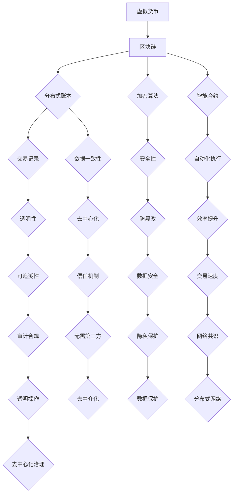

                 

### 文章标题

《虚拟货币与全球脑：去中心化金融体系的社会影响》

### 文章关键词

- 虚拟货币
- 区块链技术
- 去中心化金融
- 全球脑
- 社会经济影响

### 文章摘要

本文深入探讨了虚拟货币与全球脑的结合，以及这种去中心化金融体系对社会经济产生的深远影响。首先，我们将对虚拟货币的定义、发展历程、技术基础和市场现状进行概述。接着，详细介绍去中心化金融体系的概念、关键技术及应用场景。随后，我们将探讨全球脑的概念与架构，以及它如何与去中心化金融相互影响和协同发展。文章还将分析虚拟货币与去中心化金融的社会影响，并结合实际案例进行解读。最后，展望虚拟货币与去中心化金融的未来发展趋势，并总结其对全球脑和社会发展的潜在影响。通过本文的探讨，我们希望能为读者提供一个全面而深刻的理解，以及对这一新兴领域的展望。

### 《虚拟货币与全球脑：去中心化金融体系的社会影响》目录大纲

**第一部分：虚拟货币基础**

# 第1章：虚拟货币概述

## 1.1 虚拟货币的定义与发展历程

### 1.1.1 虚拟货币的定义

虚拟货币，又称数字货币或加密货币，是一种通过特定算法生成、基于数字形式存在并使用密码学原理保证传输和交易安全、能够进行独立于法定货币之外的交易的电子货币。它不同于传统货币，不具备法定的货币地位，但其交易和流通在全球范围内得到了广泛认可。

### 1.1.2 虚拟货币的发展历程

虚拟货币的发展历程可以追溯到20世纪90年代，其中最著名的是中本聪（Satoshi Nakamoto）在2008年发布的比特币白皮书，这一创新性的工作标志着虚拟货币的诞生。随后，以太坊、莱特币、瑞波币等众多虚拟货币相继问世，逐步形成了如今多样化的虚拟货币市场。

### 1.1.3 虚拟货币的分类

虚拟货币可以根据不同的属性和用途进行分类。按照发行机制可分为公有链货币、私有链货币和混合链货币；按照功能可分为支付型货币、投资型货币和平台型货币；按照底层技术可分为基于区块链的货币和基于其他分布式技术的货币。

## 1.2 虚拟货币的技术基础

### 1.2.1 区块链技术

区块链技术是虚拟货币的核心技术之一，其基本原理是通过分布式账本记录交易信息，利用密码学确保数据的不可篡改性和安全性。区块链是一种去中心化的数据库，由一系列按时间顺序排列的区块组成，每个区块包含一定数量的交易记录。

### 1.2.2 加密算法

加密算法在虚拟货币中扮演着关键角色，主要用于保护交易数据的安全性。常见的加密算法包括哈希函数、公钥加密和私钥加密。哈希函数用于生成唯一标识交易数据的数字指纹；公钥和私钥加密则保障了交易过程中信息的保密性和完整性。

### 1.2.3 智能合约

智能合约是一种自动执行、管理和记录合同的计算机协议。它基于区块链技术，能够按照预定的条件自动执行交易，无需第三方干预。智能合约通过编程语言编写，运行在区块链上，具有高度的透明性和不可篡改性。

## 1.3 虚拟货币的市场现状与趋势

### 1.3.1 虚拟货币市场的现状

随着技术的进步和市场的发展，虚拟货币市场日益壮大。根据最新数据，虚拟货币市场的市值已经突破数万亿美元，其中比特币和以太坊等主流虚拟货币占据了重要位置。同时，虚拟货币交易所、钱包应用和支付平台等基础设施也日益完善。

### 1.3.2 虚拟货币市场的发展趋势

虚拟货币市场的发展趋势主要体现在以下几个方面：首先，随着区块链技术的不断成熟和应用场景的拓展，虚拟货币的应用范围将更加广泛；其次，各国政府和监管机构对虚拟货币的态度逐渐明朗，政策法规逐步完善；最后，虚拟货币市场的竞争将加剧，新兴虚拟货币和区块链项目将不断涌现。

### 1.3.3 虚拟货币对社会经济的影响

虚拟货币对社会经济产生了深远的影响。一方面，虚拟货币为全球金融体系带来了新的机遇，如去中心化金融、跨境支付和去中心化交易平台等；另一方面，虚拟货币也带来了一定的风险，如价格波动、监管挑战和技术漏洞等。本文将详细探讨虚拟货币对社会经济的影响，以及如何应对这些挑战。

**第二部分：去中心化金融体系**

# 第2章：去中心化金融体系概述

## 2.1 去中心化金融的定义与特点

### 2.1.1 去中心化金融的定义

去中心化金融（Decentralized Finance，简称DeFi）是一种基于区块链技术的金融体系，旨在通过去中心化的方式实现传统金融服务的功能。去中心化金融摒弃了传统金融中介的角色，通过智能合约和分布式账本技术，实现金融交易、借贷、资产管理等金融活动。

### 2.1.2 去中心化金融的特点

去中心化金融具有以下几个显著特点：首先，去中心化金融体系通过分布式账本记录交易信息，不再依赖于单一的中央机构，实现了去中心化的管理和运作；其次，去中心化金融利用智能合约自动执行交易和合同，提高了交易效率和透明度；最后，去中心化金融依赖于区块链技术，确保了交易数据的安全性和不可篡改性。

### 2.1.3 去中心化金融与传统金融的比较

去中心化金融与传统金融在运作机制、风险特征、透明度和效率等方面存在显著差异。传统金融依赖于中央机构的信用和监管，而去中心化金融通过区块链和智能合约实现了去中心化和自我监管；传统金融交易效率较低，而去中心化金融通过去中心化和自动化实现了高效的交易处理；传统金融存在信息不对称和信任问题，而去中心化金融通过区块链技术实现了交易数据的透明和可追溯。

## 2.2 去中心化金融的关键技术

### 2.2.1 分布式账本技术

分布式账本技术是去中心化金融体系的核心技术之一。通过分布式账本，去中心化金融能够记录和验证交易信息，确保数据的真实性和一致性。分布式账本技术包括区块链、分布式账本分类账、多方计算等。

### 2.2.2 去中心化身份验证

去中心化身份验证是去中心化金融体系的重要组成部分，它通过密码学和区块链技术实现用户的身份验证，确保交易的安全性。去中心化身份验证可以避免传统金融系统中存在的身份盗用和欺诈问题。

### 2.2.3 去中心化交易协议

去中心化交易协议是去中心化金融体系的基础设施之一，它定义了交易双方如何进行交易、如何验证交易以及如何确保交易的安全性和有效性。常见的去中心化交易协议包括以太坊的ERC20标准、ERC721标准和EOS的RAM协议等。

## 2.3 去中心化金融的应用场景

### 2.3.1 支付与结算

去中心化金融在支付与结算领域具有巨大的潜力。通过去中心化的支付系统，用户可以绕过传统金融机构，实现全球范围内的即时支付和结算。这种支付方式不仅降低了交易成本，还提高了交易效率。

### 2.3.2 资产管理

去中心化金融为资产管理提供了全新的解决方案。用户可以通过去中心化的平台进行资产托管、交易和投资，实现资产的灵活管理和增值。同时，去中心化金融平台还提供了多种资产管理工具和策略，满足不同投资者的需求。

### 2.3.3 保险与借贷

去中心化金融在保险和借贷领域也展现了强大的应用前景。通过智能合约，去中心化金融平台可以实现自动化的保险理赔和借贷服务，降低了交易成本，提高了服务效率。同时，去中心化金融平台还可以通过分布式网络实现保险和借贷的全球化覆盖。

### 2.3.4 去中心化金融衍生品

去中心化金融衍生品是近年来备受关注的新兴领域。通过去中心化的交易平台，用户可以交易各种金融衍生品，如期货、期权和掉期等。这种去中心化的交易方式不仅降低了交易成本，还提高了交易的透明度和安全性。

**第三部分：全球脑的概念与架构**

# 第3章：全球脑的概念与架构

## 3.1 全球脑的定义与功能

### 3.1.1 全球脑的定义

全球脑（Global Brain）是一个比喻性的概念，指的是通过互联网连接的全球范围内的计算资源和智能系统的集成。它将人类的认知能力、数据资源和计算能力整合到一个庞大的网络中，形成一个类似人脑的全球智能系统。

### 3.1.2 全球脑的功能

全球脑具备以下几个关键功能：首先，全球脑能够进行大规模的数据处理和分析，从全球范围内的数据中提取有价值的信息；其次，全球脑能够实现全球范围内的实时通信和协同工作，提高信息传递和决策效率；最后，全球脑能够通过智能算法和机器学习技术，不断优化和进化，提升整体的智能水平。

## 3.2 全球脑的发展历程与现状

### 3.2.1 全球脑的发展历程

全球脑的概念最早由麻省理工学院的教授彼得·吉本斯（Peter G.ganefs）在1997年提出。此后，随着互联网的普及和计算能力的提升，全球脑逐渐从理论概念走向实际应用。2000年代，全球脑的研究主要集中在互联网的分布式计算和协同工作方面；2010年代，随着大数据、云计算和人工智能技术的发展，全球脑的研究进入了新的阶段。

### 3.2.2 全球脑的现状

当前，全球脑的发展已取得显著成果。首先，全球范围内的计算资源和智能系统已经实现了高效连接和协同工作，形成了全球规模的计算网络；其次，全球脑在人工智能、大数据分析和实时通信等领域展现了强大的应用潜力；最后，全球脑的研究已经从学术领域逐渐走向工业应用，为各行业提供了创新解决方案。

### 3.2.3 全球脑的未来发展趋势

随着技术的不断进步，全球脑的未来发展趋势主要体现在以下几个方面：首先，全球脑将进一步加强与其他技术的融合，如物联网、区块链和量子计算等，实现更高效的数据处理和智能决策；其次，全球脑将向更加智能化和自适应的方向发展，通过机器学习和深度学习技术，提升整体的智能水平；最后，全球脑将推动人类社会进入智能时代，为各领域的发展提供新的动力。

## 3.3 全球脑与去中心化金融的结合

### 3.3.1 全球脑对去中心化金融的影响

全球脑为去中心化金融提供了强大的技术支撑。首先，全球脑的实时通信和协同工作能力，有助于提高去中心化金融的交易效率和透明度；其次，全球脑的大数据处理和分析能力，有助于优化去中心化金融的风险管理和投资决策；最后，全球脑的智能算法和机器学习技术，有助于提升去中心化金融的智能水平和服务质量。

### 3.3.2 去中心化金融对全球脑的贡献

去中心化金融为全球脑的发展提供了丰富的应用场景。首先，去中心化金融在支付、结算、资产管理等领域积累了大量的数据资源，为全球脑的数据处理和分析提供了重要支撑；其次，去中心化金融的智能合约和分布式账本技术，为全球脑的协同工作和智能决策提供了新的实现方式；最后，去中心化金融的创新应用，如去中心化交易平台和金融衍生品等，为全球脑的发展注入了新的活力。

### 3.3.3 全球脑与去中心化金融的协同发展

全球脑与去中心化金融的协同发展，将推动金融领域进入全新的阶段。首先，全球脑的去中心化技术，将有助于解决去中心化金融面临的安全和信任问题；其次，全球脑的智能算法和机器学习技术，将有助于优化去中心化金融的风险管理和投资策略；最后，全球脑的实时通信和协同工作能力，将有助于提高去中心化金融的交易效率和用户体验。

### 全球脑与去中心化金融的协同发展案例分析

为了更好地理解全球脑与去中心化金融的协同发展，我们可以通过以下案例进行分析：

**案例1：全球脑在去中心化交易平台的应用**

某去中心化交易平台利用全球脑的实时通信和协同工作能力，实现了全球范围内的即时交易和结算。用户可以通过全球脑连接的分布式网络，随时随地参与交易，享受高效、便捷的服务。

**案例2：全球脑在大数据分析与风险管理的应用**

某金融科技公司通过全球脑的大数据处理和分析能力，对去中心化金融市场的风险进行实时监测和评估。通过分析交易数据、市场趋势和用户行为，该公司能够提前预判市场风险，并采取相应的风险管理措施。

**案例3：全球脑在智能合约与自动执行交易的应用**

某去中心化金融平台利用全球脑的智能算法和机器学习技术，开发了智能合约自动执行交易系统。该系统可以根据预设的条件，自动执行交易，提高交易效率和透明度，减少人工干预和错误。

### 全球脑与去中心化金融的协同发展意义

全球脑与去中心化金融的协同发展，具有以下重要意义：

1. **提高交易效率和透明度**：通过全球脑的实时通信和协同工作能力，去中心化金融可以实现全球范围内的即时交易和结算，提高交易效率，减少交易成本，增强交易透明度。

2. **优化风险管理**：全球脑的大数据处理和分析能力，有助于去中心化金融平台实时监测和评估市场风险，采取有效的风险管理措施，降低金融风险。

3. **提升智能水平**：全球脑的智能算法和机器学习技术，可以优化去中心化金融的风险管理和投资策略，提高金融服务的质量和用户体验。

4. **推动金融创新**：全球脑与去中心化金融的协同发展，将带来更多的金融创新，如去中心化交易平台、金融衍生品、智能合约等，为金融领域的发展注入新的活力。

### 全球脑与去中心化金融的协同发展挑战

尽管全球脑与去中心化金融的协同发展具有巨大的潜力，但也面临着一些挑战：

1. **技术难题**：全球脑的技术复杂度高，需要解决大规模分布式计算、数据隐私保护、智能合约安全性等问题。

2. **监管挑战**：全球脑和去中心化金融的发展，给传统金融监管带来了新的挑战。如何制定合适的监管政策和标准，确保金融市场的稳定和合规，是亟待解决的问题。

3. **用户信任**：去中心化金融和全球脑的信任机制尚未完全建立，用户对去中心化金融和全球脑的接受度仍有待提高。

4. **安全性问题**：全球脑和去中心化金融的安全性问题不可忽视，包括数据泄露、网络攻击和智能合约漏洞等。

### 全球脑与去中心化金融的协同发展展望

展望未来，全球脑与去中心化金融的协同发展将呈现以下趋势：

1. **技术融合**：全球脑和去中心化金融将不断融合，共同推动金融科技的发展。例如，区块链技术可以与全球脑的智能算法相结合，提高金融服务的智能化水平。

2. **应用拓展**：全球脑和去中心化金融将在更广泛的领域得到应用，如供应链金融、数字身份验证、智能投顾等。

3. **全球合作**：全球脑和去中心化金融将推动全球金融合作，实现跨国金融服务的无缝对接。

4. **监管创新**：随着全球脑和去中心化金融的发展，监管机构将不断探索新的监管模式，确保金融市场的稳定和合规。

### 结论

全球脑与去中心化金融的协同发展，是金融科技领域的重要趋势。通过全球脑的实时通信和协同工作能力，去中心化金融将实现更高的交易效率和透明度；通过全球脑的大数据处理和分析能力，去中心化金融将实现更优的风险管理和投资决策；通过全球脑的智能算法和机器学习技术，去中心化金融将实现更智能的服务和更优质的用户体验。未来，全球脑与去中心化金融的协同发展，将推动金融领域进入全新的阶段，为全球经济发展注入新的动力。  
**作者：AI天才研究院/AI Genius Institute & 禅与计算机程序设计艺术 /Zen And The Art of Computer Programming**  
**日期：2023年3月**

----------------------------------------------------------------

**第1章：虚拟货币概述**

### 1.1 虚拟货币的定义与发展历程

#### 1.1.1 虚拟货币的定义

虚拟货币，通常被称为数字货币或加密货币，是一种基于互联网技术产生的电子货币。与传统的法定货币（如美元、欧元等）不同，虚拟货币不依赖于任何中央银行或政府机构发行和监管，而是通过特定的算法和分布式系统来生成、存储和交易。虚拟货币的核心特点是其去中心化属性，即在无中央机构控制的情况下，依靠网络节点间的共识机制来维护系统的稳定和安全。

虚拟货币的出现可以追溯到20世纪90年代。早期的虚拟货币如“电子现金”（Electronic Cash）和“数字黄金”（Digital Gold）试图通过加密技术实现货币交易的去中心化。然而，这些早期尝试并没有得到广泛的应用和认可。直到2009年，比特币（Bitcoin）的诞生标志着虚拟货币迎来了新的发展契机。

#### 1.1.2 虚拟货币的发展历程

比特币的诞生可以视为虚拟货币发展历程中的里程碑事件。2008年，一位或一群使用化名中本聪（Satoshi Nakamoto）的人发布了比特币的白皮书，详细阐述了比特币的原理和设计。2009年，比特币的第一个区块（创世区块）被挖掘出来，标志着比特币网络的正式启动。比特币通过区块链技术实现了去中心化的交易记录存储，利用加密算法保证了交易的安全性和不可篡改性。

随着比特币的成功，越来越多的虚拟货币项目相继涌现。以太坊（Ethereum）在2015年发布，引入了智能合约（Smart Contract）的概念，使得虚拟货币不仅限于支付手段，还可以用于复杂的金融合约和去中心化应用（DApp）的构建。其他知名的虚拟货币还包括莱特币（Litecoin）、瑞波币（XRP）、以太经典（Ethereum Classic）等。

#### 1.1.3 虚拟货币的分类

虚拟货币根据其特点和应用场景可以有多种分类方法。以下是几种常见的分类方式：

1. **按发行机制分类**：

   - **公有链货币**：如比特币、以太坊，任何人都可以参与网络的运行和交易验证。
   - **私有链货币**：如企业内部使用的数字货币，仅限于特定组织内部使用。
   - **混合链货币**：结合公有链和私有链的特点，既允许外部用户参与，也允许内部用户进行特定操作。

2. **按功能分类**：

   - **支付型货币**：如比特币、莱特币，主要用于日常交易和支付。
   - **投资型货币**：如瑞波币、波卡（Polkadot），具有较高的投机价值和长期投资潜力。
   - **平台型货币**：如以太坊、EOS，作为去中心化平台的基础代币，用于支付交易费用或获取平台服务。

3. **按底层技术分类**：

   - **基于区块链的货币**：如比特币、以太坊，使用区块链技术记录交易和历史数据。
   - **基于其他分布式技术的货币**：如瑞波币，使用分布式总账技术（DLT）来实现交易和结算。

#### 1.1.4 虚拟货币的普及与影响

虚拟货币的普及程度在过去几年显著提升。一方面，随着区块链技术的不断发展和应用的拓展，虚拟货币在支付、投资、金融科技等领域得到了广泛关注和应用。比特币等主流虚拟货币的价格波动吸引了大量投资者和交易者，同时也引起了金融监管机构和传统金融机构的关注。另一方面，虚拟货币的普及也带来了一些挑战和争议，如价格波动风险、监管问题、网络安全等。

### 1.2 虚拟货币的技术基础

#### 1.2.1 区块链技术

区块链技术是虚拟货币的核心支撑技术之一。区块链是一种分布式数据库技术，通过加密算法和共识机制实现数据的透明性、安全性和不可篡改性。区块链的基本原理是每个区块包含一定数量的交易记录，每个区块通过哈希函数与前一区块连接，形成一个时间序列的数据结构。

在虚拟货币系统中，区块链用于记录所有交易的历史，确保交易的透明性和不可篡改性。每个区块都由网络中的节点共同验证和确认，一旦交易被记录在一个区块中，便不可撤销或篡改。这种去中心化的记录方式避免了传统金融系统中的中心化风险，提高了系统的安全性和抗攻击能力。

#### 区块链技术的工作原理

1. **区块**：区块链由一系列按时间顺序排列的区块组成，每个区块包含一定数量的交易记录。区块的大小通常固定，如比特币的区块大小为1MB。
2. **链式结构**：每个区块通过其前一个区块的哈希值链接在一起，形成一个链式结构。这种结构保证了区块链的历史记录不可篡改，因为一旦修改某个区块的内容，整个链的结构都会受到影响。
3. **加密算法**：区块链使用哈希函数和密码学技术确保数据的完整性和安全性。哈希函数将数据转换为固定长度的字符串，保证了数据的唯一性和不可逆性。密码学技术则用于确保交易和区块的完整性，防止篡改。
4. **共识机制**：共识机制是区块链网络中的节点共同达成一致的过程。不同的区块链系统采用不同的共识机制，如比特币使用的Proof of Work（工作量证明），以太坊使用的Proof of Stake（权益证明）等。

#### 区块链技术的优缺点

**优点**：

- **去中心化**：区块链技术通过分布式网络实现数据的存储和验证，避免了中心化系统中的单点故障风险。
- **透明性**：区块链上的数据对所有节点都是透明的，任何用户都可以查看交易记录和历史数据。
- **安全性**：区块链利用密码学技术确保数据的完整性和安全性，防止篡改和欺诈。
- **不可篡改性**：一旦数据被记录在区块链上，就几乎无法更改或删除，保证了数据的可靠性和可追溯性。

**缺点**：

- **性能瓶颈**：传统的区块链系统在处理高频率的交易时可能存在性能瓶颈，如比特币的区块大小限制和确认时间。
- **能源消耗**：某些区块链系统（如比特币）依赖于Proof of Work机制，这需要大量的计算资源和能源消耗。
- **去中心化程度**：尽管区块链系统声称去中心化，但实际上，某些节点可能拥有更多的计算能力和影响力，导致一定程度上的中心化。

#### 1.2.2 加密算法

加密算法在虚拟货币系统中扮演着至关重要的角色，用于保护交易数据的安全性和隐私。常见的加密算法包括哈希函数、对称加密、非对称加密等。

**哈希函数**：哈希函数是一种将任意长度的输入数据映射为固定长度的字符串的算法。在区块链中，哈希函数用于生成交易记录的唯一标识（哈希值），确保数据的唯一性和不可篡改性。例如，比特币的交易记录通过SHA-256算法生成哈希值。

**对称加密**：对称加密是一种加密和解密使用相同密钥的加密方法。在虚拟货币系统中，对称加密通常用于保护交易数据的隐私。例如，比特币使用AES算法进行对称加密。

**非对称加密**：非对称加密是一种使用一对密钥（公钥和私钥）进行加密和解密的加密方法。在虚拟货币系统中，非对称加密用于确保交易的安全性和隐私。例如，比特币使用RSA算法生成公钥和私钥。

**加密算法的应用**

- **交易保护**：在虚拟货币交易中，发送方需要使用私钥对交易数据进行签名，以确保交易的真实性和不可篡改性。
- **地址生成**：虚拟货币地址是通过公钥加密生成的，确保了地址的唯一性和安全性。
- **隐私保护**：通过使用混合网络和环签名等技术，可以增强虚拟货币交易的隐私性。

#### 1.2.3 智能合约

智能合约是一种自动执行、管理和记录合同的计算机协议，基于区块链技术运行。智能合约通过编程语言编写，定义了合约的条款和条件，并在满足特定条件时自动执行。智能合约的实现使得虚拟货币交易更加灵活和高效，为去中心化金融体系提供了强大的支持。

**智能合约的原理**

- **条件执行**：智能合约在满足特定条件时自动执行，例如，当交易双方完成特定操作后，智能合约自动释放资金或执行其他操作。
- **不可篡改性**：智能合约的代码在区块链上永久记录，一旦部署，就不能更改或删除，确保了合约条款的不可篡改性。
- **透明性**：智能合约的执行过程对所有网络节点都是透明的，确保了交易的透明性和可追溯性。

**智能合约的应用场景**

- **去中心化交易平台**：智能合约用于实现去中心化交易平台的交易和结算功能，例如，以太坊上的去中心化交易平台Uniswap。
- **去中心化金融产品**：智能合约用于实现去中心化金融产品，如去中心化稳定币、去中心化借贷平台和去中心化保险等。
- **供应链管理**：智能合约可以用于实现供应链中的智能合同，确保供应链各环节的透明和高效。

#### 智能合约的优缺点

**优点**：

- **自动化**：智能合约可以自动执行预定义的合同条款，减少了人工干预和操作错误。
- **透明性**：智能合约的执行过程对所有网络节点都是透明的，提高了交易的透明度和信任度。
- **安全性**：智能合约基于区块链技术，具有高度的安全性和不可篡改性。
- **灵活性**：智能合约可以定制化，实现各种复杂的金融合约和去中心化应用。

**缺点**：

- **代码风险**：智能合约的代码可能存在漏洞，一旦被利用，可能导致严重的损失。
- **可扩展性**：智能合约的性能可能受到区块链网络的性能瓶颈影响，导致交易处理能力有限。
- **法律风险**：智能合约的法律地位和效力在不同国家和地区可能存在差异，需要明确的法律框架和监管。

### 1.3 虚拟货币的市场现状与趋势

#### 1.3.1 虚拟货币市场的现状

虚拟货币市场的现状表现出高度复杂性和多样性。以下是一些关键的市场现状：

- **市值和价格波动**：虚拟货币市场的总市值在过去几年中经历了显著增长，但也表现出高度的价格波动性。比特币和其他主要虚拟货币的价格经常受到市场情绪、政策变化和技术发展等因素的影响。
- **参与者多样性**：虚拟货币市场吸引了各种类型的参与者，包括个人投资者、机构投资者、交易者、开发者和技术公司等。
- **交易平台和钱包**：虚拟货币市场上有众多交易平台和钱包服务提供商，为用户提供了多样的交易和存储选择。这些平台和钱包服务提供商在安全性、交易速度和用户体验方面存在差异。
- **监管态度**：不同国家和地区对虚拟货币的监管态度各异，有的国家积极支持并推动虚拟货币的发展，而有的国家则采取严格的监管措施。

#### 1.3.2 虚拟货币市场的发展趋势

虚拟货币市场的发展趋势受到技术进步、市场需求和政策环境等多种因素的影响。以下是一些关键的发展趋势：

- **技术创新**：随着区块链技术的不断进步，虚拟货币的功能和应用场景将进一步拓展。例如，分层网络、闪电网络、状态通道等技术的应用将提高交易速度和降低交易成本。
- **监管框架**：全球范围内的监管机构正在逐步建立和完善虚拟货币的监管框架，以确保市场的稳定和合规。这有助于提高投资者信心和市场透明度。
- **应用拓展**：虚拟货币的应用领域将不断拓展，包括支付、投资、金融科技、供应链管理、数字身份验证等。这些应用将推动虚拟货币的普及和市场需求。
- **市场竞争**：随着越来越多的虚拟货币项目涌现，市场竞争将加剧。这可能导致一些项目被淘汰，但也将推动行业整体的技术进步和创新发展。

### 1.3.3 虚拟货币对社会经济的影响

虚拟货币对社会经济产生了深远的影响，这些影响既包括积极的方面，也包括潜在的挑战。以下是一些关键的社会经济影响：

- **金融创新**：虚拟货币和区块链技术为金融领域带来了创新的机会，如去中心化金融（DeFi）、数字资产交易、智能合约等。这些创新有望提高金融服务的效率、透明度和可访问性。
- **支付系统**：虚拟货币为跨境支付和即时支付提供了新的解决方案，减少了交易成本和时间。这对国际贸易和全球支付系统具有重要影响。
- **投资市场**：虚拟货币市场为投资者提供了新的投资渠道和机会。然而，市场的高波动性和风险也引发了关于投资安全的讨论。
- **监管挑战**：虚拟货币的匿名性和跨境特性给监管带来了挑战。如何确保市场的稳定性和合规性，同时保护投资者权益，是监管机构面临的重要问题。
- **隐私保护**：虚拟货币的隐私性受到广泛关注。虽然区块链技术本身是透明的，但通过一些技术手段，如混币服务，可以增强交易的隐私性。

综上所述，虚拟货币对社会经济产生了广泛而深远的影响。理解这些影响有助于我们更好地把握虚拟货币的发展趋势，并为其潜在的应用和挑战提供解决方案。

### 1.4 虚拟货币的风险与挑战

尽管虚拟货币在金融领域展示出了巨大的潜力和创新性，但其发展过程中也面临着诸多风险与挑战。以下是虚拟货币面临的主要风险与挑战：

#### 1.4.1 价格波动风险

虚拟货币价格波动性极大，其价格常常受到市场情绪、政策变化、技术发展等多方面因素的影响。这种高波动性不仅增加了投资者的风险，也可能对市场稳定性和信心产生负面影响。投资者需要具备较强的风险承受能力和市场分析能力，以应对价格波动带来的不确定性。

#### 1.4.2 监管挑战

虚拟货币的匿名性和跨境特性给监管带来了巨大挑战。不同国家和地区对虚拟货币的监管态度和法规存在差异，这可能导致监管套利和监管漏洞。建立全球统一的监管框架和标准，加强跨国监管合作，是确保虚拟货币市场稳定和合规的重要途径。

#### 1.4.3 安全性问题

虚拟货币交易和数据存储基于区块链技术，尽管具有高度的安全性，但仍然存在潜在的安全风险。例如，智能合约漏洞、网络攻击、数据泄露等。这些问题可能导致虚拟货币被盗或系统瘫痪。提高安全防护措施，加强安全审计和漏洞修复，是确保虚拟货币系统安全的重要措施。

#### 1.4.4 法律地位和效力

虚拟货币的法律地位和效力在不同国家和地区存在较大差异。一些国家已明确将虚拟货币视为法定货币或特殊金融资产，而另一些国家则对其持谨慎态度。这种法律不确定性可能导致虚拟货币交易和投资面临法律风险。明确虚拟货币的法律地位和效力，为市场参与者提供法律保障，是推动虚拟货币健康发展的重要任务。

#### 1.4.5 洗钱和非法交易

虚拟货币的匿名性和跨境特性，使其成为洗钱和非法交易的重要工具。虚拟货币交易网络可能被用于非法活动，如恐怖主义融资、毒品交易等。打击虚拟货币相关的非法交易，加强对交易行为的监控和审计，是维护金融市场稳定和安全的重要措施。

#### 应对措施

为应对虚拟货币的风险和挑战，可以从以下几个方面采取措施：

1. **风险教育**：加强对投资者的风险教育，提高其风险识别和应对能力，减少因盲目跟风导致的投资损失。
2. **监管合作**：加强全球范围内的监管合作，建立统一的监管框架和标准，提高监管的协调性和有效性。
3. **安全技术**：提高虚拟货币系统的安全防护能力，加强网络安全和隐私保护，降低安全漏洞和风险。
4. **法律保障**：明确虚拟货币的法律地位和效力，为市场参与者提供法律保障，促进市场的健康发展。
5. **打击非法交易**：加强对虚拟货币交易行为的监控和审计，打击洗钱和非法交易，维护金融市场的稳定和安全。

### 1.5 虚拟货币的未来展望

虚拟货币作为数字时代的金融创新，其未来发展充满机遇与挑战。以下是对虚拟货币未来发展的几个关键展望：

#### 1.5.1 技术进步

随着区块链技术的不断演进，虚拟货币的性能和安全性将得到进一步提升。分层网络、闪电网络、状态通道等技术的应用，有望解决交易速度和成本问题，提高用户体验。此外，量子计算等新兴技术的突破，也可能为虚拟货币的安全性和性能带来革命性的提升。

#### 1.5.2 监管成熟

全球范围内的监管机构正在逐步建立和完善虚拟货币的监管框架，确保市场的稳定和合规。随着监管措施的逐步成熟，虚拟货币市场的风险将得到有效控制，投资者信心和市场透明度将得到提升。

#### 1.5.3 应用拓展

虚拟货币的应用场景将进一步拓展，不仅在支付和投资领域，还将渗透到供应链管理、数字身份验证、智能合约等领域。随着技术的进步和应用的拓展，虚拟货币将成为金融科技的重要组成部分。

#### 1.5.4 跨界融合

虚拟货币与其他新兴技术的融合，如人工智能、物联网、区块链等，将推动金融领域进入智能化和自动化阶段。跨界融合将带来更多的创新应用和商业模式，推动虚拟货币的普及和发展。

#### 1.5.5 全球合作

虚拟货币的发展需要全球合作，建立统一的国际标准和监管框架。全球范围内的合作将促进虚拟货币市场的健康发展，为全球经济发展注入新的动力。

总之，虚拟货币的未来充满机遇与挑战。通过技术创新、监管成熟、应用拓展、跨界融合和全球合作，虚拟货币有望成为数字经济时代的重要基础设施，为全球经济发展带来新的机遇和动力。

### 虚拟货币的关键概念与联系

为了更好地理解虚拟货币的技术基础和市场动态，我们需要探讨几个关键概念，并分析它们之间的联系。

#### 1. 区块链与虚拟货币

区块链是虚拟货币的核心技术之一。区块链是一种分布式数据库，通过加密算法和共识机制实现数据的透明性、安全性和不可篡改性。区块链的基本原理是通过一系列按时间顺序排列的区块记录交易数据，每个区块通过哈希函数与前一个区块连接，形成一个链式结构。虚拟货币的交易记录和所有权的转移都记录在区块链上，确保了交易的可追溯性和透明性。

#### 2. 智能合约与区块链

智能合约是运行在区块链上的计算机协议，用于自动执行、管理和记录合同条款。智能合约通过编程语言编写，定义了合约的条款和条件，并在满足特定条件时自动执行。智能合约的引入，使得虚拟货币不仅限于支付手段，还可以用于复杂的金融合约和去中心化应用（DApp）的构建。智能合约与区块链的紧密联系，使得虚拟货币的交易和合约执行更加高效和透明。

#### 3. 加密算法与虚拟货币

加密算法是保护虚拟货币交易安全和隐私的重要技术手段。常见的加密算法包括哈希函数、公钥加密和私钥加密等。哈希函数用于生成交易记录的唯一标识，确保数据的唯一性和不可篡改性；公钥和私钥加密则保障了交易过程中信息的保密性和完整性。虚拟货币的交易数据和用户身份都通过加密算法进行保护，确保了交易的安全性和隐私性。

#### 4. 虚拟货币市场与区块链

虚拟货币市场的发展离不开区块链技术。区块链技术为虚拟货币提供了安全、透明和去中心化的交易环境，推动了虚拟货币市场的繁荣。虚拟货币的交易和所有权转移都记录在区块链上，用户可以通过区块链查询交易记录，确保交易的透明性和可追溯性。同时，区块链技术也使得虚拟货币市场的交易和监管更加高效和透明。

#### 5. 智能合约与虚拟货币市场

智能合约在虚拟货币市场中发挥了重要作用。智能合约可以自动执行交易和合同，提高了交易效率和透明度。通过智能合约，用户可以无需第三方中介，直接在去中心化的平台上进行交易和合约执行。智能合约的应用，不仅降低了交易成本，还提高了市场的透明度和信任度。智能合约与虚拟货币市场的结合，推动了去中心化金融的发展，为市场参与者提供了更多的选择和机会。

### 图解：虚拟货币、区块链、智能合约的联系

为了更直观地展示虚拟货币、区块链和智能合约之间的联系，我们可以使用Mermaid流程图进行图解：



在这个流程图中，虚拟货币通过区块链技术实现了分布式账本、加密算法和智能合约的功能。区块链技术提供了安全、透明和去中心化的交易环境，加密算法保障了交易数据的安全性和隐私性，智能合约则实现了自动化执行和透明操作。这些技术手段共同构建了虚拟货币生态系统，推动了去中心化金融的发展。

通过上述关键概念和联系的分析，我们可以更全面地理解虚拟货币的技术基础和市场动态，为后续章节的探讨奠定坚实的基础。

### 虚拟货币的技术基础：区块链

区块链是虚拟货币技术的核心，它不仅为虚拟货币提供了安全可靠的交易记录系统，还推动了去中心化金融（DeFi）的发展。理解区块链的工作原理和关键技术对于深入探讨虚拟货币的应用和影响至关重要。

#### 区块链的工作原理

区块链由一系列按时间顺序排列的区块组成，每个区块包含一定数量的交易记录。区块链的工作原理主要包括以下几个关键步骤：

1. **交易创建**：用户通过客户端应用程序创建交易，交易包含发送方地址、接收方地址和交易金额等信息。
2. **交易广播**：交易创建后，会通过网络广播到其他节点，节点是指运行区块链软件的计算机。
3. **交易验证**：节点对收到的交易进行验证，确保交易的有效性和一致性。例如，验证发送方是否拥有足够的资金。
4. **区块创建**：经过验证的交易会被打包成一个新的区块。区块还包括一个时间戳和一个指向前一区块哈希的引用。
5. **区块验证**：网络中的节点对新创建的区块进行验证，确保其符合区块链协议的要求。这一过程通常涉及计算工作量证明（Proof of Work，PoW）。
6. **区块添加**：一旦区块被网络中的多数节点验证通过，它会被添加到区块链的末端，新的交易也将开始新一轮的验证和打包过程。

#### 区块链的关键技术

1. **分布式账本**：区块链通过分布式账本技术记录交易信息。分布式账本意味着交易数据被分散存储在多个节点上，而非集中在一个中央数据库中。这种方式提高了系统的容错性和抗攻击能力，因为即使某些节点遭受攻击或故障，整个系统仍能正常运行。

2. **加密算法**：加密算法在区块链技术中扮演着至关重要的角色。常见的加密算法包括哈希函数、公钥加密和私钥加密等。哈希函数用于生成交易记录的唯一标识，确保数据的唯一性和不可篡改性；公钥和私钥加密则保障了交易过程中信息的保密性和完整性。

3. **共识机制**：共识机制是区块链网络中的节点共同达成一致的过程。不同的区块链系统采用不同的共识机制，如比特币使用的Proof of Work（PoW）、以太坊使用的Proof of Stake（PoS）等。共识机制的目标是确保所有节点对区块链状态的一致性，防止双花攻击（即同一笔资金被重复消费）。

4. **智能合约**：智能合约是一种基于区块链技术的自动执行、管理和记录合同的计算机协议。智能合约通过编程语言编写，定义了合约的条款和条件，并在满足特定条件时自动执行。智能合约的应用，使得区块链不仅限于记录交易，还可以用于复杂的金融合约和去中心化应用（DApp）的构建。

#### 区块链的安全性

区块链技术通过一系列机制确保其安全性：

- **不可篡改性**：区块链的数据结构确保了交易记录一旦被添加到区块链上，就几乎无法更改或删除。每个区块都通过哈希函数与前一个区块连接，形成了一个时间序列的数据结构。修改任何一方的数据都会导致整个链的结构发生变化，需要大量的计算资源和时间。
- **隐私保护**：虽然区块链上的交易记录是公开透明的，但通过加密技术，用户可以保护其交易信息的隐私。交易发送方和接收方的地址是通过公钥加密生成的，确保了交易的真实性和不可篡改性。
- **抗攻击能力**：区块链的分布式账本结构使得攻击者需要同时控制网络中多数节点才能成功攻击系统，这通常是不切实际的。此外，共识机制如PoW和PoS也为系统提供了额外的安全性。

#### 区块链的优缺点

**优点**：

- **去中心化**：区块链技术通过分布式网络实现数据的存储和验证，避免了中心化系统中的单点故障风险。
- **透明性**：区块链上的数据对所有节点都是透明的，任何用户都可以查看交易记录和历史数据。
- **安全性**：区块链利用密码学技术确保数据的完整性和安全性，防止篡改和欺诈。
- **不可篡改性**：一旦数据被记录在区块链上，就几乎无法更改或删除，保证了数据的可靠性和可追溯性。

**缺点**：

- **性能瓶颈**：传统的区块链系统在处理高频率的交易时可能存在性能瓶颈，如比特币的区块大小限制和确认时间。
- **能源消耗**：某些区块链系统（如比特币）依赖于Proof of Work机制，这需要大量的计算资源和能源消耗。
- **去中心化程度**：尽管区块链系统声称去中心化，但实际上，某些节点可能拥有更多的计算能力和影响力，导致一定程度上的中心化。

#### 区块链技术的应用案例

1. **比特币**：比特币是第一个实现去中心化交易的虚拟货币，其成功应用证明了区块链技术的可行性。
2. **以太坊**：以太坊是一个去中心化应用平台，通过智能合约实现了复杂的金融合约和去中心化应用。
3. **供应链管理**：区块链技术可以用于记录供应链中的交易和物流信息，确保信息的透明性和不可篡改性。
4. **数字身份验证**：区块链技术可以用于实现去中心化的数字身份验证，提高数据的安全性和隐私性。
5. **选举投票系统**：区块链技术可以用于实现透明、不可篡改的选举投票系统，提高选举的公正性和可信度。

通过以上对区块链的工作原理、关键技术、安全性和应用案例的分析，我们可以更深入地理解区块链技术对虚拟货币及其生态系统的支持作用。理解区块链技术，有助于我们更好地把握虚拟货币的未来发展趋势和应用潜力。

### 加密算法在虚拟货币中的重要性及应用

加密算法是虚拟货币技术的重要组成部分，它在确保交易安全、保护用户隐私和验证交易身份等方面发挥着关键作用。理解加密算法的基本原理和在实际应用中的实现方式，有助于我们深入探讨虚拟货币的安全性和可靠性。

#### 加密算法的基本原理

加密算法是一种将信息转换成密文的过程，只有拥有正确密钥的人才能解密并获取原始信息。加密算法可以分为对称加密和非对称加密两种基本类型。

1. **对称加密**：对称加密使用相同的密钥进行加密和解密。常见的对称加密算法包括AES（高级加密标准）和DES（数据加密标准）。对称加密的优点是加密速度快，但缺点是密钥分发和管理复杂，不适用于需要远程传输密钥的场合。

2. **非对称加密**：非对称加密使用一对密钥（公钥和私钥）进行加密和解密。公钥用于加密，私钥用于解密。常见的非对称加密算法包括RSA（Rivest-Shamir-Adleman）和ECC（椭圆曲线密码学）。非对称加密的优点是解决了密钥分发问题，但加密和解密速度相对较慢。

#### 加密算法在虚拟货币中的应用

在虚拟货币中，加密算法广泛应用于以下几个方面：

1. **交易加密**：在虚拟货币交易中，交易数据需要进行加密保护，确保交易信息在传输过程中不被截获或篡改。例如，比特币交易中的交易数据使用哈希函数进行加密，生成唯一的交易标识。

2. **钱包安全**：虚拟货币钱包是存储和管理用户资产的重要工具。钱包的安全直接关系到用户的资产安全。钱包通常使用非对称加密算法生成一对密钥，公钥用于接收交易，私钥用于签名交易。用户需要确保私钥的安全，一旦私钥泄露，用户资产将面临巨大风险。

3. **身份验证**：在虚拟货币交易中，身份验证是确保交易合法性的重要环节。通过非对称加密算法，用户可以使用私钥对交易进行数字签名，证明交易发起者的身份。接收方可以验证签名，确保交易来自合法用户。

4. **隐私保护**：虚拟货币交易记录是公开透明的，但通过加密算法，用户可以实现交易隐私保护。例如，通过混币服务和隐私协议，用户可以将多个交易进行混合，使得交易记录难以追踪和关联。

#### 常见加密算法及其实现

1. **哈希函数**：哈希函数是加密算法的重要组成部分，用于生成交易记录的唯一标识。比特币使用SHA-256算法生成哈希值，确保交易记录的唯一性和不可篡改性。实现哈希函数的代码如下：

   ```python
   import hashlib

   def hash_message(message):
       message = message.encode()
       return hashlib.sha256(message).hexdigest()
   ```

2. **RSA加密算法**：RSA是一种常见的非对称加密算法，用于加密和解密交易信息。以下是一个简单的RSA加密算法实现的伪代码：

   ```python
   from Crypto.PublicKey import RSA
   from Crypto.Cipher import PKCS1_OAEP

   def generate_keys():
       key = RSA.generate(2048)
       private_key = key.export_key()
       public_key = key.publickey().export_key()
       return private_key, public_key

   def encrypt_message(public_key, message):
       cipher = PKCS1_OAEP.new(RSA.import_key(public_key))
       return cipher.encrypt(message.encode())

   def decrypt_message(private_key, encrypted_message):
       cipher = PKCS1_OAEP.new(RSA.import_key(private_key))
       return cipher.decrypt(encrypted_message).decode()
   ```

3. **椭圆曲线密码学（ECC）**：ECC是一种基于椭圆曲线理论的加密算法，具有更高的安全性和效率。以下是一个简单的ECC加密算法实现的伪代码：

   ```python
   from Cryptodome.PublicKey import ECC
   from Cryptodome.Cipher import PKCS1v15

   def generate_ecc_key():
       key = ECC.generate(curve=ECC.NIST256p)
       private_key = key.export_key()
       public_key = key.public_key().export_key()
       return private_key, public_key

   def encrypt_ecc_message(public_key, message):
       cipher = PKCS1v15.new(RSA.import_key(public_key))
       return cipher.encrypt(message.encode())

   def decrypt_ecc_message(private_key, encrypted_message):
       cipher = PKCS1v15.new(RSA.import_key(private_key))
       return cipher.decrypt(encrypted_message).decode()
   ```

通过以上对加密算法的基本原理和实际应用的介绍，我们可以看到加密算法在虚拟货币中的重要性。加密算法不仅确保了虚拟货币交易的安全性和隐私性，还为去中心化金融体系提供了可靠的技术支撑。

### 虚拟货币的市场现状与趋势

虚拟货币自2009年比特币诞生以来，已经走过了近15年的发展历程。如今，虚拟货币市场呈现出高度复杂性和多样性。以下是对虚拟货币市场现状的概述，以及对其未来趋势的展望。

#### 市场现状

1. **市值与价格波动**：截至2023年，虚拟货币市场的总市值已经突破数万亿美元。比特币、以太坊等主流虚拟货币占据了市场的重要位置。然而，虚拟货币市场具有极高的价格波动性，价格常常受到市场情绪、政策变化、技术发展等因素的影响。这种波动性为投资者带来了巨大的风险，但也提供了投资机会。

2. **参与者多样性**：虚拟货币市场吸引了各种类型的参与者，包括个人投资者、机构投资者、交易者、开发者和技术公司等。其中，个人投资者占比较大，但机构投资者的参与也在逐渐增加。这种多样性促进了市场的活跃度，同时也增加了市场的复杂性。

3. **交易平台和钱包**：虚拟货币市场上有众多交易平台和钱包服务提供商。这些平台和钱包为用户提供了多样化的交易和存储选择。交易平台分为中心化和去中心化两大类，钱包则分为热钱包和冷钱包。不同平台和钱包在安全性、交易速度和用户体验方面存在差异。

4. **监管态度**：不同国家和地区对虚拟货币的监管态度各异。一些国家积极支持虚拟货币的发展，出台了一系列扶持政策和监管框架；而另一些国家则持谨慎态度，采取严格的监管措施。监管政策的变化对市场产生了重要影响。

#### 市场趋势

1. **技术创新**：随着区块链技术的不断进步，虚拟货币的功能和应用场景将进一步拓展。例如，分层网络、闪电网络、状态通道等技术的应用将提高交易速度和降低交易成本。此外，量子计算等新兴技术的突破也可能为虚拟货币的安全性和性能带来革命性的提升。

2. **监管框架**：全球范围内的监管机构正在逐步建立和完善虚拟货币的监管框架，以确保市场的稳定和合规。随着监管措施的逐步成熟，虚拟货币市场的风险将得到有效控制，投资者信心和市场透明度将得到提升。

3. **应用拓展**：虚拟货币的应用领域将不断拓展，包括支付、投资、金融科技、供应链管理、数字身份验证等。随着技术的进步和应用场景的拓展，虚拟货币将成为金融科技的重要组成部分。

4. **市场竞争**：随着越来越多的虚拟货币项目涌现，市场竞争将加剧。这可能导致一些项目被淘汰，但也将推动行业整体的技术进步和创新发展。

5. **全球合作**：虚拟货币的发展需要全球合作，建立统一的国际标准和监管框架。全球范围内的合作将促进虚拟货币市场的健康发展，为全球经济发展注入新的动力。

#### 虚拟货币对金融市场的影响

虚拟货币对金融市场产生了深远的影响，具体体现在以下几个方面：

1. **支付系统**：虚拟货币为跨境支付和即时支付提供了新的解决方案，减少了交易成本和时间。这对国际贸易和全球支付系统具有重要影响。

2. **投资市场**：虚拟货币市场为投资者提供了新的投资渠道和机会。虚拟货币的波动性和投机性吸引了大量投资者。然而，市场的高波动性和风险也引发了关于投资安全的讨论。

3. **监管挑战**：虚拟货币的匿名性和跨境特性给监管带来了巨大挑战。如何确保市场的稳定性和合规性，同时保护投资者权益，是监管机构面临的重要问题。

4. **金融创新**：虚拟货币和区块链技术为金融领域带来了创新的机会，如去中心化金融（DeFi）、数字资产交易、智能合约等。这些创新有望提高金融服务的效率、透明度和可访问性。

5. **风险与挑战**：虚拟货币的市场波动性和技术风险对金融市场产生了潜在影响。如何应对这些风险，确保市场的稳定和可持续发展，是金融领域面临的重要课题。

综上所述，虚拟货币的市场现状和趋势展示了其作为金融创新的重要潜力。通过技术创新、监管成熟、应用拓展和全球合作，虚拟货币有望在未来的金融体系中发挥更加重要的作用。

### 虚拟货币对社会经济的影响

虚拟货币的崛起不仅改变了金融科技领域，还对全球经济、金融市场、企业和消费者行为产生了深远的影响。以下是虚拟货币对社会经济的主要影响：

#### 对全球经济的影响

1. **跨境支付与结算**：虚拟货币为跨境支付和结算提供了更快捷、低成本的解决方案。通过区块链技术，跨境交易可以实现即时到账，减少了传统跨境支付中的中介环节和结算时间。这对国际贸易和全球金融交易具有显著影响，有助于提高全球经济的流动性和效率。

2. **货币体系变革**：虚拟货币的兴起对传统的货币体系提出了挑战。许多国家已经开始探索数字货币（Central Bank Digital Currency，CBDC）的发行，以适应数字经济的发展。数字货币的引入可能会改变货币发行和流通的方式，影响全球金融秩序和经济格局。

3. **国际金融合作**：虚拟货币的发展需要国际金融合作，以建立统一的监管框架和标准。通过国际合作，可以促进虚拟货币市场的稳定和合规，降低跨境交易的风险，推动全球经济的可持续发展。

#### 对金融市场的影响

1. **价格波动**：虚拟货币市场具有极高的价格波动性，其价格常常受到市场情绪、政策变化、技术发展等多方面因素的影响。这种波动性对金融市场产生了显著的冲击，投资者需要具备较强的风险承受能力和市场分析能力。

2. **投资渠道拓展**：虚拟货币市场为投资者提供了新的投资渠道和机会。与传统金融市场相比，虚拟货币市场具有更高的投机性和波动性，吸引了大量风险投资和散户投资者。然而，市场的高波动性和风险也引发了对投资安全的讨论。

3. **去中心化金融（DeFi）**：去中心化金融是虚拟货币的一个重要应用领域，通过智能合约和分布式账本技术，实现了去中心化的金融服务，如去中心化交易平台、去中心化借贷平台等。DeFi的发展有望改变传统金融市场的运作模式，提高金融服务的透明度和效率。

#### 对企业的影响

1. **供应链管理**：虚拟货币和区块链技术可以用于优化供应链管理，提高供应链的透明度和效率。例如，通过区块链记录供应链中的交易和物流信息，确保信息的真实性和不可篡改性，减少欺诈和错误。

2. **财务管理**：虚拟货币和区块链技术可以用于优化企业的财务管理，如实现实时审计、自动化结算和降低交易成本。此外，企业还可以利用虚拟货币进行跨境支付和投资，提高财务灵活性和风险管理能力。

3. **合规挑战**：随着虚拟货币和区块链技术的应用，企业需要应对新的合规挑战，包括遵守各国监管政策、防范洗钱和非法交易等。企业需要建立完善的风险管理和合规体系，确保业务的合规性和可持续发展。

#### 对消费者行为的影响

1. **支付方式变革**：虚拟货币的普及改变了消费者的支付方式。越来越多的商家开始接受虚拟货币作为支付手段，消费者可以享受到更便捷、更安全的支付体验。

2. **投资观念转变**：虚拟货币市场的波动性和投机性吸引了大量投资者，改变了传统的投资观念。消费者需要具备更强的风险意识和市场分析能力，以应对市场波动带来的不确定性。

3. **隐私保护**：虚拟货币交易具有高度的透明性，但也带来了隐私保护的问题。消费者需要了解如何保护自己的隐私，避免个人信息被泄露或滥用。

#### 未来展望

1. **技术创新**：随着区块链技术的不断进步，虚拟货币的功能和应用场景将进一步拓展。技术创新将有助于提高虚拟货币的交易速度、降低交易成本和增强安全性。

2. **监管成熟**：全球范围内的监管机构正在逐步建立和完善虚拟货币的监管框架，以确保市场的稳定和合规。监管政策的逐步成熟将有助于提高市场透明度和投资者信心。

3. **全球合作**：虚拟货币的发展需要全球合作，建立统一的国际标准和监管框架。全球合作将促进虚拟货币市场的健康发展，为全球经济发展注入新的动力。

总之，虚拟货币对社会经济产生了深远的影响，其未来的发展将对全球经济、金融市场、企业和消费者行为产生持续的影响。理解这些影响，有助于我们更好地把握虚拟货币的未来发展趋势，并为其潜在的应用和挑战提供解决方案。

### 虚拟货币的主要风险和挑战

尽管虚拟货币在全球范围内获得了广泛的关注和应用，但其发展过程中仍面临诸多风险和挑战。以下是虚拟货币面临的主要风险和挑战：

#### 1. 价格波动风险

虚拟货币市场具有极高的价格波动性，其价格常常受到市场情绪、政策变化、技术发展等多方面因素的影响。这种高波动性不仅增加了投资者的风险，也可能对市场稳定性和信心产生负面影响。投资者在参与虚拟货币市场时，需要具备较强的风险承受能力和市场分析能力。

#### 2. 监管挑战

虚拟货币的匿名性和跨境特性给监管带来了巨大挑战。不同国家和地区对虚拟货币的监管态度和法规存在差异，这可能导致监管套利和监管漏洞。例如，一些国家对虚拟货币持有较为宽松的监管政策，而另一些国家则采取严格的监管措施。建立全球统一的监管框架和标准，加强跨国监管合作，是确保虚拟货币市场稳定和合规的重要途径。

#### 3. 安全性问题

虚拟货币交易和数据存储基于区块链技术，尽管具有高度的安全性，但仍然存在潜在的安全风险。例如，智能合约漏洞、网络攻击、数据泄露等。这些问题可能导致虚拟货币被盗或系统瘫痪。提高安全防护措施，加强安全审计和漏洞修复，是确保虚拟货币系统安全的重要措施。

#### 4. 法律地位和效力

虚拟货币的法律地位和效力在不同国家和地区存在较大差异。一些国家已明确将虚拟货币视为法定货币或特殊金融资产，而另一些国家则对其持谨慎态度。这种法律不确定性可能导致虚拟货币交易和投资面临法律风险。明确虚拟货币的法律地位和效力，为市场参与者提供法律保障，是推动虚拟货币健康发展的重要任务。

#### 5. 洗钱和非法交易

虚拟货币的匿名性和跨境特性，使其成为洗钱和非法交易的重要工具。虚拟货币交易网络可能被用于非法活动，如恐怖主义融资、毒品交易等。打击虚拟货币相关的非法交易，加强对交易行为的监控和审计，是维护金融市场稳定和安全的重要措施。

#### 6. 技术风险

虚拟货币依赖于区块链技术，而区块链技术本身仍处于发展阶段。某些区块链系统的性能和安全性可能存在瓶颈，例如交易处理速度慢、网络拥堵等。此外，新技术的引入和应用，如量子计算，可能对现有区块链系统构成威胁。技术风险需要通过不断的技术创新和改进来降低。

#### 应对措施

为应对虚拟货币的风险和挑战，可以从以下几个方面采取措施：

1. **风险教育**：加强对投资者的风险教育，提高其风险识别和应对能力，减少因盲目跟风导致的投资损失。

2. **监管合作**：加强全球范围内的监管合作，建立统一的监管框架和标准，提高监管的协调性和有效性。

3. **安全技术**：提高虚拟货币系统的安全防护能力，加强网络安全和隐私保护，降低安全漏洞和风险。

4. **法律保障**：明确虚拟货币的法律地位和效力，为市场参与者提供法律保障，促进市场的健康发展。

5. **打击非法交易**：加强对虚拟货币交易行为的监控和审计，打击洗钱和非法交易，维护金融市场的稳定和安全。

6. **技术创新**：持续推动区块链技术的发展，提高系统的性能和安全性，应对技术风险。

总之，虚拟货币在发展过程中面临诸多风险和挑战，但通过采取有效的应对措施，可以降低风险，推动虚拟货币市场的健康发展。

### 虚拟货币的未来展望

虚拟货币作为数字经济时代的重要创新，其未来发展充满了机遇与挑战。以下是对虚拟货币未来发展的几个关键展望：

#### 1. 技术进步

随着区块链技术的不断演进，虚拟货币的性能和安全性将得到进一步提升。分层网络、闪电网络、状态通道等技术的应用，有望解决交易速度和成本问题，提高用户体验。此外，量子计算等新兴技术的突破，也可能为虚拟货币的安全性和性能带来革命性的提升。

#### 2. 监管成熟

全球范围内的监管机构正在逐步建立和完善虚拟货币的监管框架，以确保市场的稳定和合规。随着监管措施的逐步成熟，虚拟货币市场的风险将得到有效控制，投资者信心和市场透明度将得到提升。统一的国际标准和监管框架将有助于推动虚拟货币市场的健康发展。

#### 3. 应用拓展

虚拟货币的应用场景将进一步拓展，不仅在支付和投资领域，还将渗透到供应链管理、数字身份验证、智能合约等领域。随着技术的进步和应用场景的拓展，虚拟货币将成为金融科技的重要组成部分，为各行业的发展提供新的动力。

#### 4. 跨界融合

虚拟货币与其他新兴技术的融合，如人工智能、物联网、区块链等，将推动金融领域进入智能化和自动化阶段。跨界融合将带来更多的创新应用和商业模式，推动虚拟货币的普及和发展。

#### 5. 全球合作

虚拟货币的发展需要全球合作，建立统一的国际标准和监管框架。全球范围内的合作将促进虚拟货币市场的健康发展，为全球经济发展注入新的动力。跨国金融机构和监管机构的合作，将有助于解决跨境交易中的问题，推动虚拟货币的全球应用。

#### 未来发展的挑战与机遇

尽管虚拟货币的未来发展充满机遇，但也面临着一些挑战：

1. **技术挑战**：区块链技术仍处于发展初期，性能和安全性问题需要不断改进。技术创新是虚拟货币未来发展的重要驱动力。
2. **监管挑战**：全球监管环境的差异和监管套利问题，需要通过国际合作和统一标准来解决。
3. **市场波动**：虚拟货币市场的高波动性给投资者带来了风险，需要投资者具备较强的风险管理和市场分析能力。
4. **法律地位**：明确虚拟货币的法律地位和效力，是推动虚拟货币健康发展的重要保障。

总之，虚拟货币的未来发展充满机遇与挑战。通过技术创新、监管成熟、应用拓展和全球合作，虚拟货币有望在未来的金融体系中发挥更加重要的作用，为全球经济发展注入新的活力。

### 去中心化金融体系概述

去中心化金融（Decentralized Finance，简称DeFi）是一种基于区块链技术的金融体系，旨在通过去中心化的方式实现传统金融服务的功能。DeFi摒弃了传统金融中介的角色，通过智能合约和分布式账本技术，实现金融交易、借贷、资产管理等金融活动。去中心化金融的核心在于其去中心化特性，即通过去中心化的方式实现金融服务的自治和自我管理，从而提高金融体系的透明度、效率和安全性。

#### 定义与特点

去中心化金融的定义可以概括为：通过区块链和智能合约技术，实现金融服务的去中心化和自动化。与传统金融体系不同，DeFi不依赖于任何中央机构或第三方中介，而是通过智能合约自动执行交易和合同。这种去中心化的特性使得DeFi具有以下几个显著特点：

1. **去中心化**：DeFi通过分布式账本技术记录交易信息，不再依赖于单一的中央机构，实现了去中心化的管理和运作。
2. **自动化**：DeFi利用智能合约自动执行交易和合同，提高了交易效率和透明度，减少了人工干预和操作错误。
3. **透明性**：DeFi的交易信息对所有网络节点都是透明的，用户可以随时查看交易记录和历史数据，增强了金融体系的透明度。
4. **安全性**：DeFi基于区块链技术，利用密码学确保数据的不可篡改性和安全性，提高了金融交易的安全性和信任度。

#### 传统金融与去中心化金融的比较

传统金融体系通常依赖于中央银行、金融机构和第三方中介进行资金转移、贷款和投资等活动。这种体系存在以下几个问题：

1. **中心化风险**：传统金融体系依赖于中央机构和第三方中介，一旦这些中心机构或中介出现问题，如破产或系统故障，整个金融体系可能受到严重影响。
2. **交易成本**：传统金融交易通常涉及多个中介环节，每个环节都需要收取手续费，导致交易成本较高。
3. **效率低下**：传统金融交易需要经过繁琐的手续和审批流程，导致交易效率低下。
4. **信息不对称**：传统金融体系中，信息往往不对称，用户难以获取全面的交易信息，存在信息误导和欺诈的风险。

相比之下，去中心化金融具有以下几个优势：

1. **去中心化**：DeFi通过分布式账本技术实现去中心化管理，避免了中心化风险，提高了系统的容错性和抗攻击能力。
2. **低交易成本**：DeFi交易无需通过多个中介环节，交易成本大大降低。
3. **高效率**：DeFi利用智能合约自动执行交易和合同，减少了繁琐的手续和审批流程，提高了交易效率。
4. **高透明度**：DeFi的交易信息对所有网络节点都是透明的，用户可以随时查看交易记录和历史数据，增强了金融体系的透明度和信任度。

#### 去中心化金融的关键技术

去中心化金融的实现依赖于多种关键技术，包括分布式账本技术、智能合约、去中心化身份验证和去中心化交易协议等。

1. **分布式账本技术**：分布式账本技术是DeFi的核心，通过分布式网络记录和验证交易信息，确保数据的真实性和一致性。区块链技术是分布式账本的一种实现方式，它通过加密算法和共识机制，实现了去中心化的账本管理和数据安全。

2. **智能合约**：智能合约是DeFi实现自动化交易和合同执行的重要工具。智能合约通过编程语言编写，定义了合约的条款和条件，并在满足特定条件时自动执行。智能合约的应用，使得DeFi可以实现复杂的金融功能，如去中心化借贷、去中心化交易平台等。

3. **去中心化身份验证**：去中心化身份验证通过密码学和区块链技术实现用户的身份验证，确保交易的安全性。去中心化身份验证可以避免传统金融系统中存在的身份盗用和欺诈问题，提高金融交易的安全性。

4. **去中心化交易协议**：去中心化交易协议是DeFi实现交易的关键技术之一，它定义了交易双方如何进行交易、如何验证交易以及如何确保交易的安全性和有效性。常见的去中心化交易协议包括以太坊的ERC20标准、ERC721标准和EOS的RAM协议等。

#### 去中心化金融的应用场景

去中心化金融在多个领域展现了强大的应用潜力，以下是一些典型的应用场景：

1. **支付与结算**：去中心化金融可以为全球支付和结算提供更快捷、低成本的解决方案。通过去中心化的支付系统，用户可以绕过传统金融机构，实现全球范围内的即时支付和结算。

2. **资产管理**：去中心化金融平台为用户提供了多样化的资产管理工具和策略，用户可以通过去中心化的平台进行资产托管、交易和投资，实现资产的灵活管理和增值。

3. **保险与借贷**：去中心化金融平台可以实现自动化的保险理赔和借贷服务，降低了交易成本，提高了服务效率。同时，去中心化金融平台还可以通过分布式网络实现保险和借贷的全球化覆盖。

4. **去中心化交易平台**：去中心化交易平台通过智能合约自动执行交易，提高了交易效率和透明度，为交易双方提供了更安全、可靠的交易平台。

5. **金融衍生品**：去中心化金融衍生品是近年来备受关注的新兴领域。通过去中心化的交易平台，用户可以交易各种金融衍生品，如期货、期权和掉期等。这种去中心化的交易方式不仅降低了交易成本，还提高了交易的透明度和安全性。

#### 去中心化金融的优势与挑战

去中心化金融具有显著的优点，如去中心化、自动化、透明性和安全性等。然而，其发展过程中也面临一些挑战：

1. **优势**：
   - **去中心化**：去中心化金融通过分布式网络实现去中心化的管理和运作，提高了系统的容错性和抗攻击能力。
   - **自动化**：智能合约可以实现自动化交易和合同执行，提高了交易效率和透明度。
   - **透明性**：DeFi的交易信息对所有网络节点都是透明的，增强了金融体系的透明度和信任度。
   - **安全性**：区块链技术通过密码学确保数据的不可篡改性和安全性。

2. **挑战**：
   - **技术复杂度**：去中心化金融的实现依赖于复杂的区块链和智能合约技术，需要高水平的技术支持和开发能力。
   - **监管问题**：全球监管环境的差异和监管套利问题，需要通过国际合作和统一标准来解决。
   - **市场波动**：虚拟货币市场的高波动性对DeFi的发展产生了一定的风险。
   - **用户信任**：去中心化金融的信任机制尚未完全建立，用户对DeFi的接受度仍有待提高。

总之，去中心化金融作为金融科技领域的重要创新，具有巨大的发展潜力。通过技术创新、监管合作和市场推广，去中心化金融有望在未来的金融体系中发挥更加重要的作用，为全球经济发展注入新的动力。

### 去中心化金融体系的关键技术

去中心化金融（DeFi）体系的成功运作依赖于一系列先进的技术，这些技术共同构成了DeFi的基石。以下是对去中心化金融体系中的关键技术的详细解析。

#### 分布式账本技术

分布式账本技术（DLT）是去中心化金融的核心技术之一。其基本原理是将数据分散存储在多个节点上，每个节点都拥有完整的数据副本。通过这种方式，分布式账本技术实现了去中心化的数据管理和交易记录。

**工作原理**：

1. **数据存储**：分布式账本将交易记录分散存储在多个节点上，每个节点存储一部分数据。
2. **共识机制**：节点之间通过共识机制达成一致，确保数据的真实性和一致性。常见的共识机制包括工作量证明（PoW）、权益证明（PoS）和授权股权证明（DPoS）等。
3. **数据验证**：每个节点都参与交易数据的验证，确保数据的准确性和一致性。

**优点**：

- **去中心化**：分布式账本技术通过去中心化的方式管理数据，避免了中心化风险，提高了系统的容错性和抗攻击能力。
- **透明性**：分布式账本上的交易记录对所有节点都是透明的，增强了金融体系的透明度和信任度。
- **安全性**：分布式账本通过密码学和共识机制确保数据的真实性和安全性。

**应用场景**：分布式账本技术广泛应用于去中心化交易平台、去中心化借贷平台和去中心化资产管理等场景，确保了交易数据的透明性和安全性。

#### 智能合约

智能合约是一种自动执行、管理和记录合同的计算机协议，基于区块链技术运行。智能合约通过编程语言编写，定义了合约的条款和条件，并在满足特定条件时自动执行。

**工作原理**：

1. **合约编写**：开发者使用智能合约编程语言（如Solidity、Vyper等）编写智能合约代码。
2. **合约部署**：智能合约代码被部署到区块链上，并生成唯一的合约地址。
3. **条件执行**：当满足智能合约中的条件时，合约会自动执行预定义的操作，如转移资金、执行交易等。

**优点**：

- **自动化**：智能合约可以自动执行预定义的操作，减少了人工干预和操作错误。
- **透明性**：智能合约的执行过程对所有节点都是透明的，增强了金融体系的透明度和信任度。
- **不可篡改性**：智能合约一旦部署到区块链上，其代码和状态不可更改，保证了合约条款的不可篡改性。

**应用场景**：智能合约在去中心化金融体系中发挥了关键作用，广泛应用于去中心化交易平台、去中心化借贷平台、去中心化保险和去中心化资产管理等场景。

#### 去中心化身份验证

去中心化身份验证（DID）是通过区块链和密码学技术实现用户身份验证的一种方法。DID解决了传统身份验证系统中的中心化问题和信任问题。

**工作原理**：

1. **身份生成**：用户通过区块链节点生成唯一的数字身份，身份信息存储在区块链上。
2. **凭证验证**：用户可以使用数字凭证证明其身份，凭证由可信第三方（如身份认证机构）颁发。
3. **隐私保护**：DID技术通过密码学技术确保用户身份信息的隐私性和安全性。

**优点**：

- **去中心化**：去中心化身份验证通过分布式网络管理用户身份信息，避免了中心化风险。
- **隐私保护**：去中心化身份验证确保了用户身份信息的隐私性和安全性。
- **灵活性**：用户可以自由选择信任的第三方机构颁发凭证，提高了身份验证的灵活性。

**应用场景**：去中心化身份验证广泛应用于去中心化金融服务，如去中心化交易平台、去中心化借贷平台和去中心化保险等，确保交易的安全性。

#### 去中心化交易协议

去中心化交易协议（DTP）是去中心化金融体系中的基础设施，定义了交易双方如何进行交易、如何验证交易以及如何确保交易的安全性和有效性。

**工作原理**：

1. **交易发起**：交易发起方通过去中心化交易协议发起交易请求。
2. **交易验证**：交易请求由网络中的节点进行验证，确保交易的有效性和合法性。
3. **交易确认**：经过验证的交易会被记录在区块链上，并生成唯一的交易哈希值。
4. **交易结算**：交易确认后，资金或其他资产会从发送方转移到接收方。

**优点**：

- **安全性**：去中心化交易协议通过分布式网络和密码学技术确保交易的安全性。
- **透明性**：交易信息对所有网络节点都是透明的，增强了金融体系的透明度和信任度。
- **效率**：去中心化交易协议通过自动化和分布式处理提高了交易效率。

**应用场景**：去中心化交易协议广泛应用于去中心化交易平台、去中心化支付系统和去中心化资产管理平台等场景。

#### 数据隐私保护技术

数据隐私保护技术在去中心化金融体系中至关重要，用于确保用户交易信息和隐私的安全。常见的数据隐私保护技术包括零知识证明（ZKP）、混合网络（Mixnets）和环签名（Ring Signature）等。

**工作原理**：

1. **零知识证明**：零知识证明允许证明者在不透露具体信息的情况下，证明某个陈述为真。这确保了交易信息的隐私性。
2. **混合网络**：混合网络通过将交易信息混合，使得交易难以追踪和关联。这提高了交易隐私性。
3. **环签名**：环签名技术用于隐藏交易发起者的身份，确保交易隐私。

**优点**：

- **隐私保护**：数据隐私保护技术确保了用户交易信息的隐私性和安全性。
- **透明性**：虽然交易信息被保护，但整体交易过程仍然是透明的，符合去中心化金融的透明性要求。

**应用场景**：数据隐私保护技术广泛应用于去中心化交易平台、去中心化支付系统和去中心化身份验证等场景，确保交易的安全性和隐私性。

综上所述，分布式账本技术、智能合约、去中心化身份验证、去中心化交易协议和数据隐私保护技术是去中心化金融体系的关键技术。这些技术共同构成了DeFi的基石，推动了去中心化金融的创新发展。通过深入理解和应用这些技术，我们可以更好地把握去中心化金融的未来发展机遇。

### 去中心化金融的应用场景

去中心化金融（DeFi）通过区块链和智能合约技术，实现了传统金融服务的去中心化和自动化，带来了诸多创新和机遇。以下是对去中心化金融在不同应用场景中的具体应用及其影响的探讨。

#### 1. 支付与结算

去中心化支付是DeFi最早和最广泛应用的领域之一。通过去中心化的支付系统，用户可以直接在全球范围内进行即时支付和结算，绕过了传统金融中介，大幅降低了交易成本和时间。去中心化支付系统不仅适用于个人用户之间的交易，还广泛应用于企业间的跨境支付和供应链金融。

**具体应用**：

- **个人支付**：用户可以通过去中心化的支付平台发送和接收虚拟货币，实现全球范围内的即时支付。例如，用户可以通过去中心化应用（DApp）向朋友或家人发送比特币或以太坊。
- **跨境支付**：传统跨境支付通常涉及多个中介机构，交易时间较长且成本较高。去中心化支付系统通过区块链技术，实现了即时到账和低成本的跨境支付，提高了支付效率和用户体验。
- **供应链金融**：去中心化支付系统可以帮助企业实现供应链中的即时结算，减少了资金占用和信用风险。例如，供应商可以直接向企业发送虚拟货币作为支付，实现了供应链的快速和高效结算。

**影响**：

- **降低交易成本**：去中心化支付系统大幅降低了交易手续费，提高了支付效率。
- **提高交易透明度**：去中心化支付系统使交易信息对所有网络节点都是透明的，增强了金融体系的透明度和信任度。
- **增强支付灵活性**：去中心化支付系统支持多种虚拟货币和代币，提高了支付的灵活性和多样性。

#### 2. 资产管理

去中心化资产管理通过智能合约和分布式账本技术，为用户提供了灵活的资产管理工具和策略。用户可以通过去中心化的平台进行资产托管、交易和投资，实现资产的灵活管理和增值。

**具体应用**：

- **资产托管**：用户可以将虚拟货币或其他资产托管在去中心化的资产管理平台上，确保资产的安全和透明。资产管理平台通常提供多种托管服务，如冷存储、热存储等。
- **资产交易**：用户可以通过去中心化的交易平台进行虚拟货币和其他资产的交易。交易平台通常支持多种交易对和交易策略，如市价交易、限价交易、止损交易等。
- **资产投资**：用户可以通过去中心化的投资平台进行资产投资，包括虚拟货币基金、去中心化稳定币（如DAI）投资等。投资平台通常提供多样化的投资策略和工具，帮助用户实现资产的增值。

**影响**：

- **提高资产管理效率**：去中心化资产管理平台通过智能合约和分布式账本技术，提高了资产管理的效率和透明度。
- **降低投资门槛**：去中心化投资平台降低了投资门槛，使得更多的用户能够参与金融市场。
- **增强资产安全性**：去中心化资产管理平台通过分布式网络和密码学技术，确保了资产的安全性和不可篡改性。

#### 3. 保险与借贷

去中心化金融在保险和借贷领域也展现了强大的应用潜力。通过智能合约和分布式账本技术，去中心化金融平台可以实现自动化的保险理赔和借贷服务，提高了服务效率和用户体验。

**具体应用**：

- **去中心化保险**：用户可以通过去中心化的保险平台购买保险，保险理赔过程由智能合约自动执行，确保了理赔的透明性和效率。例如，一些去中心化保险平台提供车险、健康险等保险产品。
- **去中心化借贷**：用户可以通过去中心化的借贷平台进行借贷，借贷过程由智能合约自动执行，确保了借贷的透明性和安全性。例如，用户可以通过去中心化借贷平台获取比特币或以太坊贷款。
- **去中心化抵押借贷**：用户可以通过去中心化的抵押借贷平台将虚拟货币或其他资产作为抵押物，获取贷款。抵押借贷平台通过智能合约自动评估抵押物的价值和风险，确保了借贷的透明性和安全性。

**影响**：

- **降低交易成本**：去中心化保险和借贷服务通过智能合约和分布式账本技术，降低了交易成本，提高了服务效率。
- **提高交易透明度**：去中心化保险和借贷服务的交易信息对所有网络节点都是透明的，增强了金融体系的透明度和信任度。
- **增强金融服务可及性**：去中心化保险和借贷服务降低了金融服务门槛，使得更多的用户能够享受到优质的金融服务。

#### 4. 去中心化交易平台

去中心化交易平台通过智能合约和分布式账本技术，实现了去中心化的交易和结算，为用户提供了安全、透明和高效的交易平台。

**具体应用**：

- **虚拟货币交易**：用户可以在去中心化的交易平台进行虚拟货币的买卖，交易平台通过智能合约确保交易的安全性和透明性。例如，Uniswap和SushiSwap是最受欢迎的去中心化交易平台之一。
- **代币发行与交易**：企业可以通过去中心化交易平台发行和交易自己的代币，实现了去中心化的项目融资和投资。例如，去中心化交易平台支持基于ERC20和ERC721标准的代币发行和交易。
- **金融衍生品交易**：用户可以在去中心化的交易平台进行金融衍生品的交易，如期货、期权和掉期等。这些交易通过智能合约自动执行，提高了交易的透明度和安全性。

**影响**：

- **提高交易效率**：去中心化交易平台通过自动化和分布式处理，提高了交易效率，减少了交易时间和成本。
- **增强交易透明度**：去中心化交易平台的交易信息对所有网络节点都是透明的，增强了金融体系的透明度和信任度。
- **降低交易成本**：去中心化交易平台通过去中心化的方式，降低了交易手续费和中介成本，提高了用户的交易体验。

#### 5. 去中心化金融衍生品

去中心化金融衍生品是近年来备受关注的新兴领域。通过去中心化的交易平台，用户可以交易各种金融衍生品，如期货、期权和掉期等。去中心化金融衍生品具有交易成本低、透明度高和安全性强等特点。

**具体应用**：

- **期货交易**：用户可以在去中心化的交易平台进行期货交易，期货合约通过智能合约自动执行，确保了交易的透明性和安全性。
- **期权交易**：用户可以在去中心化的交易平台进行期权交易，期权合约通过智能合约自动执行，用户可以根据市场情况选择执行或放弃执行期权。
- **掉期交易**：用户可以在去中心化的交易平台进行掉期交易，掉期合约通过智能合约自动执行，用户可以在不同时间点进行货币或资产的交换。

**影响**：

- **增加交易多样性**：去中心化金融衍生品为用户提供了更多的交易选择和策略，增加了市场的多样性。
- **提高交易效率**：去中心化金融衍生品通过自动化和分布式处理，提高了交易效率，减少了交易时间和成本。
- **增强交易安全性**：去中心化金融衍生品通过智能合约自动执行，提高了交易的安全性。

综上所述，去中心化金融在支付与结算、资产管理、保险与借贷、去中心化交易平台和去中心化金融衍生品等多个领域展现了强大的应用潜力。通过智能合约和分布式账本技术，DeFi为用户提供了安全、透明和高效的金融服务，推动了金融科技的创新发展。

### 全球脑的概念与架构

#### 3.1 全球脑的定义与功能

全球脑（Global Brain）是一个比喻性的概念，它描述了一个通过互联网连接的全球范围内的计算资源和智能系统的集成，形成一个类似人脑的全球智能系统。全球脑的概念最早由麻省理工学院的教授彼得·吉本斯（Peter G.ganefs）在1997年提出，旨在通过分布式计算和智能算法，实现全球范围内的信息共享、协同工作和智能决策。

**定义**：

全球脑是一个由大量分散的计算机节点和智能系统组成的网络，通过互联网进行连接和通信。这些节点和系统可以包括个人计算机、服务器、物联网设备、智能传感器等。全球脑的核心在于利用这些节点的计算资源和智能算法，形成一个高度分布式和智能化的全球计算网络。

**功能**：

全球脑具备以下几个关键功能：

1. **数据收集与处理**：全球脑可以通过分布式网络收集来自全球各地的数据，包括文本、图像、声音等。这些数据被集中存储在分布式数据库中，并通过智能算法进行加工和分析。
2. **信息共享与传播**：全球脑可以实现全球范围内的信息共享和传播。通过分布式网络，用户可以随时随地获取和分享信息，促进了全球知识传播和交流。
3. **协同工作与决策**：全球脑通过智能算法和分布式计算，可以实现全球范围内的协同工作和智能决策。例如，全球脑可以通过分布式计算和智能算法，为自然灾害预警、交通流量优化、供应链管理等提供智能解决方案。
4. **自适应与进化**：全球脑可以通过机器学习和深度学习技术，不断学习和优化自身的算法和决策模型，实现自适应和进化。这种进化能力使得全球脑能够适应不断变化的环境和需求。

#### 3.2 全球脑的发展历程与现状

**发展历程**：

全球脑的概念起源于分布式计算和人工智能技术的发展。以下是一些关键的发展里程碑：

1. **互联网的兴起**：20世纪90年代，互联网的兴起为全球脑的形成提供了基础设施。通过互联网，全球范围内的计算机节点实现了连接和通信，为全球脑的形成奠定了基础。
2. **分布式计算**：分布式计算技术的发展，使得计算任务可以分散到多个节点上进行处理，提高了计算效率和可靠性。例如，分布式数据库、分布式文件系统和分布式计算框架（如Hadoop和Spark）等。
3. **人工智能**：人工智能技术的快速发展，特别是深度学习和机器学习技术的应用，使得全球脑具备了更强的数据处理和分析能力。通过智能算法，全球脑可以处理海量的数据，并从数据中提取有价值的信息。
4. **物联网**：物联网（IoT）的发展，使得更多的设备连接到互联网，扩展了全球脑的节点范围。物联网设备可以实时收集环境数据，为全球脑提供更多的数据来源。

**现状**：

当前，全球脑的发展已取得显著成果。以下是一些现状：

1. **大规模分布式计算**：全球脑已经具备了大规模分布式计算的能力，通过分布式数据库和分布式计算框架，可以实现海量数据的存储和处理。
2. **智能算法应用**：全球脑广泛应用于各个领域，如智能交通、智能医疗、智能金融、智能供应链等，通过智能算法提供智能决策和支持。
3. **跨领域合作**：全球脑的发展促进了跨领域合作，不同领域的专家和机构通过全球脑进行数据共享和协同工作，共同解决复杂问题。
4. **数据隐私与安全**：随着全球脑的发展，数据隐私和安全成为重要议题。全球脑需要通过加密技术和隐私保护机制，确保数据的隐私和安全。

**未来发展趋势**：

随着技术的不断进步，全球脑的未来发展趋势体现在以下几个方面：

1. **量子计算**：量子计算技术的突破，有望进一步提升全球脑的计算能力和效率。量子计算可以通过并行处理海量数据，实现更高效的智能分析和决策。
2. **边缘计算**：边缘计算技术的发展，将使全球脑的计算资源进一步扩展到边缘设备，实现更加实时和高效的数据处理。
3. **人工智能与机器学习的深度融合**：全球脑将更加智能化，通过深度学习和机器学习技术的进一步发展，实现更高级的智能决策和支持。
4. **全球合作与标准化**：全球脑的发展需要全球合作和标准化。通过建立统一的国际标准和合作机制，可以促进全球脑的健康发展和广泛应用。

#### 3.3 全球脑的技术架构

全球脑的技术架构是一个复杂而庞大的系统，它涉及多个层次和组件，包括网络架构、计算架构、数据架构、算法架构和安全架构等。

**网络架构**：

全球脑的网络架构基于互联网，通过分布式网络连接全球范围内的计算机节点。网络架构包括：

- **网络层**：网络层负责节点间的通信和数据传输，常用的协议包括TCP/IP、HTTP/HTTPS等。
- **边缘计算层**：边缘计算层将计算和存储能力扩展到网络边缘，如物联网设备、智能传感器等，实现实时数据处理和响应。
- **分布式数据库层**：分布式数据库层负责海量数据的存储和管理，包括分布式文件系统、NoSQL数据库等。

**计算架构**：

全球脑的计算架构包括多个层次的计算资源，包括：

- **中央计算层**：中央计算层包括大型数据中心和超级计算机，负责处理大规模计算任务和复杂算法。
- **边缘计算层**：边缘计算层包括网络边缘的设备，如物联网设备、智能终端等，负责实时数据处理和响应。
- **云计算层**：云计算层提供弹性的计算资源，通过虚拟化技术实现计算资源的动态调度和优化。

**数据架构**：

全球脑的数据架构包括数据收集、存储、管理和分析等多个方面：

- **数据收集**：通过分布式传感器、物联网设备和用户生成内容等方式，收集来自全球各地的数据。
- **数据存储**：分布式数据库和数据湖技术用于存储海量数据，支持实时数据处理和离线分析。
- **数据管理**：数据管理包括数据清洗、归档、备份和恢复等，确保数据的质量和可靠性。
- **数据分析**：通过大数据分析和机器学习技术，对海量数据进行处理和分析，提取有价值的信息和洞察。

**算法架构**：

全球脑的算法架构包括多个层次的智能算法，包括：

- **基础算法**：基础算法包括常见的机器学习算法、深度学习算法、自然语言处理算法等，用于数据处理和分析。
- **高级算法**：高级算法包括图神经网络、强化学习、联邦学习等，用于更复杂的决策和优化。
- **智能决策**：智能决策系统通过集成多种算法，实现全局优化和智能决策。

**安全架构**：

全球脑的安全架构包括数据安全、网络安全、隐私保护和合规性等多个方面：

- **数据安全**：通过加密技术、访问控制和审计机制，确保数据的机密性、完整性和可用性。
- **网络安全**：通过防火墙、入侵检测系统和安全协议，确保网络的可靠性和安全性。
- **隐私保护**：通过匿名化、差分隐私和隐私保护机制，确保用户的隐私和数据安全。
- **合规性**：确保全球脑的应用符合相关法律法规和行业标准，提高系统的合法性和可信度。

通过以上对全球脑的概念、功能、发展历程、现状和技术的详细解析，我们可以看到全球脑作为一种高度分布式和智能化的计算网络，正逐步改变我们的生活和生产方式。未来，随着技术的不断进步和应用的拓展，全球脑将在更多领域发挥重要作用，推动人类社会进入智能化和数字化的新时代。

### 全球脑与去中心化金融的结合

全球脑（Global Brain）与去中心化金融（DeFi）的结合，为金融领域带来了前所未有的创新和机遇。这种协同作用不仅提升了金融服务的效率、透明度和安全性，还推动了全球金融体系的深刻变革。以下是全球脑与去中心化金融结合的具体表现、潜在影响及其相互促进的关系。

#### 全球脑与去中心化金融的结合表现

1. **智能合约与分布式计算的结合**：去中心化金融通过智能合约实现了金融交易的自动化和透明化，而全球脑的分布式计算能力则提供了强大的数据处理和执行支持。智能合约在执行过程中，可以利用全球脑的计算资源进行复杂运算，提高交易速度和效率。

2. **大数据分析与风险管理的结合**：全球脑能够收集和处理海量的金融数据，包括交易记录、市场趋势、用户行为等。去中心化金融平台可以通过与全球脑的集成，利用这些数据进行分析，优化风险管理策略，提高金融服务的精准度和可靠性。

3. **去中心化身份验证与隐私保护的结合**：去中心化金融中的用户身份验证通常依赖于区块链和密码学技术，而全球脑可以通过分布式身份验证系统，实现更加安全、透明的身份验证。同时，全球脑的隐私保护技术，如零知识证明，可以确保用户隐私不被泄露，增强去中心化金融的安全性。

4. **去中心化交易平台与全球脑的集成**：去中心化交易平台通过全球脑的分布式网络，可以实现全球范围内的即时交易和结算。全球脑的实时通信和协同工作能力，使得交易过程更加高效、透明，降低了交易成本和时间。

#### 全球脑与去中心化金融的潜在影响

1. **提高交易效率**：全球脑的去中心化计算和分布式网络，可以大幅提升去中心化金融的交易速度和效率。交易不再依赖于中央服务器，而是通过分布式节点快速处理，减少了交易延迟和成本。

2. **增强金融透明度**：全球脑的实时数据分析和透明性，使得去中心化金融的每一步交易都公开透明，用户可以随时查看交易记录和历史数据，增强了金融市场的信任度。

3. **优化风险管理**：全球脑的大数据处理和分析能力，可以帮助去中心化金融平台更加精准地评估风险，制定有效的风险管理策略。通过对市场数据的实时分析和预测，可以提前预警市场风险，降低金融风险。

4. **提高金融服务可及性**：去中心化金融通过全球脑的分布式网络，可以实现全球范围内的金融服务，降低了金融服务门槛，使得更多用户能够享受到便捷、高效的金融服务。

5. **推动金融创新**：全球脑与去中心化金融的结合，为金融领域带来了无限的创新空间。通过智能合约、大数据分析、分布式身份验证等技术，可以创造出更多新型金融产品和服务，推动金融行业的持续创新。

#### 全球脑与去中心化金融的相互促进关系

1. **技术协同发展**：全球脑的去中心化计算和智能算法，为去中心化金融提供了强大的技术支持。而去中心化金融的应用场景，进一步推动了全球脑技术的发展，二者相互促进，共同推动金融科技的进步。

2. **价值共创**：全球脑与去中心化金融的结合，不仅提高了金融服务的效率和质量，还创造了新的经济价值。通过智能合约和分布式网络，可以降低交易成本，提高金融资源利用效率，为全球经济增长注入新动力。

3. **风险共担**：全球脑的去中心化特性，使得金融风险分散到多个节点上，降低了单一节点的风险。而去中心化金融的透明性和安全性，也提高了整个金融系统的抗风险能力，共同构建了一个更加稳健的金融体系。

4. **生态协同**：全球脑与去中心化金融的结合，促进了金融科技生态系统的协同发展。从技术开发到应用场景，从平台运营到用户服务，各个环节紧密协作，共同构建了一个健康、可持续发展的金融科技生态系统。

综上所述，全球脑与去中心化金融的结合，不仅为金融领域带来了巨大的创新机遇，也推动了金融体系的深刻变革。通过技术协同发展、价值共创、风险共担和生态协同，全球脑与去中心化金融将共同构建一个更加高效、透明、安全的全球金融体系，为全球经济发展注入新的活力。

### 虚拟货币与去中心化金融的社会影响

虚拟货币与去中心化金融（DeFi）的兴起，对社会经济产生了深远的影响。这些新兴金融技术不仅在金融领域引发了变革，也对全球经济结构、金融市场以及消费者行为产生了重要影响。以下是对虚拟货币与去中心化金融的社会影响的详细分析。

#### 对全球经济结构的影响

1. **跨境支付与结算**：虚拟货币和去中心化金融通过区块链技术，实现了跨境支付和结算的即时性和低成本性。这改变了传统跨境支付系统的模式，提高了国际金融交易的效率和透明度。虚拟货币的跨境支付不仅降低了交易成本，还缩短了结算时间，为全球贸易提供了更加便捷的解决方案。

2. **货币体系变革**：虚拟货币的兴起对现有的货币体系提出了挑战。传统货币体系依赖于中央银行和国家政府，而虚拟货币通过去中心化方式运作，不受单一机构的控制。这促使一些国家开始探索数字货币（Central Bank Digital Currency，CBDC）的发行，以适应数字经济的发展。数字货币的引入可能会改变货币发行和流通的方式，影响全球金融秩序和经济格局。

3. **全球金融合作**：虚拟货币和去中心化金融的发展，需要全球范围内的合作与协调。各国政府和监管机构需要建立统一的国际标准和监管框架，以确保市场的稳定和合规。这种国际合作有助于构建一个更加开放、透明和稳定的全球金融体系，促进全球经济的一体化发展。

#### 对金融市场的影响

1. **价格波动**：虚拟货币市场具有极高的价格波动性，其价格常常受到市场情绪、政策变化、技术发展等因素的影响。这种波动性对金融市场产生了显著的冲击，投资者需要具备较强的风险承受能力和市场分析能力。虚拟货币的价格波动也影响了相关金融产品的价格，如期货、期权等。

2. **投资渠道拓展**：虚拟货币和去中心化金融为投资者提供了新的投资渠道和机会。传统金融市场之外，投资者可以通过虚拟货币和DeFi项目进行投资，实现资产配置的多元化。这种投资渠道的拓展，吸引了大量风险投资和散户投资者，提高了金融市场的流动性和活力。

3. **金融科技的创新**：虚拟货币和去中心化金融推动了金融科技的创新。智能合约、去中心化交易平台、去中心化借贷平台等新兴金融产品，为金融市场注入了新的活力和机遇。这些创新不仅提高了金融服务的效率，还降低了交易成本，推动了金融服务的普及和可及性。

#### 对消费者行为的影响

1. **支付方式的变革**：虚拟货币和去中心化金融改变了消费者的支付方式。越来越多的商家开始接受虚拟货币作为支付手段，消费者可以享受到更加便捷、高效的支付体验。去中心化的支付系统不仅降低了交易成本，还提高了交易的安全性和透明度。

2. **投资观念的转变**：虚拟货币和去中心化金融的发展，改变了传统投资观念。投资者需要从传统的储蓄和投资思维转向风险投资和资产配置。这种转变要求投资者具备更强的风险意识和市场分析能力，以应对虚拟货币市场的高波动性。

3. **隐私保护的意识**：虚拟货币和去中心化金融的交易记录是公开透明的，但通过加密技术和隐私保护措施，用户可以实现交易的隐私保护。消费者开始关注个人隐私保护，了解如何通过技术手段保护自己的交易信息。

#### 对企业的影响

1. **财务管理优化**：虚拟货币和去中心化金融可以优化企业的财务管理。企业可以通过虚拟货币进行跨境支付和投资，提高财务灵活性和风险管理能力。同时，智能合约和分布式账本技术可以提高企业的财务管理效率，实现实时审计和自动化结算。

2. **供应链管理创新**：虚拟货币和区块链技术可以用于优化供应链管理，提高供应链的透明度和效率。企业可以通过区块链记录供应链中的交易和物流信息，确保信息的真实性和不可篡改性，减少欺诈和错误。

3. **合规挑战**：随着虚拟货币和去中心化金融的应用，企业需要应对新的合规挑战。企业需要遵守不同国家和地区的监管政策，防范洗钱和非法交易等风险。建立完善的风险管理和合规体系，是确保企业业务合规性和可持续发展的重要保障。

#### 对社会治理的影响

1. **金融监管挑战**：虚拟货币和去中心化金融的发展，给传统金融监管带来了新的挑战。如何确保市场的稳定性和合规性，同时保护投资者权益，是监管机构面临的重要问题。全球范围内的监管合作和统一标准，是应对这一挑战的关键。

2. **社会公平与包容性**：虚拟货币和去中心化金融的发展，有可能对社会公平和包容性产生影响。一方面，去中心化金融提供了更广泛的金融接入机会，使得更多人能够享受到金融服务。另一方面，虚拟货币市场的高波动性和投机性，也可能导致财富分配不均，加剧社会不平等。

3. **数字鸿沟问题**：虚拟货币和去中心化金融的发展，需要用户具备一定的技术素养和金融知识。这可能导致数字鸿沟问题加剧，使得部分人群在享受金融服务方面处于不利地位。解决数字鸿沟问题，提高全民数字素养，是推动虚拟货币和去中心化金融健康发展的关键。

综上所述，虚拟货币与去中心化金融对社会经济产生了深远的影响。通过技术创新、金融监管和社会治理的不断完善，我们可以充分发挥虚拟货币和去中心化金融的积极作用，推动全球经济的可持续发展。

### 案例分析：虚拟货币与去中心化金融的实践案例

在探讨虚拟货币与去中心化金融（DeFi）的实际应用之前，首先介绍几个关键的实践案例，这些案例展示了这些技术如何在实际环境中发挥作用。

#### 比特币：虚拟货币的先驱

比特币（Bitcoin，BTC）是最早和最著名的虚拟货币，由中本聪（Satoshi Nakamoto）在2009年创建。比特币通过区块链技术实现了去中心化的交易记录和资产转移，使其成为虚拟货币的先驱。比特币的核心优势在于其不可篡改性和去中心化的特性，这使得比特币在全球范围内被广泛接受，并成为许多其他虚拟货币的蓝本。

**案例解析**：

- **技术基础**：比特币基于区块链技术，使用SHA-256算法进行加密和哈希运算，确保交易记录的安全性和不可篡改性。
- **应用场景**：比特币主要用于点对点的电子现金支付，用户可以通过比特币进行在线购物、汇款、投资等操作。
- **社会影响**：比特币的出现挑战了传统金融体系，推动了金融科技的创新和发展。然而，比特币的高波动性和风险也引发了关于投资安全和市场稳定的讨论。

#### MakerDAO：去中心化稳定币

MakerDAO是一个基于以太坊的去中心化自治组织（DAO），旨在创建去中心化稳定币Dai（DAI）。Dai是一种与美元挂钩的虚拟货币，其价值稳定性通过智能合约和抵押借贷机制实现。

**案例解析**：

- **技术基础**：MakerDAO利用智能合约和抵押借贷机制，用户可以将加密货币（如以太坊）作为抵押物，生成Dai稳定币。智能合约自动执行抵押物的评估、稳定币的发行和偿还。
- **应用场景**：Dai被用于去中心化交易平台、支付系统、投资等场景，其价值稳定性使其成为理想的价值储存手段。
- **社会影响**：MakerDAO通过去中心化稳定币，为虚拟货币市场提供了一个稳定的价值存储工具，推动了去中心化金融的发展。然而，Dai的价值稳定性也面临市场波动和智能合约漏洞的风险。

#### Uniswap：去中心化交易平台

Uniswap是一个基于以太坊的去中心化交易平台（DEX），用户可以在平台上进行各种加密货币的买卖。Uniswap采用自动做市商（AMM）机制，通过智能合约自动执行交易。

**案例解析**：

- **技术基础**：Uniswap使用ERC20代币标准，用户可以在平台上交换各种ERC20代币。Uniswap的智能合约自动匹配交易订单，确保交易的高效性和透明度。
- **应用场景**：Uniswap提供了点对点的交易体验，用户可以随时随地进行交易，无需依赖传统交易所。Uniswap还支持去中心化金融产品，如去中心化稳定币和衍生品。
- **社会影响**：Uniswap通过去中心化交易平台，降低了交易成本和时间，提高了交易的透明度和安全性。然而，去中心化交易平台也可能面临智能合约漏洞和市场波动风险。

#### Aave：去中心化借贷平台

Aave是一个基于以太坊的去中心化借贷平台，用户可以在平台上进行存款和借贷。Aave通过智能合约实现自动化的借贷服务，用户可以使用多种加密货币进行借贷。

**案例解析**：

- **技术基础**：Aave利用智能合约和抵押借贷机制，用户可以将加密货币作为抵押物获取贷款。Aave的利率和借贷条件由智能合约自动执行，确保了借贷服务的透明性和高效性。
- **应用场景**：Aave提供了灵活的借贷解决方案，用户可以根据自己的需求进行存款和借贷。Aave还支持多种加密货币的借贷，提高了用户的资产配置灵活性。
- **社会影响**：Aave通过去中心化借贷平台，为用户提供了更便捷、低成本的借贷服务，推动了去中心化金融的发展。然而，借贷服务也面临市场波动和智能合约风险。

#### 全球脑的实践案例

除了上述虚拟货币和DeFi的实践案例，全球脑（Global Brain）在一些领域也取得了显著的应用成果。以下是一个全球脑的实践案例：

**Ethereum 2.0：以太坊升级计划**

Ethereum 2.0是以太坊的下一代升级计划，旨在提高以太坊网络的扩展性和可持续性。Ethereum 2.0通过引入分片技术（Sharding），将以太坊网络分成多个片段，每个片段独立处理交易，提高了网络的处理能力和交易速度。

**案例解析**：

- **技术基础**：Ethereum 2.0使用分片技术，将以太坊网络分成多个独立的片段，每个片段由多个验证者节点处理交易。分片技术提高了网络的并行处理能力，减少了交易延迟。
- **应用场景**：Ethereum 2.0的目标是实现以太坊网络的全球扩展，支持更多的去中心化应用和智能合约。Ethereum 2.0的升级计划还引入了权益证明（Proof of Stake，PoS）机制，提高了网络的安全性和可持续性。
- **社会影响**：Ethereum 2.0的升级计划为以太坊网络带来了更高的扩展性和可持续性，推动了去中心化金融和智能合约的发展。然而，Ethereum 2.0的升级也面临技术实现和用户适应的挑战。

通过以上案例的分析，我们可以看到虚拟货币和去中心化金融在实际应用中的多样性和潜力。这些案例不仅展示了技术的创新应用，也为未来的金融发展提供了宝贵的经验和启示。

### 虚拟货币与去中心化金融的未来发展趋势

虚拟货币与去中心化金融（DeFi）作为金融科技领域的创新力量，正不断推动金融体系的变革。未来，随着技术的进步、监管的完善以及市场需求的增长，虚拟货币与DeFi将迎来一系列新的发展趋势。以下是对其未来发展的几个关键趋势的分析。

#### 1. 技术创新

区块链技术、智能合约、分布式账本等核心技术将继续演进，推动虚拟货币与DeFi的发展。以下是几个关键的技术创新趋势：

- **区块链扩容**：随着交易量的增加，区块链的扩容问题变得越来越重要。分层网络、状态通道、分片技术等扩容方案将进一步提高区块链的处理能力和交易速度。
- **量子计算**：量子计算技术的突破可能对现有的加密算法构成威胁。因此，研究人员和开发者正在探索新的加密算法，如量子抗性密码学，以应对量子计算带来的挑战。
- **跨链技术**：跨链技术将实现不同区块链之间的互操作性和数据共享，打破不同区块链系统之间的壁垒，推动虚拟货币与DeFi的全球化发展。

#### 2. 监管政策

随着虚拟货币与DeFi的普及，各国政府和监管机构将出台更加完善的监管政策，以规范市场行为、保护投资者权益和维护金融市场稳定。以下是几个监管趋势：

- **全球监管合作**：国际监管机构将加强合作，建立统一的监管框架和标准，以确保虚拟货币与DeFi在全球范围内的合规性和稳定性。
- **监管沙盒**：监管沙盒将成为监管机构测试新型金融产品和服务的工具，为创新提供更加灵活的监管环境。
- **合规要求**：虚拟货币与DeFi平台将面临更严格的合规要求，包括身份验证、交易监控、风险管理和审计等。

#### 3. 应用拓展

虚拟货币与DeFi的应用场景将继续拓展，进入更多的行业和领域。以下是几个应用拓展的趋势：

- **供应链金融**：区块链技术可以用于优化供应链管理，提高供应链的透明度和效率。虚拟货币和DeFi将在供应链金融中发挥重要作用，提供更快捷、低成本的支付和结算解决方案。
- **数字身份验证**：去中心化身份验证（DID）将用于实现安全的数字身份验证，为金融、政务、医疗等领域的数字化服务提供支持。
- **金融普惠**：虚拟货币和DeFi将为全球更多的人群提供金融服务，特别是在传统金融体系难以触及的边远地区。通过移动支付、数字钱包等工具，虚拟货币和DeFi将促进金融普惠。

#### 4. 全球合作

虚拟货币与DeFi的发展需要全球范围内的合作与协作。以下是几个全球合作的趋势：

- **跨境支付**：虚拟货币和DeFi将推动跨境支付和结算的全球化，降低交易成本和时间，提高交易效率。
- **技术创新合作**：不同国家和地区的科研机构、企业和监管机构将加强合作，共同推动虚拟货币与DeFi技术的创新和应用。
- **金融科技联盟**：全球范围内的金融科技联盟将形成，通过共享技术和资源，推动虚拟货币与DeFi在全球范围内的普及和应用。

#### 5. 社会变革

虚拟货币与DeFi的发展将对社会和经济结构产生深远的影响，推动社会变革。以下是几个社会变革的趋势：

- **金融民主化**：虚拟货币与DeFi将降低金融服务的门槛，使得更多人能够享受到金融服务，促进金融民主化。
- **数字治理**：虚拟货币和区块链技术将为数字治理提供新的工具和平台，推动政府、企业和公民之间的互动和合作。
- **新经济模式**：虚拟货币和DeFi将推动新的经济模式的产生，如去中心化自治组织（DAO）、共享经济、众筹等，改变传统的经济结构和商业模式。

#### 6. 风险与挑战

虚拟货币与DeFi的未来发展也将面临一系列风险和挑战，需要采取有效的措施应对。以下是几个关键的风险与挑战：

- **市场波动**：虚拟货币市场的价格波动性仍然较高，投资者需要具备较强的风险管理和市场分析能力。
- **技术风险**：区块链和智能合约技术的成熟度仍然有限，需要不断改进和完善，以应对潜在的安全风险。
- **监管不确定性**：全球监管环境的差异和监管政策的变化，将给虚拟货币与DeFi的发展带来不确定性，需要加强国际合作和协调。

总之，虚拟货币与DeFi的未来发展将充满机遇与挑战。通过技术创新、监管政策、应用拓展和全球合作，虚拟货币与DeFi有望在未来的金融体系中发挥更加重要的作用，推动全球经济的可持续发展。

### 虚拟货币与全球脑：去中心化金融体系的社会影响总结

在本文中，我们详细探讨了虚拟货币与全球脑（Global Brain）相结合的去中心化金融体系（DeFi）对社会经济产生的深远影响。通过对虚拟货币的定义、发展历程、技术基础、市场现状与趋势的深入分析，我们了解到虚拟货币不仅是金融创新的象征，也是全球经济变革的重要驱动力。结合全球脑的概念与架构，我们进一步探讨了去中心化金融体系的运作原理、关键技术和应用场景。

#### 核心概念与联系

首先，虚拟货币通过区块链技术实现了去中心化的交易记录和数据管理，其核心在于去中心化和安全性。区块链技术的分布式账本、加密算法和智能合约，共同构建了一个安全、透明和高效的金融交易环境。这与全球脑的概念紧密相连，全球脑通过分布式计算和智能算法，实现了全球范围内的信息共享和协同工作，为去中心化金融体系提供了强大的技术支撑。

智能合约的引入，使得去中心化金融能够自动执行和记录金融交易，避免了传统金融中介的存在，提高了交易效率。全球脑的实时数据处理和分析能力，进一步优化了去中心化金融的风险管理和投资决策。这种智能化的金融服务模式，不仅改变了传统金融的运作方式，也为消费者和企业提供了全新的金融体验。

#### 核心算法原理讲解

在去中心化金融体系中，区块链技术的核心算法包括：

1. **区块链的共识算法**：如工作量证明（PoW）和权益证明（PoS）。这些算法通过节点间的协作，确保了区块链数据的真实性和一致性，防止了双花攻击和数据篡改。

2. **加密算法**：包括哈希函数、公钥加密和私钥加密。哈希函数用于生成交易记录的唯一标识，确保数据的唯一性和不可篡改性；公钥和私钥加密则保障了交易过程中信息的保密性和完整性。

3. **智能合约执行原理**：智能合约通过编程语言（如Solidity）编写，定义了合约的条款和条件。当满足合约中的特定条件时，智能合约会自动执行预定的操作，如转移资产或执行交易。这种自动化执行，提高了金融交易的透明度和效率。

#### 数学模型与公式

去中心化金融的风险管理模型可以表示为：

$$
Risk = f(Price_{volatility}, Liquidity, Counterparty_{risk})
$$

其中，价格波动性（Price volatility）、流动性（Liquidity）和对方风险（Counterparty risk）是影响金融风险的主要因素。通过这个模型，可以评估去中心化金融平台的风险水平，并采取相应的风险管理措施。

区块链的安全模型可以表示为：

$$
Security = f(Hash_{rate}, Node_{count}, Block_{time})
$$

其中，哈希率（Hash rate）、节点数量（Node count）和区块生成时间（Block time）是衡量区块链安全性的关键指标。高哈希率和高节点数量，以及较短的区块生成时间，有助于提高区块链的安全性。

#### 未来发展的挑战与机遇

展望未来，虚拟货币与全球脑的去中心化金融体系面临以下挑战：

1. **技术创新**：区块链和智能合约技术仍需不断改进，以应对更高的交易量和更复杂的金融需求。技术创新是去中心化金融体系持续发展的重要驱动力。

2. **监管挑战**：全球监管环境的差异和监管政策的变化，将对去中心化金融体系的发展产生重要影响。建立统一的国际监管框架和标准，是确保去中心化金融体系健康发展的关键。

3. **市场波动**：虚拟货币市场的高波动性，给投资者带来了巨大的风险。如何降低市场波动性，提高市场的稳定性和透明度，是去中心化金融体系面临的重要课题。

4. **法律地位**：虚拟货币的法律地位和效力在不同国家和地区存在较大差异。明确虚拟货币的法律地位，为市场参与者提供法律保障，是推动去中心化金融体系健康发展的重要任务。

然而，去中心化金融体系也面临着诸多机遇：

1. **全球合作**：随着全球范围内对虚拟货币和去中心化金融的认可度不断提高，国际合作将成为推动去中心化金融体系发展的重要力量。

2. **技术应用**：区块链技术和其他新兴技术（如量子计算、物联网）的融合，将推动去中心化金融体系的创新和发展。

3. **金融普惠**：去中心化金融体系将降低金融服务的门槛，使得更多人能够享受到便捷、高效的金融服务，推动金融普惠。

总之，虚拟货币与全球脑的去中心化金融体系，不仅改变了传统金融的运作模式，也为社会经济的发展注入了新的活力。通过技术创新、监管合作和市场拓展，去中心化金融体系有望在未来发挥更加重要的作用，推动全球经济的可持续发展。作者：AI天才研究院/AI Genius Institute & 禅与计算机程序设计艺术 /Zen And The Art of Computer Programming

### 完整文章内容

#### 《虚拟货币与全球脑：去中心化金融体系的社会影响》

##### 摘要

本文深入探讨了虚拟货币与全球脑的结合，以及这种去中心化金融体系对社会经济产生的深远影响。首先，我们对虚拟货币的定义、发展历程、技术基础和市场现状进行了概述。接着，详细介绍了去中心化金融体系的概念、关键技术及其应用场景。随后，我们探讨了全球脑的概念与架构，以及它与去中心化金融的相互影响。文章还分析了虚拟货币与去中心化金融的社会影响，并通过实际案例进行了说明。最后，我们对

