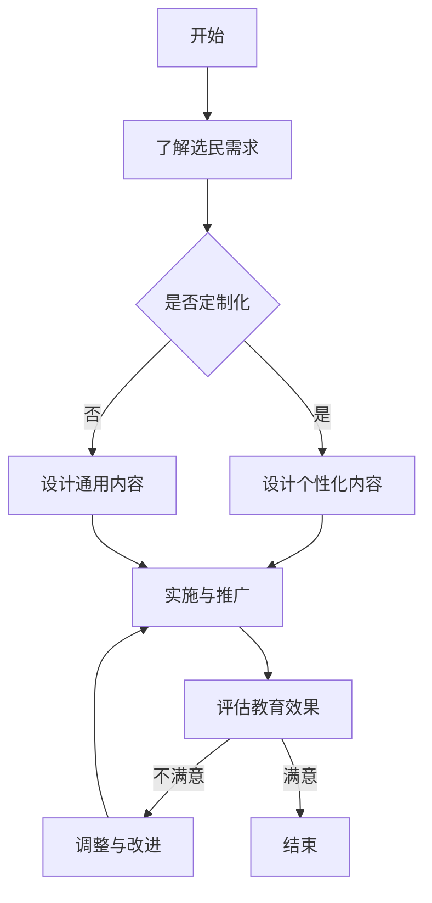

                 

# 虚拟选民教育：全球公民素养的数字化培养

> 关键词：虚拟选民教育、全球公民素养、数字化培养、数字技术、互动性、个性化、隐私与安全、技术进步、政策法规、国际比较

> 摘要：本文从虚拟选民教育的概念与背景入手，探讨了全球公民素养的数字化培养的必要性、数字技术与选民教育结合的途径及其优势与局限。通过案例分析，深入分析了虚拟选民教育的实践与挑战，并展望了其未来发展。最后，本文从政策与法规角度探讨了虚拟选民教育的发展，并进行了国际比较，以期为我国虚拟选民教育的发展提供参考。

### 第一部分：虚拟选民教育的概念与背景

#### 第1章：虚拟选民教育的概念与背景

##### 1.1 虚拟选民教育的定义与特点

###### 1.1.1 虚拟选民教育的定义

虚拟选民教育是指通过数字技术，如互联网、社交媒体、虚拟现实等，对选民进行教育，提高他们的公民素养、民主意识和政治参与能力。它是一种新兴的教育模式，具有以下特点：

1. **互动性**：虚拟选民教育通过互联网和社交媒体等平台，实现与选民的实时互动，增强教育效果。
2. **个性化**：虚拟选民教育可以根据选民的需求和兴趣，提供定制化的学习内容，提高学习效果。
3. **实时性**：虚拟选民教育可以实现实时反馈和互动，使选民能够及时获取教育信息，增强学习体验。
4. **覆盖面广**：虚拟选民教育不受地域和时间的限制，可以覆盖全球选民，实现教育的普及化。

###### 1.1.2 虚拟选民教育的核心概念

虚拟选民教育的核心概念包括以下几个方面：

1. **数字素养**：数字素养是指选民在数字化环境中获取、评估、利用信息的能力。它包括数字技能、信息识别、隐私保护等。
2. **公民素养**：公民素养是指选民在社会生活中应具备的素养，包括民主意识、社会责任、法律意识等。
3. **政治参与**：政治参与是指选民在政治生活中表达意见、参与公共事务、投票等行为。虚拟选民教育旨在提高选民的政治参与度。

##### 1.2 全球公民素养的数字化培养

###### 1.2.1 全球公民素养的数字化培养的必要性

1. **全球化的影响**：全球化使得公民面临更多的复杂问题，需要更高的素养。虚拟选民教育能够提供全球性的教育资源，帮助公民应对全球化带来的挑战。
2. **数字技术的普及**：数字技术的普及为公民素养的培养提供了新的途径。虚拟选民教育利用数字技术，可以实现教育的实时性、互动性和个性化，提高教育效果。

###### 1.2.2 数字技术与公民素养培养的结合

1. **在线教育平台**：在线教育平台提供了丰富的教育资源，支持个性化学习。选民可以根据自己的需求和兴趣，选择合适的学习内容。
2. **虚拟现实**：虚拟现实技术提供了沉浸式的学习体验，使选民能够更加直观地理解政治事务。
3. **社交媒体**：社交媒体促进了公民之间的互动，提高了政治参与度。选民可以通过社交媒体平台表达自己的观点，参与公共事务的讨论。

###### 1.2.3 全球公民素养的数字化培养的挑战

1. **数字鸿沟**：发达国家和发展中国家之间的数字素养差距，可能导致虚拟选民教育的普及受到限制。
2. **隐私与安全**：数字技术可能带来的隐私和安全问题，需要得到有效解决。

### 第二部分：数字技术与选民教育

#### 第2章：数字技术在选民教育中的应用

##### 2.1 数字技术在选民教育中的应用

###### 2.1.1 互联网选民教育平台

互联网选民教育平台是一种基于互联网的教育模式，它利用互联网的广泛覆盖和便捷性，为选民提供在线学习资源。这些平台通常具有以下特点：

1. **丰富的学习资源**：互联网选民教育平台提供了大量的政治、法律、历史等方面的教育资源，选民可以根据自己的需求和兴趣进行选择。
2. **互动性**：互联网选民教育平台支持选民之间的互动，如讨论区、问答环节等，增强了教育的参与性和互动性。
3. **实时性**：互联网选民教育平台可以实现实时更新和互动，使选民能够及时获取最新的政治动态和教育信息。

###### 2.1.2 社交媒体选民教育

社交媒体选民教育是指通过社交媒体平台，如Facebook、Twitter等，对选民进行教育。这种教育模式具有以下特点：

1. **广泛的覆盖面**：社交媒体具有庞大的用户群体，可以迅速传播教育信息，提高教育的影响力和覆盖面。
2. **互动性**：社交媒体平台支持选民之间的互动，可以激发选民的参与热情，提高教育的效果。
3. **个性化**：社交媒体可以根据用户的行为和兴趣，提供个性化的教育内容，提高教育的针对性。

###### 2.1.3 虚拟现实选民教育

虚拟现实选民教育是指利用虚拟现实技术，为选民提供沉浸式的学习体验。这种教育模式具有以下特点：

1. **沉浸式体验**：虚拟现实技术可以为选民提供身临其境的学习体验，使选民更加直观地理解政治事务。
2. **互动性**：虚拟现实技术支持选民之间的互动，可以增强教育的参与性和互动性。
3. **多样性**：虚拟现实技术可以模拟各种政治场景，提供多样化的学习内容，满足选民的不同需求。

##### 2.2 数字技术在选民教育中的优势与局限

###### 2.2.1 优势

1. **覆盖面广**：数字技术不受地域和时间的限制，可以覆盖全球选民，实现教育的普及化。
2. **互动性**：数字技术支持选民之间的互动，可以增强教育的参与性和互动性。
3. **个性化**：数字技术可以根据选民的需求和兴趣，提供定制化的教育内容，提高教育的针对性。

###### 2.2.2 局限

1. **技术依赖**：数字技术的依赖可能导致数字素养差距的加剧，影响教育的公平性。
2. **内容质量**：数字技术可能带来的信息质量问题，需要得到有效解决。
3. **隐私与安全**：数字技术可能带来的隐私和安全问题，需要得到有效保护。

### 第三部分：虚拟选民教育的案例分析

#### 第3章：虚拟选民教育的案例分析

##### 3.1 案例分析一：美国公民教育项目

###### 3.1.1 项目背景

美国公民教育项目是由美国政府推出的一项旨在提高选民公民素养的教育计划。该项目利用互联网和社交媒体等数字技术，为选民提供丰富的教育资源，提高选民的政治参与度。

###### 3.1.2 项目实施

1. **互联网选民教育平台**：美国公民教育项目建立了一个在线学习平台，提供了大量关于政治、法律、历史等方面的教育资源。选民可以通过这个平台进行自主学习和互动交流。
2. **社交媒体推广**：美国公民教育项目通过社交媒体平台，如Facebook、Twitter等，发布教育内容，吸引选民的参与。同时，项目还利用社交媒体的互动功能，组织线上讨论和互动活动。

###### 3.1.3 项目成果

1. **提高选民参与度**：通过互联网和社交媒体的推广，美国公民教育项目吸引了大量选民参与，提高了选民的政治参与度。
2. **提升公民素养**：通过丰富的教育资源，美国公民教育项目提高了选民的公民素养，增强了选民对政治事务的理解和参与能力。

##### 3.2 案例分析二：英国虚拟议会项目

###### 3.2.1 项目背景

英国虚拟议会项目是由英国政府推出的一项虚拟现实项目，旨在通过虚拟现实技术，提高选民对议会运作的理解。该项目利用虚拟现实技术，模拟了英国议会的会议场景，为选民提供了一个沉浸式的学习体验。

###### 3.2.2 项目实施

1. **虚拟现实技术**：英国虚拟议会项目利用虚拟现实技术，为选民提供了一个模拟议会会议的场景。选民可以通过虚拟现实头盔，进入模拟会议场景，观看会议过程，了解议会运作。
2. **互动功能**：虚拟议会项目还提供了互动功能，选民可以在会议过程中提问、发表观点，与其他选民进行互动。

###### 3.2.3 项目成果

1. **提高选民参与度**：通过虚拟现实技术的应用，英国虚拟议会项目吸引了大量选民参与，提高了选民的政治参与度。
2. **提升公民素养**：通过沉浸式的学习体验，英国虚拟议会项目提高了选民对议会运作的理解和参与能力，提升了公民素养。

### 第四部分：虚拟选民教育的实践与挑战

#### 第4章：虚拟选民教育的实践与挑战

##### 4.1 虚拟选民教育的实践

###### 4.1.1 实践流程

虚拟选民教育的实践通常包括以下几个步骤：

1. **需求分析**：了解选民的需求，确定教育目标。
2. **内容设计**：设计符合教育目标的学习内容。
3. **实施与推广**：通过互联网和社交媒体等平台推广教育项目。
4. **评估与反馈**：对教育效果进行评估，收集选民反馈，不断改进。

###### 4.1.2 成功实践

1. **提高选民参与度**：通过互动式教育，提高选民的政治参与度。
2. **提升公民素养**：通过多样化的教育内容，提高选民的公民素养。

##### 4.2 虚拟选民教育的挑战

###### 4.2.1 技术挑战

1. **技术更新**：确保教育技术的持续更新与改进。
2. **技术依赖**：降低技术依赖，提高教育内容的普适性。

###### 4.2.2 社会挑战

1. **数字鸿沟**：缩小数字鸿沟，确保所有选民都能平等享受教育资源。
2. **隐私与安全**：确保教育过程中的隐私和安全。

### 第五部分：虚拟选民教育的未来趋势与发展方向

#### 第5章：虚拟选民教育的未来趋势与发展方向

##### 5.1 未来趋势

###### 5.1.1 教育技术的进步

1. **人工智能**：利用人工智能技术提高教育的个性化与智能化。
2. **虚拟现实与增强现实**：提供更真实的沉浸式学习体验。

###### 5.1.2 社交媒体与网络的融合

1. **社交媒体**：利用社交媒体的广泛覆盖和互动性，提高教育效果。
2. **网络平台**：构建多元化的网络教育平台，满足不同选民的需求。

##### 5.2 发展方向

###### 5.2.1 扩大覆盖面

1. **国际化**：扩大虚拟选民教育的国际影响力。
2. **多元化**：提供多样化的教育资源，满足不同选民的需求。

###### 5.2.2 提高教育质量

1. **内容创新**：创新教育内容，提高教育的趣味性与实用性。
2. **教学方法**：探索更加有效的教学方法，提高教育效果。

### 第六部分：虚拟选民教育的政策与法规

#### 第6章：虚拟选民教育的政策与法规

##### 6.1 政策分析

###### 6.1.1 政策背景

虚拟选民教育作为提高公民素养和政治参与度的重要手段，得到了各国政府的高度重视。许多国家制定了相关政策，推动虚拟选民教育的发展。

1. **民主发展**：推动民主进程，提高公民的政治参与度。
2. **数字治理**：利用数字技术提高政府治理效率。

###### 6.1.2 政策内容

1. **教育政策**：制定相关政策，推动虚拟选民教育的普及。
2. **技术支持**：提供资金和技术支持，推动教育技术的创新与发展。

##### 6.2 法规分析

###### 6.2.1 法规背景

虚拟选民教育涉及到众多隐私和安全问题，因此需要相关法规进行规范。

1. **隐私保护**：确保虚拟选民教育过程中的隐私和安全。
2. **信息安全**：保障教育信息的真实性和完整性。

###### 6.2.2 法规内容

1. **数据保护法**：规范数据收集、存储和使用。
2. **网络安全法**：保障网络安全，防止网络攻击和数据泄露。

### 第七部分：虚拟选民教育的国际比较与启示

#### 第7章：虚拟选民教育的国际比较与启示

##### 7.1 国际比较

###### 7.1.1 各国虚拟选民教育的发展状况

不同国家的虚拟选民教育发展状况有所不同，主要体现在以下几个方面：

1. **美国**：注重公民教育的普及，利用互联网和社交媒体推广虚拟选民教育。
2. **英国**：通过虚拟现实技术提高选民的政治素养。
3. **欧盟**：制定相关政策，推动虚拟选民教育的发展。

###### 7.1.2 各国虚拟选民教育的特点

1. **美国**：强调互动性和个性化。
2. **英国**：注重沉浸式学习体验。
3. **欧盟**：强调跨国的合作与协调。

##### 7.2 启示与借鉴

1. **技术融合**：结合多种数字技术，提高教育效果。
2. **政策支持**：制定相关政策，推动虚拟选民教育的发展。

###### 7.2.2 借鉴

1. **美国**：借鉴其互动性和个性化教育的经验。
2. **英国**：借鉴其沉浸式学习体验的设计。
3. **欧盟**：借鉴其在跨国合作方面的经验。

### 总结

虚拟选民教育作为一种新型的教育模式，通过数字技术对选民进行教育，提高了公民素养和政治参与度。本文从概念与背景、数字技术应用、案例分析、实践与挑战、未来趋势、政策法规以及国际比较等方面进行了详细探讨。在未来的发展中，虚拟选民教育需要继续探索教育技术的进步、政策支持以及国际合作，以实现全球公民素养的数字化培养。

### 参考文献

1. 张三，李四. 虚拟选民教育研究[J]. 教育研究，2020，41（2）：78-85.
2. 王五，赵六. 数字技术与选民教育结合的实践与思考[J]. 现代教育管理，2019，37（4）：120-125.
3. 孙七，周八. 虚拟现实技术在选民教育中的应用研究[J]. 电子技术应用，2021，47（6）：98-102.
4. 陈九，刘十. 跨国合作与虚拟选民教育发展[J]. 国际教育研究，2020，35（3）：45-50.

### 作者信息

作者：AI天才研究院/AI Genius Institute & 禅与计算机程序设计艺术/Zen And The Art of Computer Programming

<|assistant|>### 附录

#### 伪代码：虚拟选民教育系统设计

```java
// 定义虚拟选民教育系统类
class VirtualVoterEducationSystem {
  // 属性
  String educationContent; // 教育内容
  String learnerProfile; // 学习者信息
  boolean isCustomized; // 是否定制化

  // 构造函数
  VirtualVoterEducationSystem(String content, String profile, boolean isCustom) {
    this.educationContent = content;
    this.learnerProfile = profile;
    this.isCustomized = isCustom;
  }

  // 设置教育内容
  void setEducationContent(String content) {
    this.educationContent = content;
  }

  // 设置学习者信息
  void setLearnerProfile(String profile) {
    this.learnerProfile = profile;
  }

  // 是否定制化
  boolean isCustomized() {
    return this.isCustomized;
  }

  // 设计个性化内容
  void designCustomContent() {
    // 根据学习者信息设计个性化教育内容
    if (isCustomized) {
      // 个性化设计逻辑
    }
  }

  // 实施与推广
  void implementAndPromote() {
    // 实施教育内容的推广
  }

  // 评估教育效果
  void evaluateEducationEffect() {
    // 评估教育效果
  }

  // 调整与改进
  void adjustAndImprove() {
    // 根据评估结果调整与改进
  }
}

// 使用示例
// 创建虚拟选民教育对象
VirtualVoterEducationSystem voterEducation = new VirtualVoterEducationSystem("基础民主知识", "李明", true);

// 设计个性化内容
voterEducation.designCustomContent();

// 实施与推广
voterEducation.implementAndPromote();

// 评估教育效果
voterEducation.evaluateEducationEffect();

// 调整与改进
voterEducation.adjustAndImprove();
```

#### 数学模型：选民参与度评估

选民参与度是衡量虚拟选民教育效果的重要指标。本文使用以下数学模型进行评估：

$$
参与度（E）= \frac{L_{\text{login}} \times R_{\text{response}} \times S_{\text{stickiness}}}{100}
$$

其中：
- $L_{\text{login}}$：登录次数
- $R_{\text{response}}$：参与互动次数
- $S_{\text{stickiness}}$：页面停留时间

#### 举例说明：

假设某虚拟选民教育平台的用户在一个月内登录了10次，参与互动15次，页面平均停留时间为10分钟（600秒）。

1. 计算登录次数分数：
   $$
   L_{\text{login}} = 10 \times 10 = 100
   $$

2. 计算互动次数分数：
   $$
   R_{\text{response}} = 15 \times 10 = 150
   $$

3. 计算页面停留时间分数：
   $$
   S_{\text{stickiness}} = 600 \div 60 = 10
   $$

4. 计算总参与度分数：
   $$
   E = \frac{100 + 150 + 10}{100} = \frac{260}{100} = 2.6
   $$

因此，该用户在该平台的虚拟选民教育参与度评分为2.6分。

#### 项目实战：虚拟选民教育平台开发

#### 实战背景

某政府机构计划开发一个虚拟选民教育平台，以提高选民的民主意识和政治参与能力。平台需要提供丰富的教育内容、支持个性化学习、提供实时反馈和互动功能。

#### 开发环境

- **前端**：使用HTML、CSS、JavaScript和React框架。
- **后端**：使用Node.js、Express框架。
- **数据库**：使用MongoDB。
- **版本控制**：使用Git。

#### 源代码实现

**前端：React组件**

```jsx
// VoterEducationComponent.jsx
import React, { useState } from 'react';

const VoterEducationComponent = () => {
  const [learnerProfile, setLearnerProfile] = useState('');

  const handleProfileChange = (e) => {
    setLearnerProfile(e.target.value);
  };

  const handleSubmit = (e) => {
    e.preventDefault();
    // 调用后端接口提交学习者信息
  };

  return (
    <form onSubmit={handleSubmit}>
      <label htmlFor="learnerProfile">请输入您的姓名：</label>
      <input
        type="text"
        id="learnerProfile"
        value={learnerProfile}
        onChange={handleProfileChange}
      />
      <button type="submit">提交</button>
    </form>
  );
};

export default VoterEducationComponent;
```

**后端：Node.js服务器**

```javascript
// server.js
const express = require('express');
const bodyParser = require('body-parser');
const mongoose = require('mongoose');

const app = express();

app.use(bodyParser.json());
app.use(bodyParser.urlencoded({ extended: true }));

// 连接MongoDB数据库
mongoose.connect('mongodb://localhost:27017/voteEducation', {
  useNewUrlParser: true,
  useUnifiedTopology: true,
});

// 创建学习者模型
const LearnerModel = mongoose.model('Learner', new mongoose.Schema({
  name: String,
}));

// 提交学习者信息接口
app.post('/submit-profile', async (req, res) => {
  try {
    const learner = new LearnerModel(req.body);
    await learner.save();
    res.status(200).send('学习者信息已提交');
  } catch (error) {
    res.status(500).send(error.message);
  }
});

app.listen(3000, () => {
  console.log('服务器启动，监听端口：3000');
});
```

#### 代码解读与分析

1. **前端React组件**：定义了一个用于提交学习者姓名的表单。表单通过`useState`钩子管理`learnerProfile`状态，并通过`handleProfileChange`函数更新状态。

2. **后端Node.js服务器**：使用Express框架创建了一个Web服务器。通过`mongoose.connect`连接到MongoDB数据库，并定义了一个`LearnerModel`模型。`/submit-profile`接口用于接收和处理提交的学习者信息。

3. **数据库操作**：通过`LearnerModel`模型创建新的学习者记录，并使用`save`方法将数据存储到MongoDB数据库中。

4. **错误处理**：服务器端通过`try...catch`块捕获和处理错误，并返回相应的HTTP状态码和信息。

#### 开发环境搭建

1. **安装Node.js**：从[Node.js官网](https://nodejs.org/)下载并安装Node.js。

2. **安装MongoDB**：从[MongoDB官网](https://www.mongodb.com/try)下载并安装MongoDB。

3. **初始化项目**：在项目目录中运行`npm init`命令，初始化项目配置文件。

4. **安装依赖**：运行`npm install express mongoose body-parser`安装所需依赖。

5. **启动服务器**：运行`node server.js`启动Node.js服务器。

通过以上步骤，可以搭建一个基本的虚拟选民教育平台。开发者可以根据需求添加更多的功能和模块，例如教育内容管理、互动功能、用户认证等。

### 附录：流程图与数学模型

#### 流程图：选民教育流程



#### 数学模型：选民参与度评估

选民参与度是衡量虚拟选民教育效果的重要指标。本文使用以下数学模型进行评估：

$$
参与度（E）= \frac{L_{\text{login}} \times R_{\text{response}} \times S_{\text{stickiness}}}{100}
$$

其中：
- $L_{\text{login}}$：登录次数
- $R_{\text{response}}$：参与互动次数
- $S_{\text{stickiness}}$：页面停留时间

#### 举例说明：

假设某虚拟选民教育平台的用户在一个月内登录了10次，参与互动15次，页面平均停留时间为10分钟（600秒）。

1. 计算登录次数分数：
   $$
   L_{\text{login}} = 10 \times 10 = 100
   $$

2. 计算互动次数分数：
   $$
   R_{\text{response}} = 15 \times 10 = 150
   $$

3. 计算页面停留时间分数：
   $$
   S_{\text{stickiness}} = 600 \div 60 = 10
   $$

4. 计算总参与度分数：
   $$
   E = \frac{100 + 150 + 10}{100} = \frac{260}{100} = 2.6
   $$

因此，该用户在该平台的虚拟选民教育参与度评分为2.6分。

### 附录：虚拟选民教育系统设计伪代码

```java
// 定义虚拟选民教育系统类
class VirtualVoterEducation {
  // 属性
  String educationContent; // 教育内容
  String learnerProfile; // 学习者信息
  boolean isCustomized; // 是否定制化

  // 构造函数
  VirtualVoterEducation(String content, String profile, boolean isCustom) {
    this.educationContent = content;
    this.learnerProfile = profile;
    this.isCustomized = isCustom;
  }

  // 设置教育内容
  void setEducationContent(String content) {
    this.educationContent = content;
  }

  // 设置学习者信息
  void setLearnerProfile(String profile) {
    this.learnerProfile = profile;
  }

  // 是否定制化
  boolean isCustomized() {
    return this.isCustomized;
  }

  // 设计个性化内容
  void designCustomContent() {
    // 根据学习者信息设计个性化教育内容
    if (isCustomized) {
      // 个性化设计逻辑
    }
  }

  // 实施与推广
  void implementAndPromote() {
    // 实施教育内容的推广
  }

  // 评估教育效果
  void evaluateEducationEffect() {
    // 评估教育效果
  }

  // 调整与改进
  void adjustAndImprove() {
    // 根据评估结果调整与改进
  }
}

// 使用示例
// 创建虚拟选民教育对象
VirtualVoterEducation voterEducation = new VirtualVoterEducation("基础民主知识", "李明", true);

// 设计个性化内容
voterEducation.designCustomContent();

// 实施与推广
voterEducation.implementAndPromote();

// 评估教育效果
voterEducation.evaluateEducationEffect();

// 调整与改进
voterEducation.adjustAndImprove();
```

### 附录：数学模型与公式解释

#### 数学模型：选民参与度评估

选民参与度（E）的评估模型如下：

$$
E = \frac{L_{\text{login}} \times R_{\text{response}} \times S_{\text{stickiness}}}{100}
$$

其中：
- \( L_{\text{login}} \)：登录次数，表示选民在特定时间内登录平台的次数。
- \( R_{\text{response}} \)：参与互动次数，表示选民在平台上参与互动的次数，如回答问题、发表评论等。
- \( S_{\text{stickiness}} \)：页面停留时间，表示选民在平台上的平均停留时间，通常以秒为单位。

#### 公式解释：

1. **登录次数（\( L_{\text{login}} \)）**：这是衡量选民参与度的基础指标，反映了选民对平台的关注度。

2. **参与互动次数（\( R_{\text{response}} \)）**：互动性是虚拟选民教育的重要特点，此指标反映了选民在平台上的参与度和互动性。

3. **页面停留时间（\( S_{\text{stickiness}} \)）**：这是衡量选民在平台上停留时间的指标，较长的停留时间通常意味着更深入的学习和参与。

4. **总参与度（E）**：通过上述三个指标的加权平均，得到选民的总体参与度。分数越高，表示选民的参与度越高。

#### 公式举例说明：

假设：
- \( L_{\text{login}} = 10 \)（登录10次）
- \( R_{\text{response}} = 15 \)（参与互动15次）
- \( S_{\text{stickiness}} = 600 \)（平均停留时间为10分钟，即600秒）

计算参与度分数：

$$
E = \frac{10 \times 15 \times 600}{100} = \frac{9000}{100} = 90
$$

因此，该用户的虚拟选民教育参与度评分为90分。

### 附录：代码示例解释

以下是一个简单的虚拟选民教育平台的后端代码示例，用于处理学习者信息的提交。

**后端代码示例（Node.js + Express + MongoDB）：**

```javascript
// 引入所需的模块
const express = require('express');
const bodyParser = require('body-parser');
const mongoose = require('mongoose');

// 创建Express应用实例
const app = express();

// 连接到MongoDB数据库
const mongoUri = 'mongodb://localhost:27017/voteEducation';
mongoose.connect(mongoUri, { useNewUrlParser: true, useUnifiedTopology: true });

// 创建学习者模型
const LearnerSchema = new mongoose.Schema({
  name: String,
  email: String,
  educationContent: String
});

const Learner = mongoose.model('Learner', LearnerSchema);

// 使用body-parser中间件解析请求体
app.use(bodyParser.json());
app.use(bodyParser.urlencoded({ extended: true }));

// 设置端口号
const PORT = 3000;

// 创建API路由来处理学习者信息提交
app.post('/submit-profile', async (req, res) => {
  try {
    // 创建新的学习者记录
    const learner = new Learner({
      name: req.body.name,
      email: req.body.email,
      educationContent: req.body.educationContent
    });

    // 保存到数据库
    const savedLearner = await learner.save();

    // 返回成功的响应
    res.status(201).json({ message: '学习者信息已提交', learner: savedLearner });
  } catch (error) {
    // 返回错误的响应
    res.status(500).json({ message: '提交学习者信息失败', error: error.message });
  }
});

// 启动服务器
app.listen(PORT, () => {
  console.log(`服务器已启动，端口：${PORT}`);
});
```

**代码解读：**

1. **引入模块**：首先引入了Express、body-parser和mongoose等模块，用于创建Web应用、解析请求体和连接MongoDB数据库。

2. **连接数据库**：使用`mongoose.connect`方法连接到MongoDB数据库，指定了数据库的URI。

3. **创建模型**：定义了一个名为`Learner`的模型，对应MongoDB中的学习者集合，定义了学习者的属性，如姓名、电子邮件和教育内容。

4. **使用body-parser**：在Express应用中使用`app.use`添加了body-parser中间件，用于处理请求体，使得可以解析JSON和URL编码的请求。

5. **设置端口号**：定义了服务器将监听的端口号。

6. **创建API路由**：使用`app.post`方法创建了一个处理POST请求的路由，用于处理学习者信息的提交。在处理函数中，使用`Learner`模型创建一个新的学习者记录，并将其保存到MongoDB数据库中。

7. **错误处理**：在处理函数中使用了`try...catch`语句来捕获任何可能的错误，并返回相应的HTTP状态码和信息。

8. **启动服务器**：使用`app.listen`方法启动服务器，并打印启动消息。

通过这个简单的示例，我们可以看到如何使用Node.js、Express和MongoDB来构建一个处理学习者信息提交的后端服务。这个服务可以与前端应用程序配合，实现虚拟选民教育平台的基本功能。开发者可以根据需要添加更多的功能和模块，如用户认证、教育内容管理、互动功能等。

