                 

# 认知心理学：理解学习过程的科学

> **关键词：认知心理学、学习过程、信息加工、记忆、思维、情绪调节、教育与培训**

> **摘要：本文深入探讨了认知心理学的核心概念，揭示了学习过程中认知机制的作用。通过对感知、注意力、记忆、思维、情绪调节等学习理论的分析，结合实际案例与数学模型，本文旨在为教育者和学习者的教学与学习提供科学指导。**

## 第一部分：认知心理学基础

### 第1章：心理学导论

#### 1.1 心理学的定义与历史

心理学是一门研究人类思维、情感、行为和心理过程的科学。它起源于19世纪，当时以法国哲学家埃德蒙·布伦塔诺为代表的科学家开始尝试通过实验方法研究心理现象。随着实验方法和技术的进步，心理学逐渐发展成为一个独立的学科。

**核心概念与联系：**

- **心理学起源**：心理学起源于哲学和生理学，随着实验方法的引入，逐渐发展成为一门科学。
- **心理学研究方法**：心理学的研究方法包括实验法、观察法、问卷法、神经科学方法等。

**Mermaid 流程图：**

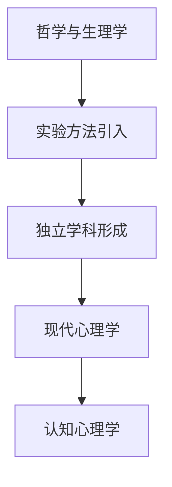

#### 1.2 心理学的分支与学科特点

心理学可以分为多个分支，包括发展心理学、社会心理学、临床心理学、认知心理学等。每个分支都有其独特的研究领域和目标。

**核心概念与联系：**

- **发展心理学**：研究个体从出生到死亡的心理发展过程。
- **社会心理学**：研究个体在社会环境中的行为和心理过程。
- **临床心理学**：关注心理障碍的诊断和治疗。
- **认知心理学**：研究人的认知过程，包括感知、记忆、思维、问题解决等。

**Mermaid 流程图：**

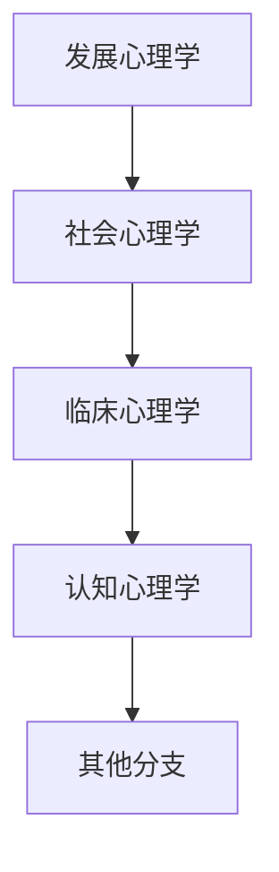

#### 1.3 心理研究方法

心理研究方法包括实验法、观察法、问卷法、神经科学方法等。每种方法都有其优缺点和适用场景。

**核心概念与联系：**

- **实验法**：通过控制变量来研究心理现象。
- **观察法**：通过观察和记录自然发生的行为来研究心理现象。
- **问卷法**：通过问卷调查来收集个体对特定问题的回答。
- **神经科学方法**：使用神经成像、脑电图等技术来研究心理现象的神经基础。

**Mermaid 流程图：**

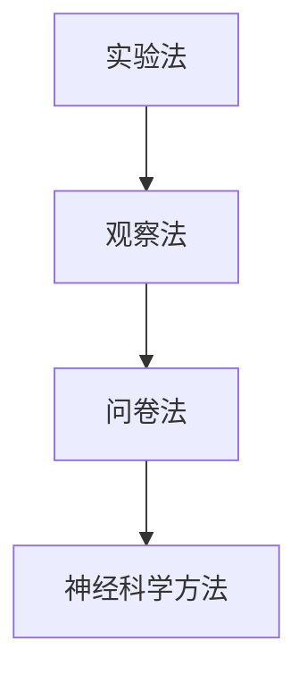

### 第2章：认知心理学概述

#### 2.1 认知心理学的发展历程

认知心理学起源于20世纪50年代，随着计算机科学的兴起，研究者开始将计算机模型应用于心理学研究，从而推动了认知心理学的发展。

**核心概念与联系：**

- **计算机科学的影响**：计算机科学的兴起为认知心理学提供了新的工具和模型。
- **信息加工理论的提出**：信息加工理论成为认知心理学的核心观点，强调人类心理过程类似于计算机的信息处理过程。

**Mermaid 流程图：**

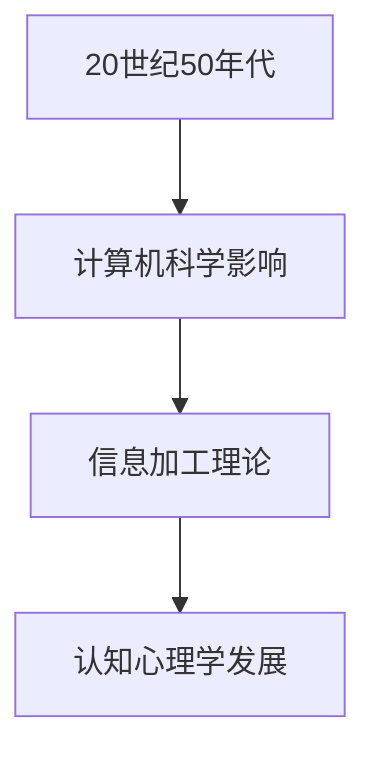

#### 2.2 认知心理学的核心观点

认知心理学的核心观点包括信息加工理论、感知理论、记忆理论、思维理论等。

**核心概念与联系：**

- **信息加工理论**：认为心理过程类似于计算机的信息处理过程。
- **感知理论**：研究人类如何感知和解释外界刺激。
- **记忆理论**：研究人类如何编码、存储和检索信息。
- **思维理论**：研究人类如何进行推理、决策和问题解决。

**Mermaid 流程图：**

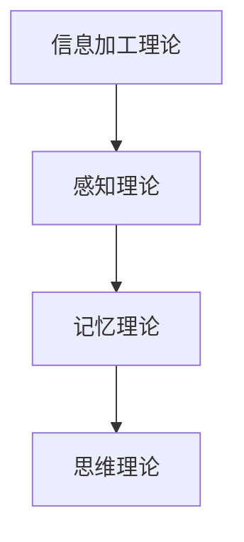

#### 2.3 认知心理学与其他心理学的关系

认知心理学与其他心理学分支如神经心理学、发展心理学、社会心理学等有着密切的联系。

**核心概念与联系：**

- **神经心理学**：研究心理现象的神经基础。
- **发展心理学**：研究心理过程在不同年龄阶段的变化。
- **社会心理学**：研究社会环境对心理过程的影响。

**Mermaid 流程图：**

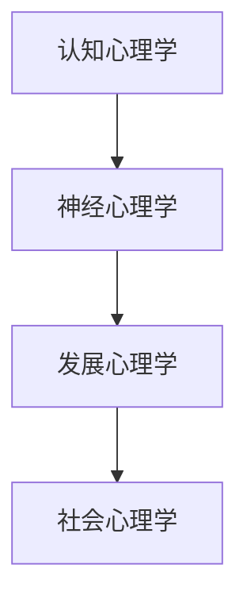

### 第3章：感知与注意力

#### 3.1 感知的基本原理

感知是人类对外界刺激的识别和理解过程。感知的基本原理包括感觉、知觉和认知。

**核心概念与联系：**

- **感觉**：感觉是感知的第一阶段，包括视觉、听觉、触觉、嗅觉和味觉。
- **知觉**：知觉是感知的第二阶段，是将感觉信息整合和组织成有意义的整体。
- **认知**：认知是感知的最后阶段，是理解和解释感知到的信息。

**Mermaid 流程图：**

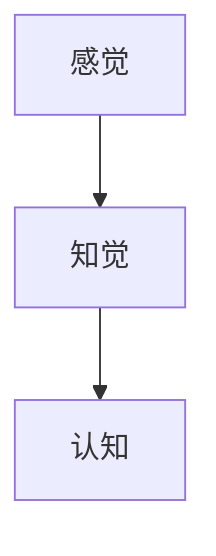

#### 3.2 感知的局限性

感知存在一些局限性，包括感知阈限、感知偏差和感知疲劳等。

**核心概念与联系：**

- **感知阈限**：感知阈限是指人能够察觉到的最小刺激强度。
- **感知偏差**：感知偏差是指人们在对事物进行判断时，由于先入为主的观念或信息加工方式的影响，导致对事物的认知产生偏差。
- **感知疲劳**：感知疲劳是指人们在长时间接触同一刺激后，对其感知能力减弱的现象。

**Mermaid 流程图：**

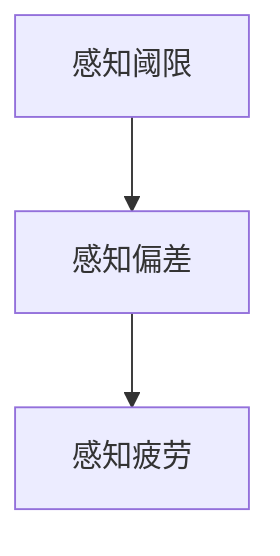

#### 3.3 注意力的机制与类型

注意力是感知的关键因素，它决定了人们对外界刺激的关注程度和选择性。

**核心概念与联系：**

- **注意力的机制**：注意力是由多个认知机制共同作用的结果，包括选择性注意、持续注意和分配注意等。
- **注意力的类型**：注意力可以分为集中性注意、分配性注意和选择性注意等。

**Mermaid 流程图：**

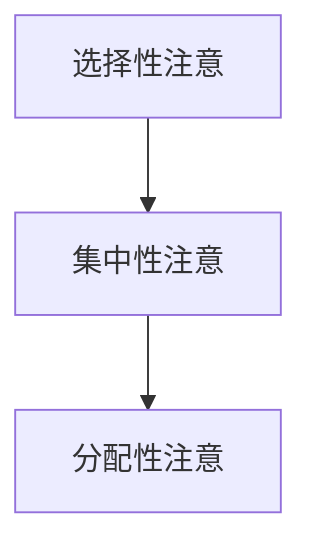

## 第4章：记忆

### 4.1 记忆的定义与类型

记忆是大脑对信息进行编码、存储和提取的能力。记忆可以分为短期记忆和长期记忆。

**核心概念与联系：**

- **短期记忆**：短期记忆是指大脑在短时间内存储和处理信息的能力。
- **长期记忆**：长期记忆是指大脑在较长时间内存储和提取信息的能力。

**Mermaid 流程图：**

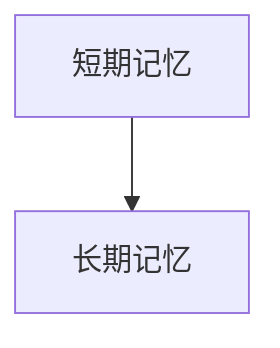

### 4.2 记忆的过程

记忆的过程包括编码、存储和提取三个阶段。

**核心概念与联系：**

- **编码**：编码是将信息转化为大脑可以处理的形式。
- **存储**：存储是将编码后的信息在脑内长期保存。
- **提取**：提取是在需要时将存储的信息从大脑中检索出来。

**Mermaid 流程图：**

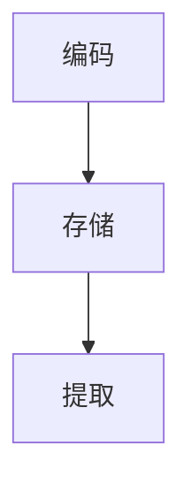

### 4.3 记忆的增强与衰退

记忆的增强与衰退是记忆过程的重要方面。

**核心概念与联系：**

- **记忆增强**：记忆增强是指通过重复练习、联想记忆等方法提高记忆效果。
- **记忆衰退**：记忆衰退是指由于时间流逝、未使用等原因导致记忆内容的减少。

**Mermaid 流程图：**

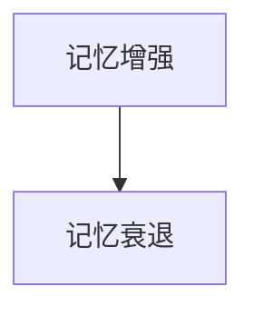

## 第5章：思维与问题解决

### 5.1 思维的定义与类型

思维是人类对信息进行加工和处理的认知过程。思维可以分为直觉思维和逻辑思维。

**核心概念与联系：**

- **直觉思维**：直觉思维是指基于经验和直觉进行快速判断的思维过程。
- **逻辑思维**：逻辑思维是指基于逻辑规则和推理进行逐步分析和判断的思维过程。

**Mermaid 流程图：**

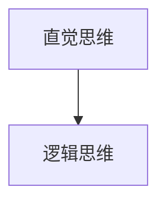

### 5.2 直觉思维与逻辑思维

直觉思维和逻辑思维在问题解决中发挥着重要作用。

**核心概念与联系：**

- **直觉思维**：直觉思维在快速决策和创造性问题解决中具有优势。
- **逻辑思维**：逻辑思维在精确分析和系统性问题解决中具有优势。

**Mermaid 流程图：**

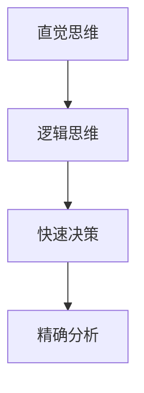

### 5.3 问题解决的心理机制

问题解决是一个复杂的过程，涉及到多个认知和心理机制。

**核心概念与联系：**

- **问题表征**：问题表征是将问题转化为可以处理的认知结构。
- **搜索策略**：搜索策略是寻找问题解决方案的方法。
- **反馈与调整**：反馈与调整是在问题解决过程中对解决方案进行评价和调整。

**Mermaid 流程图：**

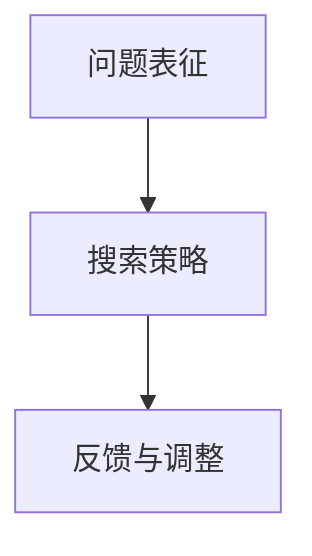

## 第6章：语言与语言理解

### 6.1 语言的本质与功能

语言是人类交流的主要工具，具有表达、传递信息和沟通情感的功能。

**核心概念与联系：**

- **表达**：语言用于表达思想、情感和意愿。
- **传递信息**：语言用于传递信息和知识。
- **沟通情感**：语言用于沟通情感和建立人际关系。

**Mermaid 流程图：**

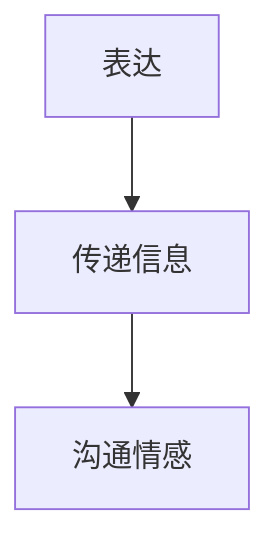

### 6.2 语言的理解与产生

语言理解与产生是语言功能的重要组成部分。

**核心概念与联系：**

- **语言理解**：语言理解是将听到的或读到的语言信息转化为有意义的信息。
- **语言产生**：语言产生是将思想转化为口头或书面的语言表达。

**Mermaid 流程图：**

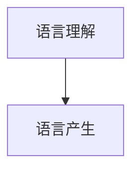

### 6.3 语言与思维的关系

语言与思维之间存在密切的关系，语言是思维的载体，同时思维也影响语言的发展。

**核心概念与联系：**

- **语言是思维的载体**：语言是思维的表达形式，思维的过程需要通过语言来实现。
- **思维影响语言**：思维的发展和变化会影响语言的表达和理解能力。

**Mermaid 流程图：**

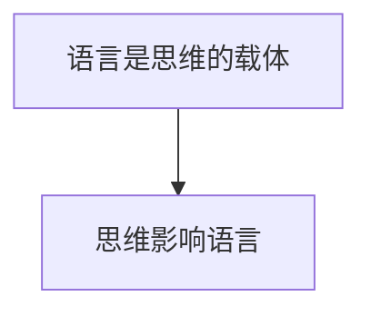

## 第7章：情绪与情绪调节

### 7.1 情绪的定义与分类

情绪是人对外界刺激产生的心理和生理反应。情绪可以分为基本情绪和复合情绪。

**核心概念与联系：**

- **基本情绪**：基本情绪包括快乐、愤怒、悲伤、恐惧等。
- **复合情绪**：复合情绪是由基本情绪组合而成的情绪，如焦虑、兴奋、厌恶等。

**Mermaid 流程图：**

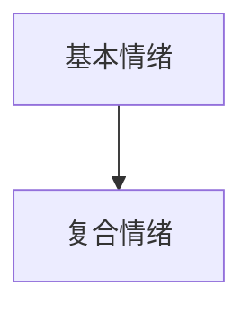

### 7.2 情绪的生理与心理机制

情绪的产生和调节涉及到多个生理和心理机制。

**核心概念与联系：**

- **生理机制**：情绪的生理机制包括自主神经系统、内分泌系统等的活动。
- **心理机制**：情绪的心理机制包括认知评价、情绪记忆、情绪调节等。

**Mermaid 流程图：**

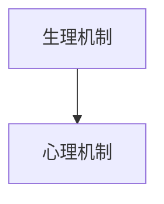

### 7.3 情绪调节的方法与策略

情绪调节是人们应对情绪挑战的重要方式。

**核心概念与联系：**

- **认知重构**：认知重构是通过改变对事件的理解和解释来调节情绪。
- **行为调节**：行为调节是通过改变行为来调节情绪，如运动、放松等。
- **情绪释放**：情绪释放是通过表达和释放情绪来调节情绪。

**Mermaid 流程图：**

```mermaid
graph TD
    A[认知重构] --> B[行为调节]
    B --> C[情绪释放]
```

## 第二部分：学习过程的理论与实践

### 第8章：学习理论概述

#### 8.1 学习的定义与类型

学习是指个体通过经验获取知识、技能和态度的过程。学习可以分为三种类型：机械学习、有意义学习和发现学习。

**核心概念与联系：**

- **机械学习**：机械学习是一种简单的重复学习，主要通过重复和练习来掌握知识和技能。
- **有意义学习**：有意义学习是一种深层次的学习，通过理解和内化知识来构建知识体系。
- **发现学习**：发现学习是一种通过自主探索和发现来学习的过程。

**Mermaid 流程图：**

```mermaid
graph TD
    A[机械学习] --> B[有意义学习]
    B --> C[发现学习]
```

#### 8.2 传统学习理论简介

传统学习理论包括行为主义学习理论和认知主义学习理论。

**核心概念与联系：**

- **行为主义学习理论**：行为主义学习理论强调外部刺激和行为反应之间的联系，认为学习是通过条件反射和强化来实现的。
- **认知主义学习理论**：认知主义学习理论强调内部心理过程在学习中的作用，认为学习是通过认知结构的构建和改变来实现的。

**Mermaid 流程图：**

```mermaid
graph TD
    A[行为主义学习理论] --> B[认知主义学习理论]
```

#### 8.3 现代学习理论的演变

现代学习理论包括建构主义学习理论和社会建构主义学习理论。

**核心概念与联系：**

- **建构主义学习理论**：建构主义学习理论强调学习者在学习过程中的主动性和建构性，认为学习是通过个体主动构建知识来实现的。
- **社会建构主义学习理论**：社会建构主义学习理论强调社会互动在学习中的作用，认为学习是通过个体与社会环境的互动来实现的。

**Mermaid 流程图：**

```mermaid
graph TD
    A[建构主义学习理论] --> B[社会建构主义学习理论]
```

### 第9章：信息加工与学习策略

#### 9.1 信息加工理论

信息加工理论是现代学习理论的核心之一，它将学习过程比喻为计算机的信息处理过程。

**核心概念与联系：**

- **感觉登记器**：感觉登记器是信息加工过程的第一个阶段，它负责接收和记录外界刺激。
- **短时记忆**：短时记忆是信息加工过程的第二个阶段，它负责存储和处理短暂的信息。
- **长时记忆**：长时记忆是信息加工过程的第三个阶段，它负责存储和提取长期的信息。

**Mermaid 流程图：**

```mermaid
graph TD
    A[感觉登记器] --> B[短时记忆]
    B --> C[长时记忆]
```

#### 9.2 学习策略的类型与运用

学习策略是指个体在学习和记忆过程中采用的方法和技巧。

**核心概念与联系：**

- **复述策略**：复述策略是通过重复和复习来巩固记忆。
- **组织策略**：组织策略是通过分类、总结和构建知识框架来提高记忆效果。
- **精细加工策略**：精细加工策略是通过联想、意义建构和记忆术来加深理解和记忆。

**Mermaid 流程图：**

```mermaid
graph TD
    A[复述策略] --> B[组织策略]
    B --> C[精细加工策略]
```

#### 9.3 学习策略的训练与评估

学习策略的训练和评估是提高学习效果的重要环节。

**核心概念与联系：**

- **训练**：训练是通过指导和实践来培养和强化学习策略。
- **评估**：评估是通过测试和反馈来评价学习策略的效果。

**Mermaid 流程图：**

```mermaid
graph TD
    A[训练] --> B[评估]
```

### 第10章：认知负荷理论与学习设计

#### 10.1 认知负荷理论的基本概念

认知负荷理论是关于学习过程中认知资源分配的理论。

**核心概念与联系：**

- **认知负荷**：认知负荷是指个体在进行认知活动时所需的认知资源。
- **外部负荷**：外部负荷是指学习材料和学习环境对个体认知资源的消耗。
- **内部负荷**：内部负荷是指个体在处理信息时自身产生的认知资源消耗。

**Mermaid 流程图：**

```mermaid
graph TD
    A[认知负荷] --> B[外部负荷]
    B --> C[内部负荷]
```

#### 10.2 认知负荷在学习和教学中的应用

认知负荷理论在学习和教学中的应用旨在优化学习过程，提高学习效果。

**核心概念与联系：**

- **减少外部负荷**：通过简化学习材料、减少无关信息的干扰来降低外部负荷。
- **优化内部负荷**：通过提高学习者的信息加工能力、培养有效的学习策略来优化内部负荷。

**Mermaid 流程图：**

```mermaid
graph TD
    A[减少外部负荷] --> B[优化内部负荷]
```

#### 10.3 基于认知负荷的学习设计原则

基于认知负荷的学习设计原则旨在设计出适合学习者的学习环境。

**核心概念与联系：**

- **适应性**：学习设计应该根据学习者的认知水平进行调整。
- **简约性**：学习设计应该尽量简单明了，减少认知负荷。
- **灵活性**：学习设计应该提供多种学习路径，满足不同学习者的需求。

**Mermaid 流程图：**

```mermaid
graph TD
    A[适应性] --> B[简约性]
    B --> C[灵活性]
```

### 第11章：元认知与自我调节学习

#### 11.1 元认知的概念与结构

元认知是指个体对自身认知过程的认知和调节。

**核心概念与联系：**

- **元认知知识**：元认知知识是指个体对认知过程的理解和知识。
- **元认知监控**：元认知监控是指个体对自身认知过程的监控和评估。
- **元认知调节**：元认知调节是指个体根据监控结果对认知过程进行调整。

**Mermaid 流程图：**

```mermaid
graph TD
    A[元认知知识] --> B[元认知监控]
    B --> C[元认知调节]
```

#### 11.2 元认知在学习中的重要作用

元认知在学习中的作用体现在多个方面。

**核心概念与联系：**

- **学习策略的选择**：元认知帮助学习者选择合适的学习策略。
- **学习过程的监控**：元认知帮助学习者监控学习过程，发现和解决问题。
- **学习效果的评估**：元认知帮助学习者评估学习效果，进行自我反馈。

**Mermaid 流程图：**

```mermaid
graph TD
    A[学习策略的选择] --> B[学习过程的监控]
    B --> C[学习效果的评估]
```

#### 11.3 自我调节学习的策略与实践

自我调节学习是指个体通过元认知调节来提高学习效果。

**核心概念与联系：**

- **设定学习目标**：设定明确的学习目标是自我调节学习的重要一步。
- **自我监控**：自我监控是确保学习过程按计划进行的有效方法。
- **自我反馈**：自我反馈是通过评估学习效果来调整学习策略的重要手段。

**Mermaid 流程图：**

```mermaid
graph TD
    A[设定学习目标] --> B[自我监控]
    B --> C[自我反馈]
```

### 第12章：认知心理学在教育与培训中的应用

#### 12.1 认知心理学在教育理论中的应用

认知心理学为教育理论提供了重要的基础。

**核心概念与联系：**

- **学习过程的理解**：认知心理学帮助教育者理解学习过程中的认知机制。
- **教学策略的设计**：认知心理学指导教育者设计有效的教学策略。
- **学习困难的诊断**：认知心理学为学习困难的诊断提供科学依据。

**Mermaid 流程图：**

```mermaid
graph TD
    A[学习过程的理解] --> B[教学策略的设计]
    B --> C[学习困难的诊断]
```

#### 12.2 认知心理学在课程设计与教学方法中的应用

认知心理学在课程设计与教学方法中的应用旨在提高教学效果。

**核心概念与联系：**

- **课程设计的适应性**：认知心理学指导课程设计，使其适应学习者的认知特点。
- **教学方法的多样性**：认知心理学提倡多种教学方法的结合，以适应不同学习者的需求。
- **学习资源的优化**：认知心理学帮助优化学习资源，提高学习者的学习效率。

**Mermaid 流程图：**

```mermaid
graph TD
    A[课程设计的适应性] --> B[教学方法的多样性]
    B --> C[学习资源的优化]
```

#### 12.3 认知心理学在职业培训与领导力发展中的应用

认知心理学在职业培训与领导力发展中的应用旨在提高职业能力和领导力。

**核心概念与联系：**

- **职业能力的培养**：认知心理学指导职业培训，培养学习者的职业能力。
- **领导力的发展**：认知心理学帮助领导者提升认知能力，提高领导力水平。
- **团队合作与沟通**：认知心理学指导团队建设，促进有效沟通和团队合作。

**Mermaid 流程图：**

```mermaid
graph TD
    A[职业能力的培养] --> B[领导力的发展]
    B --> C[团队合作与沟通]
```

## 第三部分：学习过程与认知发展的实证研究

### 第13章：学习过程的心理机制研究

#### 13.1 学习过程中的认知神经机制

学习过程中的认知神经机制是研究学习如何在大脑中实现的关键领域。

**核心概念与联系：**

- **神经可塑性**：神经可塑性是指大脑神经元结构和功能的改变，是学习的基础。
- **大脑区域活动**：不同的大脑区域在学习过程中扮演不同角色，如前额叶与决策、海马与记忆等。

**Mermaid 流程图：**

```mermaid
graph TD
    A[神经可塑性] --> B[大脑区域活动]
```

#### 13.2 学习策略与认知结构的互动

学习策略与认知结构的互动是优化学习效果的重要途径。

**核心概念与联系：**

- **认知结构**：认知结构是指个体对信息的组织方式。
- **学习策略**：学习策略是指个体在学习过程中采用的方法和技巧。
- **交互作用**：学习策略与认知结构的互动可以增强学习效果，如通过有意义的连接和组织信息。

**Mermaid 流程图：**

```mermaid
graph TD
    A[认知结构] --> B[学习策略]
    B --> C[交互作用]
```

#### 13.3 学习过程中的情绪调节机制

情绪调节在学习过程中至关重要，它影响学习的效果和效率。

**核心概念与联系：**

- **情绪调节策略**：情绪调节策略是指个体用来调节自身情绪的方法。
- **情绪对学习的影响**：积极情绪促进学习，而消极情绪可能阻碍学习。
- **情绪调节的效果**：有效的情绪调节可以提高学习效率和持久性。

**Mermaid 流程图：**

```mermaid
graph TD
    A[情绪调节策略] --> B[情绪对学习的影响]
    B --> C[情绪调节的效果]
```

### 第14章：学习障碍与干预

#### 14.1 学习障碍的定义与分类

学习障碍是指个体在获取、处理和使用信息方面存在的持续困难。

**核心概念与联系：**

- **定义**：学习障碍是一种学习困难，它不是由于智力障碍、听力障碍或视觉障碍引起的。
- **分类**：学习障碍可以分为阅读障碍、数学障碍、写作障碍等。

**Mermaid 流程图：**

```mermaid
graph TD
    A[定义] --> B[分类]
```

#### 14.2 学习障碍的心理机制

学习障碍的心理机制涉及到认知、情感和行为等多个方面。

**核心概念与联系：**

- **认知机制**：学习障碍可能涉及信息加工、记忆和注意力等认知过程的障碍。
- **情感机制**：学习障碍可能导致焦虑、沮丧等情绪问题。
- **行为机制**：学习障碍可能表现为学习动机下降、逃避学习等行为问题。

**Mermaid 流程图：**

```mermaid
graph TD
    A[认知机制] --> B[情感机制]
    B --> C[行为机制]
```

#### 14.3 学习障碍的干预策略

干预策略旨在帮助学习障碍个体克服困难，提高学习效果。

**核心概念与联系：**

- **个性化教学**：个性化教学是根据学习障碍个体的特点和需求进行的教学。
- **认知训练**：认知训练是通过特定练习提高个体认知能力的方法。
- **社会支持**：社会支持包括家庭、教师和同伴的支持，对学习障碍个体的帮助至关重要。

**Mermaid 流程图：**

```mermaid
graph TD
    A[个性化教学] --> B[认知训练]
    B --> C[社会支持]
```

### 第15章：认知发展与教育干预

#### 15.1 认知发展的基本理论

认知发展的基本理论包括皮亚杰的认知发展阶段理论和维果茨基的社会文化发展理论。

**核心概念与联系：**

- **皮亚杰的认知发展阶段理论**：皮亚杰提出认知发展分为感知运动、前运算、具体运算和形式运算四个阶段。
- **维果茨基的社会文化发展理论**：维果茨基强调社会互动和文化背景在认知发展中的作用。

**Mermaid 流程图：**

```mermaid
graph TD
    A[皮亚杰的认知发展阶段理论] --> B[维果茨基的社会文化发展理论]
```

#### 15.2 不同年龄阶段的学习特点

不同年龄阶段的学习特点反映了个体认知发展的变化。

**核心概念与联系：**

- **幼儿阶段**：幼儿阶段的认知特点是直观行动和具体形象思维。
- **儿童阶段**：儿童阶段的认知特点是具体运算思维和初步的抽象思维。
- **青少年阶段**：青少年阶段的认知特点是形式运算思维和自我反思能力的发展。

**Mermaid 流程图：**

```mermaid
graph TD
    A[幼儿阶段] --> B[儿童阶段]
    B --> C[青少年阶段]
```

#### 15.3 教育干预对认知发展的影响

教育干预对认知发展有着显著的影响，通过适当的教学方法和策略可以促进儿童的认知发展。

**核心概念与联系：**

- **早期干预**：早期干预可以在幼儿阶段就开始，帮助儿童建立坚实的基础。
- **个性化教学**：个性化教学根据儿童的认知发展水平进行教学，提高学习效果。
- **社会互动**：社会互动通过合作学习和同伴支持促进认知发展。

**Mermaid 流程图：**

```mermaid
graph TD
    A[早期干预] --> B[个性化教学]
    B --> C[社会互动]
```

### 第16章：跨文化学习心理学研究

#### 16.1 跨文化学习心理学的定义与研究意义

跨文化学习心理学是研究不同文化背景下学习过程和认知发展的学科。

**核心概念与联系：**

- **定义**：跨文化学习心理学关注个体在不同文化环境中的学习行为和认知过程。
- **研究意义**：跨文化学习心理学有助于理解文化差异对学习的影响，促进教育的公平性和有效性。

**Mermaid 流程图：**

```mermaid
graph TD
    A[定义] --> B[研究意义]
```

#### 16.2 跨文化学习心理学的核心问题

跨文化学习心理学的核心问题包括文化差异、语言障碍和学习策略等。

**核心概念与联系：**

- **文化差异**：文化差异影响学习者的态度、价值观和认知风格。
- **语言障碍**：语言障碍是跨文化学习中的一个重要问题，包括语言习得和语言交流。
- **学习策略**：不同文化背景下的学习者可能采用不同的学习策略。

**Mermaid 流程图：**

```mermaid
graph TD
    A[文化差异] --> B[语言障碍]
    B --> C[学习策略]
```

#### 16.3 跨文化学习心理学的实践应用

跨文化学习心理学的实践应用包括跨文化教育、多元文化课程设计和国际交流项目等。

**核心概念与联系：**

- **跨文化教育**：跨文化教育旨在培养学习者的跨文化能力和全球视野。
- **多元文化课程设计**：多元文化课程设计通过整合不同文化的知识和价值观来提高教学效果。
- **国际交流项目**：国际交流项目通过跨文化交流促进学习者理解和尊重不同文化。

**Mermaid 流程图：**

```mermaid
graph TD
    A[跨文化教育] --> B[多元文化课程设计]
    B --> C[国际交流项目]
```

### 第17章：认知心理学研究的未来趋势

#### 17.1 认知心理学研究的新方向

认知心理学研究的新方向包括神经认知科学、计算认知科学和跨学科研究等。

**核心概念与联系：**

- **神经认知科学**：神经认知科学通过神经科学方法研究认知过程的神经基础。
- **计算认知科学**：计算认知科学通过计算机模拟和建模研究认知过程。
- **跨学科研究**：跨学科研究结合心理学、神经科学、计算机科学等多个领域，推动认知心理学的发展。

**Mermaid 流程图：**

```mermaid
graph TD
    A[神经认知科学] --> B[计算认知科学]
    B --> C[跨学科研究]
```

#### 17.2 认知心理学与人工智能的融合

认知心理学与人工智能的融合是认知心理学研究的重要趋势。

**核心概念与联系：**

- **人工智能的应用**：人工智能在心理学中的应用，如情感识别、学习算法等。
- **认知建模**：通过认知心理学原理构建人工智能模型，提高其认知能力和适应性。

**Mermaid 流程图：**

```mermaid
graph TD
    A[人工智能的应用] --> B[认知建模]
```

#### 17.3 认知心理学在新兴领域中的应用前景

认知心理学在新兴领域中的应用前景包括虚拟现实、增强现实、健康心理学等。

**核心概念与联系：**

- **虚拟现实与增强现实**：虚拟现实和增强现实为认知心理学提供了新的研究场景和应用机会。
- **健康心理学**：认知心理学在健康心理学中的应用，如认知行为疗法、心理健康干预等。

**Mermaid 流程图：**

```mermaid
graph TD
    A[虚拟现实与增强现实] --> B[健康心理学]
```

## 附录

### 附录 A：认知心理学研究方法与工具

#### A.1 实验心理学方法

实验心理学方法是认知心理学研究的主要方法之一。

**核心概念与联系：**

- **实验设计**：实验设计是确保实验结果有效性和可靠性的关键。
- **数据收集**：数据收集是通过实验工具和方法获取实验数据。
- **数据分析**：数据分析是对实验数据进行统计分析和解释。

**Mermaid 流�程图：**

```mermaid
graph TD
    A[实验设计] --> B[数据收集]
    B --> C[数据分析]
```

#### A.2 认知神经科学方法

认知神经科学方法通过神经科学工具研究认知过程。

**核心概念与联系：**

- **脑成像技术**：脑成像技术如功能性磁共振成像（fMRI）用于研究大脑活动。
- **电生理技术**：电生理技术如脑电图（EEG）用于记录大脑的电活动。
- **神经可塑性研究**：神经可塑性研究通过刺激和训练方法研究大脑的适应性和可塑性。

**Mermaid 流程图：**

```mermaid
graph TD
    A[脑成像技术] --> B[电生理技术]
    B --> C[神经可塑性研究]
```

#### A.3 大数据与计算心理学方法

大数据与计算心理学方法通过计算技术和数据分析研究认知过程。

**核心概念与联系：**

- **数据挖掘**：数据挖掘是通过算法和统计方法从大量数据中提取有价值的信息。
- **机器学习**：机器学习是人工智能的一个分支，用于构建预测模型和分类模型。
- **计算模拟**：计算模拟通过计算机模拟研究认知过程和神经机制。

**Mermaid 流程图：**

```mermaid
graph TD
    A[数据挖掘] --> B[机器学习]
    B --> C[计算模拟]
```

### 附录 B：认知心理学参考资源

#### B.1 推荐阅读

以下是一些认知心理学的经典和最新参考书籍。

- **《认知心理学：思想的科学》（The Science of Thinking）**：这本书详细介绍了认知心理学的理论和应用。
- **《心智探奇》（The Quest for Consciousness）**：这本书探讨了意识、认知和大脑之间的关系。
- **《认知神经科学导论》（Introduction to Cognitive Neuroscience）**：这本书介绍了认知神经科学的基础知识和最新研究进展。

#### B.2 学术会议与期刊

以下是一些重要的认知心理学学术会议和期刊。

- **国际认知心理学会议（International Conference on Cognitive Psychology）**
- **认知神经科学年会（Annual Meeting of the Cognitive Neuroscience Society）**
- **《认知心理学与认知神经科学杂志》（Journal of Cognitive Psychology and Cognitive Neuroscience）**
- **《认知科学与认知心理学杂志》（Journal of Cognitive Science and Cognitive Psychology）**

#### B.3 在线学习平台与资源

以下是一些在线学习平台和认知心理学资源。

- **Coursera**：提供各种认知心理学相关的在线课程。
- **edX**：提供免费的认知心理学课程和讲座。
- **Khan Academy**：提供认知心理学的基础知识和练习。

#### B.4 认知心理学研究机构与组织

以下是一些认知心理学研究机构和组织。

- **美国心理学会（American Psychological Association，APA）**
- **认知科学学会（Society for Cognitive Studies of the Moving Image，SCSMI）**
- **英国认知心理学协会（British Psychological Society，BPS）**
- **神经科学与认知科学研究所（Institute of Cognitive Neuroscience，ICN）**

### 核心算法原理讲解与伪代码示例

#### 信息加工理论中的感知与选择

信息加工理论是认知心理学的一个核心理论，它将人的思维过程比喻为计算机的信息处理过程。在信息加工过程中，感知与选择是两个关键步骤。

**核心概念与联系：**

- **感知**：感知是指个体接收并识别外界刺激的过程。
- **选择**：选择是指在感知的基础上，根据个体需求对信息进行筛选和识别。

**伪代码示例：**

```pseudo
// 感知与选择
function processInformation(inputData, attentionThreshold) {
    selectedData = []  // 初始化选择的数组
    
    for each piece of inputData {
        if (piece has sufficient attention) {
            processPiece(piece)
        }
    }
    
    return selectedData
}

function processPiece(piece) {
    sensoryData = sensoryProcessing(piece)
    attentionData = selectAttention(sensoryData, attentionThreshold)
    workingMemory.append(attentionData)
}
```

**解释：**

- `processInformation` 函数负责处理输入数据，并基于注意力阈值选择重要的信息。
- `processPiece` 函数负责对每个输入数据进行感知处理，并使用选择机制筛选出重要的信息。
- `sensoryProcessing` 函数模拟了感知过程，它将输入数据转化为可以处理的形式。
- `selectAttention` 函数模拟了选择机制，它根据注意力阈值对感知数据进行筛选。

### 数学模型和数学公式详细讲解

#### 记忆的强化与衰退模型

记忆的强化与衰退是认知心理学中重要的研究课题。记忆的强化与衰退模型通常使用指数衰减函数来描述。

**数学模型：**

$$
M(t+1) = M(t) \cdot e^{-\lambda \cdot (t+1)}
$$

其中：

- \( M(t) \) 表示时间 \( t \) 时的记忆强度。
- \( \lambda \) 是遗忘率，表示记忆随时间减弱的速率。
- \( t \) 是时间。

**详细讲解与举例说明：**

- **参数解释**：遗忘率 \( \lambda \) 是一个常数，它决定了记忆衰减的速度。值越大，记忆衰减越快。
- **计算示例**：假设一个记忆的初始强度为 100，遗忘率 \( \lambda \) 为 0.1。计算一天后（\( t = 1 \)）的记忆强度：

  $$
  M(1+1) = 100 \cdot e^{-0.1 \cdot (1+1)} \approx 82.6
  $$

  这表示一天后，记忆强度约为 82.6。

### 项目实战

#### 基于注意力的文本分类

**代码实际案例：**

以下是一个简单的基于注意力的文本分类项目，使用 TensorFlow 和 Keras 构建模型。

```python
import numpy as np
import tensorflow as tf
from tensorflow.keras.models import Sequential
from tensorflow.keras.layers import Dense, LSTM, Embedding, Dropout, SpatialDropout1D

# 数据准备
max_features = 10000
embedding_dim = 100
max_sequence_length = 500
data = ...  # 需要加载的文本数据

# 模型构建
model = Sequential()
model.add(Embedding(max_features, embedding_dim, input_length=max_sequence_length))
model.add(SpatialDropout1D(0.2))
model.add(LSTM(100, dropout=0.2, recurrent_dropout=0.2))
model.add(Dense(1, activation='sigmoid'))

model.compile(loss='binary_crossentropy', optimizer='adam', metrics=['accuracy'])

# 模型训练
model.fit(data, epochs=10, batch_size=32)
```

**代码解读与分析：**

- **数据准备**：定义最大特征数、嵌入维度和最大序列长度，并加载文本数据。
- **模型构建**：使用 Sequential 模型添加嵌入层、空间dropout层、LSTM层和全连接层。
- **模型编译**：设置损失函数、优化器和评估指标。
- **模型训练**：使用 `fit` 函数训练模型，指定训练轮数和批次大小。

**核心算法原理讲解与伪代码示例：**

文本分类是一个典型的监督学习问题，模型通过学习已标记的训练数据来预测新文本的类别。

**伪代码示例：**

```pseudo
// 文本分类
function classifyText(text, model) {
    embeddedText = embedText(text, max_features, embedding_dim)
    predictedClass = model.predict(embeddedText)
    return predictedClass
}

function embedText(text, max_features, embedding_dim) {
    embeddedWord = embedWord(word, embedding_dim)
    return [embeddedWord for word in text]
}
```

- **分类**：`classifyText` 函数将文本输入模型进行预测，返回预测类别。
- **嵌入**：`embedText` 函数将文本中的每个词嵌入为向量。

### 代码解读与分析

#### LSTM层与文本分类

LSTM（长短期记忆网络）是一种能够学习长期依赖性的循环神经网络，在文本分类任务中，LSTM可以帮助模型捕捉句子中的长期上下文关系，从而提高分类的准确性。

**核心概念与联系：**

- **嵌入层**：将单词映射为向量表示，为后续的LSTM层提供输入。
- **LSTM层**：处理嵌入层的输出，通过学习句子中的上下文关系来提取特征。
- **全连接层**：将LSTM层提取的特征映射为分类结果。

**代码分析：**

- **嵌入层**：`model.add(Embedding(max_features, embedding_dim, input_length=max_sequence_length))` 这一行添加了一个嵌入层，它将词汇映射为向量，其中 `max_features` 是词汇表的大小，`embedding_dim` 是嵌入向量的维度，`input_length` 是输入序列的长度。
- **空间dropout层**：`model.add(SpatialDropout1D(0.2))` 这一行添加了一个空间dropout层，用于防止过拟合，它在嵌入层的输出上进行随机丢弃。
- **LSTM层**：`model.add(LSTM(100, dropout=0.2, recurrent_dropout=0.2))` 这一行添加了一个LSTM层，用于学习句子中的上下文关系，`dropout` 和 `recurrent_dropout` 用于防止过拟合。
- **全连接层**：`model.add(Dense(1, activation='sigmoid'))` 这一行添加了一个全连接层，用于将LSTM层提取的特征映射为二分类结果。

通过训练模型，我们可以对新的文本数据进行分类，从而实现对学习过程的科学理解。上述代码中的 `model.fit()` 函数用于训练模型，其中 `epochs` 参数指定训练轮数，`batch_size` 参数指定每个批次的样本数。通过调整这些参数，我们可以优化模型的性能。例如，增加 `epochs` 可以提高模型的准确性，但也会增加训练时间；适当调整 `batch_size` 可以平衡训练速度和模型性能。

