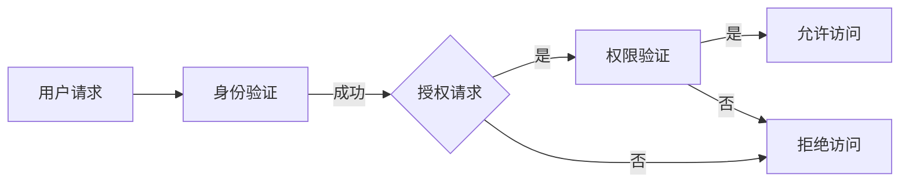
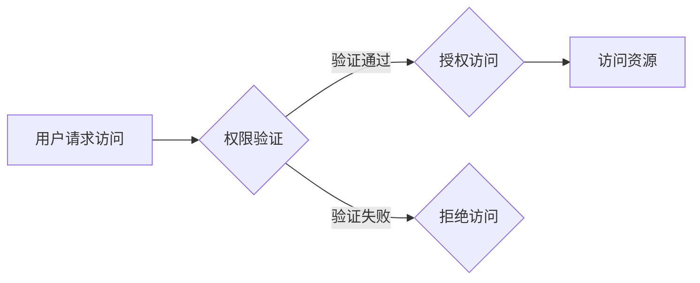

                 

# 评测系统的用户权限管理：控制访问和操作权限

## 关键词
用户权限管理、访问控制、操作权限、数据库设计、安全机制、编程实现、测试与部署、实践案例、发展趋势、零信任安全模型、行为分析技术

## 摘要

本文旨在深入探讨评测系统的用户权限管理，一个确保信息安全性和系统稳定性的关键环节。我们将从用户权限管理的基础概念入手，逐步解析其基本架构和核心概念，并探讨技术实现、常见问题及其解决方案。通过具体实践案例，我们将展示用户权限管理在实际项目中的应用，最后，我们还将展望用户权限管理的未来发展。本文不仅为IT专业人员提供实用的技术指导，也为对信息安全感兴趣的读者提供深入理解。

### 目录大纲

# 评测系统的用户权限管理：控制访问和操作权限

> **关键词：** 用户权限管理、访问控制、操作权限、数据库设计、安全机制、编程实现、测试与部署、实践案例、发展趋势、零信任安全模型、行为分析技术

> **摘要：** 本文深入探讨了评测系统的用户权限管理，涵盖了用户权限管理的基础概念、技术实现、实践案例及其未来发展趋势。文章旨在为IT专业人员提供实用的技术指导，为信息安全感兴趣的读者提供深入理解。

## 第一部分：用户权限管理基础

### 1.1 用户权限管理概述

#### 1.1.1 用户权限管理的重要性

用户权限管理是确保系统安全性和稳定性的核心机制。它通过限制用户的访问权限和操作权限，防止未经授权的访问和操作，从而保护系统和数据的安全。有效的用户权限管理能够防止数据泄露、恶意攻击、内部越权等安全问题，提升系统的安全性和可靠性。

#### 1.1.2 用户权限管理的基本概念

用户权限管理涉及几个核心概念，包括用户、角色、权限和访问控制列表（ACL）：

- **用户（User）**：系统中的操作主体，通常是一个真实的个体或实体。
- **角色（Role）**：一组具有相似权限的用户集合，用于简化权限管理。
- **权限（Permission）**：用户或角色对系统资源的访问能力和操作能力。
- **访问控制列表（ACL）**：记录每个用户或角色对系统资源的访问权限。

#### 1.1.3 用户权限管理的目标和原则

用户权限管理的目标包括：

- **安全性**：确保只有授权用户才能访问和操作系统资源。
- **可管理性**：简化权限分配和管理，提高系统维护的效率。
- **灵活性**：支持不同用户角色的权限需求，满足系统扩展性。

用户权限管理应遵循以下原则：

- **最小权限原则**：用户只能访问和执行其工作所需的最低权限。
- **单一来源原则**：权限分配和修改应由统一的权限管理系统进行。
- **访问审计原则**：记录和审计用户的访问和操作行为，便于问题追踪。

### 1.2 用户权限管理的基本架构

#### 1.2.1 用户权限管理系统的组成部分

一个典型的用户权限管理系统包括以下组成部分：

- **用户认证模块**：负责用户的身份验证。
- **权限分配模块**：负责将权限分配给用户或角色。
- **访问控制模块**：负责根据用户的权限对访问请求进行控制。
- **权限审计模块**：负责记录和审计用户的访问和操作行为。

#### 1.2.2 用户权限管理系统的设计原则

用户权限管理系统设计应遵循以下原则：

- **模块化**：系统应采用模块化设计，便于扩展和维护。
- **松耦合**：各模块之间应松耦合，减少模块间的依赖关系。
- **高性能**：系统应具有高效的数据访问和权限控制能力。

#### 1.2.3 用户权限管理系统的实现流程

用户权限管理系统的实现通常包括以下步骤：

1. **需求分析**：明确系统功能需求和安全需求。
2. **系统设计**：设计用户权限管理系统的架构和模块。
3. **数据库设计**：设计权限相关的数据库表结构和索引。
4. **编码实现**：实现用户认证、权限分配、访问控制和权限审计等模块。
5. **测试与部署**：进行系统测试和部署，确保系统的安全性和稳定性。

### 1.3 用户权限管理中的核心概念

#### 1.3.1 用户、角色和权限的关系

用户、角色和权限之间的关系如下：

- **用户（User）**：操作系统的主体，拥有独立的身份和权限。
- **角色（Role）**：一组具有相似权限的用户集合，用于简化权限管理。
- **权限（Permission）**：用户或角色对系统资源的访问能力和操作能力。

用户和角色之间的关系是多对多的，即一个用户可以拥有多个角色，一个角色也可以赋予多个用户。

#### 1.3.2 权限分配与继承

权限分配和继承是用户权限管理的关键机制：

- **权限分配**：将权限分配给用户或角色，使其具备相应的访问和操作能力。
- **权限继承**：子角色自动继承父角色的权限，简化权限管理。

权限分配和继承机制应具备以下特点：

- **灵活性**：支持不同层次的权限分配和继承。
- **可扩展性**：支持新增角色和权限的灵活扩展。

#### 1.3.3 权限粒度和策略

权限粒度是指权限的具体细化程度，包括以下类型：

- **全局权限**：作用于整个系统的权限。
- **对象级权限**：作用于具体对象的权限，如文件、数据库表等。
- **操作级权限**：作用于具体操作的权限，如读取、写入、删除等。

权限策略是指权限管理的具体规则和策略，包括：

- **最小权限原则**：用户仅拥有执行任务所需的最小权限。
- **权限分离原则**：将不同类型的权限分配给不同的用户或角色，防止权限过于集中。
- **权限监控原则**：实时监控用户的权限使用情况，及时发现和解决问题。

### 1.4 用户权限管理中的常见问题与解决方案

#### 1.4.1 权限冲突与越权问题

权限冲突和越权问题是用户权限管理中常见的问题：

- **权限冲突**：不同角色或用户之间的权限相互冲突，导致系统无法正常运行。
- **越权问题**：用户尝试执行超出其权限范围的操作。

解决这些问题的方法包括：

- **权限隔离**：将权限隔离在不同层级，防止权限相互干扰。
- **权限审计**：实时监控和审计用户的权限使用情况，及时发现和解决越权问题。
- **权限回收**：定期回收不再需要的权限，减少权限风险。

#### 1.4.2 权限分配的不当影响

权限分配不当可能对系统产生以下负面影响：

- **安全隐患**：权限过于集中，导致系统面临更高的安全风险。
- **系统性能下降**：过多的权限可能导致系统性能下降。
- **管理复杂度增加**：权限分配和管理变得更加复杂，增加维护难度。

解决这些问题的方法包括：

- **最小权限原则**：确保用户仅拥有执行任务所需的最小权限。
- **权限集中管理**：将权限分配和管理集中在统一的权限管理系统中。
- **权限审计与监控**：实时监控和审计权限分配情况，确保权限分配合理。

#### 1.4.3 权限审计与监控

权限审计与监控是用户权限管理的重要组成部分：

- **权限审计**：记录和审计用户的访问和操作行为，便于问题追踪和责任追溯。
- **监控机制**：实时监控用户的权限使用情况，及时发现和解决权限问题。

实现权限审计与监控的方法包括：

- **日志记录**：记录用户的访问和操作日志，便于审计和监控。
- **实时监控**：通过实时监控系统，及时发现和解决权限问题。
- **告警机制**：设置告警机制，及时通知管理员和处理权限问题。

## 第二部分：用户权限管理的技术实现

### 2.1 用户权限管理的数据库设计

#### 2.1.1 数据库表结构设计

用户权限管理的数据库设计是确保权限管理高效、安全的关键。以下是典型的数据库表结构设计：

- **用户表（users）**：存储用户的基本信息，如用户名、密码、邮箱等。
- **角色表（roles）**：存储角色的基本信息，如角色名称、描述等。
- **权限表（permissions）**：存储权限的基本信息，如权限名称、描述等。
- **用户角色关系表（user_roles）**：存储用户与角色的关联信息。
- **角色权限关系表（role_permissions）**：存储角色与权限的关联信息。
- **访问控制列表（ACL）**：存储具体的访问控制信息，如用户/角色对特定资源的访问权限。

以下是数据库表结构设计的示例：

```sql
-- 用户表
CREATE TABLE users (
    user_id INT PRIMARY KEY AUTO_INCREMENT,
    username VARCHAR(50) NOT NULL,
    password VARCHAR(50) NOT NULL,
    email VARCHAR(100)
);

-- 角色表
CREATE TABLE roles (
    role_id INT PRIMARY KEY AUTO_INCREMENT,
    role_name VARCHAR(50) NOT NULL,
    description VARCHAR(100)
);

-- 权限表
CREATE TABLE permissions (
    permission_id INT PRIMARY KEY AUTO_INCREMENT,
    permission_name VARCHAR(50) NOT NULL,
    description VARCHAR(100)
);

-- 用户角色关系表
CREATE TABLE user_roles (
    user_id INT,
    role_id INT,
    FOREIGN KEY (user_id) REFERENCES users(user_id),
    FOREIGN KEY (role_id) REFERENCES roles(role_id)
);

-- 角色权限关系表
CREATE TABLE role_permissions (
    role_id INT,
    permission_id INT,
    FOREIGN KEY (role_id) REFERENCES roles(role_id),
    FOREIGN KEY (permission_id) REFERENCES permissions(permission_id)
);

-- 访问控制列表
CREATE TABLE acl (
    acl_id INT PRIMARY KEY AUTO_INCREMENT,
    resource_type VARCHAR(50) NOT NULL,
    resource_name VARCHAR(100) NOT NULL,
    user_id INT,
    role_id INT,
    permission_id INT,
    FOREIGN KEY (user_id) REFERENCES users(user_id),
    FOREIGN KEY (role_id) REFERENCES roles(role_id),
    FOREIGN KEY (permission_id) REFERENCES permissions(permission_id)
);
```

#### 2.1.2 数据库索引策略

为了提高权限管理的查询性能，数据库索引策略至关重要。以下是数据库索引策略的建议：

- **用户表（users）**：为主键（user_id）创建唯一索引，提高主键查询的效率。
- **角色表（roles）**：为主键（role_id）创建唯一索引，提高主键查询的效率。
- **权限表（permissions）**：为主键（permission_id）创建唯一索引，提高主键查询的效率。
- **用户角色关系表（user_roles）**：为用户ID（user_id）和角色ID（role_id）创建复合索引，提高关联查询的效率。
- **角色权限关系表（role_permissions）**：为角色ID（role_id）和权限ID（permission_id）创建复合索引，提高关联查询的效率。
- **访问控制列表（ACL）**：为资源类型（resource_type）、资源名称（resource_name）和用户ID（user_id）/角色ID（role_id）/权限ID（permission_id）创建复合索引，提高复杂查询的效率。

以下是索引策略的示例：

```sql
-- 用户表索引策略
CREATE INDEX idx_users_username ON users(username);

-- 角色表索引策略
CREATE INDEX idx_roles_roletitle ON roles(role_name);

-- 权限表索引策略
CREATE INDEX idx_permissions_permissionname ON permissions(permission_name);

-- 用户角色关系表索引策略
CREATE INDEX idx_user_roles_user_id_role_id ON user_roles(user_id, role_id);

-- 角色权限关系表索引策略
CREATE INDEX idx_role_permissions_role_id_permission_id ON role_permissions(role_id, permission_id);

-- 访问控制列表索引策略
CREATE INDEX idx_acls_resourcetype_resourcename ON acl(resource_type, resource_name, user_id, role_id, permission_id);
```

#### 2.1.3 数据库性能优化

数据库性能优化是确保用户权限管理系统高效运行的关键。以下是数据库性能优化的建议：

- **合理设计数据库表结构**：遵循范式设计，避免数据冗余，提高数据查询效率。
- **索引优化**：合理创建索引，避免过度索引和索引失效，提高查询性能。
- **查询优化**：优化SQL查询语句，避免全表扫描和子查询，提高查询效率。
- **数据分区**：对于大数据量的表，考虑数据分区，提高数据查询和写入性能。
- **缓存机制**：采用缓存机制，如Redis或Memcached，提高数据访问速度。

以下是查询优化和性能优化的示例：

```sql
-- 查询优化示例
-- 避免全表扫描
SELECT * FROM users WHERE username = 'example';

-- 使用索引
SELECT * FROM acl WHERE resource_name = 'example' AND permission_id = 1;

-- 性能优化示例
-- 数据分区
CREATE TABLE acl (
    acl_id INT PRIMARY KEY AUTO_INCREMENT,
    resource_type VARCHAR(50) NOT NULL,
    resource_name VARCHAR(100) NOT NULL,
    user_id INT,
    role_id INT,
    permission_id INT,
    partition_id INT
) PARTITION BY RANGE (partition_id);

-- 缓存机制
-- Redis缓存示例
$ redis-cli set user:1:name example
$ redis-cli get user:1:name
```

### 2.2 用户权限管理的安全机制

用户权限管理的安全机制是保护系统和数据安全的关键。以下介绍几种常见的安全机制：

#### 2.2.1 加密技术

加密技术是保护用户数据和系统安全的重要手段。以下介绍几种常见的加密技术：

- **哈希加密**：使用哈希函数对用户密码进行加密，如SHA-256。
- **对称加密**：使用相同的密钥对数据进行加密和解密，如AES。
- **非对称加密**：使用不同的公钥和私钥进行加密和解密，如RSA。

以下是加密技术的示例：

```python
# 哈希加密示例
import hashlib
password = 'example'
hashed_password = hashlib.sha256(password.encode()).hexdigest()
print(hashed_password)

# 对称加密示例
from cryptography.fernet import Fernet
key = Fernet.generate_key()
cipher_suite = Fernet(key)
plaintext = 'example'
ciphertext = cipher_suite.encrypt(plaintext.encode())
print(ciphertext)

# 非对称加密示例
from cryptography.hazmat.primitives import serialization
from cryptography.hazmat.primitives.asymmetric import rsa
private_key = rsa.generate_private_key(
    public_exponent=65537,
    key_size=2048,
)
public_key = private_key.public_key()
plaintext = 'example'
ciphertext = public_key.encrypt(plaintext.encode(), rsa_padding.OAEP(
    mgf=mgf1.MGF1(algorithm=hash алгоритм),
    algorithm=hash算法,
    label=None
))
print(ciphertext)
```

#### 2.2.2 认证与授权机制

认证与授权机制是用户权限管理的关键组成部分。以下介绍几种常见的认证与授权机制：

- **基本认证**：基于用户名和密码的简单认证机制。
- **OAuth**：开放授权协议，允许第三方应用访问用户资源。
- **JWT**：JSON Web Token，一种安全传输令牌，用于认证和授权。

以下是认证与授权机制的示例：

```python
# 基本认证示例
from flask import Flask, request, jsonify
app = Flask(__name__)

users = {
    'example': 'password'
}

@app.route('/login', methods=['POST'])
def login():
    username = request.json.get('username')
    password = request.json.get('password')
    if username in users and users[username] == password:
        return jsonify({'status': 'success'})
    else:
        return jsonify({'status': 'failure'})

# OAuth示例
import requests
from flask import Flask, request, jsonify
app = Flask(__name__)

client_id = 'your_client_id'
client_secret = 'your_client_secret'
authorization_url = 'https://example.com/oauth/authorize'
token_url = 'https://example.com/oauth/token'

@app.route('/authorize', methods=['GET'])
def authorize():
    return f'<a href="{authorization_url}?response_type=code&client_id={client_id}&redirect_uri=http://localhost:5000/callback">Authorize</a>'

@app.route('/callback', methods=['GET', 'POST'])
def callback():
    code = request.args.get('code')
    token_response = requests.post(
        token_url,
        data={
            'grant_type': 'authorization_code',
            'code': code,
            'redirect_uri': 'http://localhost:5000/callback',
            'client_id': client_id,
            'client_secret': client_secret
        }
    )
    access_token = token_response.json().get('access_token')
    return jsonify({'access_token': access_token})

# JWT示例
import jwt
from flask import Flask, request, jsonify
app = Flask(__name__)

secret_key = 'your_secret_key'

@app.route('/login', methods=['POST'])
def login():
    username = request.json.get('username')
    password = request.json.get('password')
    if username == 'example' and password == 'password':
        token = jwt.encode({'username': username}, secret_key, algorithm='HS256')
        return jsonify({'token': token})
    else:
        return jsonify({'error': 'invalid_credentials'})

@app.route('/protected', methods=['GET'])
def protected():
    token = request.headers.get('Authorization')
    if not token:
        return jsonify({'error': 'no_token'})
    try:
        payload = jwt.decode(token, secret_key, algorithms=['HS256'])
        return jsonify({'username': payload['username']})
    except jwt.ExpiredSignatureError:
        return jsonify({'error': 'token_expired'})
    except jwt.InvalidTokenError:
        return jsonify({'error': 'invalid_token'})
```

#### 2.2.3 防护措施

防护措施是确保用户权限管理系统安全运行的重要手段。以下介绍几种常见的防护措施：

- **防火墙**：防止未经授权的访问和攻击。
- **入侵检测系统**：实时监控和检测系统中的异常行为和攻击。
- **安全审计**：记录和审计系统中的操作行为，便于问题追踪和责任追溯。
- **漏洞扫描**：定期扫描系统中的漏洞，及时修复和更新。

以下是防护措施的示例：

```bash
# 防火墙示例
# Linux防火墙配置
sudo ufw enable
sudo ufw allow ssh
sudo ufw allow http
sudo ufw allow https

# 入侵检测系统示例
sudo apt-get install snort
sudo systemctl start snort
sudo systemctl enable snort

# 安全审计示例
# Linux安全审计配置
sudo apt-get install auditd
sudo systemctl start auditd
sudo systemctl enable auditd

# 漏洞扫描示例
# 使用Nessus进行漏洞扫描
sudo apt-get install nessus
sudo nessus scan --scan-target example.com

# 使用Nmap进行网络扫描
sudo apt-get install nmap
sudo nmap -sS example.com
```

### 2.3 用户权限管理的编程实现

用户权限管理的编程实现是确保系统安全性和稳定性的关键。以下介绍几种常见的编程实现方法：

#### 2.3.1 编程语言选择

选择适合的编程语言对于用户权限管理的编程实现至关重要。以下介绍几种常见的编程语言：

- **Java**：Java是一种广泛使用的编程语言，具有强大的安全性和跨平台性，适用于企业级应用。
- **Python**：Python是一种易于学习和使用的编程语言，适用于快速开发和原型设计。
- **C/C++**：C/C++是一种高效和底层的编程语言，适用于性能要求较高的应用。

以下是编程语言选择的示例：

```java
// Java示例
import java.util.HashMap;
import java.util.Map;

public class UserPermissionManager {
    private Map<String, String> userPermissions;

    public UserPermissionManager() {
        userPermissions = new HashMap<>();
    }

    public void assignPermission(String username, String permission) {
        userPermissions.put(username, permission);
    }

    public String getPermission(String username) {
        return userPermissions.get(username);
    }
}

// Python示例
users = {
    'example': 'read'
}

def assign_permission(username, permission):
    users[username] = permission

def get_permission(username):
    return users.get(username)

# C/C++示例
#include <iostream>
#include <map>
#include <string>

std::map<std::string, std::string> users;

void assign_permission(const std::string& username, const std::string& permission) {
    users[username] = permission;
}

std::string get_permission(const std::string& username) {
    return users[username];
}
```

#### 2.3.2 权限控制逻辑设计

权限控制逻辑设计是确保用户权限管理系统安全性的关键。以下介绍几种常见的权限控制逻辑设计方法：

- **基于角色的访问控制（RBAC）**：通过角色分配权限，简化权限管理。
- **基于属性的访问控制（ABAC）**：根据用户属性和资源属性进行权限控制。
- **基于策略的访问控制（PBAC）**：根据预定义的策略进行权限控制。

以下是权限控制逻辑设计的示例：

```java
// Java示例（基于角色的访问控制）
import java.util.HashMap;
import java.util.Map;

public class AccessControl {
    private Map<String, String> userRoles;
    private Map<String, String> rolePermissions;

    public AccessControl() {
        userRoles = new HashMap<>();
        rolePermissions = new HashMap<>();
    }

    public void assignUserRole(String username, String role) {
        userRoles.put(username, role);
    }

    public void assignRolePermission(String role, String permission) {
        rolePermissions.put(role, permission);
    }

    public boolean checkPermission(String username, String resource) {
        String role = userRoles.get(username);
        String permission = rolePermissions.get(role);
        return permission.equals("read") && resource.startsWith("read:");
    }
}

// Python示例（基于属性的访问控制）
users = {
    'example': {'read': True, 'write': False}
}

def check_permission(username, operation, resource):
    user_permissions = users.get(username)
    if not user_permissions:
        return False
    return user_permissions.get(operation, False) and resource.startswith('read:')

# C/C++示例（基于策略的访问控制）
#include <iostream>
#include <map>
#include <string>

std::map<std::string, std::map<std::string, bool>> users;

void assign_permission(std::string username, std::string operation, bool allow) {
    std::map<std::string, bool>& user_permissions = users[username];
    user_permissions[operation] = allow;
}

bool check_permission(std::string username, std::string operation, std::string resource) {
    std::map<std::string, bool>& user_permissions = users[username];
    if (user_permissions.empty()) {
        return false;
    }
    bool allow_read = user_permissions.count("read") > 0 && user_permissions["read"];
    bool allow_write = user_permissions.count("write") > 0 && user_permissions["write"];
    return (operation == "read" && allow_read && resource.find("read:") == 0) || (operation == "write" && allow_write && resource.find("write:") == 0);
}
```

#### 2.3.3 接口设计与实现

接口设计与实现是用户权限管理系统与外部系统交互的关键。以下介绍几种常见的接口设计与实现方法：

- **RESTful API**：使用RESTful架构设计接口，支持HTTP请求。
- **GraphQL**：使用GraphQL架构设计接口，支持灵活的查询和操作。
- **Web Sockets**：使用Web Sockets实现实时通信。

以下是接口设计与实现的示例：

```java
// Java示例（RESTful API）
import org.springframework.web.bind.annotation.*;

@RestController
public class UserController {
    @PostMapping("/login")
    public ResponseEntity<String> login(@RequestParam String username, @RequestParam String password) {
        // 登录逻辑
        if (username.equals("example") && password.equals("password")) {
            return ResponseEntity.ok("login_success");
        } else {
            return ResponseEntity.badRequest().body("login_failure");
        }
    }

    @PostMapping("/register")
    public ResponseEntity<String> register(@RequestParam String username, @RequestParam String password) {
        // 注册逻辑
        // ...
        return ResponseEntity.ok("register_success");
    }
}

// Python示例（GraphQL）
import graphene
from graphene_sqlalchemy import SQLAlchemyObjectType

class UserType(SQLAlchemyObjectType):
    class Meta:
        model = User
        interfaces = (graphene.relay.Node,)

class Query(graphene.ObjectType):
    user = graphene.Field(UserType, id=graphene.Int())

    def resolve_user(self, info, id):
        return User.query.get(id)

class CreateUser(graphene.Mutation):
    class Arguments:
        username = graphene.String(required=True)
        password = graphene.String(required=True)

    user = graphene.Field(UserType)

    def mutate(self, info, username, password):
        user = User(username=username, password=password)
        # ...
        return CreateUser(user=user)

class Mutation(graphene.ObjectType):
    create_user = CreateUser.Field()

# C/C++示例（Web Sockets）
#include <cppwebsocket/client/client.h>
#include <iostream>

class WebSocketClient : public WebsocketClient {
public:
    WebSocketClient(const char* url) : WebsocketClient(url) {}

    void OnOpen(ClientHandshake* handshakedata) override {
        std::cout << "WebSocket opened." << std::endl;
        sendText("Hello, WebSocket server!");
    }

    void OnClose(int reason) override {
        std::cout << "WebSocket closed." << std::endl;
    }

    void OnMessage(const char* message, size_t length) override {
        std::cout << "Received message: " << message << std::endl;
        sendText("Hello, server!");
    }
};

int main() {
    WebSocketClient client("ws://example.com/socket");
    client.run();
    return 0;
}
```

### 2.4 用户权限管理的测试与部署

用户权限管理的测试与部署是确保系统安全性和稳定性的关键。以下介绍几种常见的测试与部署方法：

#### 2.4.1 单元测试与集成测试

单元测试和集成测试是测试用户权限管理系统的重要环节。以下介绍几种测试方法：

- **单元测试**：测试单个权限控制模块的功能和性能。
- **集成测试**：测试整个权限管理系统的功能和性能。

以下是测试方法的示例：

```java
// Java示例（单元测试）
import org.junit.jupiter.api.Test;
import static org.junit.jupiter.api.Assertions.*;

public class UserPermissionManagerTest {
    @Test
    public void testCheckPermission() {
        UserPermissionManager manager = new UserPermissionManager();
        manager.assignUserRole("example", "admin");
        manager.assignRolePermission("admin", "read");
        assertTrue(manager.checkPermission("example", "read:resource"));
        assertFalse(manager.checkPermission("example", "write:resource"));
    }
}

// Python示例（集成测试）
import unittest
from user_permission_manager import UserPermissionManager

class TestUserPermissionManager(unittest.TestCase):
    def test_check_permission(self):
        manager = UserPermissionManager()
        manager.assignUserRole("example", "admin")
        manager.assignRolePermission("admin", "read")
        self.assertTrue(manager.checkPermission("example", "read:resource"))
        self.assertFalse(manager.checkPermission("example", "write:resource"))

if __name__ == '__main__':
    unittest.main()
```

#### 2.4.2 性能测试与压力测试

性能测试和压力测试是评估用户权限管理系统性能和稳定性的重要手段。以下介绍几种测试方法：

- **性能测试**：评估系统响应时间和处理能力。
- **压力测试**：模拟高并发和大量请求，评估系统的稳定性和性能。

以下是测试方法的示例：

```bash
# 性能测试示例
ab -n 1000 -c 100 http://example.com/permissions

# 压力测试示例
wrk -t 10 -c 100 -d 60s http://example.com/permissions
```

#### 2.4.3 部署策略与运维

部署策略和运维是确保用户权限管理系统稳定运行的关键。以下介绍几种部署策略和运维方法：

- **容器化部署**：使用Docker等容器化技术，简化部署和运维。
- **自动化部署**：使用CI/CD工具，实现自动化部署和持续集成。
- **监控与日志分析**：使用监控工具和日志分析工具，实时监控和诊断系统性能和问题。

以下是部署策略和运维方法的示例：

```bash
# 容器化部署示例
docker build -t user_permission_manager .

# 自动化部署示例
docker-compose up -d

# 监控与日志分析示例
# 使用Prometheus进行监控
sudo apt-get install prometheus
sudo systemctl start prometheus
sudo systemctl enable prometheus

# 使用Grafana进行日志分析
sudo apt-get install grafana
sudo systemctl start grafana-server
sudo systemctl enable grafana-server

# 访问Grafana仪表盘
http://localhost:3000
```

## 第三部分：用户权限管理的实践案例

### 3.1 案例一：企业内部评测系统的用户权限管理

#### 3.1.1 案例背景

某企业内部评测系统用于评估员工的工作表现，包括任务分配、评分和反馈等功能。为了确保系统的安全性和稳定性，企业需要实现用户权限管理，控制不同用户的访问和操作权限。

#### 3.1.2 权限管理需求分析

根据企业内部评测系统的功能需求，权限管理需求包括：

- **管理员**：拥有系统全局权限，可以管理用户、角色和权限。
- **HR管理员**：负责员工信息管理，包括员工信息查看、编辑和删除。
- **部门经理**：负责部门员工的工作任务分配和评分。
- **普通员工**：负责查看和提交自己的工作任务和评分。

#### 3.1.3 权限管理方案设计

针对上述需求，设计以下权限管理方案：

1. **用户和角色**：创建管理员、HR管理员、部门经理和普通员工角色，并为每个角色分配相应的权限。
2. **权限分配**：将用户分配到相应的角色，实现用户权限管理。
3. **访问控制**：根据用户角色，限制用户的访问和操作权限。

具体方案如下：

- **管理员**：拥有所有权限。
- **HR管理员**：拥有员工信息查看、编辑和删除权限。
- **部门经理**：拥有工作任务分配、评分和查看权限。
- **普通员工**：拥有提交工作任务和查看评分的权限。

### 3.2 案例二：电商平台用户权限管理

#### 3.2.1 案例背景

某电商平台需要实现用户权限管理，确保用户数据的安全性和系统的稳定性。平台包括用户注册、登录、购物车、订单管理等功能。

#### 3.2.2 权限管理需求分析

根据电商平台的功能需求，权限管理需求包括：

- **管理员**：拥有系统全局权限，可以管理用户、角色和权限。
- **普通用户**：负责查看和操作自己的购物车和订单。
- **卖家**：负责管理自己的商品和订单。
- **买家**：负责查看和购买商品。

#### 3.2.3 权限管理方案设计

针对上述需求，设计以下权限管理方案：

1. **用户和角色**：创建管理员、卖家和买家角色，并为每个角色分配相应的权限。
2. **权限分配**：将用户分配到相应的角色，实现用户权限管理。
3. **访问控制**：根据用户角色，限制用户的访问和操作权限。

具体方案如下：

- **管理员**：拥有所有权限。
- **卖家**：拥有商品管理、订单管理权限。
- **买家**：拥有购物车管理、订单管理权限。

### 3.3 案例三：教育平台用户权限管理

#### 3.3.1 案例背景

某教育平台需要实现用户权限管理，确保教学资源的安全性和用户的个性化体验。平台包括课程管理、作业提交、成绩查询等功能。

#### 3.3.2 权限管理需求分析

根据教育平台的功能需求，权限管理需求包括：

- **管理员**：拥有系统全局权限，可以管理用户、角色和权限。
- **教师**：负责课程管理、作业发布和成绩管理。
- **学生**：负责课程学习、作业提交和成绩查询。

#### 3.3.3 权限管理方案设计

针对上述需求，设计以下权限管理方案：

1. **用户和角色**：创建管理员、教师和学生角色，并为每个角色分配相应的权限。
2. **权限分配**：将用户分配到相应的角色，实现用户权限管理。
3. **访问控制**：根据用户角色，限制用户的访问和操作权限。

具体方案如下：

- **管理员**：拥有所有权限。
- **教师**：拥有课程管理、作业发布和成绩管理权限。
- **学生**：拥有课程学习、作业提交和成绩查询权限。

## 第四部分：用户权限管理的发展趋势

### 4.1 用户权限管理的新技术趋势

用户权限管理领域正迎来一系列新技术趋势，这些技术将显著改变权限管理的方式和效能。

#### 4.1.1 零信任安全模型

零信任安全模型（Zero Trust Model）是一种基于“永不信任，总是验证”原则的安全模型。在这种模型中，无论用户位于内部网络还是外部网络，都需要进行严格的身份验证和权限验证。传统边界防御（如防火墙）不再是安全的主要保障，而是通过微隔离和身份验证来确保只有经过验证的用户和设备才能访问资源和数据。

零信任安全模型的核心组件包括：

- **多因素认证**：通过多种认证手段（如密码、生物识别、短信验证等）确保用户身份的真实性。
- **动态权限分配**：根据用户的身份、设备、位置和行为动态调整权限。
- **持续监控与审计**：实时监控用户行为，确保安全事件能够被及时发现和处理。

#### 4.1.2 行为分析技术

行为分析技术（Behavioral Analytics）通过分析用户的行为模式来识别异常行为和潜在威胁。这些技术利用机器学习和人工智能算法来分析用户的行为，从而预测和防止恶意活动。

行为分析技术的关键点包括：

- **用户行为建模**：建立正常用户行为的模型，识别异常行为。
- **异常检测**：通过对比用户行为模型和实际行为，检测异常行为。
- **事件响应**：自动触发安全响应措施，如隔离用户、警告管理员等。

#### 4.1.3 人工智能在用户权限管理中的应用

人工智能（AI）正在逐步改变用户权限管理的各个方面，包括自动化权限分配、自适应权限调整和智能权限审计等。

人工智能在用户权限管理中的应用包括：

- **自动化权限分配**：使用机器学习算法来自动化权限分配过程，减少人为错误。
- **自适应权限调整**：根据用户的操作行为和职责动态调整权限。
- **智能权限审计**：利用自然语言处理和图像识别技术来智能分析和审计权限使用情况。

### 4.2 用户权限管理的未来发展方向

用户权限管理的未来发展将更加注重安全性、灵活性和自动化。以下是一些可能的发展方向：

#### 4.2.1 跨领域用户权限管理

随着企业应用场景的复杂化和多样化，用户权限管理需要能够支持跨领域的权限管理。这意味着权限管理系统需要能够处理不同类型的数据和资源，如文件、数据库、云计算资源等，同时保证数据的一致性和安全性。

#### 4.2.2 用户权限管理的自动化

自动化是提高用户权限管理效率的关键。未来的用户权限管理系统将更加自动化，包括自动权限分配、自动权限调整、自动审计和自动修复等。这将减少人为干预，提高系统的可靠性和安全性。

#### 4.2.3 用户权限管理的隐私保护

随着数据隐私法规的日益严格，用户权限管理系统需要更加注重隐私保护。未来的系统将需要支持数据加密、隐私掩码和匿名化等隐私保护技术，确保用户数据的安全性和合规性。

## 附录

### 附录 A：用户权限管理资源汇总

#### A.1 主流用户权限管理系统

- **OAuth 2.0**：开放授权协议，广泛用于第三方应用认证。
- **Active Directory**：微软的目录服务，用于企业内部用户和权限管理。
- **LDAP**：轻量级目录访问协议，用于集中管理用户和权限。
- **RADIUS**：远程身份验证和授权服务，用于网络访问控制。

#### A.2 用户权限管理相关书籍与文章

- **《用户权限管理：基于角色的访问控制》（Role-Based Access Control）**：涵盖了RBAC的基本概念和实践。
- **《零信任安全：网络安全的新架构》（Zero Trust Security: A New Architecture for a New Era）**：介绍了零信任安全模型。
- **《行为分析技术：网络安全的新视角》（Behavioral Analytics: A New Perspective on Cybersecurity）**：探讨了行为分析技术在网络安全中的应用。

#### A.3 用户权限管理开源工具与框架

- **Apache Shiro**：流行的Java权限管理框架。
- **Keycloak**：开源的身份验证和授权服务器。
- **Spring Security**：Spring框架的安全模块，提供了丰富的权限管理功能。

### 附录 B：用户权限管理相关的Mermaid流程图

#### B.1 用户权限管理的整体流程图



#### B.2 角色与权限的分配与继承流程图


#### B.3 权限验证与授权流程图



### 附录 C：用户权限管理中的伪代码示例

#### C.1 权限验证伪代码

```python
# 权限验证伪代码
def verify_permission(user, resource):
    # 获取用户角色
    roles = get_user_roles(user)
    
    # 遍历角色，检查是否有相应权限
    for role in roles:
        permissions = get_role_permissions(role)
        if "read" in permissions and resource.startswith("read:"):
            return True
        if "write" in permissions and resource.startswith("write:"):
            return True
    
    return False
```

#### C.2 权限分配伪代码

```python
# 权限分配伪代码
def assign_permission(user, role, permission):
    # 检查用户和角色是否已存在
    if not user_exists(user) or not role_exists(role):
        return False
    
    # 将权限分配给角色
    add_permission_to_role(role, permission)
    
    # 将角色分配给用户
    add_role_to_user(user, role)
    
    return True
```

#### C.3 权限更新与回收伪代码

```python
# 权限更新与回收伪代码
def update_permission(user, role, old_permission, new_permission):
    # 更新旧权限
    update_permission_in_role(role, old_permission, new_permission)
    
    # 如果新权限与旧权限不同，重新验证用户权限
    if old_permission != new_permission:
        verify_permission(user, new_permission)
```

### 附录 D：数学模型与公式

#### D.1 访问控制矩阵

访问控制矩阵（Access Control Matrix, ACM）是一种用于描述用户权限的数学模型。以下是一个简单的访问控制矩阵示例：

$$
\begin{bmatrix}
P_{11} & P_{12} & \dots & P_{1n} \\
P_{21} & P_{22} & \dots & P_{2n} \\
\vdots & \vdots & \ddots & \vdots \\
P_{m1} & P_{m2} & \dots & P_{mn}
\end{bmatrix}
$$

其中，$P_{ij}$ 表示用户 $i$ 对资源 $j$ 的访问权限。例如，$P_{11}$ 表示用户 $1$ 对资源 $1$ 的访问权限。

#### D.2 权限粒度计算公式

权限粒度（Permission Level）用于计算用户对资源的综合访问权限。以下是一个简单的权限粒度计算公式：

$$
\text{Permission Level} = \sum_{i=1}^{n} P_i \times W_i
$$

其中，$P_i$ 表示用户对资源 $i$ 的权限，$W_i$ 表示资源 $i$ 的权重。该公式计算用户的总权限值，用于决策用户能否访问特定资源。

### 附录 E：项目实战

#### E.1 评测系统用户权限管理项目简介

本评测系统用户权限管理项目旨在为某企业内部评测系统实现用户权限管理功能，确保系统的安全性和稳定性。项目采用Java和Spring框架进行开发，数据库使用MySQL。

#### E.2 项目开发环境搭建

- **开发工具**：IntelliJ IDEA
- **开发框架**：Spring Boot
- **数据库**：MySQL
- **版本控制**：Git

#### E.3 源代码实现与分析

以下是评测系统用户权限管理项目的核心代码实现：

```java
// 用户权限管理类
public class UserPermissionManager {
    private Map<String, String> userRoles;
    private Map<String, Set<String>> rolePermissions;

    public UserPermissionManager() {
        userRoles = new HashMap<>();
        rolePermissions = new HashMap<>();
    }

    public void assignUserRole(String userId, String roleId) {
        userRoles.put(userId, roleId);
    }

    public void assignRolePermission(String roleId, String permission) {
        rolePermissions.computeIfAbsent(roleId, k -> new HashSet<>()).add(permission);
    }

    public boolean hasPermission(String userId, String permission) {
        String roleId = userRoles.get(userId);
        if (roleId == null) {
            return false;
        }
        Set<String> permissions = rolePermissions.get(roleId);
        return permissions != null && permissions.contains(permission);
    }
}

// 控制器类
@RestController
@RequestMapping("/permissions")
public class PermissionController {
    private final UserPermissionManager permissionManager;

    public PermissionController(UserPermissionManager permissionManager) {
        this.permissionManager = permissionManager;
    }

    @PostMapping("/assign-role")
    public ResponseEntity<?> assignRole(@RequestParam String userId, @RequestParam String roleId) {
        permissionManager.assignUserRole(userId, roleId);
        return ResponseEntity.ok("Role assigned successfully");
    }

    @PostMapping("/assign-permission")
    public ResponseEntity<?> assignPermission(@RequestParam String roleId, @RequestParam String permission) {
        permissionManager.assignRolePermission(roleId, permission);
        return ResponseEntity.ok("Permission assigned successfully");
    }

    @GetMapping("/check")
    public ResponseEntity<?> checkPermission(@RequestParam String userId, @RequestParam String permission) {
        boolean hasPermission = permissionManager.hasPermission(userId, permission);
        if (hasPermission) {
            return ResponseEntity.ok("Permission granted");
        } else {
            return ResponseEntity.status(HttpStatus.FORBIDDEN).body("Permission denied");
        }
    }
}
```

#### E.4 代码解读与性能优化分析

- **代码解读**：用户权限管理类（UserPermissionManager）负责用户角色和权限的管理。assignUserRole方法用于分配用户角色，assignRolePermission方法用于分配角色权限，hasPermission方法用于检查用户是否具有特定权限。控制器类（PermissionController）负责处理权限管理的HTTP请求。

- **性能优化分析**：
  - **缓存**：使用缓存机制减少对数据库的查询次数，提高系统性能。
  - **数据库索引**：为数据库表添加适当的索引，提高查询效率。
  - **异步处理**：对于耗时较长的权限分配操作，采用异步处理，减少对用户交互的影响。
  - **分库分表**：对于大数据量的数据库，考虑分库分表，提高查询性能。

### 附录 F：扩展阅读

- **《零信任安全模型详解》**：深入探讨零信任安全模型的概念和实践。
- **《用户权限管理最佳实践》**：提供用户权限管理的实用建议和技巧。
- **《基于角色的访问控制原理与应用》**：详细介绍基于角色的访问控制（RBAC）的原理和应用。

