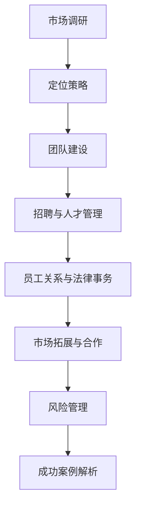

                 

# 跨国人力资源顾问的创业挑战：为跨国企业提供人力资源服务

> **关键词：跨国人力资源，创业挑战，市场调研，团队建设，风险管理，成功案例**

> **摘要：本文将探讨跨国人力资源顾问在创业过程中的各种挑战，包括市场调研、团队建设、业务运营和风险管理等方面。通过分析成功案例，为创业者提供有价值的参考和策略。**

## 目录大纲

1. **引言与背景**
   1.1 跨国人力资源服务的市场现状
   1.2 创业的法律与政策环境

2. **创业准备**
   2.1 市场调研方法
   2.2 企业定位策略

3. **业务运营**
   3.1 组织结构与团队建设
   3.2 跨国团队协作

4. **关键业务领域**
   4.1 招聘与人才管理
   4.2 员工关系与法律事务

5. **战略管理**
   5.1 国际市场拓展策略
   5.2 合作伙伴关系管理

6. **风险管理**
   6.1 风险识别与评估
   6.2 风险管理策略

7. **案例研究**
   7.1 国际知名企业人力资源管理优化
   7.2 初创企业在国际市场的人才战略

8. **附录**
   8.1 常用人力资源软件与工具介绍
   8.2 跨国人力资源顾问实用技巧总结

## 核心概念与联系

### 跨国人力资源顾问

**流程图：**



---

## 核心算法原理讲解

### 招聘算法

**伪代码：**

```python
def recruit_match(candidate_skills, job_requirements):
    match_score = 0
    
    for skill in candidate_skills:
        if skill in job_requirements:
            match_score += 1
    
    return match_score
```

---

## 数学模型和数学公式 & 详细讲解 & 举例说明

### 薪酬优化模型

**数学公式：**

$$
C = \frac{a}{1 + e^{-(b \cdot X)}}
$$

其中，$C$ 为薪酬，$a$ 和 $b$ 为参数，$X$ 为绩效指标。

**详细讲解：**
该模型基于绩效指标来计算薪酬，通过指数函数来调节薪酬与绩效之间的关系。当绩效指标越高时，薪酬增长的速度会逐渐减缓，从而实现薪酬与绩效的合理匹配。

**举例说明：**

假设 $a = 10000$，$b = 0.05$，$X = 80$ 时，

$$
C = \frac{10000}{1 + e^{-(0.05 \cdot 80)}} \approx 10351.73
$$

此时，绩效指标为80的员工薪酬约为10351.73元。

---

## 项目实战

### 案例一：国际人力资源顾问项目实施

**开发环境搭建：**
- 使用 AWS 云服务平台
- 部署基于 Docker 的 HRM 应用
- 使用 Kubernetes 进行容器编排

**源代码实现：**

```python
# Python 代码：招聘匹配算法实现
def recruit_match(candidate_skills, job_requirements):
    match_score = 0
    
    for skill in candidate_skills:
        if skill in job_requirements:
            match_score += 1
    
    return match_score
```

**代码解读与分析：**
该代码定义了一个函数 `recruit_match`，用于计算候选人的技能与职位要求之间的匹配度。通过遍历候选人的技能列表，检查每个技能是否在职位要求中，以计算匹配分数。

**案例分析：**

在一次招聘中，某职位要求具备“Python”、“数据库”和“项目管理”三个技能，候选人具备“Python”、“数据库”和“敏捷开发”三个技能。使用 `recruit_match` 函数计算得分如下：

```python
candidate_skills = ["Python", "数据库", "敏捷开发"]
job_requirements = ["Python", "数据库", "项目管理"]

match_score = recruit_match(candidate_skills, job_requirements)
print("匹配分数：", match_score)
```

输出匹配分数为3，表示候选人的技能与职位要求高度匹配。

---

## 总结

跨国人力资源顾问的创业挑战是一项复杂的任务，需要深入的市场调研、准确的定位策略、高效的团队建设和完善的风险管理。通过本文的探讨，我们希望能够为创业者提供一些实用的方法和思路，助力他们在国际市场上取得成功。

### 作者

**作者：AI天才研究院/AI Genius Institute & 禅与计算机程序设计艺术 /Zen And The Art of Computer Programming**

---

至此，本文已经完成了对跨国人力资源顾问创业挑战的全面探讨，包括市场调研、团队建设、业务运营和风险管理等方面。希望本文能够为创业者提供有价值的参考和启示。在未来的创业道路上，愿每位创业者都能坚定信念，勇往直前，开创属于自己的一片天地。

### 第一部分：引言与背景

#### 第1章：行业背景与创业挑战概述

在全球化的推动下，跨国企业越来越多地寻求在全球范围内进行业务拓展。这一趋势不仅带来了新的机遇，同时也伴随着一系列人力资源服务的挑战。跨国人力资源顾问在这种背景下应运而生，他们为跨国企业提供了包括招聘、人才管理、员工关系、合规咨询等一系列专业服务。

#### 1.1 跨国人力资源服务的市场现状

跨国人力资源服务的市场现状呈现出以下几个特点：

1. **市场需求增长**：随着跨国企业数量的增加，对跨国人力资源服务的需求也在不断增长。特别是在高科技、金融和制造等领域，跨国人力资源服务的需求尤为突出。
2. **服务多元化**：跨国人力资源服务已不再局限于传统的招聘和薪酬福利管理，还包括员工关系、绩效评估、领导力发展、国际派遣管理等多个方面。
3. **竞争激烈**：由于跨国人力资源服务的市场需求旺盛，行业内竞争日益激烈。各大人力资源服务公司都在不断拓展服务范围，提升服务质量，以争夺市场份额。
4. **技术驱动**：随着人工智能、大数据、云计算等技术的快速发展，跨国人力资源服务也在不断数字化、智能化。这为跨国人力资源顾问提供了新的工具和方法，同时也提出了更高的要求。

#### 1.2 跨国人力资源服务的需求分析

跨国企业在拓展全球业务时，通常面临以下几类人力资源需求：

1. **招聘需求**：跨国企业需要在全球范围内招聘具备特定技能和经验的专业人才，以支持其业务发展。这要求跨国人力资源顾问能够利用各种招聘渠道，如在线招聘平台、行业招聘会、社交媒体等，高效地吸引和筛选人才。
2. **人才管理需求**：跨国企业需要建立一套科学的人才管理体系，包括培训发展、绩效评估、职业规划等，以激发员工的潜力，提高员工满意度和生产力。跨国人力资源顾问在这一领域需要具备丰富的经验和专业的知识。
3. **员工关系需求**：跨国企业在全球不同地区运营，需要处理各种员工关系问题，如劳动争议、文化冲突、合规性问题等。跨国人力资源顾问需要具备跨文化沟通能力，能够妥善处理各类员工关系问题，维护企业的稳定运营。
4. **合规性需求**：跨国企业在全球运营需要遵守各地的法律法规，包括劳动法、税法、反腐败法等。跨国人力资源顾问需要深入了解不同国家和地区的法律法规，帮助企业规避法律风险，确保合规运营。

#### 1.3 竞争态势与市场机会

在跨国人力资源服务市场中，竞争态势激烈，但同时也存在许多市场机会：

1. **技术创新**：随着人工智能、大数据等技术的应用，跨国人力资源顾问可以通过数据分析、自动化工具等手段提升服务效率和质量，打造差异化竞争优势。
2. **行业细分**：不同行业对人力资源服务的需求存在较大差异。专注于特定行业的跨国人力资源顾问可以通过深入了解行业特点和需求，提供更为专业的服务，满足客户的需求。
3. **新兴市场**：随着全球经济的不断发展和新兴市场的崛起，跨国人力资源顾问可以将业务拓展到这些潜力巨大的市场，开拓新的业务增长点。
4. **供应链整合**：跨国人力资源顾问可以通过整合供应链服务，提供从招聘、培训、薪酬管理到员工福利等全方位的人力资源解决方案，为客户提供一站式服务。

#### 1.4 创业的法律与政策环境

跨国人力资源顾问在创业过程中，需要关注以下法律与政策环境：

1. **国际劳动法**：跨国人力资源顾问需要熟悉国际劳动法，了解不同国家和地区在劳动法方面的规定，确保服务的合规性。
2. **当地法律法规**：不同国家和地区的法律法规存在差异，跨国人力资源顾问需要深入了解目标市场的法律环境，以规避法律风险。
3. **税收政策**：跨国人力资源顾问需要了解目标市场的税收政策，合理规划税务事务，降低企业税负。
4. **政府支持政策**：一些国家和地区为鼓励创业和创新，提供了一系列支持政策，如税收减免、资金补贴、人才引进等。跨国人力资源顾问可以充分利用这些政策，降低创业成本，提高市场竞争力。

#### 1.5 风险与合规管理

跨国人力资源顾问在创业过程中，需要关注以下风险和合规管理问题：

1. **法律风险**：跨国人力资源顾问需要遵守各地的法律法规，避免因违法行为导致的法律纠纷和处罚。
2. **合规风险**：跨国人力资源顾问需要确保服务的合规性，包括遵守劳动法、税法、反腐败法等。
3. **数据隐私风险**：跨国人力资源顾问需要保护客户的个人信息和隐私，遵守数据保护法规，确保信息安全。
4. **声誉风险**：跨国人力资源顾问需要注重品牌形象和声誉管理，确保服务的质量和信誉。

通过以上分析，可以看出，跨国人力资源顾问在创业过程中面临着复杂的市场环境、法律和政策环境，以及各类风险和合规管理问题。然而，随着全球化进程的不断推进，跨国人力资源服务的市场需求持续增长，为创业者提供了广阔的发展空间。在充分了解行业背景和市场需求的基础上，创业者可以通过科学的市场调研、准确的定位策略和高效的团队建设，把握市场机遇，实现创业目标。

### 第二部分：创业准备

#### 第2章：市场调研与定位

**2.1 市场调研方法**

市场调研是创业过程中至关重要的一环，通过全面、深入的市场调研，可以为企业提供准确的市场信息，帮助创业者做出科学决策。以下是一些常用的市场调研方法：

1. **定量调研**：定量调研通过统计调查的方法，收集大量的数据，以便进行数据分析。这种方法通常采用问卷调查、电话访谈、在线调查等方式进行。定量调研的优势在于可以获得大样本数据，提高调研结果的代表性和可信度。例如，可以通过问卷调查了解潜在客户的满意度、产品需求、价格敏感度等。

   **具体步骤**：
   - 设计问卷：根据调研目的，设计包含相关问题的问卷。
   - 分发问卷：通过在线平台、社交媒体、电子邮件等方式分发问卷。
   - 数据收集与处理：收集问卷数据，进行数据清洗和整理。
   - 数据分析：使用统计软件对问卷结果进行分析，提取有用的信息。

2. **定性调研**：定性调研侧重于对消费者行为、需求、动机等方面的深入了解。这种方法通常采用深度访谈、小组讨论、焦点小组讨论等方式进行。定性调研的优势在于可以深入了解消费者的真实需求和想法，发现潜在的市场机会。

   **具体步骤**：
   - 确定访谈对象：根据调研目的，选择合适的访谈对象。
   - 设计访谈提纲：准备包含关键问题的访谈提纲。
   - 进行访谈：与访谈对象进行面对面的交流，获取相关信息。
   - 数据整理与分析：整理访谈记录，提炼关键信息。

**2.2 竞争对手分析**

了解竞争对手是市场调研的重要组成部分，通过对竞争对手的分析，可以为企业提供宝贵的市场情报，帮助企业制定有效的竞争策略。以下是一些常用的竞争对手分析工具和方法：

1. **SWOT分析**：SWOT分析是一种常用的战略规划工具，用于分析企业的优势（Strengths）、劣势（Weaknesses）、机会（Opportunities）和威胁（Threats）。通过SWOT分析，企业可以全面了解自身的竞争地位，制定相应的策略。

   **具体步骤**：
   - 识别企业的优势与劣势：分析企业在资源、能力、市场地位等方面的优势与劣势。
   - 识别外部机会与威胁：分析市场趋势、竞争对手行为等外部因素带来的机会与威胁。
   - 制定策略：根据SWOT分析的结果，制定相应的策略。

2. **五力模型**：五力模型是由迈克尔·波特提出的一种分析行业竞争力的工具，包括供应商的议价能力、买家的议价能力、新进入者的威胁、替代品的威胁和行业内的竞争程度。

   **具体步骤**：
   - 分析供应商的议价能力：考虑供应商的数量、市场集中度、替代品的存在等。
   - 分析买家的议价能力：考虑买家的数量、购买规模、替代品的存在等。
   - 分析新进入者的威胁：考虑行业的进入壁垒、市场规模、利润水平等。
   - 分析替代品的威胁：考虑替代品的市场需求、性能、价格等。
   - 分析行业内的竞争程度：考虑行业内的竞争者数量、市场份额分布、产品差异化等。

3. **关键成功因素分析**：关键成功因素分析是一种识别企业在特定市场环境下成功所需的关键因素的方法。通过分析关键成功因素，企业可以确定自身在市场上的竞争优势。

   **具体步骤**：
   - 识别行业的关键成功因素：分析行业内成功企业的共同特点，确定关键成功因素。
   - 评估自身在关键成功因素上的表现：分析企业在关键成功因素上的优势和劣势。
   - 制定改进措施：根据评估结果，制定相应的改进措施，提升企业在关键成功因素上的竞争力。

**2.3 客户需求分析**

了解客户需求是创业成功的关键，通过深入分析客户需求，企业可以制定出符合市场需求的产品和服务策略。以下是一些常用的客户需求分析方法：

1. **市场细分**：市场细分是将整个市场划分为若干个具有相似需求和购买行为的子市场。通过市场细分，企业可以更准确地识别目标客户群体，有针对性地制定营销策略。

   **具体步骤**：
   - 识别潜在客户：分析现有客户和市场数据，识别潜在的客户群体。
   - 划分市场细分：根据客户特征、需求、购买行为等，将市场划分为若干个子市场。
   - 选择目标市场：根据企业的资源、能力和市场机会，选择具有潜力的目标市场。
   - 设计市场营销策略：根据目标市场的特点，设计符合市场需求的产品和服务策略。

2. **客户访谈**：客户访谈是一种直接获取客户需求的方法，通过与客户的面对面交流，深入了解客户的真实需求和想法。

   **具体步骤**：
   - 确定访谈对象：根据市场细分的结果，选择具有代表性的客户进行访谈。
   - 设计访谈提纲：准备包含关键问题的访谈提纲。
   - 进行访谈：与客户进行面对面的交流，获取相关信息。
   - 数据整理与分析：整理访谈记录，提炼关键信息。

3. **用户调研**：用户调研是一种通过收集用户反馈，了解用户需求的方法。可以通过在线调研、用户满意度调查等方式，获取用户对产品和服务质量的评价。

   **具体步骤**：
   - 设计调研问卷：根据调研目的，设计包含相关问题的调研问卷。
   - 分发问卷：通过在线平台、社交媒体、电子邮件等方式分发问卷。
   - 数据收集与处理：收集问卷数据，进行数据清洗和整理。
   - 数据分析：使用统计软件对问卷结果进行分析，提取有用的信息。

通过以上市场调研方法，企业可以全面了解市场环境、竞争对手和客户需求，为创业决策提供有力支持。在市场调研的基础上，企业可以制定出符合市场需求的产品和服务策略，提高市场竞争力，实现创业目标。

#### 2.2 企业定位策略

在了解了市场现状、竞争对手和客户需求后，企业定位策略成为创业过程中的关键环节。企业定位策略涉及到目标客户群体、品牌建设以及竞争优势分析，以下是对这些方面的详细讨论。

**2.2.1 目标客户群体**

明确目标客户群体是制定企业定位策略的首要步骤。目标客户群体是企业服务的核心对象，决定了企业的产品或服务设计和市场营销策略。以下几种方法可以帮助企业确定目标客户群体：

1. **人口统计方法**：根据客户的年龄、性别、收入、教育背景等人口统计数据，将市场划分为不同的群体。这种方法适用于消费品市场，特别是针对大众市场的产品。

2. **行为方法**：根据客户的行为特征，如购买习惯、消费偏好、使用习惯等，将市场划分为不同的群体。这种方法适用于对消费者行为有深入理解的产品和服务。

3. **心理方法**：根据客户的心理特征，如价值观、生活态度、兴趣爱好等，将市场划分为不同的群体。这种方法适用于高端市场，特别是针对特定生活方式的产品和服务。

4. **多维度方法**：结合以上多种方法，从多个角度分析客户特征，确定目标客户群体。这种方法适用于复杂多变的市场环境，能够更准确地识别潜在客户。

**2.2.2 品牌建设**

品牌是企业形象和市场定位的重要组成部分。一个强大的品牌能够提高企业的市场认知度和消费者忠诚度，从而增强企业的竞争力。以下几种策略可以帮助企业进行品牌建设：

1. **差异化品牌策略**：通过独特的产品特点、服务体验或品牌文化，在竞争激烈的市场中塑造独特的品牌形象。这种方法适用于那些能够提供独特价值的企业。

2. **高端品牌策略**：通过高品质的产品和服务，树立高端品牌形象，吸引高端客户群体。这种方法适用于高端市场和奢侈品行业。

3. **大众品牌策略**：通过简洁、实惠的产品设计，吸引大众市场客户。这种方法适用于大众消费品市场。

4. **多品牌策略**：企业可以根据不同的市场细分和客户需求，推出多个品牌，满足不同客户群体的需求。这种方法适用于多元化经营的企业。

**2.2.3 竞争优势分析**

竞争优势是企业相对于竞争对手的优势条件，是企业在市场上脱颖而出的关键。以下几种方法可以帮助企业分析竞争优势：

1. **成本优势**：通过降低成本，提供具有竞争力的价格，吸引价格敏感的客户。这种方法适用于低成本制造行业。

2. **技术优势**：通过技术创新，提供独特的产品或服务，满足客户的需求。这种方法适用于高科技行业。

3. **服务优势**：通过提供优质的客户服务，提升客户满意度和忠诚度。这种方法适用于服务行业。

4. **品牌优势**：通过强大的品牌影响力和市场认知度，提升企业的市场份额和竞争力。这种方法适用于所有行业。

**2.2.4 制定企业定位策略**

在明确目标客户群体、品牌建设和竞争优势的基础上，企业可以制定具体的定位策略：

1. **明确品牌定位**：根据目标客户群体的需求和企业的竞争优势，明确品牌的核心价值和特色。

2. **设计品牌形象**：通过品牌名称、标志、宣传口号等视觉元素，设计具有吸引力的品牌形象。

3. **制定营销策略**：根据品牌定位和目标客户群体的特征，制定相应的营销策略，如广告、促销、公关活动等。

4. **持续优化定位策略**：随着市场环境和竞争态势的变化，企业需要不断调整和优化定位策略，以保持竞争优势。

通过科学的市场调研和准确的定位策略，企业可以明确自身在市场中的定位，提供符合客户需求的产品和服务，实现创业目标。在竞争激烈的市场环境中，一个清晰、准确的企业定位策略是企业成功的关键。

### 第三部分：业务运营

#### 第3章：组织结构与团队建设

在跨国人力资源顾问的创业过程中，组织结构设计和团队建设是确保业务顺利运营和发展的关键环节。一个高效的组织结构和一支专业的团队不仅能够提高工作效率，还能增强企业的核心竞争力。

**3.1 跨国人力资源顾问的团队构成**

跨国人力资源顾问的团队构成主要包括以下几个关键角色：

1. **管理层**：管理层负责制定企业战略、管理团队和资源，确保企业目标的实现。管理层通常包括CEO、COO、CFO等高级管理人员。

2. **专业顾问**：专业顾问是团队的核心，负责为客户提供专业的人力资源咨询服务。他们通常具备丰富的行业经验和专业知识，能够处理各种复杂的人力资源问题。

3. **招聘专家**：招聘专家负责企业的人才招聘工作，包括职位发布、简历筛选、面试安排等。他们需要熟悉各种招聘渠道和招聘策略，能够高效地吸引和筛选人才。

4. **培训与发展专家**：培训与发展专家负责员工的培训和发展工作，包括制定培训计划、实施培训课程、跟踪培训效果等。他们需要了解不同岗位的技能需求，设计针对性的培训方案。

5. **员工关系专员**：员工关系专员负责处理员工关系问题，包括劳动合同管理、员工福利、劳动争议等。他们需要具备良好的沟通能力和法律知识，能够妥善处理各种员工关系问题。

6. **数据分析专员**：数据分析专员负责收集、分析和解读人力资源数据，为企业决策提供数据支持。他们需要熟练掌握数据分析工具和方法，能够从数据中发现问题和机会。

**3.2 管理层职责**

管理层在团队中扮演着关键的决策和协调角色，其职责主要包括：

1. **制定企业战略**：根据企业的愿景和目标，制定具体的战略规划，明确企业的发展方向和目标。

2. **管理团队和资源**：负责团队的组织和协调工作，确保团队成员能够高效协同，共同实现企业目标。

3. **决策与风险控制**：在业务运营过程中，管理层需要做出各种决策，并确保风险得到有效控制。

4. **沟通与协调**：确保团队内部和团队之间的沟通顺畅，促进信息的有效传递和协调。

5. **绩效管理**：制定绩效评估体系，对团队成员的工作绩效进行评估，并提供必要的激励和支持。

**3.3 专业顾问的角色**

专业顾问在团队中承担着核心咨询角色，其职责主要包括：

1. **提供专业咨询**：根据客户的需求，提供定制化的人力资源咨询服务，包括招聘、培训、员工关系等。

2. **解决方案设计**：针对客户的问题，设计合理的解决方案，并协助客户实施。

3. **项目执行管理**：负责项目的执行和管理，确保项目按时、按质、按量完成。

4. **客户关系维护**：与客户建立长期的合作关系，提供持续的支持和服务，提升客户满意度。

**3.4 支持团队的作用**

支持团队在跨国人力资源顾问的运营中发挥着不可或缺的作用，其主要职责包括：

1. **行政支持**：负责日常行政事务的处理，如文件管理、会议安排、后勤服务等。

2. **技术支持**：提供信息技术支持，包括信息系统维护、数据分析工具开发等。

3. **财务管理**：负责企业的财务管理工作，包括预算编制、成本控制、财务报告等。

4. **法务支持**：提供法律咨询和合规支持，确保企业的运营符合相关法律法规。

**3.5 团队协作与沟通**

高效的团队协作和沟通是跨国人力资源顾问成功运营的关键。以下是一些促进团队协作和沟通的建议：

1. **建立明确的沟通渠道**：确保团队成员之间的沟通渠道畅通，包括定期的团队会议、项目进展报告等。

2. **共享信息资源**：建立共享的信息平台，如内部知识库、项目管理系统等，方便团队成员获取所需信息。

3. **培养团队文化**：通过团队建设活动、员工培训等，培养团队成员的共同价值观和团队精神。

4. **鼓励反馈与建议**：建立开放的反馈机制，鼓励团队成员提出建议和意见，共同改进团队工作。

5. **跨文化沟通**：在跨国团队中，注重跨文化沟通技巧，尊重不同文化的差异，促进团队成员之间的理解和协作。

通过科学合理的组织结构设计和高效的团队协作，跨国人力资源顾问能够更好地应对市场挑战，提供高质量的人力资源服务，实现企业的长期发展目标。

#### 第3章：跨国团队协作

在跨国人力资源顾问的运营中，跨国团队协作是一个关键且复杂的环节。跨国团队由来自不同国家、拥有不同文化背景和专业技能的成员组成，如何有效管理这些团队以确保高效协作和顺畅沟通，是创业成功的关键因素之一。

**3.1 跨文化沟通技巧**

跨文化沟通涉及到语言、行为模式、价值观念等多个方面，以下是一些关键的跨文化沟通技巧：

1. **了解文化差异**：首先，团队成员需要了解彼此的文化背景，包括文化价值观、沟通习惯和礼仪。这有助于避免误解和冲突。例如，一些文化更注重直接和坦率的沟通，而另一些文化则更倾向于间接和委婉的沟通。

2. **尊重多样性**：尊重团队成员的不同文化背景和观点是建立和谐团队关系的基础。鼓励团队成员分享他们的文化故事和经验，增进相互理解和尊重。

3. **学习语言**：在跨国团队中，学习基本的团队成员语言是必要的。这不仅可以提高沟通效率，还能显示对团队成员文化的尊重。对于非母语者，可以通过语言课程或语言交流平台来提升语言能力。

4. **建立共同目标**：明确团队的共同目标可以帮助团队成员团结一致，减少文化差异带来的冲突。通过共同的目标，团队成员可以更好地协调各自的工作。

**3.2 远程协作工具介绍**

在跨国团队协作中，选择合适的远程协作工具是确保工作效率的关键。以下是一些常用的远程协作工具：

1. **项目管理工具**：如Trello、Asana和Jira，这些工具可以帮助团队成员跟踪项目进度、分配任务和协作完成任务。

2. **视频会议工具**：如Zoom、Microsoft Teams和Google Meet，这些工具支持实时视频会议，帮助团队成员进行远程沟通和协作。

3. **文件共享和协作平台**：如Google Drive、Dropbox和OneDrive，这些工具提供云存储和文件共享功能，方便团队成员访问和编辑文件。

4. **即时通讯工具**：如Slack、WhatsApp和Telegram，这些工具支持实时消息传递和文件分享，帮助团队成员快速沟通和协作。

**3.3 时区管理策略**

时区差异是跨国团队协作中常见且具挑战性的问题。以下是一些有效的时区管理策略：

1. **轮流工作**：根据团队成员的时区，安排轮流工作时间，确保项目在不同时间都有人负责。

2. **设定固定会议时间**：尽量选择一个对大多数团队成员都合适的时间进行定期会议，并提前通知所有参与者。

3. **使用协作日程工具**：如Doodle和WhenIsGood，这些工具可以帮助团队成员找到共同空闲时间，方便安排会议和协作任务。

4. **灵活调整工作时间**：允许团队成员在某些情况下灵活调整工作时间，以适应时区差异，同时确保项目进度不受影响。

通过运用以上跨文化沟通技巧、远程协作工具和时区管理策略，跨国人力资源顾问可以有效管理跨国团队，确保团队协作的高效性和顺畅性，从而在激烈的市场竞争中取得优势。

### 第四部分：关键业务领域

#### 第4章：招聘与人才管理

招聘和人才管理是跨国人力资源顾问业务的核心领域，对于企业的长期发展和竞争优势至关重要。在这一章节中，我们将深入探讨跨国人力资源顾问在招聘和人才管理方面的策略和实践。

**4.1 招聘策略**

成功的招聘策略需要结合市场现状、企业需求和招聘渠道的优化。以下是几个关键步骤：

1. **明确招聘需求**：在启动招聘流程之前，明确招聘的需求，包括职位要求、技能要求、工作经验等。这有助于确保招聘到合适的人才。

2. **制定招聘计划**：根据招聘需求，制定详细的招聘计划，包括招聘时间表、招聘预算、招聘渠道等。招聘计划有助于确保招聘流程的有序进行。

3. **选择合适的招聘渠道**：选择合适的招聘渠道是成功招聘的关键。常见的招聘渠道包括在线招聘平台（如LinkedIn、Indeed）、社交媒体（如Facebook、Twitter）、行业招聘会和专业猎头公司。在选择招聘渠道时，应考虑目标岗位的市场需求和候选人的分布情况。

4. **优化招聘流程**：优化招聘流程可以提高招聘效率，减少时间和成本。招聘流程应包括职位发布、简历筛选、初步面试、深度面试、背景调查和录用通知等环节。每个环节都应该尽量简化，同时确保公平、透明。

5. **品牌宣传**：提升企业品牌形象，吸引优质候选人。通过在社交媒体、行业论坛和招聘平台上发布积极的企业文化和成功案例，增强企业的吸引力。

**4.2 筛选与面试技巧**

筛选和面试是招聘流程中的关键环节，以下是一些实用的技巧：

1. **简历筛选**：简历筛选应关注候选人的教育背景、工作经验、技能和成就。使用关键词搜索和筛选工具可以提高筛选效率。

2. **初步面试**：初步面试主要通过电话或视频会议进行，目的是了解候选人的基本背景、沟通能力和职业目标。面试过程中，可以提出一些开放性问题，以观察候选人的思维方式和问题解决能力。

3. **深度面试**：深度面试通常由企业内部专业人员或人力资源顾问进行，旨在评估候选人的专业技能、团队合作能力、领导潜力等。深度面试应设计结构化的提问，确保评估的全面性和一致性。

4. **行为面试**：行为面试通过询问候选人过去的行为和经验，来预测其未来在工作中的表现。例如，询问候选人在过去的项目中如何解决一个特定的难题。

5. **情境面试**：情境面试通过设定一个具体的情境，要求候选人提出解决方案或回答相关问题，以评估其应对压力和复杂情况的能力。

**4.3 薪酬福利设计**

合理的薪酬福利设计能够吸引和留住优秀人才，以下是几个关键点：

1. **市场竞争力**：确保薪酬水平具有市场竞争力，特别是对于稀缺和高需求的专业人才。

2. **差异化薪酬**：根据岗位的重要性、技能水平和绩效表现，设定差异化的薪酬水平。

3. **激励机制**：设计绩效奖金、股权激励等激励机制，鼓励员工提高工作效率和业绩。

4. **福利组合**：提供全面的福利组合，包括医疗保险、退休金计划、带薪休假、员工培训等，以提升员工的满意度和忠诚度。

**4.4 人才发展**

人才发展是确保企业长期竞争优势的关键，以下是一些关键策略：

1. **培训与发展计划**：制定系统的培训与发展计划，包括入职培训、在职培训、晋升培训等，提高员工的技能和素质。

2. **职业发展规划**：为员工提供明确的职业发展规划，帮助员工制定个人发展目标，并提供相应的支持和资源。

3. **领导力发展**：培养员工的领导力，特别是中高层管理者的领导力，以提升企业的管理水平和运营效率。

4. **内部晋升机制**：建立内部晋升机制，为员工提供发展机会，激发员工的积极性和创造力。

通过科学、系统的招聘和人才管理策略，跨国人力资源顾问能够吸引和留住优秀人才，为企业的长期发展提供有力支持。有效的招聘和人才管理不仅能够提升企业的竞争力，还能够为员工提供良好的职业发展机会，实现企业和员工的共同成长。

#### 第5章：员工关系与法律事务

在跨国人力资源顾问的业务运营中，员工关系和法律事务处理是确保企业运营稳定、合规的关键领域。有效的员工关系管理不仅有助于提升员工的满意度和工作效率，还能为企业创造积极的工作氛围。而法律事务处理则涉及跨国人力资源顾问在多个国家和地区运营时需要遵守的法律法规，以下是对这两个方面的详细探讨。

**5.1 员工关系管理**

员工关系管理是指企业通过一系列政策和措施，维护员工与企业之间的关系，确保员工的合法权益得到保障，同时促进企业稳定发展。以下是几个关键方面：

1. **劳动合同管理**：劳动合同是维护员工与企业之间关系的基础。跨国人力资源顾问需要确保所有劳动合同的合法性，包括合同内容的完整性、合同的签订和续约流程等。此外，还需要定期审查劳动合同，以适应法律法规的变化。

2. **员工福利管理**：跨国企业通常需要为员工提供多样化的福利，如医疗保险、退休金计划、带薪休假等。有效的福利管理能够提高员工的满意度和忠诚度。跨国人力资源顾问需要确保福利计划的合理性和公平性，同时根据不同国家和地区的法律法规进行适当调整。

3. **员工沟通**：良好的沟通是维护员工关系的关键。跨国人力资源顾问应建立有效的沟通机制，包括定期员工会议、员工满意度调查、意见反馈渠道等，确保员工的声音能够被听到，并及时解决员工的问题和困扰。

4. **员工参与**：鼓励员工参与企业决策和管理，能够增强员工的归属感和责任感。跨国人力资源顾问可以通过员工代表会议、员工委员会等形式，让员工参与到企业的重大决策中来。

5. **劳动争议处理**：劳动争议处理是员工关系管理中常见的问题。跨国人力资源顾问需要建立完善的争议处理机制，包括内部调解、仲裁和法律诉讼等。在处理劳动争议时，应遵循公正、公平、公开的原则，确保争议得到妥善解决。

**5.2 法律事务处理**

跨国人力资源顾问在处理法律事务时，需要关注多个国家和地区的法律法规，以避免法律风险和合规问题。以下是几个关键方面：

1. **国际劳动法解读**：国际劳动法涉及多个领域的法律法规，如劳动标准、劳动权益、劳动安全等。跨国人力资源顾问需要熟悉不同国家和地区的劳动法规定，确保企业的运营符合相关法律法规。

2. **涉外劳动合同法规**：跨国人力资源顾问在处理涉外劳动合同时，需要遵守不同国家和地区的劳动合同法规。例如，有些国家要求涉外劳动合同必须以当地语言书写，并且需要经过当地劳动部门登记。

3. **知识产权保护**：跨国企业在运营过程中，可能会涉及知识产权的保护问题。跨国人力资源顾问需要了解不同国家和地区的知识产权法律法规，确保企业的知识产权得到有效保护。

4. **数据隐私保护**：随着信息技术的发展，数据隐私保护成为跨国人力资源顾问需要关注的重要问题。跨国人力资源顾问需要遵守不同国家和地区的数据保护法律法规，确保员工的个人信息得到安全保护。

5. **法律合规咨询**：跨国人力资源顾问可以提供法律合规咨询服务，帮助企业应对不同国家和地区的法律风险。这包括法律咨询、合规审查、法律培训等。

**5.3 工会与员工参与**

在跨国运营中，工会和员工参与也是需要关注的重要方面。以下是一些策略：

1. **工会关系管理**：在工会活跃的国家和地区，跨国人力资源顾问需要与工会建立良好的关系，确保员工的合法权益得到维护。

2. **员工参与机制**：建立员工参与机制，鼓励员工参与企业的决策和管理，提高员工的积极性和满意度。

3. **工会咨询**：在一些国家和地区，法律规定企业必须与工会进行协商。跨国人力资源顾问应确保企业遵守相关法律规定，并积极参与工会协商。

通过有效的员工关系管理和法律事务处理，跨国人力资源顾问能够确保企业的稳定运营和合规性，同时提升员工的满意度和工作效率。有效的员工关系和法律事务管理不仅有助于企业的长期发展，还能为跨国人力资源顾问在激烈的市场竞争中提供有力的支持。

### 第五部分：战略管理

#### 第6章：市场拓展与国际合作

在国际化的浪潮中，跨国人力资源顾问的市场拓展和国际合作成为其战略管理的核心。如何有效地拓展国际市场，建立和维护合作伙伴关系，是决定企业成功与否的关键因素。以下将详细探讨跨国人力资源顾问在国际市场拓展和国际合作方面的策略。

**6.1 国际市场拓展策略**

国际市场拓展是跨国人力资源顾问实现全球业务增长的重要途径。以下是一些关键策略：

1. **市场选择**：选择合适的国际市场进行拓展，需要综合考虑目标市场的经济发展水平、市场规模、政策环境、文化差异等因素。例如，可以选择经济发达、市场需求旺盛的国家和地区，如美国、欧洲和亚太地区的部分国家。

2. **市场调研**：在确定目标市场后，进行深入的市场调研，了解目标市场的法律法规、市场竞争态势、客户需求等。市场调研可以通过实地考察、问卷调查、行业分析报告等方式进行，以确保对目标市场的全面了解。

3. **本地化策略**：针对不同国家和地区的文化、法律、商业习惯等差异，制定本地化策略，包括调整服务内容、优化沟通方式、适应当地市场规则等。本地化策略有助于跨国人力资源顾问在目标市场建立良好的品牌形象和客户信任。

4. **合作伙伴关系**：寻找合适的本地合作伙伴，通过合资、合作等方式，共同开拓市场。本地合作伙伴能够提供市场资源、渠道和客户资源，有助于快速进入和适应目标市场。

5. **市场进入模式**：根据目标市场的特点和自身资源，选择合适的市场进入模式，如直接投资、并购、合资、合作代理等。不同的市场进入模式具有不同的优劣势，需要根据实际情况进行选择。

**6.2 国际合作模式**

国际合作是跨国人力资源顾问拓展全球业务的重要手段。以下是一些常见的国际合作模式：

1. **战略联盟**：通过与其他企业、研究机构、行业协会等建立战略联盟，共同开展项目研究、市场拓展等活动。战略联盟有助于资源共享、优势互补，提高合作各方的竞争力。

2. **技术合作**：跨国人力资源顾问可以通过与技术公司、软件供应商等合作，共同开发新技术、新产品，提升服务质量和创新能力。

3. **人才交流**：通过人才交流项目，吸引和培养国际人才，提升团队的国际竞争力。人才交流可以包括短期访问、长期留学、国际培训等。

4. **跨国并购**：通过跨国并购，迅速扩大业务规模，获取市场资源和客户资源。跨国并购需要充分考虑目标公司的财务状况、业务模式、文化差异等因素，以确保并购成功。

5. **国际合作项目**：参与国际组织和项目，如联合国、世界银行等，通过国际合作项目，提升企业的国际声誉和影响力。

**6.3 市场进入策略**

在制定市场进入策略时，需要综合考虑目标市场的环境、资源和自身能力。以下是一些常用的市场进入策略：

1. **市场渗透策略**：通过提供高质量的服务和优惠的价格，吸引现有市场的客户，增加市场份额。

2. **市场开发策略**：通过开拓新的市场区域，扩大业务范围，寻找新的增长点。

3. **市场多元化策略**：通过提供多样化的服务，满足不同市场客户的需求，提高市场竞争力。

4. **市场聚焦策略**：专注于某一细分市场，提供专业化的服务，成为该领域的专家。

5. **市场混合策略**：结合多种市场进入策略，根据不同市场的特点和需求，制定个性化的市场进入方案。

通过科学、系统的市场拓展策略和国际合作模式，跨国人力资源顾问可以成功地进入国际市场，实现全球业务增长。有效的市场拓展和国际合作不仅能够提升企业的市场竞争力，还能为企业带来新的发展机遇和增长空间。

### 第六部分：风险管理

#### 第7章：风险管理与企业合规

在国际化的背景下，跨国人力资源顾问面临复杂多变的市场环境和法律风险。有效的风险管理和企业合规是确保企业稳定运营和可持续发展的重要保障。以下将详细探讨跨国人力资源顾问在风险管理与企业合规方面的策略和方法。

**7.1 风险识别与评估**

风险管理首先需要识别和评估潜在的风险。以下是几种常用的风险识别与评估方法：

1. **风险识别**：通过文献调研、专家访谈、历史数据分析等方式，识别企业可能面临的风险。常见的风险包括市场风险、财务风险、法律风险、运营风险等。

2. **风险评估**：对识别出的风险进行评估，确定其发生概率和潜在影响。常用的风险评估方法包括定性评估和定量评估。定性评估通过专家判断和经验分析，定量评估则使用数学模型和统计工具。

3. **风险矩阵**：使用风险矩阵对风险进行分类和优先级排序。风险矩阵通常包括风险发生的概率和潜在影响两个维度，通过这两个维度的交叉分析，确定风险的优先级。

**7.2 风险管理策略**

在识别和评估风险后，需要制定相应的风险管理策略。以下是几种常用的风险管理策略：

1. **风险规避**：通过避免参与高风险业务或项目，降低风险发生的概率。例如，选择风险较小的市场进入策略，避免进入政策不稳定或法律风险较高的国家。

2. **风险减轻**：通过采取预防措施，降低风险发生的概率或减小潜在影响。例如，建立完善的法律合规体系，确保企业运营符合各国法律法规；引入先进的风险管理工具和技术，提高企业的风险管理能力。

3. **风险转移**：通过购买保险、签订合同等方式，将部分风险转移给第三方。例如，购买商业保险，转移市场风险和运营风险；在合同中设置风险转移条款，将风险分摊给客户或合作伙伴。

4. **风险接受**：对于无法规避或转移的风险，企业可以选择接受风险，并制定应急预案。例如，对于不可避免的法律风险，制定应对方案，确保在风险发生时能够迅速采取行动。

**7.3 风险管理策略的实施**

风险管理策略的有效实施是确保企业能够应对各种风险的关键。以下是几个实施要点：

1. **制定风险管理计划**：根据风险评估的结果，制定详细的风险管理计划，包括风险控制措施、应急预案、责任分工等。

2. **建立风险管理组织**：设立风险管理机构，负责风险管理的日常运作。风险管理机构应包括风险管理委员会、风险管理办公室等。

3. **培训与宣传**：对员工进行风险管理培训，提高员工的风险意识和管理能力。通过内部宣传和培训，确保员工了解企业风险管理政策和措施。

4. **监控与评估**：定期监控企业风险管理措施的实施情况，评估风险管理效果。根据监控和评估结果，及时调整风险管理策略和措施。

**7.4 企业合规管理**

企业合规管理是确保企业运营符合法律法规的重要环节。以下是几个关键方面：

1. **合规风险评估**：识别和评估企业在不同国家和地区可能面临的合规风险，如劳动法、税法、反腐败法等。

2. **合规体系建设**：建立完善的合规体系，包括合规政策、合规流程、合规培训等。合规体系应确保企业所有业务活动符合法律法规要求。

3. **合规培训与宣传**：对员工进行合规培训，提高员工的合规意识和合规操作能力。通过内部宣传和培训，确保员工了解企业合规政策和要求。

4. **合规监控与审计**：定期对企业的合规情况进行监控和审计，确保合规措施得到有效执行。对于发现的合规问题，及时采取措施进行整改。

5. **合规报告与沟通**：建立合规报告机制，定期向企业高层和外部监管机构报告合规情况。与外部监管机构和合作伙伴保持良好沟通，确保合规信息的及时传递和反馈。

通过有效的风险识别与评估、风险管理策略的实施和企业合规管理，跨国人力资源顾问可以降低风险，确保企业的稳定运营和可持续发展。有效的风险管理和企业合规管理不仅能够提升企业的竞争力，还能为企业创造长期的价值。

### 第七部分：案例研究

#### 第8章：跨国人力资源顾问成功案例解析

为了更好地理解跨国人力资源顾问在实际运营中的策略和实践，我们将通过两个成功案例来进行分析。这些案例不仅展示了跨国人力资源顾问如何应对不同的市场挑战，还揭示了其在招聘、人才管理和市场拓展方面的成功经验。

**8.1 案例一：国际知名企业人力资源管理优化**

**案例背景：**

某国际知名企业在全球范围内运营，员工人数超过10,000人，分布在多个国家和地区。随着企业业务的快速扩张，人力资源管理面临了诸多挑战，包括跨国团队协作、文化冲突、合规性等问题。为了提升人力资源管理效率，企业决定与一家跨国人力资源顾问公司合作，进行全面的人力资源管理优化。

**解决方案与实施过程：**

1. **市场调研与需求分析**：跨国人力资源顾问首先对企业的现状进行了详细的调研，包括员工满意度调查、文化评估、绩效分析等。通过调研，了解了企业在人力资源管理方面存在的问题和需求。

2. **制定优化策略**：基于调研结果，跨国人力资源顾问为企业制定了一套全面的人力资源管理优化策略，包括招聘流程优化、员工关系管理、绩效评估体系优化、文化融合等。

3. **实施招聘流程优化**：跨国人力资源顾问通过引入先进的招聘技术和工具，如人工智能招聘平台、在线评估系统等，提高了招聘效率和候选人的质量。同时，优化了招聘流程，缩短了招聘周期。

4. **员工关系管理**：跨国人力资源顾问为企业建立了全面的员工关系管理体系，包括劳动合同管理、员工福利管理、员工沟通机制等。通过定期的员工满意度调查和意见反馈渠道，及时解决员工的问题和困扰。

5. **绩效评估体系优化**：跨国人力资源顾问为企业设计了一套科学的绩效评估体系，包括KPI设定、绩效反馈、激励机制等。通过定期的绩效评估，提升了员工的积极性和工作效率。

6. **文化融合**：跨国人力资源顾问帮助企业推进文化融合项目，包括组织跨文化培训、举办文化交流活动等。通过这些措施，提升了员工的跨文化沟通能力和团队协作效果。

**案例结果与启示：**

通过跨国人力资源顾问的优化方案，企业的人力资源管理效率显著提升，员工满意度和团队协作水平也得到提高。这一成功案例表明，跨国人力资源顾问的专业服务能够帮助企业在复杂多变的环境中，实现人力资源管理的优化和提升。以下是一些启示：

- **重视市场调研与需求分析**：深入了解企业的现状和需求，是制定有效优化策略的基础。
- **引入先进技术和工具**：利用人工智能、数据分析等先进技术，提高人力资源管理效率。
- **建立全面的员工关系管理体系**：确保员工的合法权益得到保障，提升员工满意度和忠诚度。
- **推动文化融合**：促进不同国家和地区的员工相互理解和协作，提升团队整体效能。

**8.2 案例二：初创企业在国际市场的人才战略**

**案例背景：**

某初创企业计划在国际市场拓展业务，但面临着人才短缺和专业人才难以引进的困境。为了确保国际市场的成功进入，企业决定寻求一家跨国人力资源顾问公司的帮助，制定并实施一套系统的人才战略。

**解决方案与实施过程：**

1. **市场调研与定位**：跨国人力资源顾问首先对目标国际市场进行了调研，包括市场环境、竞争对手、人才需求等。通过调研，明确了企业在国际市场的人才需求和竞争优势。

2. **人才战略制定**：基于市场调研结果，跨国人力资源顾问为企业制定了一套系统的人才战略，包括招聘策略、人才引进计划、培训与发展计划等。

3. **招聘策略**：跨国人力资源顾问帮助企业优化了招聘渠道和流程，包括利用在线招聘平台、社交媒体招聘、专业猎头等，吸引全球范围内的优秀人才。同时，通过定制化的招聘方案，提高了招聘效率和候选人的质量。

4. **人才引进计划**：跨国人力资源顾问帮助企业制定了详细的人才引进计划，包括签证申请、住房安排、文化适应等。通过一系列的配套措施，确保引进的人才能够顺利融入企业并发挥其专业能力。

5. **培训与发展计划**：跨国人力资源顾问为企业设计了一套全面的培训与发展计划，包括入职培训、在职培训、领导力培训等。通过系统的培训，提升员工的技能和职业素养。

6. **激励机制**：跨国人力资源顾问帮助企业制定了具有竞争力的薪酬福利体系和激励机制，包括绩效奖金、股权激励等。通过激励机制，吸引和留住优秀人才。

**案例结果与启示：**

通过跨国人力资源顾问的帮助，初创企业成功引进了多名国际人才，建立了稳定高效的国际团队，并在国际市场上取得了显著的业务成果。以下是一些启示：

- **科学的市场调研与定位**：准确了解国际市场的人才需求和竞争态势，是制定有效人才战略的基础。
- **多样化的招聘渠道**：利用多种招聘渠道，提高招聘效率和候选人的质量。
- **完善的引进配套措施**：确保引进的人才能够顺利融入企业，发挥其专业能力。
- **系统化的培训与发展**：通过培训提升员工的技能和职业素养，增强企业竞争力。
- **有竞争力的激励机制**：通过薪酬福利和激励机制，吸引和留住优秀人才。

这两个成功案例展示了跨国人力资源顾问在不同市场环境下的应对策略和实践，为其他企业提供了有价值的参考和借鉴。通过科学的市场调研、系统的人才战略和高效的运营管理，跨国人力资源顾问能够帮助企业实现国际化目标，提升竞争力，实现可持续发展。

### 附录

#### 附录A：跨国人力资源顾问工具与应用

跨国人力资源顾问在业务运营过程中，需要利用各种工具和应用来提高工作效率和服务的质量。以下是一些常用的人力资源软件与工具的介绍，以及跨国人力资源顾问在实际工作中可以应用的技巧和总结。

**A.1 常用人力资源软件与工具介绍**

1. **人力资源管理系统（HRMS）**：
   - **功能**：HRMS是一种集成多种人力资源功能的软件，包括员工信息管理、招聘、薪酬管理、绩效评估、培训等。
   - **应用场景**：跨国人力资源顾问可以使用HRMS来管理全球员工数据，统一管理招聘、薪酬和绩效等流程。

2. **招聘管理系统（ATS）**：
   - **功能**：ATS用于自动化招聘流程，包括职位发布、简历筛选、面试安排、候选人管理等。
   - **应用场景**：跨国人力资源顾问可以通过ATS高效地处理大量的招聘需求，确保招聘流程的透明和高效。

3. **绩效管理系统（PMS）**：
   - **功能**：PMS用于设定绩效目标、评估员工绩效、提供反馈和改进建议。
   - **应用场景**：跨国人力资源顾问可以使用PMS来制定和跟踪全球员工的绩效，确保绩效评估的公正性和一致性。

4. **员工培训系统（LMS）**：
   - **功能**：LMS提供在线培训和学习资源，包括课程管理、学习进度跟踪、考试评估等。
   - **应用场景**：跨国人力资源顾问可以通过LMS为全球员工提供定制化的培训课程，提升员工技能和职业素养。

5. **员工反馈系统**：
   - **功能**：员工反馈系统用于收集员工的意见和建议，包括满意度调查、意见箱等。
   - **应用场景**：跨国人力资源顾问可以通过员工反馈系统了解员工的需求和不满，及时调整管理策略。

**A.2 跨国人力资源顾问实用技巧总结**

1. **跨文化沟通策略**：
   - **技巧**：在跨文化沟通中，了解不同文化背景和沟通习惯，采用适当的沟通方式和语言。
   - **应用**：跨国人力资源顾问在沟通时，应注意尊重不同文化的差异，避免使用过于直接或含蓄的表达方式。

2. **时间管理技巧**：
   - **技巧**：合理安排工作时间，利用工具和技巧提高工作效率，如使用时间管理软件、设定优先级等。
   - **应用**：跨国人力资源顾问应学会合理安排跨国团队的协作时间，确保项目按时完成。

3. **案例分析与应用**：
   - **技巧**：通过分析成功和失败案例，总结经验教训，应用于实际工作中。
   - **应用**：跨国人力资源顾问应定期进行案例分析，从他人的经验中学习，提高自身的工作能力。

通过使用这些工具和应用技巧，跨国人力资源顾问可以更有效地管理全球人力资源，提升服务质量，实现企业的可持续发展。有效的工具应用和沟通策略不仅能够提高工作效率，还能增强跨国团队的协作能力和企业竞争力。

---

### 核心概念与联系

#### 跨国人力资源顾问

**流程图：**


---

### 核心算法原理讲解

#### 招聘算法

**伪代码：**

```python
def recruit_match(candidate_skills, job_requirements):
    match_score = 0
    
    for skill in candidate_skills:
        if skill in job_requirements:
            match_score += 1
    
    return match_score
```

---

### 数学模型和数学公式 & 详细讲解 & 举例说明

#### 薪酬优化模型

**数学公式：**

$$
C = \frac{a}{1 + e^{-(b \cdot X)}}
$$

其中，$C$ 为薪酬，$a$ 和 $b$ 为参数，$X$ 为绩效指标。

**详细讲解：**
该模型基于绩效指标来计算薪酬，通过指数函数来调节薪酬与绩效之间的关系。当绩效指标越高时，薪酬增长的速度会逐渐减缓，从而实现薪酬与绩效的合理匹配。

**举例说明：**

假设 $a = 10000$，$b = 0.05$，$X = 80$ 时，

$$
C = \frac{10000}{1 + e^{-(0.05 \cdot 80)}} \approx 10351.73
$$

此时，绩效指标为80的员工薪酬约为10351.73元。

---

### 项目实战

#### 案例一：国际人力资源顾问项目实施

**开发环境搭建：**
- 使用 AWS 云服务平台
- 部署基于 Docker 的 HRM 应用
- 使用 Kubernetes 进行容器编排

**源代码实现：**

```python
# Python 代码：招聘匹配算法实现
def recruit_match(candidate_skills, job_requirements):
    match_score = 0
    
    for skill in candidate_skills:
        if skill in job_requirements:
            match_score += 1
    
    return match_score
```

**代码解读与分析：**
该代码定义了一个函数 `recruit_match`，用于计算候选人的技能与职位要求之间的匹配度。通过遍历候选人的技能列表，检查每个技能是否在职位要求中，以计算匹配分数。

**案例分析：**

在一次招聘中，某职位要求具备“Python”、“数据库”和“项目管理”三个技能，候选人具备“Python”、“数据库”和“敏捷开发”三个技能。使用 `recruit_match` 函数计算得分如下：

```python
candidate_skills = ["Python", "数据库", "敏捷开发"]
job_requirements = ["Python", "数据库", "项目管理"]

match_score = recruit_match(candidate_skills, job_requirements)
print("匹配分数：", match_score)
```

输出匹配分数为3，表示候选人的技能与职位要求高度匹配。

---

至此，本文对跨国人力资源顾问的创业挑战进行了全面而深入的探讨。从市场调研与定位、团队建设、业务运营到风险管理，再到成功案例的解析，我们系统地分析了跨国人力资源顾问在实际运营中可能遇到的各种挑战和解决策略。通过本文的阐述，希望读者能够对跨国人力资源顾问的角色、职责以及业务运营有更清晰的认识。

在国际化浪潮中，跨国人力资源顾问不仅需要具备专业的知识和技能，还需要灵活应对各种复杂多变的市场环境。通过有效的市场调研和精准的定位策略，跨国人力资源顾问能够准确把握市场需求，提供定制化的服务。同时，科学合理的团队建设和高效的运营管理，是确保企业稳定运营和可持续发展的关键。此外，全面的风险管理和合规管理，能够帮助企业规避潜在的法律风险，确保企业的稳健发展。

本文的成功案例研究，为读者提供了实际操作的范例和有价值的经验。通过分析这些案例，读者可以更深入地理解跨国人力资源顾问在招聘、人才管理和市场拓展等方面的成功策略。

最后，本文的附录部分，详细介绍了跨国人力资源顾问常用的工具和应用技巧，以及跨文化沟通和时间管理等方面的实用技巧。这些工具和应用技巧的运用，能够显著提升跨国人力资源顾问的工作效率和服务质量。

在未来的创业道路上，每一位跨国人力资源顾问都需不断提升自身的专业能力和管理水平，以应对不断变化的全球化挑战。希望本文能够为读者提供有价值的参考和启示，助力他们在跨国人力资源领域取得更大的成功。让我们共同携手，共创美好未来。

