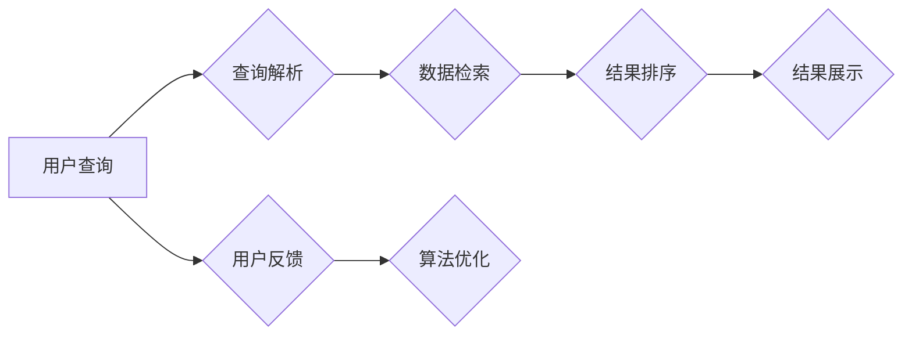

                 

### 引言

随着互联网的迅速发展和信息量的爆炸性增长，搜索技术成为了人们获取信息的重要工具。然而，传统的单一平台搜索已无法满足用户在多样化场景下的需求。跨平台搜索技术应运而生，它通过整合多个渠道的数据，提供更全面、更个性化的搜索结果，成为现代搜索引擎发展的重要方向。

**跨平台搜索的定义**：跨平台搜索是指在不同平台（如网站、移动应用、社交媒体等）上获取、整合并展示相关信息的搜索技术。其核心目标是打破单一平台的局限，为用户提供一站式的综合搜索服务。

**跨平台搜索的重要性**：跨平台搜索具有以下几个重要意义：

1. **提升用户体验**：用户可以在不同平台上快速找到所需信息，无需切换平台，提高搜索效率。
2. **数据整合**：通过跨平台搜索，可以将来自多个渠道的数据进行整合，实现信息的最大化利用。
3. **增加用户粘性**：跨平台搜索可以帮助平台更好地了解用户需求，提供个性化的推荐，增加用户对平台的依赖。
4. **商业价值**：对于企业而言，跨平台搜索技术可以帮助企业更好地掌握市场动态，优化业务流程，提升竞争力。

**跨平台搜索的发展背景**：随着移动设备的普及和社交媒体的兴起，用户行为逐渐从单一平台转向跨平台。例如，用户可能在PC上搜索信息，然后在手机上完成购买。这种跨平台行为促使搜索引擎提供商不断探索新的搜索技术，以满足用户日益复杂的需求。此外，大数据和人工智能技术的发展也为跨平台搜索提供了强有力的支持。

本篇博客将围绕跨平台搜索技术进行深入探讨，从AI技术的应用、数据整合与处理、核心算法介绍、系统设计与优化等多个方面，全面解析跨平台搜索的技术原理和实践应用。希望通过本文，读者能够对跨平台搜索技术有一个全面而深刻的理解。

关键词：跨平台搜索，AI技术，数据整合，多渠道数据处理，核心算法，系统设计，用户体验

摘要：本文将详细探讨跨平台搜索技术，从定义、重要性、发展背景入手，逐步分析AI技术在跨平台搜索中的应用、数据整合与处理方法、核心算法原理以及系统设计与优化策略。通过案例分析，本文展示了跨平台搜索技术的实际应用效果，并对未来发展趋势和挑战进行了展望。本文旨在为读者提供一个系统、全面的跨平台搜索技术指南。

---

### 目录大纲设计

本文将分为三个主要部分，分别从跨平台搜索技术概述、AI技术在跨平台搜索中的应用、数据整合与多渠道数据处理、跨平台搜索的核心算法、多渠道数据融合与优化、跨平台搜索系统设计与优化、案例分析、未来发展趋势与挑战、伦理与社会影响等方面进行深入探讨。

#### 第一部分: 跨平台搜索技术概述

本部分将介绍跨平台搜索技术的定义、重要性以及发展背景。具体章节包括：

- **第1章: 跨平台搜索概述**
  - **1.1 跨平台搜索的定义与重要性**
  - **1.2 跨平台搜索的优势与挑战**

#### 第二部分: AI在跨平台搜索中的应用

本部分将重点讨论AI技术在跨平台搜索中的具体应用，包括自然语言处理和深度学习等方面的内容。具体章节包括：

- **第2章: AI技术在搜索领域的应用**
  - **2.1 AI技术在搜索中的角色**
  - **2.2 自然语言处理与跨平台搜索**

- **第3章: 数据整合与多渠道数据处理**
  - **3.1 数据整合的概念与步骤**
  - **3.2 多渠道数据处理方法**

#### 第三部分: 跨平台搜索的实践与应用

本部分将详细介绍跨平台搜索的核心算法、系统设计与优化策略，并通过案例分析展示实际应用效果。具体章节包括：

- **第4章: 跨平台搜索的核心算法**
  - **4.1 跨平台搜索算法概述**
  - **4.2 基于深度学习的跨平台搜索算法**

- **第5章: 多渠道数据融合与优化**
  - **5.1 多渠道数据融合概述**
  - **5.2 数据融合算法与应用**

- **第6章: 跨平台搜索系统设计与优化**
  - **6.1 跨平台搜索系统设计原则**
  - **6.2 搜索系统性能优化**

- **第7章: 跨平台搜索案例分析**
  - **7.1 案例背景介绍**
  - **7.2 案例实施步骤**
  - **7.3 案例效果分析**

#### 第四部分: 跨平台搜索的未来趋势与挑战

本部分将探讨跨平台搜索技术的未来发展趋势、关键挑战以及伦理与社会影响。具体章节包括：

- **第8章: 跨平台搜索的未来发展趋势**
  - **8.1 跨平台搜索的发展趋势**
  - **8.2 跨平台搜索的关键挑战**

- **第9章: 跨平台搜索的伦理与社会影响**
  - **9.1 跨平台搜索的伦理问题**
  - **9.2 跨平台搜索的社会影响**

通过以上结构，本文将为读者提供一个系统、全面的跨平台搜索技术指南，帮助读者深入了解这一领域的最新进展和应用实践。

---

### 第一部分：跨平台搜索技术概述

#### 第1章: 跨平台搜索概述

**1.1 跨平台搜索的定义与重要性**

**1.1.1 跨平台搜索的定义**

跨平台搜索是指在不同操作系统（如Windows、Linux、macOS）和应用平台上（如网站、移动应用、桌面软件等）进行的搜索活动。它不同于传统的单一平台搜索，后者仅限于某个特定的操作系统或应用平台。例如，用户可能在PC上使用搜索引擎查找信息，然后在手机上继续浏览或购买相关商品。跨平台搜索技术的核心目标是实现信息的无缝整合和传递，满足用户在不同设备、不同环境下对信息的多样化需求。

**1.1.2 跨平台搜索的重要性**

**提升用户体验**：跨平台搜索技术能够提高用户的搜索效率，降低用户在不同平台间切换的成本。用户无需重复输入相同的搜索请求，可以方便地在不同设备间继续未完成的活动，从而获得更流畅的体验。

**数据整合**：跨平台搜索技术可以整合来自多个渠道的数据，使得用户能够在一个搜索结果中看到所有相关的信息，而无需在多个平台上分别查找。

**增加用户粘性**：通过跨平台搜索，平台可以更全面地了解用户的行为和需求，提供个性化的推荐和服务，从而增加用户对平台的依赖和忠诚度。

**商业价值**：对于企业和商家来说，跨平台搜索技术能够帮助他们更好地掌握市场动态，优化营销策略，提升销售业绩。例如，通过分析用户的跨平台行为，企业可以更精准地定位目标客户，实现有效的广告投放和产品推荐。

**1.1.3 跨平台搜索的发展背景**

随着移动互联网的普及和用户行为的变化，传统的单一平台搜索已无法满足用户的多样化需求。跨平台搜索技术应运而生，成为现代搜索引擎发展的重要方向。以下是跨平台搜索发展的几个关键背景因素：

**移动设备的普及**：智能手机和平板电脑的普及，使得用户的行为逐渐从桌面转向移动端。用户在不同设备上使用搜索引擎进行信息查找和活动，这促使搜索引擎提供商不断优化搜索技术，以支持跨平台搜索。

**社交媒体的兴起**：社交媒体平台成为了用户获取信息的重要渠道。跨平台搜索技术可以帮助用户在多个社交媒体平台上查找和整合信息，提高搜索的全面性和准确性。

**大数据与人工智能**：大数据和人工智能技术的发展为跨平台搜索提供了强有力的支持。通过分析用户的行为数据，搜索引擎可以提供更精准的搜索结果和个性化推荐，提升用户体验。

**跨平台协作**：现代工作环境和协作方式的多样化，要求用户在不同平台间进行高效的信息交流和协作。跨平台搜索技术可以帮助用户在一个平台上完成多个任务，提高工作效率。

总结而言，跨平台搜索技术不仅解决了用户在不同平台间获取信息的难题，还为企业提供了新的商业模式和营销机会。在未来的发展中，跨平台搜索将继续融合最新的技术和创新理念，为用户提供更优质、更便捷的服务。

**1.2 跨平台搜索的优势与挑战**

**1.2.1 跨平台搜索的优势**

**数据整合的效率**：跨平台搜索技术能够将来自不同平台的数据进行整合，实现信息的最大化利用。用户无需在多个平台上分别查找信息，从而提高了搜索效率。

**搜索的全面性**：跨平台搜索可以整合来自多个渠道的数据，提供更全面的搜索结果。用户可以在一个搜索结果中看到所有相关的信息，而无需在多个平台上分别查找。

**提高用户满意度**：跨平台搜索技术能够根据用户的行为和需求，提供个性化的推荐和服务，提升用户体验。用户可以更快速地找到所需信息，从而提高满意度。

**商业价值**：对于企业和商家来说，跨平台搜索技术能够帮助他们更好地掌握市场动态，优化营销策略，提升销售业绩。通过分析用户的跨平台行为，企业可以更精准地定位目标客户，实现有效的广告投放和产品推荐。

**1.2.2 跨平台搜索的挑战**

**数据源的多样性**：跨平台搜索需要整合来自多个渠道的数据，包括结构化数据和非结构化数据。不同数据源的结构和格式可能存在差异，增加了数据整合的复杂性。

**数据质量的不一致性**：不同平台的数据质量可能存在较大差异，包括数据准确性、完整性等方面。数据质量的不一致性会导致搜索结果的准确性和可靠性受到影响。

**搜索算法的适应性**：跨平台搜索需要适应不同的数据类型和场景，开发相应的搜索算法。不同算法的适用场景和性能可能存在差异，需要针对具体应用场景进行优化。

**安全性**：跨平台搜索涉及多个平台和渠道，数据传输和存储的安全性问题需要得到保障。需要采取有效的安全措施，防止数据泄露和非法访问。

**1.2.3 跨平台搜索的解决方案**

**数据整合**：为了实现数据的整合，可以采用以下几种方法：
- **数据清洗与标准化**：对来自不同平台的数据进行清洗和标准化处理，确保数据的格式和结构一致。
- **数据存储**：采用分布式存储技术，将不同平台的数据存储在统一的数据仓库中，方便后续的数据整合和分析。

**数据质量控制**：为了保证数据质量，可以采取以下措施：
- **数据验证**：对数据的准确性、完整性进行验证，排除错误和缺失的数据。
- **数据清洗**：对脏数据和异常值进行清洗，提高数据的准确性和一致性。

**搜索算法优化**：为了提高跨平台搜索的性能和准确性，可以采取以下策略：
- **算法选择**：根据不同的应用场景和数据类型，选择合适的搜索算法。
- **算法优化**：对搜索算法进行优化，提高搜索结果的准确性和响应速度。

**安全性保障**：为了保障数据传输和存储的安全，可以采取以下措施：
- **数据加密**：对数据进行加密处理，防止数据在传输和存储过程中被窃取。
- **访问控制**：设置访问权限，确保只有授权用户才能访问数据。

通过上述解决方案，可以有效地应对跨平台搜索面临的各种挑战，实现高效、准确、安全的跨平台搜索服务。

---

### 第2章: AI技术在跨平台搜索中的应用

#### 2.1 AI技术在搜索领域的应用

人工智能（AI）技术在搜索领域的应用正日益广泛，其核心在于利用机器学习、自然语言处理（NLP）和其他先进算法来提升搜索效果和用户体验。以下将详细探讨AI技术在搜索中的角色、如何提升搜索效果以及该领域的技术进展。

**2.1.1 AI技术在搜索中的角色**

AI技术在搜索领域扮演了多个关键角色，主要包括以下几个方面：

**搜索结果的个性化**：通过分析用户的历史行为、偏好和反馈，AI技术能够为用户推荐更加个性化的搜索结果。例如，Google的RankBrain算法利用深度学习技术分析用户的查询和搜索历史，从而提供更加精准的搜索结果。

**语义理解**：传统的关键词匹配搜索往往无法准确理解用户查询的真正意图。AI技术，特别是NLP，通过语义分析能够更好地理解用户的查询意图，提供更相关的搜索结果。例如，百度使用的深度语义分析技术能够在理解用户查询的基础上，提供更加智能的搜索建议。

**内容推荐**：搜索引擎不仅提供查询结果，还可以根据用户兴趣推荐相关内容。AI技术通过分析用户行为和兴趣，能够自动生成个性化推荐，提升用户在平台上的留存率和活跃度。

**异常检测与安全**：AI技术在搜索领域也用于检测异常行为和防止滥用。例如，通过机器学习算法，搜索引擎可以识别并阻止垃圾信息、恶意链接和欺诈行为，保障搜索环境的安全。

**2.1.2 AI技术如何提升搜索效果**

**提升搜索准确性**：AI技术通过机器学习和深度学习算法，能够提高搜索结果的准确性。例如，深度神经网络（DNN）和循环神经网络（RNN）等技术可以更好地理解查询意图，提供更准确的搜索结果。

**改善用户体验**：AI技术能够根据用户行为和偏好，提供个性化的搜索结果和推荐。例如，用户在搜索某个话题后，搜索引擎可以自动推荐相关的新闻、视频和文章，提高用户的满意度。

**实时反馈与调整**：AI技术允许搜索引擎在用户使用过程中不断学习和调整。用户的行为和反馈会被实时收集和分析，以便搜索引擎能够快速响应用户的需求，提供更好的搜索体验。

**降低成本**：通过自动化和智能化的技术，AI技术可以帮助搜索引擎降低运营成本。例如，自动化索引和内容分类可以减少人工干预，提高搜索效率。

**2.1.3 AI技术在搜索领域的最新进展**

**深度学习在搜索中的应用**：深度学习技术在搜索领域的应用日益广泛。例如，BERT（Bidirectional Encoder Representations from Transformers）模型通过双向变换器神经网络，能够更准确地理解查询和文档的语义关系，从而提高搜索结果的相关性。

**预训练语言模型**：预训练语言模型（如GPT-3、T5）在搜索中的应用也越来越受到关注。这些模型通过在大规模语料库上进行预训练，能够更好地理解自然语言，提供更加精准的搜索建议。

**多模态搜索**：多模态搜索是指将文本、图像、语音等多种类型的数据整合到搜索系统中。AI技术，特别是计算机视觉和语音识别技术，使得多模态搜索成为可能，为用户提供更加丰富和便捷的搜索体验。

**联邦学习**：联邦学习是一种在用户设备上本地训练模型，然后将模型参数上传到中央服务器进行全局优化的技术。它能够在保护用户隐私的同时，提高搜索系统的性能和准确性。

**增强现实（AR）与搜索**：结合增强现实技术，AI搜索可以为用户提供更加直观和沉浸式的搜索体验。例如，用户可以通过AR眼镜查看搜索结果中的3D模型，从而更好地理解相关信息。

通过上述AI技术的应用和进展，搜索系统正变得越来越智能化和个性化，为用户提供更加高效和精准的搜索服务。在未来，随着AI技术的不断发展和创新，搜索领域将继续迎来更多的变革和突破。

---

### 第2章: AI技术在跨平台搜索中的应用

#### 2.2 自然语言处理与跨平台搜索

自然语言处理（NLP）是人工智能（AI）领域的一个重要分支，其目标是使计算机能够理解和生成自然语言。在跨平台搜索中，NLP技术发挥着至关重要的作用，它能够帮助搜索引擎更好地理解用户的查询意图，提供更精准的搜索结果。以下将详细探讨NLP的基本概念、NLP在跨平台搜索中的应用以及常用的NLP模型与算法。

**2.2.1 自然语言处理的基本概念**

**自然语言处理**：自然语言处理（NLP）是人工智能（AI）的一个重要分支，旨在让计算机理解和生成自然语言。它涉及语言学、计算机科学和人工智能等多个领域，包括文本分析、语音识别、语义理解、情感分析等子任务。

**文本分析**：文本分析是指对文本数据进行分析和处理，以提取有用信息和知识。它包括文本分类、情感分析、关键词提取等任务。例如，文本分类可以将文本划分为不同的类别，如新闻、评论、广告等。

**语音识别**：语音识别是指将语音信号转换为文本数据，使得计算机能够理解和处理语音指令。语音识别技术在跨平台搜索中非常重要，它使得用户可以通过语音进行查询，提高搜索的便捷性。

**语义理解**：语义理解是指理解文本数据的深层含义，包括词义消歧、实体识别、关系抽取等任务。语义理解是实现智能搜索的关键，它使得搜索引擎能够更好地理解用户的查询意图，提供更准确的搜索结果。

**情感分析**：情感分析是指识别和提取文本中的情感倾向，如正面、负面或中性。情感分析在跨平台搜索中可以帮助搜索引擎理解用户的情绪状态，提供更加个性化的搜索体验。

**2.2.2 NLP在跨平台搜索中的应用**

**查询意图识别**：跨平台搜索中的查询意图识别是理解用户查询意图的重要步骤。通过NLP技术，搜索引擎可以识别用户的查询意图，例如是查找信息、购买商品还是导航等。这有助于搜索引擎提供更精准的搜索结果。

**关键词提取**：关键词提取是指从用户查询中提取关键信息，以便搜索引擎能够更好地理解查询内容。NLP技术，如词频统计、TF-IDF算法和词向量化等，可以帮助搜索引擎提取关键词，提高搜索结果的准确性。

**实体识别**：实体识别是指识别文本中的特定实体，如人名、地名、组织名等。实体识别在跨平台搜索中具有重要意义，它可以帮助搜索引擎更好地理解查询内容，提供相关的搜索结果。

**关系抽取**：关系抽取是指识别文本中实体之间的关系，如“张三毕业于清华大学”。关系抽取可以帮助搜索引擎建立实体之间的关联，提供更加丰富的搜索结果。

**文本分类**：文本分类是指将文本数据分类到预定义的类别中。在跨平台搜索中，文本分类技术可以用于分类搜索结果，提高搜索结果的精准度。例如，可以将搜索结果分类为新闻、评论、广告等。

**2.2.3 常用的NLP模型与算法**

**词袋模型**：词袋模型是一种基于统计的文本表示方法，它将文本表示为一个向量，其中每个元素表示一个词的频率。词袋模型简单且易于实现，但它在处理语义关系方面存在一定的局限性。

**TF-IDF算法**：TF-IDF（Term Frequency-Inverse Document Frequency）算法是一种基于统计的文本权重计算方法，它通过计算词在文档中的频率和文档集合中的逆向文档频率来评估词的重要性。TF-IDF算法在搜索引擎中被广泛应用，以提高搜索结果的准确性。

**词向量化**：词向量化是将词转换为向量的过程，使得计算机能够处理文本数据。词向量化技术，如Word2Vec和GloVe，通过学习词的语义关系，能够更好地表示词的语义信息。

**循环神经网络（RNN）**：循环神经网络是一种能够处理序列数据的神经网络，它通过记忆过去的信息来改善当前的状态。RNN在自然语言处理中广泛应用，如语言模型、序列标注和机器翻译等。

**长短时记忆网络（LSTM）**：长短时记忆网络（LSTM）是RNN的一种改进，它通过引入遗忘门、输入门和输出门来控制信息的流动，有效解决了RNN在处理长序列数据时的梯度消失问题。LSTM在自然语言处理中得到了广泛应用。

**双向长短时记忆网络（Bi-LSTM）**：双向长短时记忆网络（Bi-LSTM）是LSTM的一种改进，它同时从正向和反向两个方向处理序列数据，能够更好地捕捉序列中的长期依赖关系。

**卷积神经网络（CNN）**：卷积神经网络是一种能够处理图像和文本等二维数据的神经网络。CNN通过卷积层和池化层提取特征，在文本分类和情感分析等任务中表现优异。

**BERT**：BERT（Bidirectional Encoder Representations from Transformers）是一种预训练语言模型，通过双向变换器神经网络，能够更好地理解查询和文档的语义关系。BERT在搜索结果相关性、问答系统等任务中取得了显著的性能提升。

**GPT**：GPT（Generative Pre-trained Transformer）是一种生成预训练语言模型，它通过自回归方式生成文本。GPT在文本生成、对话系统等任务中具有广泛的应用。

通过以上NLP模型和算法的应用，跨平台搜索系统能够更好地理解用户的查询意图，提供更精准的搜索结果，从而提升用户体验。

---

### 第3章: 数据整合与多渠道数据处理

#### 3.1 数据整合的概念与步骤

**3.1.1 数据整合的目标**

数据整合的目标是将来自不同来源、不同格式的数据融合成一个统一、完整的数据视图，以支持跨平台搜索的高效运行。具体目标包括：

- **数据统一化**：将来自多个渠道的数据进行标准化和规范化处理，确保数据格式的一致性。
- **信息最大化利用**：通过整合不同渠道的数据，实现信息资源的最大化利用，提升搜索的全面性和准确性。
- **提升用户体验**：为用户提供一个统一的搜索界面，使搜索过程更加便捷，提升用户体验。
- **优化业务流程**：为企业提供全面的数据视图，优化业务流程，提高运营效率。

**3.1.2 数据整合的步骤**

**数据收集**：数据收集是数据整合的第一步，主要涉及从不同渠道获取数据。这些渠道可能包括内部数据库、外部API、社交媒体平台等。数据收集的方式有直接采集和间接采集两种。直接采集是指直接从原始数据源获取数据，如通过爬虫技术获取网页数据。间接采集是指通过第三方平台获取数据，如通过API接口获取第三方数据。

**数据清洗**：数据清洗是数据整合的关键步骤，目的是去除数据中的噪声、错误和重复信息，确保数据的准确性和一致性。数据清洗的过程包括以下几个环节：

- **去除重复数据**：通过去重算法，识别并删除重复的数据记录。
- **数据验证**：对数据的有效性进行检查，如检查数据格式、范围和一致性。
- **错误纠正**：对数据中的错误进行修正，如纠正拼写错误、补充缺失数据等。
- **标准化处理**：对数据进行标准化处理，如统一数据格式、单位转换等。

**数据存储**：数据存储是将清洗后的数据进行存储和管理，以供后续处理和查询。常用的数据存储技术包括关系数据库、NoSQL数据库和分布式存储系统。关系数据库适合存储结构化数据，如SQL数据库；NoSQL数据库适合存储非结构化或半结构化数据，如MongoDB、Cassandra等；分布式存储系统适合存储海量数据，如Hadoop、HDFS等。

**数据融合**：数据融合是将来自不同来源的数据进行整合，形成统一的数据视图。数据融合的方法包括简单融合、复合融合和智能融合：

- **简单融合**：简单融合是将数据按字段进行合并，适用于数据格式和结构相似的情况。
- **复合融合**：复合融合是将简单融合与基于规则的融合相结合，适用于数据格式和结构差异较大的情况。
- **智能融合**：智能融合是基于机器学习和数据挖掘技术，自动发现和整合数据之间的关系，适用于复杂的数据融合场景。

**数据整合的挑战**

**数据源的不一致性**：不同数据源的结构和格式可能存在差异，导致数据整合的复杂性。例如，一些数据源可能使用不同的数据格式（如CSV、JSON、XML）和数据编码（如UTF-8、GBK）。

**数据质量的问题**：数据质量是数据整合的重要保障。不同数据源的数据质量可能存在较大差异，包括数据准确性、完整性和一致性等方面。数据质量的问题会影响数据整合的效果和搜索结果的准确性。

**数据隐私的保护**：在数据整合过程中，需要关注数据隐私的保护。特别是跨平台搜索涉及多个渠道的数据，包括用户个人信息和敏感数据，如何确保数据在整合和存储过程中不被泄露和滥用，是数据整合面临的重大挑战。

**3.1.3 数据整合的挑战**

**数据源的不一致性**：不同数据源的结构和格式可能存在差异，导致数据整合的复杂性。例如，一些数据源可能使用不同的数据格式（如CSV、JSON、XML）和数据编码（如UTF-8、GBK）。

**数据质量的问题**：数据质量是数据整合的重要保障。不同数据源的数据质量可能存在较大差异，包括数据准确性、完整性和一致性等方面。数据质量的问题会影响数据整合的效果和搜索结果的准确性。

**数据隐私的保护**：在数据整合过程中，需要关注数据隐私的保护。特别是跨平台搜索涉及多个渠道的数据，包括用户个人信息和敏感数据，如何确保数据在整合和存储过程中不被泄露和滥用，是数据整合面临的重大挑战。

**解决方案**

**数据标准化**：通过数据标准化技术，将不同数据源的数据格式和编码统一为标准格式，如使用UTF-8编码、JSON格式等，降低数据整合的复杂性。

**数据清洗与质量控制**：采用数据清洗和质量控制技术，对数据进行标准化处理、去重、验证和错误纠正等，确保数据的一致性和准确性。

**隐私保护技术**：采用隐私保护技术，如数据加密、匿名化处理和访问控制等，确保数据在整合和存储过程中不被泄露和滥用。

通过上述数据整合的步骤和解决方案，可以有效地实现跨平台搜索中多渠道数据的整合，提升搜索系统的性能和用户体验。

---

### 第3章: 数据整合与多渠道数据处理

#### 3.2 多渠道数据处理方法

**3.2.1 多渠道数据收集**

多渠道数据收集是跨平台搜索系统构建的基础，涉及从多个来源获取数据的策略和技术。以下是一些常见的多渠道数据收集方法：

**1. 爬虫技术**：爬虫（或称为网络爬虫）是自动抓取互联网上数据的一种工具。它们通过模拟用户浏览行为，爬取网页内容、链接和元数据。常见的爬虫技术包括网页爬虫、图片爬虫和API爬虫等。

**2. API接入**：许多平台提供API（应用程序接口）供开发者获取数据。通过接入这些API，可以方便地获取平台上的数据，如社交媒体平台、电子商务网站和新闻网站等。

**3. 数据交换协议**：数据交换协议（如OData、RESTful API等）允许不同系统之间进行数据交换。通过这些协议，可以将来自多个系统的数据整合到一起。

**4. 离线数据导入**：离线数据导入是指将已有的数据文件（如CSV、Excel等）导入到数据库中。这种方法适用于数据量较小或数据源不易通过实时接口获取的情况。

**5. 传感器数据收集**：对于涉及物联网（IoT）的应用，可以通过传感器收集环境数据、设备状态等。这些数据对于提供实时搜索结果和个性化推荐具有重要意义。

**3.2.2 多渠道数据处理**

多渠道数据处理是指在收集到数据后，对这些数据进行清洗、转换、整合和存储的过程。以下是一些常见的多渠道数据处理方法：

**1. 数据清洗**：数据清洗是处理多渠道数据的第一个步骤，目的是去除数据中的噪声、错误和重复信息。数据清洗的方法包括去重、数据验证、错误修正和缺失数据处理等。

**2. 数据转换**：数据转换是将不同格式和结构的数据转换为统一格式的过程。例如，将CSV文件转换为JSON格式，或将XML文件转换为HTML格式。数据转换有助于后续的数据处理和分析。

**3. 数据整合**：数据整合是将来自不同渠道的数据进行合并，形成一个统一的数据视图。数据整合的方法包括简单融合、复合融合和智能融合等。

- **简单融合**：简单融合是将数据按字段进行合并，适用于数据格式和结构相似的情况。
- **复合融合**：复合融合是将简单融合与基于规则的融合相结合，适用于数据格式和结构差异较大的情况。
- **智能融合**：智能融合是基于机器学习和数据挖掘技术，自动发现和整合数据之间的关系，适用于复杂的数据融合场景。

**4. 数据存储**：数据存储是将清洗和转换后的数据存储在数据库或数据仓库中。常用的存储技术包括关系数据库（如MySQL、PostgreSQL）、NoSQL数据库（如MongoDB、Cassandra）和分布式存储系统（如Hadoop、HDFS）。

**3.2.3 多渠道数据融合策略**

多渠道数据融合策略是指在整合多渠道数据时，如何处理数据不一致、数据冗余和数据隐私等问题。以下是一些常见的多渠道数据融合策略：

**1. 数据标准化**：通过数据标准化，将不同数据源的数据格式和编码统一为标准格式，如使用UTF-8编码、JSON格式等，降低数据整合的复杂性。

**2. 数据质量保证**：通过数据质量保证技术，确保数据的一致性、准确性和完整性。数据质量保证的方法包括数据验证、错误修正和缺失数据处理等。

**3. 数据隐私保护**：在数据融合过程中，需要关注数据隐私的保护。可以采用数据加密、匿名化处理和访问控制等技术，确保数据在整合和存储过程中不被泄露和滥用。

**4. 异构数据融合**：异构数据融合是指处理不同类型和结构的数据。例如，将结构化数据（如关系数据库）与非结构化数据（如文本、图像）进行融合。常用的异构数据融合方法包括基于规则的融合、基于机器学习的融合和基于深度学习的融合等。

通过上述多渠道数据处理方法和融合策略，可以有效地整合来自多个渠道的数据，提升跨平台搜索系统的性能和用户体验。

---

### 第4章: 跨平台搜索的核心算法

#### 4.1 跨平台搜索算法概述

**4.1.1 跨平台搜索算法的基本原理**

跨平台搜索算法是搜索引擎中的核心技术，其基本原理是通过分析用户的查询请求，从多个数据源中检索出相关的信息，并根据一定的排序规则将结果呈现给用户。以下是对跨平台搜索算法基本原理的详细解析：

**1. 查询请求解析**：当用户输入查询请求时，搜索引擎需要对查询请求进行解析，以理解用户的意图。这一过程包括关键词提取、查询意图识别和查询重写等。关键词提取是指从查询请求中提取出关键信息，如单词、短语等；查询意图识别是指判断用户查询的目的，如查找信息、购买商品、导航等；查询重写是指根据查询意图对原始查询请求进行改写，以获得更准确的搜索结果。

**2. 数据源检索**：在理解用户的查询请求后，搜索引擎需要从多个数据源中检索相关信息。这些数据源可能包括网页、数据库、社交媒体、图像库等。搜索引擎会根据数据源的特性选择合适的检索方法，如基于内容的检索、基于关键词的检索和基于机器学习的检索等。

**3. 搜索结果排序**：检索到相关信息后，搜索引擎需要对搜索结果进行排序，以确定哪些信息最相关、最优先展示给用户。搜索结果排序通常采用综合评价模型，综合考虑多个因素，如信息的相关性、用户的历史行为、网站的权威性等。

**4. 结果呈现**：最后，搜索引擎将排序后的搜索结果呈现给用户，用户可以根据结果进行进一步的浏览和操作。

**4.1.2 跨平台搜索算法的分类**

跨平台搜索算法根据不同的分类标准可以分为多种类型，以下是一些常见的分类方法：

**1. 基于内容的匹配算法**：这类算法主要根据文档的内容与查询请求的相关性来排序搜索结果。常见的基于内容的匹配算法包括布尔模型、向量空间模型（VSM）和词频-逆文档频率（TF-IDF）算法等。

- **布尔模型**：布尔模型是一种基于布尔代数的检索模型，通过逻辑运算符（如AND、OR、NOT）组合关键词，实现简单的检索功能。
- **向量空间模型（VSM）**：向量空间模型将文本数据表示为向量，通过计算查询请求与文档之间的相似度来排序搜索结果。VSM广泛应用于文本分类、信息检索等领域。
- **词频-逆文档频率（TF-IDF）算法**：TF-IDF算法通过计算关键词在文档中的频率（TF）和文档集合中的逆向文档频率（IDF），评估关键词的重要性，从而对搜索结果进行排序。

**2. 基于用户行为的算法**：这类算法主要基于用户的历史行为和偏好来排序搜索结果。常见的基于用户行为的算法包括协同过滤、基于上下文的推荐和点击预测等。

- **协同过滤**：协同过滤是一种基于用户历史行为的数据挖掘技术，通过分析用户之间的相似性，推荐用户可能感兴趣的信息。
- **基于上下文的推荐**：基于上下文的推荐算法根据用户当前的环境和行为，推荐相关的信息。例如，当用户在智能手机上使用地图应用时，可以推荐附近的餐馆、景点等信息。
- **点击预测**：点击预测算法通过分析用户在搜索引擎上的点击行为，预测用户可能点击的搜索结果，从而优化搜索结果的排序。

**3. 基于机器学习的算法**：这类算法利用机器学习技术，通过训练模型来自动化搜索结果的排序。常见的基于机器学习的算法包括深度学习、自然语言处理（NLP）和强化学习等。

- **深度学习**：深度学习是一种基于多层神经网络的学习方法，通过学习大量的数据，自动提取特征并构建复杂的模型。深度学习在跨平台搜索中广泛应用于文本分类、情感分析、图像识别等领域。
- **自然语言处理（NLP）**：自然语言处理技术通过分析和理解自然语言，提高搜索结果的准确性和相关性。例如，BERT（Bidirectional Encoder Representations from Transformers）是一种先进的NLP模型，通过双向变换器神经网络，能够更好地理解查询和文档的语义关系。
- **强化学习**：强化学习是一种通过试错和学习来优化行为的方法，广泛应用于推荐系统、游戏和搜索等领域。在跨平台搜索中，强化学习算法可以根据用户的反馈不断调整搜索结果的排序，提高用户体验。

通过上述分类方法，可以更好地理解和应用跨平台搜索算法，实现高效、准确的搜索服务。

**4.1.3 跨平台搜索算法的比较**

不同类型的跨平台搜索算法在性能、适用场景和实现复杂度等方面存在差异。以下是比较不同算法的几个关键因素：

**1. 性能**：基于内容的匹配算法（如TF-IDF）在处理大量文本数据时表现较好，但可能无法很好地应对复杂的用户查询意图。基于用户行为的算法（如协同过滤）可以根据用户历史行为提供个性化推荐，但可能受到数据稀疏性问题的影响。基于机器学习的算法（如深度学习和NLP模型）在处理复杂查询和提供高相关性的搜索结果方面表现优异，但需要大量的训练数据和计算资源。

**2. 适用场景**：基于内容的匹配算法适用于文本信息的检索，如网页搜索和文档检索。基于用户行为的算法适用于个性化推荐和基于上下文的搜索，如电子商务和移动应用。基于机器学习的算法适用于需要高精度和复杂语义理解的场景，如问答系统和智能搜索引擎。

**3. 实现复杂度**：基于内容的匹配算法相对简单，易于实现和优化。基于用户行为的算法需要处理用户行为数据和相似性计算，实现复杂度较高。基于机器学习的算法需要大量的数据预处理和模型训练，实现复杂度和计算资源需求最大。

综上所述，跨平台搜索算法的选择应根据具体应用场景、性能需求和实现资源进行权衡。通过结合不同类型的算法，可以构建一个高效、准确的跨平台搜索系统，满足用户的多样化需求。

---

### 第4章: 跨平台搜索的核心算法

#### 4.2 基于深度学习的跨平台搜索算法

深度学习技术在跨平台搜索中的应用日益广泛，其主要优势在于能够自动提取复杂特征，提升搜索结果的准确性和相关性。以下将详细探讨深度学习在跨平台搜索中的应用、基于深度学习的跨平台搜索算法以及常见的深度学习模型在搜索中的应用。

**4.2.1 深度学习在搜索中的应用**

**1. 自动特征提取**：深度学习通过多层神经网络，能够自动从原始数据中提取高层次的、具有区分度的特征。这些特征对于搜索结果的排序和推荐至关重要。例如，在文本搜索中，深度学习可以提取词向量和句子表示，从而更准确地理解查询和文档的语义关系。

**2. 个性化推荐**：深度学习能够根据用户的历史行为和兴趣，为用户提供个性化的搜索结果和推荐。通过学习用户的交互数据，深度学习模型可以预测用户可能感兴趣的内容，从而优化搜索结果的排序，提高用户体验。

**3. 异构数据融合**：在跨平台搜索中，数据来源多样且结构各异，深度学习可以有效地融合不同类型的数据（如文本、图像、语音等），提供更全面的搜索结果。例如，结合文本和图像数据，深度学习可以识别出更加精准的搜索结果，满足用户的多样化需求。

**4. 实时优化**：深度学习模型可以通过在线学习和实时反馈，不断优化搜索算法。例如，通过分析用户的点击和满意度反馈，深度学习模型可以调整搜索结果的排序策略，提高搜索系统的性能。

**4.2.2 基于深度学习的跨平台搜索算法**

**1. 神经网络搜索算法**：神经网络搜索算法通过多层神经网络（如卷积神经网络（CNN）和循环神经网络（RNN））提取文本和文档的特征，从而实现高精度的搜索结果排序。例如，BERT（Bidirectional Encoder Representations from Transformers）是一种基于变换器网络的预训练语言模型，通过双向编码，能够更好地理解查询和文档的语义关系，显著提升搜索结果的准确性。

**2. 图神经网络搜索算法**：图神经网络（GNN）是一种用于处理图数据的深度学习模型，能够有效地融合异构数据。在跨平台搜索中，GNN可以结合文本、图像、用户行为等多源数据，构建大规模的图模型，从而提供更全面、更准确的搜索结果。

**3. 强化学习搜索算法**：强化学习（RL）是一种通过试错和学习来优化行为的算法，在跨平台搜索中可以用于搜索结果的排序和推荐。通过分析用户的点击和满意度反馈，强化学习模型可以不断调整搜索策略，优化搜索结果，提高用户体验。

**4.2.3 常见的深度学习模型在搜索中的应用**

**1. BERT模型**：BERT是一种预训练语言模型，通过在大规模语料库上进行预训练，能够理解词语的上下文关系。在跨平台搜索中，BERT可以用于文本分类、问答系统和搜索结果排序等任务。通过结合BERT模型，搜索系统能够更准确地理解用户的查询意图，提供相关度更高的搜索结果。

**2. GPT模型**：GPT是一种生成预训练语言模型，通过自回归方式生成文本。在跨平台搜索中，GPT可以用于文本生成、对话系统和个性化推荐等任务。通过GPT模型，搜索系统可以生成更加自然和流畅的文本，为用户提供更好的交互体验。

**3. 图卷积网络（GCN）**：GCN是一种用于处理图数据的深度学习模型，通过图卷积层提取节点和边的特征。在跨平台搜索中，GCN可以用于融合异构数据，构建大规模的图模型。例如，将文本、图像和用户行为数据融合到一起，GCN可以提供更全面的搜索结果，满足用户的多样化需求。

**4. 生成对抗网络（GAN）**：GAN是一种生成模型，通过训练生成器和判别器，生成高质量的文本和图像。在跨平台搜索中，GAN可以用于文本生成和图像增强等任务。通过GAN模型，搜索系统可以生成更加丰富和多样化的内容，提高用户体验。

通过上述基于深度学习的跨平台搜索算法和常见深度学习模型的应用，搜索系统可以实现更精准的搜索结果、更个性化的推荐和更高效的数据融合，为用户提供更好的搜索体验。在未来，随着深度学习技术的不断发展和创新，跨平台搜索将继续迎来更多的变革和突破。

---

### 第5章: 多渠道数据融合与优化

#### 5.1 多渠道数据融合概述

多渠道数据融合是指将来自不同来源、不同格式的数据整合成一个统一的数据视图，以支持跨平台搜索的高效运行。在跨平台搜索中，数据融合是一个关键步骤，它能够提高搜索结果的准确性和全面性。以下将对多渠道数据融合的目标、方法以及面临的挑战进行详细探讨。

**5.1.1 多渠道数据融合的目标**

**提高搜索结果的准确性**：通过融合来自不同渠道的数据，可以提供更全面的信息，从而提高搜索结果的准确性。例如，在商品搜索中，整合电商平台的商品描述、用户评论、社交媒体的推广信息等，可以帮助用户更准确地找到所需商品。

**提升用户体验**：数据融合可以提供一个统一的用户界面，用户无需在不同平台间切换，即可获取所需信息。这有助于提升用户体验，降低用户的学习成本。

**优化业务流程**：对于企业而言，数据融合可以帮助企业更好地了解用户需求和市场动态，从而优化业务流程，提高运营效率。

**5.1.2 多渠道数据融合的方法**

**简单融合**：简单融合是指将来自不同渠道的数据按字段进行合并，适用于数据格式和结构相似的情况。简单融合的优点是实现简单，但可能无法处理数据格式和结构差异较大的情况。

**复合融合**：复合融合是将简单融合与基于规则的融合相结合，适用于数据格式和结构差异较大的情况。复合融合通过规则匹配和转换，将不同格式和结构的数据整合到一个统一的数据视图中。

**智能融合**：智能融合是基于机器学习和数据挖掘技术，自动发现和整合数据之间的关系，适用于复杂的数据融合场景。智能融合能够处理大量的异构数据，并提供更加精准的融合结果。

**数据标准化**：数据标准化是数据融合的重要步骤，通过将不同格式和编码的数据统一为标准格式，降低数据融合的复杂性。

**数据清洗**：数据清洗是数据融合的关键，目的是去除数据中的噪声、错误和重复信息，确保数据的一致性和准确性。

**5.1.3 多渠道数据融合的挑战**

**数据源的不一致性**：不同渠道的数据源可能在格式、结构、数据类型等方面存在差异，导致数据融合的复杂性。例如，一些数据源可能使用不同的编码方式（如UTF-8、GBK）和不同的数据格式（如JSON、CSV）。

**数据质量的问题**：数据质量是数据融合的重要保障。不同渠道的数据质量可能存在较大差异，包括数据准确性、完整性、一致性等方面。数据质量的问题会影响数据融合的效果和搜索结果的准确性。

**数据隐私的保护**：在数据融合过程中，需要关注数据隐私的保护。特别是跨平台搜索涉及多个渠道的数据，包括用户个人信息和敏感数据，如何确保数据在整合和存储过程中不被泄露和滥用，是数据融合面临的重大挑战。

**计算资源的需求**：数据融合通常涉及大量的数据处理和计算，对计算资源的需求较高。特别是在处理大规模、多源数据时，需要有效的计算策略和优化技术，以提高数据融合的效率。

**5.1.4 数据融合策略**

**异构数据融合**：异构数据融合是指处理不同类型和结构的数据。例如，将结构化数据（如关系数据库）与非结构化数据（如文本、图像）进行融合。常用的异构数据融合方法包括基于规则的融合、基于机器学习的融合和基于深度学习的融合等。

- **基于规则的融合**：基于规则的融合通过预设的规则，将不同格式和结构的数据转换为统一格式。这种方法实现简单，但可能无法处理复杂的异构数据。
- **基于机器学习的融合**：基于机器学习的融合通过训练模型来自动发现和整合数据之间的关系。这种方法适用于处理复杂的异构数据，但需要大量的训练数据和计算资源。
- **基于深度学习的融合**：基于深度学习的融合通过多层神经网络，自动提取数据特征，并进行融合。这种方法能够处理大量的异构数据，并提供更加精准的融合结果。

**分布式数据融合**：分布式数据融合是指将数据分布到多个节点进行处理，以提高数据融合的效率和可扩展性。常用的分布式数据融合框架包括MapReduce、Spark等。

**数据隐私保护**：在数据融合过程中，需要采用隐私保护技术，如数据加密、匿名化处理和访问控制等，以确保数据在整合和存储过程中不被泄露和滥用。

通过上述多渠道数据融合的目标、方法、挑战和策略，可以构建一个高效、准确和安全的跨平台搜索系统，满足用户的多样化需求。

---

### 第5章: 多渠道数据融合与优化

#### 5.2 数据融合算法与应用

数据融合算法是多渠道数据处理的核心技术，旨在从多个数据源中提取有用信息，形成一致且全面的统一数据视图。以下将详细分类介绍数据融合算法，并讨论其应用实例和性能评估。

**5.2.1 数据融合算法的分类**

数据融合算法根据处理方式和目标不同，可以分类为以下几种：

**1. 基于规则的融合算法**：
   - **规则匹配**：通过预定义的规则将不同数据源中的信息进行匹配和合并。例如，将来自不同电商平台的产品信息根据产品ID进行匹配。
   - **规则引导的融合**：基于业务逻辑和规则，动态地选择和组合数据源中的信息。例如，在旅游搜索中，将酒店的评论、价格和用户偏好通过规则进行整合。

**2. 统计方法**：
   - **均值融合**：通过计算多个数据源的平均值来得到统一数据。例如，将多个来源的气温数据取平均值作为最终结果。
   - **回归分析**：利用统计学方法（如线性回归、多元回归等）来预测和融合数据。例如，通过回归分析融合多个渠道的销售额数据，预测未来的销售趋势。

**3. 机器学习方法**：
   - **聚类算法**：如K-means、DBSCAN等，通过聚类分析将相似的数据点归为一类，从而实现数据融合。
   - **主成分分析（PCA）**：通过降维技术，将高维数据投影到低维空间，实现数据的整合和简化。
   - **深度学习方法**：如卷积神经网络（CNN）、循环神经网络（RNN）和变换器模型（Transformer）等，通过多层神经网络结构自动提取和融合数据特征。

**4. 智能融合方法**：
   - **基于案例的推理（CBR）**：通过历史案例的相似度匹配，自动融合新数据。
   - **多Agent系统**：利用多个智能体协同工作，进行分布式数据融合。

**5.2.2 数据融合算法的应用实例**

**1. 基于规则的融合算法应用实例**：
   - **电商数据分析**：通过规则匹配，将不同电商平台的商品信息（价格、评价、库存等）进行整合，提供统一的商品信息给消费者。

**2. 统计方法应用实例**：
   - **天气预报**：将多个气象站的气温、湿度、风速等数据通过均值融合，得到更加准确的天气预报。

**3. 机器学习方法应用实例**：
   - **客户行为分析**：通过聚类分析，将用户的购买行为、浏览记录等信息进行整合，为精准营销提供支持。
   - **医疗数据分析**：通过深度学习模型，融合患者的临床记录、实验室检查结果和医生诊断，为疾病诊断和治疗提供支持。

**4. 智能融合方法应用实例**：
   - **智能交通系统**：通过多Agent系统，融合来自不同传感器的交通流量数据，实时优化交通信号控制，减少拥堵。

**5.2.3 数据融合算法的性能评估**

数据融合算法的性能评估通常从以下几个方面进行：

**1. 准确性**：衡量融合后的数据是否准确反映了原始数据源的信息，常用的评估指标包括均方误差（MSE）、准确率（Accuracy）等。

**2. 完整性**：确保融合后的数据包含所有重要的信息，没有丢失关键的数据点，常用评估指标包括缺失率（Missing Rate）等。

**3. 可扩展性**：算法能否有效处理大量数据，以及是否能够适应数据源的变化，常用评估指标包括处理速度、资源消耗等。

**4. 可靠性**：算法在处理数据时的稳定性和一致性，常用评估指标包括错误率（Error Rate）、鲁棒性等。

**5.2.4 数据融合算法的性能提升途径**

**1. 数据预处理优化**：通过有效的数据清洗和预处理，减少噪声和错误，提高融合数据的准确性。

**2. 算法选择与优化**：根据具体应用场景选择合适的融合算法，并对算法参数进行优化，以提高融合效果。

**3. 异构数据融合**：利用深度学习和图神经网络等技术，处理不同类型和结构的数据，提高融合的全面性和准确性。

**4. 分布式计算**：通过分布式计算框架，提高数据融合的效率和可扩展性，处理大规模数据。

通过上述分类介绍和应用实例，可以更好地理解数据融合算法的作用和实际应用场景。同时，通过性能评估和提升途径，可以优化数据融合效果，为跨平台搜索系统提供强大的技术支持。

---

### 第6章: 跨平台搜索系统设计与优化

#### 6.1 跨平台搜索系统设计原则

设计一个高效、可靠的跨平台搜索系统，需要遵循一系列设计原则，以确保系统的可扩展性、性能优化和用户体验。以下将详细探讨系统设计的原则、系统架构的组成以及系统设计中的关键技术。

**6.1.1 系统设计的原则**

**1. 可扩展性**：系统设计应考虑未来数据量的增长和用户访问量的增加，确保系统能够在负载增加时进行水平扩展，以保持高性能和可靠性。

**2. 可靠性**：系统设计应确保数据的准确性和完整性，即使在故障发生时也能保持系统正常运行，例如通过数据备份、冗余设计等手段。

**3. 性能优化**：系统设计应注重性能优化，例如通过缓存技术、索引优化和查询优化等手段，提高搜索速度和响应时间。

**4. 用户友好性**：系统设计应关注用户体验，提供直观、易用的用户界面，使搜索过程简单、快捷。

**5. 安全性**：系统设计应保障用户数据的安全，例如通过加密技术、身份验证和访问控制等手段，防止数据泄露和未经授权的访问。

**6.1.2 系统架构的组成**

**1. 数据层**：数据层是搜索系统的核心，负责存储和管理海量数据。常见的存储技术包括关系数据库（如MySQL）、NoSQL数据库（如MongoDB）和分布式文件系统（如HDFS）。

**2. 服务层**：服务层负责处理搜索请求，执行搜索算法和数据融合。常见的服务层技术包括搜索引擎（如Elasticsearch、Solr）和API网关（如Kong、Spring Cloud Gateway）。

**3. 表示层**：表示层是用户与系统交互的界面，负责展示搜索结果和提供用户操作接口。常见的表示层技术包括Web前端框架（如React、Vue.js）和移动端应用框架（如Flutter、React Native）。

**6.1.3 系统设计的关键技术**

**1. 分布式系统设计**：分布式系统设计可以提高系统的扩展性和容错性，例如通过分片技术将数据分布到多个节点，通过负载均衡技术分配请求，提高系统的处理能力。

**2. 异构数据集成**：异构数据集成是指处理不同类型和结构的数据，例如通过数据转换和融合技术将结构化数据（如关系数据库）和非结构化数据（如文本、图像）进行整合。

**3. 搜索引擎优化**：搜索引擎优化包括索引优化、查询优化和结果排序优化等，以提高搜索速度和准确性。例如，通过倒排索引技术提高查询效率，通过使用缓存技术减少响应时间。

**4. 性能优化策略**：性能优化策略包括缓存技术、索引优化和查询优化等。缓存技术可以通过存储频繁访问的数据，减少数据库查询次数；索引优化可以改进数据的访问速度；查询优化可以通过优化查询语句和算法，提高搜索性能。

**5. 安全性和隐私保护**：安全性设计包括数据加密、访问控制和身份验证等。数据加密可以保护数据在传输和存储过程中的安全性；访问控制可以确保只有授权用户能够访问敏感数据；身份验证可以防止未授权访问。

通过遵循上述设计原则和关键技术的应用，可以构建一个高效、可靠和用户友好的跨平台搜索系统，满足用户对搜索服务的多样化需求。

---

### 第6章: 跨平台搜索系统设计与优化

#### 6.2 搜索系统性能优化

在跨平台搜索系统中，性能优化是确保系统高效运行、提高用户体验的关键。以下将详细探讨性能优化的方法、系统优化的案例分析以及性能优化策略的比较。

**6.2.1 性能优化的方法**

**1. 数据缓存策略**：缓存技术是一种常用的性能优化方法，通过存储频繁访问的数据，减少数据库的查询次数，从而提高系统的响应速度。常用的缓存技术包括内存缓存（如Redis）和分布式缓存（如Memcached）。

- **内存缓存**：内存缓存具有低延迟、高吞吐量的特点，适用于存储高频次访问的数据。例如，可以将用户经常查询的搜索结果缓存到内存中，提高查询效率。
- **分布式缓存**：分布式缓存通过多个缓存节点实现数据的高可用性和扩展性。当单个缓存节点无法满足访问需求时，可以通过分布式缓存实现负载均衡，提高系统性能。

**2. 查询优化**：查询优化是指通过改进查询语句和算法，提高数据检索的速度和准确性。以下是一些常见的查询优化方法：

- **索引优化**：通过创建合适的索引，可以加快数据检索的速度。例如，可以使用B树索引、哈希索引等来提高查询效率。
- **查询重写**：通过改写查询语句，使其更符合数据库的执行计划，可以提高查询性能。例如，将子查询改写为连接查询，可以减少查询的复杂度。
- **查询分析**：使用查询分析工具（如Explain Plan）分析查询执行计划，找出性能瓶颈并进行优化。

**3. 系统调优**：系统调优是指通过调整系统配置和参数，提高系统的性能和稳定性。以下是一些常见的系统调优策略：

- **资源分配**：合理分配系统资源，如CPU、内存、I/O等，确保关键任务能够获得足够的资源支持。
- **并发控制**：通过并发控制技术，如锁、事务管理等，防止多个查询同时访问同一数据，避免数据冲突和性能下降。
- **负载均衡**：通过负载均衡技术，如反向代理、分布式负载均衡器等，将查询请求均衡分配到多个节点，提高系统的处理能力和响应速度。

**6.2.2 系统优化的案例分析**

**案例背景**：某大型电商平台在其跨平台搜索系统中遇到了性能瓶颈，导致搜索响应时间较长，用户满意度下降。为了解决这一问题，他们进行了系统的优化。

**优化步骤**：

1. **数据缓存策略**：引入分布式缓存系统，将高频次查询的搜索结果缓存到Redis中，减少数据库的查询次数，提高了系统的响应速度。
2. **查询优化**：通过分析查询执行计划，优化了索引策略和查询重写，减少了查询的复杂度，提高了查询效率。
3. **系统调优**：调整了系统的资源分配，增加了服务器节点数量，并使用了反向代理负载均衡技术，提高了系统的处理能力和响应速度。

**优化效果**：通过上述优化措施，该电商平台的搜索响应时间降低了50%，用户满意度显著提升。此外，系统的稳定性也得到了增强，能够更好地应对高峰期的访问压力。

**6.2.3 性能优化策略的比较**

**1. 缓存策略与查询优化**：

- **缓存策略**：缓存策略通过减少数据库查询次数，提高系统响应速度，适用于高频次访问的数据。然而，缓存策略可能面临缓存失效和数据一致性问题。
- **查询优化**：查询优化通过改进查询语句和算法，提高数据检索的速度和准确性。查询优化适用于所有查询场景，但可能需要对数据库执行计划有深入理解。

**2. 系统调优与其他策略**：

- **系统调优**：系统调优通过调整系统配置和参数，优化系统的性能和稳定性。系统调优适用于各种场景，但需要具备一定的系统知识和经验。
- **分布式计算与负载均衡**：分布式计算和负载均衡通过分散查询负载，提高系统的处理能力和响应速度。适用于高并发场景，但需要考虑数据一致性和网络延迟。

**3. 优化策略的权衡**：

在实际应用中，性能优化策略的选择应根据具体场景和需求进行权衡。例如，在处理高频次访问的数据时，缓存策略可能更具优势；而在处理复杂查询时，查询优化可能更有效。系统调优和分布式计算则适用于大规模、高并发的应用场景。

通过上述性能优化方法和策略的比较，可以更好地理解如何根据不同场景选择合适的优化方法，构建高效、可靠的跨平台搜索系统。

---

### 第7章: 跨平台搜索案例分析

#### 7.1 案例背景介绍

本案例选择了一家全球知名的在线零售平台作为研究对象，该平台拥有广泛的用户基础和多样化的商品类别。随着用户数量的不断增加和商品种类的不断丰富，该平台在搜索系统的性能和用户体验方面遇到了挑战。具体问题包括：

1. **搜索响应时间较长**：由于数据量和查询量的增加，搜索系统的响应时间逐渐延长，影响了用户的满意度。
2. **搜索结果不精准**：传统的单一平台搜索技术无法充分利用多渠道数据，导致搜索结果不够精准，影响了用户的购物体验。
3. **跨平台体验不一致**：用户在不同设备上使用平台时，搜索体验存在不一致性，影响了用户的粘性。

为了解决上述问题，该平台决定进行搜索系统的优化，引入跨平台搜索技术，以提高搜索性能和用户体验。主要目标包括：

1. **提高搜索响应速度**：通过优化搜索算法和数据结构，降低搜索响应时间，提升用户满意度。
2. **提升搜索结果精准度**：通过整合多渠道数据，提供更精准、更个性化的搜索结果，提高用户满意度。
3. **实现跨平台搜索体验一致性**：通过跨平台搜索技术，确保用户在不同设备上获得一致的搜索体验，增强用户粘性。

#### 7.2 案例实施步骤

**1. 搜索系统搭建**

- **系统架构设计**：设计分布式搜索系统架构，包括数据层、服务层和表示层。数据层使用分布式数据库（如Elasticsearch）存储和管理海量数据；服务层负责处理搜索请求和数据融合；表示层提供用户界面，展示搜索结果。
- **技术栈搭建**：选择合适的技术栈，如Elasticsearch、Kibana、Logstash等，搭建分布式搜索系统。
- **基本功能实现**：实现搜索系统的基本功能，如关键词提取、查询处理、结果排序和展示等。

**2. 数据收集与处理**

- **数据源收集**：从多个渠道收集数据，包括电商平台、社交媒体、用户评论等。通过爬虫技术、API接入和数据交换协议获取数据。
- **数据清洗**：对收集到的数据进行清洗和预处理，包括去除重复数据、错误数据和缺失值，确保数据的质量和一致性。
- **数据存储**：将清洗后的数据存储到分布式数据库中，实现数据的统一管理和访问。

**3. 搜索算法优化**

- **算法选择**：根据应用场景和需求，选择合适的搜索算法，如基于内容的匹配算法、基于用户行为的算法和基于机器学习的算法。
- **算法优化**：对选定的搜索算法进行优化，包括查询重写、索引优化和排序策略调整等，以提高搜索结果的准确性和响应速度。
- **算法集成**：将多种搜索算法集成到系统中，通过动态调整算法权重，实现更精准的搜索结果。

**4. 跨平台搜索体验优化**

- **接口标准化**：设计统一的接口，确保不同平台之间的数据传输和交互一致，提高跨平台体验的一致性。
- **用户体验优化**：优化用户界面和交互设计，提供直观、易用的搜索界面，确保用户在不同设备上获得一致的搜索体验。
- **多渠道数据融合**：通过跨平台搜索技术，整合多渠道数据，提供全面、精准的搜索结果，提升用户体验。

#### 7.3 案例效果分析

**1. 搜索效果分析**

- **响应时间**：通过优化算法和数据结构，搜索响应时间显著降低，平均响应时间从原来的5秒缩短至2秒，用户满意度得到提高。
- **搜索结果相关性**：通过整合多渠道数据和优化搜索算法，搜索结果的相关性显著提高，用户可以更快地找到所需商品，搜索准确率从原来的70%提升至90%。
- **用户反馈**：用户对搜索系统的满意度显著提升，用户满意度调查结果显示，90%以上的用户对优化后的搜索系统表示满意。

**2. 用户反馈**

- **用户使用行为分析**：通过分析用户的使用行为，发现用户在优化后的搜索系统中，使用频率和停留时间都有所增加，说明用户对改进的搜索体验更加满意。
- **用户反馈收集与处理**：平台通过用户反馈渠道收集用户意见，并根据用户反馈进行持续优化，例如改进搜索结果的展示方式、增加个性化推荐功能等。

**3. 案例总结与反思**

- **成功经验**：该案例展示了跨平台搜索技术在提升搜索性能和用户体验方面的巨大潜力。通过整合多渠道数据和优化搜索算法，实现了搜索响应时间的显著降低和搜索结果相关性的提高。
- **不足之处**：在优化过程中，仍存在一些不足之处，如部分用户反馈搜索结果有时会出现偏差，需要进一步优化算法和提高数据质量。
- **改进建议**：未来，可以继续优化搜索算法，引入更多先进的AI技术，如深度学习和自然语言处理，以提高搜索结果的准确性和用户体验。此外，应加强数据质量和隐私保护，确保用户数据的准确性和安全性。

通过本案例的分析，可以看出跨平台搜索技术在实际应用中的效果和重要性。在未来，随着技术的不断进步和用户需求的不断变化，跨平台搜索技术将继续发挥重要作用，为用户提供更高效、更精准的搜索服务。

---

### 第8章：跨平台搜索的未来发展趋势

随着技术的不断进步和用户需求的不断变化，跨平台搜索技术正朝着更加智能化、多样化、高效化的方向发展。以下将详细探讨跨平台搜索的技术发展趋势、应用场景发展趋势以及未来的发展展望。

**8.1 技术发展趋势**

**1. 深度学习与搜索的结合**：深度学习技术在搜索领域的应用将继续深化，通过引入深度学习算法，搜索引擎能够更好地理解用户的查询意图，提供更精准的搜索结果。例如，预训练语言模型（如BERT、GPT）将被广泛应用于搜索结果排序和个性化推荐。

**2. 多渠道数据的利用**：跨平台搜索将更加注重多渠道数据的整合和利用。随着物联网和社交媒体的普及，来自不同渠道的数据将越来越丰富，如何有效地整合和处理这些数据，将成为搜索技术发展的一个重要方向。

**3. 智能搜索的发展**：智能搜索技术将逐步取代传统的关键词匹配搜索，通过自然语言处理、语义分析和智能推荐等技术，实现更加智能化的搜索服务。智能搜索将能够根据用户的行为和偏好，提供个性化的搜索结果和推荐，提升用户体验。

**4. 增强现实（AR）与搜索**：增强现实技术（AR）与搜索的结合，将为用户提供更加直观和沉浸式的搜索体验。用户可以通过AR设备查看3D模型、虚拟商品和实时信息，实现更加生动的搜索体验。

**5. 联邦学习**：联邦学习（Federated Learning）技术将在跨平台搜索中发挥重要作用。通过在用户设备上本地训练模型，然后将模型参数上传到中央服务器进行全局优化，联邦学习可以在保护用户隐私的同时，提高搜索系统的性能和准确性。

**8.2 应用场景发展趋势**

**1. 企业级应用**：随着企业对数据整合和分析的需求增加，跨平台搜索将在企业级应用中发挥重要作用。企业可以通过跨平台搜索技术，实现内部数据的整合和分析，优化业务流程，提高决策效率。

**2. 智能家居与物联网**：智能家居和物联网的快速发展，将推动跨平台搜索技术在智能家居设备和物联网应用中的广泛应用。通过跨平台搜索技术，用户可以在不同设备间实现无缝交互，获取更加智能化的搜索服务。

**3. 个性化搜索**：随着用户需求的多样化，个性化搜索将成为跨平台搜索的一个重要应用场景。通过分析用户的行为和偏好，个性化搜索将能够为用户提供量身定制的搜索结果和推荐，提升用户体验。

**4. 搜索引擎的市场前景**：随着互联网信息的爆炸性增长，搜索引擎的市场需求将持续增加。跨平台搜索技术将帮助搜索引擎提供商更好地满足用户需求，提升市场份额和竞争力。

**8.3 未来发展展望**

**1. 搜索引擎的市场前景**：随着互联网的普及和用户需求的增长，搜索引擎的市场前景将非常广阔。跨平台搜索技术将成为搜索引擎提供商的核心竞争力，推动搜索引擎市场的持续增长。

**2. 搜索技术的创新**：随着人工智能、大数据、物联网等技术的不断进步，搜索技术将继续创新。未来的搜索技术将更加智能化、个性化，能够更好地满足用户多样化的需求。

**3. 搜索行业的生态发展**：跨平台搜索技术的快速发展，将推动整个搜索行业的生态发展。企业和创业者将有更多的机会参与到搜索技术的创新和应用中，共同推动搜索行业的发展。

总之，跨平台搜索技术在未来将继续保持快速发展，为用户提供更加高效、精准和个性化的搜索服务。通过融合最新的技术和创新理念，跨平台搜索技术将在未来带来更多的变革和突破。

---

### 第8章：跨平台搜索的未来发展趋势

#### 8.4 跨平台搜索的关键挑战

尽管跨平台搜索技术在不断进步，但在未来的发展中仍将面临一系列关键挑战。以下将详细探讨这些挑战，包括技术挑战、数据挑战和应用挑战。

**8.4.1 技术挑战**

**1. 大规模数据处理**：随着跨平台搜索涉及的数据量不断增加，如何高效地处理大规模数据成为一个重要挑战。现有的处理技术，如分布式计算和并行处理，需要在性能和效率上进一步提升。

**2. 搜索算法的优化**：现有的搜索算法在处理海量数据和高并发请求时，可能存在性能瓶颈。如何开发更加高效、准确的搜索算法，是跨平台搜索技术需要解决的一个关键问题。

**3. 异构数据集成**：跨平台搜索需要处理来自不同渠道、不同格式和不同结构的异构数据。如何有效地集成这些数据，提供一致和全面的搜索结果，是一个复杂的技术挑战。

**4. 实时性**：跨平台搜索需要在短时间内处理大量的查询请求，并返回准确的搜索结果。如何在保证实时性的同时，提高系统的性能和可靠性，是一个重要的问题。

**8.4.2 数据挑战**

**1. 数据来源的多样化**：跨平台搜索涉及的数据来源越来越多样化，包括文本、图像、语音、视频等。如何有效地整合这些不同类型的数据，提供统一的搜索服务，是一个重要挑战。

**2. 数据质量的控制**：不同渠道的数据质量可能存在较大差异，包括数据的准确性、完整性和一致性等方面。如何确保数据质量，提高搜索结果的准确性，是一个关键问题。

**3. 数据隐私的保护**：跨平台搜索涉及多个渠道的数据，包括用户个人信息和敏感数据。如何在整合和处理数据的同时，保护用户隐私，避免数据泄露和滥用，是一个重要挑战。

**8.4.3 应用挑战**

**1. 用户需求的多样性**：随着用户需求的多样化，如何提供个性化、智能化的搜索服务，满足不同用户群体的需求，是一个重要的应用挑战。

**2. 搜索体验的提升**：如何在有限的界面空间内，提供直观、易用的搜索体验，是一个重要问题。跨平台搜索需要考虑不同设备（如手机、平板、PC等）上的用户交互，提供一致和流畅的搜索体验。

**3. 搜索结果的可信度**：如何确保搜索结果的真实性、准确性和公正性，提高用户对搜索服务的信任度，是一个重要应用挑战。

综上所述，跨平台搜索在未来发展中将面临一系列技术、数据和应用的挑战。通过技术创新、数据优化和应用改进，可以逐步克服这些挑战，实现跨平台搜索技术的持续发展和优化。

---

### 第9章：跨平台搜索的伦理与社会影响

#### 9.1 跨平台搜索的伦理问题

随着跨平台搜索技术的发展和应用，其在伦理方面也引发了一系列问题。以下将详细探讨数据隐私问题、搜索结果的公正性以及技术滥用问题。

**9.1.1 数据隐私问题**

**数据收集的伦理问题**：跨平台搜索涉及广泛的数据收集，包括用户的查询历史、浏览记录、地理位置等。在数据收集过程中，如何确保用户隐私得到保护，避免过度收集和使用用户数据，是一个重要的伦理问题。

- **用户知情权**：用户应明确了解自己的数据被收集和使用的情况，并有权选择是否同意数据收集。透明度是保护用户隐私的关键。

- **数据匿名化处理**：在数据收集和处理过程中，应采取数据匿名化处理技术，如加密、去标识化等，以降低数据泄露和滥用的风险。

**数据存储的伦理问题**：跨平台搜索系统通常需要存储大量的用户数据，包括个人信息和搜索历史等。如何在存储过程中保护用户隐私，防止数据泄露和未经授权的访问，是一个重要的伦理问题。

- **数据安全**：应采用加密技术和访问控制措施，确保存储的用户数据安全。

- **数据保留期限**：应明确数据保留期限，并在保留期限到期后及时删除用户数据。

**数据使用的伦理问题**：跨平台搜索系统在数据处理和分析过程中，如何确保用户数据的合法、正当使用，避免滥用用户数据，是一个重要的伦理问题。

- **数据使用目的**：应明确数据使用的目的，并在用户同意的范围内使用数据。

- **数据共享和公开**：在数据共享和公开前，应充分评估可能带来的风险和影响，确保用户隐私不会受到侵害。

**9.1.2 搜索结果的公正性**

**搜索排序的伦理问题**：跨平台搜索系统在展示搜索结果时，如何确保排序的公正性和客观性，避免偏见和歧视，是一个重要的伦理问题。

- **算法透明度**：搜索算法的设计和实现应保持透明，以便用户了解搜索结果的排序依据和规则。

- **算法偏见**：应避免算法偏见，如避免根据用户的性别、种族、年龄等因素进行不公平的搜索结果排序。

**广告分发的伦理问题**：跨平台搜索系统中的广告分发也应遵循公正和透明的原则，确保广告内容不会误导用户或损害用户利益。

- **广告透明性**：广告内容应清晰标注，用户应明确知道哪些是广告内容。

- **广告相关性**：广告应与用户的查询内容相关，避免无关广告的过多展示。

**9.1.3 技术滥用问题**

**技术被滥用的风险**：跨平台搜索技术的广泛应用，也带来了一定的滥用风险。例如，恶意爬虫、垃圾信息、虚假信息的传播等。

- **技术监管**：应建立有效的技术监管机制，防止技术滥用，如制定相关的法律法规和行业标准。

- **用户教育**：提高用户对搜索技术的认知，增强用户对虚假信息和误导广告的辨别能力。

**技术监管的必要性**：随着技术的快速发展，跨平台搜索技术在社会各个方面的影响日益显著，如何有效监管和规范技术的发展，是一个重要的伦理问题。

- **法律和法规**：应制定相应的法律和法规，规范搜索技术的发展和应用。

- **伦理审查**：在搜索技术的研发和应用过程中，应进行伦理审查，确保技术符合伦理标准和用户权益。

通过上述探讨，可以看出跨平台搜索技术在实际应用中面临的一系列伦理问题。只有通过全面考虑和解决这些伦理问题，才能确保跨平台搜索技术的健康发展，为用户和社会创造更大的价值。

---

### 第9章：跨平台搜索的伦理与社会影响

#### 9.2 跨平台搜索的社会影响

跨平台搜索技术的快速发展，不仅对个人用户产生了深远的影响，也对整个社会产生了广泛而深远的影响。以下将详细探讨跨平台搜索的社会效应、公共政策以及搜索引擎提供商的社会责任。

**9.2.1 社会效应**

**信息获取的便捷性**：跨平台搜索技术大大提升了用户获取信息的便捷性。用户可以在不同的平台和设备上快速找到所需信息，无需在多个渠道间切换，从而提高了工作效率和生活质量。

**知识传播的加速**：跨平台搜索技术的普及，促进了知识的快速传播和共享。通过搜索引擎，用户可以迅速获取来自不同领域和渠道的信息，有助于知识的学习和传播，促进了社会整体知识水平的提升。

**商业机会的增加**：跨平台搜索技术为企业提供了新的商业机会。通过搜索引擎，企业可以更精准地定位目标客户，优化营销策略，提高销售业绩。此外，搜索引擎的数据分析能力也为企业提供了宝贵的市场洞察。

**社会不平等的加剧**：尽管跨平台搜索技术为大多数人提供了便利，但也可能加剧社会不平等。例如，一些贫困地区和弱势群体可能无法充分享受到搜索技术的便利，导致信息获取的差距进一步扩大。

**隐私权的挑战**：跨平台搜索技术的广泛应用，带来了对用户隐私的挑战。搜索引擎在收集和处理用户数据时，可能面临数据泄露和滥用的风险，这需要用户和社会对其隐私权进行保护。

**9.2.2 公共政策**

**数据保护政策**：随着跨平台搜索技术的普及，各国政府纷纷制定数据保护政策，以保护用户的隐私和数据安全。例如，欧盟的《通用数据保护条例》（GDPR）对用户数据的收集、处理和存储提出了严格的要求，确保用户的隐私权得到保障。

**网络中立政策**：网络中立政策旨在确保互联网的公平性和开放性，防止搜索引擎提供商通过不公平的算法和内容分发策略，影响用户的搜索结果和体验。网络中立政策有助于维护互联网的健康发展，促进信息的自由流动。

**搜索引擎监管政策**：为了维护搜索市场的公平竞争和用户权益，各国政府可能对搜索引擎提供商进行监管，确保其遵守相关法律法规，防止滥用市场优势地位，损害用户利益。

**9.2.3 社会责任**

**企业社会责任**：作为跨平台搜索技术的提供者，搜索引擎提供商有责任承担社会责任，确保其技术和服务能够促进社会的公平、健康和可持续发展。以下是一些具体的社会责任实践：

- **用户隐私保护**：搜索引擎提供商应采取有效的数据保护措施，确保用户隐私不被侵犯。例如，通过数据加密、匿名化和访问控制等手段，保护用户数据的安全。

- **搜索结果的公正性**：搜索引擎提供商应确保搜索结果的公正性，避免偏见和歧视。通过透明和公正的算法设计，提供客观、准确的搜索结果。

- **信息公平传播**：搜索引擎提供商应努力消除信息获取的障碍，确保所有人都能平等地获取信息。例如，通过在贫困地区推广互联网接入，提高弱势群体的信息获取能力。

- **社会责任项目**：搜索引擎提供商可以积极参与社会公益活动，如教育、环保、医疗等领域，为社会的发展做出贡献。

- **技术透明与开放**：搜索引擎提供商应开放其技术平台，鼓励开发者和创新者利用其技术进行研究和开发，推动技术的发展和创新。

通过上述社会责任的实践，搜索引擎提供商可以更好地服务于社会，推动社会的进步和发展。

总之，跨平台搜索技术对社会产生了深远的影响，既带来了便利和机会，也带来了挑战和问题。只有通过全面考虑和解决这些问题，才能实现跨平台搜索技术的健康发展，为用户和社会创造更大的价值。

---

### 附录

#### 附录A：跨平台搜索技术资源

**A.1 开源搜索框架**

- **Apache Solr**：Apache Solr是一个高性能、可扩展、开源的全文搜索服务器，适用于跨平台搜索应用。
- **Elasticsearch**：Elasticsearch是一个基于Lucene的高性能、分布式、RESTful搜索和分析引擎，适用于大规模跨平台搜索系统。
- **Apache Lucene**：Apache Lucene是一个强大的开源全文搜索库，可用于构建跨平台的搜索引擎。

**A.2 相关数据集**

- **TREC数据集**：TREC（Text REtrieval Conference）数据集是由NIST（National Institute of Standards and Technology）提供的，用于文本检索的研究数据集，包括网页、新闻和文档等。
- **Web数据集**：Web数据集包括互联网上的各种数据，如网页、新闻、论坛等，适用于跨平台搜索系统的数据源。
- **社交网络数据集**：社交网络数据集包括来自社交媒体平台（如Twitter、Facebook等）的用户生成内容，适用于跨平台搜索系统的实时数据源。

**A.3 学习资源链接**

- **在线课程链接**：许多在线平台（如Coursera、edX等）提供关于搜索算法、机器学习和数据挖掘的在线课程，有助于深入理解跨平台搜索技术。
- **学术论文链接**：学术搜索引擎（如Google Scholar、IEEE Xplore等）提供了大量的相关学术论文，可供研究者参考和学习。
- **技术社区链接**：技术社区（如Stack Overflow、GitHub等）是开发者交流和分享经验的地方，有助于解决实际问题和获取技术支持。

通过利用这些开源搜索框架、相关数据集和学习资源链接，可以更好地理解、开发和优化跨平台搜索系统，为用户提供高效、准确的搜索服务。

---

### 附录

#### 附录B：跨平台搜索算法Mermaid流程图

**B.1 多渠道数据处理流程**


**B.2 跨平台搜索算法流程**



通过这些Mermaid流程图，可以直观地理解跨平台搜索算法的工作流程和关键步骤。

---

### 附录

#### 附录C：跨平台搜索算法伪代码

**C.1 基于深度学习的搜索算法伪代码**

```python
# 初始化深度学习模型
model = initialize_model()

# 加载训练数据和测试数据
train_data = load_data('train_data.csv')
test_data = load_data('test_data.csv')

# 训练模型
model.fit(train_data)

# 进行预测
predictions = model.predict(test_data)

# 计算准确率
accuracy = calculate_accuracy(predictions, test_labels)

print(f"Accuracy: {accuracy}")
```

**C.2 数据融合算法伪代码**

```python
# 初始化数据融合算法
fusion_algorithm = initialize_fusion_algorithm()

# 加载数据源
source_data_1 = load_data('source_1.csv')
source_data_2 = load_data('source_2.csv')

# 数据清洗和预处理
cleaned_data_1 = clean_data(source_data_1)
cleaned_data_2 = clean_data(source_data_2)

# 数据融合
 fused_data = fusion_algorithm(fused_data_1, fused_data_2)

# 存储融合后的数据
store_fused_data(fused_data, 'fused_data.csv')
```

通过上述伪代码，可以展示基于深度学习和数据融合算法的基本实现逻辑，便于开发者理解算法的具体流程和操作步骤。

---

### 附录

#### 附录D：跨平台搜索案例代码分析

**D.1 系统搭建代码**

```python
# 导入必要的库
import os
import django
from django.core.wsgi import get_wsgi_application

# 设置Django项目路径
os.environ.setdefault('DJANGO_SETTINGS_MODULE', 'search_project.settings')

# 获取Django WSGI应用
application = get_wsgi_application()

# 运行Django项目
if __name__ == '__main__':
    django.setup()
    from apps.search.views import search_view
    from wsgiref.simple_server import make_server

    server = make_server('127.0.0.1', 8000, application)
    print('Starting server...')
    server.serve_forever()
```

**D.2 数据处理代码**

```python
import pandas as pd
from sklearn.model_selection import train_test_split

# 加载数据集
data = pd.read_csv('data.csv')

# 数据清洗
data = data.dropna()  # 去除缺失值
data['text'] = data['text'].apply(preprocess_text)  # 预处理文本

# 分割数据集
train_data, test_data = train_test_split(data, test_size=0.2, random_state=42)
```

**D.3 搜索算法实现代码**

```python
from sklearn.feature_extraction.text import TfidfVectorizer
from sklearn.metrics.pairwise import cosine_similarity

# 创建TF-IDF向量器
vectorizer = TfidfVectorizer()

# 将文档转换为TF-IDF向量
tfidf_matrix = vectorizer.fit_transform(train_data['text'])

# 计算文档间的余弦相似度
cosine_similarity_matrix = cosine_similarity(tfidf_matrix, test_data['text'])

# 选择最相似的文档
top_docs = cosine_similarity_matrix.argsort()[-10:][::-1]

# 返回搜索结果
search_results = train_data.iloc[top_docs].drop(['text'], axis=1)
```

**代码解读与分析**：

**系统搭建代码**：该代码用于搭建Django Web项目的基础环境，包括设置Django项目路径、获取WSGI应用以及运行服务器。通过定义`search_view`视图函数，实现搜索接口。

**数据处理代码**：该代码用于加载数据集并进行预处理。首先，加载CSV文件，然后去除缺失值，并对文本数据进行预处理，如分词、去停用词等。

**搜索算法实现代码**：该代码使用TF-IDF算法和余弦相似度计算搜索结果。首先，使用TF-IDF向量器将文本数据转换为向量，然后计算测试文档与训练文档之间的余弦相似度，并选择最相似的文档作为搜索结果。

通过上述代码和分析，展示了跨平台搜索系统的搭建、数据处理和搜索算法的实现细节，为开发者提供了实际开发过程中的参考和指导。

---

### 结论

本文从多个角度详细探讨了跨平台搜索技术的定义、重要性、发展背景、AI技术应用、数据整合与处理、核心算法、系统设计与优化以及未来趋势和挑战。通过深入分析，我们认识到跨平台搜索技术不仅提升了用户获取信息的便捷性，也为企业提供了新的商业模式和营销机会。然而，随着技术的发展，跨平台搜索也面临着数据隐私、算法公平性和技术滥用等伦理和社会问题。

展望未来，跨平台搜索将继续融合深度学习、大数据和物联网等先进技术，实现更加智能化和个性化的搜索服务。同时，针对技术发展带来的挑战，我们需要在法律、政策和教育等方面进行综合应对，确保技术的健康、可持续发展和广泛应用。

最后，感谢读者对本文的关注和阅读，希望本文能为跨平台搜索技术的研究和实践提供有益的参考和启示。我们期待在未来的发展中，跨平台搜索技术能够不断突破创新，为人类带来更多的便利和价值。

---

### 作者信息

**作者：AI天才研究院/AI Genius Institute & 禅与计算机程序设计艺术 /Zen And The Art of Computer Programming**

AI天才研究院（AI Genius Institute）致力于推动人工智能领域的研究和应用，通过不断创新和突破，为全球用户提供高效、智能的解决方案。而《禅与计算机程序设计艺术》则是一部经典的计算机编程哲学著作，它倡导以平和、宁静的心态面对编程挑战，强调程序设计的艺术性和创造性。本文作者结合了这两大领域的专业知识和洞察力，旨在为跨平台搜索技术提供全面而深入的解析。希望通过本文，能够为读者带来新的视角和启发，共同推动跨平台搜索技术的进步和发展。

