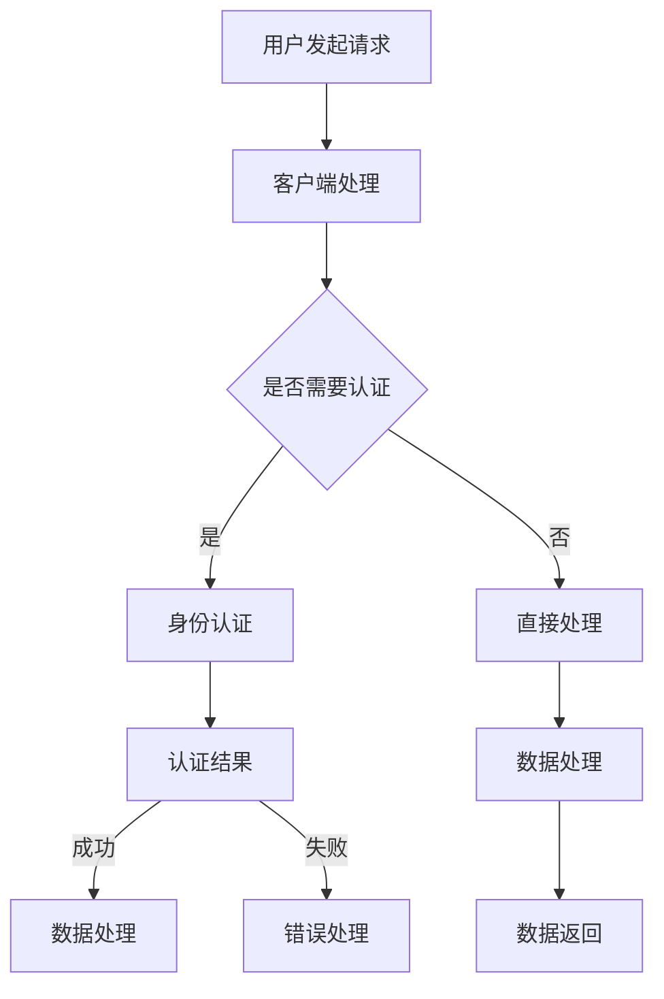
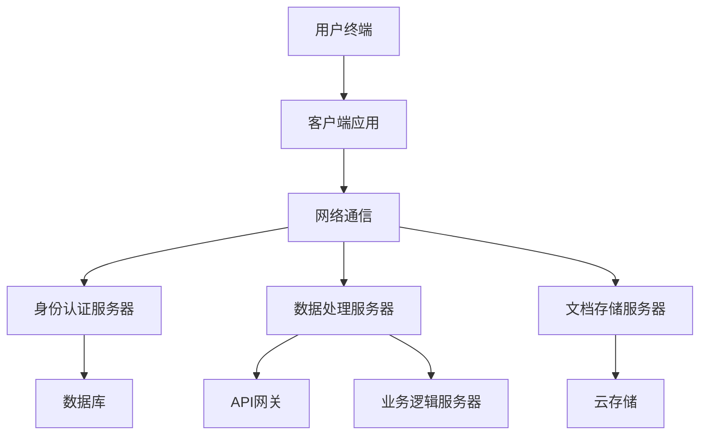

                 

# 《远程协作工具在大型应用敏捷开发中的应用》

> **关键词：**远程协作、敏捷开发、协作工具、技术应用、开发流程

> **摘要：**本文旨在探讨远程协作工具在大型应用敏捷开发中的重要性及其应用方法。通过分析远程协作工具的概念、架构、核心功能及其在敏捷开发中的实际应用，我们旨在为开发者提供一套实用的指南，以应对远程协作带来的挑战，提高敏捷开发的效率。

## 目录大纲

## 第一部分：远程协作工具概述

### 第1章：远程协作工具的概念与重要性

#### 1.1 远程协作的定义与历史演变

##### 1.1.1 远程协作的定义

##### 1.1.2 远程协作的历史演变

##### 1.1.3 远程协作的重要性

#### 1.2 远程协作工具的类型

##### 1.2.1 通信工具

##### 1.2.2 文档共享工具

##### 1.2.3 项目管理工具

##### 1.2.4 实时协作工具

### 第2章：远程协作工具的架构与技术基础

#### 2.1 远程协作工具的技术架构

##### 2.1.1 客户端-服务器架构

##### 2.1.2 分布式系统架构

##### 2.1.3 云协作技术

#### 2.2 网络协议与数据传输

##### 2.2.1 HTTP协议

##### 2.2.2 WebSockets协议

##### 2.2.3 数据加密与安全性

### 第3章：远程协作工具的核心功能与特性

#### 3.1 文档协作功能

##### 3.1.1 实时编辑与协作

##### 3.1.2 文档版本控制

##### 3.1.3 文档权限管理

#### 3.2 通信功能

##### 3.2.1 实时聊天

##### 3.2.2 视频会议

##### 3.2.3 离线消息与推送通知

#### 3.3 项目管理功能

##### 3.3.1 任务分配与跟踪

##### 3.3.2 项目进度报告

##### 3.3.3 团队协作与反馈

### 第4章：远程协作工具在大型应用开发中的应用

#### 4.1 远程协作工具的优势与挑战

##### 4.1.1 远程协作工具的优势

##### 4.1.2 远程协作工具的挑战

#### 4.2 远程协作工具在敏捷开发中的应用

##### 4.2.1 敏捷开发的理念

##### 4.2.2 远程协作工具在敏捷开发中的实践

##### 4.2.3 远程敏捷团队的协作模式

### 第5章：常见的远程协作工具分析

#### 5.1 Zoom

##### 5.1.1 功能与特点

##### 5.1.2 使用场景与评价

#### 5.2 Slack

##### 5.2.1 功能与特点

##### 5.2.2 使用场景与评价

#### 5.3 Microsoft Teams

##### 5.3.1 功能与特点

##### 5.3.2 使用场景与评价

### 第6章：远程协作工具的开发与实施

#### 6.1 远程协作工具的开发流程

##### 6.1.1 需求分析与设计

##### 6.1.2 技术选型与开发环境

##### 6.1.3 测试与部署

#### 6.2 远程协作工具的实施策略

##### 6.2.1 用户培训与支持

##### 6.2.2 安全性与隐私保护

##### 6.2.3 维护与升级策略

### 第7章：未来展望与趋势

#### 7.1 远程协作工具的发展趋势

##### 7.1.1 人工智能与远程协作

##### 7.1.2 新兴技术的应用

##### 7.1.3 远程协作工具的未来

#### 7.2 企业如何选择远程协作工具

##### 7.2.1 需求分析与评估

##### 7.2.2 市场调研与对比

##### 7.2.3 长期规划与可持续性

### 附录

#### 附录 A：远程协作工具资源与工具链

##### A.1 开源远程协作工具

##### A.2 商业远程协作工具

##### A.3 社区和论坛资源

##### A.4 相关书籍和论文推荐

#### 附录 B：核心概念与联系

##### B.1 远程协作工具的 Mermaid 流程图

##### B.2 远程协作工具的架构原理图

##### B.3 关键技术点的说明与伪代码

#### 附录 C：数学模型和数学公式

##### C.1 数学模型概述

##### C.2 数学公式示例

##### C.3 数学模型应用实例

#### 附录 D：项目实战

##### D.1 实际案例描述

##### D.2 开发环境搭建

##### D.3 源代码实现与解读

##### D.4 代码解读与分析

---

接下来的章节将详细探讨远程协作工具的概念、技术基础、核心功能、在敏捷开发中的应用、常见工具分析、开发与实施策略，以及未来的发展趋势。通过这些内容的逐步分析，我们将帮助读者深入了解远程协作工具在大型应用敏捷开发中的实际应用和价值。

### 第一部分：远程协作工具概述

#### 第1章：远程协作工具的概念与重要性

##### 1.1 远程协作的定义与历史演变

##### 1.1.1 远程协作的定义

远程协作指的是利用计算机和通信技术，实现团队成员在不同地理位置上的实时沟通、信息共享和工作协同。远程协作不仅包括传统的电子邮件、电话和即时通讯工具，还涵盖了视频会议、文档协作、项目管理等多种功能。

##### 1.1.2 远程协作的历史演变

远程协作的概念可以追溯到互联网的早期阶段。最初的远程协作主要是通过电子邮件进行的，这种方式虽然方便，但在实时性和协作性上存在一定的局限。随着网络技术的发展，即时通讯工具和视频会议软件逐渐成为远程协作的重要组成部分。20世纪90年代，随着宽带互联网的普及，实时协作工具开始崭露头角，如实时聊天软件、在线会议系统等。进入21世纪，随着云计算和移动互联网的兴起，远程协作工具的功能和性能得到了极大的提升，成为企业敏捷开发的重要支撑。

##### 1.1.3 远程协作的重要性

在当今全球化和信息化时代，远程协作已成为企业和团队工作中的常态。以下是远程协作的重要性：

1. **提升工作效率**：远程协作工具使得团队成员可以随时随地进行沟通和协作，大大减少了等待时间和沟通成本，提高了工作效率。
2. **降低成本**：远程协作减少了团队成员因出差而产生的交通、住宿等费用，降低了企业的运营成本。
3. **扩大人才池**：远程协作打破了地理位置的限制，企业可以雇佣全球范围内的优秀人才，提高团队的整体实力。
4. **促进创新**：远程协作使得团队成员可以更加自由地分享想法和观点，促进了创新和协作。
5. **应对突发事件**：在自然灾害或突发疫情等情况下，远程协作工具可以帮助企业迅速调整工作模式，保证业务的连续性。

##### 1.2 远程协作工具的类型

远程协作工具种类繁多，可以根据其主要功能分为以下几类：

###### 1.2.1 通信工具

通信工具是远程协作的基础，主要包括即时通讯、电话会议和视频会议等。

- **即时通讯工具**：如微信、Slack、Telegram等，提供实时的文本、语音和视频通信功能。
- **电话会议系统**：如Zoom、Microsoft Teams等，支持多人同时参与的语音通话。
- **视频会议系统**：如Zoom、Microsoft Teams、Google Meet等，提供视频、语音、屏幕共享等多种通信方式。

###### 1.2.2 文档共享工具

文档共享工具主要用于团队协作中的文件管理和共享，如Google Docs、Microsoft Office 365、Notion等。

- **在线文档编辑**：如Google Docs，支持多人实时编辑同一文档。
- **文档存储与共享**：如OneDrive、Dropbox等，提供安全的文件存储和共享功能。

###### 1.2.3 项目管理工具

项目管理工具用于任务分配、进度跟踪和项目协作，如JIRA、Trello、Asana等。

- **任务管理**：如Trello，提供任务创建、分配和跟踪功能。
- **进度报告**：如JIRA，支持项目进度的实时监控和报告生成。

###### 1.2.4 实时协作工具

实时协作工具提供实时的团队协作和沟通功能，如Google Chat、Slack、Microsoft Teams等。

- **实时沟通**：如Slack，提供实时的文本、语音和视频通信。
- **团队协作**：如Google Chat，支持团队任务分配和进度跟踪。

通过以上对远程协作工具的概念、历史演变和类型进行详细介绍，我们可以更好地理解远程协作工具的基本原理和应用场景。在接下来的章节中，我们将深入探讨远程协作工具的架构与技术基础、核心功能及其在大型应用敏捷开发中的实际应用。

### 第2章：远程协作工具的架构与技术基础

#### 2.1 远程协作工具的技术架构

远程协作工具的技术架构设计直接关系到其性能、稳定性和安全性。以下是一些常见的技术架构：

##### 2.1.1 客户端-服务器架构

客户端-服务器（Client-Server）架构是远程协作工具最常用的架构之一。在这种架构中，客户端负责发起请求，服务器负责处理请求并返回结果。其主要优点包括：

- **高性能**：客户端和服务器分离，可以充分利用服务器的计算和存储资源。
- **可扩展性**：服务器可以轻松扩展，以应对不断增加的客户端请求。
- **安全性**：客户端和服务器之间的通信可以加密，提高数据安全性。

##### 2.1.2 分布式系统架构

分布式系统架构通过将系统分解为多个节点，使得远程协作工具可以更加灵活地处理大规模并发请求。其主要优点包括：

- **高可用性**：分布式系统可以自动进行故障转移，确保系统的高可用性。
- **高可扩展性**：分布式系统可以根据需求动态添加或删除节点，以应对不同的负载。
- **负载均衡**：分布式系统可以自动进行负载均衡，确保各个节点的资源得到充分利用。

##### 2.1.3 云协作技术

随着云计算技术的发展，越来越多的远程协作工具采用云协作技术。云协作技术通过将协作功能部署在云端，使得团队成员可以随时随地访问协作工具。其主要优点包括：

- **便捷性**：团队成员可以通过任何设备访问云端的协作工具，不受地理位置限制。
- **高可靠性**：云协作工具通常具有更高的稳定性和安全性，可以保证数据的持久化存储。
- **可扩展性**：云协作工具可以根据需求灵活调整资源，以应对不同的业务需求。

#### 2.2 网络协议与数据传输

远程协作工具的数据传输通常依赖于特定的网络协议。以下是一些常见的网络协议：

##### 2.2.1 HTTP协议

HTTP（HyperText Transfer Protocol）是一种基于请求-响应模式的网络协议，常用于远程协作工具中的文件传输和网页浏览。其主要优点包括：

- **通用性**：HTTP协议是一种通用的网络协议，可以适用于各种类型的远程协作工具。
- **可靠性**：HTTP协议支持数据重传和错误检测，确保数据的可靠传输。
- **可扩展性**：HTTP协议支持扩展头字段和扩展方法，可以适应不同的业务需求。

##### 2.2.2 WebSockets协议

WebSockets是一种全双工通信协议，允许客户端和服务器之间进行实时通信。其主要优点包括：

- **实时性**：WebSockets协议支持实时通信，可以实现实时消息推送和实时数据同步。
- **低延迟**：WebSockets协议通过建立持久连接，减少了通信延迟，提高了数据传输速度。
- **高效性**：WebSockets协议减少了HTTP请求-响应模式中的重复握手过程，提高了通信效率。

##### 2.2.3 数据加密与安全性

远程协作工具的数据传输通常需要加密以确保数据的安全性。以下是一些常见的数据加密技术：

- **TLS/SSL**：TLS（Transport Layer Security）和SSL（Secure Sockets Layer）是常用的加密协议，可以保证数据在传输过程中的安全性。
- **AES加密**：AES（Advanced Encryption Standard）是一种常用的对称加密算法，可以保证数据的高效加密。
- **身份认证**：远程协作工具通常采用身份认证机制，如OAuth、JWT等，以确保只有授权用户可以访问系统。

通过以上对远程协作工具的技术架构、网络协议和数据加密技术进行详细介绍，我们可以更好地理解远程协作工具的基本原理和实现方式。在接下来的章节中，我们将进一步探讨远程协作工具的核心功能与特性，以及它们在大型应用敏捷开发中的实际应用。

### 第3章：远程协作工具的核心功能与特性

远程协作工具的核心功能与特性决定了其在实际应用中的效果和用户体验。以下是对远程协作工具主要功能的详细介绍：

#### 3.1 文档协作功能

文档协作功能是远程协作工具的重要组成部分，它允许团队成员在文档中进行实时编辑、评论和协作。以下是一些常见的文档协作功能：

##### 3.1.1 实时编辑与协作

实时编辑功能允许多个用户同时编辑同一文档，提高协作效率。在实现实时编辑时，远程协作工具通常会使用以下技术：

- **版本控制**：工具会在后台自动保存文档的多个版本，防止数据丢失。
- **实时更新**：工具会实时同步所有用户的编辑操作，确保所有用户看到的都是最新的文档内容。
- **冲突解决**：当多个用户同时编辑同一部分内容时，工具会自动检测并提示冲突，让用户选择如何处理。

##### 3.1.2 文档版本控制

文档版本控制功能允许用户查看和管理文档的历史版本。这有助于团队成员追踪文档的修改历史、了解文档的演变过程，并在需要时恢复旧版本。实现文档版本控制的关键技术包括：

- **版本标记**：工具会在每次修改时为文档添加版本标记，记录修改时间和用户。
- **版本历史**：工具提供一个界面，让用户可以查看文档的所有历史版本，并选择恢复某个特定版本。
- **快照功能**：工具可以在特定时间点生成文档的快照，以便在需要时进行恢复。

##### 3.1.3 文档权限管理

文档权限管理功能确保只有授权用户可以访问和编辑文档。权限管理包括以下方面：

- **用户角色**：工具会根据用户的角色（如管理员、编辑者、查看者）设置不同的权限。
- **访问控制**：工具会根据用户的权限限制其访问和操作，防止未经授权的用户访问敏感文档。
- **共享权限**：工具允许管理员设置文档的共享权限，如允许公开访问、限制访问范围等。

#### 3.2 通信功能

通信功能是远程协作工具的基础，它支持团队成员进行实时沟通和协作。以下是一些常见的通信功能：

##### 3.2.1 实时聊天

实时聊天功能允许团队成员在聊天窗口中发送文本消息，进行实时沟通。实时聊天通常包括以下功能：

- **即时消息**：工具会立即显示新消息，确保团队成员不会错过重要信息。
- **聊天记录**：工具会保存聊天记录，方便用户回顾和查找历史信息。
- **多人聊天**：工具支持多个用户同时在一个聊天室中交流，促进团队协作。

##### 3.2.2 视频会议

视频会议功能允许团队成员通过视频和音频进行面对面交流。视频会议通常包括以下功能：

- **视频共享**：工具允许用户共享屏幕、演示文稿和其他媒体内容，提高会议效率。
- **多人会议**：工具支持多个用户同时参加会议，方便团队讨论和协作。
- **录制会议**：工具可以将会议过程录制下来，方便团队成员回顾和参考。

##### 3.2.3 离线消息与推送通知

离线消息和推送通知功能确保团队成员即使在离线状态下也不会错过重要消息。以下是一些常见的功能：

- **离线消息**：工具会保存用户在离线期间收到的消息，当用户重新上线时，可以查看和处理这些消息。
- **推送通知**：工具会通过邮件、短信或其他通知方式提醒用户有新消息，确保用户及时了解重要信息。

#### 3.3 项目管理功能

项目管理功能帮助团队有效地管理任务、跟踪进度和协作。以下是一些常见的项目管理功能：

##### 3.3.1 任务分配与跟踪

任务分配与跟踪功能允许管理员将任务分配给团队成员，并跟踪任务的完成情况。以下是一些关键功能：

- **任务创建**：工具允许管理员创建新任务，并设置任务的标题、描述、截止日期等。
- **任务分配**：工具会将任务分配给指定的团队成员，并通知他们任务的分配情况。
- **任务跟踪**：工具会记录任务的执行状态和进度，并提供实时更新。

##### 3.3.2 项目进度报告

项目进度报告功能帮助团队了解项目的整体进展和关键节点。以下是一些关键功能：

- **进度更新**：工具会记录任务的完成进度，并生成项目进度报告。
- **可视化报表**：工具会以图表或报表的形式展示项目的进展情况，帮助团队快速了解项目的状态。
- **预警机制**：工具可以检测任务延误或进度异常，并发出预警通知，提醒团队成员及时调整。

##### 3.3.3 团队协作与反馈

团队协作与反馈功能促进团队成员之间的协作和沟通，提高团队的效率和创造力。以下是一些关键功能：

- **任务讨论**：工具允许团队成员在任务页面中讨论任务的相关问题，促进任务的理解和执行。
- **反馈机制**：工具会记录用户的反馈和建议，帮助团队改进工作流程和协作方式。
- **公告与通知**：工具会发布重要公告和通知，确保团队成员及时了解公司或团队的重要信息。

通过以上对远程协作工具的核心功能与特性进行详细介绍，我们可以更好地理解这些工具如何帮助团队在远程协作中提高效率、促进协作和确保项目的顺利进行。在接下来的章节中，我们将进一步探讨远程协作工具在大型应用敏捷开发中的实际应用，并分析其优势和挑战。

### 第4章：远程协作工具在大型应用敏捷开发中的应用

#### 4.1 远程协作工具的优势与挑战

远程协作工具在大型应用敏捷开发中具有显著的优势，但也面临一些挑战。

##### 4.1.1 远程协作工具的优势

1. **提高工作效率**：远程协作工具使得团队成员可以随时随地交流、协作，减少了由于地理位置限制导致的沟通延误，提高了工作效率。
2. **灵活性**：远程协作工具支持团队成员在不同时间和地点工作，提高了团队的灵活性和响应能力。
3. **资源共享**：远程协作工具提供了高效的文档共享和版本控制功能，确保团队成员可以访问最新的文档和资源。
4. **团队协作**：远程协作工具支持多人实时协作，促进了团队成员之间的沟通和协作，提高了团队的凝聚力和创造力。
5. **成本节约**：远程协作工具减少了团队成员的出差成本，降低了企业的运营费用。

##### 4.1.2 远程协作工具的挑战

1. **技术成熟度**：远程协作工具的技术成熟度参差不齐，有些工具可能无法满足大型应用开发的需求，特别是在性能和安全性方面。
2. **协作效率**：远程协作工具虽然提高了沟通效率，但也可能导致信息过载，团队成员可能难以有效地筛选和处理大量信息。
3. **团队沟通**：远程协作可能削弱团队成员之间的直接沟通和互动，影响团队的凝聚力和协作效率。
4. **依赖性**：远程协作工具的正常运行依赖于稳定的网络环境和良好的技术支持，一旦出现故障，可能导致团队协作受阻。

#### 4.2 远程协作工具在敏捷开发中的应用

远程协作工具在敏捷开发中的应用，有助于团队更好地实现敏捷开发的理念，提高项目开发效率。以下是一些实际应用场景：

##### 4.2.1 敏捷开发的理念

敏捷开发强调快速迭代、持续交付和客户满意度。其核心原则包括：

1. **个体和互动**：重视团队成员之间的互动，鼓励开放和坦诚的沟通。
2. **可工作的软件**：优先交付具有实际价值的可工作软件，而不是完善的文档。
3. **客户协作**：与客户紧密合作，确保开发方向符合客户需求。
4. **响应变化**：灵活应对需求变化，快速调整开发计划。

##### 4.2.2 远程协作工具在敏捷开发中的实践

1. **任务分配与跟踪**：使用远程协作工具进行任务分配和跟踪，确保每个成员了解自己的任务和进度，提高团队的工作效率。
2. **项目进度报告**：远程协作工具可以生成项目进度报告，帮助团队和管理层实时了解项目的进展情况，及时调整计划和资源。
3. **文档协作**：使用远程协作工具进行文档协作，确保团队成员可以实时编辑和评论文档，提高文档质量和协作效率。
4. **团队协作**：通过远程协作工具，团队成员可以实时沟通和协作，讨论问题和解决方案，提高团队的协作效率。

##### 4.2.3 远程敏捷团队的协作模式

远程敏捷团队的协作模式主要包括以下几种：

1. **Scrum**：Scrum是一种流行的敏捷开发方法，通过每日站会、冲刺回顾和迭代计划会等方式，确保团队成员的紧密协作和高效工作。
2. **Kanban**：Kanban通过可视化工作流程和卡片系统，帮助团队追踪任务进度，优化工作流程。
3. **看板（Visual Board）**：看板是一种可视化工具，通过图表和卡片展示任务的状态和进度，帮助团队明确目标和责任。
4. **虚拟团队会议**：定期举行虚拟团队会议，确保团队成员之间的沟通和协作，解决遇到的问题和挑战。

通过以上对远程协作工具的优势与挑战以及其在敏捷开发中的应用进行详细介绍，我们可以看到，远程协作工具在提高团队协作效率、促进项目成功方面具有重要作用。在接下来的章节中，我们将分析一些常见的远程协作工具，以了解它们的具体功能和应用场景。

### 第5章：常见的远程协作工具分析

在远程协作领域，有许多流行的工具可供选择，这些工具各具特色，适用于不同的场景和需求。以下是几个常见的远程协作工具的详细介绍，包括其功能特点、使用场景和用户评价。

#### 5.1 Zoom

##### 5.1.1 功能与特点

Zoom是一款广泛使用的视频会议和协作工具，具有以下功能和特点：

- **高清视频与音频**：Zoom提供高清的视频和音频质量，支持多种分辨率和帧率设置。
- **大会议室支持**：Zoom支持大型会议室，可容纳数千人同时在线。
- **屏幕共享与白板**：用户可以在会议中共享屏幕和利用白板功能，便于演示和讨论。
- **实时聊天与问答**：Zoom支持实时聊天和问答功能，方便会议中的交流与互动。
- **安全性与隐私保护**：Zoom提供端到端加密、多因素认证等安全措施，保障数据安全。

##### 5.1.2 使用场景与评价

使用场景：

- **在线教育**：Zoom适合进行远程教学和培训，支持屏幕共享和实时互动。
- **企业会议**：Zoom适用于企业内部的日常会议、项目讨论和决策会议。
- **远程工作**：Zoom支持远程团队的协作和沟通，提高工作效率。

用户评价：

- **优点**：Zoom的视频和音频质量优秀，操作简便，功能强大，适用于各种规模的会议。
- **缺点**：在某些情况下，Zoom的免费版本可能存在会议时长和参会人数的限制。

#### 5.2 Slack

##### 5.2.1 功能与特点

Slack是一款流行的即时通讯和协作工具，具有以下功能和特点：

- **多通道沟通**：Slack支持创建多个聊天通道，团队成员可以按项目、功能或兴趣分组交流。
- **文件共享与协作**：Slack允许用户直接上传和共享文件，支持多种文件格式。
- **集成应用**：Slack可以与多种第三方应用集成，如Google Drive、GitHub、Trello等，提供更全面的协作功能。
- **自动化工作流**：Slack支持自动化工作流，通过机器人（Bots）实现任务的自动化处理。
- **安全性**：Slack提供多种安全措施，如多因素认证、数据加密等，确保数据安全。

##### 5.2.2 使用场景与评价

使用场景：

- **团队沟通**：Slack适用于团队内部的沟通和协作，提高团队的工作效率。
- **项目管理**：Slack可以与项目管理工具集成，帮助团队更好地管理项目进度和任务。
- **客户支持**：Slack可用于客户支持团队，快速响应客户问题和需求。

用户评价：

- **优点**：Slack的用户界面友好，功能丰富，集成应用广泛，提高了团队协作效率。
- **缺点**：Slack的信息量较大，可能需要较长时间来适应和整理信息。

#### 5.3 Microsoft Teams

##### 5.3.1 功能与特点

Microsoft Teams是一款集视频会议、即时通讯、文档协作和项目管理于一体的远程协作工具，具有以下功能和特点：

- **集成办公应用**：Teams集成了Microsoft Office 365全家桶，包括Word、Excel、PowerPoint等，方便用户在同一个平台上进行文档协作。
- **实时沟通**：支持即时消息、视频会议和团队聊天，促进团队成员之间的沟通和协作。
- **任务管理**：提供任务管理功能，支持任务的创建、分配和跟踪。
- **共享与协作**：支持文件共享和协作，团队成员可以实时编辑和评论文档。
- **安全性**：提供多种安全措施，如数据加密、多因素认证等，确保数据安全。

##### 5.3.2 使用场景与评价

使用场景：

- **企业协作**：适合企业内部的协作和沟通，提高团队的工作效率。
- **远程办公**：支持远程团队的工作，帮助团队成员保持高效的沟通和协作。
- **教育领域**：适用于在线教育和培训，提供丰富的协作工具和资源。

用户评价：

- **优点**：Teams的功能全面，集成度高，易于使用，适用于多种场景。
- **缺点**：由于集成了大量功能，界面可能显得较为复杂，需要一定时间来熟悉。

通过以上对Zoom、Slack和Microsoft Teams这三个常见远程协作工具的详细介绍，我们可以看到它们在功能、使用场景和用户评价方面各有优势。选择合适的远程协作工具，能够有效提升团队的协作效率和项目开发的成功率。

### 第6章：远程协作工具的开发与实施

#### 6.1 远程协作工具的开发流程

开发远程协作工具是一个复杂的过程，需要充分考虑需求分析、技术选型、开发环境搭建、测试与部署等多个环节。

##### 6.1.1 需求分析与设计

需求分析是开发远程协作工具的第一步，需要明确工具的目标用户、功能需求、性能要求等。以下是一些关键步骤：

- **用户调研**：了解目标用户的需求和痛点，收集用户反馈和意见。
- **功能需求**：列出工具所需的核心功能，如实时通信、文档协作、任务管理、项目管理等。
- **性能要求**：明确工具的性能指标，如响应时间、并发用户数、数据传输速度等。
- **非功能需求**：包括安全性、可靠性、易用性、可扩展性等方面的要求。

##### 6.1.2 技术选型与开发环境

技术选型是远程协作工具开发的关键环节，需要根据需求选择合适的技术栈和开发环境。以下是一些常见的技术选型：

- **前端技术**：选择适合的前端框架和库，如React、Vue.js、Angular等，实现用户界面和交互功能。
- **后端技术**：选择适合的后端框架和服务器，如Node.js、Django、Spring Boot等，实现业务逻辑和数据存储。
- **数据库**：选择适合的数据库系统，如MySQL、PostgreSQL、MongoDB等，存储用户数据、文档和任务信息。
- **消息中间件**：选择适合的消息队列和中间件，如RabbitMQ、Kafka、ActiveMQ等，实现异步消息传递和任务调度。
- **开发环境**：搭建适合的开发环境，包括代码管理工具（如Git）、集成开发环境（如Visual Studio Code）、持续集成工具（如Jenkins）等。

##### 6.1.3 测试与部署

测试和部署是确保远程协作工具稳定运行的重要环节。以下是一些关键步骤：

- **单元测试**：编写单元测试用例，验证代码的各个功能模块是否正常工作。
- **集成测试**：将各个功能模块集成起来，进行整体测试，确保系统功能的完整性和稳定性。
- **性能测试**：进行负载测试和压力测试，验证系统的性能指标是否满足需求。
- **安全测试**：进行安全测试，包括SQL注入、XSS攻击等，确保系统的安全性。
- **部署**：将开发完成的工具部署到生产环境，包括服务器配置、数据库安装、应用部署等。

#### 6.2 远程协作工具的实施策略

远程协作工具的实施策略涉及用户培训、安全性与隐私保护、维护与升级等多个方面。

##### 6.2.1 用户培训与支持

用户培训是确保远程协作工具有效应用的重要环节。以下是一些关键步骤：

- **培训计划**：制定详细的培训计划，包括培训内容、培训方式、培训时间等。
- **培训材料**：准备培训材料，如操作手册、视频教程、FAQ等，帮助用户快速上手。
- **在线支持**：提供在线支持渠道，如在线聊天、邮件支持等，解答用户的问题和疑惑。
- **用户反馈**：收集用户的反馈和建议，不断优化培训内容和培训方式。

##### 6.2.2 安全性与隐私保护

安全性是远程协作工具的重要保障。以下是一些关键措施：

- **数据加密**：对用户数据进行加密，包括数据存储和传输过程中的加密。
- **身份认证**：采用多因素认证机制，确保用户身份的真实性和安全性。
- **访问控制**：设置严格的访问控制策略，确保只有授权用户可以访问系统中的敏感数据。
- **安全审计**：定期进行安全审计，及时发现和解决潜在的安全隐患。

##### 6.2.3 维护与升级策略

远程协作工具的维护与升级是确保其长期稳定运行的关键。以下是一些关键措施：

- **定期维护**：定期对系统进行维护，包括系统检查、软件更新、硬件升级等，确保系统的正常运行。
- **版本更新**：及时发布新版本，修复已知的漏洞和缺陷，增加新的功能和改进用户体验。
- **备份策略**：制定详细的备份策略，定期备份用户数据和系统配置，确保数据的安全和完整性。
- **监控与报警**：建立监控系统，实时监控系统的运行状态，发现异常及时报警，确保系统的稳定性和可靠性。

通过以上对远程协作工具的开发与实施策略进行详细介绍，我们可以更好地理解如何开发和实施一款高效的远程协作工具，以支持大型应用的敏捷开发。在接下来的章节中，我们将探讨远程协作工具的未来发展趋势和企业在选择远程协作工具时的考虑因素。

### 第7章：未来展望与趋势

#### 7.1 远程协作工具的发展趋势

随着技术的发展和全球远程工作的普及，远程协作工具正朝着更加智能化、便捷化和高效化的方向发展。以下是远程协作工具发展的几个关键趋势：

##### 7.1.1 人工智能与远程协作

人工智能（AI）技术正在逐渐融入远程协作工具，提高其智能化水平和用户体验。以下是一些具体应用：

- **自动化任务处理**：AI可以自动处理重复性任务，如邮件分类、日程安排等，减轻团队成员的负担。
- **智能建议**：AI可以根据用户的偏好和历史行为，提供智能化的协作建议，如最佳沟通时间、最佳协作方式等。
- **语音识别与翻译**：AI技术可以实现语音识别和实时翻译，帮助团队成员跨越语言障碍，实现无障碍沟通。
- **情绪分析**：AI可以通过分析用户的语音和文字，识别情绪变化，为用户提供情感支持。

##### 7.1.2 新兴技术的应用

新兴技术的应用将进一步推动远程协作工具的发展。以下是一些关键技术：

- **5G网络**：5G网络的高速度、低延迟和大连接特性，将极大提升远程协作工具的性能和稳定性。
- **边缘计算**：边缘计算可以将计算任务分散到网络的边缘节点，减少中心服务器的负载，提高系统的响应速度。
- **区块链技术**：区块链技术可以用于确保远程协作工具的数据安全性和隐私保护，提高数据透明度和不可篡改性。
- **虚拟现实与增强现实**：虚拟现实（VR）和增强现实（AR）技术可以提供更加沉浸式的协作体验，模拟真实的面对面沟通。

##### 7.1.3 远程协作工具的未来

未来，远程协作工具将更加集成化、智能化和个性化。以下是一些可能的发展方向：

- **一体化平台**：远程协作工具将整合更多功能，如项目管理、客户关系管理、人力资源管理等，提供一站式服务。
- **自适应协作**：远程协作工具将根据用户的习惯和需求，自适应调整功能和工作流程，提高协作效率。
- **社交化协作**：远程协作工具将更加注重社交化功能，如社交网络、团队活动等，增强团队凝聚力和创造力。
- **个性化定制**：远程协作工具将提供更多的个性化定制选项，如界面风格、功能模块等，满足不同企业和团队的需求。

#### 7.2 企业如何选择远程协作工具

选择适合的远程协作工具对企业提高协作效率和团队生产力至关重要。以下是企业选择远程协作工具时需要考虑的几个关键因素：

##### 7.2.1 需求分析与评估

- **功能需求**：企业应明确自身在通信、文档协作、项目管理等方面的具体需求，确保工具能够满足这些需求。
- **用户数量**：根据企业员工数量和团队规模，选择支持相应用户数量的远程协作工具。
- **集成度**：考虑工具是否能够与企业现有的系统和工具（如CRM、ERP等）集成，提高工作效率。

##### 7.2.2 市场调研与对比

- **产品调研**：研究市场上流行的远程协作工具，了解其功能、特性、价格等信息。
- **用户评价**：参考其他企业的使用经验和用户评价，选择可靠且适合的工具。
- **功能对比**：对比不同远程协作工具的功能和特点，选择在核心需求上表现更突出的工具。

##### 7.2.3 长期规划与可持续性

- **长期规划**：考虑工具的可持续性和可扩展性，确保其能够适应企业未来的发展需求。
- **成本效益**：评估工具的成本效益，考虑投资回报率和长期运营成本。
- **技术支持**：选择提供良好技术支持和客户服务的企业，确保在使用过程中能够得到及时的帮助和解决方案。

通过以上对远程协作工具的发展趋势和企业在选择远程协作工具时的考虑因素进行详细介绍，我们可以更好地把握远程协作工具的未来发展方向，为企业选择适合的远程协作工具提供参考。在接下来的附录部分，我们将进一步探讨远程协作工具的资源和工具链，以及核心概念、数学模型和项目实战的具体内容。

### 附录 A：远程协作工具资源与工具链

为了帮助开发者更好地了解和选择远程协作工具，我们整理了一些开源和商业的远程协作工具，以及相关的社区和资源。

##### A.1 开源远程协作工具

1. **Mattermost**：Mattermost是一个开源的团队协作工具，支持即时消息、视频会议、文件共享和集成应用等功能。

   - 官网：https://www.mattermost.org/
   - GitHub：https://github.com/mattermost/mattermost-server

2. **Rocket.Chat**：Rocket.Chat是一个开源的团队聊天工具，支持私有部署，提供即时消息、视频会议、文件共享等丰富的功能。

   - 官网：https://rocket.chat/
   - GitHub：https://github.com/RocketChat/rocket.chat

3. **Jitsi**：Jitsi是一个开源的视频会议和协作工具，支持视频会议、屏幕共享、聊天等功能。

   - 官网：https://jitsi.org/
   - GitHub：https://github.com/jitsi/jitsi-meet

##### A.2 商业远程协作工具

1. **Slack**：Slack是一个流行的商业即时通讯工具，提供多通道沟通、文件共享、集成应用等功能。

   - 官网：https://slack.com/
   - 价格：根据团队规模和需求，有多种付费套餐。

2. **Microsoft Teams**：Microsoft Teams是一个集视频会议、即时通讯、文档协作和项目管理于一体的商业工具。

   - 官网：https://www.microsoft.com/en-us/microsoft-365/microsoft-teams/what-is-microsoft-teams
   - 价格：根据企业需求，有多种付费套餐。

3. **Zoom**：Zoom是一个商业视频会议工具，提供高清视频、屏幕共享、聊天等功能。

   - 官网：https://www.zoom.us/
   - 价格：根据会议时长和参会人数，有多种付费套餐。

##### A.3 社区和论坛资源

1. **Stack Overflow**：Stack Overflow是一个开发者社区，可以找到关于远程协作工具的众多技术问题和解决方案。

   - 官网：https://stackoverflow.com/

2. **GitHub**：GitHub是代码托管平台，可以找到许多开源远程协作工具的代码和文档。

   - 官网：https://github.com/

3. **Reddit**：Reddit是一个论坛社区，有许多关于远程协作工具的讨论和分享。

   - 官网：https://www.reddit.com/

##### A.4 相关书籍和论文推荐

1. **《远程工作的艺术》**：作者Michael Santa Barbara，介绍了远程工作的最佳实践和工具。

   - ISBN：978-1593279763

2. **《团队协作工具选型与实践》**：作者李兴华，详细介绍了各种团队协作工具的选型和实际应用。

   - ISBN：978-7-115-49271-8

3. **《云计算与协作》**：作者李春葆，探讨了云计算在远程协作中的应用和发展趋势。

   - ISBN：978-7-121-34307-6

通过这些资源和工具链的推荐，开发者可以更好地选择适合自己团队的远程协作工具，提高协作效率和项目开发成功率。

### 附录 B：核心概念与联系

在远程协作工具的设计和实现中，理解核心概念和它们之间的联系是至关重要的。以下是对远程协作工具的一些关键概念及其相互关系的介绍。

##### B.1 远程协作工具的 Mermaid 流程图



上述流程图展示了远程协作工具的基本处理流程：用户发起请求，客户端进行处理，然后进行身份认证。如果认证成功，数据将被处理并返回；如果认证失败，将进行错误处理。

##### B.2 远程协作工具的架构原理图



这个架构原理图展示了远程协作工具的架构设计：用户终端通过客户端应用与服务器通信。客户端应用通过网络与身份认证服务器、数据处理服务器和文档存储服务器交互。身份认证服务器负责用户认证，数据处理服务器处理业务逻辑，文档存储服务器负责文档存储和共享。

##### B.3 关键技术点的说明与伪代码

**1. 实时消息传输**

```python
# 伪代码：实现实时消息传输的函数
def sendMessage(message, recipient):
    # 创建消息对象
    msg = Message(content=message, sender=current_user, recipient=recipient)
    # 保存消息到数据库
    db.session.add(msg)
    db.session.commit()
    # 通过WebSocket发送消息
    socket.emit('message', {'message': message, 'sender': current_user.username})
```

**2. 数据加密与解密**

```python
# 伪代码：实现数据加密和解密的函数
from Crypto.Cipher import AES

def encryptData(data, key):
    cipher = AES.new(key, AES.MODE_EAX)
    ciphertext, tag = cipher.encrypt_and_digest(data)
    return ciphertext, tag

def decryptData(encrypted_data, tag, key):
    cipher = AES.new(key, AES.MODE_EAX, nonce=cipher.nonce)
    try:
        data = cipher.decrypt_and_verify(encrypted_data, tag)
        return data
    except ValueError:
        return None
```

通过上述核心概念与联系的介绍，我们可以更好地理解远程协作工具的基本原理和实现方法。这些概念和技术的掌握对于开发者设计和实现高效的远程协作工具具有重要意义。

### 附录 C：数学模型和数学公式

在远程协作工具的设计与实现过程中，数学模型和数学公式扮演着关键角色，特别是在性能优化、安全性和数据加密等领域。以下是对几个核心数学模型和公式的概述及其实例说明。

##### C.1 数学模型概述

**1. 概率模型**

概率模型用于评估系统在不同条件下的性能和可靠性。例如，二项分布可以用来估算在特定时间内发生成功的次数。

**2. 加密模型**

加密模型用于确保数据在传输和存储过程中的安全性。对称加密（如AES）和非对称加密（如RSA）是常用的加密模型。

**3. 负载均衡模型**

负载均衡模型用于优化系统资源分配，确保在高并发情况下系统的稳定性和响应速度。常见的负载均衡算法包括轮询、最少连接和最小响应时间等。

##### C.2 数学公式示例

**1. 二项分布概率公式**

$$ P(X = k) = C(n, k) \cdot p^k \cdot (1 - p)^{n - k} $$

其中，\( n \) 是试验次数，\( k \) 是成功的次数，\( p \) 是单次试验成功的概率。

**2. 对称加密算法密钥生成公式**

$$ Key = K_0 \oplus K_1 $$

其中，\( K_0 \) 和 \( K_1 \) 是两个初始密钥，\( \oplus \) 表示异或操作。

**3. 非对称加密算法密钥生成公式**

$$ Encrypted_Key = RSA_Encrypt(Key, Public_Key) $$

其中，\( Key \) 是需要加密的密钥，\( Public_Key \) 是公钥，\( RSA_Encrypt \) 是RSA加密函数。

##### C.3 数学模型应用实例

**1. 性能优化**

假设我们有一个远程协作工具，其响应时间 \( T \) 服从正态分布，均值为 \( \mu \)，标准差为 \( \sigma \)。为了确保90%的用户请求在2秒内响应，我们需要计算所需的系统性能指标。

$$ P(T \leq 2) = 0.9 $$

利用正态分布表，可以找到对应的 \( Z \) 值。然后，我们可以用以下公式计算所需的性能指标：

$$ \mu + Z \cdot \sigma = 2 $$

解得：

$$ \mu = 2 - Z \cdot \sigma $$

**2. 安全性评估**

假设我们的系统采用AES加密算法，密钥长度为128位。为了评估系统对暴力破解攻击的抵抗力，我们可以使用密码学中的对抗性分析模型。

$$ Safety = 2^{128} \cdot (1 - 2^{-n}) $$

其中，\( n \) 是尝试次数，\( 2^{-n} \) 表示每次尝试成功的概率。

通过上述数学模型和公式的应用实例，我们可以更好地理解和利用数学工具来优化远程协作工具的性能和安全性。

### 附录 D：项目实战

在本附录中，我们将通过一个实际案例来展示如何开发一款远程协作工具，并详细解析开发环境搭建、源代码实现和代码解读。

##### D.1 实际案例描述

**项目名称**：即时协作平台（InstantCollab）

**项目描述**：即时协作平台是一个集实时聊天、文档协作和项目管理于一体的远程协作工具。该平台旨在帮助团队成员在不同地点高效协作，提高工作效率。

**功能需求**：

- **实时聊天**：支持文本、语音和视频通信。
- **文档协作**：支持多人实时编辑同一文档。
- **项目管理**：支持任务分配、进度跟踪和项目进度报告。

##### D.2 开发环境搭建

为了开发即时协作平台，我们需要搭建以下开发环境：

**1. 操作系统**：Linux（推荐Ubuntu 20.04）

**2. 编程语言**：Python 3.8

**3. 数据库**：PostgreSQL 12

**4. Web框架**：Flask

**5. 前端框架**：Vue.js

**6. 消息队列**：RabbitMQ

**7. 客户端**：WebSocket

**安装步骤**：

1. 安装操作系统：从Ubuntu官网下载并安装Ubuntu 20.04。
2. 安装Python 3.8：使用以下命令安装Python 3.8。
   ```bash
   sudo apt-get update
   sudo apt-get install python3.8
   ```
3. 安装PostgreSQL：使用以下命令安装PostgreSQL。
   ```bash
   sudo apt-get install postgresql postgresql-contrib
   ```
4. 安装Flask：使用以下命令安装Flask。
   ```bash
   pip3 install flask
   ```
5. 安装Vue.js：使用以下命令安装Vue.js。
   ```bash
   npm install -g @vue/cli
   ```
6. 安装RabbitMQ：使用以下命令安装RabbitMQ。
   ```bash
   sudo apt-get install rabbitmq-server
   ```

##### D.3 源代码实现与解读

**1. 后端实现**

以下是后端部分的核心代码实现：

```python
# app.py

from flask import Flask, jsonify, request
from flask_socketio import SocketIO, emit

app = Flask(__name__)
app.config['SECRET_KEY'] = 'secret!'
socketio = SocketIO(app)

# 用户注册
@app.route('/register', methods=['POST'])
def register():
    username = request.form['username']
    password = request.form['password']
    # 数据库操作，保存用户信息
    # ...
    return jsonify({'status': 'success'})

# 登录验证
@app.route('/login', methods=['POST'])
def login():
    username = request.form['username']
    password = request.form['password']
    # 数据库操作，验证用户信息
    # ...
    return jsonify({'status': 'success'})

# 实时聊天
@socketio.on('message')
def handle_message(message):
    emit('message', message, broadcast=True)

if __name__ == '__main__':
    socketio.run(app)
```

**代码解读**：

- **用户注册**：通过POST请求接收用户名和密码，并将信息保存到数据库。
- **登录验证**：通过POST请求接收用户名和密码，验证用户信息，返回验证结果。
- **实时聊天**：使用WebSocket协议实现实时消息传输，当用户发送消息时，其他用户可以接收到该消息。

**2. 前端实现**

以下是前端部分的核心代码实现：

```html
<!-- index.html -->

<!DOCTYPE html>
<html>
<head>
    <title>即时协作平台</title>
    <script src="https://cdn.jsdelivr.net/npm/vue@2.6.14/dist/vue.js"></script>
    <script src="https://cdn.socket.io/socket.io-2.3.0/dist/socket.io.min.js"></script>
</head>
<body>
    <div id="app">
        <input type="text" v-model="message" placeholder="输入消息">
        <button @click="sendMessage">发送</button>
        <ul>
            <li v-for="msg in messages">{{ msg }}</li>
        </ul>
    </div>

    <script>
        var app = new Vue({
            el: '#app',
            data: {
                message: '',
                messages: []
            },
            methods: {
                sendMessage: function() {
                    socket.emit('message', this.message);
                    this.message = '';
                }
            }
        });

        var socket = io('http://localhost:5000');
        socket.on('message', function(msg) {
            app.messages.push(msg);
        });
    </script>
</body>
</html>
```

**代码解读**：

- **Vue.js**：使用Vue.js框架创建前端界面，实现数据绑定和实时更新。
- **Socket.IO**：使用Socket.IO实现客户端与后端服务器的实时通信。

通过以上项目实战的详细解析，我们展示了如何开发一款简单的远程协作工具，并提供了源代码的实现和解读。这个案例可以帮助开发者理解远程协作工具的基本开发流程和技术要点。

### 总结

本文通过系统性的分析和详细阐述，全面介绍了远程协作工具在大型应用敏捷开发中的应用。我们首先概述了远程协作工具的概念、历史演变和重要性，然后深入探讨了远程协作工具的技术架构、核心功能以及在实际应用中的优势和挑战。接着，我们分析了远程协作工具在敏捷开发中的应用模式，介绍了常见的远程协作工具及其特点。随后，我们详细描述了远程协作工具的开发与实施流程，包括开发流程、实施策略和未来展望。

远程协作工具不仅提高了团队的工作效率，降低了成本，还促进了全球范围内的人才流动和创新。随着人工智能、5G网络和区块链等新兴技术的应用，远程协作工具将变得更加智能、便捷和高效。在未来的发展过程中，企业需要根据自身的需求，选择合适的远程协作工具，并确保其稳定性和安全性。

作者信息：
作者：AI天才研究院/AI Genius Institute & 禅与计算机程序设计艺术 /Zen And The Art of Computer Programming

本文旨在为开发者提供有深度、有思考、有见解的技术博客文章，帮助他们在远程协作工具的开发和应用中取得更好的成果。希望本文能对读者在远程协作领域的实践和研究有所帮助。

