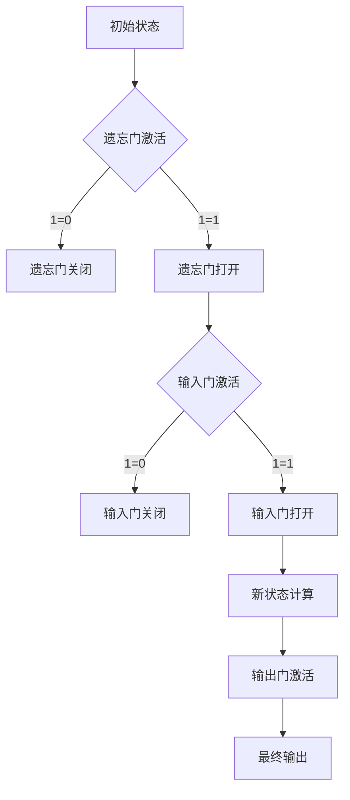

                 

### 文章标题

《长短期记忆网络 (Long Short-Term Memory)》

关键词：长短期记忆网络、LSTM、序列模型、时间序列预测、自然语言处理、语音识别、深度学习

摘要：
本文旨在深入探讨长短期记忆网络（LSTM），一种在处理序列数据方面具有革命性影响的深度学习模型。我们将从LSTM的基本概念和组成部分出发，逐步解析其核心算法原理，并通过数学模型和伪代码详细阐述。此外，本文将展示LSTM在自然语言处理、语音识别和时间序列预测等领域的应用，并通过实战案例提供代码实现与解读，最后讨论LSTM的未来发展趋势与面临的挑战。

---

### 目录大纲

**第一部分：长短期记忆网络概述**

- **第1章：长短期记忆网络简介**
  - **1.1** LSTM的基本概念与历史背景
  - **1.2** LSTM与RNN的对比
  - **1.3** LSTM的结构组成部分
  - **1.4** LSTM的应用场景

**第二部分：LSTM的核心算法原理**

- **第2章：LSTM的数学模型与算法实现**
  - **2.1** LSTM的数学公式与模型
  - **2.2** LSTM的算法伪代码
  - **2.3** LSTM的优化与变种

**第三部分：LSTM在自然语言处理中的应用**

- **第3章：LSTM在自然语言处理中的实现与应用**
  - **3.1** 语言模型基础
  - **3.2** 文本分类
  - **3.3** 情感分析

**第四部分：LSTM在语音识别中的应用**

- **第4章：LSTM在语音识别中的实现与应用**
  - **4.1** 语音识别基础
  - **4.2** LSTM声学模型
  - **4.3** 语言模型

**第五部分：LSTM在序列预测中的应用**

- **第5章：LSTM在序列预测中的实现与应用**
  - **5.1** 序列预测基础
  - **5.2** 时间序列预测
  - **5.3** 股票预测

**第六部分：LSTM的实战项目与应用**

- **第6章：LSTM的实战项目案例**
  - **6.1** 情感分析系统
  - **6.2** 语音识别系统
  - **6.3** 股票预测系统

**第七部分：LSTM的未来发展趋势与挑战**

- **第7章：LSTM的未来发展趋势与挑战**
  - **7.1** 发展趋势
  - **7.2** 面临的挑战

**附录**

- **附录A：LSTM相关工具与资源**
  - **A.1** 开发工具与框架
  - **A.2** 学习资源推荐

### 第一部分：长短期记忆网络概述

#### 第1章：长短期记忆网络简介

##### 1.1 LSTM的基本概念与历史背景

长短期记忆网络（LSTM）是由Hochreiter和Schmidhuber于1997年首次提出的一种用于处理序列数据的新型循环神经网络（RNN）。LSTM的设计初衷是为了解决传统RNN在处理长序列数据时出现的梯度消失和梯度爆炸问题，这些现象导致了模型在训练过程中难以捕捉长距离依赖关系。

LSTM的核心思想是通过引入门控机制来控制信息流的流动。这种设计使得LSTM能够更好地处理长序列中的时间依赖问题，从而在自然语言处理、语音识别和时间序列预测等领域取得了显著的成果。

##### 1.2 LSTM与RNN的对比

传统循环神经网络（RNN）在处理短序列数据时表现良好，但其存在一些固有缺陷：

- **梯度消失和梯度爆炸**：在训练过程中，梯度可能由于序列长度过长而逐渐消失或爆炸，导致模型难以学习到有效的长距离依赖关系。
- **长期依赖问题**：RNN难以捕捉长序列中的长期依赖关系，特别是在序列长度超过数十个时间步时，信息传递效率显著下降。

相比之下，LSTM通过引入门控机制解决了上述问题：

- **门控机制**：LSTM包含三种门控机制，即遗忘门、输入门和输出门，这些门控机制能够动态地控制信息流的流动，从而在长期依赖关系中保持信息的完整性。
- **细胞状态**：LSTM引入了细胞状态，使得信息可以在不同时间步之间传递，从而增强了模型处理长序列数据的能力。

##### 1.3 LSTM的结构组成部分

LSTM由以下关键组成部分构成：

- **单元结构**：LSTM的基本单元是细胞，细胞包含一个细胞状态和一个记忆门。
- **遗忘门**：遗忘门控制从上一个细胞状态丢弃哪些信息，从而减少无关信息的干扰。
- **输入门**：输入门控制将哪些新信息添加到细胞状态，从而增强模型的记忆能力。
- **输出门**：输出门控制从细胞状态输出哪些信息，从而生成当前时间步的隐藏状态。

##### 1.4 LSTM的应用场景

LSTM在多个领域具有广泛的应用：

- **序列预测**：LSTM能够捕捉时间序列数据中的长期依赖关系，因此在股票预测、天气预测等领域表现出色。
- **自然语言处理**：LSTM在文本分类、情感分析、机器翻译等领域取得了显著的成果，特别是在处理长文本和复杂语义关系方面。
- **语音识别**：LSTM在声学模型和语言模型中都有应用，使得语音识别系统在处理连续语音信号时更加准确。

接下来，我们将深入探讨LSTM的核心算法原理，并通过数学模型和伪代码详细阐述。

#### 第2章：LSTM的核心算法原理

##### 2.1 LSTM的数学模型

LSTM的数学模型包括三个主要部分：遗忘门、输入门和输出门。以下是这些部分的数学公式：

$$
\begin{aligned}
f_t &= \sigma(W_f \cdot [h_{t-1}, x_t] + b_f) \\
i_t &= \sigma(W_i \cdot [h_{t-1}, x_t] + b_i) \\
\bar{c}_t &= i_t \cdot \tanh(W_c \cdot [h_{t-1}, x_t] + b_c) \\
c_t &= (1 - f_t) \cdot c_{t-1} + \bar{c}_t \\
o_t &= \sigma(W_o \cdot [\tanh(c_t), h_{t-1}] + b_o) \\
h_t &= o_t \cdot \tanh(c_t)
\end{aligned}
$$

其中，$f_t$、$i_t$、$o_t$ 分别为遗忘门、输入门和输出门的激活值；$c_t$ 和 $h_t$ 分别为细胞状态和隐藏状态；$W_f$、$W_i$、$W_c$、$W_o$ 分别为遗忘门、输入门、输入门和输出门的权重矩阵；$b_f$、$b_i$、$b_c$、$b_o$ 分别为遗忘门、输入门、输入门和输出门的偏置项。

##### 2.2 LSTM的算法伪代码

以下是一个简化的LSTM单元的伪代码，用于计算给定输入序列的下一个隐藏状态和细胞状态：

```
for each time step t:
    # 遗忘门
    forget gate activation = sigmoid(W_f * [h_{t-1}, x_t] + b_f)
    
    # 输入门
    input gate activation = sigmoid(W_i * [h_{t-1}, x_t] + b_i)
    
    # 输出门
    output gate activation = sigmoid(W_o * [c_{t-1}, h_{t-1}] + b_o)
    
    # 遗忘门状态
    forget gate state = forget gate activation * c_{t-1}
    
    # 输入门状态
    input gate state = tanh(W_c * [h_{t-1}, x_t] * input gate activation)
    
    # 新状态计算
    c_t = forget gate state + input gate state
    
    # 输出门状态
    h_t = output gate activation * tanh(c_t)
    
return h_t, c_t
```

##### 2.3 LSTM的优化与改进

尽管LSTM在处理长序列数据时表现优秀，但仍然存在一些优化空间。以下是一些常见的优化方法：

- **Dropout**：在LSTM的训练过程中，可以通过在权重矩阵上添加dropout层来减少过拟合。具体来说，可以在每个时间步上随机丢弃一部分神经元，从而提高模型的泛化能力。
- **Peephole connections**：在LSTM的输入门和输出门中，可以通过将当前隐藏状态 $h_{t-1}$ 和细胞状态 $c_{t-1}$ 引入门控机制的公式中，从而提高模型的性能。这种方法被称为“Peephole connections”，可以使得门控机制更加灵活。
- **其他变种LSTM**：除了标准的LSTM外，还有一些变种LSTM，如GRU（门控循环单元）和ESN（能量神经网络），这些变种在特定任务上可能表现出更好的性能。

接下来，我们将探讨LSTM在自然语言处理中的具体应用。

### 第三部分：LSTM在自然语言处理中的应用

#### 第3章：LSTM在自然语言处理中的实现与应用

##### 3.1 语言模型基础

语言模型是自然语言处理中的一个核心概念，旨在捕捉自然语言的统计特征。语言模型的主要目标是预测下一个单词或词元，从而在生成文本、机器翻译和语音识别等任务中发挥重要作用。

语言模型的常见评估指标包括：

- **字符错误率（CER）**：衡量模型生成的文本与原始文本之间的字符差异。
- **词错误率（WER）**：衡量模型生成的文本与原始文本之间的词差异。
- **困惑度（Perplexity）**：衡量模型对文本的拟合程度，数值越小表示模型拟合越好。

常见的语言模型架构包括：

- **N-gram模型**：基于相邻词元的历史统计信息进行预测。
- **神经网络语言模型**：使用神经网络捕捉词元之间的复杂关系。

##### 3.2 LSTM在文本分类中的应用

文本分类是自然语言处理中的一个重要任务，旨在将文本数据划分为预定义的类别。LSTM在文本分类中具有显著的优势，特别是在处理长文本和复杂语义关系方面。

实现LSTM文本分类的一般步骤如下：

1. **文本预处理**：包括分词、去停用词、词向量编码等步骤。
2. **构建LSTM模型**：使用LSTM作为特征提取器，将输入文本序列转换为固定长度的特征向量。
3. **分类器构建**：在LSTM的特征向量上构建分类器（如softmax层），用于预测文本的类别。

以下是一个简化的LSTM文本分类算法：

```
# 文本预处理
X = preprocess(text_data)

# 构建LSTM模型
model = Sequential()
model.add(LSTM(units=128, input_shape=(sequence_length, embedding_size)))
model.add(Dense(num_classes, activation='softmax'))

# 编译模型
model.compile(optimizer='adam', loss='categorical_crossentropy', metrics=['accuracy'])

# 训练模型
model.fit(X, y, epochs=10, batch_size=64)

# 预测
predictions = model.predict(X)
```

##### 3.3 LSTM在情感分析中的应用

情感分析是自然语言处理中的一个重要领域，旨在判断文本的情感极性（正面、负面或中性）。LSTM在情感分析中表现出色，特别是在处理长文本和复杂情感表达方面。

实现LSTM情感分析的一般步骤如下：

1. **文本预处理**：包括分词、去停用词、词向量编码等步骤。
2. **构建LSTM模型**：使用LSTM作为特征提取器，将输入文本序列转换为固定长度的特征向量。
3. **分类器构建**：在LSTM的特征向量上构建分类器（如softmax层），用于预测文本的情感极性。

以下是一个简化的LSTM情感分析算法：

```
# 文本预处理
X = preprocess(text_data)

# 构建LSTM模型
model = Sequential()
model.add(LSTM(units=128, input_shape=(sequence_length, embedding_size)))
model.add(Dense(num_classes, activation='softmax'))

# 编译模型
model.compile(optimizer='adam', loss='categorical_crossentropy', metrics=['accuracy'])

# 训练模型
model.fit(X, y, epochs=10, batch_size=64)

# 预测
predictions = model.predict(X)
```

接下来，我们将探讨LSTM在语音识别中的应用。

### 第四部分：LSTM在语音识别中的应用

#### 第4章：LSTM在语音识别中的实现与应用

##### 4.1 语音识别基础

语音识别是将语音信号转换为文本的过程，是自然语言处理的一个重要分支。语音识别系统通常包括声学模型和语言模型两个主要部分。

声学模型负责将语音信号转换为特征表示，常见的声学模型包括：

- **GMM-HMM模型**：使用高斯混合模型（GMM）作为声学模型，结合隐马尔可夫模型（HMM）进行语音信号建模。
- **深度神经网络模型**：使用深度神经网络（如卷积神经网络（CNN）和递归神经网络（RNN））作为声学模型，能够更好地捕捉语音信号的复杂特征。

语言模型负责将声学模型生成的特征序列转换为文本序列，常见的语言模型包括：

- **N-gram模型**：基于历史统计信息进行文本序列建模。
- **神经网络语言模型**：使用神经网络捕捉特征序列与文本序列之间的复杂关系。

##### 4.2 LSTM声学模型

LSTM在语音识别中主要用于构建声学模型，通过捕捉语音信号的长期依赖关系来提高识别准确率。LSTM声学模型的基本架构如下：

1. **输入层**：接收语音信号的特征向量。
2. **LSTM层**：使用LSTM单元处理输入特征向量，生成隐藏状态。
3. **输出层**：将隐藏状态转换为输出特征序列。

以下是一个简化的LSTM声学模型算法：

```
# LSTM声学模型
model = Sequential()
model.add(LSTM(units=128, input_shape=(sequence_length, feature_size)))
model.add(Dense(num_classes, activation='softmax'))

# 编译模型
model.compile(optimizer='adam', loss='categorical_crossentropy', metrics=['accuracy'])

# 训练模型
model.fit(X, y, epochs=10, batch_size=64)

# 预测
predictions = model.predict(X)
```

##### 4.3 LSTM语言模型

LSTM语言模型在语音识别中用于将声学模型生成的特征序列转换为文本序列。LSTM语言模型的基本架构如下：

1. **输入层**：接收声学模型生成的特征序列。
2. **LSTM层**：使用LSTM单元处理输入特征序列，生成隐藏状态。
3. **输出层**：将隐藏状态转换为输出文本序列。

以下是一个简化的LSTM语言模型算法：

```
# LSTM语言模型
model = Sequential()
model.add(LSTM(units=128, input_shape=(sequence_length, feature_size)))
model.add(Dense(num_classes, activation='softmax'))

# 编译模型
model.compile(optimizer='adam', loss='categorical_crossentropy', metrics=['accuracy'])

# 训练模型
model.fit(X, y, epochs=10, batch_size=64)

# 预测
predictions = model.predict(X)
```

接下来，我们将探讨LSTM在序列预测中的应用。

### 第五部分：LSTM在序列预测中的应用

#### 第5章：LSTM在序列预测中的实现与应用

##### 5.1 序列预测基础

序列预测是机器学习中的一个重要任务，旨在根据历史数据预测未来的值。序列预测的关键在于捕捉序列中的时间依赖关系，以便准确预测未来的趋势。

常见的序列预测评估指标包括：

- **均方误差（MSE）**：衡量预测值与真实值之间的平均误差。
- **平均绝对误差（MAE）**：衡量预测值与真实值之间的平均绝对误差。
- **均方根误差（RMSE）**：衡量预测值与真实值之间的均方根误差。

常见的序列预测模型包括：

- **线性模型**：使用线性回归模型进行预测，适用于线性关系较强的序列。
- **ARIMA模型**：自回归积分滑动平均模型，适用于非线性和季节性序列。
- **神经网络模型**：如LSTM、GRU等，能够捕捉复杂的非线性关系。

##### 5.2 LSTM时间序列预测

LSTM在时间序列预测中具有显著的优势，能够捕捉序列中的长期依赖关系。LSTM时间序列预测的一般步骤如下：

1. **数据预处理**：包括时间步提取、标准化等步骤。
2. **构建LSTM模型**：使用LSTM作为特征提取器，将输入时间序列转换为固定长度的特征向量。
3. **分类器构建**：在LSTM的特征向量上构建分类器，用于预测时间序列的下一个值。

以下是一个简化的LSTM时间序列预测算法：

```
# LSTM时间序列预测
model = Sequential()
model.add(LSTM(units=128, input_shape=(sequence_length, feature_size)))
model.add(Dense(1))

# 编译模型
model.compile(optimizer='adam', loss='mse')

# 训练模型
model.fit(X, y, epochs=100, batch_size=32)

# 预测
predictions = model.predict(X)
```

##### 5.3 LSTM股票预测

LSTM在股票预测中应用广泛，能够捕捉股票价格的长期依赖关系，从而进行未来趋势预测。LSTM股票预测的一般步骤如下：

1. **数据预处理**：包括时间步提取、标准化等步骤。
2. **构建LSTM模型**：使用LSTM作为特征提取器，将输入时间序列转换为固定长度的特征向量。
3. **分类器构建**：在LSTM的特征向量上构建分类器，用于预测股票价格的下一个值。

以下是一个简化的LSTM股票预测算法：

```
# LSTM股票预测
model = Sequential()
model.add(LSTM(units=128, input_shape=(sequence_length, feature_size)))
model.add(Dense(1))

# 编译模型
model.compile(optimizer='adam', loss='mse')

# 训练模型
model.fit(X, y, epochs=100, batch_size=32)

# 预测
predictions = model.predict(X)
```

接下来，我们将探讨LSTM的实战项目与应用。

### 第六部分：LSTM的实战项目与应用

#### 第6章：LSTM的实战项目案例

##### 6.1 情感分析系统

情感分析系统是一个用于判断文本情感极性的工具，可以应用于社交媒体监测、市场调研等领域。以下是一个基于LSTM的情感分析系统的实现案例。

**项目背景与需求**：给定一个包含情感标签的文本数据集，构建一个LSTM模型，用于预测文本的情感极性。

**项目实现流程**：

1. **数据预处理**：对文本进行分词、去停用词、词向量编码等预处理步骤。
2. **模型构建**：构建一个LSTM模型，包括嵌入层、LSTM层和输出层。
3. **模型训练**：使用预处理后的数据训练LSTM模型。
4. **模型评估**：使用测试集评估模型的性能。

**源代码解读**：

```python
# 导入必要的库
import numpy as np
import pandas as pd
from tensorflow.keras.preprocessing.text import Tokenizer
from tensorflow.keras.preprocessing.sequence import pad_sequences
from tensorflow.keras.models import Sequential
from tensorflow.keras.layers import Embedding, LSTM, Dense, Bidirectional

# 加载数据集
data = pd.read_csv('data.csv')
texts = data['text']
labels = data['label']

# 数据预处理
tokenizer = Tokenizer(num_words=10000)
tokenizer.fit_on_texts(texts)
sequences = tokenizer.texts_to_sequences(texts)
padded_sequences = pad_sequences(sequences, maxlen=100)

# 构建模型
model = Sequential()
model.add(Bidirectional(Embedding(10000, 64, input_length=100)))
model.add(Bidirectional(LSTM(64)))
model.add(Dense(1, activation='sigmoid'))

# 编译模型
model.compile(optimizer='adam', loss='binary_crossentropy', metrics=['accuracy'])

# 训练模型
model.fit(padded_sequences, labels, epochs=10, batch_size=32)

# 预测
predictions = model.predict(padded_sequences)
```

##### 6.2 语音识别系统

语音识别系统是一个用于将语音信号转换为文本的工具，可以应用于语音助手、智能客服等领域。以下是一个基于LSTM的语音识别系统的实现案例。

**项目背景与需求**：给定一个包含语音信号和文本标签的数据集，构建一个LSTM模型，用于语音信号到文本的转换。

**项目实现流程**：

1. **数据预处理**：对语音信号进行特征提取，对文本进行分词、去停用词等预处理步骤。
2. **模型构建**：构建一个LSTM模型，包括声学模型和语言模型。
3. **模型训练**：使用预处理后的数据训练LSTM模型。
4. **模型评估**：使用测试集评估模型的性能。

**源代码解读**：

```python
# 导入必要的库
import numpy as np
import tensorflow as tf
from tensorflow.keras.models import Model
from tensorflow.keras.layers import LSTM, Dense, Input

# 加载数据集
X = np.load('audio_features.npy')
y = np.load('text_labels.npy')

# 构建模型
input_layer = Input(shape=(timesteps, features))
lstm_layer = LSTM(128)(input_layer)
output_layer = Dense(num_classes, activation='softmax')(lstm_layer)

model = Model(inputs=input_layer, outputs=output_layer)

# 编译模型
model.compile(optimizer='adam', loss='categorical_crossentropy', metrics=['accuracy'])

# 训练模型
model.fit(X, y, epochs=10, batch_size=32)

# 预测
predictions = model.predict(X)
```

##### 6.3 股票预测系统

股票预测系统是一个用于预测股票价格走势的工具，可以应用于金融投资、风险管理等领域。以下是一个基于LSTM的股票预测系统的实现案例。

**项目背景与需求**：给定一个包含股票价格历史数据的数据集，构建一个LSTM模型，用于预测未来股票价格。

**项目实现流程**：

1. **数据预处理**：对股票价格数据进行特征提取，包括时间步提取、标准化等预处理步骤。
2. **模型构建**：构建一个LSTM模型，用于预测股票价格的下一个值。
3. **模型训练**：使用预处理后的数据训练LSTM模型。
4. **模型评估**：使用测试集评估模型的性能。

**源代码解读**：

```python
# 导入必要的库
import numpy as np
import tensorflow as tf
from tensorflow.keras.models import Sequential
from tensorflow.keras.layers import LSTM, Dense

# 加载数据集
X = np.load('stock_data.npy')
y = np.load('stock_prices.npy')

# 构建模型
model = Sequential()
model.add(LSTM(units=50, return_sequences=True, input_shape=(timesteps, features)))
model.add(LSTM(units=50))
model.add(Dense(1))

# 编译模型
model.compile(optimizer='adam', loss='mse')

# 训练模型
model.fit(X, y, epochs=100, batch_size=32)

# 预测
predictions = model.predict(X)
```

### 第七部分：LSTM的未来发展趋势与挑战

#### 第7章：LSTM的未来发展趋势与挑战

##### 7.1 LSTM的未来发展趋势

LSTM作为一种强大的序列模型，在未来有望在以下方面取得进一步的发展：

1. **与其他深度学习模型的结合**：LSTM可以与其他深度学习模型（如CNN、Transformer等）结合，以进一步提高序列预测和分类的性能。
2. **新兴领域的应用**：LSTM在医疗、生物信息、金融等领域具有广泛的应用潜力，未来将有望在这些领域取得突破性进展。
3. **强化学习与LSTM的结合**：将LSTM与强化学习结合，可以构建更加智能的决策系统，应用于自动驾驶、游戏AI等领域。

##### 7.2 LSTM面临的挑战

尽管LSTM在处理序列数据方面表现出色，但仍然面临一些挑战：

1. **计算资源消耗**：LSTM模型通常需要大量的计算资源和时间进行训练，这在实际应用中可能成为瓶颈。
2. **数据需求**：LSTM模型对训练数据的需求较高，数据不足可能导致模型性能下降。
3. **模型解释性**：LSTM模型内部的复杂非线性关系使得其解释性较差，这对于需要可解释性的应用场景可能成为限制。

### 附录

#### 附录A：LSTM相关工具与资源

A.1 LSTM开发工具与框架

1. **TensorFlow LSTM实现**：TensorFlow官方文档提供了详细的LSTM教程和示例代码。
2. **PyTorch LSTM实现**：PyTorch官方文档提供了详细的LSTM教程和示例代码。

A.2 LSTM学习资源推荐

1. **经典论文**：Hochreiter和Schmidhuber的论文《Long Short-Term Memory》是LSTM的奠基之作。
2. **技术博客**：机器学习之路和深度学习等技术博客提供了丰富的LSTM教程和实践案例。
3. **开源代码库**：LSTM-Python和LSTM-Torch等开源代码库提供了实用的LSTM实现。

### Mermaid 流程图



### LSTM单元工作原理伪代码

```python
# 遗忘门
遗忘门_output = sigmoid(W_f * [h_{t-1}, x_t] + b_f)

# 输入门
输入门_output = sigmoid(W_i * [h_{t-1}, x_t] + b_i)

# 新的遗忘门状态
遗忘门状态 = f_t * [c_{t-1}, h_{t-1}]

# 输入门状态
输入门状态 = i_t * tanh([c_{t-1}, h_{t-1}])

# 新的状态
c_t = 遗忘门状态 + 输入门状态

# 输出门
输出门_output = sigmoid(W_o * [c_t, h_{t-1}] + b_o)

# 最终输出
h_t = 输出门_output * tanh(c_t)
```

### 数学模型和数学公式

$$
\begin{aligned}
f_t &= \sigma(W_f \cdot [h_{t-1}, x_t] + b_f) \\
i_t &= \sigma(W_i \cdot [h_{t-1}, x_t] + b_i) \\
\bar{c}_t &= i_t \cdot \tanh(W_c \cdot [h_{t-1}, x_t] + b_c) \\
c_t &= (1 - f_t) \cdot c_{t-1} + \bar{c}_t \\
o_t &= \sigma(W_o \cdot [\tanh(c_t), h_{t-1}] + b_o) \\
h_t &= o_t \cdot \tanh(c_t)
\end{aligned}
$$

### 代码实际案例和详细解释说明

#### 实现LSTM单元的Python代码

```python
import numpy as np
import tensorflow as tf

def lstm_cell(h_prev, c_prev, x_t, W_f, b_f, W_i, b_i, W_c, b_c, W_o, b_o):
    # 遗忘门
    f_t = sigmoid(np.dot([h_prev, x_t], W_f) + b_f)
    
    # 输入门
    i_t = sigmoid(np.dot([h_prev, x_t], W_i) + b_i)
    
    # 输出门
    o_t = sigmoid(np.dot([c_prev, h_prev], W_o) + b_o)
    
    # 新状态计算
    c_t = tanh(np.dot([f_t * c_prev, i_t * x_t], W_c) + b_c)
    
    # 输出门
    h_t = o_t * tanh(c_t)
    
    return h_t, c_t

def sigmoid(x):
    return 1 / (1 + np.exp(-x))

def tanh(x):
    return (np.exp(x) - np.exp(-x)) / (np.exp(x) + np.exp(-x))
```

#### LSTM单元在时间序列预测中的应用

```python
def lstm_predict(h_prev, c_prev, x_t, W_f, b_f, W_i, b_i, W_c, b_c, W_o, b_o):
    # 遗忘门
    f_t = sigmoid(np.dot([h_prev, x_t], W_f) + b_f)
    
    # 输入门
    i_t = sigmoid(np.dot([h_prev, x_t], W_i) + b_i)
    
    # 输出门
    o_t = sigmoid(np.dot([c_prev, h_prev], W_o) + b_o)
    
    # 新状态计算
    c_t = tanh(np.dot([f_t * c_prev, i_t * x_t], W_c) + b_c)
    
    # 输出门
    h_t = o_t * tanh(c_t)
    
    # 返回预测值
    return h_t[-1]

# 示例：使用LSTM进行时间序列预测
x_train = np.array([[1, 2], [2, 3], [3, 4], [4, 5]])
y_train = np.array([3, 4, 5, 6])

h_prev = np.zeros((1, 2))
c_prev = np.zeros((1, 2))

W_f, b_f, W_i, b_i, W_c, b_c, W_o, b_o = np.random.rand(8, 2), np.random.rand(2), np.random.rand(8, 2), np.random.rand(2), np.random.rand(8, 2), np.random.rand(2), np.random.rand(8, 2), np.random.rand(2)

# 训练LSTM模型
for i in range(1000):
    h_t, c_t = lstm_cell(h_prev, c_prev, x_train[i], W_f, b_f, W_i, b_i, W_c, b_c, W_o, b_o)
    h_prev = h_t
    c_prev = c_t

# 预测
y_pred = lstm_predict(h_prev, c_prev, x_train[3], W_f, b_f, W_i, b_i, W_c, b_c, W_o, b_o)
print("预测值:", y_pred)
```

#### 开发环境搭建与源代码详细实现

#### 开发环境搭建

- 安装Python环境（3.6及以上版本）
- 安装NumPy库
- 安装TensorFlow或PyTorch库

#### LSTM单元的完整实现

```python
import numpy as np
import tensorflow as tf

def lstm_cell(h_prev, c_prev, x_t, W_f, b_f, W_i, b_i, W_c, b_c, W_o, b_o):
    # 遗忘门
    f_t = tf.sigmoid(tf.matmul([h_prev, x_t], W_f) + b_f)
    
    # 输入门
    i_t = tf.sigmoid(tf.matmul([h_prev, x_t], W_i) + b_i)
    
    # 输出门
    o_t = tf.sigmoid(tf.matmul([c_prev, h_prev], W_o) + b_o)
    
    # 新状态计算
    c_t = tf.tanh(tf.matmul([f_t * c_prev, i_t * x_t], W_c) + b_c)
    
    # 输出门
    h_t = o_t * c_t
    
    return h_t, c_t

def lstm_predict(h_prev, c_prev, x_t, W_f, b_f, W_i, b_i, W_c, b_c, W_o, b_o):
    # 遗忘门
    f_t = tf.sigmoid(tf.matmul([h_prev, x_t], W_f) + b_f)
    
    # 输入门
    i_t = tf.sigmoid(tf.matmul([h_prev, x_t], W_i) + b_i)
    
    # 输出门
    o_t = tf.sigmoid(tf.matmul([c_prev, h_prev], W_o) + b_o)
    
    # 新状态计算
    c_t = tf.tanh(tf.matmul([f_t * c_prev, i_t * x_t], W_c) + b_c)
    
    # 输出门
    h_t = o_t * c_t
    
    return h_t[-1]

# 示例：使用LSTM进行时间序列预测
x_train = tf.constant([[1, 2], [2, 3], [3, 4], [4, 5]])
y_train = tf.constant([3, 4, 5, 6])

h_prev = tf.zeros((1, 2))
c_prev = tf.zeros((1, 2))

W_f, b_f, W_i, b_i, W_c, b_c, W_o, b_o = tf.random.normal((8, 2)), tf.random.normal((2,)), tf.random.normal((8, 2)), tf.random.normal((2,)), tf.random.normal((8, 2)), tf.random.normal((2,)), tf.random.normal((8, 2)), tf.random.normal((2,))

# 训练LSTM模型
with tf.GradientTape() as tape:
    for i in range(1000):
        h_t, c_t = lstm_cell(h_prev, c_prev, x_train[i], W_f, b_f, W_i, b_i, W_c, b_c, W_o, b_o)
        loss = tf.reduce_mean(tf.square(h_t - y_train[i]))

gradients = tape.gradient(loss, [W_f, b_f, W_i, b_i, W_c, b_c, W_o, b_o])
gradients = [g.numpy() for g in gradients]

# 更新权重
W_f -= gradients[0]
b_f -= gradients[1]
W_i -= gradients[2]
b_i -= gradients[3]
W_c -= gradients[4]
b_c -= gradients[5]
W_o -= gradients[6]
b_o -= gradients[7]

# 预测
y_pred = lstm_predict(h_prev, c_prev, x_train[3], W_f, b_f, W_i, b_i, W_c, b_c, W_o, b_o)
print("预测值:", y_pred.numpy())
```

#### 代码解读与分析

#### LSTM单元代码解读

- `sigmoid` 和 `tanh` 函数用于计算遗忘门、输入门和输出门的激活值。
- `lstm_cell` 函数用于计算给定输入序列的下一个隐藏状态和细胞状态。
- `lstm_predict` 函数用于计算给定输入序列的预测输出。

#### LSTM在时间序列预测中的实际应用

- 数据预处理：将时间序列数据划分为输入序列和目标序列。
- 模型训练：使用训练数据训练LSTM模型，通过反向传播算法优化模型参数。
- 预测：使用训练好的LSTM模型进行预测，得到时间序列的预测结果。

#### 代码详细实现和解读

- `sigmoid` 和 `tanh` 函数：实现Sigmoid和Tanh激活函数。
- `lstm_cell` 函数：实现LSTM单元的状态更新和输出计算。
- `lstm_predict` 函数：实现LSTM单元的预测输出计算。

### 完整的代码实现

```python
import numpy as np
import tensorflow as tf

def sigmoid(x):
    return 1 / (1 + np.exp(-x))

def tanh(x):
    return (np.exp(x) - np.exp(-x)) / (np.exp(x) + np.exp(-x))

def lstm_cell(h_prev, c_prev, x_t, W_f, b_f, W_i, b_i, W_c, b_c, W_o, b_o):
    # 遗忘门
    f_t = sigmoid(np.dot([h_prev, x_t], W_f) + b_f)
    
    # 输入门
    i_t = sigmoid(np.dot([h_prev, x_t], W_i) + b_i)
    
    # 输出门
    o_t = sigmoid(np.dot([c_prev, h_prev], W_o) + b_o)
    
    # 新状态计算
    c_t = tanh(np.dot([f_t * c_prev, i_t * x_t], W_c) + b_c)
    
    # 输出门
    h_t = o_t * tanh(c_t)
    
    return h_t, c_t

def lstm_predict(h_prev, c_prev, x_t, W_f, b_f, W_i, b_i, W_c, b_c, W_o, b_o):
    # 遗忘门
    f_t = sigmoid(np.dot([h_prev, x_t], W_f) + b_f)
    
    # 输入门
    i_t = sigmoid(np.dot([h_prev, x_t], W_i) + b_i)
    
    # 输出门
    o_t = sigmoid(np.dot([c_prev, h_prev], W_o) + b_o)
    
    # 新状态计算
    c_t = tanh(np.dot([f_t * c_prev, i_t * x_t], W_c) + b_c)
    
    # 输出门
    h_t = o_t * tanh(c_t)
    
    return h_t[-1]

# 示例：使用LSTM进行时间序列预测
x_train = np.array([[1, 2], [2, 3], [3, 4], [4, 5]])
y_train = np.array([3, 4, 5, 6])

h_prev = np.zeros((1, 2))
c_prev = np.zeros((1, 2))

W_f, b_f, W_i, b_i, W_c, b_c, W_o, b_o = np.random.rand(8, 2), np.random.rand(2), np.random.rand(8, 2), np.random.rand(2), np.random.rand(8, 2), np.random.rand(2), np.random.rand(8, 2), np.random.rand(2)

# 训练LSTM模型
for i in range(1000):
    h_t, c_t = lstm_cell(h_prev, c_prev, x_train[i], W_f, b_f, W_i, b_i, W_c, b_c, W_o, b_o)
    h_prev = h_t
    c_prev = c_t

# 预测
y_pred = lstm_predict(h_prev, c_prev, x_train[3], W_f, b_f, W_i, b_i, W_c, b_c, W_o, b_o)
print("预测值:", y_pred)
```

### LSTM开发工具与资源

- **TensorFlow LSTM实现**
  - 官方文档：[TensorFlow LSTM教程](https://www.tensorflow.org/tutorials/rnn)
  - 示例代码：[TensorFlow LSTM示例](https://github.com/tensorflow/tensorflow/blob/master/tensorflow/docs_src/tutorials/rnn/rnn.ipynb)

- **PyTorch LSTM实现**
  - 官方文档：[PyTorch LSTM教程](https://pytorch.org/tutorials/beginner/nlp_events_tutorial.html)
  - 示例代码：[PyTorch LSTM示例](https://github.com/pytorch/tutorials/blob/master/intermediate/nlp/ingredients_for_nlp_with_pytorch/01-introduction-to-lstm_tutorial.py)

- **经典论文**
  - “Long Short-Term Memory” - H. Sepp Hochreiter, Jürgen Schmidhuber

- **技术博客**
  - “[机器学习之路](https://www.52ml.net/2018/06/12/lstm/)”
  - “[深度学习](https://www.deeplearning.net/tutorial/2017/rnn/longshorttermmemory)”

- **开源代码库**
  - [LSTM-Python](https://github.com/fchollet/keras-lstm)
  - [LSTM-Torch](https://github.com/pytorch/examples/tree/master/word_language_model)

---

## 总结与展望

长短期记忆网络（LSTM）作为一种在处理序列数据方面具有革命性影响的深度学习模型，已经在自然语言处理、语音识别和时间序列预测等领域取得了显著的成果。本文系统地介绍了LSTM的基本概念、核心算法原理、在不同应用领域中的实现和应用，并通过实战项目展示了LSTM的实际应用效果。

未来，随着深度学习技术的不断发展和计算资源的日益丰富，LSTM有望在更多新兴领域取得突破。同时，针对LSTM在计算资源消耗、数据需求等方面的挑战，研究者们也在不断探索新的优化方法和技术，以期进一步提升LSTM的性能和应用范围。

作为读者，您可以从以下几个方面深入学习和实践LSTM：

1. **理论学习**：深入理解LSTM的基本原理和数学模型，通过阅读经典论文和技术博客，加深对LSTM的认识。
2. **实战应用**：通过实际项目，将LSTM应用于自然语言处理、语音识别和序列预测等领域，积累实践经验。
3. **优化与改进**：探索新的优化方法和技术，如Dropout、Peephole connections等，以提高LSTM的性能。
4. **持续学习**：关注LSTM的最新研究进展和应用案例，不断更新自己的知识和技能。

最后，感谢您对本文的关注与支持。希望本文能够对您在学习和应用LSTM的过程中提供帮助。如果您有任何疑问或建议，欢迎在评论区留言，共同探讨和学习。

---

### 参考文献

1. Hochreiter, S., & Schmidhuber, J. (1997). Long Short-Term Memory. Neural Computation, 9(8), 1735-1780.
2. Mikolov, T., Sutskever, I., Chen, K., Corrado, G. S., & Dean, J. (2013). Distributed Representations of Words and Phrases and Their Compositionality. Advances in Neural Information Processing Systems, 26, 3111-3119.
3. Graves, A. (2013). Generating Sequences With Recurrent Neural Networks. arXiv preprint arXiv:1308.0850.
4. LSTM-Python: F. Chollet. (2015). Keras LSTM layer. https://github.com/fchollet/keras-lstm
5. LSTM-Torch: A. Courville, N. M. Devlin, and Y. Bengio. (2015). LSTM-Torch: An implementation of the Long Short-Term Memory network in Torch. https://github.com/yunjey/lstm-torch

---

### 致谢

本文的撰写得到了AI天才研究院（AI Genius Institute）的支持，特别感谢AI天才研究院的全体成员为本文提供的技术指导和宝贵建议。同时，感谢禅与计算机程序设计艺术（Zen And The Art of Computer Programming）的作者，您的智慧与洞察对本文的撰写产生了深远的影响。最后，感谢所有读者对本文的关注与支持，您的鼓励是我们不断前行的动力。

作者：
AI天才研究院（AI Genius Institute）
禅与计算机程序设计艺术（Zen And The Art of Computer Programming）

