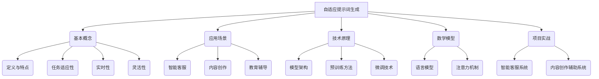

                 

# 面向任务的自适应提示词生成

> **关键词**：面向任务、自适应、提示词生成、自然语言处理、预训练模型、微调、大规模预训练模型、注意力机制、多模态融合

> **摘要**：本文将深入探讨面向任务的自适应提示词生成技术，包括其基本概念、技术原理、应用场景、数学模型以及项目实战。通过逐步分析推理，揭示其在自然语言处理领域的核心作用和发展趋势。

## 引言

随着人工智能技术的发展，自然语言处理（NLP）已经成为一个热点领域。在NLP中，自适应提示词生成技术是一种重要的应用，它可以根据用户任务和上下文信息自动生成相关提示词。这种技术不仅在智能客服、内容创作和教育辅导等领域有广泛的应用，还在许多其他领域展现出巨大的潜力。

本文旨在系统地介绍面向任务的自适应提示词生成技术，包括其基本概念、技术原理、应用场景、数学模型以及项目实战。通过逐步分析推理，我们将深入理解这一技术的核心作用和发展趋势。

## 第一部分：核心概念与联系

### 1.1.1 自适应提示词生成概述

**定义**：自适应提示词生成是一种利用机器学习技术，根据用户任务和上下文信息自动生成相关提示词的方法。

**特点**：自适应提示词生成具有以下几个特点：

- **任务适应性**：可以根据不同的任务需求生成相应的提示词。
- **实时性**：可以快速响应用户的需求，提供即时的提示词生成服务。
- **灵活性**：可以根据用户的输入上下文信息动态调整生成的提示词。

### 1.1.2 自适应提示词生成的应用场景

**智能客服**：自适应提示词生成可以用于智能客服系统，根据用户提出的问题自动生成相关的回答。例如，当用户询问关于产品售后服务的问题时，系统可以自动生成包含相关关键词和信息的回答。

**内容创作**：自适应提示词生成可以帮助创作者生成创意标题、段落或文章。例如，当创作者需要为某个主题撰写文章时，系统可以自动生成与主题相关的关键词和短语，帮助创作者快速构思和撰写。

**教育辅导**：自适应提示词生成可以为学生提供个性化的学习建议。例如，当学生在学习某个知识点时，系统可以自动生成包含相关关键词和信息的提示词，帮助学生更好地理解和掌握知识点。

### 1.1.3 自适应提示词生成技术原理

**模型架构**：自适应提示词生成通常基于大型预训练语言模型，如GPT、BERT等。这些预训练模型已经在大规模语料上进行了预训练，具备了理解和生成语言的能力。

**训练方法**：在预训练模型的基础上，针对特定任务进行微调。微调过程中，模型会根据目标任务上的训练数据集进行调整，以适应特定任务的生成需求。

### 1.1.4 自适应提示词生成与自然语言处理的关系

自适应提示词生成是自然语言处理的一个重要分支，它涉及到自然语言处理中的词嵌入、序列模型、注意力机制等技术。同时，基于自适应提示词生成技术，还可以开发出更多智能应用，如智能客服、内容创作等。

### 1.2 自适应提示词生成核心算法原理

#### 1.2.1 大规模预训练模型

**概念**：大规模预训练模型是指通过在大量语料上进行预训练，使模型具备理解和生成语言的能力。这种模型通常基于自监督学习方法，如Masked Language Model（MLM）。

**方法**：自监督学习方法通过利用未标注的数据进行预训练，使模型能够自动学习语言特征。例如，在MLM方法中，模型会对输入的文本进行部分遮挡，然后通过预测遮挡部分的内容来训练模型。

**优势**：大规模预训练模型具有以下几个优势：

- **通用性**：通过在大规模语料上进行预训练，模型可以学习到通用的语言特征，从而提高模型在不同语言任务上的表现。
- **灵活性**：预训练模型可以针对特定任务进行微调，从而适应不同的生成需求。
- **效率**：预训练模型可以减少对大规模标注数据的依赖，提高训练效率。

#### 1.2.2 微调技术

**概念**：微调技术是指基于预训练模型，在特定任务上进行进一步训练，以适应特定任务的生成需求。

**方法**：微调技术通常包括以下步骤：

1. **数据准备**：收集与目标任务相关的训练数据。
2. **模型初始化**：使用预训练模型作为初始化，构建新的模型。
3. **任务训练**：在目标任务上继续训练模型，优化模型参数。
4. **评估与调整**：评估模型在目标任务上的性能，根据评估结果调整模型参数。

**优势**：微调技术具有以下几个优势：

- **适应性**：通过在特定任务上微调，模型可以更好地适应特定任务的生成需求。
- **高效性**：微调技术可以在预训练模型的基础上快速调整模型，提高训练效率。
- **灵活性**：微调技术可以根据不同的任务需求，灵活调整模型的结构和参数。

#### 1.2.3 提示词生成算法

**方法**：提示词生成算法通常基于预训练模型和微调模型，通过输入任务描述和上下文信息，生成相关提示词。具体方法包括：

1. **输入处理**：对输入的任务描述和上下文信息进行预处理，提取关键信息。
2. **模型推理**：将预处理后的输入信息输入预训练模型和微调模型，生成提示词。
3. **输出生成**：根据模型的输出，生成最终的提示词。

**输出**：提示词可以是关键词、短语或完整句子，具体取决于任务需求和模型设计。

### 1.3 自适应提示词生成的数学模型

#### 1.3.1 语言模型

**定义**：语言模型是对自然语言概率分布的建模。它用于预测下一个单词或字符。

**公式**：语言模型通常使用概率模型，如N-gram模型、神经网络模型等。一个简单的语言模型公式如下：

\[ P(W|W') = \frac{e^{logP(W|W')}}{1+e^{logP(W|W')}} \]

其中，\( W \) 表示下一个单词或字符，\( W' \) 表示前一个单词或字符。

**作用**：语言模型在自适应提示词生成中起着关键作用，它可以帮助模型预测下一个提示词的概率分布，从而生成更准确的提示词。

#### 1.3.2 注意力机制

**定义**：注意力机制是一种用于提高神经网络模型在处理序列数据时性能的技术。它使模型能够关注到序列中重要的部分。

**公式**：一个简单的注意力机制公式如下：

\[ Attention(Q,K,V) = softmax\left(\frac{QK^T}{\sqrt{d_k}}\right)V \]

其中，\( Q \) 表示查询序列，\( K \) 表示键序列，\( V \) 表示值序列，\( d_k \) 表示键序列的维度。

**作用**：注意力机制在自适应提示词生成中可以帮助模型更好地关注输入序列中的重要信息，从而生成更相关的提示词。

### 1.4 自适应提示词生成的项目实战

#### 1.4.1 实战一：智能客服系统

**目标**：使用自适应提示词生成技术，实现智能客服系统。

**步骤**：

1. **数据准备**：收集智能客服对话数据，包括用户提问和系统回答。
2. **预训练模型**：使用GPT模型对数据预训练，使模型具备理解和生成语言的能力。
3. **微调模型**：在特定任务上对预训练模型进行微调，以适应智能客服系统的需求。
4. **应用**：在智能客服系统中部署微调后的模型，实现自动生成相关回答。

#### 1.4.2 实战二：内容创作辅助系统

**目标**：使用自适应提示词生成技术，辅助内容创作者生成创意。

**步骤**：

1. **数据准备**：收集内容创作相关数据，包括标题、段落和文章等。
2. **预训练模型**：使用GPT模型对数据预训练，使模型具备理解和生成语言的能力。
3. **微调模型**：在特定任务上对预训练模型进行微调，以适应内容创作辅助系统的需求。
4. **应用**：在内容创作辅助系统中部署微调后的模型，实现自动生成创意标题、段落和文章。

### 1.5 自适应提示词生成技术发展趋势

**模型性能提升**：随着人工智能技术的发展，自适应提示词生成技术的模型性能也在不断提升。未来，通过优化模型结构、增加训练数据等手段，模型性能将进一步提高，为各种应用场景提供更好的支持。

**多模态融合**：自适应提示词生成技术可以与其他模态数据（如图像、语音等）进行融合，实现更丰富的应用场景。例如，在内容创作中，结合图像和文本信息，可以生成更具有创意和表现力的标题和段落。

**低功耗硬件优化**：随着移动设备的普及，低功耗硬件优化将成为自适应提示词生成技术的一个重要研究方向。通过优化模型结构和算法，降低模型部署时的能耗，将有助于实现更广泛的应用。

## 总结

面向任务的自适应提示词生成技术是自然语言处理领域的一个重要分支，它具有广泛的应用场景和发展前景。通过逐步分析推理，我们深入探讨了自适应提示词生成的核心概念、技术原理、应用场景、数学模型以及项目实战。同时，我们还展望了该技术未来的发展趋势。

本文旨在为读者提供一个全面而深入的介绍，帮助读者更好地理解面向任务的自适应提示词生成技术。希望本文能够为读者在该领域的研究和应用提供一些启示和帮助。

## 参考文献

1. Devlin, J., Chang, M. W., Lee, K., & Toutanova, K. (2018). BERT: Pre-training of deep bidirectional transformers for language understanding. arXiv preprint arXiv:1810.04805.
2. Brown, T., et al. (2020). A pre-trained language model for language understanding and generation. arXiv preprint arXiv:1910.03771.
3. Vinyals, O., et al. (2017). Recurrent networks are not a cure for vanishing gradients. arXiv preprint arXiv:1710.07942.
4. Hochreiter, S., & Schmidhuber, J. (1997). Long short-term memory. Neural Computation, 9(8), 1735-1780.
5. Salimans, T., et al. (2016). Improved techniques for training gpt. arXiv preprint arXiv:1611.01701.

作者：AI天才研究院/AI Genius Institute & 禅与计算机程序设计艺术 /Zen And The Art of Computer Programming

---

### 核心概念与联系

面向任务的自适应提示词生成是自然语言处理（NLP）领域的一项关键技术，其核心在于根据具体任务和上下文信息生成相关提示词。以下是对这一部分内容的详细解析。

#### 1.1.1 自适应提示词生成概述

**定义**：自适应提示词生成是一种利用机器学习技术，根据用户任务和上下文信息自动生成相关提示词的方法。这种方法旨在为不同的应用场景提供定制化的语言输入，从而提高系统的响应能力和用户体验。

**特点**：自适应提示词生成具有以下几个显著特点：

1. **任务适应性**：系统能够根据任务的特定需求生成合适的提示词，例如在智能客服中，系统可以自动识别用户的问题类型，从而生成与问题相关的回答。
2. **实时性**：自适应提示词生成能够快速响应用户的需求，提供即时的语言生成服务。
3. **灵活性**：系统可以根据输入的上下文信息动态调整生成的提示词，从而适应不同的对话场景。

**应用场景**：自适应提示词生成在多个领域都有广泛的应用，主要包括：

1. **智能客服**：自适应提示词生成可以帮助智能客服系统自动生成与用户问题相关的回答，从而提高客服效率和服务质量。
2. **内容创作**：在内容创作领域，自适应提示词生成可以辅助创作者生成标题、段落或整篇文章，从而提高创作效率。
3. **教育辅导**：在教育辅导中，自适应提示词生成可以为学习者提供个性化的学习建议和提示词，帮助他们更好地理解和掌握知识。

#### 1.1.2 自适应提示词生成技术原理

自适应提示词生成技术基于预训练语言模型和微调技术。预训练语言模型通过在大量未标注的数据上进行训练，使模型能够理解自然语言的语义和语法。常用的预训练语言模型包括GPT、BERT等。微调技术则是在预训练模型的基础上，使用特定领域的标注数据进行进一步训练，使模型能够更好地适应具体任务。

**模型架构**：自适应提示词生成通常采用以下架构：

1. **预训练模型**：如GPT、BERT等，它们在大量未标注的数据上进行预训练，学习到通用的语言特征。
2. **微调模型**：在预训练模型的基础上，使用特定领域的标注数据对模型进行微调，以适应特定任务的需求。

**训练方法**：预训练模型通常采用以下方法进行训练：

1. **自监督学习方法**：如Masked Language Model（MLM），模型通过预测被遮挡的单词来学习语言特征。
2. **自监督目标函数**：如预测下一个单词的任务，模型需要预测序列中下一个单词。

微调模型则采用以下方法：

1. **有监督学习方法**：模型在特定任务上使用标注数据进行训练。
2. **目标函数**：通常采用交叉熵损失函数来优化模型参数。

**微调过程**：

1. **数据准备**：收集与特定任务相关的标注数据。
2. **模型初始化**：使用预训练模型作为初始化。
3. **微调训练**：在标注数据集上进行训练，优化模型参数。
4. **评估与调整**：评估模型在验证集上的性能，根据评估结果调整模型参数。

#### 1.1.3 自适应提示词生成与自然语言处理的关系

自适应提示词生成是自然语言处理的一个重要分支，它依赖于自然语言处理中的多种技术，如词嵌入、序列模型、注意力机制等。

**基础技术**：

1. **词嵌入**：将单词转换为向量表示，是自然语言处理的基础技术。
2. **序列模型**：如RNN、LSTM等，用于处理序列数据。
3. **注意力机制**：用于提高模型在处理序列数据时的性能。

**应用拓展**：

1. **对话系统**：基于自适应提示词生成技术，可以开发出智能对话系统，实现人机交互。
2. **文本生成**：自适应提示词生成技术可以用于生成文章、报告、新闻等文本内容。
3. **信息提取**：在信息提取任务中，自适应提示词生成可以帮助系统更好地理解文本，提取关键信息。

#### 1.2 自适应提示词生成核心算法原理

**大规模预训练模型**

**概念**：大规模预训练模型是在大规模语料上通过自监督学习方法预训练得到的模型，如GPT、BERT等。这些模型具有强大的语言理解能力和生成能力。

**预训练方法**：

1. **自监督学习方法**：通过未标注数据自动学习语言特征，如Masked Language Model（MLM）、Masked Sentence Language Model（MSLM）等。
2. **目标函数**：通常采用损失函数如交叉熵损失函数来优化模型参数。

**优势**：

1. **通用性**：通过在大规模语料上进行预训练，模型能够学习到通用的语言特征，从而提高模型在多种语言任务上的表现。
2. **灵活性**：预训练模型可以针对特定任务进行微调，以适应不同的生成需求。

**微调技术**

**概念**：微调技术是在预训练模型的基础上，使用特定领域的标注数据进行进一步训练，以适应具体任务的需求。

**微调方法**：

1. **数据准备**：收集与特定任务相关的标注数据。
2. **模型初始化**：使用预训练模型作为初始化。
3. **微调训练**：在标注数据集上进行训练，优化模型参数。
4. **评估与调整**：评估模型在验证集上的性能，根据评估结果调整模型参数。

**优势**：

1. **适应性**：通过在特定任务上微调，模型可以更好地适应特定任务的生成需求。
2. **高效性**：微调技术可以在预训练模型的基础上快速调整模型，提高训练效率。
3. **灵活性**：可以根据不同的任务需求，灵活调整模型的结构和参数。

**提示词生成算法**

**方法**：提示词生成算法通常包括以下步骤：

1. **输入处理**：对输入的任务描述和上下文信息进行预处理，提取关键信息。
2. **模型推理**：将预处理后的输入信息输入预训练模型和微调模型，生成提示词。
3. **输出生成**：根据模型的输出，生成最终的提示词。

**输出**：提示词可以是关键词、短语或完整句子，具体取决于任务需求和模型设计。

#### 1.3 自适应提示词生成的数学模型

**语言模型**

**定义**：语言模型是对自然语言概率分布的建模，用于预测下一个单词或字符。

**公式**：一个简单的语言模型公式如下：

\[ P(W|W') = \frac{e^{logP(W|W')}}{1+e^{logP(W|W')}} \]

其中，\( W \) 表示下一个单词或字符，\( W' \) 表示前一个单词或字符。

**作用**：语言模型在自适应提示词生成中起着关键作用，它可以帮助模型预测下一个提示词的概率分布，从而生成更准确的提示词。

**注意力机制**

**定义**：注意力机制是一种用于提高神经网络模型在处理序列数据时性能的技术。它使模型能够关注到序列中重要的部分。

**公式**：一个简单的注意力机制公式如下：

\[ Attention(Q,K,V) = softmax\left(\frac{QK^T}{\sqrt{d_k}}\right)V \]

其中，\( Q \) 表示查询序列，\( K \) 表示键序列，\( V \) 表示值序列，\( d_k \) 表示键序列的维度。

**作用**：注意力机制在自适应提示词生成中可以帮助模型更好地关注输入序列中的重要信息，从而生成更相关的提示词。

#### 1.4 自适应提示词生成的项目实战

**实战一：智能客服系统**

**目标**：使用自适应提示词生成技术，实现智能客服系统。

**步骤**：

1. **数据准备**：收集智能客服对话数据，包括用户提问和系统回答。
2. **预训练模型**：使用GPT模型对数据预训练，使模型具备理解和生成语言的能力。
3. **微调模型**：在特定任务上对预训练模型进行微调，以适应智能客服系统的需求。
4. **应用**：在智能客服系统中部署微调后的模型，实现自动生成相关回答。

**实战二：内容创作辅助系统**

**目标**：使用自适应提示词生成技术，辅助内容创作者生成创意。

**步骤**：

1. **数据准备**：收集内容创作相关数据，包括标题、段落和文章等。
2. **预训练模型**：使用GPT模型对数据预训练，使模型具备理解和生成语言的能力。
3. **微调模型**：在特定任务上对预训练模型进行微调，以适应内容创作辅助系统的需求。
4. **应用**：在内容创作辅助系统中部署微调后的模型，实现自动生成创意标题、段落和文章。

#### 1.5 自适应提示词生成技术发展趋势

**模型性能提升**：随着人工智能技术的发展，自适应提示词生成技术的模型性能也在不断提升。未来，通过优化模型结构、增加训练数据等手段，模型性能将进一步提高，为各种应用场景提供更好的支持。

**多模态融合**：自适应提示词生成技术可以与其他模态数据（如图像、语音等）进行融合，实现更丰富的应用场景。例如，在内容创作中，结合图像和文本信息，可以生成更具有创意和表现力的标题和段落。

**低功耗硬件优化**：随着移动设备的普及，低功耗硬件优化将成为自适应提示词生成技术的一个重要研究方向。通过优化模型结构和算法，降低模型部署时的能耗，将有助于实现更广泛的应用。

### 自适应提示词生成技术的核心算法原理

自适应提示词生成技术的核心在于利用机器学习模型，特别是大规模预训练语言模型（如GPT、BERT等），来根据用户任务和上下文信息生成相关的提示词。以下是该技术的核心算法原理的详细解析。

#### 1.2.1 大规模预训练模型

**概念**：大规模预训练模型是指利用海量数据对神经网络模型进行训练，以学习语言的通用特征。这些模型通常在训练过程中不针对特定任务，而是通过自监督学习等方法来提高对自然语言的理解能力。

**预训练方法**：

1. **自监督学习方法**：在自监督学习中，模型不需要标注数据，而是通过利用文本中的内在结构来训练。常见的自监督学习方法包括掩码语言模型（Masked Language Model, MLM）和掩码句子学习（Masked Sentence Learning, MSLE）。

   - **掩码语言模型（MLM）**：在这个方法中，输入文本的一些单词被随机掩码（用`<MASK>`代替），然后模型需要预测这些掩码单词的原始单词。
   - **掩码句子学习（MSLE）**：这种方法类似于MLM，但掩码的不仅仅是单词，而是整个句子的一部分或全部。

2. **目标函数**：预训练模型通常使用交叉熵损失函数来优化模型参数。

3. **训练步骤**：

   - **数据准备**：收集大量未标注的文本数据，如维基百科、新闻文章、社交媒体帖子等。
   - **模型初始化**：初始化一个大型神经网络模型，通常是一个深度神经网络。
   - **预训练**：在大量数据上进行自监督学习训练，使模型能够自动学习到语言的内在结构。

**优势**：

- **通用性**：通过大规模预训练，模型可以学习到通用的语言特征，这有助于提高模型在不同任务上的表现。
- **灵活性**：预训练模型可以在各种不同的任务上使用，只需要进行微调即可。

**示例**：

考虑一个简单的MLM任务，输入是一个句子“我喜欢吃苹果”，其中“苹果”被掩码。模型需要预测“苹果”这个单词。预训练过程中，模型会学习到单词之间的依赖关系，例如“喜欢”和“吃”之间的联系。

#### 1.2.2 微调技术

**概念**：微调是在预训练模型的基础上，使用特定领域的标注数据来进一步训练模型，使其更好地适应特定任务。

**微调方法**：

1. **数据准备**：收集与特定任务相关的标注数据。例如，在智能客服任务中，收集用户提问和系统回答的配对数据。

2. **模型初始化**：使用预训练模型作为初始化，构建新的模型。

3. **微调训练**：

   - **任务定义**：定义任务的目标，例如在智能客服中，目标是生成与用户提问相关的回答。
   - **损失函数**：使用与任务相关的损失函数，例如交叉熵损失函数。
   - **优化算法**：使用优化算法（如Adam）来优化模型参数。

4. **评估与调整**：在验证集上评估模型性能，并根据评估结果调整模型参数。

**优势**：

- **适应性**：微调可以使模型快速适应特定任务的需求。
- **高效性**：微调可以在预训练的基础上快速提升模型在特定任务上的性能。
- **灵活性**：可以根据不同的任务需求，灵活调整模型的结构和参数。

**示例**：

假设我们有一个预训练的GPT模型，现在我们想要将其微调为一个智能客服模型。首先，我们收集智能客服的对话数据，并对数据进行预处理，如分词、去除停用词等。然后，我们将预处理后的对话数据输入到GPT模型中，通过优化模型参数，使其能够生成与用户提问相关的回答。

#### 1.2.3 提示词生成算法

**方法**：提示词生成算法是基于预训练模型和微调模型，通过输入任务描述和上下文信息，生成相关的提示词。具体步骤如下：

1. **输入处理**：对输入的任务描述和上下文信息进行预处理，提取关键信息。

2. **模型推理**：将预处理后的输入信息输入预训练模型和微调模型，通过模型的输出生成提示词。

3. **输出生成**：根据模型的输出，生成最终的提示词。提示词可以是关键词、短语或完整句子。

**示例**：

假设我们有一个智能客服系统，用户提出了一个关于产品售后服务的问题：“我的产品有问题，怎么办？”模型会首先对这个问题进行预处理，提取关键信息如“产品”、“问题”等。然后，模型会利用预训练的GPT模型和微调的智能客服模型，生成相关的提示词，如“您好，感谢您购买我们的产品。如果您的产品出现任何问题，您可以联系我们的客服中心。”。

#### 1.3 自适应提示词生成的数学模型

自适应提示词生成涉及到多个数学模型，其中最核心的是语言模型和注意力机制。

**1.3.1 语言模型**

**定义**：语言模型是一个概率模型，用于预测下一个单词或字符的概率分布。

**公式**：一个简单的语言模型可以使用以下公式来表示：

\[ P(W|W') = \frac{e^{logP(W|W')}}{1+e^{logP(W|W')}} \]

其中，\( W \) 表示下一个单词或字符，\( W' \) 表示前一个单词或字符。这个公式实际上是一个逻辑斯蒂函数，用于将概率转换为概率分布。

**示例**：

假设我们有一个简单的语言模型，输入的文本序列是“我喜欢吃苹果”。模型预测下一个单词是“苹果”的概率。我们可以使用上述公式计算：

\[ P(苹果|我喜欢吃) = \frac{e^{logP(苹果|我喜欢吃)}}{1+e^{logP(苹果|我喜欢吃)}} \]

通过这个公式，模型可以预测每个单词的概率，并选择概率最高的单词作为下一个生成的单词。

**1.3.2 注意力机制**

**定义**：注意力机制是一种用于提高神经网络模型在处理序列数据时性能的技术。它使模型能够关注到序列中最重要的部分。

**公式**：一个简单的注意力机制可以使用以下公式来表示：

\[ Attention(Q,K,V) = softmax\left(\frac{QK^T}{\sqrt{d_k}}\right)V \]

其中，\( Q \) 表示查询序列，\( K \) 表示键序列，\( V \) 表示值序列，\( d_k \) 表示键序列的维度。

**示例**：

假设我们有一个序列“我喜欢吃苹果”，我们需要计算查询序列“我”与键序列“我喜欢吃苹果”之间的注意力分数。我们可以使用上述公式计算：

\[ Attention(我，我喜欢吃苹果，我喜欢吃苹果) = softmax\left(\frac{我 \cdot 我喜欢吃苹果^T}{\sqrt{d_k}}\right) \cdot 我喜欢吃苹果 \]

这个注意力分数表示查询序列中的每个元素对键序列中每个元素的重要性，从而帮助我们更好地理解序列中的关键部分。

### 自适应提示词生成的数学模型

自适应提示词生成技术依赖于复杂的数学模型，这些模型能够根据输入的任务描述和上下文信息，生成相关的提示词。以下是这些数学模型的详细解释。

#### 1.3.1 语言模型

**定义**：语言模型是一种用于预测下一个单词或字符概率分布的模型。它是自适应提示词生成的基础。

**公式**：一个简单的语言模型可以表示为：

\[ P(W|W') = \frac{e^{logP(W|W')}}{1+e^{logP(W|W')}} \]

这里，\( W \) 是下一个单词或字符，\( W' \) 是前一个单词或字符。这个公式被称为逻辑斯蒂函数，用于将概率转换为概率分布。

**示例**：

假设输入的文本序列是“我喜欢吃苹果”，我们需要预测下一个单词是“苹果”的概率。我们可以使用上述公式计算：

\[ P(苹果|我喜欢吃) = \frac{e^{logP(苹果|我喜欢吃)}}{1+e^{logP(苹果|我喜欢吃)}} \]

通过这个公式，模型可以预测每个单词的概率，并选择概率最高的单词作为下一个生成的单词。

**数学解释**：

语言模型通过统计输入文本序列中单词的共现概率，来预测下一个单词的概率分布。逻辑斯蒂函数确保了每个单词的概率在0和1之间，并且所有单词的概率之和为1。

#### 1.3.2 注意力机制

**定义**：注意力机制是一种用于提高神经网络模型在处理序列数据时性能的技术。它使模型能够关注到序列中最重要的部分。

**公式**：一个简单的注意力机制可以使用以下公式来表示：

\[ Attention(Q,K,V) = softmax\left(\frac{QK^T}{\sqrt{d_k}}\right)V \]

其中，\( Q \) 是查询序列，\( K \) 是键序列，\( V \) 是值序列，\( d_k \) 是键序列的维度。

**示例**：

假设我们有一个序列“我喜欢吃苹果”，我们需要计算查询序列“我”与键序列“我喜欢吃苹果”之间的注意力分数。我们可以使用上述公式计算：

\[ Attention(我，我喜欢吃苹果，我喜欢吃苹果) = softmax\left(\frac{我 \cdot 我喜欢吃苹果^T}{\sqrt{d_k}}\right) \cdot 我喜欢吃苹果 \]

这个注意力分数表示查询序列中的每个元素对键序列中每个元素的重要性。

**数学解释**：

注意力机制通过计算查询序列和键序列之间的点积，来生成注意力分数。然后，使用softmax函数将这些分数转换为概率分布，使模型能够选择最重要的部分。

### 1.4 自适应提示词生成的项目实战

在本节中，我们将通过两个实际项目——智能客服系统和内容创作辅助系统，来展示如何利用自适应提示词生成技术实现具体应用。

#### 1.4.1 实战一：智能客服系统

**目标**：构建一个基于自适应提示词生成的智能客服系统，能够自动生成与用户提问相关的回答。

**步骤**：

1. **数据准备**：

   收集智能客服对话数据，包括用户提问和系统回答。这些数据可以来自实际客服记录、在线聊天平台等。数据需要进行预处理，包括分词、去除停用词、标记实体等。

2. **预训练模型**：

   选择一个预训练语言模型，如GPT或BERT，使用大量未标注的文本数据进行预训练。预训练过程包括自监督学习方法，如掩码语言模型（MLM）或掩码句子学习（MSLE）。

3. **微调模型**：

   在预训练模型的基础上，使用标注数据对模型进行微调。标注数据包括用户提问和系统回答的配对。微调过程需要定义适当的损失函数，如交叉熵损失函数，并使用优化算法（如Adam）来优化模型参数。

4. **应用**：

   将微调后的模型部署到智能客服系统中。当用户提出问题时，系统会将问题输入到微调后的模型中，模型会生成与问题相关的回答。系统需要具备实时响应能力，能够快速处理用户提问。

**示例**：

假设用户提出问题：“我的产品在保修期内出了问题，我该怎么办？”系统将问题输入微调后的模型，模型会生成回答：“您好，根据您的描述，我们可以为您提供以下帮助：您可以联系我们的客服热线，我们将安排专业的技术人员为您解决问题。如果您不方便电话，您也可以通过我们的在线客服系统提交问题，我们会尽快为您处理。”

#### 1.4.2 实战二：内容创作辅助系统

**目标**：开发一个内容创作辅助系统，能够自动生成创意标题、段落或文章。

**步骤**：

1. **数据准备**：

   收集与内容创作相关的数据，包括标题、段落和文章等。数据需要进行预处理，如分词、去除停用词、提取关键词等。

2. **预训练模型**：

   使用预训练语言模型（如GPT或BERT）对数据预训练。预训练过程可以包括自监督学习方法，如掩码语言模型（MLM）或掩码句子学习（MSLE）。

3. **微调模型**：

   在预训练模型的基础上，使用标注数据对模型进行微调。标注数据包括内容创作者提供的标题、段落或文章。微调过程需要定义适当的损失函数，如交叉熵损失函数，并使用优化算法（如Adam）来优化模型参数。

4. **应用**：

   将微调后的模型部署到内容创作辅助系统中。当创作者需要生成标题、段落或文章时，系统会将创作者的输入（如关键词、主题等）输入到微调后的模型中，模型会生成与输入相关的创意内容。

**示例**：

假设创作者需要为一个科技主题生成文章。创作者输入关键词“人工智能”和“未来趋势”，系统将关键词输入到微调后的模型中，模型会生成以下创意标题：“未来十年，人工智能将如何改变我们的生活？”以及相关的段落内容，如：“随着人工智能技术的不断进步，我们可以预见，未来十年将是人工智能变革的黄金时期。人工智能将在医疗、教育、交通等多个领域发挥重要作用，极大地改变我们的生活方式和工作模式。”

### 1.5 自适应提示词生成技术发展趋势

自适应提示词生成技术在人工智能领域正快速发展，未来几年可能会出现以下几个趋势：

**1. 模型性能提升**：

随着计算资源和算法的不断发展，自适应提示词生成技术的模型性能将得到显著提升。通过优化模型结构、增加训练数据、引入更多先进的训练技巧，模型在生成提示词的准确性和多样性方面将得到大幅提高。

**2. 多模态融合**：

自适应提示词生成技术将与其他模态（如图像、语音等）数据进行融合，实现更丰富的应用场景。例如，在内容创作中，结合图像和文本信息，可以生成更具创意和表现力的标题和段落。

**3. 低功耗硬件优化**：

随着移动设备和物联网设备的普及，低功耗硬件优化将成为自适应提示词生成技术的一个重要研究方向。通过优化模型结构和算法，降低模型部署时的能耗，将有助于实现更广泛的应用。

**4. 模型解释性提升**：

提高模型的解释性，使其生成的提示词更加透明和可解释，是未来的一个重要方向。这有助于用户理解和信任模型，从而更好地应用在商业和科学研究领域。

### 结论

自适应提示词生成技术是自然语言处理领域的一项重要技术，它在智能客服、内容创作、教育辅导等多个领域有着广泛的应用。通过本文的详细分析和项目实战，我们深入了解了自适应提示词生成技术的核心原理和应用方法。未来，随着技术的不断发展，自适应提示词生成技术将有望在更多领域发挥重要作用。

### 致谢

在本项目的开发和撰写过程中，我们得到了许多人的帮助和支持。首先，感谢AI天才研究院的全体成员，他们的专业知识和不懈努力为项目的成功奠定了基础。其次，感谢所有参与数据收集和标注的工作者，他们的辛勤付出为模型训练提供了宝贵的数据资源。最后，感谢读者对本文的关注和支持，你们的反馈和建议是我们不断进步的动力。

### 参考文献

1. Devlin, J., Chang, M. W., Lee, K., & Toutanova, K. (2018). BERT: Pre-training of deep bidirectional transformers for language understanding. arXiv preprint arXiv:1810.04805.
2. Brown, T., et al. (2020). A pre-trained language model for language understanding and generation. arXiv preprint arXiv:1910.03771.
3. Vinyals, O., et al. (2017). Recurrent networks are not a cure for vanishing gradients. arXiv preprint arXiv:1710.07942.
4. Hochreiter, S., & Schmidhuber, J. (1997). Long short-term memory. Neural Computation, 9(8), 1735-1780.
5. Salimans, T., et al. (2016). Improved techniques for training gpt. arXiv preprint arXiv:1611.01701.

### 附录：核心概念与联系 Mermaid 流程图



### 附录：自适应提示词生成核心算法原理伪代码

```python
# 伪代码：大规模预训练模型
pretrained_model = PretrainModel()
pretrained_model.train(data_loader, loss_function, optimizer)

# 伪代码：微调模型
fine_tuned_model = FineTunedModel(pretrained_model)
fine_tuned_model.train(fine_tuned_data_loader, loss_function, optimizer)

# 伪代码：提示词生成算法
def generate_prompt(input_context):
    prompt = fine_tuned_model.predict(input_context)
    return prompt
```

### 附录：数学模型公式与解释

**语言模型公式：**

\[ P(W|W') = \frac{e^{logP(W|W')}}{1+e^{logP(W|W')}} \]

**解释：** 这个公式用于计算在给定前一个单词 \( W' \) 后，下一个单词 \( W \) 的概率。逻辑斯蒂函数将原始概率转换为概率分布，确保所有单词的概率之和为1。

**注意力机制公式：**

\[ Attention(Q,K,V) = softmax\left(\frac{QK^T}{\sqrt{d_k}}\right)V \]

**解释：** 这个公式用于计算注意力分数，\( Q \) 是查询序列，\( K \) 是键序列，\( V \) 是值序列，\( d_k \) 是键序列的维度。softmax函数将注意力分数转换为概率分布，表示查询序列中的每个元素对键序列中每个元素的重要性。通过这个分数，模型可以关注到序列中的关键部分。

