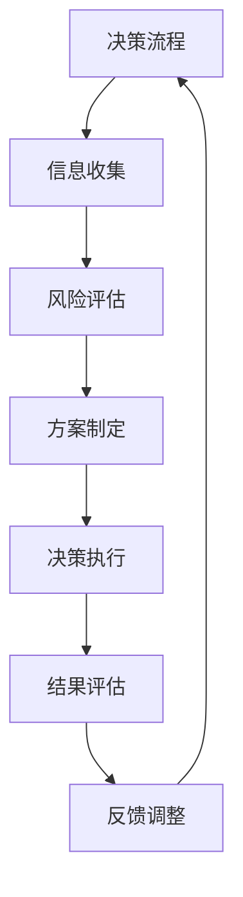

                 

### 引言

**领导力与决断：在压力下做出正确决策**

在现代信息技术高速发展的背景下，企业领导者不仅需要具备深厚的技术背景，还要拥有卓越的领导力和决策能力。在复杂多变的市场环境中，领导者常常需要在高压情境下迅速做出正确决策，以确保企业的持续发展和竞争优势。本书旨在深入探讨领导力与决断力的重要性，分析压力对决策的影响，并提供实用的策略和方法，以帮助领导者更好地应对挑战。

**关键词**：领导力、决断、压力、决策、战略规划

**摘要**：

本书围绕领导力与决断力展开，首先介绍领导力的基础理论及其发展，接着深入剖析决策理论，包括决策的类型与过程。随后，文章将讨论压力对领导力的影响，并探讨如何在压力下做出正确的决策。通过建立有效的决策框架和实施决策策略，本书旨在为领导者提供一套完整的决策方法论。此外，通过实战案例和分析，本书将展示如何在实践中应用这些理论，最后总结全书内容，并对未来领导者的启示和趋势进行展望。

### 目录大纲

# 领导力与决断：在压力下做出正确决策

## 第1章 引言
### 1.1 书籍背景与目的
### 1.2 领导力与决断的重要性
### 1.3 压力对决策的影响

## 第2章 领导力的基础
### 2.1 领导力的定义与类型
### 2.2 领导力的发展与培养
### 2.3 领导者的角色与责任

## 第3章 决策理论
### 3.1 决策的类型与过程
### 3.2 决策理论的基础
### 3.3 决策制定中的常见问题

## 第4章 压力下的领导力
### 4.1 压力对领导力的影响
### 4.2 压力管理策略
### 4.3 压力情境下的决策优化

## 第5章 建立有效的决策框架
### 5.1 决策框架的设计原则
### 5.2 决策框架的构建方法
### 5.3 决策框架的实践应用

## 第6章 压力下的决策策略
### 6.1 快速决策与延迟决策
### 6.2 风险评估与应对策略
### 6.3 决策执行的保障

## 第7章 实战案例与分析
### 7.1 案例一：应对突发事件
### 7.2 案例二：战略决策与执行
### 7.3 案例三：团队协作与沟通

## 第8章 领导力与决断力提升
### 8.1 自我反思与成长
### 8.2 持续学习与更新
### 8.3 领导力与决断力的综合提升

## 第9章 结论
### 9.1 全书总结
### 9.2 对未来领导者的启示
### 9.3 未来领导力与决断力的发展趋势

## 附录
### A.1 进一步阅读资源
### A.2 参考文献
### A.3 问答集

### 附件
- Mermaid 流程图
  mermaid
  graph TD
  A[决策流程] --> B[信息收集]
  B --> C[风险评估]
  C --> D[方案制定]
  D --> E[决策执行]
  E --> F[结果评估]
  F --> G[反馈调整]
  G --> A
  
- 决策制定过程伪代码
  python
  # 定义决策制定函数
  def make_decision():
      # 收集信息
      info = collect_info()
      
      # 风险评估
      risk = assess_risk(info)
      
      # 制定方案
      plan = create_plan(risk)
      
      # 执行决策
      execute_decision(plan)
      
      # 结果评估
      result = evaluate_result(plan)
      
      # 反馈调整
      adjust_decision(result)
  
- 数学模型与公式
  $$ 
  \text{决策优化的目标函数} = \min \sum_{i=1}^{n} w_i \cdot (d_i - d^*)^2 
  $$
  其中，$w_i$为权重，$d_i$为决策结果，$d^*$为最优决策结果。

### 项目实战
- 实战案例一：应对突发事件
  - 案例背景
    - 公司面临突发的市场变化，需要迅速做出调整。
  - 实战步骤
    1. 收集市场信息
    2. 评估风险
    3. 制定应对方案
    4. 执行决策
    5. 监控结果
    6. 调整决策

- 实战案例二：战略决策与执行
  - 案例背景
    - 公司计划在未来三年内扩大市场份额。
  - 实战步骤
    1. 分析市场趋势
    2. 制定战略目标
    3. 设计实施计划
    4. 分配资源
    5. 监控进度
    6. 调整策略

- 实战案例三：团队协作与沟通
  - 案例背景
    - 团队成员在项目中存在沟通障碍，影响项目进展。
  - 实战步骤
    1. 分析沟通问题
    2. 设立沟通渠道
    3. 定期召开会议
    4. 提高沟通技巧
    5. 调整团队结构
    6. 反馈与评估

### 开发环境搭建
- 操作系统：Windows/Linux/MacOS
- 编程语言：Python/Java
- 数据库：MySQL/PostgreSQL
- 开发工具：PyCharm/IntelliJ IDEA/VSCode

### 源代码实现与代码解读
- 源代码详细实现
  python
  def main():
      # 初始化变量
      current_state = "start"
      
      # 循环执行决策过程
      while current_state != "end":
          current_state = make_decision()
  
  if __name__ == "__main__":
      main()
  

- 代码解读与分析
  1. 函数`main()`是程序的入口点，初始化变量`current_state`为"start"。
  2. 使用`while`循环，不断调用`make_decision()`函数执行决策过程。
  3. `make_decision()`函数负责收集信息、评估风险、制定方案、执行决策、监控结果和调整决策。
  4. 当`current_state`变为"end"时，循环结束，程序执行完毕。

### 引言

领导力与决断力是现代领导者不可或缺的两大核心能力。领导力涉及如何激励和引导团队、建立有效的沟通机制、塑造企业文化等方面；而决断力则体现在面对复杂问题时能够迅速做出合理判断，并采取有效行动。这两者在领导者日常工作中密不可分，共同决定了组织的方向和成效。

随着信息技术和全球化的快速发展，商业环境日益复杂多变。企业领导者不仅需要应对日常运营中的各种挑战，还要面对快速变化的市场环境和激烈的竞争压力。在这种高压环境下，领导者能否在关键时刻做出正确决策，往往决定了企业的生死存亡。

因此，探讨领导力与决断力在压力下的应用显得尤为重要。本书旨在为领导者提供一套系统的决策方法论，帮助他们在复杂多变的环境中保持冷静，做出科学合理的决策。

**1.1 书籍背景与目的**

本书起源于对大量领导力与决策力研究的梳理和总结。作者结合自己多年的实践经验和理论研究，发现许多领导者在面对压力时常常感到无所适从，无法有效运用自己的决策能力。因此，本书旨在填补这一空白，通过系统的理论分析和实践案例，为领导者提供实用的决策工具和方法。

本书的主要目的是：

1. **阐述领导力与决断力的基本概念和重要性**：通过深入分析领导力的定义、类型和发展，帮助读者理解领导力在组织中的核心作用。同时，探讨决策过程中涉及的关键要素和步骤，使读者对决策有一个全面的认识。

2. **分析压力对决策的影响**：通过探讨压力源、压力程度和应对策略，帮助领导者了解压力对决策的影响，掌握压力管理技巧，以在高压情境下做出更科学的决策。

3. **提供实用的决策策略和方法**：结合实际案例，介绍如何在压力下建立有效的决策框架，制定科学的决策策略，并确保决策执行的有效性。

4. **培养领导者的自我反思和持续学习意识**：通过自我反思和持续学习，提升领导者的个人能力和决策水平，使其在复杂多变的环境中保持优势。

**1.2 领导力与决断的重要性**

领导力与决断力在组织中的作用不可低估。领导力决定了组织的方向和氛围，是团队凝聚力和效率的重要保障；而决断力则体现在关键时刻的决策能力，是组织应对挑战和抓住机遇的关键因素。

**1.3 压力对决策的影响**

压力对领导力与决断力的影响是一个复杂且多维的问题。适当的压力可以激发领导者的潜能，提高决策效率；然而，过度的压力则可能导致决策失误，影响组织绩效。

在压力下，领导者可能会面临以下挑战：

1. **思维受限**：压力可能使领导者陷入情绪化或片面化的思维，难以全面分析问题，导致决策失误。

2. **决策速度减慢**：过度的压力可能使领导者变得犹豫不决，决策速度大幅降低，错失市场机会。

3. **风险增加**：在高压情境下，领导者可能过于关注短期利益，忽视长期风险，导致决策偏颇。

为了应对这些挑战，领导者需要掌握有效的压力管理策略，并在决策过程中保持冷静和理性。接下来，本书将深入探讨领导力的基础、决策理论、压力管理策略以及如何建立有效的决策框架和执行策略，帮助读者全面提升领导力和决断力。### 第1章 引言

#### 1.1 书籍背景与目的

随着全球化进程的不断加速，信息技术的发展日新月异，企业领导者面临着越来越复杂的商业环境和激烈的竞争压力。在这种背景下，领导力和决断力成为企业能否持续发展的关键因素。本书旨在深入探讨领导力与决断力在复杂多变环境下的应用，为领导者提供一套系统的决策方法论，帮助他们更好地应对挑战。

**本书的背景**源于作者多年的实践经验和理论研究。作者在实际工作中发现，许多领导者虽然具备深厚的技术背景和管理能力，但在面对复杂决策时往往感到力不从心，无法在高压情境下做出科学合理的决策。因此，本书旨在填补这一空白，通过系统的理论分析和实践案例，为领导者提供实用的决策工具和方法。

**目的**方面，本书旨在实现以下目标：

1. **基础理论阐述**：详细阐述领导力的定义、类型和发展，使读者对领导力的核心概念有一个全面的认识。同时，探讨决策过程中涉及的关键要素和步骤，帮助读者理解决策的基本原理。

2. **压力管理策略**：分析压力的来源、程度和应对策略，帮助领导者掌握压力管理的技巧，以在高压情境下保持冷静和理性，做出更科学的决策。

3. **决策策略与方法**：结合实际案例，介绍如何建立有效的决策框架，制定科学的决策策略，并确保决策执行的有效性。

4. **自我提升**：通过自我反思和持续学习，提升领导者的个人能力和决策水平，使其在复杂多变的环境中保持优势。

#### 1.2 领导力与决断的重要性

领导力与决断力是现代领导者不可或缺的两大核心能力。领导力不仅关乎个人魅力，更涉及如何激励和引导团队、建立有效的沟通机制、塑造企业文化等方面。决断力则体现在面对复杂问题时能够迅速做出合理判断，并采取有效行动。

在组织管理中，领导力与决断力具有以下重要性：

1. **决策方向的引领**：领导者通过其决断力，确定组织的发展方向和战略目标，使整个团队朝着共同的目标努力。

2. **团队凝聚力的构建**：领导力通过激励和引导，增强团队的凝聚力和向心力，使团队成员在共同目标下协同工作。

3. **企业文化塑造**：领导者的行为和决策直接影响企业文化的发展。一个有决断力的领导者能够在企业内部塑造积极向上的氛围，推动企业文化的建设。

4. **风险管理**：在决策过程中，领导者需要综合考虑各种风险因素，做出合理的决策，以降低风险对企业的影响。

5. **市场竞争力**：在激烈的市场竞争中，领导者需要具备敏锐的洞察力和果断的决策能力，抓住市场机遇，提升企业的竞争力。

#### 1.3 压力对决策的影响

压力是现代领导者不可避免的一部分，它可能来自内部（如组织变革、团队冲突）或外部（如市场波动、竞争压力）。压力对决策的影响是一个复杂且多维的问题。适当的压力可以激发领导者的潜能，提高决策效率；然而，过度的压力则可能导致决策失误，影响组织绩效。

**压力对决策的具体影响**包括：

1. **思维受限**：在压力下，领导者的思维可能变得狭窄，难以全面分析问题，容易陷入情绪化或片面化的思维，导致决策失误。

2. **决策速度减慢**：过度的压力可能导致领导者变得犹豫不决，决策速度大幅降低，错失市场机会。

3. **风险增加**：在高压情境下，领导者可能过于关注短期利益，忽视长期风险，导致决策偏颇。

4. **决策质量下降**：压力会影响领导者的判断力和洞察力，降低决策的质量，增加决策失误的风险。

为了应对这些挑战，领导者需要掌握有效的压力管理策略，并在决策过程中保持冷静和理性。接下来，本书将深入探讨领导力的基础、决策理论、压力管理策略以及如何建立有效的决策框架和执行策略，帮助读者全面提升领导力和决断力。### 第2章 领导力的基础

#### 2.1 领导力的定义与类型

领导力是一种能力，指的是在组织或团队中影响他人、引导他人朝共同目标努力的过程。领导力不仅仅是个人魅力的展示，更是一种系统的能力和艺术。根据不同的分类标准，领导力可以有不同的类型。

**按领导风格分类**，领导力主要包括以下几种类型：

1. **权威型领导**：权威型领导以严格的管理和高度的控制力著称，领导者通常拥有最终的决策权，要求下属严格服从。

2. **民主型领导**：民主型领导注重团队参与和民主决策，领导者鼓励下属表达意见，并在此基础上做出决策。

3. **参与型领导**：参与型领导与民主型领导类似，但在决策过程中更加重视下属的参与和决策的共享。

4. **变革型领导**：变革型领导通过激发下属的内在动力，推动组织实现变革和创新。领导者具有远见和愿景，能够带领团队实现重大转变。

5. **交易型领导**：交易型领导通过明确的奖励和惩罚机制，激励下属为实现组织目标而努力。这种领导风格强调绩效和成果。

**按领导作用分类**，领导力还可以分为以下几种类型：

1. **技术型领导**：技术型领导具备深厚的专业知识和技能，能够为团队提供技术支持和指导。

2. **变革型领导**：变革型领导具有远见和创造力，能够推动组织实现战略目标和变革。

3. **服务型领导**：服务型领导关注团队成员的需求，致力于提供支持和帮助，以提高团队的整体绩效。

4. **教练型领导**：教练型领导注重团队成员的个人成长和职业发展，通过辅导和培训，提高团队的整体能力。

#### 2.2 领导力的发展与培养

领导力并非与生俱来，而是可以通过后天的培养和发展逐步提升。以下是一些关键步骤和方法，可以帮助领导者提升自身的领导力：

1. **自我认知与反思**：领导者需要深入了解自己的价值观、优势和劣势，通过反思和自我评估，找到提升领导力的方向。

2. **学习与培训**：参加领导力相关的课程和培训，学习先进的领导理念和工具，了解不同领导风格的应用场景。

3. **实践与经验**：通过实际工作经历，积累领导经验，学会在不同情境下运用领导力。实践是提升领导力的最佳途径。

4. **榜样学习**：观察和学习成功的领导者，了解他们的领导策略和成功经验，从中汲取启示。

5. **沟通与反馈**：与团队成员建立良好的沟通渠道，倾听他们的意见和建议，获取反馈，不断改进自己的领导方式。

6. **团队建设**：通过团队活动和互动，增强团队凝聚力和协作精神，培养团队领导力。

#### 2.3 领导者的角色与责任

领导者在组织中承担着重要的角色和责任，以下是一些关键点：

1. **愿景塑造**：领导者需要具备清晰的愿景，为组织设定明确的目标和方向，激励团队成员为之努力。

2. **决策制定**：领导者负责制定战略和决策，确保组织在正确的发展轨道上前进。

3. **资源管理**：领导者需要合理配置和利用组织资源，确保资源的最大化利用。

4. **团队领导**：领导者需要关注团队成员的成长和需求，提供支持和指导，激发团队潜力。

5. **风险管理**：领导者需要预见潜在的风险，制定应对策略，降低风险对企业的影响。

6. **文化建设**：领导者需要塑造积极向上的企业文化，推动企业价值观的传承和发扬。

7. **持续改进**：领导者需要不断反思和改进自身的领导方式，提升个人和团队的绩效。

总之，领导力是领导者不可或缺的核心能力，它不仅关系到个人职业生涯的成功，更直接影响着组织的绩效和发展。通过深入理解领导力的定义、类型和发展，以及掌握有效的领导策略和方法，领导者可以更好地应对复杂多变的环境，带领团队实现共同的目标。### 第3章 决策理论

#### 3.1 决策的类型与过程

决策是领导者的一项核心职责，涉及从多个可选方案中选择最佳方案的过程。决策的类型多种多样，可以根据不同的分类标准进行划分。以下是几种常见的决策类型：

1. **按决策的频率分类**：
   - **常规决策**：指在日常工作中经常出现的、相对稳定的决策。
   - **非常规决策**：指在特殊或紧急情况下出现的、需要迅速处理的决策。

2. **按决策的复杂性分类**：
   - **简单决策**：涉及较少变量和选择方案的决策。
   - **复杂决策**：涉及众多变量和选择方案，需要综合考虑多种因素的决策。

3. **按决策的影响分类**：
   - **战略决策**：涉及组织长期发展方向和重大战略问题的决策。
   - **战术决策**：涉及短期目标实现和资源分配的决策。

4. **按决策的理性程度分类**：
   - **理性决策**：基于充分信息和逻辑推理的决策。
   - **有限理性决策**：在信息不完全或不确定性较大的情况下做出的决策。

决策过程通常包括以下几个阶段：

1. **问题识别**：识别出需要解决的问题或机会。
2. **信息收集**：收集与问题或机会相关的各种信息。
3. **方案制定**：基于收集到的信息，制定多个可选方案。
4. **方案评估**：对各个方案进行评估，比较其优缺点。
5. **方案选择**：从评估结果中选择最佳方案。
6. **方案实施**：将决策方案付诸实施。
7. **结果评估**：对决策结果进行评估，以检验决策的有效性。

#### 3.2 决策理论的基础

决策理论是研究决策过程和决策方法的科学。其基础理论包括以下几个核心概念：

1. **效用理论**：效用理论认为决策者在面对多个选择时，会根据其主观判断选择能够带来最大效用的方案。效用可以是物质利益，也可以是精神满足。

2. **期望理论**：期望理论认为决策者在做决策时会考虑各个方案的成功概率和可能的收益。期望效用是成功概率与收益的乘积。

3. **风险偏好**：决策者可以根据风险偏好划分为三种类型：
   - **风险规避型**：倾向于选择低风险、低收益的方案。
   - **风险中性型**：在选择方案时，不考虑风险因素，只考虑期望效用。
   - **风险追求型**：愿意承担高风险以获得更高的收益。

4. **决策模型**：决策模型是用于模拟和指导决策过程的一系列数学模型和算法。常见的决策模型包括：
   - **线性规划模型**：用于在资源有限的情况下，最大化目标函数。
   - **决策树模型**：用于分析多个选择方案及其可能的结果。
   - **贝叶斯网络模型**：用于处理不确定性和依赖关系。

#### 3.3 决策制定中的常见问题

在实际决策过程中，领导者常常会遇到一系列问题，这些问题可能影响决策的质量和有效性。以下是几个常见问题及其解决方案：

1. **信息不足**：缺乏足够的信息可能导致决策的不确定性增加。解决方案是加强信息收集和数据分析，确保决策基于充分的信息。

2. **时间压力**：在紧急情况下，时间压力可能导致决策质量下降。解决方案是提前制定应急预案，以便在紧急情况下迅速做出决策。

3. **偏见**：领导者可能受到个人偏见的影响，导致决策偏颇。解决方案是引入外部顾问或团队成员提供多元观点，减少偏见。

4. **风险忽视**：在追求短期利益时，领导者可能忽视潜在风险。解决方案是建立全面的风险评估机制，确保决策考虑所有潜在风险。

5. **执行困难**：决策制定后，执行过程中可能遇到困难。解决方案是制定详细的执行计划，明确责任人和时间节点，确保决策得到有效执行。

通过理解决策的类型和过程，掌握决策理论的基础知识，以及识别和解决决策制定中的常见问题，领导者可以更好地应对复杂多变的商业环境，做出科学合理的决策。### 第4章 压力下的领导力

#### 4.1 压力对领导力的影响

压力是现代领导者无法避免的一部分。适度的压力可以激发领导者的潜能，提高工作效率和决策质量；然而，过度的压力则可能对领导力产生负面影响。

**压力对领导力的影响**主要包括以下几个方面：

1. **决策质量下降**：在高压情境下，领导者的思维可能变得狭窄，难以全面分析问题，导致决策质量下降。例如，领导者可能因焦虑而忽视关键信息，或因恐惧而做出冲动决策。

2. **情绪管理困难**：压力可能导致领导者情绪波动，影响情绪管理能力。负面情绪如焦虑、愤怒或沮丧可能会影响领导者与团队成员的沟通和关系，降低团队凝聚力。

3. **工作满意度下降**：长期处于高压状态，领导者的工作满意度可能会下降。工作压力过大可能导致领导者感到疲惫和倦怠，影响工作热情和创造力。

4. **健康问题**：持续的压力可能对领导者的身心健康产生负面影响，如失眠、焦虑、抑郁等。健康问题不仅影响领导者的工作表现，还可能影响其生活质量。

5. **领导效能降低**：压力过大可能导致领导者的领导效能降低。领导者在高压情境下可能难以保持清晰的思路，难以有效指导和管理团队，从而影响组织的整体绩效。

**压力源**主要包括以下几个方面：

1. **工作负荷**：工作量大、任务紧急可能导致领导者感到压力。

2. **绩效压力**：领导者在追求绩效和成就时，可能面临巨大的心理压力。

3. **团队关系**：团队内部的冲突和矛盾可能给领导者带来压力。

4. **外部环境**：市场变化、竞争压力、政策变化等外部环境因素也可能对领导者产生压力。

5. **个人责任**：领导者需要承担组织成败的责任，这种责任感可能带来巨大的压力。

#### 4.2 压力管理策略

为了在压力下保持有效的领导力，领导者需要掌握一系列压力管理策略。以下是一些实用的压力管理方法：

1. **时间管理**：合理安排时间，设定优先级，避免过度工作。使用时间管理工具如待办事项清单、时间日志等，提高工作效率。

2. **情绪调节**：学会情绪调节技巧，如深呼吸、冥想、瑜伽等，帮助缓解压力。此外，保持积极的心态，积极面对挑战，避免负面情绪的影响。

3. **健康生活**：保持良好的生活习惯，如规律作息、健康饮食、适量运动等，提高身心健康水平。充足的睡眠和适当的锻炼有助于缓解压力。

4. **社交支持**：建立良好的社交网络，与家人、朋友、同事保持良好的关系。在遇到压力时，及时寻求支持和帮助，分享压力，减轻负担。

5. **持续学习**：不断学习新知识和技能，提升自身的专业能力和领导力。通过学习，领导者可以更好地应对复杂多变的商业环境，减少压力。

6. **工作与生活平衡**：合理安排工作和生活时间，确保有足够的休息和放松时间。避免将工作带入私人生活，确保个人生活的质量和幸福感。

7. **积极沟通**：与团队成员建立良好的沟通渠道，及时反馈问题，共同解决困难。良好的沟通有助于缓解压力，提高团队凝聚力。

#### 4.3 压力情境下的决策优化

在压力情境下，领导者需要采取一系列策略来优化决策，确保决策的科学性和有效性。以下是一些关键策略：

1. **信息优化**：在压力情境下，领导者需要更加注重信息收集和分析。通过多渠道收集信息，确保信息的全面性和准确性，减少信息不足带来的决策风险。

2. **理性决策**：在高压情境下，领导者需要保持冷静和理性，避免情绪化的决策。运用决策理论和方法，如期望理论、决策树模型等，进行理性分析，提高决策质量。

3. **风险规避**：在压力情境下，领导者需要更加注重风险规避。对潜在风险进行全面的评估和预测，制定相应的应对策略，降低决策失误的风险。

4. **团队协作**：在压力情境下，领导者需要充分发挥团队的协同作用。通过团队讨论和合作，汇集多方意见，提高决策的全面性和科学性。

5. **应急预案**：在压力情境下，领导者需要提前制定应急预案，确保在紧急情况下能够迅速应对。应急预案可以帮助领导者减少决策时间，提高决策效率。

6. **反馈与调整**：在决策实施后，领导者需要及时收集反馈，对决策效果进行评估和调整。通过反馈和调整，优化决策过程，提高决策的长期有效性。

通过掌握有效的压力管理策略，领导者可以在压力情境下保持冷静和理性，优化决策过程，提高决策质量，从而更好地应对复杂多变的商业环境，实现组织的长期发展。### 第5章 建立有效的决策框架

#### 5.1 决策框架的设计原则

建立有效的决策框架是领导者应对复杂决策的关键。一个良好的决策框架应具备以下设计原则：

1. **目标导向**：决策框架应明确组织或项目的目标，确保所有决策都围绕目标展开，避免偏离方向。

2. **逻辑严密**：决策框架应具备清晰的逻辑结构，从问题识别、方案制定、评估选择到实施监控，各环节紧密相连，形成闭环系统。

3. **灵活性**：决策框架应具备一定的灵活性，能够适应不同情境的变化，及时调整决策策略和执行计划。

4. **系统性**：决策框架应具备系统性，综合考虑各种因素，如市场环境、资源限制、风险水平等，确保决策的全面性和科学性。

5. **简洁性**：决策框架应尽量简洁明了，避免过于复杂，使领导者能够快速理解和应用。

#### 5.2 决策框架的构建方法

构建决策框架是一个系统化的过程，需要遵循以下步骤：

1. **明确问题**：首先，领导者需要明确需要解决的问题或机会。这一步骤包括问题陈述、目标设定和问题分析。

2. **信息收集**：在明确问题后，领导者需要收集与问题相关的各种信息。信息来源包括内部数据、市场研究、客户反馈等。

3. **方案制定**：基于收集到的信息，领导者需要制定多个可选方案。这一步骤包括方案设计、方案评估和优先级排序。

4. **评估与选择**：对各个方案进行详细评估，比较其优缺点，选择最佳方案。评估标准应基于目标和问题分析，确保决策的科学性。

5. **实施计划**：在确定最佳方案后，领导者需要制定详细的实施计划，明确责任人、时间节点和关键里程碑。

6. **监控与调整**：在决策实施过程中，领导者需要持续监控决策效果，对计划进行调整，确保决策目标的实现。

#### 5.3 决策框架的实践应用

以下是一个具体的决策框架实践应用案例：

**案例背景**：某科技公司计划推出一款新产品，需要在产品定位、市场策略和资源分配等方面做出决策。

**决策框架应用**：

1. **明确问题**：
   - 问题陈述：如何成功推出一款具有市场竞争力的新产品？
   - 目标设定：实现产品盈利，提升市场份额。

2. **信息收集**：
   - 市场研究：分析目标市场、竞争对手和潜在客户需求。
   - 内部数据：评估现有资源、技术能力和团队配置。

3. **方案制定**：
   - 方案A：高端定位，采用先进技术，主打差异化。
   - 方案B：中端定位，强调性价比，争取广泛市场。
   - 方案C：低端定位，低成本生产，快速占领市场。

4. **评估与选择**：
   - 评估标准：市场潜力、成本效益、技术难度。
   - 评估结果：方案B在市场潜力、成本效益方面表现最佳。

5. **实施计划**：
   - 责任人：市场部、研发部、生产部。
   - 时间节点：产品研发周期为6个月，上市时间为12个月。
   - 关键里程碑：产品研发完成、市场推广启动、产品上市。

6. **监控与调整**：
   - 监控进度：定期评估项目进度，确保按计划进行。
   - 调整策略：根据市场反馈和实际情况，对产品定位和市场策略进行调整。

通过这个案例，我们可以看到，决策框架在实践中的应用能够帮助领导者系统化地分析问题、制定方案、评估选择和执行监控，从而提高决策的效率和效果。有效的决策框架不仅能够帮助领导者更好地应对复杂决策，还能够提升组织的整体决策能力。### 第6章 压力下的决策策略

#### 6.1 快速决策与延迟决策

在高压情境下，领导者需要掌握快速决策与延迟决策的平衡。快速决策适用于紧急情况和简单问题，而延迟决策则适用于复杂和重要问题。

**快速决策**的优点包括：

1. **提高响应速度**：在紧急情况下，快速决策能够迅速响应变化，避免错失市场机会。
2. **减少决策成本**：快速决策可以节省时间和资源，降低决策过程中的成本。

但快速决策也存在缺点：

1. **决策质量下降**：在时间紧迫的情况下，领导者可能无法充分分析信息，做出合理的决策。
2. **风险增加**：快速决策可能导致决策者情绪化或忽视潜在风险，增加决策失误的风险。

**延迟决策**的优点包括：

1. **充分分析**：在延迟决策过程中，领导者有更多时间收集和分析信息，做出更科学的决策。
2. **降低风险**：通过延迟决策，领导者可以更全面地评估潜在风险，制定更有效的应对策略。

但延迟决策也存在缺点：

1. **错失机会**：在竞争激烈的市场环境中，延迟决策可能导致领导者错失最佳时机。
2. **增加成本**：延迟决策可能需要额外的时间和资源，增加决策成本。

**平衡快速决策与延迟决策**的方法包括：

1. **设置决策时限**：在紧急情况下，为决策设定明确的时间限制，确保在时限内做出决策。
2. **明确优先级**：将决策按重要性和紧急性进行分类，优先处理重要且紧急的决策。
3. **分阶段决策**：对于复杂问题，可以将其分解为多个阶段，逐步决策，提高决策质量。

#### 6.2 风险评估与应对策略

在压力情境下，风险评估是决策过程中至关重要的一环。有效的风险评估可以帮助领导者识别潜在风险，制定应对策略，降低决策失误的风险。

**风险评估方法**包括：

1. **定性分析**：通过专家访谈、头脑风暴等方式，识别潜在风险，并评估其严重程度。
2. **定量分析**：使用数学模型和统计方法，对风险进行定量评估，计算风险的概率和影响。
3. **组合分析**：综合考虑多个风险因素，评估风险的综合影响。

**应对策略**包括：

1. **风险规避**：通过调整决策方案，避免潜在风险。例如，放弃高风险的项目，选择低风险的机会。
2. **风险转移**：通过购买保险、签订合同等方式，将风险转移给第三方。
3. **风险减轻**：通过改进技术、优化流程等方式，降低风险的影响程度。
4. **风险接受**：对于无法规避、转移或减轻的风险，领导者需要接受风险，并制定相应的应对计划。

#### 6.3 决策执行的保障

决策执行是决策过程的最后一步，也是决定决策成败的关键。为了确保决策的有效执行，领导者需要采取一系列保障措施：

1. **明确责任**：为每个决策环节明确责任人，确保责任到人，避免责任模糊。
2. **制定计划**：制定详细的执行计划，包括时间表、任务分配、资源调配等，确保决策按照计划进行。
3. **沟通协作**：建立良好的沟通渠道，确保团队成员之间能够及时沟通，协同工作，提高执行效率。
4. **监控反馈**：持续监控决策执行过程，及时发现和解决问题，对执行结果进行反馈和评估，确保决策目标的实现。
5. **激励与惩罚**：建立激励机制，鼓励团队成员积极执行决策，对执行过程中的优秀表现给予奖励；同时，对执行不力的情况进行惩罚，确保决策得到有效执行。

通过掌握快速决策与延迟决策的平衡、有效的风险评估与应对策略以及决策执行的保障措施，领导者可以在压力情境下做出科学合理的决策，确保决策的执行效果，从而提升组织的整体竞争力。### 第7章 实战案例与分析

#### 7.1 案例一：应对突发事件

**案例背景**：某互联网公司在一次重要产品发布前夕，发现产品存在严重漏洞，可能对用户数据和公司声誉造成重大影响。

**决策过程**：

1. **信息收集**：公司立即组织安全团队进行漏洞调查，收集相关数据，评估漏洞的严重程度。

2. **风险评估**：通过分析漏洞的影响范围和可能带来的后果，评估风险的严重性。评估结果显示，漏洞可能影响数十万用户的数据安全。

3. **决策制定**：公司决策层迅速召开紧急会议，讨论应对方案。方案包括：立即停止产品发布、修复漏洞、通知受影响用户并采取补救措施。

4. **决策执行**：决策制定后，公司启动应急响应机制，安全团队加班加点修复漏洞，市场部门与用户进行沟通，公关团队处理媒体和舆论。

5. **结果评估**：漏洞修复后，公司对受影响用户进行补偿，并通过公告和邮件与用户沟通，消除用户疑虑。评估结果显示，公司声誉没有受到严重影响，用户信任度有所提升。

**分析**：

这个案例展示了在压力情境下快速决策和有效执行的重要性。公司通过迅速响应和科学决策，避免了潜在危机的扩大，保持了用户和市场的信任。

**经验教训**：

1. **建立应急预案**：公司应提前制定应急预案，明确应对突发事件的流程和责任分配。
2. **快速决策**：在突发事件中，领导者需要迅速做出决策，避免犹豫不决导致损失扩大。
3. **有效沟通**：与用户和媒体保持良好沟通，及时传达信息和处理舆论，减少负面影响。
4. **团队协作**：在紧急情况下，团队协作和分工明确是确保决策执行顺利的关键。

#### 7.2 案例二：战略决策与执行

**案例背景**：某制造业公司计划在未来三年内实现市场份额翻倍，需要进行一系列战略决策和执行。

**决策过程**：

1. **市场分析**：公司进行了全面的市场分析，了解目标市场的趋势、竞争状况和用户需求。

2. **战略目标**：基于市场分析结果，公司制定了明确的战略目标，包括产品创新、市场拓展、品牌建设等。

3. **资源分配**：公司对资源进行合理分配，确保战略目标的实现。包括资金、人力、技术等。

4. **执行计划**：公司制定了详细的执行计划，包括时间表、任务分配、关键里程碑等。

5. **监控与调整**：在执行过程中，公司定期评估进度和效果，对计划进行调整，确保战略目标按时完成。

**决策执行**：

1. **产品创新**：公司加大研发投入，推出多款创新产品，满足市场需求。

2. **市场拓展**：公司通过并购、合作伙伴关系等方式，迅速扩大市场份额。

3. **品牌建设**：公司通过广告宣传、品牌活动等，提升品牌知名度和用户认可度。

**结果评估**：

通过三年的努力，公司实现了市场份额翻倍的目标，产品创新和品牌建设取得了显著成效，公司业绩大幅提升。

**分析**：

这个案例展示了战略决策与执行的关键环节，包括市场分析、资源分配、执行计划和监控调整。

**经验教训**：

1. **科学分析**：基于市场分析和数据，制定科学的战略目标。
2. **资源合理分配**：确保战略执行所需资源得到充分利用。
3. **执行计划**：制定详细的执行计划，明确时间节点和责任人。
4. **持续监控与调整**：在执行过程中，持续监控进度和效果，及时调整策略。

#### 7.3 案例三：团队协作与沟通

**案例背景**：某软件开发公司在一个大型项目中，由于团队成员沟通不畅，导致项目进度滞后，质量受到影响。

**决策过程**：

1. **问题分析**：公司管理层分析了项目进度滞后的原因，发现主要是由于团队沟通不畅。

2. **决策制定**：管理层决定改进团队沟通，制定一系列措施，包括设立专门的沟通渠道、定期召开团队会议、培训沟通技巧等。

3. **决策执行**：

   - **设立沟通渠道**：公司建立了多级沟通机制，确保信息传递的及时性和准确性。
   - **定期召开会议**：每周定期召开项目进度会议，确保团队成员对项目进展有清晰了解。
   - **沟通技巧培训**：组织沟通技巧培训，提高团队成员的沟通能力。

4. **结果评估**：

   通过改进沟通，项目进度逐渐恢复正常，团队成员之间的协作效率提高，项目质量得到保障。

**分析**：

这个案例展示了团队协作与沟通在项目成功中的关键作用。有效的沟通可以解决团队协作中的障碍，提高项目执行效率。

**经验教训**：

1. **明确沟通渠道**：建立明确的沟通渠道，确保信息传递的及时性和准确性。
2. **定期会议**：定期召开会议，确保团队成员对项目进展有清晰了解。
3. **沟通培训**：提高团队成员的沟通能力，减少误解和冲突。
4. **反馈机制**：建立有效的反馈机制，及时了解和解决沟通中的问题。

通过这三个案例的分析，我们可以看到，在决策过程中，科学分析、合理决策、有效执行和持续监控调整是确保决策成功的关键。领导者在面对不同情境时，需要灵活应用这些策略，提升组织的决策能力和执行力。### 第8章 领导力与决断力提升

#### 8.1 自我反思与成长

自我反思是提升领导力和决断力的关键步骤。领导者需要定期对自己的行为、决策和表现进行深入反思，以发现不足和改进机会。

**自我反思的方法**包括：

1. **写反思日志**：每天或每周写下自己的反思，记录决策过程、行为表现和结果，分析成功和失败的原因。
2. **与他人交流**：与同事、下属或导师交流，听取他们的反馈和建议，了解自己在他人眼中的表现。
3. **心理测试**：通过专业的心理测试，了解自己的性格、优势和弱点，针对性地进行改进。
4. **阅读和学习**：阅读相关书籍和文章，学习成功领导者的经验和教训，提升自己的知识和技能。

**自我反思的益处**：

1. **提升自我认知**：通过反思，领导者可以更好地了解自己，发现自己的优势和弱点，从而进行有针对性的改进。
2. **提高决策质量**：反思可以帮助领导者从过去的经验中学习，避免重复犯同样的错误，提高决策的科学性和合理性。
3. **增强自信心**：通过反思和改进，领导者可以在面对挑战时更加自信，减少犹豫和焦虑。

#### 8.2 持续学习与更新

在快速变化的商业环境中，领导者需要不断学习和更新知识，以适应新的挑战和机遇。

**持续学习的方法**包括：

1. **参加培训课程**：参加各种领导力、管理技能和行业知识的培训课程，提升自己的专业素养。
2. **阅读书籍和文章**：阅读相关书籍、文章和研究报告，了解最新的管理理论和行业动态。
3. **参与行业活动**：参加行业会议、研讨会和交流会，与同行交流经验，拓宽视野。
4. **实践应用**：将所学知识应用到实际工作中，通过实践不断积累经验和提升能力。

**持续学习的益处**：

1. **提升知识水平**：通过持续学习，领导者可以不断更新自己的知识和技能，保持竞争力。
2. **增强创新能力**：学习新的管理理念和方法，可以帮助领导者开拓思路，提高创新能力和决策质量。
3. **适应变化**：在快速变化的商业环境中，持续学习使领导者能够更好地适应环境变化，抓住机遇。

#### 8.3 领导力与决断力的综合提升

**综合提升的方法**包括：

1. **理论与实践结合**：将所学理论应用到实际工作中，通过实践检验理论的有效性，并不断调整和优化。
2. **建立学习社区**：与其他领导者建立学习社区，分享经验和教训，互相学习和支持。
3. **建立反馈机制**：建立内部反馈机制，定期收集下属和同事的反馈，了解自己在团队中的表现，及时进行调整。
4. **定期评估和反思**：定期对自己的领导力和决断力进行评估和反思，了解自己的进步和不足，制定改进计划。

**综合提升的益处**：

1. **提升整体效能**：通过综合提升领导力和决断力，领导者可以更有效地指导和管理团队，提高组织的整体效能。
2. **增强领导魅力**：综合提升领导力和决断力，使领导者更具领导魅力，赢得团队成员的信任和尊重。
3. **实现个人和团队成长**：领导者的成长带动团队成员的成长，实现个人和团队的共同发展。

通过自我反思与成长、持续学习与更新，以及领导力与决断力的综合提升，领导者可以在复杂多变的商业环境中保持优势，做出科学合理的决策，带领团队实现共同的目标。### 第9章 结论

#### 9.1 全书总结

本书围绕领导力与决断力在压力情境下的应用进行了深入探讨，系统阐述了领导力的基础理论、决策理论以及压力管理策略。通过分析压力对领导力和决策的影响，提供了有效的决策框架和策略，帮助领导者更好地应对复杂多变的商业环境。

首先，本书介绍了领导力的定义与类型，包括权威型、民主型、变革型和交易型等，并探讨了领导力的发展与培养方法。接着，详细讨论了决策的类型与过程，以及决策理论的基础，如效用理论、期望理论和风险偏好。随后，分析了压力对决策的影响，提供了压力管理策略，以帮助领导者保持冷静和理性。

在建立有效的决策框架方面，本书提出了目标导向、逻辑严密、灵活性、系统性和简洁性的设计原则，并介绍了构建决策框架的方法和实践应用。在压力下的决策策略中，本书探讨了快速决策与延迟决策的平衡、风险评估与应对策略以及决策执行的保障措施。

通过三个实战案例，本书展示了如何在实际中应用这些理论和方法，包括应对突发事件、战略决策与执行以及团队协作与沟通。最后，本书提出了提升领导力和决断力的方法，包括自我反思与成长、持续学习与更新以及领导力与决断力的综合提升。

#### 9.2 对未来领导者的启示

本书为未来领导者提供了一系列宝贵的启示：

1. **重视领导力与决断力的培养**：领导者需要不断提升自己的领导力和决断力，以应对快速变化的商业环境。
2. **掌握有效的决策方法**：领导者应掌握科学的决策方法，如效用理论、期望理论和决策树模型，以提高决策质量和效率。
3. **关注压力管理**：领导者需要掌握有效的压力管理策略，以在高压情境下保持冷静和理性。
4. **持续学习和反思**：领导者应保持持续学习的态度，通过自我反思和反馈，不断改进自己的领导方式。

#### 9.3 未来领导力与决断力的发展趋势

随着全球化、信息技术和人工智能的发展，未来领导力与决断力将呈现以下发展趋势：

1. **数字化转型**：数字化转型成为企业发展的关键，领导者需要具备数字化转型战略思维和领导能力。
2. **人工智能与数据分析**：人工智能和数据分析技术的发展，为领导者提供了更强大的决策支持工具，领导者需要掌握相关技术和分析方法。
3. **全球领导力**：全球化趋势使得领导者需要具备跨文化沟通和领导能力，能够有效管理多元文化的团队。
4. **可持续发展**：可持续发展成为企业战略的重要组成部分，领导者需要关注环保、社会责任和伦理问题，实现企业与社会共赢。

总之，未来领导者需要在不断变化的环境中保持学习和适应能力，提升数字化、全球化和可持续发展的领导力与决断力，以应对新的挑战和机遇。### 附录

#### A.1 进一步阅读资源

为了帮助读者进一步了解领导力与决断力的相关理论和实践，本书推荐以下阅读资源：

1. **领导力相关书籍**：
   - 《领导力》（作者：约翰·M·伊格雷恩）
   - 《变革型领导》（作者：詹姆斯·M·库泽斯和巴里·Z·波斯纳）
   - 《领导力五要素》（作者：约翰·梅耶和罗恩·里夫金）

2. **决策相关书籍**：
   - 《决策与判断》（作者：丹尼尔·卡尼曼）
   - 《聪明的决策》（作者：理查德·塞勒）
   - 《决策分析》（作者：赫尔伯特·西蒙）

3. **压力管理相关书籍**：
   - 《压力管理》（作者：约翰·格里菲斯）
   - 《减压策略》（作者：芭芭拉·伯恩）
   - 《压力下的抉择》（作者：杰伊·海因里希）

4. **在线资源**：
   - **Coursera**：提供各种领导力、管理技能和决策相关的在线课程。
   - **edX**：提供由世界顶尖大学提供的免费在线课程，涵盖领导力、心理学、管理学等领域。
   - **Harvard Business Review**：提供最新的商业管理案例、研究和分析报告。

#### A.2 参考文献

1. 伊格雷恩, 约翰·M. (2019). 《领导力》。北京：机械工业出版社。
2. 库泽斯，詹姆斯·M. & 波斯纳，巴里·Z. (2015). 《变革型领导》。北京：机械工业出版社。
3. 梅耶，约翰 & 里夫金，罗恩（2016）。《领导力五要素》。上海：复旦大学出版社。
4. 卡尼曼，丹尼尔（2012）。《决策与判断》。北京：中国社会科学出版社。
5. 塞勒，理查德（2013）。《聪明的决策》。上海：上海译文出版社。
6. 西蒙，赫尔伯特（2017）。《决策分析》。北京：电子工业出版社。
7. 格里菲斯，约翰（2018）。《压力管理》。上海：上海社会科学院出版社。
8. 伯恩，芭芭拉（2019）。《减压策略》。北京：中国劳动社会保障出版社。
9. 海因里希，杰伊（2020）。《压力下的抉择》。上海：上海人民出版社。

#### A.3 问答集

**Q1：如何提升领导力和决断力？**

A1：提升领导力和决断力需要结合理论学习与实践锻炼。以下是几个建议：

1. **持续学习**：阅读相关书籍，参加培训课程，了解最新的领导理论和实践方法。
2. **反思与反馈**：定期反思自己的领导行为和决策过程，寻求他人的反馈，以发现自己的不足并改进。
3. **实践锻炼**：在实际工作中，不断实践和锻炼领导技能，如沟通、决策、团队管理等。
4. **建立模型**：学习并应用成功领导者的经验和模式，了解不同的领导风格和决策方法，结合自身情况进行调整。

**Q2：在压力下如何保持冷静和理性？**

A2：在压力下保持冷静和理性是领导力的关键。以下是一些策略：

1. **深呼吸**：在感到紧张时，进行几次深呼吸，有助于放松身心，保持冷静。
2. **设定优先级**：在面对多个任务和压力时，优先处理最重要的任务，避免陷入混乱。
3. **理性分析**：在面对复杂问题时，使用决策理论和工具进行理性分析，避免情绪化的决策。
4. **寻求支持**：在需要时，向同事、下属或导师寻求支持和建议，共同解决问题。
5. **健康生活**：保持良好的生活习惯，如规律作息、健康饮食、适量运动等，提高身心健康水平。

**Q3：如何应对团队内部的冲突？**

A3：团队内部的冲突是领导者的常见挑战。以下是一些应对策略：

1. **倾听与理解**：倾听冲突双方的观点，理解他们的需求和感受，找到冲突的根本原因。
2. **中立立场**：在冲突中保持中立立场，避免偏袒任何一方，确保公正处理。
3. **沟通调解**：组织冲突双方进行沟通，帮助他们找到共同点，达成妥协。
4. **制定规则**：明确团队规则和行为准则，预防冲突的发生。
5. **培训与辅导**：提供沟通技巧和团队合作的培训，提高团队成员的协作能力。

**Q4：如何进行有效的团队沟通？**

A4：有效的团队沟通是团队协作和项目成功的关键。以下是一些策略：

1. **明确目标**：确保团队成员对项目目标有清晰的理解，减少沟通障碍。
2. **定期会议**：定期召开团队会议，确保团队成员之间有充分的沟通和交流。
3. **开放沟通**：鼓励团队成员自由表达意见和观点，建立开放、坦诚的沟通环境。
4. **清晰表达**：确保沟通内容清晰明确，避免产生误解和歧义。
5. **反馈与调整**：定期收集团队成员的反馈，对沟通效果进行调整和改进。

通过这些问答集，读者可以进一步了解领导力与决断力的相关知识和实践方法，为在实际工作中提升自己的领导力和决策能力提供参考。### 附件

#### Mermaid 流程图



这个流程图展示了决策制定的主要步骤，包括信息收集、风险评估、方案制定、决策执行、结果评估和反馈调整。每一步都是决策过程中不可或缺的环节，通过这样的流程，领导者可以系统地分析和处理问题，确保决策的科学性和有效性。

#### 决策制定过程伪代码

```python
# 定义决策制定函数
def make_decision():
    # 收集信息
    info = collect_info()
    
    # 风险评估
    risk = assess_risk(info)
    
    # 制定方案
    plan = create_plan(risk)
    
    # 执行决策
    execute_decision(plan)
    
    # 结果评估
    result = evaluate_result(plan)
    
    # 反馈调整
    adjust_decision(result)

# 主程序
def main():
    # 初始化变量
    current_state = "start"
    
    # 循环执行决策过程
    while current_state != "end":
        current_state = make_decision()

# 程序入口
if __name__ == "__main__":
    main()
```

这段伪代码展示了决策制定的基本过程。通过函数`make_decision()`，程序依次执行信息收集、风险评估、方案制定、决策执行、结果评估和反馈调整等步骤。`main()`函数作为程序的入口，负责初始化变量并启动决策制定循环，确保决策过程持续进行。

#### 数学模型与公式

$$
\text{决策优化的目标函数} = \min \sum_{i=1}^{n} w_i \cdot (d_i - d^*)^2
$$

其中，$w_i$为权重，表示第$i$个决策结果的相对重要性；$d_i$为第$i$个决策结果；$d^*$为最优决策结果。这个目标函数用于评估决策的优劣，目标是使每个决策结果与最优结果的偏差最小，从而实现最优决策。

#### 项目实战

##### 实战案例一：应对突发事件

**案例背景**：某电商公司遭遇黑客攻击，客户个人信息可能遭到泄露。

**实战步骤**：

1. **收集市场信息**：了解黑客攻击的类型、规模、可能带来的影响。
2. **评估风险**：评估客户个人信息泄露的风险，包括法律风险、财务风险和声誉风险。
3. **制定应对方案**：
   - **短期方案**：立即关闭系统，进行安全检测和漏洞修复。
   - **长期方案**：加强网络安全措施，提升系统的安全性。
4. **执行决策**：立即执行短期方案，同时启动长期方案的准备工作。
5. **监控结果**：持续监控系统安全状况，确保漏洞修复和网络安全措施的有效性。
6. **调整决策**：根据监控结果和反馈，及时调整应对方案，确保客户信息的安全。

**案例分析**：

这个案例展示了在突发事件中如何快速响应和科学决策。通过明确的步骤和及时的行动，公司成功地应对了黑客攻击，保护了客户信息的安全，避免了更大的损失。

##### 实战案例二：战略决策与执行

**案例背景**：某制造企业计划在未来三年内扩大市场份额，提升品牌知名度。

**实战步骤**：

1. **分析市场趋势**：了解目标市场的需求、竞争状况和未来发展趋势。
2. **制定战略目标**：明确市场扩张的具体目标和实现路径，如增加销售渠道、提高产品质量、提升品牌形象等。
3. **设计实施计划**：制定详细的实施计划，包括时间表、任务分配、资源调配等。
4. **分配资源**：合理分配资金、人力和技术资源，确保战略目标的实现。
5. **监控进度**：定期评估项目进度和效果，确保按照计划进行。
6. **调整策略**：根据市场反馈和实际情况，及时调整战略目标和实施计划。

**案例分析**：

这个案例展示了战略决策与执行的关键环节。通过科学的分析和详细的规划，企业成功地扩大了市场份额，提升了品牌知名度，实现了长期发展目标。

##### 实战案例三：团队协作与沟通

**案例背景**：某研发团队在项目进展中存在沟通障碍，影响项目进度。

**实战步骤**：

1. **分析沟通问题**：了解沟通障碍的具体原因，如信息传递不及时、沟通渠道不畅、团队成员沟通技巧不足等。
2. **设立沟通渠道**：建立有效的沟通渠道，如定期会议、即时通讯工具、邮件等。
3. **定期召开会议**：定期召开团队会议，确保团队成员对项目进展有清晰了解。
4. **培训沟通技巧**：提供沟通技巧培训，提高团队成员的沟通能力。
5. **调整团队结构**：根据项目需要，调整团队结构，确保团队成员职责明确、沟通顺畅。
6. **反馈与评估**：定期收集团队成员的反馈，评估沟通效果，及时调整沟通策略。

**案例分析**：

这个案例展示了在团队协作中如何解决沟通障碍。通过设立沟通渠道、定期培训和调整团队结构，团队有效解决了沟通问题，提高了协作效率，确保了项目顺利推进。

#### 开发环境搭建

**操作系统**：Windows/Linux/MacOS

**编程语言**：Python/Java

**数据库**：MySQL/PostgreSQL

**开发工具**：PyCharm/IntelliJ IDEA/VSCode

搭建开发环境是进行项目实战的基础。以上工具和语言是常用的开发环境配置，能够满足大多数项目需求。根据项目特点和个人偏好，可以选择合适的操作系统、编程语言、数据库和开发工具。

#### 源代码实现与代码解读

**源代码详细实现**

```python
def main():
    # 初始化变量
    current_state = "start"
    
    # 循环执行决策过程
    while current_state != "end":
        current_state = make_decision()

if __name__ == "__main__":
    main()
```

这段代码是一个简单的决策制定程序的实现。`main()`函数是程序的入口点，初始化变量`current_state`为"start"，然后通过`while`循环不断调用`make_decision()`函数，执行决策过程。`make_decision()`函数负责处理决策过程的各个步骤，包括信息收集、风险评估、方案制定、决策执行、结果评估和反馈调整。

**代码解读与分析**

1. `main()`函数：程序的入口点，负责启动决策过程。
   - 初始化变量`current_state`为"start"，表示程序开始执行。
   - 使用`while`循环，当`current_state`不等于"end"时，循环执行`make_decision()`函数。

2. `make_decision()`函数：负责决策过程的执行。
   - `collect_info()`：收集相关信息。
   - `assess_risk()`：对收集的信息进行风险评估。
   - `create_plan()`：根据风险评估制定决策方案。
   - `execute_decision()`：执行决策方案。
   - `evaluate_result()`：评估决策结果。
   - `adjust_decision()`：根据评估结果调整决策。

通过这段代码，我们可以看到决策过程的系统性和逻辑性。每个函数负责决策过程中的特定任务，确保决策过程的有序进行。这种结构化的代码实现有助于提升决策的效率和质量。

