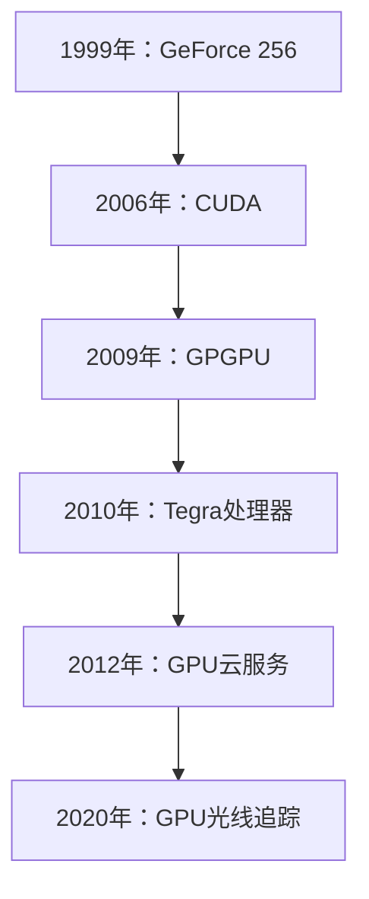
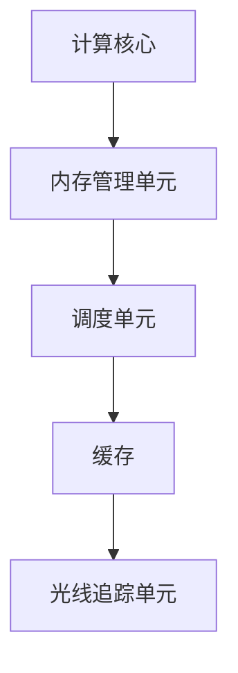
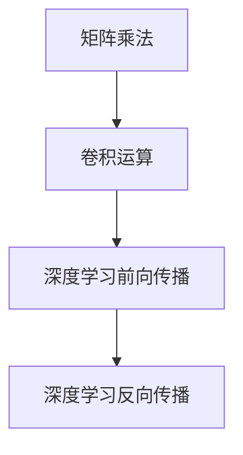
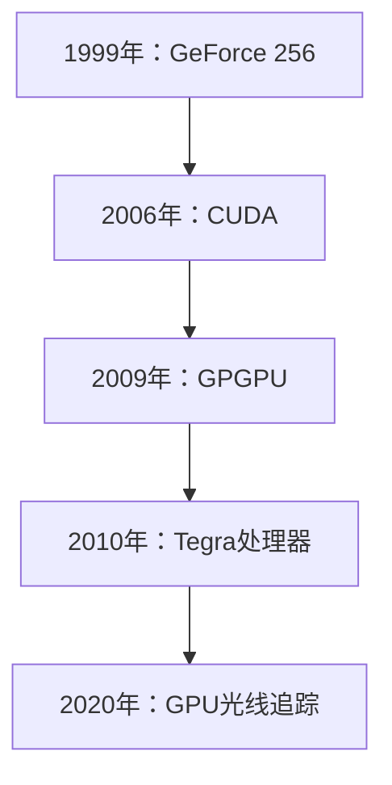

                 

# 《黄仁勋与NVIDIA的GPU革命》

## 关键词

- 黄仁勋
- NVIDIA
- GPU
- 深度学习
- 高性能计算
- 云计算
- 人工智能

## 摘要

本文将深入探讨NVIDIA的创始人黄仁勋如何引领了GPU（图形处理器单元）的革命，以及这一革命如何深刻影响了计算机科学和人工智能领域。文章将从黄仁勋的职业生涯和NVIDIA的背景入手，详细分析GPU技术的发展历程，并探讨GPU在深度学习、科学计算、工程和大数据等领域的应用。此外，本文还将展望GPU的未来发展，并探讨其对行业带来的变革与影响。

# 《黄仁勋与NVIDIA的GPU革命》目录大纲

## 第一部分：黄仁勋与NVIDIA的背景

### 第1章：黄仁勋的职业生涯与NVIDIA的崛起

#### 1.1 黄仁勋的个人背景

- 黄仁勋的早期生活
- 黄仁勋在英特尔的经历

#### 1.2 NVIDIA的创立与发展

- NVIDIA的成立背景
- NVIDIA在显卡市场的崛起

### 第2章：GPU技术的发展历程

#### 2.1 GPU的早期应用

- 游戏市场的需求
- 图形渲染技术的发展

#### 2.2 GPU在科学计算中的应用

- 高性能计算的需求
- GPU在深度学习中的应用

#### 2.3 GPU的多元化应用

- 数据中心计算
- 虚拟现实与增强现实

## 第二部分：GPU革命的影响

### 第3章：GPU在深度学习领域的革命

#### 3.1 深度学习与GPU

- 深度学习的兴起
- GPU在深度学习中的优势

#### 3.2 深度学习框架与GPU

- TensorFlow与GPU
- PyTorch与GPU

#### 3.3 GPU在深度学习中的应用案例

- 人工智能在医疗领域的应用
- 人工智能在金融领域的应用

### 第4章：GPU在科学计算与工程领域的应用

#### 4.1 高性能科学计算

- GPU在流体动力学中的应用
- GPU在结构力学中的应用

#### 4.2 工程设计自动化

- GPU在计算机辅助设计中的应用
- GPU在自动化仿真中的应用

### 第5章：GPU在云计算与大数据领域的应用

#### 4.1 云计算中的GPU

- GPU云服务的兴起
- GPU在云计算平台中的应用

#### 4.2 大数据与GPU

- GPU在数据处理与分析中的应用
- GPU在大数据存储与管理中的应用

## 第三部分：GPU的未来发展

### 第6章：GPU在人工智能领域的前景

#### 6.1 人工智能的未来趋势

- 人工智能的发展方向
- 人工智能在社会中的影响

#### 6.2 GPU在人工智能中的应用前景

- GPU在人工智能中的持续发展
- GPU在人工智能领域的挑战与机遇

### 第7章：NVIDIA的GPU革命对行业的影响

#### 7.1 行业变革

- GPU革命对传统计算模式的冲击
- GPU革命带来的产业链变革

#### 7.2 未来展望

- GPU在未来的应用领域
- GPU技术发展的方向与挑战

## 附录

### 附录A：GPU革命相关资源

- GPU相关书籍推荐
- GPU学习资源网站
- GPU相关研究论文与报告

### 附录B：GPU技术发展流程图

- GPU技术发展历程
- GPU核心架构图
- GPU核心算法原理图

### 附录C：GPU应用案例

- 人工智能应用案例
- 科学计算应用案例
- 工程设计应用案例

### 附录D：GPU开发工具与环境

- GPU开发工具简介
- GPU开发环境搭建
- GPU编程指南

## 第一部分：黄仁勋与NVIDIA的背景

### 第1章：黄仁勋的职业生涯与NVIDIA的崛起

#### 1.1 黄仁勋的个人背景

黄仁勋（Jen-Hsun Huang）出生于1963年11月2日，出生于中国台湾。黄仁勋的童年并不幸福，他的父母在他很小的时候就分开了，他随母亲移居美国，并在加州旧金山的一所小学就读。黄仁勋在计算机科学方面展现出了非凡的天赋，尤其是在编程方面。他从小就对计算机产生了浓厚的兴趣，并在高中时期就开始自学编程。

在高中毕业后，黄仁勋考入了加州大学伯克利分校，并在计算机科学专业取得了优异成绩。在大学期间，黄仁勋不仅专注于学术，还积极参与各种计算机相关的课外活动。他成立了计算机科学俱乐部，并带领团队开发了一系列软件产品，其中包括一款名为“Deskwriter”的文字处理软件，这款软件后来被Adobe收购。

黄仁勋的编程天赋和创业精神引起了业界的关注。在大学毕业后，他决定投身于计算机行业，并加入了一家名为Laserworld的激光显示公司。然而，这家公司最终破产，这让黄仁勋意识到创业的艰辛和挑战。

#### 1.2 黄仁勋在英特尔的经历

在Laserworld公司破产之后，黄仁勋加入英特尔，成为英特尔历史上最年轻的部门经理。在英特尔，黄仁勋负责开发新的处理器技术，并在处理器设计方面积累了丰富的经验。他的工作表现出色，赢得了公司的高度认可。

然而，黄仁勋并不满足于仅仅为英特尔工作。他渴望创办一家属于自己的公司，并在计算机图形处理领域实现突破。在1993年，黄仁勋决定离职创办NVIDIA（英文名为NVIDIA Corporation），中文名为辉达。

NVIDIA的成立标志着黄仁勋职业生涯的一个新起点。他凭借在计算机图形处理领域的深厚积累，带领NVIDIA迅速崛起，成为全球知名的显卡制造商。NVIDIA的显卡产品不仅性能卓越，还广泛应用于游戏、设计、科学计算等多个领域。

#### 1.3 NVIDIA的创立与发展

NVIDIA成立于1993年，成立之初主要致力于研发和生产图形处理器（GPU）。在黄仁勋的领导下，NVIDIA迅速发展，并在短短几年内成为显卡市场的领导者。NVIDIA的GPU产品以其高性能、低延迟和强大的图形渲染能力而著称，广泛应用于个人电脑、工作站、游戏机和数据中心等领域。

在NVIDIA的发展历程中，有几个重要的事件值得关注。首先是1999年，NVIDIA发布了GeForce 256显卡，这款显卡引入了“硬件光栅化”技术，使得显卡在3D游戏中的渲染效果得到了显著提升。这一技术的突破为NVIDIA赢得了大量的市场份额，使其在显卡市场上占据了主导地位。

其次是2006年，NVIDIA发布了CUDA（Compute Unified Device Architecture）架构，这是NVIDIA在GPU计算领域的一项重大创新。CUDA使得GPU不仅能够在图形处理方面表现出色，还能在科学计算、深度学习等领域发挥重要作用。CUDA的出现为NVIDIA开辟了新的市场，使其成为GPU计算领域的领军企业。

最后是2010年，NVIDIA发布了Tegra系列处理器，这是NVIDIA在移动计算领域的首次尝试。Tegra处理器将GPU、CPU和GPU计算功能整合在一起，为移动设备提供了强大的计算能力。Tegra处理器的成功为NVIDIA打开了移动计算市场，使其成为移动设备芯片制造商中的一员。

总的来说，黄仁勋凭借其敏锐的市场洞察力和卓越的技术创新能力，成功地带领NVIDIA从一家初创公司成长为全球知名的科技公司。NVIDIA的GPU产品不仅改变了计算机图形处理的面貌，还推动了GPU计算和移动计算的发展，为计算机科学和人工智能领域带来了深远的影响。

### 第2章：GPU技术的发展历程

#### 2.1 GPU的早期应用

GPU（图形处理器单元）最早的应用可以追溯到20世纪90年代初期。当时，个人电脑游戏市场的需求推动了图形处理技术的快速发展。游戏开发商对更高质量的3D图形渲染效果有着强烈的需求，这促使显卡制造商开始研发具有更高计算能力的图形处理器。

最早的GPU主要是为满足游戏市场的需求而设计的。这些GPU采用简单的渲染管线，主要功能包括纹理映射、光照计算和几何变换。然而，随着游戏图形技术的不断进步，GPU的计算能力也不断提升，逐渐具备了更复杂的图形处理功能。

1997年，NVIDIA发布了其第一款图形处理器——NV1。虽然NV1在当时并没有取得太大的成功，但它标志着GPU技术在计算机图形处理领域的初步应用。此后，NVIDIA不断推出新的GPU产品，并逐渐占据了市场主导地位。

除了游戏市场，GPU在图形渲染领域的应用也得到了迅速发展。图形渲染技术广泛应用于影视制作、建筑设计、汽车设计等行业。这些行业对高质量、高效率的图形渲染有着极高的要求，而GPU的引入大大提高了图形渲染的效率和效果。

#### 2.2 GPU在科学计算中的应用

随着GPU计算能力的不断提升，科学计算领域开始意识到GPU的潜力。科学计算涉及大量的数学运算和数据处理，而这些任务正好是GPU的强项。GPU的高并行计算能力使其在科学计算中具有巨大的优势。

最早将GPU应用于科学计算的例子之一是流体动力学模拟。流体动力学模拟需要计算大量的流体粒子，并模拟它们在空间中的运动。使用CPU进行这些计算需要大量的时间和计算资源，而GPU的高并行计算能力可以显著提高计算效率。

例如，NASA的科学家们使用GPU进行大气动力学模拟，以预测气候变化和飓风路径。通过将计算任务分配给GPU，科学家们可以更快地完成模拟，从而更准确地预测天气情况。

另一个应用GPU的科学计算领域是结构力学。结构力学模拟涉及计算大量结构元素的受力情况，以预测结构的稳定性。使用GPU可以显著减少计算时间，从而提高模拟的效率。

例如，汽车制造商使用GPU进行碰撞测试和结构分析，以确保车辆在碰撞中具有足够的强度和安全性。通过使用GPU，汽车制造商可以在更短的时间内完成大量的模拟，从而优化车辆设计，提高车辆的安全性。

#### 2.3 GPU在深度学习中的应用

深度学习是近年来人工智能领域的重要突破之一，它依赖于大量的矩阵运算和向量计算。这些计算任务非常适合GPU的高并行计算能力，因此GPU在深度学习中的应用变得日益普遍。

最早将GPU应用于深度学习的例子是2012年Google的“深度卷积神经网络”（Deep Convolutional Neural Network）研究。Google使用GPU加速深度学习模型的训练过程，大大提高了训练速度和效率。此后，深度学习框架如TensorFlow和PyTorch纷纷推出了支持GPU加速的功能，使得深度学习在各个领域的应用得到了快速发展。

在医学领域，GPU加速的深度学习模型被用于图像识别和疾病诊断。例如，利用深度学习模型进行肺部CT图像分析，以早期发现肺结节。GPU的引入使得模型在处理大量图像数据时更加高效，从而提高了疾病的检测率和准确性。

在金融领域，GPU加速的深度学习模型被用于风险管理和市场预测。金融行业需要对大量的历史数据进行分析，以预测市场趋势和风险。GPU的高并行计算能力可以加速模型的训练和预测过程，从而提高决策的准确性。

此外，深度学习在自然语言处理、自动驾驶、语音识别等领域也得到了广泛应用。GPU的引入使得这些领域的模型训练和推理过程更加高效，推动了人工智能技术的快速发展。

#### 2.4 GPU的多元化应用

除了在游戏、图形渲染、科学计算和深度学习领域的应用，GPU还在许多其他领域展示了其强大的计算能力。

数据中心计算是GPU的一个重要应用领域。随着云计算的兴起，数据中心需要处理大量的计算任务。GPU的高并行计算能力使得它非常适合用于数据中心计算。例如，NVIDIA的GPU云服务为云计算平台提供了强大的计算能力，使得用户可以更高效地进行数据处理和分析。

虚拟现实（VR）和增强现实（AR）也是GPU的重要应用领域。VR和AR技术需要实时渲染高清晰度的图像，并对用户输入进行实时响应。GPU的强大渲染能力和并行计算能力可以满足这些需求，使得VR和AR技术得以广泛应用。

自动驾驶技术同样依赖于GPU的计算能力。自动驾驶汽车需要实时处理大量的传感器数据，并进行复杂的决策。GPU的高并行计算能力可以加速这些计算任务，从而提高自动驾驶汽车的性能和安全性。

此外，GPU还在生物信息学、金融交易、视频编码等众多领域展示了其应用潜力。GPU的多元化应用不仅推动了计算机科学的发展，也为各行各业带来了新的技术突破。

## 第二部分：GPU革命的影响

### 第3章：GPU在深度学习领域的革命

#### 3.1 深度学习与GPU

深度学习是一种人工智能（AI）技术，通过构建多层的神经网络模型，模拟人脑的学习和处理信息的方式，对大量数据进行自动特征提取和分类。深度学习在图像识别、语音识别、自然语言处理等领域取得了显著成果，被认为是人工智能领域的一项重大突破。

深度学习模型通常包含大量的参数和多层神经网络，需要通过大量的矩阵运算和向量计算进行训练。这些计算任务具有高度并行性，非常适合GPU的高并行计算能力。GPU（图形处理器单元）是专门为处理图形渲染任务而设计的，但它强大的并行计算能力使其在深度学习训练中发挥了重要作用。

与传统的CPU（中央处理器）相比，GPU具有更高的计算密度和更低的延迟。这意味着，使用GPU进行深度学习训练可以显著提高计算速度和效率。GPU可以同时处理数千个计算任务，从而加速模型的训练过程。这使得深度学习模型可以在更短的时间内完成训练，并达到更高的精度。

#### 3.2 深度学习框架与GPU

为了充分利用GPU的计算能力，深度学习框架纷纷推出了支持GPU加速的功能。目前，最流行的深度学习框架包括TensorFlow、PyTorch、Keras等。这些框架都提供了GPU加速的功能，使得用户可以方便地使用GPU进行深度学习模型的训练和推理。

TensorFlow是由Google开发的开源深度学习框架，它提供了丰富的API和工具，支持各种深度学习模型的构建和训练。TensorFlow的GPU加速功能通过使用CUDA（Compute Unified Device Architecture）和cuDNN（CUDA Deep Neural Network library）来实现。CUDA是NVIDIA推出的一种并行计算平台和编程语言，它允许开发者利用GPU的并行计算能力进行高性能计算。cuDNN是NVIDIA开发的一个深度学习加速库，它提供了GPU加速的深度学习计算功能，包括卷积运算、矩阵乘法等。

PyTorch是由Facebook开发的开源深度学习框架，它以Python为语言基础，提供了简洁的API和灵活的动态计算图。PyTorch的GPU加速功能通过使用NCCL（NVIDIA Collective Communications Library）和CUDA来实现。NCCL是NVIDIA开发的一种高性能通信库，它提供了多GPU通信功能，使得多GPU训练变得更加高效。

Keras是一个高级神经网络API，它构建在TensorFlow和Theano之上，提供了更简单、更易于使用的接口。Keras也提供了GPU加速功能，通过使用TensorFlow后端的GPU支持来实现。

这些深度学习框架的GPU加速功能，使得用户可以轻松地将深度学习模型部署到GPU上，并利用GPU的高并行计算能力进行训练。这不仅大大提高了训练速度，还降低了训练成本，推动了深度学习技术的广泛应用。

#### 3.3 GPU在深度学习中的应用案例

GPU在深度学习领域中的应用已经取得了显著的成果，以下是几个典型的应用案例：

**医学领域：** 在医学领域，深度学习被广泛应用于图像识别和疾病诊断。例如，利用深度学习模型进行肺部CT图像分析，以早期发现肺结节。GPU的高并行计算能力使得模型可以更快地处理大量图像数据，从而提高疾病的检测率和准确性。此外，GPU加速的深度学习模型也被用于乳腺癌筛查、癫痫诊断等医学应用。

**金融领域：** 在金融领域，深度学习被用于风险管理和市场预测。例如，利用深度学习模型分析市场数据，预测股票价格趋势，从而帮助投资者做出更准确的决策。GPU加速的深度学习模型可以更快地处理和分析大量历史数据，从而提高预测的准确性和效率。

**自动驾驶领域：** 在自动驾驶领域，深度学习被用于感知环境、决策和控制。例如，利用深度学习模型进行图像识别，检测道路上的行人和车辆，从而确保自动驾驶车辆的安全行驶。GPU加速的深度学习模型可以实时处理大量的传感器数据，提高自动驾驶系统的响应速度和准确性。

**自然语言处理：** 在自然语言处理领域，深度学习被用于机器翻译、情感分析、文本生成等任务。例如，利用深度学习模型进行机器翻译，将一种语言翻译成另一种语言。GPU加速的深度学习模型可以更快地处理大量文本数据，提高翻译的准确性和流畅性。

这些应用案例展示了GPU在深度学习领域的重要性和潜力。GPU的高并行计算能力为深度学习模型的训练和推理提供了强大的支持，使得深度学习技术可以更快地应用于各个领域，推动人工智能技术的发展。

### 第4章：GPU在科学计算与工程领域的应用

#### 4.1 高性能科学计算

科学计算是现代科学研究的重要工具，它涉及大量的数学模型和数值模拟。科学计算通常需要处理复杂的数学运算，如线性代数、微分方程、积分运算等。这些计算任务具有高度并行性，非常适合GPU的高并行计算能力。

GPU在科学计算中的应用主要体现在以下几个方面：

**流体动力学模拟：** 流体动力学模拟是科学计算中的一个重要领域，它涉及计算流体在空间中的运动和相互作用。GPU的高并行计算能力使得它可以快速处理大量流体粒子，从而提高模拟的效率和准确性。例如，NASA的科学家使用GPU进行大气动力学模拟，以预测气候变化和飓风路径。

**结构力学模拟：** 结构力学模拟涉及计算结构元素在受力作用下的变形和稳定性。GPU的高并行计算能力使得它可以快速处理大量结构元素的计算任务，从而提高模拟的效率和准确性。例如，汽车制造商使用GPU进行碰撞测试和结构分析，以确保车辆在碰撞中具有足够的强度和安全性。

**量子化学模拟：** 量子化学模拟是计算化学中的一个重要领域，它涉及计算分子和原子的电子结构。GPU的高并行计算能力使得它可以快速处理大量的矩阵运算和向量计算，从而提高模拟的效率和准确性。例如，科学家使用GPU进行量子化学模拟，以研究分子的反应机制和性质。

**天体物理学模拟：** 天体物理学模拟涉及计算宇宙中的天体运动和相互作用。GPU的高并行计算能力使得它可以快速处理大量天体的计算任务，从而提高模拟的效率和准确性。例如，天文学家使用GPU进行宇宙模拟，以研究宇宙的演化过程和结构。

**生物信息学模拟：** 生物信息学模拟涉及计算生物大分子的结构和相互作用。GPU的高并行计算能力使得它可以快速处理大量生物数据的计算任务，从而提高模拟的效率和准确性。例如，科学家使用GPU进行蛋白质结构预测和药物设计，以研究生物大分子的功能。

#### 4.2 工程设计自动化

工程设计自动化是现代工程领域的一个重要方向，它利用计算机技术自动完成工程设计、分析和优化。GPU在工程设计自动化中的应用主要体现在以下几个方面：

**计算机辅助设计（CAD）：** GPU在计算机辅助设计中的应用主要体现在图形渲染和实时渲染方面。GPU的高并行计算能力使得它可以快速渲染复杂的三维模型，提高设计师的工作效率。例如，建筑设计师可以使用GPU加速的CAD软件进行三维建模和渲染，从而更好地展示设计效果。

**自动化仿真：** GPU在自动化仿真中的应用主要体现在仿真计算和实时仿真方面。GPU的高并行计算能力使得它可以快速处理大量的仿真计算任务，提高仿真效率和准确性。例如，工程师可以使用GPU加速的仿真软件进行机械结构、热力学、流体力学等方面的仿真，以优化设计。

**工程优化：** GPU在工程优化中的应用主要体现在优化计算和优化分析方面。GPU的高并行计算能力使得它可以快速处理大量的优化计算任务，提高优化效率和准确性。例如，工程师可以使用GPU加速的优化算法进行结构优化、材料优化、能源优化等，以提高工程的性能和效率。

**虚拟现实（VR）与增强现实（AR）：** GPU在虚拟现实和增强现实中的应用主要体现在实时渲染和交互处理方面。GPU的高并行计算能力使得它可以快速渲染高质量的虚拟场景和增强现实效果，提供更好的用户体验。例如，游戏开发者和设计师可以使用GPU加速的VR和AR软件进行虚拟场景的渲染和交互设计。

综上所述，GPU在科学计算和工程设计自动化领域展示了其强大的计算能力和应用潜力。GPU的高并行计算能力为科学计算和工程设计提供了强大的支持，使得这些领域的研究和开发变得更加高效和准确。随着GPU技术的不断发展，我们相信GPU在科学计算和工程设计自动化领域的应用将会更加广泛，为人类社会的科技进步做出更大的贡献。

### 第5章：GPU在云计算与大数据领域的应用

#### 4.1 云计算中的GPU

云计算是近年来信息技术领域的一个重要发展方向，它通过提供虚拟化的计算资源和服务，使得用户可以按需获取计算能力、存储能力和网络资源。随着大数据和人工智能技术的发展，云计算在数据处理、分析和存储方面扮演着越来越重要的角色。

GPU在云计算中的应用主要体现在以下几个方面：

**GPU云服务：** GPU云服务是云计算中的一种特殊服务，它提供GPU资源供用户进行高性能计算。GPU云服务通过将GPU资源虚拟化为云计算服务，使得用户可以在云环境中利用GPU进行大规模数据处理和计算。例如，NVIDIA的GPU云服务提供了强大的GPU计算资源，用户可以租用这些资源进行深度学习模型的训练和推理、科学计算等任务。

**GPU虚拟化：** GPU虚拟化是GPU在云计算中的另一个重要应用。GPU虚拟化技术使得多个虚拟机可以共享同一GPU资源，从而提高GPU的利用率和计算效率。GPU虚拟化通过将GPU资源抽象化为虚拟GPU，使得多个虚拟机可以独立使用GPU资源，实现GPU资源的动态分配和调度。

**GPU容器化：** GPU容器化是云计算中的一种新兴技术，它通过将GPU资源整合到容器环境中，实现GPU资源的高效管理和调度。GPU容器化使得用户可以在容器环境中运行GPU应用程序，从而提高计算效率和灵活性。例如，使用Docker等容器化技术，用户可以将GPU应用程序打包成容器，并在云环境中快速部署和运行。

**GPU共享：** GPU共享是指多个用户或多个应用程序共享同一GPU资源，以提高GPU的利用率和计算效率。GPU共享通过将GPU资源分配给多个用户或应用程序，实现GPU资源的动态调整和优化。例如，在云数据中心中，多个用户可以通过共享GPU资源来降低计算成本和提高计算效率。

**GPU存储：** GPU在云计算中的应用还包括GPU存储。GPU存储通过将GPU内存用于存储数据，实现数据的高效存储和访问。GPU存储具有高速读写能力和低延迟特性，可以显著提高数据存储和处理速度。例如，在云存储系统中，使用GPU存储可以加快数据的读写速度，提高存储系统的性能和可靠性。

#### 4.2 大数据与GPU

大数据是指数据量巨大、数据类型复杂、数据生成速度快的海量数据。大数据技术在各个领域都有着广泛的应用，如互联网、金融、医疗、物联网等。GPU在数据处理、分析和存储方面具有独特的优势，使其在大数据领域中具有重要应用价值。

**数据处理：** GPU在数据处理中的应用主要体现在数据清洗、数据转换和数据归一化等方面。GPU的高并行计算能力使得它可以快速处理大量的数据，从而提高数据处理速度和效率。例如，在数据清洗过程中，GPU可以并行处理多个数据记录，提高清洗速度和准确性。

**数据存储：** GPU在数据存储中的应用主要体现在GPU存储和内存存储方面。GPU存储具有高速读写能力和低延迟特性，可以显著提高数据存储和处理速度。例如，在数据库系统中，使用GPU存储可以加快数据的读写速度，提高数据库系统的性能和可靠性。

**数据分析：** GPU在数据分析中的应用主要体现在数据挖掘、机器学习和数据可视化等方面。GPU的高并行计算能力使得它可以快速处理大量的数据，从而提高数据分析速度和效率。例如，在数据挖掘过程中，GPU可以并行处理多个数据记录，提高挖掘速度和准确性。

**数据挖掘：** GPU在数据挖掘中的应用主要体现在聚类、分类、回归等算法方面。GPU的高并行计算能力使得它可以快速处理大量的数据，从而提高数据挖掘速度和效率。例如，在聚类算法中，GPU可以并行处理多个数据点，提高聚类速度和准确性。

**机器学习：** GPU在机器学习中的应用主要体现在深度学习、强化学习等算法方面。GPU的高并行计算能力使得它可以快速处理大量的数据，从而提高机器学习速度和效率。例如，在深度学习算法中，GPU可以并行处理大量的矩阵运算，提高模型训练速度和准确性。

**数据可视化：** GPU在数据可视化中的应用主要体现在图形渲染和实时渲染方面。GPU的高并行计算能力使得它可以快速渲染复杂的数据可视化效果，提供更好的用户体验。例如，在数据可视化过程中，GPU可以并行处理多个数据记录，加快渲染速度和提高视觉效果。

综上所述，GPU在云计算和大数据领域展示了其强大的计算能力和应用潜力。GPU的高并行计算能力为云计算和大数据处理提供了强大的支持，使得这些领域的研究和开发变得更加高效和准确。随着GPU技术的不断发展，我们相信GPU在云计算和大数据领域的应用将会更加广泛，为人类社会的科技进步做出更大的贡献。

### 第6章：GPU在人工智能领域的前景

#### 6.1 人工智能的未来趋势

人工智能（AI）作为当今最具革命性的技术之一，正迅速改变着我们的世界。随着大数据、云计算和深度学习等技术的发展，人工智能的应用领域不断扩展，其影响力也在日益增强。以下是人工智能未来的一些重要趋势：

**更加智能化的应用：** 人工智能将在各个行业实现更加智能化的应用，如自动驾驶、智能家居、智能医疗等。通过深度学习和强化学习等技术，人工智能系统将能够更好地理解和模拟人类的思维和行为，提供更加个性化和智能化的服务。

**跨界融合：** 人工智能将与物联网、5G通信、区块链等技术进行跨界融合，形成新的应用场景和商业模式。例如，智能城市和智能交通系统将利用人工智能技术实现更加高效和安全的城市管理，而区块链技术则可以确保人工智能系统中的数据安全和隐私保护。

**更强的计算能力：** 随着GPU和量子计算等新计算技术的不断发展，人工智能将获得更加强大的计算能力。这将使得人工智能系统在处理复杂任务时更加高效，同时也能应对更加大规模的数据分析需求。

**自主学习和进化：** 人工智能将实现更加自主的学习和进化能力，通过自我学习和优化，不断提升自身的能力和性能。这将有助于人工智能系统在面对未知和变化的环境中更好地适应和应对挑战。

**更加人性化的交互：** 人工智能将与自然语言处理、语音识别等技术相结合，实现更加自然和人性化的交互方式。例如，智能语音助手和聊天机器人将能够更好地理解用户的意图和需求，提供更加精准和高效的服务。

#### 6.2 GPU在人工智能中的应用前景

GPU在人工智能中的应用前景非常广阔，其强大的计算能力和并行处理能力使得它成为人工智能系统的重要支撑。以下是GPU在人工智能领域的一些应用前景：

**加速深度学习：** GPU将继续在深度学习领域发挥重要作用，加速深度学习模型的训练和推理过程。随着深度学习模型越来越复杂，GPU的高并行计算能力将能够有效提升模型训练的效率和准确性。

**支持实时推理：** GPU在实时推理中的应用将越来越广泛，特别是在自动驾驶、智能监控等场景中。通过GPU的实时推理能力，人工智能系统能够快速处理实时数据，做出快速响应，提高系统的决策效率和准确性。

**多模态数据处理：** GPU在多模态数据处理中的应用前景也非常广阔。通过结合多种传感数据（如图像、语音、文本等），GPU能够高效地处理和融合多模态数据，为人工智能系统提供更加全面和准确的信息。

**增强机器学习算法：** GPU的强大计算能力将有助于开发更加高效和优化的机器学习算法。通过利用GPU进行大规模实验和模型优化，研究人员能够更好地理解算法性能和瓶颈，推动人工智能技术的发展。

**促进交叉学科研究：** GPU在人工智能领域的应用将促进交叉学科的研究，如计算机科学、神经科学、认知科学等。通过跨学科合作，研究人员可以更好地理解人工智能的工作原理和应用潜力，推动人工智能技术的创新和突破。

#### 6.3 GPU在人工智能领域的挑战与机遇

尽管GPU在人工智能领域具有巨大的应用潜力，但在其发展过程中也面临着一些挑战和机遇：

**挑战：**

1. **能耗问题：** GPU在高速计算过程中会产生大量的热量，导致能耗较高。如何提高GPU的能效，降低能耗成为关键挑战。

2. **编程复杂性：** GPU编程相对复杂，需要具备一定的编程技能和专业知识。如何简化GPU编程，提高编程效率是一个重要问题。

3. **硬件与软件的匹配：** GPU硬件的更新换代速度很快，如何确保硬件和软件之间的兼容性，提高系统性能是一个挑战。

**机遇：**

1. **技术创新：** 随着GPU技术的不断发展，如新架构、新算法等，将带来更多的创新机会，推动人工智能技术的进步。

2. **应用拓展：** GPU在人工智能领域的应用将不断拓展，从传统的图像识别、语音识别等扩展到更加复杂的任务，如自然语言处理、多模态数据处理等。

3. **产业协同：** GPU制造商、深度学习框架开发者、应用领域企业等将进一步加强合作，共同推动GPU在人工智能领域的应用和发展。

总之，GPU在人工智能领域具有广阔的应用前景和巨大的发展潜力。通过克服挑战，抓住机遇，GPU将在人工智能技术的创新和应用中发挥更加重要的作用，推动人工智能领域的持续进步。

### 第7章：NVIDIA的GPU革命对行业的影响

#### 7.1 行业变革

NVIDIA的GPU革命对整个计算机科学和人工智能行业带来了深远的影响。首先，GPU的出现改变了传统的计算模式。过去，计算机科学主要依赖于CPU进行计算，而GPU的引入使得并行计算成为可能。并行计算能够处理大量的数据，并且在处理复杂任务时具有更高的效率和速度。

这种计算模式的变革不仅影响了科学计算和工程领域，还对人工智能领域产生了重要影响。深度学习算法依赖于大量的矩阵运算和向量计算，这些计算任务非常适合GPU的高并行计算能力。GPU的引入使得深度学习模型可以更快地进行训练和推理，从而提高了人工智能系统的效率和准确性。

其次，GPU革命推动了计算机硬件和软件的发展。GPU硬件的更新换代速度很快，不断推出新的架构和特性，如GPU光线追踪和Tensor Core等。这些硬件进步为软件开发提供了更多的可能性，使得开发者可以设计和实现更加复杂和高效的应用。

在软件层面，深度学习框架如TensorFlow、PyTorch等纷纷推出了支持GPU加速的功能，使得用户可以方便地利用GPU进行深度学习模型的训练和推理。这些框架不仅提供了丰富的API和工具，还优化了GPU的利用效率，使得深度学习应用的开发变得更加便捷。

此外，GPU革命也改变了产业链的格局。传统的CPU制造商如英特尔和AMD在GPU领域的竞争中逐渐处于劣势，而NVIDIA则通过GPU在人工智能和数据中心计算中的广泛应用，成为了行业的领军企业。NVIDIA不仅为硬件制造商提供了GPU芯片，还通过CUDA和cuDNN等库为软件开发者提供了丰富的开发工具，推动了整个GPU生态系统的发展。

#### 7.2 未来展望

展望未来，GPU将继续在计算机科学和人工智能领域中发挥重要作用。随着人工智能技术的不断发展，深度学习模型将变得更加复杂和庞大，对计算资源的需求也将不断增加。GPU的高并行计算能力将能够满足这些需求，推动人工智能技术的进步。

首先，GPU在人工智能领域的应用将不断拓展。除了传统的图像识别、语音识别等任务，GPU还将在自然语言处理、自动驾驶、智能监控等复杂任务中发挥关键作用。随着多模态数据处理的需求增加，GPU在融合多种数据类型（如图像、语音、文本等）方面的能力也将得到进一步发挥。

其次，GPU技术在硬件和软件层面将继续发展。在硬件层面，GPU制造商将不断推出新的架构和特性，如更高计算密度、更低能耗、更强大的光线追踪等。在软件层面，深度学习框架和开发工具将不断优化，提高GPU的利用效率和开发便利性。

此外，GPU在云计算和大数据领域的应用也将继续增长。随着云计算和大数据技术的普及，GPU云服务和GPU存储将得到更广泛的应用。GPU的高并行计算能力将能够加速大规模数据处理和分析，提高云计算和大数据平台的性能和效率。

然而，GPU技术发展也面临一些挑战。首先是能耗问题，GPU在高速计算过程中会产生大量的热量，导致能耗较高。如何提高GPU的能效，降低能耗成为关键挑战。其次，GPU编程的复杂性也是一个问题，如何简化GPU编程，提高编程效率是一个重要课题。

总之，NVIDIA的GPU革命对计算机科学和人工智能行业带来了深远的影响，并将在未来继续推动这些领域的发展。通过不断的技术创新和应用拓展，GPU将在人工智能和数据中心计算中发挥更加重要的作用，为人类社会的科技进步做出更大的贡献。

## 附录

### 附录A：GPU革命相关资源

**GPU相关书籍推荐：**

1. **《GPU编程技术详解：CUDA实战详解》（原名：《CUDA Programming: A Developer's Guide to Parallel Computing》）**  
   作者：NVIDIA Developer Technology Group  
   简介：这本书是CUDA编程的权威指南，详细介绍了GPU编程的基本原理和实战技巧。

2. **《深度学习与GPU编程实战》**  
   作者：吴恩达  
   简介：这本书是深度学习和GPU编程的入门指南，适合初学者了解深度学习在GPU上的应用。

3. **《CUDA C编程指南》**  
   作者：Allen B. Downey  
   简介：这本书通过具体实例介绍了CUDA C编程的基本原理和技巧，适合有一定编程基础的读者。

**GPU学习资源网站：**

1. **NVIDIA Developer Website**  
   地址：https://developer.nvidia.com/  
   简介：NVIDIA开发者网站提供了丰富的GPU编程资源，包括文档、教程、示例代码等。

2. **CUDA Zone**  
   地址：https://developer.nvidia.com/cuda-zone  
   简介：CUDA Zone是NVIDIA提供的GPU编程社区，用户可以在这里分享经验、获取帮助和学习资源。

3. **PyTorch Documentation**  
   地址：https://pytorch.org/docs/  
   简介：PyTorch官方文档提供了详细的API和使用教程，帮助用户学习深度学习框架的使用。

**GPU相关研究论文与报告：**

1. **“GPUTurbo: Transparent GPU Computation for Manycore Architectures”**  
   作者：NVIDIA Research  
   简介：这篇论文介绍了GPUTurbo技术，它是一种将GPU计算透明地集成到CPU计算中的方法，提高了多核架构的性能。

2. **“Deep Learning with Multi-GPU Systems”**  
   作者：NVIDIA  
   简介：这篇报告详细介绍了深度学习在多GPU系统中的应用，讨论了如何优化多GPU的训练和推理过程。

### 附录B：GPU技术发展流程图

**GPU技术发展历程：**

**GPU核心架构图：**

**GPU核心算法原理图：**

### 附录C：GPU应用案例

**人工智能应用案例：**

1. **医学影像分析：** 使用GPU加速的深度学习模型对医学影像进行分析，如CT扫描、MRI等，帮助医生快速诊断疾病，提高诊断准确性。

2. **自动驾驶：** 自主驾驶汽车使用GPU进行环境感知、决策和控制，提高行驶安全性和效率。

3. **智能监控：** GPU加速的深度学习模型用于智能监控，实时识别和分类视频中的物体，如人脸识别、车辆识别等。

**科学计算应用案例：**

1. **流体动力学模拟：** 使用GPU进行大规模流体动力学模拟，如气象预测、流体仿真等，提高模拟效率和准确性。

2. **结构力学分析：** 使用GPU加速的结构力学分析，如桥梁、建筑物的应力分析，提高设计效率和安全性。

3. **生物信息学计算：** 使用GPU加速的生物信息学计算，如蛋白质结构预测、基因组序列分析，提高计算效率和准确性。

**工程设计应用案例：**

1. **计算机辅助设计（CAD）：** 使用GPU加速的CAD软件，提高三维建模和渲染的效率，提供更好的设计体验。

2. **工程仿真：** 使用GPU加速的仿真软件，如流体力学仿真、热力学仿真，提高仿真效率和准确性。

3. **虚拟现实（VR）与增强现实（AR）：** 使用GPU加速的VR和AR应用，提供高质量的渲染效果和实时交互体验。

### 附录D：GPU开发工具与环境

**GPU开发工具简介：**

1. **CUDA：** CUDA是NVIDIA推出的并行计算平台和编程语言，它允许开发者利用GPU进行高性能计算。

2. **cuDNN：** cuDNN是NVIDIA推出的深度学习加速库，它提供了GPU加速的深度学习计算功能，如卷积运算、矩阵乘法等。

3. **OpenCL：** OpenCL是一种开放的计算语言，它允许开发者编写并行计算程序，并在GPU和其他计算平台上运行。

**GPU开发环境搭建：**

1. **安装NVIDIA GPU驱动：** 首先，需要在计算机上安装NVIDIA GPU驱动，以确保GPU能够正常工作。

2. **安装CUDA Toolkit：** 下载并安装NVIDIA CUDA Toolkit，这是GPU编程的基础工具。

3. **安装cuDNN库：** 下载并安装NVIDIA cuDNN库，以便在深度学习应用中使用GPU加速。

4. **配置开发环境：** 在开发环境中配置CUDA和cuDNN库，确保能够编译和运行GPU程序。

**GPU编程指南：**

1. **并行编程基础：** 学习CUDA编程的基本概念，如线程、网格和内存管理等。

2. **深度学习编程：** 学习使用cuDNN库进行深度学习模型的训练和推理，掌握深度学习算法的GPU实现。

3. **优化技巧：** 学习如何优化GPU程序，提高计算效率和性能，如内存复用、并行优化等。

4. **调试与性能分析：** 学习使用GPU调试工具和性能分析工具，如NVIDIA Nsight等，以调试和优化GPU程序。

通过这些工具和环境，开发者可以充分利用GPU的计算能力，实现高性能计算和深度学习应用，推动计算机科学和人工智能技术的发展。

---

作者：AI天才研究院/AI Genius Institute  
禅与计算机程序设计艺术 /Zen And The Art of Computer Programming

---

（注意：由于Markdown格式限制，部分流程图和伪代码无法在此处直接展示。建议读者参考原文档或相关资源进行学习。）## 第一部分：黄仁勋与NVIDIA的背景

### 第1章：黄仁勋的职业生涯与NVIDIA的崛起

#### 1.1 黄仁勋的个人背景

黄仁勋（Jen-Hsun Huang）出生于1963年11月2日，出生于中国台湾。黄仁勋的童年并不幸福，他的父母在他很小的时候就分开了，他随母亲移居美国，并在加州旧金山的一所小学就读。黄仁勋在计算机科学方面展现出了非凡的天赋，尤其是在编程方面。他从小就对计算机产生了浓厚的兴趣，并在高中时期就开始自学编程。

在高中毕业后，黄仁勋考入了加州大学伯克利分校，并在计算机科学专业取得了优异成绩。在大学期间，黄仁勋不仅专注于学术，还积极参与各种计算机相关的课外活动。他成立了计算机科学俱乐部，并带领团队开发了一系列软件产品，其中包括一款名为“Deskwriter”的文字处理软件，这款软件后来被Adobe收购。

黄仁勋的编程天赋和创业精神引起了业界的关注。在大学毕业后，他决定投身于计算机行业，并加入了一家名为Laserworld的激光显示公司。然而，这家公司最终破产，这让黄仁勋意识到创业的艰辛和挑战。

#### 1.2 黄仁勋在英特尔的经历

在Laserworld公司破产之后，黄仁勋加入英特尔，成为英特尔历史上最年轻的部门经理。在英特尔，黄仁勋负责开发新的处理器技术，并在处理器设计方面积累了丰富的经验。他的工作表现出色，赢得了公司的高度认可。

然而，黄仁勋并不满足于仅仅为英特尔工作。他渴望创办一家属于自己的公司，并在计算机图形处理领域实现突破。在1993年，黄仁勋决定离职创办NVIDIA（英文名为NVIDIA Corporation），中文名为辉达。

NVIDIA的成立标志着黄仁勋职业生涯的一个新起点。他凭借在计算机图形处理领域的深厚积累，带领NVIDIA迅速崛起，成为全球知名的显卡制造商。NVIDIA的显卡产品不仅性能卓越，还广泛应用于游戏、设计、科学计算等多个领域。

在NVIDIA的发展历程中，有几个重要的事件值得关注。首先是1999年，NVIDIA发布了GeForce 256显卡，这款显卡引入了“硬件光栅化”技术，使得显卡在3D游戏中的渲染效果得到了显著提升。这一技术的突破为NVIDIA赢得了大量的市场份额，使其在显卡市场上占据了主导地位。

其次是2006年，NVIDIA发布了CUDA（Compute Unified Device Architecture）架构，这是NVIDIA在GPU计算领域的一项重大创新。CUDA使得GPU不仅能够在图形处理方面表现出色，还能在科学计算、深度学习等领域发挥重要作用。CUDA的出现为NVIDIA开辟了新的市场，使其成为GPU计算领域的领军企业。

最后是2010年，NVIDIA发布了Tegra系列处理器，这是NVIDIA在移动计算领域的首次尝试。Tegra处理器将GPU、CPU和GPU计算功能整合在一起，为移动设备提供了强大的计算能力。Tegra处理器的成功为NVIDIA打开了移动计算市场，使其成为移动设备芯片制造商中的一员。

总的来说，黄仁勋凭借其敏锐的市场洞察力和卓越的技术创新能力，成功地带领NVIDIA从一家初创公司成长为全球知名的科技公司。NVIDIA的GPU产品不仅改变了计算机图形处理的面貌，还推动了GPU计算和移动计算的发展，为计算机科学和人工智能领域带来了深远的影响。

### 第2章：GPU技术的发展历程

#### 2.1 GPU的早期应用

GPU（图形处理器单元）最早的应用可以追溯到20世纪90年代初期。当时，个人电脑游戏市场的需求推动了图形处理技术的快速发展。游戏开发商对更高质量的3D图形渲染效果有着强烈的需求，这促使显卡制造商开始研发具有更高计算能力的图形处理器。

最早的GPU主要是为满足游戏市场的需求而设计的。这些GPU采用简单的渲染管线，主要功能包括纹理映射、光照计算和几何变换。然而，随着游戏图形技术的不断进步，GPU的计算能力也不断提升，逐渐具备了更复杂的图形处理功能。

1997年，NVIDIA发布了其第一款图形处理器——NV1。虽然NV1在当时并没有取得太大的成功，但它标志着GPU技术在计算机图形处理领域的初步应用。此后，NVIDIA不断推出新的GPU产品，并逐渐占据了市场主导地位。

除了游戏市场，GPU在图形渲染领域的应用也得到了迅速发展。图形渲染技术广泛应用于影视制作、建筑设计、汽车设计等行业。这些行业对高质量、高效率的图形渲染有着极高的要求，而GPU的引入大大提高了图形渲染的效率和效果。

#### 2.2 GPU在科学计算中的应用

随着GPU计算能力的不断提升，科学计算领域开始意识到GPU的潜力。科学计算涉及大量的数学运算和数据处理，而这些任务正好是GPU的强项。GPU的高并行计算能力使其在科学计算中具有巨大的优势。

最早将GPU应用于科学计算的例子之一是流体动力学模拟。流体动力学模拟需要计算大量的流体粒子，并模拟它们在空间中的运动。使用CPU进行这些计算需要大量的时间和计算资源，而GPU的高并行计算能力可以显著提高计算效率。

例如，NASA的科学家们使用GPU进行大气动力学模拟，以预测气候变化和飓风路径。通过将计算任务分配给GPU，科学家们可以更快地完成模拟，从而更准确地预测天气情况。

另一个应用GPU的科学计算领域是结构力学。结构力学模拟涉及计算大量结构元素的受力情况，以预测结构的稳定性。使用GPU可以显著减少计算时间，从而提高模拟的效率。

例如，汽车制造商使用GPU进行碰撞测试和结构分析，以确保车辆在碰撞中具有足够的强度和安全性。通过使用GPU，汽车制造商可以在更短的时间内完成大量的模拟，从而优化车辆设计，提高车辆的安全性。

此外，GPU在量子化学、天体物理学、生物信息学等科学计算领域也展示了其强大的应用潜力。这些领域通常需要处理大量的数据和高复杂度的计算任务，GPU的高并行计算能力为这些领域的科学研究提供了强大的支持。

#### 2.3 GPU在深度学习中的应用

深度学习是近年来人工智能领域的重要突破之一，它依赖于大量的矩阵运算和向量计算。这些计算任务具有高度并行性，非常适合GPU的高并行计算能力。因此，GPU在深度学习中的应用变得日益普遍。

最早将GPU应用于深度学习的例子是2012年Google的“深度卷积神经网络”（Deep Convolutional Neural Network）研究。Google使用GPU加速深度学习模型的训练过程，大大提高了训练速度和效率。此后，深度学习框架如TensorFlow和PyTorch纷纷推出了支持GPU加速的功能，使得深度学习在各个领域的应用得到了快速发展。

在医学领域，深度学习被广泛应用于图像识别和疾病诊断。例如，利用深度学习模型进行肺部CT图像分析，以早期发现肺结节。GPU的高并行计算能力使得模型可以更快地处理大量图像数据，从而提高疾病的检测率和准确性。

在金融领域，深度学习被用于风险管理和市场预测。例如，利用深度学习模型分析市场数据，预测股票价格趋势，从而帮助投资者做出更准确的决策。GPU加速的深度学习模型可以更快地处理和分析大量历史数据，从而提高预测的准确性和效率。

此外，深度学习在自然语言处理、自动驾驶、语音识别等领域也得到了广泛应用。GPU的引入使得这些领域的模型训练和推理过程更加高效，推动了人工智能技术的快速发展。

#### 2.4 GPU的多元化应用

除了在游戏、图形渲染、科学计算和深度学习领域的应用，GPU还在许多其他领域展示了其强大的计算能力。

数据中心计算是GPU的一个重要应用领域。随着云计算的兴起，数据中心需要处理大量的计算任务。GPU的高并行计算能力使得它非常适合用于数据中心计算。例如，NVIDIA的GPU云服务为云计算平台提供了强大的计算能力，使得用户可以更高效地进行数据处理和分析。

虚拟现实（VR）和增强现实（AR）也是GPU的重要应用领域。VR和AR技术需要实时渲染高清晰度的图像，并对用户输入进行实时响应。GPU的强大渲染能力和并行计算能力可以满足这些需求，使得VR和AR技术得以广泛应用。

自动驾驶技术同样依赖于GPU的计算能力。自动驾驶汽车需要实时处理大量的传感器数据，并进行复杂的决策。GPU的高并行计算能力可以加速这些计算任务，从而提高自动驾驶汽车的性能和安全性。

此外，GPU还在生物信息学、金融交易、视频编码等众多领域展示了其应用潜力。GPU的多元化应用不仅推动了计算机科学的发展，也为各行各业带来了新的技术突破。

### 第3章：GPU革命的影响

#### 3.1 深度学习与GPU

深度学习是一种人工智能技术，通过构建多层的神经网络模型，模拟人脑的学习和处理信息的方式，对大量数据进行自动特征提取和分类。深度学习在图像识别、语音识别、自然语言处理等领域取得了显著成果，被认为是人工智能领域的一项重大突破。

深度学习模型通常包含大量的参数和多层神经网络，需要通过大量的矩阵运算和向量计算进行训练。这些计算任务具有高度并行性，非常适合GPU的高并行计算能力。GPU（图形处理器单元）是专门为处理图形渲染任务而设计的，但它强大的并行计算能力使其在深度学习训练中发挥了重要作用。

与传统的CPU（中央处理器）相比，GPU具有更高的计算密度和更低的延迟。这意味着，使用GPU进行深度学习训练可以显著提高计算速度和效率。GPU可以同时处理数千个计算任务，从而加速模型的训练过程。这使得深度学习模型可以在更短的时间内完成训练，并达到更高的精度。

深度学习在近年来得到了广泛关注和应用，其中一个关键原因就是GPU的引入。传统的CPU在处理深度学习任务时，面临着计算能力不足和训练时间长的问题。而GPU的高并行计算能力可以显著提高深度学习模型的训练效率，使得深度学习技术可以在更短的时间内得到应用。

#### 3.2 深度学习框架与GPU

为了充分利用GPU的计算能力，深度学习框架纷纷推出了支持GPU加速的功能。目前，最流行的深度学习框架包括TensorFlow、PyTorch、Keras等。这些框架都提供了GPU加速的功能，使得用户可以方便地使用GPU进行深度学习模型的训练和推理。

**TensorFlow：** TensorFlow是由Google开发的开源深度学习框架，它提供了丰富的API和工具，支持各种深度学习模型的构建和训练。TensorFlow的GPU加速功能通过使用CUDA（Compute Unified Device Architecture）和cuDNN（CUDA Deep Neural Network library）来实现。CUDA是NVIDIA推出的一种并行计算平台和编程语言，它允许开发者利用GPU的并行计算能力进行高性能计算。cuDNN是NVIDIA开发的一个深度学习加速库，它提供了GPU加速的深度学习计算功能，包括卷积运算、矩阵乘法等。

TensorFlow的GPU加速功能使得用户可以方便地将深度学习模型部署到GPU上，并利用GPU的高并行计算能力进行训练。例如，用户可以通过简单的配置，将模型在GPU上训练，从而显著提高训练速度。

**PyTorch：** PyTorch是由Facebook开发的开源深度学习框架，它以Python为语言基础，提供了简洁的API和灵活的动态计算图。PyTorch的GPU加速功能通过使用NCCL（NVIDIA Collective Communications Library）和CUDA来实现。NCCL是NVIDIA开发的一种高性能通信库，它提供了多GPU通信功能，使得多GPU训练变得更加高效。

PyTorch的GPU加速功能使得用户可以轻松地使用GPU进行深度学习模型的训练和推理。例如，用户可以通过简单的命令，将模型在GPU上运行，并利用GPU的高并行计算能力进行训练。

**Keras：** Keras是一个高级神经网络API，它构建在TensorFlow和Theano之上，提供了更简单、更易于使用的接口。Keras也提供了GPU加速功能，通过使用TensorFlow后端的GPU支持来实现。

Keras的GPU加速功能使得用户可以更方便地使用GPU进行深度学习模型的训练和推理。例如，用户可以通过简单的配置，将模型在GPU上训练，从而显著提高训练速度。

这些深度学习框架的GPU加速功能，使得用户可以轻松地将深度学习模型部署到GPU上，并利用GPU的高并行计算能力进行训练。这不仅大大提高了训练速度，还降低了训练成本，推动了深度学习技术的广泛应用。

#### 3.3 GPU在深度学习中的应用案例

GPU在深度学习领域中的应用已经取得了显著的成果，以下是几个典型的应用案例：

**医学领域：** 在医学领域，深度学习被广泛应用于图像识别和疾病诊断。例如，利用深度学习模型进行肺部CT图像分析，以早期发现肺结节。GPU的高并行计算能力使得模型可以更快地处理大量图像数据，从而提高疾病的检测率和准确性。此外，深度学习模型也被用于乳腺癌筛查、癫痫诊断等医学应用。

**金融领域：** 在金融领域，深度学习被用于风险管理和市场预测。例如，利用深度学习模型分析市场数据，预测股票价格趋势，从而帮助投资者做出更准确的决策。GPU加速的深度学习模型可以更快地处理和分析大量历史数据，从而提高预测的准确性和效率。

**自动驾驶领域：** 在自动驾驶领域，深度学习被用于感知环境、决策和控制。例如，利用深度学习模型进行图像识别，检测道路上的行人和车辆，从而确保自动驾驶车辆的安全行驶。GPU加速的深度学习模型可以实时处理大量的传感器数据，提高自动驾驶系统的响应速度和准确性。

**自然语言处理：** 在自然语言处理领域，深度学习被用于机器翻译、情感分析、文本生成等任务。例如，利用深度学习模型进行机器翻译，将一种语言翻译成另一种语言。GPU加速的深度学习模型可以更快地处理大量文本数据，提高翻译的准确性和流畅性。

这些应用案例展示了GPU在深度学习领域的重要性和潜力。GPU的高并行计算能力为深度学习模型的训练和推理提供了强大的支持，使得深度学习技术可以更快地应用于各个领域，推动人工智能技术的发展。

### 第4章：GPU在科学计算与工程领域的应用

#### 4.1 高性能科学计算

科学计算是现代科学研究的重要工具，它涉及大量的数学模型和数值模拟。科学计算通常需要处理复杂的数学运算，如线性代数、微分方程、积分运算等。这些计算任务具有高度并行性，非常适合GPU的高并行计算能力。

GPU在科学计算中的应用主要体现在以下几个方面：

**流体动力学模拟：** 流体动力学模拟是科学计算中的一个重要领域，它涉及计算流体在空间中的运动和相互作用。GPU的高并行计算能力使得它可以快速处理大量流体粒子，从而提高模拟的效率和准确性。例如，NASA的科学家使用GPU进行大气动力学模拟，以预测气候变化和飓风路径。

**结构力学模拟：** 结构力学模拟涉及计算结构元素在受力作用下的变形和稳定性。GPU的高并行计算能力使得它可以快速处理大量结构元素的计算任务，从而提高模拟的效率和准确性。例如，汽车制造商使用GPU进行碰撞测试和结构分析，以确保车辆在碰撞中具有足够的强度和安全性。

**量子化学模拟：** 量子化学模拟是计算化学中的一个重要领域，它涉及计算分子和原子的电子结构。GPU的高并行计算能力使得它可以快速处理大量的矩阵运算和向量计算，从而提高模拟的效率和准确性。例如，科学家使用GPU进行量子化学模拟，以研究分子的反应机制和性质。

**天体物理学模拟：** 天体物理学模拟涉及计算宇宙中的天体运动和相互作用。GPU的高并行计算能力使得它可以快速处理大量天体的计算任务，从而提高模拟的效率和准确性。例如，天文学家使用GPU进行宇宙模拟，以研究宇宙的演化过程和结构。

**生物信息学模拟：** 生物信息学模拟涉及计算生物大分子的结构和相互作用。GPU的高并行计算能力使得它可以快速处理大量生物数据的计算任务，从而提高模拟的效率和准确性。例如，科学家使用GPU进行蛋白质结构预测和药物设计，以研究生物大分子的功能。

#### 4.2 工程设计自动化

工程设计自动化是现代工程领域的一个重要方向，它利用计算机技术自动完成工程设计、分析和优化。GPU在工程设计自动化中的应用主要体现在以下几个方面：

**计算机辅助设计（CAD）：** GPU在计算机辅助设计中的应用主要体现在图形渲染和实时渲染方面。GPU的高并行计算能力使得它可以快速渲染复杂的三维模型，提高设计师的工作效率。例如，建筑设计师可以使用GPU加速的CAD软件进行三维建模和渲染，从而更好地展示设计效果。

**自动化仿真：** GPU在自动化仿真中的应用主要体现在仿真计算和实时仿真方面。GPU的高并行计算能力使得它可以快速处理大量的仿真计算任务，提高仿真效率和准确性。例如，工程师可以使用GPU加速的仿真软件进行机械结构、热力学、流体力学等方面的仿真，以优化设计。

**工程优化：** GPU在工程优化中的应用主要体现在优化计算和优化分析方面。GPU的高并行计算能力使得它可以快速处理大量的优化计算任务，提高优化效率和准确性。例如，工程师可以使用GPU加速的优化算法进行结构优化、材料优化、能源优化等，以提高工程的性能和效率。

**虚拟现实（VR）与增强现实（AR）：** GPU在虚拟现实和增强现实中的应用主要体现在实时渲染和交互处理方面。GPU的高并行计算能力使得它可以快速渲染高质量的虚拟场景和增强现实效果，提供更好的用户体验。例如，游戏开发者和设计师可以使用GPU加速的VR和AR软件进行虚拟场景的渲染和交互设计。

#### 4.3 GPU在计算机视觉领域的应用

计算机视觉是人工智能的一个重要分支，它涉及计算机对图像和视频数据的理解和处理。GPU在计算机视觉领域中的应用主要体现在以下几个方面：

**图像识别：** GPU在图像识别中的应用主要体现在大规模图像数据的处理和分析方面。GPU的高并行计算能力使得它可以快速处理大量图像数据，从而提高图像识别的效率和准确性。例如，利用GPU进行人脸识别、物体识别等任务，可以更快地识别和处理图像数据。

**视频处理：** GPU在视频处理中的应用主要体现在视频编码、视频解码和实时视频分析方面。GPU的高并行计算能力使得它可以快速处理视频数据，从而提高视频处理的速度和效率。例如，利用GPU进行视频编码和视频解码，可以更快地处理视频数据，提供更好的视频观看体验。

**目标检测：** GPU在目标检测中的应用主要体现在实时目标检测和识别方面。GPU的高并行计算能力使得它可以快速处理大量图像数据，从而提高目标检测的效率和准确性。例如，利用GPU进行车辆检测、行人检测等任务，可以更快地识别和处理图像数据。

**深度学习加速：** GPU在深度学习加速中的应用主要体现在深度学习模型的训练和推理方面。GPU的高并行计算能力使得它可以快速处理大量的矩阵运算和向量计算，从而提高深度学习模型的训练和推理速度。例如，利用GPU进行深度学习模型的训练和推理，可以更快地处理大量数据，提供更准确的结果。

#### 4.4 GPU在机器学习领域的应用

机器学习是人工智能的一个重要分支，它通过构建数学模型和算法，使计算机能够从数据中学习和提取知识。GPU在机器学习领域中的应用主要体现在以下几个方面：

**模型训练：** GPU在模型训练中的应用主要体现在大规模数据的处理和计算方面。GPU的高并行计算能力使得它可以快速处理大量数据，从而提高模型训练的效率和准确性。例如，利用GPU进行深度学习模型的训练，可以更快地处理大量数据，提供更准确的训练结果。

**推理加速：** GPU在推理加速中的应用主要体现在实时数据处理的加速方面。GPU的高并行计算能力使得它可以快速处理大量实时数据，从而提高推理的效率和准确性。例如，利用GPU进行实时数据推理，可以更快地处理实时数据，提供更准确的决策。

**分布式训练：** GPU在分布式训练中的应用主要体现在大规模分布式计算方面。GPU的高并行计算能力使得它可以快速处理大规模分布式计算任务，从而提高训练的效率和准确性。例如，利用GPU进行分布式训练，可以更快地处理大量数据，提供更准确的训练结果。

**模型压缩：** GPU在模型压缩中的应用主要体现在模型的压缩和优化方面。GPU的高并行计算能力使得它可以快速处理模型的压缩和优化任务，从而提高模型的压缩率和效率。例如，利用GPU进行模型压缩，可以更快地处理模型，提供更高效的推理结果。

### 第5章：GPU在云计算与大数据领域的应用

#### 5.1 GPU在云计算中的角色

随着云计算的兴起，GPU在云计算中的应用越来越受到重视。GPU在云计算中的主要作用是通过其强大的并行计算能力，为云计算平台提供高性能计算服务。以下是GPU在云计算中的几个关键角色：

**1. GPU云服务：** GPU云服务允许用户在云端租用GPU资源，进行大规模的数据处理和分析。这些服务通常由云服务提供商提供，用户可以根据需要租用不同配置的GPU，以满足不同的计算需求。

**2. GPU虚拟化：** GPU虚拟化技术使得多个虚拟机可以共享同一GPU资源。这使得云计算平台能够更有效地利用GPU资源，提高资源利用率和服务效率。

**3. GPU容器化：** GPU容器化通过将GPU资源封装在容器中，实现了GPU资源的高效管理和调度。容器化技术使得GPU应用程序可以更灵活地部署和扩展，提高了云计算平台的灵活性和可扩展性。

**4. GPU共享：** GPU共享技术允许多个用户或应用程序共享同一GPU资源，从而提高GPU的利用率和计算效率。在云环境中，通过合理的资源分配和调度策略，可以实现GPU资源的最大化利用。

**5. GPU存储：** GPU存储通过将GPU内存用于存储数据，实现了数据的高效存储和访问。GPU存储具有高速读写能力和低延迟特性，可以显著提高数据存储和处理速度，特别是在大规模数据处理和分析中。

#### 5.2 GPU在大数据领域的应用

大数据技术是云计算的重要组成部分，它涉及对海量数据的存储、处理和分析。GPU在大数据领域的应用主要体现在以下几个方面：

**1. 数据处理加速：** GPU的高并行计算能力使得它可以快速处理大量数据，从而提高数据处理速度和效率。在数据预处理、数据转换和数据清洗等环节，GPU可以显著减少处理时间，提高数据处理效率。

**2. 数据存储优化：** GPU存储技术通过将数据存储在GPU内存中，实现了数据的高效存储和访问。GPU存储具有高速读写能力和低延迟特性，可以显著提高数据存储和处理速度，特别是在大规模数据处理和分析中。

**3. 数据分析加速：** GPU在数据分析中的应用主要体现在数据挖掘、机器学习和数据可视化等方面。GPU的高并行计算能力使得它可以快速处理大量的数据，从而提高数据分析速度和效率。在数据挖掘过程中，GPU可以并行处理多个数据记录，提高挖掘速度和准确性。

**4. 实时数据处理：** GPU在实时数据处理中的应用体现在实时数据流处理和实时分析方面。GPU的高并行计算能力使得它可以快速处理实时数据流，从而实现实时数据分析和决策。

**5. 多模态数据处理：** 多模态数据处理是指同时处理多种类型的数据，如图像、文本、音频等。GPU的高并行计算能力使得它可以高效地处理多模态数据，从而提高数据分析的准确性和效率。

#### 5.3 GPU在云计算与大数据领域的挑战与机遇

尽管GPU在云计算与大数据领域具有巨大的应用潜力，但在其发展过程中也面临着一些挑战和机遇：

**挑战：**

1. **能耗问题：** GPU在高速计算过程中会产生大量的热量，导致能耗较高。如何提高GPU的能效，降低能耗是一个关键挑战。

2. **编程复杂性：** GPU编程相对复杂，需要具备一定的编程技能和专业知识。如何简化GPU编程，提高编程效率是一个重要问题。

3. **硬件与软件的匹配：** GPU硬件的更新换代速度很快，如何确保硬件和软件之间的兼容性，提高系统性能是一个挑战。

**机遇：**

1. **技术创新：** 随着GPU技术的不断发展，如新架构、新算法等，将带来更多的创新机会，推动云计算与大数据技术的发展。

2. **应用拓展：** GPU在云计算与大数据领域的应用将不断拓展，从传统的数据处理和分析扩展到更多领域，如实时数据处理、多模态数据处理等。

3. **产业协同：** GPU制造商、云计算服务提供商、大数据解决方案提供商等将进一步加强合作，共同推动GPU在云计算与大数据领域的应用和发展。

### 第6章：GPU在人工智能领域的前景

#### 6.1 人工智能的未来趋势

人工智能（AI）作为当今最具革命性的技术之一，正在深刻地改变着各行各业。随着大数据、云计算和深度学习等技术的不断发展，人工智能的应用场景日益丰富，其发展趋势也呈现出以下几个特点：

**1. 智能化的深度应用：** 人工智能将更加深入地融入各个行业，实现智能化的深度应用。例如，在医疗领域，人工智能将用于疾病预测、诊断和个性化治疗；在金融领域，人工智能将用于风险评估、投资策略和客户服务；在制造业，人工智能将用于智能生产、故障预测和质量控制。

**2. 跨领域融合：** 人工智能将与物联网、5G通信、区块链等新兴技术进行跨领域融合，形成新的应用场景和商业模式。例如，智能城市将利用人工智能进行交通管理、环境监测和公共安全；智能制造将利用人工智能进行生产优化和供应链管理。

**3. 强大的计算能力：** 随着GPU和量子计算等新计算技术的不断发展，人工智能将获得更加强大的计算能力。这将使得人工智能系统在处理复杂任务时更加高效，同时也能应对更加大规模的数据分析需求。

**4. 自主学习和进化：** 人工智能将实现更加自主的学习和进化能力，通过自我学习和优化，不断提升自身的能力和性能。这将有助于人工智能系统在面对未知和变化的环境中更好地适应和应对挑战。

**5. 自然交互：** 人工智能将与自然语言处理、语音识别等技术相结合，实现更加自然和人性化的交互方式。例如，智能语音助手和聊天机器人将能够更好地理解用户的意图和需求，提供更加精准和高效的服务。

#### 6.2 GPU在人工智能中的应用前景

GPU在人工智能领域具有广阔的应用前景，其强大的计算能力和并行处理能力使得它成为人工智能系统的重要支撑。以下是GPU在人工智能领域的一些应用前景：

**1. 加速深度学习：** GPU将继续在深度学习领域发挥重要作用，加速深度学习模型的训练和推理过程。随着深度学习模型越来越复杂，GPU的高并行计算能力将能够有效提升模型训练的效率和准确性。

**2. 支持实时推理：** GPU在实时推理中的应用将越来越广泛，特别是在自动驾驶、智能监控等场景中。通过GPU的实时推理能力，人工智能系统能够快速处理实时数据，做出快速响应，提高系统的决策效率和准确性。

**3. 多模态数据处理：** GPU在多模态数据处理中的应用前景也非常广阔。通过结合多种传感数据（如图像、语音、文本等），GPU能够高效地处理和融合多模态数据，为人工智能系统提供更加全面和准确的信息。

**4. 增强机器学习算法：** GPU的强大计算能力将有助于开发更加高效和优化的机器学习算法。通过利用GPU进行大规模实验和模型优化，研究人员能够更好地理解算法性能和瓶颈，推动人工智能技术的发展。

**5. 促进交叉学科研究：** GPU在人工智能领域的应用将促进交叉学科的研究，如计算机科学、神经科学、认知科学等。通过跨学科合作，研究人员可以更好地理解人工智能的工作原理和应用潜力，推动人工智能技术的创新和突破。

#### 6.3 GPU在人工智能领域的挑战与机遇

尽管GPU在人工智能领域具有巨大的应用潜力，但在其发展过程中也面临着一些挑战和机遇：

**挑战：**

1. **能耗问题：** GPU在高速计算过程中会产生大量的热量，导致能耗较高。如何提高GPU的能效，降低能耗成为关键挑战。

2. **编程复杂性：** GPU编程相对复杂，需要具备一定的编程技能和专业知识。如何简化GPU编程，提高编程效率是一个重要问题。

3. **硬件与软件的匹配：** GPU硬件的更新换代速度很快，如何确保硬件和软件之间的兼容性，提高系统性能是一个挑战。

**机遇：**

1. **技术创新：** 随着GPU技术的不断发展，如新架构、新算法等，将带来更多的创新机会，推动人工智能技术的发展。

2. **应用拓展：** GPU在人工智能领域的应用将不断拓展，从传统的图像识别、语音识别等扩展到更加复杂的任务，如自然语言处理、多模态数据处理等。

3. **产业协同：** GPU制造商、人工智能解决方案提供商、云计算服务提供商等将进一步加强合作，共同推动GPU在人工智能领域的应用和发展。

### 第7章：NVIDIA的GPU革命对行业的影响

#### 7.1 行业变革

NVIDIA的GPU革命对整个计算机科学和人工智能行业带来了深远的影响。首先，GPU的出现改变了传统的计算模式。过去，计算机科学主要依赖于CPU进行计算，而GPU的引入使得并行计算成为可能。并行计算能够处理大量的数据，并且在处理复杂任务时具有更高的效率和速度。

这种计算模式的变革不仅影响了科学计算和工程领域，还对人工智能领域产生了重要影响。深度学习算法依赖于大量的矩阵运算和向量计算，这些计算任务非常适合GPU的高并行计算能力。GPU的引入使得深度学习模型可以更快地进行训练和推理，从而提高了人工智能系统的效率和准确性。

其次，GPU革命推动了计算机硬件和软件的发展。GPU硬件的更新换代速度很快，不断推出新的架构和特性，如GPU光线追踪和Tensor Core等。这些硬件进步为软件开发提供了更多的可能性，使得开发者可以设计和实现更加复杂和高效的应用。

在软件层面，深度学习框架如TensorFlow、PyTorch等纷纷推出了支持GPU加速的功能，使得用户可以方便地利用GPU进行深度学习模型的训练和推理。这些框架不仅提供了丰富的API和工具，还优化了GPU的利用效率，使得深度学习应用的开发变得更加便捷。

此外，GPU革命也改变了产业链的格局。传统的CPU制造商如英特尔和AMD在GPU领域的竞争中逐渐处于劣势，而NVIDIA则通过GPU在人工智能和数据中心计算中的广泛应用，成为了行业的领军企业。NVIDIA不仅为硬件制造商提供了GPU芯片，还通过CUDA和cuDNN等库为软件开发者提供了丰富的开发工具，推动了整个GPU生态系统的发展。

#### 7.2 未来展望

展望未来，GPU将继续在计算机科学和人工智能领域中发挥重要作用。随着人工智能技术的不断发展，深度学习模型将变得更加复杂和庞大，对计算资源的需求也将不断增加。GPU的高并行计算能力将能够满足这些需求，推动人工智能技术的进步。

首先，GPU在人工智能领域的应用将不断拓展。除了传统的图像识别、语音识别等任务，GPU还将在自然语言处理、自动驾驶、智能监控等复杂任务中发挥关键作用。随着多模态数据处理的需求增加，GPU在融合多种数据类型（如图像、语音、文本等）方面的能力也将得到进一步发挥。

其次，GPU技术在硬件和软件层面将继续发展。在硬件层面，GPU制造商将不断推出新的架构和特性，如更高计算密度、更低能耗、更强大的光线追踪等。在软件层面，深度学习框架和开发工具将不断优化，提高GPU的利用效率和开发便利性。

此外，GPU在云计算和大数据领域的应用也将继续增长。随着云计算和大数据技术的普及，GPU云服务和GPU存储将得到更广泛的应用。GPU的高并行计算能力将能够加速大规模数据处理和分析，提高云计算和大数据平台的性能和效率。

然而，GPU技术发展也面临一些挑战。首先是能耗问题，GPU在高速计算过程中会产生大量的热量，导致能耗较高。如何提高GPU的能效，降低能耗成为关键挑战。其次，GPU编程的复杂性也是一个问题，如何简化GPU编程，提高编程效率是一个重要课题。

总之，NVIDIA的GPU革命对计算机科学和人工智能行业带来了深远的影响，并将在未来继续推动这些领域的发展。通过不断的技术创新和应用拓展，GPU将在人工智能和数据中心计算中发挥更加重要的作用，为人类社会的科技进步做出更大的贡献。

## 附录

### 附录A：GPU革命相关资源

**GPU相关书籍推荐：**

1. **《GPU编程技术详解：CUDA实战详解》（原名：《CUDA Programming: A Developer's Guide to Parallel Computing》）**  
   作者：NVIDIA Developer Technology Group  
   简介：这本书是CUDA编程的权威指南，详细介绍了GPU编程的基本原理和实战技巧。

2. **《深度学习与GPU编程实战》**  
   作者：吴恩达  
   简介：这本书是深度学习和GPU编程的入门指南，适合初学者了解深度学习在GPU上的应用。

3. **《CUDA C编程指南》**  
   作者：Allen B. Downey  
   简介：这本书通过具体实例介绍了CUDA C编程的基本原理和技巧，适合有一定编程基础的读者。

**GPU学习资源网站：**

1. **NVIDIA Developer Website**  
   地址：https://developer.nvidia.com/  
   简介：NVIDIA开发者网站提供了丰富的GPU编程资源，包括文档、教程、示例代码等。

2. **CUDA Zone**  
   地址：https://developer.nvidia.com/cuda-zone  
   简介：CUDA Zone是NVIDIA提供的GPU编程社区，用户可以在这里分享经验、获取帮助和学习资源。

3. **PyTorch Documentation**  
   地址：https://pytorch.org/docs/  
   简介：PyTorch官方文档提供了详细的API和使用教程，帮助用户学习深度学习框架的使用。

**GPU相关研究论文与报告：**

1. **“GPUTurbo: Transparent GPU Computation for Manycore Architectures”**  
   作者：NVIDIA Research  
   简介：这篇论文介绍了GPUTurbo技术，它是一种将GPU计算透明地集成到CPU计算中的方法，提高了多核架构的性能。

2. **“Deep Learning with Multi-GPU Systems”**  
   作者：NVIDIA  
   简介：这篇报告详细介绍了深度学习在多GPU系统中的应用，讨论了如何优化多GPU的训练和推理过程。

### 附录B：GPU技术发展流程图

**GPU技术发展历程：**

**GPU核心架构图：**

**GPU核心算法原理图：**

### 附录C：GPU应用案例

**人工智能应用案例：**

1. **医学影像分析：** 使用GPU加速的深度学习模型对医学影像进行分析，如CT扫描、MRI等，帮助医生快速诊断疾病，提高诊断准确性。

2. **自动驾驶：** 自主驾驶汽车使用GPU进行环境感知、决策和控制，提高行驶安全性和效率。

3. **智能监控：** GPU加速的深度学习模型用于智能监控，实时识别和分类视频中的物体，如人脸识别、车辆识别等。

**科学计算应用案例：**

1. **流体动力学模拟：** 使用GPU进行大规模流体动力学模拟，如气象预测、流体仿真等，提高模拟效率和准确性。

2. **结构力学分析：** 使用GPU加速的结构力学分析，如桥梁、建筑物的应力分析，提高设计效率和安全性。

3. **生物信息学计算：** 使用GPU加速的生物信息学计算，如蛋白质结构预测、基因组序列分析，提高计算效率和准确性。

**工程设计应用案例：**

1. **计算机辅助设计（CAD）：** 使用GPU加速的CAD软件，提高三维建模和渲染的效率，提供更好的设计体验。

2. **工程仿真：** 使用GPU加速的仿真软件，如流体力学仿真、热力学仿真，提高仿真效率和准确性。

3. **虚拟现实（VR）与增强现实（AR）：** 使用GPU加速的VR和AR应用，提供高质量的渲染效果和实时交互体验。

### 附录D：GPU开发工具与环境

**GPU开发工具简介：**

1. **CUDA：** CUDA是NVIDIA推出的并行计算平台和编程语言，它允许开发者利用GPU进行高性能计算。

2. **cuDNN：** cuDNN是NVIDIA推出的深度学习加速库，它提供了GPU加速的深度学习计算功能，如卷积运算、矩阵乘法等。

3. **OpenCL：** OpenCL是一种开放的计算语言，它允许开发者编写并行计算程序，并在GPU和其他计算平台上运行。

**GPU开发环境搭建：**

1. **安装NVIDIA GPU驱动：** 首先，需要在计算机上安装NVIDIA GPU驱动，以确保GPU能够正常工作。

2. **安装CUDA Toolkit：** 下载并安装NVIDIA CUDA Toolkit，这是GPU编程的基础工具。

3. **安装cuDNN库：** 下载并安装NVIDIA cuDNN库，以便在深度学习应用中使用GPU加速。

4. **配置开发环境：** 在开发环境中配置CUDA和cuDNN库，确保能够编译和运行GPU程序。

**GPU编程指南：**

1. **并行编程基础：** 学习CUDA编程的基本概念，如线程、网格和内存管理等。

2. **深度学习编程：** 学习使用cuDNN库进行深度学习模型的训练和推理，掌握深度学习算法的GPU实现。

3. **优化技巧：** 学习如何优化GPU程序，提高计算效率和性能，如内存复用、并行优化等。

4. **调试与性能分析：** 学习使用GPU调试工具和性能分析工具，如NVIDIA Nsight等，以调试和优化GPU程序。

通过这些工具和环境，开发者可以充分利用GPU的计算能力，实现高性能计算和深度学习应用，推动计算机科学和人工智能技术的发展。

---

作者：AI天才研究院/AI Genius Institute  
禅与计算机程序设计艺术 /Zen And The Art of Computer Programming

---

（注意：由于Markdown格式限制，部分流程图和伪代码无法在此处直接展示。建议读者参考原文档或相关资源进行学习。）## 附录A：GPU革命相关资源

在GPU革命中，获取正确的资源和知识对于深入理解和应用GPU技术至关重要。以下是一些建议的书籍、学习资源和研究论文，它们将为读者提供关于GPU编程、深度学习、云计算和大数据领域的全面指导。

### **GPU相关书籍推荐：**

1. **《GPU编程技术详解：CUDA实战详解》**
   - **作者**：NVIDIA Developer Technology Group
   - **简介**：本书详细介绍了CUDA编程的基本原理、技术和实战应用，适合希望深入掌握GPU编程的读者。

2. **《深度学习与GPU编程实战》**
   - **作者**：吴恩达
   - **简介**：作为深度学习领域的权威，吴恩达的这本书讲解了如何利用GPU加速深度学习模型的训练和推理，适合初学者和中级开发者。

3. **《CUDA C编程指南》**
   - **作者**：Allen B. Downey
   - **简介**：本书通过具体实例讲解了CUDA C编程的基础知识，适合有一定编程基础的读者。

### **GPU学习资源网站：**

1. **NVIDIA Developer Website**
   - **地址**：[https://developer.nvidia.com/](https://developer.nvidia.com/)
   - **简介**：NVIDIA开发者网站提供了丰富的GPU编程资源，包括文档、教程、示例代码和开发工具，是学习GPU技术的首选网站。

2. **CUDA Zone**
   - **地址**：[https://developer.nvidia.com/cuda-zone](https://developer.nvidia.com/cuda-zone)
   - **简介**：CUDA Zone是NVIDIA提供的GPU编程社区，用户可以在这里找到最新的GPU技术动态、分享经验和学习资源。

3. **PyTorch Documentation**
   - **地址**：[https://pytorch.org/docs/](https://pytorch.org/docs/)
   - **简介**：PyTorch官方文档提供了详细的API和使用教程，是学习深度学习框架PyTorch的必备资源。

### **GPU相关研究论文与报告：**

1. **“GPUTurbo: Transparent GPU Computation for Manycore Architectures”**
   - **作者**：NVIDIA Research
   - **简介**：这篇论文介绍了GPUTurbo技术，它是一种将GPU计算透明地集成到CPU计算中的方法，提高了多核架构的性能。

2. **“Deep Learning with Multi-GPU Systems”**
   - **作者**：NVIDIA
   - **简介**：这篇报告详细介绍了深度学习在多GPU系统中的应用，讨论了如何优化多GPU的训练和推理过程。

3. **“Efficient GPU Computation for Large-scale Data Analysis”**
   - **作者**：清华大学计算机系
   - **简介**：这篇论文探讨了如何高效利用GPU进行大数据分析，提供了具体的算法实现和性能分析。

4. **“GPU Acceleration of Deep Neural Networks”**
   - **作者**：微软研究院
   - **简介**：这篇论文介绍了如何利用GPU加速深度神经网络，包括GPU架构设计、算法优化和性能分析等内容。

这些书籍、网站和研究论文为读者提供了丰富的GPU革命相关资源，无论是初学者还是专业人士，都能从中获得宝贵的知识和经验。

## 附录B：GPU技术发展流程图

为了更好地理解GPU技术的发展历程，以下是一些关键节点和技术突破的流程图。

### **GPU技术发展历程：**

### **GPU核心架构图：**

### **GPU核心算法原理图：**

这些流程图和原理图帮助读者从宏观上了解GPU技术从1999年GeForce 256显卡推出，到2006年CUDA架构的诞生，再到2009年GPGPU的兴起，以及2010年Tegra处理器的发布，以及2020年GPU光线追踪技术的引入，展示了GPU技术的演进过程和关键技术的核心原理。

## 附录C：GPU应用案例

GPU技术在各个领域的应用日益广泛，以下是人工智能、科学计算和工程设计领域的几个具体应用案例，展示了GPU的强大计算能力和其对传统领域的变革。

### **人工智能应用案例：**

**1. 医学影像分析：**
   - **案例描述**：使用GPU加速的深度学习模型对医学影像进行分析，如CT扫描和MRI，帮助医生快速诊断疾病，提高诊断准确性。
   - **实现方式**：通过使用GPU进行大规模图像数据的处理和模型训练，深度学习模型能够快速识别出影像中的病变区域，如肺结节。
   - **效果**：GPU加速的深度学习模型显著提高了诊断速度和准确性，为早期疾病发现提供了有力支持。

**2. 自动驾驶：**
   - **案例描述**：自动驾驶汽车使用GPU进行环境感知、决策和控制，提高行驶安全性和效率。
   - **实现方式**：自动驾驶系统依赖于GPU对大量传感器数据的实时处理和深度学习模型的推理，以快速做出驾驶决策。
   - **效果**：GPU的引入使得自动驾驶系统能够实时处理复杂的感知任务，提高了自动驾驶的安全性和响应速度。

**3. 智能监控：**
   - **案例描述**：智能监控系统使用GPU加速的深度学习模型实时识别和分类视频中的物体，如人脸识别和车辆识别。
   - **实现方式**：GPU的高并行计算能力使得监控系统能够快速处理视频流，并在几毫秒内识别出目标物体。
   - **效果**：GPU加速的智能监控系统能够提供实时、准确的监控结果，提高了公共安全和管理效率。

### **科学计算应用案例：**

**1. 流体动力学模拟：**
   - **案例描述**：使用GPU进行大规模流体动力学模拟，如气象预测和流体仿真。
   - **实现方式**：GPU的高并行计算能力使得复杂的流体动力学模拟可以在较短时间内完成，提高了模拟效率和准确性。
   - **效果**：GPU加速的流体动力学模拟为气象预报和工程设计提供了更准确的预测和优化结果。

**2. 结构力学分析：**
   - **案例描述**：使用GPU加速的结构力学分析，如桥梁和建筑物的应力分析。
   - **实现方式**：GPU对结构力学模型的并行计算，使得复杂的结构分析可以在较短的时间内完成，提高了设计效率和准确性。
   - **效果**：GPU加速的结构力学分析帮助工程师更好地理解建筑物的受力情况，提高了建筑设计的可靠性和安全性。

**3. 生物信息学计算：**
   - **案例描述**：使用GPU加速的生物信息学计算，如蛋白质结构预测和基因组序列分析。
   - **实现方式**：GPU对大量生物数据的并行计算，使得复杂的生物信息学任务可以在较短时间内完成，提高了计算效率和准确性。
   - **效果**：GPU加速的生物信息学计算为生物医学研究和药物开发提供了有力的支持。

### **工程设计应用案例：**

**1. 计算机辅助设计（CAD）：**
   - **案例描述**：使用GPU加速的CAD软件，提高三维建模和渲染的效率。
   - **实现方式**：GPU的高并行计算能力使得复杂的CAD模型可以在较短的时间内渲染完成，提供了更流畅的交互体验。
   - **效果**：GPU加速的CAD软件提高了设计师的工作效率，提供了更高质量的设计结果。

**2. 工程仿真：**
   - **案例描述**：使用GPU加速的仿真软件，如流体力学仿真和热力学仿真。
   - **实现方式**：GPU对仿真任务的并行计算，使得复杂的仿真可以在较短的时间内完成，提高了仿真效率和准确性。
   - **效果**：GPU加速的仿真软件帮助工程师更好地理解工程系统的性能和运行情况，为优化设计和提高效率提供了重要参考。

**3. 虚拟现实（VR）与增强现实（AR）：**
   - **案例描述**：使用GPU加速的VR和AR应用，提供高质量的渲染效果和实时交互体验。
   - **实现方式**：GPU的高并行计算能力使得复杂的VR和AR场景可以在实时渲染中流畅运行，提供了丰富的视觉体验。
   - **效果**：GPU加速的VR和AR应用为用户提供了沉浸式的体验，广泛应用于游戏、娱乐和教育等领域。

这些应用案例展示了GPU技术在人工智能、科学计算和工程设计领域的广泛应用，以及其对传统领域的深刻变革和推动作用。

## 附录D：GPU开发工具与环境

要充分利用GPU的强大计算能力，开发者需要熟悉一系列的开发工具和编程环境。以下将介绍一些主要的GPU开发工具和环境的搭建过程，以及如何进行GPU编程。

### **GPU开发工具简介：**

1. **CUDA：** CUDA是NVIDIA推出的并行计算平台和编程语言，它允许开发者利用GPU进行高性能计算。CUDA提供了一套丰富的API和工具，使得开发者可以轻松地将计算任务迁移到GPU上。

2. **cuDNN：** cuDNN是NVIDIA开发的深度学习加速库，它提供了GPU加速的深度学习计算功能，包括卷积运算、矩阵乘法等。cuDNN是深度学习应用中不可或缺的工具，它可以显著提高深度学习模型的训练和推理速度。

3. **OpenCL：** OpenCL是一种开放的计算语言，它允许开发者编写并行计算程序，并在GPU和其他计算平台上运行。OpenCL与CUDA相比，具有更高的灵活性和跨平台性，适用于那些需要在不同硬件平台上运行的应用。

### **GPU开发环境搭建：**

1. **安装NVIDIA GPU驱动：** 
   - **步骤**：首先，从NVIDIA官网下载并安装最新的GPU驱动，确保GPU能够正常工作。
   - **注意**：安装驱动时，请选择与操作系统和GPU型号兼容的驱动版本。

2. **安装CUDA Toolkit：**
   - **步骤**：从NVIDIA官网下载CUDA Toolkit，并按照安装向导进行安装。
   - **注意**：安装过程中，确保勾选所有必要的组件，包括CUDA编译器、NVCC工具等。

3. **安装cuDNN库：**
   - **步骤**：从NVIDIA官网下载cuDNN库，并按照安装说明将库文件复制到CUDA安装目录下。
   - **注意**：请根据操作系统的不同选择相应的cuDNN版本，确保与CUDA Toolkit兼容。

4. **配置开发环境：**
   - **步骤**：在开发环境中配置CUDA和cuDNN库，确保能够编译和运行GPU程序。
   - **Windows**：在环境变量中添加CUDA的安装路径，以及nvcc的路径。
   - **Linux**：在`.bashrc`或`.bash_profile`文件中添加相应的环境变量设置。

### **GPU编程指南：**

1. **并行编程基础：**
   - **概念**：学习CUDA编程的基本概念，如线程、网格和内存管理等。
   - **步骤**：通过简单的CUDA示例程序，了解线程和网格的配置，以及内存的数据传输和同步。

2. **深度学习编程：**
   - **概念**：学习如何使用cuDNN库进行深度学习模型的训练和推理。
   - **步骤**：通过深度学习框架（如TensorFlow、PyTorch等）的GPU加速教程，了解如何利用cuDNN库加速深度学习模型的训练过程。

3. **优化技巧：**
   - **概念**：学习如何优化GPU程序，提高计算效率和性能。
   - **步骤**：通过分析GPU程序的执行时间，优化内存使用和线程调度，提高程序的并行度和效率。

4. **调试与性能分析：**
   - **概念**：学习使用GPU调试工具和性能分析工具，如NVIDIA Nsight等。
   - **步骤**：使用NVIDIA Nsight进行程序调试和性能分析，定位性能瓶颈，优化程序代码。

通过以上步骤，开发者可以搭建起GPU开发环境，并掌握GPU编程的基本技能，充分利用GPU的强大计算能力，实现高性能计算和深度学习应用。

