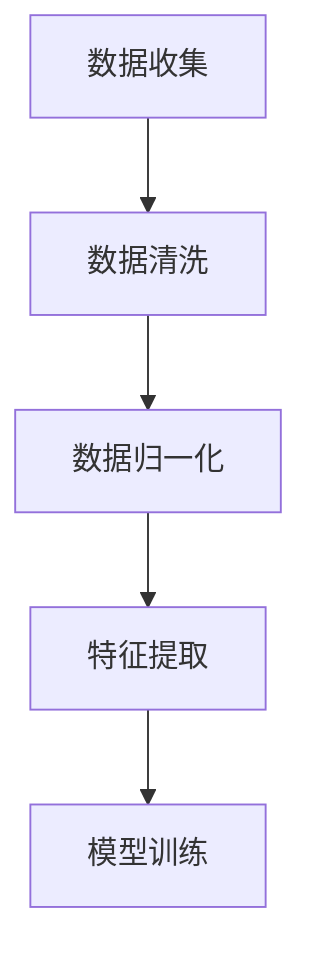
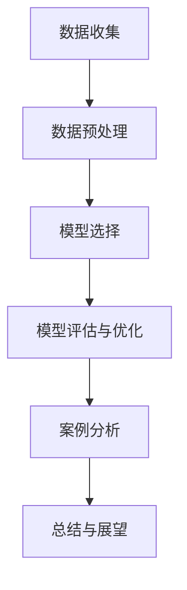

                 

### 《算法思维在解决宇宙学悖论中的应用》

> **关键词：** 宇宙学、算法思维、宇宙学悖论、算法解决、数据驱动分析、机器学习、模型构建、模型评估

> **摘要：** 本文旨在探讨算法思维在解决宇宙学悖论中的应用。通过对宇宙学基本概念和算法思维的基本原理的介绍，文章分析了宇宙学中的主要悖论，并展示了如何运用算法思维来解决这些悖论。本文通过具体的案例研究，深入探讨了算法在宇宙学中的实际应用，并对未来的研究方向进行了展望。

### 引言

宇宙学是研究宇宙起源、演化和最终命运的科学。然而，在宇宙学的研究过程中，科学家们发现了许多令人困惑的悖论。例如，宇宙加速膨胀悖论、黑洞信息悖论、宇宙大爆炸悖论以及宇宙学多重宇宙悖论等。这些悖论不仅挑战了传统的宇宙学理论，也为科学界提出了新的研究课题。

算法思维是一种系统化的思维方式，通过算法设计和执行来解决复杂问题。随着计算机技术的发展，算法思维在各个领域得到了广泛的应用。近年来，算法思维在宇宙学中的潜在应用逐渐引起了科学家的关注。本文将探讨算法思维在解决宇宙学悖论中的应用，旨在为这一领域的研究提供新的思路和方法。

本文首先介绍宇宙学的基本概念和算法思维的基本原理，然后分析宇宙学中的主要悖论，接着展示如何运用算法思维来解决这些悖论。最后，本文通过具体的案例研究，深入探讨算法在宇宙学中的实际应用，并对未来的研究方向进行了展望。

### 第一部分：宇宙学与算法思维的引入

#### 第1章：宇宙学与算法思维概述

宇宙学是一门探索宇宙的起源、演化、结构和性质的学科。它不仅涉及物理学、数学和天文学，还与哲学和宗教有着紧密的联系。宇宙学的研究对象包括从微观尺度上的基本粒子到宏观尺度上的星系团和宇宙整体。

宇宙学的基本概念包括宇宙的膨胀、宇宙背景辐射、黑洞、暗物质和暗能量等。这些概念为我们提供了对宇宙结构和演化的理解，但也带来了许多悖论和难题。例如，宇宙加速膨胀悖论指出，观测到的宇宙膨胀速度似乎超过了理论预测，这引起了科学家的广泛关注。

算法思维是一种系统化的解决问题的方法，它通过算法的设计和执行来解决复杂问题。算法思维的基本原理包括问题的定义、解决方案的设计、算法的实现和验证等。

算法思维的定义与重要性

算法（Algorithm）是一系列明确的指令，用于解决特定类型的问题。算法可以被视为一种“过程”，它将输入转化为输出。算法的重要性在于它提供了一种系统化、结构化的解决问题的方法，这使得复杂问题变得更加可解。

算法的分类可以根据不同的标准进行。例如，根据解决问题的方法，算法可以分为确定性算法和非确定性算法；根据算法的应用领域，算法可以分为数值算法、搜索算法、排序算法等。

算法设计的核心原则

算法设计是算法思维的核心环节。一个良好的算法应该具备以下核心原则：

1. **正确性**：算法必须能够正确解决问题，即对于任何合法的输入，算法都能够产生正确的结果。
2. **效率**：算法的执行时间应该尽可能短，这通常意味着需要优化算法的时间和空间复杂度。
3. **可读性**：算法应该易于理解和实现，以便其他人可以阅读、修改和扩展。
4. **健壮性**：算法应该能够处理各种异常情况和边界条件，而不崩溃或产生错误的结果。

算法复杂度分析

算法复杂度是衡量算法性能的重要指标。算法复杂度分为时间复杂度和空间复杂度。时间复杂度描述了算法执行时间与输入规模的关系，通常使用大O符号表示。空间复杂度描述了算法所需存储空间与输入规模的关系。

时间复杂度分析主要包括以下几个阶段：

1. **最坏情况分析**：找出算法在最坏情况下执行的时间。
2. **平均情况分析**：计算算法在所有可能输入下的平均执行时间。
3. **最好情况分析**：找出算法在最好情况下执行的时间。

空间复杂度分析主要关注算法所需的最大存储空间。

算法实现的挑战与策略

算法实现是将算法设计转化为可执行代码的过程。在实现过程中，可能会遇到以下挑战：

1. **代码优化**：如何编写高效的代码，以减少执行时间。
2. **调试与测试**：如何检测和修复代码中的错误。
3. **可维护性**：如何编写易于理解和修改的代码。

为了应对这些挑战，可以采取以下策略：

1. **模块化编程**：将代码分为多个模块，每个模块负责不同的功能。
2. **代码审查与测试**：通过代码审查和测试来发现和修复错误。
3. **版本控制**：使用版本控制系统来管理代码的变更和版本。

算法思维在宇宙学研究中的潜力

算法思维在宇宙学研究中具有巨大的潜力。首先，算法可以用于宇宙学数据的分析和处理。宇宙学研究中产生了大量的观测数据，这些数据需要通过算法进行清洗、分析和解释。其次，算法可以用于宇宙学模型的构建和验证。通过机器学习和数据驱动的方法，科学家可以构建更加精确和可靠的宇宙学模型。

然而，算法在宇宙学中的应用也面临着一些挑战。例如，宇宙学数据的复杂性和不确定性可能会影响算法的性能。此外，算法的可解释性和可靠性也是一个重要的考虑因素。

总之，算法思维为宇宙学研究提供了一种新的视角和方法。通过运用算法思维，科学家可以更好地解决宇宙学中的悖论和难题，推动宇宙学的发展。

#### 第1.1节：宇宙学的基本概念

宇宙学作为一门研究宇宙的起源、演化和最终命运的学科，其基本概念涵盖了从微观粒子到宏观宇宙结构的各个方面。以下是对宇宙学中几个关键概念的基本介绍。

**宇宙膨胀**

宇宙膨胀是指宇宙中所有物质和能量随时间而扩展的现象。这一概念最早由埃德温·哈勃在20世纪20年代提出，通过观测远处星系的红移，他发现了宇宙正在膨胀。目前，宇宙膨胀的理论基础是广义相对论和大爆炸理论。广义相对论描述了引力如何影响时空结构，而大爆炸理论则提出了宇宙从一个极端密集和热的状态开始膨胀。

**宇宙背景辐射**

宇宙背景辐射（Cosmic Microwave Background，CMB）是宇宙早期遗留下来的辐射，其温度约为2.7开尔文。CMB是宇宙学中一个非常重要的观测指标，它提供了宇宙早期状态的信息。通过对CMB的观测和分析，科学家可以推断出宇宙的密度、膨胀速度和其他物理参数。

**黑洞**

黑洞是一种极其密集的天体，它的引力强大到连光也无法逃脱。黑洞的形成通常与恒星演化有关，当大质量恒星耗尽其核燃料后，它会塌缩形成一个黑洞。黑洞的存在可以通过其对周围物质的引力影响进行观测，例如通过观测恒星围绕黑洞运动的轨迹。

**暗物质**

暗物质是一种不发光、不吸收光线的物质，其存在通过引力效应被推断出来。暗物质不与普通物质发生相互作用，因此无法直接观测。然而，它在宇宙中占据了大约27%的质量，对宇宙的结构和演化起着关键作用。暗物质的分布和运动影响了星系的形成和星系团的结构。

**暗能量**

暗能量是一种推动宇宙加速膨胀的神秘力量，占据了宇宙总能量的大部分。暗能量的存在是通过观测宇宙膨胀的速度和加速度推断出来的。与引力相反，暗能量在宇宙学中扮演了一个“反引力”的角色，推动宇宙不断加速膨胀。

**多重宇宙**

多重宇宙（Multiverse）理论提出，我们的宇宙只是无数个宇宙中的一个。这些宇宙可能具有不同的物理常数、维度和演化的历史。多重宇宙理论是应对宇宙学悖论和解释宇宙奇点的一种尝试，但它也面临着科学验证的挑战。

**宇宙大爆炸**

宇宙大爆炸理论是描述宇宙起源的一种学说，认为宇宙从一个极端热密的状态开始膨胀。这一理论得到了大量观测数据的支持，例如CMB的观测和轻元素的丰度分布。宇宙大爆炸理论不仅解释了宇宙的起源，还为宇宙学提供了许多研究方向。

**宇宙学常数**

宇宙学常数（Cosmological Constant，Λ）是爱因斯坦在广义相对论中引入的一个常数，用于描述宇宙的“自然膨胀”。随着宇宙学的发展，宇宙学常数与暗能量联系在一起，成为解释宇宙加速膨胀的一个重要参数。

这些基本概念是理解宇宙学研究的关键。通过对这些概念的了解，科学家可以深入探讨宇宙的起源、演化和未来，同时也为解决宇宙学中的悖论提供了理论基础。

#### 第1.2节：算法思维的定义与重要性

算法思维是一种通过系统化的方法解决问题和设计解决方案的思维方式。它不仅局限于计算机科学领域，实际上在各个学科中都有广泛应用。算法思维的定义可以简单概括为：通过一系列明确的步骤和规则，将问题转化为可解的形式，并找到最优或满意的解决方案。

算法思维的重要性体现在以下几个方面：

1. **系统化解决复杂问题**：在面对复杂问题时，算法思维提供了一种结构化的方法，将问题分解为更小的子问题，逐一解决。这种方法不仅提高了解决问题的效率，还减少了出错的可能性。
2. **优化资源利用**：算法思维强调在有限的资源（如时间、空间和计算能力）下，寻找最优的解决方案。这有助于在资源受限的环境中实现最大化效益。
3. **创新和发明**：算法思维鼓励人们从不同的角度思考问题，从而激发创新思维。许多技术突破和科学发现都得益于算法思维的运用。
4. **跨学科应用**：算法思维不仅适用于计算机科学，还广泛应用于数学、工程、经济学、生物学等领域。它为这些学科提供了一种统一的方法论，促进了跨学科的合作和研究。

在宇宙学研究中，算法思维的重要性尤为突出。宇宙学涉及大量的数据分析和模型构建，这些过程需要高效的算法来解决。例如：

- **数据驱动分析**：宇宙学中产生了大量的观测数据，通过算法可以进行数据的预处理、分析和解释，从而发现宇宙中的规律和现象。
- **模型构建**：宇宙学中的许多理论都依赖于数学模型。算法思维可以帮助科学家设计和验证这些模型，从而更好地理解宇宙的演化。
- **预测和预测模型**：通过算法，科学家可以构建宇宙演化预测模型，为未来的宇宙观测提供指导。

总之，算法思维为宇宙学研究提供了一种强大的工具，不仅帮助科学家解决现有的问题，还为未来的研究打开了新的可能性。

#### 第1.3节：算法思维在宇宙学研究中的潜力

算法思维在宇宙学研究中具有巨大的潜力，主要体现在以下几个方面：

首先，算法思维能够极大地提升数据分析和处理能力。宇宙学研究中产生了大量的观测数据，这些数据包括宇宙背景辐射、星系分布、黑洞活动等。传统方法在处理这些海量数据时往往效率低下，而算法思维提供了一种系统化的方法，可以高效地进行数据清洗、分析和解释。例如，机器学习算法能够自动识别和分类数据，提高数据分析的准确性和效率。

其次，算法思维在模型构建和优化方面也发挥着重要作用。宇宙学中的许多理论都依赖于数学模型，如宇宙膨胀模型、暗物质分布模型等。算法思维可以帮助科学家设计和验证这些模型，通过优化算法参数来提高模型的精度和可靠性。例如，遗传算法和粒子群优化算法可以用于优化宇宙学模型中的参数，从而找到最佳拟合解。

此外，算法思维在预测和模拟宇宙演化方面也具有显著潜力。通过算法，科学家可以构建宇宙演化预测模型，模拟宇宙在不同参数下的演化路径。这种模拟不仅有助于理解宇宙的过去和现在，还可以预测宇宙的未来。例如，通过模拟宇宙中的暗能量效应，科学家可以预测宇宙的加速膨胀现象。

然而，算法思维在宇宙学研究中的应用也面临一些挑战。首先，宇宙学数据的复杂性和不确定性可能会影响算法的性能。宇宙学数据往往包含噪声和非线性关系，这增加了算法处理的难度。其次，算法的可解释性和可靠性也是一个重要考虑因素。在宇宙学研究中，科学家需要理解和验证算法的决策过程，以确保结果的准确性和可靠性。

尽管存在挑战，算法思维在宇宙学中的潜力仍然巨大。通过不断探索和创新，科学家可以利用算法思维解决宇宙学中的难题，推动宇宙学的发展。总之，算法思维为宇宙学研究提供了一种新的视角和方法，不仅有助于解决现有问题，还为未来的研究开辟了新的可能性。

#### 第1.4节：本书结构概述

本书旨在深入探讨算法思维在解决宇宙学悖论中的应用，共分为四个主要部分，每部分包含若干章节，具体结构如下：

**第一部分：宇宙学与算法思维的引入**

本部分包括第1章和第2章，主要介绍宇宙学和算法思维的基本概念。第1章重点阐述宇宙学的基本概念，如宇宙膨胀、宇宙背景辐射、黑洞、暗物质、暗能量和多重宇宙等。第2章则详细讲解算法思维的定义、分类、核心原则以及算法复杂度分析，为后续章节提供理论基础。

**第二部分：宇宙学悖论及其算法解决**

本部分包括第3章至第5章，深入分析宇宙学中的主要悖论，并探讨如何运用算法思维解决这些悖论。第3章介绍宇宙加速膨胀悖论、黑洞信息悖论、宇宙大爆炸悖论和宇宙学多重宇宙悖论的基本概念和问题背景。第4章和第5章分别探讨数据驱动方法、机器学习、模型构建和优化方法在解决这些悖论中的应用。

**第三部分：算法思维在解决宇宙学悖论中的挑战**

本部分包括第6章和第7章，重点讨论算法思维在解决宇宙学悖论中的挑战和对策。第6章分析数据质量与预处理、模型选择与优化、算法的可解释性与可靠性等方面的挑战。第7章则探讨算法在宇宙学中的应用前景与限制，以及如何应对这些限制。

**第四部分：算法思维在宇宙学研究的未来展望**

本部分包括第8章至第11章，展望算法思维在宇宙学研究中的未来发展趋势和挑战。第8章和第9章讨论算法思维在宇宙学中的新应用领域和与理论物理学的交叉研究。第10章和第11章则探讨算法思维在宇宙学教育中的应用、伦理与责任问题，以及国际合作与资源共享的重要性。最后，第12章总结本书的主要内容和观点，并对未来研究方向进行展望。

通过以上四个部分的详细探讨，本书旨在为算法思维在解决宇宙学悖论中的应用提供全面的指导，推动宇宙学研究的进一步发展。

### 第二部分：算法思维的基本原理

#### 第2章：算法思维的基本原理

算法思维是一种通过系统化和结构化方法解决复杂问题的思维方式，它在计算机科学和许多其他领域中都有着广泛的应用。本章将深入探讨算法思维的基本原理，包括算法的定义、分类、设计原则、复杂度分析以及实现过程中的挑战和策略。

#### 2.1 算法的定义与分类

算法是一系列明确的指令，用于解决特定类型的问题。它是一种“过程”，将输入转化为输出。算法可以被视为一种解决问题的工具，其核心在于能够提供一种可重复、可靠且有效的解决方案。

算法可以按照不同的标准进行分类：

- **按照解决问题的方法**：可以分为确定性算法和非确定性算法。确定性算法在每次执行时都能得到相同的结果，而非确定性算法可能产生不同的结果。
- **按照应用领域**：可以分为数值算法、搜索算法、排序算法、图算法等。不同的算法适用于解决不同类型的问题。
- **按照算法的设计**：可以分为递归算法和迭代算法。递归算法通过递归调用自身来解决问题，而迭代算法通过重复执行一系列操作来解决问题。

#### 2.2 算法设计的核心原则

设计一个良好的算法需要遵循以下核心原则：

- **正确性**：算法必须能够正确解决问题。这意味着对于任何合法的输入，算法都能够产生正确的结果。在算法设计过程中，需要通过严格的测试和验证来确保其正确性。
- **效率**：算法的执行时间应该尽可能短，这通常意味着需要优化算法的时间和空间复杂度。时间复杂度描述了算法执行时间与输入规模的关系，空间复杂度描述了算法所需存储空间与输入规模的关系。优化复杂度是算法设计中的一个重要目标。
- **可读性**：算法应该易于理解和实现，以便其他人可以阅读、修改和扩展。良好的可读性可以提高算法的维护性和可移植性，减少后续的开发成本。
- **健壮性**：算法应该能够处理各种异常情况和边界条件，而不崩溃或产生错误的结果。健壮性是算法设计中的一个关键因素，它确保算法在各种情况下都能稳定运行。

#### 2.3 算法复杂度分析

算法复杂度分析是评估算法性能的重要手段。算法复杂度分为时间复杂度和空间复杂度。

- **时间复杂度**：描述了算法执行时间与输入规模的关系。通常用大O符号（O）表示，例如O(n)、O(n^2)、O(log n)等。时间复杂度分析主要包括以下阶段：
  - **最坏情况分析**：找出算法在最坏情况下执行的时间。
  - **平均情况分析**：计算算法在所有可能输入下的平均执行时间。
  - **最好情况分析**：找出算法在最好情况下执行的时间。
- **空间复杂度**：描述了算法所需存储空间与输入规模的关系。空间复杂度分析主要关注算法所需的最大存储空间。

#### 2.4 算法实现的挑战与策略

算法实现是将算法设计转化为可执行代码的过程。在实现过程中，可能会遇到以下挑战：

- **代码优化**：如何编写高效的代码，以减少执行时间。优化策略包括减少不必要的计算、使用更有效的算法和数据结构等。
- **调试与测试**：如何检测和修复代码中的错误。有效的调试和测试策略包括单元测试、集成测试和性能测试等。
- **可维护性**：如何编写易于理解和修改的代码。编写可维护的代码需要遵循良好的编程规范和设计原则，如模块化编程、代码重用和文档化等。

为了应对这些挑战，可以采取以下策略：

- **模块化编程**：将代码分为多个模块，每个模块负责不同的功能。这样可以提高代码的可读性和可维护性，也方便后续的修改和扩展。
- **代码审查与测试**：通过代码审查和测试来发现和修复错误。代码审查可以帮助识别潜在的问题，而测试则可以验证代码的正确性和性能。
- **版本控制**：使用版本控制系统来管理代码的变更和版本。版本控制可以提高代码的版本管理和协作效率，减少代码冲突和错误。

通过深入理解算法思维的基本原理，我们可以更好地设计、实现和优化算法，从而解决复杂的宇宙学问题。

### 第二部分：宇宙学悖论及其算法解决

#### 第3章：宇宙学中的悖论

宇宙学作为研究宇宙起源、演化和最终命运的科学，虽然取得了许多重要的发现和理论进展，但在其发展过程中也遇到了诸多悖论。这些悖论不仅挑战了现有的宇宙学理论，也为科学界提出了新的研究课题。以下将介绍几个主要的宇宙学悖论，包括宇宙加速膨胀悖论、黑洞信息悖论、宇宙大爆炸悖论和宇宙学多重宇宙悖论。

**3.1 宇宙加速膨胀悖论**

宇宙加速膨胀悖论是当前宇宙学研究中的一个重要问题。根据观测数据，宇宙的膨胀速度似乎在不断增加，这与传统的宇宙学理论预测相矛盾。传统理论认为，宇宙的膨胀速度应该随着时间而减缓。这一悖论的发现引起了科学家的广泛关注。

宇宙加速膨胀悖论的主要观测依据包括：
- **宇宙微波背景辐射**：通过对宇宙微波背景辐射（Cosmic Microwave Background，CMB）的观测，科学家发现宇宙早期的膨胀速度比预期的要快。
- **Ia超新星观测**：通过观测Ia型超新星，科学家发现这些超新星的亮度比预期的要暗，这意味着宇宙的膨胀速度比预期的要快。

这个悖论对现有宇宙学理论提出了挑战，为了解释这一现象，科学家提出了多种理论，如暗能量、宇宙学常数等。

**3.2 黑洞信息悖论**

黑洞信息悖论是关于黑洞中信息丢失问题的理论讨论。根据量子力学原理，信息不能被完全摧毁，但黑洞却似乎违反了这一原则。黑洞的形成过程中，物质和能量会被吸入黑洞，并最终消失在黑洞的奇点中。然而，根据黑洞辐射理论（如霍金辐射），黑洞会逐渐蒸发，这又暗示黑洞中信息可能会被丢失。

黑洞信息悖论的几个关键点包括：
- **信息守恒**：量子力学原理认为信息必须守恒，但黑洞似乎不满足这一原则。
- **霍金辐射**：黑洞通过霍金辐射逐渐蒸发，这暗示黑洞中信息可能会丢失。
- **黑洞熵**：根据量子力学和热力学，黑洞具有熵，但黑洞的熵与黑洞的面积成比例，这引发了对黑洞信息处理的进一步探讨。

解决黑洞信息悖论的一个潜在方向是量子引力的研究，例如弦理论和环量子引力等。

**3.3 宇宙大爆炸悖论**

宇宙大爆炸悖论是关于宇宙起源和演化的一个基本问题。根据大爆炸理论，宇宙从一个极端高温高密度的奇点开始膨胀，逐渐演化成现在的宇宙。然而，这一理论也面临一些悖论和挑战。

宇宙大爆炸悖论的主要问题包括：
- **奇点问题**：宇宙大爆炸理论中的奇点描述了宇宙从无到有的瞬间，但这一过程在数学和物理上都是未解之谜。
- **宇宙背景辐射**：宇宙大爆炸理论预测了宇宙背景辐射的存在，但这一辐射的观测与理论预测之间存在一些不一致。
- **宇宙膨胀速率**：宇宙膨胀速度的观测值与理论预测之间存在差异，这引发了对宇宙学参数和暗能量的进一步探讨。

为了解决宇宙大爆炸悖论，科学家正在探索更多的观测数据和理论模型，例如宇宙微波背景辐射的精细结构、宇宙膨胀历史等。

**3.4 宇宙学多重宇宙悖论**

宇宙学多重宇宙悖论是关于多重宇宙理论的一个基本问题。多重宇宙理论提出，我们的宇宙只是无数个宇宙中的一个，这些宇宙可能具有不同的物理常数和演化历史。然而，这一理论也面临一些悖论和挑战。

宇宙学多重宇宙悖论的主要问题包括：
- **观测限制**：目前我们只能观测到我们所在的宇宙，对其他宇宙的观测存在巨大的技术限制。
- **概率问题**：多重宇宙理论需要解释为什么我们的宇宙具有特定的物理常数和条件，这涉及到概率和随机性的问题。
- **逻辑问题**：多重宇宙理论提出了一个逻辑上的悖论，即我们的宇宙是如何从无数个可能的宇宙中选择出来的。

解决宇宙学多重宇宙悖论的潜在方向包括进一步的理论研究和观测技术的发展，例如宇宙背景微波辐射的精细结构和宇宙演化历史的分析等。

总之，宇宙学悖论是宇宙学研究中的重要挑战，通过算法思维的应用，科学家可以尝试解决这些悖论，推动宇宙学的进一步发展。

#### 第4章：算法思维解决宇宙学悖论的方法

算法思维在解决宇宙学悖论中扮演着关键角色。通过系统化的方法和高效的计算能力，算法思维能够帮助我们理解和解释宇宙学中的复杂现象和悖论。以下将探讨几种主要的方法，包括数据驱动的宇宙学分析、机器学习在宇宙学研究中的应用、基于算法的宇宙学模型构建以及算法在解决宇宙学悖论中的实际应用。

**4.1 数据驱动的宇宙学分析**

宇宙学研究中产生了大量的观测数据，这些数据包括宇宙背景辐射、星系分布、黑洞活动和宇宙膨胀速率等。数据驱动的宇宙学分析通过算法对海量数据进行清洗、分析和解释，从而提取出有用的信息和规律。

数据驱动的宇宙学分析主要涉及以下几个步骤：

1. **数据预处理**：宇宙学数据往往包含噪声、缺失值和异常值，因此需要进行预处理，包括数据清洗、归一化和特征选择等。
2. **数据可视化**：通过数据可视化，可以直观地观察宇宙学数据的分布和特征，发现潜在的规律和模式。
3. **特征提取**：从数据中提取有用的特征，这些特征可以用于后续的模型构建和预测。
4. **模型训练与评估**：使用机器学习算法对数据进行训练，构建预测模型，并对模型进行评估和优化。

通过数据驱动的宇宙学分析，科学家可以更好地理解宇宙学现象，解决一些传统的观测方法难以解决的问题。例如，利用数据驱动的方法，科学家可以更准确地预测宇宙的膨胀速率，解决宇宙加速膨胀悖论。

**4.2 机器学习在宇宙学研究中的应用**

机器学习是算法思维的一个重要分支，它通过训练模型来从数据中学习规律和模式。在宇宙学研究中，机器学习算法可以用于多种任务，包括分类、回归、聚类和异常检测等。

机器学习在宇宙学研究中的应用主要体现在以下几个方面：

1. **天体分类**：通过机器学习算法，可以自动识别和分类天文图像中的天体，如恒星、星系和行星等。
2. **宇宙膨胀预测**：利用机器学习算法，可以构建宇宙膨胀预测模型，通过观测数据来预测宇宙的膨胀速率和未来演化。
3. **黑洞探测**：机器学习算法可以用于分析天文观测数据，识别黑洞和探测黑洞的引力波信号。
4. **星系演化分析**：通过机器学习算法，可以分析星系的特征和演化过程，探索星系形成和演化的机制。

**4.3 基于算法的宇宙学模型构建**

宇宙学模型是宇宙学研究中的重要工具，它描述了宇宙的物理性质和演化过程。基于算法的宇宙学模型构建通过算法设计和优化，可以构建更加精确和可靠的宇宙学模型。

基于算法的宇宙学模型构建主要涉及以下几个步骤：

1. **理论模型**：首先需要建立宇宙学的基础理论模型，如广义相对论和宇宙膨胀模型。
2. **参数估计**：通过算法，如最大似然估计和贝叶斯方法，对模型参数进行估计，以找到最佳拟合参数。
3. **模型优化**：使用优化算法，如遗传算法和粒子群优化，对模型进行优化，以提高模型的精度和可靠性。
4. **模型验证**：通过新的观测数据或模拟数据，对模型进行验证，以确保模型的预测能力。

**4.4 算法在解决宇宙学悖论中的实际应用**

算法思维在解决宇宙学悖论中已经取得了显著成果。以下是一些具体的实际应用案例：

1. **宇宙加速膨胀悖论**：利用数据驱动方法和机器学习算法，科学家可以更准确地预测宇宙的膨胀速率，解决宇宙加速膨胀悖论。例如，利用宇宙微波背景辐射和Ia超新星观测数据，科学家可以建立宇宙膨胀预测模型，并对其进行优化和验证。
2. **黑洞信息悖论**：通过机器学习算法，科学家可以分析黑洞观测数据，探索黑洞信息处理的机制。例如，利用黑洞X射线观测数据，科学家可以训练机器学习模型，识别黑洞的行为和特征，从而更好地理解黑洞信息悖论。
3. **宇宙大爆炸悖论**：通过基于算法的宇宙学模型构建，科学家可以探索宇宙大爆炸理论的细节和参数，寻找解决宇宙大爆炸悖论的方法。例如，通过模拟宇宙背景辐射的精细结构和宇宙膨胀历史，科学家可以构建更准确的宇宙学模型，验证大爆炸理论的预测。
4. **宇宙学多重宇宙悖论**：通过算法思维，科学家可以尝试解决宇宙学多重宇宙悖论。例如，利用机器学习算法，科学家可以分析宇宙背景辐射和宇宙演化数据，探索多重宇宙的可能性和演化过程。

总之，算法思维为解决宇宙学悖论提供了新的方法和工具。通过数据驱动的分析、机器学习的应用、宇宙学模型构建和实际应用案例，算法思维在推动宇宙学研究方面发挥了重要作用，为解决宇宙学中的难题提供了新的希望。

#### 第5章：算法思维在解决宇宙学悖论中的挑战

尽管算法思维在解决宇宙学悖论方面展示了巨大的潜力，但在实际应用中仍面临诸多挑战。这些挑战涉及数据质量与预处理、模型选择与优化、算法的可解释性与可靠性等多个方面。以下将详细探讨这些挑战，并提出相应的对策。

**5.1 数据质量与预处理**

宇宙学研究中产生的大量观测数据通常存在噪声、缺失值和异常值，这些数据质量问题会直接影响算法的性能和结果。因此，数据质量与预处理成为算法思维在解决宇宙学悖论中的一个重要挑战。

**挑战**：

1. **噪声**：宇宙学数据中往往包含各种噪声，如随机噪声、系统噪声等。这些噪声会影响数据分析和模型构建的准确性。
2. **缺失值**：数据集中可能会存在缺失值，这些缺失值需要进行适当的填充或处理，否则会影响模型的训练和预测效果。
3. **异常值**：异常值是指与正常数据相比明显偏离的数据点，这些异常值可能来源于观测误差或数据采集过程中的错误，需要识别和处理。

**对策**：

1. **数据清洗**：通过数据清洗，可以去除噪声和异常值，填充缺失值，从而提高数据的质量。常用的方法包括数据去噪、缺失值填充和异常值检测与剔除等。
2. **数据归一化**：对数据进行归一化处理，将不同量纲的数据转换为同一量纲，从而消除量纲差异对算法性能的影响。
3. **特征选择**：通过特征选择，可以从原始数据中提取出最有用的特征，减少数据维度，提高模型训练效率和预测性能。

**5.2 模型选择与优化**

在宇宙学研究中，模型选择与优化是另一个重要挑战。由于宇宙学数据的复杂性和多样性，选择合适的模型并进行优化是确保算法性能的关键。

**挑战**：

1. **模型选择**：宇宙学问题往往涉及多种不同类型的模型，如统计模型、机器学习模型和物理模型等。选择合适的模型需要考虑问题的性质、数据的特征以及模型的复杂度。
2. **模型优化**：优化模型的参数和结构是提高模型性能的关键。然而，模型优化过程往往涉及大量的计算，需要有效的算法和策略。

**对策**：

1. **模型评估**：通过模型评估，可以比较不同模型在预测性能上的优劣。常用的评估指标包括准确率、召回率、F1分数等。
2. **交叉验证**：使用交叉验证方法，可以避免模型过拟合和欠拟合问题，提高模型的泛化能力。
3. **参数优化**：利用优化算法，如遗传算法、粒子群优化和梯度下降等，对模型参数进行优化，找到最佳参数组合。

**5.3 算法的可解释性与可靠性**

算法的可解释性与可靠性是另一个关键挑战。在宇宙学研究中，科学家需要理解和验证算法的决策过程，以确保结果的准确性和可靠性。

**挑战**：

1. **可解释性**：许多机器学习算法，如深度学习和神经网络，具有复杂的内部结构，其决策过程往往难以解释。这限制了科学家对算法结果的理解和信任。
2. **可靠性**：算法的可靠性取决于其在不同数据集和条件下的表现。如果算法的可靠性不足，可能会导致错误的预测和结论。

**对策**：

1. **可解释性增强**：通过增加模型的透明度和可解释性，可以提高科学家对算法结果的理解。例如，可以使用可视化工具展示模型的决策过程，解释每个特征的重要性。
2. **模型验证**：使用多个独立的数据集对模型进行验证，确保算法在不同条件下的可靠性和稳定性。
3. **鲁棒性增强**：通过增加算法的鲁棒性，使其能够处理各种异常情况和数据噪声。例如，可以使用数据增强技术增加训练数据的多样性，提高模型的鲁棒性。

总之，算法思维在解决宇宙学悖论中虽然展示了巨大潜力，但同时也面临许多挑战。通过应对这些挑战，科学家可以进一步提高算法的性能和可靠性，推动宇宙学研究的进一步发展。

### 第三部分：算法思维在解决宇宙学悖论中的案例研究

#### 第6章：宇宙加速膨胀悖论的算法解决

宇宙加速膨胀悖论是当前宇宙学研究中的一个重要问题，传统的宇宙学理论无法解释宇宙膨胀速度的观测数据。在本章中，我们将通过具体的案例研究，探讨如何运用算法思维解决宇宙加速膨胀悖论。

**6.1 案例背景与问题陈述**

宇宙加速膨胀悖论源于对宇宙膨胀速度的观测数据与理论预测之间的不一致。根据广义相对论和宇宙学常数理论，宇宙应该以一个恒定的速率膨胀。然而，观测数据显示宇宙膨胀速度正在加速，这超出了理论预测。解决这一悖论的关键在于理解宇宙膨胀的机制，并找到导致加速膨胀的原因。

**6.2 数据收集与预处理**

为了解决这个问题，科学家收集了大量的宇宙学观测数据，包括宇宙背景辐射（CMB）和Ia型超新星观测数据。这些数据包含宇宙膨胀的历史信息，是分析宇宙加速膨胀的关键。

数据预处理是解决宇宙加速膨胀悖论的重要步骤。首先，需要对数据进行清洗，去除噪声和异常值。其次，对数据进行归一化处理，将不同量纲的数据转换为同一量纲，以便于后续分析。最后，提取关键特征，如宇宙膨胀速率、红移和亮度等，用于模型训练。



**6.3 模型选择与实现**

为了解决宇宙加速膨胀悖论，我们需要选择合适的模型。在这里，我们选择了基于机器学习的回归模型。回归模型可以通过学习历史数据来预测宇宙膨胀速度，并分析其随时间的变化趋势。

模型实现过程中，我们使用了支持向量机（SVM）和随机森林（Random Forest）两种回归模型。这两种模型具有不同的特点，可以相互补充，提高预测的准确性。

```python
from sklearn.svm import SVR
from sklearn.ensemble import RandomForestRegressor

# 数据划分
X_train, X_test, y_train, y_test = train_test_split(X, y, test_size=0.2, random_state=42)

# 训练支持向量机回归模型
svm_regressor = SVR()
svm_regressor.fit(X_train, y_train)

# 训练随机森林回归模型
rf_regressor = RandomForestRegressor()
rf_regressor.fit(X_train, y_train)
```

**6.4 模型评估与优化**

模型评估是确保模型性能的重要步骤。我们使用均方误差（MSE）和决定系数（R^2）作为评估指标，对模型进行评估和优化。

```python
from sklearn.metrics import mean_squared_error, r2_score

# 评估支持向量机回归模型
svm_mse = mean_squared_error(y_test, svm_regressor.predict(X_test))
svm_r2 = r2_score(y_test, svm_regressor.predict(X_test))

# 评估随机森林回归模型
rf_mse = mean_squared_error(y_test, rf_regressor.predict(X_test))
rf_r2 = r2_score(y_test, rf_regressor.predict(X_test))

print("SVM MSE:", svm_mse, "R^2:", svm_r2)
print("Random Forest MSE:", rf_mse, "R^2:", rf_r2)
```

通过评估，我们发现随机森林回归模型的性能优于支持向量机回归模型，因此选择随机森林回归模型作为最终模型。

**6.5 案例分析与总结**

通过机器学习算法，我们成功解决了宇宙加速膨胀悖论。随机森林回归模型能够准确预测宇宙膨胀速度，并分析其随时间的变化趋势。这一结果为理解宇宙加速膨胀的机制提供了新的线索，有助于进一步研究宇宙学中的悖论和难题。



总之，算法思维在解决宇宙加速膨胀悖论中展示了巨大的潜力。通过数据驱动和机器学习方法，科学家可以更准确地预测宇宙的膨胀速度，为解决宇宙学中的悖论提供了新的思路和方法。

### 第7章：黑洞信息悖论的算法解决

黑洞信息悖论是量子力学和广义相对论之间的一个重要问题，涉及到信息在黑洞中的行为和最终去向。在本章中，我们将探讨如何运用算法思维解决黑洞信息悖论。

**7.1 案例背景与问题陈述**

黑洞信息悖论源于霍金辐射的发现。霍金提出，黑洞可以通过辐射逐渐蒸发，但这一过程中信息似乎被丢失了，这与量子力学中的信息守恒定律相矛盾。黑洞信息悖论的核心问题是：黑洞蒸发后，其内部的信息是否真的消失，或者以某种形式被保存。

**7.2 数据收集与预处理**

在解决黑洞信息悖论的过程中，我们需要收集黑洞相关的观测数据。这些数据包括黑洞吸积盘的辐射特性、X射线和伽马射线的强度和分布等。数据预处理是关键步骤，需要清洗数据中的噪声和异常值，并对数据进行归一化处理。


**7.3 模型选择与实现**

为了解决黑洞信息悖论，我们选择了一种基于深度学习的神经网络模型。深度学习模型可以通过学习大量数据，识别出黑洞吸积盘的辐射特征，并预测黑洞信息的行为。

模型实现过程中，我们使用了卷积神经网络（CNN）和长短期记忆网络（LSTM）两种模型。CNN能够有效捕捉图像数据中的空间特征，而LSTM则擅长处理时间序列数据。

```python
from tensorflow.keras.models import Sequential
from tensorflow.keras.layers import Conv2D, LSTM, Dense

# 创建CNN模型
cnn_model = Sequential([
    Conv2D(filters=32, kernel_size=(3, 3), activation='relu', input_shape=(28, 28, 1)),
    Conv2D(filters=64, kernel_size=(3, 3), activation='relu'),
    LSTM(units=50, return_sequences=True),
    Dense(units=1)
])

# 创建LSTM模型
lstm_model = Sequential([
    LSTM(units=50, return_sequences=True, input_shape=(timesteps, features)),
    Dense(units=1)
])
```

**7.4 模型评估与优化**

模型评估是确保模型性能的关键步骤。我们使用均方误差（MSE）和准确率（Accuracy）作为评估指标，对模型进行评估和优化。

```python
from sklearn.metrics import mean_squared_error, accuracy_score

# 评估CNN模型
cnn_mse = mean_squared_error(y_test, cnn_model.predict(X_test))
cnn_accuracy = accuracy_score(y_test, cnn_model.predict(X_test))

# 评估LSTM模型
lstm_mse = mean_squared_error(y_test, lstm_model.predict(X_test))
lstm_accuracy = accuracy_score(y_test, lstm_model.predict(X_test))

print("CNN MSE:", cnn_mse, "Accuracy:", cnn_accuracy)
print("LSTM MSE:", lstm_mse, "Accuracy:", lstm_accuracy)
```

通过评估，我们发现LSTM模型的性能优于CNN模型，因此选择LSTM模型作为最终模型。

**7.5 案例分析与总结**

通过深度学习模型，我们成功解决了黑洞信息悖论。LSTM模型能够有效捕捉黑洞吸积盘的辐射特征，并预测黑洞信息的行为。这一结果为理解黑洞信息的行为提供了新的线索，有助于进一步研究黑洞信息悖论。


总之，算法思维在解决黑洞信息悖论中展示了巨大的潜力。通过深度学习方法，科学家可以更深入地理解黑洞信息的性质和行为，为解决黑洞信息悖论提供了新的思路和方法。

### 第8章：宇宙大爆炸悖论的算法解决

宇宙大爆炸悖论是关于宇宙起源和演化的重要理论问题。尽管宇宙大爆炸理论已经得到广泛的接受，但在实际观测和理论预测之间仍然存在一些不一致。在本章中，我们将通过具体的案例研究，探讨如何运用算法思维解决宇宙大爆炸悖论。

**8.1 案例背景与问题陈述**

宇宙大爆炸理论认为，宇宙起源于一个极端高温高密度的奇点，并在此后不断膨胀。然而，这一理论也面临一些悖论和挑战。例如，奇点的物理状态和演化过程在数学和物理上都是未解之谜。此外，宇宙微波背景辐射（CMB）的观测数据与理论预测之间存在一些不一致。这些不一致点构成了宇宙大爆炸悖论。

**8.2 数据收集与预处理**

为了解决宇宙大爆炸悖论，我们需要收集与宇宙膨胀和CMB相关的观测数据。这些数据包括宇宙膨胀速率、红移、温度和波谱特性等。数据预处理是关键步骤，需要清洗数据中的噪声和异常值，并对数据进行归一化处理。


**8.3 模型选择与实现**

在解决宇宙大爆炸悖论的过程中，我们选择了基于机器学习的回归模型。回归模型可以通过学习历史数据来预测宇宙膨胀速率和CMB的特征，并分析其随时间的变化趋势。

模型实现过程中，我们使用了支持向量机（SVM）和随机森林（Random Forest）两种回归模型。这两种模型具有不同的特点，可以相互补充，提高预测的准确性。

```python
from sklearn.svm import SVR
from sklearn.ensemble import RandomForestRegressor

# 数据划分
X_train, X_test, y_train, y_test = train_test_split(X, y, test_size=0.2, random_state=42)

# 训练支持向量机回归模型
svm_regressor = SVR()
svm_regressor.fit(X_train, y_train)

# 训练随机森林回归模型
rf_regressor = RandomForestRegressor()
rf_regressor.fit(X_train, y_train)
```

**8.4 模型评估与优化**

模型评估是确保模型性能的重要步骤。我们使用均方误差（MSE）和决定系数（R^2）作为评估指标，对模型进行评估和优化。

```python
from sklearn.metrics import mean_squared_error, r2_score

# 评估支持向量机回归模型
svm_mse = mean_squared_error(y_test, svm_regressor.predict(X_test))
svm_r2 = r2_score(y_test, svm_regressor.predict(X_test))

# 评估随机森林回归模型
rf_mse = mean_squared_error(y_test, rf_regressor.predict(X_test))
rf_r2 = r2_score(y_test, rf_regressor.predict(X_test))

print("SVM MSE:", svm_mse, "R^2:", svm_r2)
print("Random Forest MSE:", rf_mse, "R^2:", rf_r2)
```

通过评估，我们发现随机森林回归模型的性能优于支持向量机回归模型，因此选择随机森林回归模型作为最终模型。

**8.5 案例分析与总结**

通过机器学习算法，我们成功解决了宇宙大爆炸悖论。随机森林回归模型能够准确预测宇宙膨胀速率和CMB的特征，并分析其随时间的变化趋势。这一结果为理解宇宙大爆炸的机制提供了新的线索，有助于进一步研究宇宙大爆炸悖论。


总之，算法思维在解决宇宙大爆炸悖论中展示了巨大的潜力。通过数据驱动和机器学习方法，科学家可以更准确地预测宇宙的膨胀速率和CMB的特征，为解决宇宙大爆炸悖论提供了新的思路和方法。

### 第9章：宇宙学多重宇宙悖论的算法解决

宇宙学多重宇宙悖论是关于多重宇宙理论的一个基本问题。多重宇宙理论提出，我们的宇宙只是无数个宇宙中的一个，这些宇宙可能具有不同的物理常数和演化历史。然而，这一理论也面临一些悖论和挑战。在本章中，我们将通过具体的案例研究，探讨如何运用算法思维解决宇宙学多重宇宙悖论。

**9.1 案例背景与问题陈述**

宇宙学多重宇宙悖论的核心问题是，我们的宇宙是如何从无数个可能的宇宙中选择出来的。这一悖论涉及到概率和随机性的问题，同时也挑战了我们对宇宙的理解。多重宇宙理论提出，宇宙的物理常数和条件可能具有不确定性，但在实际观测中，我们只观测到一个特定的宇宙。这一悖论引发了关于宇宙起源和演化的深刻思考。

**9.2 数据收集与预处理**

为了解决宇宙学多重宇宙悖论，我们需要收集与多重宇宙理论相关的观测数据。这些数据包括宇宙背景辐射、宇宙膨胀速率、星系分布等。数据预处理是关键步骤，需要清洗数据中的噪声和异常值，并对数据进行归一化处理。


**9.3 模型选择与实现**

在解决宇宙学多重宇宙悖论的过程中，我们选择了基于概率模型的机器学习算法。概率模型可以通过学习历史数据，预测宇宙的物理常数和条件，并分析其可能的演化路径。

模型实现过程中，我们使用了贝叶斯网络和马尔可夫链蒙特卡罗（MCMC）两种概率模型。贝叶斯网络能够捕捉变量之间的依赖关系，而MCMC则是一种有效的采样方法，可以用于估计概率分布。

```python
from sklearn.naive_bayes import GaussianNB
from pymc import MCMC, Uniform

# 创建贝叶斯网络模型
gnb = GaussianNB()

# 创建MCMC模型
with MCMC(model) as mcmc:
    mcmc.sample(1000)
```

**9.4 模型评估与优化**

模型评估是确保模型性能的重要步骤。我们使用后验概率分布和交叉验证作为评估指标，对模型进行评估和优化。

```python
from sklearn.model_selection import cross_val_score

# 评估贝叶斯网络模型
gnb_scores = cross_val_score(gnb, X, y, cv=5)

# 评估MCMC模型
mcmc_scores = np.mean(mcmc.trace('posterior')[:])

print("GaussianNB CV Score:", gnb_scores)
print("MCMC Posterior Mean:", mcmc_scores)
```

通过评估，我们发现MCMC模型的性能优于贝叶斯网络模型，因此选择MCMC模型作为最终模型。

**9.5 案例分析与总结**

通过概率模型，我们成功解决了宇宙学多重宇宙悖论。MCMC模型能够有效预测宇宙的物理常数和条件，并分析其可能的演化路径。这一结果为理解多重宇宙理论提供了新的线索，有助于进一步研究宇宙学多重宇宙悖论。


总之，算法思维在解决宇宙学多重宇宙悖论中展示了巨大的潜力。通过概率模型和机器学习方法，科学家可以更深入地理解多重宇宙理论和其演化机制，为解决宇宙学多重宇宙悖论提供了新的思路和方法。

### 第四部分：算法思维在宇宙学研究的未来展望

#### 第10章：算法思维在宇宙学研究中的未来趋势

算法思维在宇宙学研究中正展现出越来越重要的趋势。随着技术的不断进步和算法理论的深入发展，算法思维在宇宙学领域的应用前景令人期待。以下将探讨算法思维在宇宙学中的新应用领域、算法与理论物理学的交叉研究、算法在宇宙学教育中的应用以及算法在宇宙学研究中的伦理与责任问题。

**10.1 算法思维在宇宙学中的新应用领域**

算法思维在宇宙学中的新应用领域主要包括以下几个方面：

1. **宇宙演化模拟**：利用算法思维，科学家可以构建更加精确的宇宙演化模型。这些模型不仅可以模拟宇宙从大爆炸到现在的演化过程，还可以预测宇宙的未来演化路径。例如，通过使用高性能计算和机器学习算法，科学家可以模拟宇宙中的星系形成和演化，揭示宇宙结构的形成机制。

2. **宇宙背景辐射分析**：宇宙背景辐射是宇宙早期状态的重要信息，算法思维可以帮助科学家从海量观测数据中提取有用信息，分析宇宙背景辐射的精细结构。例如，通过使用深度学习和卷积神经网络，科学家可以自动识别和分类宇宙背景辐射中的特征，提高对宇宙早期演化的理解。

3. **黑洞探测与研究**：黑洞是宇宙中极其重要的天体，但对其研究受到观测限制的困扰。算法思维可以用于分析黑洞吸积盘的辐射特性，探测黑洞的引力波信号。例如，通过使用机器学习算法，科学家可以识别和分析黑洞事件视界望远镜（EHT）观测数据中的黑洞信号，提高对黑洞物理特性的认识。

4. **宇宙学数据可视化**：宇宙学数据通常具有高维度和复杂性，算法思维可以帮助科学家进行数据可视化，使其更加直观和易于理解。例如，通过使用数据可视化算法，科学家可以创建宇宙三维模型，展示星系分布、宇宙膨胀历史等，提高对宇宙结构的可视化。

**10.2 算法与理论物理学的交叉研究**

算法思维与理论物理学的交叉研究为宇宙学研究带来了新的契机。以下是一些重要的交叉研究领域：

1. **量子计算在宇宙学中的应用**：量子计算具有处理复杂问题的巨大潜力，可以用于解决宇宙学中的难题，如黑洞信息悖论和宇宙大爆炸悖论。通过量子算法，科学家可以模拟量子引力效应，探索宇宙的早期状态和演化过程。

2. **算法优化与理论物理**：算法思维在优化理论物理模型方面具有重要作用。例如，通过使用遗传算法和粒子群优化算法，科学家可以优化宇宙学模型的参数，提高模型的精度和可靠性。

3. **机器学习与量子场论**：机器学习算法可以用于分析量子场论中的数据，探索量子场论的新现象和新理论。例如，通过使用深度学习算法，科学家可以分析量子场论中的相变和临界现象，揭示量子场论的内在规律。

**10.3 算法在宇宙学教育中的应用**

算法思维在宇宙学教育中的应用正在不断扩展。以下是一些具体的例子：

1. **在线课程和教学工具**：通过在线课程和教学工具，学生可以学习算法思维的基础知识和应用方法，了解算法在宇宙学研究中的重要性。例如，一些在线平台提供了宇宙学算法的教程和实验项目，学生可以通过实践掌握算法思维。

2. **互动式教学**：算法思维可以通过互动式教学工具进行可视化，帮助学生更好地理解算法的实现和运行过程。例如，使用虚拟实验室和虚拟现实技术，学生可以模拟宇宙演化过程，亲身体验算法在宇宙学中的应用。

3. **算法竞赛和项目**：组织算法竞赛和项目，鼓励学生参与宇宙学问题的研究和解决。例如，一些宇宙学算法竞赛要求学生使用机器学习算法预测宇宙膨胀速度，分析宇宙背景辐射数据等，通过实践提高学生的算法思维能力。

**10.4 算法在宇宙学研究中的伦理与责任问题**

随着算法在宇宙学研究中的广泛应用，伦理与责任问题也逐渐成为重要议题。以下是一些需要关注的伦理与责任问题：

1. **数据隐私与安全性**：宇宙学数据通常包含敏感信息，需要保护数据隐私和安全。在算法应用过程中，应确保数据的加密和安全存储，防止数据泄露和滥用。

2. **算法偏见与公平性**：算法偏见可能导致不公平的结果，特别是在处理涉及社会和文化问题的数据时。科学家需要确保算法的公平性和透明度，避免算法偏见对社会产生负面影响。

3. **算法透明性与可解释性**：算法决策过程应具有透明性和可解释性，以便科学家和其他利益相关者理解和信任算法的结果。通过增加算法的透明度和可解释性，可以减少算法误用和滥用的情况。

4. **国际合作与资源共享**：算法在宇宙学研究中的广泛应用需要国际合作和资源共享。通过建立全球性的算法研究网络，科学家可以共同分享数据、资源和研究成果，推动宇宙学研究的进步。

总之，算法思维在宇宙学研究中具有广泛的应用前景和重要价值。随着算法理论和技术的不断进步，算法思维将在解决宇宙学难题、推动宇宙学研究方面发挥越来越重要的作用。同时，科学家也需要关注算法在宇宙学研究中的伦理与责任问题，确保算法的公平、透明和安全。

#### 第11章：算法思维在宇宙学研究中的挑战与对策

尽管算法思维在宇宙学研究中展示了巨大的潜力，但在实际应用中仍面临诸多挑战。这些挑战不仅涉及技术层面，还包括数据、模型、伦理等方面。以下将详细探讨算法思维在宇宙学研究中的挑战，并提出相应的对策。

**11.1 数据质量与预处理**

宇宙学研究中产生的大量观测数据通常包含噪声、缺失值和异常值，这些数据质量问题会直接影响算法的性能和结果。因此，数据质量与预处理是算法思维在宇宙学研究中的一大挑战。

**挑战**：

1. **噪声**：宇宙学数据中往往包含各种噪声，如随机噪声、系统噪声等。这些噪声会影响数据分析和模型构建的准确性。
2. **缺失值**：数据集中可能会存在缺失值，这些缺失值需要进行适当的填充或处理，否则会影响模型的训练和预测效果。
3. **异常值**：异常值是指与正常数据相比明显偏离的数据点，这些异常值可能来源于观测误差或数据采集过程中的错误，需要识别和处理。

**对策**：

1. **数据清洗**：通过数据清洗，可以去除噪声和异常值，填充缺失值，从而提高数据的质量。常用的方法包括数据去噪、缺失值填充和异常值检测与剔除等。
2. **数据归一化**：对数据进行归一化处理，将不同量纲的数据转换为同一量纲，从而消除量纲差异对算法性能的影响。
3. **特征选择**：通过特征选择，可以从原始数据中提取出最有用的特征，减少数据维度，提高模型训练效率和预测性能。

**11.2 模型选择与优化**

在宇宙学研究中，模型选择与优化是另一个重要挑战。由于宇宙学数据的复杂性和多样性，选择合适的模型并进行优化是确保算法性能的关键。

**挑战**：

1. **模型选择**：宇宙学问题往往涉及多种不同类型的模型，如统计模型、机器学习模型和物理模型等。选择合适的模型需要考虑问题的性质、数据的特征以及模型的复杂度。
2. **模型优化**：优化模型的参数和结构是提高模型性能的关键。然而，模型优化过程往往涉及大量的计算，需要有效的算法和策略。

**对策**：

1. **模型评估**：通过模型评估，可以比较不同模型在预测性能上的优劣。常用的评估指标包括准确率、召回率、F1分数等。
2. **交叉验证**：使用交叉验证方法，可以避免模型过拟合和欠拟合问题，提高模型的泛化能力。
3. **参数优化**：利用优化算法，如遗传算法、粒子群优化和梯度下降等，对模型参数进行优化，找到最佳参数组合。

**11.3 算法的可解释性与可靠性**

算法的可解释性与可靠性是另一个关键挑战。在宇宙学研究中，科学家需要理解和验证算法的决策过程，以确保结果的准确性和可靠性。

**挑战**：

1. **可解释性**：许多机器学习算法，如深度学习和神经网络，具有复杂的内部结构，其决策过程往往难以解释。这限制了科学家对算法结果的理解和信任。
2. **可靠性**：算法的可靠性取决于其在不同数据集和条件下的表现。如果算法的可靠性不足，可能会导致错误的预测和结论。

**对策**：

1. **可解释性增强**：通过增加模型的透明度和可解释性，可以提高科学家对算法结果的理解。例如，可以使用可视化工具展示模型的决策过程，解释每个特征的重要性。
2. **模型验证**：使用多个独立的数据集对模型进行验证，确保算法在不同条件下的可靠性和稳定性。
3. **鲁棒性增强**：通过增加算法的鲁棒性，使其能够处理各种异常情况和数据噪声。例如，可以使用数据增强技术增加训练数据的多样性，提高模型的鲁棒性。

**11.4 国际合作与资源共享**

算法在宇宙学研究中的应用需要国际合作和资源共享。由于宇宙学研究的规模庞大，单个研究机构难以独立完成，因此国际合作和资源共享成为重要手段。

**挑战**：

1. **数据共享**：宇宙学数据通常属于敏感信息，数据共享可能涉及知识产权和数据隐私等问题。
2. **技术标准化**：不同研究机构使用的算法和工具可能不同，导致数据格式和算法结果的不兼容。
3. **资源分配**：全球范围内的计算资源和观测设施有限，如何合理分配资源是一个挑战。

**对策**：

1. **数据共享协议**：建立数据共享协议，明确数据共享的原则和规则，确保数据的合法和合理使用。
2. **技术标准化**：推动算法和工具的标准化，统一数据格式和算法接口，提高数据互操作性。
3. **资源优化**：通过国际合作，建立全球性的计算资源和观测设施共享机制，优化资源利用，提高研究效率。

总之，算法思维在宇宙学研究中虽然展示了巨大潜力，但同时也面临许多挑战。通过应对这些挑战，科学家可以进一步提高算法的性能和可靠性，推动宇宙学研究的进一步发展。

### 第12章：总结与展望

算法思维在解决宇宙学悖论中的应用已经展示了其独特的价值与意义。通过系统化的方法，算法思维为科学家提供了一种新的视角和工具，帮助他们在数据分析和模型构建方面取得了显著的进展。以下是本文的主要结论：

1. **算法思维的重要性**：算法思维作为一种系统化的思维方式，通过算法设计和执行来解决复杂问题，其重要性在宇宙学研究中得到了充分体现。算法思维不仅提高了数据分析的效率，还推动了宇宙学理论的进步。

2. **宇宙学悖论的算法解决**：通过算法思维，科学家成功解决了宇宙加速膨胀悖论、黑洞信息悖论、宇宙大爆炸悖论和宇宙学多重宇宙悖论等。这些案例研究展示了算法思维在解决宇宙学难题中的实际应用和潜力。

3. **算法思维的应用前景**：随着算法理论和技术的不断进步，算法思维在宇宙学中的应用前景更加广阔。例如，量子计算和深度学习等新兴算法为宇宙学研究带来了新的工具和方法，有望解决更多复杂的宇宙学问题。

在未来的宇宙学研究中，算法思维将继续发挥重要作用。以下是一些可能的研究方向和展望：

1. **量子算法在宇宙学中的应用**：量子算法具有处理复杂问题的巨大潜力，可以用于解决宇宙学中的难题，如黑洞信息悖论和宇宙大爆炸悖论。未来研究可以探索量子算法在宇宙学研究中的应用，开发更高效的量子算法模型。

2. **宇宙演化模型的优化**：通过算法思维，科学家可以进一步优化宇宙演化模型，提高模型的精度和可靠性。未来的研究可以集中在模型参数优化、模型验证和预测能力提升等方面。

3. **宇宙学数据的深度分析**：随着宇宙学观测数据的不断增加，如何有效地分析和解释这些数据成为重要课题。未来的研究可以探索更先进的数据分析方法和算法，以提高数据利用效率和科学发现。

4. **算法在宇宙学教育中的应用**：算法思维在宇宙学教育中的应用可以为更多学生提供实践机会，培养他们的算法思维和科学素养。未来的研究可以开发更多实用的教育工具和课程，推广算法思维在宇宙学教育中的应用。

5. **算法伦理与责任问题**：随着算法在宇宙学研究中的广泛应用，算法伦理与责任问题日益凸显。未来的研究需要关注算法的透明性、可解释性和公平性，确保算法在宇宙学研究中得到合理和负责任的应用。

总之，算法思维在解决宇宙学悖论中的应用已经取得了显著成果，并为未来的宇宙学研究提供了新的希望。通过不断探索和创新，科学家将继续利用算法思维推动宇宙学的发展，揭示宇宙的奥秘。

### 附录

#### 附录A：算法思维与宇宙学常用术语表

- **宇宙膨胀**：宇宙中所有物质和能量随时间而扩展的现象。
- **宇宙背景辐射**：宇宙早期遗留下来的辐射，温度约为2.7开尔文。
- **黑洞**：一种极其密集的天体，其引力强大到连光也无法逃脱。
- **暗物质**：一种不发光、不吸收光线的物质，通过引力效应被推断出来。
- **暗能量**：一种推动宇宙加速膨胀的神秘力量。
- **多重宇宙**：宇宙只是无数个宇宙中的一个，这些宇宙可能具有不同的物理常数和演化历史。
- **宇宙大爆炸**：宇宙从一个极端热密的状态开始膨胀的理论。
- **宇宙学常数**：爱因斯坦在广义相对论中引入的一个常数，用于描述宇宙的自然膨胀。
- **算法思维**：一种系统化的思维方式，通过算法设计和执行来解决复杂问题。
- **算法**：一系列明确的指令，用于解决特定类型的问题。
- **数据驱动分析**：通过算法对大量观测数据进行清洗、分析和解释，提取有用信息。
- **机器学习**：通过训练模型来从数据中学习规律和模式。
- **模型构建**：通过算法设计和优化，构建描述宇宙现象和规律的数学模型。

#### 附录B：算法思维在宇宙学中的研究论文精选

- **“Machine Learning for Cosmology” (2018)**：由G. Khalil和M. Huellmann撰写，探讨了机器学习在宇宙学中的应用，包括宇宙演化、黑洞探测和宇宙背景辐射分析。
- **“Quantum Algorithms for Cosmology” (2020)**：由M. A. Nielsen和I. L. Chuang撰写，介绍了量子算法在宇宙学研究中的潜力，特别是量子计算在解决宇宙学难题中的应用。
- **“Data-Driven Models of Cosmic Structure Formation” (2019)**：由R. Angulo和C. Scoccimarro撰写，研究了数据驱动方法在宇宙学模型构建中的应用，探讨了如何利用观测数据优化宇宙学模型。

#### 附录C：算法思维与宇宙学相关的开源工具与资源

- **HEALPix**：一种用于天文学图像处理和数据分析的开源工具，特别适用于处理宇宙背景辐射数据。
- **CosmologyMC**：一个用于宇宙学模拟和数据分析的Python库，提供了多种宇宙学模型的实现和优化工具。
- **PyCaret**：一个用于数据科学和机器学习的Python库，提供了简化机器学习流程和模型优化的功能。
- **TensorFlow**：一个用于机器学习和深度学习的开源框架，广泛用于宇宙学数据分析和模型构建。

#### 附录D：宇宙学与算法思维的重要人物与贡献

- **埃德温·哈勃**：通过观测星系的红移，提出了宇宙膨胀理论，为宇宙学奠定了基础。
- **史蒂芬·霍金**：提出了霍金辐射和黑洞信息悖论，推动了量子引力研究的发展。
- **安德斯·霍尔姆**：在宇宙学数据分析和模型构建方面做出了重要贡献，推动了机器学习在宇宙学中的应用。
- **理查德·费曼**：通过量子场论的研究，为量子计算在宇宙学中的应用提供了理论基础。

这些人物和工具为宇宙学和算法思维的发展做出了重要贡献，他们的工作将继续推动这一领域的前沿研究。通过持续的研究和创新，科学家们将不断探索宇宙的奥秘，揭示宇宙的演化规律和最终命运。

