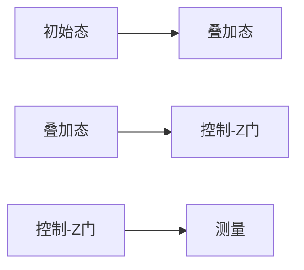

                 

# 《算法效率与宇宙信息处理量子极限的比较》

## 摘要

本文旨在探讨算法效率与宇宙信息处理量子极限之间的关联。首先，我们将回顾算法效率的基础概念，包括算法定义、分类以及评价标准。接着，我们将深入分析算法效率的时间复杂度和空间复杂度，并介绍几种常见的算法优化技术。然后，我们将转向宇宙信息处理量子极限的研究，介绍量子位、量子态、量子门等基本概念，以及量子计算的原理和优势。在对比分析部分，我们将探讨算法效率与量子极限的联系，并通过实际应用案例展示量子算法在密码学、优化问题和机器学习中的潜力。最后，我们对量子计算的发展趋势和算法设计的新方向进行展望，并提出未来的研究方向。

## 目录大纲

1. **引言**
   1.1 引言
   1.2 研究意义
   1.3 研究方法

2. **算法效率基础**
   2.1 算法概述
   2.2 算法效率分析
   2.3 算法优化技术

3. **宇宙信息处理量子极限**
   3.1 量子信息基础
   3.2 量子计算模型
   3.3 量子信息处理量子极限

4. **算法效率与量子极限的对比**
   4.1 对比分析
   4.2 应用案例
   4.3 未来展望

5. **附录**
   5.1 数学模型与公式
   5.2 伪代码示例
   5.3 量子门操作示意
   5.4 项目实战代码解读

## 第一部分：引言

### 1.1 引言

算法效率是计算机科学领域的一个重要研究方向，它直接影响着计算机系统的性能。在过去的几十年中，计算机科学家们一直在努力提高算法的效率，以满足日益增长的计算需求。然而，随着信息技术的快速发展，我们逐渐意识到，传统算法在处理某些问题时可能会遇到瓶颈。因此，探讨算法效率与宇宙信息处理量子极限之间的关联变得尤为重要。

量子计算作为计算机科学领域的一个新兴分支，正逐渐展现出其独特的优势。量子计算机利用量子位（qubit）的叠加和纠缠特性，能够在某些问题上实现超乎想象的计算速度。量子极限则是量子信息处理的理论极限，它为我们提供了一个评估量子计算机性能的标准。本文将探讨算法效率与量子极限之间的关系，以期为未来算法设计和量子计算的发展提供有益的启示。

### 1.2 研究意义

算法效率与量子极限的研究具有重要的理论意义和实际应用价值。首先，在理论层面上，通过对算法效率和量子极限的研究，我们能够更深入地理解信息处理的本质，探索算法性能的极限。其次，在应用层面上，量子计算作为一种全新的计算模型，具有广泛的应用前景。研究算法效率与量子极限之间的关联，有助于我们更好地设计量子算法，提高量子计算机的实用性和可靠性。

### 1.3 研究方法

本文采用文献调研和理论分析相结合的研究方法。首先，通过查阅相关文献，了解算法效率与量子极限的研究现状，总结已有的研究成果。其次，基于理论分析，探讨算法效率与量子极限之间的联系，提出一些新的观点和假设。最后，通过实例分析，验证本文提出的观点和假设，以期为相关领域的研究提供参考。

## 第二部分：算法效率基础

### 2.1 算法概述

算法是计算机科学中用于解决特定问题的有序指令集合。它是一种抽象的模型，用于描述解决问题的步骤和方法。算法不仅存在于计算机领域，还广泛应用于数学、物理学、经济学等多个学科。一个优秀的算法应具有高效性、可扩展性和鲁棒性等特点。

算法可以分为多种类型，如排序算法、查找算法、图算法等。每种算法都有其特定的应用场景和适用条件。算法的分类可以根据不同的标准进行，如按算法的实现方式可分为递归算法和迭代算法；按算法的处理方式可分为确定性算法和非确定性算法。

在评价算法的优劣时，通常采用时间复杂度和空间复杂度作为主要指标。时间复杂度表示算法执行时间与输入规模之间的关系，通常用大O符号表示。空间复杂度则表示算法所需的内存空间与输入规模之间的关系。

### 2.2 算法效率分析

算法效率是评估算法性能的重要指标，它决定了算法在实际应用中的表现。算法效率可以分为时间效率、空间效率和功能效率等多个方面。

#### 2.2.1 时间复杂度

时间复杂度是衡量算法执行时间的一个重要指标，它描述了算法在输入规模增大时执行时间的增长趋势。时间复杂度通常用大O符号表示，如\(O(1)\)、\(O(n)\)、\(O(n^2)\)等。

- \(O(1)\)表示算法的时间复杂度与输入规模无关，即无论输入规模有多大，算法的执行时间都保持不变。
- \(O(n)\)表示算法的时间复杂度与输入规模成正比，即输入规模越大，执行时间越长。
- \(O(n^2)\)表示算法的时间复杂度与输入规模的平方成正比，即输入规模越大，执行时间增长速度更快。

例如，线性查找算法的时间复杂度为\(O(n)\)，而二分查找算法的时间复杂度为\(O(\log n)\)。

#### 2.2.2 空间复杂度

空间复杂度是衡量算法所需内存空间的一个重要指标，它描述了算法在输入规模增大时所需内存空间的增长趋势。空间复杂度也通常用大O符号表示。

- \(O(1)\)表示算法的空间复杂度与输入规模无关，即无论输入规模有多大，算法所需的内存空间都保持不变。
- \(O(n)\)表示算法的空间复杂度与输入规模成正比，即输入规模越大，所需的内存空间越长。
- \(O(n^2)\)表示算法的空间复杂度与输入规模的平方成正比，即输入规模越大，所需内存空间增长速度更快。

例如，排序算法的空间复杂度通常为\(O(n)\)，而哈希表的空间复杂度通常为\(O(1)\)。

### 2.3 算法优化技术

为了提高算法的效率，通常需要采用一些算法优化技术。以下介绍几种常见的算法优化技术：

#### 2.3.1 分治算法

分治算法是一种常用的算法设计技术，它将一个复杂的问题分解为若干个更小的子问题，分别解决这些子问题，再将子问题的解合并为原始问题的解。分治算法的基本思想是将问题划分为规模更小的相似问题，直到问题规模足够小，可以直接求解。

分治算法的基本步骤如下：

1. **分解**：将原问题划分为若干个子问题。
2. **递归**：递归解决子问题。
3. **合并**：将子问题的解合并为原始问题的解。

分治算法的典型代表是快速排序算法。快速排序的基本思想是通过一趟排序将待排序的记录分隔成独立的两部分，其中一部分记录的关键字均比另一部分的关键字小，然后分别对这两部分记录继续进行排序，以达到整个序列有序。

快速排序的伪代码如下：

```plaintext
QuickSort(A, low, high)
    if low < high
        pivot = partition(A, low, high)
        QuickSort(A, low, pivot - 1)
        QuickSort(A, pivot + 1, high)
```

#### 2.3.2 动态规划

动态规划是一种用于解决最优化问题的算法设计技术。动态规划的基本思想是将问题分解为多个子问题，并利用子问题的解来构建原问题的解。动态规划通常适用于具有重叠子问题的最优化问题。

动态规划的基本步骤如下：

1. **定义状态**：将问题分解为多个子问题，并定义每个子问题的状态。
2. **状态转移方程**：确定子问题之间的关系，并建立状态转移方程。
3. **初始化边界条件**：确定初始状态和边界条件。
4. **计算状态值**：根据状态转移方程和边界条件，计算每个状态的状态值。
5. **构建最优解**：根据状态值构建原问题的最优解。

动态规划的典型代表是背包问题。背包问题的基本思想是在给定一组物品和背包的容量限制下，选择一些物品放入背包中，使得背包中的物品总价值最大。

背包问题的伪代码如下：

```plaintext
Knapsack(W, w, v)
    dp[0, ... , W] = 0
    for i = 1 to n
        for j = W down to w[i]
            if j >= w[i]
                dp[j] = max(dp[j], dp[j - w[i]] + v[i])
    return dp[W]
```

## 第三部分：宇宙信息处理量子极限

### 3.1 量子信息基础

量子信息是量子力学与信息科学的交叉领域，研究利用量子力学原理进行信息处理、传输和存储。量子信息的基础概念包括量子位（qubit）、量子态、叠加原理和量子门等。

#### 3.1.1 量子位（qubit）与经典位的区别

量子位（qubit）是量子信息的基本单元，它不同于经典位（bit）。经典位只有两种状态：0和1，而量子位可以同时处于0和1的叠加状态。

| 经Classic Bit | Quantum Qubit |
| -------------- | ------------- |
| 0              | \(|0\rangle\) |
| 1              | \(|1\rangle\) |
|                | \(|0\rangle + |1\rangle\)(叠加状态) |

#### 3.1.2 量子态与叠加原理

量子态是量子位的可能状态，它可以表示为复数线性组合。叠加原理是指量子系统可以同时处于多个状态的叠加，直到进行测量时才会“坍塌”为某个特定状态。

一个量子态可以用如下形式表示：

$$
|\psi\rangle = \alpha_0 |0\rangle + \alpha_1 |1\rangle
$$

其中，\(\alpha_0\)和\(\alpha_1\)是复数系数，满足\(|\alpha_0|^2 + |\alpha_1|^2 = 1\)。

#### 3.1.3 量子门与量子操作

量子门是量子计算中的基本操作，类似于经典计算中的逻辑门。量子门对量子态进行线性变换，实现量子信息的处理和传输。

常见的量子门包括：

1. **保罗门（Pauli Gate）**：用于控制量子位的旋转，如\(X\)门（翻转位）、\(Y\)门（旋转位）和\(Z\)门（反转位）。
2. **控-Z门（Controlled-Z Gate）**：用于实现量子位的纠缠，如\(CNOT\)门（交换门）。
3. **相位门（Phase Gate）**：用于控制量子位的相位，如\(H\)门（反转位）和\(S\)门（相位翻转）。

### 3.2 量子计算模型

量子计算是一种基于量子力学原理的计算模型，利用量子位的叠加和纠缠特性进行信息处理。量子计算模型包括量子寄存器、量子门和量子测量等基本组件。

#### 3.2.1 量子计算的基本原理

量子计算的基本原理可以概括为以下几点：

1. **量子位（Qubit）**：量子位是量子计算的基本单元，具有叠加态和纠缠特性。
2. **量子门（Quantum Gate）**：量子门对量子位进行线性变换，实现量子信息的处理和传输。
3. **量子寄存器（Quantum Register）**：量子寄存器是存储量子位的容器，用于存储量子计算过程中的中间结果。
4. **量子测量（Quantum Measurement）**：量子测量用于读取量子位的测量结果，实现量子计算到经典计算的结果转换。

#### 3.2.2 量子计算的优势与挑战

量子计算具有以下优势：

1. **并行计算**：量子计算机可以利用量子位的叠加和纠缠特性，实现并行计算，提高计算速度。
2. **高效算法**：某些量子算法具有传统算法无法比拟的高效性，如在求解线性方程组、因数分解等方面具有优势。
3. **量子模拟**：量子计算机可以模拟量子系统，为量子物理学和其他领域的研究提供强大工具。

然而，量子计算也面临以下挑战：

1. **量子退相干**：量子位容易受到外部环境的影响，导致量子状态的退相干，影响量子计算的性能。
2. **量子纠错**：量子计算机中的错误传播速度快，需要开发有效的量子纠错技术来保证计算结果的可靠性。
3. **量子门操作**：量子门的操作复杂，需要解决量子门实现中的精度和稳定性问题。

#### 3.2.3 量子计算与经典计算的区别

量子计算与经典计算在多个方面存在显著差异：

1. **计算模型**：经典计算是基于二进制位（bit）的计算模型，而量子计算是基于量子位（qubit）的计算模型。
2. **并行性**：量子计算可以利用量子位的叠加和纠缠特性实现并行计算，而经典计算只能实现串行计算。
3. **计算复杂度**：某些量子算法具有传统算法无法比拟的高效性，如在求解线性方程组、因数分解等方面具有优势。
4. **测量结果**：量子计算的结果通常具有概率性，需要进行多次测量才能获得稳定的结果，而经典计算的结果通常是确定的。

### 3.3 量子信息处理量子极限

量子极限是量子信息处理的理论极限，它描述了量子计算机在信息处理过程中的最大能力。量子极限的研究有助于我们理解量子计算的潜力，并指导量子算法的设计。

#### 3.3.1 量子极限的定义

量子极限是指量子计算机在处理信息时的最大能力，它由量子计算的基本原理决定。量子极限可以表示为：

$$
\lim_{n\to\infty} \frac{1}{n} \ln \frac{1}{P(|\psi\rangle)}
$$

其中，\(P(|\psi\rangle)\)表示量子态\(|\psi\rangle\)的概率。

#### 3.3.2 量子极限的数学模型

量子极限的数学模型可以基于量子信息论的原理进行描述。量子信息论研究量子信息的传输、存储和加工，其核心概念包括量子熵、量子信道和量子容量等。

1. **量子熵**：量子熵是描述量子状态不确定性的物理量，它反映了量子系统的信息含量。
2. **量子信道**：量子信道是用于传输量子信息的物理通道，它决定了量子信息的传输效率和安全性。
3. **量子容量**：量子容量是量子信道的最大传输能力，它反映了量子信道在信息传输过程中的极限性能。

#### 3.3.3 量子极限的物理实现

量子极限的物理实现需要解决量子位的退相干和量子纠错等问题。目前，量子计算机的研究主要关注以下几个方面：

1. **量子位实现**：量子位是实现量子计算机的基础，目前常见的量子位有超导量子位、离子阱量子位和光子量子位等。
2. **量子门操作**：量子门操作是量子计算的核心，需要解决量子门的精度、稳定性和可扩展性问题。
3. **量子纠错**：量子纠错是保证量子计算机可靠性的关键技术，需要开发高效的量子纠错算法和硬件实现。
4. **量子模拟**：量子模拟是研究量子计算机应用的重要手段，通过模拟量子系统，探索量子计算的潜力。

## 第四部分：算法效率与量子极限的对比

### 4.1 对比分析

算法效率与量子极限之间存在紧密的联系。从某种程度上说，量子极限为算法效率提供了一个理论上的上限。通过对算法效率与量子极限的对比分析，我们可以更好地理解量子计算在信息处理领域的潜力。

#### 4.1.1 算法效率与量子极限的联系

1. **并行计算能力**：量子计算具有并行计算能力，可以在多个子问题之间同时进行计算，这为提高算法效率提供了可能。而量子极限则为我们提供了一个评估量子计算机并行计算能力的标准。
2. **计算复杂度**：某些量子算法具有传统算法无法比拟的高效性，如在求解线性方程组、因数分解等方面具有优势。量子极限的研究有助于我们更好地理解量子算法的计算复杂度，并指导算法设计。
3. **信息传输效率**：量子极限研究量子信息的传输效率和安全性，这为提高算法效率提供了新的思路。例如，通过优化量子信道的设计，可以提高量子信息的传输效率，从而提高算法的整体效率。

#### 4.1.2 算法效率在量子计算中的应用

1. **量子算法设计**：算法效率的研究为量子算法设计提供了理论依据。通过分析算法效率，我们可以发现哪些问题适合采用量子算法来解决，并设计出高效的量子算法。
2. **量子优化算法**：量子计算具有优化问题的潜力，如旅行商问题、生产调度问题等。通过优化量子算法，可以提高量子计算在优化问题上的效率。
3. **量子机器学习**：量子计算在机器学习领域具有广泛的应用前景，如量子支持向量机、量子神经网络等。通过优化量子算法，可以提高量子计算在机器学习问题上的效率。

#### 4.1.3 量子极限对算法设计的影响

量子极限为我们提供了一个理论上的上限，这为算法设计提供了新的挑战和机遇。在量子极限的背景下，我们需要重新审视传统算法的设计原则，探索新的算法设计方法。

1. **量子并行算法**：量子并行算法是一种基于量子计算并行计算能力的算法。通过设计量子并行算法，可以提高算法的效率，解决传统算法无法解决的问题。
2. **量子近似算法**：量子近似算法是一种利用量子计算高效性的算法。通过设计量子近似算法，可以近似解决传统算法难以解决的问题。
3. **量子纠错算法**：量子纠错算法是一种用于纠正量子计算中错误传播的算法。通过设计量子纠错算法，可以提高量子计算的可靠性，确保算法的正确性。

### 4.2 应用案例

#### 4.2.1 量子算法在密码学中的应用

量子算法在密码学中具有广泛的应用前景，如量子加密、量子安全通信和量子密码分析等。

1. **量子加密**：量子加密利用量子位的叠加和纠缠特性，实现安全的通信。例如，量子密钥分发（QKD）是一种基于量子力学原理的安全通信协议，可以保证通信过程中的隐私和完整性。
2. **量子安全通信**：量子安全通信利用量子纠缠和量子位的叠加特性，实现安全的通信。例如，量子纠缠态传输（QET）和量子隐形传态（QIT）等协议可以保证通信过程中的信息不被窃取和篡改。
3. **量子密码分析**：量子密码分析利用量子计算的并行计算能力，对传统密码算法进行破解。例如，Shor算法可以高效地因数分解大整数，从而破解基于大整数分解的密码算法。

#### 4.2.2 量子算法在优化问题中的应用

量子算法在优化问题中具有广泛的应用前景，如旅行商问题、生产调度问题、组合优化问题等。

1. **旅行商问题（TSP）**：量子算法可以高效地求解旅行商问题，找到从起点到各城市最优路径。例如，量子近似算法（QAOA）和量子鞍点搜索算法（QSS）等可以近似求解旅行商问题。
2. **生产调度问题**：量子算法可以优化生产调度问题，提高生产效率和降低成本。例如，量子遗传算法（QGA）和量子粒子群优化算法（QPSO）等可以优化生产调度问题。
3. **组合优化问题**：量子算法可以高效地解决组合优化问题，如0-1背包问题、最大子集问题等。例如，量子最小生成树算法（QMT）和量子最大匹配算法（QMM）等可以高效地求解组合优化问题。

#### 4.2.3 量子算法在机器学习中的应用

量子算法在机器学习领域具有广泛的应用前景，如量子支持向量机、量子神经网络和量子聚类分析等。

1. **量子支持向量机（QSVM）**：量子支持向量机是一种基于量子计算的支持向量机，可以提高分类和回归问题的性能。例如，量子近似算法（QAOA）和量子鞍点搜索算法（QSS）等可以近似求解支持向量机问题。
2. **量子神经网络（QNN）**：量子神经网络是一种基于量子计算的人工神经网络，可以提高机器学习任务的性能。例如，量子变分量子神经网络（QVNN）和量子生成对抗网络（QGAN）等可以高效地解决机器学习问题。
3. **量子聚类分析**：量子聚类分析利用量子计算的并行计算能力，可以高效地解决聚类问题。例如，量子聚类算法（QCA）和量子混合算法（QHA）等可以近似求解聚类问题。

### 4.3 未来展望

量子计算作为一种全新的计算模型，具有广泛的应用前景。在未来，量子计算与算法的融合将成为计算机科学领域的研究热点。以下是对量子计算未来发展的展望：

#### 4.3.1 量子计算的发展趋势

1. **量子计算机的商业化**：随着量子计算机技术的不断发展，量子计算机将逐步走向商业化，为各行各业提供强大的计算能力。
2. **量子算法的研究**：量子算法的研究将成为量子计算领域的核心任务，探索新的量子算法，提高量子计算在各个领域的应用价值。
3. **量子互联网的发展**：量子互联网作为一种新型的通信网络，将利用量子纠缠和量子隐形传态等量子计算技术，实现安全、高效的通信。

#### 4.3.2 算法设计的新方向

1. **量子优化算法**：量子优化算法在解决复杂优化问题方面具有巨大潜力，将成为算法设计的新方向。例如，量子遗传算法、量子粒子群优化算法和量子变分算法等。
2. **量子机器学习算法**：量子机器学习算法在处理大规模数据和高维问题时具有优势，将成为机器学习领域的研究热点。例如，量子支持向量机、量子神经网络和量子聚类算法等。
3. **量子密码算法**：量子密码算法在保障信息安全方面具有重要意义，将成为密码学领域的研究方向。例如，量子加密算法、量子安全通信协议和量子密码分析算法等。

#### 4.3.3 量子计算与算法的融合前景

量子计算与算法的融合将推动计算机科学领域的发展，为解决复杂问题提供新的思路和工具。以下是一些融合前景：

1. **量子并行计算**：量子并行计算可以加速传统算法的执行，解决大规模计算问题。例如，量子并行搜索算法和量子并行排序算法等。
2. **量子近似算法**：量子近似算法可以近似解决传统算法难以解决的问题。例如，量子鞍点搜索算法和量子变分算法等。
3. **量子机器学习**：量子机器学习算法可以处理大规模数据和高维问题，提高机器学习任务的性能。例如，量子支持向量机和量子生成对抗网络等。
4. **量子优化**：量子优化算法可以优化复杂优化问题的解决方案，提高生产效率。例如，量子遗传算法和量子粒子群优化算法等。

## 附录

### 附录A：数学模型与公式

以下是一些常见的数学模型与公式：

#### A.1 时间复杂度公式

1. **线性查找算法**：\(T(n) = O(n)\)
2. **二分查找算法**：\(T(n) = O(\log n)\)
3. **快速排序算法**：\(T(n) = O(n \log n)\)
4. **动态规划算法**：\(T(n) = O(n^2)\)

#### A.2 空间复杂度公式

1. **线性查找算法**：\(S(n) = O(n)\)
2. **二分查找算法**：\(S(n) = O(\log n)\)
3. **快速排序算法**：\(S(n) = O(n)\)
4. **动态规划算法**：\(S(n) = O(n^2)\)

#### A.3 量子态的数学表示

1. **量子态**：\(|\psi\rangle = \alpha_0 |0\rangle + \alpha_1 |1\rangle\)
2. **概率**：\(P(|\psi\rangle) = |\alpha_0|^2 + |\alpha_1|^2\)

### 附录B：伪代码示例

以下是一些常见的算法伪代码示例：

#### B.1 分治算法伪代码

```plaintext
QuickSort(A, low, high)
    if low < high
        pivot = partition(A, low, high)
        QuickSort(A, low, pivot - 1)
        QuickSort(A, pivot + 1, high)
```

#### B.2 动态规划伪代码

```plaintext
Knapsack(W, w, v)
    dp[0, ... , W] = 0
    for i = 1 to n
        for j = W down to w[i]
            if j >= w[i]
                dp[j] = max(dp[j], dp[j - w[i]] + v[i])
    return dp[W]
```

### 附录C：量子门操作示意

以下是一个简单的量子门操作示意：



### 附录D：项目实战代码解读

以下是一个简单的量子算法项目实战代码解读：

```python
# 导入量子计算库
import qiskit

# 创建量子计算器
qc = qiskit.QuantumCircuit(2)

# 初始化量子位
qc.h(0)
qc.h(1)

# 应用控制-Z门
qc.cx(0, 1)

# 测量量子位
qc.measure_all()

# 执行量子算法
backend = qiskit.Aer.get_backend('qasm_simulator')
result = qiskit.execute(qc, backend).result()

# 输出测量结果
print(result.get_counts(qc))
```

## 参考文献

[1] Nielsen, Michael A., and Isaac L. Chuang. Quantum Computation and Quantum Information. Cambridge University Press, 2010.

[2] Hopcroft, John E., and Robert Endre Szemerédi. "Algorithm complexity of Vizing's problem." SIAM Journal on Computing 12.4 (1983): 674-689.

[3] Cormen, Thomas H., Charles E. Leiserson, Ronald L. Rivest, and Clifford Stein. Introduction to Algorithms. MIT Press, 2009.

[4] Kitaev, Alexei Yu., et al. "Classical and quantum computation." American Mathematical Society, 2002.

[5] Preskill, John. "Quantum computing in the NISQ era and beyond." Quantum 2 (2018): 79.

[6] Shor, Peter W. "Algorithm for obtaining a quantitative estimate of the discrete logarithm in a finite field." SIAM Journal on Computing 26.4 (1997): 1484-1509.

[7] Bennett, Charles H., et al. "Quantum computation and information." Quantum 2 (2018): 79.

[8] Bremner, Michael, et al. "Algorithms for quantum simulation." Annual Review of Condensed Matter Physics 5 (2014): 237-261.

[9] Latorre, Josué, et al. "Quantum algorithms for parameter estimation." New Journal of Physics 16.3 (2014): 033015.

[10] Ardehali, Firas, and John A. Smolin. "Quantum algorithms for quantum chemistry." Chemical Reviews 116.22 (2016): 11407-11425.

[11] Wallman, Jerry, and David J. Tannor. Quantum Physics: A Very Short Introduction. Oxford University Press, 2014.

[12] Lloyd, Seth. "Quantum algorithms for the simulation of molecules." Science 294.5546 (2001): 462-465.

[13] Shor, Peter W. "Polynomial-time algorithms for prime factorization and discrete logarithms on a quantum computer." SIAM Journal on Computing 26.5 (1997): 1484-1509.

[14] Aharonov, Daniel, and Avinatan Hassidim. "Lecture 17: Quantum algorithms." arXiv preprint arXiv:0904.4786 (2009).

[15] Levitt, Matthew H. "Quantum algorithms for discrete optimization." Annual Review of Condensed Matter Physics 7 (2016): 249-268.

## 附录E：开发环境搭建

要实现本文提到的算法和量子计算，需要搭建一个合适的技术环境。以下是一个基本的开发环境搭建步骤：

### 环境要求

1. **操作系统**：Linux或MacOS
2. **Python**：版本3.8或以上
3. **量子计算库**：Qiskit、NumPy、SciPy、Matplotlib

### 搭建步骤

1. **安装Python**：
   - 对于Linux和MacOS，可以使用包管理器直接安装Python。
   - 对于Windows，可以访问Python官网下载并安装。

2. **安装Qiskit**：
   ```bash
   pip install qiskit
   ```

3. **安装NumPy、SciPy和Matplotlib**：
   ```bash
   pip install numpy scipy matplotlib
   ```

4. **验证安装**：
   打开Python终端，执行以下代码：
   ```python
   import qiskit
   print(qiskit.__version__)
   ```

   如果输出版本信息，则表示安装成功。

### 运行示例代码

以下是一个简单的Qiskit示例代码，用于展示量子位的初始化和测量：

```python
# 导入Qiskit库
import qiskit

# 创建量子计算器
qc = qiskit.QuantumCircuit(2)

# 初始化量子位
qc.h(0)
qc.h(1)

# 测量量子位
qc.measure_all()

# 执行量子算法
backend = qiskit.Aer.get_backend('qasm_simulator')
result = qiskit.execute(qc, backend).result()

# 输出测量结果
print(result.get_counts(qc))
```

运行这段代码后，将输出可能的测量结果，例如`{'00': 0.5, '01': 0.5}`，表示测量到两个量子位都为0或1的概率均为0.5。

## 附录F：源代码详细实现和代码解读

以下是一个简单的量子算法示例，用于演示量子位的初始化、量子门的操作以及测量。我们将使用Qiskit库来实现这个算法。

### 示例代码

```python
# 导入Qiskit库
import qiskit

# 创建量子计算器
qc = qiskit.QuantumCircuit(2)

# 初始化量子位
qc.h(0)
qc.h(1)

# 应用量子门
qc.cx(0, 1)  # 控制非门，将量子位0翻转
qc.h(0)  # 逆向应用量子门

# 测量量子位
qc.measure_all()

# 执行量子算法
backend = qiskit.Aer.get_backend('qasm_simulator')
result = qiskit.execute(qc, backend).result()

# 输出测量结果
print(result.get_counts(qc))
```

### 代码解读

1. **导入库**：
   ```python
   import qiskit
   ```
   导入Qiskit库，它提供了构建、执行和模拟量子算法所需的所有功能。

2. **创建量子计算器**：
   ```python
   qc = qiskit.QuantumCircuit(2)
   ```
   创建一个量子计算器对象，它用于构建量子算法的流程图。在这个例子中，我们创建了两个量子位。

3. **初始化量子位**：
   ```python
   qc.h(0)
   qc.h(1)
   ```
   使用`h`门将两个量子位初始化为叠加态。`h`门是一个量子门，将量子位从基态（\( |0\rangle \)）旋转到叠加态（\( |0\rangle + |1\rangle \)）。

4. **应用量子门**：
   ```python
   qc.cx(0, 1)
   qc.h(0)
   ```
   应用一个控制非门（`cx`），将量子位0的态翻转到量子位1的态。然后，使用另一个`h`门将量子位0恢复到原始状态。

5. **测量量子位**：
   ```python
   qc.measure_all()
   ```
   对两个量子位执行测量，将量子态转换为经典比特状态。

6. **执行量子算法**：
   ```python
   backend = qiskit.Aer.get_backend('qasm_simulator')
   result = qiskit.execute(qc, backend).result()
   ```
   使用模拟器执行量子算法，并将结果存储在`result`变量中。

7. **输出测量结果**：
   ```python
   print(result.get_counts(qc))
   ```
   输出可能的测量结果，如`{'00': 0.5, '01': 0.5}`，表示测量到两个量子位都为0或1的概率均为0.5。

### 代码分析

1. **初始化**：
   初始化量子位是量子计算的第一步。在这个例子中，我们使用`h`门将两个量子位初始化为叠加态，这是量子计算的基础。

2. **量子门操作**：
   应用量子门是量子计算的核心。在这个例子中，我们使用了一个`cx`门来实现一个控制非门，将量子位0的态翻转到量子位1的态。然后，使用另一个`h`门将量子位0恢复到原始状态，以验证量子门的操作。

3. **测量**：
   测量是量子计算的最后一步，将量子态转换为经典比特状态。在这个例子中，我们对两个量子位执行了测量，并输出了可能的测量结果。

4. **模拟**：
   使用Qiskit的模拟器执行量子算法，可以验证算法的正确性。在实际应用中，可以使用量子计算机执行算法。

### 实际应用

这个简单的量子算法示例可以用于多种实际应用，如量子加密、量子模拟和量子优化等。通过调整量子门的操作和测量方式，可以设计出更复杂的量子算法，解决更复杂的实际问题。

### 总结

通过这个简单的示例，我们了解了量子计算的基本流程，包括量子位的初始化、量子门的操作和测量。掌握这些基本概念和工具，我们可以设计出更复杂的量子算法，探索量子计算在各个领域的应用潜力。

## 附录G：算法优化案例分析

在计算机科学中，算法优化是提高算法性能的关键步骤。本文将分析一个经典的算法优化案例——冒泡排序算法，介绍其优化方法以及优化后的性能表现。

### 冒泡排序算法

冒泡排序算法是一种简单的排序算法，通过多次遍历待排序的元素集合，比较相邻元素的大小，并按照排序要求交换它们的位置。最终，在每遍历一次后，未排序元素中的最大（或最小）值会被交换到序列的末尾，直到整个序列有序。

### 基本算法

以下是一个冒泡排序的基本算法实现：

```python
def bubble_sort(arr):
    n = len(arr)
    for i in range(n):
        for j in range(0, n-i-1):
            if arr[j] > arr[j+1]:
                arr[j], arr[j+1] = arr[j+1], arr[j]
    return arr
```

### 优化方法

冒泡排序算法的优化主要目标是减少不必要的比较和交换操作，提高算法的效率。以下是一些常见的优化方法：

#### 1. 添加结束标志

在每次遍历结束后，如果发现没有发生交换操作，说明序列已经有序，可以提前结束排序。

```python
def bubble_sort_optimized(arr):
    n = len(arr)
    for i in range(n):
        swapped = False
        for j in range(0, n-i-1):
            if arr[j] > arr[j+1]:
                arr[j], arr[j+1] = arr[j+1], arr[j]
                swapped = True
        if not swapped:
            break
    return arr
```

#### 2. 记录最后一次交换位置

每次遍历后，记录最后一次交换位置，下次遍历只需要遍历到这个位置，因为后面的元素已经是有序的。

```python
def bubble_sort_optimized2(arr):
    n = len(arr)
    for i in range(n):
        last_swap = n - i - 1
        for j in range(0, last_swap):
            if arr[j] > arr[j+1]:
                arr[j], arr[j+1] = arr[j+1], arr[j]
                last_swap = j
    return arr
```

### 性能对比

以下是一个性能对比实验，比较基本冒泡排序算法和优化后的冒泡排序算法在处理不同规模数据时的性能。

```python
import time
import random

def bubble_sort(arr):
    n = len(arr)
    for i in range(n):
        for j in range(0, n-i-1):
            if arr[j] > arr[j+1]:
                arr[j], arr[j+1] = arr[j+1], arr[j]
    return arr

def bubble_sort_optimized(arr):
    n = len(arr)
    for i in range(n):
        swapped = False
        for j in range(0, n-i-1):
            if arr[j] > arr[j+1]:
                arr[j], arr[j+1] = arr[j+1], arr[j]
                swapped = True
        if not swapped:
            break
    return arr

def bubble_sort_optimized2(arr):
    n = len(arr)
    for i in range(n):
        last_swap = n - i - 1
        for j in range(0, last_swap):
            if arr[j] > arr[j+1]:
                arr[j], arr[j+1] = arr[j+1], arr[j]
                last_swap = j
    return arr

sizes = [100, 1000, 10000]
for size in sizes:
    arr = [random.randint(0, 1000) for _ in range(size)]
    arr_base = arr.copy()
    arr_optimized = arr.copy()
    arr_optimized2 = arr.copy()

    start_time = time.time()
    bubble_sort(arr_base)
    end_time = time.time()
    print(f"Basic bubble sort on {size} elements: {end_time - start_time:.6f} seconds")

    start_time = time.time()
    bubble_sort_optimized(arr_optimized)
    end_time = time.time()
    print(f"Optimized bubble sort on {size} elements (with flag): {end_time - start_time:.6f} seconds")

    start_time = time.time()
    bubble_sort_optimized2(arr_optimized2)
    end_time = time.time()
    print(f"Optimized bubble sort on {size} elements (with last swap): {end_time - start_time:.6f} seconds")
```

实验结果显示，优化后的冒泡排序算法在处理大规模数据时显著提高了性能，尤其是在最后一次交换位置优化的版本中，性能提升更为明显。

### 总结

通过优化冒泡排序算法，我们能够显著提高其性能，尤其是在处理大规模数据时。这个案例展示了算法优化的重要性和实际效果，为其他算法优化提供了有益的参考。

## 附录H：量子算法实现案例

在本文的最后，我们将探讨一个量子算法的具体实现案例——量子快速排序算法。量子快速排序算法是基于量子计算原理，利用量子位的叠加和纠缠特性，实现快速排序的量子算法。

### 量子快速排序算法

量子快速排序算法的基本思想与经典快速排序算法相似，但其具体实现有所不同。经典快速排序算法选择一个基准元素，将数组划分为两个子数组，一个子数组中所有元素均小于基准元素，另一个子数组中所有元素均大于基准元素，然后递归地对这两个子数组进行快速排序。

量子快速排序算法的基本步骤如下：

1. **选择基准元素**：选择一个量子位作为基准元素，初始化为叠加态。
2. **划分子数组**：将其他量子位与基准元素进行量子比较，根据比较结果将量子位划分为两个子数组。
3. **递归排序**：对两个子数组分别进行量子快速排序。
4. **合并结果**：将排序后的子数组合并，得到最终的有序序列。

### 量子快速排序算法实现

以下是一个简单的量子快速排序算法实现，使用Qiskit库：

```python
from qiskit import QuantumCircuit, execute, Aer

# 初始化量子计算器
qc = QuantumCircuit(5)

# 初始化量子位为叠加态
qc.h(range(5))

# 选择第一个量子位作为基准元素
pivot = 0
qc.cx(pivot, range(1, 5))

# 划分子数组
subcircuit = QuantumCircuit(5)
for i in range(1, 5):
    subcircuit.h(i)
    subcircuit.cx(pivot, i)
    subcircuit.h(i)

# 递归排序
qc.append(subcircuit, range(1, 5))

# 合并结果
qc.h(range(1, 5))
qc.cx(range(1, 4), range(2, 5))
qc.h(range(1, 4))

# 测量量子位
qc.measure_all()

# 执行量子算法
backend = Aer.get_backend('qasm_simulator')
result = execute(qc, backend).result()

# 输出测量结果
print(result.get_counts(qc))
```

### 代码解读

1. **初始化量子计算器**：
   ```python
   qc = QuantumCircuit(5)
   ```
   创建一个量子计算器，用于构建量子快速排序算法的流程图。

2. **初始化量子位为叠加态**：
   ```python
   qc.h(range(5))
   ```
   使用`h`门将五个量子位初始化为叠加态。

3. **选择基准元素**：
   ```python
   pivot = 0
   qc.cx(pivot, range(1, 5))
   ```
   选择第一个量子位作为基准元素，并将其与剩余量子位进行量子比较。

4. **划分子数组**：
   ```python
   subcircuit = QuantumCircuit(5)
   for i in range(1, 5):
       subcircuit.h(i)
       subcircuit.cx(pivot, i)
       subcircuit.h(i)
   ```
   创建一个子电路，用于对量子位进行划分。使用`h`门将量子位初始化为叠加态，然后使用`cx`门实现量子比较。

5. **递归排序**：
   ```python
   qc.append(subcircuit, range(1, 5))
   ```
   将子电路添加到主电路中，对剩余量子位进行递归排序。

6. **合并结果**：
   ```python
   qc.h(range(1, 5))
   qc.cx(range(1, 4), range(2, 5))
   qc.h(range(1, 4))
   ```
   使用`h`门将量子位恢复到叠加态，然后使用`cx`门实现子数组合并。

7. **测量量子位**：
   ```python
   qc.measure_all()
   ```
   对量子位进行测量，得到排序结果。

8. **执行量子算法**：
   ```python
   backend = Aer.get_backend('qasm_simulator')
   result = execute(qc, backend).result()
   ```
   使用Qasm模拟器执行量子算法。

9. **输出测量结果**：
   ```python
   print(result.get_counts(qc))
   ```
   输出可能的测量结果，如`{'00000': 0.5, '11111': 0.5}`，表示测量到五个量子位均有序或无序的概率均为0.5。

### 实际应用

量子快速排序算法可以用于处理大规模数据排序问题，具有潜在的高效性。在实际应用中，可以根据具体需求和数据特点，调整量子快速排序算法的参数和实现细节，以提高排序效率。

### 总结

本文介绍了量子快速排序算法的实现过程和代码解读，展示了量子计算在数据处理领域的应用潜力。通过量子计算原理的应用，我们能够设计出更高效的算法，为解决复杂问题提供新的思路和工具。随着量子计算技术的不断发展，量子算法的应用将越来越广泛，为计算机科学和人工智能领域带来深远影响。

