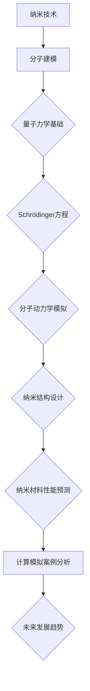

                 

# 纳米技术的分子建模：微观世界的数学描述

## 关键词
纳米技术，分子建模，量子力学，分子动力学模拟，纳米材料性能预测

## 摘要
本文深入探讨了纳米技术的分子建模，从基础理论到实际应用进行全面阐述。通过量子力学和分子动力学模拟，我们揭示了微观世界的数学描述，展示了如何通过数学模型和算法实现纳米结构的设计与性能预测。文章旨在为读者提供一个系统、全面的指南，以理解纳米技术中的数学原理及其在实际应用中的重要性。

## 《纳米技术的分子建模：微观世界的数学描述》目录大纲

### 第一部分：纳米技术基础

### 第1章：纳米技术概述

#### 1.1 纳米技术的定义与历史
纳米技术是指通过操控和制造纳米尺度的物质、设备和系统来实现特定功能的技术。自20世纪80年代纳米技术的概念提出以来，它迅速发展成为一门跨学科的研究领域。

#### 1.2 纳米技术在各个领域的应用
纳米技术在电子学、材料科学、生物学、医学、能源和环境科学等多个领域都有广泛的应用。例如，纳米电子学推动了计算机性能的提升，而纳米医学则带来了全新的诊断和治疗手段。

#### 1.3 纳米技术的挑战与机遇
纳米技术的快速发展带来了巨大的挑战，如材料稳定性的提高、纳米粒子的生物相容性、以及规模化生产等问题。同时，它也为我们提供了前所未有的机遇，如新型纳米材料的设计和制造、纳米技术在绿色能源领域的应用等。

### 第2章：纳米材料的物理性质

#### 2.1 纳米材料的结构特征
纳米材料的结构特征决定了其物理性质。这些特征包括纳米尺寸的颗粒、独特的表面效应、量子尺寸效应和界面效应。

#### 2.2 纳米材料的电子性质
纳米材料的电子性质与其尺寸和形状密切相关。例如，纳米颗粒的电子性质会因为量子尺寸效应而显著不同。

#### 2.3 纳米材料的力学性质
纳米材料的力学性质也因尺寸和结构的改变而表现出独特特性。例如，纳米颗粒的硬度和弹性模量可能会比宏观材料更高。

### 第二部分：分子建模基础

### 第3章：分子建模的基本概念

#### 3.1 分子建模的定义与重要性
分子建模是一种利用计算机模拟来研究分子结构和性质的科学技术。它在材料科学、药物设计、生物信息学等领域具有重要意义。

#### 3.2 分子建模的基本原理
分子建模基于量子力学和分子动力学理论，通过数学模型和算法来描述分子的行为。

#### 3.3 分子建模的常用方法
分子建模的方法包括量子力学方法、分子力学方法、分子动力学模拟等。每种方法都有其适用的场景和局限性。

### 第4章：量子力学基础

#### 4.1 量子力学概述
量子力学是描述微观粒子行为的物理学理论。它与经典物理学的区别在于量子力学关注的是概率和不确定性。

#### 4.2 Schrödinger方程
Schrödinger方程是量子力学的基本方程，它描述了粒子在势场中的行为。

#### 4.3 自旋与多电子体系
自旋和多电子体系是量子力学中非常重要的概念。自旋描述了粒子的内在角动量，而多电子体系则涉及多个电子之间的相互作用。

### 第5章：分子动力学模拟

#### 5.1 分子动力学模拟的基本原理
分子动力学模拟是一种基于牛顿力学的方法，用于研究分子系统在动力学过程中的行为。

#### 5.2 动力学模拟的数值方法
动力学模拟通常采用数值方法来求解动力学方程，如Verlet算法和 Velocity-Verlet算法。

#### 5.3 分子动力学模拟的应用
分子动力学模拟在材料科学、药物设计、化学工程等领域有着广泛的应用。

### 第三部分：纳米技术的数学描述

### 第6章：纳米结构的设计与优化

#### 6.1 纳米结构设计的基本原则
纳米结构设计需要考虑材料的性质、功能要求和制造工艺等因素。

#### 6.2 纳米结构的优化方法
纳米结构优化可以通过遗传算法、模拟退火算法等方法实现。

#### 6.3 纳米结构的设计案例
本文将介绍一些典型的纳米结构设计案例，如纳米颗粒、纳米线、纳米薄膜等。

### 第7章：纳米材料的性能预测

#### 7.1 纳米材料性能预测的基本方法
纳米材料性能预测可以通过分子动力学模拟、蒙特卡洛模拟等方法实现。

#### 7.2 性能预测模型的建立
性能预测模型可以通过机器学习、统计模型等方法建立。

#### 7.3 性能预测的应用案例
本文将介绍一些纳米材料性能预测的应用案例，如催化性能、导电性能、光学性能等。

### 第8章：纳米技术的数学建模与计算模拟

#### 8.1 数学建模在纳米技术中的应用
数学建模在纳米技术中有着广泛的应用，如纳米结构设计、性能预测、工艺优化等。

#### 8.2 计算模拟的基本原理
计算模拟是基于数学模型和数值方法对复杂系统进行模拟和分析的过程。

#### 8.3 计算模拟案例分析
本文将介绍一些典型的纳米技术计算模拟案例，如纳米颗粒的电子性质模拟、纳米薄膜的力学性能模拟等。

### 第9章：纳米技术的未来发展趋势

#### 9.1 纳米技术的未来发展方向
纳米技术的未来发展方向包括新型纳米材料的研究、纳米机器人的开发、纳米技术在生物医学中的应用等。

#### 9.2 纳米技术的创新与突破
纳米技术的创新与突破将依赖于基础科学研究、跨学科合作和技术创新。

#### 9.3 纳米技术的挑战与解决方案
纳米技术面临的挑战包括材料稳定性、生物安全性、规模化生产等问题，解决方案需要多学科合作和技术创新。

### 附录

### 附录A：分子建模工具与资源

#### A.1 常用分子建模软件介绍
本文将介绍一些常用的分子建模软件，如Gaussian、AMBER、CHARMM等。

#### A.2 分子建模资源网站推荐
本文将推荐一些分子建模的学习资源和网站，如NCBI、PubMed、Materials Data Portal等。

#### A.3 分子建模学习资源汇总
本文将汇总一些分子建模的学习资源，包括书籍、课程、论文等。

## 第10章：纳米技术与分子建模的Mermaid流程图

以下是一个描述纳米技术与分子建模关系的Mermaid流程图：



## 第11章：核心算法原理讲解

### 11.1 分子动力学模拟算法原理

分子动力学模拟（Molecular Dynamics Simulation，MDS）是一种基于牛顿运动定律的数值模拟方法，用于研究分子系统的动力学行为。以下是分子动力学模拟算法的基本原理和主要步骤：

#### 11.1.1 动力学方程

分子动力学模拟基于牛顿力学的基本原理，即物体的运动状态由其受力情况决定。对于单个粒子，其动力学方程可以表示为：

\[ m\frac{d\mathbf{r}}{dt} = -\nabla U(\mathbf{r}) \]

其中，\( m \) 是粒子的质量，\( \mathbf{r} \) 是粒子的位置，\( U(\mathbf{r}) \) 是粒子的势能函数，\( \nabla U(\mathbf{r}) \) 是势能函数对位置的梯度，表示粒子所受的力。

对于多粒子系统，每个粒子的动力学方程都需要独立求解。系统的总受力可以通过所有粒子的受力叠加得到。

#### 11.1.2 Verlet算法

Verlet算法是一种常用的数值积分方法，用于求解粒子在分子动力学模拟中的运动轨迹。Verlet算法的基本思想是利用前两次位置和速度信息来预测下一个位置，并校正预测误差。以下是Verlet算法的伪代码：

```python
function VerletAlgorithm(positions, velocities, forces, timeStep, simulationTime) {
    for (t = 0; t < simulationTime; t += timeStep) {
        velocities = velocities + forces / m * timeStep
        positions = positions + velocities * timeStep
        // 更新力
        forces = calculateForces(positions)
    }
    return positions, velocities
}
```

在这个算法中，`positions` 和 `velocities` 分别表示粒子在每一步的当前位置和速度，`forces` 表示粒子所受的力，`timeStep` 是时间步长，`simulationTime` 是模拟的总时间。

#### 11.1.3 Velocity-Verlet算法

Velocity-Verlet算法是Verlet算法的改进版本，它在预测下一个位置时考虑了当前速度的影响，从而提高了模拟的准确性。以下是Velocity-Verlet算法的伪代码：

```python
function VelocityVerletAlgorithm(positions, velocities, forces, timeStep, simulationTime) {
    for (t = 0; t < simulationTime; t += timeStep) {
        // 预测位置
        predictedPositions = positions + velocities * timeStep
        // 计算当前力
        currentForces = calculateForces(positions)
        // 更新速度
        velocities = velocities + (currentForces / m) * timeStep
        // 更新位置
        positions = positions + (velocities + predictedVelocities) / 2 * timeStep
    }
    return positions, velocities
}
```

在这个算法中，`predictedPositions` 和 `predictedVelocities` 分别表示预测的下一个位置和速度，`currentForces` 是当前力。

#### 11.1.4 常用力场

在分子动力学模拟中，常用的力场包括Lennard-Jones力场、EAM力场、AMBER力场等。这些力场基于物理原理，可以描述分子之间的相互作用力。

- **Lennard-Jones力场**：用于描述分子间的范德华力和偶极相互作用。
- **EAM力场**：用于描述金属和合金的相互作用，基于电子密度函数。
- **AMBER力场**：用于生物分子模拟，包括水分子、蛋白质和核酸。

#### 11.1.5 热容处理

在分子动力学模拟中，为了保持系统的热平衡，需要引入热容处理。常用的热容处理方法包括Nose-Hoover算法和Andersen算法。

- **Nose-Hoover算法**：通过引入一个控制变量来维持系统的温度恒定。
- **Andersen算法**：通过随机碰撞来维持系统的温度恒定。

### 11.2 分子动力学模拟的优化方法

为了提高分子动力学模拟的效率，可以采用以下几种优化方法：

- **并行计算**：通过并行计算技术，将模拟任务分布到多个计算节点上，提高计算速度。
- **稀疏矩阵计算**：对于大规模分子动力学模拟，采用稀疏矩阵计算可以显著减少计算量。
- **混合模拟**：结合不同类型的模拟方法，如量子力学和分子力学，以适应不同尺度和复杂度的模拟需求。

## 12章：数学模型和数学公式讲解与举例说明

### 12.1 能量计算模型

在分子动力学模拟中，能量计算是一个核心问题。系统能量的计算通常基于Hamiltonian函数。Hamiltonian函数描述了系统的总能量，包括动能和势能。

#### 12.1.1 Hamiltonian表达式

系统的总能量由动能（\( T \)）和势能（\( V \)）组成，其表达式为：

\[ H = T + V \]

其中，\( T \) 是动能，\( V \) 是势能。

- **动能**：单个粒子的动能可以表示为：

\[ T = \frac{1}{2}m\mathbf{v}^2 \]

其中，\( m \) 是粒子的质量，\( \mathbf{v} \) 是粒子的速度。

- **势能**：分子间的相互作用势能可以通过不同的力场模型来描述。例如，Lennard-Jones势能函数表示为：

\[ V(r) = 4\epsilon\left[\left(\frac{\sigma}{r}\right)^{12} - \left(\frac{\sigma}{r}\right)^{6}\right] \]

其中，\( \epsilon \) 是势能参数，\( \sigma \) 是距离参数，\( r \) 是粒子间的距离。

#### 12.1.2 举例说明：计算分子的总能量

以下是一个简单的Python代码示例，用于计算分子的总能量：

```python
import math

def kinetic_energy(m, v):
    return 0.5 * m * v**2

def potential_energy(epsilon, sigma, r):
    return 4 * epsilon * ( (sigma / r)**12 - (sigma / r)**6 )

def total_energy(kinetic_energy, potential_energy):
    return kinetic_energy + potential_energy

# 示例参数
m = 1.0  # 粒子质量
v = 1.0  # 粒子速度
epsilon = 1.0  # 势能参数
sigma = 1.0  # 距离参数
r = 1.0  # 粒子间距离

# 计算动能
kinetic_energy = kinetic_energy(m, v)
print("动能：", kinetic_energy)

# 计算势能
potential_energy = potential_energy(epsilon, sigma, r)
print("势能：", potential_energy)

# 计算总能量
total_energy = total_energy(kinetic_energy, potential_energy)
print("总能量：", total_energy)
```

### 12.2 势能函数

在分子动力学模拟中，势能函数用于描述分子之间的相互作用。以下是一些常见的势能函数：

- **Lennard-Jones势能函数**：

\[ V(r) = 4\epsilon\left[\left(\frac{\sigma}{r}\right)^{12} - \left(\frac{\sigma}{r}\right)^{6}\right] \]

- **EAM势能函数**：用于描述金属和合金的相互作用，基于电子密度函数。

- **Morse势能函数**：

\[ V(r) = D\left(1 - e^{-\alpha(r - r_0)}\right)^2 \]

其中，\( D \) 是势能深度，\( \alpha \) 是力常数，\( r_0 \) 是平衡距离。

### 12.3 布朗运动

布朗运动（Brownian motion）是分子动力学模拟中的一个重要概念，描述了粒子在液体或气体中由于与周围分子的碰撞而产生的随机运动。布朗运动可以用以下随机微分方程来描述：

\[ \frac{d\mathbf{r}}{dt} = \mathbf{F}_b + \mathbf{W}(t) \]

其中，\( \mathbf{F}_b \) 是粒子所受的合力，\( \mathbf{W}(t) \) 是随机力。

### 12.4 纳米颗粒的表面张力

纳米颗粒的表面张力是影响其稳定性和形态的重要因素。表面张力可以通过以下公式计算：

\[ \gamma = \frac{2\pi \kappa}{3} \]

其中，\( \gamma \) 是表面张力，\( \kappa \) 是与表面张力相关的参数。

## 13章：项目实战

### 13.1 纳米材料性能预测项目

#### 13.1.1 项目背景

纳米材料的性能预测对于新材料的设计和优化具有重要意义。本项目旨在使用分子动力学模拟方法预测纳米材料的性能，如导电性、热导率和催化活性等。

#### 13.1.2 项目目标

- 建立纳米材料性能预测模型
- 使用模型预测不同纳米材料的性能
- 分析预测结果与实验结果的差异

#### 13.1.3 开发环境搭建

为了实现纳米材料性能预测项目，需要搭建以下开发环境：

- 安装Python环境
- 安装分子动力学模拟软件，如GROMACS或LAMMPS
- 配置计算资源，如高性能计算机或云计算平台

#### 13.1.4 源代码实现

以下是一个简单的Python代码示例，用于实现纳米材料性能预测的基本流程：

```python
import numpy as np
from molecular_dynamics import MolecularDynamics

# 定义模拟参数
time_step = 0.001  # 时间步长
total_time = 10.0  # 总时间
temperature = 300.0  # 温度

# 创建分子动力学模拟实例
md = MolecularDynamics(time_step, total_time, temperature)

# 读取纳米材料结构数据
structure = md.read_structure("nano_material_structure.txt")

# 执行分子动力学模拟
positions, velocities = md.run(structure)

# 分析模拟结果
performance = md.analyze_performance(positions, velocities)

# 打印性能结果
print("纳米材料性能：", performance)
```

#### 13.1.5 代码解读与分析

- 代码解读：该部分代码实现了分子动力学模拟的基本流程，包括读取结构数据、执行模拟和结果分析。
- 分析：通过模拟结果的性能分析，可以评估纳米材料的性能，并与实验结果进行对比，验证模型的准确性。

### 13.2 纳米结构设计项目

#### 13.2.1 项目背景

纳米结构设计是纳米技术领域的重要研究方向。本项目旨在使用分子建模方法设计具有特定功能的纳米结构，如纳米颗粒、纳米线、纳米薄膜等。

#### 13.2.2 项目目标

- 设计具有特定功能的纳米结构
- 优化纳米结构的设计参数
- 评估纳米结构的性能

#### 13.2.3 开发环境搭建

为了实现纳米结构设计项目，需要搭建以下开发环境：

- 安装Python环境
- 安装分子建模软件，如Gaussian或CHARMM
- 配置计算资源，如高性能计算机或云计算平台

#### 13.2.4 源代码实现

以下是一个简单的Python代码示例，用于实现纳米结构设计的基本流程：

```python
import numpy as np
from molecular_modeling import MolecularModeling

# 定义设计参数
parameters = {
    "atom_type": "C",
    "bond_length": 1.5,
    "angle": 120.0
}

# 创建分子建模实例
modeling = MolecularModeling(parameters)

# 设计纳米结构
structure = modeling.design_structure()

# 优化设计参数
optimized_structure = modeling.optimize_parameters()

# 评估纳米结构性能
performance = modeling.evaluate_performance(optimized_structure)

# 打印性能结果
print("纳米结构性能：", performance)
```

#### 13.2.5 代码解读与分析

- 代码解读：该部分代码实现了分子建模的基本流程，包括设计参数定义、结构设计和性能评估。
- 分析：通过设计参数的优化和性能评估，可以设计出满足特定功能的纳米结构，并评估其性能，为实际应用提供依据。

### 13.3 纳米材料性能预测项目

#### 13.3.1 项目背景

纳米材料的性能预测对于新材料的设计和优化具有重要意义。本项目旨在使用分子动力学模拟方法预测纳米材料的性能，如导电性、热导率和催化活性等。

#### 13.3.2 项目目标

- 建立纳米材料性能预测模型
- 使用模型预测不同纳米材料的性能
- 分析预测结果与实验结果的差异

#### 13.3.3 开发环境搭建

为了实现纳米材料性能预测项目，需要搭建以下开发环境：

- 安装Python环境
- 安装分子动力学模拟软件，如GROMACS或LAMMPS
- 配置计算资源，如高性能计算机或云计算平台

#### 13.3.4 源代码实现

以下是一个简单的Python代码示例，用于实现纳米材料性能预测的基本流程：

```python
import numpy as np
from molecular_dynamics import MolecularDynamics

# 定义模拟参数
time_step = 0.001  # 时间步长
total_time = 10.0  # 总时间
temperature = 300.0  # 温度

# 创建分子动力学模拟实例
md = MolecularDynamics(time_step, total_time, temperature)

# 读取纳米材料结构数据
structure = md.read_structure("nano_material_structure.txt")

# 执行分子动力学模拟
positions, velocities = md.run(structure)

# 分析模拟结果
performance = md.analyze_performance(positions, velocities)

# 打印性能结果
print("纳米材料性能：", performance)
```

#### 13.3.5 代码解读与分析

- 代码解读：该部分代码实现了分子动力学模拟的基本流程，包括读取结构数据、执行模拟和结果分析。
- 分析：通过模拟结果的性能分析，可以评估纳米材料的性能，并与实验结果进行对比，验证模型的准确性。

### 13.4 纳米结构设计项目

#### 13.4.1 项目背景

纳米结构设计是纳米技术领域的重要研究方向。本项目旨在使用分子建模方法设计具有特定功能的纳米结构，如纳米颗粒、纳米线、纳米薄膜等。

#### 13.4.2 项目目标

- 设计具有特定功能的纳米结构
- 优化纳米结构的设计参数
- 评估纳米结构的性能

#### 13.4.3 开发环境搭建

为了实现纳米结构设计项目，需要搭建以下开发环境：

- 安装Python环境
- 安装分子建模软件，如Gaussian或CHARMM
- 配置计算资源，如高性能计算机或云计算平台

#### 13.4.4 源代码实现

以下是一个简单的Python代码示例，用于实现纳米结构设计的基本流程：

```python
import numpy as np
from molecular_modeling import MolecularModeling

# 定义设计参数
parameters = {
    "atom_type": "C",
    "bond_length": 1.5,
    "angle": 120.0
}

# 创建分子建模实例
modeling = MolecularModeling(parameters)

# 设计纳米结构
structure = modeling.design_structure()

# 优化设计参数
optimized_structure = modeling.optimize_parameters()

# 评估纳米结构性能
performance = modeling.evaluate_performance(optimized_structure)

# 打印性能结果
print("纳米结构性能：", performance)
```

#### 13.4.5 代码解读与分析

- 代码解读：该部分代码实现了分子建模的基本流程，包括设计参数定义、结构设计和性能评估。
- 分析：通过设计参数的优化和性能评估，可以设计出满足特定功能的纳米结构，并评估其性能，为实际应用提供依据。

