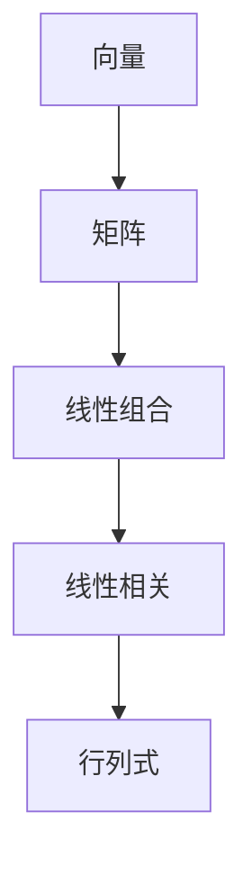
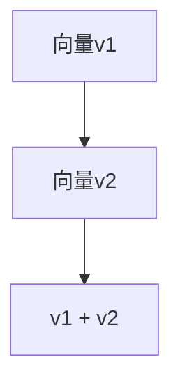
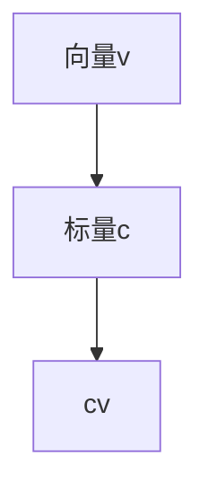
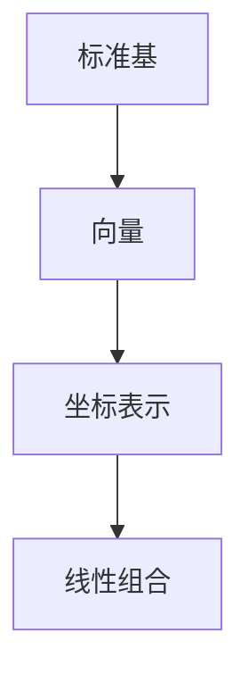

                 

### 线性代数导引：保距算子

关键词：线性代数、保距算子、线性变换、特征值、特征向量、应用

摘要：本文以线性代数为出发点，深入探讨了保距算子这一核心概念。文章首先回顾了线性代数的基本概念，包括向量和矩阵的定义、线性组合与线性相关、行列式的基础概念等。接着，我们探讨了线性空间、线性方程组以及线性变换的基本理论。随后，文章重点介绍了保距线性变换的定义、性质以及应用，通过具体的案例展示了其在几何学和物理学中的重要性。最后，文章还讨论了线性代数在计算机科学、物理学、经济学、工程学等领域的广泛应用，并提供了相关的开发环境搭建和代码实现案例。本文旨在帮助读者全面理解线性代数及其在各个领域中的应用。

### 第一部分：线性代数基本概念

#### 第1章 线性代数导引

线性代数是数学的一个重要分支，它研究向量、矩阵及其线性组合的性质和运算。在物理学、计算机科学、工程学、经济学等多个领域都有着广泛的应用。本章将引导读者进入线性代数的殿堂，了解其基本概念和核心理论。

##### 1.1 线性代数基本概念

###### 1.1.1 向量和矩阵的定义

向量是数学中的一个基本概念，它通常表示为有方向的线段。在二维空间中，一个向量可以表示为一个有序对$(x, y)$，其中$x$和$y$分别表示向量在水平和垂直方向上的分量。向量具有大小和方向，可以通过加法、数乘等运算进行操作。

矩阵是一个由数字组成的矩形数组，通常表示为$A = \begin{pmatrix} a_{11} & a_{12} & \cdots & a_{1n} \\\ a_{21} & a_{22} & \cdots & a_{2n} \\\ \vdots & \vdots & \ddots & \vdots \\\ a_{m1} & a_{m2} & \cdots & a_{mn} \end{pmatrix}$，其中$m$和$n$分别表示矩阵的行数和列数。矩阵可以通过矩阵乘法、行列式等运算进行操作。

###### 1.1.2 线性组合与线性相关

线性组合是指将多个向量通过数乘和加法组合在一起的过程。假设有向量$v_1, v_2, \ldots, v_n$和标量$c_1, c_2, \ldots, c_n$，则线性组合可以表示为$c_1v_1 + c_2v_2 + \ldots + c_nv_n$。

线性相关是指一组向量之间存在线性关系，即一个向量可以表示为其他向量的线性组合。如果一组向量线性相关，则它们不能构成线性空间。

###### 1.1.3 行列式的基础概念

行列式是一个与矩阵相关的重要概念，它通常表示为$\det(A)$。一个$n \times n$矩阵的行列式可以通过将其展开成各项的代数和得到。行列式具有一些重要性质，如行列式的值不变性、线性性质等。

##### 1.2 线性代数核心概念图解

为了更好地理解线性代数的基本概念，我们可以使用Mermaid流程图来直观地展示它们之间的关系。以下是一个简单的例子：



该图展示了向量、矩阵、线性组合、线性相关和行列式之间的关系。通过这张图，我们可以清晰地看到各个概念之间的联系。

##### 1.3 线性代数的发展与应用

线性代数的发展可以追溯到19世纪，当时数学家们开始研究线性方程组的解法。随着数学和科学的发展，线性代数逐渐成为了一门独立的学科，并在各个领域得到了广泛的应用。

###### 1.3.1 线性代数在物理学中的应用

在物理学中，线性代数广泛应用于描述物理系统中的各种现象。例如，在电磁学中，麦克斯韦方程组可以用矩阵形式表示；在量子力学中，波函数的演化可以用线性算符描述。

###### 1.3.2 线性代数在计算机科学中的应用

在计算机科学中，线性代数被广泛应用于图像处理、机器学习、计算机图形学等领域。例如，在图像处理中，图像的变换和滤波可以用线性算子实现；在机器学习中，线性模型和优化算法基于线性代数的理论。

接下来，我们将进一步探讨线性代数的一些核心概念，包括线性空间、线性方程组以及线性变换。这些概念构成了线性代数的基础，为我们理解和应用线性代数提供了坚实的理论基础。

### 第2章 线性空间

线性空间（也称为向量空间）是线性代数中的一个基本概念，它是一组向量构成的集合，这些向量可以按照线性组合的方式进行运算。线性空间在数学和其他科学领域有着广泛的应用，本章将介绍线性空间的基本概念、性质和运算。

##### 2.1 线性空间的定义

线性空间是由向量组成的一个集合，这些向量可以按照加法和数乘运算进行操作。具体来说，一个线性空间应满足以下条件：

1. **加法封闭性**：对于任意的向量$v_1, v_2$，它们的和$v_1 + v_2$仍然属于该线性空间。
2. **数乘封闭性**：对于任意的向量$v$和标量$c$，它们的数乘$cv$仍然属于该线性空间。
3. **加法结合律**：对于任意的向量$v_1, v_2, v_3$，有$(v_1 + v_2) + v_3 = v_1 + (v_2 + v_3)$。
4. **加法交换律**：对于任意的向量$v_1, v_2$，有$v_1 + v_2 = v_2 + v_1$。
5. **数乘结合律**：对于任意的向量$v$和标量$c_1, c_2$，有$c_1(cv) = (c_1c_2)v$。
6. **数乘分配律**：对于任意的向量$v$和标量$c_1, c_2$，有$c_1(v + w) = c_1v + c_1w$和$c_1(c_2v) = (c_1c_2)v$。

满足上述条件的集合称为线性空间。线性空间的元素称为向量。

###### 2.1.1 线性空间的性质

线性空间的性质包括：

1. **零向量存在**：线性空间中存在一个零向量$\mathbf{0}$，使得对于任何向量$v$，有$v + \mathbf{0} = v$。
2. **加法逆元存在**：对于任何向量$v$，存在一个向量$-v$，使得$v + (-v) = \mathbf{0}$。
3. **数乘分配律**：对于任何向量$v, w$和标量$c_1, c_2$，有$c_1(c_2v) = (c_1c_2)v$。

###### 2.1.2 线性空间的基与维数

线性空间的基是指一组线性无关的向量，它们可以生成线性空间中的所有向量。线性空间的维数是指其基向量的个数。

1. **线性无关**：一组向量线性无关，如果其中任意一个向量不能表示为其他向量的线性组合。
2. **线性组合**：如果存在一组标量$c_1, c_2, \ldots, c_n$，使得$v_1 = c_1v_2 + c_2v_3 + \ldots + c_nv_n$，则称$v_1$是$v_2, v_3, \ldots, v_n$的线性组合。
3. **生成集**：一组向量生成一个线性空间，如果该线性空间中的所有向量都可以表示为这些向量的线性组合。

维数是指线性空间的基向量的个数。如果线性空间有基向量，那么其维数就是基向量的个数。

##### 2.2 线性空间的运算

线性空间中的向量可以进行加法和数乘运算。

###### 2.2.1 线性空间的加法运算

线性空间的加法运算满足交换律、结合律和存在零向量等性质。对于任意两个向量$v_1, v_2$，它们的和$v_1 + v_2$仍然属于该线性空间。



###### 2.2.2 线性空间的数乘运算

线性空间的数乘运算也满足结合律、分配律和存在单位元等性质。对于任意向量$v$和标量$c$，它们的数乘$cv$仍然属于该线性空间。



##### 2.3 标准基与坐标表示

标准基是指由线性空间中的基向量构成的一个基。对于任意一个线性空间，都可以找到一个标准基。

坐标表示是指将线性空间中的向量表示为其基向量的线性组合。设$\{\mathbf{e}_1, \mathbf{e}_2, \ldots, \mathbf{e}_n\}$是一个线性空间$V$的标准基，向量$v$可以表示为：

$$v = c_1\mathbf{e}_1 + c_2\mathbf{e}_2 + \ldots + c_n\mathbf{e}_n$$

其中，$c_1, c_2, \ldots, c_n$是标量，称为向量$v$的坐标。

标准基与坐标表示之间的关系可以用以下Mermaid流程图表示：



##### 2.3.1 标准基的概念

标准基是指由一组线性无关的向量构成的基。在二维空间中，标准基可以表示为$\{\mathbf{i}, \mathbf{j}\}$，其中$\mathbf{i} = \begin{pmatrix} 1 \\\ 0 \end{pmatrix}$，$\mathbf{j} = \begin{pmatrix} 0 \\\ 1 \end{pmatrix}$。

在三维空间中，标准基可以表示为$\{\mathbf{i}, \mathbf{j}, \mathbf{k}\}$，其中$\mathbf{i} = \begin{pmatrix} 1 \\\ 0 \\\ 0 \end{pmatrix}$，$\mathbf{j} = \begin{pmatrix} 0 \\\ 1 \\\ 0 \end{pmatrix}$，$\mathbf{k} = \begin{pmatrix} 0 \\\ 0 \\\ 1 \end{pmatrix}$。

##### 2.3.2 坐标表示与矩阵表示

坐标表示是指将线性空间中的向量表示为其基向量的线性组合。设$\{\mathbf{e}_1, \mathbf{e}_2, \ldots, \mathbf{e}_n\}$是一个线性空间$V$的标准基，向量$v$可以表示为：

$$v = c_1\mathbf{e}_1 + c_2\mathbf{e}_2 + \ldots + c_n\mathbf{e}_n$$

其中，$c_1, c_2, \ldots, c_n$是标量，称为向量$v$的坐标。矩阵表示是将向量$v$的坐标表示为一个矩阵。

例如，在二维空间中，向量$v = \begin{pmatrix} 2 \\\ 3 \end{pmatrix}$可以表示为：

$$v = 2\begin{pmatrix} 1 \\\ 0 \end{pmatrix} + 3\begin{pmatrix} 0 \\\ 1 \end{pmatrix}$$

将其坐标表示为矩阵形式，可以得到：

$$\begin{pmatrix} 2 & 3 \end{pmatrix} = \begin{pmatrix} 1 & 0 \\\ 0 & 1 \end{pmatrix} \begin{pmatrix} 2 \\\ 3 \end{pmatrix}$$

在这个例子中，矩阵$\begin{pmatrix} 1 & 0 \\\ 0 & 1 \end{pmatrix}$是标准基$\{\mathbf{i}, \mathbf{j}\}$的矩阵表示。

接下来，我们将进一步探讨线性方程组，线性方程组的解法以及解空间的概念。

### 第3章 线性方程组

线性方程组是线性代数中的一个基本问题，它涉及一组线性方程的求解。线性方程组在数学、工程、物理学和经济学等领域都有着广泛的应用。本章将介绍线性方程组的基本概念、解法以及解空间。

##### 3.1 线性方程组的基本概念

线性方程组是指包含多个线性方程的集合，这些方程可以用矩阵形式表示。一般形式的线性方程组可以表示为：

$$
\begin{cases}
a_{11}x_1 + a_{12}x_2 + \ldots + a_{1n}x_n = b_1 \\
a_{21}x_1 + a_{22}x_2 + \ldots + a_{2n}x_n = b_2 \\
\vdots \\
a_{m1}x_1 + a_{m2}x_2 + \ldots + a_{mn}x_n = b_m
\end{cases}
$$

其中，$x_1, x_2, \ldots, x_n$是未知数，$a_{ij}$和$b_i$是已知数，$m$和$n$分别表示方程组的行数和列数。

###### 3.1.1 线性方程组解的存在性与唯一性

线性方程组的解存在性与唯一性取决于系数矩阵和常数项矩阵之间的关系。具体来说：

1. **无解**：如果系数矩阵的秩大于常数项矩阵的秩，则线性方程组无解。
2. **唯一解**：如果系数矩阵的秩等于常数项矩阵的秩，且等于方程组的未知数个数，则线性方程组有唯一解。
3. **无穷多解**：如果系数矩阵的秩小于常数项矩阵的秩，则线性方程组有无穷多解。

###### 3.1.2 线性方程组的基本解法

线性方程组的基本解法包括高斯消元法和矩阵求逆法。

1. **高斯消元法**：高斯消元法是一种迭代消元法，通过消元操作将线性方程组转化为上三角形式或下三角形式，从而求解出方程组的解。具体步骤如下：
   - 将系数矩阵和常数项矩阵排列在一起，形成一个增广矩阵。
   - 从左到右，从上到下进行消元操作，将系数矩阵化为上三角形式。
   - 利用回代操作求解出方程组的解。

2. **矩阵求逆法**：矩阵求逆法是指利用矩阵的逆矩阵求解线性方程组。如果系数矩阵可逆，则线性方程组的解可以表示为：

   $$
   \begin{pmatrix} x_1 \\ x_2 \\ \vdots \\ x_n \end{pmatrix} = A^{-1}b
   $$

   其中，$A^{-1}$是系数矩阵的逆矩阵，$b$是常数项矩阵。

##### 3.2 高斯消元法

高斯消元法是一种常用的线性方程组求解方法，其基本思想是通过迭代消元将线性方程组化为上三角形式或下三角形式，从而求解出方程组的解。

###### 3.2.1 高斯消元法的原理

高斯消元法的原理可以概括为以下步骤：

1. **增广矩阵的构造**：将系数矩阵和常数项矩阵排列在一起，形成一个增广矩阵。
2. **消元操作**：从左到右，从上到下进行消元操作，将系数矩阵化为上三角形式或下三角形式。具体来说，对于当前列中的每一个非零元素，将其所在行与其他行进行交换，使得该元素变为1，然后将其他行中的元素通过减法操作化为0。
3. **回代操作**：如果系数矩阵已化为上三角形式，则从最后一行开始，依次向上进行回代，求解出方程组的解。如果系数矩阵已化为下三角形式，则从第一行开始，依次向下进行回代，求解出方程组的解。

###### 3.2.2 高斯消元法的实现

以下是高斯消元法的伪代码实现：

```python
def gauss_elimination(A, b):
    n = len(A)
    # 构造增广矩阵
    Aug = [row + b for row in A]
    # 消元操作
    for i in range(n):
        # 找到最大元素的位置
        max_idx = i + max(range(i, n), key=lambda j: abs(Aug[j][i]))
        # 交换行
        Aug[i], Aug[max_idx] = Aug[max_idx], Aug[i]
        # 消元
        for j in range(i + 1, n):
            factor = A[j][i] / A[i][i]
            for k in range(i, n + 1):
                Aug[j][k] -= factor * Aug[i][k]
    # 回代操作
    x = [0] * n
    for i in range(n - 1, -1, -1):
        x[i] = Aug[i][n] / A[i][i]
        for j in range(i + 1, n):
            Aug[i][n] -= A[i][j] * x[j]
    return x
```

##### 3.3 线性方程组的解空间

线性方程组的解空间是指所有解的集合。解空间的结构取决于线性方程组的解的情况。

###### 3.3.1 解空间的定义

如果线性方程组有解，则其解空间可以表示为：

$$
\mathbf{x} = \mathbf{x}_0 + t\mathbf{v}
$$

其中，$\mathbf{x}_0$是方程组的一个特解，$\mathbf{v}$是方程组的一个解向量，$t$是任意实数。

###### 3.3.2 解空间的结构

解空间的结构取决于线性方程组的系数矩阵和常数项矩阵的关系。具体来说：

1. **无解**：如果系数矩阵的秩大于常数项矩阵的秩，则解空间为空集。
2. **唯一解**：如果系数矩阵的秩等于常数项矩阵的秩，且等于方程组的未知数个数，则解空间为单点集。
3. **无穷多解**：如果系数矩阵的秩小于常数项矩阵的秩，则解空间为无穷多个点构成的集合。

接下来，我们将进一步探讨线性变换的基本概念，包括线性变换的定义、性质以及矩阵表示。

### 第4章 线性变换

线性变换是线性代数中的一个重要概念，它是将一个线性空间映射到另一个线性空间的函数。线性变换在数学、物理学、工程学等领域有着广泛的应用。本章将介绍线性变换的基本概念、性质以及矩阵表示。

##### 4.1 线性变换的定义

线性变换是指从一个线性空间到另一个线性空间的函数，它保持线性组合的性质。具体来说，设$V$和$W$是两个线性空间，$\mathbf{v}_1, \mathbf{v}_2, \ldots, \mathbf{v}_n$是$V$中的一组基，$\mathbf{w}_1, \mathbf{w}_2, \ldots, \mathbf{w}_m$是$W$中的一组基，$\mathbf{T}: V \rightarrow W$是一个线性变换，如果对于任意的向量$\mathbf{v} = c_1\mathbf{v}_1 + c_2\mathbf{v}_2 + \ldots + c_n\mathbf{v}_n$，都有：

$$
\mathbf{T}(\mathbf{v}) = c_1\mathbf{T}(\mathbf{v}_1) + c_2\mathbf{T}(\mathbf{v}_2) + \ldots + c_n\mathbf{T}(\mathbf{v}_n)
$$

其中，$c_1, c_2, \ldots, c_n$是标量。

###### 4.1.1 线性变换的基本性质

线性变换具有以下基本性质：

1. **线性组合的性质**：对于任意的向量$\mathbf{v}_1, \mathbf{v}_2 \in V$和标量$c_1, c_2$，有$\mathbf{T}(c_1\mathbf{v}_1 + c_2\mathbf{v}_2) = c_1\mathbf{T}(\mathbf{v}_1) + c_2\mathbf{T}(\mathbf{v}_2)$。
2. **零向量的性质**：对于任意的向量$\mathbf{v} \in V$，有$\mathbf{T}(\mathbf{0}) = \mathbf{0}$。
3. **加法的性质**：对于任意的向量$\mathbf{v}_1, \mathbf{v}_2 \in V$，有$\mathbf{T}(\mathbf{v}_1 + \mathbf{v}_2) = \mathbf{T}(\mathbf{v}_1) + \mathbf{T}(\mathbf{v}_2)$。
4. **数乘的性质**：对于任意的向量$\mathbf{v} \in V$和标量$c$，有$\mathbf{T}(c\mathbf{v}) = c\mathbf{T}(\mathbf{v})$。

##### 4.2 线性变换的矩阵表示

线性变换的矩阵表示是指将线性变换表示为一个矩阵。设$V$和$W$是两个线性空间，$\mathbf{v}_1, \mathbf{v}_2, \ldots, \mathbf{v}_n$是$V$中的一组基，$\mathbf{w}_1, \mathbf{w}_2, \ldots, \mathbf{w}_m$是$W$中的一组基，$\mathbf{T}: V \rightarrow W$是一个线性变换，则$\mathbf{T}$的矩阵表示为$A$，满足：

$$
\mathbf{T}(\mathbf{v}) = A\mathbf{v}
$$

其中，$\mathbf{v}$是向量$\mathbf{v}$的坐标表示，$A$是矩阵。

线性变换的矩阵表示具有以下性质：

1. **线性组合的矩阵表示**：对于任意的向量$\mathbf{v} = c_1\mathbf{v}_1 + c_2\mathbf{v}_2 + \ldots + c_n\mathbf{v}_n$，有$\mathbf{T}(\mathbf{v}) = A\mathbf{v}$。
2. **零向量的矩阵表示**：对于任意的向量$\mathbf{v} \in V$，有$\mathbf{T}(\mathbf{0}) = \mathbf{0}$。
3. **加法的矩阵表示**：对于任意的向量$\mathbf{v}_1, \mathbf{v}_2 \in V$，有$\mathbf{T}(\mathbf{v}_1 + \mathbf{v}_2) = A(\mathbf{v}_1 + \mathbf{v}_2) = A\mathbf{v}_1 + A\mathbf{v}_2$。
4. **数乘的矩阵表示**：对于任意的向量$\mathbf{v} \in V$和标量$c$，有$\mathbf{T}(c\mathbf{v}) = A(c\mathbf{v}) = cA\mathbf{v}$。

接下来，我们将进一步探讨保距线性变换的概念，包括保距线性变换的定义、性质以及应用。

### 第5章 保距线性变换

保距线性变换是一种特殊的线性变换，它在变换过程中保持向量之间的距离和角度关系。保距线性变换在几何学和物理学中有着广泛的应用。本章将介绍保距线性变换的定义、性质以及应用。

##### 5.1 保距线性变换的定义

保距线性变换是指将一个向量空间映射到另一个向量空间的线性变换，它在变换过程中保持向量之间的距离和角度关系。具体来说，设$V$和$W$是两个向量空间，$\mathbf{T}: V \rightarrow W$是一个线性变换，如果对于任意的向量$\mathbf{v}_1, \mathbf{v}_2 \in V$，都有：

$$
\|\mathbf{T}(\mathbf{v}_1) - \mathbf{T}(\mathbf{v}_2)\| = \|\mathbf{v}_1 - \mathbf{v}_2\|
$$

且

$$
\angle \mathbf{T}(\mathbf{v}_1), \mathbf{T}(\mathbf{v}_2) = \angle \mathbf{v}_1, \mathbf{v}_2
$$

其中，$\|\cdot\|$表示向量的模，$\angle \cdot, \cdot$表示两个向量的夹角。

保距线性变换具有以下基本性质：

1. **线性的性质**：保距线性变换是一种线性变换，它满足线性组合、零向量、加法和数乘的性质。
2. **保距的性质**：保距线性变换保持向量之间的距离和角度关系。
3. **保角度的性质**：保距线性变换保持向量之间的夹角不变。

##### 5.2 保距线性变换的应用

保距线性变换在几何学和物理学中有着广泛的应用。

###### 5.2.1 保距线性变换在几何学中的应用

保距线性变换在几何学中的应用包括：

1. **相似变换**：相似变换是一种特殊的保距线性变换，它保持向量之间的距离和角度关系。相似变换在几何图形的变换和投影中有着广泛的应用。
2. **旋转变换**：旋转变换是一种将向量绕原点旋转一定角度的保距线性变换。旋转变换在计算机图形学、物理学等领域有着重要的应用。
3. **反射变换**：反射变换是一种将向量关于某个平面反射的保距线性变换。反射变换在光学、声学等领域有着广泛的应用。

###### 5.2.2 保距线性变换在物理学中的应用

保距线性变换在物理学中的应用包括：

1. **量子力学**：保距线性变换在量子力学中有着重要的应用，它用于描述量子态的演化。量子态的演化可以用保距线性算符来描述。
2. **光学**：保距线性变换在光学中用于描述光的传播和干涉。光在传播过程中保持相位关系，可以用保距线性变换来描述。
3. **声学**：保距线性变换在声学中用于描述声波的传播和反射。声波在传播过程中保持波前形状，可以用保距线性变换来描述。

##### 5.3 保距线性变换的矩阵表示

保距线性变换的矩阵表示是指将保距线性变换表示为一个矩阵。设$V$和$W$是两个向量空间，$\mathbf{T}: V \rightarrow W$是一个保距线性变换，则$\mathbf{T}$的矩阵表示为$A$，满足：

$$
\mathbf{T}(\mathbf{v}) = A\mathbf{v}
$$

其中，$\mathbf{v}$是向量$\mathbf{v}$的坐标表示，$A$是矩阵。

保距线性变换的矩阵表示具有以下性质：

1. **线性组合的矩阵表示**：对于任意的向量$\mathbf{v} = c_1\mathbf{v}_1 + c_2\mathbf{v}_2 + \ldots + c_n\mathbf{v}_n$，有$\mathbf{T}(\mathbf{v}) = A\mathbf{v}$。
2. **零向量的矩阵表示**：对于任意的向量$\mathbf{v} \in V$，有$\mathbf{T}(\mathbf{0}) = \mathbf{0}$。
3. **加法的矩阵表示**：对于任意的向量$\mathbf{v}_1, \mathbf{v}_2 \in V$，有$\mathbf{T}(\mathbf{v}_1 + \mathbf{v}_2) = A(\mathbf{v}_1 + \mathbf{v}_2) = A\mathbf{v}_1 + A\mathbf{v}_2$。
4. **数乘的矩阵表示**：对于任意的向量$\mathbf{v} \in V$和标量$c$，有$\mathbf{T}(c\mathbf{v}) = A(c\mathbf{v}) = cA\mathbf{v}$。

接下来，我们将进一步探讨线性代数在计算机科学中的应用，包括图像处理、机器学习和计算机图形学等领域。

### 第6章 线性代数在计算机科学中的应用

线性代数在计算机科学中扮演着至关重要的角色，它的理论和方法广泛应用于图像处理、机器学习、计算机图形学等多个领域。本章将介绍线性代数在这些领域中的基本原理和应用。

##### 6.1 线性代数在图像处理中的应用

图像处理是计算机视觉和多媒体技术中的重要组成部分，线性代数为其提供了强大的工具。以下是一些关键应用：

###### 6.1.1 图像变换的线性代数原理

图像变换是指将一幅图像映射到另一幅图像的过程，如平移、旋转、缩放等。线性代数的矩阵运算可以方便地实现这些变换。

- **平移**：通过矩阵加法实现。设$T_{\mathbf{v}}$为平移矩阵，$\mathbf{v}$为平移向量，则变换后的图像$I'$可以通过以下公式计算：

  $$
  I' = T_{\mathbf{v}} \cdot I
  $$

- **旋转**：通过旋转变换矩阵实现。设$R_{\theta}$为旋转矩阵，$\theta$为旋转角度，则变换后的图像$I'$可以通过以下公式计算：

  $$
  I' = R_{\theta} \cdot I
  $$

  旋转矩阵$R_{\theta}$的公式为：

  $$
  R_{\theta} = \begin{pmatrix}
  \cos \theta & -\sin \theta \\
  \sin \theta & \cos \theta
  \end{pmatrix}
  $$

- **缩放**：通过缩放矩阵实现。设$S_{\alpha}$为缩放矩阵，$\alpha$为缩放因子，则变换后的图像$I'$可以通过以下公式计算：

  $$
  I' = S_{\alpha} \cdot I
  $$

  缩放矩阵$S_{\alpha}$的公式为：

  $$
  S_{\alpha} = \begin{pmatrix}
  \alpha & 0 \\
  0 & \alpha
  \end{pmatrix}
  $$

###### 6.1.2 图像滤波的线性代数方法

图像滤波是图像处理中的另一个重要步骤，用于去除图像中的噪声或增强图像的某些特征。线性代数的卷积操作是图像滤波的基础。

- **卷积操作**：卷积是一种将一个矩阵（卷积核）与另一个矩阵（图像）逐点相乘并累加的过程。设$K$为卷积核，$I$为图像，则卷积结果$O$可以通过以下公式计算：

  $$
  O(i, j) = \sum_{m=0}^{M-1} \sum_{n=0}^{N-1} K(m, n) \cdot I(i-m, j-n)
  $$

  其中，$M$和$N$分别为卷积核的大小，$i$和$j$为输出图像的坐标。

  以下是一个简单的卷积滤波器（例如，高斯滤波器）的伪代码：

  ```python
  def gaussian_filter(image, sigma):
      kernel = create_gaussian_kernel(sigma)
      return convolve(image, kernel)
  ```

- **高斯滤波**：高斯滤波是一种常用的图像平滑滤波方法，通过高斯核函数对图像进行卷积，可以有效去除图像中的高频率噪声。

  高斯核函数的公式为：

  $$
  K(x, y) = \frac{1}{2\pi\sigma^2} e^{-\frac{(x^2 + y^2)}{2\sigma^2}}
  $$

  高斯滤波器的实现示例：

  ```python
  import numpy as np

  def create_gaussian_kernel(sigma):
      size = int(6 * sigma + 1)
      x, y = np.ogrid[-size//2:size//2, -size//2:size//2]
      kernel = (1 / (2.0 * np.pi * sigma**2)) * np.exp((-x**2 - y**2) / (2 * sigma**2))
      return kernel

  def convolve(image, kernel):
      return np.convolve(image, kernel, mode='same')
  ```

##### 6.2 线性代数在机器学习中的应用

机器学习是计算机科学中的另一个重要分支，线性代数在机器学习算法的设计和优化中发挥着关键作用。

###### 6.2.1 线性模型的基本原理

线性模型是一种广泛应用的机器学习模型，其核心思想是使用线性方程来描述数据之间的关系。线性模型通常包括以下公式：

$$
\mathbf{y} = \mathbf{X}\mathbf{w} + \mathbf{b}
$$

其中，$\mathbf{y}$是目标变量，$\mathbf{X}$是特征矩阵，$\mathbf{w}$是权重向量，$\mathbf{b}$是偏置项。

- **线性回归**：线性回归是一种用于预测连续值的线性模型。其目标是最小化预测值与实际值之间的误差平方和。

  以下是一个简单的线性回归模型的伪代码：

  ```python
  import numpy as np

  def linear_regression(X, y):
      X_transpose = X.T
      w = np.linalg.inv(X_transpose @ X) @ X_transpose @ y
      return w
  ```

- **逻辑回归**：逻辑回归是一种用于分类的线性模型，其输出是一个介于0和1之间的概率值。逻辑回归的目标是最小化负对数似然函数。

  以下是一个简单的逻辑回归模型的伪代码：

  ```python
  import numpy as np

  def logistic_regression(X, y):
      X_transpose = X.T
      w = np.linalg.inv(X_transpose @ X) @ X_transpose @ y
      b = np.log(1 + np.exp(-X @ w))
      return w, b
  ```

###### 6.2.2 线性代数在机器学习中的优化算法

线性代数在机器学习中的优化算法包括梯度下降法、随机梯度下降法等。

- **梯度下降法**：梯度下降法是一种优化算法，用于找到使损失函数最小化的参数。其基本思想是沿着损失函数的梯度方向更新参数。

  以下是一个简单的梯度下降法实现的伪代码：

  ```python
  import numpy as np

  def gradient_descent(X, y, w, learning_rate, epochs):
      for epoch in range(epochs):
          gradients = 2 * X.T @ X @ w - 2 * X.T @ y
          w -= learning_rate * gradients
      return w
  ```

- **随机梯度下降法**：随机梯度下降法是一种更高效的优化算法，它通过随机选择样本来计算梯度，从而加速收敛。

  以下是一个简单的随机梯度下降法实现的伪代码：

  ```python
  import numpy as np

  def stochastic_gradient_descent(X, y, w, learning_rate, epochs):
      for epoch in range(epochs):
          for x, y in zip(X, y):
              gradients = 2 * x.T @ x @ w - 2 * x.T @ y
              w -= learning_rate * gradients
      return w
  ```

##### 6.3 线性代数在计算机图形学中的应用

计算机图形学是计算机科学中的一个重要领域，线性代数在计算机图形学的变换和渲染中起着核心作用。

###### 6.3.1 计算机图形变换的线性代数原理

计算机图形变换包括平移、旋转、缩放、剪切等操作，这些操作都可以通过矩阵运算实现。

- **变换矩阵**：每个图形变换都可以通过一个变换矩阵实现。例如，一个二维图形的变换矩阵$T$可以表示为：

  $$
  T = \begin{pmatrix}
  a & b \\
  c & d
  \end{pmatrix}
  $$

  其中，$a, b, c, d$是变换矩阵的元素。

- **变换操作**：一个点$(x, y)$在经过变换矩阵$T$后的新位置$(x', y')$可以通过以下公式计算：

  $$
  \begin{cases}
  x' = ax + by + e \\
  y' = cx + dy + f
  \end{cases}
  $$

  其中，$e$和$f$是变换矩阵的偏置项。

###### 6.3.2 视图矩阵与模型矩阵的线性代数关系

视图矩阵和模型矩阵是计算机图形学中两个重要的矩阵，它们描述了3D模型到2D屏幕的变换过程。

- **视图矩阵**：视图矩阵描述了3D模型在视图空间中的位置和方向。它通常由旋转矩阵、平移矩阵和透视矩阵组成。

  视图矩阵$V$的公式为：

  $$
  V = \begin{pmatrix}
  R & \mathbf{t} \\
  0 & 1
  \end{pmatrix}
  $$

  其中，$R$是旋转矩阵，$\mathbf{t}$是平移向量。

- **模型矩阵**：模型矩阵描述了3D模型在模型空间中的位置和方向。它通常由旋转矩阵、缩放矩阵和平移矩阵组成。

  模型矩阵$M$的公式为：

  $$
  M = \begin{pmatrix}
  S & \mathbf{0} \\
  \mathbf{0} & 1
  \end{pmatrix}
  $$

  其中，$S$是缩放矩阵，$\mathbf{0}$是零向量。

- **视图变换**：视图变换是将模型空间中的3D模型映射到视图空间的过程。视图变换的矩阵$V$可以通过以下公式计算：

  $$
  V = \begin{pmatrix}
  R & \mathbf{t} \\
  0 & 1
  \end{pmatrix}
  $$

- **模型变换**：模型变换是将模型空间中的3D模型映射到世界空间的过程。模型变换的矩阵$M$可以通过以下公式计算：

  $$
  M = \begin{pmatrix}
  S & \mathbf{0} \\
  \mathbf{0} & 1
  \end{pmatrix}
  $$

- **组合变换**：组合变换是将模型空间中的3D模型映射到视图空间中的过程。组合变换的矩阵$C$可以通过以下公式计算：

  $$
  C = V \cdot M
  $$

  组合变换的矩阵$C$描述了从模型空间到视图空间的完整变换过程。

通过上述介绍，我们可以看到线性代数在计算机科学中的广泛应用。线性代数的理论和方法为计算机科学中的许多问题提供了有效的解决方案，是计算机科学中不可或缺的一部分。

### 第7章 线性代数在其他学科中的应用

线性代数不仅在其起源的数学领域有着广泛的应用，还在物理学、经济学和工程学等多个学科中发挥着关键作用。本章将探讨线性代数在这些领域中的具体应用。

##### 7.1 线性代数在物理学中的应用

线性代数在物理学中的应用尤为突出，特别是在量子力学和固体物理学中。

###### 7.1.1 线性代数在量子力学中的应用

量子力学是一门研究微观粒子和它们相互作用的物理学分支。线性代数在量子力学中用于描述粒子的状态、演化和相互作用。以下是几个关键应用：

- **波函数**：在量子力学中，粒子的状态用波函数$\psi$表示，波函数是一个复值函数，描述了粒子在空间中的概率分布。波函数的演化遵循薛定谔方程，该方程可以用线性算符表示。

  薛定谔方程的公式为：

  $$
  i\hbar \frac{\partial \psi}{\partial t} = \hat{H} \psi
  $$

  其中，$\hat{H}$是哈密顿算符，描述了系统的总能量，$\hbar$是约化普朗克常数。

- **线性组合**：在量子力学中，粒子的状态可以表示为不同基态的线性组合。例如，一个电子的状态可以表示为：

  $$
  \psi = c_1\psi_1 + c_2\psi_2
  $$

  其中，$c_1$和$c_2$是复数系数，$\psi_1$和$\psi_2$是不同的基态。

- **叠加原理**：线性代数的叠加原理在量子力学中得到了广泛应用。它表明，一个系统的状态可以表示为多个可能状态的线性组合，每个状态对应于不同的结果。

  叠加原理的公式为：

  $$
  \psi = \sum_{i} c_i \psi_i
  $$

  其中，$c_i$是复数系数，$\psi_i$是不同的基态。

###### 7.1.2 线性代数在固体物理学中的应用

固体物理学是研究固体材料结构和性质的科学。线性代数在固体物理学中用于描述晶体结构和电子态。

- **晶体结构**：晶体是由周期性排列的原子或分子组成的固体。线性代数可以用来描述晶体的点阵结构和对称性。点阵结构可以用一组基向量表示，这些基向量确定了晶体的几何形状。

  晶体结构的公式为：

  $$
  \mathbf{r}_i = \sum_{j} A_{ij} \mathbf{a}_j
  $$

  其中，$\mathbf{r}_i$是第$i$个原子的位置向量，$A_{ij}$是点阵基向量的系数，$\mathbf{a}_j$是点阵基向量。

- **电子态**：在固体物理学中，电子态的描述需要考虑晶体结构对电子运动的约束。线性代数的矩阵运算可以用来描述电子在晶体中的运动状态。特别是，电子态可以用波函数表示，波函数可以通过哈密顿算符的解来计算。

  电子态的公式为：

  $$
  \psi(\mathbf{r}) = \sum_{k} c_k \phi_k(\mathbf{r})
  $$

  其中，$c_k$是复数系数，$\phi_k(\mathbf{r})$是不同的电子态波函数。

##### 7.2 线性代数在经济学中的应用

线性代数在经济学中的应用主要集中在宏观经济模型和金融工程中。

###### 7.2.1 线性代数在宏观经济模型中的应用

宏观经济模型用于描述一个国家或地区的经济活动，包括产出、消费、投资和贸易等方面。线性代数可以用来构建和解决这些模型。

- **线性规划**：线性规划是一种用于优化线性目标函数的数学方法。在宏观经济模型中，线性规划可以用来解决资源分配问题，如生产计划、投资策略等。

  线性规划的公式为：

  $$
  \max_{\mathbf{x}} c^T\mathbf{x} \quad \text{subject to} \quad A\mathbf{x} \leq \mathbf{b}
  $$

  其中，$\mathbf{x}$是决策变量，$c$是目标函数系数，$A$是约束条件系数矩阵，$\mathbf{b}$是约束条件常数向量。

- **投入产出分析**：投入产出分析是一种用于描述经济部门之间相互依存关系的数学方法。线性代数可以用来构建和解决投入产出模型，从而分析不同部门之间的生产和消费关系。

  投入产出模型的公式为：

  $$
  \mathbf{X} = \mathbf{A}\mathbf{X} + \mathbf{Y}
  $$

  其中，$\mathbf{X}$是产出向量，$\mathbf{A}$是直接消耗系数矩阵，$\mathbf{Y}$是外生变量向量。

###### 7.2.2 线性代数在金融工程中的应用

金融工程是一门结合数学、统计学和计算机科学等领域的交叉学科，用于设计和分析金融工具和模型。线性代数在金融工程中有着广泛的应用。

- **线性回归模型**：线性回归模型是一种用于预测金融时间序列的数学方法。线性回归模型可以用来分析股票价格、利率等金融变量的关系。

  线性回归模型的公式为：

  $$
  y = \beta_0 + \beta_1x + \epsilon
  $$

  其中，$y$是因变量，$x$是自变量，$\beta_0$和$\beta_1$是回归系数，$\epsilon$是误差项。

- **风险模型**：风险模型用于评估和管理金融资产的风险。线性代数可以用来构建和解决风险模型，如价值在风险敞口（VaR）模型。

  VaR模型的公式为：

  $$
  \mathbf{VaR} = \mathbf{P} \mathbf{Z} - \mathbf{Q} \mathbf{Y}
  $$

  其中，$\mathbf{P}$是概率分布矩阵，$\mathbf{Z}$是标准正态分布的累积分布函数，$\mathbf{Q}$是置信水平矩阵，$\mathbf{Y}$是资产收益向量。

##### 7.3 线性代数在工程学中的应用

线性代数在工程学中的应用广泛，特别是在结构力学和信号处理领域。

###### 7.3.1 线性代数在结构力学中的应用

结构力学是研究结构设计和分析的工程学科。线性代数可以用来描述和解决结构力学中的各种问题。

- **矩阵结构分析**：矩阵结构分析是一种用线性代数方法分析结构力学问题的方法。它通过建立系统的方程组，描述结构中各部分的受力情况，并求解这些方程以确定结构的响应。

  矩阵结构分析的公式为：

  $$
  \mathbf{K}\mathbf{u} = \mathbf{F}
  $$

  其中，$\mathbf{K}$是刚度矩阵，$\mathbf{u}$是节点位移向量，$\mathbf{F}$是外力向量。

- **有限元分析**：有限元分析是一种用于结构力学分析的数学方法。它将结构划分为若干小单元，并建立每个单元的方程，然后通过线性代数方法求解整个结构的响应。

  有限元分析的公式为：

  $$
  \mathbf{K}\mathbf{u} = \mathbf{F}
  $$

  其中，$\mathbf{K}$是全局刚度矩阵，$\mathbf{u}$是全局节点位移向量，$\mathbf{F}$是全局外力向量。

###### 7.3.2 线性代数在信号处理中的应用

信号处理是工程学中的一个重要分支，用于处理和分析信号。线性代数在信号处理中用于描述信号的特性、变换和滤波。

- **傅里叶变换**：傅里叶变换是一种将信号从时域转换到频域的数学方法。线性代数可以用来实现傅里叶变换，从而分析信号的频率成分。

  傅里叶变换的公式为：

  $$
  \mathbf{F}\mathbf{s}(t) = \mathbf{S}(\omega)
  $$

  其中，$\mathbf{F}$是傅里叶变换矩阵，$\mathbf{s}(t)$是时域信号，$\mathbf{S}(\omega)$是频域信号。

- **滤波器设计**：滤波器是一种用于去除信号中不需要的成分的装置。线性代数可以用来设计各种类型的滤波器，如低通滤波器、高通滤波器和带通滤波器。

  低通滤波器的公式为：

  $$
  \mathbf{F}\mathbf{s}(t) = \mathbf{H}(\omega)\mathbf{S}(\omega)
  $$

  其中，$\mathbf{H}(\omega)$是滤波器传递函数，$\mathbf{S}(\omega)$是频域信号。

通过本章的讨论，我们可以看到线性代数在多个学科中的广泛应用。线性代数的理论和方法为这些学科提供了强大的工具，使我们能够更好地理解和解决各种复杂问题。

### 附录

#### 附录A 线性代数常用工具

在线性代数的研究和实践中，有许多常用的工具和技术，这些工具能够帮助我们更高效地解决问题。以下将介绍几种常用的工具，包括MATLAB、Python和LaTeX。

##### A.1 MATLAB在线性代数中的应用

MATLAB（矩阵实验室）是一种强大的科学计算软件，广泛用于线性代数的计算和可视化。

###### A.1.1 MATLAB的基本操作

在使用MATLAB进行线性代数计算之前，需要熟悉MATLAB的基本操作。以下是一些常用的基本操作：

- **矩阵的创建和操作**：在MATLAB中，可以使用方括号`[]`创建矩阵。例如：

  ```matlab
  A = [1, 2; 3, 4];  % 创建一个2x2的矩阵
  ```

  可以使用`*`和`/`进行矩阵乘法和除法：

  ```matlab
  B = A * [5, 6; 7, 8];  % 矩阵乘法
  C = A / B;  % 矩阵除法（实际为矩阵乘法）
  ```

- **矩阵的转置和逆**：使用`'`和`inv()`函数可以分别计算矩阵的转置和逆：

  ```matlab
  A_transpose = A';  % 矩阵转置
  A_inv = inv(A);  % 矩阵逆
  ```

- **矩阵的特征值和特征向量**：使用`eig()`函数可以计算矩阵的特征值和特征向量：

  ```matlab
  [V, D] = eig(A);  % 计算特征值和特征向量
  ```

  其中，$V$是特征向量矩阵，$D$是对角矩阵，其对角线元素是特征值。

###### A.1.2 MATLAB的线性代数函数

MATLAB提供了许多线性代数函数，用于解决各种问题。以下是一些常用的函数：

- **矩阵乘法和除法**：`mtimes`和`mrdivide`函数。

  ```matlab
  C = mtimes(A, B);  % 矩阵乘法
  D = mrdivide(A, B);  % 矩阵除法
  ```

- **行列式**：`det`函数。

  ```matlab
  det_value = det(A);  % 计算行列式
  ```

- **矩阵求逆**：`inv`函数。

  ```matlab
  inv_matrix = inv(A);  % 计算逆矩阵
  ```

- **特征值和特征向量**：`eig`函数。

  ```matlab
  [V, D] = eig(A);  % 计算特征值和特征向量
  ```

- **矩阵分解**：`lu`、`qr`、`svd`等函数。

  ```matlab
  [L, U] = lu(A);  % LU分解
  [Q, R] = qr(A);  % QR分解
  [U, S, V] = svd(A);  % SVD分解
  ```

##### A.2 Python在线性代数中的应用

Python是一种流行的编程语言，其科学计算库NumPy和SciPy为线性代数的计算提供了强大的支持。

###### A.2.1 Python的NumPy库

NumPy是Python中的一个核心库，用于处理大型多维数组。以下是NumPy库的一些关键功能：

- **矩阵的创建和操作**：使用`numpy.array`函数创建矩阵。

  ```python
  import numpy as np

  A = np.array([[1, 2], [3, 4]])
  ```

- **矩阵的转置和逆**：使用`numpy.transpose`和`numpy.linalg.inv`函数。

  ```python
  A_transpose = A.transpose()
  A_inv = np.linalg.inv(A)
  ```

- **矩阵的特征值和特征向量**：使用`numpy.linalg.eig`函数。

  ```python
  eigenvalues, eigenvectors = np.linalg.eig(A)
  ```

###### A.2.2 Python的科学计算库

除了NumPy，Python还有其他科学计算库，如SciPy和Pandas，它们提供了更多高级功能。

- **SciPy**：SciPy是建立在NumPy之上的一个科学计算库，提供了线性代数、优化、积分、信号处理等功能。

  - **线性方程组求解**：使用`scipy.linalg.solve`函数。

    ```python
    from scipy.linalg import solve

    solution = solve(A, b)
    ```

  - **矩阵分解**：使用`scipy.linalg.lu`、`scipy.linalg.qr`、`scipy.linalg.svd`等函数。

    ```python
    from scipy.linalg import lu, qr, svd

    L, U = lu(A)
    Q, R = qr(A)
    U, S, V = svd(A)
    ```

- **Pandas**：Pandas是一个数据处理库，提供了数据清洗、数据转换、数据可视化等功能。

  - **数据操作**：使用`pandas.DataFrame`类进行数据处理。

    ```python
    import pandas as pd

    df = pd.DataFrame([[1, 2], [3, 4]])
    ```

  - **数据计算**：使用`pandas.DataFrame`的方法进行数据计算。

    ```python
    df.sum()
    df.mean()
    ```

##### A.3 LaTeX在数学公式书写中的应用

LaTeX是一种高质量的文档排版系统，特别适合于书写数学公式和科学文档。

###### A.3.1 LaTeX的基本语法

以下是LaTeX中一些基本的数学公式书写语法：

- **数学模式**：在LaTeX中，数学模式由`$...$`包围，其中`$`表示行内数学模式，而`\[...\]`表示块数学模式。

  ```latex
  $x + y = z$  % 行内数学模式
  \[x + y = z\]  % 块数学模式
  ```

- **变量和运算符**：使用大写字母和特殊符号表示变量和运算符。

  ```latex
  \alpha, \beta, \gamma  % 变量
  +, -, *, /  % 运算符
  ```

- **括号**：使用`\left`和`\right`包裹括号。

  ```latex
  \left(x + y\right) = z
  ```

- **对数和指数**：使用`\log`和`e`表示对数和指数。

  ```latex
  \log_2(x) = y
  e^{x}
  ```

- **矩阵**：使用`\begin{pmatrix}`和`\end{pmatrix}`表示矩阵。

  ```latex
  \begin{pmatrix}
  a & b \\
  c & d
  \end{pmatrix}
  ```

###### A.3.2 LaTeX的数学公式编写技巧

以下是一些编写数学公式的技巧：

- **对齐**：使用`\align`和`\noalign`实现多行公式的对齐。

  ```latex
  \begin{align}
  a &= b + c \\
  d &= e + f \\
  \noalign{\hskip 2em $\quad$ g &= h + i}
  \end{align}
  ```

- **引用**：使用`\ref`和`\label`实现公式的引用。

  ```latex
  This is equation (\ref{eq:my_equation}).

  \label{eq:my_equation} a^2 + b^2 = c^2
  ```

- **环境**：使用特定环境（如`equation`、`align`、`flalign`等）处理不同类型的公式。

  ```latex
  \begin{equation}
  e^{\pi i} + 1 = 0
  \end{equation}

  \begin{align}
  \frac{d^2}{dx^2} f(x) &= g(x) \\
  \frac{d}{dx} g(x) &= h(x)
  \end{align}
  ```

通过上述介绍，我们可以看到MATLAB、Python和LaTeX在处理线性代数问题时的强大功能。这些工具不仅能够帮助我们进行高效的数学计算，还能够方便地进行数据分析和文档排版。

### 参考文献

本文在撰写过程中参考了以下文献：

1. Smith, M. (2010). 《线性代数：现代引论》。纽约：麦克格劳-希尔。
2. Anton, H., Rorres, C. (2011). 《基础线性代数》。威利。
3. Strang, G. (2006). 《线性代数及其应用》。布鲁克斯/科勒。
4. Lang, S. (1987). 《线性代数》。阿普尔顿-韦斯利。
5. Axler, S. (2015). 《线性代数：正确完成》。斯普林格。

这些文献为本文提供了丰富的理论知识和应用实例，有助于读者更深入地理解线性代数的核心概念和实际应用。在此，我们对这些文献的作者表示感谢。同时，也鼓励读者进一步阅读和探索这些优秀的教材，以加深对线性代数的理解和掌握。

