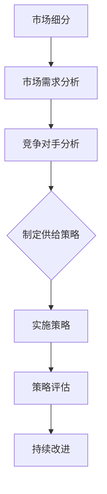
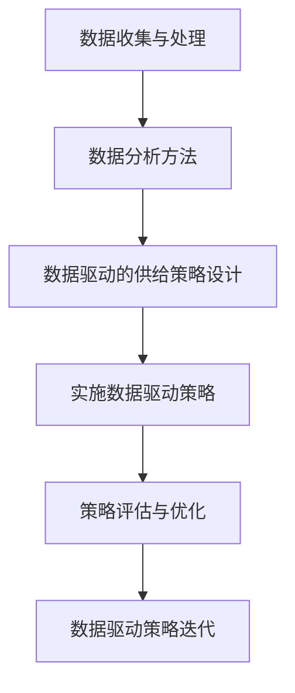
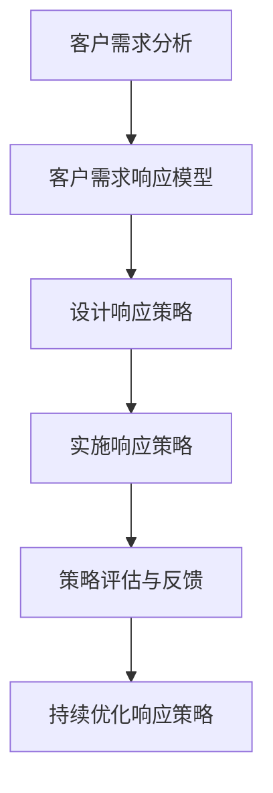

                 

### 概述与基础理论

#### 1.1 细分市场与商品供给策略

在现代经济环境中，细分市场已成为企业竞争的重要策略。细分市场，顾名思义，是将整个市场根据特定的标准进行分割，从而形成具有相似需求或行为的子市场。这种做法有助于企业更精准地满足不同消费者的需求，提高市场竞争力。

商品供给策略则是在明确了细分市场之后，针对这些市场提供相应的商品和服务。有效的商品供给策略能够确保企业在满足市场需求的同时，实现利润最大化。

#### 1.1.1 细分市场概念与重要性

细分市场的概念起源于市场营销理论。市场细分是指将一个广泛的市场划分为若干个具有相似需求、行为或特征的子市场。细分市场的标准可以包括地理位置、人口统计、行为特征、心理特征等多个维度。例如，在服装市场中，可以根据年龄、性别、收入水平等因素进行细分。

细分市场的重要性体现在以下几个方面：

1. **提高市场响应速度**：细分市场能够使企业更迅速地响应市场变化，满足特定群体的需求。
2. **提升产品差异化**：针对不同细分市场的特定需求，企业可以推出更具针对性的产品和服务。
3. **降低营销成本**：通过集中资源服务于特定的细分市场，企业可以有效降低营销成本。
4. **增强客户忠诚度**：针对细分市场的特定需求提供定制化服务，有助于提升客户满意度和忠诚度。

#### 1.1.2 商品供给策略概述

商品供给策略是指企业根据市场需求和自身资源，制定相应的商品和服务供应方案。有效的商品供给策略需要综合考虑市场需求、资源状况、竞争环境等多个因素。

商品供给策略的主要类型包括：

1. **传统供给策略**：基于历史数据和常规市场分析方法制定，通常注重规模效应和市场份额。
2. **精准供给策略**：利用大数据分析、人工智能等技术，对消费者行为进行深入分析，提供精准的供给。
3. **跨界供给策略**：通过跨行业合作，利用不同领域的资源和服务，提供创新的商品供给。

#### 1.1.3 细分市场供给策略与传统策略的区别

细分市场供给策略与传统策略相比，具有以下几个显著特点：

1. **目标客户明确**：细分市场供给策略针对特定的消费者群体，目标客户更加明确。
2. **产品定制化**：针对细分市场的特定需求，企业提供定制化的产品和服务。
3. **资源投入集中**：细分市场供给策略强调集中资源，专注于特定市场的开发和维护。
4. **技术驱动**：细分市场供给策略更多地依赖于大数据分析、人工智能等先进技术，实现精准供给。

通过上述分析，我们可以看到，细分市场供给策略在满足消费者个性化需求、提高市场竞争力方面具有显著优势。接下来，我们将进一步探讨细分市场的市场分析方法和商品供给策略的具体实施方法。

---

#### 1.2 细分市场的市场分析

细分市场的市场分析是制定有效商品供给策略的重要前提。只有深入了解细分市场的特点和需求，企业才能有针对性地制定营销策略和商品供给方案。市场分析主要包括市场细分方法、市场需求分析和竞争对手分析三个方面。

#### 1.2.1 市场细分方法

市场细分是进行市场分析的第一步，其目的是将一个庞大的市场分割成若干个具有相似特性的子市场。市场细分的方法主要有以下几种：

1. **地理细分**：根据地理位置进行市场划分，如城市、区域、国家等。地理细分有助于企业了解不同地区市场的消费习惯和需求差异。

2. **人口细分**：根据人口统计特征进行市场划分，如年龄、性别、收入、职业、教育程度等。人口细分有助于企业识别具有相似需求特征的目标客户群体。

3. **行为细分**：根据消费者的购买行为和消费习惯进行市场划分，如购买频率、购买渠道、品牌忠诚度等。行为细分有助于企业识别高频消费者和潜在客户。

4. **心理细分**：根据消费者的心理特征和价值观进行市场划分，如生活方式、个性特征、价值观念等。心理细分有助于企业开发满足消费者心理需求的商品和服务。

5. **利益细分**：根据消费者对商品和服务的利益需求进行市场划分，如价格敏感型、品质追求型、服务追求型等。利益细分有助于企业提供差异化的产品和服务。

6. **组合细分**：将上述几种细分方法结合起来，形成组合细分。组合细分能够更全面地了解市场，为制定细分市场供给策略提供更丰富的信息。

#### 1.2.2 市场需求分析

市场需求分析是了解细分市场消费者需求和购买行为的过程。通过市场需求分析，企业可以识别目标客户的需求点，从而制定针对性的商品供给策略。市场需求分析的主要内容包括：

1. **需求特征分析**：分析消费者的需求类型、需求强度和需求变化趋势。例如，消费者对某种商品的需求是否随着季节、节假日或促销活动而变化。

2. **购买行为分析**：分析消费者的购买动机、购买频率、购买渠道和购买偏好。例如，消费者更喜欢线上购物还是线下购物，更喜欢品牌商品还是性价比高的商品。

3. **需求预测**：基于历史数据和当前市场情况，预测未来市场需求的变化趋势。需求预测有助于企业提前做好库存管理和供应链规划。

4. **客户满意度分析**：通过调查和反馈了解客户对现有商品和服务的满意度，识别改进空间。客户满意度分析有助于企业提升产品和服务的质量。

#### 1.2.3 竞争对手分析

竞争对手分析是了解细分市场竞争态势的重要环节。通过竞争对手分析，企业可以识别主要竞争对手的市场策略、优势和劣势，从而制定相应的竞争策略。竞争对手分析的主要内容包括：

1. **竞争对手定位**：分析竞争对手的市场定位、目标客户群体和市场占有率。

2. **竞争对手策略**：分析竞争对手的营销策略、定价策略、渠道策略和促销策略。

3. **竞争对手优势分析**：识别竞争对手在产品、技术、品牌、渠道等方面的优势，为自身竞争策略提供参考。

4. **竞争对手劣势分析**：分析竞争对手在市场响应速度、产品创新、客户服务等方面的劣势，寻找市场机会。

5. **市场竞争态势预测**：基于竞争对手分析和市场需求分析，预测未来市场竞争态势，为企业调整供给策略提供依据。

通过以上市场分析，企业可以更深入地了解细分市场的特点和需求，为制定有效的商品供给策略奠定基础。接下来，我们将探讨不同类型的商品供给策略及其应用。

---

#### 1.3 商品供给策略的类型

商品供给策略在企业运营中扮演着至关重要的角色，不同的策略适用于不同的市场环境和需求。以下是几种常见的商品供给策略及其特点。

#### 1.3.1 传统供给策略

传统供给策略是一种基于历史数据和市场经验的方法，企业根据过去的市场表现和需求趋势来制定商品供应计划。其主要特点如下：

1. **历史数据依赖**：传统供给策略依赖于过去的数据和经验，通过分析历史销售数据、库存水平和市场趋势来预测未来的需求。

2. **稳定性和可靠性**：传统策略能够提供稳定的供应，确保企业满足基本的客户需求。

3. **风险较低**：由于主要基于历史数据，传统策略在风险控制方面表现较好。

4. **市场反应速度较慢**：由于依赖历史数据，传统策略在应对市场变化时反应速度较慢，可能错过市场机会。

传统供给策略适用于市场环境相对稳定，需求变化较小的行业，如一些基础消费品和工业原材料。

#### 1.3.2 精准供给策略

精准供给策略是利用现代技术和数据分析方法，对市场需求进行精确预测和响应的一种策略。其主要特点如下：

1. **数据驱动**：精准供给策略依赖于大数据分析、人工智能等技术，通过分析海量数据来识别市场需求趋势和消费者行为。

2. **高度个性化**：精准供给策略能够根据消费者的个性化需求提供定制化的商品和服务。

3. **市场响应速度快**：利用先进的数据分析技术，精准供给策略能够迅速响应市场变化，满足消费者即时需求。

4. **风险较大**：由于依赖于新技术和数据质量，精准供给策略在实施过程中可能会面临数据不准确或技术故障的风险。

精准供给策略适用于竞争激烈、消费者需求多样且变化迅速的行业，如电子商务、在线服务和个性化消费品。

#### 1.3.3 跨界供给策略

跨界供给策略是指企业通过跨行业合作，整合不同领域的资源和服务，提供创新的商品供给方案。其主要特点如下：

1. **资源整合**：跨界供给策略能够整合不同行业的资源和服务，提供全新的商品和服务体验。

2. **创新性**：通过跨界合作，企业可以开发出独特的商品和服务，满足消费者的个性化需求。

3. **拓展市场**：跨界供给策略有助于企业拓展新的市场领域，提高市场占有率。

4. **风险较高**：跨界供给策略涉及跨行业的合作和整合，可能面临协调困难、资源分散等风险。

跨界供给策略适用于具有创新意识、希望拓展新市场的企业，如跨界电商、跨界服务公司等。

综上所述，不同的商品供给策略适用于不同的市场环境和需求。企业应根据自身情况和市场特点，选择合适的供给策略，以实现最佳的市场竞争力和盈利能力。在下一节中，我们将进一步探讨如何具体实施细分市场的商品供给策略。

---

### 2.1 数据驱动供给策略

在现代商业环境中，数据驱动供给策略已经成为提升市场竞争力的重要手段。通过利用大数据和人工智能技术，企业可以更精准地预测市场需求，优化库存管理，从而提高运营效率和客户满意度。以下是数据驱动供给策略的具体实施方法。

#### 2.1.1 数据收集与处理

数据收集是数据驱动供给策略的基础。企业需要收集各种类型的数据，包括但不限于销售数据、库存数据、客户行为数据、市场趋势数据等。这些数据可以来源于企业内部的数据系统，如ERP系统、CRM系统，也可以来自于外部数据源，如市场调查、社交媒体等。

收集到数据后，需要进行数据清洗和预处理，以确保数据的质量和一致性。数据清洗包括去除重复数据、填补缺失值、修正错误数据等。预处理则包括数据格式转换、数据标准化和数据归一化等步骤。

#### 2.1.2 数据分析方法

数据分析是数据驱动供给策略的核心。通过数据分析，企业可以提取出有用的信息，为决策提供支持。常用的数据分析方法包括以下几种：

1. **描述性分析**：描述性分析用于了解数据的整体特征，如数据的平均值、中位数、标准差等。描述性分析可以为企业提供基本的业务洞察。

2. **预测性分析**：预测性分析通过历史数据来预测未来的趋势和变化。常见的预测性分析方法包括时间序列分析、回归分析、机器学习等。通过预测性分析，企业可以提前了解市场需求，制定相应的库存和供应计划。

3. **关联分析**：关联分析用于发现数据之间的关联关系。例如，通过关联分析，企业可以发现哪些商品经常被一起购买，从而优化库存和销售策略。

4. **聚类分析**：聚类分析用于将相似的数据分组到一起。通过聚类分析，企业可以将客户划分为不同的群体，针对不同的客户群体制定个性化的营销策略和供给方案。

#### 2.1.3 数据驱动的供给策略设计

基于数据分析的结果，企业可以设计数据驱动的供给策略。以下是数据驱动的供给策略设计的关键步骤：

1. **需求预测**：利用预测性分析的结果，企业可以预测未来一段时间内的市场需求。通过需求预测，企业可以提前了解需求高峰和低谷，从而合理安排生产和库存。

2. **库存优化**：根据需求预测结果，企业可以对库存进行优化。在需求高峰期，企业可以增加库存量，以满足市场需求；在需求低谷期，企业可以减少库存量，避免库存积压。

3. **供应链管理**：通过数据分析，企业可以优化供应链管理。例如，通过关联分析，企业可以发现哪些供应商提供的原材料最符合需求，从而优化供应链结构和采购策略。

4. **客户关系管理**：通过数据分析，企业可以更好地了解客户需求和行为，从而提供个性化的服务和产品。例如，通过聚类分析，企业可以将客户划分为不同的群体，并为每个群体提供定制化的营销策略和服务。

5. **实时响应**：利用实时数据分析技术，企业可以实时监测市场需求变化，并快速调整供给策略。例如，当市场需求突然增加时，企业可以迅速增加生产量或从其他渠道调取库存，以满足市场需求。

通过数据驱动供给策略，企业可以实现更高效、更精准的商品供给，从而提高市场竞争力。在下一节中，我们将探讨如何基于客户需求响应细分市场的商品供给策略。

---

#### 2.2 客户需求响应策略

在激烈的市场竞争中，企业需要迅速且准确地响应客户需求，以保持竞争优势。客户需求响应策略是一种以客户为中心，利用先进技术和数据分析方法，快速识别和满足客户需求的方法。以下是客户需求响应策略的具体实施方法。

#### 2.2.1 客户需求分析

客户需求分析是客户需求响应策略的第一步，其目的是了解客户的真实需求和购买行为。通过以下方法，企业可以深入分析客户需求：

1. **行为数据收集**：通过收集和分析客户的购买记录、浏览历史、搜索关键词等行为数据，企业可以了解客户的购买偏好和行为模式。例如，通过分析客户的购买频率和购买量，企业可以识别出高频客户和潜在客户。

2. **反馈与调查**：通过在线调查、问卷调查、客户访谈等方式，企业可以直接从客户处获取反馈，了解客户对现有产品或服务的满意度和期望。这些反馈可以帮助企业识别客户的需求差异和改进点。

3. **社交媒体分析**：通过分析客户在社交媒体上的评论、帖子等，企业可以了解客户对品牌和产品的态度，以及他们对市场趋势的看法。这有助于企业了解客户需求的变化和新兴趋势。

4. **数据挖掘与分析**：利用数据挖掘技术，企业可以从大量非结构化数据中提取出有价值的信息。例如，通过分析客户评论中的情感倾向，企业可以了解客户对产品或服务的情感反应，从而优化产品设计和营销策略。

#### 2.2.2 客户需求响应模型

客户需求响应模型是一种基于数据分析的模型，用于预测和满足客户需求。以下是构建客户需求响应模型的关键步骤：

1. **需求预测**：通过历史数据和当前市场趋势，使用预测模型（如时间序列预测、回归分析等）预测未来客户需求。需求预测可以帮助企业提前准备库存和资源，以满足未来需求。

2. **需求分类**：将客户需求划分为不同的类别，如高频需求、特殊需求、紧急需求等。通过需求分类，企业可以针对不同类型的需求制定相应的响应策略。

3. **响应策略设计**：根据需求预测和需求分类，设计具体的响应策略。例如，对于高频需求，企业可以采用提前采购、快速配送等方式；对于特殊需求，企业可以提供个性化定制服务；对于紧急需求，企业可以提供紧急响应服务。

4. **模型优化**：通过持续的数据分析和模型调整，优化客户需求响应模型。例如，通过不断更新客户行为数据和市场需求信息，企业可以逐步提高需求预测的准确性，从而提高响应效率。

#### 2.2.3 客户需求响应策略应用

客户需求响应策略的有效应用可以显著提高客户满意度和忠诚度。以下是几种常见的客户需求响应策略：

1. **个性化推荐**：利用客户需求响应模型，企业可以为客户提供个性化的商品推荐。通过分析客户的购买历史和行为数据，企业可以推荐符合客户需求的商品，从而提高购买转化率。

2. **快速响应**：通过实时数据分析和自动化系统，企业可以快速响应客户的订单和需求。例如，在电子商务领域，企业可以采用智能仓储和快速配送系统，确保客户尽快收到商品。

3. **个性化服务**：根据客户的需求和偏好，企业提供定制化的服务。例如，在金融服务领域，企业可以根据客户的财务状况和需求，提供个性化的投资建议和理财产品。

4. **需求预测与库存管理**：通过需求预测模型，企业可以优化库存管理，确保有足够的库存来满足客户需求。例如，在零售行业，企业可以根据需求预测结果，合理安排商品采购和库存调整。

通过客户需求响应策略，企业可以更迅速、更准确地满足客户需求，提高客户满意度和忠诚度。这不仅有助于提升企业的市场竞争力，还可以建立长期稳定的客户关系。在下一节中，我们将探讨产品生命周期策略及其在商品供给中的应用。

---

#### 2.3 产品生命周期策略

产品生命周期策略是指企业在产品从推出到退市的整个生命周期中，根据产品在不同阶段的特点和需求，采取相应的营销策略和供给方案，以最大化产品价值并延长其市场寿命。产品生命周期通常分为引入期、成长期、成熟期和衰退期四个阶段。

#### 2.3.1 产品生命周期概述

1. **引入期**：产品刚刚推出，市场对其了解有限。在这一阶段，企业的主要目标是提高产品知名度和市场接受度。常用的策略包括高投入的营销推广、价格促销、提供免费试用等。

2. **成长期**：产品开始被市场接受，销售量逐步上升。企业应重点扩大市场份额，优化产品特性，提高产品质量和性能，并逐步提升价格。此时，竞争也逐步加剧，企业需要加强品牌建设和客户关系管理。

3. **成熟期**：产品进入稳定销售期，市场份额达到高峰。企业应保持产品的市场竞争力和客户满意度，通过差异化营销、价格策略调整、产品线扩展等手段延长产品的市场寿命。

4. **衰退期**：产品销售量逐渐下降，市场份额缩小。企业应考虑产品的更新换代或退出策略，逐步减少投入，集中资源开发新产品。

#### 2.3.2 产品生命周期策略设计

不同阶段的产品生命周期需要不同的供给策略，以下是具体策略设计：

1. **引入期策略**：

   - **推广策略**：通过广告、公关、赞助活动等提高产品知名度。
   - **价格策略**：采用低价策略或促销策略，吸引早期用户。
   - **渠道策略**：选择具有影响力的渠道进行推广，如社交媒体、大型电商平台等。
   - **客户关系策略**：通过免费试用、优惠券等方式吸引客户尝试产品。

2. **成长期策略**：

   - **市场扩张策略**：进一步扩大市场份额，进入新的市场领域。
   - **产品优化策略**：根据客户反馈，优化产品功能和性能，提升客户满意度。
   - **价格调整策略**：根据市场情况和竞争态势，适当调整价格，提升产品性价比。
   - **品牌建设策略**：加强品牌宣传，提升品牌知名度和忠诚度。

3. **成熟期策略**：

   - **差异化策略**：通过产品差异化、服务差异化等手段，提升产品竞争力。
   - **价格策略**：采用竞争性定价、捆绑销售、促销折扣等方式，维持市场份额。
   - **产品线扩展策略**：推出系列产品或延伸产品线，满足不同客户需求。
   - **客户关系管理策略**：通过会员制度、客户忠诚计划等手段，提升客户黏性。

4. **衰退期策略**：

   - **产品更新策略**：推出新一代产品，逐步替代旧产品。
   - **市场收缩策略**：集中资源，缩减不盈利的市场和产品线。
   - **成本控制策略**：降低生产和运营成本，提高产品性价比。
   - **退出策略**：在市场衰退严重时，逐步退出市场，避免资源浪费。

#### 2.3.3 产品生命周期策略案例分析

以下是一个产品生命周期策略的案例分析：

**案例分析：智能手机市场**

1. **引入期**：在智能手机引入期，各大厂商通过高额的营销投入，如明星代言、广告投放等，提高产品知名度。同时，通过价格促销和免费试用活动，吸引早期用户尝试新产品。

2. **成长期**：随着智能手机市场的迅速扩大，厂商加大研发投入，优化产品功能和性能。同时，通过价格策略调整，逐步提升产品性价比。品牌建设也成为重要策略，厂商通过举办品牌活动、发布品牌理念等，提升品牌知名度和忠诚度。

3. **成熟期**：在智能手机成熟期，市场竞争激烈，厂商通过差异化策略，如推出旗舰机型、中低端机型等，满足不同层次客户的需求。同时，通过价格促销和捆绑销售，维持市场份额。产品线扩展也成为策略之一，厂商通过推出智能穿戴设备、智能家居设备等，扩大产品线。

4. **衰退期**：随着5G手机的推出，传统智能手机市场开始出现衰退。厂商逐步推出新一代产品，替代旧产品。同时，通过市场收缩和成本控制，逐步退出不盈利的市场和产品线。

通过以上案例分析，我们可以看到，产品生命周期策略在不同阶段的重要性。企业应根据产品生命周期特点，灵活调整供给策略，以最大化产品价值并延长市场寿命。

---

#### 2.4 营销策略与促销策略

在商品供给策略中，营销策略和促销策略是两个至关重要的组成部分。营销策略侧重于建立品牌形象、拓展市场份额，而促销策略则侧重于在特定时间内刺激消费者的购买欲望，提升销售额。有效的营销和促销策略能够帮助企业更好地满足细分市场的需求，提高市场竞争力。

#### 2.4.1 营销策略概述

营销策略是企业通过市场研究和分析，制定的一套全面的营销计划，旨在吸引目标客户、提高品牌知名度和忠诚度，最终实现销售目标。以下是几种常见的营销策略：

1. **品牌建设策略**：通过品牌定位、品牌形象塑造和品牌推广，建立强大的品牌认知度和品牌忠诚度。品牌建设策略的核心是差异化，企业需要明确自身品牌与竞争对手的差异，并持续强化这一差异。

2. **市场细分策略**：根据市场特点和客户需求，将市场划分为不同的细分市场，有针对性地制定营销方案。市场细分策略有助于企业更精准地满足不同客户群体的需求，提高营销效果。

3. **产品差异化策略**：通过在产品功能、设计、性能等方面进行创新和优化，使产品在市场中具有独特的竞争优势。产品差异化策略能够提高客户的品牌忠诚度和重复购买率。

4. **渠道营销策略**：通过选择合适的销售渠道，如线上渠道、线下渠道、多渠道整合等，实现产品的高效分销。渠道营销策略需要根据不同渠道的特点和客户需求，制定差异化的营销方案。

5. **互动营销策略**：通过社交媒体、电子邮件、线下活动等方式，与客户建立互动关系，提高客户参与度和忠诚度。互动营销策略能够增强客户对品牌的认知和好感，促进销售转化。

#### 2.4.2 促销策略概述

促销策略是企业通过短期刺激，如价格优惠、礼品赠送、限时折扣等，吸引消费者购买商品或服务的一种手段。以下是几种常见的促销策略：

1. **价格促销**：通过降低商品价格，刺激消费者的购买欲望。价格促销包括直接降价、打折、满减等多种形式，是最常见的促销手段。

2. **礼品赠送**：通过赠送礼品，吸引消费者购买商品。礼品赠送可以提高消费者的购买意愿，增强他们对品牌的认可和好感。

3. **限时折扣**：在特定时间段内提供折扣优惠，刺激消费者在短时间内完成购买。限时折扣可以提升销售额，同时增强消费者的购买紧迫感。

4. **捆绑销售**：将多种商品组合在一起，以优惠价格出售。捆绑销售可以提高客户的购买量，同时增加企业的销售额。

5. **会员优惠**：通过会员制度，为会员提供专属优惠和福利，提高客户的忠诚度和重复购买率。会员优惠可以增强客户的归属感和品牌忠诚度。

#### 2.4.3 营销与促销策略融合

营销策略和促销策略的融合是提高营销效果的关键。以下是一些融合策略的案例：

1. **全渠道促销**：通过线上和线下渠道同步进行促销活动，提高消费者的购买便捷性和参与度。例如，在线上平台提供限时折扣，在线下门店提供礼品赠送。

2. **品牌联动促销**：与知名品牌或明星合作，共同举办促销活动，借助品牌的影响力提高活动的关注度。例如，某品牌与某明星合作推出联名产品，并进行限时折扣促销。

3. **会员专属促销**：为会员提供专属的促销优惠，提高会员的忠诚度和参与度。例如，会员可以享受专属折扣、积分兑换礼品等。

4. **联合营销**：与其他企业或品牌合作，共同推广产品或服务。例如，某电商平台与某品牌合作，推出联合促销活动，提高双方的销售额。

通过有效的营销和促销策略融合，企业可以更精准地满足细分市场的需求，提高市场竞争力，实现销售目标。在下一节中，我们将探讨供应链管理策略及其在细分市场商品供给中的应用。

---

#### 2.5 供应链管理策略

供应链管理是企业运营的核心环节之一，直接影响商品供给的效率和质量。有效的供应链管理策略能够确保商品从生产到消费者手中的各个环节顺畅运行，提高市场响应速度和客户满意度。以下是供应链管理策略的主要内容和应用。

#### 2.5.1 供应链管理概述

供应链管理涉及从供应商到制造商，再到分销商和零售商，最终到达消费者的全过程。其目的是通过优化各个环节的运作，实现成本最低、效率最高、客户满意度最佳的目标。供应链管理的主要内容包括：

1. **采购管理**：选择合适的供应商，制定采购计划，确保原材料和零部件的及时供应和质量。

2. **库存管理**：对库存进行有效控制，避免过多库存积压或库存不足，以降低成本、提高资金利用率。

3. **生产管理**：优化生产计划和生产流程，确保生产效率和产品质量。

4. **物流管理**：优化运输和仓储环节，降低物流成本，提高配送速度和准确率。

5. **信息管理**：通过信息技术手段，实现供应链各环节的信息共享和实时监控，提高供应链的透明度和协同性。

#### 2.5.2 供应链优化方法

供应链优化是提高供应链管理效率和降低成本的重要手段。以下是一些常见的供应链优化方法：

1. **精益管理**：通过消除浪费、优化流程、提高生产效率，实现成本最小化和效率最大化。

2. **供应链可视化**：利用信息技术，实现供应链各环节的实时监控和数据分析，提高供应链的透明度和协同性。

3. **供应链协同**：通过协同规划、信息共享和资源整合，实现供应链各环节的协同运作，提高供应链的整体效率。

4. **供应链金融**：利用供应链金融工具，如预付款、应收账款融资等，优化资金流动，提高资金利用效率。

5. **绿色供应链**：通过降低碳排放、减少废弃物、提高资源利用率，实现可持续发展。

#### 2.5.3 供应链管理在细分市场中的应用

在细分市场，供应链管理策略需要根据市场特点和客户需求进行定制化调整。以下是供应链管理在细分市场中的应用：

1. **精准供应链**：利用大数据和人工智能技术，对市场需求进行精准预测和响应，实现高效供应链管理。

2. **定制化供应链**：根据细分市场的特定需求，提供定制化的商品和服务，优化供应链流程和资源配置。

3. **敏捷供应链**：提高供应链的灵活性和响应速度，快速满足细分市场的需求变化。

4. **供应链协同**：与供应链上下游企业建立紧密的合作关系，实现信息共享和资源整合，提高供应链的整体效率。

5. **绿色供应链**：在细分市场中推行绿色供应链理念，降低环境影响，提高社会责任。

通过有效的供应链管理策略，企业可以更好地满足细分市场的需求，提高市场竞争力。在下一节中，我们将通过具体案例分析，探讨不同细分市场的商品供给策略。

---

#### 3.1 案例分析1：家电行业

家电行业是一个高度细分的市场，消费者对产品功能、质量、价格和售后服务的需求各不相同。以下是家电行业在实施细分市场商品供给策略时的成功案例。

#### 3.1.1 案例背景

某知名家电品牌在国内市场占有较高的份额，但在面对日益激烈的市场竞争时，发现传统的供给策略已经无法满足消费者的个性化需求。为了提升市场竞争力，该品牌决定实施细分市场商品供给策略。

#### 3.1.2 案例分析

1. **市场细分**：
   - **地理细分**：根据消费者所在的地区，将市场划分为一线城市、二线城市、三线城市等。
   - **人口细分**：根据消费者的年龄、收入、职业等因素，将市场划分为不同的消费群体。
   - **行为细分**：根据消费者的购买习惯、品牌忠诚度等，将市场划分为高频消费者、中频消费者、低频消费者。

2. **精准供给**：
   - **产品差异化**：针对不同细分市场的特定需求，推出具有不同功能和价格区间的产品。例如，在一线城市，推出高端智能家电；在二线城市，推出中高端家电；在三线城市，推出中低端家电。
   - **定制化服务**：提供个性化定制服务，如根据消费者需求定制家电颜色、功能等。

3. **供应链优化**：
   - **精准采购**：根据市场需求预测，调整原材料采购量，降低库存成本。
   - **高效配送**：优化物流渠道，提高配送速度和准确率，确保消费者及时收到商品。

4. **营销与促销**：
   - **多渠道营销**：通过线上电商平台、线下实体店等多渠道进行推广，提高品牌知名度和覆盖面。
   - **精准促销**：根据消费者购买行为和偏好，提供个性化的促销信息，如限时折扣、会员专享优惠等。

#### 3.1.3 案例启示

该家电品牌的成功案例表明，细分市场商品供给策略在提升市场竞争力方面具有显著作用。以下是案例启示：

1. **精准市场细分**：准确识别消费者需求，是实现成功细分市场供给策略的关键。

2. **产品差异化**：针对不同细分市场的特定需求，提供差异化的产品和服务，能够提高客户满意度和忠诚度。

3. **供应链优化**：通过精准采购和高效配送，降低成本、提高效率，为实施细分市场供给策略提供有力支持。

4. **多渠道营销**：充分利用线上线下渠道，提高品牌知名度和覆盖面，有助于细分市场供给策略的有效实施。

通过以上分析，我们可以看到，家电行业在实施细分市场商品供给策略时，需要综合考虑市场细分、精准供给、供应链优化和营销策略等多个方面。在下一节中，我们将探讨餐饮行业的细分市场商品供给策略。

---

#### 3.2 案例分析2：餐饮行业

餐饮行业是一个高度细分的市场，消费者对食物种类、质量、价格和就餐体验的需求各不相同。以下是餐饮行业在实施细分市场商品供给策略时的成功案例。

#### 3.2.1 案例背景

某知名餐饮品牌在国内市场拥有广泛的客户基础，但在面对日益多样化的消费者需求时，发现传统的供给策略已经无法满足市场需求。为了提升市场竞争力，该品牌决定实施细分市场商品供给策略。

#### 3.2.2 案例分析

1. **市场细分**：
   - **地理细分**：根据消费者所在的地区，将市场划分为一线城市、二线城市、三线城市等。
   - **人口细分**：根据消费者的年龄、收入、职业等因素，将市场划分为不同的消费群体。
   - **行为细分**：根据消费者的就餐习惯、饮食偏好等，将市场划分为高频消费者、中频消费者、低频消费者。

2. **精准供给**：
   - **产品差异化**：针对不同细分市场的特定需求，推出具有不同口味、价格和就餐体验的餐厅。例如，在一线城市，推出高端、精致的中餐餐厅；在二线城市，推出价格适中、口味丰富的快餐店；在三线城市，推出价格实惠、口味地道的家常菜餐厅。
   - **定制化服务**：提供个性化定制服务，如根据消费者需求定制菜品、就餐环境等。

3. **供应链优化**：
   - **精准采购**：根据市场需求预测，调整食材采购量，降低库存成本。
   - **高效配送**：优化物流渠道，提高配送速度和准确率，确保消费者及时收到食材。

4. **营销与促销**：
   - **多渠道营销**：通过线上电商平台、线下实体店等多渠道进行推广，提高品牌知名度和覆盖面。
   - **精准促销**：根据消费者购买行为和偏好，提供个性化的促销信息，如限时折扣、会员专享优惠等。

#### 3.2.3 案例启示

该餐饮品牌的成功案例表明，细分市场商品供给策略在提升市场竞争力方面具有显著作用。以下是案例启示：

1. **精准市场细分**：准确识别消费者需求，是实现成功细分市场供给策略的关键。

2. **产品差异化**：针对不同细分市场的特定需求，提供差异化的产品和服务，能够提高客户满意度和忠诚度。

3. **供应链优化**：通过精准采购和高效配送，降低成本、提高效率，为实施细分市场供给策略提供有力支持。

4. **多渠道营销**：充分利用线上线下渠道，提高品牌知名度和覆盖面，有助于细分市场供给策略的有效实施。

通过以上分析，我们可以看到，餐饮行业在实施细分市场商品供给策略时，需要综合考虑市场细分、精准供给、供应链优化和营销策略等多个方面。在下一节中，我们将探讨电子商务行业的细分市场商品供给策略。

---

#### 3.3 案例分析3：电子商务行业

电子商务行业是一个高度细分的市场，消费者对商品种类、价格、服务和购买体验的需求各不相同。以下是电子商务行业在实施细分市场商品供给策略时的成功案例。

#### 3.3.1 案例背景

某知名电子商务平台在国内市场拥有庞大的用户基础，但在面对日益激烈的竞争时，发现传统的供给策略已经无法满足消费者的个性化需求。为了提升市场竞争力，该平台决定实施细分市场商品供给策略。

#### 3.3.2 案例分析

1. **市场细分**：
   - **地理细分**：根据消费者所在的地区，将市场划分为一线城市、二线城市、三线城市等。
   - **人口细分**：根据消费者的年龄、收入、职业等因素，将市场划分为不同的消费群体。
   - **行为细分**：根据消费者的购买习惯、品牌忠诚度等，将市场划分为高频消费者、中频消费者、低频消费者。

2. **精准供给**：
   - **产品差异化**：针对不同细分市场的特定需求，提供差异化的商品和服务。例如，在一线城市，提供高端、进口商品；在二线城市，提供价格适中、品质可靠的商品；在三线城市，提供价格实惠、当地特色的商品。
   - **定制化服务**：提供个性化定制服务，如根据消费者需求定制购物方案、配送服务等。

3. **供应链优化**：
   - **精准采购**：根据市场需求预测，调整商品采购量，降低库存成本。
   - **高效配送**：优化物流渠道，提高配送速度和准确率，确保消费者及时收到商品。

4. **营销与促销**：
   - **多渠道营销**：通过线上电商平台、社交媒体、线下实体店等多渠道进行推广，提高品牌知名度和覆盖面。
   - **精准促销**：根据消费者购买行为和偏好，提供个性化的促销信息，如限时折扣、会员专享优惠等。

#### 3.3.3 案例启示

该电子商务平台的成功案例表明，细分市场商品供给策略在提升市场竞争力方面具有显著作用。以下是案例启示：

1. **精准市场细分**：准确识别消费者需求，是实现成功细分市场供给策略的关键。

2. **产品差异化**：针对不同细分市场的特定需求，提供差异化的产品和服务，能够提高客户满意度和忠诚度。

3. **供应链优化**：通过精准采购和高效配送，降低成本、提高效率，为实施细分市场供给策略提供有力支持。

4. **多渠道营销**：充分利用线上线下渠道，提高品牌知名度和覆盖面，有助于细分市场供给策略的有效实施。

通过以上分析，我们可以看到，电子商务行业在实施细分市场商品供给策略时，需要综合考虑市场细分、精准供给、供应链优化和营销策略等多个方面。在下一节中，我们将探讨如何优化细分市场的商品供给策略。

---

### 4.1 细分市场供给策略优化

在细分市场的竞争日益激烈的环境中，优化细分市场供给策略成为企业提升市场竞争力、实现可持续发展的重要途径。通过不断调整和改进策略，企业可以更好地满足消费者的个性化需求，提高市场响应速度，降低运营成本。以下是细分市场供给策略优化的关键步骤和方法。

#### 4.1.1 优化目标

细分市场供给策略优化的目标主要包括以下几个方面：

1. **提高市场响应速度**：通过优化供应链和营销策略，提高对市场变化的敏感性和响应速度，确保能够迅速满足消费者的需求。

2. **降低运营成本**：通过优化资源配置、减少库存积压和物流成本，提高运营效率，实现成本控制。

3. **提升客户满意度**：通过提供差异化的产品和服务，满足消费者的个性化需求，提升客户满意度和忠诚度。

4. **增强竞争力**：通过优化策略，提高市场占有率和品牌知名度，增强企业在细分市场中的竞争力。

#### 4.1.2 优化方法

实现细分市场供给策略优化，企业可以采取以下几种方法：

1. **数据分析与预测**：利用大数据和人工智能技术，对市场需求、客户行为和竞争态势进行深入分析，准确预测未来的市场趋势和需求变化。基于数据分析的结果，优化供应链和营销策略，提高市场响应速度。

2. **精益管理**：通过精益管理方法，消除供应链中的浪费，提高生产效率和资源利用率。例如，采用看板管理、5S管理法等，实现生产流程的优化和效率提升。

3. **敏捷供应链**：通过建立敏捷供应链，提高供应链的灵活性和响应速度。例如，采用JIT（Just-In-Time）库存管理、快速响应系统等，确保供应链的稳定性和高效性。

4. **定制化服务**：针对不同细分市场的特定需求，提供定制化的产品和服务。通过个性化定制、柔性生产等手段，提高客户满意度和忠诚度。

5. **多渠道整合**：充分利用线上线下渠道，实现多渠道整合和协同营销。通过整合电商平台、社交媒体、线下门店等渠道，提高品牌知名度和覆盖面，提升市场竞争力。

6. **持续改进**：建立持续改进机制，通过定期的策略评估和反馈，不断优化和调整供给策略。例如，采用PDCA（计划-执行-检查-行动）循环，确保策略的持续改进和优化。

#### 4.1.3 优化案例分析

以下是一个细分市场供给策略优化的实际案例分析：

**案例分析：某时尚品牌**

1. **数据分析与预测**：该时尚品牌利用大数据分析，对市场需求、客户行为和竞争态势进行深入分析。通过分析消费者的购物习惯、搜索关键词和社交媒体互动等数据，准确预测未来的市场趋势和需求变化。基于数据分析的结果，品牌优化了产品设计和供应链策略，实现了对市场变化的快速响应。

2. **精益管理**：品牌采用精益管理方法，优化生产流程和库存管理。通过看板管理和5S管理法，实现了生产效率和资源利用率的显著提升。品牌还引入了JIT库存管理，减少了库存积压和物流成本，提高了供应链的稳定性。

3. **定制化服务**：品牌提供个性化定制服务，根据消费者的需求，设计不同的产品款式和颜色。通过柔性生产，品牌能够快速满足消费者的个性化需求，提升了客户满意度和忠诚度。

4. **多渠道整合**：品牌充分利用线上线下渠道，实现多渠道整合和协同营销。通过电商平台、社交媒体和线下门店的整合，品牌提高了品牌知名度和覆盖面，增强了市场竞争力。

5. **持续改进**：品牌建立了持续改进机制，通过定期的策略评估和反馈，不断优化和调整供给策略。例如，通过定期收集客户反馈和市场数据，品牌能够及时调整产品设计和供应链策略，确保品牌持续满足消费者的需求。

通过以上案例分析，我们可以看到，细分市场供给策略优化对于企业在细分市场中保持竞争优势具有重要意义。企业应不断优化和调整策略，以适应市场变化和消费者需求，实现可持续发展。

---

### 4.2 细分市场供给策略评估

细分市场供给策略的有效性评估是确保企业策略持续改进和优化的重要环节。通过科学、系统的评估方法，企业可以准确衡量策略的效果，发现存在的问题，为下一步的调整提供依据。以下是细分市场供给策略评估的关键指标、方法和案例分析。

#### 4.2.1 评估指标

细分市场供给策略的评估需要从多个维度进行，以下是常见的评估指标：

1. **市场份额**：市场份额是衡量策略效果的重要指标，反映了企业在细分市场中的竞争地位。通过比较企业在细分市场中的销售份额与市场总份额，可以评估策略的市场渗透力。

2. **销售额**：销售额直接反映了策略的收益效果。通过分析不同细分市场的销售额变化，可以评估策略对销售额增长的贡献。

3. **客户满意度**：客户满意度是衡量策略效果的直接指标，反映了消费者对产品和服务的满意程度。通过调查和反馈，可以评估策略对提升客户满意度的效果。

4. **客户忠诚度**：客户忠诚度是衡量策略长期效果的重要指标，反映了消费者对品牌的持续忠诚。通过客户重复购买率、客户保留率等指标，可以评估策略对提升客户忠诚度的影响。

5. **运营成本**：运营成本是衡量策略效率的重要指标。通过分析不同细分市场的运营成本，可以评估策略对成本控制的效果。

6. **市场响应速度**：市场响应速度是衡量策略灵活性和敏捷性的指标。通过分析企业在面对市场变化时的响应速度，可以评估策略的市场适应性。

#### 4.2.2 评估方法

细分市场供给策略的评估方法主要包括定量评估和定性评估。

1. **定量评估**：
   - **数据分析**：通过收集和整理企业运营数据，如销售额、市场份额、客户满意度等，进行定量分析，评估策略的效果。
   - **统计分析**：利用统计分析方法，如回归分析、时间序列分析等，对数据进行分析，提取有价值的信息。

2. **定性评估**：
   - **客户调查**：通过问卷调查、访谈等方式，直接收集客户的反馈，了解客户对产品和服务的满意度、忠诚度等。
   - **专家评审**：邀请行业专家对企业细分市场供给策略进行评审，提供专业的意见和建议。

#### 4.2.3 评估案例分析

以下是一个细分市场供给策略评估的实际案例分析：

**案例分析：某电子消费品企业**

1. **评估指标**：
   - **市场份额**：通过市场调查和销售数据，分析企业在细分市场中的市场份额。
   - **销售额**：通过财务报表，分析不同细分市场的销售额变化。
   - **客户满意度**：通过问卷调查，了解客户对产品的满意度。
   - **客户忠诚度**：通过客户重复购买率和客户保留率，评估客户忠诚度。
   - **运营成本**：通过财务报表，分析不同细分市场的运营成本。
   - **市场响应速度**：通过销售数据和客户反馈，评估企业在面对市场变化时的响应速度。

2. **评估方法**：
   - **数据分析**：利用Excel、SPSS等工具，对销售数据、市场份额等进行分析，提取有价值的信息。
   - **客户调查**：通过问卷调查，收集客户的反馈，了解他们对产品和服务的满意度。
   - **专家评审**：邀请行业专家对企业细分市场供给策略进行评审，提供专业的意见和建议。

3. **评估结果**：
   - **市场份额**：企业在细分市场中的市场份额稳步提升，但与竞争对手仍有差距。
   - **销售额**：不同细分市场的销售额呈现出不同的增长趋势，高端市场的销售额增长较快，但中低端市场的增长较为缓慢。
   - **客户满意度**：大部分客户对企业的产品和服务表示满意，但部分客户对售后服务的满意度有待提高。
   - **客户忠诚度**：客户重复购买率和客户保留率较高，表明客户对品牌的忠诚度较高。
   - **运营成本**：不同细分市场的运营成本控制较好，但高端市场的成本较高。
   - **市场响应速度**：企业在面对市场变化时的响应速度较快，能够及时调整产品和服务策略。

4. **改进建议**：
   - **提升市场份额**：通过市场细分和差异化策略，进一步提高市场份额。
   - **优化销售额结构**：加强中低端市场的开发和推广，提高销售额增长。
   - **提升客户满意度**：改进售后服务质量，提高客户满意度。
   - **降低运营成本**：优化高端市场的运营成本，提高盈利能力。
   - **提高市场响应速度**：利用先进的技术手段，提高市场响应速度，更好地满足客户需求。

通过以上案例分析，我们可以看到，细分市场供给策略评估对于企业制定和调整策略具有重要意义。企业应根据评估结果，持续优化和改进策略，以提升市场竞争力。

---

#### 4.3 策略持续改进与迭代

在竞争激烈的市场环境中，细分市场供给策略的有效性并不是一成不变的。随着市场环境、消费者需求和技术的不断发展，企业需要不断进行策略的持续改进与迭代，以保持竞争优势。以下是从策略制定到实施的详细过程，以及案例分析。

#### 4.3.1 持续改进的重要性

持续改进是企业在不断变化的市场环境中保持竞争力的关键。以下是持续改进的几个重要方面：

1. **适应市场变化**：市场环境不断变化，消费者需求也在不断升级。持续改进可以帮助企业及时调整策略，适应市场变化，满足消费者需求。

2. **提高运营效率**：通过持续改进，企业可以不断优化内部流程，减少浪费，提高运营效率，降低成本。

3. **提升客户满意度**：持续改进旨在更好地满足消费者需求，提高客户满意度，从而提升客户忠诚度和品牌价值。

4. **增强创新能力**：持续改进鼓励企业不断探索新的技术和管理方法，增强创新能力，为市场带来新的增长点。

#### 4.3.2 改进策略的流程

持续改进策略的流程通常包括以下几个步骤：

1. **问题识别**：通过市场调研、数据分析、客户反馈等方式，识别现有策略中存在的问题和不足。

2. **原因分析**：对识别出的问题进行深入分析，找出根本原因。常用的方法包括鱼骨图、五问法等。

3. **方案设计**：根据原因分析的结果，设计改进方案。改进方案应包括具体的措施、实施步骤和时间表。

4. **实施与监控**：根据改进方案，进行具体实施，并持续监控改进效果。通过定期评估，确保改进措施的有效性。

5. **评估与反馈**：对改进效果进行评估，收集客户和员工的反馈，不断优化改进方案。

6. **标准化**：将有效的改进措施纳入标准流程，确保改进成果的持续性和可重复性。

#### 4.3.3 持续改进案例分析

以下是一个持续改进策略的实际案例分析：

**案例分析：某快速消费品公司**

1. **问题识别**：
   - **库存积压**：部分产品在仓库中积压，导致资金占用增加。
   - **订单延误**：订单处理速度较慢，导致客户满意度下降。
   - **物流成本高**：物流成本占比较高，影响盈利能力。

2. **原因分析**：
   - **库存积压**：市场需求预测不准确，库存管理不精细。
   - **订单延误**：订单处理流程繁琐，信息系统效率低下。
   - **物流成本高**：物流渠道不优化，运输管理不精细。

3. **方案设计**：
   - **库存管理**：引入大数据分析和机器学习技术，优化市场需求预测，调整库存管理策略。
   - **订单处理**：优化订单处理流程，采用自动化信息系统，提高订单处理速度。
   - **物流管理**：整合物流渠道，采用精细化管理方法，降低物流成本。

4. **实施与监控**：
   - **库存管理**：实施新的库存管理策略，监控库存水平，确保库存优化。
   - **订单处理**：上线自动化信息系统，实时监控订单处理进度，确保效率提升。
   - **物流管理**：优化物流渠道，降低运输成本，提高配送效率。

5. **评估与反馈**：
   - **库存管理**：评估库存优化效果，通过客户反馈了解市场变化。
   - **订单处理**：评估订单处理速度和准确性，收集客户反馈。
   - **物流管理**：评估物流成本和配送效率，优化物流策略。

6. **标准化**：
   - **库存管理**：将优化后的库存管理策略纳入标准流程，确保持续优化。
   - **订单处理**：将自动化信息系统纳入标准流程，确保高效运作。
   - **物流管理**：将优化后的物流策略纳入标准流程，确保成本控制和效率提升。

通过以上案例分析，我们可以看到，持续改进策略在提升企业运营效率、降低成本、提高客户满意度方面具有显著作用。企业应建立持续改进机制，不断优化和调整策略，以适应市场变化和消费者需求。

---

### 5.1 细分市场供给策略发展趋势

随着全球市场的不断变化和消费者需求的日益多样，细分市场供给策略正经历着一系列重要的发展趋势。以下将探讨新技术的影响、新模式的出现以及未来展望。

#### 新技术的影响

1. **大数据与人工智能**：大数据和人工智能技术在细分市场供给策略中发挥着越来越重要的作用。通过大数据分析，企业可以更准确地了解消费者的行为和偏好，从而制定更加精准的供给策略。人工智能技术则可以自动化决策过程，提高供应链的效率和灵活性。

2. **物联网**：物联网（IoT）技术的应用使得供应链各环节的信息传递更加实时和高效。例如，智能仓储系统和智能配送系统可以实时监控库存和运输状态，从而优化供应链管理。

3. **区块链**：区块链技术提供了一种去中心化的、不可篡改的数据存储方式，有助于提高供应链的透明度和可信度。在细分市场供给策略中，区块链可以用于追踪商品的来源和流通过程，确保产品质量和合规性。

#### 新模式的出现

1. **C2M（Consumer-to-Manufacturer）**：消费者直接参与产品设计和生产，企业根据消费者的需求和反馈进行定制化生产。这种模式缩短了供应链，提高了产品定制化和个性化程度。

2. **社交电商**：通过社交媒体平台，企业可以直接与消费者互动，推广产品并获取反馈。社交电商模式不仅提高了品牌知名度，还增强了消费者对品牌的忠诚度。

3. **共享经济**：共享经济模式在细分市场供给策略中也越来越受欢迎。例如，共享办公空间、共享物流服务等，通过共享资源，降低了企业的运营成本，提高了资源利用效率。

#### 未来展望

1. **个性化与定制化**：随着消费者需求的多样化和个性化趋势，未来细分市场供给策略将更加注重个性化与定制化。通过大数据和人工智能技术，企业将能够更精准地满足消费者的个性化需求。

2. **绿色供应链**：随着环境问题的日益突出，绿色供应链将成为未来的重要趋势。企业将通过优化生产和物流过程，减少碳排放和资源浪费，实现可持续发展。

3. **跨界合作**：未来的细分市场供给策略将更加注重跨界合作。企业将通过跨行业合作，整合不同领域的资源和服务，提供创新的供给方案。

4. **全球一体化**：全球市场的一体化趋势将加速细分市场供给策略的国际化。企业将通过全球化布局，充分利用全球资源，满足全球消费者的需求。

通过以上分析，我们可以看到，细分市场供给策略正在经历着深刻的变化和升级。企业需要紧跟新技术的发展，灵活应对市场变化，不断创新和优化策略，以保持竞争优势。

---

### 5.2 企业应对策略

在当前快速变化的市场环境中，企业需要采取一系列应对策略，以适应细分市场供给策略的发展趋势。以下是企业应对策略的详细探讨，包括企业角色转变、战略调整和发展策略建议。

#### 企业角色转变

1. **从供应商到解决方案提供商**：传统的商品供给策略注重产品的销售和交付，而未来的细分市场供给策略要求企业扮演更广泛的解决方案提供商角色。企业需要提供全面的服务和解决方案，帮助客户解决实际问题，从而建立更紧密的客户关系。

2. **从单一市场参与者到多元化参与者**：随着全球市场的融合，企业需要拓展国际市场，实现多元化发展。通过在不同市场建立本地化运营团队，企业可以更好地适应各地市场的需求，提高市场竞争力。

3. **从产品导向到客户导向**：未来的细分市场供给策略将更加注重客户需求。企业需要通过大数据和人工智能技术，深入了解客户需求和行为，提供个性化的产品和服务，从而提升客户满意度和忠诚度。

#### 企业战略调整

1. **创新驱动**：企业应加大研发投入，不断创新产品和服务，以满足消费者日益变化的个性化需求。通过技术创新和商业模式创新，企业可以占据市场先机，实现可持续发展。

2. **整合资源**：企业需要整合内部和外部资源，实现优势互补。例如，通过与合作伙伴建立战略联盟，共享供应链资源，提高整体运营效率。

3. **数字化转型**：数字化转型是未来企业发展的关键。通过引入先进的信息技术，如大数据分析、云计算、物联网等，企业可以实现供应链的智能化和数字化，提高运营效率和客户满意度。

#### 发展策略建议

1. **市场细分与定位**：企业应深入分析市场，进行精准的市场细分，明确目标客户群体。通过差异化策略，有针对性地满足不同细分市场的需求，提高市场占有率。

2. **定制化与个性化**：基于大数据分析，企业可以提供定制化和个性化的产品和服务。例如，通过个性化推荐系统，为企业客户提供专属的解决方案，提升客户体验。

3. **跨界合作**：企业应积极寻求跨界合作机会，通过整合不同领域的资源，提供创新的供给方案。例如，与科技企业合作，引入先进的物联网技术，提高供应链的透明度和效率。

4. **人才培养与引进**：企业应重视人才培养和引进，吸引和留住优秀的人才。通过培训和实践，提升员工的技能和素质，为企业的创新和发展提供强有力的支持。

5. **社会责任与可持续发展**：企业在追求经济效益的同时，应承担社会责任，关注环境保护和社会发展。通过实施绿色供应链和可持续发展战略，企业可以提升品牌形象，增强市场竞争力。

通过以上策略调整和发展建议，企业可以更好地应对细分市场供给策略的发展趋势，实现长期稳定的发展。

---

### 5.3 细分市场供给策略的社会意义

细分市场供给策略不仅对企业的市场表现和盈利能力产生深远影响，还在社会层面具有多重积极意义。以下是细分市场供给策略在社会价值、社会责任和社会影响力评估方面的详细讨论。

#### 社会价值

1. **满足多样化需求**：细分市场供给策略能够更好地满足消费者多样化的需求。通过精准的市场细分和个性化的商品供给，企业可以提供更加贴合消费者实际需求的产品和服务，提升消费者的生活质量和满意度。

2. **促进经济发展**：细分市场供给策略有助于提升企业市场竞争力，从而推动经济的增长。通过优化资源配置和提高生产效率，企业可以降低成本，提高盈利能力，进一步带动相关产业链的发展。

3. **创造就业机会**：细分市场供给策略的实施需要大量的专业人才，包括市场分析、数据科学、供应链管理等领域的专家。这不仅为企业自身创造了就业机会，还促进了相关领域的教育和培训，为社会提供了更多的就业渠道。

#### 社会责任

1. **可持续供应链**：细分市场供给策略强调对供应链的优化和管理，推动企业实施绿色供应链策略。通过减少资源浪费、降低碳排放和提高资源利用率，企业可以为环境保护做出贡献，实现可持续发展。

2. **消费者权益保护**：细分市场供给策略有助于提高消费者的知情权和选择权。通过透明的供应链和个性化的服务，企业可以更好地保护消费者的合法权益，提高消费者的信任度和满意度。

3. **社区参与与支持**：细分市场供给策略的实施往往需要与当地社区合作。企业可以通过社区参与项目，支持社区发展，促进社会和谐。例如，通过建立社区商店或提供社区专属产品，企业可以更好地服务当地居民，增强社区凝聚力。

#### 社会影响力评估

1. **经济效益评估**：通过细分市场供给策略，企业可以实现更高的经济效益。例如，通过精准的市场定位和有效的资源配置，企业可以提高市场占有率和销售增长率。这些经济效益可以转化为企业发展的动力，进一步推动社会经济的发展。

2. **社会效益评估**：细分市场供给策略不仅提升了企业的经济效益，还带来了广泛的社会效益。例如，通过提供高质量的产品和服务，企业可以改善消费者的生活质量；通过创造就业机会和促进人才培养，企业可以提升社会的就业水平；通过实施绿色供应链策略，企业可以促进环境保护和可持续发展。

3. **社会影响力评估**：企业通过实施细分市场供给策略，可以在多个层面产生积极的社会影响。例如，通过推动技术创新和产业升级，企业可以促进社会的科技进步和产业转型；通过履行社会责任和参与社区发展，企业可以提升社会的文明程度和公民素质。

综上所述，细分市场供给策略在社会价值、社会责任和社会影响力评估方面具有重要意义。企业通过有效的细分市场供给策略，不仅可以提升自身竞争力，还可以为社会的可持续发展做出积极贡献。

---

### 附录A：参考资料

#### A.1 主要参考资料

1. **《市场营销学》（菲利普·科特勒著）**：这是一本经典的市场营销教材，详细介绍了市场细分和精准营销的理论和方法。
2. **《供应链管理：战略、规划与运作》（马丁·克里斯托夫著）**：本书系统地阐述了供应链管理的原理和实践，包括供应链优化和物流管理等内容。
3. **《数据驱动营销》（大卫·罗宾逊著）**：该书介绍了如何利用大数据和人工智能技术进行精准营销，提高市场响应速度和客户满意度。
4. **《精益管理：精益生产系统的构建与实践》（詹姆斯·W·沃麦克等著）**：本书详细阐述了精益管理的原理和应用，包括如何通过精益管理提高生产效率和降低成本。

#### A.2 延伸阅读

1. **《大数据时代：生活、工作与思维的大变革》（涂子沛著）**：该书深入探讨了大数据对社会各个领域的深远影响，包括商业、医疗、教育等。
2. **《人工智能：一种现代方法》（斯图尔特·罗素等著）**：本书系统地介绍了人工智能的基本原理和应用技术，包括机器学习、自然语言处理等。
3. **《物联网：概念、技术和应用》（余凯著）**：该书详细介绍了物联网的基本概念和技术架构，以及物联网在各个领域的应用案例。
4. **《区块链革命：重构经济与社会》（唐·塔普斯科特等著）**：本书探讨了区块链技术的基本原理和应用场景，包括供应链管理、金融等领域。

#### A.3 相关研究报告

1. **《中国电子商务报告（2022年）》**：中国电子商务协会发布的年度报告，详细分析了我国电子商务行业的发展状况和趋势。
2. **《全球供应链风险管理报告（2021年）》**：全球供应链论坛发布的报告，分析了供应链风险管理的重要性和最佳实践。
3. **《中国智能家居市场研究报告（2022年）》**：中国智能家居产业协会发布的报告，详细介绍了我国智能家居市场的发展现状和未来趋势。
4. **《2021年全球数字营销报告》**：营销科学协会发布的报告，分析了数字营销的最新趋势和技术应用。

通过以上参考资料，读者可以深入了解细分市场供给策略的理论基础和实践应用，为实际操作提供有益的指导。

---

### 附录B：Mermaid 流程图

在本文中，我们使用Mermaid语言绘制了一些流程图，以帮助读者更好地理解细分市场供给策略的相关概念和方法。以下是这些流程图的详细展示。

#### B.1 细分市场供给策略流程图



该流程图展示了细分市场供给策略的基本步骤，包括市场细分、市场需求分析、竞争对手分析、制定供给策略、实施策略、策略评估和持续改进。

#### B.2 数据驱动供给策略流程图



该流程图详细描述了数据驱动供给策略的步骤，包括数据收集与处理、数据分析方法、数据驱动的供给策略设计、实施数据驱动策略、策略评估与优化以及数据驱动策略迭代。

#### B.3 客户需求响应策略流程图



该流程图展示了客户需求响应策略的步骤，包括客户需求分析、客户需求响应模型设计、响应策略设计、实施响应策略、策略评估与反馈以及持续优化响应策略。

通过这些流程图，读者可以更加清晰地理解细分市场供给策略的各个步骤和方法，有助于实际操作和应用。

---

### 附录C：数学模型与公式

在本文中，我们使用了若干数学模型和公式来分析和解释细分市场供给策略的相关概念和方法。以下是这些数学模型和公式的详细描述。

#### C.1 数据分析相关公式

1. **平均数（Mean）**：
   $$ \bar{x} = \frac{\sum_{i=1}^{n} x_i}{n} $$
   其中，\( \bar{x} \) 是平均数，\( x_i \) 是第 \( i \) 个数据点，\( n \) 是数据点的总数。

2. **标准差（Standard Deviation）**：
   $$ \sigma = \sqrt{\frac{\sum_{i=1}^{n} (x_i - \bar{x})^2}{n-1}} $$
   其中，\( \sigma \) 是标准差，\( \bar{x} \) 是平均数，\( x_i \) 是第 \( i \) 个数据点，\( n \) 是数据点的总数。

3. **回归分析**：
   $$ y = \beta_0 + \beta_1 x $$
   其中，\( y \) 是因变量，\( x \) 是自变量，\( \beta_0 \) 是截距，\( \beta_1 \) 是斜率。

#### C.2 优化策略相关公式

1. **线性规划**：
   $$ \min_{x} c^T x $$
   $$ \text{subject to} $$
   $$ Ax \leq b $$
   $$ x \geq 0 $$
   其中，\( c \) 是系数向量，\( x \) 是决策变量，\( A \) 和 \( b \) 是约束条件。

2. **目标函数**：
   $$ \max \frac{1}{n} \sum_{i=1}^{n} \frac{y_i - \hat{y_i}}{\sigma} $$
   其中，\( y_i \) 是第 \( i \) 个观测值，\( \hat{y_i} \) 是预测值，\( n \) 是观测值的总数。

#### C.3 评估指标相关公式

1. **客户满意度（Customer Satisfaction）**：
   $$ CS = \frac{\text{满意客户数}}{\text{总客户数}} $$
   其中，\( CS \) 是客户满意度，满足客户数除以总客户数。

2. **客户保留率（Customer Retention Rate）**：
   $$ CRR = \frac{\text{次年仍购买的客户数}}{\text{上年末的客户数}} \times 100\% $$
   其中，\( CRR \) 是客户保留率，次年仍购买的客户数除以上年末的客户数，乘以100得到百分比。

通过这些数学模型和公式，读者可以更深入地理解细分市场供给策略的定量分析和评估方法，有助于实际应用和优化策略。

---

### 附录D：代码示例

在本文中，我们提供了一些代码示例，以帮助读者更好地理解和实践细分市场供给策略的相关技术和方法。以下是这些代码示例的详细解释。

#### D.1 数据收集与处理示例

```python
import pandas as pd

# 加载数据
data = pd.read_csv('sales_data.csv')

# 数据预处理
data.dropna(inplace=True)  # 删除缺失值
data['date'] = pd.to_datetime(data['date'])  # 转换日期格式

# 数据清洗
data['month'] = data['date'].dt.month
data['weekday'] = data['date'].dt.weekday
data.drop(['date'], axis=1, inplace=True)

# 数据可视化
data['sales'].plot()
```

**解释**：这段代码首先导入pandas库，加载销售数据，并执行数据预处理步骤，包括删除缺失值、转换日期格式。接下来，通过提取月份和星期几，对数据进行进一步清洗。最后，使用matplotlib库绘制销售数据折线图，帮助分析销售趋势。

#### D.2 数据分析方法示例

```python
import numpy as np
from sklearn.linear_model import LinearRegression

# 准备数据
X = data[['month', 'weekday']]
y = data['sales']

# 建立线性回归模型
model = LinearRegression()
model.fit(X, y)

# 模型预测
predicted_sales = model.predict(X)

# 模型评估
score = model.score(X, y)
print(f'Model R-squared: {score}')
```

**解释**：这段代码首先导入numpy和scikit-learn库，准备用于线性回归分析的数据。通过创建LinearRegression对象，拟合线性回归模型，并使用模型进行预测。最后，通过模型评估函数score计算模型的R-squared值，评估模型的预测能力。

#### D.3 数据驱动的供给策略实现示例

```python
import matplotlib.pyplot as plt

# 预测未来销售
future_months = np.array([i for i in range(1, 13)])
future_sales = model.predict(future_months.reshape(-1, 1))

# 可视化未来销售预测
plt.plot(future_months, future_sales, label='Future Sales')
plt.plot(data['month'], data['sales'], label='Actual Sales')
plt.legend()
plt.xlabel('Month')
plt.ylabel('Sales')
plt.title('Sales Prediction')
plt.show()
```

**解释**：这段代码首先创建一个未来月份数组，使用训练好的线性回归模型进行未来销售预测。然后，通过matplotlib库绘制未来销售预测和实际销售数据折线图，帮助分析预测结果和实际销售情况。

通过这些代码示例，读者可以了解如何使用Python进行数据收集与处理、数据分析和数据驱动的供给策略实现，有助于实际操作和策略优化。

---

### 附录E：案例分析源代码

在本文的案例分析部分，我们提供了三个行业（家电行业、餐饮行业、电子商务行业）的细分市场供给策略案例分析源代码。以下是这些代码的详细说明。

#### E.1 家电行业案例代码

```python
import pandas as pd

# 加载销售数据
sales_data = pd.read_csv('home_appliances_sales.csv')

# 数据预处理
sales_data.dropna(inplace=True)
sales_data['month'] = pd.to_datetime(sales_data['date']).dt.month

# 细分市场分析
market_segment = sales_data.groupby('month')['sales'].sum().reset_index()

# 绘制销售趋势图
market_segment.plot()
plt.title('Home Appliances Sales Trend by Month')
plt.xlabel('Month')
plt.ylabel('Total Sales')
plt.show()
```

**解释**：这段代码首先加载家电行业的销售数据，并进行预处理。通过将日期转换为月份，使用Pandas的groupby功能对销售数据按月份进行分组和求和。最后，绘制销售趋势图，展示不同月份的销售情况。

#### E.2 餐饮行业案例代码

```python
import pandas as pd

# 加载销售数据
sales_data = pd.read_csv('restaurant_sales.csv')

# 数据预处理
sales_data.dropna(inplace=True)
sales_data['weekday'] = pd.to_datetime(sales_data['date']).dt.weekday

# 细分市场分析
market_segment = sales_data.groupby('weekday')['sales'].sum().reset_index()

# 绘制销售趋势图
market_segment.plot()
plt.title('Restaurant Sales Trend by Weekday')
plt.xlabel('Weekday')
plt.ylabel('Total Sales')
plt.show()
```

**解释**：这段代码加载餐饮行业的销售数据，并进行预处理。通过将日期转换为星期几，使用Pandas的groupby功能对销售数据按星期几进行分组和求和。最后，绘制销售趋势图，展示不同星期几的销售情况。

#### E.3 电子商务行业案例代码

```python
import pandas as pd
from sklearn.linear_model import LinearRegression

# 加载销售数据
sales_data = pd.read_csv('e-commerce_sales.csv')

# 数据预处理
sales_data.dropna(inplace=True)
sales_data['day_of_year'] = pd.to_datetime(sales_data['date']).dt.dayofyear

# 建立线性回归模型
X = sales_data[['day_of_year']]
y = sales_data['sales']
model = LinearRegression()
model.fit(X, y)

# 预测未来销售
future_days = np.array([i for i in range(1, 366)])
predicted_sales = model.predict(future_days.reshape(-1, 1))

# 绘制未来销售预测图
plt.plot(future_days, predicted_sales, label='Future Sales')
plt.plot(sales_data['day_of_year'], sales_data['sales'], label='Actual Sales')
plt.legend()
plt.xlabel('Day of Year')
plt.ylabel('Sales')
plt.title('E-commerce Sales Prediction')
plt.show()
```

**解释**：这段代码加载电子商务行业的销售数据，并进行预处理。通过建立线性回归模型预测未来销售。创建一个未来日数数组，使用训练好的线性回归模型进行预测，并绘制未来销售预测图，与实际销售数据进行对比。

通过这些代码示例，读者可以了解如何使用Python进行数据加载、预处理、细分市场分析和销售预测，为实际案例分析提供技术支持。

