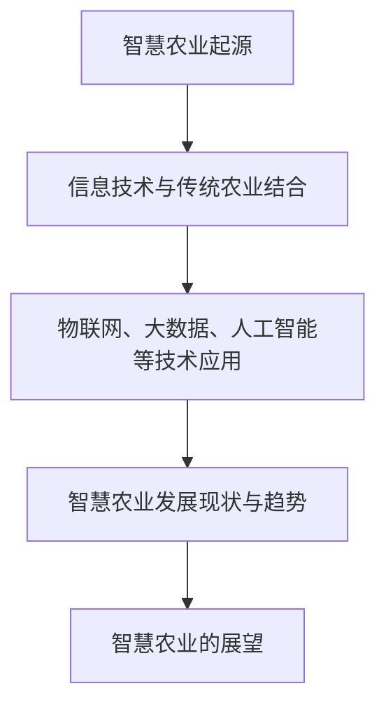
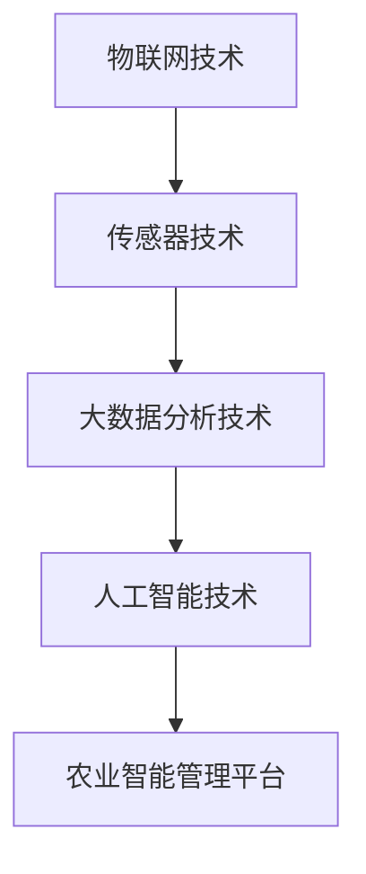
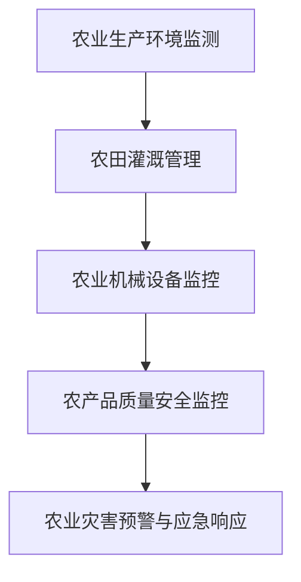
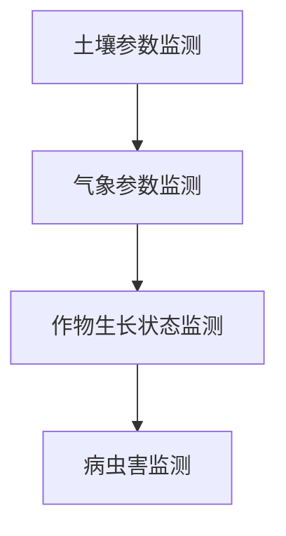
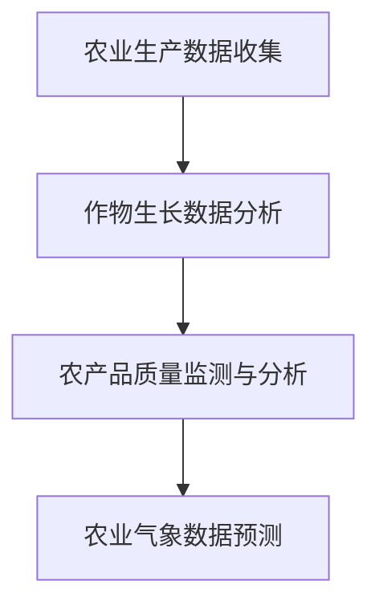
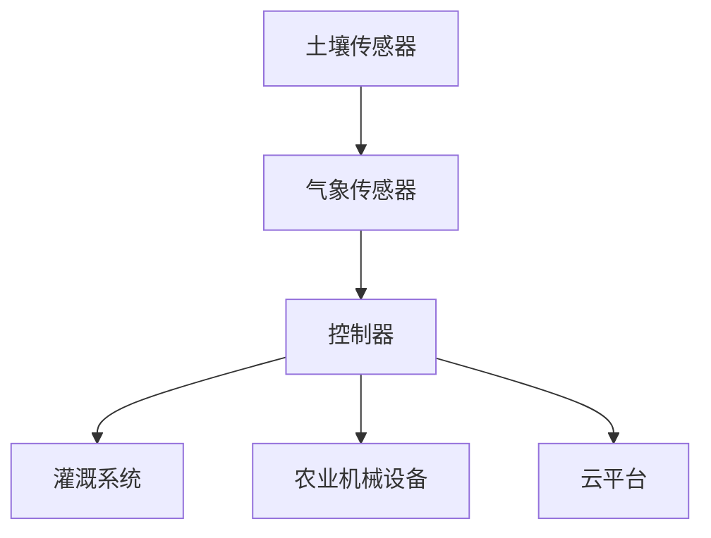
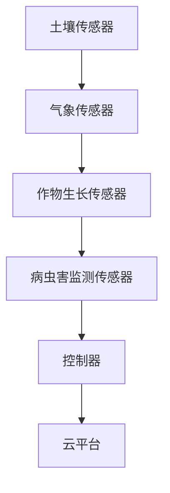
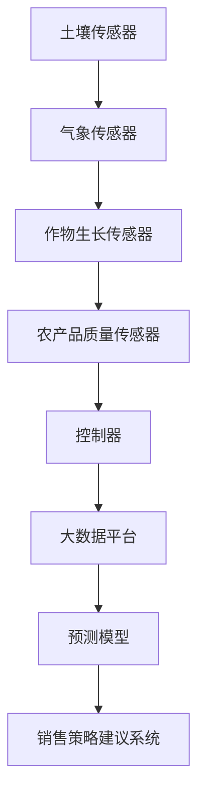

                 

# 2024美团智慧农业社招面试真题汇总及其解答

> **关键词**：智慧农业、社招面试、真题汇总、解答

> **摘要**：本文旨在为准备参加2024年美团智慧农业社招面试的求职者提供一个详细的面试真题汇总及其解答。文章涵盖了智慧农业基础知识、物联网技术、传感器技术、大数据分析以及实际项目实战等多个方面，旨在帮助读者深入理解智慧农业的核心概念和关键技术，为面试做好准备。

----------------------------------------------------------------

## 第一部分：智慧农业基础知识

### 第1章：智慧农业概述

#### 1.1 智慧农业的定义与发展历程

智慧农业是利用信息技术、物联网、大数据、人工智能等现代科技手段，对农业生产过程进行智能化管理和服务的一种新型农业形态。它的发展历程可以追溯到20世纪90年代，随着信息技术的快速发展，智慧农业逐渐成为现代农业发展的重要方向。

#### Mermaid 流程图



#### 1.2 智慧农业的核心技术

智慧农业的核心技术包括物联网技术、传感器技术、大数据分析技术和人工智能技术。这些技术共同作用，实现了农业生产的自动化、智能化和精准化。

#### Mermaid 流程图



#### 1.3 智慧农业在农业现代化中的地位与作用

智慧农业在农业现代化中具有重要的地位和作用。它不仅提高了农业生产效率，降低了成本，还减少了环境污染，是实现农业现代化的重要手段。

#### 数学模型

$$
\text{农业现代化} = \text{传统农业} + \text{智慧农业}
$$

#### 举例说明

例如，智慧农业可以通过物联网技术实现农田土壤湿度和气象参数的实时监测，通过大数据分析技术预测作物的生长状况，通过人工智能技术优化农业生产的各个环节，从而提高农业生产效率。

### 第2章：物联网技术在智慧农业中的应用

#### 2.1 物联网技术的基本概念

物联网技术是通过互联网将各种信息传感设备与网络相连接，实现信息交换和通信的一种技术。在智慧农业中，物联网技术主要用于农业生产环境的实时监测和农业生产过程的自动化控制。

#### 伪代码

```python
# 定义物联网设备类
class IoTDevice:
    def __init__(self, name, type, data):
        self.name = name
        self.type = type
        self.data = data

    def send_data(self):
        # 发送数据到云平台
        print(f"{self.name} 发送数据：{self.data}")

# 创建物联网设备实例
device1 = IoTDevice("气象传感器", "temperature", 25)
device2 = IoTDevice("土壤传感器", "humidity", 60)

# 发送数据
device1.send_data()
device2.send_data()
```

#### 2.2 物联网技术在智慧农业中的应用场景

物联网技术在智慧农业中有广泛的应用场景，如农业生产环境监测、农田灌溉管理、农业机械设备监控、农产品质量安全监控和农业灾害预警与应急响应等。

#### Mermaid 流程图



#### 2.3 物联网技术在智慧农业中的关键技术

物联网技术在智慧农业中的关键技术包括传感器技术、通信技术和数据处理技术。传感器技术用于采集环境数据，通信技术用于数据传输，数据处理技术用于数据分析和应用。

#### 数学模型

$$
\text{物联网关键技术} = \text{传感器技术} + \text{通信技术} + \text{数据处理技术}
$$

#### 举例说明

以农田灌溉管理为例，物联网技术可以通过土壤湿度传感器实时监测土壤湿度，当湿度低于设定值时，自动开启灌溉系统，实现精准灌溉。

### 第3章：传感器技术在智慧农业中的应用

#### 3.1 传感器技术的基本概念

传感器技术是一种检测和测量物理量的技术，用于将物理信号转换为电信号。在智慧农业中，传感器技术主要用于监测土壤、气象、作物生长等参数。

#### 伪代码

```python
# 定义传感器类
class Sensor:
    def __init__(self, name, type, value):
        self.name = name
        self.type = type
        self.value = value

    def update_value(self, new_value):
        # 更新传感器值
        self.value = new_value

# 创建传感器实例
sensor1 = Sensor("温度传感器", "temperature", 25)
sensor2 = Sensor("湿度传感器", "humidity", 60)

# 更新传感器值
sensor1.update_value(30)
sensor2.update_value(70)
```

#### 3.2 传感器技术在智慧农业中的应用

传感器技术在智慧农业中的应用主要包括土壤参数监测、气象参数监测、作物生长状态监测和病虫害监测。

#### Mermaid 流程图



#### 3.3 传感器技术在智慧农业中的关键技术

传感器技术在智慧农业中的关键技术包括传感器材料、传感器信号处理和传感器校准技术。这些技术保证了传感器的准确性和可靠性。

#### 数学模型

$$
\text{传感器关键技术} = \text{传感器材料} + \text{传感器信号处理} + \text{传感器校准技术}
$$

#### 举例说明

以作物生长状态监测为例，传感器技术可以通过测量叶片颜色、叶绿素含量等参数，实时监测作物的生长状态，为农业生产提供科学依据。

### 第4章：大数据分析在智慧农业中的应用

#### 4.1 大数据分析的基本概念

大数据分析是指从大量数据中提取有价值信息的过程。在智慧农业中，大数据分析主要用于农业生产数据的收集、处理和分析，为农业生产提供科学依据。

#### 伪代码

```python
# 定义数据分析类
class DataAnalysis:
    def __init__(self, data):
        self.data = data

    def analyze(self):
        # 数据分析过程
        print(f"数据分析结果：{self.data}")

# 创建数据分析实例
data1 = [25, 30, 28, 26]
data2 = [60, 70, 65, 68]

# 进行数据分析
analyzer1 = DataAnalysis(data1)
analyzer2 = DataAnalysis(data2)

# 调用数据分析方法
analyzer1.analyze()
analyzer2.analyze()
```

#### 4.2 大数据分析在智慧农业中的应用场景

大数据分析在智慧农业中的应用场景主要包括农业生产数据收集、作物生长数据分析、农产品质量监测与分析、农业气象数据预测等。

#### Mermaid 流流程图



#### 4.3 大数据分析在智慧农业中的关键技术

大数据分析在智慧农业中的关键技术包括数据采集与传输、数据存储与管理、数据分析算法等。这些技术保证了大数据分析的有效性和准确性。

#### 数学模型

$$
\text{大数据分析关键技术} = \text{数据采集与传输} + \text{数据存储与管理} + \text{数据分析算法}
$$

#### 举例说明

以农产品质量监测与分析为例，大数据分析技术可以通过收集农产品生长过程中的各类数据，分析农产品的质量，为农业生产提供科学指导。

## 第二部分：智慧农业项目实战

### 第5章：基于物联网的智慧农业项目实战

#### 5.1 项目背景与需求分析

#### 项目背景

某农业园区需要实现农业生产环境的实时监测与控制，提高农业生产效率。

#### 需求分析

1. 监测农田土壤湿度、温度、光照等参数。
2. 实现自动灌溉系统。
3. 实时监控农业机械设备运行状态。
4. 构建农业灾害预警系统。

### 5.2 项目架构设计与实现

#### Mermaid 流程图



#### 实现细节

1. 土壤传感器、气象传感器采集数据，通过控制器传输到云平台。
2. 控制器根据云平台的数据分析结果，自动控制灌溉系统和农业机械设备。
3. 云平台实时监控农业生产环境，并提供农业灾害预警。

### 5.3 项目运行效果与分析

#### 运行效果

1. 实现了农田土壤湿度、温度、光照等参数的实时监测。
2. 灌溉系统根据实时数据自动调节，提高了水资源利用效率。
3. 农业机械设备运行状态实时监控，减少了设备故障率。
4. 农业灾害预警系统提高了农业生产的抗风险能力。

#### 分析总结

通过物联网技术，实现了农业生产环境的实时监测与控制，提高了农业生产效率，降低了生产成本。

### 第6章：基于传感器的智慧农业项目实战

#### 6.1 项目背景与需求分析

#### 项目背景

某农业企业需要实现作物生长状态的实时监测与病虫害预警。

#### 需求分析

1. 监测土壤湿度、温度、光照等参数。
2. 监测作物生长状态，如叶片颜色、叶绿素含量等。
3. 监测病虫害发生情况。
4. 构建作物生长状态与病虫害预警模型。

### 6.2 项目架构设计与实现

#### Mermaid 流程图



#### 实现细节

1. 土壤传感器、气象传感器、作物生长传感器、病虫害监测传感器采集数据，通过控制器传输到云平台。
2. 控制器根据云平台的数据分析结果，调整农业生产措施。
3. 云平台实时监控作物生长状态，并提供病虫害预警。

### 6.3 项目运行效果与分析

#### 运行效果

1. 实现了土壤湿度、温度、光照等参数的实时监测。
2. 实现了作物生长状态的实时监测，提供了科学种植指导。
3. 实现了病虫害的实时监测与预警，降低了病虫害发生风险。

#### 分析总结

通过传感器技术，实现了作物生长状态的实时监测与病虫害预警，提高了农业生产效率和产品质量。

### 第7章：基于大数据的智慧农业项目实战

#### 7.1 项目背景与需求分析

#### 项目背景

某农业企业需要实现农产品质量监测与销售预测。

#### 需求分析

1. 监测农产品生长过程中的各类数据。
2. 分析农产品质量。
3. 预测农产品销售量。
4. 提供农产品销售策略建议。

### 7.2 项目架构设计与实现

#### Mermaid 流程图



#### 实现细节

1. 土壤传感器、气象传感器、作物生长传感器、农产品质量传感器采集数据，通过控制器传输到大数据平台。
2. 大数据平台对数据进行处理和分析，生成农产品质量分析报告。
3. 预测模型根据历史数据，预测农产品销售量。
4. 销售策略建议系统根据预测结果，提供农产品销售策略建议。

### 7.3 项目运行效果与分析

#### 运行效果

1. 实现了农产品质量监测，提高了农产品品质。
2. 实现了农产品销售量预测，提高了销售计划准确性。
3. 提供了科学合理的销售策略建议，提高了农产品销售效益。

#### 分析总结

通过大数据分析，实现了农产品质量监测与销售预测，提高了农业生产和销售效率。

## 第8章：综合案例分析

### 8.1 案例一：某地区智慧农业综合示范区建设

#### 案例背景

某地区政府为推动智慧农业发展，建设了一个智慧农业综合示范区。

#### 案例内容

1. 构建了物联网感知体系，实现农业生产环境的实时监测。
2. 建立了大数据分析平台，对农业生产数据进行处理和分析。
3. 推广了农业物联网技术，提高了农业生产效率。
4. 实现了农产品质量监测与销售预测，提高了农产品市场竞争力。

#### 案例分析

通过智慧农业综合示范区建设，实现了农业生产智能化、精细化，提高了农业生产效率和质量，推动了农业现代化发展。

### 8.2 案例二：某企业智慧农业项目实施

#### 案例背景

某农业企业为提高农业生产效率，实施了智慧农业项目。

#### 案例内容

1. 建立了农业生产环境监测系统，实现了农田土壤、气象等数据的实时监测。
2. 实现了农业机械设备监控，提高了设备利用率。
3. 建立了农产品质量监测体系，提高了农产品品质。
4. 构建了农产品销售预测与销售策略建议系统，提高了销售效益。

#### 案例分析

通过智慧农业项目实施，企业实现了农业生产智能化、精细化管理，提高了农业生产效率和市场竞争力。

### 8.3 案例分析总结与启示

#### 案例总结

通过综合案例分析，可以看出智慧农业在提高农业生产效率、产品质量和市场竞争力方面具有显著优势。

#### 启示

1. 政府和企业应加大智慧农业投入，推动农业现代化发展。
2. 加强智慧农业技术研发，提高农业智能化水平。
3. 加大智慧农业宣传力度，提高农民对智慧农业的认知和应用。
4. 构建智慧农业产业链，实现农业产业协同发展。

## 附录一：智慧农业相关标准与规范

1. 《智慧农业技术指南》
2. 《物联网在农业中的应用标准》
3. 《农业大数据技术规范》
4. 《智慧农业气象服务规范》

## 附录二：智慧农业常用开发工具与资源

1. 物联网开发平台：阿里云物联网平台、腾讯云物联网平台
2. 传感器开发工具：Arduino、Raspberry Pi
3. 大数据分析工具：Hadoop、Spark
4. 人工智能开发框架：TensorFlow、PyTorch
5. 开源农业数据集：Kaggle农业数据集、Google Dataset Search

### 作者信息

**作者：AI天才研究院/AI Genius Institute & 禅与计算机程序设计艺术 /Zen And The Art of Computer Programming**

